# B站最全网络安全教程，整整1300集，全程干货无废话，别再盲目自学了，看完学不会我退出网安圈！（web安全｜渗透测试｜内网渗透｜CTF） - P85：84. 第三十四天：Metasploit Socks代理.mp4 - 网络安全官方教程 - BV15u4y137cQ

嗯。🎼Yeah。🎼，🎼这一首歌写给你听，希望你。😔，🎼不要忘记，都是我的真心真意。🎼完全为你。🎼好几年了。🎼还没忘掉你对我的关心，是否我该值得清醒？😔，🎼因为是你。🎼我一个人走过很多夜晚。

🎼我一个人看过很多辛苦。🎼这些年，因为有你我才觉得。🎼温暖。🎼只是你不知道我的存在。😔，🎼这一首歌像给。😔，🎼我想告诉你，我喜欢你。🎼好多好多的日子里。🎼我一直注视你，这首我唱给我听。

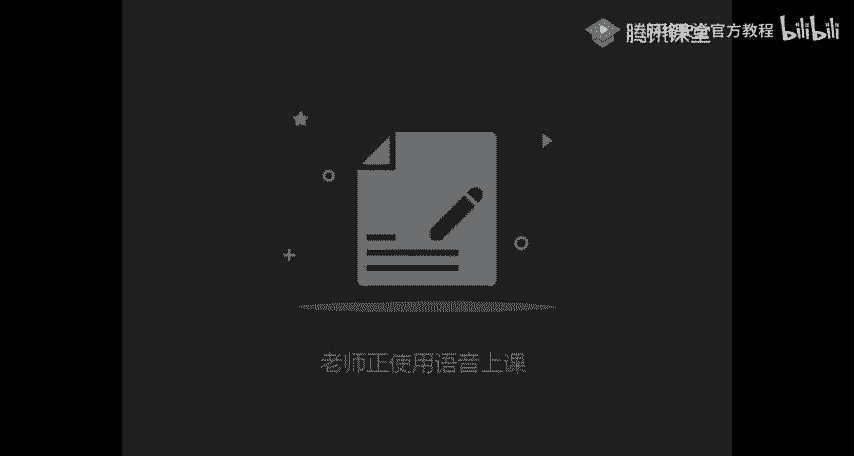

🎼代表我的心情。🎼那样爱你的心情，你是否有一点在意？😊。

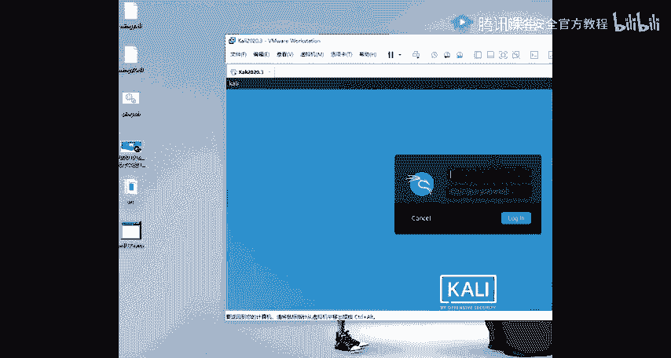

🎼这一首歌只给你听，希望你不要忘记，都是我的真心真意。😔，🎼完全为你好几年了。😔，🎼还没忘掉你对我的关心，是否我该值得清醒？😔，🎼因为是你。🎼有。🎼我一个人走。🎼很多夜晚。🎼我一个人看。🎼多心。

🎼这些年，因为有你我才觉得。🎼只是你不知道。🎼我的存。🎼这一首歌唱给。😔，🎼我想告诉你，我喜欢。🎼好多好的他。🎼子里。🎼我一直注视你这首歌我唱给我听。🎼代表我的心。🎼那样爱你。🎼心情你是否有一点在意？

🎼这一首歌唱给你听。🎼我想告诉你。🎼喜欢。🎼好多好多的。🎼是里。🎼我一直出现。🎼这首歌。🎼唱给我听。🎼代表我的心情。🎼这样爱你。🎼你是否有一点在意？😊，🎼这样爱你的心情，就请你。😔，🎼不要忘记。😔。

🎼Get up and grab your bags。 We'll catch your flight right out of here。

 I've got no plans and got no reason not to disappear。

 Let's leave our problems because I'm hyp for us to spend some time far far away no troubled minds。😔。

🎼I变为。🎼苏然配。🎼想 me lately。🎼I couldn't take it。🎼有怕的危险。🎼O下ur。😊，🎼把 the高温 crazy进。😊。

So let's dip into someit some。🎼I'm so down我 tough。🎼し。🎼Yeah。🎼For better some草。🎼。

🎼Lets say goodbye turn沧下的。🎼可能在下。

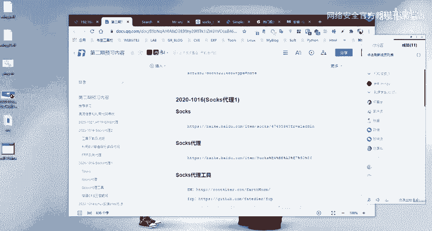

🎼嗯。🎼。

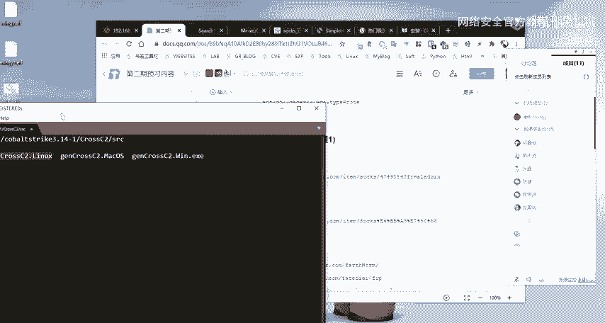

🎼I'm clueless， I still don't know what I really want in life， put that on hold， I don't care。

 I want to go outside。🎼In the light， I think my worries just went up in smoke。

 I found a way for me to cope。🎼那片为。🎼Sodent赔。🎼想你背里。🎼可在。🎼都怕的。🎼谁。🎼下去。🎼I will高很 crazy心。

So let's get in some at some。🎼I'm so done with outside。🎼，🎼我 get的都 some苍那的。🎼快乐长下。🎼看 it在在。🎼听了。🎼，🎼就。🎼So。

🎼The。🎼说的 with三参。🎼，🎼게深。🎼それちゃ。🎼在。🎼我。🎼Yeah。あ。🎼So。🎼不你的话。😊，🎼长大。🎼And right。🎼该错吗。😊，🎼咚咚。🎼及个的唱首是沙漠，坚持和放手。每天。😊。

🎼的怎梦。🎼掉的伤。🎼如果。找。嗯。呃，大家晚上。啊，能听到我声音，以及能看看到我屏幕的呃，同学的话，在讨论区扣个一，然后以及我的一个麦克风应该没有杂音吧。没有杂音对吧。嗯，好的。

应该是没有没有太大问题。那么呃现在已经8点钟了，我们正式开始我们今天的一个课程内容，好吧。Yeah。然，我们今天的话主要给大家就是介绍一下socks的一个代理。

然后的话会以一个就是一个靶场的一个实战来给大家演示。就是具体的我们如何去通过一个这样子的一个ss代理来去进行一个内网的一个穿透。其实我们呃这边的这个内容的话。

其实主要的话就是告诉大家内网穿透的一个一些方法。啊，我们在这边的话就是使用的是这样子的一个shop代理的一个方式来去进行一个内网穿透。然，本节课主要给大家介绍的就这3块内容。

第一块的话就是对ss代理的一个简介，就带大家一起来了解什么是shops代代理，以及我们为什么要去使用到这样子的一个socks的一个代理。然后第二个的话就是sox代理的一个工具，就是给大家大概的介绍一下。

就是说有哪一些socks代理的呃常用的一个工具。然后第三个的话就是s代理的一个呃实战。我们呃本节课话主要是通过MSSF。然后下一节课的话会给大家就是说在具体的去使用。

就是说在我们无法去使用MSF的一个情况下面，我们如何去通过其他的一个样的其他的这样子的一些代理工具来去进行一个呃内网的一个穿透。诶。然后的话我们正式开始我们今天的呃第一部分的一个内容。

就是说s代理的一个警戒。🤧嗯。啊，我这边的话把PPT先发给大家。诶。请把PT发PPT发给大家。不然的话呃等会的话又容易忘记。Okay。呃，本这段的1个PPT的话已经发到了群里。

大家可以就是呃打开我的1个PPT来跟我一起，就是来过一下今天的一个内容。然呃在这边的话，我们先来先来一起看一下什么是sock。呃，shop10的话它是一个网络的传输协议，主要的话是用于客户端。

还有外网服务器之间通讯的一个中间传递，也就是做一个这样子的一个呃。客户端以我们内网的这种客户端与我们的一个外网服务器之间的一个这样子的一个呃数据传输的一个通道。

然后的话我们在这边可以使用这样子的一个shops的一个协议。然，呃，根据我们的就是说大家应该网络的话应该有相应的一个基础，对吧？就关于网络的这样子的一个OSI的一个模型。

应该呃以及这个TCPIP的5层模型应该有一一定的一个了解，对吧？我们呃应该大部分都是学计算机专业的这一块的，对吧？然后的话呃根据我们这样子的一个模型啊，我们的一个shops的这一个绘画协议的话。

它是位于我们的一个表示层以及传输层之间，也就是在这边表示层以及传输层之间。它是一个绘画成的一个协议，要注意。然后的话呃我们再去使用TCP的一个协议传输数据。要注意的话。

就是说我们的一个ss的一个呃协议的话，它是呃使用的是一个TSP的一个协议去传传输我们的一个数据。然后在这边呃特意提的这一点的话，就是说我们在这边要注意的一个地方，就是我们呃不提供。

就说socks它是不提供去传递这种SMP信息类的这种呃网络层网关的一个服务。我们知道SMP的话，就是我们常用的一个P就我们的一个P命令的话。

我们通过P命令来去发现呃来去通过发送这样子的SMP的这种数据包来去呃探测主机的一个存活，对吧？然的话在我们的一个我们可以通过这边的这个图能够看到对吧？我们的一个SMP的一个协议的话。

它是处于一个网络层的。而我们的一个ss的一个传输的一个协议的话，它是处于一个绘画时。它是通过TCPIP的一个协议去传输数据。因此的话它是不支持去传递我们的这样子的1个SMP的这样子的一一些数据的。

所以的话我们的一个ss。它是就是说我们在后面去使用我们的一个s索通道的时候，我们无法去使用这样子的一个拼命来去呃通过s索通道来去呃探测呃内网的其他的一个主机的一个存统。这边的话要给大家要注意一下。

好的话呃。这边的话就是给大家介绍一下我们为什么要去使用这样子的一个shops的一个通道。就说我们使用这个ss通道有什么样子的一个优势。就是说在现金的这样子的一个网络架构的话。

我们通常的话就是说内部网络与外部网络中间的话会有相应的一个呃阻隔阻隔离，对吧？我们通常会会使用呃防火墙等等的这种这样子的一些设备，把我们的一个内网与外网之间做一个隔离，对吧？就是说不让外部的一个网络。

能够去直接的去访问到内部网络，对吧？以及去限制内部网络呃，去访问外部网络的相应的这样子的一些呃呃方法协议。所以的话呃我们再去。呃，我们再去。内网与外部网络之间去进行这样子的一个通信的时候。

它会有这样子的一个呃阻碍，对吧？然后的话这样子的一个防火墙系统的话，它通常是以这样子的一个应用层的一个网关形式去工作在我们的一个网络中间。

它可以去对我们的这样子的一个tnetFTP还有SMTP等等这样子的一些呃呃访问这样子的一些协议的一个访问的话，能够去做一些控制，对吧？而我们的一个收死的一说使的话，就提供了这样子的一个框架。

来使我们这边去受限制的这样子的一些协议的话，我们可以通过我们的一个收死通道来去呃安全的透明的去穿过我们的一个防火墙。然呃。下面的话就是介绍一下什么是shop代。呃，在这边的话，我列了这样子的一个。嗯。

嗯。我列在这边的话，我列举了就是说sox4以及sox5这两个版本，它的一些特点以及它的一个啊一些区别。就主要的话就是让大家去了了解，就是说shops协议它的一个一些特性。然后的话呃。

这边我们一起来看一下。被代理端与代理服务器的话，通过我们的一个sox4sox5代理协议去进行这样的一个通讯。然后呃s4的话，它是对HTP的一个代理协议的一个加强。就它不仅仅它不仅代理HDP协议。

它会对所有的这种向外的一个连接去进行一个代理。它没有一个协议的协议的一个性质。嗯。然呃ss5的话，它是对呃s4的话，这一个版本做了一个扩展，就增加了我们能够去支持UDP的一个代理，还有身份验证。

Yeah。然后shop呃shop5的话，它采用了一个这样子的一个地址解析方案，能够去支持域名啊，还有我们的1个IPV6地址的一个解析。这边的话就是带大家大概的了解一下。

然后呃在这边的话我们还要注意的一个的话，就是我们在去使用ss代表的时候，需要有下面的需要去了解下面的这三点。第一点的话就是s服务器的1个IP地址。也就是说我们的一个客户端。

我们就是说我们要去通过我们的一个这样子的一个代理去呃去呃。就说我们的一个被代理端与我们的一个代理服务器，我们想要去建立这样子的一个收索通道，对吧？然后的话建立收索通道之后的话。

我们想要在代理在我们的一个客户端，通过这样子的一个代理服务器。也就是通过建立的收索通道来去进行一个呃访问呃另外的这样子的一个呃网络的话，我们需要去知道这样子的一个代理服务器的1个IP地址。

以及它的一个端口。然后呃一般的话就是呃一般的代理服务器的一个端口的话是1080。就是呃如果你不去做特业的一个设置的话，就是1080的一个端口。然后第三点的话就是ss服务的话。

你需要去确定它是否需要去进行这样子的一个身份验证。就我们呃在这边的话有提到就是ss5的话，它增加这样子的一个身份验证功能。也就是说你需要去呃，有有一个这样子的一个账号密码。

你才能够去通过这样子的一个ss通道来去进行一个呃。数据的一个传输以及访问。然后呃第二部分内容的话就是介绍一下说指代理的相关的一些工具。呃，这边的话。

首先第一个就是这一个S wormS worm这一个工具的话呃是一个比较老就比较老的一个工具啊。但是这个工具的话，它它的一个使用的话还是呃它的一个功能什么的，是呃。挺强大的一个呃工具。

然后的话它是一个并携式的一个网络穿透工具啊，它的一个主要作用其实就是呃去进行一个内网穿透。然后它具有sox5的一个服务器的一个架设，还有端口转发。

也就是说我们可以通过这1个EW工具来去进行一个呃建立sox55的一个服务器，以及能够去建立sox5的一个呃代理的一个通道。还有的话能够通过这样个这样子的1个EW来去进行一个端口的一个转发。呃。

这边的话就是它的一个官网的话，是这一个大家自己去看一下。然后呃这个的话下载的话是。

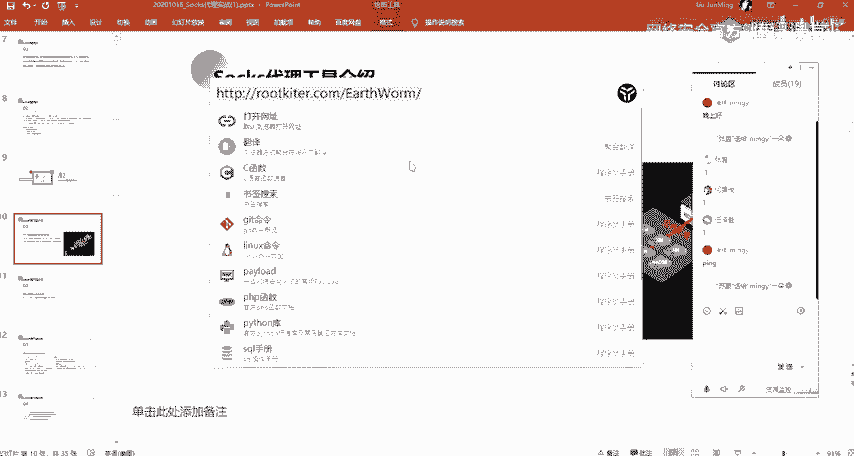

在这边的话，他是已经没有提供下载了呀。

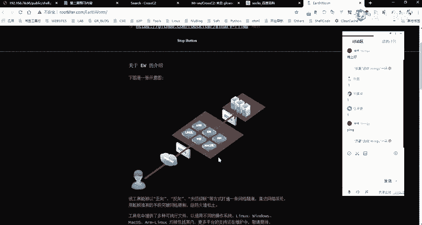

已经停止更新了。然后的话呃在那个工具包当中应该是有的。就发给大家的那个工具吧。如果呃没有的话，大家。呃，找我要吧，就在群里说一下，我发发出来。或者大家可以自己去网上去找一下。

啊呃第二个的话就是这个FRP。FRP的话，它是一个用于内网创造的一个高性的个反向代理应用。然后我们下节课的话会给大家去介绍，就是说我们在在不去使用呀MSF。或者说MSF的一个使用的话，不太适用的时候。

我们给大家介绍，就是说用FRP，还有像EW等等的这样子的一些代理的一个内网穿透的一个工具来去进行一个内网的一个呃穿透。呃，然后的话这一个工具的话是呃我个人是比较喜欢使用的。

然后的话它的一个功能配置什么的也是比较好用啊。🤧然后的话呃第三个的话就是这个clo chance。cro chance的话呃，大家在那个con里面的话，应该有去使用过吧。

然后这一个工具的话也是我们经常去使用到的。以及其实我们呃就我们在linux系统里面啊，我也会通常会去使用这样子的一个pro chance来去做这样子的一个代理。就是说比如说我这边对吧？

我这边的这一个linux机器。我这边的一个看里机器。我想要去就是说我想要，因为我现在的话是在呃国内对吧？我想要去访问国外的一个网站，那么你想要去访问国外的一个网站的话，你就需要做一个代理，对吧？

你需要有你自己的一个呃这样子的一个。

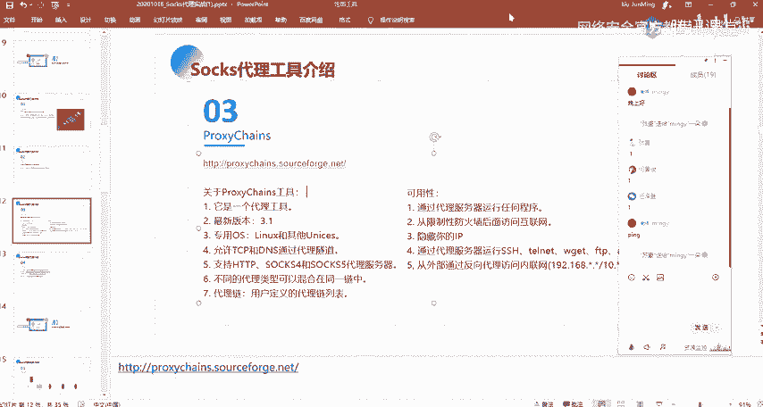

就是VPN。然后的话你想要你要去做做这样子的一个一个代理的话，我们就通常的话会去使用这样子的一些呃就是这样子的一些工具，对吧？就这样子的一些工具。然后这里的这样子的，我在这边的话是使用的是一个SSR呀。

然后的话呃如果大家也是跟我使用使用的一杆呃，使用的是同样的的话，你可以在这边去做这样子的一个配置。就是你右键那个小飞机嘛，然后有一个选项设置，比就这里，然后勾选这一个允许来自局域网的一个连接。

然后改一个代理的一个端口。我这的话是10800，对吧？然后的话我在这边我是无法去直接的去，比如说我去访问一个。谷歌是吧。我这边是去访问的话，是无法直接去访问到。然。

呃我在这边的话就可以通过配置这样子的一个pro change。配置这样子的一个代理。然后呃我配置这边的一个代理的话就是这样子啊。首先的话是so5。然后的话如果说你是使用的是一个so4的话。

你就是写这样子的个so4对吧？然后的话中间的话就是你的一个代理服务器的1个IP。然后在这边的话就是你的一个端口。我在这边的话，因为呃。看一下。我在这边的话。

因为是我在我当前的这个windows机器上面对吧？然后呃我的这个windows机器的话，我的一个本地IP看一下。

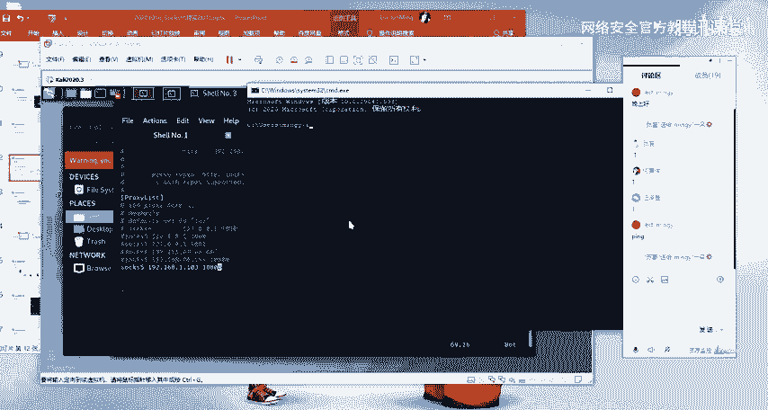

是这个192。168。78。114。呃，账号密码的话。账号密码的话是呃对，就说在这边的话，在这边就是说在MMSF当中的话，是没有支持这样子的一个账号密码的一个配置。

在这个pro呃pro change应该也是不支持的吧，我看一下。应该是不支持的。然后如果说你是要去使用这样子的一个，你需要去账号密码的一个配置的话，我在这边的话就windows上面的话。

我推荐给大家一个这样子的一个工具。就是其实我在这边有给啊，这边就这一个一个全局代理的一个工具。

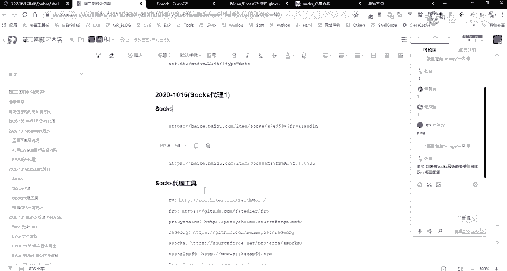

然呃其实等会儿也会去用到这一个，就是说我去代理我自己本地的这样子的一个一些，比如说远程桌面，对吧？MSTSC以及呃其他的这样子的一些工具。我条房啊。就是这一个就在运行内容这边有给啊。

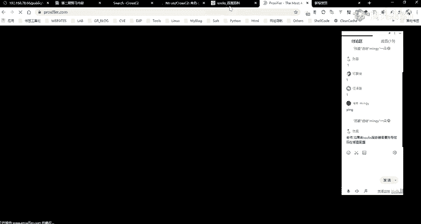

啊，等会的会给大家介绍会去使用这个，就是在这边的话呃去做一个相应的一个配置。我们可以把我们自己应用自己本机上面的一个应用程序，把它给就是放入到这样子的一个代理工具当中。

然后的话我们在使用这样的一个代理工具的时候，我们的一个流量的话，它是会走我们所配置的一个呃通道。

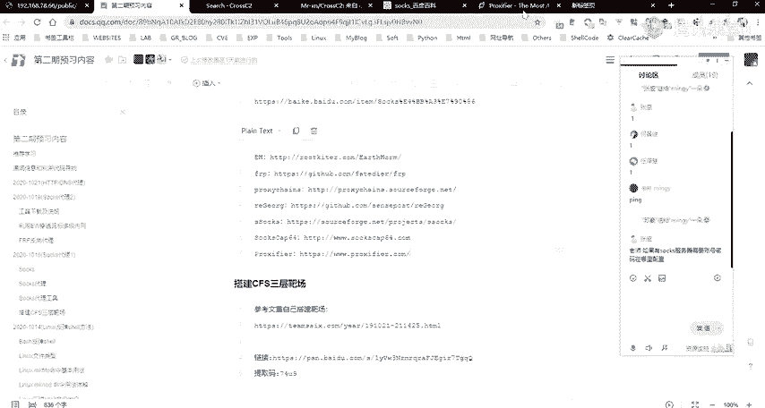

呃，我这边的话是。差点。然后的话我再通过这个close change这一个工具。我们先去请求一下这样子结个，我给你看。嗯。嗯。嗯。😊，780144。哦。不好意思，我说怎么不行，这里我这里IP设错了呀。

可以，各位同学。看的相当认真啊，比我的看的认真。啊，现在的话没有问题啊，就是我们可以看到在这边的话已经连接了，对吧？就是在这边看到这些OK的话，就说明已经连接成功了啊。

然后像在上面这边time帽太帽的话，就你需要去检查一下，就你要去检查一下你的一个代理的一个配置。就是。你说的是这个吗？系啊。啊，这里啊。那应该就是可以的，就在后面直接加账号密码。应该可以啊。Yes。

Okay。啊，那可以啊，就直接在你的一个端口号后面加你的一个账号密码。但的话呃，我没有我没有试过我没有这样试过。一般的话呃我不会去设设一个这样子的一个密码。Yeah。然后是到哪来的？没有防尘道。

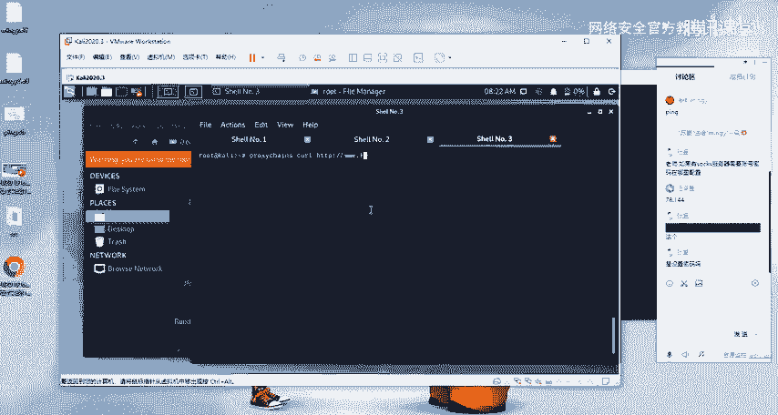

哦哦，现在的话是没有问题了，是吧？就你直接去CRL的话，它会有这样子1个301的一个跳转。就是他你直接去访问他这个域名，他会去跳转。然后它是跳转到了这一个，这边的话就说明我们是已经访问到。

然后的话是走的我这边的这样子的一个呃概念。嗯。这边它就是这一个pro change的一个工具的一个使用。然后我们之后的话会使使用这样子的一个工具，就是说用用pro change。

因为我们的一个count里里面，对吧？有很多的这样的一些工具。比如说你想要去把我们的1个M map。把我们的个map的一个工具，把它代理到我们的一个目标的一个内网当中去进行一个端口的一个扫描，对吧？

然后的话我们就需要用这个工具。好，让我们的m的这样子一个请求的一个流量走我们的一个代理通道。然呃还有的话就是其他的这样子的一些工具，像呃IEGOG这个的话在讲后面讲那个HPP代理的时候会给大家去讲。

以及还有这样子的两个就是说呃跟前面类似的一个s词代理的一个工具。这个的话是windows上面的一个s的一个全局代理工具，大家可以去使尝试使用一下。这个也是。好呃，以上两张的一个内容的话。

大家应该没有什么问题吧。哦，这里的话你可以去试一下，呃，看他的这样子的一个描述的话，应该是就是我刚刚说的，就是直接在那个端口上面接我们的一个接我们的一个账号密码。然后他这边是支持HDP的一个代理。

还有s4s15的一个代理的。呃，前面的一二章内容大家有没有什么问题，应该没有什么疑问吧。因前面的话就是一些理论的一个。介绍啊。好，没有问题话，那么我们继续第三章的一个内容。在这边的话就是这个第三部分呢。

就是我们今天主要的一个内容。我们主要的一个时间也是给大家就是讲解这边。也就是呃shop代理的一个实战，就是利用我们的1个MSF。然后首先的话来了解一下这样子的一个渗透场景。这边的一个这个渗透场景的话。

我这边是使用的，就是在运行内内容当中有给大家提供的这样子的一个靶场。这个CFS的一个三层靶场。呃，这个靶场的话是这边的这个作者插单就这个T6。呃，这个团队吧，他们搭的这样子的一个靶场。

然后呃我觉得他这个靶场的话就是用来讲这一个就是内网穿透的时候的话是比较好用的。然后的话也便于大家去进行一个理解。以及就是主其实主要的话就是它已经搭建好了，对吧？我只要去用就可以了。

就不用不需要我再去就是再去搭建这样子的一个环境，也便于大家自己去进行一个呃那个去搭建嘛，是吧？就不需要自己再去手动的去搭建。所以的话你直接去用它的这样子那个拔痕就可以了。

我们主要的话是用它来去就是呃理解我们这边的一个内网穿透。然呃关于这个靶场的一个详细的一个信息，大家可以去看他的就是这个作者他的这一个文档。然后其实他在这边的话就呃有介绍了他的一个环境搭建嘛。

以及怎么去进行一个攻击，对吧？在这边的话。

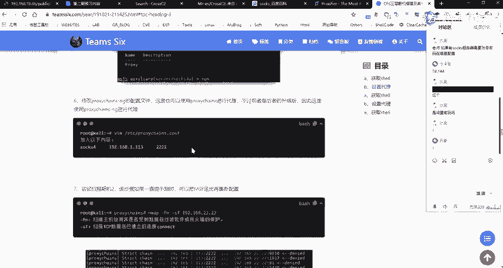

关于具体的一个攻击的话，呃，我我是这样计划的，就是具体的这样子的一个步骤的话，我在这节课上面会有讲大概的，就是我只会去大家可以去大家看我的一个操作，对吧？然后的话我要大概的过一下。

然后的话再把在我讲完之后的话，大家把这个靶场作为自己的一个课后作业。

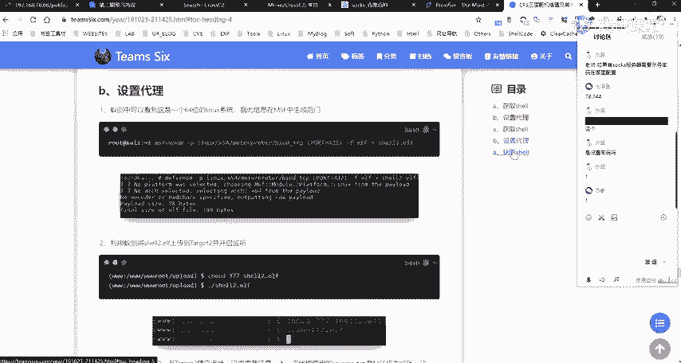

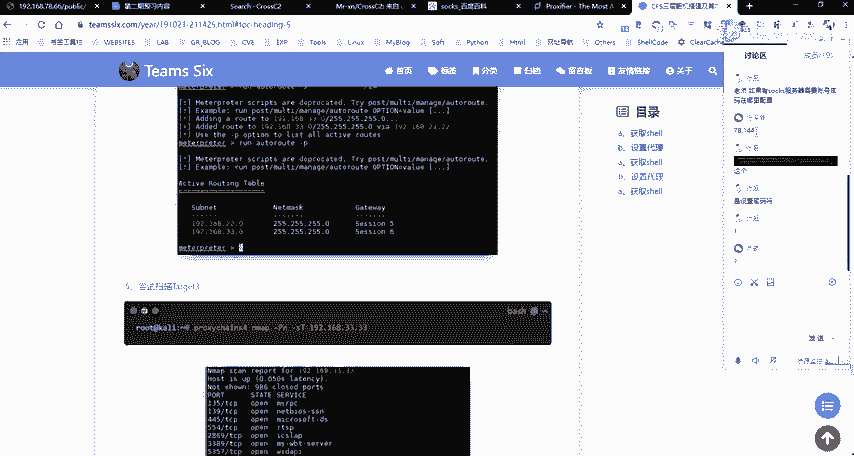

自己自己动手去呃走一遍，好吧，然后的话有问题问我，就是你需要你需要你自己去进行一个尝试，你可以就是照着他的这样子的一个方法。但是你。一定要自己去进行一个动手，好吧。

或者就是说你可以通过它这个靶伞去去尝试自己其他的这样子的一些利用的一个方法，对吧？然，呃我这边的话这个靶场的话是在我另外的这个机器上面，就是在这边的一个虚拟机。

嗯，就是这三个机器。首先的话呃这三个机器的话就是。这一个机器这个机的话就是作为我们的一个外网的一个机器啊，就是呃这个78。66在这边的话，因为在之后的运程当中会通经常会去用到这样子的。

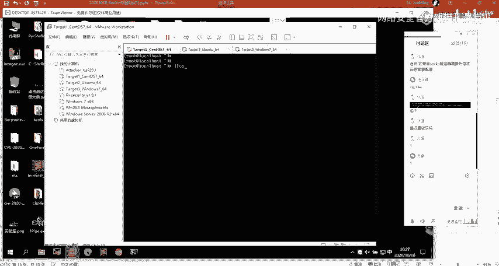

这样子的1个IP然后的话呃我们再来回过头来去看一下这样子的一个场景。呃，但的话这个场景这边的话。看一下。呃，首先的话我们先来看一下这边这边的这一部分，这边的这一部分的话呃。

就是表示我这边的一个atack的话就是我的一个攻击机器，对吧？然后的话我这边的一个攻击机器的话，呃，这边有1个VPS这个VPS的话就是我自己的1个VPS是吧？然后的话我们已知一个公网的一个目标。

就是我这边的一个。78。66当然的话我这边的话是一个内网的1个IP啊，因为我这边是在内网嘛，是吧？就是你把它当成是一个公网的1个IP就说公网IP它有它的一个就是特性的话。

大家应该就是大家再去理解这样这样子的一个公网IP内网IP的时候，你就。呃，以及再去配这样子的一个靶场的时候，是吧？就我们的一个公网IP只要就是说我们是在不管是在内网还是在公网。

我们都能够去访问到这1个IP对吧？你要这样子去理解。然后在这边的话，我们把这1个IP作为1个公网的1个IP，也就是我这边的一个攻击机器，以及我这边的1个VPS都是能够去访问到的。呃，当然的话在这边其实。

U。就实际的话，在我这边的话是没有用到这个VPS。就是如果说你要去进行一个呃攻击外网的这样子的1个IP的话，你是需要1个VPS做一个中转。因为你的一个攻击机器攻击机器是在你的一个内网，对吧？

然后的话如果说你想要去反弹sha要的话，你除非是做这样子的一个就是说做你的攻击机与与你的1个VPS做这样子的一个呃内网的一个穿透。也就是把呃反常的一个share。

通过我们的一个公网的一个VPS来就是带理到你的一个呃内在内网的这个机器上面的呃。比如说MSF的某一个端口上面去，对吧？然后的话我们才能够去实现这样子一个反弹性。然的话这样子的话就呃稍微显得有点就是复杂。

然后其实我们就只需要就是有1个VPS对吧？然后的话如果说你要用MSF的话，你在VPS上面去装一个公网的1个VPS的话，这样子的话会显得简单一些，就是你的一个操作，以及你去理解这样子的一个操作的话。

会比较简单一些。当然的话如果你没有就是说你不想在公网VPS上面去搭。然后的话你对这样子的一些操作熟悉的话，那么你可以直接在你的一个就是说在你的一个内网，你只需要有一个公网EPS就可以了。

你可以在你的一个内网的一个看理机器上面，对吧？就你直接用你的一个内网的看理机器做作为一个呃接受线的一个。

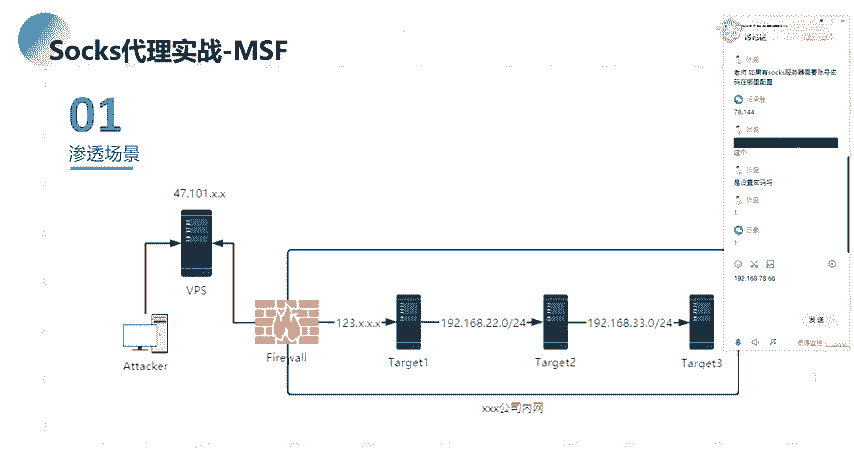

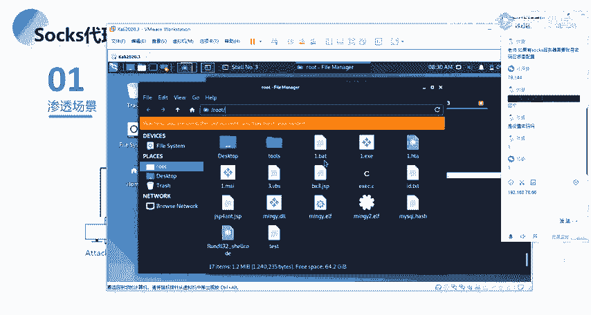

呃，机器。然后的话就是在这边这一边的话就是某某公司的一个内网。然后这个内网的话有这样子的三台机器，也就是我们的一个t卡的123这样子的三台机器。然后我就我们知道的话就是我们那个公网跟我们的呃这边的话。

其实应该这边这个图有点问题啊。就是我这边的话，其实这个防火墙应该是在就是说在我们的一个公网跟我们的内网之间，对吧？也就是我们在前面也有讲的，像这种DMZ区域的话，就是说我们的一个公网的1个VPM。

我们公网的一个服务器，就是。这一个公司它的面向外网的这样子的一些服务的话，它会处在这个区域。然后在这个区域的话，是我们就是说它在呃是我们在外网能够去直接访问到的，以及在内网的话。

也能够去访问到这样子的一个机器。然后呃这边的一个tagt一的话，就是我们这边的这一个IP所对应的一个机器啊，也是对应的这样子的，有有一个外网的1个IP。然后tag一tag2之间的话是1个22的一个网段。

以及呃33的一个网段，也就是在这边的话有这样子的12两层的一个网段，是吧？两层的一个内网网段。然呃在这边的话就是这样子的一个场景啊。

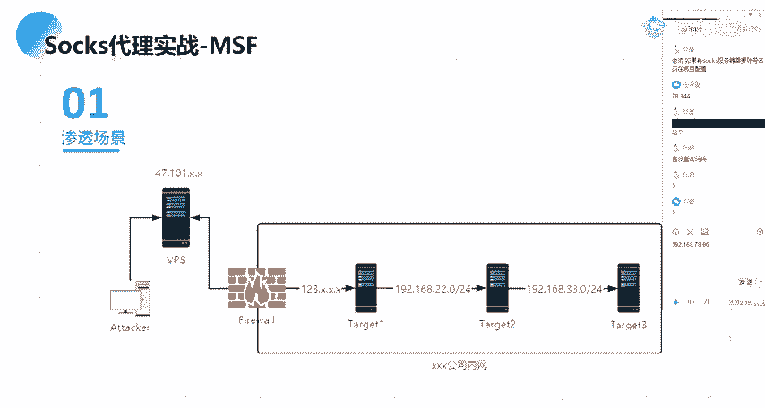

Okay。就是对应的一个机器的话是。

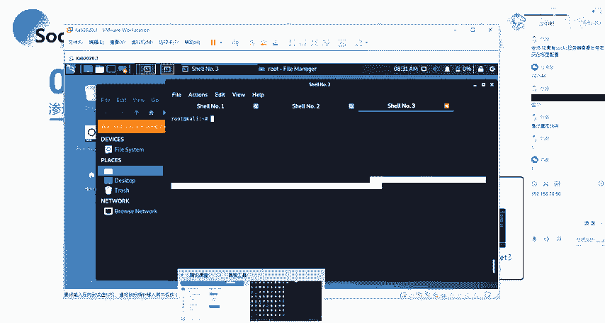

这边就他给的话，这边的话就是呃你把它当成是一个外网的一个外b服务，对吧？或者说外网的一个呃服服务器。然后这边的这两个机器的话就是它是处于一个内网。然后我们要做的话就是通过寻找这一个外网的这个外网呃。

这一个服务器的一个漏洞，对吧？通过拿下这一个外网的这个机器，然后的话拿下这个机器之后的话，我们以这一个机器作为一个跳板，就作为一个中转，作为一个跳板机。

然后的话通过这一个跳板机来去穿透来去攻击呃这一个内网的一些机器。

好，呃，这边的话就是场景的一个介绍。下面的话我们具体来看一下。

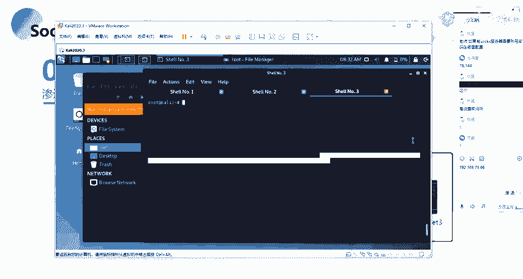

🤧呃，我这边的话PPT里面的话其实已经写的比较详细了呀，其实其实已经很详细的给大家介绍啊，呃在这边的话，就大家跟着我的一个思路走，好吧。然后首先的话我们就是说我这边已知了这样子的1个呃IP对吧？

我这边已知这样子的1个IP，然后我把这个IP给你，你要去对这个IP做一个渗透，做一个攻击的话，你首先第一步你会去干什么？就是说你首先想到的想到的第一步，你会去对这个IP干嘛。有同学回答一下吗？

就是呃我记得之前的话在讲那个信讲那个内网信息收集的时候，有同有同学问我就是。呃，就是在去内网信息去，我呃是我忘了是什么来着，就是。你得到了内网的一个得到的一个需，对吧？然后的话你知道他的1个IP。

那么你对这个IP你会去干嘛？然后其实在去做内网的一个信息收集的时候，跟外网的一个信息收集。它的一个思路其实大同小异啊。

对吧就是说你在内网的1个IP跟你在外网的1个IP你对这个IP你需要去收集的信息是什么呢？就是说首先第一个就是端口。就port嘛对吧？也就是port嘛。因为我们的一个端口的话。

大家呃能理解端口的这样子的一个概念吗？啊，我们有每一个计算机的话，有6556535。有这么多的一个端口，对吧？然后的话这一些端口的话，就是说每一个端口它你可以把它理解成就是一个门。就是理解成是一个门。

就是进入计算机的一个门。Yeah。然后的话每一个端口的话就是一个进入计算机的一个门。那么我们要如何去知道就是说我们要去知道怎么去进入这一个计算机来去访问这个计算机的话，我们需要去通过这样子的一些门。

对吧？也就是我们需要去知知道它有哪一些门，也就是对应的我们需要去知道它有哪一些端口。然后对应的每一个端口的话，每一个门后面的话，它都有相应的一个呃服务。然后每一个端口呃。

当然的话就是说如果你对应的一个端口，它开放了，那么它开放的这个端口，后面的话，它对应的会有一个服务的一个开放是吧？然后的话我们通过这样子的一个端口就能够去访问到对应的一个服务。

像比如说我们常见的一个80的一个端口，对吧？80的端口的话，它默认的话是一个web的一个服务。也就是我们通过呃访问web端口啊，不访问8年的这个端口的话，我们就能够去访问到这个web服务。

然后呃大家可能会就是大家应该都知道的吧，就我们的一个浏览器的话，它就是呃默认的话，你去访问。比如说你去访问1个IP你没有加这样子的一个8连端口，它同就是说它默认的话，它是把它就是。

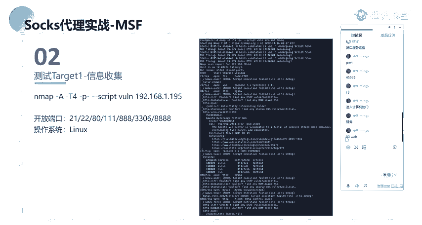

我这边的话以这1个IP为例吧。就比如说我这边去。访问这个。呃，因对这个IP对吧？然后这个IP的话，我们直接去访问这个IP，我们后面没有接端口号的话，它默认的话就是我们的1个8年端8年的一个端口。

这边的话大家应该都知道，然后这边的这一个端口的话，其实它对应的就是一个外表服务嘛，对吧？就默认的一个外表服务。当然的话还有像像其他的，像比如说我们的tonca的话，就是默认的是8080嘛，对吧？

然后我们如果说这一个机器它对应的开放了一个tomcat，然后它的一个端口的话是8080。那么我们去访问这一个tca的一个服务的话，我们就需要通过IP加这样子的一个端口来去进一个访问。嗯对吧。

所以的话我们知道这个IP，那么我们需要去知道它这个呃服务器上面它所对应的开放了哪一些服务。那么我们首先就去就需要知道它开放了哪一些端口，对？

然后的话我们再通过这一些开放的一个端口来去找到它对应的一个服务。然后我们要去进行利用的一个点，其实就是根据它的开放的这一些服务。像比如说我们的一个外b服务是吧？我们的一个外表服务的话。

也就是我们的一个webweb服务的一个漏洞的一个挖掘，是吧？然后还有的话就是像其他的像呃比如说你的一个linkux机器2223C取对吧？21FTP还有3306等等的这样子的一些端口。啊，在这边的话。

关于这一些端口，它所对应的一个默认服务呃。有一个我忘了是哪一个来着一个。端口。哎，是有一个是战斗之家还是哪个网站来着？不错了。Yeah。嗯。呃，看一下我这边吧。这边的话呃有这样子的一个表啊。

这个表的话就是我们常见的这样子的一个端口，以及它所对应的一个服务。然后像比如说我们53就常见这种53端口，它所对应的一个呃服务的话就是我们的1个DNS也就是我们就一般的话我们对吧？我们的一个机器。

我们想要去访问访问域名的话，我们都需要有1个DNS对吧？也就是说呃。都需要去访问我们的1个DNS的一个服务器。然后的话还有的话就是80HTB等等。还有其他的这样子的一些端口。

在这的话我们可以去可以通过这样子的一个表去做进行一个进行一个紧锁，对吧？然后的话我们就。呃，这边的话就是我们针对常见的我们这边的常见的这种端口号对吧，以及它对应的一个服务。

我们可以去就是说有相有针对性的这样子的一个攻击的一个入侵的一个方式。在这边的话有这样子的。一个表啊。像比如说我们那1个S2对吧？SSH取的一个远程连接，我们可以对它去进一个爆破，对吧？

以及还有openSSH取的一个漏洞。呃，然后的话还有就是像我们的呃。比如说呃3306对吧？3306的话就是数据库嘛，就包括注入，还有3389等等的这样子的一些像7001默认的呃，它是web logic。

那么我们这一个端口的话，我们就能够去访问这个端口的话，就能够去访问到对应的一个web logic的一个服务，对吧？然后的话去针对这一个web logic的一个服务去进行一个攻击，对吧？

还有其他的这样子的一些呃默认的一个端口号，以及它对应的一个路侵的一个方法。呃。

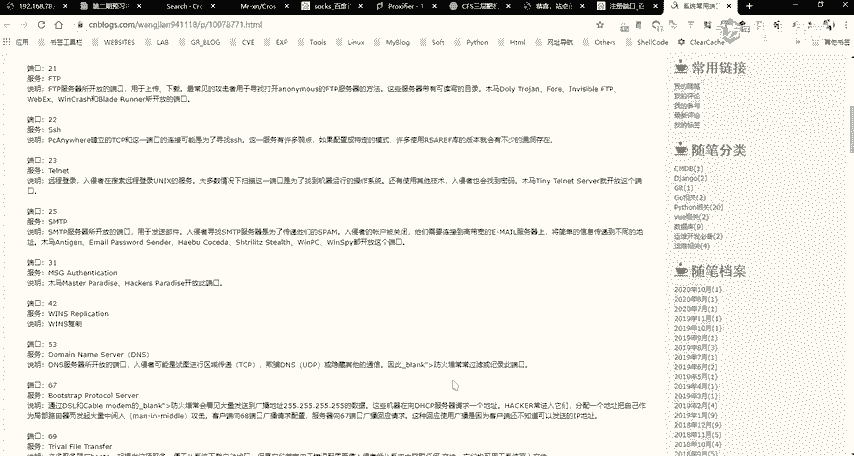

嗯。呃，这是第一个对吧？我们对它做一个端口的一个扫描啊，那么我们扫描端口的话，我们通常会去使用什么样的一个工具呢？啊吧？就我们通常是呃做这样子的一个端口扫描的话，一般会去使用C map，对吧？还有。

ms scale对吧？以及还有其他的很很多的这样子的一些端口扫描的一个工具。但的话呃最有名的就是这两个吧，应该应该是就是M map的话，就是它的一个这个这个工具的话，应该不用多说，前面应该也讲了，对吧？

而m scan的话也是一个专态扫描的一个工具，它的一个优点的话就是扫的特别快。然后Mm的话就是扫的特别详细。就通常的话我们会去结合这两个工具，就是首先的话用ms scan对吧？

就是通过快速的对目标的一个端口去做一个呃成活的或者说开放的一个扫描，对吧？然后的话再根据它开放的这样子的一些端口，用m来去做一个更详细的一个呃扫描。然后在这边的话，我们针对我们这边改变的这个IP对吧？

我们我这边的话使用了map，直接去对它做一个信息的一个收集。然后做一个信息收集的话，我这边使用的就是呃这样子的一个方法是吧？然后MF当中的话有自带的这样子的一个script。

也就是它的一个脚本呃有一个这样子一个歪软的一个脚本。这个脚本里面的话，它有自带的这样子的一些常见的就是说一些漏洞的一个检测的一个呃。呃，残见漏洞的一个检测，对吧？

然后我们可以去使用这样子的一个去使用这样子的一个脚本来去做一些基本漏洞的这样子的一个探测。当样的话探测出来的话，就是说这些漏洞可以看到在这边它有探出来探测出来像样这种variable，对吧？

其呃像这种的话，呃它的一个缺点的话就是比较老了，而且它的一个准确性的话没有什么保证啊。当然的话呃我们可以使用这样子的一个方式，就是能够去比较详细的去呃列出来它的一个端口号。

以及它所对应的这样子的一些服务，对吧？对主要的话用这个就是做一个突破的呃初步的一个探测嘛。B。啊，呃，在这边的话。

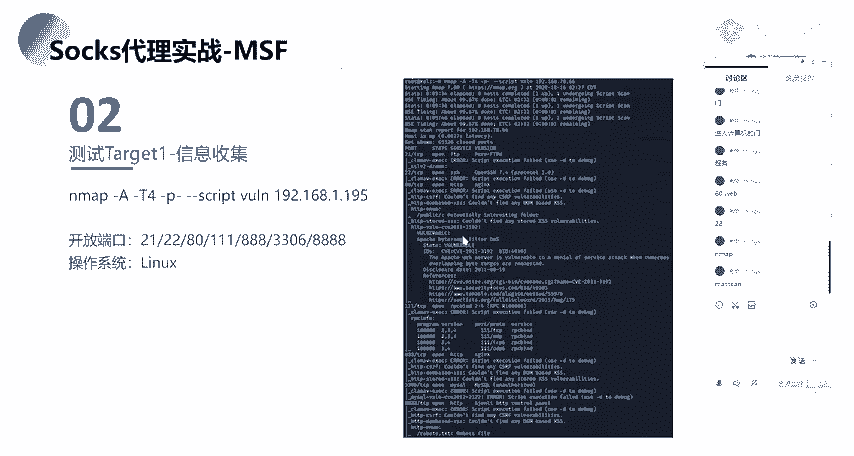

呃，在这块，因为我之前的话已经扫过了，而且扫这个的话可能会需要一点时间。因为我这边的话是少的一个全端口，就扫的是一个全端口。啊，我这边这个N map的这样子的一个语句。还要我跟大家介绍一下嘛。

就大概的说一下吧，就Map干A的话，就是就是比较一个综合的一个扫描，就干A的干大写的A呀，就它会显示就是呃对应开放的一个端口，以及它所呃开放的这样子的一些服务的一个比较详细的一个信息啊。

以及你的一个系统的一个版本啊什么的，对吧？就你的它要去探测你的一个OS。

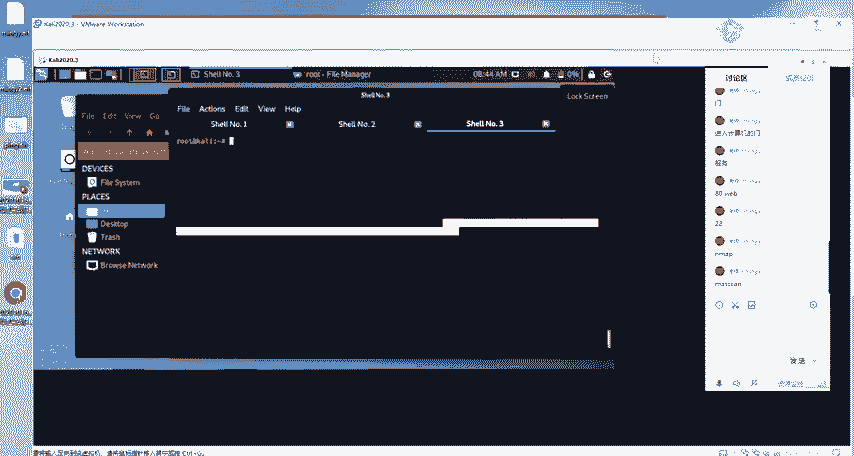

然后的话呃干T4的话就是干T的话就是呃时间训练，就我们这边的一个T选项的话，有1到5是1到5啊，我没记错了，1到5的这样子的一个梯度。然后就是你的一个数字越大的话。

你的一个就是爆破的一个就是你去进行一个探测的速度话就越快。当样的话你的一个速度越快的话，那么对应的一个准确准确准确性的话，那么就肯定会相应的一个降低，对吧？然后干P干的话就是扫表示扫描群端口。

扫描群端口是什么意思呢？也就是扫描1到65535的一个端口。就呃其实我看大家的话有在群里发发那个对吧？就是你去扫描端口的时候，你扫描端口的话，你没有去加这个杠P杠的话，那么你那么map它默认的话。

它是扫就是。呃，前1000个就是常见的一个端口。就少前1000个团队的一个端手。是1000个吧，1000还是1万1万1万个人。反正就是说你默认的话，它不会说去把所有的一个端口都做这都做这样子的一个探测。

它会取前前1000个就是常见的这样子的一个端口号去进行一个探测，是前100还是前一万，应该是1万吧。呃，这个的话。啊，好，不用纠结啊。然后盖 script的话就是指定我们的一个脚本。

我这边的话就是使用的这个官软的一个脚本，然后借我们的1个IP。然后在这边的话，我们就扫就通过在这边呃能够得到它得到这个IP它所对应的一个开放的一个端口，以及它的一个服务，对吧？

像比如说21FTP22的话SH也及它对应的这样子的一个服务的一个版本，对吧？还有80。8年的一个端口，以及在这边8年端口的话，我们可以看到他在这边有有进行这样子的一个枚举是吧？

有枚举出了这样子的一个目录。对。就我们在这边的话。对我们在这边直接去访问这个IP的1个8年端口。主要的话就是这样子，就是这样子的一个默认的就站点创建的一个页面，对吧？那么我们。得到这样子的一个页面。

没有其他的多余的一个东西。大家通常的话会去首先做的。大家通常会去就是做什么。有同学回答一下吗？呃，要不先休息一会吧，就50的时候我们再继续。好吧，然后的话呃大家思考一下这样子的一个问题，就是我这边对吧？

我这边知道了1个IP以及它这样子的一个页面，它是一个80端口已经开放了。然后的话这个页面的话，它没有多余的一个东西。那么我们如何去对这样子的一个80的一个端口的一个外表服务去做一个测试呢？好吧。

大家想一下，然后等会和我。

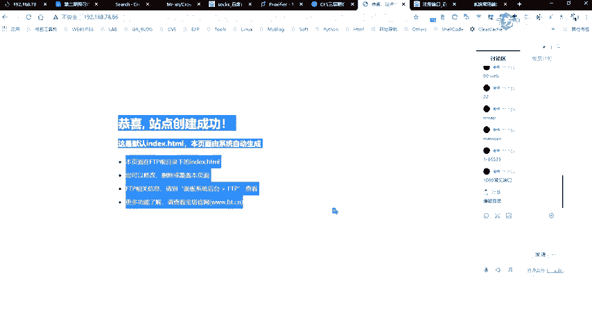