# B站最全网络安全教程，整整1300集，全程干货无废话，别再盲目自学了，看完学不会我退出网安圈！（web安全｜渗透测试｜内网渗透｜CTF） - P86：85.第三十五天：CobaltStrike Socks代理.mp4 - 网络安全官方教程 - BV15u4y137cQ

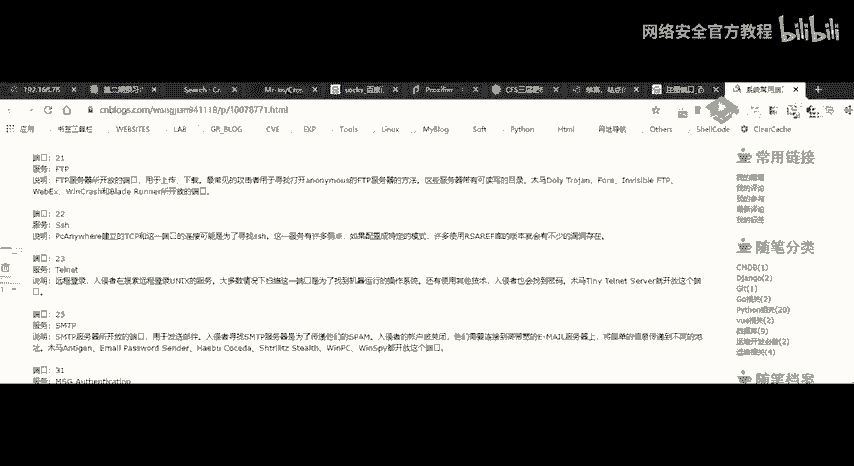

嗯。Yeah。啊呃，休息的时光总是短暂的。我们。正式开始我们今天的一个好吧，继续我们今天的一个内容。嗯。然，呃上节课的话有说到。

就是呃我们如何去在没有就是说在8联端口没有过多的一个信息供我们去进行一个测试的时候，我们如何去进行这样子的一个啊如何去对它做一个测试。呃，这位同学呃，就张胜同学的话说的挺对的。

就是我们首先想要的话就是去对他做的一个目录的一个包破，对吧？因为我们的我们知道我们的一个word表服务的话，它的一个它的一个这种就是目录的一个结构。它其实它是呃它是有相应的一个结构的目录结构的对吧？

然后的话如果我们其实当前访问的是一个空的这样子一个页面，其实它的一个文件的话是这样子的一个呃是那个什么。index点HTM。啊，访问的是这样子的一个页面。那么在当前的这一个目录下面，对吧？

在这个web跟目录下面的话，它是不是还有其他的一个页面，以及它是否还有其他的这样子的一些目录，对吧？然后这一些目录下面的话，它是否还有其他的这样子一些面页面，是吧？

那么我们就可以通过这样子的一个目录的一个包裹。去进行一个这样子的一个呃尝试。然，其实在这边的话，在这边我们MS呃我们的1个Mm的话，在这边有探测到这样子的一个public这样子的一个。这样子的一个目录。

啊，其实我们在这边就可以去进行一个访问，尝试访问，对吧？然后这个的话访问之后的话就得到了它是在这边有这样子的一个页面。这个页面的话其实就是访问的一个index的电影。KP的这样子一个页面啊，像这种的话。

大家一定就是说你可能你访问目录，访问目录对吧？后面没有其他的这样这样子一个东西。就是呃像我们的一个这样子的一个外表服务，它有这样子的一个默认的一个页面，像我们的一个index点HTM，对吧？

以及在这边是1个KP的KP的这样子的呃。PHP的这样子的一个语言的话，是吧？那么它会有这样子的一个默认的一个index跟PHP的这样子的一个页面啊。然后我们访问这个页面的话，就得到了这样子的一个信息。

在这边它是一个thinkPPB5的这样子的一个呃框架，对吧？啊，我们再回过头来看一下PPT。呃，在这边的话，我们通过MM对吧？对它对我们这边给您的这1个IP做了一个基本的一个信息收集。

就是探测它的一个端口的一个存活啊，以及它所对应的一个服务。那么我们下一步要做的话，就是针对这样子的一些端口，对吧？我们去对它进行一个分析的一个利用。然后像比如我们前面探测到2122号的这种端口，对吧？

我刚刚的这样子的一个这样子的一个表，对吧？

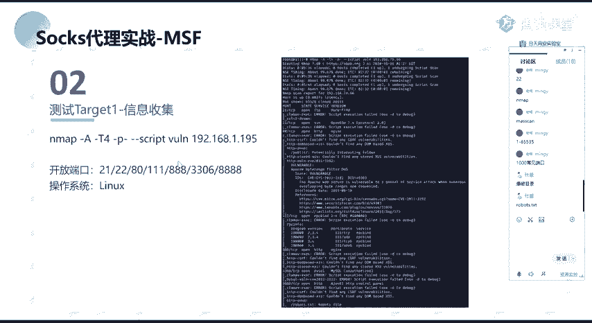

我们可以看到就2122端口就常见了这样子的一个入侵方式，就对就包括。并。然后还有当然的话还有就是对应的，像比如说SI端口的话，像这种openSSH的一个这样子的一个漏洞，对吧？就是这样子的对应端口。

它所特定的这种服务的一个漏斗，我们可以去进行一个尝试。然后一般的话就是说我们会去对这样子的一个端口做这样子的一些入口落口令的一个包裹，对吧？像我们的一个呃FTP以及SSH的话。

如果说我们它存在一个入口令的话，我们可以直接去进行一个登录，然后的话能够去得到呃对应的这样子的一些呃权限，以及呃对应的一些文件，对吧？然后在这边的话呃我就大概的就是提一下，就是对我们可以通过hdr。呃。

就是。太久了就呃这个是九头蛇啊。啊，英文是叫九和石啊，这样子的一个工具。这个工具的话，它是一个密码爆破的一个就密码爆破爆破的一个工具啊。然后我们可以使用这样子的一个工具。

对这样子的一个对这个IP它所对应的一个所开放的一个服务啊，去进行这样子的一个落口链的一个爆破。然呃对应的3306的一个端口的话呃。如果说就是3306端口的话，我们知道它所对应的是一个数据库的一个服务。

对吧？然后这样子的一个数据库服务的话，如果说它是允许我们的一个远程连接的话，那么我们可以尝试去进行一个远程的一个登录。也就是对这样子1个3306的一个端口去做一个啊就是。呃，落口链的一个爆破对吧？

当然的话前提是呃要允许一个远程的一个蹲落。然后的话如果一般的话它是不会去允许你这样子的一个就是呃3306端口的一个远程连接的啊？当他如果说你发现就是呃管理员，对吧？

他是通过这样子的一个远程的一个方式去管理它的一个数据库的话，那么你可以去尝试对它做一些爆破，是吧？那然后的话直接能够去得到它的一个数据库的一个权限。然后呃这边还有888的一个端口。

这个端口的话是呃它的这个靶场的话，它这个拔机的话它是搭建的这样子的一个，它是用这样子的一个薄薄塔面板搭建的。所以的话它宝塔的话，它有这样子的一个呃默认的一个端口，就是888的一个端口。

这样的话宝塔密板的话，你要去访问的话，你需要它会有这样子的一个就是它会去。生成一个随机的这样子的一个呃目录。就是说你需要知道那个那个目录，你才能够去访问到对应的一个登录的一个页面。像比如在这边的话呃。

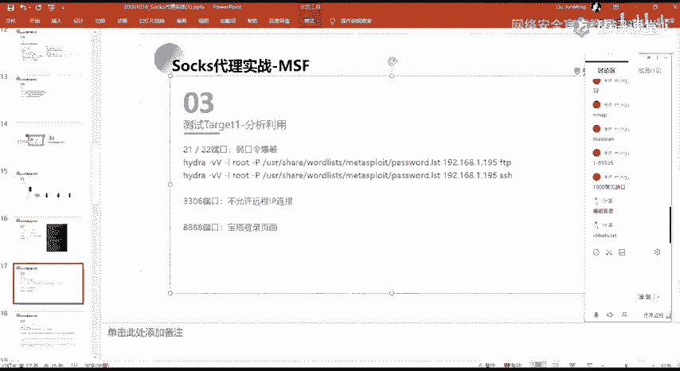

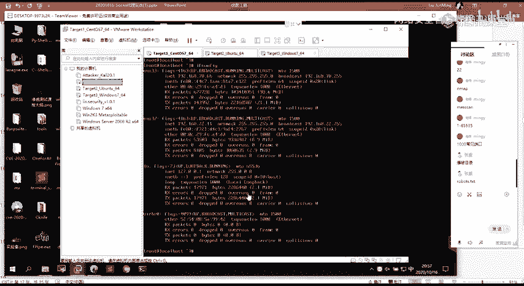

像比如在这边的话，呃，大家可以就是在这边能够去看得到他在这边，他在把机这边有写，就是这边后台的一个登录地址以及密码。然后呃有它会有这样子的，就是你保产安装之后的话。

它会生成一个这样子的一个随机的一个支符串，是吧？它会有这样子的一个目录。然后你需要去访问这样子的一个端口，以及它的这样子的一个目录，你才能够去访问到它的一个后台的一个登录的一个地址。Yeah。

也就是说如果你不知道这个的话，那么你连去对他做一个密码的一个爆破，都没法去做。

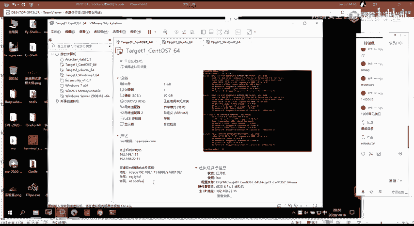

也就是你访问不到他们，是吧？

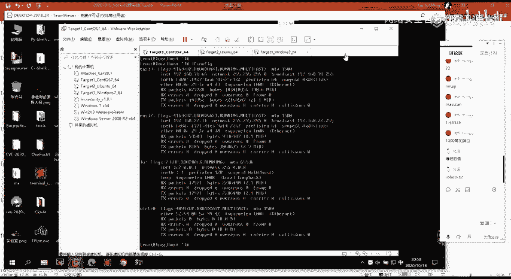

嗯。然后还有的话就是80端口。80端口的话，其实也是我们经常会去经常碰到的，也也是我们经常能够去进行一个漏洞利用的这样子的一个端口。因为80端口的话，它运行着我们的一个外表服务，对吧？然后外表服务的话。

它存在漏洞的一个可能性的话是比较大的对？Yeah。然后我们在这边的话也是主要的是通过这样子的一个80端口作为我们的一个突破口。啊，我在关元端口我们前面访问对吧？

通过访问以及通过目录的一个爆破来发现了这样子的一个页面。这个页面的话，它提示是我们的一个生个PKPV5对吧？以及它的一个版本，在这边也列出来了。那么针对这样子的一个一些信息的话。

我们可以根据这些信息来去进行相应的一个就是说这种CMS的这样子一个漏洞的一个紧锁。也就是通过百度啊，谷歌对吧？等等的一个方法来去呃，紧锁这样子的一些紧锁这1个CMS它所存在的这样子一个历史的一个漏洞啊？

然后在这边的话就是呃。我们看到这个PB5的话，就自然而然个去想到就是之前报的这样子的一个远程命令执行的一个漏洞。然后这一个漏洞的话，它是我们可以去通过命令执行来去写入一句话来去get shell。好。

呃在这边的话，我们可以通过这样子的。通过这样子的1个POC来去进行一个印证。嗯。像比如呃在这边的话，我们可以看到我们用的这边的第1个POC的话。我们这边用的第1个POC的话是这个对吧？

然后在这边访问之后的话，它它执行了1个PHP in的一个信息，就输出了当前的呃服务器。它的1个PP in的一个信息是吧？然后在这边的话，我们就能够基本的判断它是存在这样子的一个远程命令执行的一个漏洞。

因为它在这边它执行了我们呃在这边所写的1个PP in的这样子的1个PHP代码。对。然呃关于这一个漏洞的话，大家可以自己自行的去检锁，就是它的一个漏洞形成的一个原理。在这边的话。呃，我主要的话就是就是。

给大家介绍一下这边的呃它的一个命令执行的一个构造。然后在这边命令执行的一个构造的话，我们是通过这样子的一个function。呃，我们这边的一个function的话。

是这个就这一个co your the function area。这个co you的 function error话ever error的话，大家可以去查一下，就是呃关于这一个函数的话，我们可以。

就是说可以看到他在这边像比如说一句话对吧？就是说这个函数的话，我们可以用它来去写一句话，也就是说这个函数它能够去执行呃，能够去进行相应的一个命令的一个执行。然后这边的话呃其实大家可以去看一下这个函数。

它的一个具体的一个使用，就是它会把一个数组作为一个参数，来去调用一个回调函数，然后的话去进行一个执行。然后执行之后的一个返回的的结果的话，就是呃就是在这边我们调用的这个回调函数，它所返回的一个结果。

然后在这边我们具体来看的话就是。具体看这边在这边的话，我们使用这样子的一个函数，对吧？然后在这边有这样子的一个virus的一个数组是吧？然vari数组的第一个就是第一个参数，对吧？第一个参数的话。

它的一个值的话就是这个PHP four。第二个参数的话唯一。然呃在这边的话就是。等于就是说他会把就是说这边的这一个函数，他会把数组当中的这样子一个参数作作为一个呃就是去进行一个执行。

然后的话在这边他去进行一个执行的话，那么他就会去解析这边的1个KP in。我们知道我们在呃KP当中的话，去解析这样子一个KP in的话，它就会输出对应的这样子的一个信息，对吧？呃。然后的话就是第二个。

第二个的话，我们。同样的来尝试一下。第二个的1个POC的话就是这样子，我们执行执行之后的话，可以看到在这边它返回的一个结果是这样子，1个3W。然后这边的一个3W的一个结果，它是怎么来的呢？

也就是在这边我们执行的这样子的一个换卖。也就是说我们这边通过它的一个命令执行，执行的一个换卖的一个命令，也就是这边它的一个当前的一个权限的话，就是这样子一个3W的一个权限。那么他在这边他所他执行的话。

他是执行的什么呢？它是怎么去进行一个执行呢？同样的它也是通过这样子的一个呃care the function这样这样子的一个函数啊，它会去把这边的一个stem。就是说他把这一个数组当中的第一个参数。

它作为一个回调函数，也就是system。然后的话他会去呃执行我们这边的这样子的外卖。就是相当于就是。执行的是这样子的一个。System。关门。然后的话就输出了我们这边的一个结果。这是第2个POC。

然后第三个的话就是我们可以用它来去进行一个。巴布需尔的一个写露。这边的一个写入外不需要的话呃。主要的话就是使用的是这样子的一个fireput contains。🤧嗯。

这个发put content的话就是呃。前面前面应该有讲了，就f put content的话，它是把我们的一个就是把我们的一个字符串就是存保存到一个文件当中，对吧？就是将一个字符串写入文件当中。

就是使用这一个fa put content。然后在这边它同样的也是使用这一个函数去进行一个呃构造。然后所执行的一个代码的话，就是这个f。然后执行的呃利用这个fireput这个方法。

把我们这边的这一个代码把它写入到了这个需2点PP当中。然，其实在这边的话就是我们的一个一句话嘛。呃，我这边的话。需要13吗。是。在这边执行执行之后的话，他返回了这样子的1个25啊。

然后返回了这一个东西的话，就说明我们这边的话，它是没有错误的。它是有正确的去执行我们的这样子的一个命令。那么我们在这的话就已经在当前目录下面已经写入了这样子的一个需要点123点去批的一个文件，对吧？

我们直接去访问没有报错，那么说明就对了。就说明存在这样子的一个文件，而且它已经做了一个解析，对吧？然后我们在这边的话，我们就可以通过。这样子的一个文件去进行一个命令的一个执行。各需要。嗯。

我们去进行一个执行，对吧？以及去执行相应的一个命令。到时执行快卖对吧？3W以及执行。呃，ID。对吧，能够去进行一个命令的一个执行。然后在这边的话，我们就能够去进行一个。

用我们的一个需要的一个管理工具来去得到这边的一个需要。嗯，我这边的话是请查一下。呃，我这边的话这是我之前的，我就就用这个吧。然后在这的话，我们就已经得到了它的一个需要。

然后其实在这边其实可以看到这边写入的一个文件的话，就是这个需要123点HP对吧？然后我们在这边的话就能够去对它进行一个操作。这是呃。这是这1个80的一个端口的一个。渗涛测试。

然后这边的话就我们就已经基本上已经测试完了，对吧？就是对这边的这个这一些常见的这样子的一些端口，对吧？我们扫出来的这样子的一些端口的一个测试。当然的话在这边我只前面这边的话，我只给大家提供了一些思路。

对吧？然后呃主要的话就是我们这边的一个8联的一个端口，就是它的这一个外网服务作为一个突破口。然后的话我们通过这个突破口来去进行一个得到这个就是外网的这一个呃服务器的一个信，对吧？

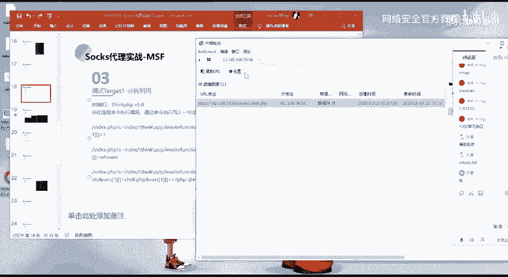

也就是这个。嗯。然后那么我们现在的话得到了这个share，就其实我们现在的话就已经进入到了这个服务器，对吧？得到了这个服务器的一个权限。那么得到这个服务器的一个权限的话，我们下一步要干什么呢？

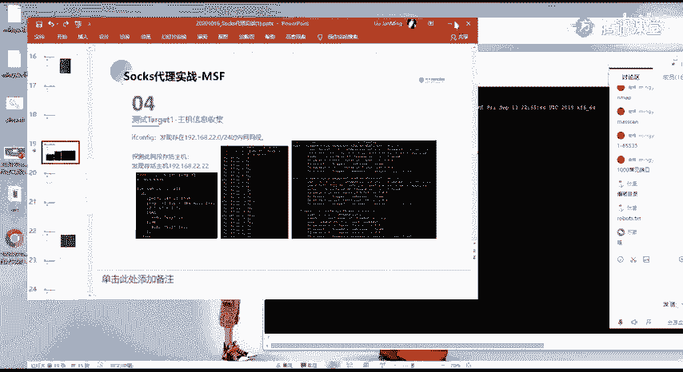

大家回想一下，就是我们前面的话就已经呃前面的前面那内容的话，其实就是这样子的一个步骤，是吧？我们下一步会去干嘛？就说我们这边已经得到这个机器的一个需要是吧？那么我们下一步。

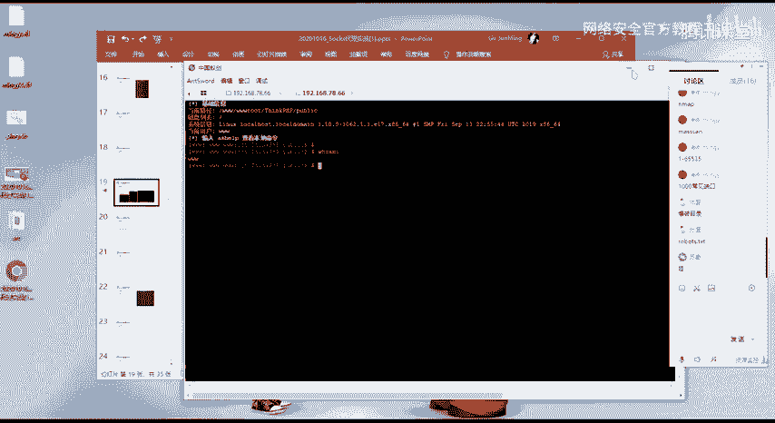

有同学回答一下吗？下一步的话同样的也是进行一个信息收集嘛，对吧？就是说你这边你得到了这一个机器的一个sh尔是吧？然后其实跟我们前面在讲那个讲内网渗透，啊不讲内网信息收集的时候，其实不也是一样的一个道理。

是吧？我们要去对内网信行一个收集的一个前提的话，就是说我们已经得到了一个呃能够去访问内网的一个需尔是吧？那么我们在这边得到这个需尔之后的话，我们同样的需要去对它做一个信息收集嘛。

因为你去做这样子的一个测试的话，你信息收集领不了的，就是第一步。

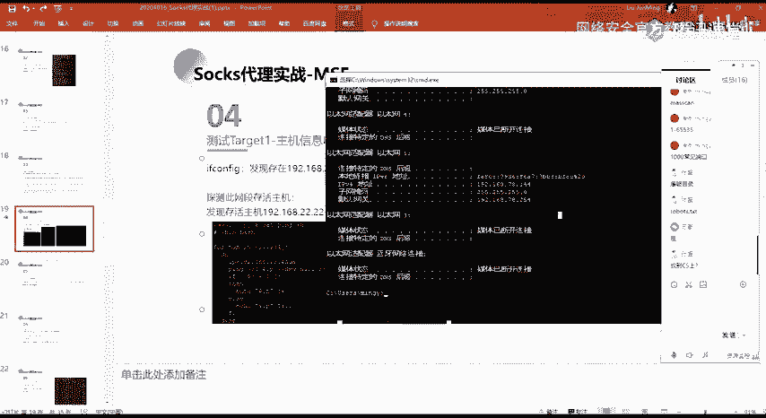

因为你只你只有知道了对应的一些信息，你才能够去说能够去进行对应的一个操作，才能够去进行一个测试。

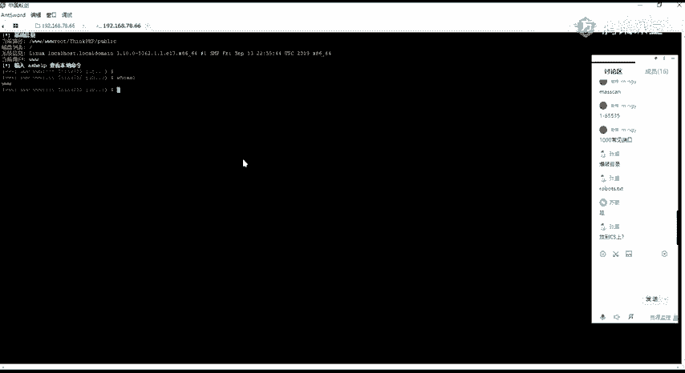

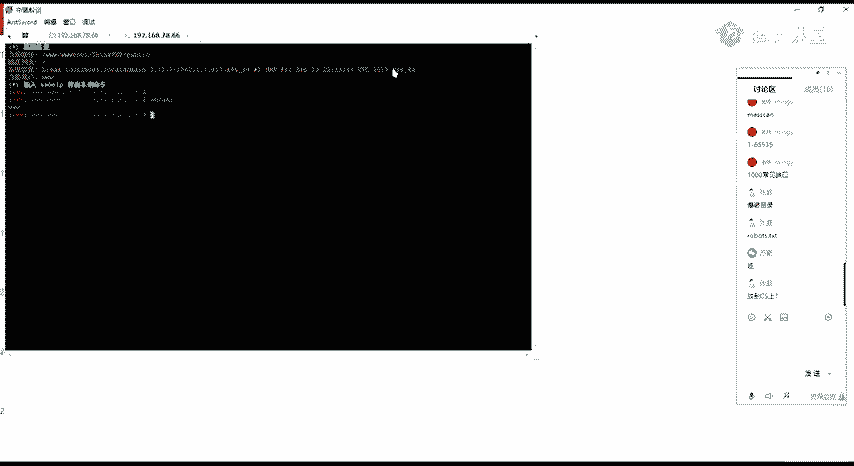

好，呃，在这边的话，我们。呃，具体的一个主其实主要呢呃其实。准确的来说的话就是主机的一个信息收集啊，就是说对我们这边得到这个主机，对吧？去进行一个相应的一个信息收集。然后我们这边的一个主机的话。

它是一个linux的一个主机，其实就是回到了我们前面讲的一个linux主机的一个信息收集，对吧？就对它的一个网络，像比如说查看它的一个呃网卡，对吧？它它有哪一些网段，也就是使用iffi。

然后其实我们在这边使用if空fi之后的话，可以发现的话，在这边它有两个网卡，就有这样子的一个ES33以及ES37的这样子的两个网卡，对吧？

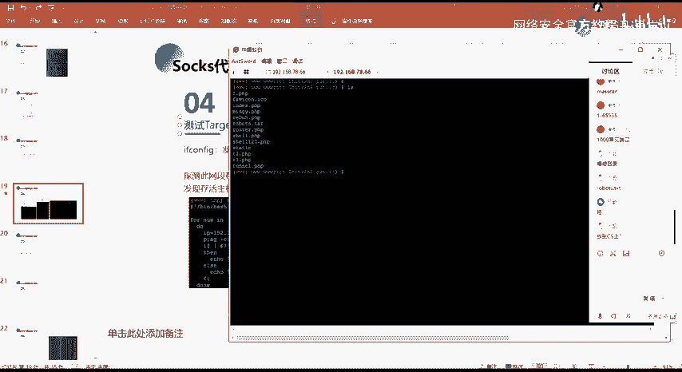

然后这边3上的这个网卡的话，就是我们的一个呃外网的1个IP嘛，对吧？我们就是通过这1个IP进来的。然后这边的1个ES37的话，我们发现它有这样子的一个呃内网的1个IP。

那么就说发现呢有这样子的一个内网IP之后的话呢，就是说他给了我们什么信息呢？

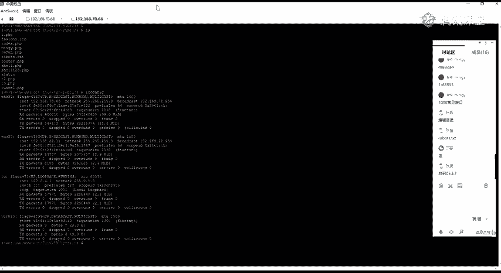

也就是说当前的这个机器的话，它是可以去访问这这里的这个内网IP的这1个22网段的。对吧因为他在这边的话，它是呃有这样子的一个能够有这样子的1个22网段的这样子一个网卡。

我们可以通过这一个网卡来去访问22网段下面的所有的一个主机，是吧？而且这1个IP的话，它是一个内网的1个IP也就是说这一个主机它是能够去访问到这个2网段的这个内网的。那么下一步的话。

其实就是进行一个呃内网的一个信息收集，对吧？当然的话呃，主机信息收集的话，我没有去说更多啊，对吧？就是因为前面的已经讲了，对吧？然后我们这边的话主要就是走走思路，好吧。我这边对吧？

收集网络还有相应的一些进程啊，对吧？以及去去进行相应的。像比如说我当前是一个三W门的一个权限，是吧？后面也会讲，就是去进行一个提全对吧？提全的话，那么你需要同样的也需要去进行一个信息收集，对吧？

因为你要去确定就是说我们对这个机器它是否能不能去提全，以及能够通过什么样子的一些方法去这个提全啊。还有其他的像查看它的一个连接啊，对吧？比如说。要查看它的一1个连接，它有哪一些连接以及IP。

和一个就是有这样子的一个连接是吧。以及它是它的这个连接，它是从哪1个IPI从哪1个呃IP连接过来的对？我们可以去进行相应的一个信息的一个收集。然后下一步的话就是一个内网的一个信息收集。

就我们已经发现了有存在这样子一个内网的一个网段，对吧？那么我们就可以把我们这边得到这个需要的一个机器作为一个内通网这一个二网段内网的这一个跳板机，对吧？

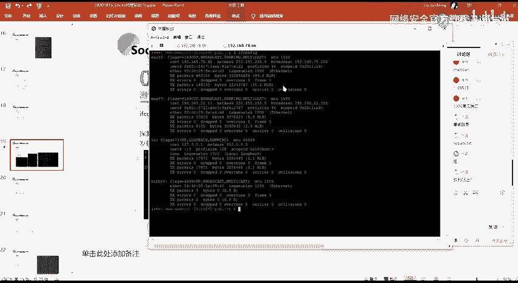

我们可以通过这个机器来去访问这个内网了，对吧？那么。我们首机第一步的话就需要去探测这一个呃这一个网段它所存活的一个主机，它有哪一些存活的一个主机。因为我们需要去知道就呃我们知道一个网段，对吧？

一个网段的话，它有很多的这样子的一些主机。那么这些主机的话，就是说呃一般它是1到254嘛，对吧？1到54。那么这些主机我们需要去知道哪一些主机它是开放的，就开放是什么意思呢？

也也就是说在这一个网站下面有哪一些主机，它是呃开启的，也就是哪一些主机，哪一些计算呃哪一些电脑对吧？哪一些服务器它是呃开启的。因为我们的一个呃电脑，我们的一个计算计算机，我们的一个服务器。

你开启之后的话，它就会去有它会有分配这样子的1个IP对吧？因为你只有你只有分配的IP，你才能够去进行一个访问嘛，对吧？那么在这边的话，我们就需要去对这个网站去做一个存头主机的一个一个探测。

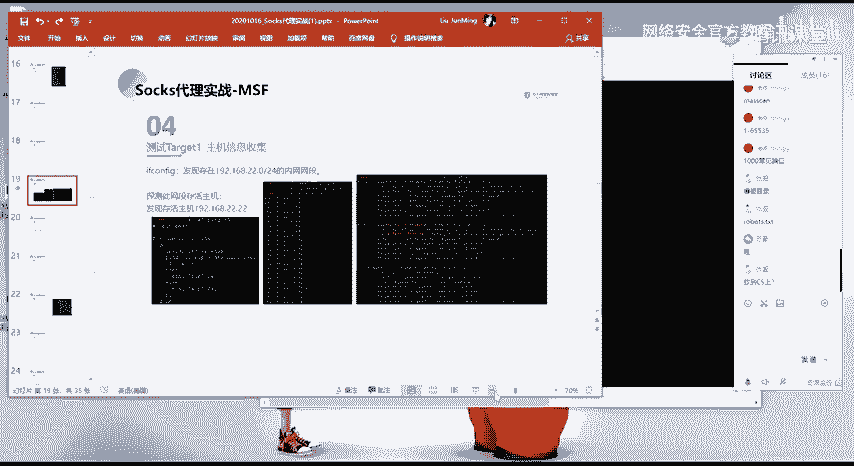

在这边的话，我们使用的是呃就是通过。🤧这样子的一个方法就是通过写了这样子一个需尔脚本，就是通过拼的一个方式就。呃，在内网当中的话在内网当中的话去用聘的一个方式去进行一个这样子一个主机存活的话，呃。

是比较快的一个方法。当然的话就是说如果说它的一个主机，它是竞聘，以及在内网当中，它是就说你的一个聘的一个流量，也是被禁的。那么就呃可能就不能去使用这样子一个方法。然后我们在这边的话就通过这里的。

一个脚本。就其实这个脚本的话也比较简单。对吧呃然后其实像内网主机的一个存活探测的话，呃，前面不是已经有讲嘛，对吧？前面讲内网信息收集的时候，呃。

后面的话有列举了很多的这样子的一个内网存活主机的探测的一个方法，对吧？嗯。😊，然后呃在这的话，我们就使用这样子的一个最简单的一个方法啊，就是通过拼的一个方法。然后这边的话是写的一个需要的一个脚本。

这个脚本的话其实就是用了一个for循环。然后的话呃去并历这一个网段的从1到254的这样子的1个IP对吧？然后的话就通过P的一个方法，然后每1个IP的话就拼一次。干C指定骗的一个次数。

然后其实在这边你会发现有同样的有这样子的一个就是这样子的一个东西，对吧？现在的话大家应该能理解了吧啊就是呃。干低V闹的话就是把它的这样子的一个呃输出，对吧？它会把它置为空。

然后2-N的一的话就是把我们的一个标准的就是把我们的一个错误的一个呃输出，它会把它就是从定向到我们的一个标准的一个输出。呃。Yeah。然后下面的话就是做了一个基本的一个判断嘛，就是判断它是吧。

就如果你拼通了，对吧？你拼通的话，那么他就会呃有相应的一个数据，对吧？

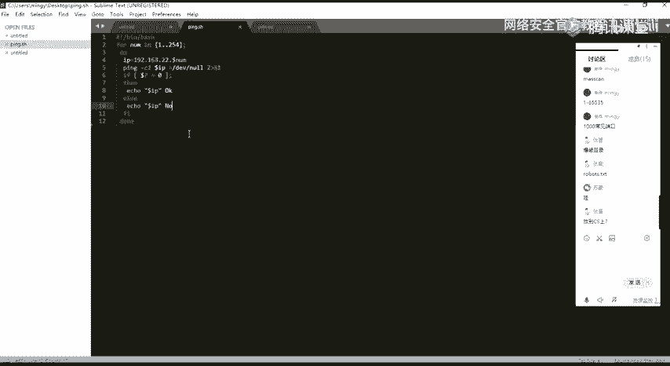

就他你聘你聘的话，不是会有那一个，比如说。

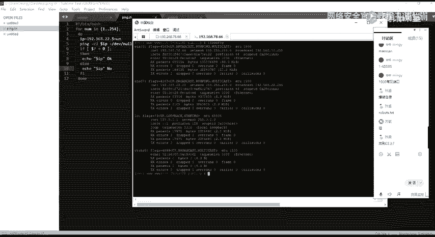

你听听一个那个。嗯。诶。怎么发不你呀。像样我们在这边的话，我们拼的话。像我们拼这个78。66对吧？我们拼拼通了之后的话，它就会有这样子的一个数据返回，对吧？然后的话呃如果有的话，就输出这个ok嘛。

没有的话就no嘛，对吧？

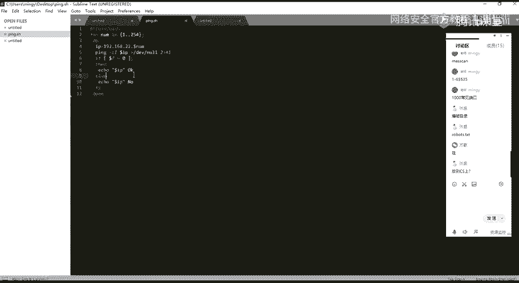

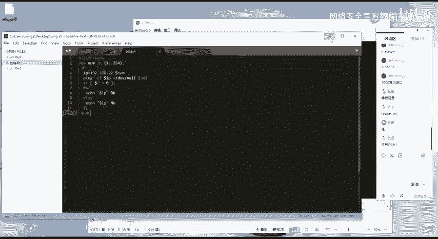

然后呃在这边的话。我们可以通过就是说通过我们这边得到这个需要，对吧？我们这这边的话能够去进行相应的一个文件的一个操作。然后然后的话我们就可以向我们的一个这个机械上面去呃上传下载我们所想要的一个文件啊。

然后在这的话我已经上传了这样子的一个需要的一个脚本。然后在大家去进一个上传这个需要脚本的时候，你可能就是会有碰到这样子的一个问题啊。

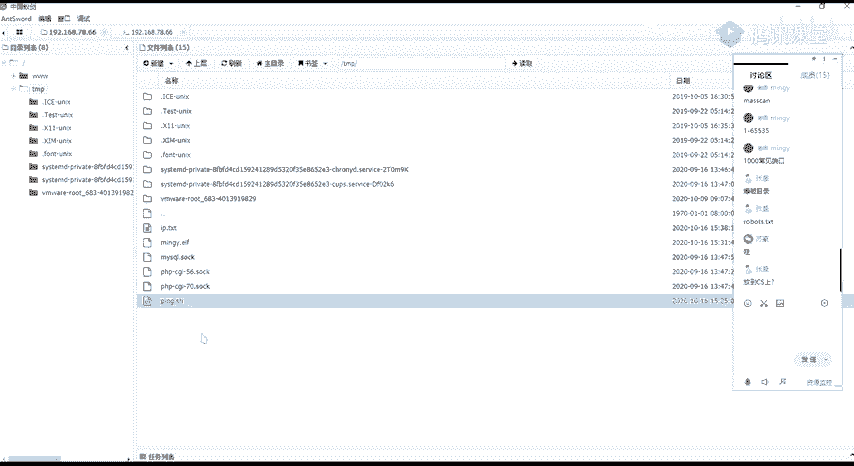

就是因为当前的话是一个linux的一个系统，对吧？然后嗯。我先先执行吧。然后存在这样子一个拼1点SH的一个脚本，是吧？然后我这边的话拼一点。来去执行这一个去了脚本，然后把它的一个输出从面向到这个IP点。

IP一点太丑这置文件当中。

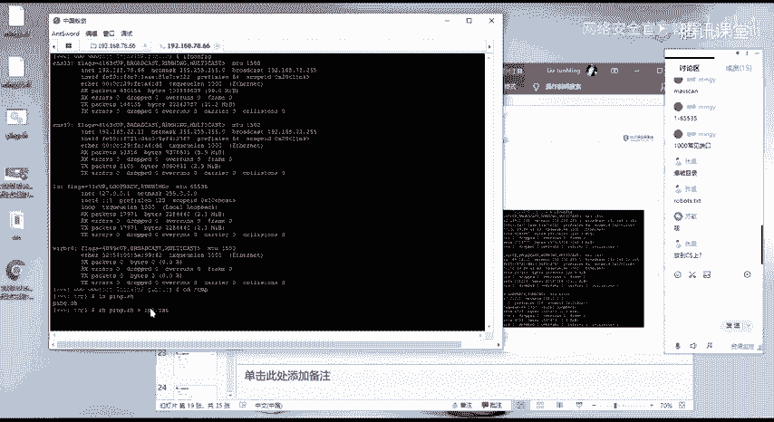

然后在这边的话，执行的话，它会就是说在引进当中，你去执行这样子一个命令的话，它会自动的去把这个东西把它放到后台去啊。然后我们可以通过ca来去查看这1个IP点t这个文件，对吧？

然后其实如果你刚开始看你会发现它只有这么一点，对吧？它其实是这个脚本，它还没跑完了。然后你每次看的话，他都会增加一个，对吧？然后在这边的话会有这样子一个问题，就是在windows当中。

因为我们的话通常就大部分同学应该都也都是使用的一个windows的一个系统，对吧？然后在windows系统当中去写这样子的一个这种脚本的话，一定要注意。

就是呃你的那一个就是你要去传到这样子的一个linux系统上面的话，因为我们的一个windows的，像这种编辑器，它会呃他会去啊像我们的一个note pad对吧？等等这种它会在这一个。

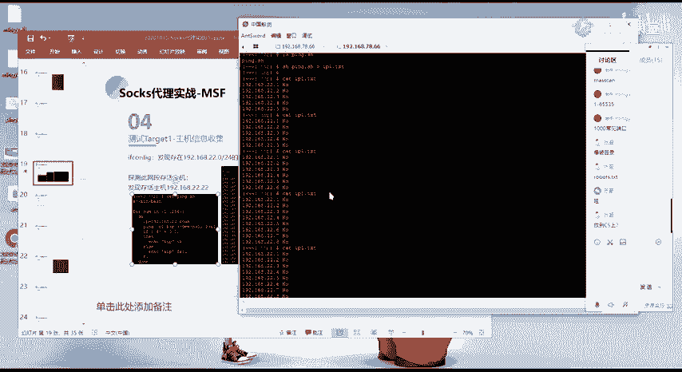

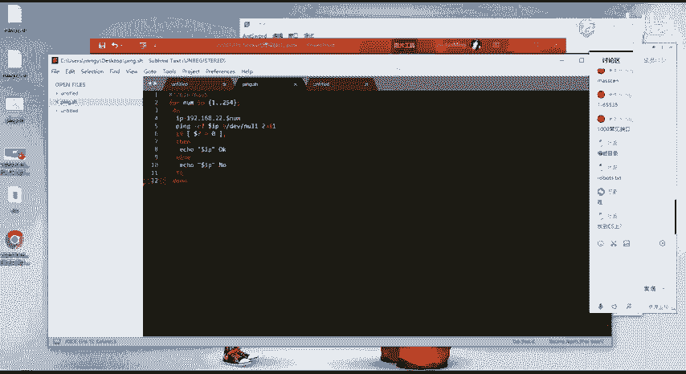

文件当中去添加一些多余的一个信息，多余的一些东西，以及啊因为windows已经令时的一个编码的一个不同啊。然后你在windows上面，你通过这样子一个编辑器去写的这样子的一个脚本的话。

你去执行的话会报错。就可能会报错。

嗯。然呃一般的话就建议大家在在linux系统上面去去写这样子的一个脚本。然后的话上传到这个呃目标机上面去。然后上传上去之后的话，我们执行执行之后的话，就能够去得到这样子的一个结果。

就我们其实可以在这边看到有存活的一个主机，对吧？像2。1，然后2。2。然后在这边2。1的话，其实就是我们当前的这一个机器的一个IP。那么我们就。从这边能够得知呃，当前这个网站的话有这样子的一个主机存活。

就是这个2。2的这个主机，它是存活的。那么我们下一步的话就是呃需要去对这个主机做一个测试，对吧？因为我们知道它是存活的。那么同样的我们首先第一步的话就是需要去对它做一个信息的一个收集嘛，对吧？

然后知道它的个IP我们对它做一个信息收集的话，就是使用MSF啊，不是是使用呃使用呃Mapp啊，还有等等的一些端口扫描的一些工具，对吧？

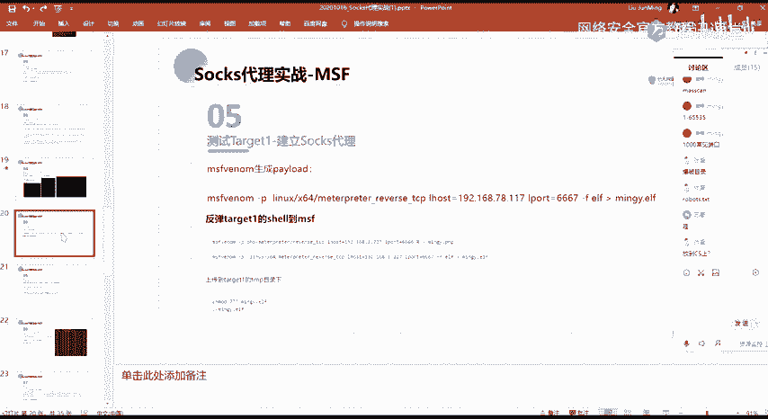

然后在这边的话，我们想要去呃访问这1个2顶2这个机器的话，在这边会存在一个问题。就是说我们当前的话是我们当前去访问这1个2。呃2这一个网段的一个机器的话，对吧？我们是需要在这一个机器上面去进一个访问的。

也就是这一个。呃，这个。78。66这个外网的这个服务器对吧？这个跳板机上面才能够去访问到。那么我想要去就是说去进行相应的一个呃相应的一个，像比如说我想要去使用MM去扫描这个2这个2。2这个机器。

它所开放的一个端口，对吧？那么我们就需要。

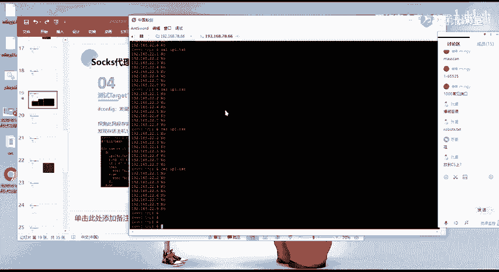

呃，有这样子的一个Mm的这样子的一个工具啊，那么。

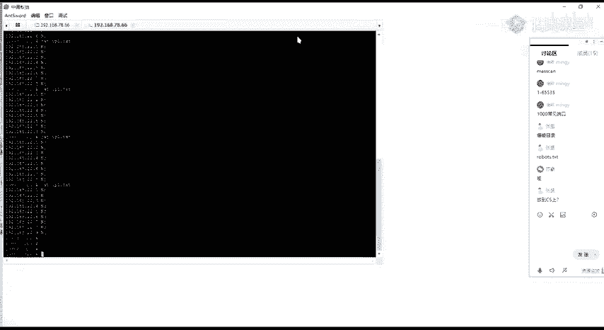

在这边当前的这个计算机这个机器的话是呃我们拿下的这个机器是吧？那么这个机器的话，它可能没有MM呢，对吧？它没有这样子的1个MM的一个工具。你可能会说你要去去进行个安装，对吧？然后你要去安装的话。

那么你你除非你直接得到了它的一个root权限。因为你安装这种程序的话，你是需要去进有一个root权限，你才能够去进个安装的对吧？所以的话在这边。呃，会有这样子的一个问题，对吧？

我们想要去进一步做进一步的一个操作的话，我们会因为这样子的，我们这边得到了这一个需尔的话，它的一个操作以及功能的话，它是有限的是吧？所以的话我们会想到说把我们这边的一个需要去做一个反弹。

也就是把我们这边的一个需要反弹到。比如说我们的一个在这边这位同学所说的1个CS以及MSS上面，对吧？然后的话我们在使用这样子的一些呃框架。因为这些框架的话，它里面集成了很多这样这样子的一些功能，对吧？

我们可以用它的这样子的一些功能来去进行一个呃更好的一个操作以及测试。

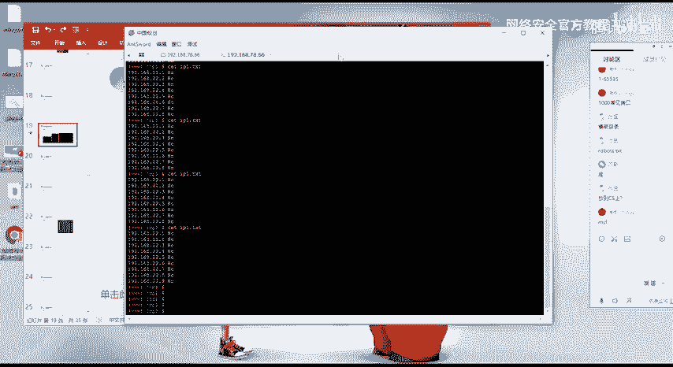

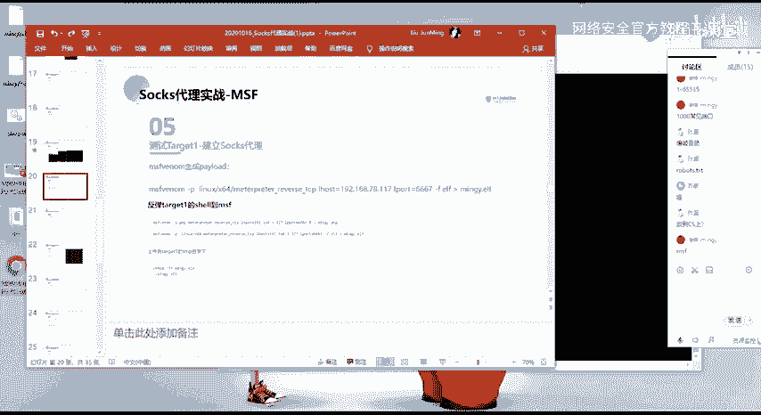

呃，以及的话就是说我们在这边呃。

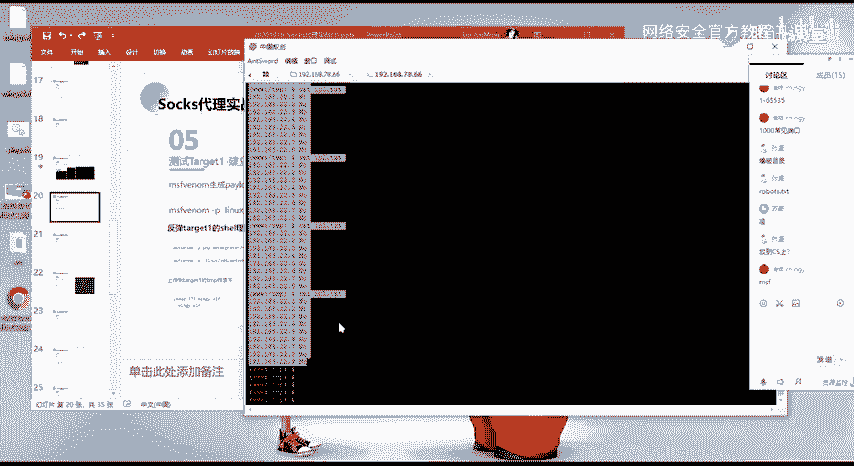

，我们先反谈需尔吧。然后我这边的话法兰西尔的话是采用的是这样子的一个方法，就是呃我通过生成一个这样子的一个呃通过MSFwinow生成这样子的一个呃可执行的一个文件。

就linux下面的一个EF的一个可执行文件。然后的话把它上传到我们的这边的一个目标机器上面去。

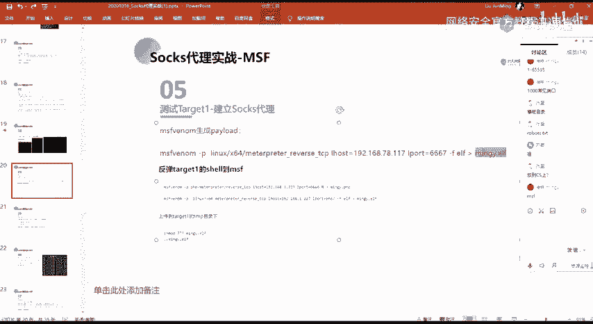

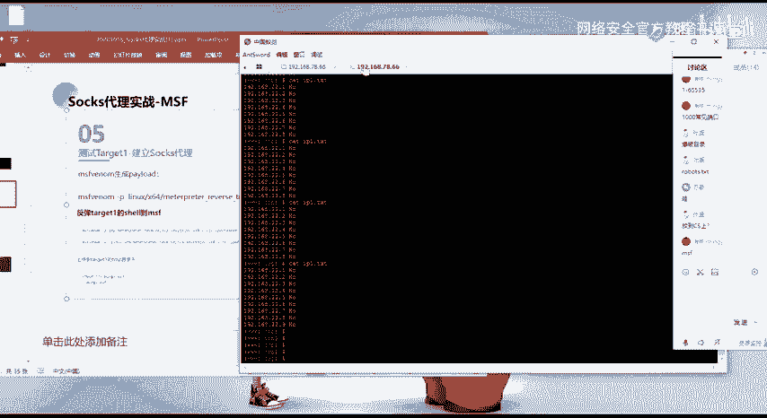

好，呃，在这边的话。呃，生成的一个步骤的话，我这边我就不演示了。我这边已经呃已经有提前生成好了。就是。生成的一个哎。关灯。对。Yeah。没了，就是呃通过这样子的一个命令去进行一个生成。

然后的话大家要注意啊，就是说我当前的话。我这边得到的这个机器啊，它是一个linux的一个机器啊啊，所以的话你要去生成的对应的一个可执行文件，就不再是我们前面经常说到的1个EXE了啊。

我们的1个EXE的话，它是windows下面的一个可执行程序。第1一是。windows下了。对吧然后呃在这边的话，我们需要去生成这样子的1个ERF的一个格式，就是我们的在linux下的。把这些程序。

然呃要指定的就是这个杠F要指定的一个格式的话，就是这个EF。然后呃关于这边的一个LhoLport的一个配置的话，应该我不用我多说了，对吧？

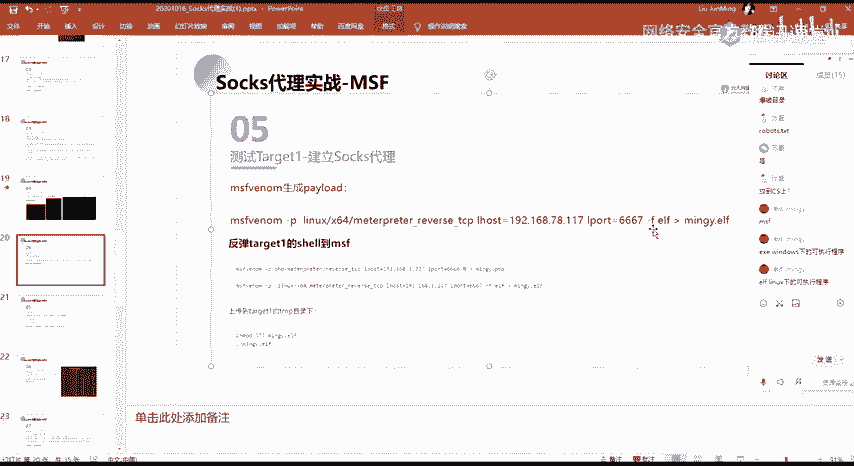

然后生成了这样子的1个MIG点MIGY点ERF的一个文件啊？然后我们可以通过这个需要把它上传到我们的一个。

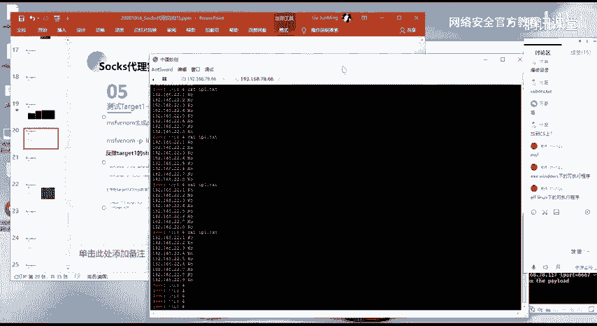

啊，某某一个目录下面去对吧？然后通常的话我们在linkinux上面去上传我们的这种可执行文件，以及我们想要去执行相应的一个文件的话，我们通常的话会把它上传到这个t屏幕下面。就是说这一个t目录的话。

它是一个比较也是一个比较特殊的一个目录。

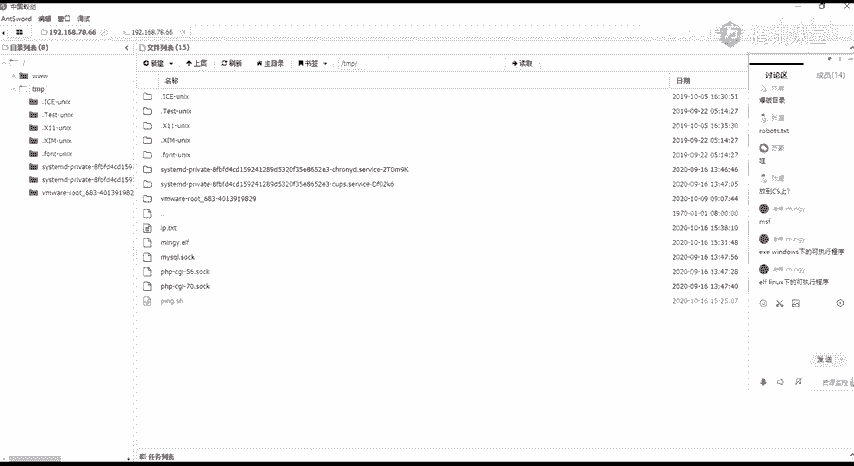

就呃这个tamp目录的话，我们的一个linux的一个程序的话啊，在我们的linux系统上面的话，我们可以去查看一下。我们可以来查看一下这个探盘目录，它的一个权限。我们可以看到这个探盘目录，它的一个权限。

它默认的话就是一个呃777的一个权限，对吧？RWXRW。诶。T。这个T是什么权限来着？

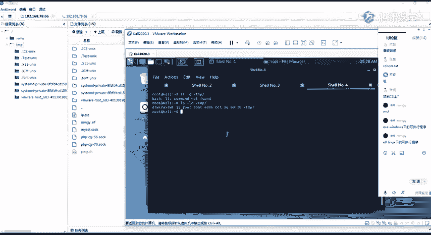

是那个。是维码。嗯。是那个张志味啊。没下。呃，这个STK这个标志呃，这边的话。就是这一个这一位啊就是可以理解为就是为防删除位。也就是说这一个的话这个。哎，不能被删除吗？呃，也就是呃在这边对吧？

我们给了这样子的一个RWT的这样子的一个权限，对吧？就这边的一个普通用户啊，就普通用户的话，他有了这样子的一个T的一个权限是吧？然后在这一个目录里面的话。

就是我们不能够去对他的一个这种呃就是防止他被删除。大家看这里吗？就这个目录下面的这样子的一个文件，就能够去添加文件，但是不能够去删除文件。然，我们可以。你天发生一个。Yeah。这边那个root权限。

然后我们在这边的话呃。通过在这一个目录下面去上传我们自己的，我们这边生成的这个可实现程序，也就这个MNGY点1F这个文件对吧？然后我们上传上去，上传上去之后的话，我们再通过这个需。

还去行一个执行。然后在这边的话，执行的话，大家要注意的话。大家一定要注意啊，就是你这边你去上传这个文件的话，因为我们这个文件它是一个可执行的一个程序，对吧？所以的话你上传之后的话。

它的一个默认权限它是没有执行权限的。然后的话我们需要去进行对它做一个添加。当然的话我这边话是已经有了，就已我已经添加了，就是我们需要通过去mod对吧？给他一个就是给他一个X的一个权限。

然后的话我们再去通过这样子的一个通过去进行一个执行MYGY点EF。但然的话我这边已经有执行过了。我们可以通过。这样子的一个命令来查看，我这边的话。呃。这里啊我这边的话已经有执行过了。

就这边的话执行执行了。

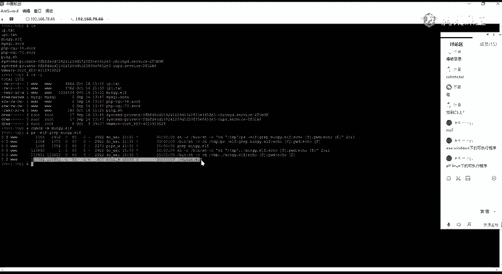

我这边把它关掉吧，关掉吧。重新执行一下。你啊。啊，现的话已经断掉断掉了。啊，我们在这边。我们需要在我们那一个呃机器上面去做这样子的一个。今天。对吧，因为我们需要执行之后的话。

能够去访他一个小给我给到我们的1个MSF。然后在这边的话呃，我们使用。这个mch handle这个监听器。这边的话是1个6667的1个。端口。啊，呃，我的1个IP的话是这个。好。

我们需要首先需要去设置一个payload的呀。就是完配漏斗之后的话，我们。我这边的话已经设置好了呀，这个的话是我之前已经设置的。就是你需要去设置你的后se交port嘛，跟这边去对应。然的话我们需要去。

给你一个券。我这话把它放到后台。然后执行一个jobs。对啊，就是这个。然后我们这边今天今天之后的话，我们。就通过这边的这个线。当前的话已经没有我这边的话执行这一个我们的一个木马文件是吧？然。

我这边执行之后的话，在这边的话，你就能够去得到这样子的一个。m class的一个session，就是这个s选5。Yeah。啊，我们可以看一下。🤧Yeah。对吧。也就是呃。

我们通过生成这样子的一个配load，生成这样子的一个link下面的一个可执性程序。然后的话把我们的一个这一个跳板机的这一个shift把它给呃。转到我们的1个MSF机器上面去，对吧？

然后呃转到MSF机上面去之后的话，我们就需要去建立一个s代理。然后在这边我们为什么要去建立一个说词代理呢？嗯。在这边的话我们来看一下，对吧？当前的话我这边的话是得到了这1个78。

6的这个外网机器的一个线，对吧？然后我我们通过前面的一些操作，对吧？我们知道我这个机器的话，它是能够去访问22的这个网络的1个IP对吧？那么我们。要去访问这个2这个I网段的1个IP的话。

我们只能是通过这个机器去进行一个访问，对吧？但是我们在这边的话，就是说我们想要从比如说我们想要从我当前的这一个windows机器上面，要能够去访问这个二网段。那么。我们该怎么去做呢？

就是说比如说我想要在我window17上面用Mm对吧？或者说用呃其他的一些工具来去呃或者说用浏览器对吧？来去访问这个22网段下面的某一个web服务，对吧？那么我们需要去怎么做呢？

也就是用到我们今天这边所要去。我给大家介绍的这样子的一个双代。嗯。😊，就我们需要去建立这样一个s style。然后的话。具体的一个操作的话就是这样子。

首先我们这边已经得到了这个mtch pad的一个sha，对吧？然后我们需要去使添加一个路由。添加路由的话，我们需要使用到这一个run auto route这个命令。注意的话。

大家要注意是在这个mettter下面去进行一个执行。然后干S。指定我们想要去添加路由的这样一个网段。因为我们当前的话，我们是想要去访问这个二这个网段，是吧？所以的话我们需要去添加一个路由去。

到这个二这个网段的一个机器。

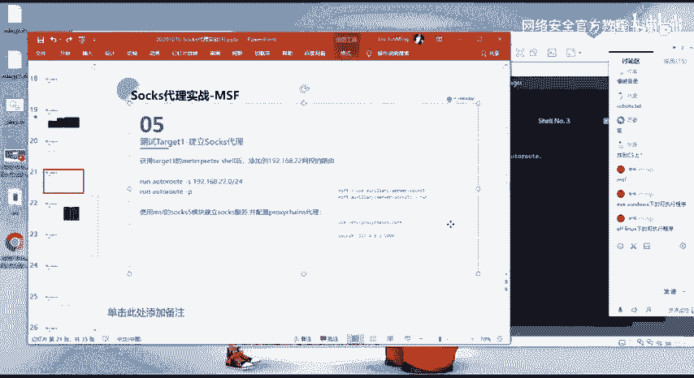

干P的话，我们能够去查看，就是说这边建立的这样子的一个路由。好，呃在这边的话大家可能会有疑问，就是说我为什么要去建立这样子一个路由呢？大呃有有没有同学知道。就是说我这边我要去呃。

就比如说我这边的这个MSF的这个机器，对吧？我这边的这个MSF机器的话，我是无法去访问到呃，我除非是在这个mateprint这个需尔下面才能够去访问到这个啊这个网站的一个机器，对吧？那么我在当前的这个。

呃，当前的这一个机器下面的话，我是无法去直接访问到这个。比如说。这1个2。2这个机器的对吧？就cos and reachable，也就是访问不到对吧？然后的话。

然后的话我们在这边的话是在这个mat project下面是能够去访问到这个网站的，是吧？那么我们。呃。这个怎么跟大家说呢？就是大家知道呃，大家。学学过网络吧，对吧？大家学过网络吗。

应该知道就是说我们就比如说我们的一个呃我们的这一个公司的一个网络，对吧？我们公司的一个网络的话，我们通常会去，或者说你家里的一个网络，对吧？你想要去通过你的一个呃你想要让你的一个手机。

你的一个电脑能够去访问到外网，对吧？我们通常会需要有一台路由器。是。就是需要一个root，需要一个路由器。然后这一个路由器的话是它是我们可以通过这个路由器来去访问外网，对吧？然后路由器的一个功能的话。

大家知道吗？就是说路由器当中它会有这样子的一个路由表。就是有一个路由表，然后这个路由表的话就记录的就是我们的一个呃。呃，IP。嗯。嗯。然后的话我们呃就是不同网段。嗯。就说我们不同的一个网段。

比如说我的1个一的一个网段，我要去访问1个22的一个网段，对吧？那么这个网段的话，我们。呃，因为它是在不同的一个网段，对吧？然后的话他要想实现这两个网段之间的一个访问的话，我们需要有这样子的一个路由。

就是要告诉这个一网段的这个机器如何去访问到2这个网段，对吧？然后在路由器当中的话，就会有这样子的一个表，就是告诉当我们的一个一这一个网段。去访问去访问2。2这个网段的一个机器的话。

那么他就会去路由表当中去找到如何去访问到这个二网段的，如呃去找到这个二网段的这个IP对吧？对，IP load，然后的话就是就是找到吓一跳嘛，对吧？然后的话我们在这边其实也是一样的对吧？

我当前的话是这一个我当前这个MSF的这个机器的话，是这一个这一个网站，对吧？然后这个网站的话，它是能够去访问这里的这个呃。就我们这边得到这个希尔的这个IP对吧？但是他是无法去直接访问到这个2这个网上的。

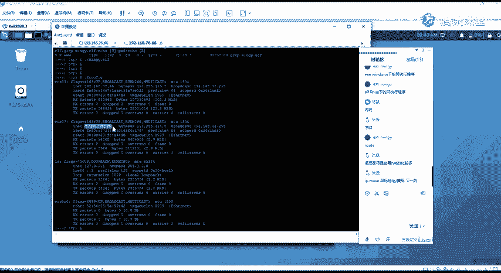

啊，然后在这边我们这一这边得到这个mat这一个筛选的话，它是能够去访问到这一个，也就是能够去访问到这个二网站的对吧？那么我们是否能够去做一个这样子的，就是说通过这一个mattter这一个筛选，把我们。

把我们从这边的这个网段的一个流量。把它给就是说啊不是，就是说我从这边对吧？我从这边我去聘这个192。168。2。2这个机器，对吧？我这边我去聘的话，对吧？我是否。

就是我如果要去实现这样子的1个78这1个网站去访问这1个二这个网站的话，我们需要去告诉这边。高速这边。如何去找到这个这个IP对吧？然后在这边的话，我们可以通过这个筛选5这个进年的这个绘画，也就是。

也就是我们在这边通过添加这样子的一个路由。然后的话通过这个筛选5的这个绘画来去访问这个2这个网段。然后呃在这边添加完路由之后的话，我们还需要去做这样子的一个配置。啊，对。对，就是就是这个意思。

其实呃在这边的话就是这一个s选5的话就是网关。就我们可以看在这边看到就是筛选5的话就是网关。也就是说我们在这边对吧？我们在这边。7八的话要去访问这个二的话。

我们可以通过这边的这这个筛选五这一个网关来去找到这边的一个2的这一个。呃，22这个网站下面对应的这1个IP对吧？然后呃在这边添加完路由之后的话，我们还需要去建立这样子的一个ss的一个服务。

因为我们在这边的话，我们在这边的话是通过MSF对吧？通过MSF进来这个筛选5才能够去呃访问到这边22。那么我们当前在这边在这边的话是访问不到这个筛选5的对吧？所以的话我们在这边需要去建立这样子一个通道。

这个通道的话，就是通过这样子的一个方法去进行一个建立。呃，我们需要去使用这样子的一个。就是。好这边。使用这样子的一个就这个ss5的这样子的一个模块。然后的话我们去乱一下。呃，这个。好像已经有了。他是。

就这个。然后我们乱执行之后的话，它在这边它就会有这样子的一个jobs。这个jobs的话就说明这一个ss5的一个服务的话已经启动了。然后它的一个ss的一个服务的话。

它是在这样子的一个呃今天在1080的一个端口。我们其实可以在这边来去查看他的一个今天的一个状态。对吧这个端口的话已经处于一个今天的一个状态。然后在这边我们的一个ss代理服务呃。

ss的一个代理服务已经建立好之后的话。我们。就可以通过这样子的一个sources的一个通道来去访问这边的1个22的这一个网站呃。这边这边的是一个2的一个网站。我们可以来尝试一下，因为我当前的话。

这一个机器的话是一个。呃，1加点168。78。117对吧？然后我当前当前的这1个IP的话，其实跟它是一个网段的，78。114。所以的话呃我在这边我要去访问这个二网站的话，其实就说呃先在这边先访问吧。

我在这边我在这边通过这边的一个ss的一个通道来去访问这个网站。我这边来测试一下，我们要去使用到的话，就是这个s chance。嗯。通过这一个close chance这些工具，然后的话我通过CL。

来去尝试去访问一下这个。M68。2。2。呃。为了做一个对比啊，就我在这边。我在这边先不通过那个代理通吧，对吧？我这边直接去CR去访问这个IP的一个8联的一个端口。

你会发现他这边的话是他是说无法去连接到这一个8联端口。然后还有这边就是有一个。No road to host。也就是说他在这边他是没有路由器。访问到这个22这个IP的。也就是说在当前的这个主机。

它是呃不知道就是找不到如何去到这个2这个网站的1个IP的。然后我们在这边的话就通过这边的一个s死的一个通道。我这边。可以看到直接去进一个访问，就通过这个prose change来CL这一个。

这个IP对吧？原本的话它是无法去访问的。我现在通过这个搜索通道的话，能够去直接的去访问到它的一个8联端口的一个页面，对吧？这本上是它的一个web服务的一个页面。好呃，在这边的话，其实。

我们通过这个代理通道去访问这个IP的话，它的一个流量的一个走向。大家知道吗？就是说他是如何去进行一个走的，他为什么能够去呃访问到这边。就是说通过这个代理的一个通道。う。Okay。

然后其实这边的话就是我们刚刚的这边的这两个步骤所。达到的一个效果就是通过这边。

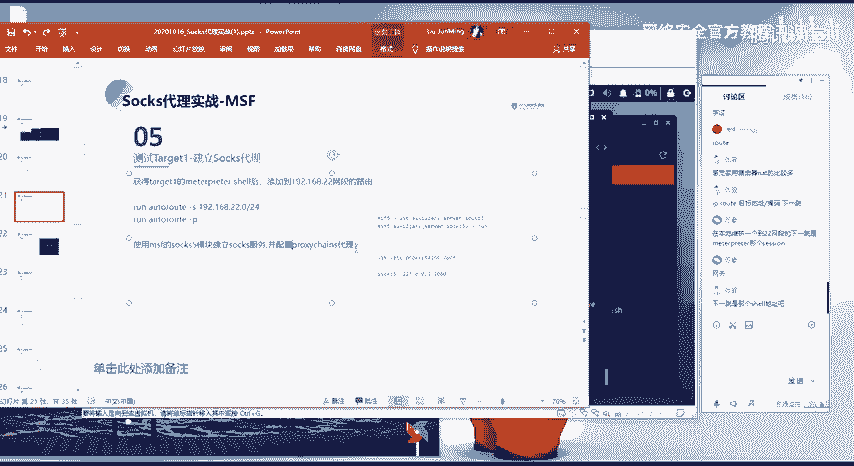

的一个配置。我这边的话大再给大家来捋一下，就是说我这边去访问对吧？我这边访问的话，我通过这边的一个代理通道。然我这边的一个代理通道的话，是这边的一个我本地在我本地的1个1080的一个端口，对吧？

然后也就是说我这边的1个HTP的一个请求，它会通过这边的1个1080的的一个端口，也就是我这边经营的一个说索通道，把它给传递到了这边。因为我这边的话是我这边的一个sock通道的话。

是呃是在这边的1个MSF，对吧？我这边建立的这个socks通道的话。

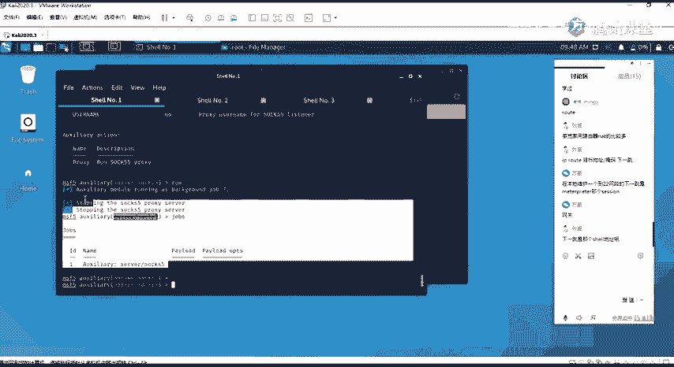

呃。就说我这边的这一个流量。他会通过我们的1个MSF。然后的话转到这边。因为我们这边的是我们在这边的1个MSF当中的话，已经添加了这样子的一个路由，对吧？就是说他把他去请求这个2这个网段呃2。

2这个IP，它的这个请求，它会通过这边的一个通道，也就是108年的一个端口，它会转到这边MSF转到这边MSF之后的话，他会去寻找这一个如何去访问这个2这个网段的这个IP对吧？然后在这边的话。

我们添加了这样子一个路由，也就是我们通过这个筛群5。因为我们的这个筛群5的这个绘画的话，它是能够去访问到这个2这个网段的，对吧？以及我们在这边添加了这样子一个路由来去。呃。

就是说当他请求到这个2这个IP的时候，他会去通过这边的这个网关来去找到这边的这个IP以及它对应的一个服务，也就是呃实现了。通过这边的一个说死的一个代理通道来去访问原本我们访问不到的这样子的一个网段。

以及我们在这边的话，其实。因为我这边的话跟这边是同一个网段，所以的话我可以通过这样子的一个方法，就是我这边设置一个这样子的一个代码。诶。就这个78。117，然后代理装头话是1080。

然后选择一个协议的话是s5的一个协议。然后我这边的话选择这一个对吧？呃，我另外再开下浏览器。我这边的话是没有走代理的对吧？我直接去访问的话，是肯定访问不到的。

对，访问不到这个IP的。然后我在这边的话，通过这个代理。

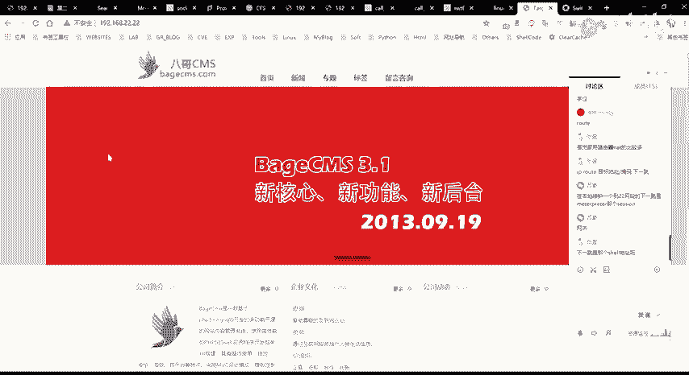

然后的话可以看到这边的话就直接的能够去访问到这边的这1个2。IP2。2这个IP的这样子的一个web服务，对吧？

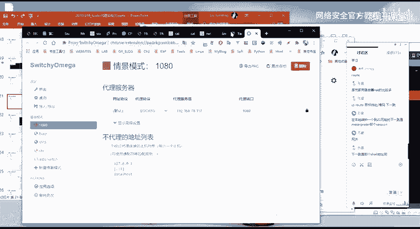

所以的话在这边的话是走的这一个代念，其实就是走的我们这边的这一个。

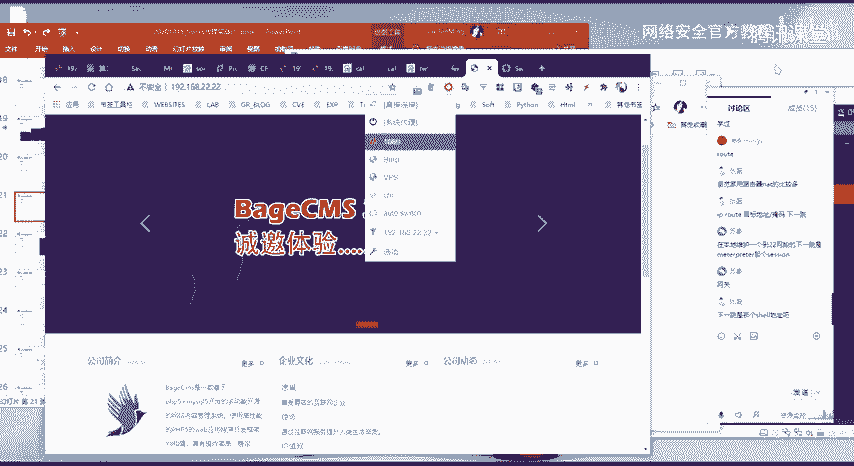

呃，这边MSF所经历的这样子的一个收死的一个代理服务器啊。这边的话大家能理解吗？呃，对，吓一跳呃，就是你也可以这样理解嘛，就是下一跳嘛，就是其实就是添加路由的话。

就是就是群就是告诉你的这个呃告诉你要请求的这个IP往哪里走嘛，就是对吧？下一跳的话就是呃就是告诉你呃你的下一跳的话，是这1个22。22嘛，对吧？也就是呃那个筛选5嘛。就是它是通过那个网关。

也就是我们的那个S5来去找到那个2。2那个网段，对吧？所以的话我们需要去我们如果说要去通过那个4选5来去访问到这个2这个网端的话，那么我们需要去添加一个路由。

也就是告诉呃MSF你要你要去访问啊这个网站的话，你就需要去呃通过这个筛选。才能会去访问的。呃，这边的话就是呃通过MSF建立的这样子的一个sarch的一个概念。

然后的话我们通过这个ss代理来去访问到了这边的一个内网的这一个网站，对吧？其实这边的话就已经实现了这样子的一个内网的一个穿透。我们在这边我们在这边的话就能够去通过呃。

这样子一个代理服务器去访问那一个内网的一个网段。啊后我们已经呃能够去访问到这个网段的话，那么我们就需要去。做下一步，就对它做一个信息的一个收集。就这边的话其实又回到了我们前面的相应的一个操作啊。

就对它做一个信息收集。我们可以使用MM，对它做一个端口的一个扫描。呃，在这边的话，你做端口扫描的话，像你在看你那面的话，你可以直接通过这样子的一个clo change，对吧？还去做一个扫描。あ。

直接粘贴吧。然后呃在这边的话。我我就不扫，我不扫了，他停了。然后这这话我们看一下，看前面主要的话在这边的话呃面令上应该不用我说了，就是通过TCP的一个方式进行一个扫描。然后一定要注意。呃。

大家一定要注意，就是在去进行一个说词代理的时候，一定要注意，就是像MM这种工具，对吧？你需要去给它加一个杠PN。干PN是什么意思呢？也就是禁止去进行一个pin的一个扫描。就因为我们前面已经说了，是吧？

就我们的一个拼的一个扫描的话，它是无法去通过我们的一个呃收死的一个代理通道的。也就是它无法去代理这样子的一个pin的这种SMP的这这样子的一个流量。所以的话如果说你不去禁止掉的话。

它会有这样子的一个pin的一个扫描的话，它会就是它会有错误，对吧？以及我们的这样子的一个流量也过不去。嗯。就影响我们的这样子的一个扫描。然后呃这边的话就是。刚P干对吧？呃。

就我们前面所说的这种我就不多说了。然后呃这边的话我们主要看一下，就是这边。它的一个扫描的一个结果。首先像比如说在这边的话。呃，大家看到这这种的话，就首先第一个在这边的话，它是走的这样子的一个代理通道。

对吧？他这边的话应该比较形象。通过这边的，我们本地是1个1080的这一个端口。然后就把我们的这边的这种请求的一个流量，对吧？把它发送到这一个端口上面，也就是呃通过了那一个说词的一个通道，对吧？

然后的话把它传到了我们这边的这一个。呃，IP的这一个指定的一个端口，对吧？其实这边的话就是把我们M的这种探测端口的一个流量，通过这边的一个收时的一个通道，把它给转到了这边指定的这个IP的一个端口上面去。

对吧？然后的话对它去做一个探测。但这的话这种time out的话就说明这边的这一个端口的话，探测的话它是超时的。也就是说它可能是没有存在，也有可能是呃呃就是你没有扫到，对吧？然后的话就没有探测到嘛。

然后的话像这种比如说像这边82888888的这样子一个端口，这边O的话就表示呃就表如说这边的一个端口的话，它是存活的。也就是呃探测到还有22以及还有其他的80，对吧？这种21的这种端口。

然后我们通过这样子一个方法的话，就能够去探测到这边的一个这个内网主机的2。2这个主机的一个存活的一个端口。开放的一个端口，对吧？那么就同样的又回到了我们前面对吧？

就是针对这样子一些端口做一个漏洞的一个分析利用，对吧？然后同样的这边的话同样的是使用的这个80端口作为一个突破口。就是它这边有一个这样的1个CMS，就在内网这1个啊这个主机上面的话。

有这样子1个CMS是吧？然后这1个CMS的话就通过呃找历史漏洞啊以及分析啊，对吧？啊，它是存在这样子的一个s口注入漏洞。然后通过它的这个cirl注入漏洞的话。

我们可以通过circle map直接跑出他的一个账号密码。关于怎么去跑secle map的话，呃，大家能。就关于社ical漫虎的一个使用，呃，前面有讲嘛，前面应该有讲吧，对吧？应该不用我多说吧。

就我们通过srcle map直接去进行一个呃跑出它一个账号密码。然后在这边要去注意的话，就是说因为我们的这样子的一个呃我们要去跑的这个IP，它是一个内网的个IP啊。

所以的话我们这种啊circle map这种工具。我们同样的需要通过这个pro chance做一个代理。其实就是说它的一个原理就。就包括前面map以及这边的一个scle map，对吧？它的这种扫描的话。

它的一个原理其实就是我这边通过scle map去请求这边的这一个去发送这样子的相应的一个请求包，对吧？像这个IP发送请求包，然后这个呃像这个IP指定的这个页面发送这一个请求包的话。

它会把我们的这样子的一个请求的一个流量，通过这个说词的代理通道，对吧？然后的话转到我们这边内网的这个IP的一个页面上面去。其实就是呃就加这个post，然后的话把我们的这个流量代引到我们那个收索通道。

然后的话去才能够去访问到嘛。然后跑出来的话，得到他的一个账号密码。然后这边的这1个4DMS的话，我们其实可以通过就是呃直接去谷歌呃，百度去找他的一个管理后台嘛，对吧？就默认的这种管理后台。

然后我们通过他的这一个后台的一个地址。其实我们在这边的话就已经能够去访问到。比如说我在这边对吧？

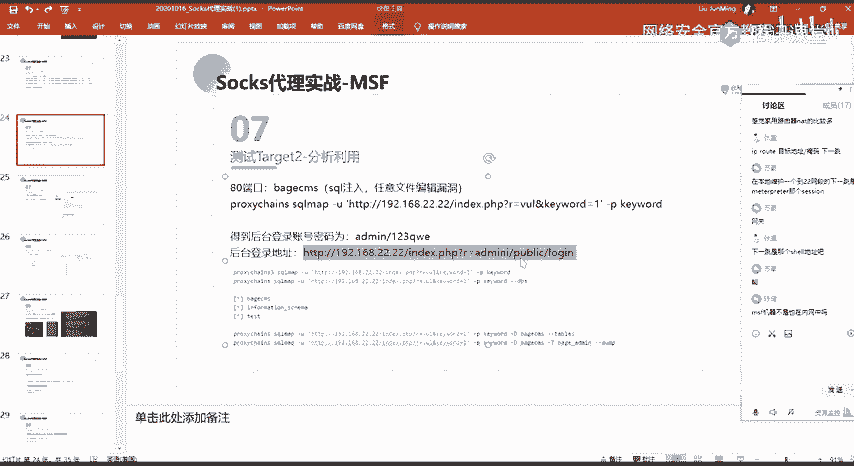

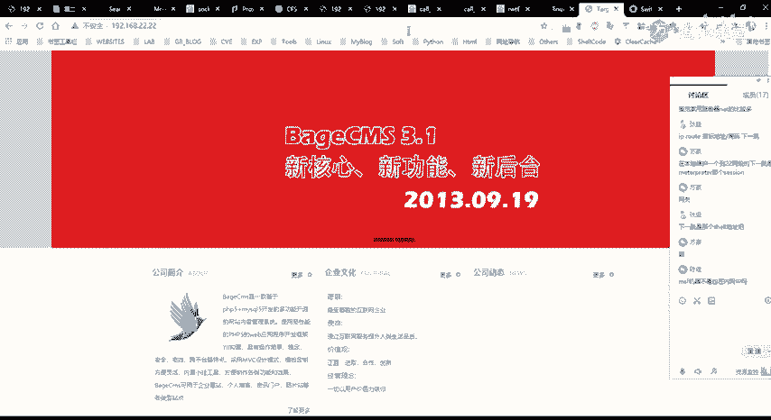

我这边的话就已经访问到了，我这边的话访问他的一个后台地址。然后呃账号密码的话。我们通过前面的一个。搜烤 map虎。就是通过s考记录。进行一个。就是把它跑出来，跑出来之后的话进行一个登录。什么？志威。

谢谢。Yeah。然后这些的话我们就已经登录到了它的一个就是后台，对吧？然后这边的话它有这样子的一个漏洞，就是其实有挺多的这种COS，它都有这样子的一个就是模板啊。

就是可以去我们可以在后台后台去编辑它的一个模板，也就是能够去编辑它的这样子的一些呃页面啊。像比如说在这边的话，我们可以通过去编辑它的一个首页。也就是这个。然后并击他的一个首页的话。

因为这边的话它是1个PHP的这样子的一个代码，对吧？我们可以在这它的这样子的一个首页当中去添加我们的一个一句话，对吧？我这边话是添加了这样子的一个一句话。呃，就是app test。

然后ever这样子的一个。呃，一句话嘛是吧？呃，我这边的话加了这样子的一个X test，其实就是为了判断，就是为了判断我这边是否已经就是是否写成功了嘛，以及他的这样子的1个PP代码，它是否解析了。

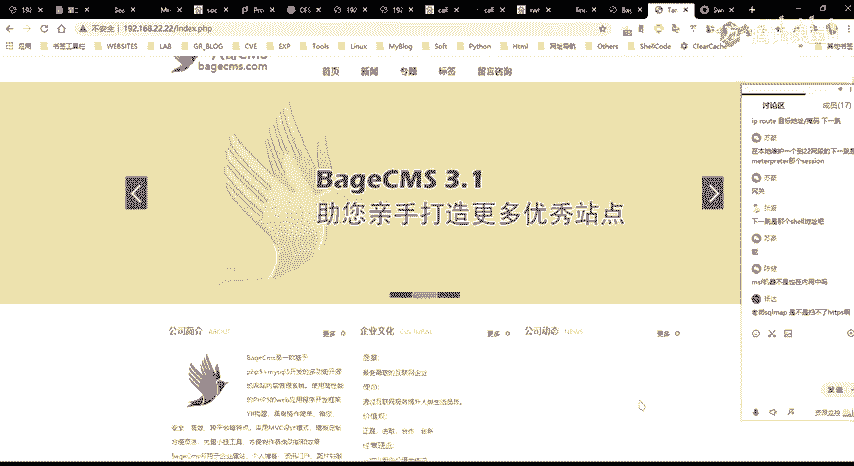

因为我们这边的话是添加在了这样子的一个首页，对吧？就我们在首页的这边的话，你可能看不到，因我们可以通过右键查看网页云代码，然后去找到这一个t，是吧？

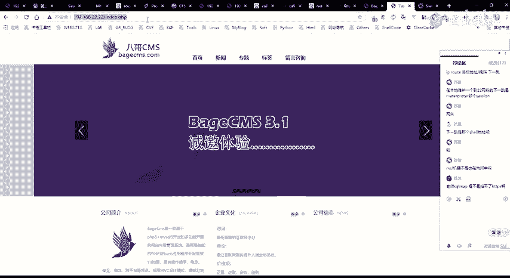

直接去检索嘛，然后大家可以其实可以在这边能够看到这边的话有这样的一个test，对吧？就是说明他输出了这样子的一个t，也就是我们的那个PHP脚本的话被正确的解析了。

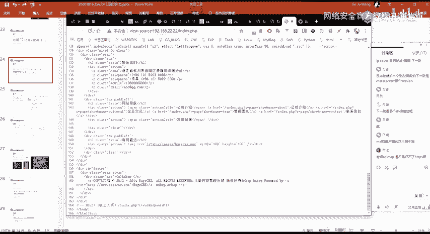

那么我们这个这里的话就能够呃去通过我们这边写入的一个一句话去得到它的一个需。然后呃得到需尔的话。

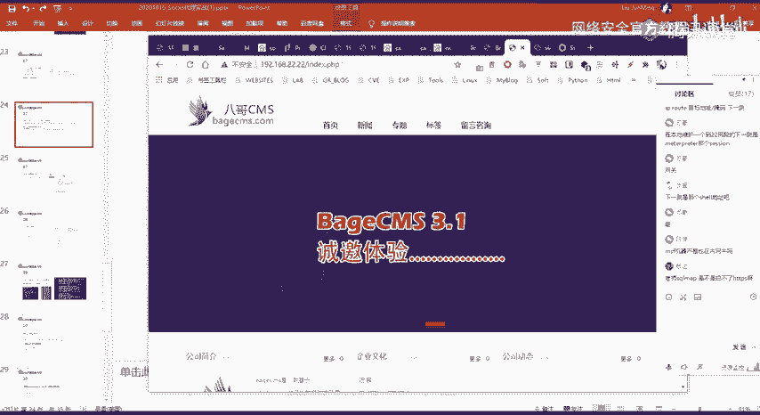

我们在这边的话，我们就可以通过我们的这样子的一个管理工具，就需要管理工具去进一个连接，对吧？啊，我们在这边要去连接的话。呃，大家觉得就能不能直接直接的连接上去呢？就我这边的话呃已经添加进去了，是吧？嗯。

打你呢。呃，我这边的话添加了这样子的一个就是。

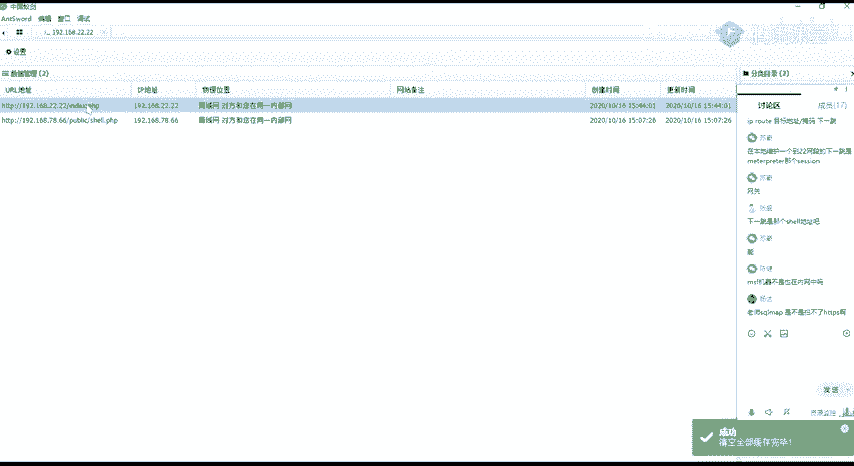

我们刚刚所得了这样子的一个呃需要的一个地址，对吧？

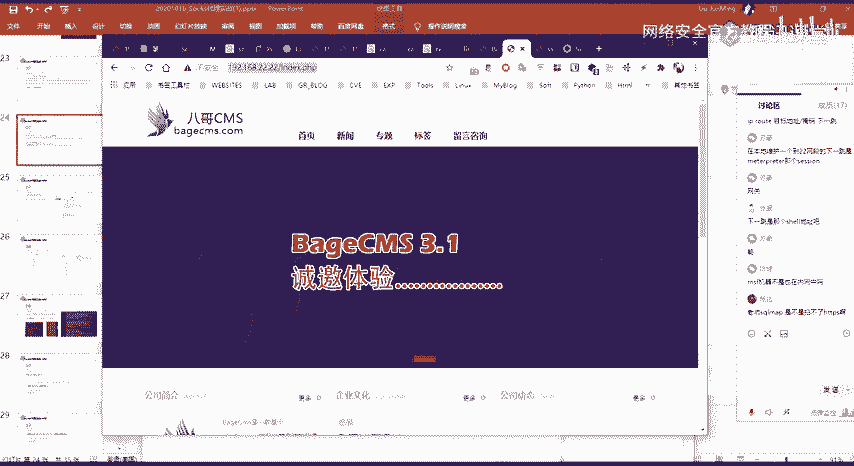

然后呃大家觉得就是能不能直接的通过就我在我本地去直接去进行一个呃登录呢？去得到的一个选的。然这cle map的话，它是可以可以扫HPS的，是要加一个参数，就是你要强制你要强制它的。因为你去扫HPP呃。

S的话，它会就有一个这样子的一个重印下，你要强制它。呃，是杠杠SS，然后干什么来着？就是。你要呃强制让他去请求这样子的1个HTPS。嗯这个的话你可以去。诶。百度一下，你百度一下有。那个选项我也忘了。

刚刚SS候什么什么来着。呃，你这肯定就是说你是说我这边写的这个对吧？我这边写的话是1个PHP的对吧？因为为什么我要写PHP呢？因为它的这个呃他的这一个。他的这个网站，它是用PHP的一个脚本里面写的嘛。

对吧那为什么就是说他这边呃就我们从哪里知道呢？对吧？我们可以通过这边PHP知道以及，通过他的后缀嘛，能够知道对吧？那么他这他是用这种PHP的脚本语面写的。

那么我们为什么要去写这样子的1个PHP的一个脚本呢，对吧？因为他能够去解析执行呢？我这样说应该能理解吧，是吧？因为我们以及同样的其他的也是一样的嘛，对吧？

就如果说你这边是1个GSP的这样子的一个GSP的这样子的一个呃脚本写的对吧？那么你要写的这样子的一个码的话，那么你肯定是要写1个GSP的码嘛，对吧？因为你只有因为在这个GSP的这样子的一个脚本的话。

你需要写1个GSP的脚本，你才能够去进行一个解析。因为你只有解析了你的你的这样子的一个一句话嘛，你才能够去得到需氧嘛。我这样说应该能理解啊。就是你服务器它是什么样子的一个语音环境。

或者说它是能够去解析什么样子的一个脚本，你就用什么样子的一个那个呃码。因我们归根到底，最后的一个目的就是要让它能够去解析我们的那个码，对吧？我们才能够去通过那个码来得到需要嘛。呃。

我们这边的话在这边的话。我们得到了它的一个web share，对吧？我们其实可以测试一下。嗯。但在这边不好测试。我们在这边就通过这样的一个需要管理工具去建一个连接。然后在这边的话要注意的一点啊。

就是我们在当前的这个机器上面，对吧？我们是无法去直接的去访问到这1个2。2这个网这个IP的对吧？因为我们在这边能够去访问到这个IP的话，是因为我这边走的我的这个流量，它是走的这个收索的一个通道，对吧？

它才能够去访问到。然我们在这边的话，同理我们在这边要去访问这1个2。2这个IP的话，我们需要去。建你去设置这样的一个代理。也就是呃像已经这边的话有这样的一个代理设置嘛，在这边手动设置一个代理。

指定你的一个代理服务器IP以及端口。这边的话代理服务器IP的IP的话就是呃。

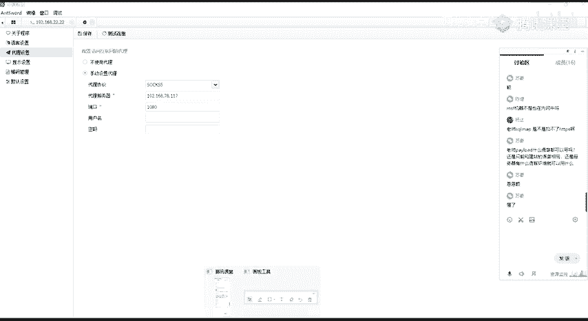

就是。好。就是我这边MSF这边的1个IP嗯。

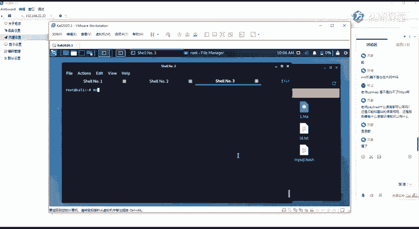

这里的这个IP对吧？因为我的一个ss的我的这边的1个MSF的一个呃ss的一个代理的话，它是今天在我这边的这个呃机器上面的1个1080的一个端口。所以的话你需要去指定这边的一个代理服务器IP及端口。

注意代理的一个协议，选择shops5。如果说你是s4的话，你就选s4。

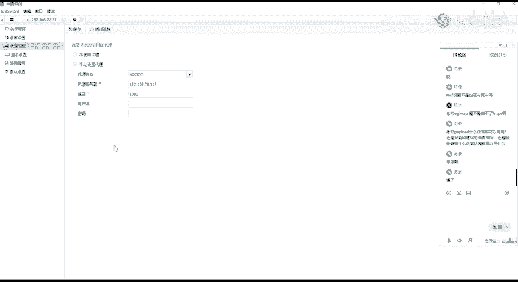

然后我这边配置好这样子一个代理之后的话，对我就能够去进行一个。

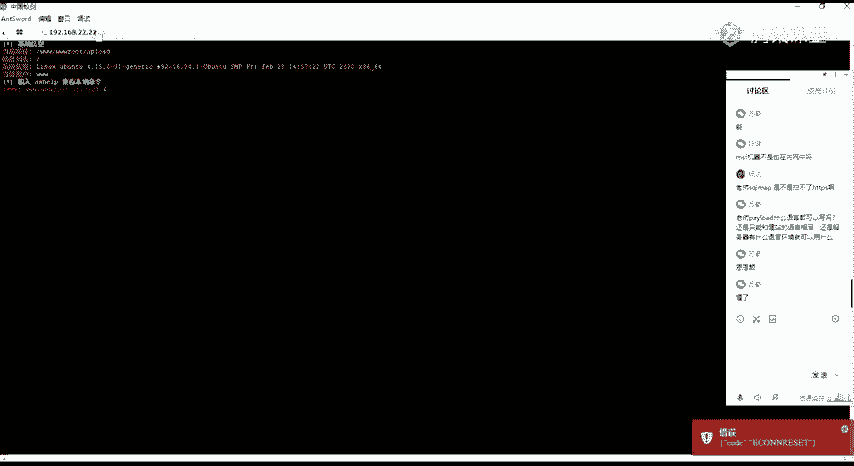

人有点问题。呃，这边访问的话。先迪遥6器。呃，这边访问的话出错了，出错了的话，碰到这种情况。不要慌，碰到这种情况的话，就果断换把刀吧。Okay。这边的话呃我通常的话是用。就会用。

像呃已境啊、冰烯啊这种都是可以的。然后这边的话因为简单的话，我就用这个C刀吧。就是这一个。用这样子的一个C刀。然后这边用这一个C的话，同样的我们需要去我这边的话已经添加了，我同样的需要去做一个设置。

这边设置的话就是你需要去设置你的一个代理的一个服务器以及IP啊，代理服务器的IP以及端口啊。然后设置之后的话，我们再去进一个访问，对吧？是没有问题的。就如果说你要问我这个工具为什么连不上，我也不知道。

就反正。很多时候都会碰到这种循求问题，所以我一般都是就是不会说只是只用一个，我会结合着其他的这种工具去应该使用。那这种工具的工具的问题。反正我是搞不懂了。也就没必要去搞懂他为什么出这种问题。

反正能用就可以了，吧？然后这边的话我们就连接到了这边的这个机器上面，对吧？连接到了这边内网的这个2。2这个IP的这个呃。Yeah。啊。

我们可以通过配置这样子的一个说指代理来去连接我们的就是在内网当中的这样子的一个项，是吧？然后呃在这边得到了这一个内网的这个。2。2这个机器的一个shll之后的话，我们就还是又回到了我们前面的啊。

我们得到它一个shll，我们就需要就可以去对它做一个主机的一个信息收集，去收集在当前这个主机，它我们所需要的这样子的一些信息，对吧？然后在这边的话，我们同样的通过前面这样子一个方法，对吧？

对这一个33呃，对这一个网段。呃，不是对近一个33，是我们比如说我们。同样的去查看它有哪些网卡，对吧？我们通过if confi。查看到它同样的有两个网卡是吧？1个22的1个网络，一个网卡。

以及1个33网络的一个网卡。那么在这边的话，我们就知道我们这一个机器它是能够去访问33网络的一个机器的对吧？然后我们同样的可以就是通过前面的那个脚本来去对这1个33网络的1个IP的一个存活做一个探测。

来去找到这一个网段下面有哪一些主机存活，对吧？然后的话找到这些存活的一个主机。那么就分别的去对这一些主机去做一个呃端口的一个探测，对吧？就其实步骤的话都是这样子的呀，对吧？

就如果说你因为我这边百句话是只有一个主机，对吧？就每一个网的话只有一个主机。如果你多个网段啊，每个网站下面都有多个主机的话，那么其实都是重复这样的一个操作，对吧？就你对对这个IP探测它是否存活存活的话。

那么你要对这个IP做一个测试的话，你就需要从它对应的开放的端口所对应的一个服务去做一个去寻找它的一个突破口，对吧？来去寻找能够去被我们去进行一个漏洞应用的一些点。然，呃在这边找到了这一个。33。

33的这个IP它是存活的，就发现了这一个存活的一个主机啊。那么我们。诶。发现了这个主题的一个存活。我们想要去对这一个主题错去做相应的一个呃。端口的一个探测，对吧？那么。我们如何去进行一个操作呢？

因为我们在这边当前的这1个MSF，对吧？我们想要去做一个端口探测的话，我们。就通常会去通过map对吧？去扫。去扫描那个端口。那么我们当前的这个MSF，我们是无法直接的去访问到33这个网站的，是吧？啊。

不是M，是当前的这个看你机器的吧？然后我们当我们之前的话是要去访问那一个2这一个网站是通过我们的一个代理，对吧？就是通过b change。通过pros change所设置的这个代理。

以及在这边所启用的这样子的一个代理服务器，对吧？然后的话。以及在这边通过筛选5添加这个路由才能够去访问到这个网段，对吧？然后我们现在的话是33网段，然后33这个网段它我们是如何去访问到的呢？对吧？

我们是通过这边我们得到这个2。2这个机器才能够去访问到的，对吧？比如说我这边我在这边我通过CR。呃，这边的话应该访问不到啊。因为他是。好，可以访问的。它这边的话呃，因为这边的话它是1个ISIS啊。

不是它是一个那个。那个windows的一个机器啊。嗯。好不算。我是呀。哦，因为这边搞错了呀。因为我当前的这1个呃IP对吧？是3302。其实我在我访问这个3302的话，其实就是访问的当前的这1个IP了。

我要反正他是这个。3。33这个机器，当然的话这边的话是反问不到的，因为它没有外部符，它是一个呃那个。那个windows的一个机器啊。啊，我在这边的话，我是无法去直接访问到的。

但是我比如说啊我是可以直接访问到的。33。33对吧，我通过P的话是能够通的。因为我们前面的话是就通过聘的方式发现它的一个存活嘛，对吧？也就是说我要去访问到这1个33。33这一个网段的话。

我需要通过这1个2。2这个机器，对吧？然后当前的话，我已经拿下了这个2。2的机器的一个share，吧？那么我们需要通过省，我们怎么去啊。嗯。呃，怎么说呢？我们怎么去把这样子的一个机器。

把它给呃反弹到我们的1个MSF上面去呢，对吧？因为我们同样的，我们也想要去。通过这个2这1个2。2这个机器去访问这个33点网站的话，对吧？我们想要去做更多的操作的话，我们最好的一个办法的话就是。

或者说最理想的一个办法的话，就是呃把我们那个需要把它给弹到我们那个MSF上面去，对吧？因为我们在这的话已经通过MSF得到了这个2。2这个机器啊，不是这个呃。

那个外外网的那个跳板机的那个机器的一个需要对吧？因为我们这边它是通过那这一个筛选5。通过我们得到这个需要才能够去访问到22的这个IP的对吧？然后在这边的话，我们可以通过这样子的一个方法。就是我们。呃。

在我说之前的话，先问提问一下大家，就是大家觉得我要怎么去。才能够去得到这样子的一个这边的2。2这个机器的1个MSF的一个响呢。啊，有谁有谁知道吗？有谁能回答一下，或者是说思路。在筛选5上家啊带你回来。

呃。用什么样子的一个方式呢？啊，其实大家应该看了我的PPT了，应该应该能能知道吧。好呃，那么我直接说吧，就是说。我们先来捋一下，对吧？就我当前的话已经得到了这个呃。通过这边的这个筛选5对吧？

也就是通过这边筛选5经历了这个样子的一个s的一个通道。然后的话得到了这边内网的这个2。2这个机器的一个渲，对吧？那么我们得到这个需之后。呃。我们如何去把这边的这个需要把它给就是。

把它给反弹到我们这边的1个MSF上面去是吧？我们当前的话是能够去访问到，就是说能够去通过这边的一个筛ession5去访问这个2。2这个机器的，对吧？那么我们在这边反他的这个需尔的话。

这个这个筛选五是怎么反弹过来的呢？我们的这边的一个三星五的话是通过这边。对吧通过我们在这边生成的这样子的一个访谈的。反谈希尔的这样子的一个暂定上面的一个可执行程序，对吧？

我们通过我们前面得到这个项来去执行这边反他的一个呃谢尔。然后执行之后的话，就把它反他到了我们的1个MSF上面去，对吧？然后注意他这边是反弹线，就我这边为什么要去使用反弹线呢？以及呃。嗯。啊。啊。

没有说呃，其实在这边的话。用不用反特需尔都可以啊，就是我用反纳西尔以及正向需尔都是可以的对吧？因为我这边的这一个机器的话是。呃。Okay。呃，我这边的这一个机器的话，因为是。呃。

能够跟我这边的这1个MSF都是能够互相互相访问的对吧？所以的话我通过正向协要及反向协都是可以的对吧？然后在这边的话就是说我在这边通过前面的这个今年的一个绘画，得到这边的这个内网的这个2。

2这个机器的一个需，得到它的一个需要。我在这边是就是说我在这一个内网的这个网道，它是无法去直接访问到我们的一个外网的。就是呃它在这边它的一个内网的话，它是无法去呃它是呃无法出网的。啊，其实前面已经有讲。

就是我们在去呃内网信息收集的时候，对吧？就是你要去判断你的这一个机器，它所处的一个位置，对吧就是它的一个网络环境，以及去呃判断它是否能够去出网，对吧？然后在这边当前的这个机器的话是呃出不了网的。

就是它只是放内网的一个机器。然后我这边他不能够去出网。那么我们就无法去使用反航性，对吧？因为在这边的这一个内网的这个机器，它无法去访问到我们在外网的这样子的1个MSF的这一个呃IP，对吧？

所以的话我们就无法去反弹选。所以的话我们尝试。去使用这样子的一个正向小。这其实在内网的这样子的一个用MS5去这样子的一个得到需尔的话，你呃通常的话都是就是说你要去有多个这样子的一个网段的话，对吧？

多层网络的话，我们通常的话会去。通常的话都是使用的一个正向吸压。因为你要去反向吸压的话，你的一个你的腰你就要。就是要要求你的这个内网的一个机器能够去访问外网，对吧？但一般的情况下面的话。

它可能是呃无法出网了。所以的话我们就通过我们这边建立的这样子的一个通过这个跳板机所得到的这样子的一个啊筛选绘画。来去访问来去访问这个内网的这个2点网站，对吧？

所以的话我们的一个操作的话就是呃首先通过MSF来去生成这样子的一个呃正向的一个项。就这边的生成的一个正向的一个这一个码的话，就是说它在这边执行之后的话，它会在本地去今天这样子的1个6668的一个端口。

然后的话来等待我们这边的一个连接，对吧？因为我们在这边的话，它是我们是可以通过这边的一个筛选去访问这个机器的对吧？去访问这个机器的这边今天的一个端口的。那么我们能够去访问到的话。

它只需要在这边今天这一个端口，然后等待我们的一个请求的一个连接，来去建立来去进行连接。

那么我们在这边的话就能够去得到这边机器的一个呃筛选规划。然后具体步骤的话就是这边。呃。我这边的话就不一一操作了，我已经在这边的话，已经就是。呃，已经上传上去了。就是这边的这个MI3MIG2。1F呃。

当前的话应该是。6668。呃，这边的话没有。啊。呃，这边的话因为我前面的话已经执行过了，所以的话这边它端口的话是处于一个今天状态。我这边的话把这个停掉。声音。好，当前的话没有了是吧？

然后我这边的话又再通过这边德乐西尔，对吧？就是把它上传到我们的一个探统目下面，然后给他执行权限。然后我这边的话就直接执行了。因为我前面的一个操作我已经操作了。我就不再一一的操作了。

然后在这边去执行这一个。第二幅文件。执行之后的话。在这边其实我们可以看看到。嗯。

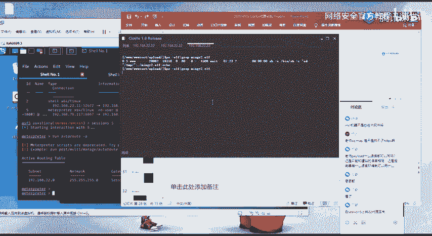

然后这边的话可以看到，虽然它这这边显示执行失败呀，但是没有就不影响他这边这边的这个呃可执行程序已经执行了。就我这边执行之后的话，它的一个效果的话，就是它会在本地进行1个6668的一个端口。

然后的话它今听了这个端口之后的话，我们怎么去进行一个连接呢？对吧。我们去进行一个连接的话。我们只需要去使用这样子的一个。使用我们的一个今听器的一个模块，设置我们的一个payload为呃。Yes。

设置为一个半的TCP的一个零件，也就是半的的话就是呃正向的一个零件。然后我们设置这边的一个upport。那我们。在这边他在这边去今天的一个端口的话，是这样子的1个6668的一个端口，对吧？

也就是我们这边当前的这个呃MSF的一个流量的话，是要发送。就是我们的一个请求的话，是要发送到这边的1个6668的一个端口。对啊，然后啊按ho的话就是我们要去发送请求的一个呃IP，也就是我们这边的1个2。

2的这个呃机器，对吧？然后我们在这边的话，我们expoit。感接执行执行之后的话，在这边的话可以看到就立马就得到了这样子的一个筛选6是吧？我们可以看一下筛选筛选16。然后筛选六的话。

在这边的话就进入到了它的一个筛选。在这边进入到进入到他的一个筛选的话呃。就你会发现有这样子的一个情况。这个情况的话其实就是我们前面我前面其实也要给大家提，对吧？就是我在这边。

就是你在这边你去使用的这样子一个配漏的。比如说你使用的是这样子的一个需尔的这种配的话，你最后得到了这样子的一个筛选的话，它其实是像这样子的一个。就其实它会卡在这边对吧？你跳回车它也没反应啊。

但是的话其实你当前的话已经进入到了它的一个呃hell了，你可以执行命令，比如说IOS对吧？当前那个路的话是在那个探鹏录录。慢慢啊能够去执行这样子一个命令。然后在这边的话，我们要去退出来的话。

你可能会直接ctl C，对吧？你cttrol C的话，你退的话，你就会把这样子的一个筛选给终止掉。所以的话呃我们其实可以在这边去执行background。就在这边输入一个background。

这注意的话在这边是不能够去table补全的，也需要手打。然后的话在这边他会说background section6，对吧？你敲 yes。然后在在这边的话，绘画的话就呃在这边对吧？

在我们那个后台然后其实在这边你可能会就是。呃，像这样子的一个需要你用不习惯，对吧？你想要你想要去使用这样子的一个max plus的一个需要。那么我们可以通过这样子的一个方法，就通过筛选1杠U。

然后指定这样子的一个筛ession来把这样子的一个就是通过这样这边的这个模块啊，就通过这个hell to match的这一个模块，把我们当前的这样子的一个就是hell的这样子的一个hell。

把它给就是进行一个升级，升级成我们这边的一个mat的一个呃seession。然，我们可以。可以看到在这边执行之后的话，它反回了一个筛选7，对吧？是一个m pass的一个筛选。然后我们筛选是查看。

在这边有一个筛选题。我们可以进入这个筛选题，然后的话。对吧。就得到了这样的一个m一个需。然后现在的话我们就呃已经得到了这边的这个。202这个机器的一个需对吧？把它反弹到了我们的1个MSF上面，对吧？

我们为什么要去反弹到就是把它给呃反他把它给就是转到我们的1个MSF呢？因为我们想要去做下一步的一个操作，就是去。对这边的1个33。33的这个机器去做一个操作的话，我们就需要这边的这一个。

Second选嗯。需要这边的一个筛选7，对吧？因为我们在这边要去访问到这个33这个网站的话，我们只能通过这边的这个筛选7，也就是这边的这个呃这边的这个2。2这个机器，对吧？

所以的话我们在这边同我们在这边。要想让我这边MSF。呃，去访问到这边的一个33这个网站的话，我们同我们需要去。添加一个路由。这边路由的话，指定指定是添加到我们的1个33033的这一个网段。

然后大家要注意啊，就是你添加路由的话，就是说你要你想要说你想要让哪一个筛选，就是你要。呃。大家脑子里面一定要这样子的一个就是呃。一个概念或者说有这样子的一个思路啊。

就是说我要通过哪一个我要通过哪一个需要，通过哪一个筛选才来去访问这边的啊这个IP对吧？然后我这边的话是要通过这个筛选7，所以的话我需要在这个筛选区下面去添加一个路由。然后这边的话。

这边添加了一个路由的话，我们可以看到就是通过这一个筛选7。添加到了这样呃添加了一个就。到这个啊。嗯。不好意思，喉咙有点卡。哎，讲的有点累了。就通过这边的这一个筛选7，对吧？

这一个网关来去访问这边33的这个网段啊。然后呃。我们在这边的话。我们在这边的话添加了这样子的一个路由之后，对吧？我们就可以去尝试。看是否能够通过这边的这边。

我们前面已经建静的这样子一个说死的一个代理通道，对吧？就其实这边建静的这样子的一个说死代理通道的话，就我们呃只要把我们的一个就是把我们的一个代理设置成我们这边的一个呃IP以及这边代理的1个1080的一个端口的话。

那么它的这种流量，它都会转到我们这边的1个MSF去，对吧？然后它转到这边MSF的话，它会自动的去查找。比如说我这边要去访问这边33的。就是比如说我发起这样的1个ITPP的一个请求。是访问这边的一个。

192。168。33。33的这一个机器是吧？那么我发起这个请求，我通过这边的一个手持代理通道之后的话，他会在这边去找到。找到哪找到哪里呢，对吧？找到哪一个，他能够去访问到这1个33033的这一个网段。

那么它自然的话就就会找到这边嘛，对吧？就通过这边的这个筛选7就能够去访问到这边的1个33的网段嘛。所以的话它的流量它会通过这个筛选7。然后的话呃把它给。传到或者说转到这边的1个33。

33的这1个80的一个端口上面去。啊，我们在这边的话可以去可以来测试一下。呃，当然的话在这边的话。这边的话因为它是一个windows的一个机器啊，就我们当前我们现在能够去访问到这一个，对吧？

我们同样的第一步的话就是需要去做一个信息收集嘛，对吧？所以我们可以通过这边的。Extra。来首。以下这边的1个33这个网站，我这边号我不扫玩了，直接断掉。对吧然后当你发现在这边有这种O的话。

那说明我们这边的一个代理通道的话是没有问题的对吧？我们可以通过我们这边的这里的一个s的一个代理来去访问到原本无法访问到的这样子的1个33。33这1个IP对吧？以及能够去探测到它存活的这样子的一些端口。

3389139，就我们通过这些存活的一个端口，也能够去判断它就是说它的一个呃主机，它是一个windows的一个系统，对吧？像这种3389，就是我们的1个IDP嘛，对吧？Yeah。嗯。

然后我们这边探测到它的这样子一些存活端口的话，就又回到了前面的一个思路，对吧？去对它对应的一个端口做一个漏洞的一个分析利用嘛，对吧？然后在这边的话，我们发现它有这样子1个45的一个端口存活。

想到45的话，我们就不得不试一下我们的一个就是永恒自然嘛。M17-020的这一个漏洞。然后的话正好这边的话正好这边的话能够通过这个漏洞去得到呃去反他一个希尔。然后在这边的话。呃，我们可以看一下这边。

我们通过这边的1个MSFMS17020的这个PSEXE的这个模块。然后执行之后的话，直接得到了这边的一个需。直因为我们知道直接通过MS173010的话，它得到一个需尔的话，它是一个呃。呃。

这样子的一个stem的一个权限，也就是它的一个最高的一个权限。然呃。这边的话。这边跟这边是一样的。然后呃我。我们来操作一下，看一下，看是否能通过这样子一个方法来应用成功。这个话只使用这一个模块。

然后设置配漏的。我这边我就不敲了。喂。快。不怎么去。啊，这边他是已经设成功了。这是我们的一个。IP对吧，我这边的话已经设好了，然后端口的话就默认的默认是4是对吧，然后我expoit。点击去执行。

执行之后的话，他在这边的话，他就会去呃去发送这边呃，去向我们这边的这1个33。33的这个IP去发送呃，这边的一个请求，对吧？发送的这一个请求的话，他要传递这样子的一个一个数据，就是利用。

去利用这边MSF17010的这样子的一些配漏的是吧？传过去传过去之后的话，在这边可以看到已经返他为了一个筛选吧。然后我们可以切换到这个视频吧，查看一下它的一个权限，对吧？指的是一个是什么一个权限。我。

不是。及一很需要对吧？能够去。🤧直接能够去进入到它的一个主机的一个呃SMD的一个线啊吧？然后呃像这种乱码的话，我们可以通过CHCP业5001，就是更改我们的一个代码页。其实在这边的话。

其实就是它的一个编码的一个问题啊。然我们再通关面CL者去执行的话就没有问题了，对吧？CHCP65001。然后呃在这边的话就是。我们通过我们前面得到了这样子的一个呃sure，对吧？然后的话把它的一个需。

反查到我们那个MSF，然后的话再利用呃我们的一个代理通道。来去探测这边的1个33。33网段的一个存活的一个端口，对吧？然后的话再对它的一个端口做了一个利用。这的话利用的是M17。010的一个漏洞。

利用完成之后的话，就是得到了它的一个stem的一个权限，对吧？然后以及还有其他的一些端口。像比如说在这边3389的一个端口。就是我们。呃，因为我们前面这边的话已经得到了它一个需嘛，对吧？

我们其实可以再进入我们可以通过这边得到这个需ll。来去添加一个管理员的一个用户，对吧？然后的话我们就可以通过他这边开放的1个3389的一个端口去进行一个远程桌面的一个连接。

然后添加的一个呃添加管理用户的一个命令的话就是这样子。我这边的话我就不多说了，然后我这边已经添加成功了。然后添加成功之后的话，我要去进行一个远程桌面的一个连接，对吧？那么远程桌面连接的话呃。

我们怎么去进行一个连接呢？

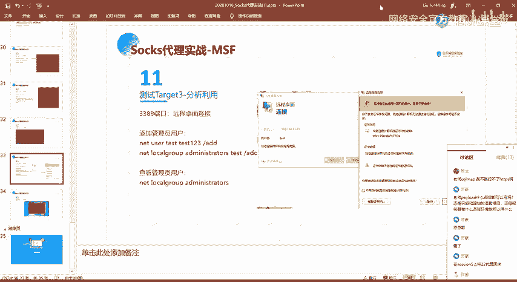

首先第一种的话，其实呃我们的1个MSF当中，其实已经有这样子的一个。啊 that's the talk。有这样子的一个。1年。第一。7。嗯。怎么用来着？有。😔，看有看题还有。

然后其实在这边呃linux里面的话有啊不看尼看里机器里面的话有这样子的一个自带的一个RDP啊啊desktop这样子的一个命令。然后在这个 desktopktop命令的话。

我们可以通过这样子的一个方法来去进行一个连接。然后同样的要注意就是我们要。

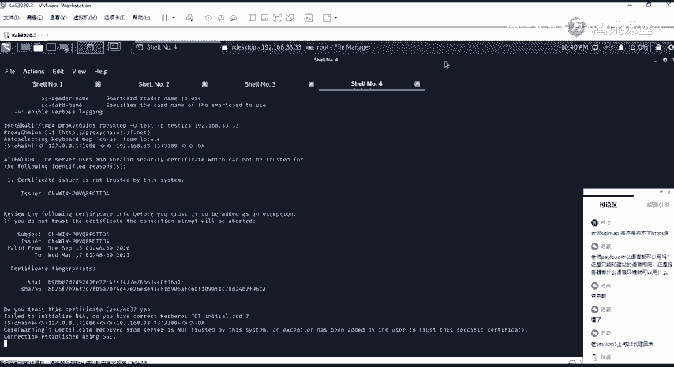

我们的一个连接的话，要走这样子一个缩死的一个通道。所以要加这个pro chance。然后连接之后的话，在这边，因为我这边的话是已经连接了。所以的话呃我这边再去连接，就是连接的话。

它这边需要去进行一个就是呃断开啊，就是要断开其他用户的一个连接，会把它挤下来嘛，是吧？

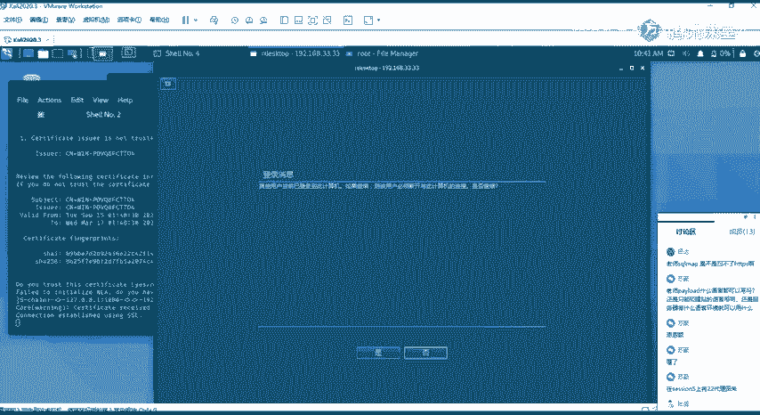

因为我这边。这边这边的话是已经。

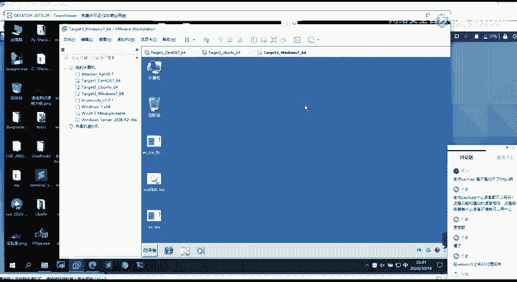

连接了吗，对吧？我这边就否了。然后还有一种的话就是就大家可能就是在windows上面用的熟练一些，对吧？那么在这里的话，我们可以通过。我们可以通过这样子的一个全局代理的一个工具啊。

就我们知道在我们的一个windows机器上面，对吧？有这样子的一个。诶。哎，远生捉面的那个是试。明天说啥来着？突然忘了是呃谁记的吗？是那个什么MET。突然脑袋就卡壳了。上一天是谁？哦。

M哦MMSTSC啊，老这突然脑袋就卡壳了。MSTF。就是这一个。然后的话呃我们在这边的话，我们可以通过这样子的一个呃在windows上面的话，我们通常会通过这样子的一个远程桌面的一个工具去进行一个连接。

对吧？啊，对，就是就这个我这。突然脑袋就卡了一下。然后的话呃在这边的话，我们可以通过这样子的一个全局代理工具啊。我们在这边可以去设置我们的一个代理服务器。我在这边的话就使用的是这个是吧？

就这一个代理服务器设置好之后的话，在这边我们需要就是设置代理服务器是这个pros service。然后去自己去做一个编辑，对吧？选择就是你的服务器端口，以及你的一个搜索的一个版本。还有的话。

如果你有做这样子一个身份验证的话，在这边就是启用它，然后挺简单的一个账号密码，对吧？然，OKOK然后选择这一个。这里这里的有个ros落实它就是规则。在这边规则的话。

其实就是设置我们走这一个代理的这样子的一个呃程序。像比如说在这边的话，我设置的话就是这一个。MTSC这个对吧？就是选择这个程序，选择这个程序的话，你可以通过这这边去寻找嘛。像这种历系统。

淘宝windows系统下面的这种呃自带程序的话，在这一个C32目录下面你可以去直接去。对吧，直接去找到它，然后的话把它添加进去。添加进去之后的话，在这边我们主要的话就是要设置这个。

action action的话就是我们的一个动作，也就是我们呃在这边的话可以选三个，对吧？de就是直连，也就是他不走代理，对吧？然后b的话就是锁住嘛，就是禁止，就是不让这一个程序去呃访问。

然后在这边proox so5的话，就是呃让这边的这个程序，它的一个流量走我们这边的一个收死的一个代理，对吧？其实这边的话就是我们想要的，然后我们把它添加进去。添加进去之后的话，我们在这边。

就去呃连接我们的那一个用户，对吧？然后可以看到在这边。你连接之后的话，它在这边就有这样子的一个呃，它会显示在这里，以及在这边有这样子的一个呃呃流量的一个请求，对吧？就是这一个程序。

他去请求了这边的一个这边IP的1个3389，它是通过我这边的一个代理。是吧然后我这边。进行一个登录。

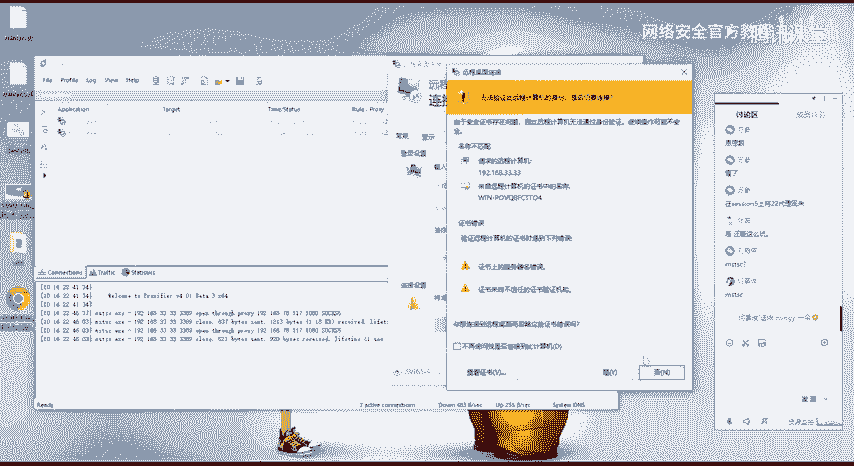

对吧。然后就能够去正正常的去登录到这边的1个33。33的这1个IP和这边。哎就好。这边的话呃因为它是一个新用户啊，就是它是一个我添加了一个新用户。所以他这边加载的话，因为他需要去加载系统的一个配置。

所以的话比较慢。啊，这边的话。

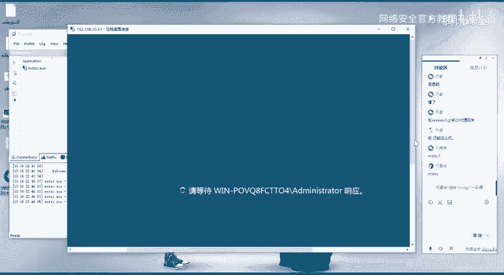

不等了吧，这边的话就不等了。就是说我们可以通过这样的一个方法，能够去正正常的去连接到我们这边内网的这一个呃windows机器的一个远程桌面，是吧？也，就是呃最后的一个效果的话就是像这样子，其实就是。好。

呃，以上的话就是我们本节课的一个内容啊。然后大家有没有什么疑问？呃，我猜应该没有什么疑问吧，就是有疑问应该是等大家。呃，自己课后去做一遍，再那个吧，好吧。

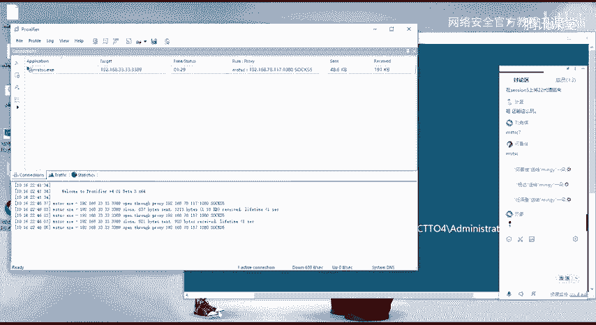

🤧然后呃这节课的一个课后作业的话就是。就是大家把呃这边已经对吧？可以连连接上来了。我这边的话不那个了，我直接断了。呃，这节课的一个作业的话就是大家。自己去。嗯，男真的。要大家把自己这边搭建的这个靶场。

对吧？

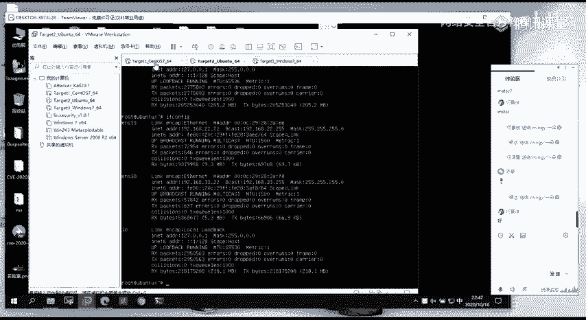

应该有去搭建吧。我在预习内容里面其实也有写，对吧？搭大家自己如果没有搭建的话，自己去搭建一下，自己搭建这样子一个靶场。搭建好之后的话，然后的话再按照我这边PPT上面的一个内容自己去走一遍。

然后有问题再再来问我，好吧。

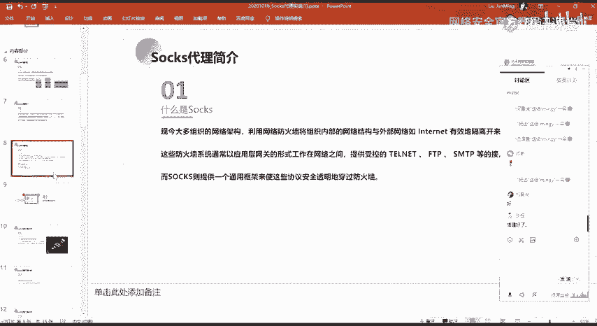

然后呃现在的话也比较晚了呀，就是。呃呃，你搭建好了的话，你自己去试一下，好吧，然后呃。大家没有什么问题了吧，应该没有什么问题吧。能主要的话呃最后还是问一句，就是能听懂啊。听是能听懂吧，对吧？

你不管说你能不能先操作，对吧？我这边讲的话应该是能听懂的吧，对吧？今天很详细呃，以前的不详细吧，我觉得以前的应该也讲的是挺详细的。嗯。😊，有没呃其他同学呢？呃，对内网的操作都是以跳板服务器。呃。

你这个以前不是说以他的一个身份啊，而是说我们在这边对吧？我们在这边的话，我们想要去进入到它的一个内网，其实是通过我们这边拿下的这一台呃外网的这一个机器，对吧？这样的话，如果说你本来就已经在内网的话。

那么那么就其实没有说有这种呃。跳板机的一个说法。当然的话就是说这一个跳板机其实是说。就像比如说你当前的话，你是在22这个网站，对吧？然后的话你你拿下了这边22。拿下了这边的这1个2。

2这1个机器的1个IP对吧？然后的话你再通过这边的这一个机器呃，来去拿下了33网络这个机器。那么这边的这1个2。2这个机器其实也是一个跳板机嘛，对吧？

因为你是通过这边的这个呃机器来拿下了这边这边的1个33网络下面的一个机器嘛，对吧？同理的话，在这边我们就是说我们要直接我们是无法直接的去访问到内网的对吧？我们有一有前提条件的。

就是说你需要有这样子的一个机器。这一个机器的话呃，它是在外网。然后的话它这个机器它是能够去有一个网卡，不能够去访问到内网的。网断的对吧？

然后的话我们才能够说以这一个机器做一个跳板机来去进行一个内网的一个渗透，对吧？

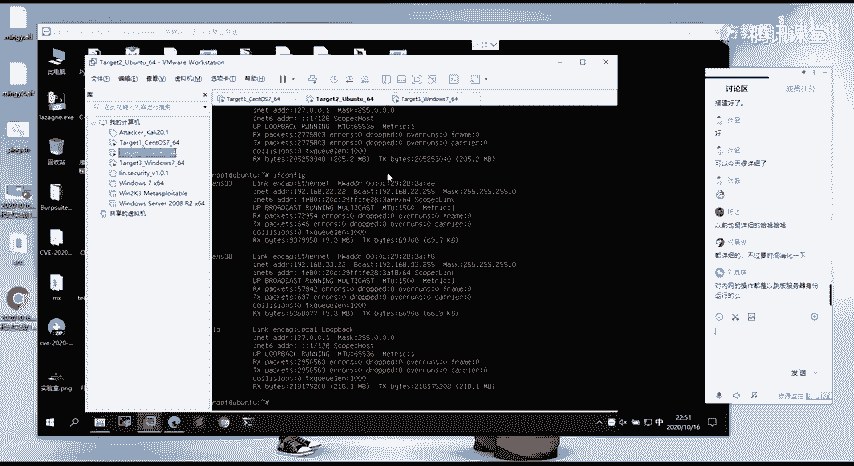

就同理的话，我们最后的对吧？我们最后的这边的话。我们最后这边通过前面的像3我们最后这边拿下33。33这个机器的话，是通过前面这边22。2这个机器的一个需，对吧？然后的话我们其实这1个2。2这个机器。

你也可以是作为一个也也可以是把它当成一个跳板嘛，对吧？因为像这种这种的话不是一个横向渗透，是一个就纵向的一个渗透嘛，对吧？它是多个网段的这样子的一个渗透。

然后的话你通过中间的这一个机器拿下了另外网段的一个机器。

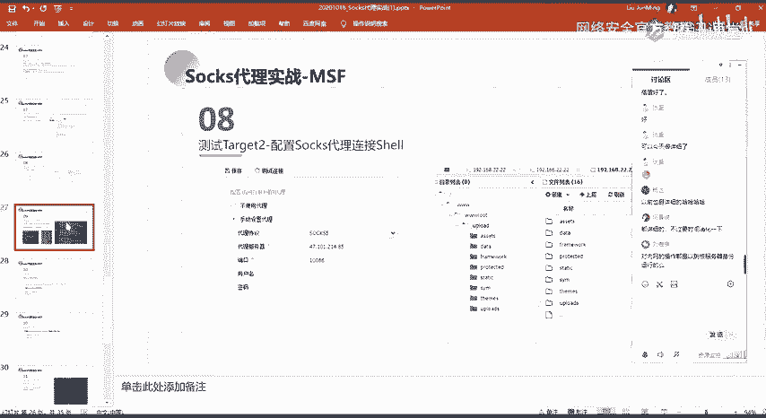

没意见吧。

这位同学还有问题吗？理解了吗？嗯嗯。O。呃，大家都没问题了。好啊，那就下课吧。好吧，今天讲的有点晚了。现在还听课的也没几位同学。啊哦，大家也早点休息吧，好吧。😊。

