# B站最全网络安全教程，整整1300集，全程干货无废话，别再盲目自学了，看完学不会我退出网安圈！（web安全｜渗透测试｜内网渗透｜CTF） - P87：86. 第三十六天：FRP Socks代理.mp4 - 网络安全官方教程 - BV15u4y137cQ

🎼从前我的。🎼저。🎼的见。🎼空。🎼的世界。🎼，🎼谁。🎼匆匆这行。🎼期望从未破。🎼好不座想。🎼烦好的人说的爱。変到。Yeah。気ち？H。🎼好的。🎼当你深。🎼。

🎼雨后路人花为。🎼欢于摇曳摇曳。🎼参暴的世界。🎼光芒捧起你的脸。🎼我飞在云层间。😔，🎼狂奔向你不停歇。😔，🎼你说最好的。🎼回到身边。🎼可我也这样想。😔，🎼你终将看到我最。🎼はいない。いや？🎼出现。

🎼等着。🎼这一切。🎼都被你了解。🎼十指走落向前。😔，あい。🎼的时间再没有分别。🎼携手走过。🎼明天。🎼总会有些幸运会出现。😔，🎼我等待这一天。🎼总有。🎼艰险哪怕是谎言。😔，🎼我等待你出现。🎼成全。

🎼的地确。🎼都被你。🎼却。🎼失指错路向前。😔，跨月。🎼的时间。🎼再没有分。🎼携手走过明天。🎼Yeah。🎼着。🎼一切。🎼却都非你了。🎼不却。🎼是。🎼多平淡，所以自己可以为你。🎼多遗憾。🎼被抛弃的。

🎼没去看。😔，🎼想被人。😔，🎼遇见了。🎼就特别放不开。😔，🎼都在期谈角色摇晃。😔，🎼别委屈了人才。😔，🎼失记的。😔，🎼伤人的话变得容。😔，🎼也跌揭穿。🎼石潮着电影不海。🎼歌唱有之而作。😔。

🎼嘲笑你多难过。😔，🎼你越反动，越想示弱，请别再找。😔，🎼的我。🎼我可以为我们都算承担一半，可我偏要摧毁所有的好感，看上只能孤独的很圆满。😊。

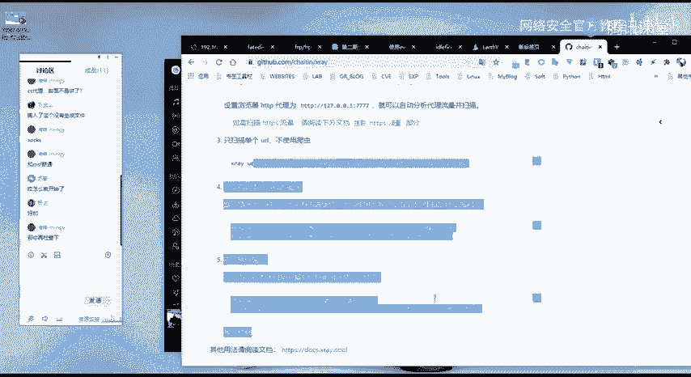

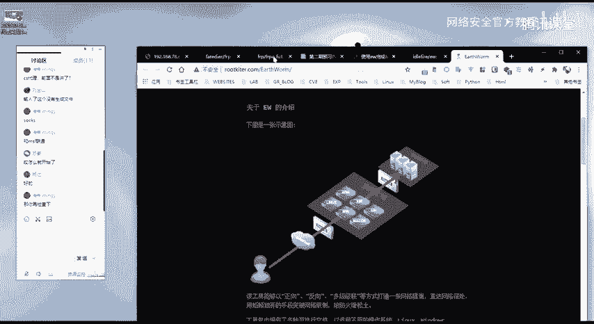

🎼我做作的表情让自己很难看。😊，🎼可感情这玩意儿怎么去算别？😊，🎼两难。🎼没完了。🎼少了有点不甘。🎼穿脱。🎼的太发。🎼他。🎼而啊。🎼那。啦。🎼多困难。😔，🎼横话有几句新鲜的。🎼又有多难？

🎼掩饰掉全纯的伤痕。😔，🎼我毁了艘小船。😔，🎼比我们隔着爱。🎼冷眼旁观最后一段，最白还有点蓝。🎼你可以为我们的伞不用承担，使我投入逃一半，感到不安，好过未来1。1点纠缠。🎼我梦里摘下的那颗廉价之花。😊。

🎼像赠平复松满人群涣散，心很酸。😊，🎼夜。🎼看到。🎼难过若写不完。🎼用情歌招难。🎼我非要说了的黄冠还不肯扎。😊，🎼在被伤命前前举被离散，为何亏欠的人特别勇敢？😊，🎼我知道你的恨开始无限扩散。😔。

🎼该流的泪才更刚流一半，别有关。😊，🎼就两端。🎼故事已经说完。🎼难得远。🎼啦。🎼老。🎼流浪。🎼了。嗯。

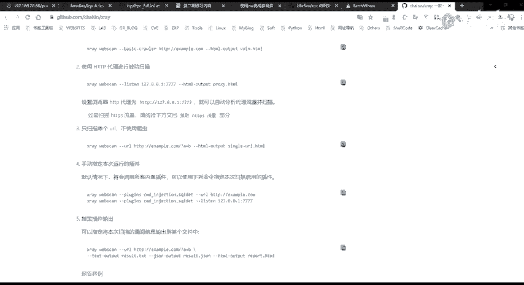

🎼Co。

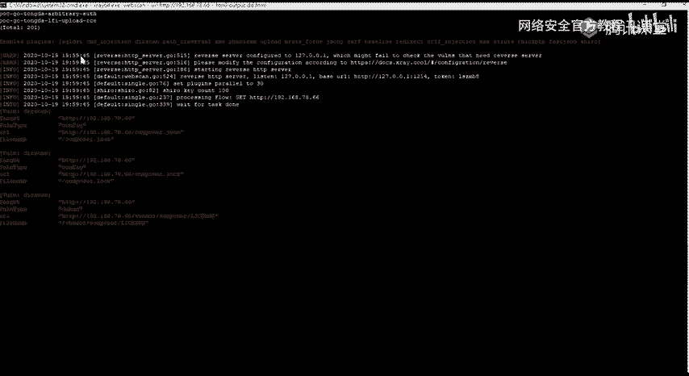

🎼Their goal is not a heart beat。

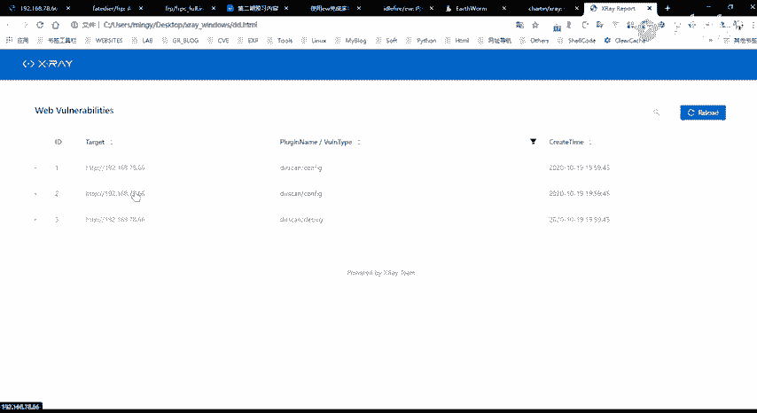

🎼Because you are the reason。

🎼Im losing my。🎼Please， come。🎼And there goes my mother， the race。🎼很久 are the we。🎼Let I so。

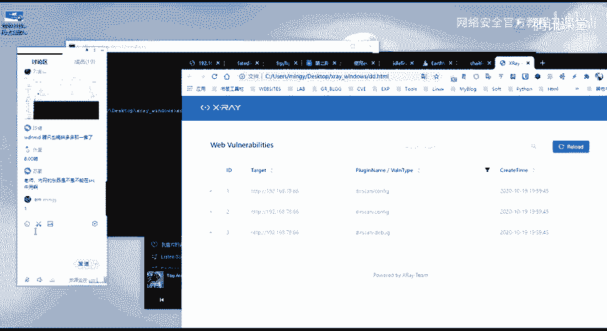

好了，大家晚上。喂，能能听到我声音吗？以及有没有杂音什么的，或者定流麦。啊，应该没有问题啊，没有杂音。好。呃，你刚刚说的这个SRC就一般的话，你SRC的话，一般都是像这种呃你S你YSRC不都是一般的。

主要的就是面向于这种外b服务嘛，对吧？给你一个网站，给你一个域名，给你1个IT像这种然后的话让你去那个一般的话你而且他你去弄它的这一个SRC的话，它会有这种限制的呀。不可能说你拿到了它的一个需。

然后正好能够去进内网的话，你还去进行一个内网漫游这种的。一般的话呃。YRC的话不会涉及到这种就是在内网去做内网渗透内网外游的这一些。就一般的车的话都是像外网的这种外表服务的一个一些漏洞。好，呃。

我们正的开始我们今天的一个课程内容。我们今天的话主要给大家介绍那个ss的一个代理132。我们上节的话是呃给大家通过就是说。通过这样子的一个靶场，就是这样子的一个商层网络靶场，让大家就是呃。

比较好的去理解这样子的一个ss代理的一个内网穿透，对吧？我们通过这样子的一个ss的一个代理来实现了多层网络的这样子的一个内网内网穿透。就呃我们要经立的这样子的一个ss通道来去进入到内网。

去访问内网的这样子的一些服务。然后我们本集的话呃给大家介绍的话就是这2块内容。第一块的话就是说代理的1个FRP。第二个的话就是EW。这两个这边的话是两个工具的一个使用。

其实他们的一个呃思路以及原理的话都是类似的。主要的话主要的话就是让大家呃理解它的一个思路，以及它的一个基本的一个使用。呃，首先第一个的话就是FRPFRP这个工具的话，前面的话呃。

在第在第一部分的时候有给大家介绍，对吧？介绍那个说指代理的一个常用的一些工具。然后呃这边的话我们使用的一个场景的话，同样的是。呃，这边的这一个把机靶机的这一个场景。然后这边的话我就不多说了啊。

然呃前面的这样子的一些步骤的话都是。呃，类似的这边的话，这些的话应该没有什么问题吧。大家。这边的这一些内容的话应该是没有问题吧。就呃大家有自己去做吗？应该呃没有碰到这种问题吧，是吧？

就比如说你去扫扫端口，扫不到对吧？这种应该没有问题吧。Oh。嗯，好的。啊，呃，这一些前面这一些部分的话，因为上节课已经讲过了，我就不多说了。就因为呃为了让这一个流程就是完整一点，对吧？

所以的话我同样的把上一节课的PPT的话也贴过贴出来了，就是呃就是你就算你没有呃做或者说没有听上一节课的一个内容，对吧？你拿着我这个PPT，你同样的可以照着这样子的一个步骤，对吧？这样子的一个流程。

用这样子的一个代理方式来去进行一个操作。啊，我们直接的话跳过就是说前面已经讲过的，就给大家主要介绍呃，没有去讲到的这样子的一些东西。然，前面我们这边通过就得到了它的一个sha，对吧？

通过这边的一个8年的一个think个PP的一个远程命令执行漏洞，得到了它的一个web share。得到这个web share之后的话，我们对它进行相应的一个主机信息收集。

然后的话发现了这样子的一个存活主机，对吧？然后发现这一个存活主机的话，因为我们当前的这样子的一个主机的话是我们呃。我们看这个图是我们这边拿到了这一台tett一的这个机器，是吧？

就我们通过外网的这个web服务，拿到了它的这样子的一个机器的一个work share。然后这个机器的话，它是呃在外网的，我们在我们在外面是能够去直接去访问到这个机器的对吧？

然后的话这个机器它同样的又存在有这样子的一个通向内网的一个网卡，这个网卡的话是一个22点1已经知道能够去进入到2这一个网站，是吧？我们想要对22这一个网站去做一个测试，那么我们就需要去访问。

或者说去找到22这拼的一个需要脚本，对吧？找到这样子的一个存活主机，我们知道这个网段有一个存活主机。那么我们想要去对它做一个测试，对吧？但是的话在这个的话有一个问题。

就是说我这边得到这个web share，它的一个功能啊，或者说我们的一个操作的话是有限的是吧？我们想要去做更多的一个操作，对它去去进行一个呃端口扫描，对吧？

去进行一个服务的一个探测等等的这样子的一些操作的话，我们在这样子的一个web share下面去操作的话，是呃比较麻烦的。呃这边。Yeah。是吧。去这样子操作的话是比较麻烦的。

所以的话我们通过这样子的一个建立这样子的一个收索的一个代理通道。把我们这边我们通过这边的这一个需对吧？把它的这样子的一个呃呃这一个网段，或者说把这边的这个机器的一个需。

我们把它通过ss的一个代理代理出来。然后我们通过这样子的建力，这样通过这样子的一个说代理通道来去访问这边啊，原本在外网访问不到的这样子的一个内网的一个2的2。2的这样子的一个网段，对吧？

这就是我们去建立这样子的说 span通道的一个呃原因以及意义。然后我在这边在前面的话是介绍的是直接用MSF对吧？我们MSF的话，它有集成了很多的这样子的一一些功能，就是比较简单，是吧？

我们直接去进行相应的一个配置安装的一个流程去配就OK了。好，呃。对了，就是上节关于上节课的那个MSF的这样子的一个说词代理，大家大家还有疑问吗？嗯。😊，就是呃还有还有没理解的吗？

因呃周末的话也有同学问我有有也有同学问我这个，但是这个东西的话。我用发消息的这种方法去跟你沟通交流的话。讲不清楚，就是所以我建议你还是如果你没听懂的话，你先去看那个录播是吧？

去看我那个在上课的时候讲的那个东西。然后的话你自己再结合你自己去自己的一个操作来去理解，好吧。如果呃如果还有问题的话，这节课呃这节课如果后面有时间的话，再给大家去做一个介绍。好吧，然后到时有问题的呃。

直接提。好，我们重新呃回到PPT在这边的话，我们所要去使用的就是这一个所FIRP的这样子的一个工具。具体的一个步骤的话就是像这样子，我这边的话以截图的一个形式呃。给展示出来了。

首先的话我们需要有这样子的1个VPS就是说呃就是说我们要去做这样子的一个代理通道。其实上节课也讲，对吧？我们想要去把这边的这样子的一个搜索代理，把它呃代理到呃一个我们能够去访问到的一个地方。

也就是说我们在内网也能够去访问到的一个地方，那么我们就需要有一个公网的1个IP对吧？所以的话呃在这边你需要有一台这样子的1个VPS，也就是啊有一个这样子的一个公网IP。然，呃在VPS上面的话，我们。呃。

我这边打开我这边的。这边的1个VPS。哦，我这边的话已经就是呃下载好了。呃，这一个关于这个FRP的一个下载，应该不用那个吧。呃，在那个预习内容当中。呃，这边。

在这边的一个预行内容当中，然后在这边的话，他有就介绍这样子的FRP这个工具的一个详细的一个使用了。然后呃。我们要去下载，就是说在这边的话，它是它的一个就是一个源码嘛，对吧？然后我们。

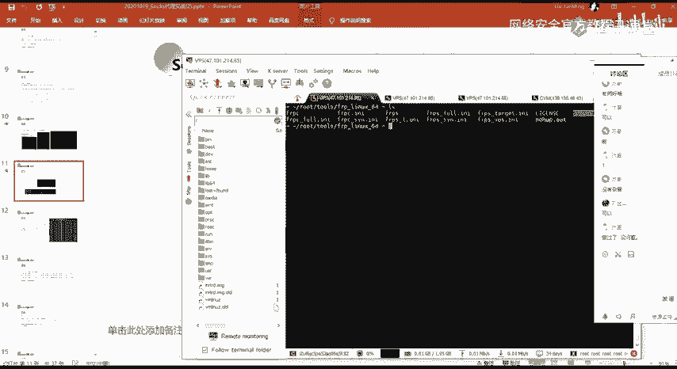

在这边要去下载，它已经去编译好的话，我们在这边在这边有一个release。rease的话就是已经就是已经编译好的这样子的一个版本。

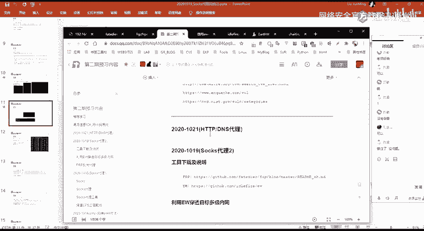

然后在这边的话，我们可以找到这边最新的0。34。1这样子的一个版本，对吧？

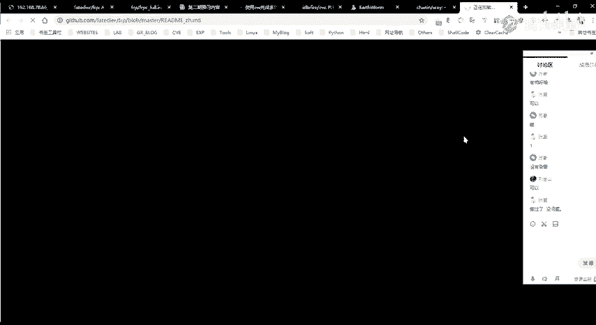

麦克用什么虚拟机比较好？m克的话呃，我主要我没怎么去用过m克，麦克的话不是有一个那个。呃，用VIYI选吗？还是呃筛选还是什么来着，你百度一下吧，好吧。也是跟vivo是呃一样的。

就是在mac下面去使用的一个虚拟机。然后呃在这的话就有列出了这样子的一些版本嘛，对吧？像windows643386的，就32嘛，对吧？还有其他的一些像linux上面的。

然后呃建议大家的话可以就是把像常用的这种linux对吧？以及windows的这几个版本就下载下来嘛，对吧？然后我们直接就可以在要去用的时候就去用了。嗯。🤧嗯。然，可在这边的话。

我在这边的话就已经下载到这样子的1个VPS上面去了。然呃在这的话就有这样子的一些呃文件，对吧？然后关于这个FIRP的一个使用的话，其实也比较简单，就是。嗯。就是使用的话就是这样子。

它它的一个使用的话就是它有这样子的一个。首先它是有一个这样子的1个FRPC。

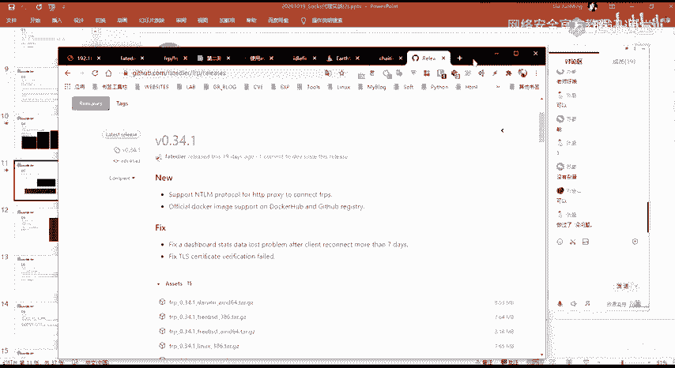

FRPC的话就是这个FRP的一个客户端。然后FRPF呃FPS的话就是它的一个服务端。

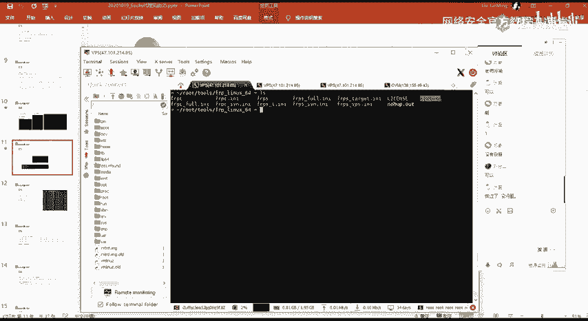

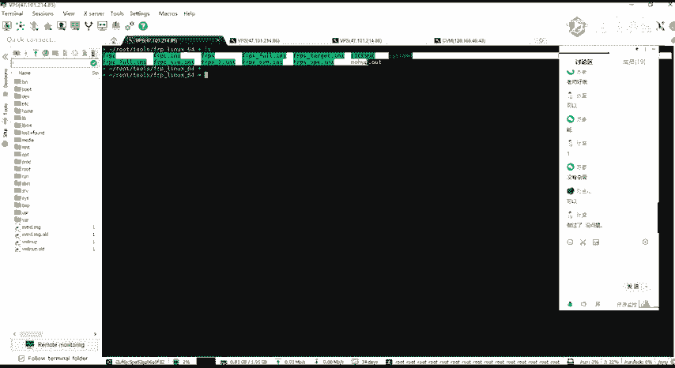

这里。这个是客户端，这个是服务端。然后的话他要去进行一个呃操作，已经呃操作，或者是说去进你进进行一个说词代理通道的一个连接的话，它我们需要去相有相应的一个配置。然后它的一个配置的话。

它是通过这样子的一个配置文件的一个形式去进行一个呃存储的。

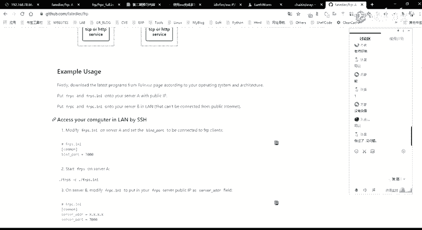

像我们呃我这边比如说这个FRPC。点解。

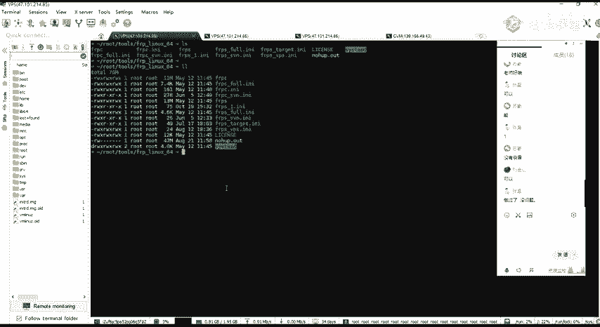

He。就是在这边的话，就是它的一个配置文件。然后像这边这边呃中括号包裹的这一个的话，这一块的话就是它的一个相当于是一个注释一一样的一个东西。然后呃在。

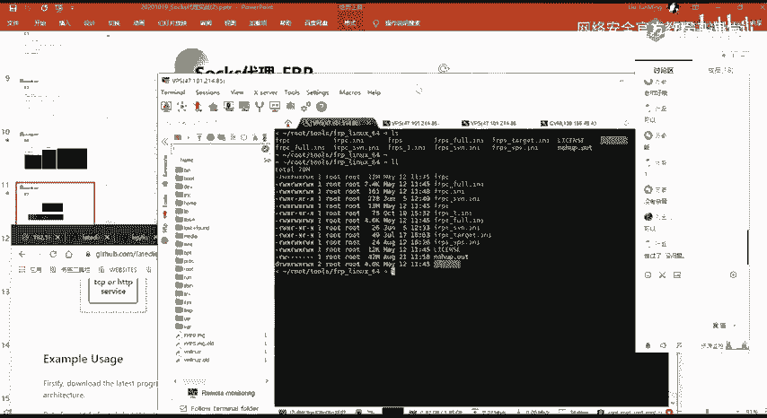

一般的话就是在这边的话，我们可以就是标明我这边的这一个配置，它是主要是重啊，用来干嘛的对吧？然后下面的话这里的话就是我们的一些配置的一个选项。关于这些关于这些配置的选项的话，大家也不用。呃。

大家大概记一下就是常用的就可以了。就呃常用的话，我们我在这节课的话都会给大家去讲到了，就是然后在这的话我就不单独的去讲。然后呃我在进行操作的时候，再分别给大家去做一个介绍，好吧。呃。

首先的话我们需要去建立这样子的一个说持的一个服务。然后我们的一个说的一个服务的话，就是通过这样子的1个FRD。8PS这样子的一个呃服务端来去进行一个建立。然后我们要去建立的建立这个服务端的话。

我们需要去呃就是绑定一个端口。呃，这边没有去看那个谁体。

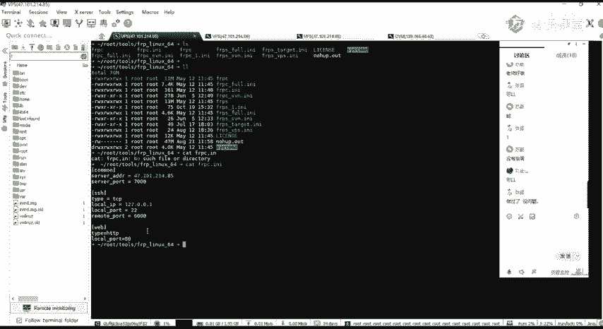

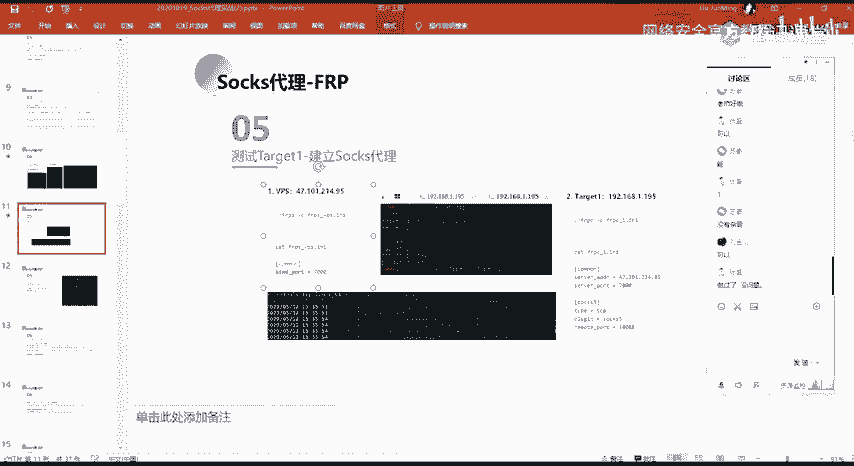

呃，像这边的话就是呃。我用来作为1个FPS，就是进用这个FPS这一个服务端去呃配置的这样的一个配置文件。然后在这边的话主要的它就是就这一个选项，就是这一个ban port。

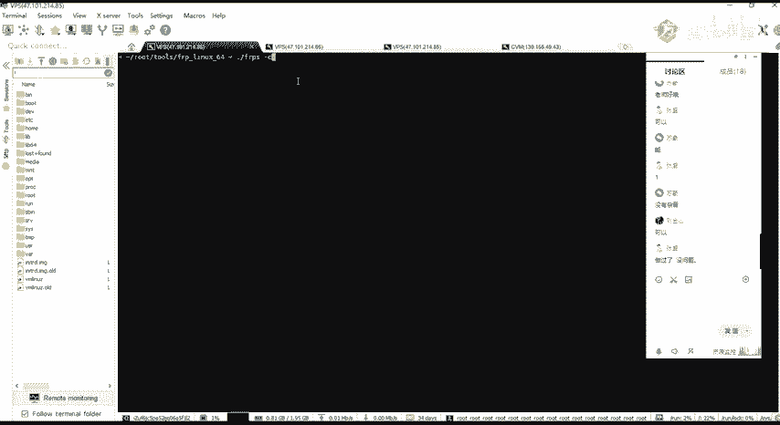

发的port的话就是表示我们这边啊执行之后的话，他会在本地去监行这样子的1个7000的一个端口。我们可以来咨行。然后我们指定配置文件的话，用这样子的个杠C选项啊然DS呃，1点INI然后执行执行之后的话。

它就会在我们本地去今天这样子的1个TCP的1个7000的一个端口。我们可以在另外一个终端。来查看一下它是否处于一个进天的一个状态。提0对它是一个精天的一个状态。

然后它的它的一个使用的一个服务的话是这个FRP。然后在这边的话，我们就建立了这样子的一个s的一个服务端，就是这个FRP的一个服务端。建立好之后的话，我们需要去呃让客户端去进行一个连接。

然后现在我们这边的话，在我们这边的话。

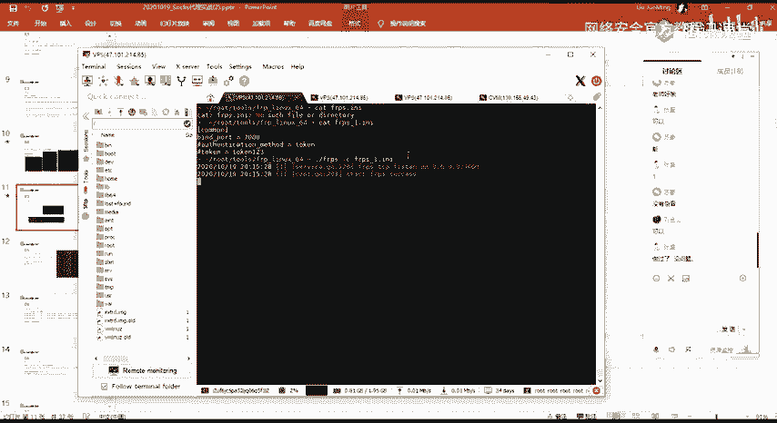

在我们这边的这一个场景的话，我嗯。我这边我这边的话已经得到了他的这个呃。

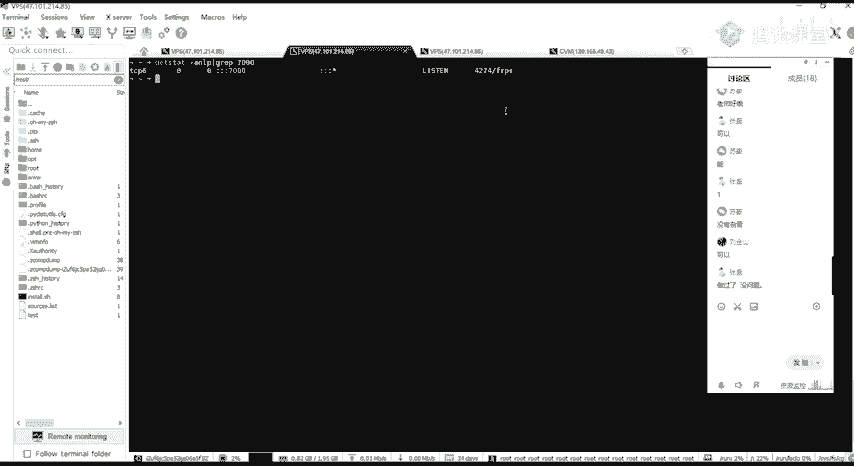

外网的这一个外b服务的一个sha，对吧？然后我在这边我想要的话是把当前的这边的这一个呃需要的话，把它就是做一个代理。

就把这边的这一个内网的这一个网段，把它带理到我的一个呃公网上面去，对吧？那么我在这边的话，我就需要有1个FIRPC的这样子的一个客户端。因为我需要在这边呃在这边的这一个外b服务。外b的一个服务器上面。

与我们的这边的这一个VPS上面的一个FIP的一个server去建立一个连接。

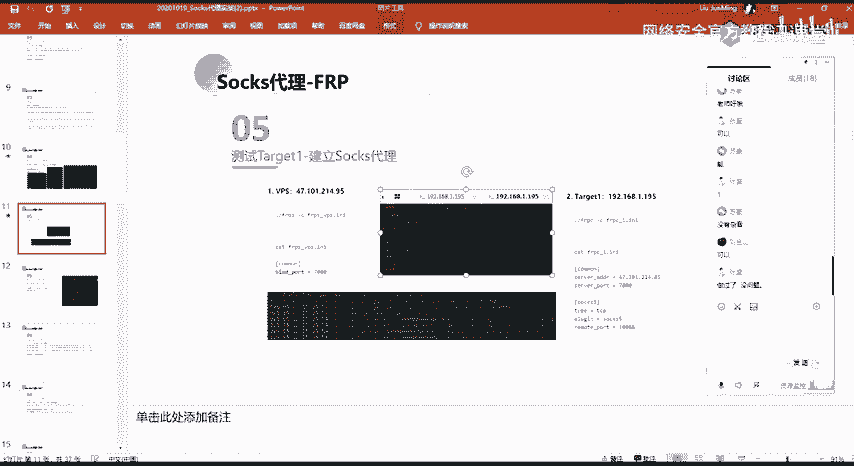

因为呃其实我们首先需要有这样子的一个连接。进行这样子的一个连接之后的话，我们才能够有这样子的才能够去进行一个数据的一个传递，对吧？才能够去进行一个流量的一个转发。

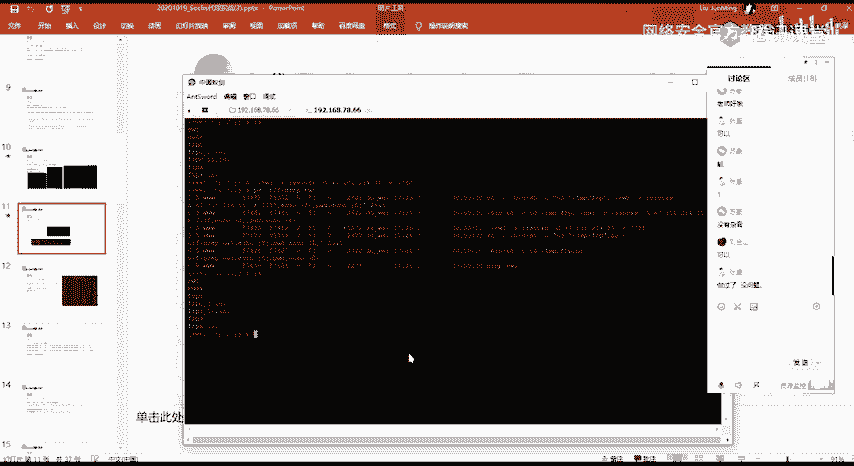

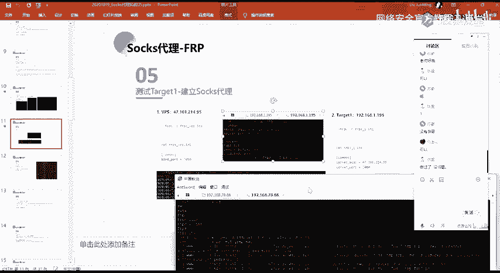

好，呃在这边的话。

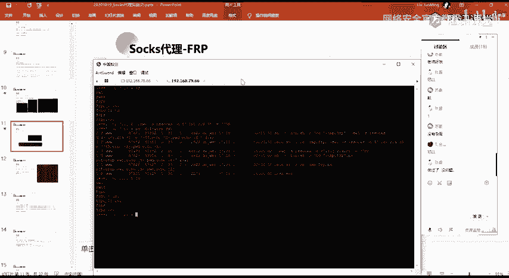

我们通过这样子的一个方法呃。首先的话第一步的话我们需要去上传一个去上传一个我们的1个FRPC。

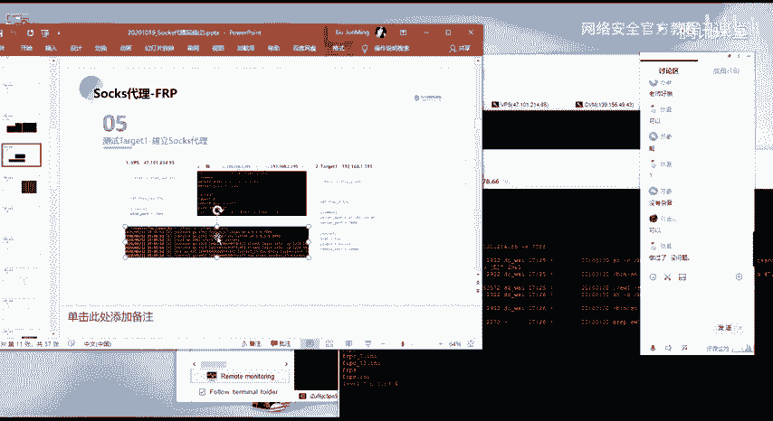

上传到我们的一个这样这边要去就是代理的这样子的一个内网网段。然后呃我在这边的话是上传到这个temp杠FRP这样子一个目录。因为呃我这边所要的一个文件的话比较多。而且time步下面的话就是。

它里面的一些文件名的话比较杂，对吧？像这样子的话就不是很好分辨。所以的话我这边单独进了一个文件夹，然后放到了这边。然后呃在这的话，我们只需要就是像在已键的话，我直接右键上传嘛，对吧？

把我这边的一个呃FIP给上传上去。FIPC上传上去，上传上去之后的话，就到了这一个目录，对吧？然后的话我们还需要去进行一个配置，主要的话就是这边的一个配置文件。

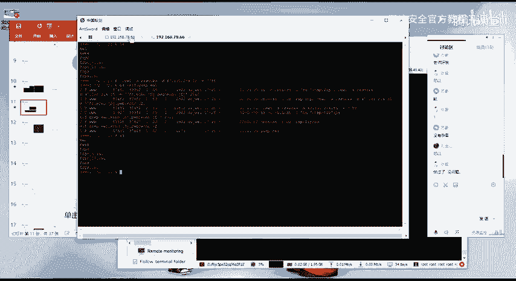

这边的一个配置文件的话，我们要去建行一个缩取通道的话，呃，在FRP当中的话，它有提供了这样子的一个bugon，也就是插件。呃，关于这边的话，大家可以去看，就是它的一个。文档。

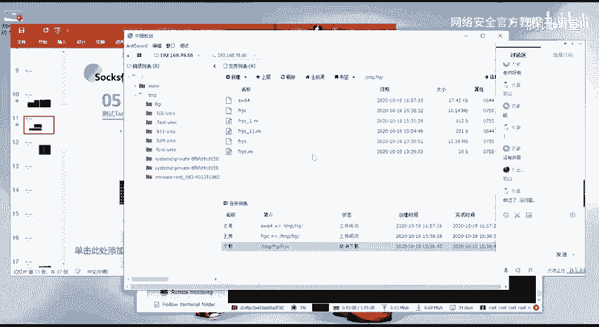

呃，在这边的话就是客户端的话，插件它有就是有提供了这样子的一个内置的插件。像比如说HTP的一个代理sox5啊，还有呃这个我不知道。

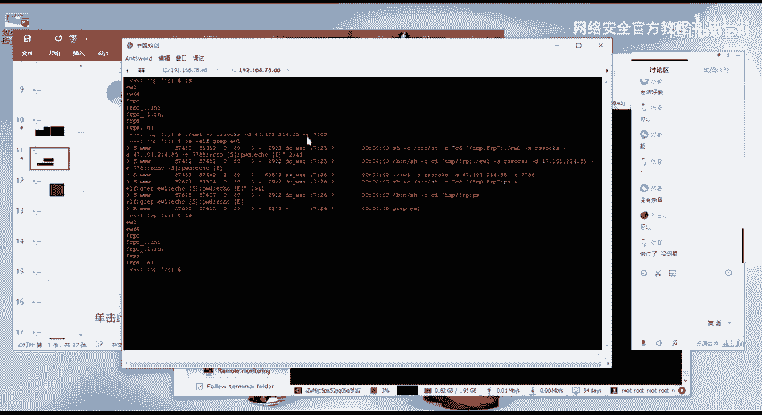

呃，一般的呃主要的话就是用它的一个说词，还有的话HTP啊。

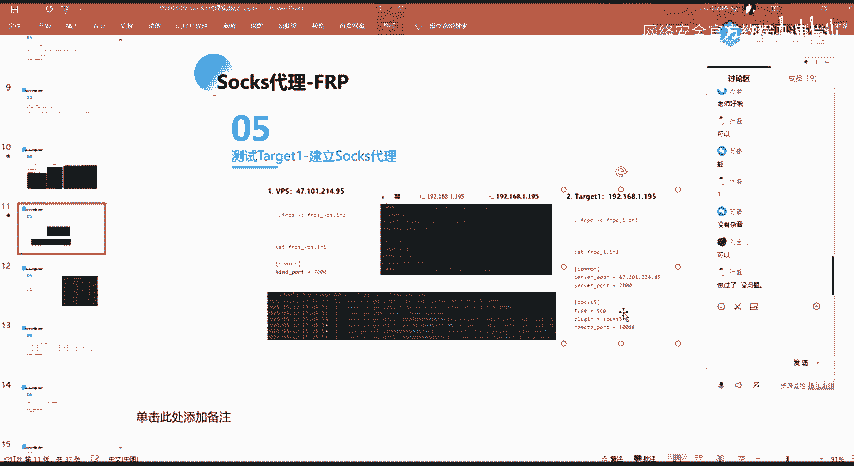

然后我们要去用它的这样子一个插件的话，我们的一个配置文件的一个写法也是比较简单的，只需要像这样子。

即呃。在这边我直接在这边吧。RPC就这一个只需要在这样子的一个文件当中去写这样子的一个内容啊。首先的话就是呃这边的一个common commonmon下面的话就是sve addresssve address的话就是指定我们的1个FPS就是我们的一个呃服务端所在的一个IP。

然后的话或者的话就是他所今天的一个端口。其实这边的1个IPC端口的话，就是我们这边对吧？我们在这边去今建今天的这样子的一个端口，就通过FRP建立了这样子一个服务端。

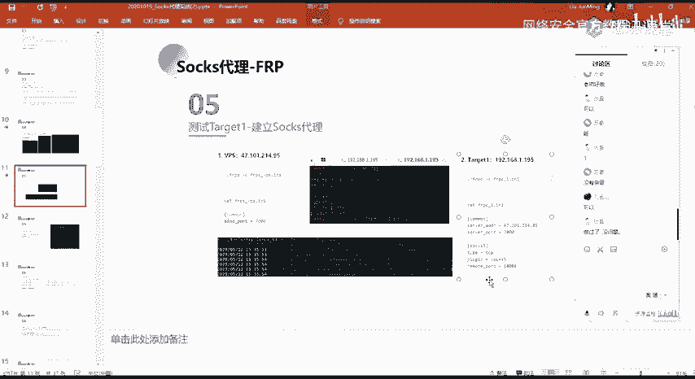

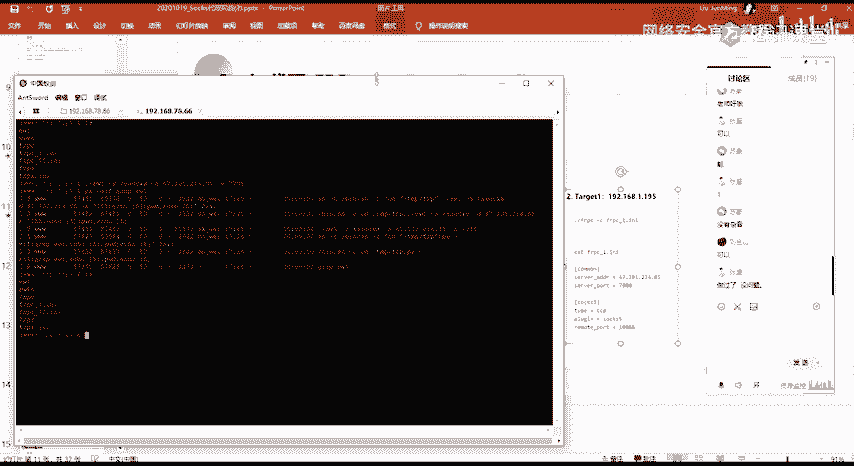

然后这边的话是我这个VPS的1个IP以及呃这边今天的一个端口，对吧？当然的话端口这里的话，你可以改嘛，改成你谁你你想要的这样子的一个端口都是可以的。好后下面的话，我这边的话是呃s5。

就是呃表示我下面的这一个配置的话，就是呃来去建立这样子的一个说服的一个通道。首先第一个选项的话就是一个type。type的话就是指定我们这边的一个零件，或者是说呃我们的。这样子的一个呃数据的一个传递。

它是用什么样子的一个协议啊？在这边的话，我们知道s的话，它的一个通道的一个呃数据传递的话是通过TCP的一个协议，对吧？如果说你是HDP的话，那么或者说你你是呃你是要去做一个web的一个服务，对吧？

你只是要去转转web的一个某一个端口。那么我们泰普这边的话就是指定我们的HTDP对吧？因为它是通过HPPT的一个协议去进行一个传去进行一个呃呃传递的访问的。

然后下面的话就是pingping的话就是指定我们的一个插件。在这边的话指定你的一个s5就是插件名。然后呃还有像在这边，像HPP的话，就是HPPpro pro对吧？嗯系。

然后呃第三个的话就是这一个remote port，remote port这个的话呃。这一个的话就是我们在这边呃在这边对吧？前面的这一个配置的话，就是它会与我们这边的1个FPS去做一个连接，对吧？

它会建立一个连接。它建立连接之后的话，它就会呃在我们remote port，也就是我们远程的这一个机器上面。因为当前我们在这边的话是在这一个内网机器上面，对吧？

然后我们在这边指定这个remote port的话，它就会在我们的一个FPS上面，也就是在我的1个VPS上面，它会去精听一个这样子的1个1008的10088的这样子的一个端口。然后这一个端口的话。

就是我们通过这一个端口来去呃访问，或者是说把我们的一个流量，把它给转到我们这样子的一个呃shop的一个通道当中。对吧就就像我们呃之前对吧？之前在去做这样子一个通道的时候，对吧？呃，就是在MSF当中。

我们用那个收拾的一个代理模块，因为它是今天在我们本地嘛，对吧？然后我们再去做一个配置的时候的话，它建立的那个收拾服务的话，就是它的一个我们需要通过它代理的那个端口，对吧？

一般的话是101080的那一个对吧？然后的话在指定那个呃MSF服务器，或者说那个ss代理服务器所呃建立的那一个主机的那个IP加它的一个代理的一个端口。我们就能够去代理我们想要的这样子的一个一个流量。

对吧？然，呃在这边的话就是呃我们通过这样子的10088的这样子的一个端口来去呃代理我们想要的这样子的一个请求，或者是说流量。那我们的一个配置文件呃。

同样的需要去写入到它写入到我们这边的这一个内网机器上面去，对吧？也就是在这边然后我们。配置准备就去之之后的话，我们就只需要执行这样子的一条命令。呃，我当前的话是已经在了这样子的一个目录啊。

就在这一个目录，对吧？然呃大家要注意的话，就是呃你上传的这样子的一个这种可执行文件啊。要注意的话，你首先第一步你需要去给他一个执行权限，就是全mo加X。加X，或者说你直接给777也是可以的。

然后的话呃加你要去执行的这样子的一个可执行文件，对吧？我这边要去执行那话这个FRBC。

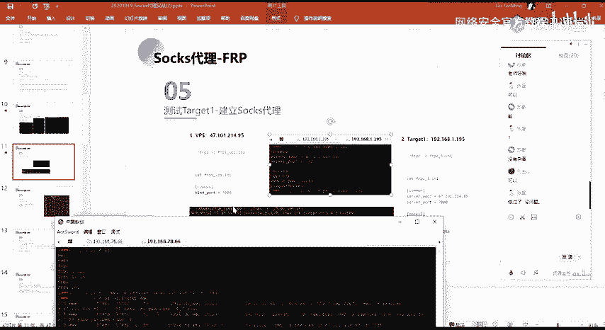

然后呃我的一个配置文件块就在当前目了。所以的话我要去与我们的一个服务端去进行一个连接。我只需要去执行FRPC然后杠C指定我的这边的一个配置文件FRP。呃FPC杠一。然后执行之后的话。

我们再回回到我们这边的。EPS。Yeah。

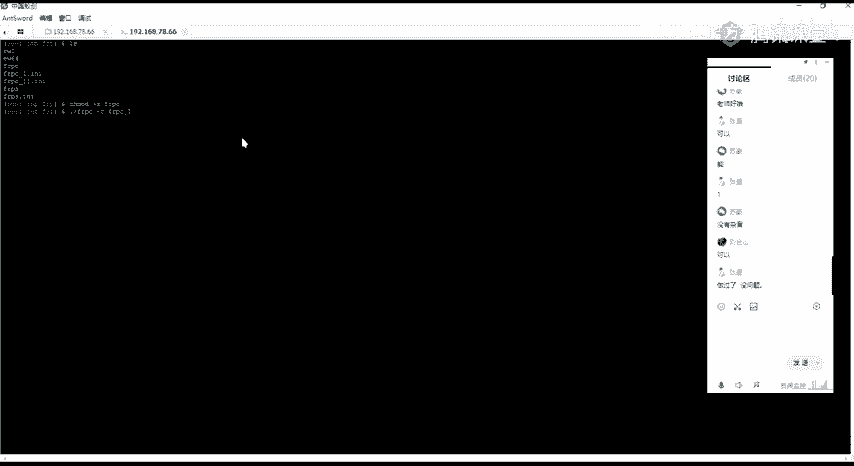

嗯。

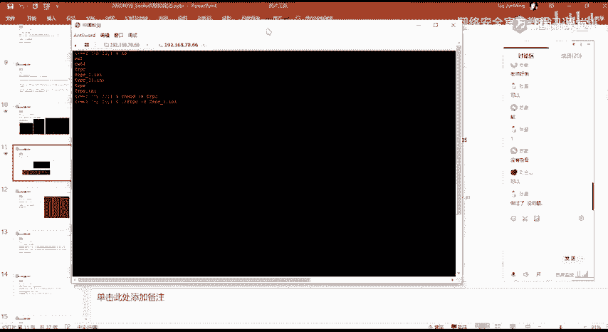

Hluello。

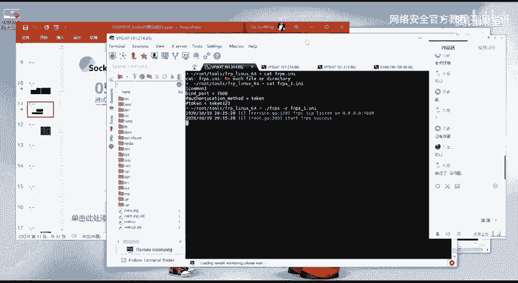

七点点个事频。嗯。只有房灯。Yeah。

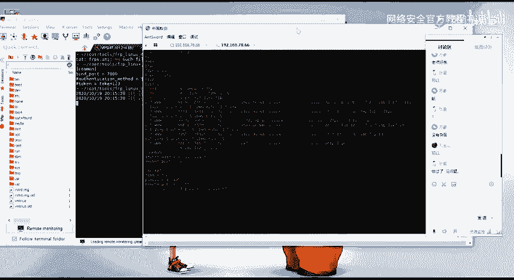

这怎么回事呢？

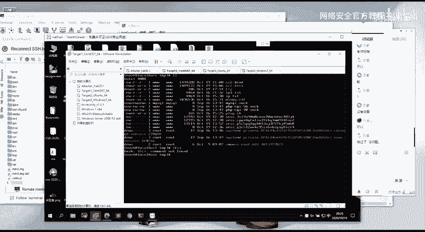

可。哦，就是应该是我之前有有了这样子的一个反PC啊，有以的话我这边再去执行的话。

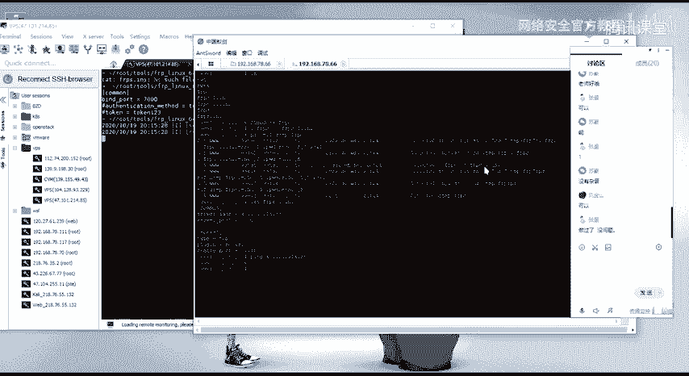

他没有起来。Okay。我这边再子给一下。去。Yeah。哦，是我这边的服务端的呀。嗯。

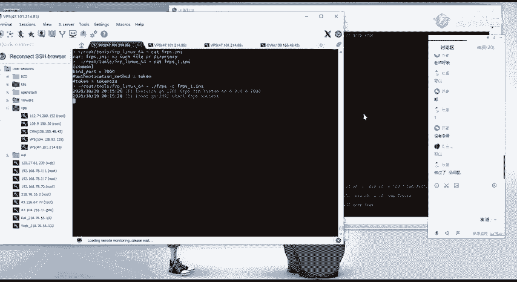

Oh。哦，可以了，刚刚的话是我这边我这边的这一个连接断掉了，刚刚直接这边的这个终端卡死了，然后这边等于等于的话这边他没有去进行这一个7这一个7清的这个端口，没要在今天了。所以我这边执行的话。

他在这边跟这边没有去建行一个连接。然后现在的话就已经建立了这样子的一个连接了。然后我们其实从这边的话可以看到，就是有有了一个newpro这一个s5，就是已经建立成功了，对吧？successful。

然后其实这边的一个s5的话，就是呃。

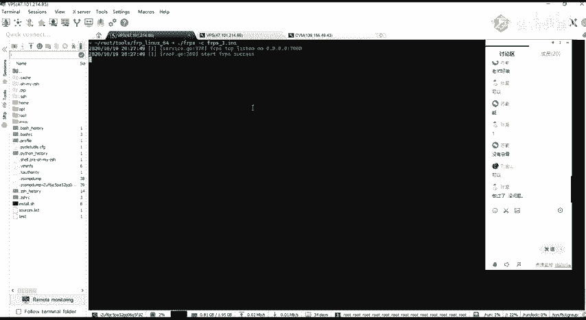

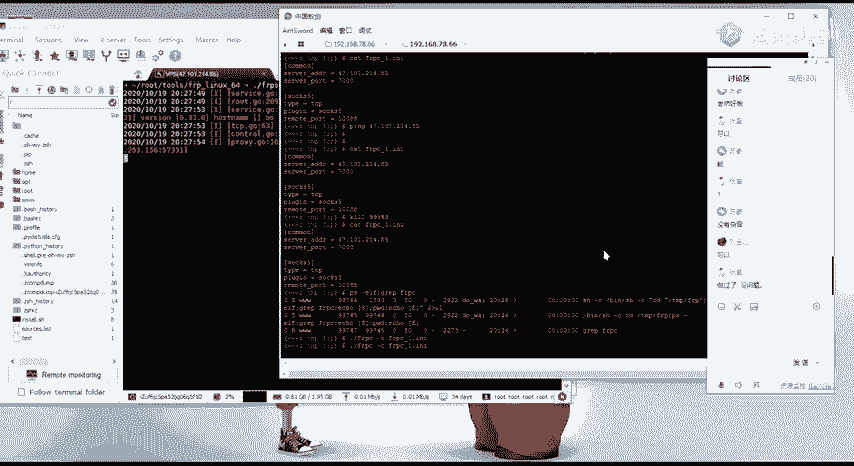

就其实就是我这边的这样子的一个配置文件，这边所标注的这个。所以的话就是呃大家再去做这个，如果你的一个配置比较多，对吧？或者说你的每一个配置的话，它的一个作用的话不一样的话。

我们可以通过在这边去做这样的一个配置，能够在这边以及能自己的这样的一个配置文件能够去比较好的一个区分。

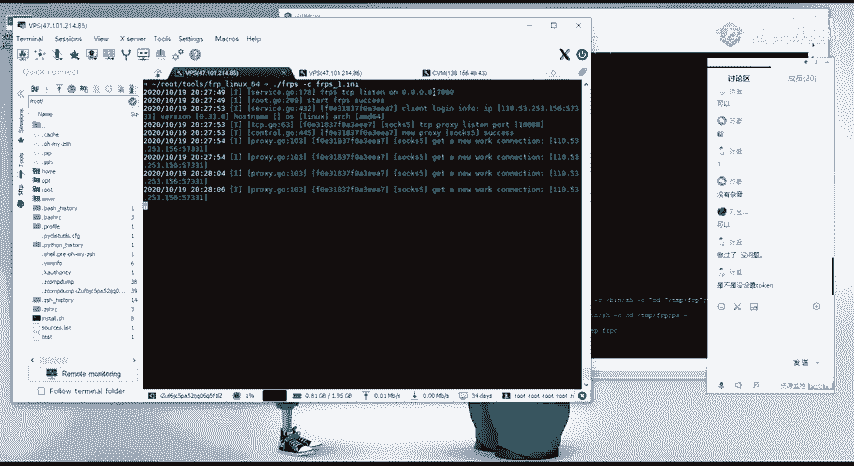

然后现在这边我们建立成功了对吧？建立成功之后的话，我们在我们的1个VPS上面去查看一下，去验证一下这边的一个代理通道，它是否建立成功了。怎么去验证呢？就我们前面有讲到我们这边建立成功之后的话。

它会在我们的1个VPS上面去进去今听这样子的一个端口，对吧？这个10088的这样子一个端口，那我那么我们可以查看一下这个10088。

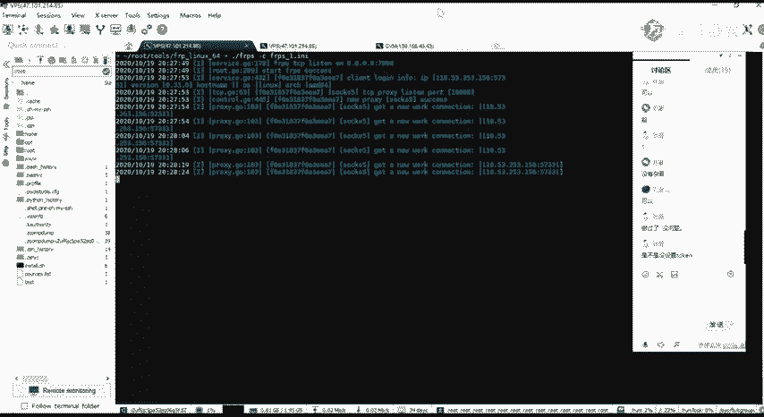

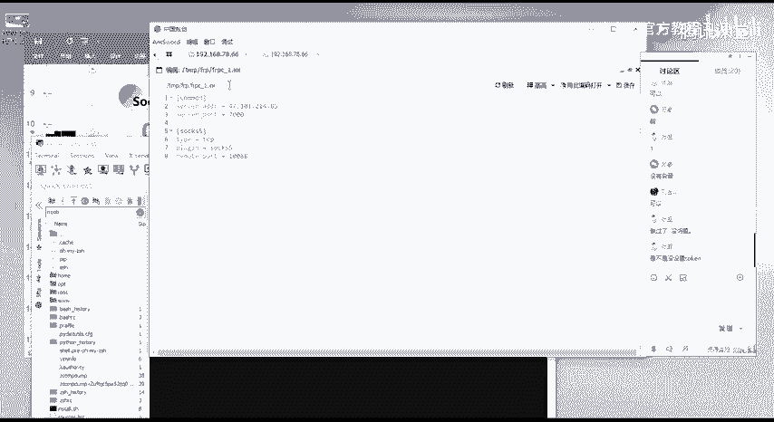

这个端口它是否是否处于一个今天的状态，对吧？现在的话是已经处于今天状态了。那么我们怎么去进行一个代理呢？

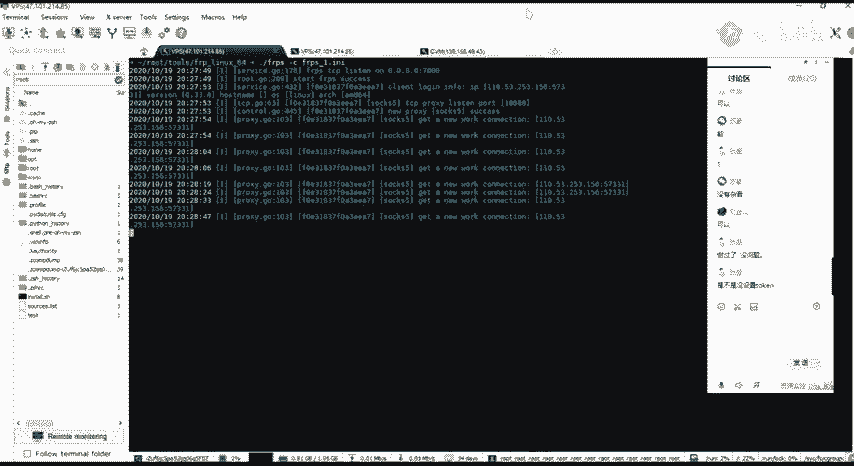

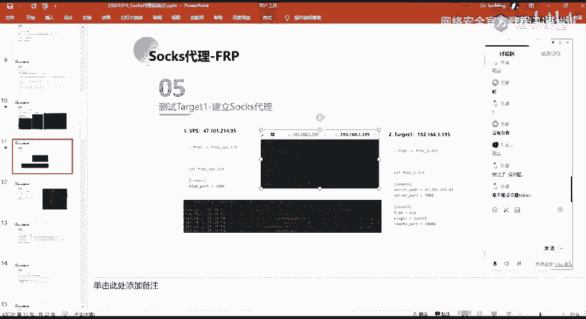

我们同样的就比如说我们要去访问的话，是这个呃我们前面已经知道的对吧？

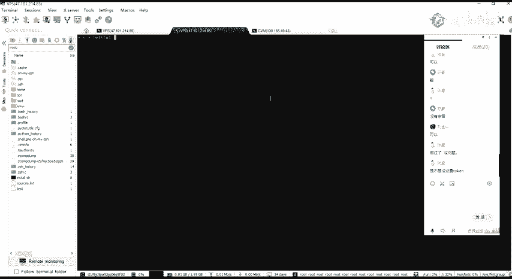

这1个2。2这个机器。

对吧我们现在这样子直接去访问，他防问不到。然后我在这边的话，通过这样子的一个代理啊，这边的话是呃10088，对吧？

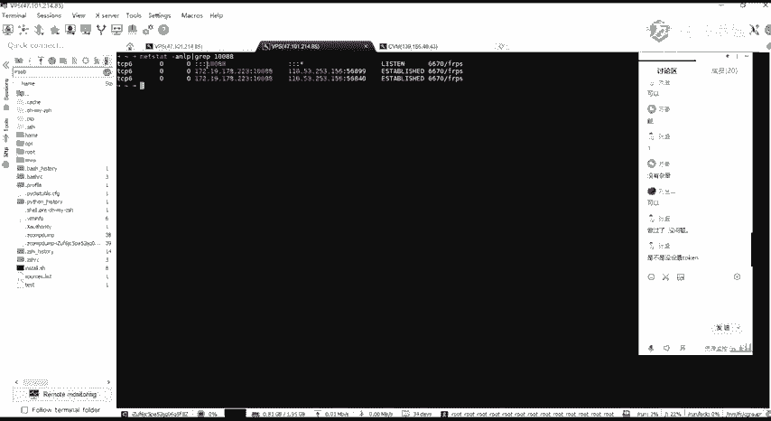

走走这一个带。然后呃可以看到的话，现在的话就能够去进行了一个访问，对吧？然后其实这边的话就是说我们这边的一个代理化已经尽立成功了。对吧然后我们在这边我们每请求一次的话，他都会有这样子的一个连接，是吧？

每次请求的话，它都会有相应的一个连接。呃，不是，刚刚是卡了呀，这个token的话就是呃。

拖肯的话。呃，你可以设可以，不设，就是你的一个token的话，你的一个就是呃在FPS上面。在FRP上面的那个配置，跟你的1个FRRPC的一个配置的话是要一样的。就是你的那个ken。嗯。

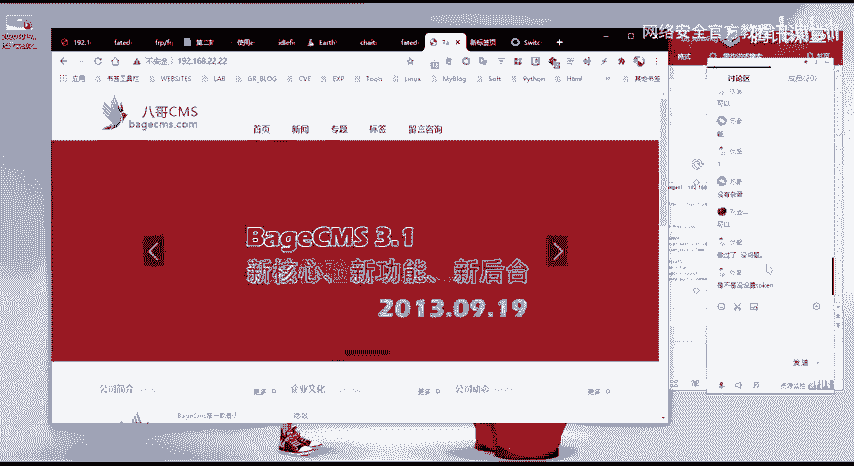

呃，这边的话就是建立了就通过这个FIRP建立了这样子的一个hoocks的一个代理通道，对吧？然后的话我们建立这一个代理通道的话，我们就同样的能够去进行相应的这样子的一些操作嘛，对吧？

然后呃比如说我在这边。可以。就是这个机器。我通过。

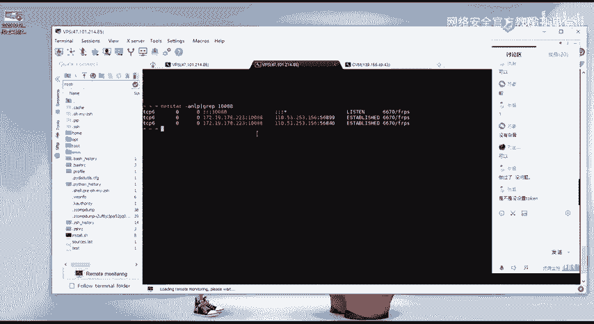

Yeah。通过 those change。我通过clo change，然后的话用MM去做一个基本的一个扫描。

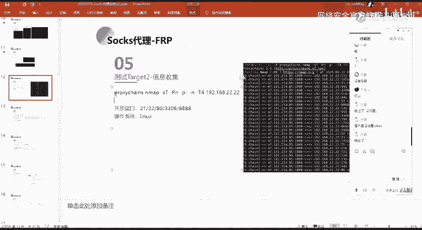

啊，去就是验证一下这边。我的一个代理通道的话是。没有问题的对吧？可以看到有这种OK就不是说全都是开帽子。就说如果说你全都是time帽子的话，那么你可能就是说你的这个主机它没有开。

然后的话呃你的这个代理通道它没有进立成功，对吧？就你总总会有几个端口，它是属于一个开放的一个状态，是吧？现在这边的话有创测出这一些端口。就说明我们这边的一个通道话是没有问题。Okay。

然后的话呃下面的话就是上节课已经讲过了，就是这样子的一个思路，对吧？我们去进行一个信息收集，通过这一个代理通道来去对我们这个二这个网端下面的一个存活主机进行一个信息收集。

然后的话再去通过这一个存活的一个主机来去进行一个呃渗透。然后在这边的话就是通过这边这个2这个机器对吧？2。2这个机器的1个80端口的1个CMS的一个漏洞，对吧？然后的话得到了这个机器的一个W需要。

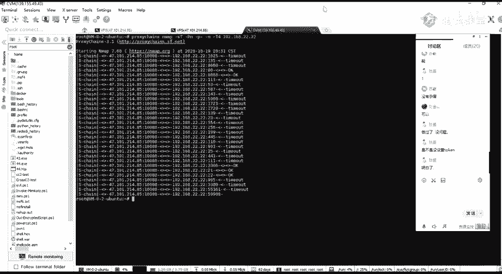

得到这一个机器的web share之后的话，我们想要去进行一个呃web share的一个连接，对吧？因为我们当前的这一个呃我们。当前得到的这个需要的话，它是处于一个内网的对吧？然的话它是在内网的话。

我们在外网是无法直接访问的。但是我们前面已经建立了这样子的一个s的一个代理通道。我们可以通过这个代理通道来去访问到2这个网端的一个机器。那么同样的我们就能够去通过这个代。通过这个代理通道来去访问到。

或者说来去与内网的这个呃web share去进行一个数据的一个交互。对吧？然后的话来去进行一个连接。就呃这边的话就是通过已进。啊，就是啊不仅仅是已件，还有其他的这样子的一些啊那需要的这种连接工具。

都有这样子的一个代理的一个设置啊，对吧？然后我们我们只需要去做这样子的一个。呃，设置我们的一个代理服务器。然后在这边的话，我们就可以去进行一个连接。连接在内网的这样子的一个2这一个机器的一个we，对吧？

好，我们就啊顺利的得到了这样子的一个在内网的这一个机器的一个需是吧？然后我们得到了这个需求之后的话，我们就可以去对它做相应的一个信息收集啊吧？然后的话再以这一个机器再去做进一步的一个啊利用，对吧？

然后我们通过我们得了这个2。2这个机器的话，又发现了有这样子的一个存活的一个啊有发又发现了有一个这样子的1个33的网站，对吧？然后这个33网站下面的话又有这样子的一个主机。

当然的话其实实际情况可能不仅仅就只有一个主机啊，因为这个靶场的话，不可能搞很多主机嘛。

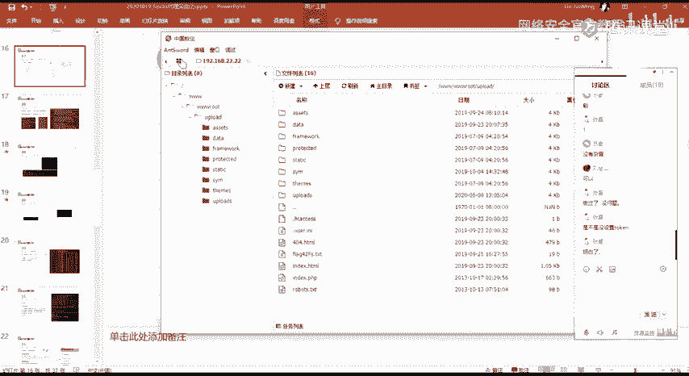

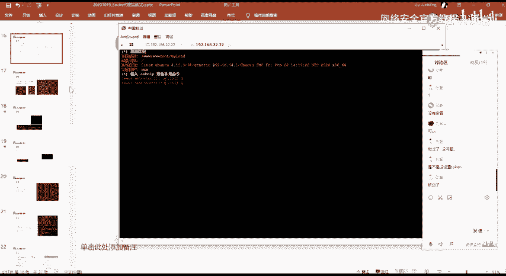

就每个网站就一台对吧？然后其实实际情况的话就会有很多这种主机嘛，是吧？那么你的一个就是你的一个测试的一个目标的话就会变多，是吧？然后你的一个就是你的一个成果的话也会更多嘛。好。

我们这边发现了这1个33这个网段的一个机器，是吧？它是一个存活的一个主机。那么我们下一步的话就需要去就需要去对它做一个测试，是吧？就测试它是否呃能够被我们去进行一个利用。

那么我们现在的话我们是通过这样子的一个呃得到了这个2。2这个机器的一个we share，对吧？也就是在这边我们在这边的话是能够去否问到这个。呃，33这一个网段的一个主机的对吧？

因为我们有这样子的一个网卡，就我们访问33这一个网段的一个请求的话，我们可以通过这一个网卡来去进行一个访问嘛，对吧？嗯。然后我们下一步就其实还是又到了之前的对吧？

我们只能通过这一个web share来去访问商3这一个网站。那么我们想要去做更多的一个操作的话，我们啊就需要去把这边的这个网站做一个代理，就是把这边的这个内网把它代理代理出去。

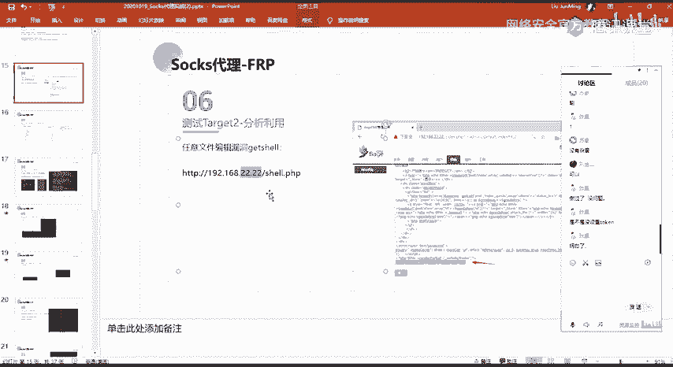

就同样的，我们可以通过我们的一个收索的一个代理。然后呃在这边的话，我们通过这个FRP来去创建这样子的一个二层的一个s代。

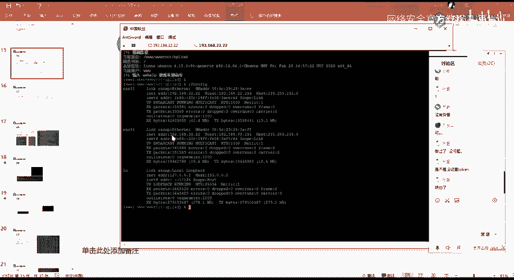

うん。嗯。啊呃，具体的一个具体的一个呃操作步骤的话，就是像这样子。

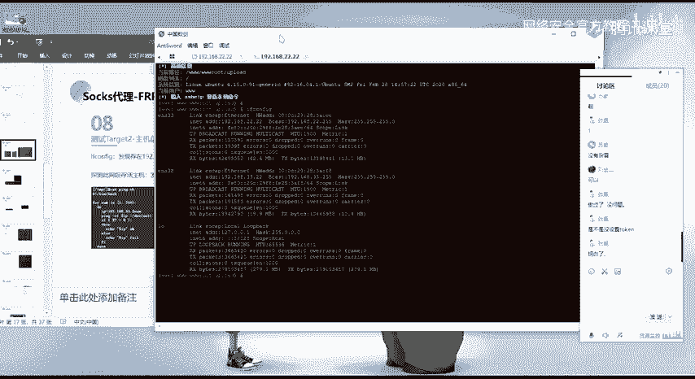

呃，大家看这边的话，因为我这边的话就是为了显得工整一点，所以的话。就是这边跟这边是一个，这边跟这边是一个，就是这这边是第一步，这边是第二步。然后第一步的话就是你在VPS上面去做一个这样子的一个配置嘛。

去起1个FRP的一个服务。就一般的话就VPS上面，你的1个FRP server的话，呃，就只需要去今天一个端口就可以了。然后的话等待我们的一个客户端来去连接这个端口经理s的一个连接即可。

然后其实我们更多的其他的一些配置都是在这样子的一个FRPC这个这一个配置里面。因为我们需要呃在客户端与我们的一个服务端经理连接之后的话，有去进呃，就是像我们前面这边对吧？

要去做这样子的一个今天这样子的一个端口，对吧？然后的话我们通过这个端口来去进入这一个shop的一个代理通道，对吧？

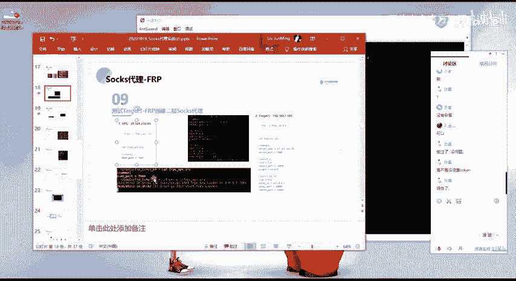

然后下面的话。第一步的话都是一样的。第二步的话就是我们在参le一上面，我们要去做更多的一个配置。呃，在这边的话，我们先看一下大概的一个配置吧。然后的话我再给大家具体的讲一下。

就说我为什么就为什么要去做这样的一个配置。以及呃它的一个流量转发，或者说它的一个流量代理，它的一个流程它是以及思误它是怎样的？呃，这边的话我们主要看一下这边。第二步就是这个tact一。这个tt一的话。

我这边就是就举呃。就是说的就是这个。就是这边。呃。就是这边对吧？就他给一他给2他给3，我特意这样子标了，就是呃能够让大家知道我说的是哪一个机器，就是在哪个机，在哪一个机器上面去进行的这样子一个操作。

然后这边的话是在这一个ta里也，就是我们得到这个外网的这个work服。

的一个外b服务器对吧？然后的话。呃，这边的话同样的。

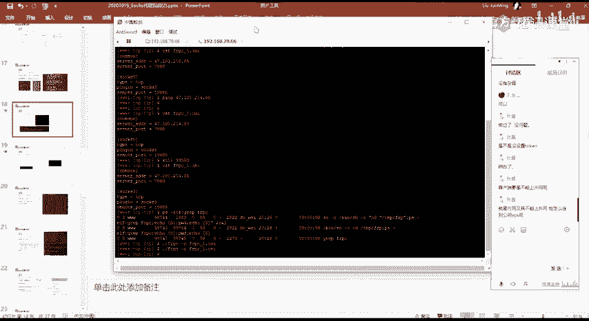

我们在这个文件当中去查看吧。这边这一个文件的话就相比前面对吧？相比前面这边的。下面呃。相比前面我们第一步去建立了这样子的一个呃代理通道的话，就多了多了。

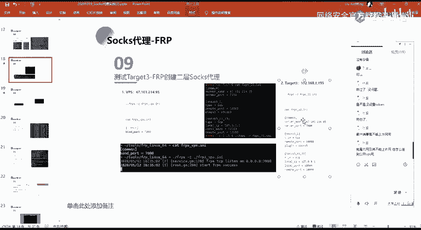

一部分的一个配置对吧？

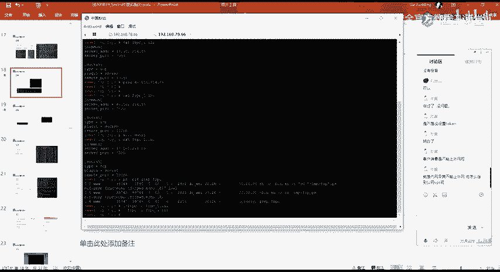

然呃在这边的话，其实主要的话就是多了这里的这一部分。我这边的话就是把它呃命名的话，命名为了sox5 to33，就是表示我这边的这个ss代理通道的一个配置的话，它是去33这个网段的。

就是我配置了这一个代理通的话，我就能够去访问33这个网段。就呃其实这样子去呃标识这个的话，能够让自己。更好的有理清这个思路嘛，对吧？就是你这种配置文件。啊，呃前面这一部分你会发现都是一样的是吧？

当然的话我这边的话呃就是加了一个一，就表示我当前的话是在这一个t的E机上面去呃做的这样的一个配置嘛啊吧？然后呃主要的话就是这里的这一部分。这里的这一部分的话。

type C的话就是我们这边同样的是TCP的一个方式去进行一个数据的一个呃传输，对吧？然后这边localIP以及local port的话，从致面意素我们知道就是本地的1个IP以及本地的一个端口，对吧？

这边的话本地IP是就是我们的一个回还地址，对吧？然后这边的一个端口10089。好，remote port我们看到这个remote port的话。

我们就知道就是说我这边呃客户端与我的1个FIPS建立连接之后的话，它会在我的1个VPS上面去增添1个10090的一个端口，对吧？

然后的话我就能够通过这个10090这一个端口来去建力啊来去进入这样子的一个代理通道。然后呃有疑问的一个地方啊，就是这边的一个look port，对吧？我这边的一个lo port，为什么要停这一个啊？

Yeah。那么在这边的话，我们还还需要去结合我们后面的这样子的一个步骤。呃，下面的话下面这一个步骤的话就是呃在这个tag二上面的一个操作。呃，当然的话这里的话还是在taag一上面。

就在这边taer一上面，我们呃需要去首先的话需要去上传1个FIPS就是去建立一个FFIPFIP的这样子的一个松词的一个服务端。然后呃它的一个配置文件的话也是这样子，就其实就跟我们VPS上面是一样的对吧？

然后的话去建立这样子的一个松词的一个呃办理服务器。然后呃建立好之后。建立好之后的话，我们在tag2上面，也就是呃我们这边。也就是我们这边对吧？拿下的这样子的呃2。2这个机器的这个线。

就是我们在这边的这个机上面的话，我们还需要去做这样子的一个操作。就是啊去上传1个FRPC的一个客户端然然后的话去啊做这样的一个配置。这边的这一个配置的话，我们呃同样的在这边文件当中去看吧。

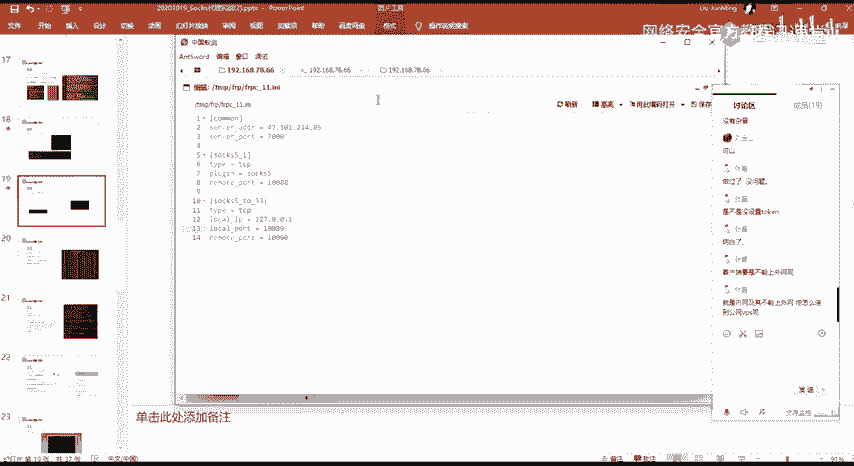

就是呃这边这个FIRPC-2。

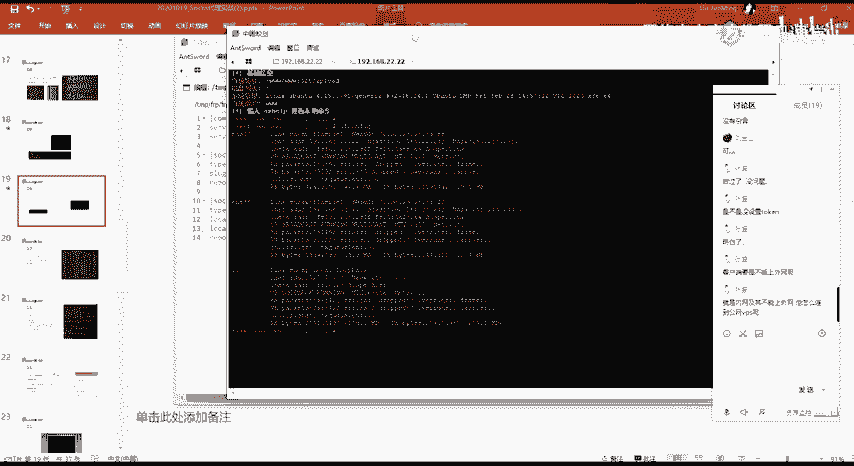

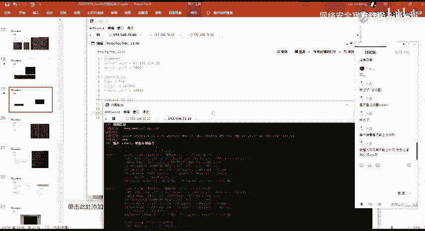

然后这边的这个配置文件的话跟前面的话就有了不同。不同的一个地方的话，我们可以看到就这个severeven address对吧？sever address这边的话，我们指的是指定的是这个2。

1的这个IP以及这边的一个端口是7000，对吧？

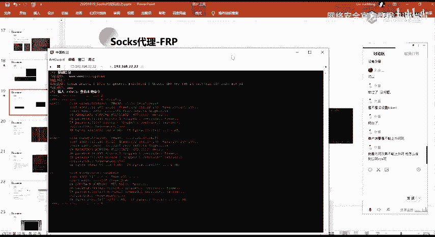

然后呃这边的这个CY卷士为什么是指定的是这一个呢？我们再来看一下这边。就是。这边。就是我当前的这个就是这一个机器对吧？七8。66，或者说这个内网IP是19。668。2。1的这个机器对吧？

这个机的话是我们拿下的那个外网的一个work服务器，对吧？然后这在这个机器，它的一个它所分配的一个内网IP它就是2。1对吧？然后我们这边所指定的一个FIP server的一个IP的话。

就是这个IP就这一个机器的一个IP为什么指定的是这个呢？因为我们在这边有建立这样子的一个FIPserv对吧？就其实就是说让t2这边是作为一个FIRP的一个客户端。

然后的话来去连接在这边我们呃这个机器上面的所建立的这样子的一个FP server的一个服务端，对吧？然后的话它这个t2与这边的一个t一之间去建立这样子的一个的一个代理通道。

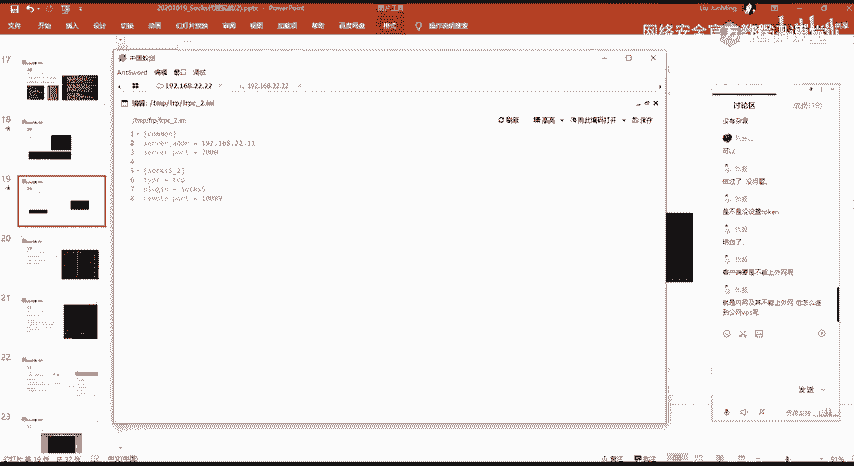

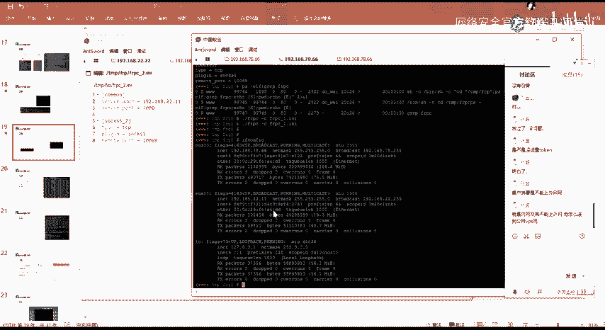

然后下面的一个配置的话，就是我们的一个ss代理通道的一个配置，对吧？我这的话就是s5，刚刚就表示的话，我这边是在t2上面。然后呃同样的就是指定呃我们的一个插件ss5。

然后的话指定我们这边remote port。喂10089。大家看到这个10089就应该能够去知道，对吧？我们前面这边在这里为什么要去配置？这边是10089。

因为我们在这边tt2与这边的一个呃这边与这边的tact一的1个FRP的一个服务端去建立连接之后的话，对吧？它会在呃这边的这一个tact一上面。

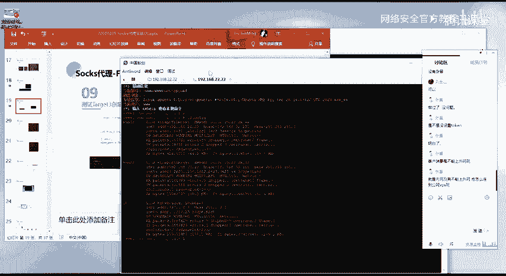

也就是在这边呃在这个内部的这1个FIRP的一个serverer上面，它会去精天1个10089的一个端口。然后的话在这边呃在这边他可能一上面的话，我这边他又做了这样子的一个操作。

这边的这个操作它是什么意思呢？他其实是做了这样子的一个流量的一个转发，就是他把我。

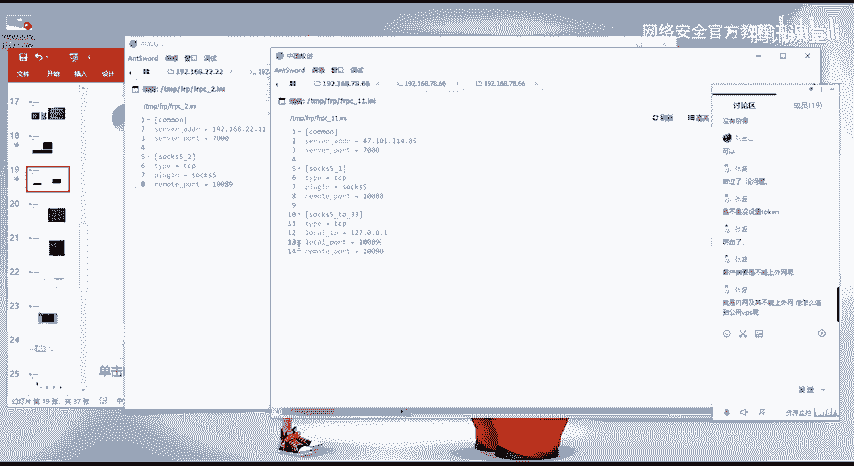

他把我这边本地的对吧？因为我当前这边的话是在他给的一上面，对吧？我这边这我这边FRPC执行执行这个配置文件之后的话，他就会呃把我这边本地的这个10089的一个端口，他的一个流量。

把它给转到我这边的一个10090。

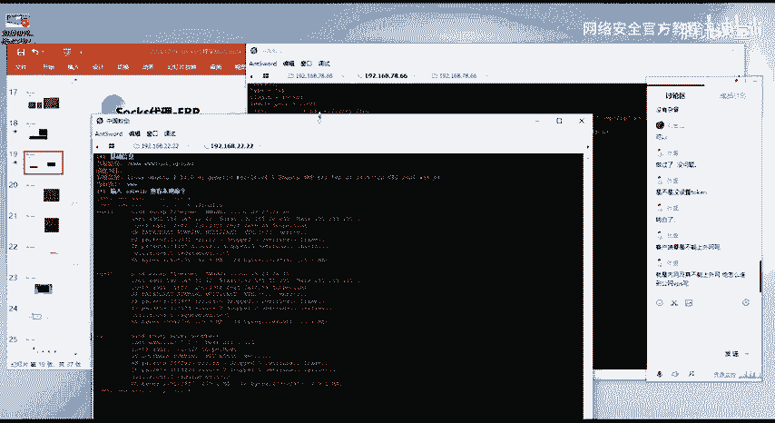

嗯。😊，呃呃，不对，说说说反了说反了就呃说反了，是是从就是从我们远程的就从我们就是呃在公网EPS上面所今天的这个端口的一个流量。它会把它转发到我们这边的1个10089。

然后这边的1个10089的这个端口的话，就是我们这边t一与t2之间的一个s代理通道的这样子的一个代理端口，对吧？其实就是其实最后的话它的一个流量的话。

它就会通过这边的这个10089的一个端口进入到这边的一个tt2与tt一之间的一个代理通道，对吧？然后的话把它个转到我们这边的这个呃2。2这个机器上面，对吧？那么我们这个时候的话。

我们这边建接通道之后的话，对吧？这个时候我们。

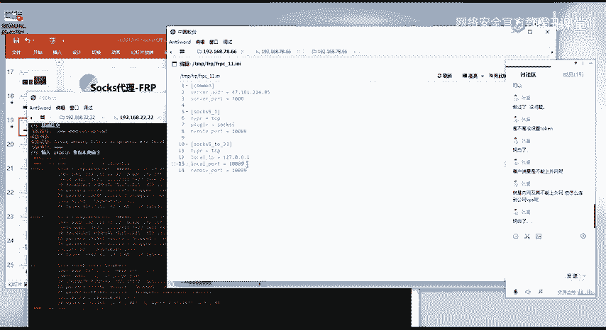

只需要在。

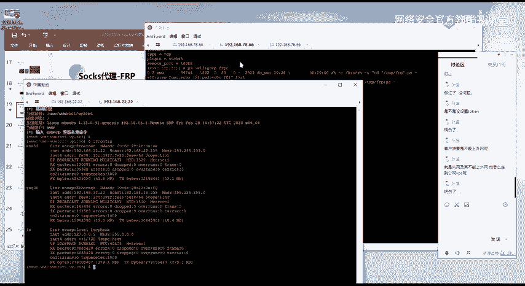

呃，只需要就是。比如说我这边我要去访问33这个网站的某一个word服务，对吧？某一个主机的这样子的一个就是这边33033的这个机器是吧？然后我要去访问的话。

我就需要去通过我们刚刚所经历的这样子的一个代理的一个通道，对吧？

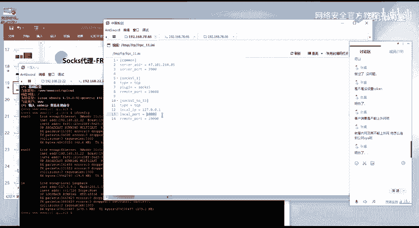

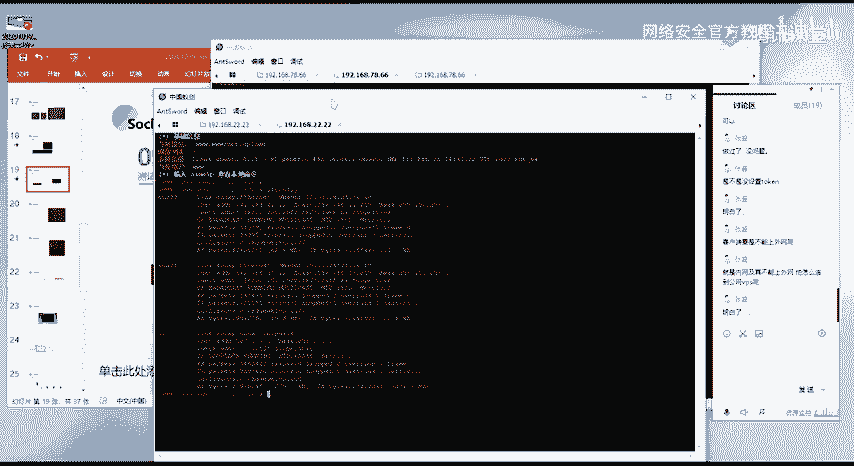

然后刚刚所建立的这样子的一个代理通道的话，其实它的一个。呃，这边的一个代理端口的话就是这一个对吧？就是10090。所以的话我们如果说我这边经理成功了，对吧？我这边去配置这样子一个代理的话。

我这边要他的一个代理端口是10090对吧？而不是之前的那个之前那个的话只是就是一层的这样子的一个收索代理啊，然后这边我这边配置好之后的话，我就可以通过这边的一个代理通道来去访问这一个呃33。

33的这一个wordb服务，对吧？当然的话因为这个主机的话，它没有这样的外b服务，所以的话。

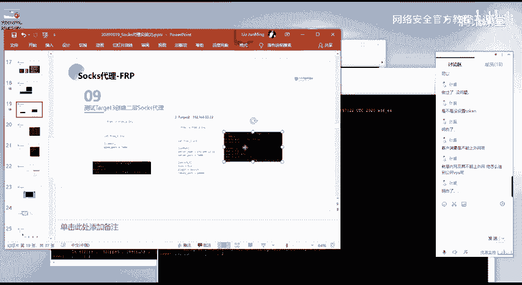

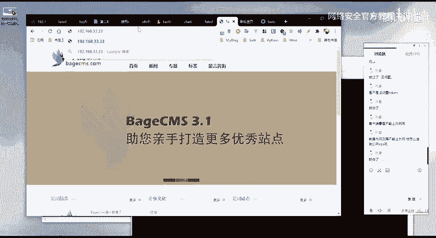

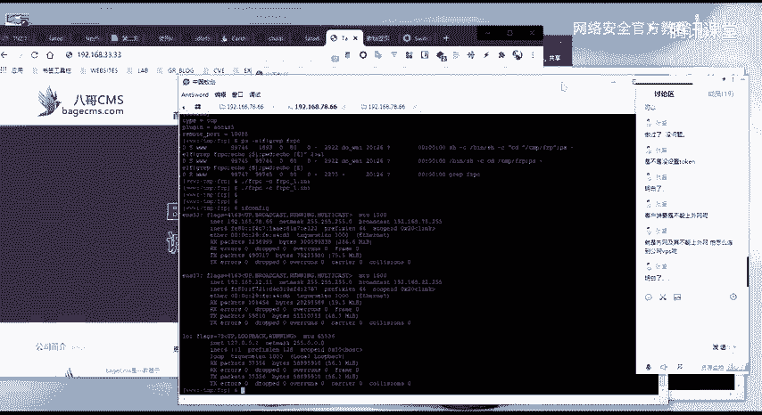

这边防不到对吧？以及我这边的话还没有去实际的去操作。来去建立这样子一个通道。然后呃。我们在这边就是说我们在这边去做一个这样子一个请求之后的话，我们的一个流量它是怎么去走的？在这边有必要给大家去捋一下。

就捋清一下思路。就是说就是你去理解这样子的一个代理通道的话，你。

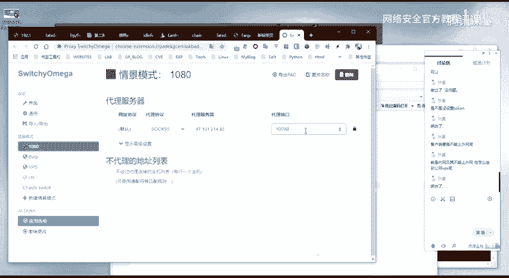

主要的话你就理解我们这边的一个流量，它的一个请求它是怎么去走的，对吧？比如说我这边我去。

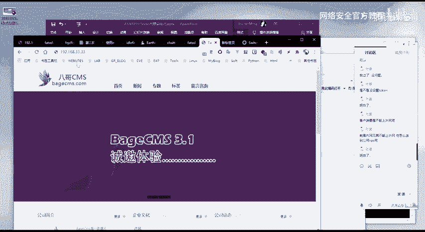

访问这1个2。2这个机器，对吧？通过之前的这样子一个代理通道。诶广州。好，这边改一掉。1018。比如说我这边对吧？我这边通过我这边的这个10088的这个代理通道，对吧？代理。

然后的话我去访问这个二这一个机器，对吧？那么我在这边的话，其实在我的1个VPS上面，其实我在我的1个VPS上面的话，它有去今听这样子的1个10088的一个端口，对吧？然后这边的1个10088端口的话。

就是我们进入这一个代理通道的一个端口。然后我比我要去代理我这边的1个HTP的一个请求，对吧？去访问2这个网站的一个呃外尔服务。那么它的这个请求的话，它会通过这个端口进入到这里的一个代理通道，对吧？

然后的话会去呃，因为我们这边代理通道的话，它会把它代理到代入到我这边的这个网段，对吧？

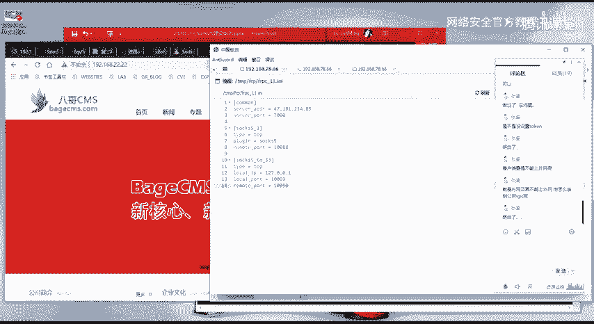

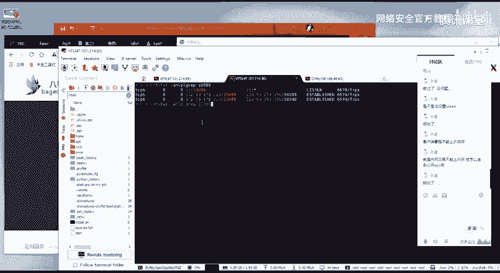

其实就是相当于就是带你到了最里这边的这个机器，对吧？然后这边的这个机器的话，它是能够去。访问到这一个二这个网络的对吧？所以的话我这边的一个请求的话是访问的是2。2这个机器。那么我通过这个单理通道的话。

它会把我的一个请求。就是。

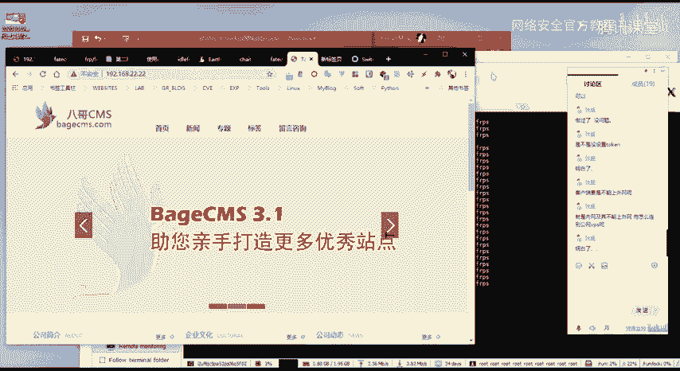

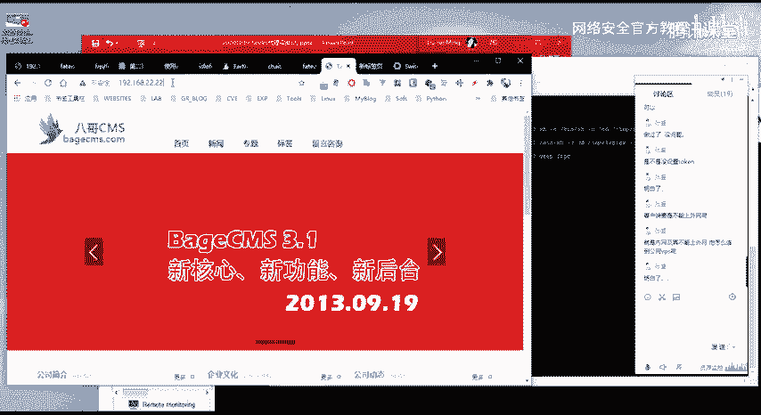