# B站最全网络安全教程，整整1300集，全程干货无废话，别再盲目自学了，看完学不会我退出网安圈！（web安全｜渗透测试｜内网渗透｜CTF） - P88：87. 第三十七天：W Socks代理.mp4 - 网络安全官方教程 - BV15u4y137cQ

通过这边的这个网卡，把它给发送到这个2。2这个机器的那个呃办联端口，对吧？因为是外保服务嘛。

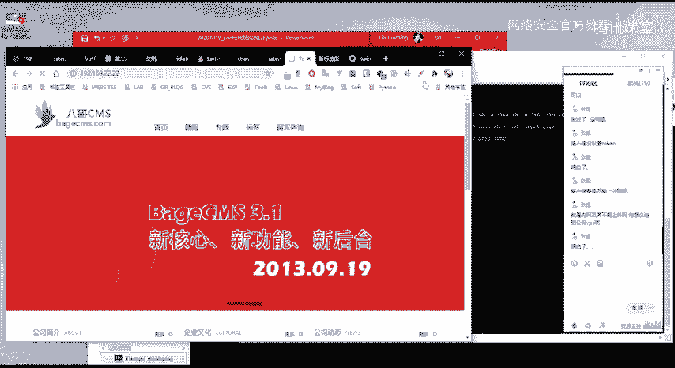

它会发送过去发送过去之后的话，它就会呃就是进行相应的一个请求嘛，对吧？然后的话就能够去得到我们这边的这样子的一个呃内容，对吧？然后的话同理其实呃二层的一个代理通的话。

它就中间只是多了这样子一个流量的一个转发。

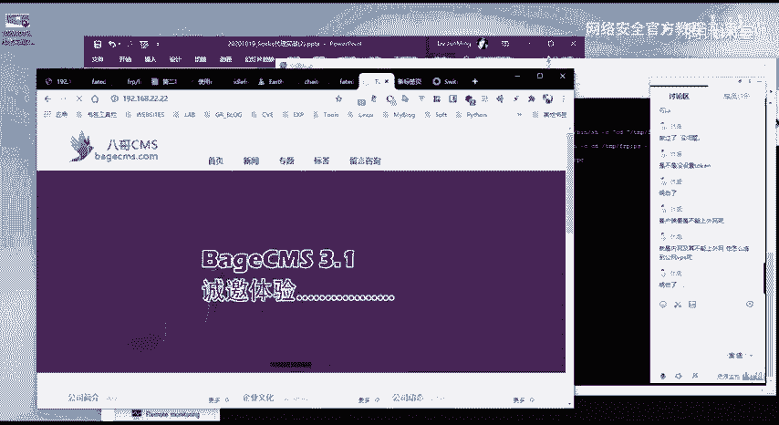

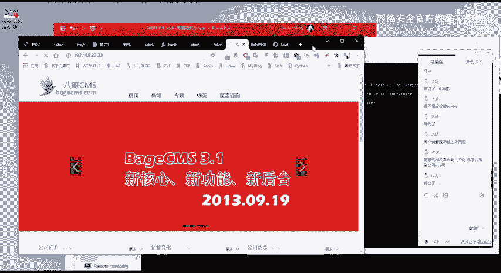

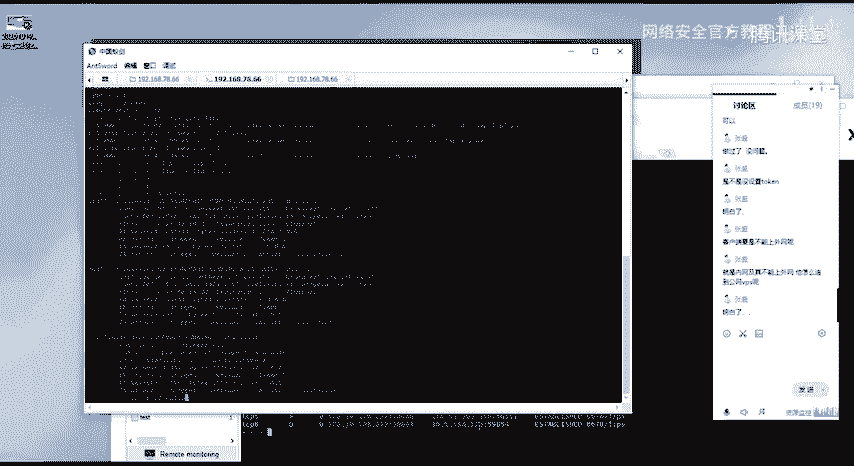

因为我们。🤧嗯嗯。呃。8点50，我这边切一下，因为这边第第一节课的话已经到时间了，我这边下下课，然后的话等会。She。

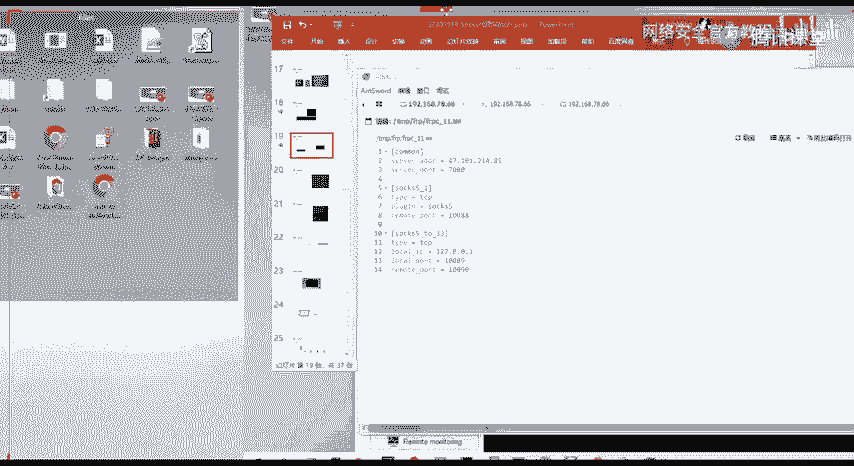

Yeah。

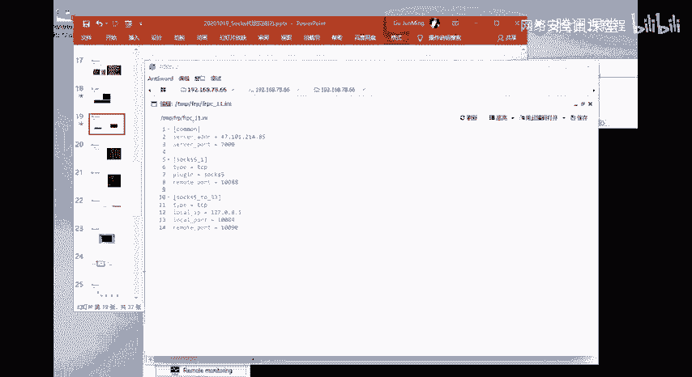

Okay。Yeah。嗯嗯。好，我们继续啊。刚的话讲到了就是一层代理的时候，它的一个流量的一个走向，对吧？其实二层的一个代理的话也是一样的一个道理。就只是在这边的话。

它中间多了有这样子的一个流量的一个转发，我们可以结合一下这边的它的一个配置文件来去理解，对吧？首先的话在这边是我的一个外网的一个work服务，对吧？它会这边的一个客户端的话。

它会去连接我们呃这一个VPS上面的这一个70的一个端口，对吧？然后它进行一个代理通道，然后建立代理通道之后的话，我这边的话我就能够去访问到这边的呃这这边的这个机器，对吧？

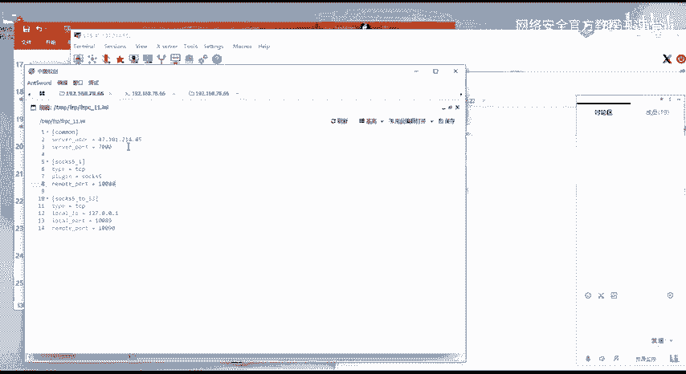

这边的这个机器就能够去访问到了。然后的话我们还要去访问，就是说33哦，就是说去访问2。2啊，不是访问33这个机器的话，对吧？我们是要通过这1个2这个机器才能够去访问到的对吧？

然后这个二这个机器跟这边的这个机器它是能够互相访问的对吧？那么在这个时候的话，我们就需要有这样子的一个通道，就是静力就是静力这边的一个2。2啊，我我以这边这1个IP啊，就是。

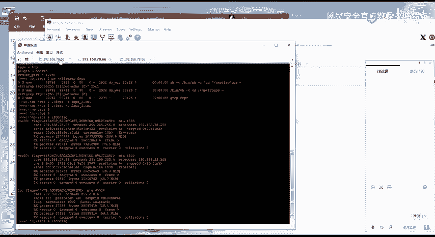

这边它同一个网段嘛，因为2。2这个机器对吧？与这边的2。1的这个机器。

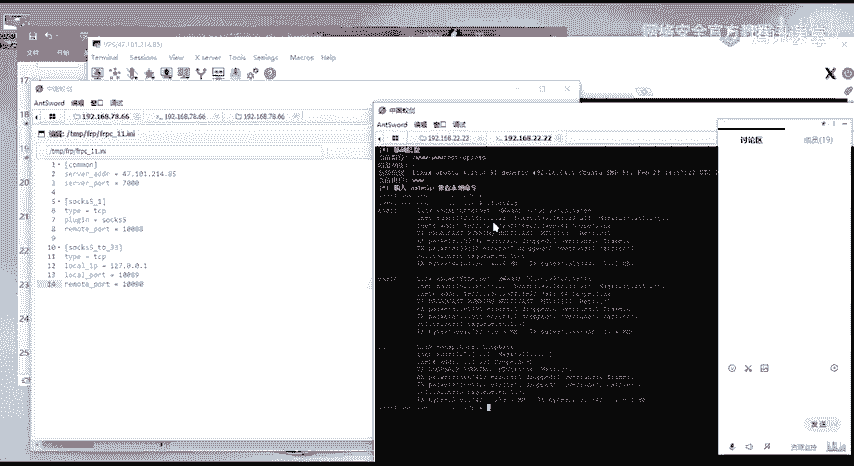

要有这样子的一个通道，对吧？因为我们的一个请求的话，我们要能够去发送到这边的这个。

呃，33这一个网站，那么我在这边。其实就是相当于就是说在这边。呃，2。1跟2。2之间，我们还需要有一个这样子的一个代理通道。因为我只有把这边把我的一个请求。

或者说把我这边的一个内网的这个网段把它代理出去。我才能够说能够去访问到，或者说以流量的一个形式的话，就是我这边的这里我的一个请求发送到了这边的这个机器，对吧？

然后的话我想要呃把它发送到我这边商3这个网站的话，我中间需要有这样子的一个代理通道，把我的一个流量把它给代理到这边来，对吧？

所以的话我们在这边的话就需要有这样子的一个操作。就是我通过这边的这一个呃。

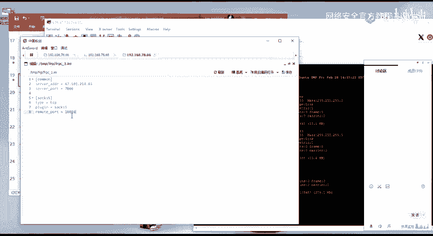

诶。不是是。

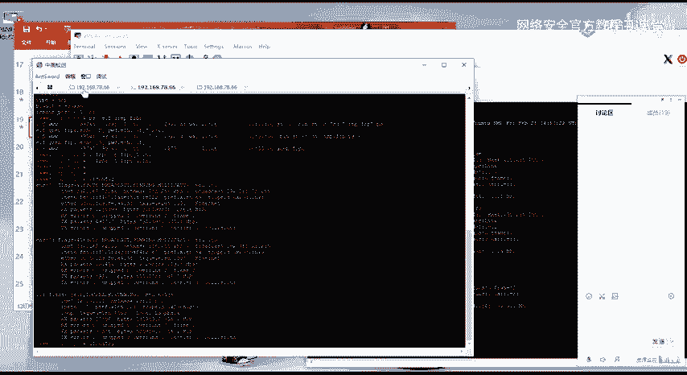

嗯。我通过这边呃就是这边的这1个2。1的这个机器，对吧？我再去建立这样子的1个FRP，通过FRP来去建立这样子的一个去精辟一个端口，对吧？作为1个FRP的1个s的一个服务端。然后在这边2。

2这个机器的话，我在运行我这边的1个FRPC对吧？运行我这边的1个FRPC客户端，然后的话与我这边的这个2。1的这个机器建建立一个连接，来去建立一个收死的一个通道，对？那么建立这一个说索通道的话。

我们要去要把我们那个请求，要能够去带领到这个通道的话，在这边的话，我们就需要有一个端口，对吧？其实呃就是这1个10089的一个端口。然后这个10089端口的话，它就会在这边经经历今天嘛，对吧？

在这边的这个2。1的这个机器今今天这样子1个1089的一个端口。

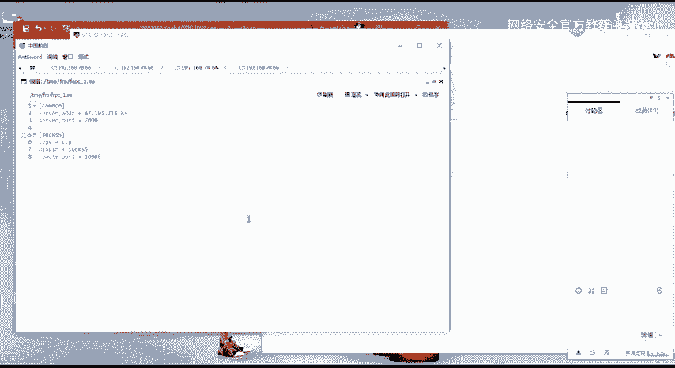

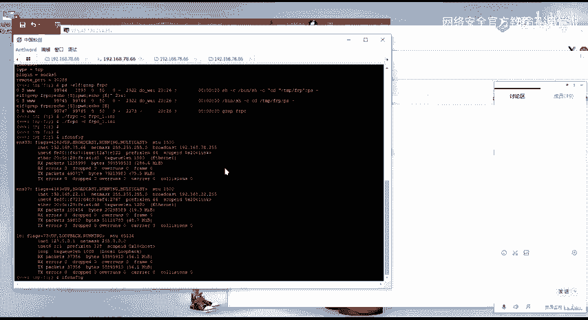

然后我们。最后的话还有这边就是说我通过这边界面的一个连接，我的一个请求到了这边，对吧？那么我要去把我的一个请求再把它转发到我这边的这个10089的一个端口。所以的话我需要有这样子的一个配置。

然后呃在这边的话就是说我要去建入这我要去进入这边呃201的这个机器跟我EPS进行的一个代理通的话，我需要通过这1个1090的一个端口，对吧？那么我的一个实际的一个流流量请求。

比如说我这边的一个wordb服务，对吧？33033去访证这一个33033，就假如。那么我的这一个rob请求，我请求之后的话，我这边的一个代理代理通道的话，我是要去就是通过我这边的1个90这个对吧？

然后的话来去进入这边的一个代理通道，把我的一个请求代理代理带理进去，带理到这边的这个机器，对吧？然后的话带理到这个机器是上面的话，我这边是访问的是33，对吧？那么我33的话是在这边。

所以的话我需要把我这边的一个请求，再把它转发到这边的一个呃这边的2。1与这边2。2这个机器之间建立的一个代理通道，也就是通过这边的这个10089的一个端口。

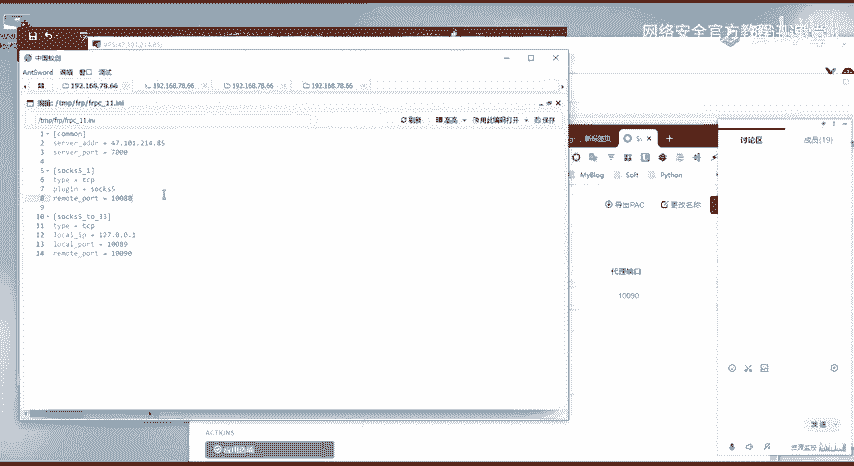

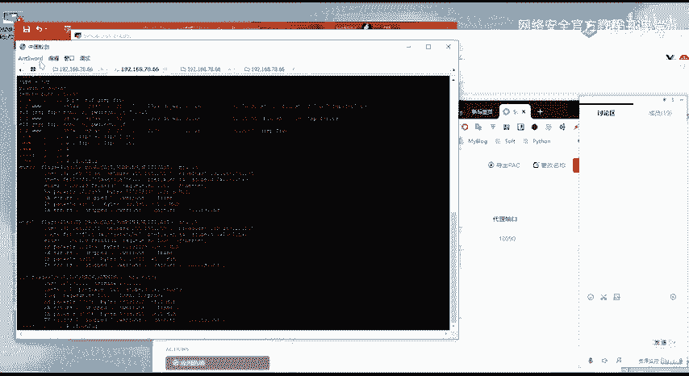

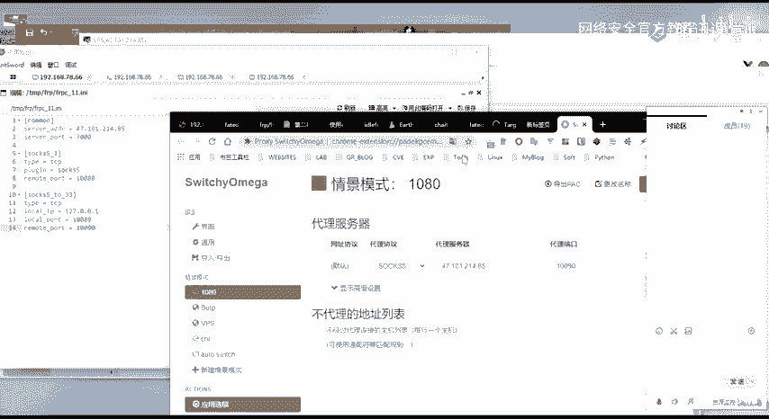

其实就是把这边从10090端口过来的请求，把它给转到这边的一个端口，也就进入到了这边的呃，这边这两个机器之间建立的一个代理通道，对吧？然后的话这边的一个请求的话就代理到了这边。

那么它就能够通过这边的一个网卡来去访问到33。33的1个80端口，对吧？🤧。呃，这里能大家能理解吧？大家呃能跟得上我的思路吗？应该可以吧。嗯。就呃就张森没问题吧，其他同学呢？

就大家呃觉得我就是呃可能讲的快了，或者说哪你没讲没讲明白什么的嗯。都可以提出来，可以是吧？OK那那么我们具体的来操作一下。嗯。我们。

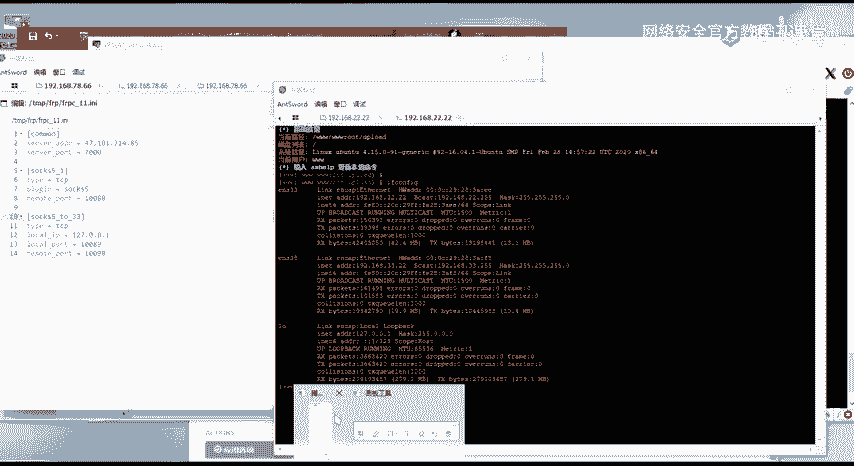

具体的来实现一下。

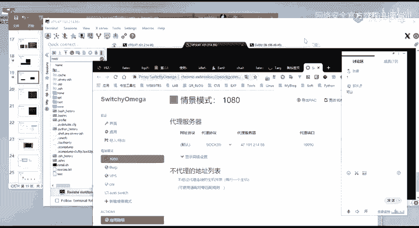

就其实呃它的一个原它的一个具体的一个操作。我刚刚其实已经也讲了，对吧？以及为什么要去这样子的一个操作。呃，在这边的话，首先的话我们需要在FR呃我们的1个UPS上面，对吧？

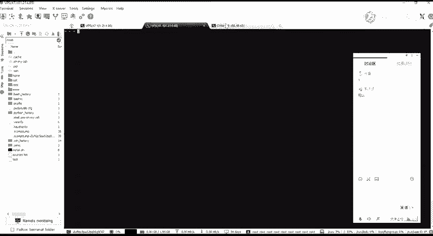

嗯。这边是。去过。我这边关了吧，我直接关了，我重新来吧。好了要看大家可能。不是很理解是吧？首先的话呃，我在我的1个UPS上面，对吧？我要去进行一个端口来等待我们的一个客户端的一个连接。

我这边的话就是FRPC1点A。对吧然后我这边的话就今天了1个7000的一个端口。今天这个端口之后的话，我再通过。

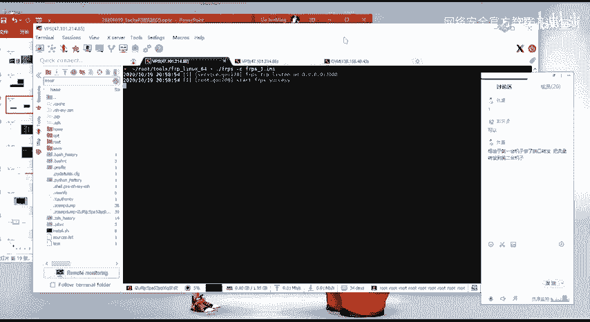

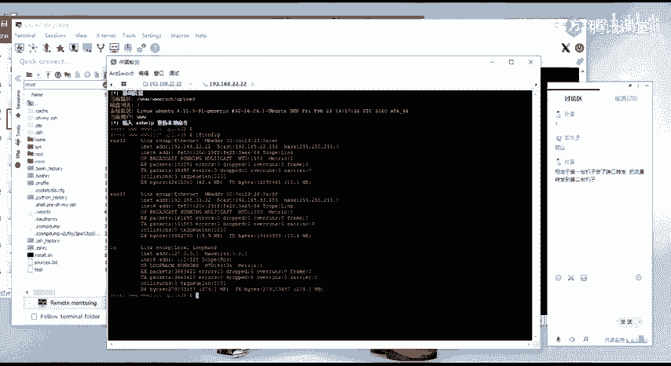

我这边。得到的通过这边得到的这个外网的这个外服务的一个需，对吧？上传我这边的1个FR点。

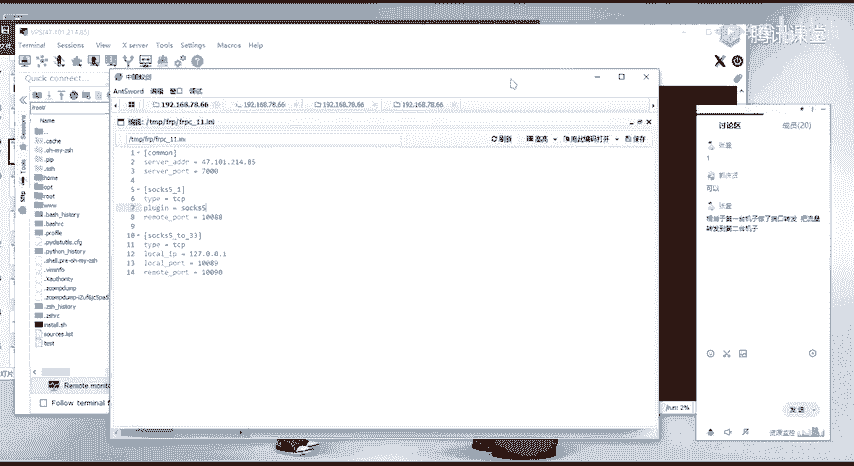

FPC的一个客户端。对吧我这边的话上传在这边，然后的话给他一个执行权限。然后我呃我先看一下。还有没有？FRP我这边的话把这些都发了，可以看到我这边有执行1个FRP这是我之前呃测试的。我这边把它给削掉。

机器。嗯，你系咯。啊，现在的话已经没有了，对吧？Yeah。然后的话我在这边我要去与我这边的这里的一个通道去进行一个连接。

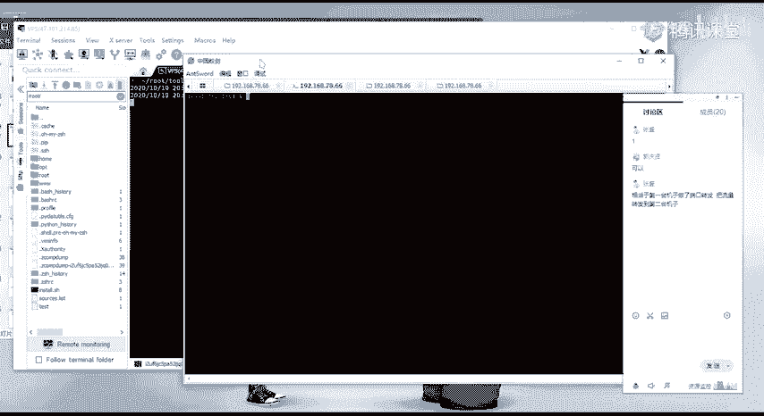

呃，刚开始的第一种的话就是通过通过这样子的呃，通过这边呃通过这里对吧？我通过FRPC去指定这边的一个通道去建的一个连件，对吧？那么下面的话我想要去把我的一个流量。

就是我这边的话直接就用这边的一个配置文件，对吧？因为其实在这里的话，其实同样的也能够去做一个与他那个去建立一个代理，对吧？然后的话通过10088的一个端口。

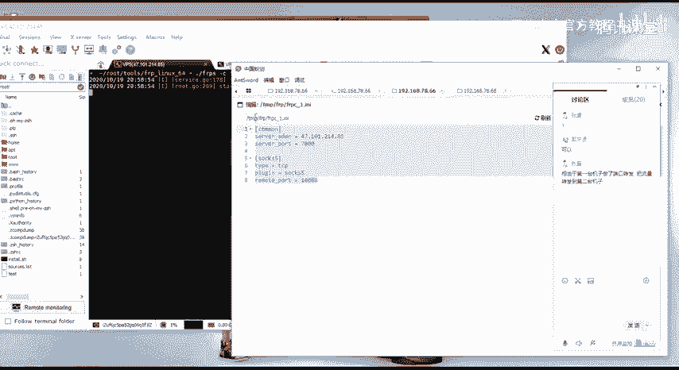

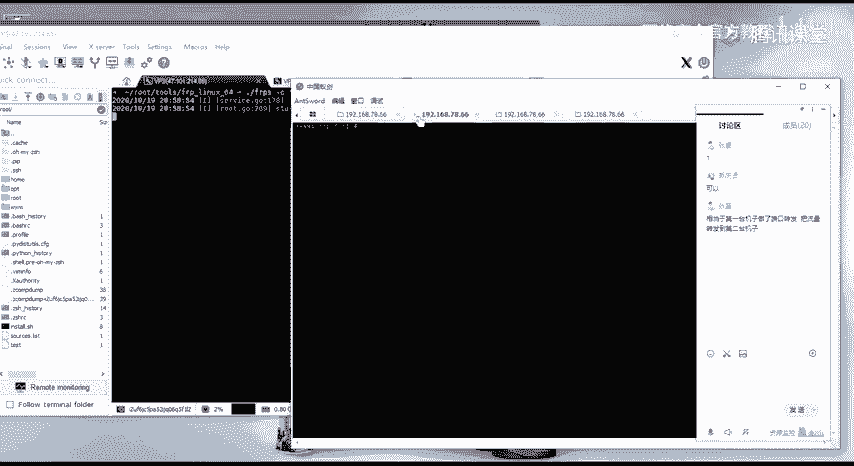

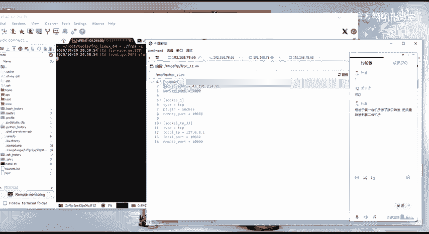

啊，我这边的话。要去建一个二手那的话，我只定这边的这一个。十一吧。一点啊。

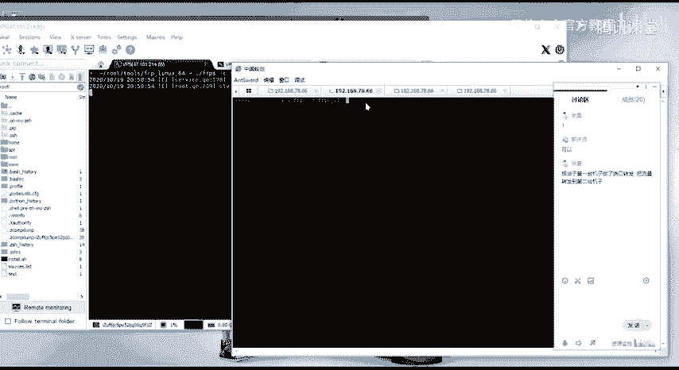

来去这边去进行一个连接，对吧？然后可以看到在这边呃有两个pros已经就是进去成功了，对吧？

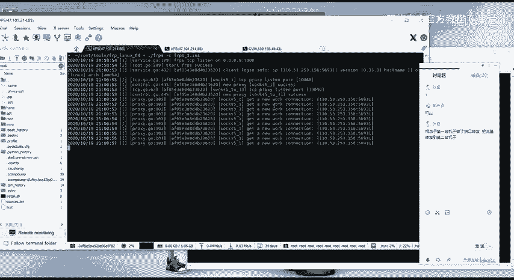

然后建立建立成功之后的话。我在这边的话对吧？我在这边的话就有了。我们可以看一下。诶。我在这边的话就与这边去进行了一个连接，对吧？然后的话我在这边的话就有他会去进天这个端口过。

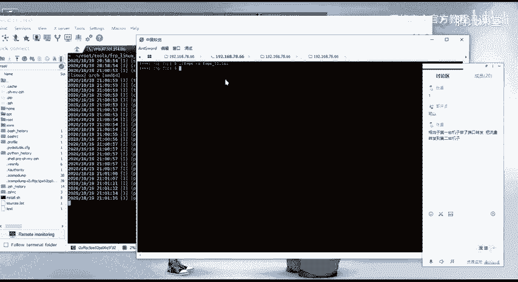

这里的这一个代理端口。那么我现在的话就能够去通过这个代理端口来去访问2。2那个网段，对？然后因为前面的话我们已经得到了这个前通过前面的那个对吧？已经得到了它的一个需。

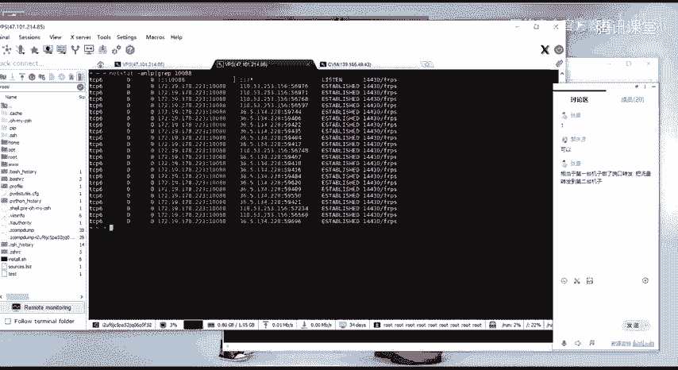

对吧那么我现在的话只需要再通过这边的一个代理，通过原来的一个代理，对吧？然后的话得到这边的一个选。

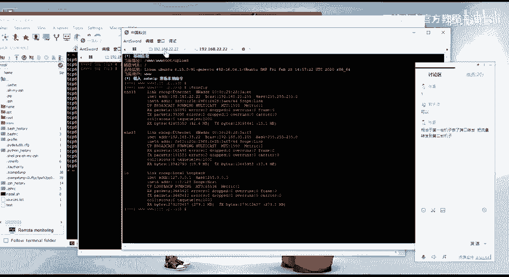

嗯。请空。啊，是没有问题的。因为我们在这块其实同样都经历了这样子一个代理嘛。然后我通过这边的1个11188，我同样的能够去访问这个这个网段，对吧？然后下下面的话，我要把我的一个流量把它给转到。

就是说把它给转到这个33这个网段。

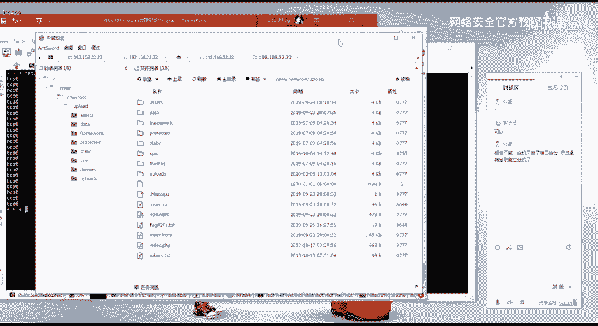

Yeah。

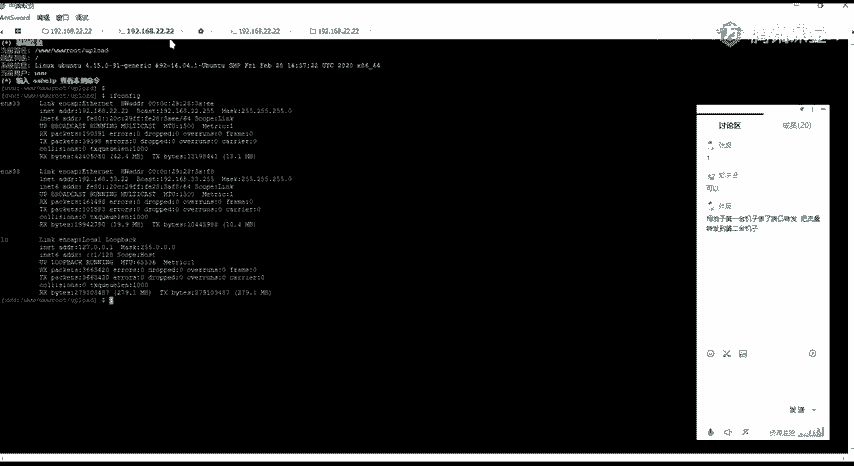

我们就需要去做这样子的一个。操作。

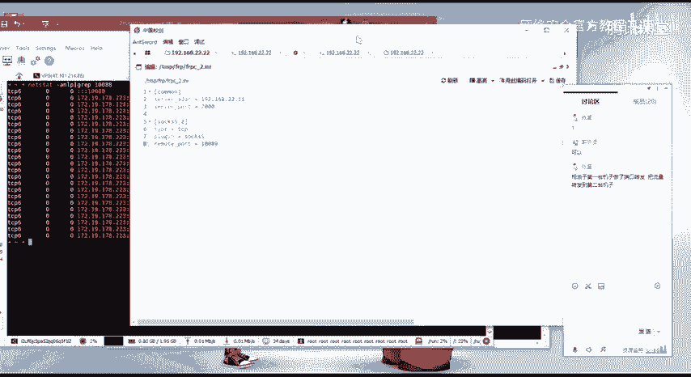

首先的话，第一个就是在我这边的。嗯。这边。这边的这一个t的一上面，我需要通过。FRDS。来去今天一个端口，来去等待这边的我这边2的这个呃FIP的客户端来去建行一个连接，对吧？呃，这边的话是IPC。

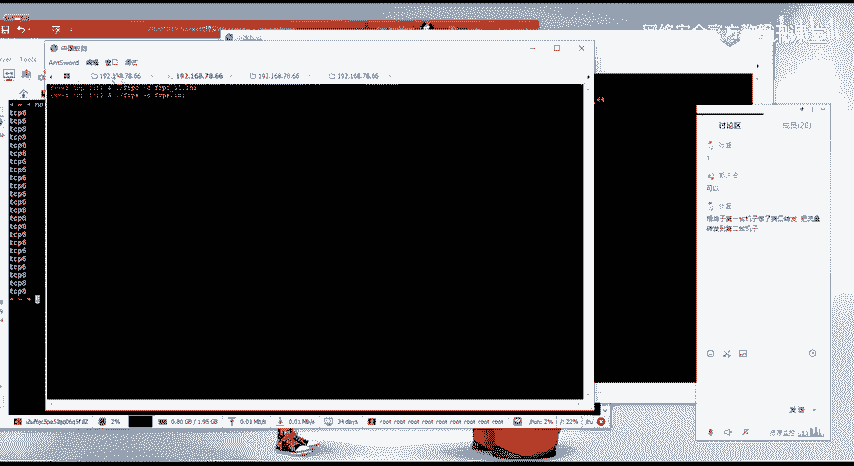

应该是吧。嗯。咦。就这个FRP对吧？

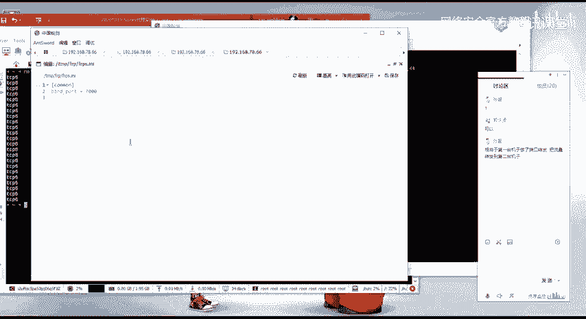

啊。然后在这里的话，我们可以来看一下是否就是执行成了。实间成功了。这边IP。对啊。可以看到这的话已经执行成功了，然后他在这边本地的话就经进了这样子的一个端口，吧？这个端口的话就是。70好吧70。

7000的一个端口对吧？已经处于一个惊清状态。好，我们在这边的话，再通过这边来去建立一个。不。你建立一个说s的一个连接呃。执行这边的1个FRP。阿阿爸杰 c。执行之后的话，我们的一个配置文件，对吧？

我们可以看一下我们的一个配置文件的话，它会是在呃我们那个RP上面，它会去精贴一个这样的1个10089的一个端口。那么我们去判断它是否建立连接的话，我们就可以去查看一下它的这个端口。

它是否有一个今天的一个端态。

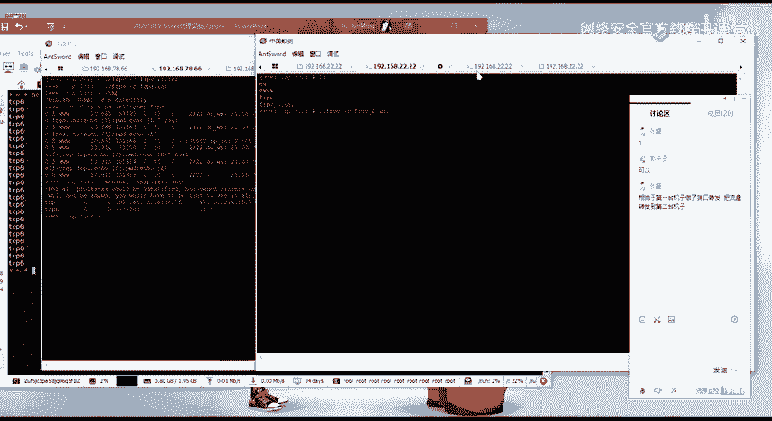

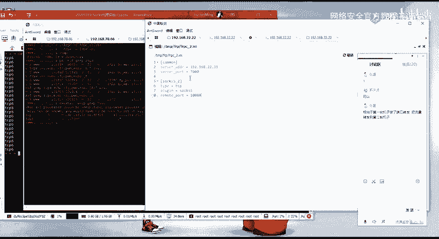

你8点。对吧可以看到已经处于一个惊天状态。那么现在我们经历了这样子一个连接之后，对吧？经历了这样子一个连接之后的话，我们再通过。

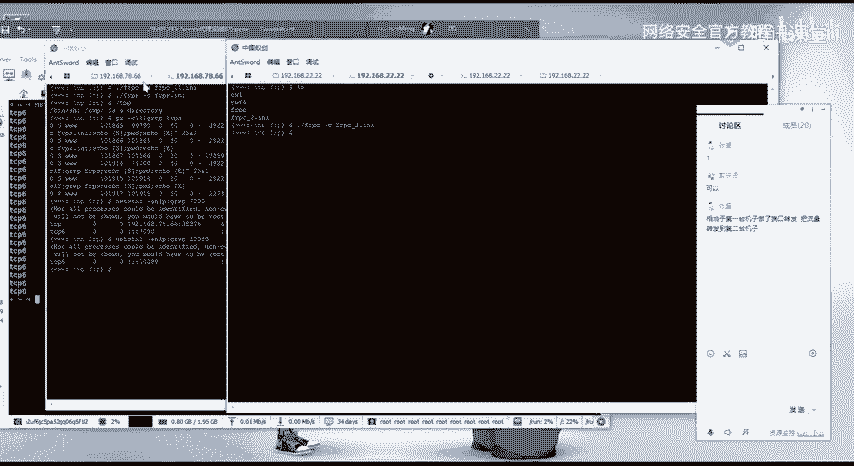

呃。

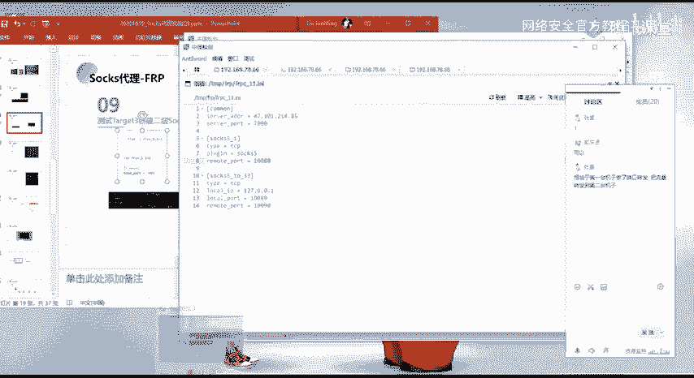

比如说。呃，这里还是以这个机器为。

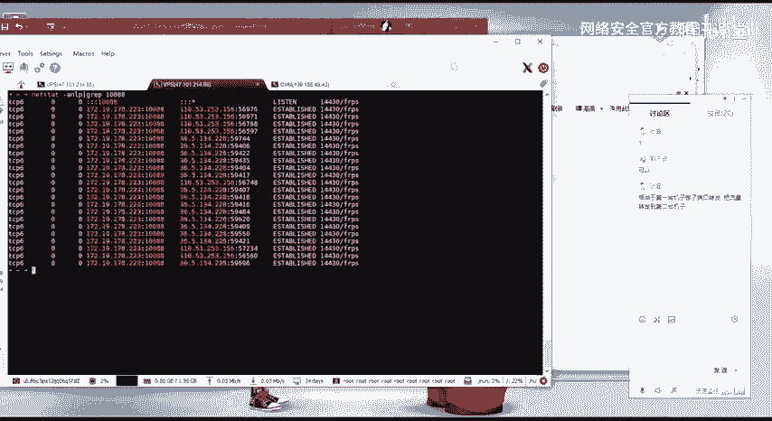

我们需要去更改一下我们的个配置。因为我们这边的一个代理端口的话已经定了，对吧？现在的话是100减0。啊，我们通过prolocktrain同样的来去扫，描还不下。啊。这个192。168。33。

33这个主机对吧？嗯。嗯。😊，没经意功。等一下看一下。

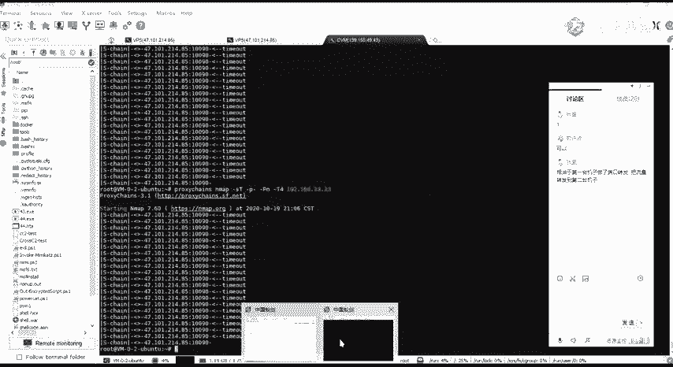

啊，我这边RPC断掉了。这个用通过这样子这个方法，它有缺点就是。比较容易断。

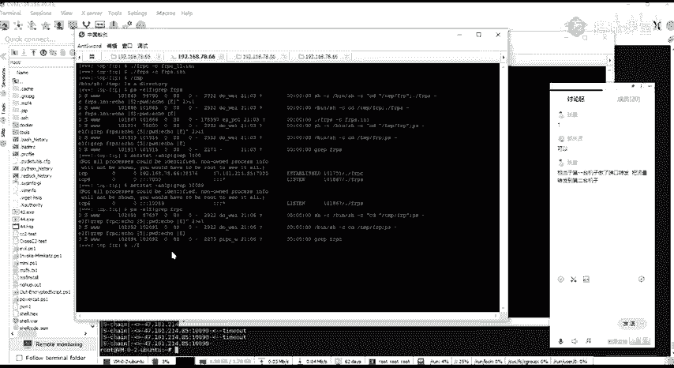

我这边的话。呃，其实。从这边应该也能看到，对吧？就就是我这边的一个呃s的一个代理的话，已经就是。

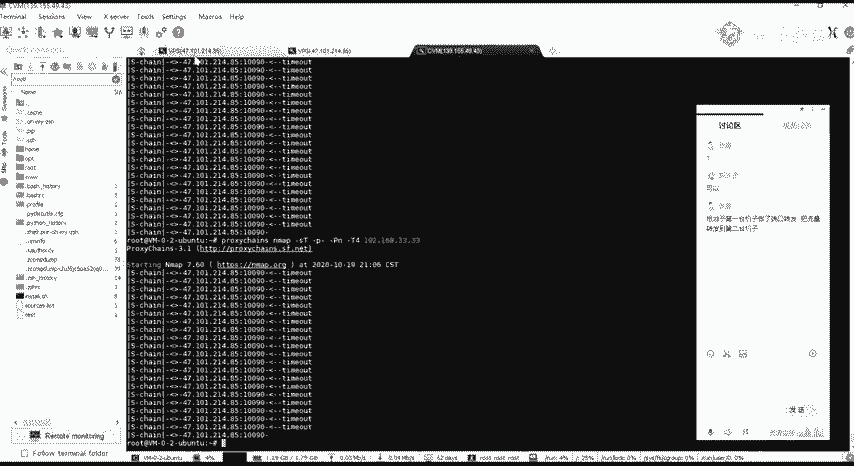

被关闭了。所以说话我这边。就是找这找找这一个问题的话，就是我这边的1个FRPC对吧？没有跟我VPS上面的1个FRP去建立了一个连接。啊今是一点。哎。Yeah。要重新来一遍。Okay。信号应该是没问题了。

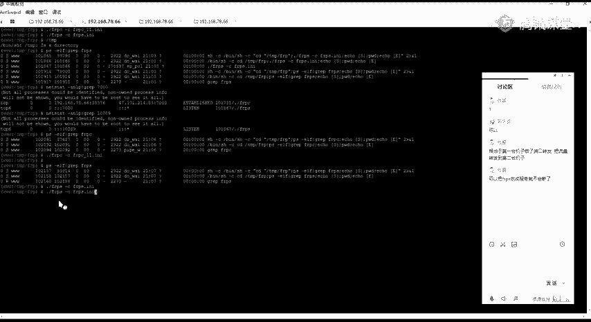

这里的话也已经进行了连接，对吧？然后的话我们在。我另外的一个服务器上面来去进行一个对吧？

通过map来去对它去做一个扫描，可以看到这些话，OK他OK就3389端口开放了，对吧？还有445135等等这一些端口139，它是一个开放的一个状态。那么说明的话，我这边的一个通道的话就是已经进入进力呃。

建力成功了，对吧？是没有问题的。然后以及对吧我这边可以通过。可以通过全局代理对吧？因为我前面的话已经就是我后面后后续的一个操作，就对windows那一个机器嘛，对吧？对windows那个机器的话，呃。

我们可以就在MSF当中去设置那样子的一个代理，就是设置全局代理。让我们MSF的一个流量走我这边的这样子的一个代理通道，就是呃这个47。101。214。85，然后这个10090这个IP这个端口对吧？

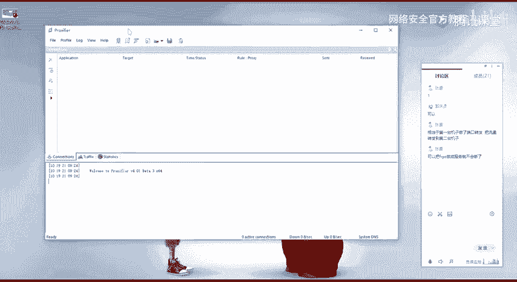

前面在讲MSF的啊，不在讲MSF跟CS呃，灵动的时候，不是呃CS上面的话，它会有这样子的一个。啊，就是生成一个这样的一个命令嘛，就是s。呃，摄像机。prokey是吧。收。对吧，然后的话接我们的1个IP。

以及端口是吧？然后其实在MSF当在MSF当中的话，我们同样的可以就是通过这样子一个方法。这个方这里的话就是设彩计划就是设置一个全局嘛，就设置一个全局代理就是在MSF当中所有的这样子的一个流量就是呃。

比如说我MSFMSF去打MS17代010对吧，它有相应的一个请求，以及发送相应的一个配O的那我这边设置这个单你之后的话，我要去打这个192。168。三三。33这个机器对吧？

那么我再去设置那个配load的时候，我可以去设置这样子一个代理。然后的话设置这1个IP，然后直直接export。就可以了。然后他的这样子的，他打在打这1个IP的这个流量话，他会通过这边的一个代理通道。

他会把它发送到这边的。

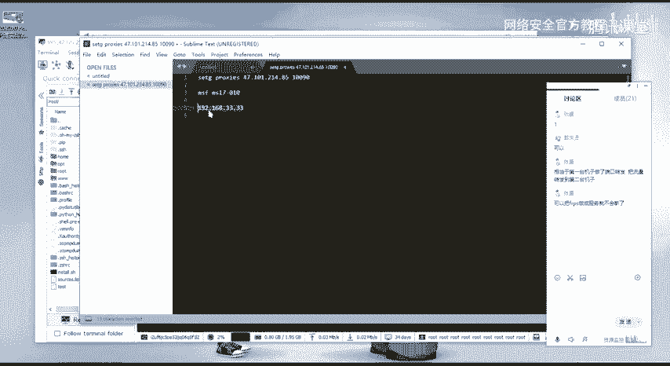

我这边的一个把机的这个对吧？这一个把机的45的1个端口，对吧？

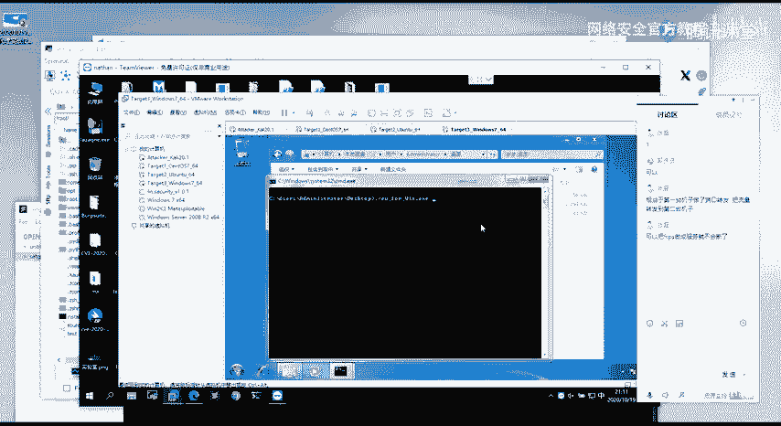

然后的话呢去进行一个漏洞的一个new。

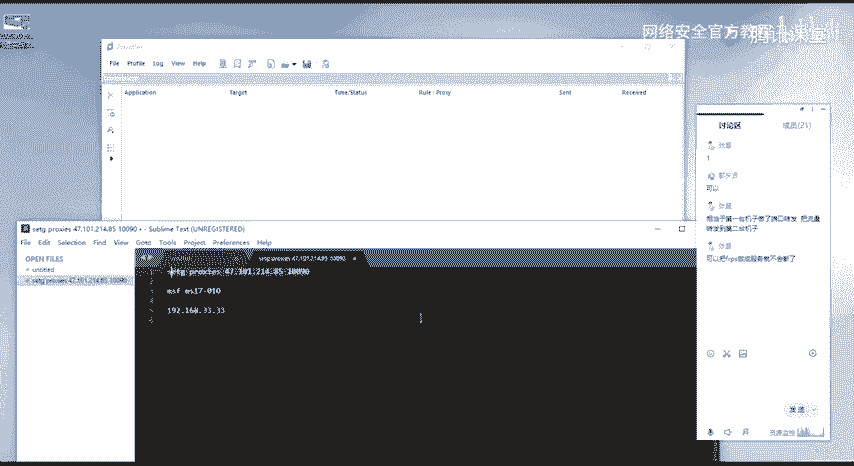

然后这边的话我就。大家自己做一个课后作业，大家自己去尝试好吧。然后呃其实大家现在可以就通过我这边的这个代理。就是这我这边的这一个。10090对吧？以及还有呃10088嘛。通过这样子的一个代理。

你可以去访尝试访问，这还有1个10088，对吧？10188的话，你可以去访问那个192。168。2。2这个IP嘛，对吧？你你在你自己本机上面连浏览器里面。

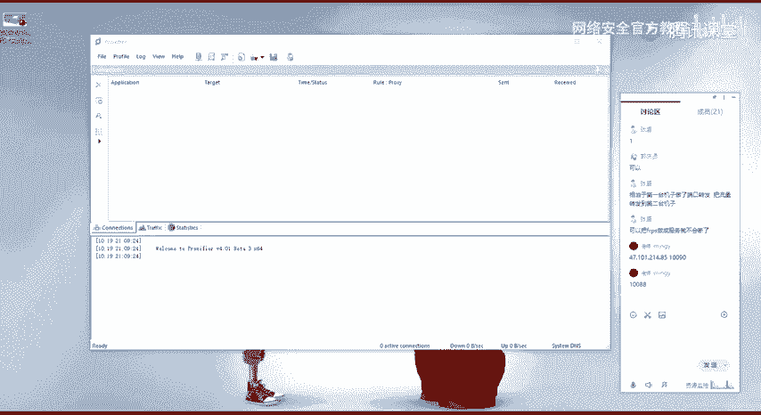

你设置这样子的一个代理话，你也同样的能够去访问到我这边的这个。嗯。

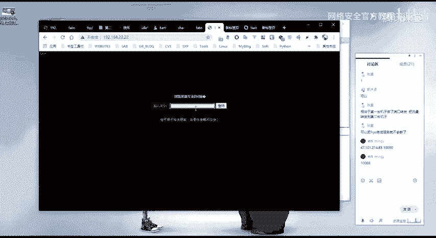

这是。

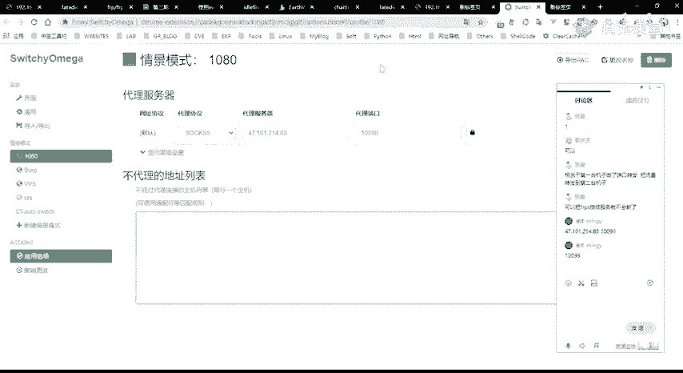

都谁给我改啦，这么快嘛？Oh。是不是谁谁把我给改了，把我的。

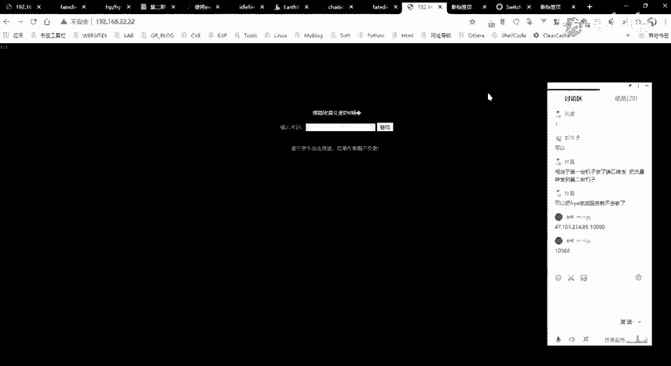

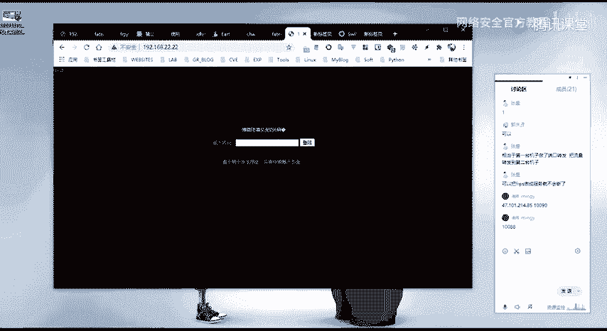

是你们你们有谁改了吗？

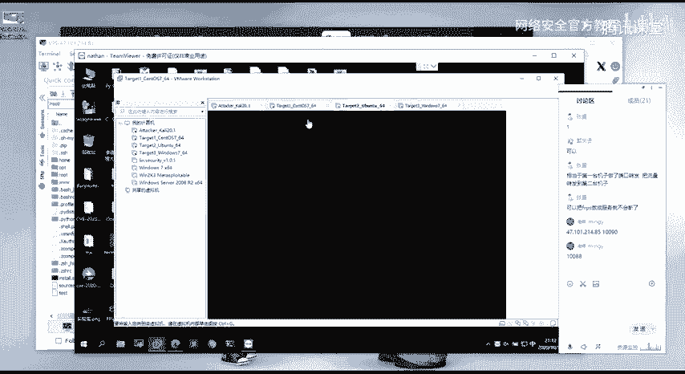

看一下。你放个放个档案吧。嗯。啊，不是这个机器这个。哎，没有啊。

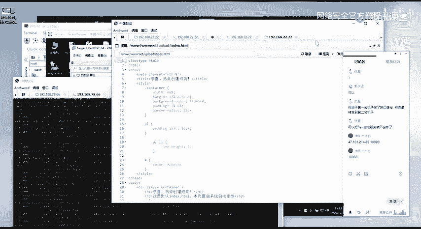

She。

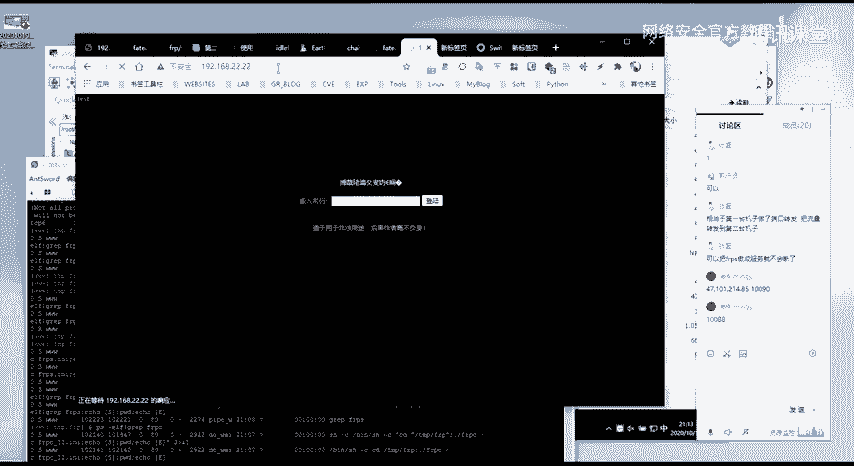

那我怎么你们你们是不是你们谁改的呀？是吧是你们谁改了，改了那个index的那个页面吧，把它首页给改了。

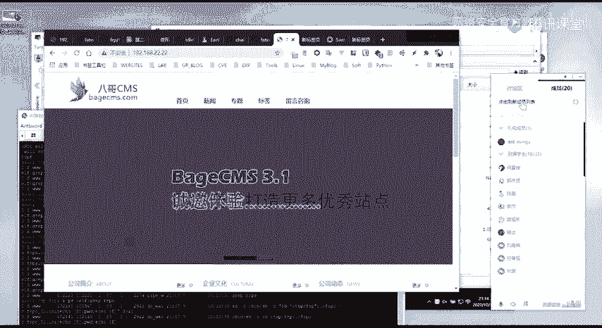

🤧嗯。你们现在也可以通过这样子的一个方法去访问到。就通过我这边的一个代理。啊呃，然后的话我们继续看PPT的一个内容。就是呃后面的一个操作的话就是也是一样的嘛，对吧？同样的就是信息收集嘛。

对这1个IPIP然后的话呃以及这边的1个45端口的1个利用，对吧？就通过啊我们的1个MIM17-010对吧？然后这边的一个它的一个利用的话就是通过这样子，就我们就是这边s pro pros。当然的话。

你就是说这边呃。我这边的话是指在这一个模块下面啊，就是说我这边设成这个代理的话，是只只针对这个模块，它的一个请求流的话，它会走我这边的一个收拾的一个通道。然后的话如果说你设的是你设的是三等机。

你设的是设水机的话，那么就是说MSF下面所有的这种呃模块，或者说你的这样子的你的这样子的一个请求，它都会通过这边的一个说辞的一个拉里通道。就是这边的话是一个全局。

这边的话就是一个针对这一个当前的一个模块，对吧？然后设置代理的话是这样子，s5接我们的1个IP以及端口啊。然后呃我们可以看一下这边。我这边的一个截图，我这边就不操作了。嗯。😊。

就最后的话呃它的一个效果的话就像这样子。然后得到了他的一个选。以及呃3389连接的话，我这边同样也不连接了，跟上节课的话一样的对吧？我只要代你通道，我尽力尽力正确的话。

那么其这一些操作它都是会没有问题的。然，以上的话就是FRP的这样子的一个代理工具的一个使用，大家能理解吗？啊，对，刚刚的话是10090。呃，还还有呃对，这边我还是要说明一下，就是我PPT里面的话。

因为我PPT有些是用的上一期的对吧？所以的话呃这样子的像这种IP以及它的一个配置，然后我有我这里我这边的话也有就是有改，对吧？就是可能没有是可能没有统一，对吧？他没有去统一这样子的一个IP以及这种端口。

所以大家再去看我PPT的时候。你不要去照着那个照着我这边去写的对吧？你看你看着上上面跟下面不一样对吧，你就哎你就你就不知道它是什么了，对吧？你不要被我这边的1个IP以及端口给误导了，好吧。

因为呃有同学就是有同学就因为这一个那个当然他那个是确实是我就是改了上面那一部分，我下面那一部分忘记改了。这个呃我的问题吧，就是这边也提一下，就是大家不要被这边IP的端口误导。就你这边实际的1个IP端口。

跟按你实际的一个情况来定嘛。做证服务呃。你可以这样的。但是就没没太大必要了，是吧？反正你就就用一会用一会就关了。Okay。啊，应该没有问题吧。大家有问题吗？没问题的话，那么我们继续啊。呃。

下面的话就是我们的第二部分，也就是呃。一W。你打了这个工具的话呃。就比较老的一个工具，也是。然的话呃它的一个功能的话就是。也是很强大的一个工具。然后同样的我们的一个场景的话，呃。

跟前面的一个场景是一样的。哦哦。首先的话我们先来大概的了解一下，就是EW它的一个基本的一个使用吧。就这边的话，我这边这张图的话就有它的一个基本的一个选项。其实这边的这个选项的话。

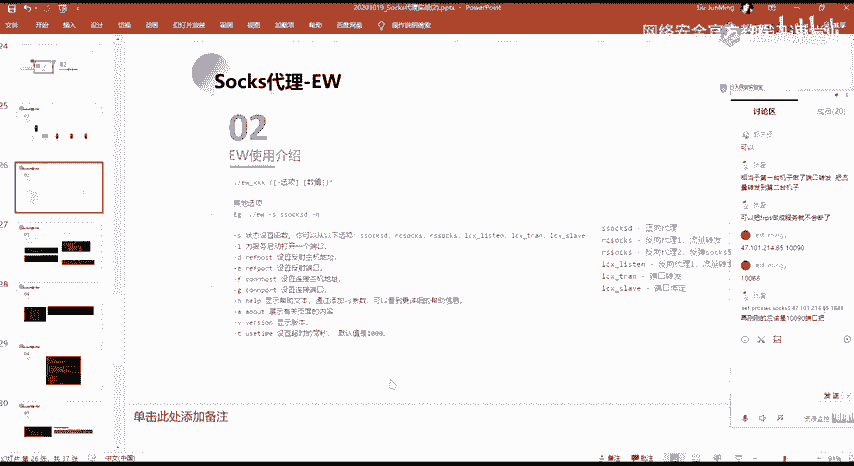

关于这个工具，大家可以去看它的官网。

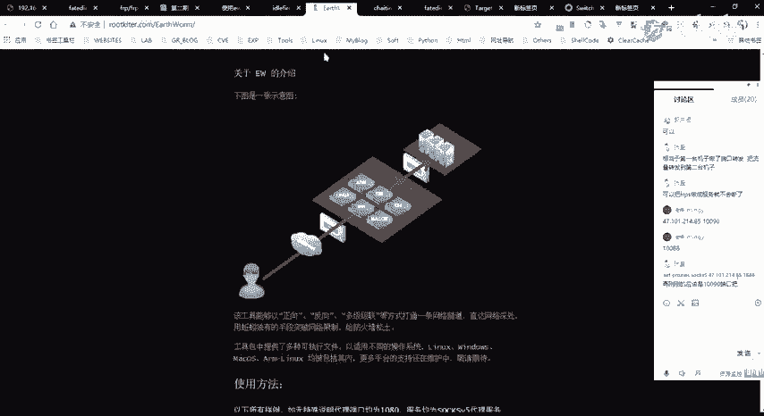

呃，没有，不是是。可了。嗯。呃。打你。这边。就是去这边去看这边的话是EW这个工具的一个下载，也可以在Gup上面这边去下载到，把这些东西。这个的话就是它的一个可执行文件嘛。然后在这边的话有一个read命。

readmin这边的话其实就已经详细介绍了这个工具的一个使用。就这边的话它呃有腻子啊，有图对吧？以及文字，就这边的话很详细的呀，以及它的一个参数，它的一个具体的一个使用。

就这个这个的话是作者啊写的作者提供的。所以这边的这个工具的话呃，我不会去讲的很细，你只需要知道大概用就好了。然后的话你想要去去了解更多的话，大家自己去尝试，好吧。啊呃，这边选项的话我也不多说啊。

就是大概的看一下吧。呃，就我们在后面会有去用到的像我们首先第一个就是干S。杠S的话就是呃其实在这边也都会用到。它主要的它其实也就这几个选项，就是杠G杠F杠1杠D杠L杠S。

要干S的话就是设置我们的一个就是状态，或者说设置我们要去使用的一个模式。然后在这边的话，它有这样子的1234，有66个模式。这六种模式的话，它分别对应的一个艺术，可以看一下这表。

首先第一个话就是这个啊指定这一个SSshop的指定这一个的话它表示的是一个正向的一个代理。然后RC socks反向代理流量转发，然后RC socks。啊RS folks。它也是呃反向代理。

然后的话它的它可以反弹我们的一个s。然后还有就是LCXlist啊，ch，还有sve。然后大家如果有就是有用过LCX这个工具的话，对这里的面令的话应该应该不陌生，对吧？它的这个工具的话。

它有借鉴这边的一个呃LCX的这样子的一个呃方法。然后杠L的话就是打开一个端口，就是其实就是今天一个端口嘛，对吧？然后杠D的话就是指定我们反射的一个主机地址。这边的一个反射主机的话。

其实就是我们要去如果说我们要反弹一个ss5到我们的一个呃我们的一个ss的一个服务端，对吧？那么那么在这的话，我们就需要去设去设置，对吧？去设置我们的要反弹的。

这要反弹这个ss5的这样子的一个主机的一个地址，以及它的一个端口，对吧？其实就是跟我们前面FRP对吧？在外卷收破的对吧？我们呃在这边的话，如果我们用这个SDIS source对吧？来去反他一个ss。

然后的话它其实就是会去连接这边的一个反射主机的一个地址以及端口来去建立一个s的通道。然后盖F的话就是呃设置连接主机的一个例子，就是我们。主动的去进行一个连接啊，以及连接的一个端口。然后具体的话我们呃。

以实力以实际的一个例子来。你来展示。呃，在这边的话，我这边PPT其实已经写的很详细了呀。然后的话还有的话就是预习内容这边的话给了两个文档。

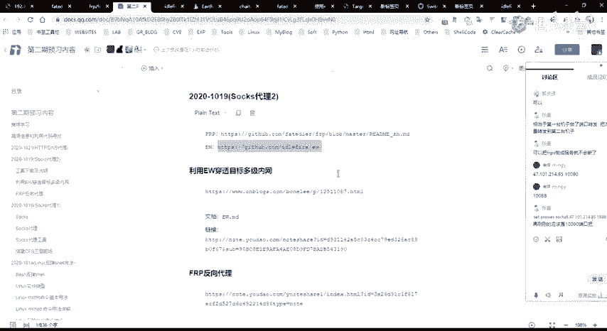

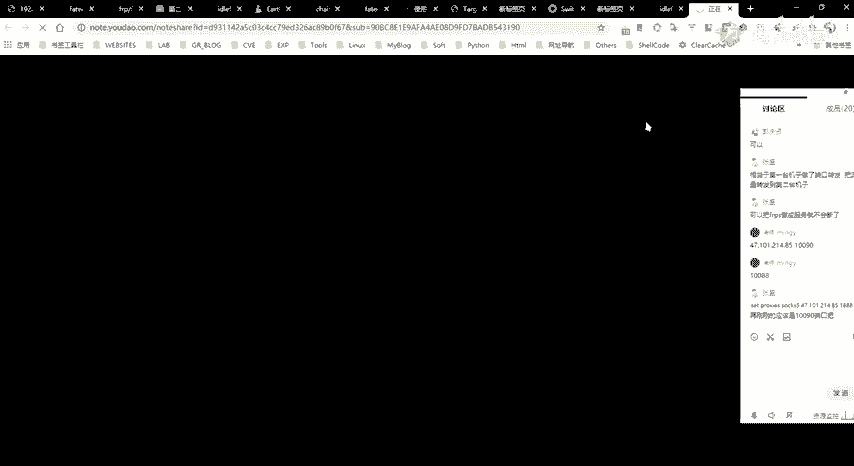

给一个就。就这个首先呃这个一W这个工具啊，它的一个详细的一个使用，以及这边的一个截图啊就是。

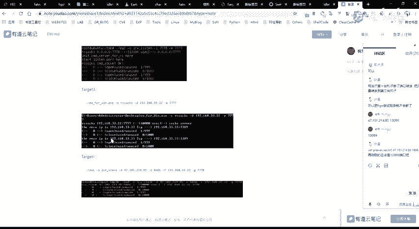

呃，以这边的这以这边的这个靶机作为一个实际的一个例子。大家可以去看一下这篇这个我这边写的这个笔记吧。

然后首先的话就是这个正向的一个ss的一个服务器啊，用EW来去创建。我们在这边的话就只需要使用这个杠S指定这个ss。就是呃我们前面有介绍对吧？这个socks的话就是正向代理嘛，对吧？

我们就是干S指定呃一个正向代理的一个模式。然后杠L的话就是今天一个端口，对吧？然后这边的一个今天的一个端口的话，其实就是我们的一个代理的一个端口。

然后我们要去呃去访问这边它的一个呃代理的这样子的一个网络的话，我们就可以通过这里的一个端口来去进行一个访问。🤧嗯。

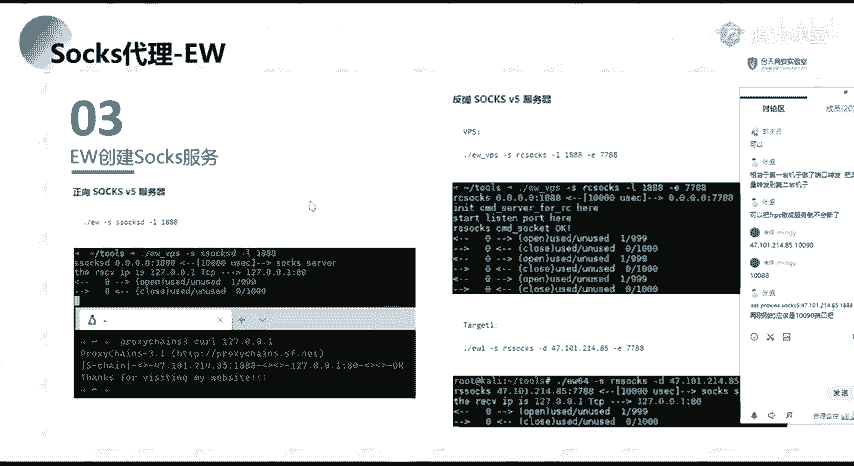

啊，我这边的话实际来看一下吧。

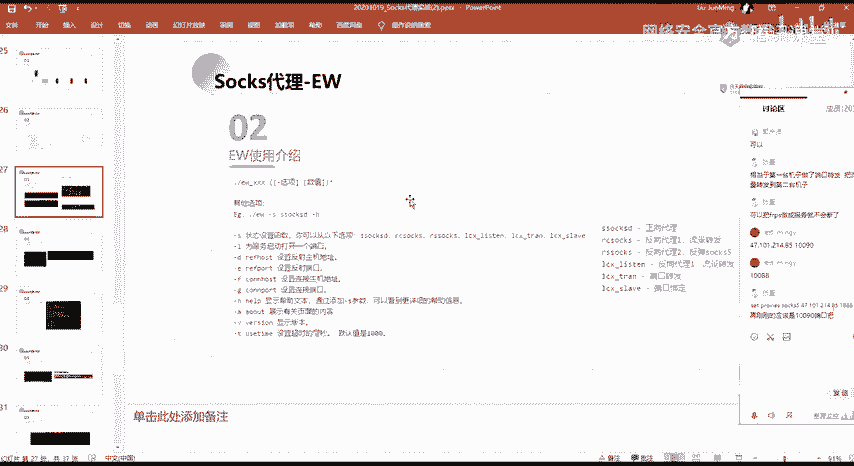

我电话关了呀。知发了。那呃EW的话。就是这边这一个工具。呃，直接直接执前的话，有详细的一个帮助信息啊是吧？然后我这边的话要去建立一个正向的一个代码。比如说我要做的一个代码的话，就是这边。嗯。キさ。

开始床。Okay。1888的1个端口装。然后我这边去建立的这个的话，那么我当前呃在这个的话，它有今天1个1888的1个端口，这样子的一个代理端口。那么我的这一个正向的一个代理，它是什么样子的一个效果呢？

就是。

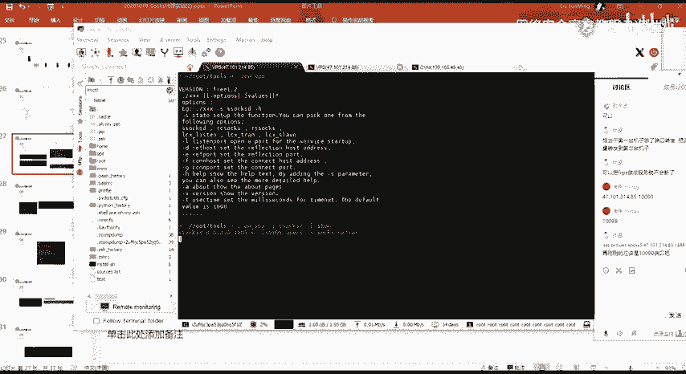

比如我在这边。我在这边的这个n机。首先的话，我通过这个bro chance是吧？因为我要去走他的这样子的一个代名，对吧？

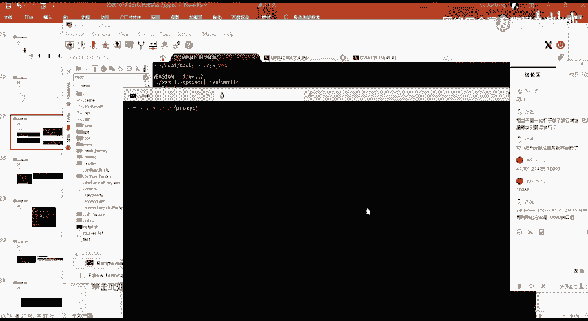

然后。对，就是这样，就是1888这一个端口是吧？然后我现在的话通过这个clo change。来去访问我这边访问的话就访问这一个。比呃，这边的话因为它没有开80的一个端口。

所以的话time out我这边的话就在这个机器上面，我通过pathon对吧？来开1个HTP的一个serv。Yeah。然后这边的话是今天在87的一个端口，对吧？那么我现在在这个话，我。

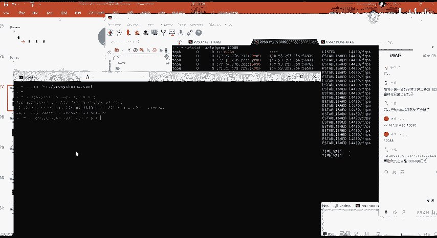

来去访问这边的8清的一个端口，对吧？你会发现我这边的话，我通过这边的一个代理的一个端口，对吧？能够去直接通过访问他的一个127。0。1，还去访问他本地的一个端口，对吧？

因为其实我们这边的一个境立的一个代理通道的话，等于就是呃把我的一个请求，已经代理到了他的这边的一个网端了。或者说你你也可以把它理解成，就是我把它的一个这边的这一个网段，把它给代引到了我这边，对吧？

我可以通过这边的一个通道来去访问。是吧然后其实呃在浏览器当中的话。

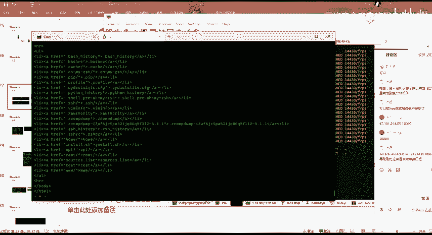

打压器。系呀，能搞弄。不。Yeah。不。呃，好像不能搞是吧。不。Oh。好。Yeah。啊，不能这样呃，直接通过这样补的一个方法。直接这样子来请求。其实这边的一个实际的一个内容的话。

就是呃就是访问的是我这边的一个。这这一个嘛对吧？就是这里的这一些东西嘛，其实这边的话它的一个内容的话，其实就是这边的一个代码，对吧？他那个网页代码。

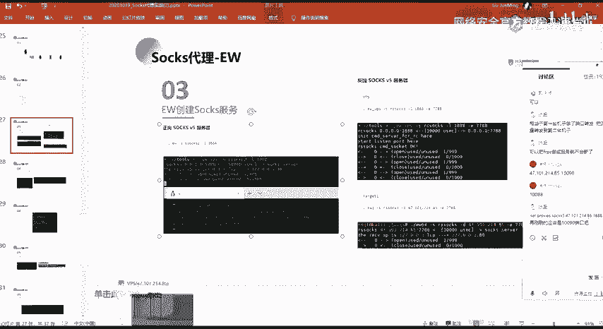

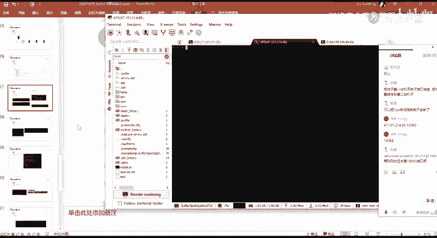

这边的话就是一个正向代理啊，就是我直接通过这个s soft，然后把我当前的这边的一个网段把它给代理出去。然后的话我再通过这边的一个代理，我主动的来去访问到他的一个当前的这个网段，对吧？

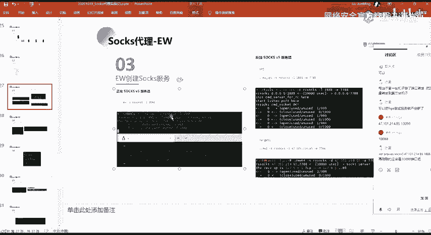

就是当然的话他有前提就是你你是能够去能够去直接的去访问到这边的一个代言，对吧？

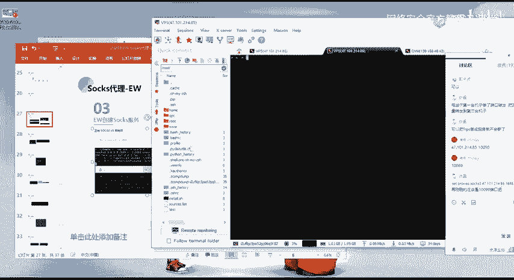

啊呃现在就是反弹的一个说词的一个服器啊。反弹sos服务器的话，我们这边的话主要用到的是这里的两个模式啊，就是IRC socks就反向代理嘛。EGRSs它同样的是一个反向代，对吧？然后它的一个作用的话。

一个是流量转化，一个是反弹的一个ss。然后我这边的话，我要把我的一个目标机器，把把我的一个目标机器呃，通过反向的反向代理的一个方式把它给代理出来啊。

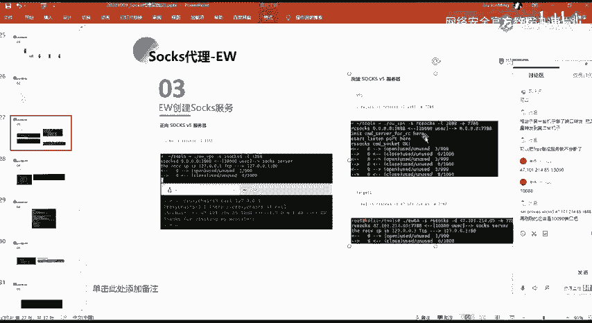

那么呃我们的一个具体的一个操作的话。就是像这样子。Yes。Yeah。Okay。

怎么还有连接呢？

不。换一个端口。我这边的话呃。这边的这一个这边的这个的话是在我的1个呃VPS上面，对吧？在我的1个VPS上面去执行的。然后这边的这一个数这呃这边的这一个呃命令的话，它是什么意思呢？首先的话。

干S它指定我这边的一个模式，是这一个反向代理，对吧？然后它是一个流量转发的一个做这边的一个流量转发，它呃具体是怎样子的？就是我这边干L今天呢是在本地它要今天这样子的1个1888的这样子一个端口，对吧？

这个端口的话，其实就是我们呃代理的一个端口，就我们通过这边的这个端口来去进入这边的一个代理通道。

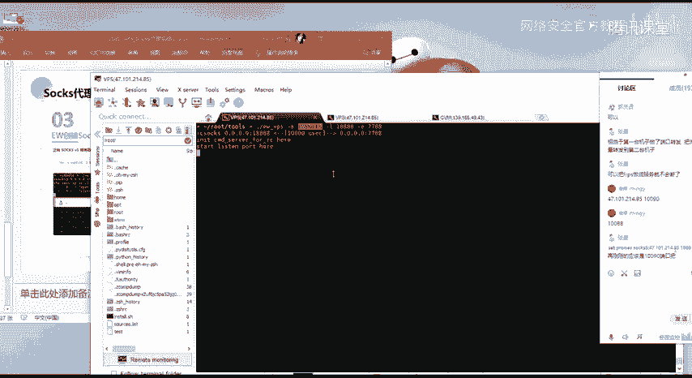

然后他他会在这边他会有这样的一个操作。就是我去比如说我1个HPP的一个请求，对吧？我去我把我的一个请求发送到这个端口，然后，他会把他这边的一个请求的一个流量，它会通过这边的1个7788的一个端口。

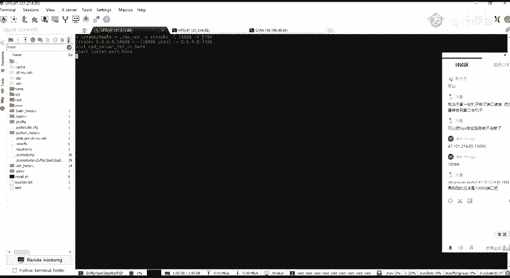

所建立的一个临界。这这里经历的一个连接怎么理解呢？我们先。呃。看一下。我这边找一个我这边内网的这个机器了。

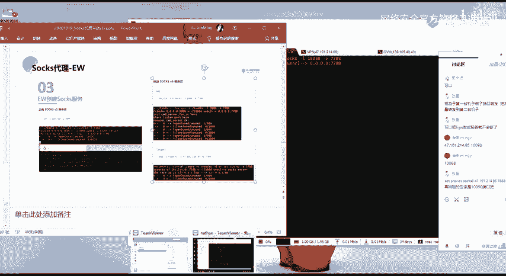

这个。

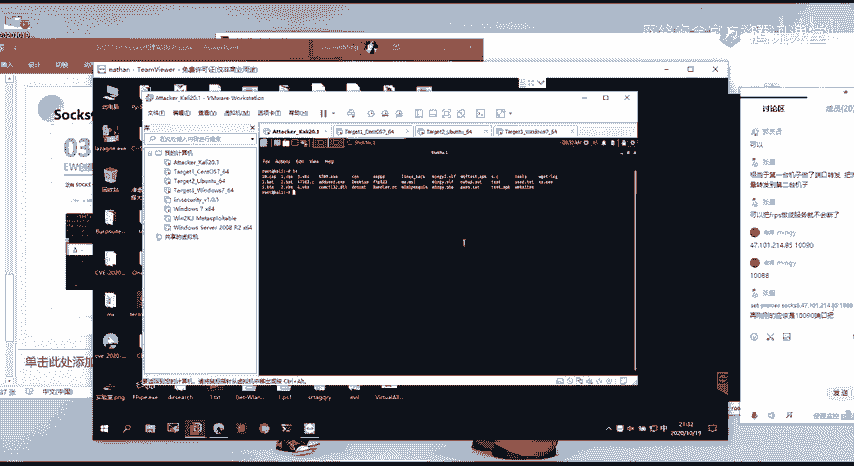

用我这边的这个餐饮机器吧。Yeah。

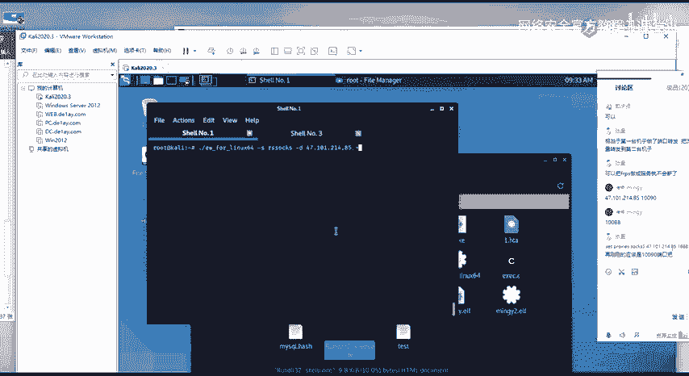

好吧，然后呃在我这边的这一个就是我要去代理的这样子的一个机器啊，就是我要把我的一个目的话，就是我要把这边我在内网的这边的这个看理机器，它把它代理到我的这边的一个公网，对吧？然后我在这边的话。

我所要去执行的一个命令的话，就是这边就是在我的一个目标键上面执行。然后可以看到就是我这边执行之后的话，它会在这边有这样子的一个就是RS cMDO看到这个话就说明我这边的一个连接的话。

这个这边的一个说词的一个连接的话就已经尽力了。然后呃他的这样子的一个。这边的这一个命令，它的一个意思就是我这边指定我这边的一个呃反向代理的一个模式，然后的话它会去返他一个ss。反弹的一个说词的话。

它会反弹到哪里呢？就是他会去在这边，我这边的这边的呃。我这边。这边要怎么说呢？靠课。我的这边的一个目标机就是我要攻击的这个机器，我要带你的这个机器是吧，它会。

主动的去连接我这边的这1个VPSIP以及这边的一个端口。在这边的话，其实就是来去连接我这边的这一个端口。然后这边的一个目标机与我的一个攻击机之间的话，它就会去建立这样子的一个连接，对吧？

就是他这边他会主动来去连接我这边的1个778对吧？然后经力连接。经力连接之后的话，我实际的一个流量的话，就是我通过这个1888的这个端口把它给转到，就通过这边的建议的一个连接，把它给转到我这边，对吧？

然后呃同样的我这边。

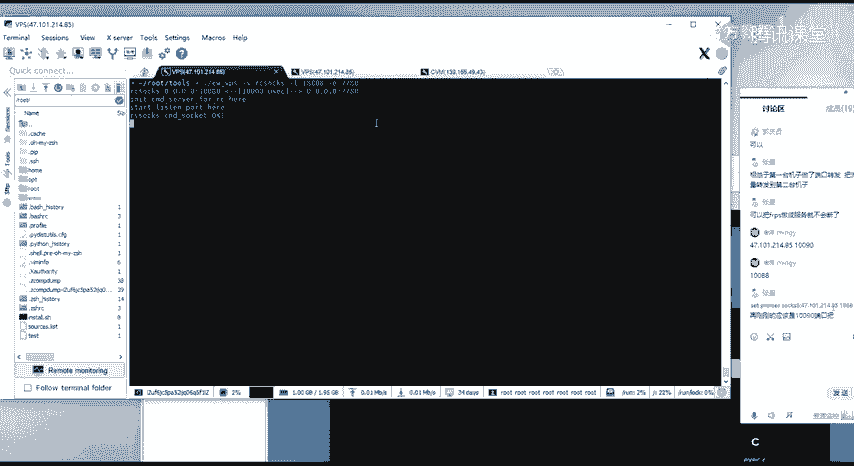

呃，没开外个服务，同样的就是开一个吧。Yeah。我同样的在当前目录开了这样子的一个88000的1个serverHB的一个serv。然后我在这边的话，我就能够去访问。反正的话就是通过我通过这边的一个。呃。

Okay。喂。散位啊。

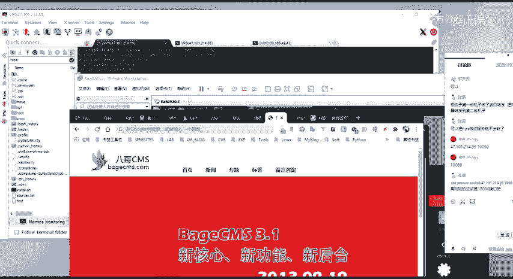

什么か？She。呃，我还是用用这边吧。改一下。这边的话是1888啊。

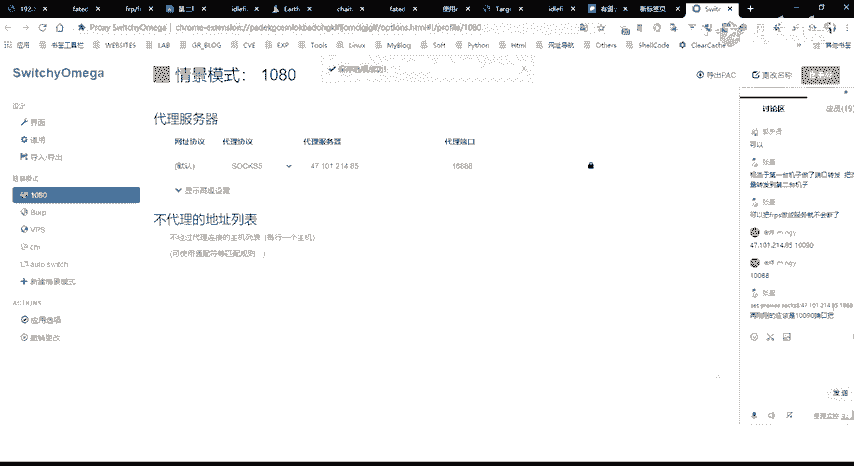

Yeah。好的我在这边这个机器。较好演示。然后的话我同样的。CL来去请求这边的我本地的8000的1个端口，对吧？然后其实这边我的1个CL去请求的话，请求这边的这1个IP的1个8000的1个端口。

它其实通过这个代理它发送到这边。

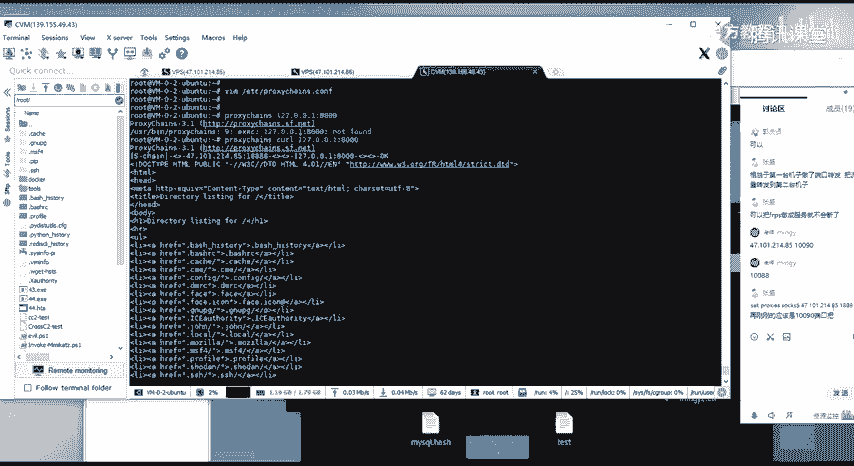

他发送到了我这边的这个。这里对吧？你也可以看到他其实请求到了我这边，等于就是我已经把我这边的这边的一个网络网段已经把它给代理到了这边。然后的话只要通过这里的一个通道，我就能够去访问它的一个资源。

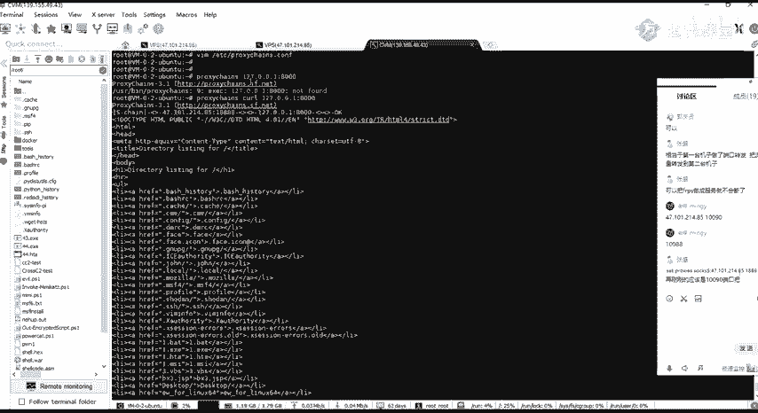

然后呃再这个话就是同样的是那一个就是。HP的一个那个文件列出来的嘛，对吧？

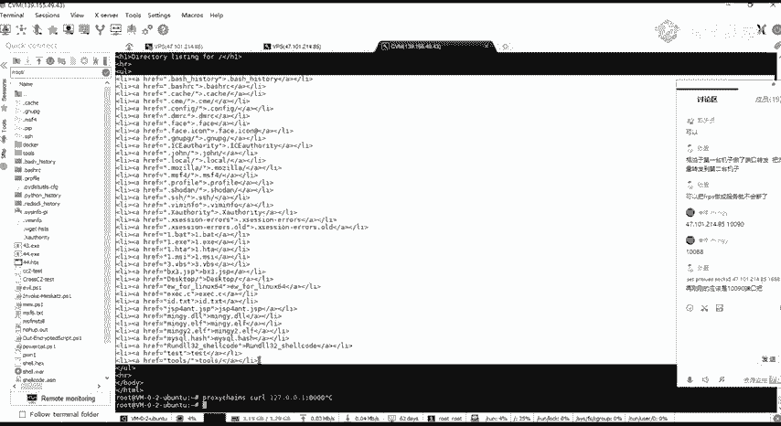

这样子的这边的我的。一个一些文件的一个名字嗯。嗯。Okay。

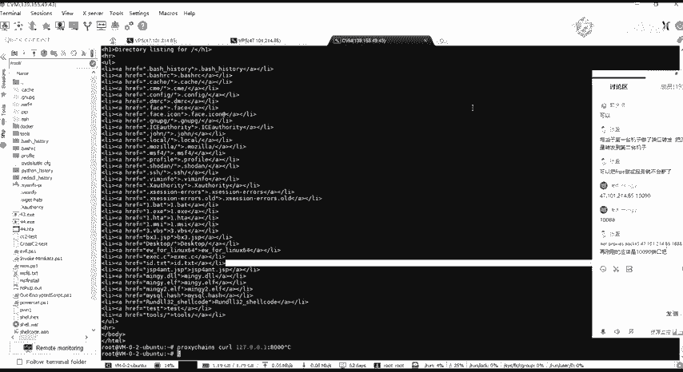

うんう。🤧嗯。呃，这边它就是一个反向的一个说死的一个代表。啊呃到我到我们就是结合到我们实际的一个这边的这个靶场。对吧呃这边的话这个EW的话就前面的一个被部分的一个内容话就省略了。

我直接从就是创建说指代理这边开始，对吧？

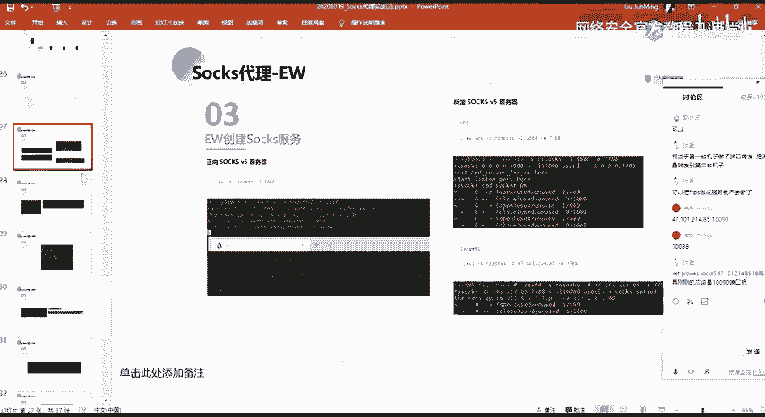

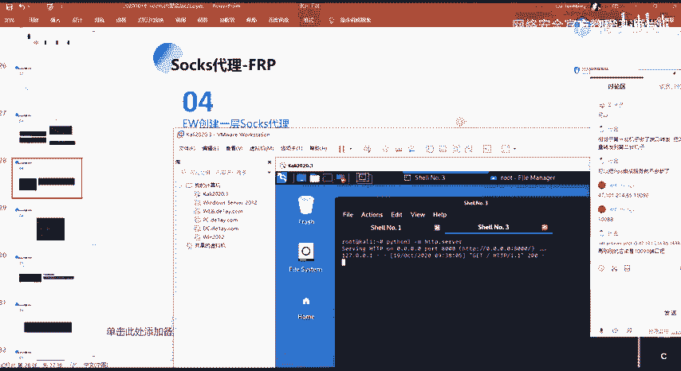

う。好呃，首先的话在这边。呃。我们的这样子的一个步骤是这样子。呃，其实在这里的话，其实就是同样的就是用了这边的一个访弹说词代理。的一个方法，对吧？可以看到，其实命令都是一样的对吧？然后呃同理的话。

因为我们前面的话就是通过这样子个方法建立了这样子一个代理，把我这边的一个卡里机器这边的一个。

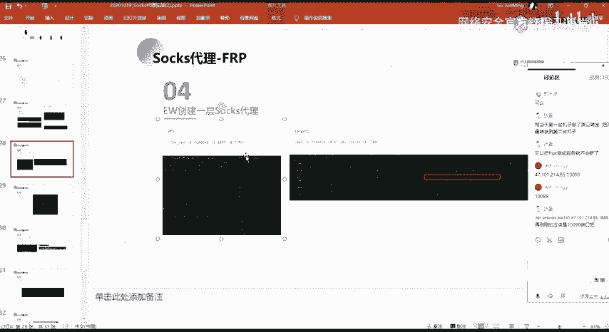

呃，网段网络把它给代理出去了，或者说把我的一个流量带带理到了这边的一个内网的这一个网段，是吧？那么我想要去访问到内网的这边，我这边把机的这一个。这这1个2。2的这个网告，对吧？那么。首先我在PPS上面。

我需要去啊起一个这样子的一个流量转发。呃，其实呃对，刚刚没有说没有提到这边这边的话。好错了。说了那个是年量搞发吧。卡了，就是这个就是RC source对吧？这个其实它的一个作用就是流量转发，对吧？

然后把我就是来这一个端口的一个请求的一个流量转到这边经行的一个连接。然呃在这边的话，我们同样的通过这样子的一个方法。呃。嗯。看一下端口。

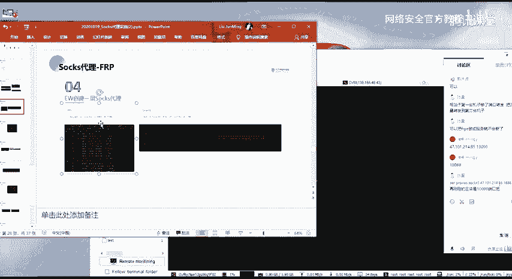

好开始咧。嗯，还是这一个吧，就。6188的这个端口。然后我这边的一个目标机器上面的话，我就需要去来主动的去连接我这边的一个。呃。然后呃我需要在我的这边的taEG上面去执行这样子的一个连接。

这边的这个命令的话就是反弹这边的一个收持，反弹到了这边，对吧？可以看到它已经OK了。那说明的话，这边已经经了这样的一个代理通道。那么我们现在的话我们就可以尝试去。

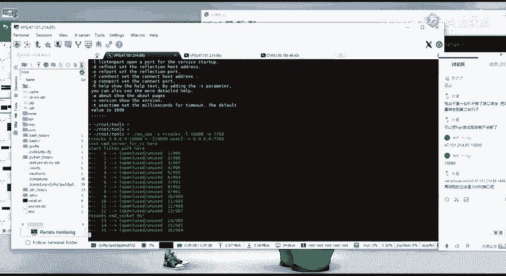

这边啊就是这一个没问题。然，我这边。先不走这个对吧我直接去你这话还像不到的。然后我这边的话切切这个的话，可以看到是没有没有任何问题啊，对吧？

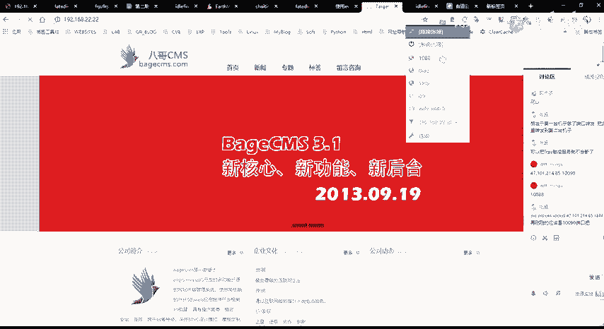

对吧是能够直接去访问到这个网段的。那么它其实就是把我这边的一个访问到这个网段的一个流量的话，通过这边的一个流量转发转到了我这边。

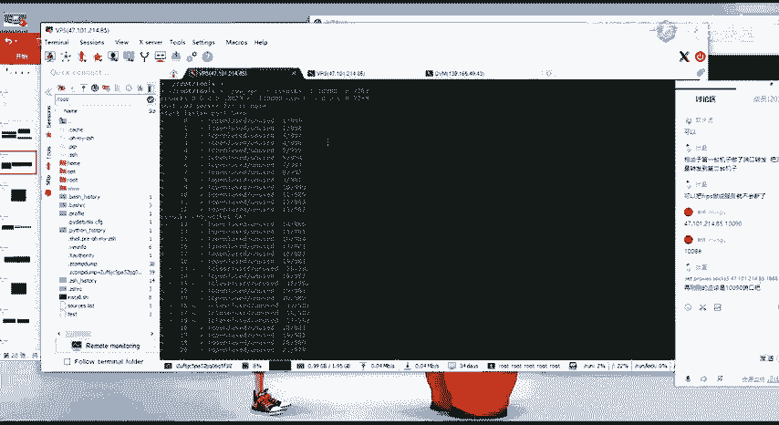

这边的这一个机器。然后的话他会通过我这边的一个网卡嘛，找到那个2。2这个主机的1个80的一个端口嘛，对吧？这边的话就是呃建立了一个一层的一个收指代价。就是跟前面的话呃。呃，应该也是类似的是吧？

就是这种流量的一个走向，对吧？都是通过呃有一个这样子的一个代理端口，然后的话把我们的一个流量就是通过一个啊ss通道，对吧？然后的话把它给转到我们的一个呃shops的一个就是转到我们的一个内网。那呃。

这边的话就是我通过这样子的一个方法去进行一个验证了啊。🤧然后呃创建二层的一个收持代理的话。Yeah。嗯。好吧。搞一思喉咙有点堵住了。嗯。呃，不好意思，好 long。堵住了。嗯，然后话我们继续啊。啊。

喝了喝了水。就有有一有一点小谈，就是。呃，然后的话。二层的一个收持代理的话，其实也是类似的。然后主要的话就是它的这一个工具，它去进行一个这样子的一个流量的一个呃转发的时候，就是它的一个命令使用的话。

它是不一样的。然，其实在这边的话，重点的话就是这边在t的一上面，对吧？其实我们前面用FFIRP对吧？FRP我们的这样子的一个配置，其实最多的其实就是这个呃外网的这一个外表机器。🤧对啊，就是这边。

因为我们需要在这一个机器上面做这样子的一个流量的一个转发，对吧？因为呃。因为这一个机器的话是我们就其实就是我们从外网访问到通向内网的这样子的一个机器，也就是一个跳板机，对吧？

然后的话我们需要把啊我们从外网来的流量，通过这一个通道来代理到它的一个内网当中。所以的话我们需要做一个流量转发。在EW这边的话，它使用的一个方法的话，就是用的这一个。呃。LCX slaveve。

我们可以看一下前面这边就这这个模式，对sle的话就是一个端口绑定。其实它的一个这边的一个作用的话，就是把这边两个端口的一个流量做了一个转发，就是在这边。他会把呃就是把我们这边2。2这一个机器。

这个的话是我们内网的这个机器嘛，对吧？2。2这个网站的这边的1个999端口的一个流量，把它给。啊啊，不对，是呃说反了，是从这边。就是从这边干低干低去连接我们这边的。经立的这边的这一个端口，对吧？

叭8呱呃，没没错，对上。就是他在这边他会去建立这样子一个通道，对吧？然后的话我们的一个流量通过10088这个端口进入到这个通道。然后他在这边的话，他会把这边的一个流量转发到我这边的1个2。

2的这个9999的这个机器。然后的话这个999啊，不是999，这个机器啊，是呃这个端口说错了，不好意思，就呃转发到这个2。2这个啊机器的9999的这个端口，对吧？然后这边的这个端口的话。

其实就是在这边它有这样子的一个啊s。这边的这个收死的话，其实就是呃。建立了一个正向的一个那个代理嘛，对吧？说不死的，然后他在本地他会去呃今天1个999的1个端口。然后的话我这边的这一个流量对吧？

我从10088的一个流量，通过这边建立的一个啊通过888这个端口所建立的一个通道，建立的一个代理通道。然后的话把它转到了这边的1个999对吧？其实就相当于就是我们前面的这边的一个正向代理嘛，对吧？

就他同样的是把我们的一个流量就呃通过这边转到了他的一个呃那一个网网段嘛，对吧？然后最后的话最后的话就是等于就是我们要去访问，就是比如说我们因为我们这边是二层的一个代理，对吧？我们前面这边一层的代理的话。

就已经实现了，能够去访问2。2这个网段。我们这边二层代理的话，实现的是要去访问33。33的这一个网段，啊？那么我们这边的一个流量转发到了这边的一个呃2。2这一个机器的一个999的一个端口，对吧？

那么其实就是相当于我的一个请求的话，我同样的能够在这边呃在这边的这个2。2这个机器上面，把它通过那个呃网卡给转到呃我这边的1个33的那一个网段去，对吧？然后最后的话我们他会去建立这样子的一个连接。啊。

不是就是建立这样子一个通道，这样子的一个流量的一个走向。然后呃在这边的话就是我们就可以通过这样子的一个通道来去呃探测这边的1个33的网站，是吧？这就是我们的一个流量就能够去访问到。去啊。

能够去把我们的一个流量就是传到这边的1个33。33的这个网段，33。33这个机器上面。嗯。好，呃，我们来具体的来操作一下吧。

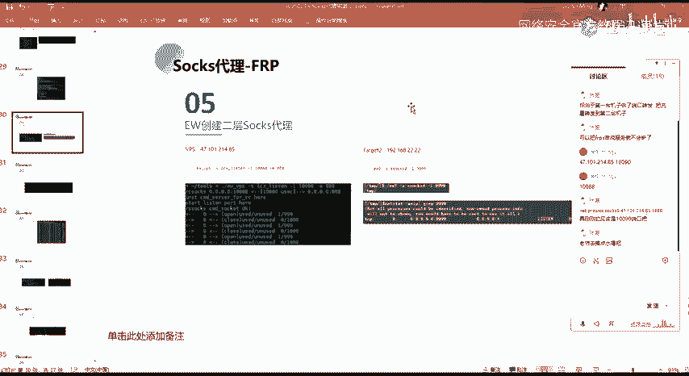

同样的拿我们这边的这一个机器啊。呃。我这边放了，要重新要从头来吧，好吧，要从头来。🤧首先的话在我们的1个VPS上面，对吧？我需要今天这样子一个端口代理端口，以及等待啊我们的一个。呃。

就是我们的一个目标机器来主动的来去迎接我们这边的1个778的一个动作。因为我们是反向嘛，对吧？大家就是其实这边的一个反弹以及反向的这种ss跟我们前面就是正向反向的一个需要。其实它的一个原理。呃。

不是说原点，就是它的这样子的一个。是类似的对吧？就正向的话就是我们主动的去请求去请求啊这边的一个socks的一个服务，对吧？然后反向的话就是说因为我们无法直接去访问到，那么我们就只能够通过反向对吧？

就只能够通过他这边能够来访问到我们。

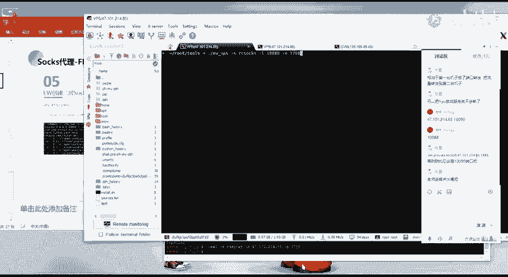

然后的话来去建行一个连接，所以的话这就叫反向了。然后同样的我这边。🤧呃。执行这样子的一个命令对吧？然后的话在t2上面，因为我们其实在这边建立这一个的话，我们就已经能够去访能够去设置代理，对吧？

来去访问这边我拿到的22。2这个机器的一个需啊，也就是这边。

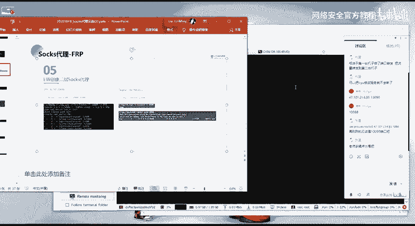

当然的话呃这边的话代理要改一下，是188。应该也算。呃。我这边断掉了。

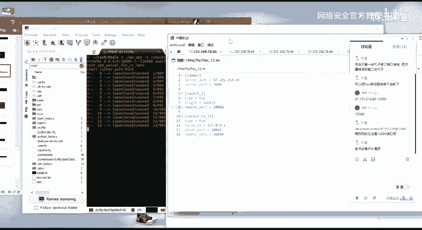

Okay。🤧。

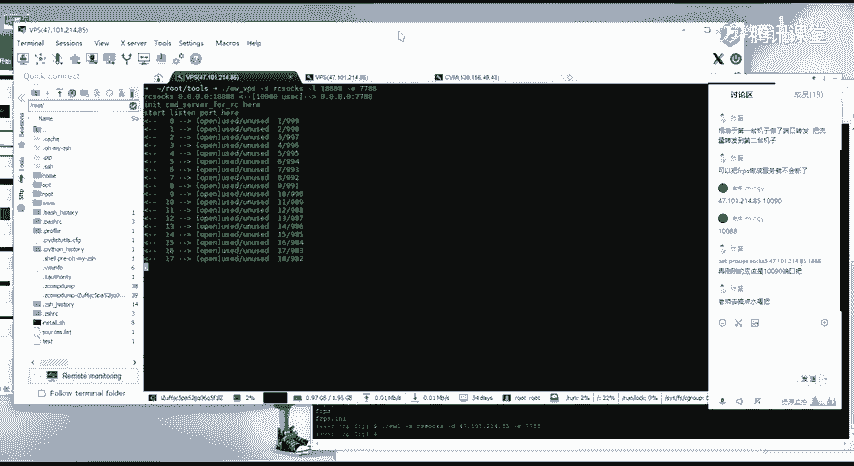

啊，我先咨行这边吧。

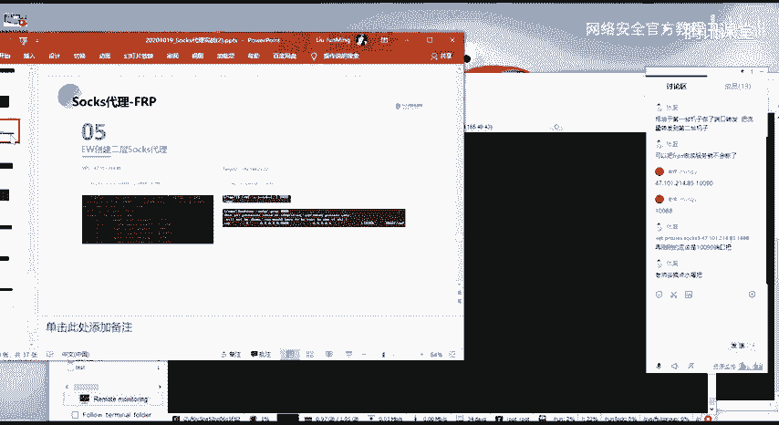

我现在这一个tt一上面。来去与我这边的一个。嗯。嗯。Oh。然后这这的话可以看到呃建立了这样子一个连接，对吧？已经建立了建立连接了。然后我这边的话就能够去。

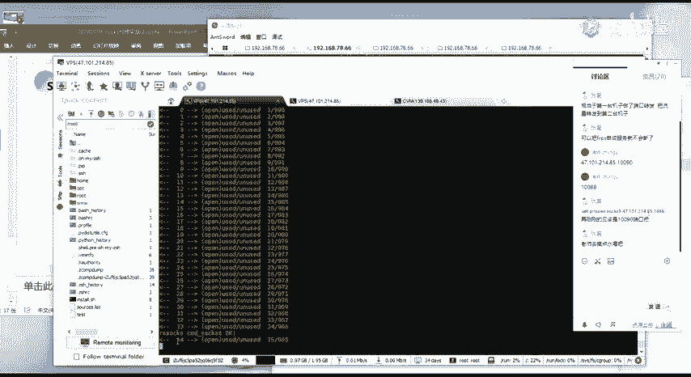

通过这边的一个代理对吧？建立的一个代理呢去访问这边的二这一个网段啊，也就能够得到这边的机器的一个选。然后在这边的话，我们下面要去访问的话是。

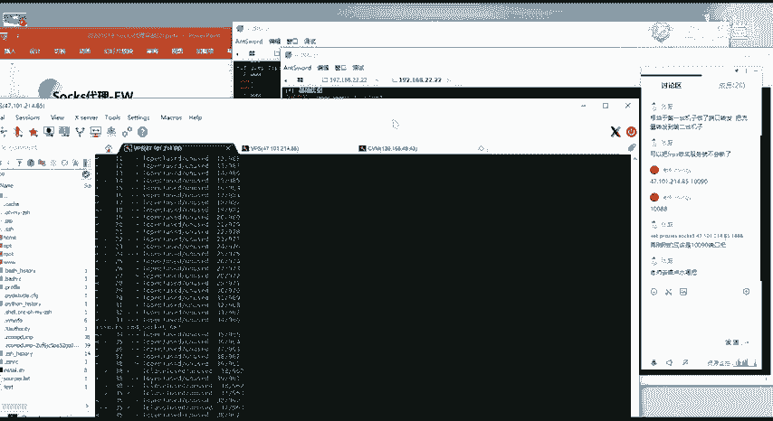

要去把我们的一个流量，把它代理到这边去访问这个33的这个网端。所以的话我们在这边需要去做一个流量的一个转发。

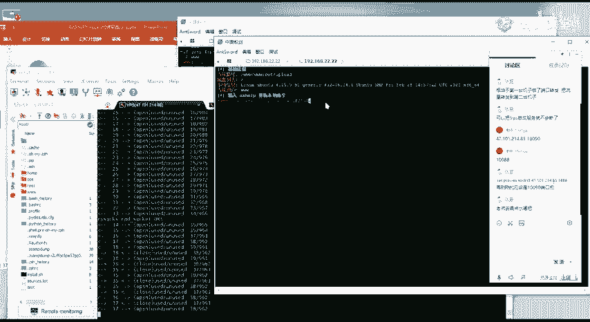

然后在这边的话，其实我这边这一个面的话就已经做了这样子一个流量转发，就是把这边的一个流量转到我这边的这一个呃2。2这个机器的999的1个端口，对吧？那么我在这边的话，我就只需要去等。

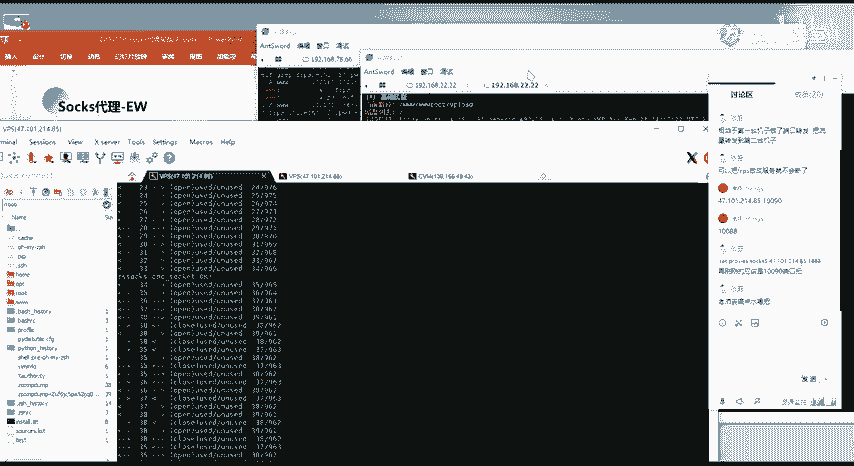

🤧就是他这边我这边流量通过这个连接发送到这边，它就会主动的来就是发送到这边来，对吧？那么我这边的话，我只需要。通过。好拜拜。嗯。没有吗？没写错吧。

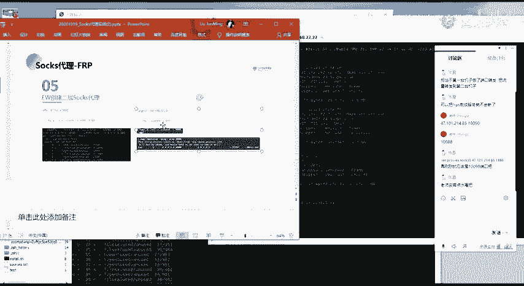

哦，SS。SSOCKSB。T。啊，然后的话只需要去在我这边去监听这样子的1个999的一个端口。美。嗯，这边我之前已经有执行了呀，你看他是EW64啊，我这边的话是用EW1的，我这边把这个卸掉。2尔887。

就这个拼怎么还是拼啊？🤧啊呃。其实在这边呃，正好看到了这个就说一下。就是您你你会发现我这边有这样子的一个命令，对吧？拼这一个，因为在lininux里面的话，你的一个拼的话，如果你不用那个。

P杠C一去指令你去拼多少次的话啊，一般的话一次两次三次就就可以了嘛。是吧？像windows里面的话，默认的话，它是4次，4次之后的话，它就会停止掉。如果你不这样的话，如果你直接拼，拼的话。

它就会它会一直拼了，就是它不会停的。你除非你按拼出C或者把它的一个进程给去掉。然后在这边你进你进里面的话，你去执行的这种命令，它会自动的去把它给放到后台去，就是它会把它放到后台作为一个进程这样子的啊吧？

然后你会发现我前面拼了的话，它其实一直有在拼了，只是在前端它没有显示出来。嗯。所以的话呃在这边因为canl CQ controll C停止不了嘛，对吧？

你就可以通过kill把这个进议程给呃ki掉就可以了。这边的话呃正好碰到了就说一下啊。嗯。😊，好的话好好。😊，等于。好行楚。嗯。😊，然后执行之后的话，呃，我们的一个连接的话，应该就是已经建立成功了。

然后在这边的话，我就呃以这个。你这一个吧，就是做1个IDP的一个远程连接，对吧？然后在这边的话，我的一个service是这个呃我的一个端口的话是。

1888吧。

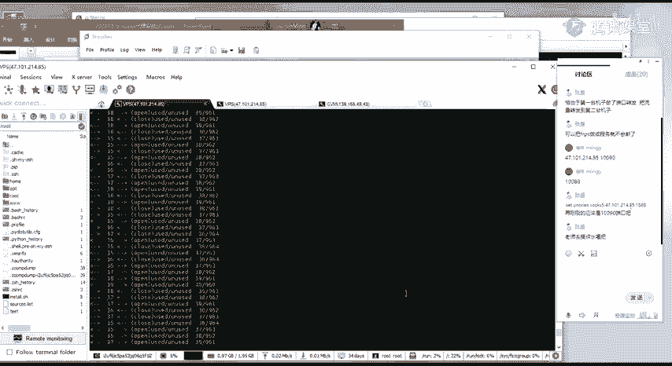

呃，1888。ok嘅。保泉州的话。我在用远程桌面。来去做一个连接。嗯。嗯。你接触错了。连接触错的话呢，检查就是检查你的这边的。是否变强调了，就是。他是否还在好。确楚。嗯。但是。没写错啊。哦。

我这边搞错了。在这边的话呃，是用的LCX的lea的。🤧嗯。就是这个就是返向那里流量转发。呃，按你说这个阿西瘦型应该可以啊。

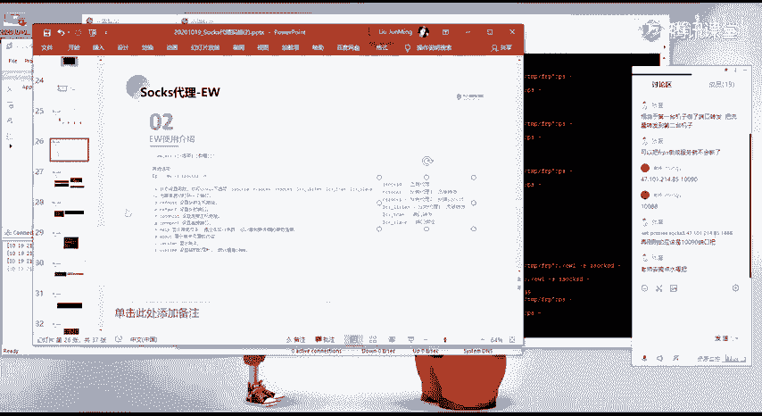

不行啊。😔，我这边也是里面。Okay。我这边重新来呃。花花几久。嗯。

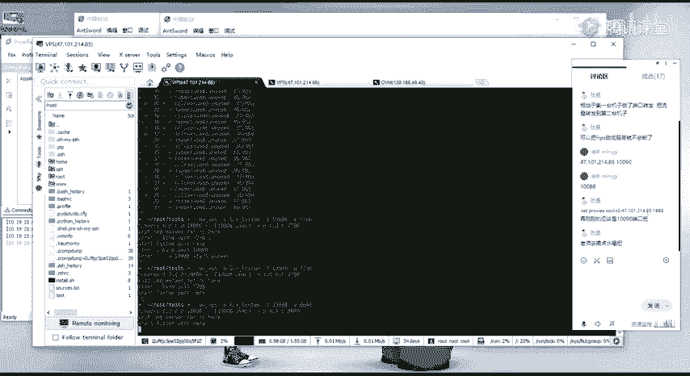

。Yeah。好。快。

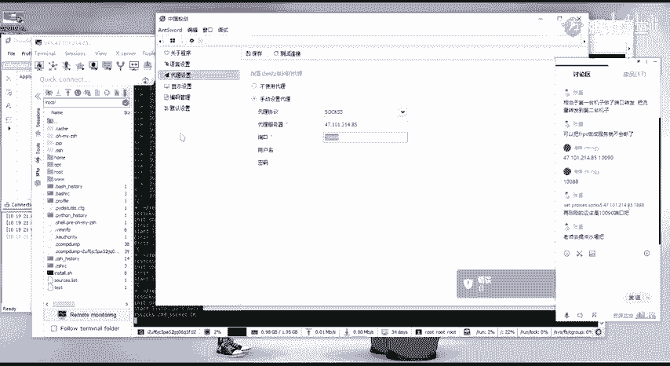

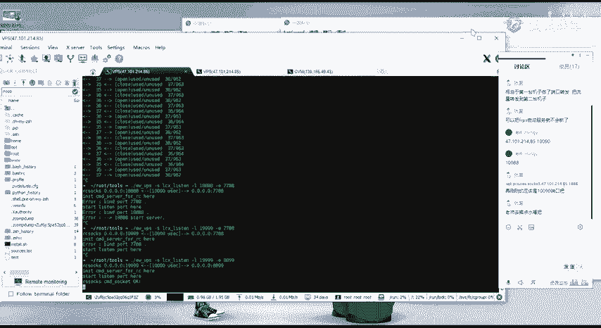

给你大理端口的话是改了2099。呃，就是大家在碰到这种问题的时候，就是其实你细心一下，你细心细心一点检查一下这种。那我我平常我平常有时候也是就是你这边改了之后，然后你这边下一步又又忘了。

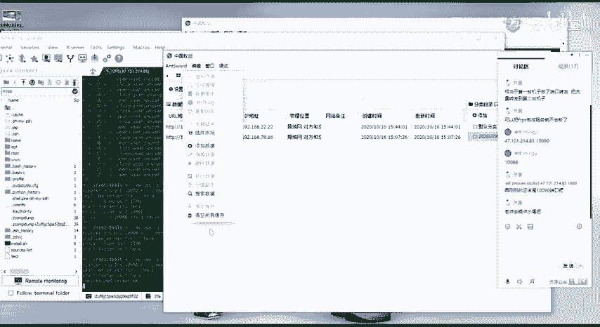

啊，像这种问题的话，一般的话你细心去检查一下，你从头。从头就是找一下这种哪里就是改了是吧，或者哪里配置，你哪里单词写错了，对吧？像这种东西的话都是很好解决。一般的话思路对了的话是。其他这种操作是都是。

就没有什么问题了啊。嗯。这边的话前面那个没Q掉，就是。🤧所以的话呃他会有这样子的一个过错，就是冲突嘛。因为你那个端口被占用。所你需要先把前面的这个给削掉。

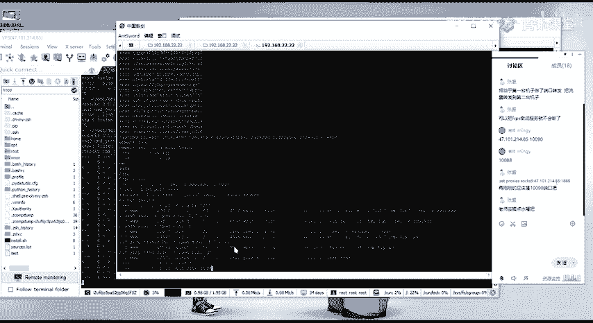

好的话再去。快去执询。🤧嗯。啊，现在执行完之后的话，我们再来连接。But。啊，这边代理服务器又没改啊。嗯。😊，就呃碰到这种问题，其实你就是学会看报错，是真的，就是你。你就其实我看大家就是问的那种问题啊。

就是你截图的时候截的那种问题，其实那个你解决的那种办法都已经写在报错里面了。对吧其实你很快就能够去找到原因。因为你像这种东西，你来问我的话，因为我不知道你整体的这个配置，对吧？

我不知道你整体你是怎么去配置的。所以其实。很多时候。我也可能会说不上来。🤧嗯。嗯，怎么这么慢呢？

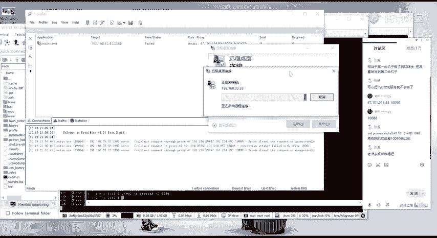

こ子。

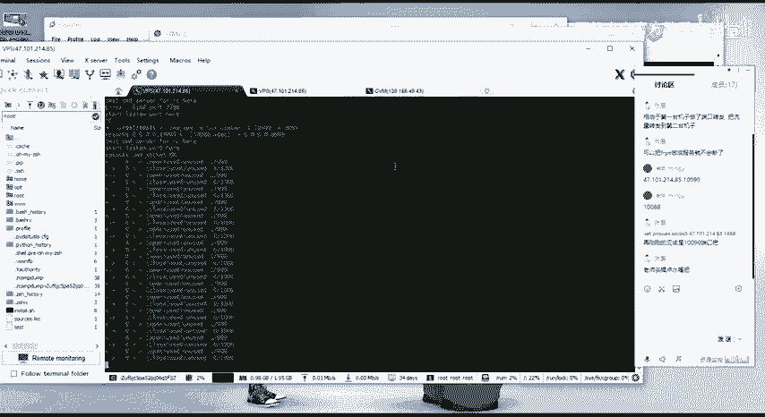

🤧。看一下。没错呀。

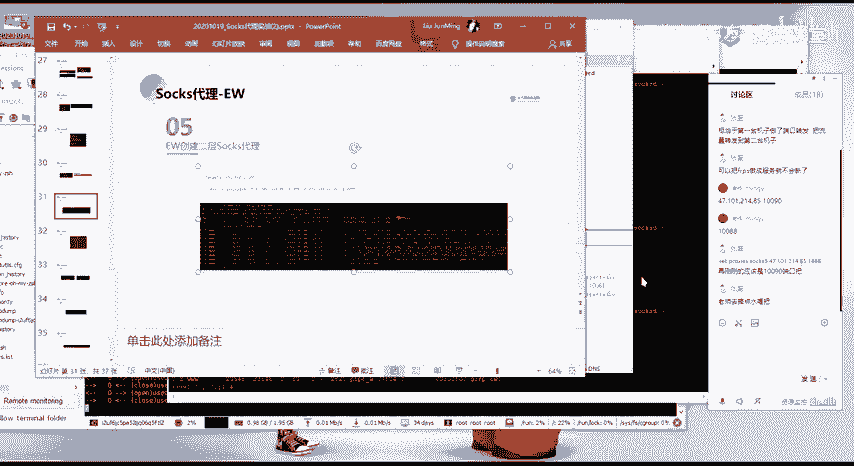

啊。这理错了。我的我的。不行。Yeah。我在在在在。😊，来一啲嘛。这边的话因为我这边断掉了，所以他那边反应不到了。是正常的。我这边写错了，照着我P大家照着我PPT上的来吧。我这边写错了。🤧可以看到。

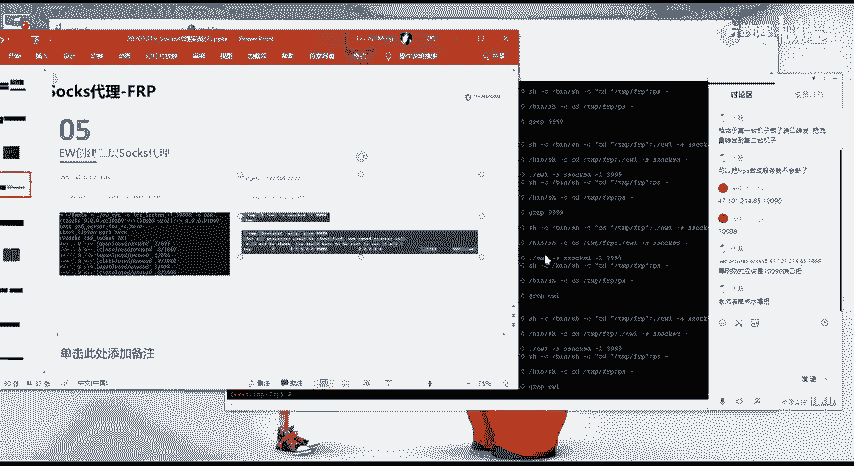

先怎吵呀。可以了。好。

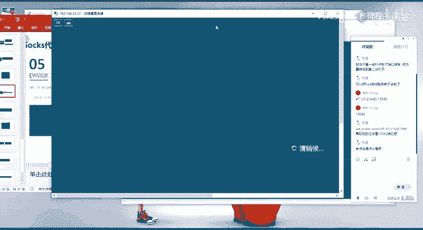

呃，大家大家弄的时候也细心一点，我这边话粗现了，就是写错了。大家大家照着我的PPT来吧，好吧。

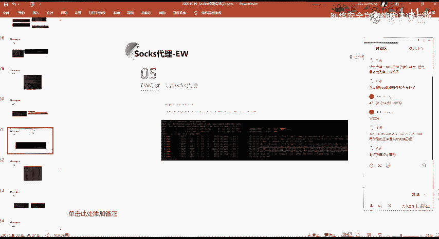

啊耽误了大家一点时间。然，呃在这边的话，我们建立成功之的话，实际的效果就像这样子啊，对吧？我这边的话我就可以呃可以呃直接远程的登录这边的呃这1个33。33的这个机器，对吧？

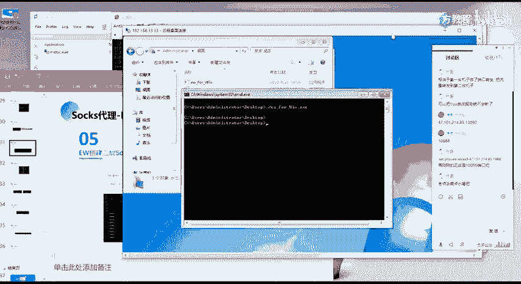

然后这边话就是二层的一个锁词代点。然后呃还有的话其实也可以去做这样子的一个三层的一个锁词代表。这边的话呃这边的话大家自己。课后去尝试吧，我这边的话就不说了。然后因为它的一个操作以及原理的话都是一样的。

我这边的话已经也写的很详细了啊。然后这边的话主要的话就是介绍一下他的一个就是这边这边它的一个流量。就是你知道了它的一个流量走向的话，然后你知道大概他的这一些选项怎么去用的话。

你就呃能够理解这样子的一个命令。我这里的话，商层的一个说词代点的话，因为我们其实前面对吧？我们通过MSF。对吧呃，通过17020能够去拿到这边tt3的一个血。我们拿到他这个需要之后的话。

如果他还有还有还有另外的一层之网了，对吧？就是有三层对吧？他是呃应该是四层了是吧？就是。233对吧？呃，三层吧，三层直网嘛。那么我们这边拿下拿下这一个windows这个机器的一个选之后，对吧？

如果它还有一个内网的。内内网的一个网段了对吧？那我们同样的还是去做这样子的一个代理嘛，对吧？只是的话它中间的话就是要去多做这样子的一个流量的一个转发。其实说到理，归根结底的话就是流量的一个转法。

🤧你只要能够去把流量通过中间，我们这边通过能够去建立这样子的一个连接，然后的话做这样子的一个流量转化，就能够去实现这样子的一个内网的就多层网络的这样子的一个穿透。

但的话你前提是你要能够去一个一个的去能够去得到这样子的一个谢。然后命令这边的话，我们看最后这一张PPT啊。就是呃这边的话就是它的一个流量的一个走向的话，其实就是从我这边s5V5。

就是我的这边的一个ss的一个代理嘛，对吧？然后我把我的一个请求，就是通过这边的一个端口，然后的话传到了这边的这一个呃通道，对吧？与这边VPS经立的一个通道，传到这边之后的话。

它会通过这边的一个内做一个端口的一个。呃，转发端口流量的一个转发，把它给转到这边的2。2的这个7778的这个端口，对吧？然后在这边7778这一个端口的话，他还要做这样子的一个转发。

因为我们最后要去就是我们前面的其实他给的一他给2我们都已经得到了，对吧？我们最后他给的三也能也得到他一个小。但是如果他还有一层，比如说44。44的这样子的一个主机，对吧？

那么我们最后其实就是要去探测这1个44。44的这个主机，那么我们这一个流量，我们就需要在他给2上面，同样的还要做一个转发，转到ta给的3上面，对吧？然后在这边的话，ta3的话，呃。

我们就使用这个windows的下面的1个EX，因为它是windows的主机嘛，是吧？🤧然后然后的话在通在这边去建立一个连接，连接这边连接这边的一个那个其实这边的话跟我们FIRP也是类似的嘛，对吧？

我们中间两个主机之间要去进行这样子的一个呃流量的一个转发的话，你需要有这样子的一个通道啊，就其实就是这边所建立的一个连接的一个通道。因为你只有建行连接之后，你才能去有这样子的一个数据的一个传递嘛，是吧？

然后在这边的话，我们就带你到了这边33这个主题上面了。嗯。呃，这边tag3的话就是33。33。如果他还有这一个44的话，那么我们在这边的话，我们就通过这边的这里的一个代理通道。

我们就能够去探测这边44的这一个主机。因为我们现在的话已经探测到呃，已经把我们的一个搜索代理通道已经呃代理到了这边tt3，对吧？那么这边t3的话，它是能够去访问这边44的这个网段的。

所以的话我们通过这边的一个代理通道，我们就能够去向这个44。44这个主机发送我们的一个请求。以及最后的一个数据的一个流向的话就是像这样子。呃，这个的话应该很好理解吧，是吧？呃。

以上的话就是我们本节课的所有内容，大家应该啊大家有有没有什么问题？

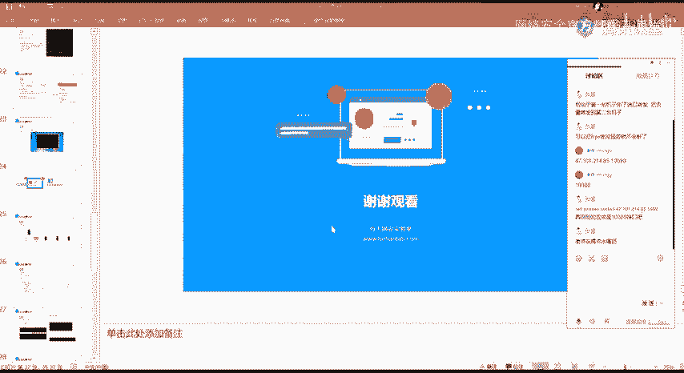

有疑问吗？以及能理解吗？没有事没有疑问是吧？啊，没有疑问的给我呃送朵花吧，好吧。然后的话就我们本期课练的话就到这边了。🤧，如果呃其他同学还有疑问的话，大家呃自己就是在课后认真的去看一下我这边的一个录播。

好吧，我在录播上面的话应该是讲的很详细了，对吧？就包括命令，以及呃你的这样子的一个数据的一个请求流量的一个走向，对吧？以及我为什么要通过这样子去经历这样子的一个连接，对吧？去做这样子的一个流量转发啊。

呃，只有这种其他同学呢。就这就这另位5位同学吗？嗯。呃，其他同学如果还有疑问的话，呃，在群里问或者是私下问吧，好吧。就其实其实呃你可以去多多去问一下，就是这些他们没有问题的这些同学嘛。

就是大家其实互相交流就可以，就就挺好的。就其特意把大家就是放到一个群里的话，其实就是让大家能够去多交流嘛，是吧？因为其实你要是就是毕竟我只有一个人嘛，是吧？我不可能就是所有的问题都能够照顾到。

或者是说照顾到所有人啊，就其实大家互相交流的话，你可能呃感觉还会更好一些，好吧，没有其他问题。那么呃也不多说了。好吧，我们下课，大家早点休息。

