# B站最全网络安全教程，整整1300集，全程干货无废话，别再盲目自学了，看完学不会我退出网安圈！（web安全｜渗透测试｜内网渗透｜CTF） - P89：88. 第三十八天：reGeorg.mp4 - 网络安全官方教程 - BV15u4y137cQ

🎼I looking back at you。 I don't hate you。 I just hit the super man。2 do and not5 did up forever。

🎼P when easy sleep in a money into your game。 want you effective thing your business。

 You don't love me。 You just love one other people say。 Oh my God， Thank you together get。🎼这天说。🎼。

🎼No one who I could have been was good enough for you。🎼You see I few but you don't believe eat it。

 You see I few body don't mean to。I tried to give you the both。

 but you wanted Mars too You wanted Mar。🎼You are my。🎼，🎼It's been so long。う。

🎼That I haven't seen your face。 I'm trying to be strong。🎼What the stress。🎼As我是 away。🎼也我冰冷。

🎼Before I get you by my side。🎼It just hold you， tea you， squeeze you tell you what's been on my mind。

 I want to make up。🎼N， I want to make up right Na Na， Na， wish we never broke up right Na na， na。

 we need to leg up right Na， na。🎼我的每个。🎼而我的每个。🎼W we never broken。🎼We need to let。🎼なら？🎼可兰我。

🎼Mistakes were made between us， too。🎼And we show our eyes that night even said something things that were true。

🎼我 you go。🎼I haven't seen my girl since said， why can't it be the way you was。

 You were my holy lover friend。 I want to make。🎼I want to make a。🎼wish we never broke up， right。

🎼leg up right。🎼而我。🎼Wish we never broke。🎼We need to let。🎼なら？🎼W you the fly。🎼I miss how you love me。

🎼Just wish you could down with me。🎼No one never管 with me。🎼怪我。🎼母さ？🎼Did you right now。🎼那那。🎼不。🎼开子。

🎼Oh我的每个。🎼Wish we never broke up， right now。🎼미 the leg up。🎼梦像是笑着。🎼什么。🎼不如。🎼比如。🎼的是。🎼我们曾许下。🎼也许。🎼也快。🎼一船。

🎼泪是想过太。🎼我在你眼里看清了相恋的面。😊，🎼此刻。🎼在。🎼于是你不。🎼平时过我。🎼送白天。🎼爱彼此是要。🎼你在前方。🎼我一回头，我们就错。😊，🎼很久以前，人们都是。😊，🎼要是谁。🎼一途。

🎼我们像声笑着。🎼只能。🎼不说。🎼如。🎼的是。🎼我们想取笑。🎼是能。🎼琴上放着光彩贵的玻璃窗，装饰时刻的事教堂CCCC弹一段一段流浪忧伤着进城方向，看见晚衣服1把季都又上你的浪漫是否久都。🎼阿数啊数耶。

😊，🎼他是说。🎼要要。🎼あよ。🎼都有。🎼我な。🎼Oh我。🎼。🎼我就站在。😊，🎼还是。🎼距太长了。🎼全白个。🎼在这。🎼不需要。🎼着。🎼没。🎼习光。🎼，🎼あれ。🎼，🎼Yeah。Okay。

🎼拖着光彩鬼的玻璃窗，做死时刻的事找跟CCCC看一段一段流浪。😊，🎼蔷我衣服是8岁。🎼在看，曾经心手在想，你的浪漫在看，想活多久都一样。😊，🎼阿阿数阿阿的数 yeah。😊，🎼这是伤我。🎼要就爱。

🎼know醒我用抱歉大头。😊，🎼是算了，放起来后悔。😊，🎼就转在。🎼去抛向了。🎼那全白鸽。🎼在这。🎼需要。🎼原看我不。Yeah。hello，大家晚上好。能听到我声音以及呃画面声音没有杂音的话。

在讨论区扣个一。🤧嗯。应该是都没有问题啊。啊，没有问题啊。那么我们正式开始我们今天的一个课程内容啊。我们今天的话主要给大家介绍这个HTTP还有DS以及ISMP的代理的一个实战。呃。

PPP的话我已经发在群里了。然后大家可以先看一下PPT以及那个呃其实课上要讲的一些东西的话，我都在预习内容这一个文档里面都给了。像呃这边的话。🤧。是我自己的自己记的这样子的一些东西啊，就是。

写一些笔记吧，挺早之前写的。然后还有其他的那几个都都有。好呃，我们本期的话主要的话就是呃针对这三块内容给大家做一个讲解。第一块的话就是呃1个HTP的一个代理。就是说HTP的一个隧道。

就是这个IEGORG的这样子的一个工具。我们通过它的这个工具来去理解。或者说来去了解HTP的这样子的一个代理隧道的一个搭建。第二个的话就是这个DNS啊。

这个的话是呃就是TCP overDNS也就是我们的我们是通过呃把我们的一个TCP的一个人量，通过DNS的这样子的一个协议把它给传传输出去。也就是我们呃通过DNS的这样子的一个呃。

DS的这样子的一个数据的一个传输来去啊建立这样子的一个TCP的这样子的一个通道来去进行一个命令的一个控制。第三个的话就是这个拼turn呃，是一个就基于我们的一个片也。

就是我们的一个SMP协议的这样子的一个代理的一个工具。在这边的话主要是针对这上岸工具的一个讲解具体的一个使用。然后的话呃来去分别的去了解HTPDS以及呃SMP的这样子的一个代理隧道的一个搭建。呃，呃。

第一个的话就是这个REGORG这个IEGRG的话呃。它是这个IE6的一个升级嘛。然后大家可以去了解一下这个IED这个这一个的话是比较老的这样子的一个就是呃代理HTP的啊，就是1个HTP隧道的一个工具啊。

然后的话这个的话是它的一个升级吧。然后还有就是在后面这边的一个nuralREGO的话，它是对前面的这一个的一个重构。也就是对有一个就是就是增强嘛加强嘛。然后这1个IEGO的话。

它主要的功能是把我们的一个内网服务的端口的数据，通过我们的个HTP还有HT的这样子的一个隧道，然后转化到本机来去实现基于HP通信HTP协议的一个通信。然后我们在这边的话就是说我们的这个IEG的话。

我们可以进去这样子的一个HP的一个隧道。然后的话我们在这边可以看到就是它会在本地去监听，我们可以去呃开启一个s的一个代理。然后的话把呃来自这样子的一个HTP的这一个隧道的一个数据。

然后通过我们这边的一个代理端口。然后的话走这样子的一个代理的一个HP的一个隧道，然后把它代理到呃目标机上面去。然后在这边的话我们呃大概了解一下它的一个一些参数的一个使用吧。

然后我这边的这边的话已经详细的列出来了。主要的话就用这像赣L的话。就是呃指定我们默认的今天的一个地址。杠P的话就是指定我们今天的一个端口。就是我们再去使用这样子的一个脚本的时候。

它会呃就是说它会有一个代理的一个就是双指代理的一个今天的一个地址以及端口，我们可以通过这样子的参数来去设置。然后杠U的话就是包含隧道的一个脚本的一个UL。也就是呃像这样子的一个呃UL。好，呃。

我们来看一下。嗯。这个工具它长什么样就是这样子，就这个IGIG它就就这这一些文件。然后主要的话它的一个服务端的话就是这个。然后我们通过这样子的一个pathon脚本来去创建的一个s的一个代理通道。

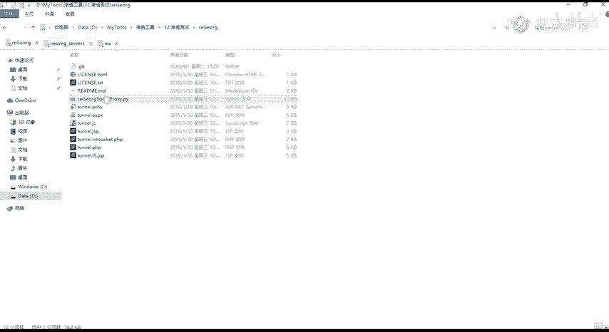

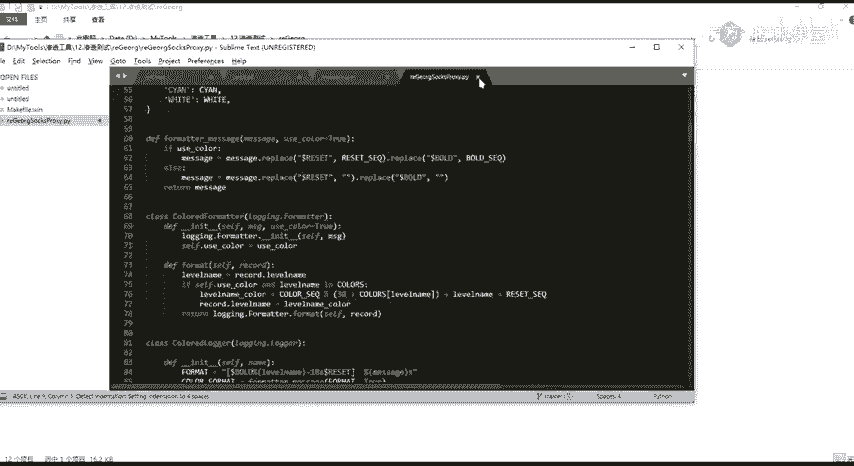

然，呃在这边的话，它有提供这样子的一些脚本，像呃JSPIPHP啊，还有呃SISPXSISHX对吧？等等这些它是针对在不同的这样子的一个呃脚本的一个解释环境下面来去进行一个使用的。然后的话呃像在这边的话。

我们具体的一个使用的话，我们以这边的这个站点为例。就是呃我这边的这一个就这一个。呃，我这边的1个IP的话是这个，其实呃就我这边使用的一个把靶机的话。

就是这边就是呃前面在讲域的时候给大家讲介绍的这一个就是让大家去安装的这样子一个靶伞。就这就这个这个嘛，这个的话它是呃有一个word的一个服务，也就是这个。

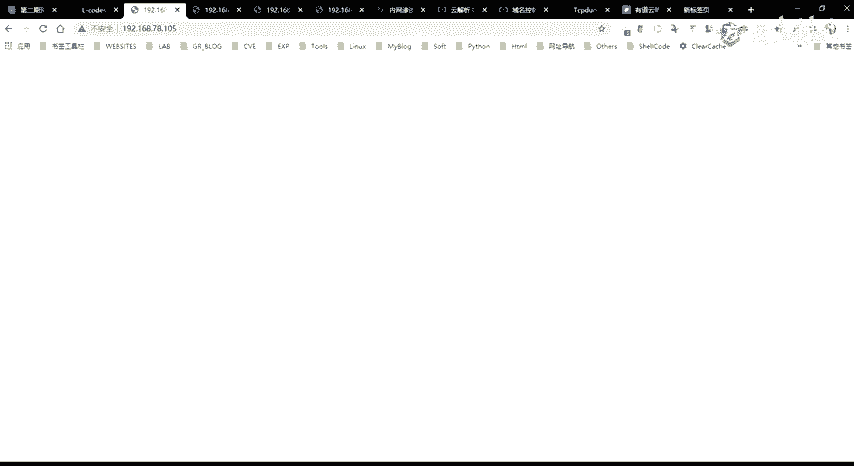

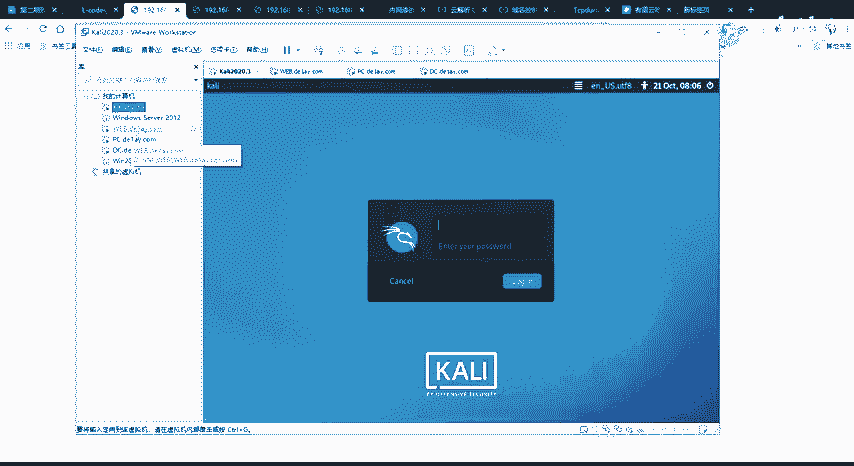

啊，这一个raber logic这个服。然后大家可以打开一下，打开之后的话，你就能够去进行一个访问嘛。而且实际的话就是给这样子的1个IP嘛，对吧？就是一个这1个IP给你。然后给这个IP的话。

我们就同样的就是思路的话，就是做信息收集嘛，对吧？信息收集扫端口，对吧？扫扫服务。然后在这里话我就省略了前面的那些moder，对吧？我这边的话扫出来有这样子的一个呃这样子的一个7001的一个端口，对吧？

然后我们访问这个7001端口的话，发现是这样子的一个东西。

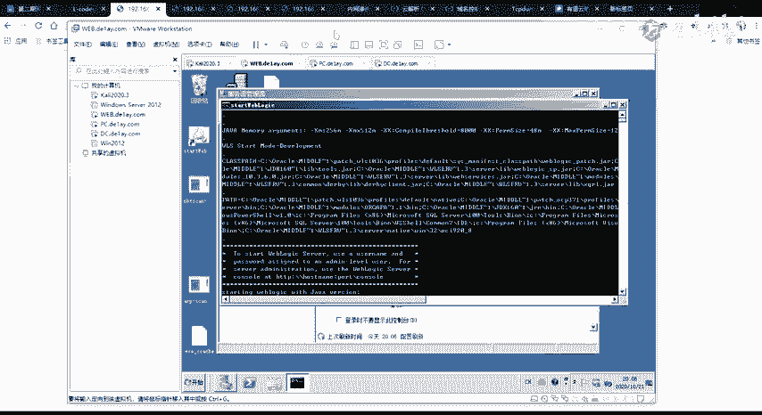

这样子的一个页面，对吧？然后大家看到这样子的一个页面的话，其实能够有大概的了解。就是你对于weblog的这样子的一个应用有相应的一个了解的话，你看到这个的话，你能够有一个基本的一个判断。

如果你还判断不了的话，对吧？你可以在后面加一个空手。然后加一个空锁的话，它会去d，也就是部署我们的这样子的一个应用程序。这一个应用程序话就是这一个控制台。然后我们呃加这样子的一个空锁的一个目的话。

它会自动的去部署。部署好之后的话，我们就能够去访问到这样子的一个页面，对吧？看到这个页面的上，我们就能够知道它是一个呃weblog的一个serv，对吧？以及在这边的话有它相应的一个版本。这个版本的话。

我们在后面会去用的。🤧嗯。呃，这边的话。我们知道了就是说它是一个we logic，那么我们怎么怎么去进行一个利用呢？对吧？呃，关于weblog的话，前面在讲就是就是突破口的时候，对吧？有给大家讲。

就是web logic相应的爆出来的一个漏洞。它爆出来的漏洞的话是比较多的。哦呃，针对这样子的web logic的一些历史漏洞的话，我们可以通过相应的一个脚本，对吧？也就是。啊。我们可以通过这个。

log scan这样子的一个工具，对吧？来去对它做一个扫描，对吧？这个工具的一个使用的话，前面应该也介绍了，对吧？呃。系。这边。啊呃，实际的一个效果的话就是像这样子，就是。

就我我通过这样子的一个welog的这样子的一个扫描工具来去对它做一个历史漏洞的一个扫描，对吧？来去判断它当前的这个we logic服务它是否有这样子的一一个那个呃漏洞，对吧？好，这边的话有扫出来。

有这样子的一些这样子的呃两个对吧？然后我们在这边的话使用的话是这一个。2019的2725。然后关于这个2725的1个利用脚本的话，我们呃我这边的话推荐大家使用这一个吧。就是这个。呃，就是这个。

然后关于这个脚本的话，它是能够去直接的去就是执行命令。然后的话呃能够去。就是通过这个脚本来直接去执行命令，然后的话能够在这边返回结果以及能够去写笑。就是我们主要的话就是这两个功能嘛，是吧？

就主要去用的话。2是呃执行面的话就是判断我们这边对吧？判断他的这样子的一个就是他的这个服务，它是不是确定存在这样子的一个漏洞，对吧？如果我们通过这样子的一个脚本，然后执行命令能返回结果。

那么我们就能够去确定它是存在这样子的漏洞的。那么我们确定之后的话，我们就可以去写入一个C。写入CL之后的话，我们就能够去执行命令，对吧？好，我在这边的话。嗯。

这边的话呃这一个脚本的一个使用的话，我大概演示一下吧。然后呃它的一个使用的话就是命令之前要上传web share。然后上传呃，首先的话我们先执行命令，然后它的这边的话，它需它是能够对这样子指的两个版本。

也就是它就存在这一个漏洞的呃we logic的版本的话，有这样子的两个，然后它都可以去支持去进行这样子的一个操作。然后我们可以指定这里。

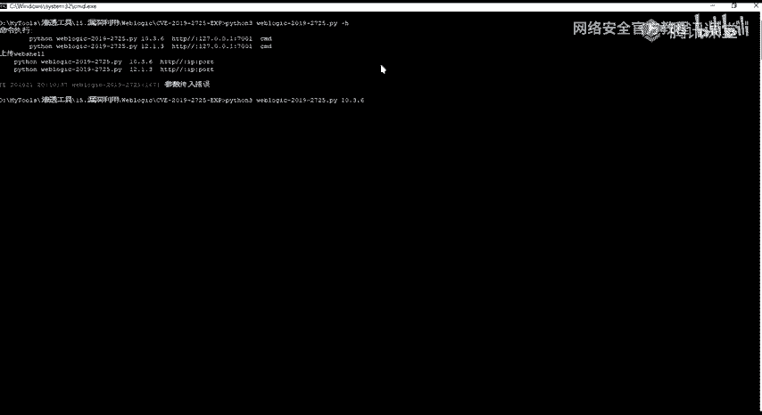

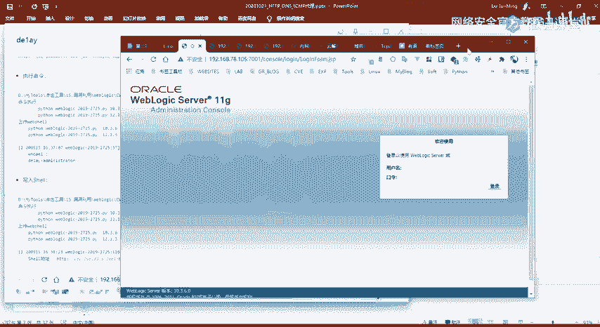

对你的那个。就是IP地址加这样子的一个端口即可。然后后面的话我们不需要加起了，然后在后面接我们的一个命令。可以看到我这边的话执行之后的话，它就返回了一个结果，对吧？

也就是这边的一个呃我们这边的一个外卖执行的一个命令的一个结果。好啊。所这里的话这里的一部分前面有讲了。呃，我看前面讲这个log机的话，应该是没有用这个脚本嘛，是吧？呃。

我个人的话是觉得这个脚本是比较好用的，因为还就还有挺多的这样子的一些脚本。

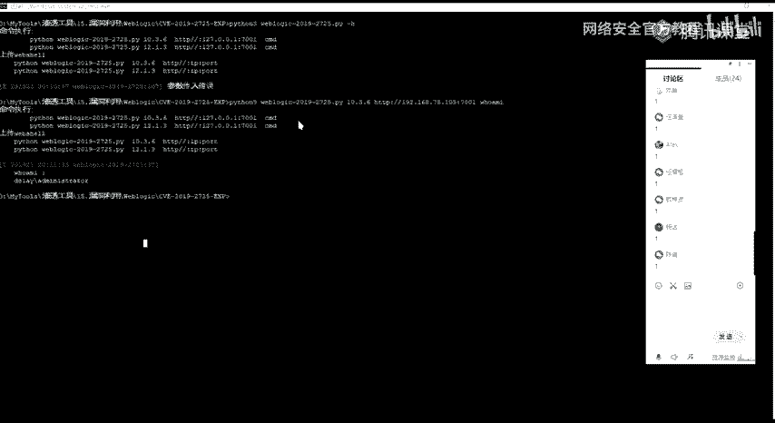

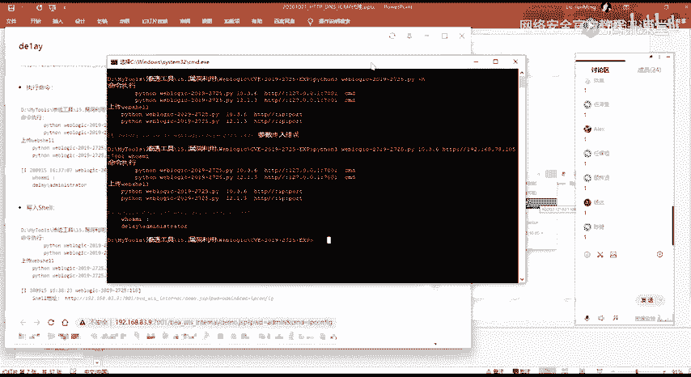

然后我们这边的话，我们既然能够去呃。能够去执行命令，能够去利用这样子的一个漏洞的话，那么我们接下来的话就可以去做这样子的一个写shall，对吧？然后我这边的话已经写进去了。

写进去的shall的话就是像这样子的。

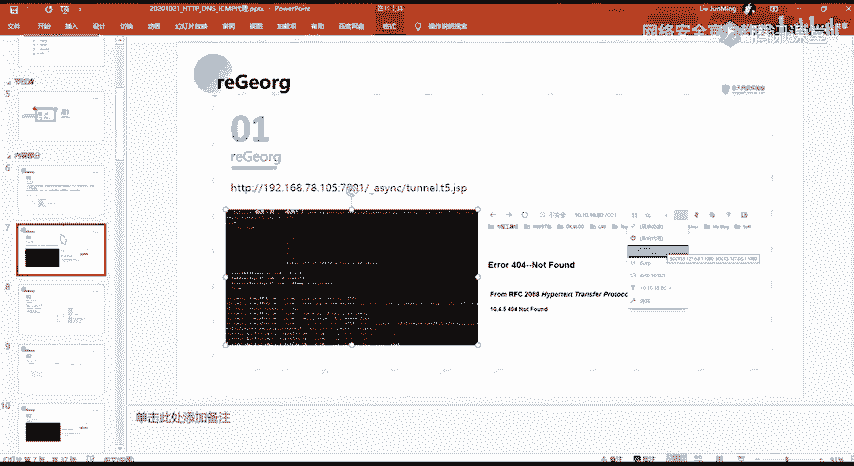

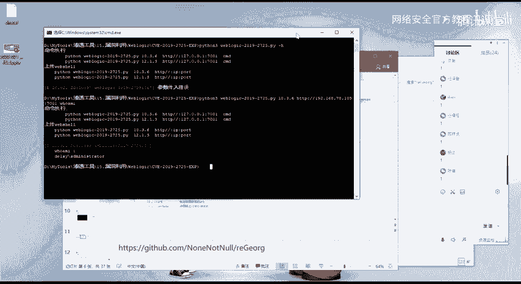

呃。

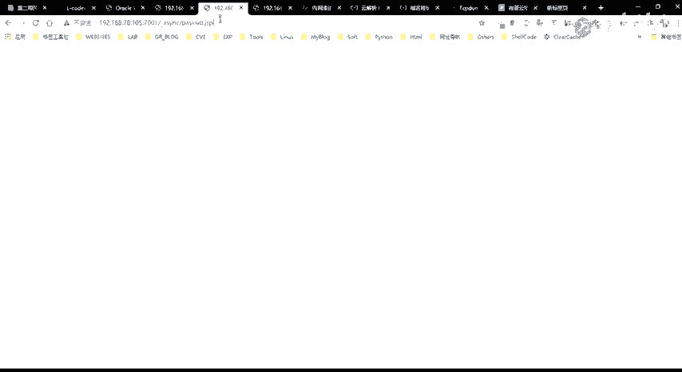

唔紧。Yeah。

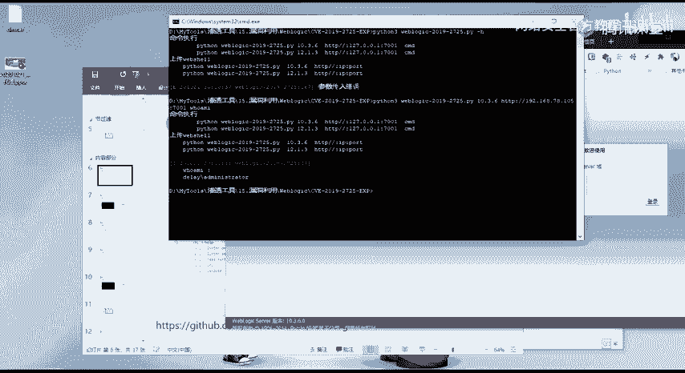

嗯。呃，就是像这样子啊，就呃我们其实也可以通过就直接通过他他的这边去进行一个写入。然后写写写的话，就是你把后面的1个CMD命令去掉。就你不加的话，他就会去写一个写ll写了一个写ll的一个地址。

话就是像这样子的一个地址。他会去呃上传一个这样子的一个demo点GSP的这样子的一个文件，他会写一个这样子的1个GSP的一个码。然，我们这句话就能够去执行命令。我这的话这些IP空的，对吧关了啊。

我们就能够去进行一个命令的一个执行。那么我们这边执行命令之后的话，呃，在这边的话，我们知道它是一个windows的一个机器啊，对吧？然后windows的一个机器的话，我们能够执行命令的话。

我就想着要去访他西尔嘛，对吧？然后反弹需要的话，我这边的话呃通过。

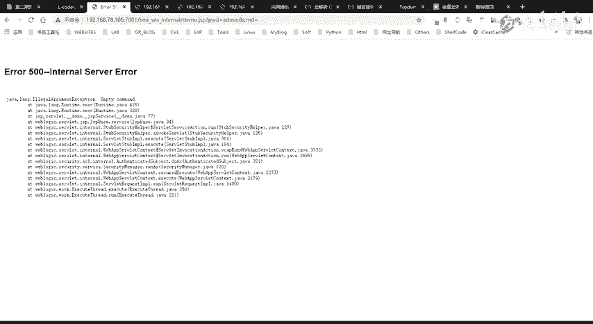

反弹到实验室上面去吧。

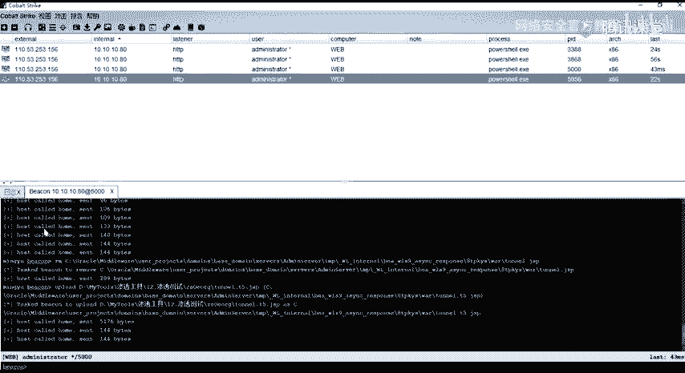

反它到CS上面的话，我这边的话是通过这样子的一个方法，就是通过前面有给大家讲的这一个，对吧？呃，直接用MSH呃TA。嗯。也就是这样子，我们直接就在CS上面去生成一个这样子的一个呃文件。

就是一个那个HTA的这样子的一个脚本文件。然后我们可以通过MSHTA对吧？MSHTA的话是window下面它自带的这样子一个文件，它能够去远程的去加载我们这边的一个HTA的一个脚本。

然后的话我们通过这样子一个命令。因为他在这边的话能够去执行命令，对吧？它执行命令的话，他把我们这边的一个脚本去做一个执行，也就会去进行一个啊解释。解释执行之后的话，我们这边的话就能够去得到一个需要。而。

其这边的话都是我这边得到的。就是这一个。

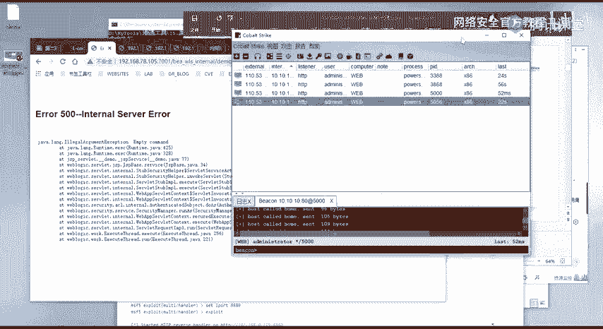

这这这个机器的。然后具体的一个效果我们可以来看一下。

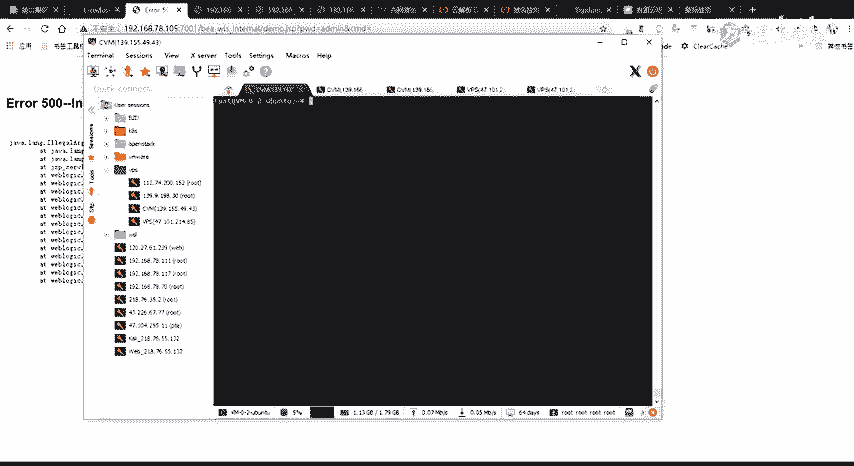

嗯。在脚本上你去找呃，有啊，有应用漏同的脚本呢，你ge到app上面去找嘛。肯定有的。然后还有就是呃其实这方面也会给大家介绍，就是就像微log的话，你可以用他们现成的这种脚本嘛。然后还有的话就是。呃。

有这样子的一个就是。带回形的E叉P，我们可以用这样子的带回形的EXP用DP啊，用B通过BP发发包的一个方式来去进行一个命令的一个执行。像在这边的话，就是我们可以在这边对吧？

我们可以把我们的一个呃通过这样子一个命令，把我们本地的这样子的一个呃GSP的一个文件。然后当然它在这边它是呃我这边它是通过s服务啊，来把我这边的这样子的一个需要，把它给就是。

copy到了这边的一个目录下面。这个目录的话就是这个vi logic的一个这个服务啊，它它会有这样子的一个目录，就是这边的这一个目录。然后我们去去那个去进行一个写写写需尔写文件的时候。

你可能你就是在执行的时候，它其实是在这个base at面目录下面吧？然后的话你实际要去写的一个写目录的话，是在这一个目录下面。就是他的一个呃绝对路径的话是这一个。

注以然后的话我们把它写到这个路录下面的话，我们就能够去得到一个选。当然我这边的话是写的一个BC的一个呃JSP的一个嘛，啊吧？然后的话我同样的能够去得到一个选。

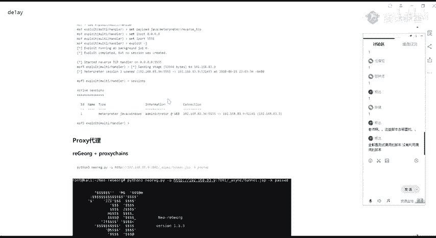

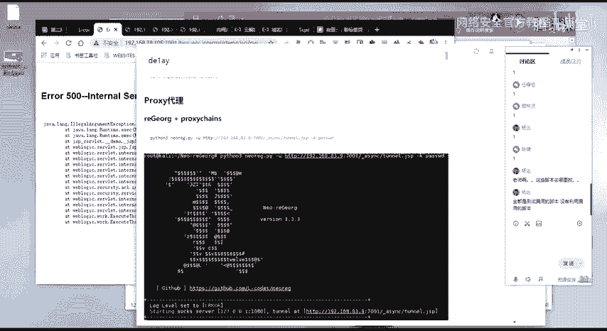

Yeah。呃。在这边的话，我通过CS我这边我再给大家演示一下。

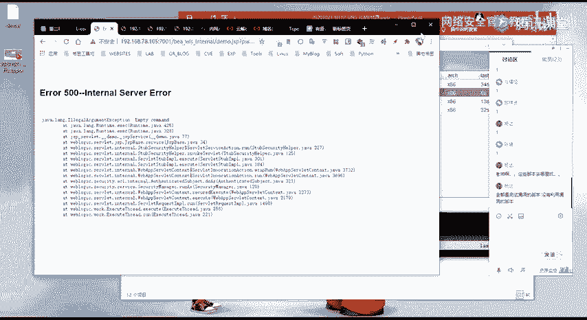

就是呃这个。

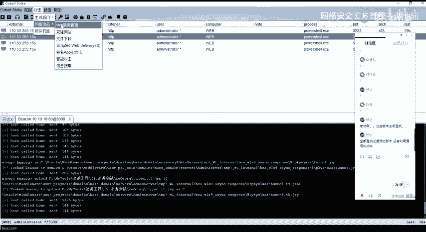

然后我们可以在这边通过MS接。还去执行。执行照的话可以看到刚刚是4个，对吧？然后立马又来了一个，就是这一个是吧？啊，这个的话。应该应该就是这个吧然这一个。是吧。我们可以呃就直接的就得到写。

我这边的话就以我之前我已经尝试过的这个，我这边话已经有相应的一个步骤，对吧？我进进入这个backken之后，对吧？进入backken之后的话，我可以去执行命令。

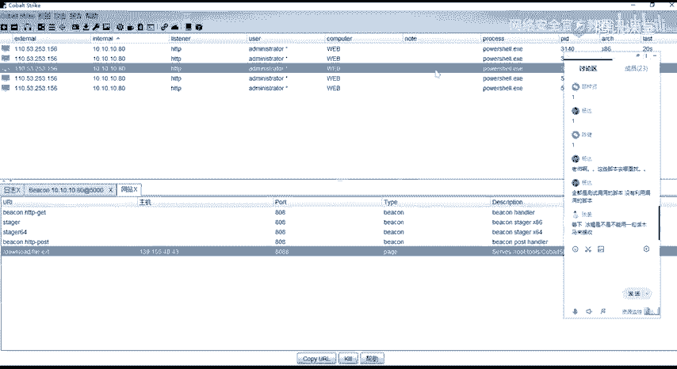

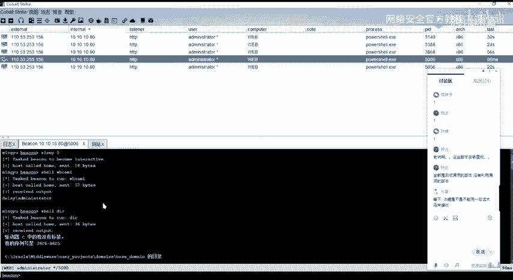

也就是得到了这边的这一个机器的一个需对吧？然后我们这边得到需尔之后的话，我们返常需有之后的话，我们想要去做这样子的一个代理，也就是把我们的在外外外网的这样子的一个流量或者一些工具的一个请求，对吧？

我们想要去利用这样子的呃自己的一些工具啊去做做自己想要的一个事情的话，我们需要去做这样子的一个代理，对吧？就其实就是又又回到了前面的这样子的一个经历这样子的一个代理通道。然后这边的话建立代理通道的话。

我们通过这边的呃HTP的一个隧道。因为我们这边的话是得到的是一个这样子的一个web服务器，对吧？这个web服务器的话，我们得到了它的一个需。然后我们在这边的话。我们在这边的话可以通过这个IG这个脚本。

然后我们通过我这边得到这个需，我把它上传上去，对吧？嗯。O可通过文件管理，把它给上传到这边的。把它给上传到这边的这一个录下面。然后的话我们再去访问的时候的话，就是通过这样子的一个方法。啊。

我这边的话已经上传上去了，我这边的话去访问的话，就是通过这样子的一个方法，只需要在这样子1个IP后面加这样子的干AYNC，它就会去找到这样子的一个文件。然后这边的这一个文件的话。

其实因为它它它的一个漏洞的话，它就是这样子的。就是我们在这边的这样子的一个目录下面的话，然后我们只需要在后面加这样子的一个干SYMC的这样子的一个呃。这样子的一个目录。

我们就能够去访问到这边这个下面的这样子的一个呃脚本文件。因为他这边的话其实就是这一个这一个模块啊，这一个模块它的一个漏洞。然后我这里的话就上传了这样子的一个创了点T5点GSP的这样子一个脚本。

这个脚本的话其实就是我这边的这一个呃这边这用的这一个脚本。就是用的这个IG和IG的这个脚本，然后我们把它上传上去。上传上去之后的话，我在这边的话。冰些冰蝎的话，它是就是呃因为你冰蝎的那个码的话。

它是有做相应的一个加密的。就是它里面的话，它不是像这种一句话码这种。然后的话有它中间的话，这种加密解密的话，你需要用它的那个工具，你才能够去做才能够去接收。也就是你要去用兵线去去得到吸尔的话。

你就需要去用它的那个兵线里面的那个嘛。当然的话你知道他那个怎么写的话，你也可以自己写。一句话是不行的。他接不了一句话的，就冰靴的话，然后那个冰靴的那个码的话也不能就是用其他的工具也接不了的。

因为他他的这样子的他的一个流量的话是有加密的。然后他呃他是写写在了工具里面，以及写在了那个脚本里面了。它的一个时间的话。啊，我这边的话就是上通过。主要需假对，我上传了这样子一个。脚本上传上传之后的话。

我们怎么去进行一个使用呢？使要的话就是。在这。我们在这边的话主要的话是用到这个这个pathon的脚本，它是用这样子这一个paon脚本来去进行一个呃经历这样子的一个通道。然后我们可以通过。

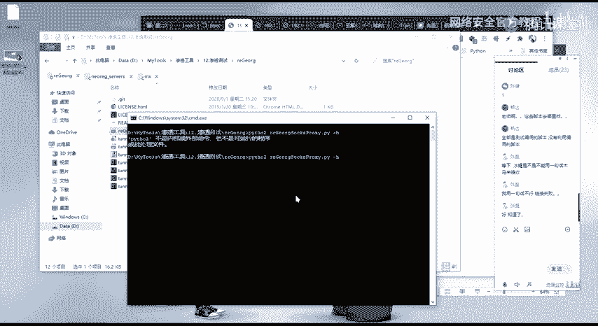

我们可以通过杠H来去查看它的具体的一个一些参数啊。具体的一个参数的话，都在PP里面已经写了。我这边的话我就不多说了。

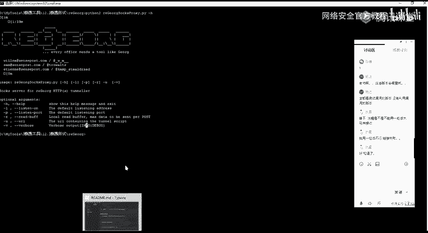

就都在PPT里面写了，对吧？它的一个作用啊，我这边的话就直接直接呃给大家看效果吧。

嗯。我想冻屁的话。嗯。

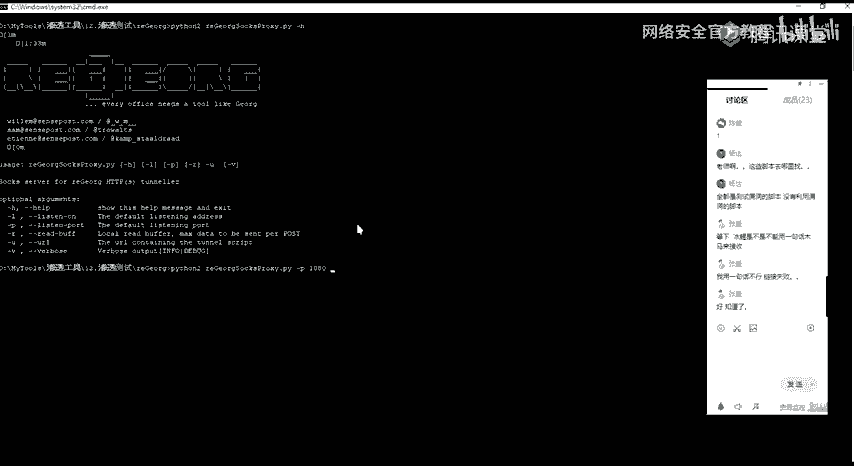

啊，其实呃在这边的话，他的这个脚本对吧？我们能够去就是我们去判断他能够能不能去执行解析的话，我们其实在这边能够去看到，对吧？如果他能够去解析执行这个GSP脚本的话。

我们在这边能够去看到这样子的一个东西啊。如果他解析解析执行不到的话，那么呃会就是访问不到嘛会。

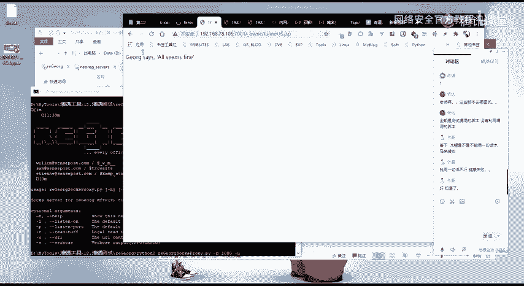

Okay。看下这没个。没错。然后我们这边呃执行执行之后的话，在这边的话，它就会有这样子的一个信息的一个反回。然后可以看到有这样子的一个东西的话，就说明我们这边的这个代理话已经建立成功了。

然后我们这边进店的一个代理的话，我们可以看看一下我这边的一个命令，就干P加1080的话，就是我在本地今天的这样子1个1080的一个端口。然后这个端口话，就是我们的一个代理的一个端口。

我们呃把我们的一个请求的话，就是呃。

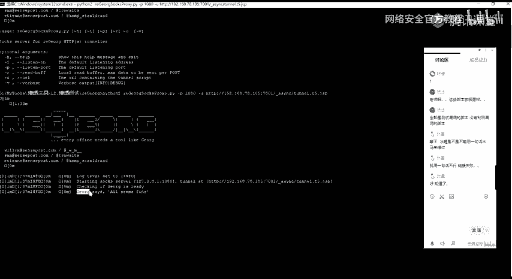

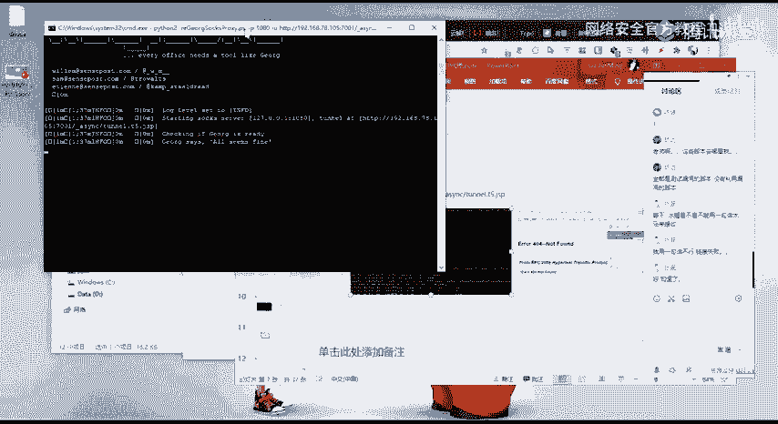

就是通过这样子的一个端口，把它呃放到这样子的1个HP的一个隧道当中。然后的话把它给转发到我们的一个目标机器上面去。

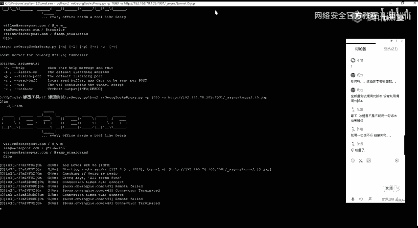

呃，然后在这边的话，我们可以看一下，我再另外开个浏览器。当前我在这边的话，其实呃我们可以来验证一下的。我在这边的话，我可以执行一下命令，我看一下。

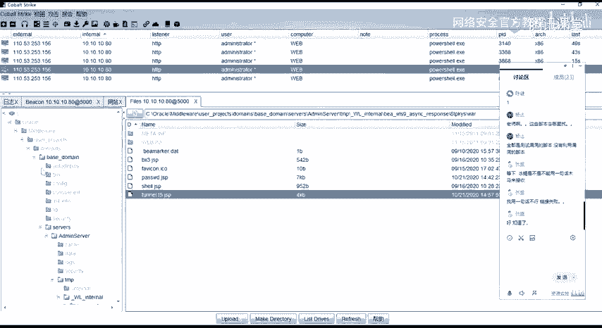

它的一个网段对吧？这边网段的话可以看到它有这样子一个内网网段，10。10。10。8的这样子的一个啊网卡，对吧？

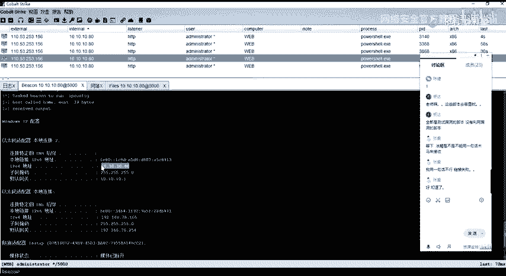

然后这边的一个一这一个网站的话，我们是无法直接去访问到的对吧？就这个IP的话，我们是无法直接去访问到的的。然后在这的话我们去验证一下我这边的这个。这边的这一个代理它是否成功了？

代理的话就是呃本地的啊IP加这1个108年的1个端口，对吧？没有问题。然后这个的话其这一个代理可以看到。

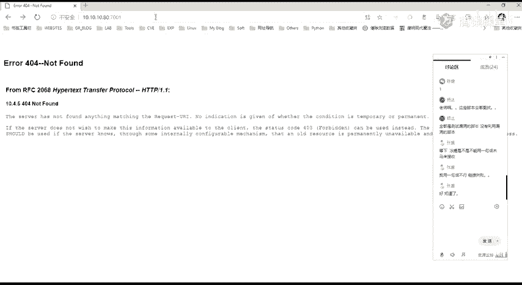

这边又要开了。这边执行对吧，可以看到在这边的话，在这边它会有相应的一个流量，对吧？然后有相应的一个请求。

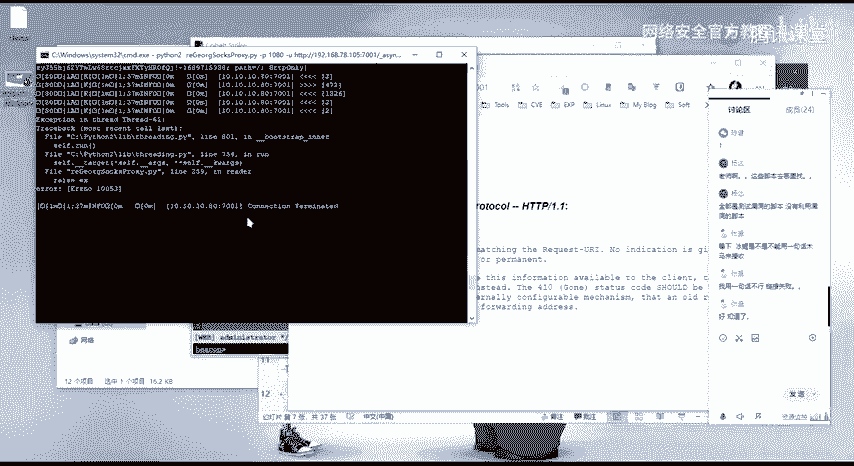

啊，我这边的话就能够去访问到这边啊呃因为在这边的话就是访问的同样的还是这个呃web logic的一个符务。但是我们在这边使用的话，不是使用的它的这样子的一个呃外网的这1个IP对吧？

也就是我们在这边能够去直接访问到的这一个。

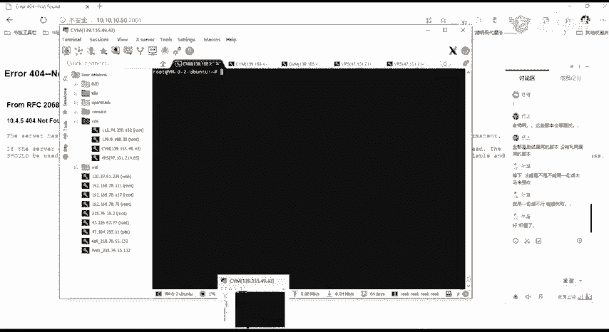

呃。能够去直接访问到的这个1920168。78。105的1个IP对吧？我这边的话访问的是就是它的一个本地的这个IP就内内部内网的这样的1个IP。然后我通过内网，通过我这边的一个通道。

通过这边的一个松始的一个代理通道，然后的话把我的一个流量代理进去了。然后的话访问的是这边的它的一个内网的1个IP是原本我们访问不到的。然后其实访问这边的1个IP的话，同样的还是访问到的是这个机器。

它的一个本地的1个web logic的一个服务。因为呃其他的一个机器的话，就其他的一个机器的话，没有我这边没有开其他的一个服务啊。所以的话就是这一些其他的同一个网站的一个主机的话呃。

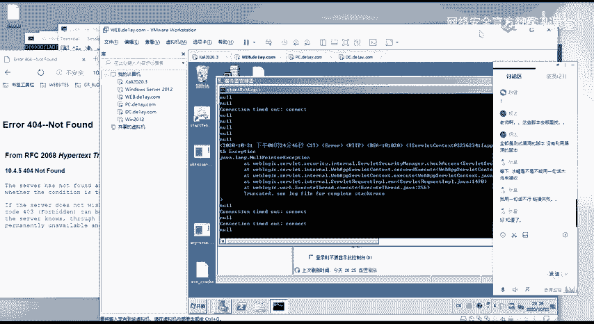

就呃没有这样子的一个明显的一个效果。就是在这话主要就是给大家看一下，我这边的话是呃代理的话是建立成功了，对吧？然后在这边使用的一个是用的这样子的一个脚本，就是通过这边的一个HTP的一个隧道。

然后的话建立了这样子的一个收时的一个代理通道，把我们的一个流量代理到了一个内。

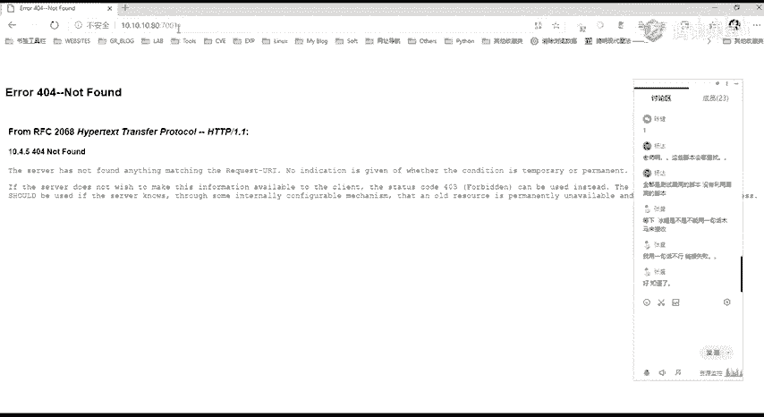

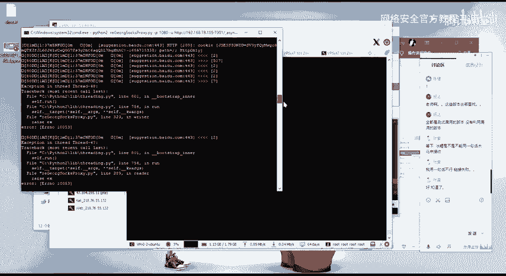

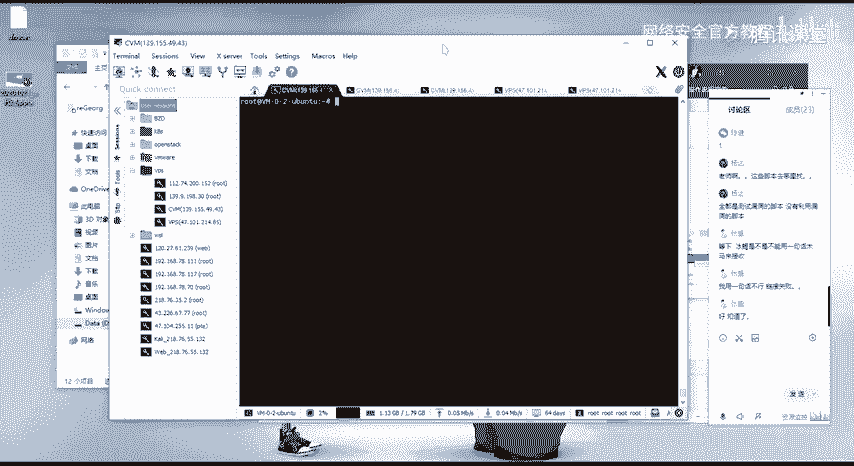

然后呃效果的话就是像这样子。对吧。然后呃第二个的话就是这个NEOIEGO这个的话这个的话比前面那个的话要就是呃因为它是对前面的一个重构增强了，对吧？它的一个功能以及它的一个呃安全性。

还有它的一个这种数据传输的一个保密性的话要比比这一个的话要高很多。所以的话这一个的话就相比于前面那个的话会好用一些呃。然后这一个工具它的一个呃一些参数的一个使用的话，我这边也不不会多说了。

然后大家PPT话已经也给大家了，是吧？大家自己去查看，我这边的话都已经给出来了，是吧？啊，呃这个的一个使用的话，其实跟前面的这个IGO它的一个使用其实是呃类似的，对吧？

因为它本来就是基于前面的这1个IGORG的一个重构嘛啊，就它根本上的一个东西的话是没没没变的。但是的话它对前面的这一个呃前面的这一个脚本的话，它有增强，对吧？然后下面的话我们来看一下，我们在这边的话。

同样的以这一个机器啊，同样的以这一个机器作为一个呃事例。也就是呃我前面的话通过这个pro的一个漏洞，对吧？拿到了它的一个需要。然后的话我想要做一个代理，就把我的一个能量代理到这样子的代理到它的内网去。

那么我们在这边的话，在用这个工具的时候的话，首先第一步我们需要呃。先来看一下。这一个呃这个工具它的一个样子吧，这边的话就是它的一个脚本。我们首先的话需要去把这个脚本下载下来嘛，对吧？

然后同样的它有这样子的一个python的一个脚本。

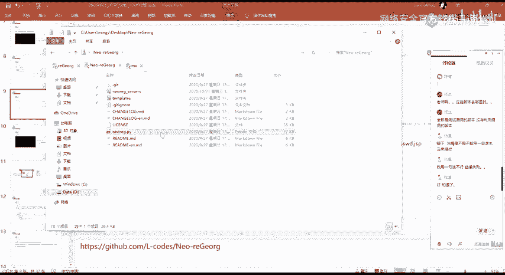

就这一个就NERNEOREG的这一个脚本。

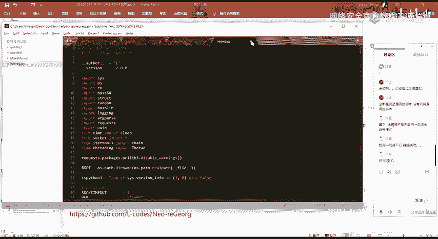

然后这个脚本的话就是我们用来去起服务的，去进行进行一个ss代理的一个呃脚本。然后在这边的话有这样子的一个目录，就是这个temps这个目录。这个目录的话，它存放的是有它支持的这5种脚本的这样子的一个模板。

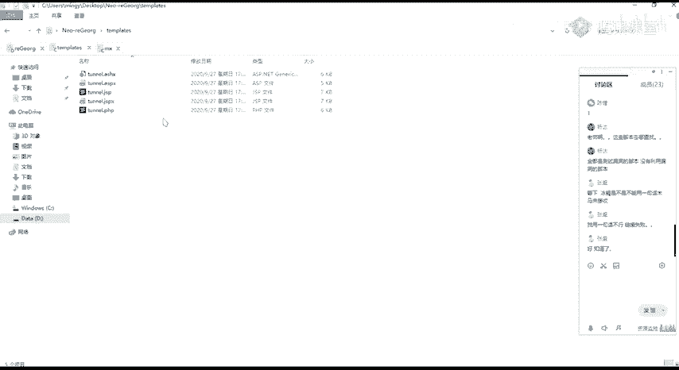

就是这边的话它是注意的话是模板，也就是他在这边的一个模板的话，我们在这里首先第一步需要通过这一个脚本，然后的话基于这边的一个模板来去生成对应的这样子的一个文件。这边的文件的话可以看到NEOIGserv。

对吧？就这边的话就是我们的一个啊服务端。因为我们需要把我们这边的这一个脚本文件，对吧？去上传到目标的那个word服务上面去。然后的话上传上去的话，我们通过这样子的1个HP的一个连接，对吧？

来建行一个隧道。

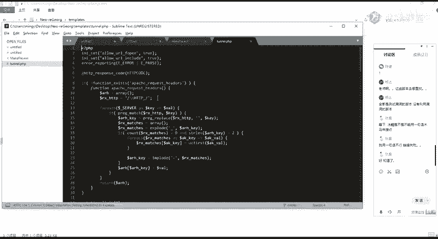

然后这这的话，首先我们要去使用的话，第一步的话就是设置密码来去生成对应的这样子的一个这5种脚本，然后的话上传到目目标的一个web服务器上面去。然后生成脚本的一个命令的话。

就是这样子就有它有这样子的1个GNERAAT的这样子的一个参数。然后的话在后面接一个杠K这一个选项，我们在后面接我们的一个密码。这边的这一个密码的话。

就是呃我们的这样的一个客户端去连接这一个服务端的时候，它会呃需要这样子的一个密码来去进行一个验证，对吧？就是不是呃不是像之前这边前面这边的话我们呃。前面这边的话，我们只要知道它这一个脚本，对吧？

然后的话我通过这样子的一个通过这个脚本就能够去进行一个代理的一个代理这样子的一个通道，对吧？然后在这边的话，它就对它做了一个这样子的一个增强了。就他有他需要去验证这样子的一个密码。啊。

就不是说你得到了这样子的一个路径的话，你就能够去进行这样子一个通道。你需你还要需要知道这个密码，就是呃在安全性上面的话就更更好了，是吧？然后这边的话它执行之后的话，它就会在当前目录下面。

在这边它会去生成这样子的一个文件夹。然后在这个文件夹面文件夹下面去写入这样子的一些脚本。然后这一边的话有一个T点t的话，就是这边的一个呃就这边生成的我所使用的这样子的一个密码。

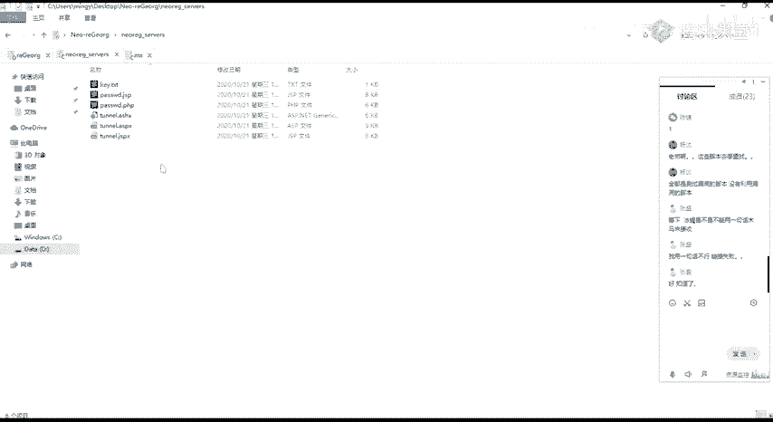

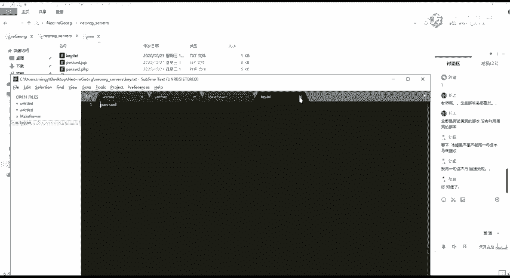

然后还有对应的这样子的一个文件。我这边的话是把它改成了这样子一个password点击SP的这样子的一个格式。然后我这边的话同样的把它就是上传上传上去，对吧？上上去的话就是在这边。好。

这个usword点GSP的这一个文件。然，我们可以来访问看一下。然后可以看到这边的话没有其他的任何多余的这样子的一些东西啊，对吧？就是没有说访问不到，或者说没有报错的话。

那么就表明我这边的这个JSP的一个脚本的话已经被正常的解析了。然后正常解析的话呃。我们也可以在这边去查看它的一个源代码，有这样子的一个一行的。然后这边的这一行的话，其实就是我们在这边。

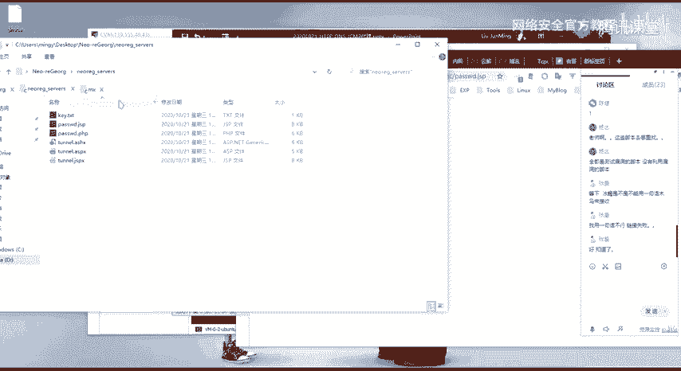

这一个脚本的最后的这一行。就是。啊哎，啊，不是就是。

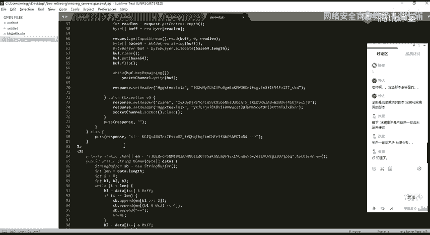

这一个。我照边的这一个内容。对吧它是跟这边对应的。Okay。然后我们这边呃上传上去之后的话，我们同样的通过这个工具。

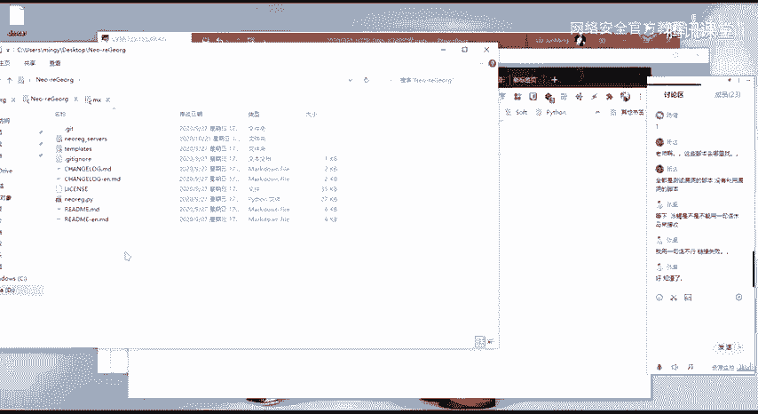

通过这个脚本。来去建立这样子一个通代理通道。呃，在那个之前的话，我可以把这边断掉。然后在这边我同样的使用1081080的1个端口。然后它的这样子的一个经经济通道的话呃。

注意的话就是说它这边的话是呃使用的是python3了呃，pyon2应该。也可以吧。啊。呃，开神二也是可以的，就是他这个的话，它支持开神二已经派成3，我这边的话就用开神三了。啊。

呃我们可以杠H同样的杠H来查看这一个脚本它的一个具体的一个使用的一个帮助信息，对吧？

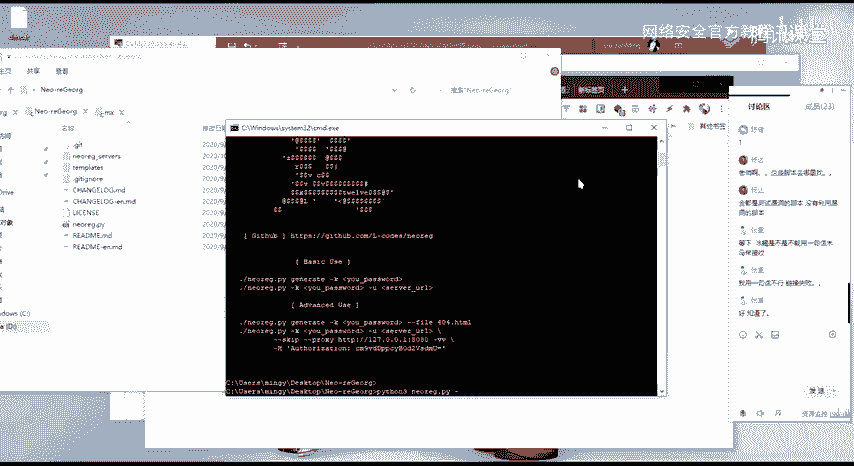

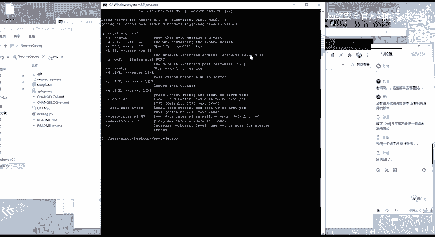

然后这句话我们。所需要的主要的话就是这几个参数。首先的话就是干优。干U的话就是指定我们这边的这一个URL，也就是我们的这一个上传的这个呃脚本。

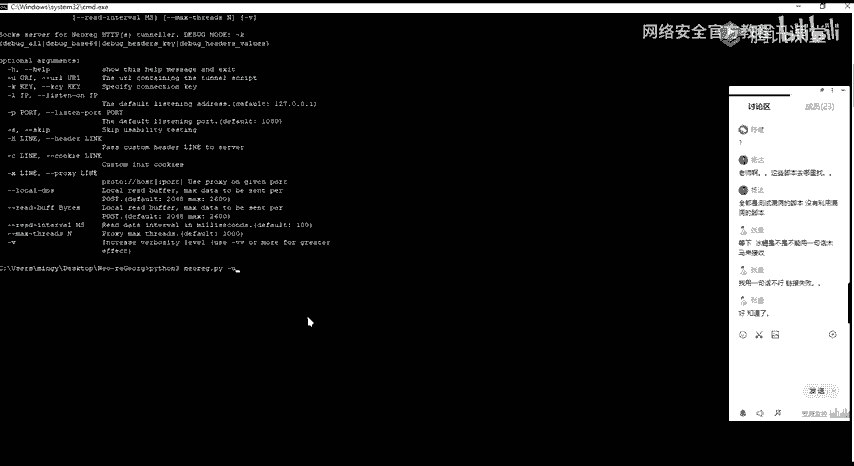

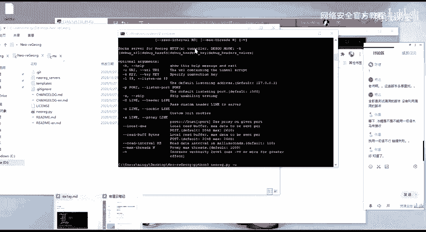

就是隧道脚本。啊，第二个的话就是这个杠开。杠开的话，我们需要去指定我们的一个T，也就是我们前面再去生成对应的这样子的一些脚本的时候，我们所指定的这一个password密密钥。

啊后这边的话就是我这边的话是生成了一个password。是，然后的话还有就是杠P就杠P的话就是呃今天端口嘛，对吧？其实跟前面的那个IG它是一样的，就是在本地去今天一个代理的一个端口。

我这的话就是1080。然后执行之后的话。🤧。昨天这的话就是这样子的一个结果。然后可以看到他这边的话呃就是他启动了这样子的一个收时的一个服务啊，就是在本地的1个108年的一个端口。然后呃。

这边的一个跑呃隧道的一个HV的一个隧道的一个地址的话，就是这一个啊吧，其实就是我这边的这一个嘛。然后在这边的话，我们经力成功之后的话，我们同样的来去验证一下，对吧？

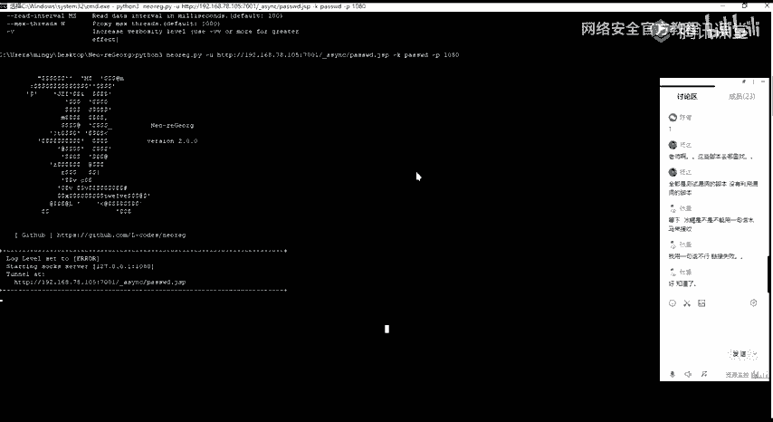

验证的话，我同样的通过前面的这个这个啊。啊，我这边的一个代理的话还是跟前面是一样的，对吧？因为我同样的是代理在本地的1个1080的一个端口上面。那么我在这边其也是能够同样的没有问题的去访问，对吧？

对吧啊啊，不是啊不是这个是。109。嗯。它的一个内网IP对吧？对吧是能够呃正常的访问，也就是说明我们这边的进业的这个代理通道的话是没有问题的。

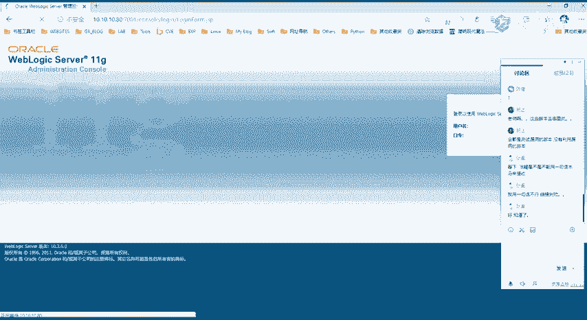

嗯。好呃，然后的话我们就通过这样子的一个方法呃，又成功的建立了这样子的一个代理通道啊，然后其实这边的话，它它的一个园林的话，都是使用的这样子的1个HPP的一个隧道来去做这样子的一个流量的一个转发。

这两个工具的话呃，就是它的一个用法都是一样的。呃没没有太大的一个差别啊。🤧啊，呃，第二个的话就是。第二部分呢就是一个DS cap。点电ca2呃，这个的话是就是。呃，我记得在第一期的时候。

就是在开第一期课的时候，呃，没有讲这个没有讲就是HTP的呃隧道以及DNS有这边的就本节课内容的话，第一期的时候的话是没有给大家介绍。然后呃那会是有有人问我这个，然后的话。诶。

我这边的话是给了一给了这边我写的这一个比较。呃，这个是我老早之前的一个比较挺久的了。然后呃这个比较的话大家可以去看一下吧。呃，当然的话因为当时写的话。当时写的话没有。就呃怎么说呢？就是不是很认真吧。

就是写的比较随便啊，然后的话比较可能稍微稍微有点杂乱。然后呃当然话就是具体的一个容的话，我在今天会给大家去讲，然后详细的细致的这样子的一些点的话，在这边的话呃都都有都有写。然后的话。

然后还有就是我这边有参考的这样子的一些文章，其实呃就是参考的别人的。啊，就基于别人的这样子的一些已经做了一个总结。我这边的话就是把它给记下来，然后作为我自己的一个东西嘛啊，然后我下次我再去用的时候。

对吧？就比如说我要是之前我不做这个的话，对吧？我不做这个笔记的话，就是可能你们再你们再来去问我这个东西的时候对吧？我可能就是会拿一个别人的一个东西给你是吧？但是如果我这边我自己做了，我自己做了。

有相应的一个东西，我自己有尝试的。那么我可以把我自己的这样子的一个总结给你是吧？这样子的话就呃。可能会好一些吧呢。呃，那话这边的话就是。Okay。呃，说了一点闲话。好。

我们正式我们正式开始这一部分内容的一个介绍。然后首先的话就是对这个工具的一个警戒。这1个DSca2的话，它是1个DS的一个隧道工具。

它的一个主要作用的话就是我们可以通过DS的一个协议来去创建这样子的一个加密的一个命令，还有控制的一个通道。然后的话。就是说呃就是说它的一个特色的话，就是我们可以在服务端上可以去进行一个命令的一个控制。

也就是CNC嘛，对吧？就是。common空嘛。然后的话我们在服务端的话就能够呃得到这样子的一个命令控制台，能够去呃执行相应的一个命令，也就是得到目标机器的一个需。那嗯。再讲这个DS。呃。

在讲后面的一个内容的时候的话，在这边大概的就是提一下。就DS的一个解析的类型，就常见的有这样子的一些。然后我这边的话呃有总结了总结了这样子的一个它的一个类型啊，对吧？

然后在这边的话主要的话就是给大家介绍呃A大写的这1个A就是表示的话，我们域名的1个IP地址，就我们再去配置我们的一个解析的时候，对吧？我们想我我这边的话有一个呃公网的1个IP地址，对吧？比如说我这个。

官网的这个IP地址对吧？然后的话我这边买了一个玉米，对吧呃。然后你看我的一个域米，我想要把我这边的一个呃机器，就是呃把它给绑到这个玉米，就是把这个玉。把这一个。域名的一个解析的1个IP地址。

把它给绑定成我这边的这一个对吧？然后我这我再去做一个呃配置的时候就。选择我们的1个DS的一个解释类型的话，就是为A就是一个A记录。这个A记录的话，它对应的是我们的1个域名的1个IP地址。

然后呃还有的话就是这里的NS。AS的话就是我们的1个DS的一个。解析啊，就是我们呃可以通过这个NS的一个记录来去指定我们的一个域名服务器。也就是我们因为我们知道我们要去解析这样这个域名。

比如说M点com这一个域名，对吧？然后这个运营的话，我们首先去解析的话，首先就是从我们本地的一个local啊，那一个hos文件当中去找到，对吧？如果没有的话。

他就会去找最近的我们啊运营商的这样子的1个DNS的一个公共的这个这一个服务器。然后如果还没有找到的话，他就会去我们的1个DS域名的这个跟服器上面去找。然后的话它会有这样子的一个迭代的查询。

就一层一层的去找，对吧？然后直到找到我们这边的一个呃域名。然后我们在这边的话可以去指定，就是说我们再去解析这个域名的时候，去指定我们是呃。指定呃有哪一个域名服务器来去进行一个解析。

就通过这个黑less的一个记录。呃，其他的话在这块我就呃我不多说了，呃，大家自己去进行一个呃了解，好吧。那主要的内容不是这一块。Yeah。Yeah。然后呃下面的话就是呃对这个DSca这个工具啊。

它的两种模式的一个介绍，就一个。啊，首先第一个话就是一个直连模式。直连模式的话就是我们的一个客户端直接向指定的一个指定IK的1个EDS服务器发起我们的1个DS解析请求。然后第二个的话就是这个中继模式。

中继模式的话就像我们就平常去上网，对吧？去做一个去访问一个域名的时候，它的一个域名，他去进行一个解析的时候，他会去呃通过我刚刚所讲的那样子的一个呃域名解析的一个步骤，它会去进行一个迭代的一个查询。

然后直到找到我们的这样子的1个I例的1个DNS服务器。然后相比前面的话，就是因为它直接是通过IP嘛，对吧？就直接通过IP它没有DNS解析的这样子的一个呃。

就是DNS这一个域名解析去查找这样子的一个域名服务器的这样子的一个过程。所以的话它会比较呃慢一点，对吧？它会比前面这个要慢一点，但是的话它是更安全。因为他他有这样子的一个解析的一个过程。

以及我们在待会他会去看那个就是说他在呃用这样子1个DSca，他做这样子的一个呃做这样子的一个访谈渲尔的时候，他的他的一个DNS的一个请求的话，他是会呃就是。不是默认的一个。

就是他的一个默认的一个请求的话，它会有这样子1个DSca的一个后缀。因为它是写在他的一个呃工具当中的。当然的话如果你懂代码的话，你可以自己去改掉对。然后我们如果说通过这样子的一个中继的一个模式。

也就是通过我们自己的这样子1个DS的一个域名的一个解析的话，那么它里面记录的是我们的一个域名。哦哦。然后的话呃我们一起来看一下，就是它的一个安装。这个DSca的一个安装的话呃。挺容易出错的。

应该呃我今天的话在装的时候，因为我这边它是又重新的又弄了一遍。虽呃虽然我笔记上面有，但是那个的话是老早之前的那个服务器啊，而且还是用的那个s OS的一个机器。我这边的话是用的那个无关图的。

有然的话我又重新又搭了一遍。呃，在这边的话嗯。

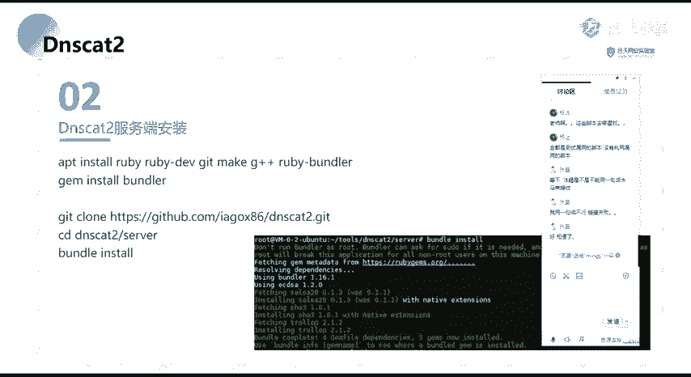

这句话我是装在了安装在了这一个机上面嗯。呃。找到这个工具。在这边。呃，这里的这个工具的话，呃，就首先你通过这样子的一个方法嘛，对吧？对。

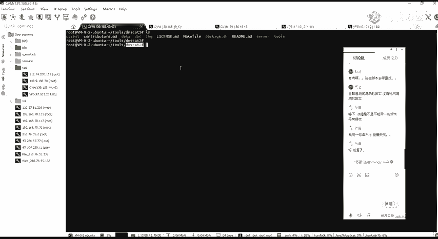

再去通过这样子的一个get方式。把它的一个代码克隆下来，克隆下来之后的话，它的一个代码还就是像这样子。像这样子的一个东西。然后我们主要的话就是这两个目录，就是client以及serv这两个目录。

那个seven路的话就是我们的1个DSpa的一个服。呃，启动这个DSca服务的一个脚本的话，就在这个目录下面，也就是这个DSca点reby。当然要注意的话，它的这个工具的话。

它是用通用reb这样子的一个脚本原编写的。然后还有的话就是一个ff的话就是。我们的一个客户端嘛，对吧？然后这边的一个客户端的话。

我们需要通过make去进行一个编译来去生成这样子的一个呃生成一个这样子的一个可执行的一个二进制文件。然后再去进行一个呃安装的时候的话，我们需要去安装它的一个服务。在安装之前的话。

我们需要去呃安装相应的这样子的一些呃依赖以及组件，以及一些应用程序啊，我这块都已经写了。像呃你需要有reb预bu的一个环境。因为它是用re的一个脚本写的嘛，是吧？你需要去用rebu的一个环境去解析。

还有的话就是这个rebu点DV的话，是它的一些那个呃依赖扩展。然后还有get就是我们在这边要去用这个ge的话，我们也要去安装嘛。还有的话就是makem的话是link下面的一个编译器啊。

就我们去编译呃编译我们的一个C代码的时候，我们通过这样子的一个m编译器。去编译成我们的一个可执性文件。以前有G加佳，也就是我们。🤧需要的这样子的一个环境。嗯ん。😊，呃。

以及这一个banderband的话就是我们在这边去安装这个呃服务的时候会去用到这个bander in store。嗯。然后呃。安装的一个过程的话，就是我这边的一个截图啊，我这边我就不多说了。

就是你这边的这些组件，你安装完成之后，你把呃你进入到这样子的一个s文目录，然后的话执行这个bander installstore，它就会去安装对应的这样子的一些组件。安装完成之后的话呃。

我们就能够去进行一个启动服务。啊，启动服务的话。呃，在启动服务之前的话，我们还需要去编译我们的个客户端嘛。因我们服务端有了，我们客户端我们也也需要，对吧？

然后B译客户端的话就是进入到这个planient，我们直接执行这个make来去编译一个可DSK的一个可执行二二进制文件。啊我们呃服务端客户端都有了，对吧？那么我们需要去进行一个启动我们的服务端。呃。

启动服务端的一个命令话就是这样子，通过reby来去直接去执行我们这边的1个DNSca2点RB的这样子一个脚本。执行之后的话，它就会有这样子的一个。呃，这样子的一个信息返回。呃。

先休息5分钟吧啊50的时候的话再我们再继续，好吧。

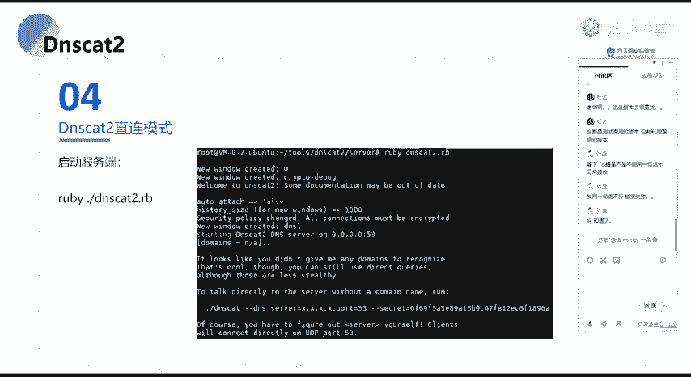