# B站最全网络安全教程，整整1300集，全程干货无废话，别再盲目自学了，看完学不会我退出网安圈！（web安全｜渗透测试｜内网渗透｜CTF） - P90：89. 第三十九天：Dnscat2、icmpsh.mp4 - 网络安全官方教程 - BV15u4y137cQ

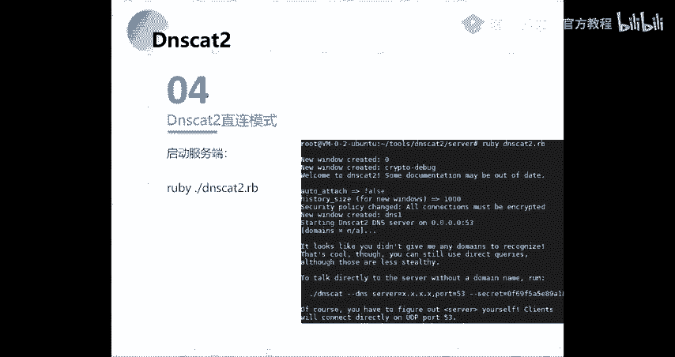

呃，大家呃，我们继续啊。嗯。😊，好，前面的话给大家介绍的就是它的一个安装，以及它的一个就是它的一个安装步骤。然后下面的话我们分别来介绍一下，就是它的一个使用。也就是呃在它的两种模式下面。

我们如何去进行一个使用，就我们如何去呃进行1个DS pet的一个直连模式，以及后面的这样的一个中继模式。呃，直连模式的话，我们直接执行这样子的一个脚本，就是reby点DSt啊，执行之后的话呃。

返回这样子的一个信息给我们。主要的一个信息的话就是在这边它有这样子的一个。啊，这边有一个尴杠secret。这边的一个s的，后面的话有这样子的一串字符，这这里的话是一串随机字符。这边的一个字符的话。

也就是我们客户端要去连接我们这边的一个服务端的时候所需要的这样子的一个呃一个密钥。然后的话这边执行之后的话，它会在本地啊，它会在呃我们的一个服务端，他会去精贴1个53的一个端口。

因为我们的1个DS的一个呃我们的1个DS的一个协议的话，它默认的话，它是一个呃53的一个端口。而且是啊要注意是UDP的53方口。嗯。

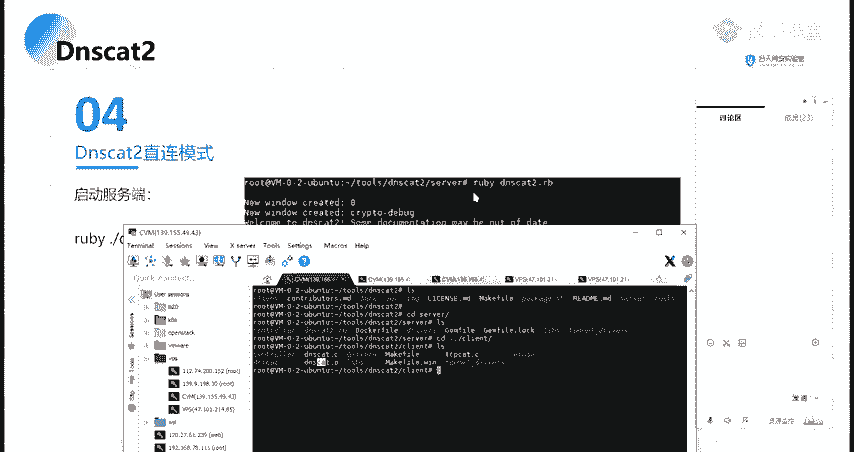

Yeah。这边的话呃，我们来看一下。

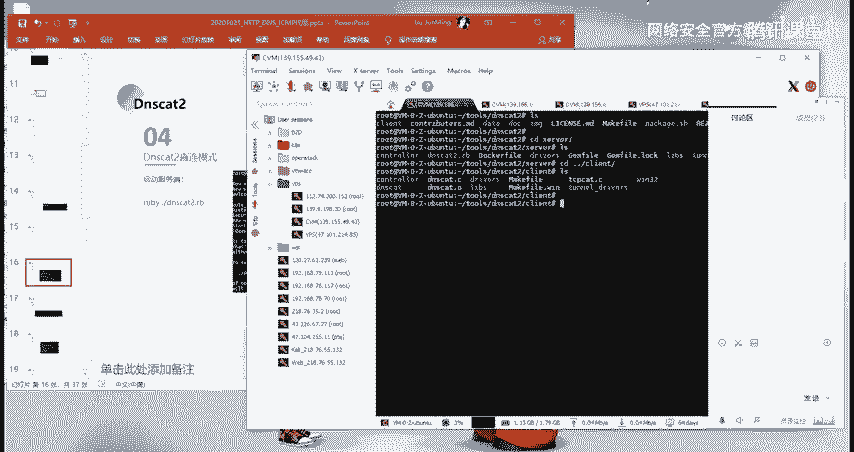

实际看一下。下午。首先的话我们进入到这个s目了，对吧？然后我们执行reb，然后执行这个脚本执行之后的话，它会再生成返回这样子的一个信息，对吧？给我们。然后的话它会在当前的一个服务端。

它会今天1个53的1个端。对吧呃也就是这个可以看到它是一个reby去今听的。然后在这边你去执行的话，可能会碰到这样子的一个问题啊，也就是。

我这边运行内容的话有给的这个链接。就我今天再去弄的时候的话，是碰到这个问题啊。

完了，通过他的这边的一个方法，大概不是这个。

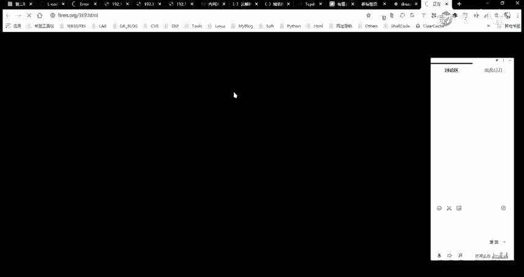

🤧。通过它的这个方法做进行了解决，就是你执行的时候，它会报错报错这个53端口的话，它会占用的。然后你通过去查看它的一个端口占用的个服务的话，是这个sstem地点微。这个服务。🎼，Oh。啊，不好意思。

不好意思，刚刚呃有个电话打进来了。然呃在这的话，我们就是可以通过他的这边的一个方法做一个解决，就是更改它的一个配置文件。然后就能够去解决它的一个这个服务的话，它占用53端口的一个方法。

因为我们在这边的话，因为我们在这边的话要去使用到这个UDPT的53的一个端口嘛，对吧？如果它处于一个占用的一个状口的话，那么我们执行的话，就是呃起不来的。我这边的话啊后在在这边执行之后的话。

它就有这样子的一个内容给我们，对吧？

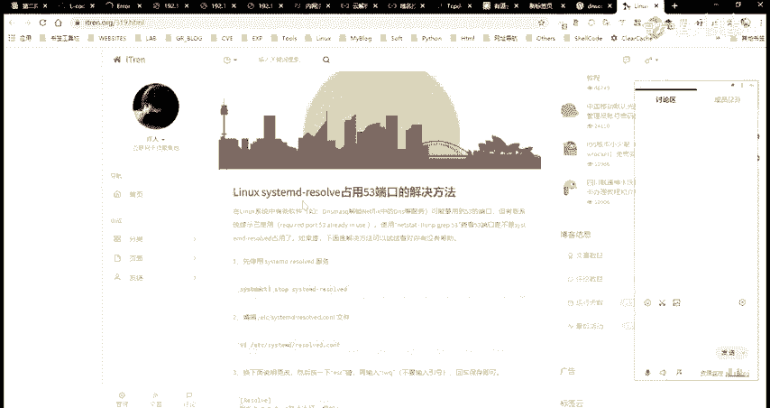

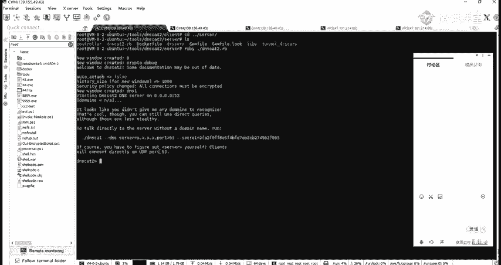

然后这边他给到给到我们的一个信息化，就是这个secret。

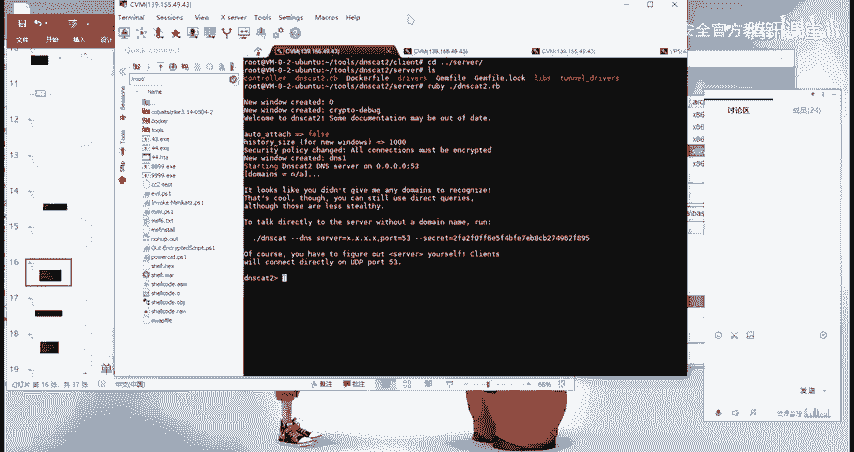

然，我们把它抠下来，把它。把它放到这边来。

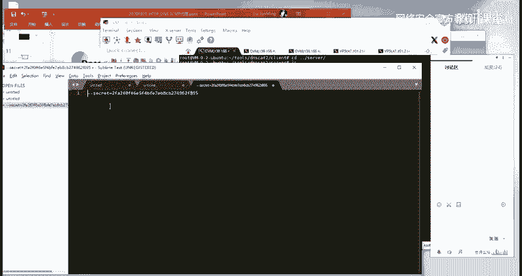

啊，我们这边服务端启动了，我们需要去启动我们的一个客户端。

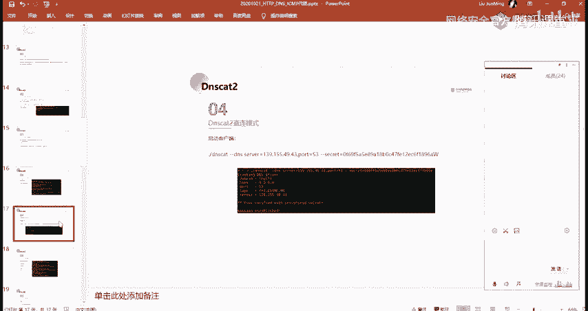

启动客户端的话就是。这样子。

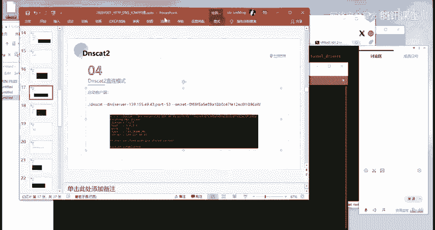

因为我们前面的话已经编译对吧？通过编译的话，已经生成了这样子的一个我这边忘了。已经有生成了这样子的一个二键子的一个可执行文件。这可执行文件的话。

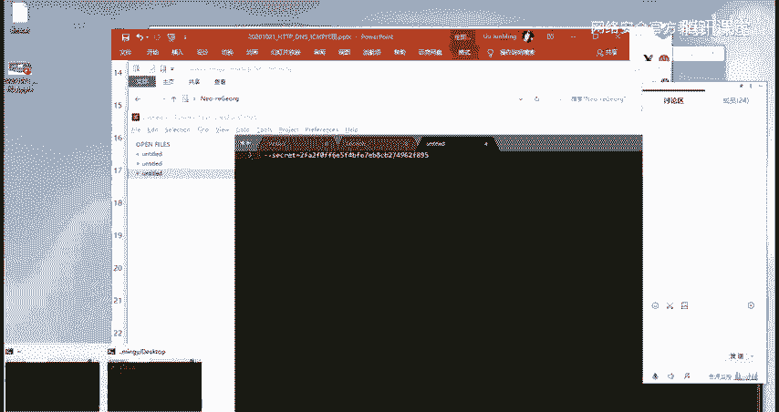

我们把它给算传到我们的一个目标机器上面去，对吧？我这边的话是在我在我自己的一个windows的一个linux子系统下面。来去进行的一个执行。然后呃执行的一个方法的话就是。电视开头。然的话。

接我们的一个杠杠DS的一个选项。然后关于它的一个选项的话，我这边。

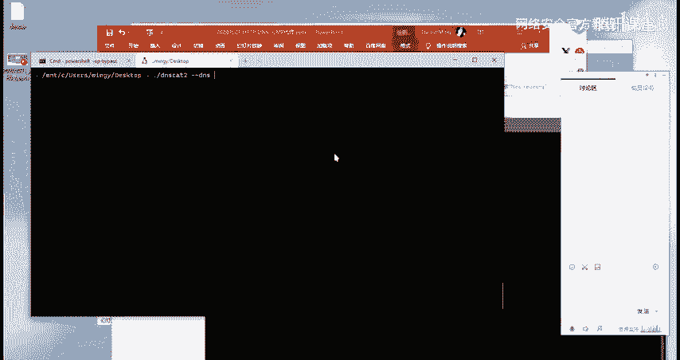

呃，不不多说啊，我不会就是做太多的一个介绍。

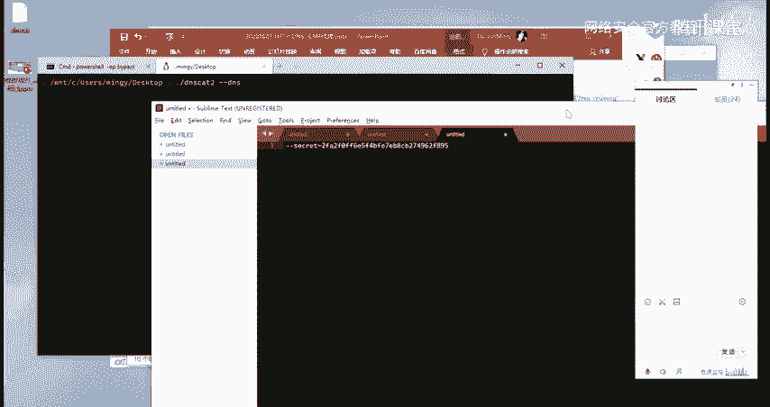

好吧。然呃在这边的话，我们需要去指定我们的1个serverer，也就是我们的1个DNS的一个呃DNSca这个服务所所在的一个服务端。就servver的话呃喂就是我刚刚的那个。

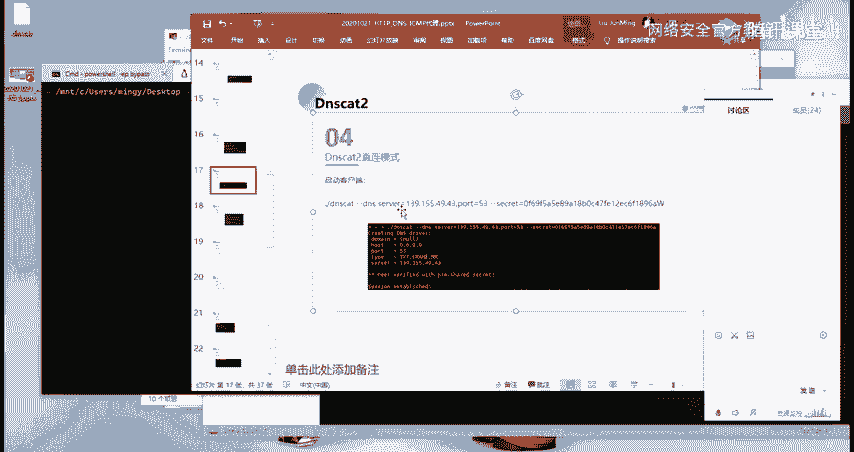

EPS的1个IP。然后还有的话port端口端口的话就是我们的1个53的一个端口。But。然，加我们的一个secret。

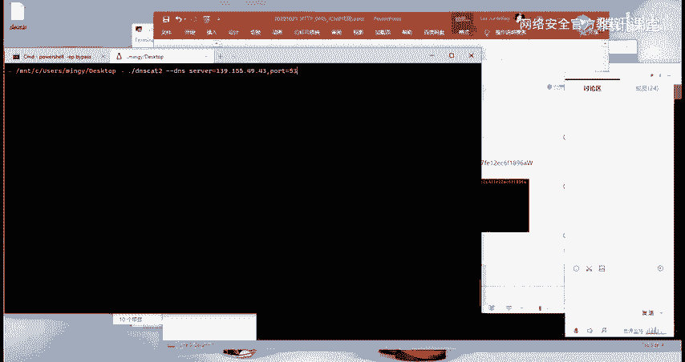

这边的一个s口的话就是服务端。服务端他。

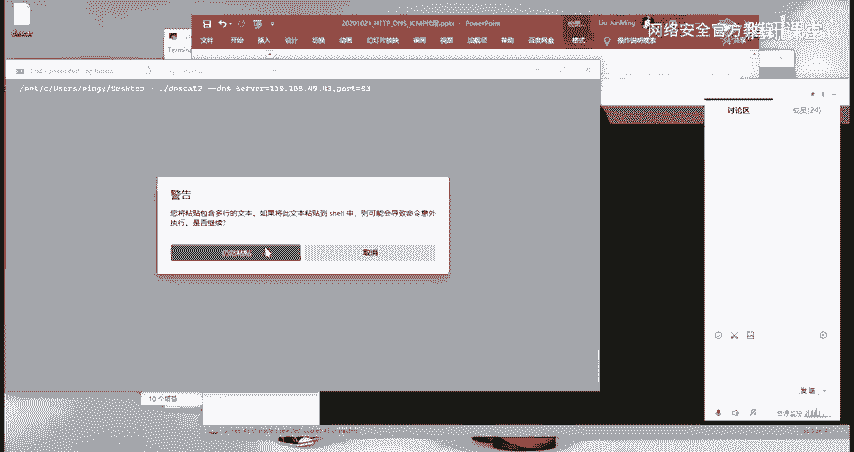

诶。

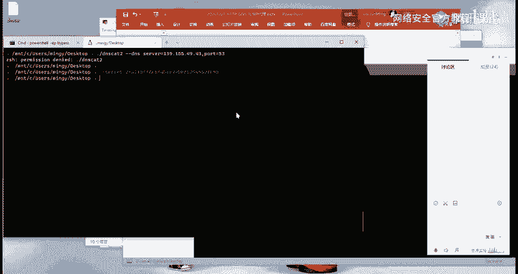

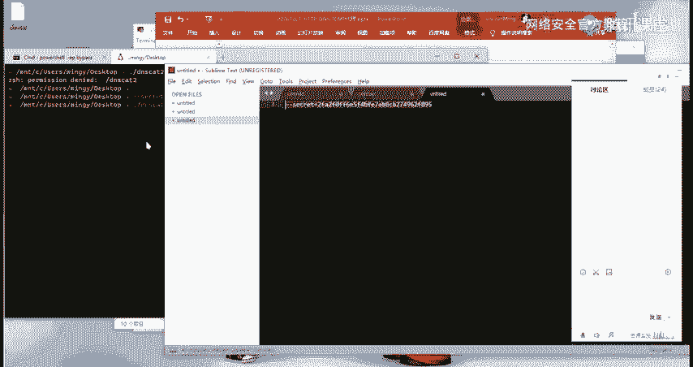

这边服务端执行之后的话，所生成的这一个secret的一个呃字符串是吧？然后我们在这边的话。不是方呀，是就是这样。Okay。

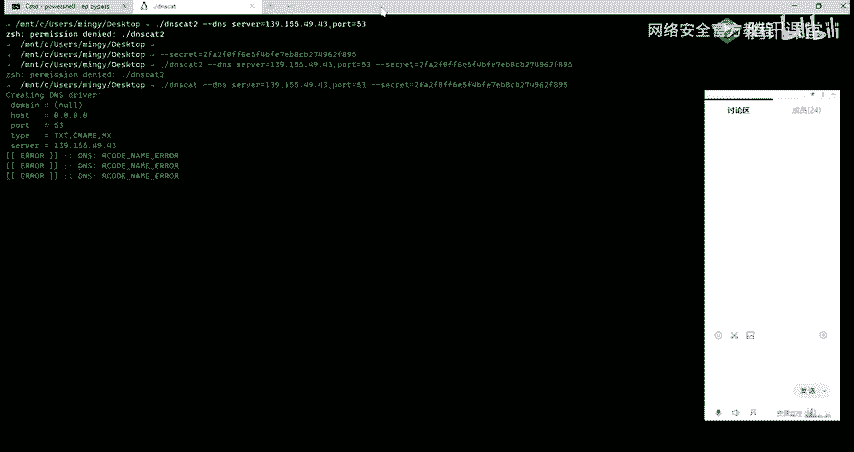

哦。Okay。

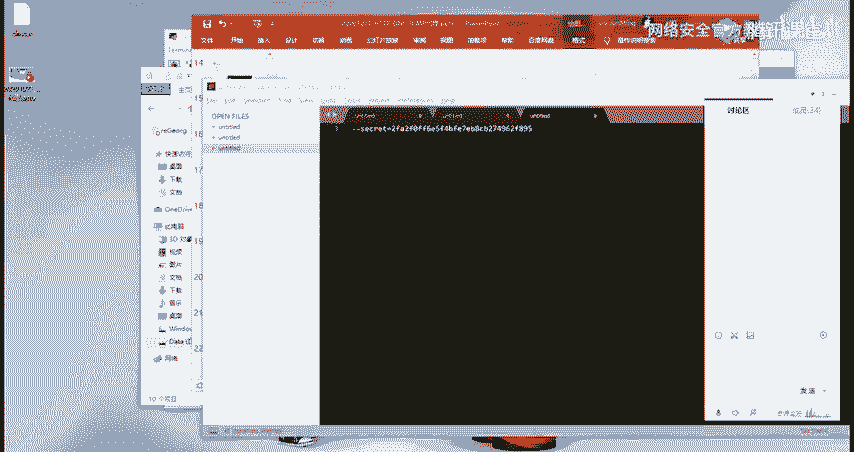

我通过我要另一个服务器啊。啊。Yeah。

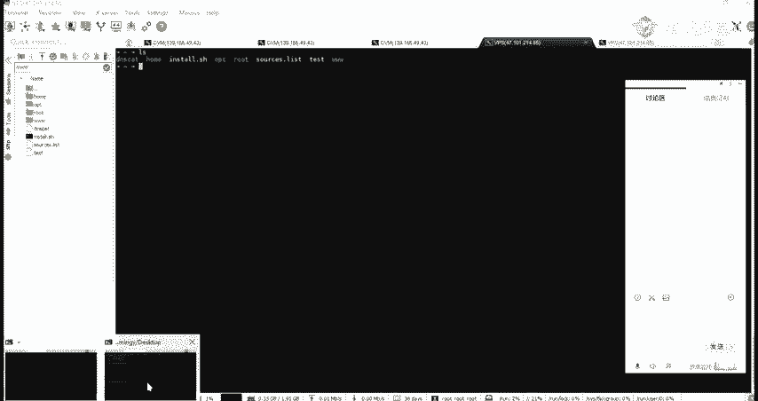

Good。

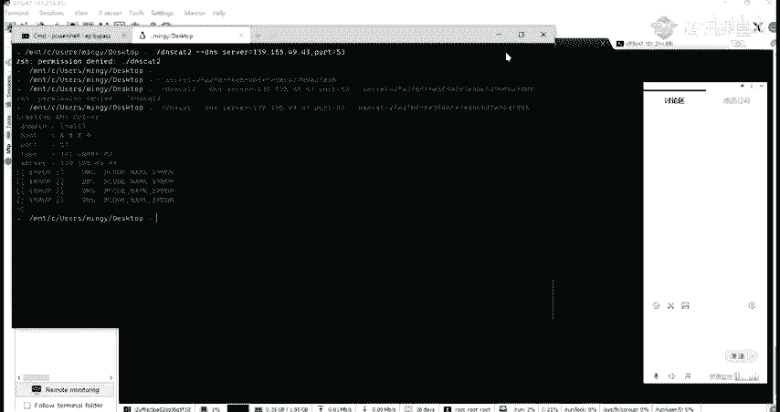

呃呃，执行之后的话，它会有这样子的一个结果，就是显示这一个session istable。这个的话就表示我们的这样子的一个绘画的话已经建立了。也就是我这边的话呃。

已经这边的一个客户端已经连接上了我们这边的一个服务端，然后连接上之后的话，他在这边有这样子的一个new windowsdow created一这边是什么意思呢？就是他这边的话。

它就是创建了这样子的一个window，也就是一个呃。呃，绘画。好，我们可以通过输入这个window windows。或者是window来去查看啊，然后这边的话可以看到有这样子的一个一。

这个一的话就是我们的一个命令控制通道，就是这个主机的。然后这一个主机的话，其实就是我这边的这个主机啊。也就是我这边的这个主家啊。然后这边他得到了他的这样子的一个呃绘画。

我们可以通过这样子的一个方法来去进入这边的一个呃命令控制。来去呃。来去操作我们这边的这个。呃，客户端。呃，具体的一个步骤的话就是筛选筛选杠I接我们这边的这个ID就这个值为一。然后执行执行之后的话。

就会进入到这样子的一个comment的一个控制台。这个控制台的话可呃是在这个一啊这个一的这个windows这个窗口下面的是吧？然后我们可以通过help来去查看有这样子的一些命令。

像比如说upload就是上传文件嘛，对吧？还有呃下动关机，hell的话就是进入我们的这样子的一个hell。然后还有其他的一些面向EXEC的话，就是执行目标机上面的一个程序。呃，关于这一些东西的话。

在我这边的这一个。没。就是那个笔记上面的话有啊。然后呃我这个的话主要就是让大家看一下效果，我直接执行sha尔，也就是得到一个这样子的一个sha尔绘话。我们能够去执行命令。

然后在这的话它会又创建一个window windowsow啊，就是一个2。然后我们可以通过se选。刚来来进入到这个进入到二之后的话，就得到了这样子的一个SH的一个选。然后我们在这块就可以去执行命令。

比如说L对吧，也就是我当前呃当前的话是在。2。当前的话是在root目录下面，我root目录下面的话就是这一些东西嘛，我可以看一下。对吧就这些东西。然后，关麦我当前的话是一个root的一个用户。

然后的话我们就能够去进行一个命令的一个控制。

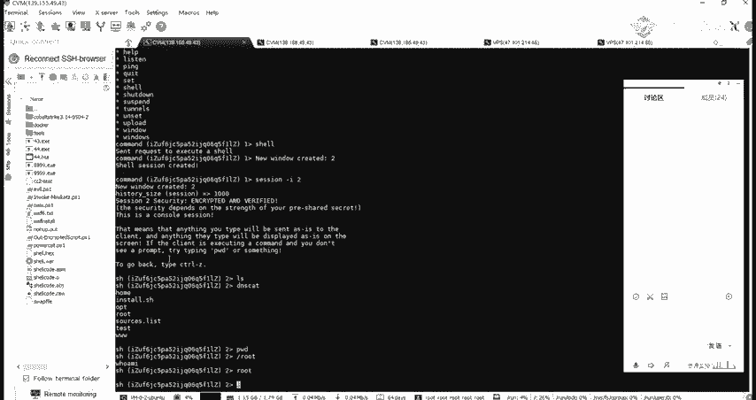

这边的它是1个DScast的一个指令模式啊。然后指能模式的话，它的一个就是它是直接通过这边的1个IP对吧？也就是我们在呃这边我们通过这个DSca所呃创建的一个。呃，DS的这一个呃服务是吧？

其实呃一个服务端，然后的话客户端的话，他来去连接我这边IP的这个53的1个端口，就能够去建立一个连接。进连接之后的话，我们就能够去得到它的一个绘话来去进行一个命令控制。啊呃。

具体的一个效果的话就是像这样子啊，我们可以通过这样的一个方法来去得到它的一个线。啊，上面的话就是这个直连模式啊。下面的话就是DSca的一个中继模式。中继模式的话我们需要去啊。做一些准备。

首先第一个的话就是我们需要有一台公网的一个服务器。这台服务器的话是作为一个我们的1个CNC，也就是我们的一个命令控制的一个服务器。其实就是呃像我就是我这一台嘛，对吧？我就用他先。退掉了。

就是呃我这句话就以这一台为例。作为我的一个。呃，面令控制的一个服务器。然后第二个的话就是一台靶机，就靶机的话。把机的话呃，内网公网的都可以嘛。然后第三个的话就是一个可配置解析的一个域名。

其实主要的话就是这个就我们需要有一个可以自己去进行一个解析的一个域名。就是你要去做做这1个DSca这个中继模式的话，你需要有一个域名，你要去做一个配置。然后我们怎么去进行一个配置呢？

我这边呃下面的话我们来一起来看一下。有配置DNS域名的一个解析。呃，我这边的话是呃我用的公司的一个域苗。

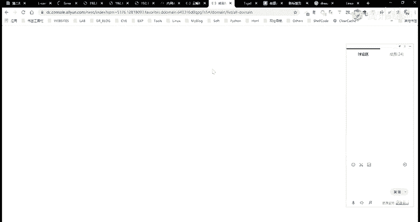

Yeah。Okay。好。这。我这边的话是用的公司的这一个育苗。呃，然后的话我在这边配了做了这样子的。那个。呃，解析的配置啊。然和具体的一个配置的话，首先第一步的话就是我们需要去创建1个AG5。

I的话就是将我们自己的一个域名的一个。解析服务器指向我们的。我们的这一个就是云服务器的1个IP。我们这边的一个云服务器的话，就是我们自己的这一个要去做一个命令控制的一个服务器。

也是我们的1个DSca服务所在的这样子的一个服务器。然后在这边的话，我们将自己的这个就是域名解析服务器。这个NS点S点核心点CN的这个呃域名，把它给指向了我这边的这一个IP也就是我这边的这一个机器。

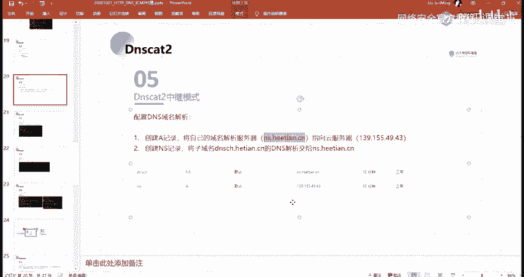

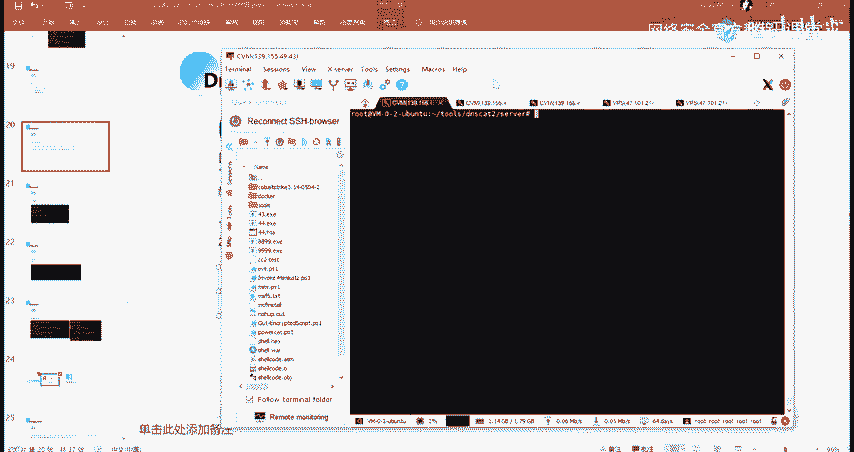

然后的话呃第二个的话就创建1个NNS记录。NNS记录的话就是将我们的一个子域名，就是指定我们这边要去解析这一个子域子域名的时候，它的1个DNS的一个服务器的话视为这一个就是将我们的一个解析这个域名的呃。

解析这一个域名的时候。就是再去进行1个DNS解析的时候，他会呃给就是告诉他是呃我们的一个呃DNS的一个服务器的话，是这个NS点核天点CN。然后我们这边NNS点核天点CN这个域名解析服务器的话。

又指向了我这边的这个呃云服务器的1个IP，对吧？然后我这边配置好之后的话，配置好之后的话，我们如何去做一个这样子的一个启动呢？首先的话我们需要去启动我们的一个服务端。启动服务的话跟前面不一样的话。

就是我们在这边要指定我们的1个DS的一个就是域名服务。就这个。啊，其实在后面我们去呃进行就它的一个域名解析。去经历绘画之后的话，它的一个呃解析的一个域名的一个请求啊。DS请求的话。

它都会是记录的是这边我这边的这1个DS的一个呃。这一个玉米。然后的话呃杠杠sl的话就是指定我们要去做的，要去用的这样子的一个密钥嘛。我这边的话就随便啊用了一个。

然后执行之后的话就是呃返回这样子的一些信息啊，它同样都是在本地去经行了1个53的一个端口。然后我们的一个客户端是怎么启动呢？客户端的话就是呃。指定我们这边的1个DS的一个呃。这一个域名。然后的话启动。

启动之后的话就能够去得到这样子的一个绘画。然后其实在这边它它的一个过程的话，就是像这样子。就是他我们那个客户端，他会去解析这一个域名，对吧？他会去找这个域名，他是怎么去解析。

那么因为我们在配置这一个域名的时候，在这边做一个域名解析的时候，配置了它的一个呃它的1个DS解析服务器的话，为这一个。也就是他再去做一个域名解析的时候，他会去找到这个服务器。然后在这边的话。

它的一个这个服务器，它所指向的1个呃IP就是它有这样子的1个A记录，对吧？也就是我们再去找这个服务器的时候，它会找到这个IP。然后找到这个IP之后的话。

这个IP又是我们的这个呃VPS或者说是我们的1个CC服务器的这样子的1个IP。然后他再去把我们的1个DS请求，他会发到我们这边的这个IP的1个53的1个端口。然后其实就是。呃。

通过这样子的一个解析的一个方式，把我们的这样子的一个数据。再去解析这一个域呃解析这一个域名的时候，把它给发送到了我们服务器的53的一个端口。然后的话来去建立的这样子的一个连接。

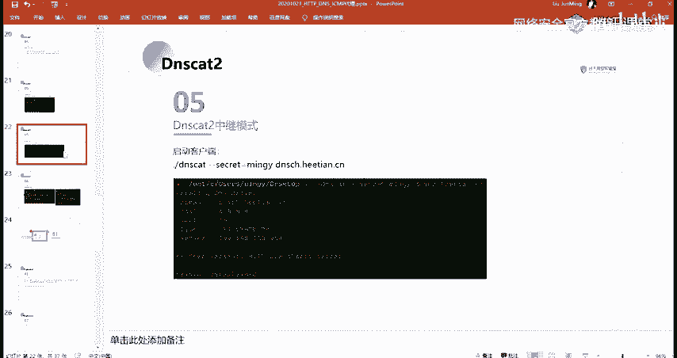

然后具体的一个效果的话就是这样子呃，我们实际来看一下吧。首先的话呃我这边直接复制了。

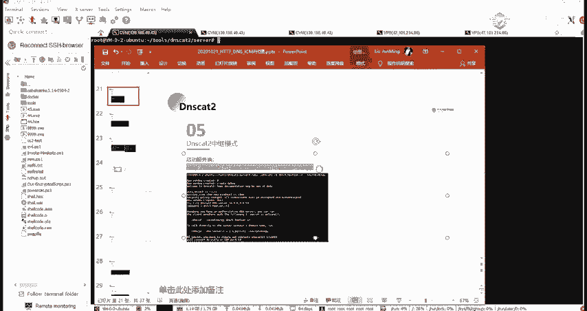

请问呢。打掉了，然后我这边执行之后的话，就是这样子是吧？

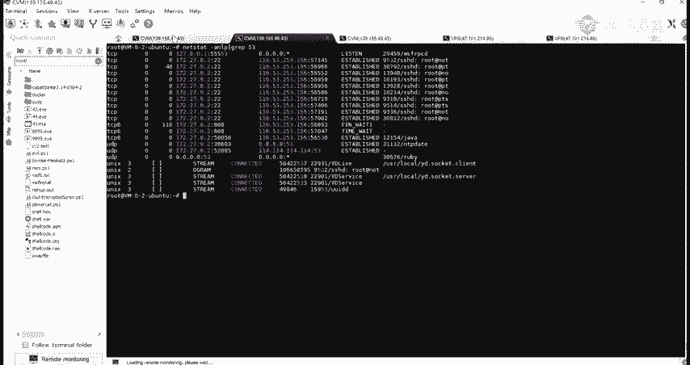

就服务端的话已经启动了。然后我们下面的话启动我们的一个客户端。

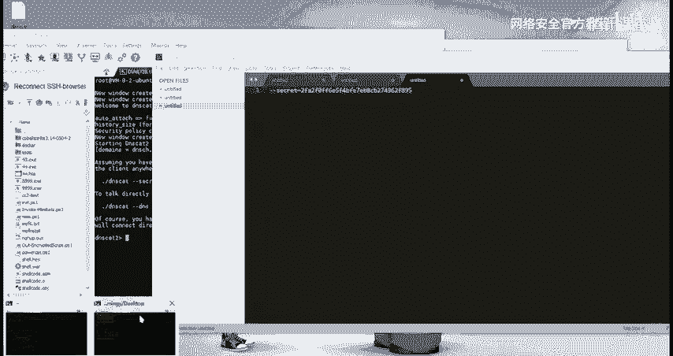

客户端的话，我就在我本地的这个。So。就这样子，然后可以看到在这边执行之后的话，它就呃。他就呃已经进行成功了，对吧？我们的一个筛选的话已经呃已经启动了。

然后我们在这边服务端的话可以看到在这边的话就得到了这样子的一个啊window windows这样子的一个控制台窗口，对吧？然后就是同样的一个操作。我们可以进付到这样子的一个控制台，对吧？然后执行渲要。

那需要之后的话，它就会得到一个呃命令控制。对吧，然后其实在这边他有这样子的一个。他有这样子的一个信息啊，就是我们这边的一个服务端方，就是执行这个需要之后的话，他会在这些客户端。

他会呃有一个这样子的一个就是得到这样子的一个命令控制的这个需要嘛，对吧？有这样子一个请求发送到了客户端，然后的话它就会启动一个这样子一个BSH的1个需要，对吧？以及它的一个需要的1个ID是这个610。

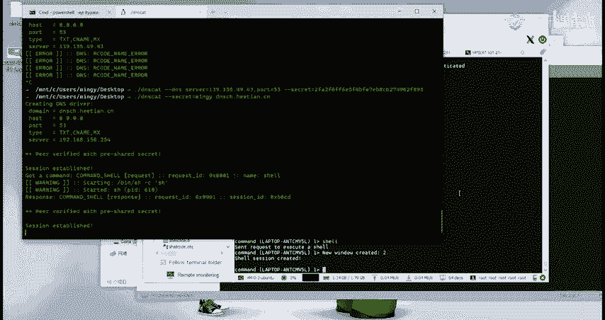

也就是到我们的一个服务端号，就是这一个2对，然后我们可以通过筛选刚刚。指定这一个来去进入到它的一个。啊，SH的一个线。我当前的目录话是这个是吧。嗯。这边的话那东西也很多。

🤧。去。

也就是我们通过这样子一个方法，的话已经呃成功的建立了这样子的一个呃。命令控制的一个通道，然后所采用的一个方式的话，就是这个DSK2的一个中继模式。啊呃其实大家再去做这个的话。

其实主要的一个地方话就是这边的一个玉米解析。你首先你要有一个自己的一个玉米，就你需要自己去买一个玉米。然后呃，其实我自己有域名，但是要备案了，然后我一直没备案，所以我这边的话是呃直接用的公司的。

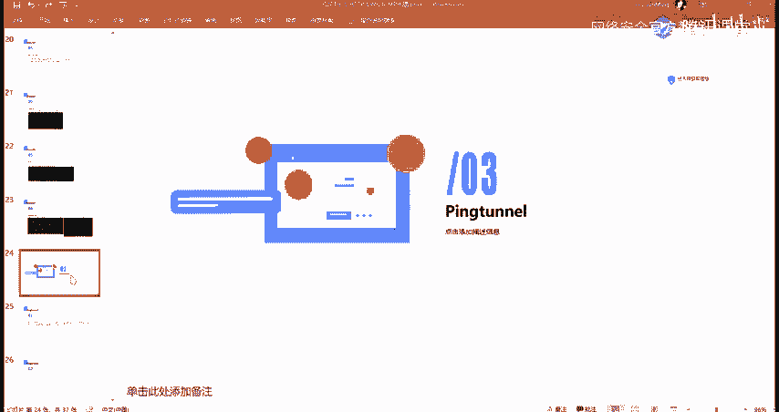

啊呃，其实大家可以就是如果大家自己在本地有的话，在本地有下有自己编译的这样子的那个DScat的话，呃，您可以就是执行这边的这个命令。我这边的话就能够去得到你的一个需，就有谁想试一下嘛。

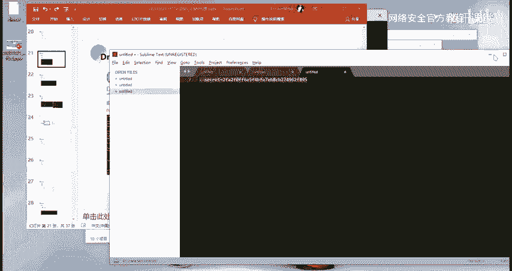

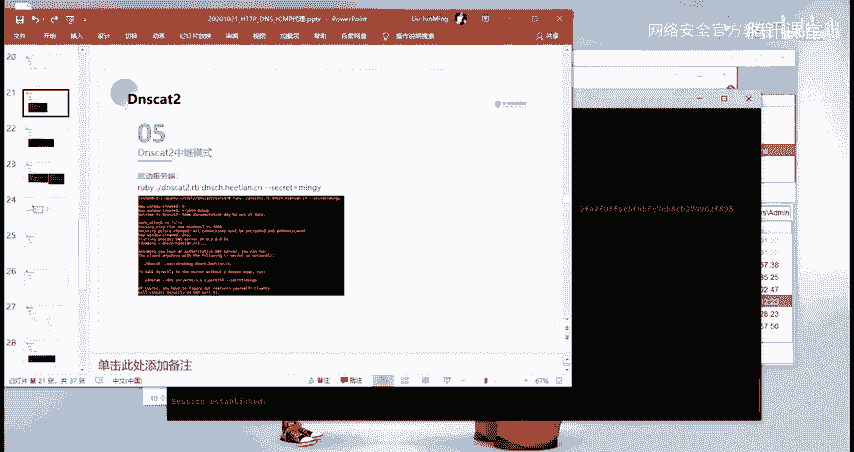

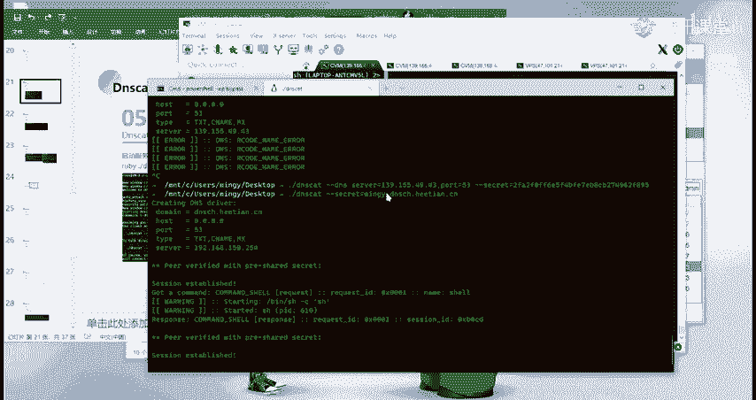

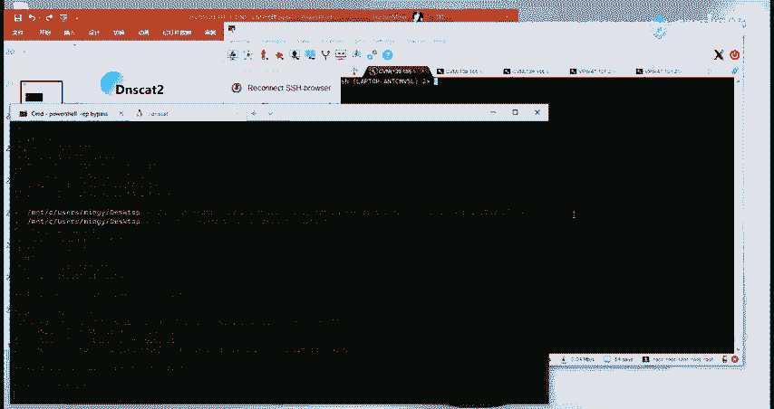

有谁想试一下吗？

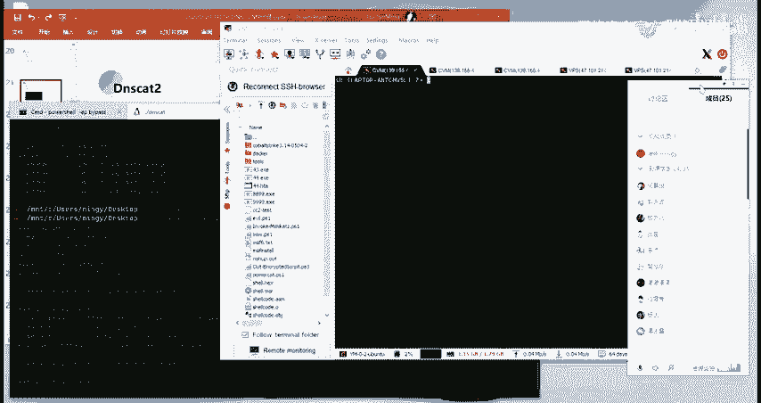

She。就之前之前这一个就可以了。Yeah。

呃，以上的内容的话，大家能能听懂吗？有没有什么疑问？

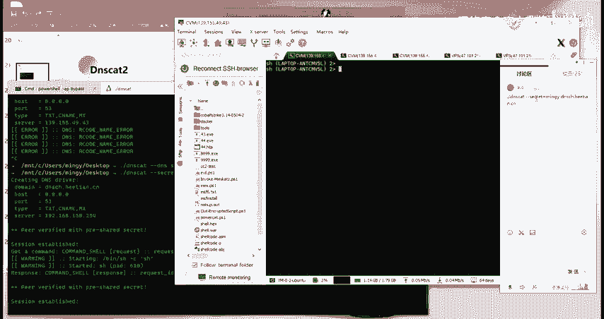

就关于这个DS cap呃，就是通过这个DS的一个呃方式啊。啊，其实在这边我们有进力连接，对吧？我们可以来查看一下它的一个流量。

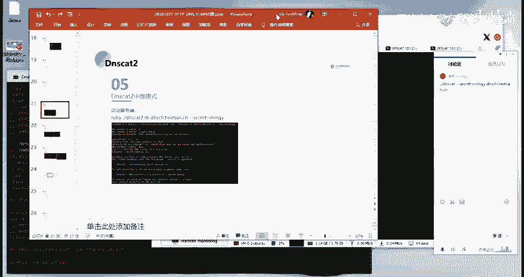

就是查看它的1个DNS请求的一个流量。我们这边的话可以通过TCPTCP调在linux下面的话呃就是。Oh。嗯，命令是什么来着？嗯。然后其实可以看到对吧？就我们在这边呃。

我这边的话就是通过DDCD调来抓取，就是呃访问端口，就是访问目标端口是我这边53的，就是我本地53端口的这样子的一个请求啊。

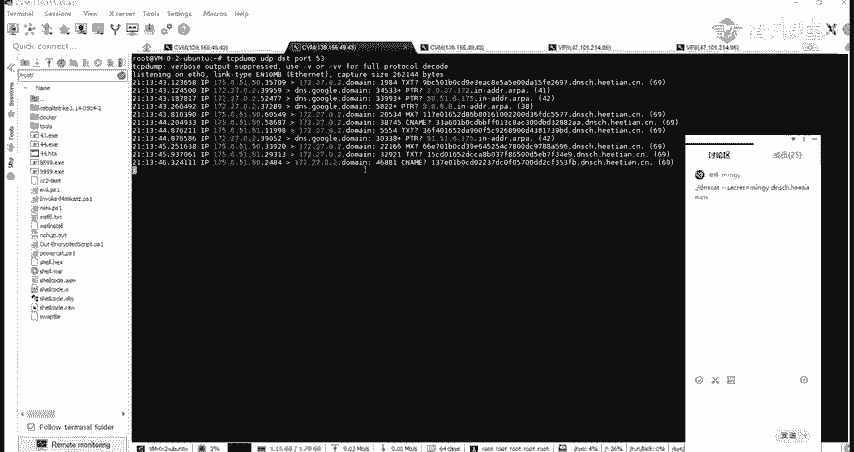

然后在这的话就能够去看到对吧？我这边先停掉，然后在这边可以看到有这样子的一些请求，啊吧，有像T textC name，还有MX对吧？这样子的一个请求。然后呃其实DSca的话，它的这样子的一个。

他再去选择这样子的1个DS解析的一个类型的时候。他是会像这样子，就是呃通过在这边它是这一些模式，他都会好不好，这一些类型它都会去就是随机的去那个像新内容啊texMX等等这一些类型。

它会去交叉的去去进行一个使用。然后在这边他去请求的一个数据啊，我们可以看到就是这边嘛，这边的话就是其实就是我们。所传递的这样子的一个数据，它在这边，然后他传递给的一个域名的话。

就是我们所设置的这样子的1个DS的一个域名，我们自己的一个域名，对吧？🤧然后呃其实大家也可以去试一下，就是那个直连模式。直连模式的话就是呃DSca它是会有这样子的一个关键的一个字。我这句话我就不尝试了。

大家可以自己通过这样子一的方法来去呃查看它的一个流量。Yeah。嗯。Okay。呃，大家有疑问吗？应该没有疑问吧。啊，有没疑问的扣个扣个一，有疑问的扣2。Yeah。就两位同学吗？其他同学呢能能理解吗？

你时不是从哪问起？呃，那那那你是。没理解吧。还是说又是呃要等自己操作。就是没理解。呃，哪里没理解呢？我可以再给你呃大概的说一下。Yeah。啊呃，你看录播也行吧，那那你看录播吧，然后有问题再问吧。好。

那么我们继续啊我们继续后面的一个内容。第三部分的一个内容。第三部分的话就是这个呃pin，也就是通过SMP隧道来做。来去呃反弹线来去建立我们的一个线。呃，在这边的话呃。先大概的了解一下。

就是SMP隧道的它的一个作用。就其实呃前面我们介绍的这一些，其实它都是有它相应的一个作用的对吧？首先第一个像我们的这个HTP的一个隧道。HTP隧道的话就是我们得到的它的一个服务，对吧？

它是像这种web服务，以及它的得到的这个机器的一个需有，它是只有像这种HTP的一个流量，或者说它只能从80端口来去呃访问外网，对吧？也就是只允许HTP这种流量的话，那么我们要去呃比如说我们生成一个码。

我们传上去，然后我们执行的话，是像这种TCP的这种流量，对吧？那么它是无法去呃连接到我们的一个呃服务端的。那么在这这在这边的话，我们就选择通过这样子的一个HTP的这样子的一个隧道。

因为我们通过的是它我们。使用的话是这样子的一个脚本。这个脚本的话，在它的一个服务端上面执行，对吧？然后他解释之前的话，他就能够呃跟我们这边的一个呃脚本的这一个客户端建行一个连接啊，建立连接之后的话。

来得到这样子的一个s的一个代理通道。然后其实这边的一个大眼通的话，其实是通过这边这边的1个HDP的一个协议啊来去进行的一个通信啊。嗯。这个的话就是这个HP带理隧道的一个作用。然后呃DSca2的话就是。

呃，因为我们通过前面的一些操作，对吧？能够去知道它其实是通过我们的1个DS的一个呃解析来去进行的一个数据的一个传递，对吧？那么在我们的一个实际的这种环境当中，对吧？它可能就是。

他可能就是他不允许像这种我们的一个呃。TCP对吧？TCPUDP的这种呃协议的这样子的一个请求数据的一个传递啊，那么我们。想要去得到它的这样子的一个需，对吧？得到这个机器的一个需。

以及把我能够去建立这样子的一个啊命令控制的话，那么我们可以通过这样子的1个DNS的一个它的一个解析协议。因为在呃在防火墙或者是说在内网当中的话，你要去进行一个域名的一个解析的话。

那么DNS的一个协议的话，它肯定是能够去被允许去呃进出的对吧？因为你要去你要你要去访问域名，那么你就需要域名解析。那么你要域名解析的话，那么你就需要有53端口。到。然后我们在这在这边的话。

我们就可以通过它的1个DS的一个域名解析来去建立这样子的一个隧道。来进行一个命令控制。然后的话到这边第三个的话就是呃我们通过某种方法，对吧？得到了一个机械的一个吸尔。但是这个希尔的话。

我们就不适合去进行一个命令的一个控制对。然后的话它的这个环境的话，又它不允许像TCPUDP，还有像DSHDP等等这种协议，它不能够出网。那么它只有就是只有只能够通过SMP协议去进行一个出网的话。

那么我们可以通过这样子的一个呃方法，就是来去建立1个SMP的一个隧道。然后呃在这的话主要就是通过介绍这一个工具啊，这一个拼train的一个工具来给大家介绍。然后这个工具它的一个一些参数的一个使用的话。

我这边也不多说，大家自己呃自己去了解，好吧，我这边的话其实。呃，都是中英文对照对吧？啊，不是啊，就是都是中文的对吧？中文大家都能看得懂嘛，就是以及参数它对应的一个意思。哦呃，首先第一个的话。

我这边的话就是有列举了这样子的三个例子呃，列举三。呃，下面的话我会以这样子的三个例子啊，就是给大家呃说明讲解这样子的一个呃IPIMP隧道的一个利用。首先第一个话就是这个SMP隧道去转发TCP来上线。

就是把我们的1个TCP的一个流量通过这边的1个ICP的隧道，然后的话做一个转发来去得到它的一个呃线来去进行一个命令控制。

然后具体的一个使用的方法的话就是首先第一步我们的1个VPS需要去启动1个SMP隧道的一个服务端，也就是用到我们这边的这个拼的一个工具。我这边的话。

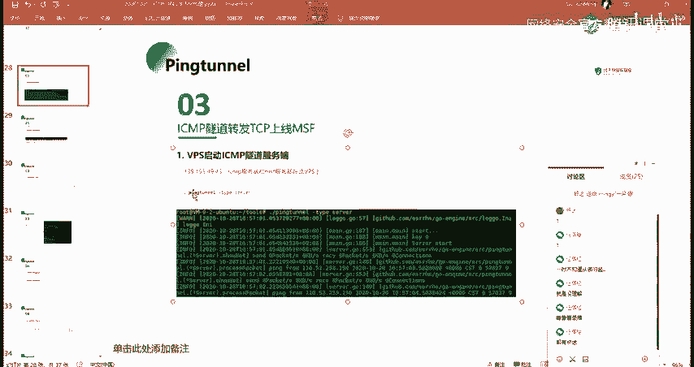

呃，在在哪里？Okay。就是这个。就是这个偏趣呢是这个。然后我们首先的话需要去通过那个评区老师。

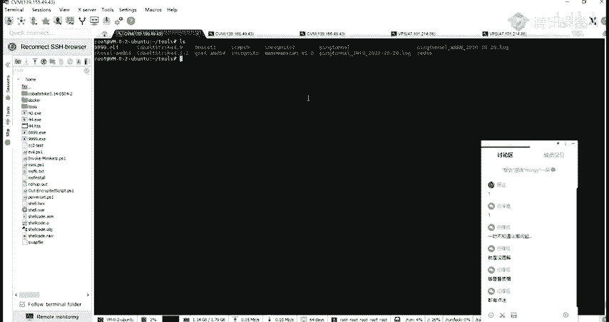

还去启动1个SMP隧道的一个服务端。

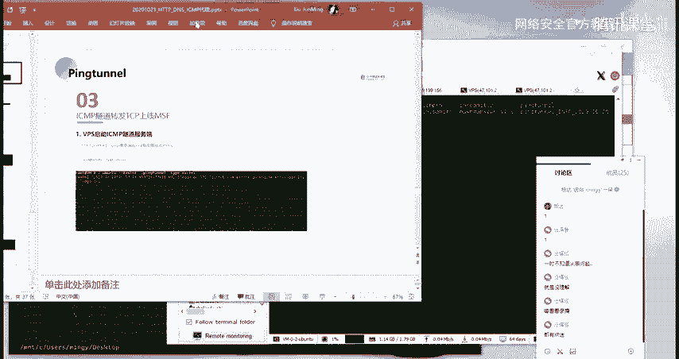

然后启动的一个方法就是像这样子干拼ts呃，其实他的你直接直前干拼ts，他在这边它有中文英文的一个对照，就是选项的一个意思啊。

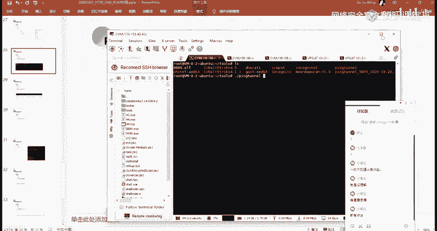

然后我们这边的话使用的一个方法就是gap type。来去指定我们这边的一个。

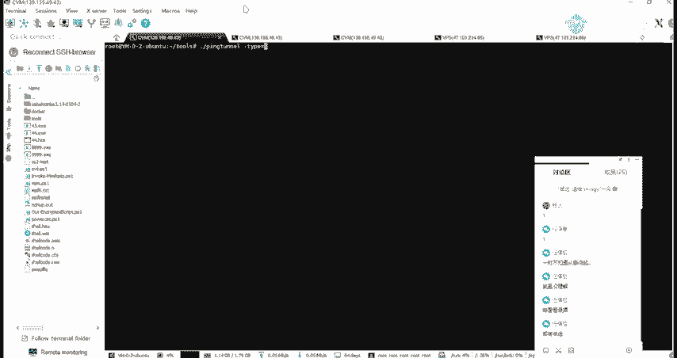

类型。类型的话，我这边的话就是s位，因为我是启动一个服务端嘛，对吧？然后如果说你是客户端的话，那么你干t指定的一个类型的话，就是服务端啊吧就是客户端。所以的话在这边其实看参数的话。

你会发现就是有服务服务参服务器的一个参数，对吧？还有客户端的一个参数。

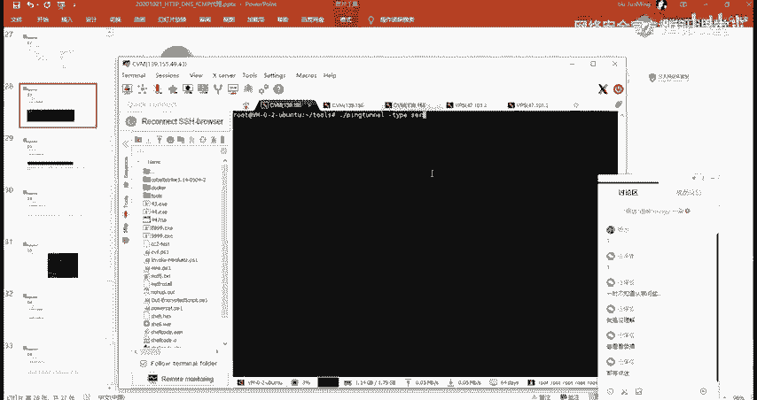

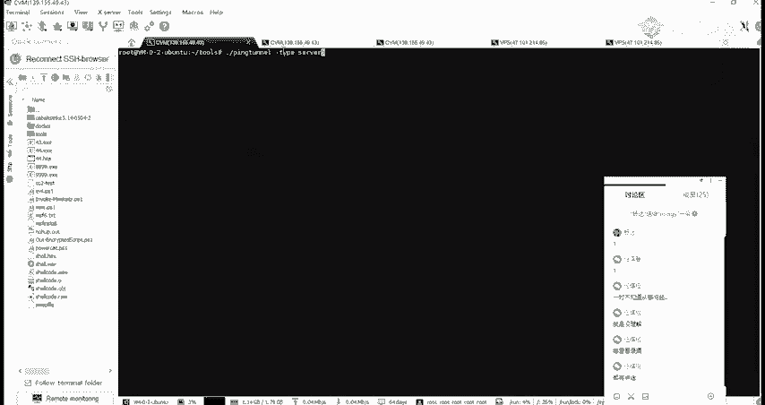

就是你呃如果你指定的一个类型，就干t，你指定是服务端，那么你可以使用这样子的一些参数，能够去有这样子的一些功能，对吧？那么如果是你是在客户端，你要去连接服务端，那么你可以使用这样子的一些参数。

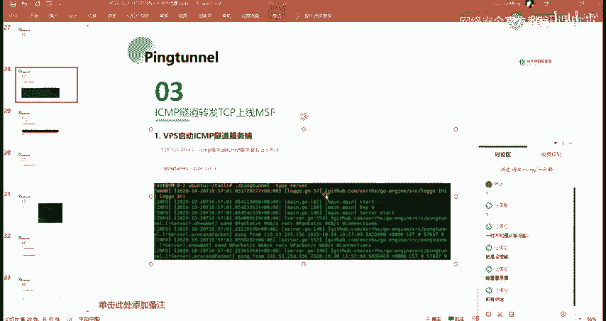

哦，呃在这边启动之后的话，就是这样子的一个效果。嗯。看。这边执行啊，执行之后的话就是像这样子。当然的话在这边的话，因为呃我们可以看到就是他这边有这样子的。

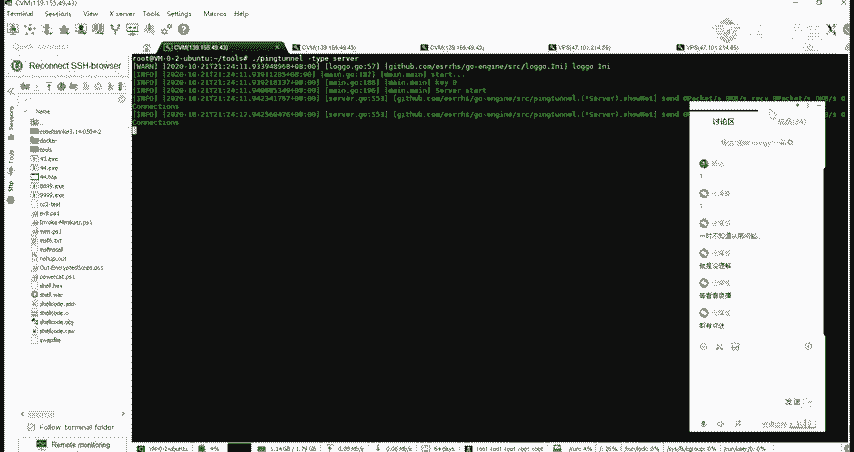

一些日志对吧？他在这边可以呃看到他是没有数据的一个传过来的对吧？就是零。然后呃这个时候我们来骗一下吧。我这边来骗一下这个IP。去。我这边天凉了。听股通，我是禁掉了。好。先看后面的吧。

就是等会的话会有数据啊。这边的话暂时没有。然后这边服务端启动了对吧？然后我们再把机上面启动我们的一个客户端。启动客户端的话就是呃我这边的话是。那个机器是哪。Mm。呃，这边我把它。

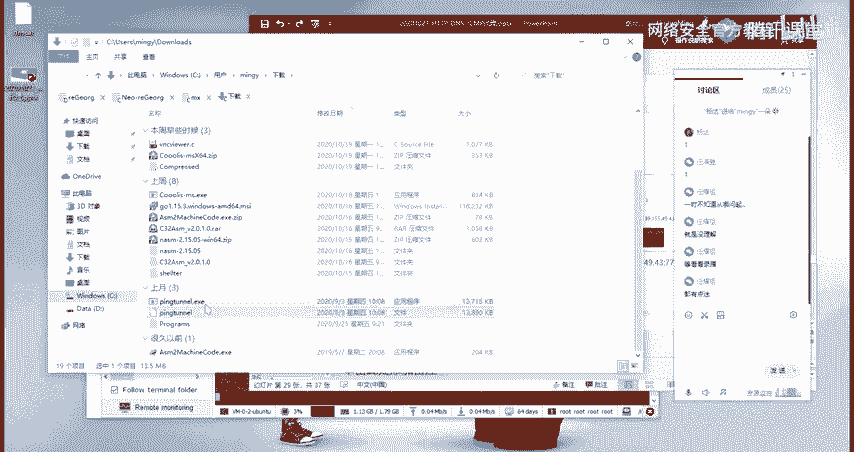

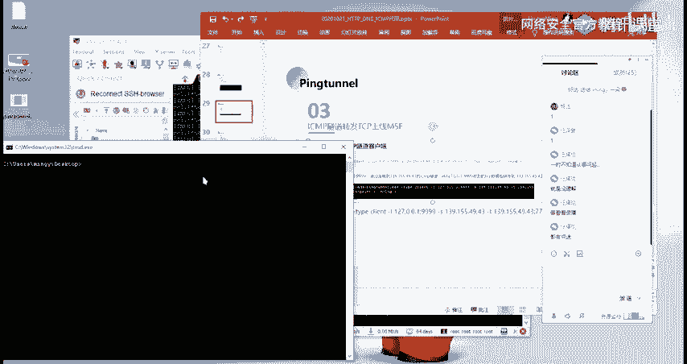

呃，客户端的一个启动面的话就是像这样的，我这边我就不。诶。不敲了，我直接复制粘贴。就像这样子。

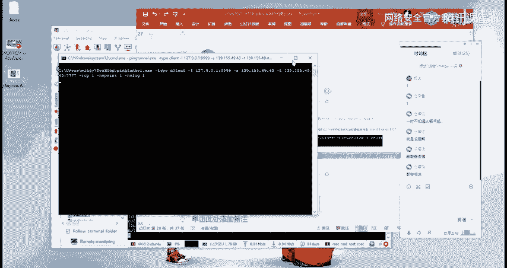

这边执行之后的话呃执行之后的话，他会来去连接我们这边的一个服务端。我们可以在服务端这边来看一下。然后你现在看的话，你就会发现它会一直有这样子的一个数据啊。

就是拼 from从我这边的这个IP这个的话就是我当前的1个公网的1个IP嘛。然后他来就是来聘了我这边，对吧？其实就是连接到我这边的一个服务端啊，服务端嘛，对吧？

然后其实前面的话它是没有这样子的一些数据的对吧？因为没有没有经去连接。然后现在经理您接到的话，可以看到它就是隔一个的话，它就会有这样子的一个就是聘啊，有这样子的一个聘的一个请求啊。然呃其实在这边的话。

就是大家如果不想看到这样子的这一些日志的话，就我们可以通过这样子的一个方法，就是像在这边啊客户端对吧？我们可以通过加这样子的两个参数，就ganno print及ganno log。

然后我们在这个话就看不到它的相关的这种就是连接的请求的一个日志啊。啊，呃，我们具体的来看一下这一条命令上的一个意思啊。

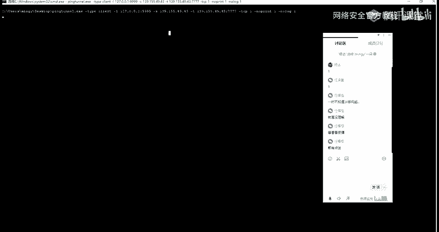

其实我这边PD话已经有详细的写了。就是我们这边的一个客户端，他会去今天我们这边的一个。

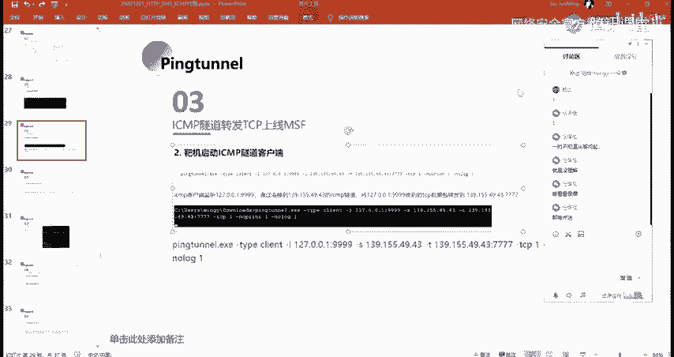

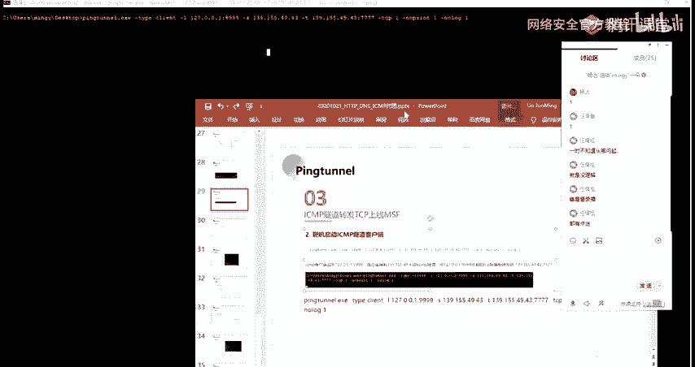

呃，这边的客户端，他会去监听本地的这样子的1个99999的一个端口，对吧？然后他今天这个端口之后的话，它会我们这边干S的话，就指定我们的一个pin server。

也就是啊这个啊拼仓的隧道的这个服务端的IP。

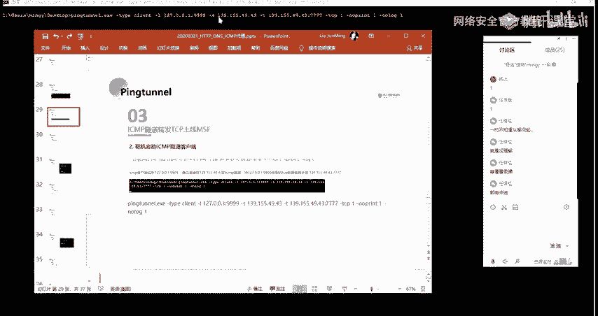

也就是呃我这边的这个IP。对吧，就是这边我服务到了1个IP。然后他会去进行一个连接，然后它连接之后连接之后的话，杠T的话就是他会将我们这边所收到的这样子的一个呃从这个99999这个端口。

所接收到了这样子的一个TCP的一个数据包这边杠TCP的一个数据包，把它给转到了我这边的这一个呃服务端的一个777的一个端口。然呃这边杠TCP的这个选项的话，看PPT吧，这边有有说对吧？

就干TCP就是设置是否转化TCP就默认为零的话，就是它是关闭的。

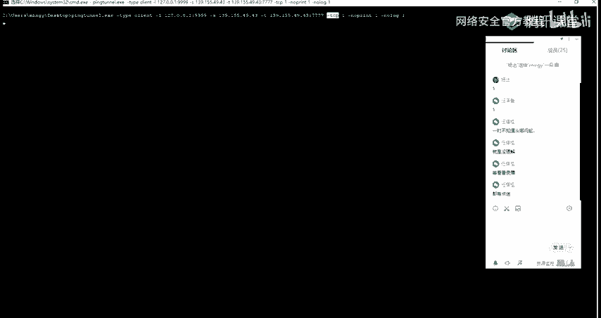

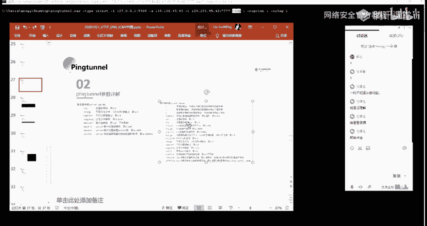

然后的话你要去启用它转换TCP的话，那么你要干TCP指定为一。同理还有其他的这些参数都是这样子的，就默认的话，它是都是关闭的。然后你要启用的话，就是这一个选项，后面接一个一，就是启用。

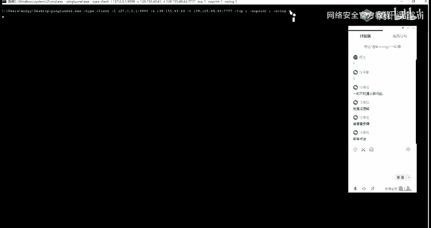

Yeah。那么在这边我们经理连接之后，对吧？我们要如何去得到需尔？

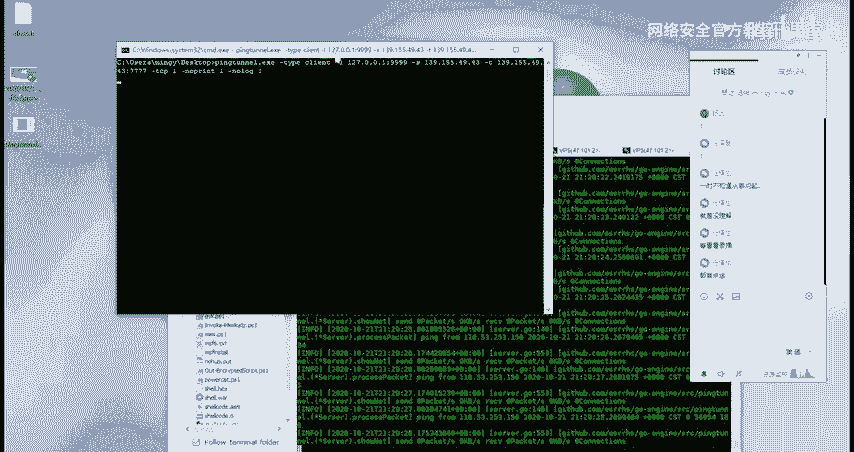

嗯。得到需要的话呃，在这的话我们通过MSF的一个方法。就首先的话我们MSF新生成一个法特希尔的一个配load。然后这个payload的话，它生成的话跟我们前面生成它是有区别的，要注意啊。

可以看到它的一个区不同的一个地方的话，就是我们这边指定的一个up host，也就是我们这边生成的这个payload的这1个EX这个程序，对吧？它去连接的1个IP以及端口。

它是我本地的这样子的一个IP以及这边的1个99999的一个端口。那么这边它生成的这1个EXE程序，对吧？它有什么用呢？也就是因为在这边的话，它是去反弹一个线，对吧？然后我们这边生成了一个配漏的。

就是指定那一个配load的是1个TCP的。

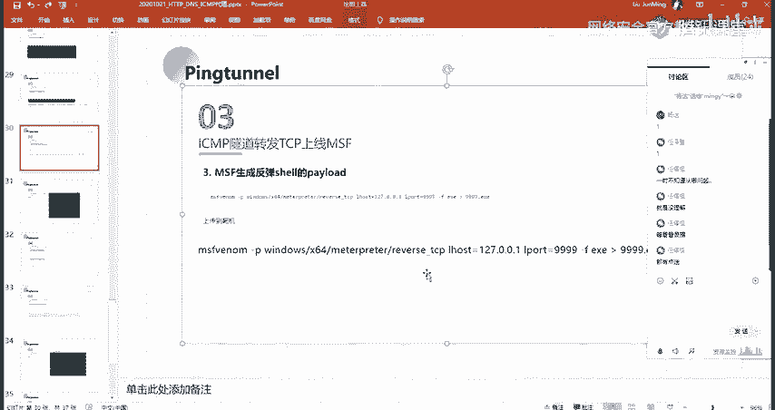

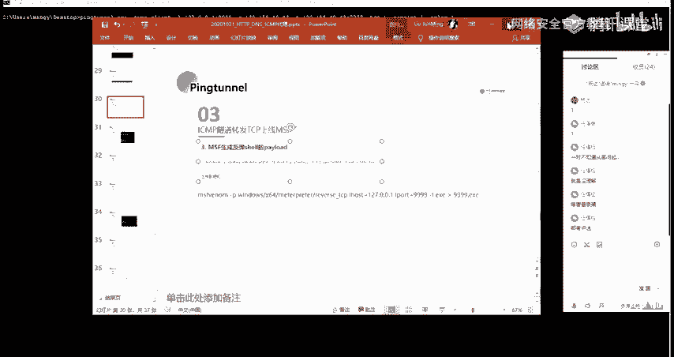

然后我们在这边生成的这样子的一个paload，它执行它在这边。

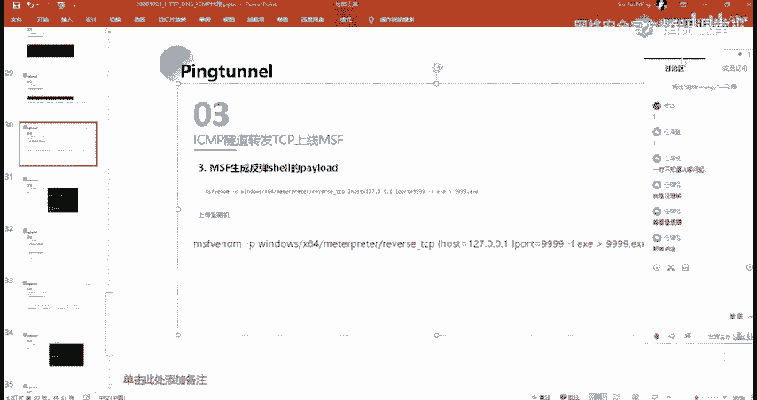

目标机器上面它执行之后对吧？执行之后的话，它其实是1个TCP的一个前奏。

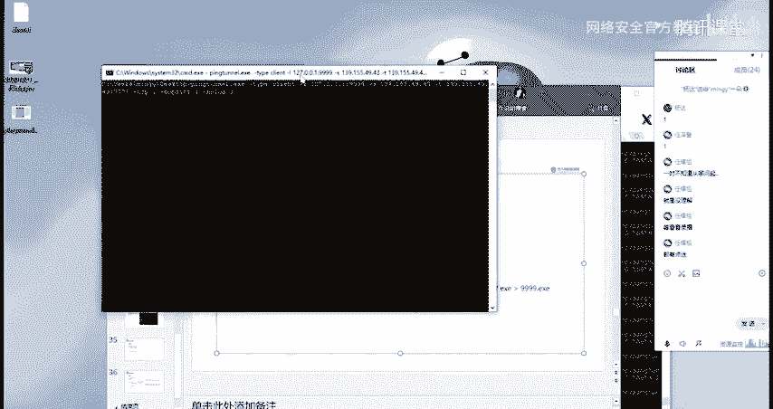

然后我们这边的这个环境的话，如果说你要去。

如果说你这边你要去连接的一个IP的话，是我外网的1个MSF服务器的1个IP以及端口的话，那么它是1个TCP的一个请求连接。而我当前的这个环境的话，它是不允许TCPUDP的这种协议的一个传输的。

那么所以的话我这边执行，就就是在目标机上面执行之后，也不会有也不会跟我们的一个服务端去建立连接。因为它的一个请求，它根本就是发送不出去。所以在这边的话，我们生成这一个的话。

它其实是像就我们的一个TCP的一个请求，它是其实是发送到了我们这边的一个99999的一个端口。那么这边这1个9999端口的话，就其实就是我们这边的1个ICMP隧道的这个所今天的这一个端口。

那么最后的一个结口的话，就是我这边执行。

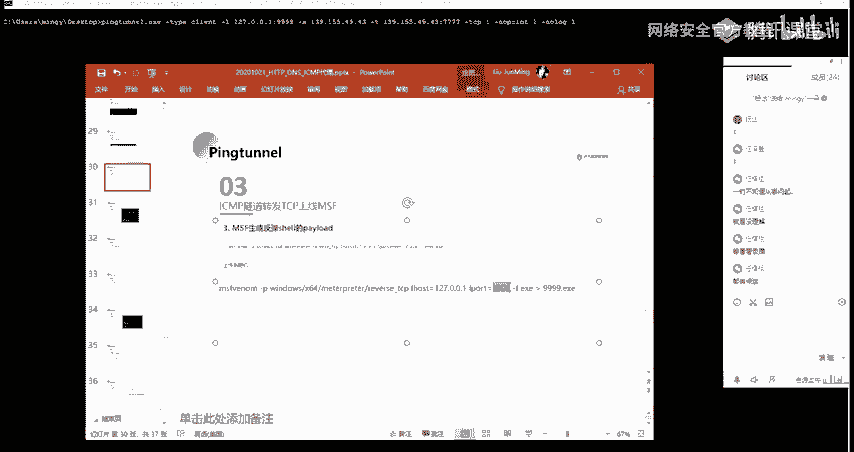

执行这个程序执行之后的话，它的1个TCP的一个请求对吧，它会去连接这边的1个9999的一个端口。

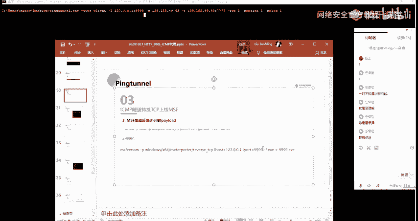

然后这边的一个呃，因为我们在这边的话，通过这个平仓的建立了这样子的一个SMP的一个隧道。然后他会把这边来自9999这个端口的1个TCP的一个连接请求，它会转到这边的。这里的这个IP以及它的一个端口。

然后这边的1个IP这端口的话，其实就是我们要去呃就是我们的1个MSF服务端所在的一个端口。也就是等待客户端来去连接的这样子的1个IP以及端口。

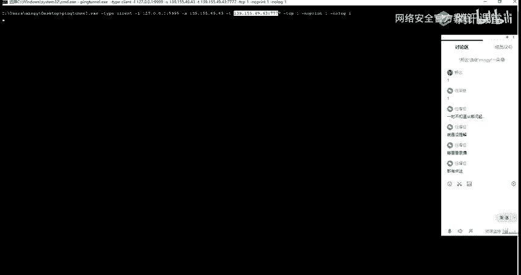

那么我们呃具体的来看一下直接的一个操作。我这边的话。

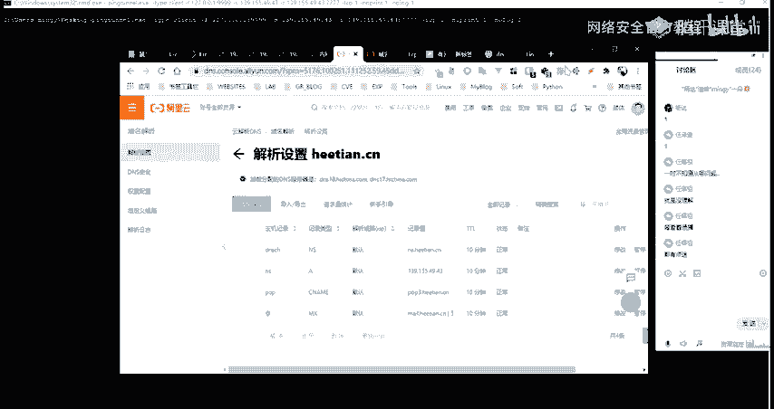

我这边重新来一下，就是不要这些日子了。他一直在刷有点多了。

然后呃现在的话就没有这一些这一些日志了，对吧，没有这些日志以及信相关的一个信息了。然后我在这边的话呃。

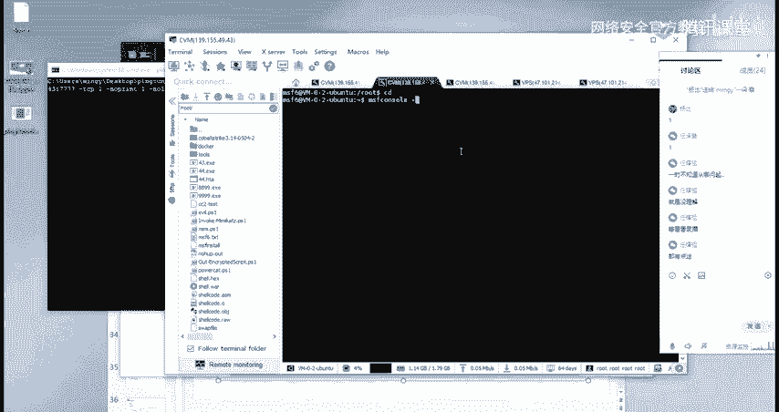

在这边的话呃，我这边的这一个服务器的话，有1个MSS的一个呃框架。嗯。啊呃，我们要去。

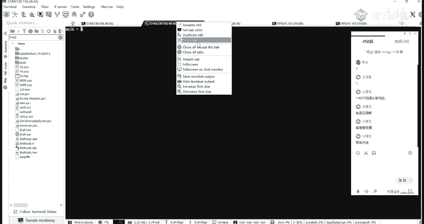

首先的话第一步的话，我们需要去生成这样子的一个payload。这边我直接复制啊，那个抢。嗯。Oh。So。开。系啊。我这边已经有了，我看一下，我这不生成了吧。哦，本地应该是有的，所以。

啊这里就这1个9999。没有。然后呃我们生成了这一个生成了这样子的一个配load的，对吧？我们上传到我们的一个目标机器上面去，然后的话执行。咨询的话，我们这边。之前之后对吧？执行之后的话。嗯，好。

我这边MSF我还没今天啊。Okay。嗯，我这边是开放的。这是我们的一个拍漏的。然后的话设置我们的一个。A hosts。以及端口是我们的这样outport。我们这边的一个端口的话，其实是呃这边。

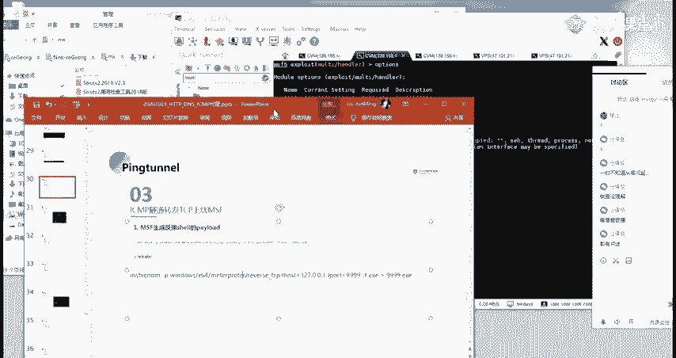

啊，就是我们这边客户端。

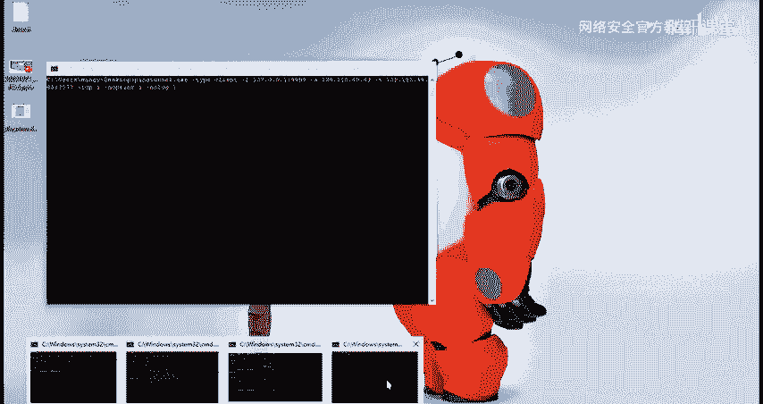

嗯，这边客户端对吧？他会把我们的个PCP的一个请求它的。转到我们这边的1个VPS的这个IP的这个端口。所以的话我们只需要去监听这1个777的一个端口，那么我们就能够去啊。

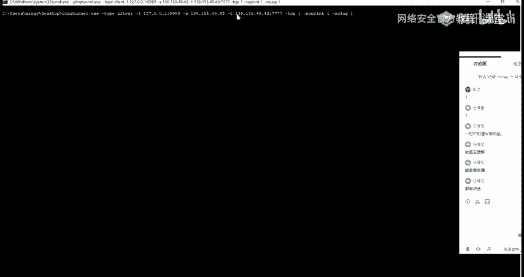

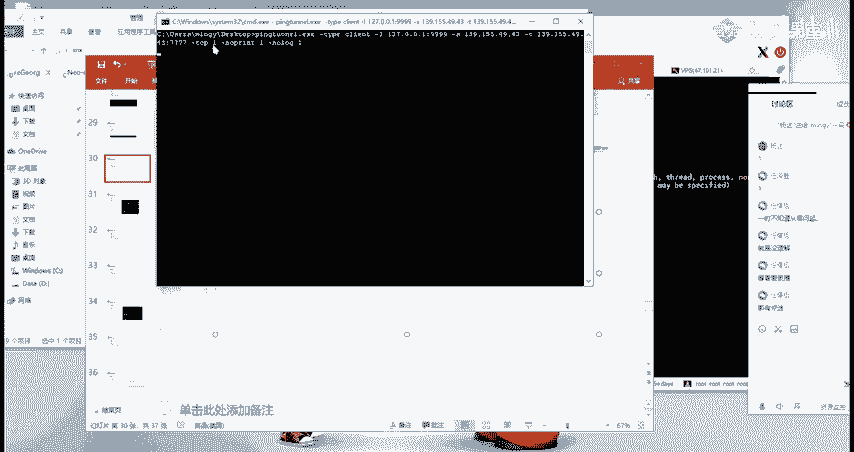

接收到来自呃客户端的这样子1个TCP的一个连接请求。

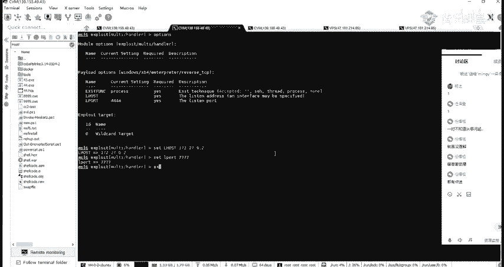

然后可以看到对吧？在这个的话就直接的建立了这样子一个筛选一啊。对吧。我们可以看到呃，因为我当前同是已经呃执行了，执行了之后的话，它的一个临接的一个请求，它会发到这一个端口。

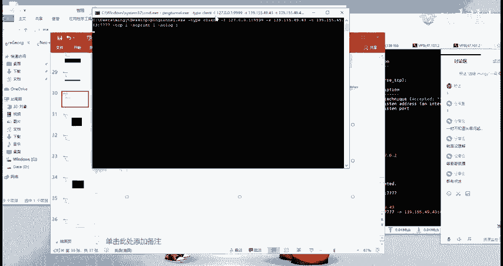

发到这边的1个999的一个端口，然后的话通过这边的一个pin，通过我这边的一个拼 server。然后他会把这样子的一个临件的一个请求，他会发到这边来，发到这边来的话，他会做一个转发。

然后的话转发到这边的这个IP对这1个IP的话，其实你可以就是因为我当前的话是这个拼serv狗跟我这个MSS的一个服务器都在同一个。都都是同一个服务器嘛，所以的话都是同样的对吧？

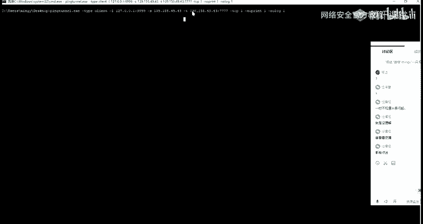

然后这边的话就是。转到了这个端口，然后的话这个端口的话就是我们MSF所今天的一个端口。

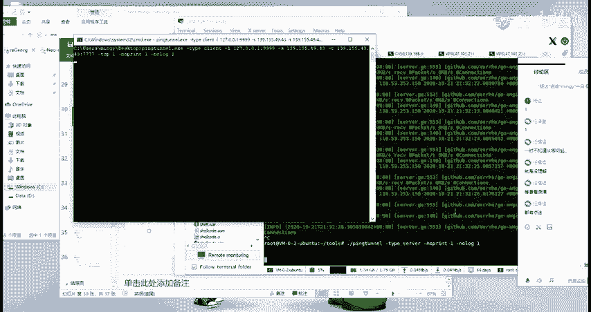

对吧然后的话就找到了他的一个三选。这这个31。进来看一下是吧？是我当前的一个主机。今年的话。

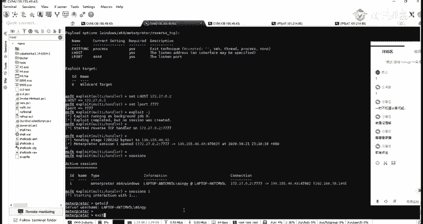

そうです。停亮。快滚滚。这个的话就是呃第一个就是通过SNP隧道来去转发我们的1个TCP的一个这种请求的一个连接。然后的话上线到我MSF。然后结果的话最要的结果的话就是像这样子。

然后第二个的话就是SMP的一个隧道来去转化我们的一个stocks。还去上线。啊呃我们知道说死他其实呃。也是通过TCP的一个那个。请求的一个协议，对吧？然后的话在这边的话呃，它的这一个利用的一个方法的话。

就是主要的话就是在这边的话，它会有一个不同的一个地方，就是我们在这边去生成这个payload的时候。就我们前面去生成配的话，呃，有很大的不一样。

因为我们这边要去实现的一个目的是呃通过ss的一个方式来去转发我们的一个socks的一个这样子的一个呃，就是通过socks代理的一个方式来去转发我们这边的一个请求啊。呃，然后首先第一步的话都是一样的。

就是启动我们的一个服务端。然后启动之后的话，我们的一个把机要启动我们的一个客户端。这边的启动客户端的话呃，跟前面的话它的一个不同的一个地方啊，就是这边多了这个干ss的一个参数。

这边的这个干ss的一个参数啊，就是启用我们的一个ss的这样子的一个呃，看一下。Yeah。开启我们的一个s5的一个转发。然后我们在这边嗯。不不。我们在这边执行之后对吧？执行之后的话，他做了什么呢？

就是我们这边的一个客户端，它会今听我们本地的1个99999的一个端口。然后这个端口的话，它其实就是启动了一个sox5的一个服务。然后这个ss5的一个服务的话。

它会等待就是我们的一个呃我们的一个payload，也就是我们在这边所生成的这个payload的一个连接。然后在这边的话就是呃。

如果这边这边的一个payload它连接到了我们这边的一个客户s的一个服务端之后，对吧？连接之后的话，他会把他的这样子的一个请求。

他会通过这边的1个SMP的一个隧道来转发到就是转发我们这边的一个s的一个代理的一个请求到目的地址。这边目的地址的话就是这个我这边的一个呃MSFMSF服务端的呃8899的1个端口。

然后这边的1个8899端口的话，其实就是我这边。我这边MSF所生成了这个配load的话。他去进行的一个连接的话，它的一个呃IP以及端口就是我们这边所设设置的。然后呃我们来具体的来看一下。

首先的话我们把机启动我们那个客户端嗯，我这边。这边复制一下。啊。把机执行的一个命令的话，就是这里。这一个。啊，不是是这。嗯。这样。这个。诶。七七八八。我条笑话。搞咩。啊呃。

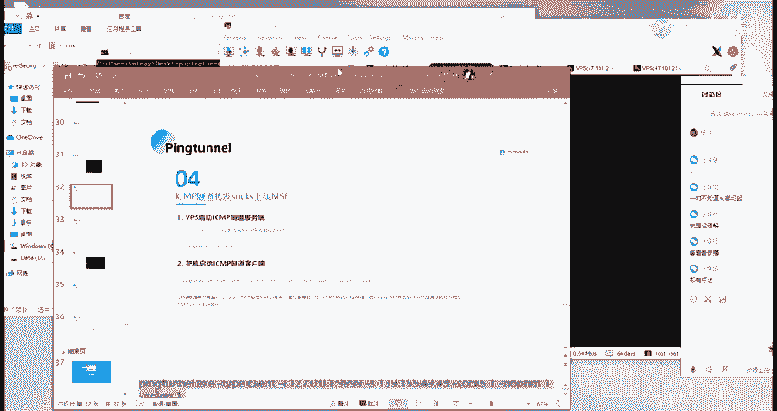

因为我这边的话，这边的一个服务端的话已经起来了，对吧？然后我这边的一个客户端的话是这样。

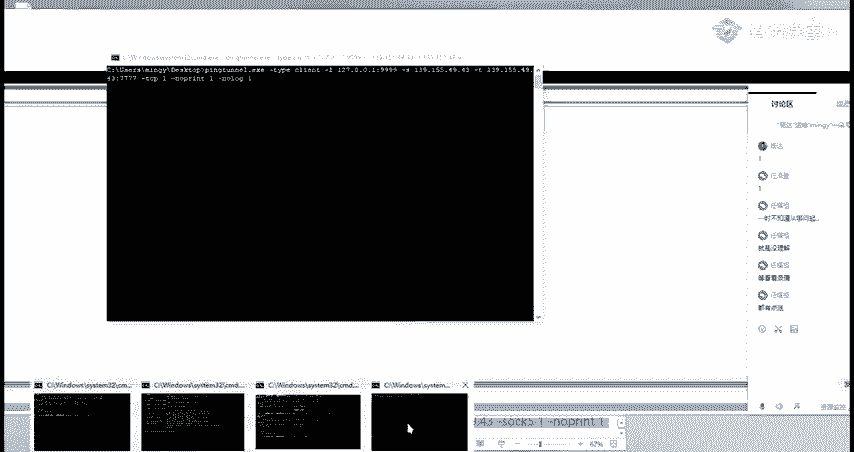

这里是吧。然，我执行。启动我的一个客户端。启动之后的话，它会在本地去今听这一个端口，对吧？然后它不仅今天了一个端口，而且它开启了一个说指的一个服务端，就是它是在这一个端口。然后这边开启之后的话。

我这边通过MSF生成了这样子的一个payout。

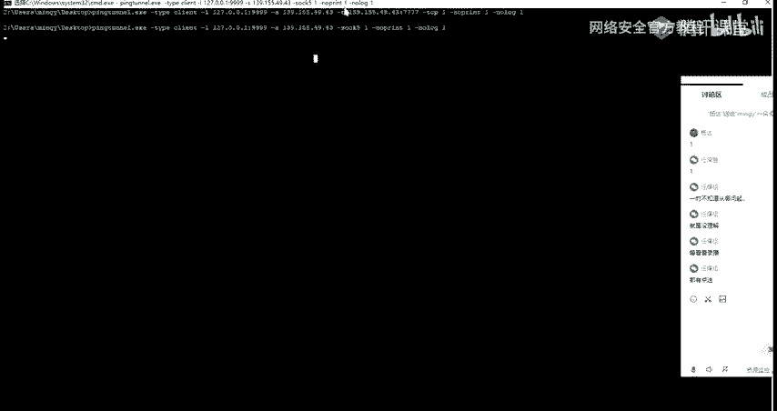

呃，在这边的话，我们来看一下这边的一个生成课的一个命令。就是首先的话就是指定这一个payload嘛，就是跟前面是一样的对吧？

然后我们那个 host要注意的话是指定不是像我们前面指定本地而是指定我们这边的这一个呃这边的这一个MSF服务端。

就是这边MSF服务所今天的这所经天的这样子的一个端口啊不这样子的一个IP以及它对应的一个端口。然后的话在这边的话有多了这样子的三个参数，就这个HVpro type以及还有host，还有port。

其是从字面意思的话，我们也能够知道就是在生成这个payload的时候，它指定了这样子的一个呃s的一个代理类型。然后它的一个连接的一个IP。就是它生成的这一个paload。

它会去连通过ss的一个通道去连接这边的1个IP以及端口。

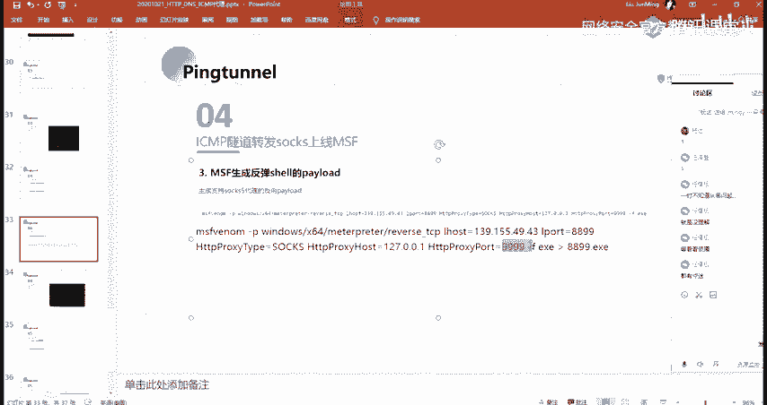

然后这边的1个IP端口的话，其实就是我们这边通过这个偏仓的说今天的这个ss服务端所在所在的一个端口，对吧？然后在这边客户端它执行之后的话，它就会与我这边的一个ss的一个服务端进行连接。

然后的话我的一个请求的话，它就会去呃通过这边的一个连接。它会通过我们这边的1个SNP的一个隧道，把它给转到我们这边的一个IP以及对应的一个端口上面去。

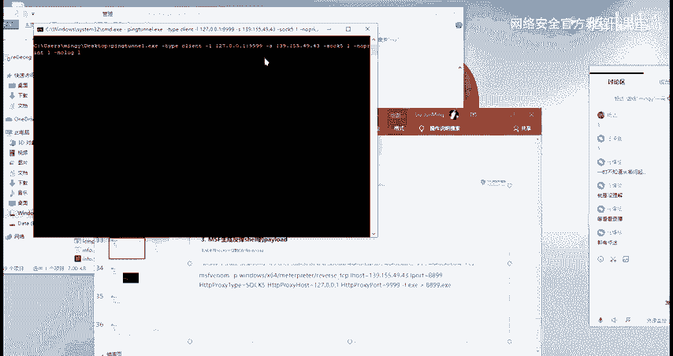

我这个的话我就不重新制那个了，我这边已经呃也生成了这样子的一个。我就不再重新去生成了。然后我这边只在他们SF上面做一个监听。

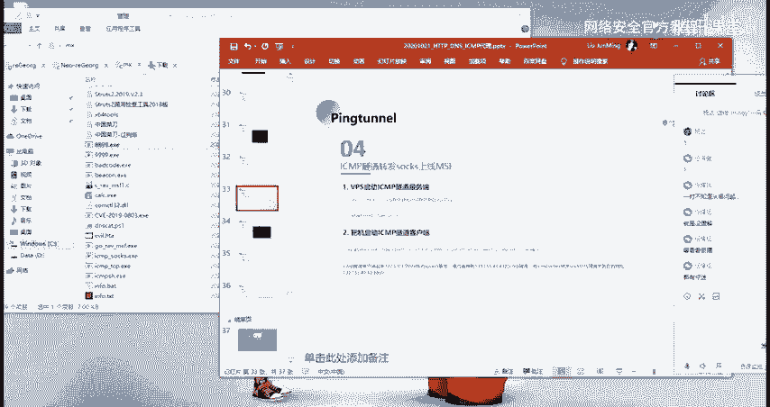

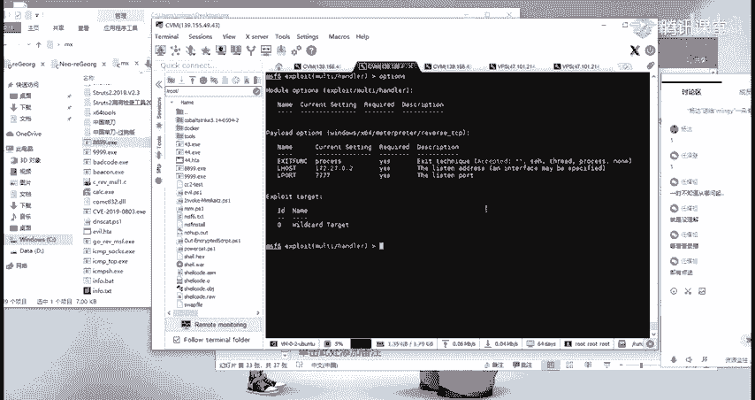

就是设置我们的一个然port的话是。8899是吧？Yeah。今今天这1个8899的一个端口。然，今天之后的话，我再进行执行，执行这1个8899。

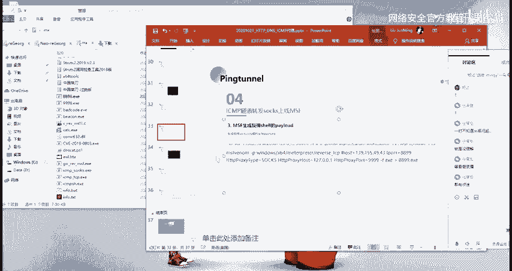

然，我们看这边。可以看到我这边执行之后的话，他立马的话就得不到这样子一个序。对吧。就是一个筛选啊。这是第二个。

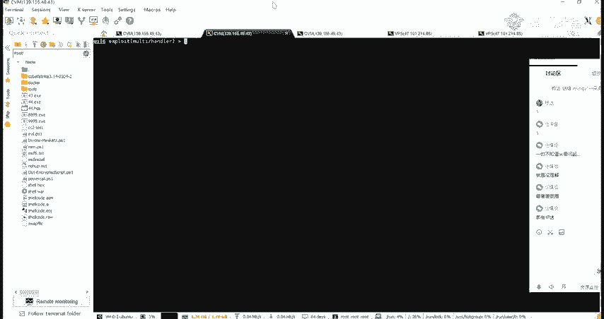

。Yeah。就其实它的一个呃它的一个与使用的这样子的一个方法，跟前面的第一个其实是类似的对吧？你会发现。然后只是的话。

它的一个在这边的话跟前面的不同的地方的话就是呃它转发的是我们的一个ss的一个这样子的一个请求啊，不ss的这样子的一个代念。然后呃第三个的话就是这个SMP隧道转发。呃。

转发GCP上线CS就其实CS跟MSF的话都是类似的吧，对吧？然后呃具体的一个的话，我这边就是列出来，话就是给大家作为一个例子嘛，就是大家再去碰到这个，对吧？你想要转到CS就转CS嘛。

你想就你哪个用的顺手的话，你就呃转哪个嘛。然后呃在这边的话，它的一个步骤的话跟前面其实类似啊，就是启动服务端。然后的话把机启动客户端。启动客户端的话，在这边的话呃，它的一个配置的话也是类似的。

呃命令的话是一样的。同样的开启TCIPTCP的一个转发。然后。不同的话就是在CS客户端上面的一个配置啊，服务端的一个配置。我们首先需要去创建这样子一个list，就是一个今听器。

创建的这个今听器的话就是呃。它的一个配置的话就是像这样子，就是我们的1个HBPS的1个house。注意的话是选择我们的一个本地以及这边的一个都是我们的1个127。0。0。1啊。

然后还有的话就是这边的呃HP的一个port，以及我们的就是CI的一个port，以及班德的一个port。呃，关于这两个的话，在这边有解释。就是host，还有port的话，就CI的一个port的话。

就是我们SMP隧道这个客户端所今天的1个IP及端口。也就是我们的1个CI的一个连接的话，它会呃。它会就是连接到我们这边的1个8899的一个端口，对吧？

然后的话呃这个port这个ban的话就是为转发的一个目的地址的一个端口。然后在这边他建立了它与我们这边他连接到了我这边的1个8899的1个端口之后的话，我们做一个转发。

把它转发到我的1个777的一个端口。然后这边的一个77的一个端口的话，其实就是我这边的一个呃。今天器的一个那个。就是接受谢尔的这样子的一个端口。对。因为我们在这边呃。没问题啊。

然后的话我们需要去生成这样子的一个反向配load。然后这边payload的话就是呃minux啊我windows上的话就生成这样子1个EXE嘛，对吧？然后我这边64的话就勾选这个64的1个Pload。

然后生成之后的话，我们执行执行之后的话就能够去得到这个选。呃，这边的话。看一下我这边生成的是在哪。嗯。那是。生疼是搞忘了生疼呃，这边。这边还需要我去操作吗？哎呃要不大家自己客后去操作吧，好吧。

就作为一个课后作业。嗯。因为我这边的话呃包括截图啊，以及命令的话都已经给给出来了。对，都已经都已经详细的给出来了，对吧？应该没有什么问题啊。大家呃以上的话就是我们本节课的所有内容啊。

大家有没有什么问题啊？没有问题的话，那么我们本节课的话就到这边就结束了。呃，有问题的呃，没问题的扣一，有问题的扣2，然后呃自己扣后去做的扣3。🤧OK呃，那应该都是就暂时性没没有什么问题了啊。

然后的话大家自己课后去尝试吧。然后课后作业的话就是把我PPT上面的这一些内容的话，都啊自己动手去操作一下，好吧。因为这些东西的话都是需要你自己去操作的。然后还有就是关于这个DDNSca的这一个。

如果你没有域名的话，你可能你做不了，对吧？就这一个的话就呃这个的话，如果你没有运名的话，你可能做不了的话就呃。就不硬性要求你们那个吧。当然的话如果你想做的话，那么你可以自己去买一个域名。

当的话你呃就是你在国内域名的话都要备案的。

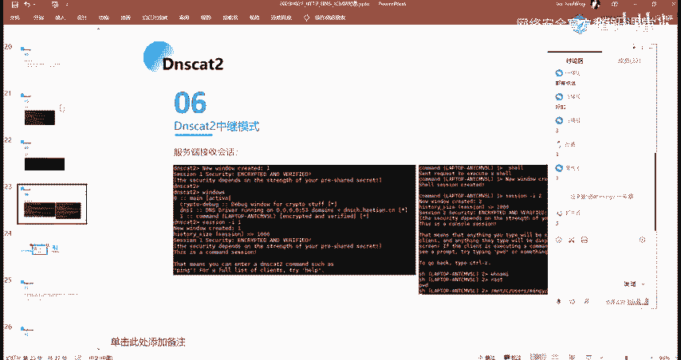

就比较麻烦吧，就好吧。好呃，那么本期课的内容话就到这边就结束了，大家早点休息。好吧？有问题的话，呃，明天问我吧。好，大家呃下课。

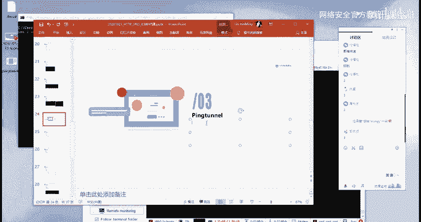

Yes。

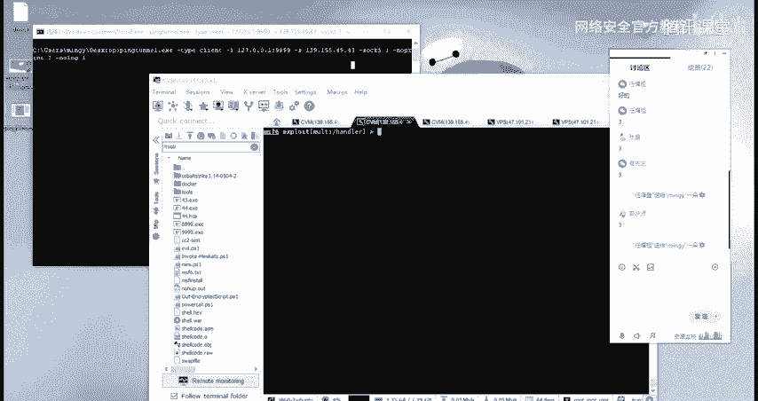