# B站最全网络安全教程，整整1300集，全程干货无废话，别再盲目自学了，看完学不会我退出网安圈！（web安全｜渗透测试｜内网渗透｜CTF） - P91：90. 第四十天：Windows提权信息收集、内核漏洞提权.mp4 - 网络安全官方教程 - BV15u4y137cQ

🎼哪里到。🎼老人已步再奔忙。🎼听到心也不再轻风。😊，🎼我们相约老地方。😊，🎼到记忆只剩金华，等到笑容无产伪装。🎼我们相约老地方。😊，嗯。🎼等到释怀所有悲伤，等到体谅，世事无常。🎼我们相约老地方。

🎼到记忆只剩金华，等到笑容。🎼无成为弱。🎼我们深渊。🎼到释怀所有悲伤，等到体谅，世事无常。🎼我们相约。🎼あり。🎼Yeah。🎼。🎼Yeah。🎼Yeah。🎼The。🎼Yeah。

🎼如果早知道那天是我们最后一面。🎼我绝不会和你谈论索事，浪费时间。😔，🎼人身离开似偶然，却又必经的告别。🎼不约而日。🎼无人可免。🎼又一回只剩某个似曾相识。😔，🎼风凛凛。🎼独回望旧思千尘。

🎼是以往的我充满怒愤。🎼无告与指嘲，积压着满土气不忿。🎼反应实为着紧。🎼受了教训。🎼如经的只有。🎼愿已看得透，不再是困。🎼难觉有分数。🎼不再像以往那官奔。🎼没旅痕。🎼轻快笑着吧。🎼总住对你呼喊。

🎼是错永不对，寻永是真。😊，🎼没发的。🎼妄想我滚凡。🎼一て。🎼相信沉默是。🎼是非两共美。🎼生我。🎼大人。🎼遇上那风雨又太认真。🎼自信满心里，有你。🎼你怎么听。🎼笑骂游人咋血地早。🎼。

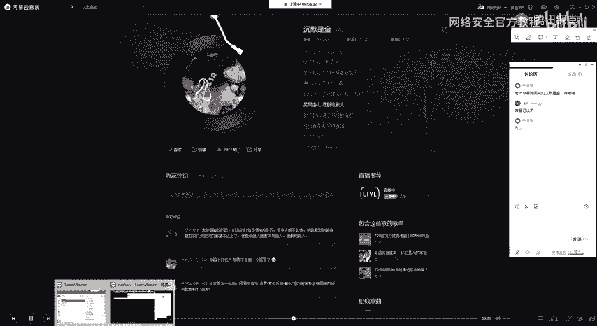

🎼三年交分。🎼去经彼此。

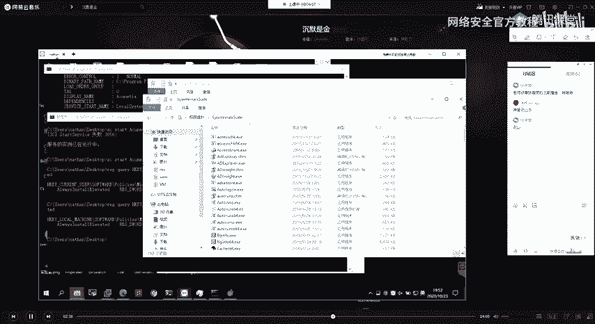

🎼仍已看不透。🎼再一花。🎼但各有分数。🎼再像以往那般笨没泪痕。😊，🎼轻快笑着。🎼The明。🎼举定咛。🎼我空。🎼是错永不对。🎼看0起车。🎼你怎。🎼安守我。🎼你总。🎼相信沉默少。🎼是非有功里身。🎼放的样。

🎼遇上那风雨又太认真。🎼自信满心里。🎼会讽刺雨执，笑骂游人洒脱地纵有。🎼少年人。🎼所决定总难。🎼继续行。

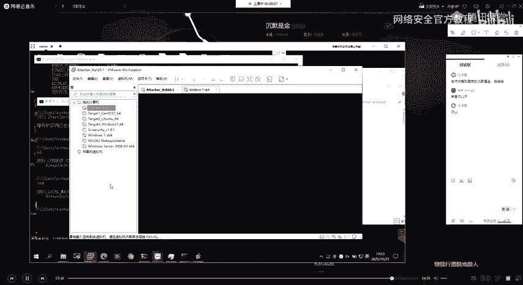

🎼洒天了。

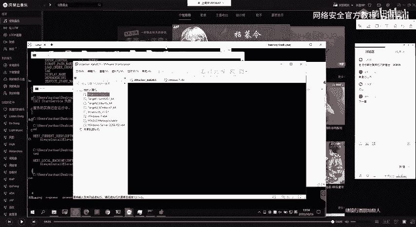

Ba you。🎼爱被。🎼，🎼Okay。

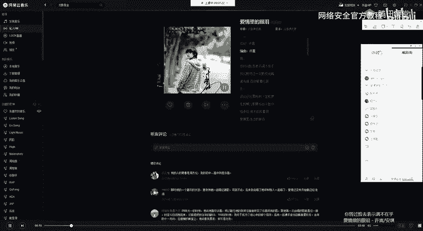

🎼你转过脸去，表示满不在乎，我沉默亏见一切熟视无睹，成晚将，各自躲着吃苦。

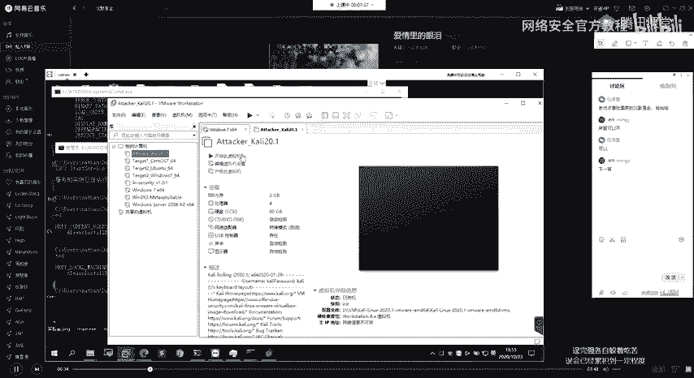

🎼误会已经累积到一定程度，走到哪儿都要换出个胜负结束好。

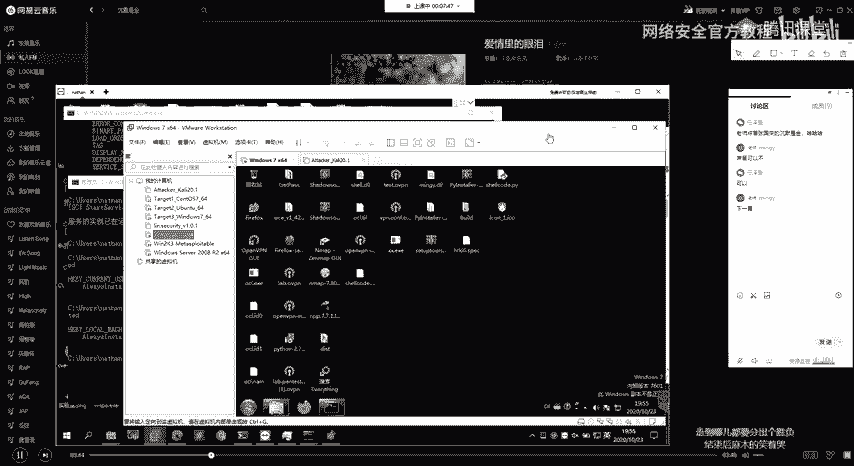

🎼不的下。🎼哭。🎼爱情泪流。😊，🎼流过的爱世间慢。

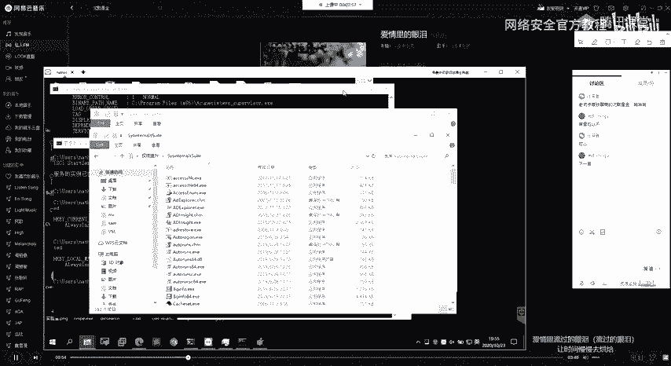

🎼被惩发出任性的韵味，让我们好好体会。

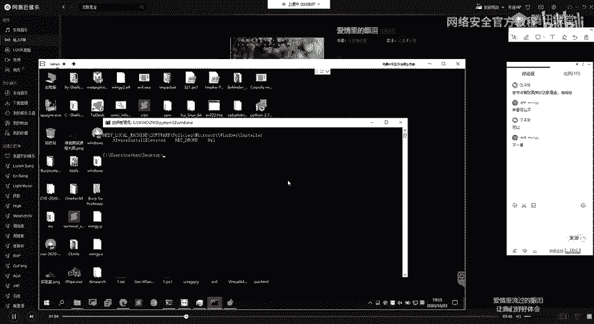

🎼爱情泪流。😊，🎼的眼泪从刻骨变得。😊。

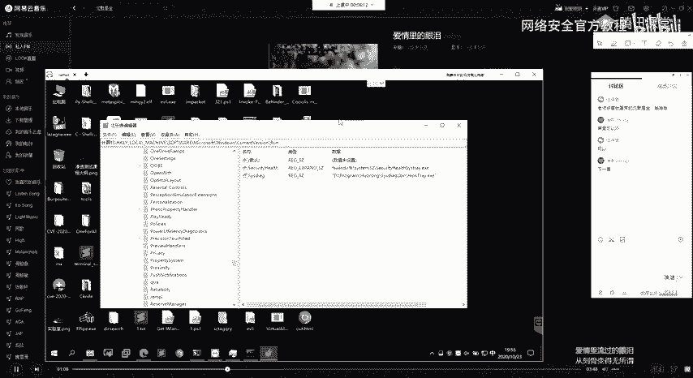

🎼那些快。

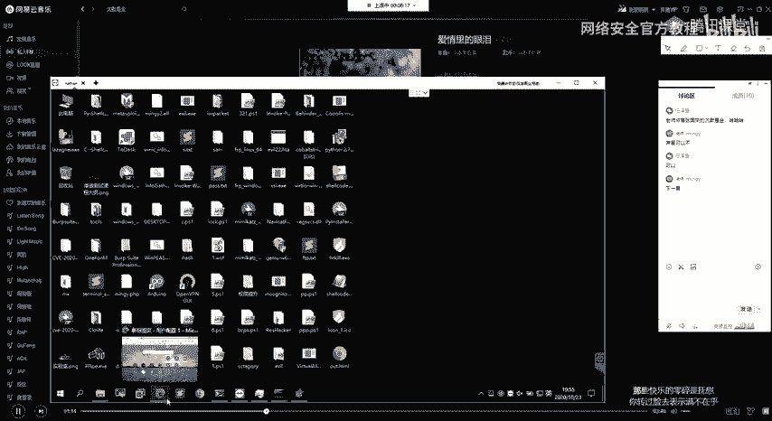

🎼零碎是否会。😊。

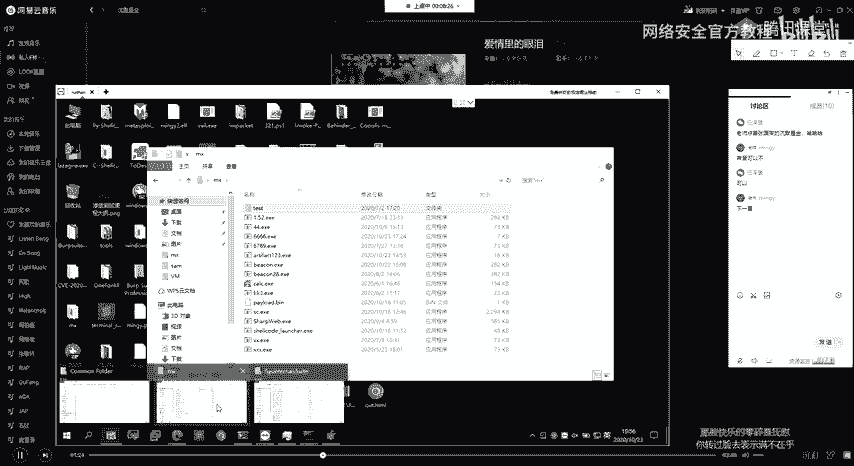

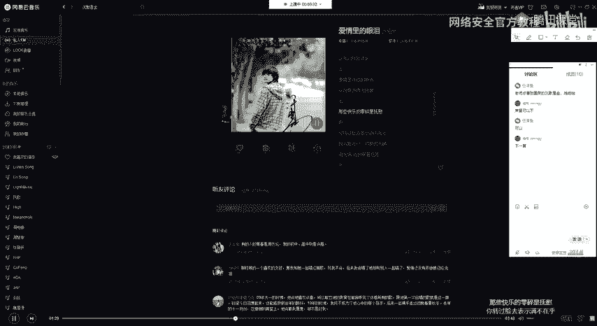

🎼你转过脸去，表示满不在乎，我沉默对这一切熟视无睹，成晚强，各自躲着吃哭。

🎼无畏已经累积到一定程度，走到哪儿都要翻出个胜负的束好。🎼的下。🎼爱情里流过。🎼的眼。🎼过让时间慢慢去。

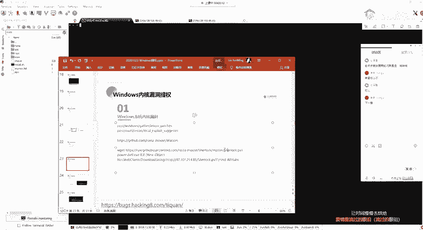

🎼蒸发出任性的韵味，让我们好好体会爱情没流过的眼泪。

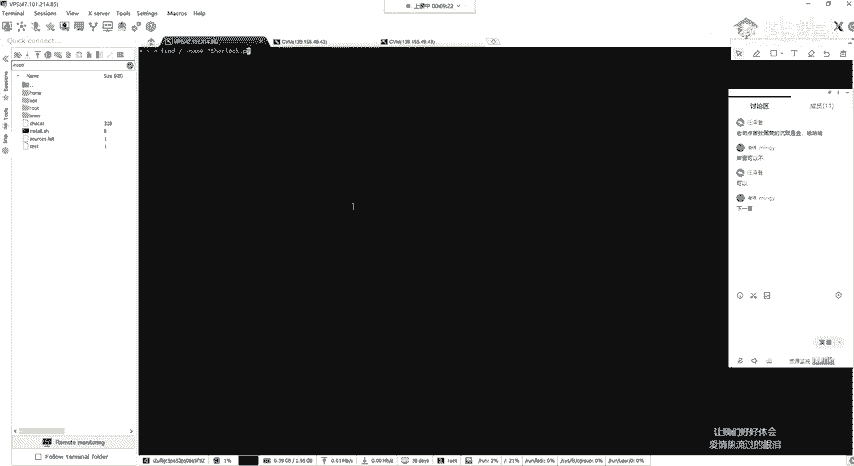

🎼总刻苦变得无所谓。🎼那些快乐。🎼心醉是。🎼因为。🎼Yeah。

🎼爱情里流过的眼泪。🎼当世界慢慢去烘焙，蒸发出人性的余味，让我们好好体会爱情里流过的眼泪，总刻骨变得无所谓。🎼快乐。🎼心碎是抚慰。😊，🎼う。

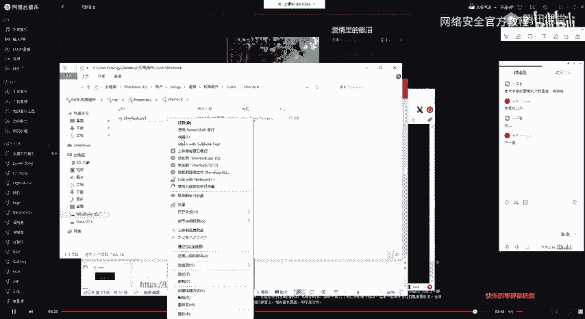

🎼。

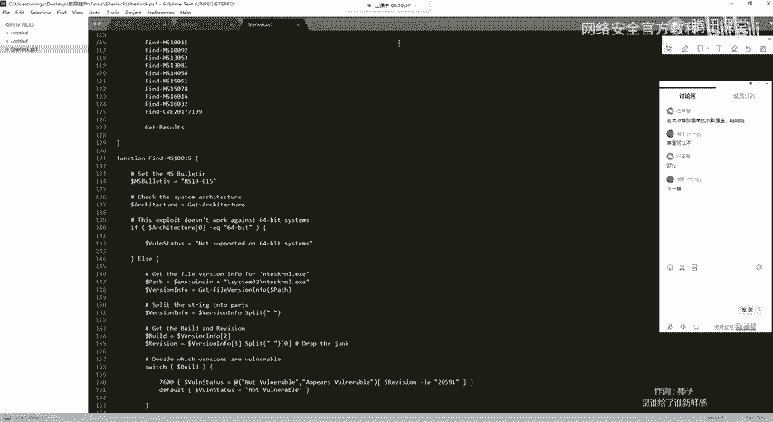

🎼是谁给了谁新鲜感，谁又丢下谁没人管。😔。

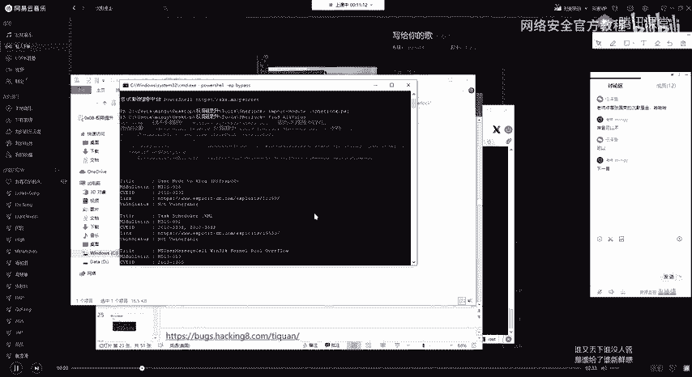

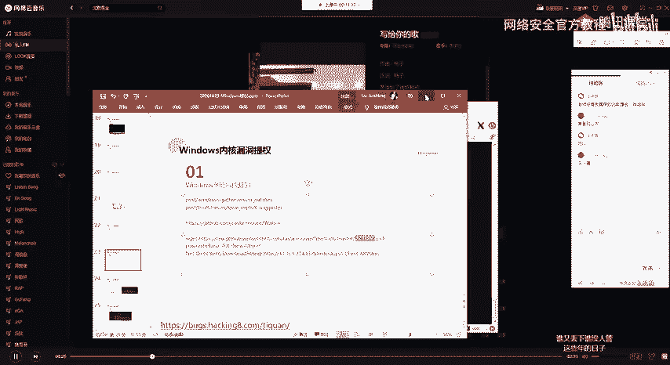

🎼这些年的日子。😔，🎼你在我身。😔，🎼不习惯风吹过。😔，🎼的苦。🎼不敢这夜晚，繁华又空泛。😔，🎼为什么这座城市。😔，🎼每件小事。🎼影子。🎼我好怀念。😔，🎼，🎼说会为我遮风的。😔，🎼天冷为我披外衣。🎼都。

🎼你。🎼谢。🎼就简单的。🎼你过的还。🎼不要太晚回家。😔，ああ？🎼一直为我。🎼这条苦。🎼你他呀掌声响起。

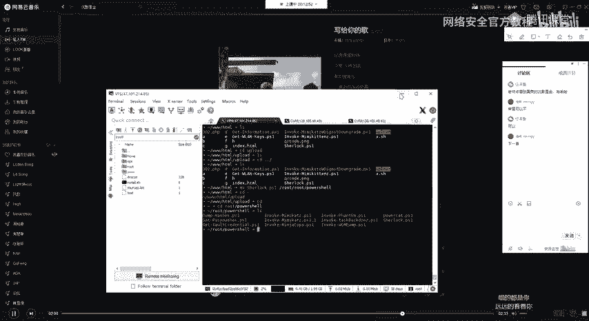

🎼的天。🎼忍不住。🎼勇心。🎼能不能把。🎼这几秒钟要。😔。

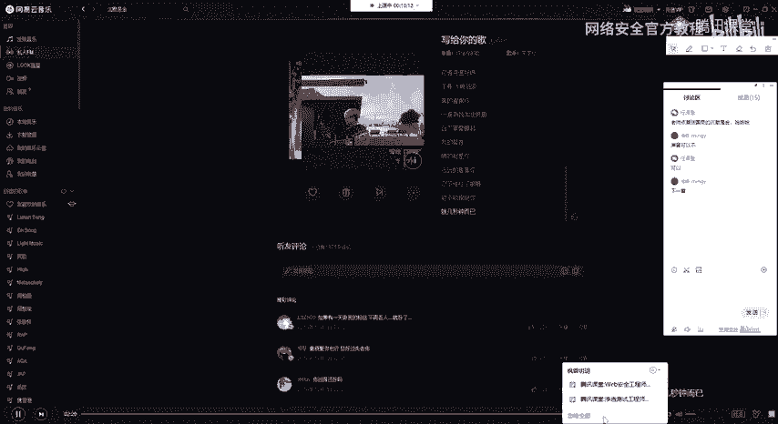

🎼He。呃，大家晚上，然后大家能听到我声音的，以及呃没有杂音的话，大家在讨论区扣个一，好吧。嗯嗯。😊，呃，其他同学呢？呃，就两位同学吗？其他同学呢？嗯能能听到吗？听到的话在讨论区扣个一，好吧。🤧。嗯。

😊，嗯うう。🤧。嗯。是这里17个人是。有在吗？🤧嗯。😊，🤧啊，应该应该是都能听到到。嗯，啊，应该是都能听得到。那么呃其他不多说了，我们正式开始我们今天的一个课程内容。呃。

今天的话主要给大家介绍的是windows的一个系统提全。🤧嗯。🤧嗯。然后我们本节课的话主要的话就是给大家介绍，就围绕windows系统下面的一个提全，给大家做一个介绍。主要的话分围了这4块的内容。

第块第一块的话就是权限提升的一个概述。第2块是windows提群信息的一个收集。第3块的话是呃针对windows系统下面的内核漏洞。的一个提全的一个方法以及相关的一些呃技巧。

第四个的话就是windows系统服务漏洞的一个利用。呃，首先的话我们先来了解一下呃，什么是权限提升。也就是对它的一个概述。呃，权限提升的话，我这边用这样子的一句话做了一个概括，就呃比较笼统吧。

应该这样的话呃就是大概是这样子的一个意思。就是呃攻击者通过安全漏洞，把获取到的这种受限制的一个低权限用户突破限制。然后的话提权至高权限的一个管理员用户，从而获得对整个系统的一个控制权。

就是我们这边的一个权限提升的话，就到权限提升这一步这一步的步骤的话，我们前面的话有一个前提就是你需要有相应的一个啊就已经得到了目标系统的某一个权限。就是说这个权限是什么呢？是什么样子的一个意思呢？

就是说比如说我们前面对吧？有介绍寻找各种这种呃web服务器的一个突破口，对吧？或者说相应的这样子的一些服务器的一个漏洞。通过这样子的一些漏洞来去得到一个web share，对吧？

那么这一个web share的话，也就是你的一个呃用户权限。一般的话你得到的这个webshop啊，像呃我们的一个阿帕奇，对吧？那么就是有这样子的一个阿帕奇阿帕奇的这样子的一个用户权限，对吧？

以及的话还有就是这种3W。当然的话呃，如果呃还有的话就是你通过srcle注入对吧？得到了一个s share。

那么你得到的话就是一个像这样子的一个my circle这样子的一个scle circle的这样子的一个权限啊，那么这样子的一个权限的话，它其实它的一个权限是比较低的。

也就是我们这边所说所说的一个低权限的一个用户。然后呃这一些低权限用户，他再去对我们的一个目标系统去进行相应的一个操作。这时候的话，他会有相应的一个限制，对吧？像比如说你要去访问一个目录。

你要去访问啊root这种目录下面，或者说其他用户的这样子的一个加入的话，你是没有权限去进行一个访问的，以及呃就是你想要去执行一个程序，对吧？你也需要有相对应的一个权限，你才能够去进行一个执行。

那么我们提全的话就是说它的一个目的就是突破这样子的一个限制来去得到呃系统的一个管理员的一个权限。然后的话能够去控制它的一个系统。然后呃我这边的话以这样子的一个方式呃表达了这样子的一个意思啊。

就是windows系统下面的话，就是通过Uer这样子的一个普通用户，对吧？我们把它提前到我们的一个administrate，也就是我们的一个管理员用户，对吧？

然后的话我们得到了这样子的一个管理员用户的话，其实这样子的一个administrate这一个用户，他不是我们系统的一个呃最高的一个权限的一个用户啊。呃，administer的话。

它还有像呃system这样子的一个就是这样子的一个系统用户。啊，呃，系统用户的话，他对他对你windows系统的话，它的一个操作权限的话比呃admin的话要大很多。

就是他能够去呃操作windows系统下面的一些呃。比较就是比较底层的这样子的一些文件，以及一些操作。然后呃linux系统下面的话，就是从我们的一个us者一个普通用户。

然后提前到我们的一个root用户是吧？就我们都知道linux系统下面的话，它的一个呃root用户的话，它是它的一它是系统的一个最高权限。我们得到root用户的话，我们就能够去操去对整个系统。

整个服务器去做呃任意的一个操作，对吧？然后第二个的话就是提权类别。这边的话给大家介绍一下。呃，我这边的话同样的就是分为了这样子的呃，做了一个基本的一个分类。首先第一个的话就是本地提权。

就本地提群的话就是在一个低权限的一个用户下，我们通过一些条件来去直接提升到系统的一个最高权限。P。然后这边的话注意的话是有一些条件啊，这些条件的话就是我们的这样子的一个呃系统。

它是有相对应的应用程序的一个漏洞，以及对应的一个系统漏洞。我们通过这样子的一些漏洞，我们才能够去进行这样子的一个提全操作，来得到它的一个呃高权限用户。然后第二个的话就是远程提权。

远程提权的话就是纯字面意思，我们也知道对吧？就是通过漏洞应用程序，然后直接的获取远程服务器的一个权限。其实在这边的话，我们去进行这样子一个提权，你会发现的话，就是说我们要去进行这样子一个操作。

我们都是要需要去利用相对应的这样子的一些呃漏洞，对吧？就包括应用程序，还有系统漏洞，也就是说你要去提全的话，你首先要去明确的一点，就是你的这一个系统，你要有相应的一个漏洞。

你要有相应的能够去进行一个提全的一个漏洞，你才能够说有机会去进行一个提全。以及在这边的话要强调的一点的话，就是你提全不是说你你想提全就能够提全的对吧？你首先要去呃知道。

或者说你首先要能够去确定这一个系统是能够去进行一个提全的。当然的话呃如果说你有知道我们或者说大家都不知道这样不知道的这样子的一些漏洞，对吧？就比如说您对，那么你去这个的话就呃就另当别论，对吧？

然后像一般的话，像我们要去进行这样这样子的一个提权的话，通常的话都是利用就是呃现有的已经被报出来的这样子的一些提权漏洞。对吧？因为呃说到提全的话，这一个东西的话，其实相当的复杂。

因为你要去你的这个权限的一个提成，它是涉及到了你的一个windows系统，或者是说lininux系统下面的一些底层的一些运行机制，对吧？以及它的一些代码的一些机制。那么针对这样子的一些漏洞的话。

你如果你对它的这样子的一个系统，以及你对它的一个系统的一个底层的话，你不了解的话，你是呃就是很难去发现这样子的一个漏洞的。所以说提要想去找到或者说发现这样子的一个漏洞的话，那么你本身的话。

就是呃对这些东西的话，就是做的就是相当好。就你能够去呃发现这样子一个漏洞的话，那么其实你就已经是一个大佬了。然呃在这边的话，我又就是做了这样子的一个，就是第三个操作系统的一个提全。然后操作系统提全的话。

我们通常的话就是呃就我们常用的以及常见的对吧？就是windows air Linuxux嘛。当然的话呃，mac mac的话，这这一些还有其他的这样子的一些呃系呃，那些系统的话。

在这边的话呃不会多那个多说。🤧嗯。😊，就呃主要的话就是给大家介绍，就是windows已经linkux下系统下面的啊然呃我这边话有列举了这样子的一些。呃。

在后面的话就是我们本机的话主要就是对windows下面的呃这样子的一些提全漏洞做一个介绍，以及我们如何去就是说利用这样子的一些啊提全漏洞的这样子的一个呃方法来去进行一个提全。然。

呃下后面的话还会给大家介绍，就是lininux系统下面的一个提权。哦呃第四个话就是应用程序提全。应用程序的话就呃我这边的话有列举这样子的一些像呃s server就mycycl，对吧？

还有等等的其他的其他的这样子的一些应用程序。我们通过它的这样子的一个应用程序来去进行应应用程序的一个漏洞来去进行相应的一个提全。在后面的话会给大家介绍，就是说呃mycycl以及scever呃。

还有那个post cycle的这样子的一些数据库的这样子的一个应用提全。因为其实我们再去进行相应的一个，就是说去对这样子的一些。嗯，去做渗透测试对吧？或者说你去挖掘这SRC的时候，对吧？

那么你像比如说你的一个社会注入漏洞啊吧，你社会注入漏洞的话，它是涉及到数据库的对吧？你通过社会注入，你得到了它的一个需要。

那么你可以去尝试去尝试去利用这样子的一个呃数据库的这样子的一个提全来去得到更高的一个权限。然，第三个的话就是提权条件。提群条件的话，其实前面有啊有大概的说了，对吧？就是首先第一个的话。

你需要拥有这样子的一个web需，就是你需要有一个普通的一个用户权限。我们的一个提权的话就是基于这样子的啊，你拥有的这样子的一个普通用户的一个权限之上。嗯。啊不呃。

就是在这一个啊拥有普通用户权限的一个基础之上来去进行一个权限的一个提升，对吧？如果说你都没有这样子的一个基本的一个权限，你和就是你怎么去进行一个提权呢，对吧？因为因为你根本就操作不了这样子的一个机器。

也就是说你呃不可能你凭空的，你就能知道它存在有这样子的一些啊，可以去利用的一个提权漏洞，对吧？啊，第二个的话就是拥有某些软件或者说服务的这样子的一个账号密码。就说通过账号密码的一个方式提全的话。

是最简单直接的一个方法，对吧？就比如说我的一个windows系统，我都知道你的一个addmin的这样子的一个用户啊，以及他的一个账号密码。那么我就能够直接去得到你的一个addmin用户的一个权限嘛。

对吧？这个的话应该啊没有什么疑问。那么我得到这一个你的一个addmin用户权限的话，在后面的话会有相应的一些方法，就我们可以基于你addmin的一个权限来去进行一个啊get systemem。

也就是得到你的一个stem用户的一个就得到一个stem的一个权限。呃，第三个的话就是本地或远程服务器上需要存在一个漏洞。就我们就一般的话对吧？一般的话大家去进一个齐全。

其实利用的都是现有的已经爆出来的这样子的一些齐全的一个漏洞。您对的话另当别论。Yeah。🤧。🤧。那么我们就是说我们他要去进行一个提全的话，就有这样子的一个前提，对吧？我需要我们确定。

就是说它的一个服务器上面是存在能够去进行一个提全的一个漏洞的。所以的话我们就是说我们需要去对我们的一个目标做相应的这样子的一个提前的一个信息收集。待会的话会有介绍。啊，最后的话就是拥有漏洞利用工具代码。

这个的话其实跟第三点的话就是呃一样的嘛，对吧？就是你知你知道就是说你知道它已经有的已经被包出来的这样子的一些漏洞。你知道没用嘛，你需要能够去进行一个利用嘛。那么去进行一个利用的话。

那么你就需要有相应的这样子的一个利用的一个代码，对吧？利用的一个工具。当然的话就像我们去进行这样子一个操作的话，都是就直接去使用现有的嘛。啊呃，第四个的话就就是windows的一些基本的一个提全思路。

其实呃也不算思路吧，就是呃我这边给大家介绍的这样子的一个windows提全。windows下面提全的相应的呃一些一些点以及相应的一些方法。然后呃首先第一个的话就是前期的一个信息收集。

就其实我们再去做渗透测试，对吧？渗透测试以及呃。你做这样子的一个测试的话，其实信息收集的话，一般的都是做都是第一个要去做的这样子的一个事情，对吧？因为其实渗透测试的一个本质的话。

也可以就啊是哪位大佬说的。就是他的一个本质的话，其实就是信息收集。那你的一个信息收集，你收集到的一个信息的话，就决定了你去做这样子的一个呃攻击测试的一个呃方向，以及你的一个就是你的一个广度以及宽度。

对吧？因为你知道的你你收集到的相应的这样子的一些信息，就是说它的一些漏洞信息你越多，那么你能够去做的一个呃利用的方法，那就更多，对吧？以及你能够去得到的一个成果也就更多。

然后呃第二个的话就是第二个第二点以及到第四点的话，就是我们本节课会去有介绍的。🤧像呃mate press的一个提全以及呃，其实下节课的话会讲就是。MSF以及CS下面的呃。

就是我们利用它的这样子的一个渗透测试框架里面，它自带的有这样子的一些提全的一个呃模块。然后我们可以直接去进行一个使用。呃。然后的话就是内核漏洞，还有服务漏洞，还有注册表等等的这样子的一些点。

就是我们再去像在windows系统下面的话，我们可以去着重的去关注这样子的一些点，来去寻找是否存在这样子的一个一些提全的一个漏洞。呃。最近讲课讲的有点多啊。嗓子有点不是很很很舒服。有可能呃可能会。

就是倾一下喉咙什么的，可能会稍微有点杂音啊，好吧，大家呃。就是不要介意。哎呃，讲着讲着突然喉咙就有点卡了，就卡了的话就呃讲不顺讲不顺畅啊。嗯。呃。

下面的话第二部分就是我们的一个windows提全的一个信息收集。呃，在这边的话。首先第一个的话就是获取一个m的一个需要。我在这边的话就是以这样子的一个对MSF的一个作为。作为一个例子。

就我们呃就是达到呃达到前面我们所说的所说到的一个前提的一个条件，就是我们首先需要有相应的一个需要，也就是有相应的一个呃。用户权限。🤧对吧。呃，关于关于怎么去得到这样子一个需的话，我这边我就不多说了。

就呃前面在讲MSF的时候，以及呃在后面去进行相应的反弹需尔等等的这样子的一些操作，已经讲了讲了很多了，对吧？大家应该都已经就是对这样子的一些基本的一个操作，应该是烂熟于心了，是吧？

就是大概是这样子的一个过程，对吧？然后我们得到一个就是普通用户的一个权限。就在这边话主要就是模拟前面得到一个基本的一个权限嘛，就是表达这样子的一个意思。当然的话呃就是我们通过。web的一个漏洞，对吧？

得到一个web share。然后的话我们通过web share，同样的也可以去反弹一个需，反弹到MSF上面去嘛吧？以及呃CS也是一样的。然呃，下面的话就是一些信息收集的一些方法，以及呃脚本工具吧。嗯。

😊，就其实呃我们去做这样子的一个信息收集的话，其实呃前面在讲那个嗯。在讲内网的一个信息收集的时候，对吧？就已经有介绍相应的这样子的一些命令了，对吧？命令以及相应的一些呃。就是这相应的一些语法对吧？

然后其实在呃在这边的话，我就不会去单独的去对某一个面令去做一个介绍就。就是大体的这样子的一些。就是说我们如何去使用这样子的一些像，比如说WMIC以及SC这样子的一些windows系统。

下面它内置了这样子的一些呃。服务的一些命令行的一个程序来利用它来去进行一个信息收集，以及相应的通过这样子这这两个这样子的一个命令程序呃，所编写的这样子的一些呃自动的一个信息收集的一个脚本。

就其实前面的话给大家有介绍对吧？就介绍我们如何去一一的去做一个就利用对应的这样的一个命令去进行一个信息收集，对吧？🤧那么我们知道对应的一些命令，那么我们就可以去把它写成脚本是吧？

然后的话自动化的批量的去进行一个我们想要的一个信息的一个收集啊。呃，这边第一个的话就是这个WMIC这个命令行的一个工具啊，这个工具的话是呃windows下面那个管理工具，它是一个命令行下面去进行一个。

操作的一个工具，然后它提供了从命令行接口，还有呃P命令P命令脚本执行系统管理的一个支持。然后在我们去进行相应的一个信息收集的话，呃，经常会去使用到这样子的一个工具。然后呃在这边的话。

关于这个呃前面应该有介绍吧，有介绍这一个命令吧。嗯。😊，诶。关于这两个命令的话，大家看一下那个预习内容，比如预习内容这边的话，其实我都已经贴了。然后关于这样子的WMIC这两个命令的话。呃。

前面应该是在有讲，当当然的话就是只是呃针对就是说我们要去进行某一个信息的一个收集的时候，对吧？我们可以去使用这样子一个呃工具。然后的话对应的一个命令对吧？

然后关于就是完整的这样子的一个工具的一个使用的话，是没有给大家介绍的。然后关于这这这一些的话呃，我这边也不会去多讲啊。就这些东西的话就是一些命令的一个使用。然后大家想要去了解的话，自己去了解一下。

然后基本的一个使用的话，其实我们。

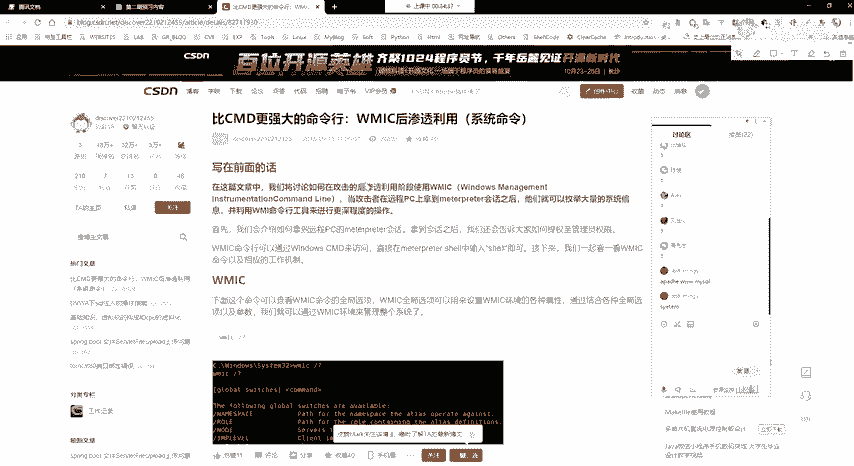

呃，就我们可以直接通过。大家都是windows系统嘛，对吧？你可以直接通过WMIC，然后的话去查看它的一个帮助信息嘛，是吧？然后再像。

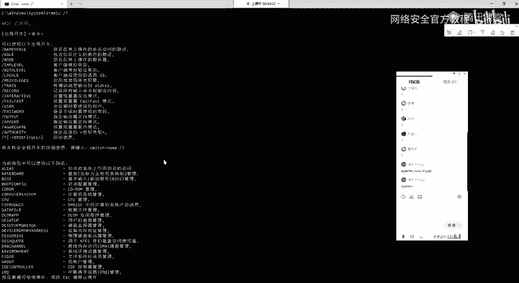

那windows下面你去执行的话，呃，就是你每一个选项啊吧，每一个开关它都是中文的，有解释嘛，对吧？

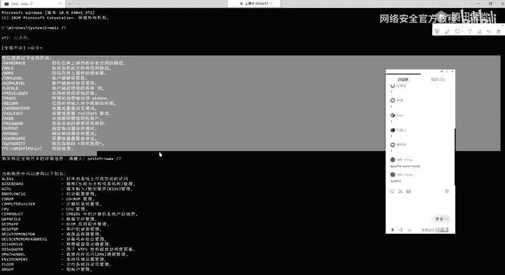

都能够去大概的知道他的相关的一些用法。然后像比如说我这边的话。举一个例子。没有。我想开。就比如说这个就用户账户的一个管理，对吧？用户账户的话应该也是我们。应该也是我们经常会去用到的这样子的一个东西啊。

对吧？那我们输入WMIC，然后的话接我们的一个优er看，也就是在这边的这一个有用户账户的一个管理。然后我们可以通过这一个工具来去查看呃，当前系统下面的所有的一个用户账户以及呃。我们可以。

它还有就是说它的这样子的一个开关，后面的话，它还有相应的一些选项啊，这些选项的话就是像比如说我们可以去做一一些设置。以及我们可以去得到他就是呃我们想要的一个信息。就一般的话我们要去做一个信息收集的话。

会去使用到像list。就是列出。呃，就是列出它的一个详细的一个信息嘛。然后历史的下面的话，它还有就是相应的一些开关选项。像比如说。嗯。付耳的话就是显示所有的那个东西嘛。

还有的话就常用的话就这个brief。然后的话be的话就是它显示的就是一些简洁的一个信息嘛，就是它只显示了像你的一个账号的一个类型，以及你的就是域名啊SID啊，还有你的一个全名以及名字，对吧？

就是显示的这样子的一些信息。然后这些信息的话，我们就不像在这边的话呃，看的太太太多了，对吧？就这边的话就有针对性一些，然后的话简接一点，然后它还有其他的这样子的一些，就是你可以去呃自己去进行一个尝试了。

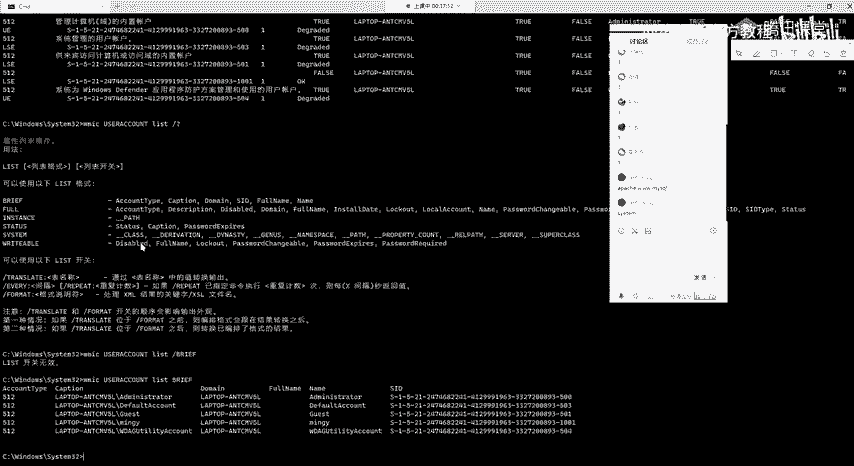

其实使用的话，大家自己去尝试之后的话，应该是没有问题的。啊呃，这边的话文章这边的话有就是有。就是有有很全的很详细的一个信息啊。你还有。这里的就是。微软的它的一个官方的一个文档。这边没有中文的。

大家可以翻译一下啊。然，只要你能看得懂就可以了嘛，对？啊，其实实际的话其实也不用看这些东西啊，你就是你要用的话，你直接去就是去看他的一个帮助信息嘛，对吧？

就是斜杠问号来查看他的一个选项的一个详细的一个帮助信息。🤧。好，呃下面的话就是呃介绍一个。利用这个WMIC这一个命令行的一个信息提取的一个脚本。

就是这个WMSMIC in货点BT这样子一个批处理的一个脚本。这个脚本的话其实。あ。

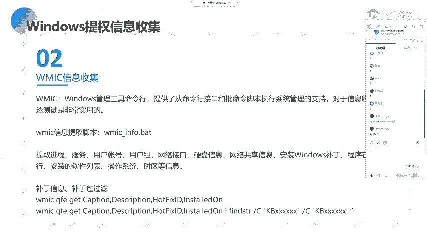

嗯。嗯。

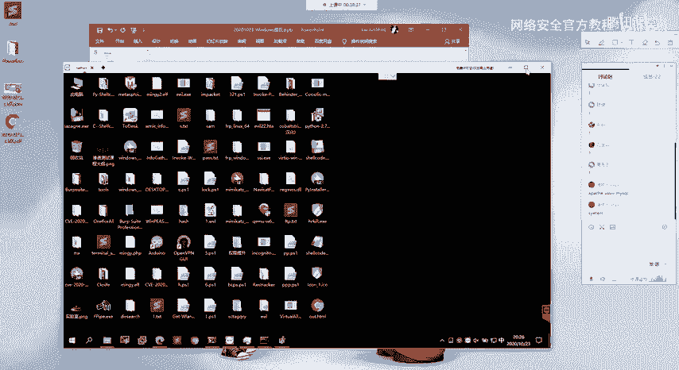

呃，这一个。

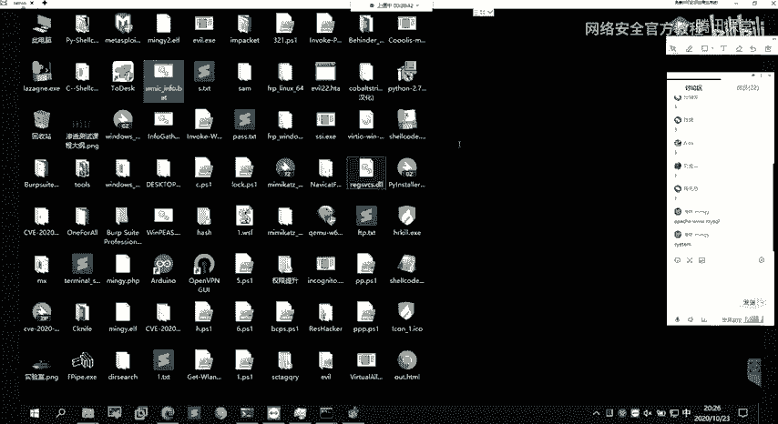

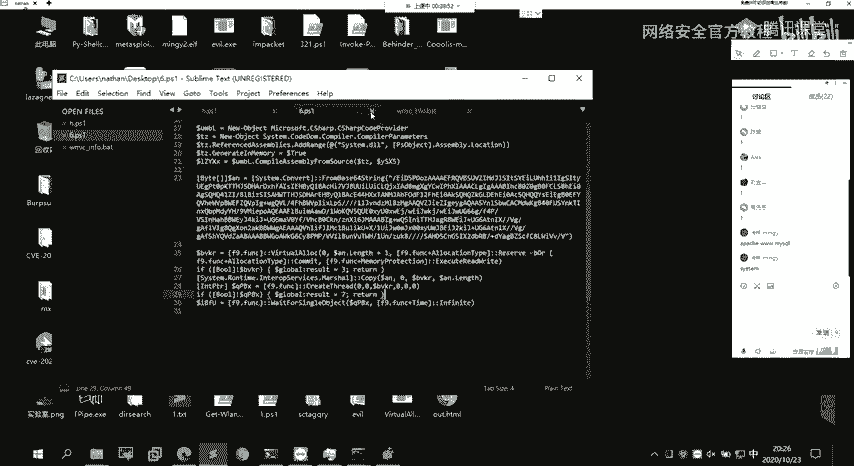

🤧，就是这样子的一个脚本。这个脚本的话，其实我们看它的一个内容，其实就是它啊其实在这边它也有也念出来了呃。这个应该这个我忘了是脚本里面有的，还是我自己加的，应该是脚本里面有的吧。

然后这边的话是他的一个下载的一个地址。然后大家也可以去那个geh上面应该是也有的。然后呃其实他这边的话，他也列出来了，他这个脚本他所收集的一些信息啊，像比如说进程服务用户账号对吧，用户组网络接口啊，啊。

还有操作系统，还有你系统里面安装的软件列表以及启动运行的一个程序。然后其实它的一个命令的话，它都是使用的这样子的1个WMIC的这样子的一个命令行，对吧？然后的话接对应的这样子的一些选项。

像比如说我们以这一个就是呃刚刚说的这个用户账号为例，对吧？可以看到它是呃WMICU在看，然后list for的话就是列出所有的嘛，对吧？然后他在这边的话，他是有做了这样子的一个格式化啊。

就是他把输出的一个内容的话，把它格式就是呃输出到了这样子的一个HTM的一个文件当中。就它通过format做了这样子一个格式化。

嗯。啊呃。看一下，就是执行这个脚本之后，它的一个实际的一个输出啊，就是我们可以在这1个HTM文件当中去查看。然后的话东西比较多。

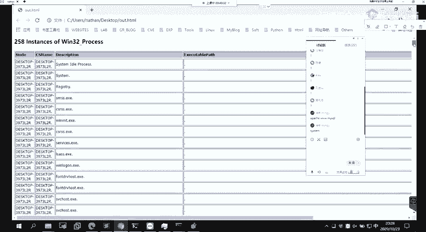

No。像这个的话呃，它它是对应的呀，就是。但在脚本这边的话是对应的是吧？但你的一个时区信息对应的话就是这边嘛。就是这边对吧？然后的话就是操作系统。

操作系统的话在这边就是啊我是这边的这一个机器的话是win10家庭中文版的。然后还有就是对应的这样子的一些，我们都可以在这一个文件当中去查找的。P。

就是啊。一个信息设集的一个提取的一个脚本，也是应该就是比较简单。主要的话就是这一个命令的一个使用啊。嗯。😊，哦呃然后的话就是补丁信息，补丁包的一个过滤。呃，在这一个的话，这一个应该前面在讲那个信息收集。

应该也是有讲，对吧？就是通过这一个。

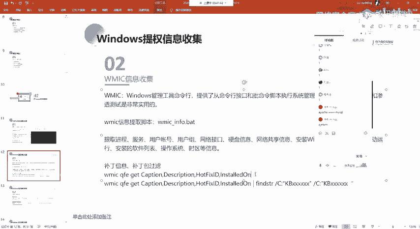

打电话 m s c 。

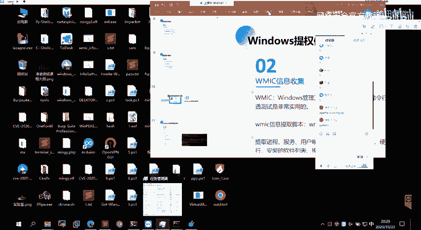

比如我在这边。我在这边执行这个命令，执行这个命令的话，它就会去列举出当前系统下面已经打过的这样子的一些补丁包的一个名字。就是这一些，就是其实就是一个hoster fix IDD。这这里的话就是我们嗯。

经常看到的这样子的一些补丁号。然后这边的话它的这个命令的话，它有列出来，就是你的这个就是这个补丁，对吧？它这边有这样子的一个就是微软官方的这样子的一个信息，就是对这个补丁的一个啊公告的一些信息，对吧？

然后还有的话就是像他的一个描述，就是像这种安全更新，对吧？就表示的话这个补贴的话是针对就是安全问题的这样子的一个更新，以及他这边呃安装更新的这样子的一个时间啊。10月15号。Yeah。

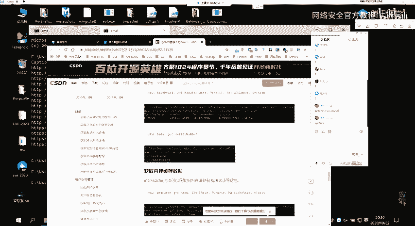

然后的话就是呃过滤的话，其实就是用我们前面讲到这个在window下面的这个方式拽的这个命令嘛来去匹配嘛。然后杠C后面的话就是匹配，就是借我们要匹配的这样子的一个字符。像比如说你想要去找。

就是说你的这一个系统下面，你指定的这样子的1个KB的这一个就是补丁号，对吧？你要去查找当前这个系统下面它是否有这样子的一个补丁。就说如果说你找到有这个补丁。

然后的话这一个补丁它是针对某一个呃漏洞的这样子的一个呃。防御对吧？就是它的这一个补丁的一个作用的话，就是去防止某一个漏洞。那么你找到它有这一个补贴号的话，那么对应的这样子的一个漏洞的话。

那么我们就无法去进行一个利用了，对吧？嗯。如果说没有找到的话，那么我们就可以去进行一个尝试了。然，还有的话就是获取沙网名，还有沙网的一个安装路径。这里的话呃前面应该也讲了，这边的话就看一下效果。

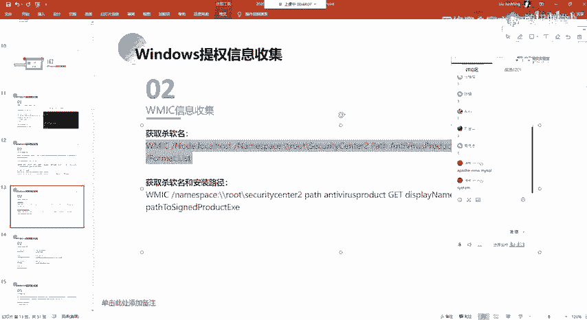

然，呃这边的话可以看到念出来就是有360红龙，对吧？还有windows def的。就是呃这个系统现在有装的。

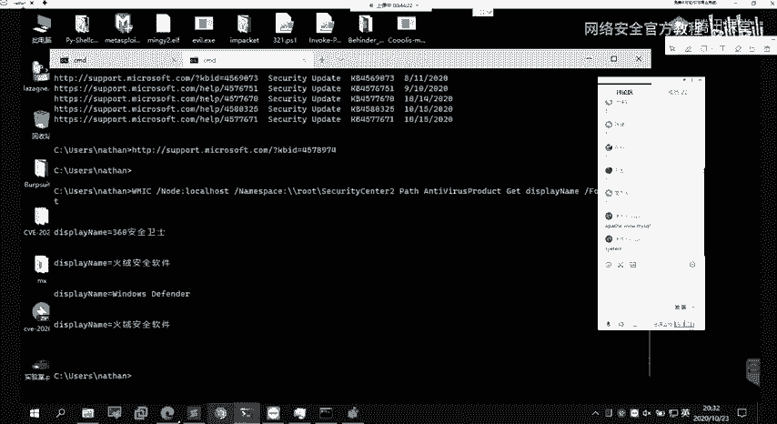

唔子。以及呃杀扰名还有安装路径。这边的话我就不一的去呃给大家看了呀，大家自己课后的话去尝试，好吧。然后还有的话就是其他的，我这边的话有列举了几个呃，像主账户。呃，用户账户呃就是自启动的一个命令对吧？

然后的话还有操作系统，然后的话进程，还有应用程序。这些的话，这些信息的话其实都是我们啊通常会去进行一个收集的这样子的一个信息啊。不看。然呃，第二个的话就这1个SC这一个呃命令函程序。这个S c啊。嗯。

这个SC的话，它是用来与服务控制管理器，还有服务区进行一个通信的一个命令行程序。主要的话我们会用它来去进行一个就是啊对我们的一个服务区进行一个控制。他会去紧锁和设置有关服务的一个控制信息。

然后的话我们像比如说我们可以去紧锁服务的一个状态，对吧？看它是不是处于一个运行的，或者说它是一个停止的一个状态，以及我们可以去进行一个就是启动，然后停止某一个服务。

然后呃在这边话就是类似于我们控制面板管理工具服务service的这样子的一就是这一个。Okay。就是在在这边啊这一个服务。就类似于我们这边就。这边的这样子的一个。呃，这个。怎么说呢？就是这个SC的话。

它是可以通过命令函的一个方式去进行一个服务的一个呃检索以及啊操作，对吧？然后我们当前的这样子的一个界面的话，就是我们可以在这个界面去进行对这样子的一些服务。

对系统里面所运行的这样子的一些服务去做一个操作，对吧？像比如说。我随便选一个，对吧？我可以右键，然后的话可以去进一个启动。以及停止暂停对吧？只等这样子的一个操作。啊。

然后我们在这边的这样子的一些操作的话，其实我们都可以通过这个SC这个命令行程序来去进行来去呃实现。好呃，我这边的话以这一个为例子。Yeah。获取系统注册服务的一个信息。

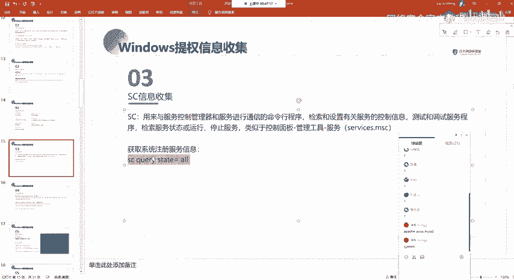

然后这一个面的话，其实就是我们执行之后的话，它会获取到单前系统下面。呃，就是其实就是获取到了这边所有的这样子的一些服务的一个信息啊。

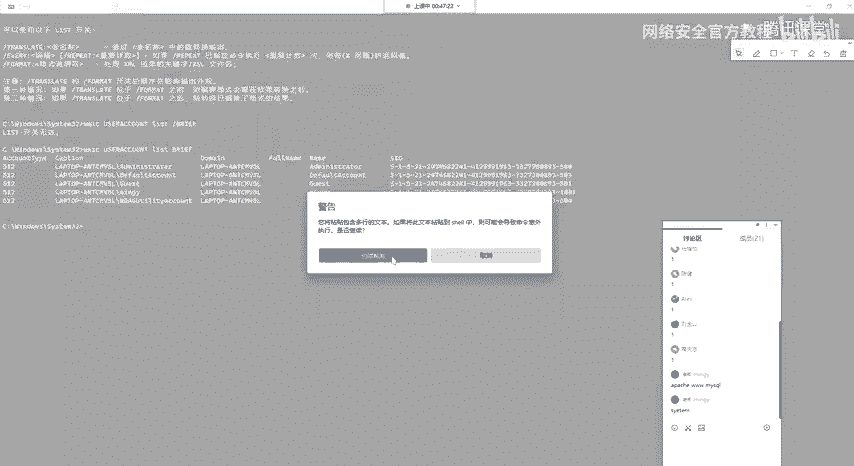

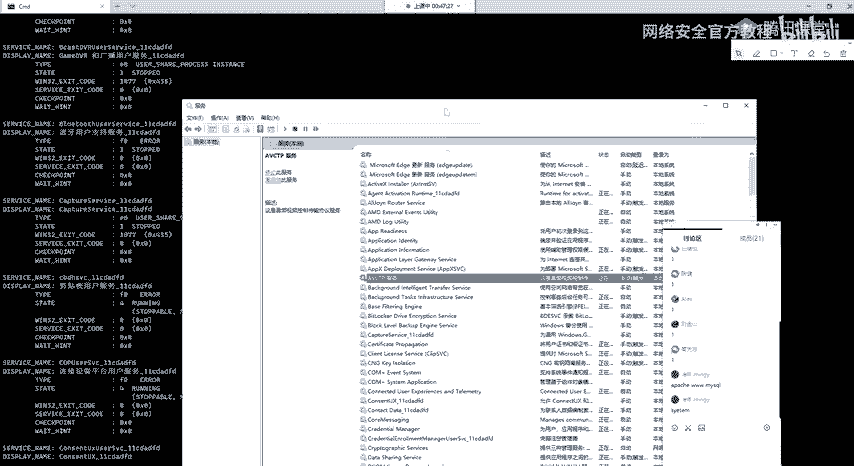

就这边的，然后的话他是通过这样子的一个方法呃，这样子的一个形式去展示出来的。但比如说这边的一个severeven name，就这个对吧？

以及这一个severeven name它的就是啊这一个服务它的一个状态对吧？它一个状态是running，也就是正在运行的。这样子的一个状态。

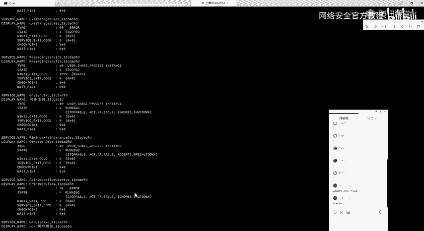

🤧Okay。

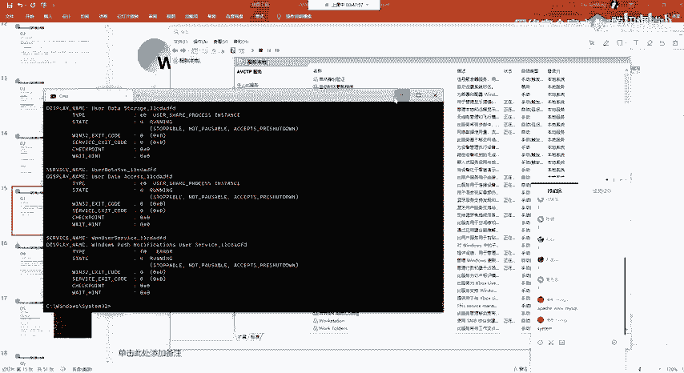

好呃。第四的话就是一些自动信息收集的一个脚本啊，就跟前面的那个通过WMIC去进行一个信息收集的一个呃脚本的话都是类似的。然后这边的话都是就是别人已经写好的。

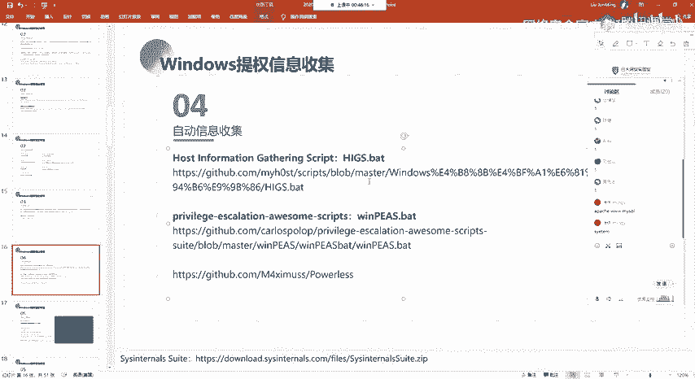

在这看一下。

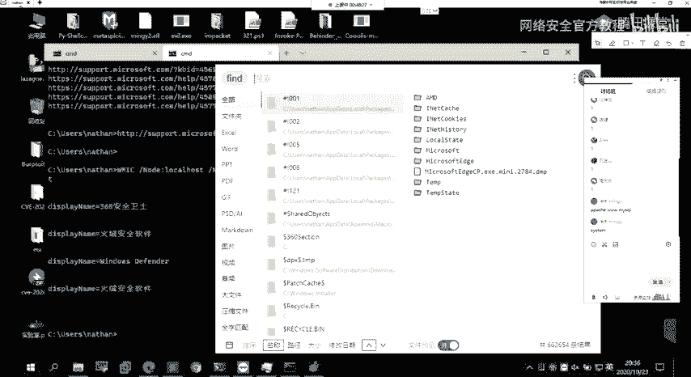

喂。

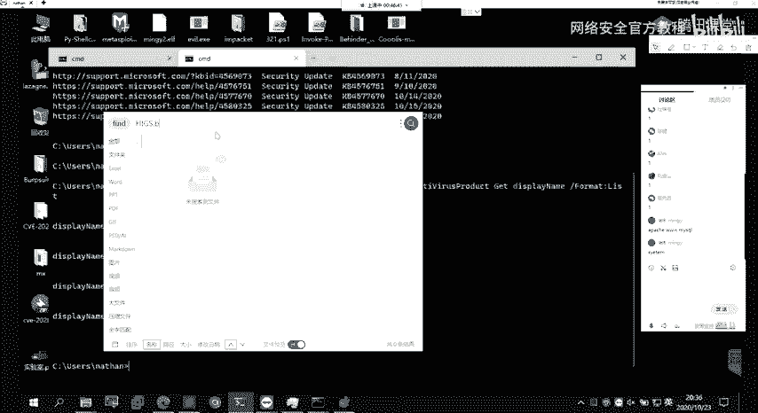

已经没有了。然后大家可以去访问访问这边的，我这边给的这样子的地址，然后的话可以去查看。啊其实他的这样子脚本，他信息的他收集的一些信息啊，其实我们在这边也能够去知道对吧？他像这种脚本的话。

其实你知道我们要去收集的一些信息话，你自己也可以去写嘛，对吧？像比如说这边的话就是啊仅测你安装的这样这样子一个软件是吧，然后在这边的话，它是通过导出这边注册表。然后再导出的是这一个注册表，下面的一个。

啊，值然后导出到这样的一个文件当中，是吧？然后的话在这一个文件当中去查找我们想要的这样子的一些信息。然后的话把它做一个输出。然后呃这边的话我就不一的那个大家可以自己去尝试，然后去查看效果。

然后还有的话就是这个。呃，提权的就是关于提全的这样子的一个。信息收集的一个脚本，就这个winPAS0BP。

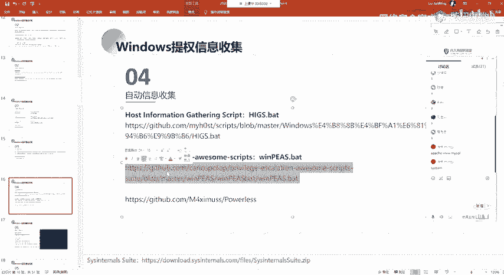

被告。递出你的一个脚本，就这个。这个脚本的话，它的一个收集的一个信息的话就比较多。有有很。有很多这样子的一个信息。然后这些信息的话就是我们可以用于，就是说在我们去进行一个提全的时候，我们可会去用到的。

或者说需要去了解的这样子的一些信息。这边的话可以执行一下。执行之后的话，他他就会去啊。之前那一个脚本，然后的话他会在这边去输出呃。这边的话。听到了。把输出到一个文件当中，像有人说了。我点上。

那我们可以在这边去。

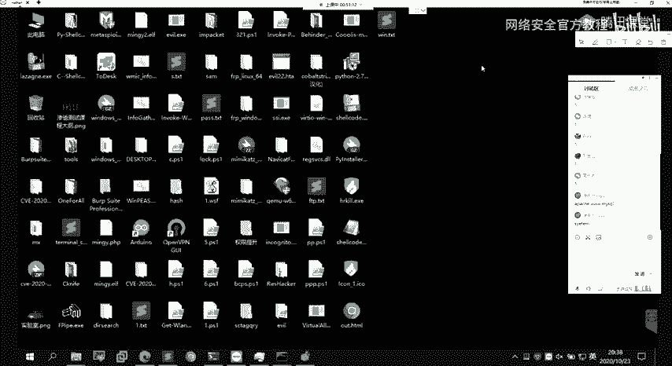

打看他的一个信息。有什么啊。呃，首先的话在这边。你那慢了。

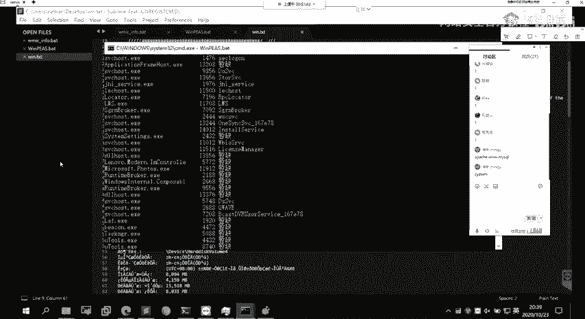

首先在这里的话，其实它就输出了，就是现在这边就是stem in的一个信息嘛，对吧？然后呃下面这边的话就是呃当前系统的一些补丁嘛，对吧？然后还有下面的这一些的话，就是呃1斤啊吧。以及还有。

其他的这样子的一些信息啊。

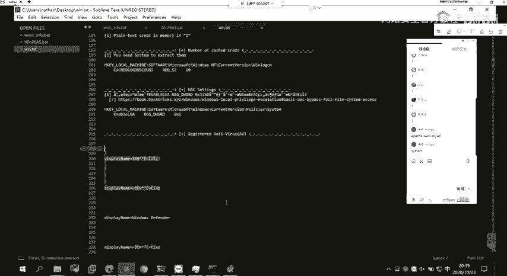

你乱嘛。

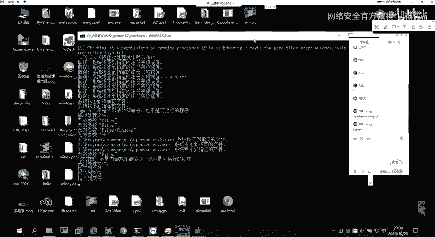

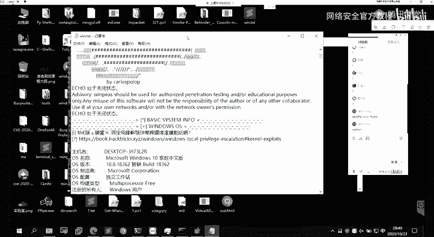

然后呃现在这边的话就是我们刚刚的那个命令所实现的一个效果，对吧？就是去呃查看呃当前系统下面所存在的这样子的一些AV对吧？

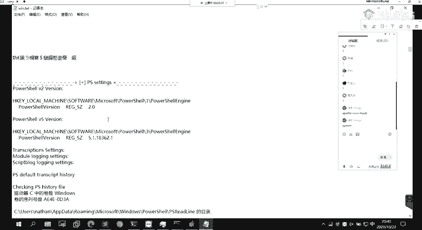

还有等等的，其他的一些东西的话，我就不一的带大家看了。然后大家啊自己去尝试吧。然后他这边的话，它检索的一个信息的话比较多。

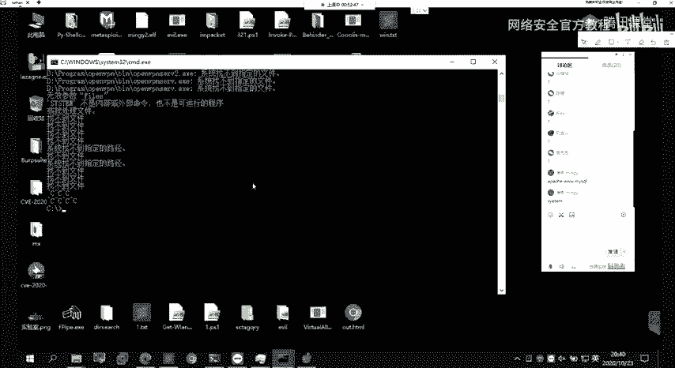

嗯。

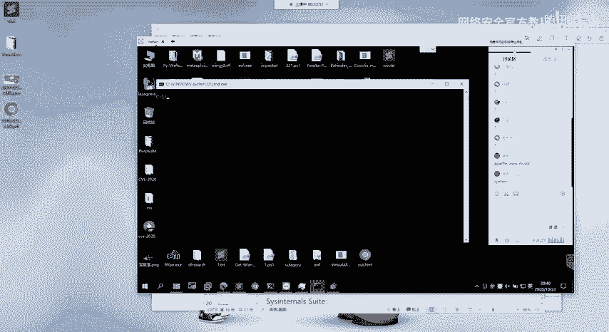

。啊，以及还有的话就是这个power lens。它也同样的是一个类似的一个脚本啊。就是都都是差不多的。然后的话就是收集的这样子的一些信息的话呃，都是差不多的。也就是我们所需要的这样子的一些信息嘛，对吧？

呃，这边的话这个。这边的话，这一个我有执行了，就是啊不是这样。

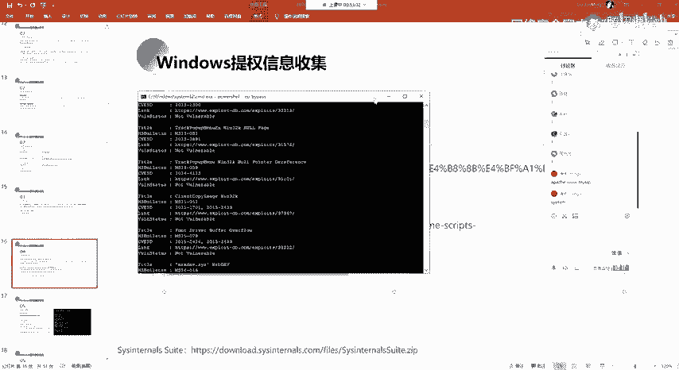

没有了。

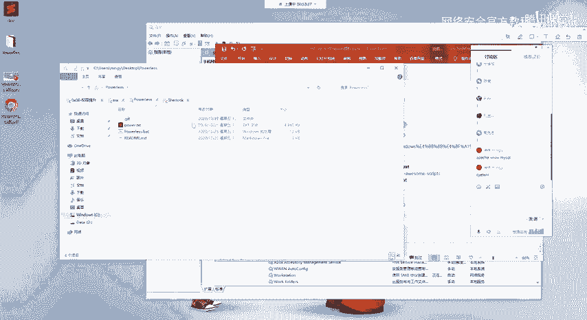

还有同样的是一个类似的这样子的一个脚本。

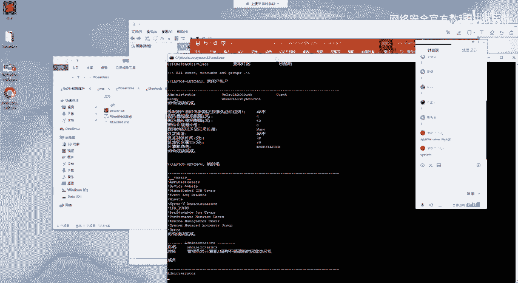

啊，然后的话他们去检索他应的一个信息。然后我们可以根据这一些信息来去呃找到我们所需要的这样子一些东西。

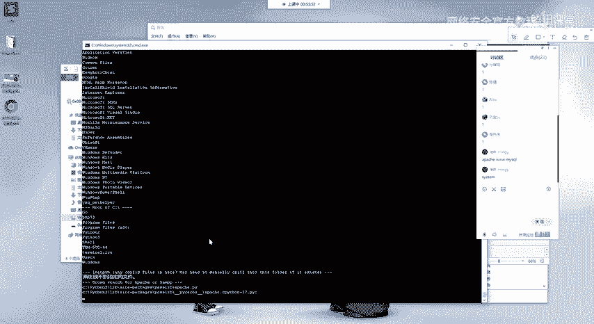

这个话我就不考了。

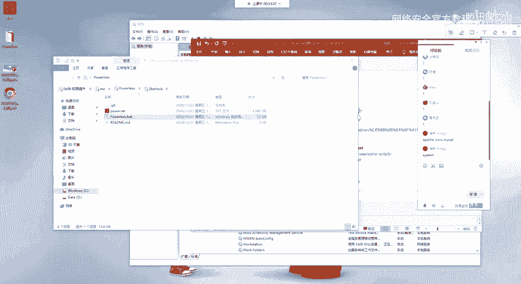

就是呃这边的话是我之前跑的呀。

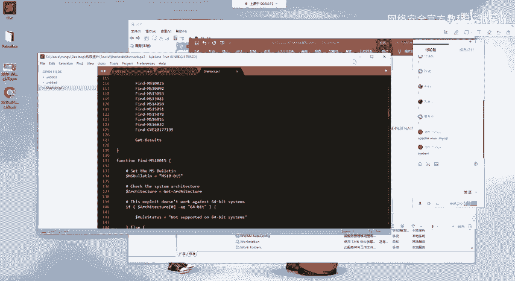

Okay。啊呃，下面第五个的话就是提全工具脚本。在这的话其实就是给大家介绍一下，就是常用一些常用的一些提全的一些工具以及脚本。首先呃在这边的话就是给大家介绍了介绍这一个呃roten potato。

这个就是烂土豆，就是它的一个呃别名的话就是烂土豆。然后呃这一个工具的话用于提拳的话是用的比较多的一个提全的一个工具啊。然后它的它的一个作用的话，它可以将我们的一个服务账号。去做一个本地提群。

然后提全到我们的一个stem的一个账号。然后通常我们的一个用法的话，就是我们通过这边得到得到的需，对吧？我们通过前面像比如说MSMSF所得到一个谢，我们得到这个需尔之后的话。

我们可以通过上传这样子的一个工具，上传到目标机上面去，然后的话去执行，对吧？然后执行的话，我们执行之后的话，我们可以尝试。就如果说它存在相对应的这样子的一些提权漏洞，对吧？

那么我们就有可能把它提全到一个stem的一个用户。然后在这边的话，就是你提全之后的话，它其实会有这样子的一个啊。东西啊就是有这样子的一个taken。就我们在去咨询之后的话。

它其实会就是说在当前的这一个系统下面，它会有生成这样子的一个token。这个token的话就是我们的一个s systemem呃权限的这样子的一个token。关于这一个token的话呃。大家看预习内容吧。

前啊后面应该会讲。然后这边的话我也放到这边了，就是这个token的一个窃取利用。大家呃可以自己去尝试。呃，在这边话我是看的这个就是上级tudent的。这位大佬的这个文章，然后的话我自己尝试。

然后写了笔记。就是关于这个token窃取利用。然后在这边的话有就是列出了就是windows平台啊，MSF啊下面的它也有这样子一个工具，以及通过抛脚本的一个方式来去进行相应的一个操作。嗯。好呃。

在这边的话呃大概介绍一下吧，后面后面。嗯。后面可能。啊，其实这一个token窃取利用的话，其实大家看这篇文章，然后自己去操作一下，应该就理解了。然，大概的介绍一下。

就是windows下面的话有两种类型的一个token，就是我刚刚所说的这样子的一个token。就token的话，它有这样的两种授权令牌，有模拟令牌。它的一个区别的话就是呃。

这一个授权令牌的话就是用于交互的一个绘画登录。像比如说我们本地，我们对吧？我这边直接远程登录到这这样子的一个机器上面。那么你当你用你所使用的这样子的一个用户。你通过下桌面，你去登录之后的话，你登录的话。

使用的一个用户的呃，就是账号密码，你登录目标系统之后的话，它会去生成这样子的一个token。然后他是有这样的一个授权令牌来去标识你的这样子的一个就是身份嘛，对吧？然后的话呃还有的话就是这一个模拟令牌。

impresssonation talking这个的话就是运于非交互式的一个登录。像比如说我们通过net yield对吧？通过net use去啊映射远程的一个就目标机器上面的共享文件夹，对吧？

这样子的一个操作的话，我们就。可以使用这样子的一个模拟的一个token。啊呃。Yes。Yeah。然后还有的话就是嗯。这两种托ken的话，它会在系只有在系就重启系统之后会清除啊。

也就是说如果你的你的这个目标机器上面，你有登录某一个系统，好吧，你用某一个用用户，像比如说你用外的命这样子的一个用户，你登录之后，对吧？或者说你通过net柚子去登录之后的话。

它会有这样子的一个托ken这样子一个令牌。然后的话我们可以去通过，就如果说我们拿下来这个机器，对吧？拿下来这个机器的一个需，那么我们可以通过这样子的一个工具，就这一个。

这个工具来去窃取它的这样子的一个token。然后的话我们窃取到他这个token之后的话，我们就能够去以他的一个身份，也就是能够去得到他的这样子的。

这一个token所对应的一个用户的一个权限来去进行相应的一个操作。嗯。呃，更多的话，大家看我这边的笔记吧，然后看我PPT这边。

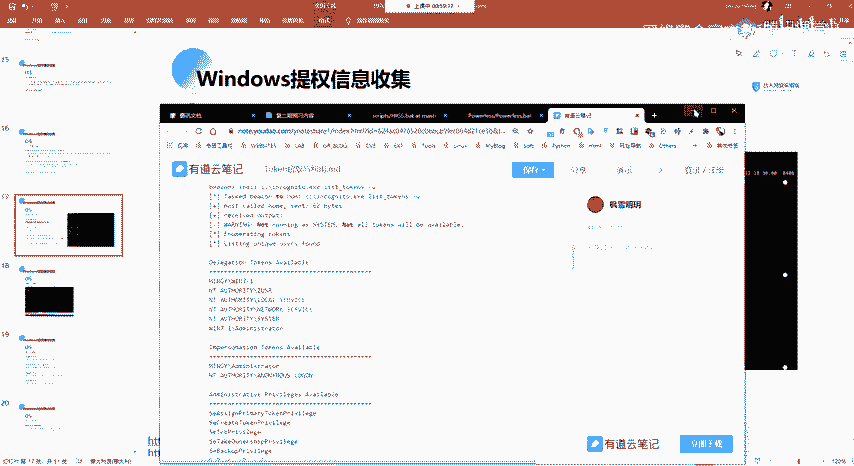

呃，这边的话就是呃以MSF下面的这样子的一个操作为例。就MSF下面的话，它有集成这样子的一个模块，就是这个enco encor你从这样子的一个模块。然后我们可以通过就是load这一个去加载它。

然后呃它的一个使用的话就是呃list token杠U的话，它就是可以列出当前的这样子的一个token。比如列出当前可以去使用的。像呃这一个授权令牌以及模拟令牌的这样子一个token，对吧？

然后的话呃我们在这边用这一个。让土豆去提全的话，就是说它可以去利用它可以就是说他去利用成功之后，对吧？我们把这个工具上传到我们的这个机器上面去执行。执行之后的话。

它会它就会去生成对应的这样子的一个token，就是你得到了它的一个你通过这一个呃提全的一个工具，对吧？你把它得到了一个sstem的一个权限。那么它会生成这样子的一个token。

我们就可以通过这一个呃这个模块下面的这一个。这个命令来去窃取它的一个token，然后窃取到他的这个token之后的话，我们就能够去得到他的这样子的一个权限。Yeah。

然呃这个命令的一个意思的话就是把这一个把这边的这个to开。这样子的一个就是这一个hoken把它给添加到嗯我们的一个模拟链环下面去。

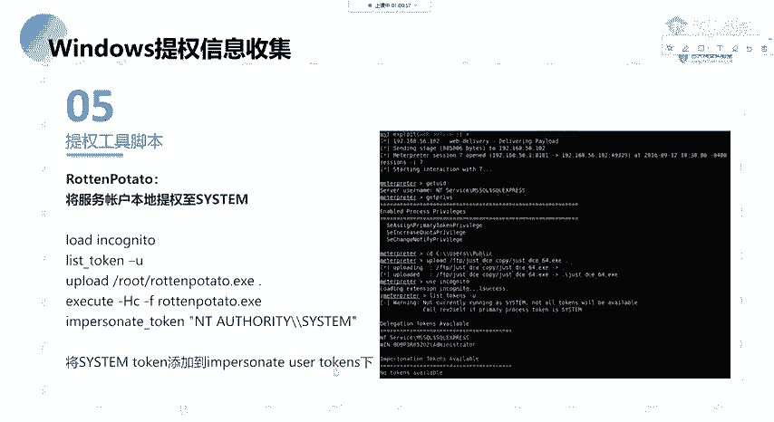

不是。然后呃就是像这样子。啊，我们执行之后执行之后的话，它会创建这样子一个进程。然后我们list token之后的话。

我们就能够在这一个模拟令环下面去找到对应的这样子的一个啊seatem的一个token。然后的话我们就可以去进行一个模拟令牌，然后的话窃取它的一个token来去得到它的一个s什的一个权限。

这个话就是token的一个窃取呃，以及利用。然后这边话就是其实也是这一个工具，它的一个就是这一个提全工具的一个用法。

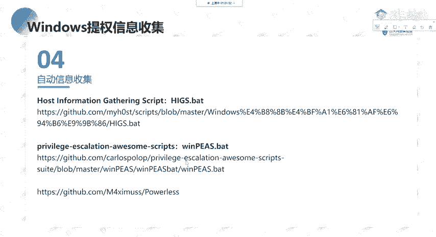

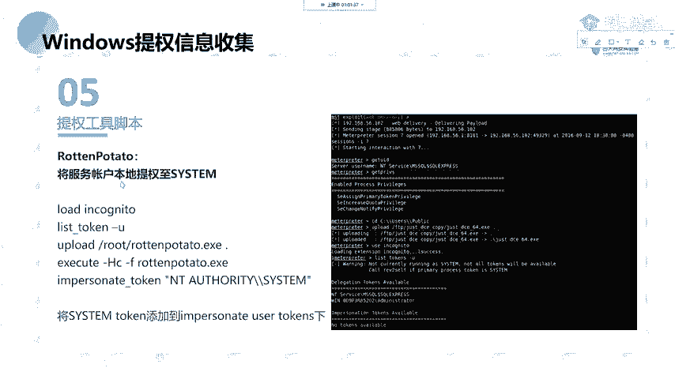

然后呃在这边的话就是说这一个就是potato，就是它是有一个家族的，就是土豆家族，然后它有。其他的这样子的一些。呃，工具啊就一些提全的一个脚本。嗯。然后这边的话大家自己一页的去看吧。

然后的话可以就是就是这些脚本的话，您可以就是做成自己的一个。就是大家其实在去提拳的时候，就是一般的话。嗯。你收集到对应的一个信息，对吧？然后的话你找到对应的能够去进行利用的一个工具。

然后的话去尝试提全好吧。

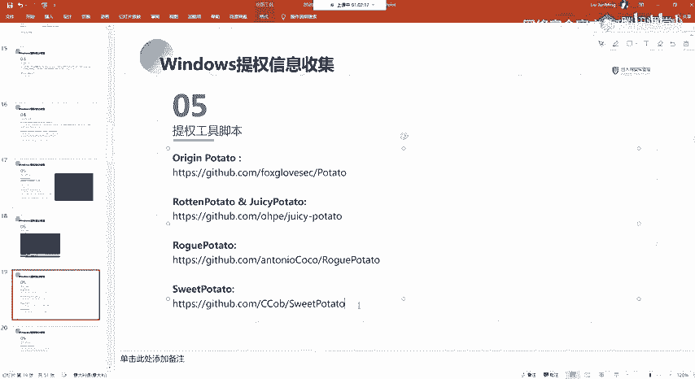