# B站最全网络安全教程，整整1300集，全程干货无废话，别再盲目自学了，看完学不会我退出网安圈！（web安全｜渗透测试｜内网渗透｜CTF） - P92：91. 第四十一天：Windows服务漏洞提权、Windows注册表.mp4 - 网络安全官方教程 - BV15u4y137cQ

就基本的一个思路就这样。啊，还有就是在web share下面执行命令的这样子的一个呃工具。这边的话就是介绍这两个就是。这个an six他们的这样子的一个就是基于这个求的一个修改吧。

就用于在web share下面去执行命令。就是说我们可以就说如果我们得到了web share，我们可以通过这样子的一个工具。我们直接在we share下面去执行之后的话。

能够去得到它的一个呃sem的一个权限。那比如说呃这边的话是它的一个用法嘛，就是直接执行，对吧？我们可以直接去以系统的一个权限去执行啊。那么我们能够就是说能够通过这样子一个工具去去提全的话。

那么他能够去执行命令。然后的话我们就可以去反弹一个这样子的一个C的一个权限的一个 share嘛，对吧？比如说我们上传一个，比如说MSF生成的一个可执行程序，对吧？然后的话通过它的这一个提全工具去执行。

然后执行之后的话，它是以一个st的一个权限执行的嘛。然后的话我们就能够去得到一个呃stem的一个sha嘛，对吧？还有呃其他的话我就呃。不介绍了。这个的话大家自己就是其实就是一些工具嗯。

就收集这一些工具嘛，就是以备不时之需嘛。然的话就是介绍介绍这些工具，我们在什么样子的一个情况下面可以去使用。嗯。嗯。😊，Okay。呃。现在50了呀。我这边的话呃大家应该没有什么问题啊，有。

我这边话呃端一下。呃，咱们就不休息了吧，好吧，呃，因为后面的内容的话还是有挺多的呀。嗱。呃，可能的话就是因为时间关系的话，可能。呃，其实我PPT的话已经写的很详细了呀，好吧。然后具体的一个操作的话。

可能我在这节课的话就不会详细的一个去操作了。Yeah。好的。啊呃第三个的话就是windows的一个内核漏洞的一个提全。Yeah。问的是内核漏洞齐全的话，我们通常的话就是呃。首先。这样子的这一些命令的话。

其实呃前面也介绍了，对吧？就首先的话我们会去检查windows的一个版本，它是否有任何已知的这样子一个漏洞。那么我们如何去找，就是它是否有了。首先第一个我们通常的话去找它的一个就是它的一个系统，对吧？

它的一个系统的一个版本。然后的话这一些系统的一个版本，它对应的是否呃就是有现成的，或者说有爆出过对应的这样子的一个能够去提全的一个漏洞，对吧？然后的话就是通过去查找对应的一个补丁号。

就是确定这样子的一个系统版本下面它呃是否有打对应的这样子的一些补丁，对吧？如果他没有打某一个提群漏洞的一个补丁，那么我们正好可以去利用它去进行一个提群，对吧？Yeah。

然后的话还有就是通过抛 share的一个方式来去列出所有的一个补丁啊。呃，这边的话。这边的话就是通过这样子的一个方法，就是通过这个get WMI objectject。这一个的话其呃前面应该也有介绍吧。

就是这个get BMI object的话，类似于就是这个WMIC啊。那它同样的能够去啊对我们的这样子的一些去进行一个这样子的一个操作。就是跟这1个WIMIC的功能是一样的。然后这边的话它是通过就是说。

呃，他同样的是去查找这样的一个ho fire host fixed fixed idea，就查找我们的一个补定号码。然后他这边的话是查找的一个方法的话。

它是从呃windows下面的这一个就是这1个API当中，尤其实它在这边的话有像我们的一个 circler住啊，不 circler口语句一样，对吧？对吧？就select的一个方式。

从这样子的一个呃从这边去进行的一个查找。Good。然后这边的一个查找的话，它其实就是查找对应的呃。从这1个API当中去查找对应的一个信息，然后的话来去找到我们这边的一个补定号啊。Okay。哦。

执行一下吧。嗯。

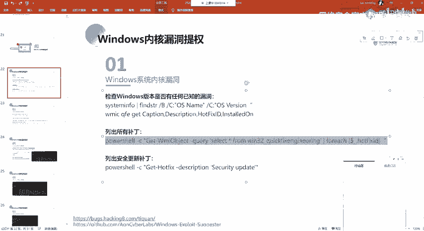

Okay。对吧。没看到呃，结果它就效果他话就像这样子。

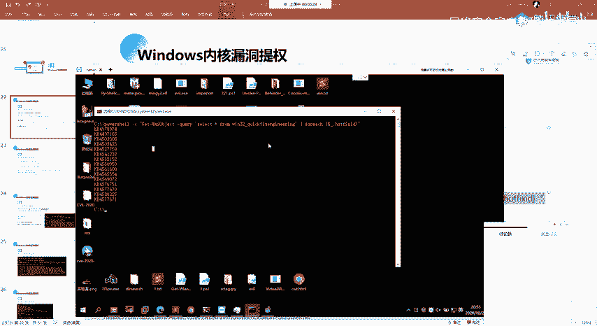

呃，然他列出安安全的一个更新补丁。这边的话跟前上面是一样的。啊呃，下第二个的话就是。介绍两个这样子的一个模块，这两个模块的话就是在MSF下面的两个模块。就呃第一个的话就是in patch。

其实就是列出当前就是列出windows系统下面的这样子的一些补丁。就是说它有打的一些补丁。我们可以通过这样子的一个模块来去进行一个枚举。

然后呃第二个的话就是一个啊windows系windows系统下面的一个就是本地提全的这样子的一个模块。这个模块的话。

它要去探测它要去检测你的一个目标系统下面它是否有存在就是说呃已知的这样子的一些提全的一个漏洞。然后的话它会呃给出建议。就是给出对应的一个建议。它的一个建议的话呃。其实就是这个。Yeah。

就是这边的这个模块，就我们在这边执行之后对吧？执行之后的话，它会去呃以当前我们已经得到这样子的1个MSF的一个shall，对吧？然后的话去探测，然后它探测到如果说存在有对应的一个提群。

就可以去利用的一个漏洞的话，它会有给出对应的一个模块。就我们可以直接用MSF里面它给出了这样子的一些模块来去进行尝试去进行一个提群。嗯。呃，还有的话就是这个。

W们连ATT送whatwson这个的话也是就是一个比较。比较好用的一个。就提前信息收集的一个工具啊，就是。

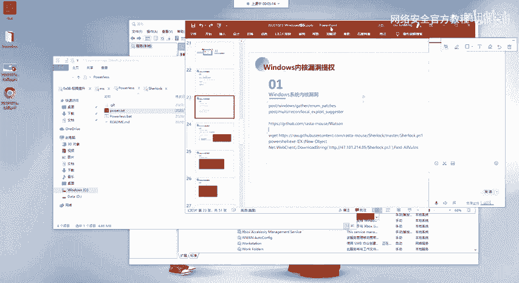

我们直接看效果吧。等一个。对的。It。嗯。Oh。这边的话就是呃执行之后对吧？执行之后的话，他也会去探测，就是给出这样子的一个建议，也就就是建议就是说他可能觉得就是。他会去，因为他这个脚本工具里面的话。

它已经有集成了对应的就是呃探测对应漏洞的这样子的一个呃一些。脚本啊，然后的话他会去探测你当前系统，它会通过他收集的一些信息，对吧？然后的话去进行一个判断。

其实就是一个供你参考的这样子的一个呃一些可可能存在的这样子的一些漏洞。像比如说这边CV20191064对吧？他判断是可能存在的。当然的话这边呃这边他给出了这样子的一些东西的话，就是作为一个参考啊。

就是你可以去尝试。当然的话你尝试之后的话，就是不一定能成。也就是说他这边的话就是仅供参考吧，然后还有对应的话就是有对应的呃相对应的漏洞的一些脚本的一个信息啊，以及它利用的一个啊。

就关于这个漏洞的在油管上面的一个视频啊，对吧？以及还有对应的一个脚本。Okay。然后呃他这边的话，他就是列出来的这样子一些CV的一个漏洞啊，都是比较新的。我这边的话这个工具没有更新啊。

应该就是这个工具的话应该是一直在更新的。这个的话是呃就是上一期讲课的时候那个的。

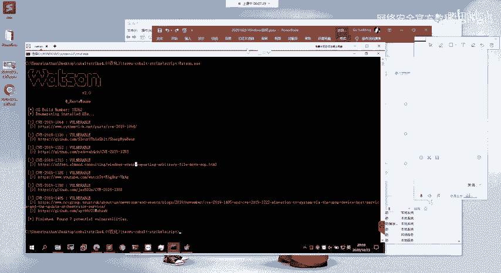

然后大家可以去那个geh上面自己去。找找到最新版本的，然后的话去进行一个尝试。然后呃第二下面这个的话就是通抛弃脚本的一个方法方式啊，就是这个。呃，shlock这样子的一个po的一个脚本。

它同样的就是呃已经他会去探测已经就是已经写好的这样子的一些。可能存在的。这样子的一些提升的一个漏洞。

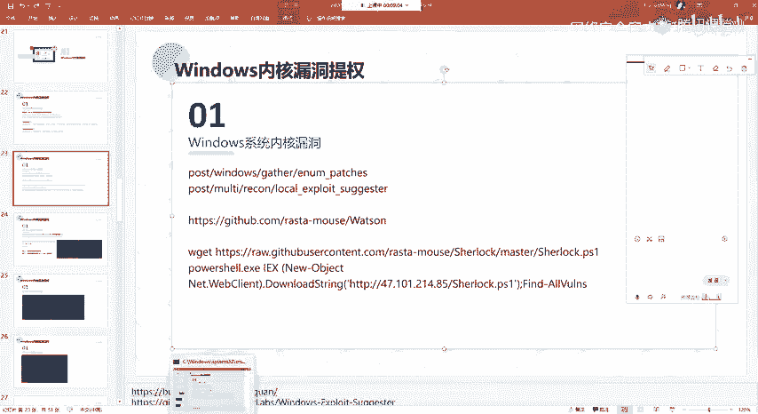

我这边的话。

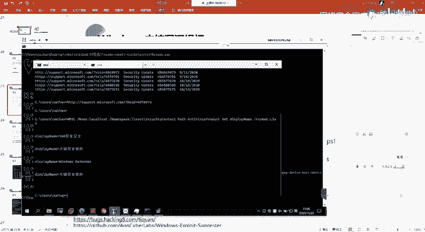

这边啊我在这边执行了，就执行执行了。呃，当然我这边的话我我是直接在本地加载的，然后同样的我们可以去远程加载嘛，对吧？然后在这边的话。呃，我们导入这一个模块，然后的话用这个f OI variance。

然后的话它就会去枚举去枚举这一个系统当中，它可能存在着这样子的一些漏洞。不然的话他在这边的话像。no也就是说他没有发现这样子的一个。然后其实在这边的话，因为我这个它是win10的一个系统嘛。

然后他这边给的这样子的一些呃提全的一个漏洞。win10的一个提全漏洞话都是比较老的。所以的话都没有发现对吧？然后其实这样子的一些。

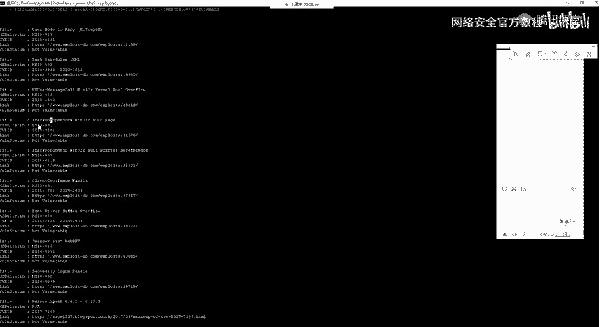

这些工具啊其实都是仅供大家参考，就是呃让大家就是说通过它的这些脚本，他通过对应的一些信息的，就他已经整合了一些信息，对吧？

然后他通过它整合的这些信息来去判断你的一个系统当中是否可能会存在这样子的一些集群的漏洞，那么我们就可以去尝试去进行一个利用了，是吧？

Okay。嗯。然后的话就是这一个windows下面的一个平台的一个提群漏洞的一个集合。

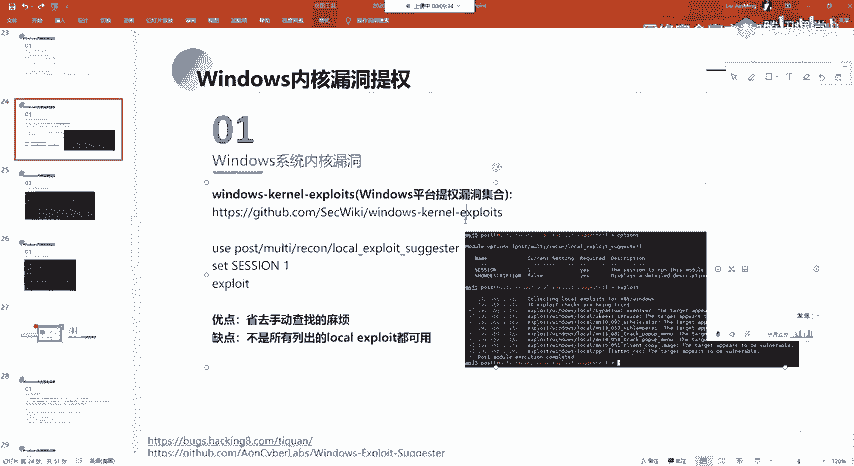

关于这个的话，大家可以看一下这个链接，就get H上面的这个链接这个网址。然后它这边的话就是收集了就是window系统下面的啊所有的这样子的一些就是内核的一个提全的一个脚本。

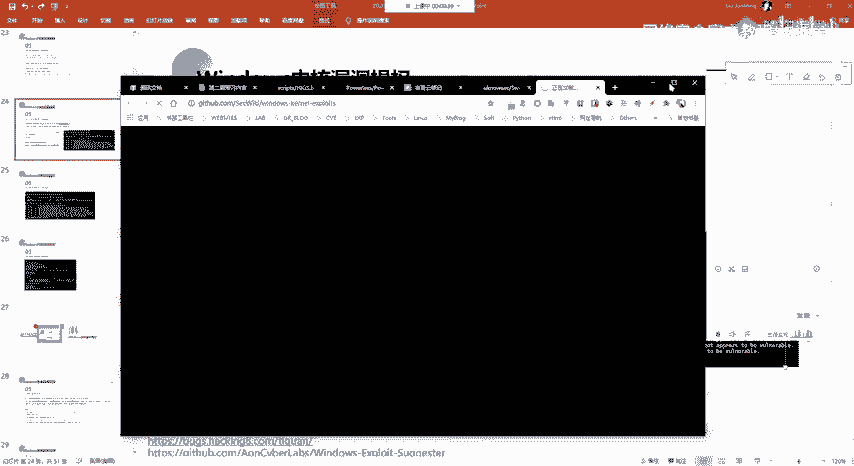

这一叉P。那比如说我们以这个MS16034为例，对吧？然后他在这边的话就给出了这样子一个脚本。哦。它是1个CC加加的一个脚本嘛，对吧？然后我们可以去编译它，编译的话可以去编译成一个呃可视性文件嘛。

然后的话执行。呃。Okay。还有的话就是有已经编译好的这样子的对应的呃。windows下面的一些内核的一个提全漏洞的一个利用校准。

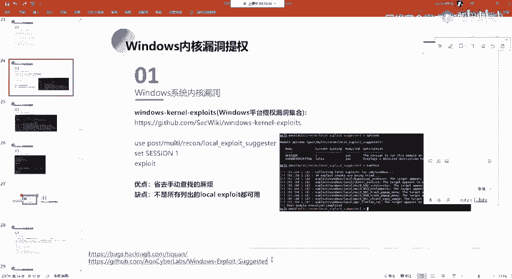

以及在这边的话，就是。

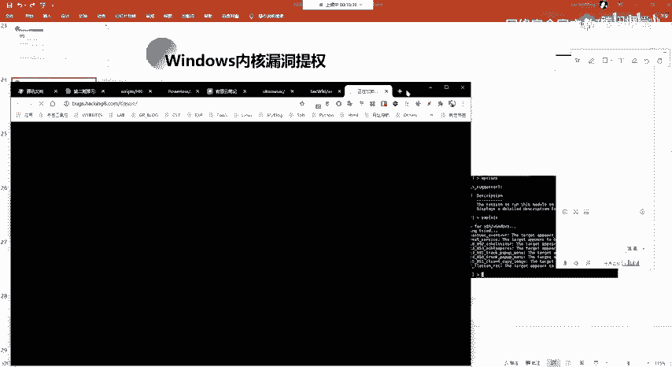

一稍个网站嘛。就是这一个。就这一个。有一个windows提现的一个辅助工具。就是我们在这边的话。它的这个辅助工具的一个原理的话，其实就是它呃我们把我们的一个stem in的一个信息。

因为我们的一个sem systemem in的一个信息里面的话，就包含它的一个普定号码，对吧？然后的话我们粘贴进来，粘贴进来之后的话，我们就可以去查询。像比如说呃未修补的一个漏洞，已修补的一个漏洞。

对吧？然后我们查询查询之后的话。像比如说我在这边。

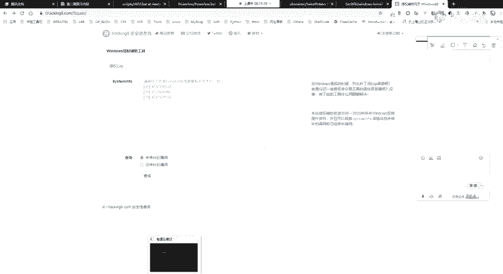

Yeah。Yeah。

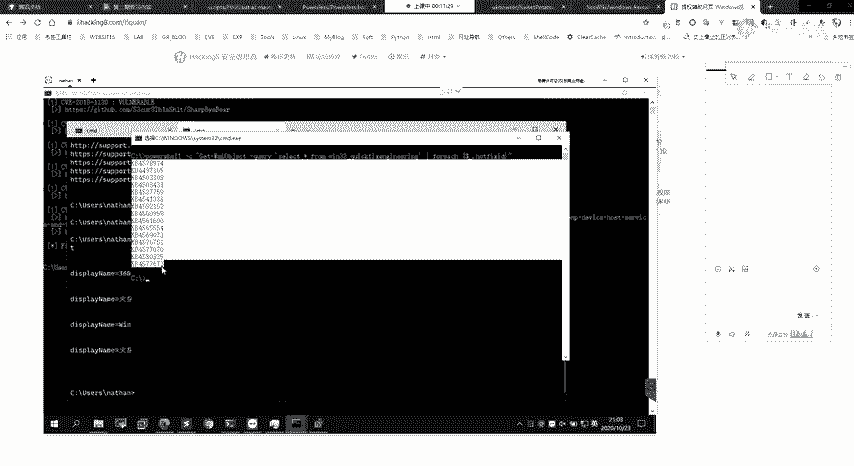

Yeah。好。有这。啊，这边的话我就不尝试了。就是他这边的话，你把这个info的一个那个补丁号啊，把它给call到这边来。

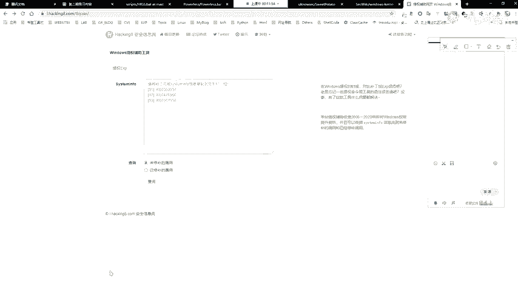

呃，他要他要是这样子的一个格式。

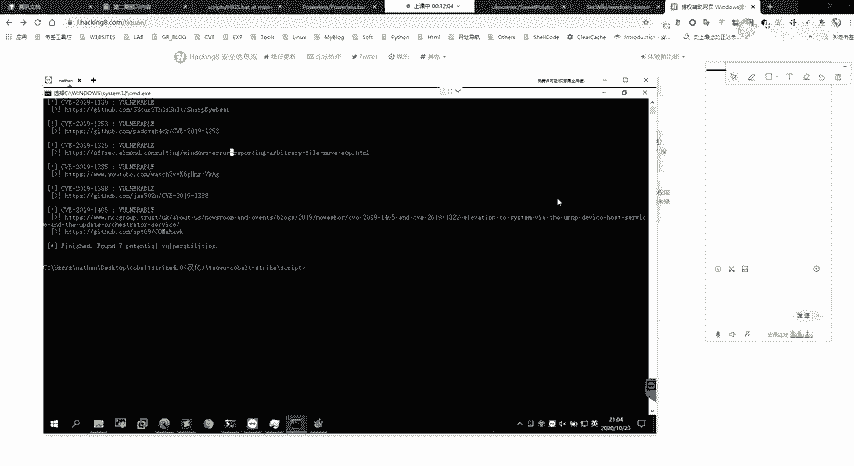

就是要是这样子的一个格式，第一个第二个第三个对吧？它是这样子的一个格式，然后的话查询查询之后的话，它会有返回一个结果。哎下他用他的这个。绑开这一一个结果的话就是像这样子。

然后他就是他为你找到这样子的一些E叉P嘛，这些E叉P它就是就是你的提供的这样子的一些呃。补丁号当中的话，就是没有包括的这样子的一些可以去利用的这样子的一些E叉P的一个漏洞，是吧？

然后像比如说我们以这一个为例是吧？然后这边的话有一个补丁编号，我们右键就是啊我们跳转到这一个链接之后的话，它其实就是到了我们这边刚刚的这个windows的一个呃内核漏洞的这样子的一个geth的一个页面。

然后在这边的话就有对应的，就是说对应的这一个呃提群漏洞的这样子的一个利用的一个脚本，对吧？然后以及它的一个用法。就这边的话，像在这边就他的这一个提评动的话，我们执行执行他的一个脚本之后的话。

直接得到了一个系统的一个权限，对吧？

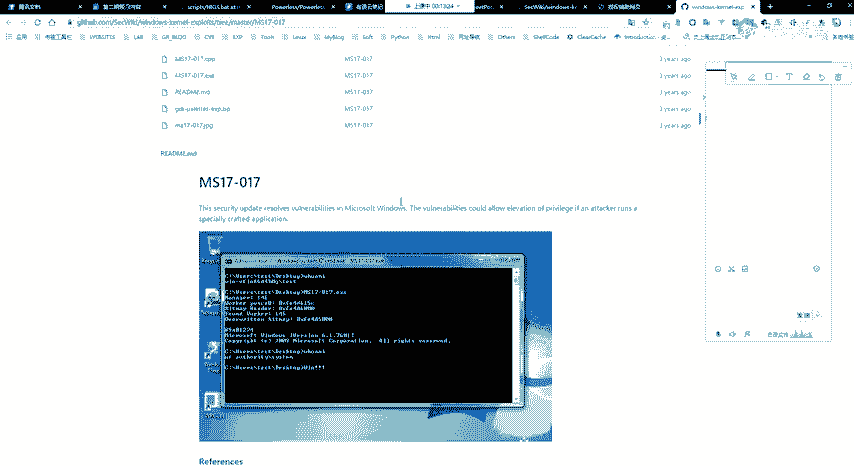

あ。Yes。没。呃，还有其他的话，这边的话我都放到预习内容当中，我就不一得带大家看了，好吧。哦，呃，在这边的话就是这个MF的这个localex suggest的这个模块，它的一个效果的话就是像这样子。

啊。然后呃我们执行之后的话，他会有给出这样子一个建议，就是我们可以尝试用这样子的一些模块去进行一个提全。然后的话以及我们使用其中的一个提全模块，对吧？能够呃成功的去得到一个seatem的一个权限。

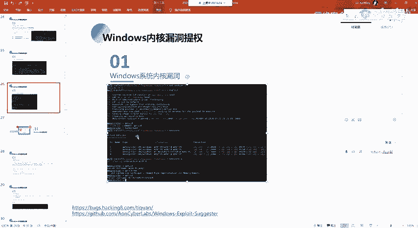

这边呃丹前这边的话是一个呃普通用户，对吧？我们得到一个需儿的话是一个普通用户。然后的话我们通过这一个脚本，它执行执行之后的话，它得到了它会重新得到这样的一个筛选，对吧？

能够呃成功的去得到一个stem的一个权限。

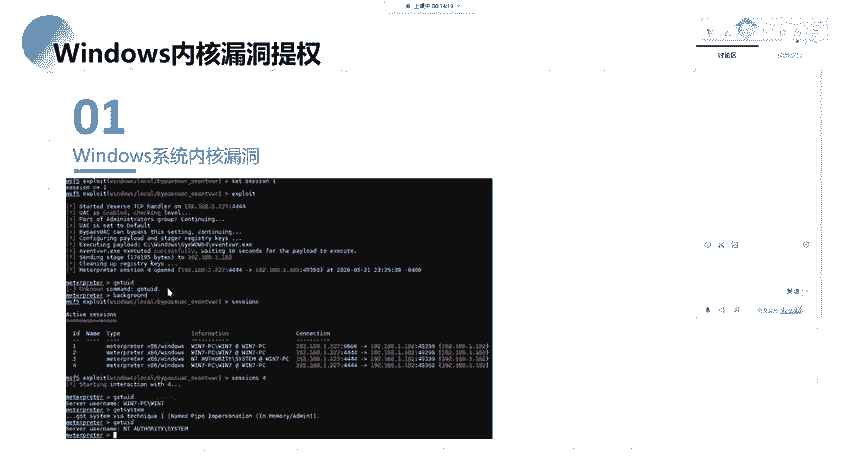

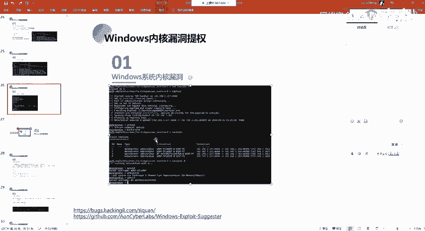

这边呃当前这边的话是一个呃普通用户，对吧？我们得到一个需R的话是一个普通用户。然后的话我们通过这一个脚本，它执行执行之后的话，它得到了它会重新得到这样的一个筛选。这边呢有一个筛选四生成了，对吧？

然后我们进入了这个筛选四之后的话，我们可以直接通过get system来去得到它的一个系统的一个权限。就其实我们当前这边的话，其实是一个普通用户的一个权限。它不是一个admin的一个权限。

然后我们通过这样子的gy的话，如果说你是一个普通用户权限的话去。执行这个getaxy什的话，你会报错。就是你要去得到它的一个系统的权限的话，你需要呃有一个addmin的一个权限。

当然的话就是呃也有可能就是存在存在这样子一个情况。就是你直接执行的话，你普通用户也能得到些什么的一个权限。就是上一期的话有。

呃，有同学是这样子的一个情况。当然的话如果你能够直接的去得到的话，呃，那更好吧。Okay。然后其实实际的话，实际的一个情况的话，可能会是像这样子。

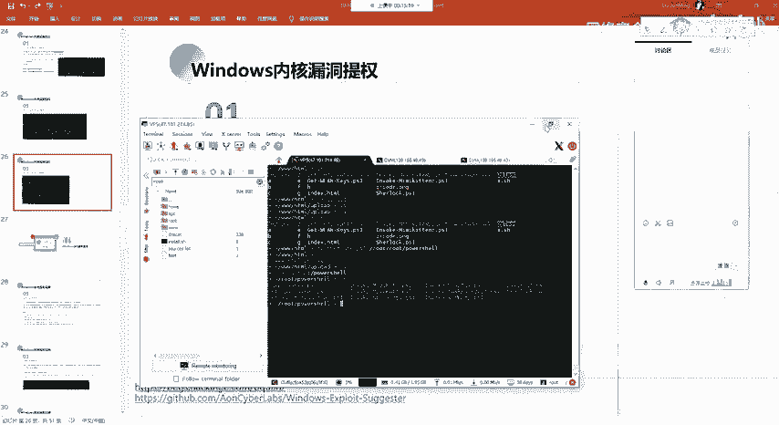

就是像这样子对吧？我当前的话是一个这样子一个普通用户，然后我g galaxyaxy什的话，他会去尝试用这样子的一些方法来去进行一个提全。然后的话他。你班噶。然后我们是普通用户的话。

我们无法直接的去get system去得到他一个s的一个权限。

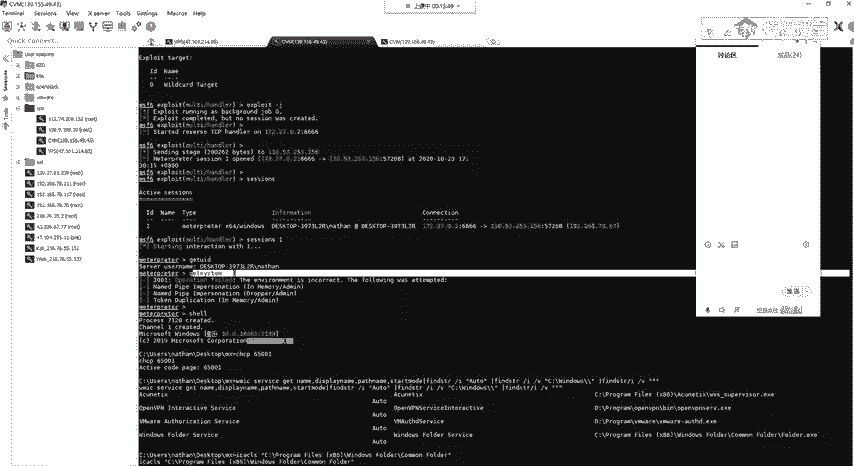

然后在这边可以的话，是因为我们执行这个脚本之后的话，它其实有它其实已经做了相应的一个权限的一个提升。然后的话我们直接通过这个该该c什就能够去得到它的一个C system的一个权限。

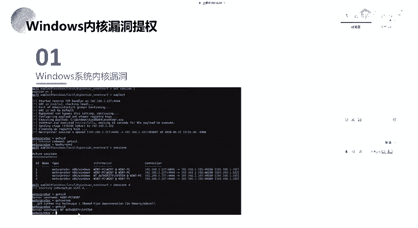

诶。前面的一个内容的话，大家应该没有什么疑问吧。大家有没有什么问题呢？应该都能听得懂吧。呃，其前面的话这些内容的话。就是呃。介绍了一些工具，对吧？介绍了一些工具，以及我们常用的一些信息收集的一个命令。

以及就是结合这一些信息，我们呃可以去使使用对应的这样子的一些工具来去进一个提全。啊，哦，下面的话下面的话就是。呃，我们的最后一部分内容就是windows系统的一个服务漏洞的一个提群。

首先第一个它就是这个可信任的一个服务路径。这个可信任服务路径的话，它的。他的一个呃。特点或者说我们能够去进行一个利用的一个点的话，就在于呃它是有这样子的一个特性。就它存在缺陷的这种服务程序。

就利用属于可执行文件的一个文件文件夹权限。然后的话windows服务通常它会以一个stem的一个权限去运行。所以的话在系统它在他再去解析这样子的一个服务的一个二进制文件。它对应的一个文件路径空格的时候。

它也会以系统的一个权限去进行一个解析。然后的话它的这个漏洞话就是利用的这个特性来去进行进行的一个权限提升。呃，大家可能看这一段文字的话，可能不是很很很好理解。我这边的话以这样子一个例子给大家做一个解释。

就是呃在这边的话。在这边的话就是呃它是这样子的一个服务，对吧？然后这边呢这一个嗯。这边这个服务是他所去执行的一个程序的话，就是这一个这一个程序。然后这一个程序它的对应的一个路径的话。

就是这样子的一个路径，对吧？然后它起这个服务的话，它是就一般的我们的一个系统的一个服务。它所之前执行的一个权限的话，它都是一个系统的一个权限去进行呃，以一个sstem的一个权限去进行一个运行的。

然后在这边的话，他再去启动这个服务的时候，它同样的也是一个s统的一个权限去运行，对吧？然后在这边它有一个问题的话，就是他再去解析。他再去找到找到这样子的一个服务。它所对应的一个可执行文件的时候。

他会经历这样子一个过程。就是它的这一个可执行程序文件的一个啊所在的一个路径，是这样子的一个路径，对吧？然后他会对这边的这个路径的每一个空格，他会去尝试去寻找。呃，其其实其实就在这边我这边的这一句话。

就是他会去尝试寻找，然后的话执行名字与空格前的一个名字相匹配的一个程序。也就是说他再去查找这一个服务，它对应的一个可执行程序的这一个路径的时候，对吧？他首先会找这一个。

就是找到C盘下面的这一个program。因为这边的一个program fire的话，它中间是有空格的对吧？然后他去查找的时候，他会找到这一个Cpro这一个程序。呃，找到这个路径下面。

看它是否有这样子的一个program点EX一的这样子的一个可执行程序，对吧？如果说有的话，那么它就会以一个stem的一个权限去执行它。然后如果没有的话，那么它就会继续往下找。

然后找到像比如说在这边windows project，对吧？这边同样有空格，它会在这一个目录下面，它要找是否有这样的一个windows0X一的一个可执行程序。如果有，他也会以C的一个权限执行。没有的话。

他继续找对吧？直到找到最最终的这样子一个呃程序。然后呃在这边的话，那么我们针对它的这样子的一个就是这一个缺陷，我们如何去进行一个利用呢？其实我在这边的话，其实呃。我们来一起看一下。

就是通过前面的一个讲解，我们能够大概的理解，对吧？就是他的这样子的一个就它的一个解析的一个机制。然后那么我们去进行一个利用的话。因为他会去一就一个一个目录的去查找。

就是说它空格前面它是否有对应的这样子的一个可执行程序对吧，然后的话去以C什么的一个权限去进行一个执行。那么我们就是说首先的话我们去请去检查我们的一个呃。不是就是说我们首先的话就要想对吧？

我们如何去进一个利用。那么就比如说我想要去得到，就是说我想要去得到它的一个stem的一个权限，对吧？我们要去去利用这样子的一个权限去得到它的话，那么我们。呃，他会去进行这样的一个检锁，对吧？

他会去有这样子的一个步骤去执行解析这样子的1个EX1的一个程序，对吧？那么我们是否可以去尝试去生成这样子的一个。像比如说在它的一个路径是这一个，对吧？我们知道它的一个路径是这样子的。

那么我们是是不是可以去生成一个，像比如说program点EX1把它放到我们的一个C盘的一个根目下面，对吧？然后的话在这个服务他去他去呃加载的时候，对吧？他去启动启动的时候，他就会去找。

然后的话他找到这边的话，他就会去找到我们这边所生成的这样子的一个呃可执行程序。然后这个可执行程序的话又就是我们的一个反弹需尔的一个码，对吧？那么它去执行它解释执行。解释执行的话。

它是一个s的一个权限去执行的。那么我们他执行这边的一个我们的一个码的话，我们就能够去得到他的一个设计层的一个权限，对吧？然后同年的话就是呃。其他的一个目录，我们同样的也要去，我们也可以去尝试，对吧？

然后我们要去呃达到这样子一个目的的话，就有这样子的一个条件，对吧？首先第一个的话就是我们要去像这一个目录去上传这样子的一个我们生成的一个码，对吧？那么这一个目录像C盘的这种目录下面的话。

我们如果说是一个普通用户话，我们无法去像这个目录去写的去写这样子的一个文件的对吧？以及呃C盘的这种其他的这样子的文件夹下面的话，我们也有可我们也可能就是无法去写去上传我们这样子的一个文件。

因为我们没有权限嘛，对吧？那么在这边的话就是有一个问题，就是我们需要去找到一个这样子的，就是就是以这样子的一个形式，它中间是有这种空格的这种服务，对吧？

以及它的这样子的一个它的这一个去紧锁的这样子的一个路径。这一个目录下面的话是有一个我们能够去写文件的这样子的一个目录。就是说我们有权限去向这一个目录去写一个这样子的一个EX的一个可执行程序文件，对吧？

所以的话在这边的话，第一步我们需要去做的话就是检查目标主机它是否可能存在漏洞。呃，在这边的话就是去通过这样子的一个呃脚本，就WYIC来呃去。啊。

service的话就是去查找呃与服务相关的这样子的一些信息嘛，然后它的名字啊，它展示的名字对吧？呃，路径对吧？等等的这样子的一些信息。然后我们对它做一个输出。然后其实在这边的话，它查找的一个方法啊。

就是呃他查找这种服务，它的一个路径当中，它是否有这种空格，对吧？因为我们前面它的一个特性的话，它就是去它会去解析空格前面的这样子的一个呃文件嘛，对吧？然后第二个的话就是如果说我们找到了。

像比如说在这边我找到了这样子的一个服务，对吧？它是符合我们这边。第一个要求。然后下面的话我们还需要去去找到，就是说它的这个服务路径，它是否有一个我们是否有一个写助的一个权限。

就通过这个ICACL这个命令来去进行一个检锁。好。结果的话就是像这样子。我们检锁到检锁这一个目录。呃，当然这个目录的话是呃。就是其实不是一个真实存在系统上面的一个目录。

我这边的话是为了就是做这样子的一个就是给大家讲课嘛，对吧？就是呃做了这样子的一个目录啊，以及做了这样子的一个服务。然后我们在这边的话，我们去检索这一个目录，检索到它的一个权它的这样子的一个权限。

关于这边的话，我们主要的话就是看这边F的话就是表示完全控制。以及呃在这边前面的话，首先的话就是你的一个用户。然后后面的话冒号后面的话接的就是权限，各各类的一个权限，对吧？

我们主要关注的话就是这一个F的话，就是完全控制。也就是说这边的这一个前面的这个用户，他对这个目录是有一个完全控制的一个权限，也就是他能有对这个目录下面去进行一个写读等等的这样子的一些呃操作，对吧？

然后在这边的话就是有一个特殊的一个权限，就是这个everyone。然后我们可以看到这边everyever的话，它同样的有这样子的一个完全控制的一个权限，也就是什么意思呢？

也就是呃任何用户他都有对这一个目录有这样子的一个呃可以去写文件，可以去读取，可以去进行呃这样子的一些操作的一个权限。那么我们确定了这样子的，我们通过这样子的方法确定了这样子的呃。

一个服务以及它存在这样子的一个可以去写的这样子的一个文件。那我们下面的话就可以去尝试去生成这样子的一个配load的。对吧然后我们在这边的话是找到的是这一个windows这个目录，对吧？

那么我们要去生成的这样子的一个可执行程序的一个文件名的话，就是我们可以看一下这边是吧？是这一个目录可以写。那么我们要去生成的一个文件。这可执行程序文件的话就是这个commonXE。

因为他在去解析到这个目录的时候，他会去解析这边空格前面的这一个common这一个可执行程序，对吧？如果它有解锁的话，它就会去以一个st的一个权限执行嘛，对吧？

那我们像这个可选目录下面去上传一个生成的这这一个呃法拉西尔的一个码，我们上传上去，然后这个服务它重启的时候，它就会去加载它。这边话就是呃生成的一个步骤，这部的话呃应该大家都很熟悉了，我就我就不多说了。

然后的话上传到我们的一个目标的一个啊目录下面，对吧？上传上去。

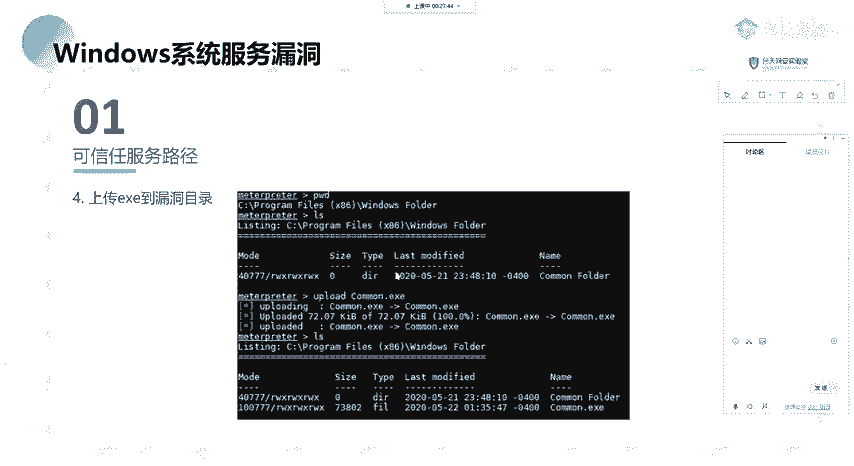

上传上去之后的话，我们需要去重启服务。

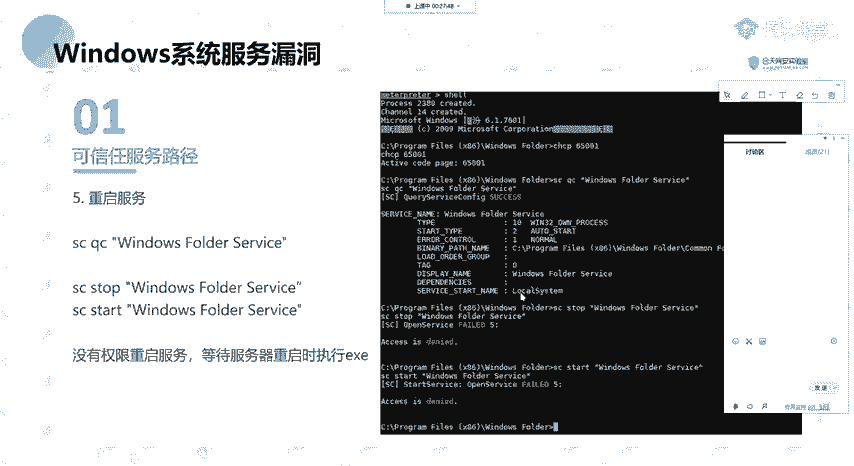

因为呃我们在这边我们把我们的呃这种这个可执行程序我们上传到目录下面去了，对吧？但是它上传上去的话，他不会去自己主动的去执行，对吧？它是需要去等这一个服务，它再重启，也就是说它是会。

它是在这个服务它重新启动的时候啊，系统它才会去啊以我们前面这边的一个方法来去进行一个解析执行。来去进行这样子的一个方法呃，这样子的一个步骤去进行一个呃紧锁，对吧？

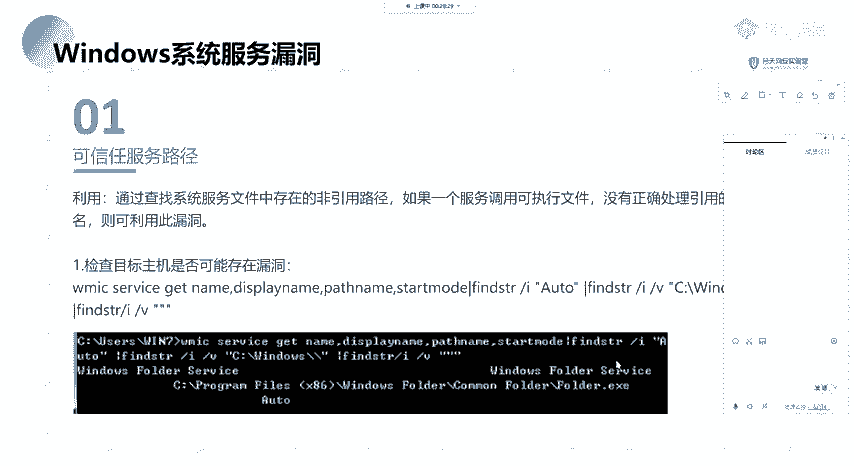

所以的话在这边我们还需要就是说他的这个服务的话，我们需要去对它做一个重启。对。首先的话就是呃我们可以通过SC的这个呃命令函程序，对吧？因为我们知道这个程序的话，我们可以去进行一个啊服务的一个控制紧锁。

对吧？然后QC的话就是去进行一个查找，去查找我们这边指定的这个服务，它的一个相关的一个信息。就是像在这边像比如呃它的一个启动的一个状态，启动的一个类型，就而 type，就我们的一个服务启动类型的话。

就是有启动禁止啊，不是有那个就是。

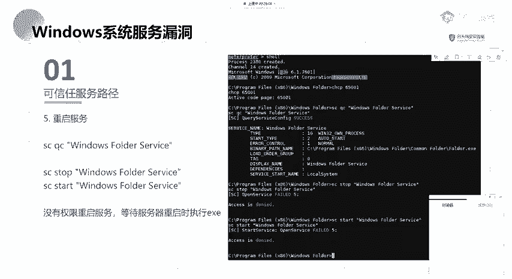

呃 one是那个。Yeah。嗯。对。嗯。Okay。对吧就是启动类型的话有手动自动嘛，然后禁用对吧？然后呃在这边的话就是al start的话，就是表示它是一个自启动的。

也就是说它会随着系统启动而启动这样子的一个服务。然后呃在这边的话就是我们。呃，会有这样子的一个问题啊，就是我们因为我们当前得到这个权限的话，是一个普通用户的一个权限，对吧？

我们没有权限去去启动这样子的一个服务。因为它的一个服务的话，它其实是一个st的一个权限去执行，去呃去启动的。所以的话我们普通用户是没有权限的。

也就是我们无法去对这样子的一个服务区进行一个停止以及启动的这样的一个操作。就是像这边呃，我这边截图所示啊，对吧？就access一次的也就是它是不允许你去进行这样子的一个操作的。

所以的话呃我们可能就需要去等待这样等待它一个服务器去重启，然后他去执行这一个可执行程序。当然的话简单粗暴一点的话，就是我们直接需动，就把它的一个主机就续去进行一个关机。当然的话这个的话不是呃比较建意啊。

诶。就是说everyone的话，它就是表示所有的一个用户嘛，就是说你是一个普通用户，也也也有权限去对这一个呃文件去做一个啊写入，去上传我们的这样子的一个程序嘛。不是说呃你是要有everyone。

然后的话你还需要有对这一个目录有一个呃完全控制的一个权限。当然的话如果说你是一个就是。你是一个at的命的话，那么你你就有权限去对他做这样子的一个操作嘛。所以这边的话它是有有条件的呀，注意的话是有条件的。

就是我前面这边讲的啊，我我首先的话需要有。这样子的一个目录来看一下吧。

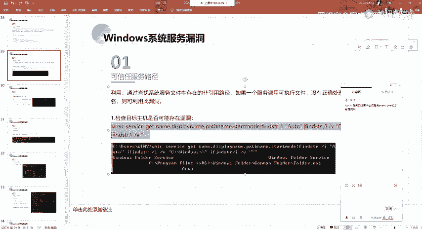

Okay。就呃其实我这边已经有执行。呃，就看我这边的话，我这边已经有啊，重新说一遍吧。

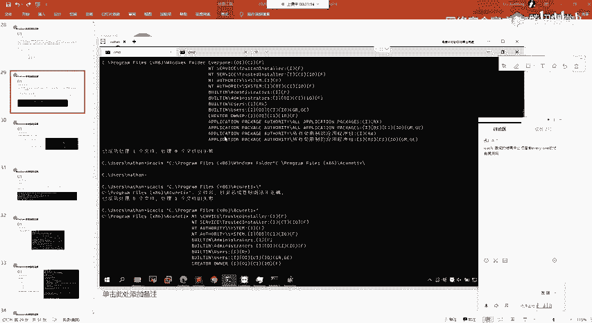

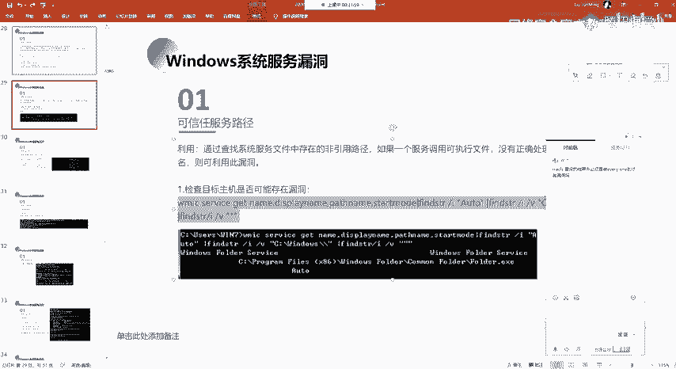

Okay。

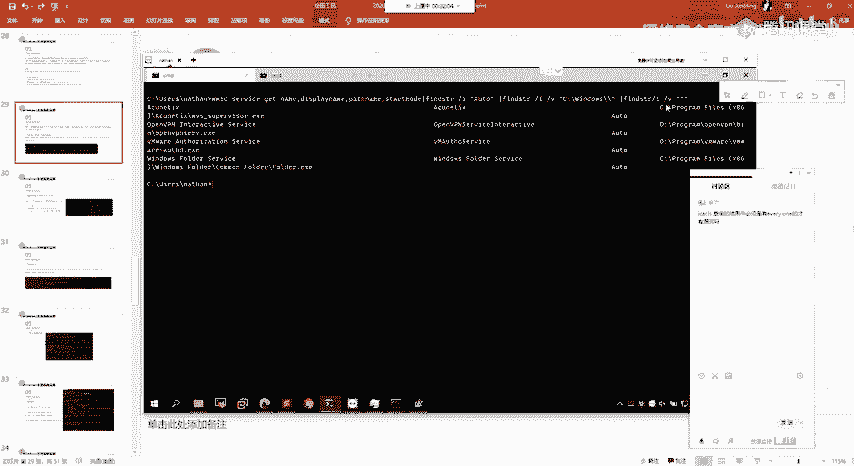

执行之后的话，在这边他有找到这样子的呃1234个符，对吧？这四个符的话是满足我们的地点要求，就是它的这样子的一个路径当中，对吧？它是有这样子的一个空格，对吧？像比如说这边的一个这一个。

然后的话还有就这个。服哥。

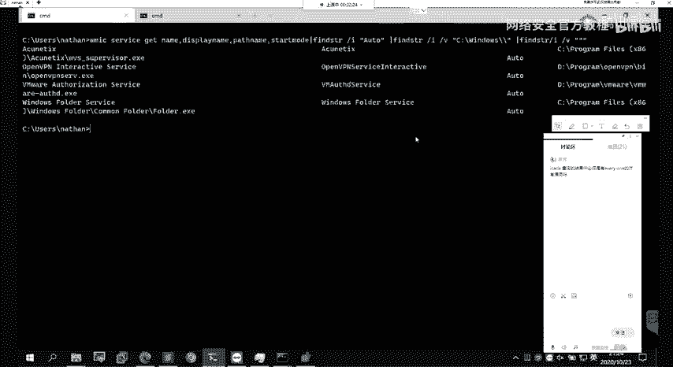

这是第一个。然后第二个的话，我们还需要去一的去通过这一个命令啊去检索它的一个目录。它就是说我们是否是能够去进行一个上传文件，或者就是有写入文件的这样子的一个权限，就是通过这个。

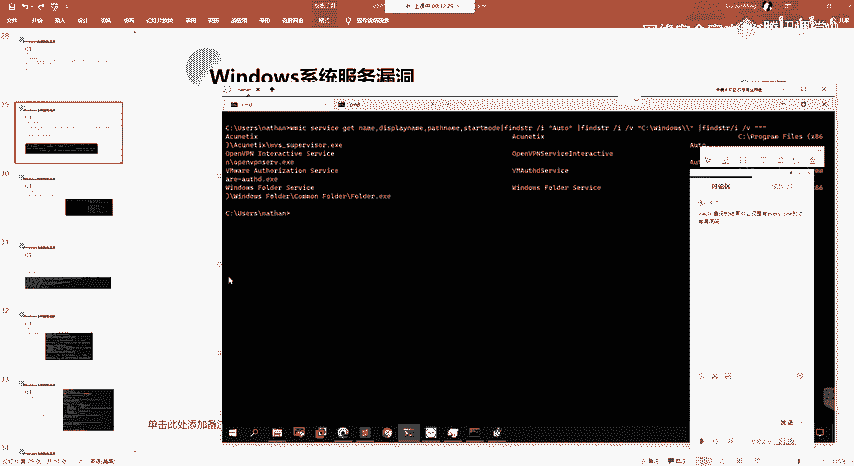

呃。哦。比如说。这一个。这个不行，这个。就这一个目录的话，就是说它的一个空格的话就是在这边，对吧？所以的话你是要去CC盘的一个目录。那么C盘目录的话，我们普通用户的话肯定是没有权限的。

我这边的话就以这一个为例啊。然，呃这一个的话其实就是我们要去找到的这一个目录。就是它是有它是everyone，它每个就是任何用户他都有一个F的一个权限，对吧？然后还有对应的就是说有权限去对这一个目录。

有F控制权限的话，就是像这个tty的int。这一个的话，它是就是系统内置的这样子的一个呃比较高的一个权限。呃，这个。第一个是。

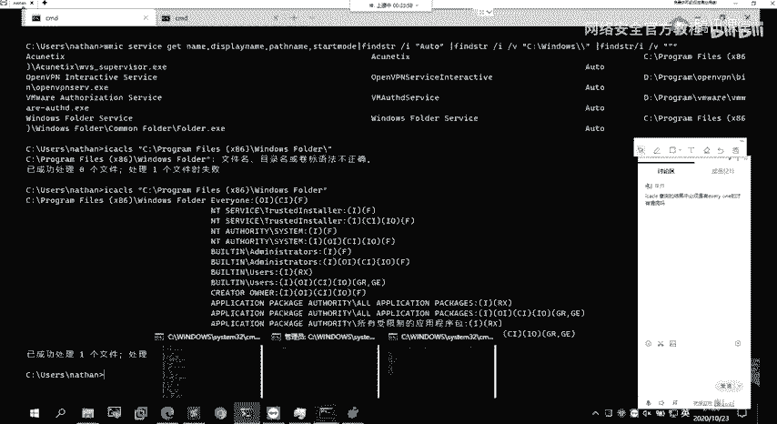

我们等会有的这个。

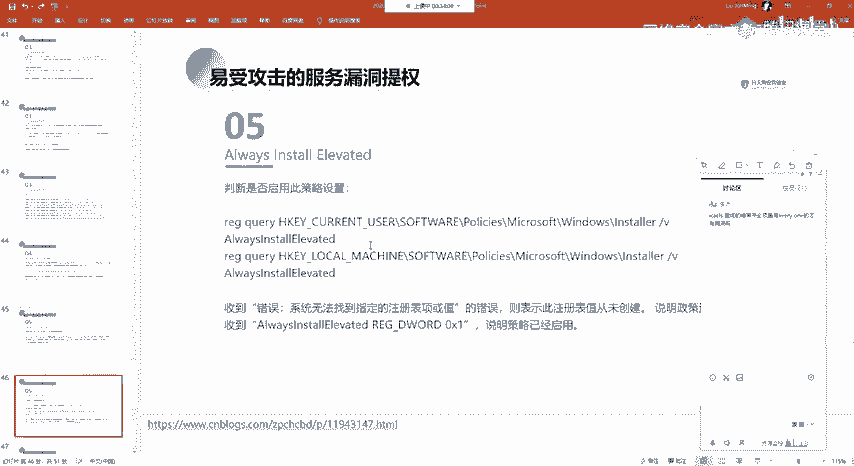

啊，不是。就是还有像这种标T in，就是内置的这样子一个管理员用户，对吧？还有其他的这样内置的。嗯。这样子的一些用户。它是有权限的对吧？然后在这边的话，因为我们没有这样子的一些权限嘛，对吧？

所以的话我们一个普通用户的话，我们只能是就是说这个目录，它是一个everyone都有一个控制权限的。那么这一个目录的话正好符合符合我们的一个要求。所以的话我们可以去采。

可以就是呃像这一个目录去呃上传我们的生成的一个码。

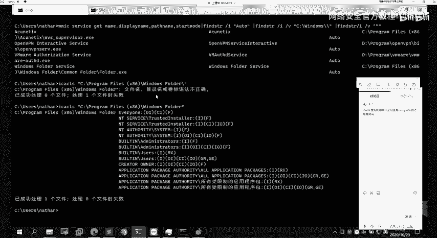

然，呃在这边的话还有一个要注意的一个点，就是这一个。就我们在这边我们把我们重启它的一个机器，对吧？就假设我们把它一个机器重启了。重启之后的话，它会去加载我们这边的一个码，然后的话以系列统的一个权限执行。

然后执行之后的话，我们在这边的话就能够去得到这样一个需嘛，对吧？得到这样子的一个穴。对吧但是的话呃你会你自己去尝试之后的话，你会发现它有一个问题啊，就是你得到了这一个码的话，呃。

就是它弹回了这样子的一个连接之后的话，它立马会断掉。就是这边的话，你断掉之后的，断掉的话，它是因为就说它这边有这样子的一个机制。

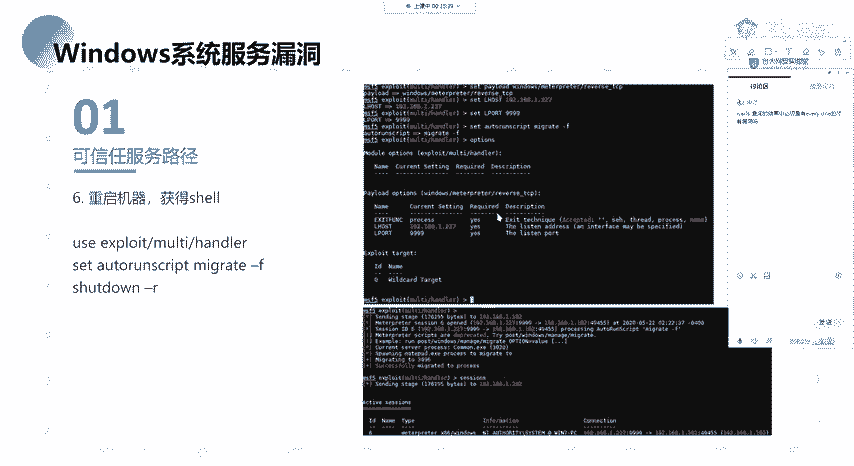

就是。当服务它在windows系统中启动后，它必须要去调核windows系统下面有一个服务控制管理器。它需要与它去做一个通信。但是我们生成的一个码的话。

只是一个就是反特西尔嘛来与我们MSF的这边的一个服务器做一个连接，是吧？所以的话它无法去与它去进一个通信，因为它不是一个符务啊。所以的话他会去就是说他这个管理器，他会认为是出现了错误。

然后把这个进程它会终止掉。所以在这边的话，我们需要做这样子一个操作，就是在它得到需要之后，对吧？它执行之后，我们这边接收到了它的一个绘话，接收到了它的一个连接。临接建立之后的话。

我们立马去做这样子的一个。

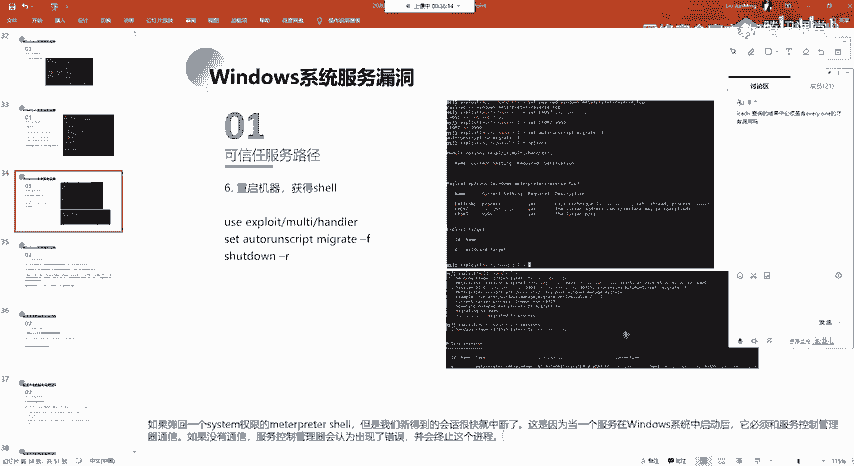

进程迁移。然后把我们当前所得的这个权限的话，把它迁移到另一个进程当中。然后迁移到进程当中之后的话，我们就能够去得到一个稳定的一个绘画，得到一个稳定的一个筛选。然后在这边的话。

我们可以看到我们得到一个筛选的话是一个sstem的一个权限。

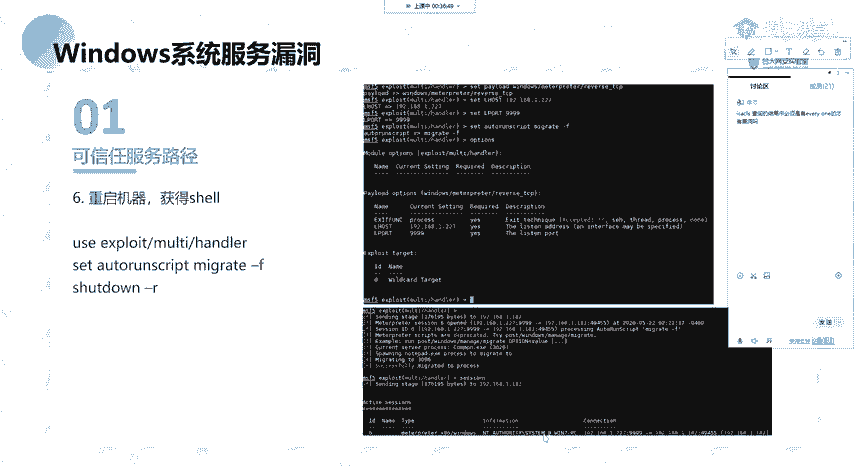

，呃，这边的话我们可以来尝试一下，好吧。我这边的话以。啊，我这边MSF断掉了，重新。

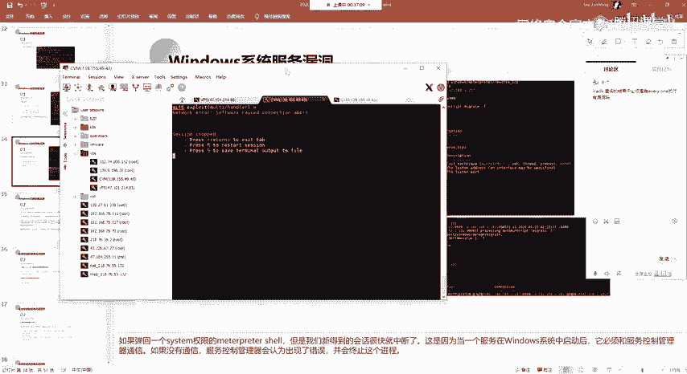

我先慢一下。Okay。Yeah。Yeah。Yeah。Yeah。Yeah。Yeah。对。Okay。Yeah。Okay。嗯。Okay。

Yeah。

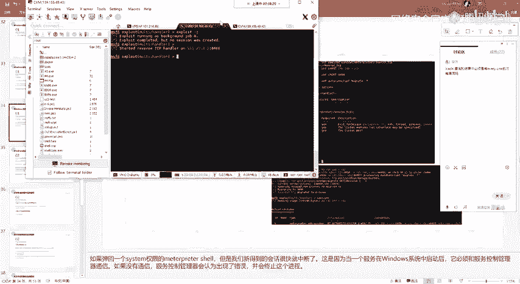

Okay。

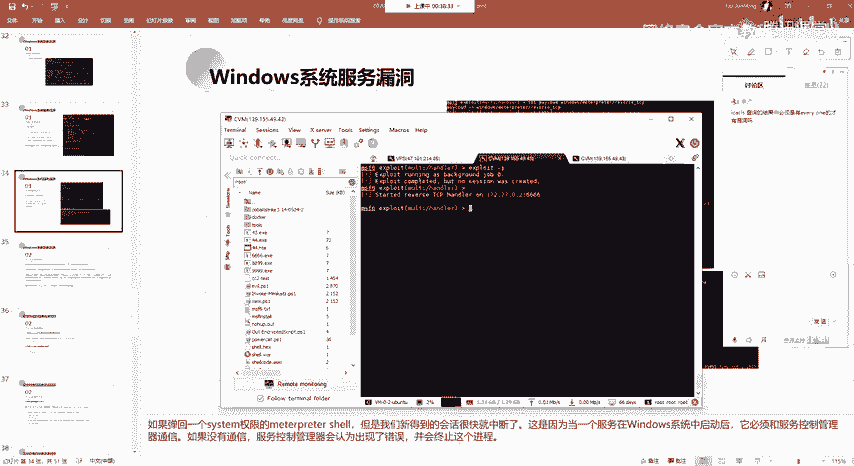

对话我起了1个MSF的一个服务的。写一个今天。Oh a。那这边的话我模拟一下，得到一个吸尔。

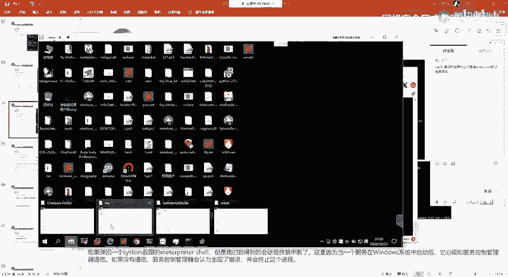

是呃得到这样子的一个普通的一个性。あなか。Yeah。Yeah。Okay。

点卡。Okay。

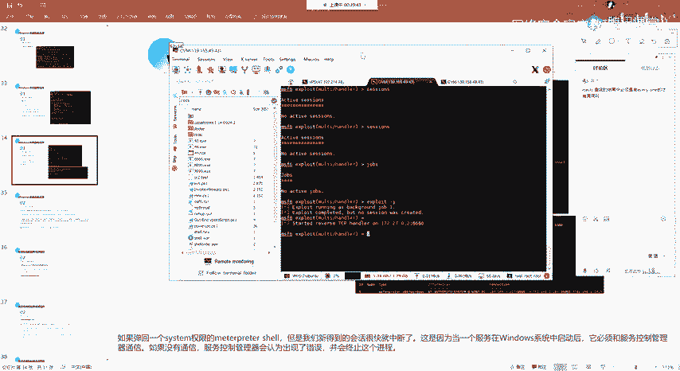

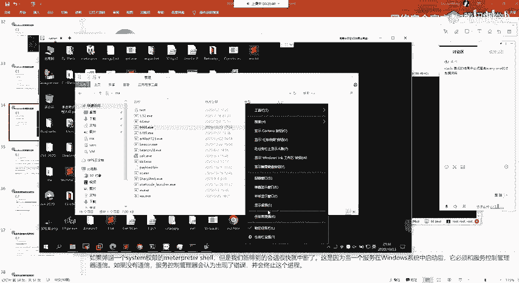

，は。Yeah。

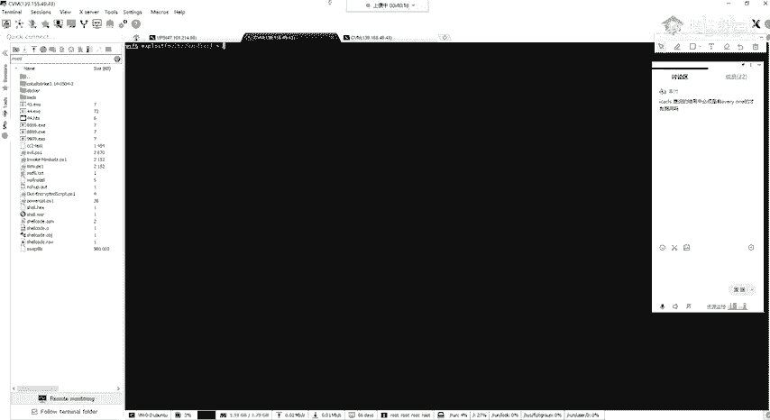

Yeah。Yeah。Yes。

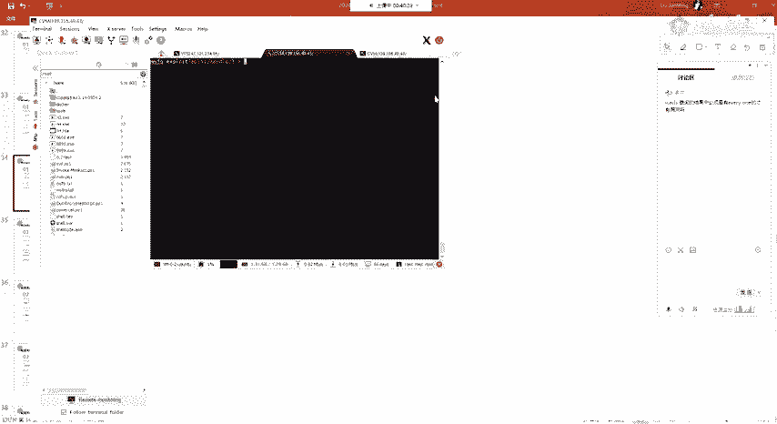

Okay。嗯。Okay。こ。哎，我这陪漏的。は可だ。Okay。Okay。Okay。Okay。嗯。我们当前呢当前的话得到了这样子的一个普通用户的一个选。就是我这边的话就是模拟已经得到了一个选嘛，对吧？

我反弹了一个需，反弹到我们MSF上面去了，对吧？

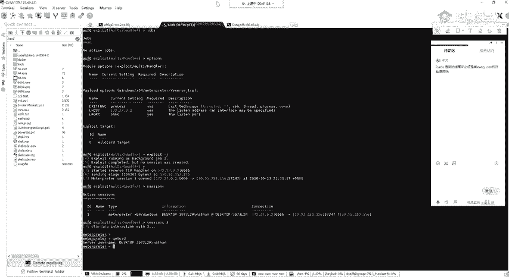

访传上去之后的话，我想要去进行这样子的一个就是去查找我这边得到一个机器，它的它是否存在这样子一漏洞，对吧？那么首先我第一步的话就是去检查它。

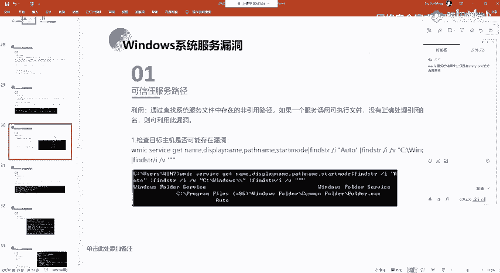

通过通过这样子的一个面料。Yeah。不可。对吧我去执行执行之后的话，找找到这样子一个啊。找到这样子的一个服务路径。2。Okay。Okay。Yeah。路径的话就是。被一个对。然后的话判断它的一个权限。

对吧？发现它是符合我们的要求的。然后这个时候的话我们就可以去尝试去呃上传我们的一个码。呃，我这边的话。

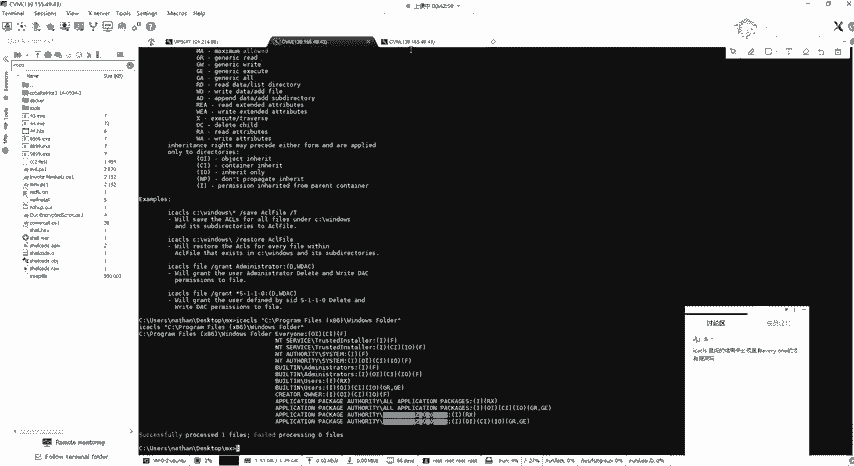

我这边的话。

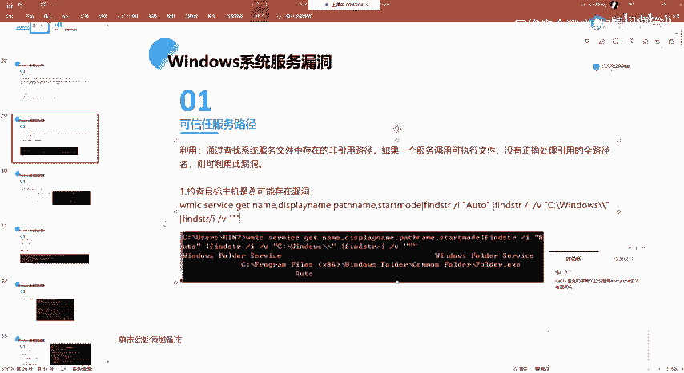

嗯。我这边的话还是以这边的这一个吧，就是我就不我就不重新生成了，我就以这一个。我这边之前已经生成了这一个。

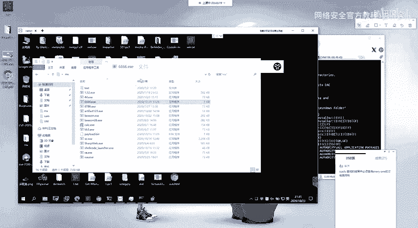

Yeah。就是这样子一个路径，对吧？呃，我把他。和皮。我把它copy到这一个目录下面去。Yeah。Okay。Yeah。Okay。就是呃那一个。Yeah。没。好。Yeah。嗯。

这样的话现在的话已经copycopycopy过去了，对吧？啊，我们可以。查看一下这个目。Yeah。Or。大家要注意的话，就是呃就是这种中间有空格的，这种中间有空格的话，你需要用引号去做一个包裹。

就这边的话是他出错的一个原因啊。然后可以看到我这边的话已经抠过去了，对吧？然后扣过去之后的话，呃哦，我这边其实还要改一下名字。就是我们要改成这个comment点X1，对吧？嗯。嗯。好。

现在他已经改改改改成了，对吧？

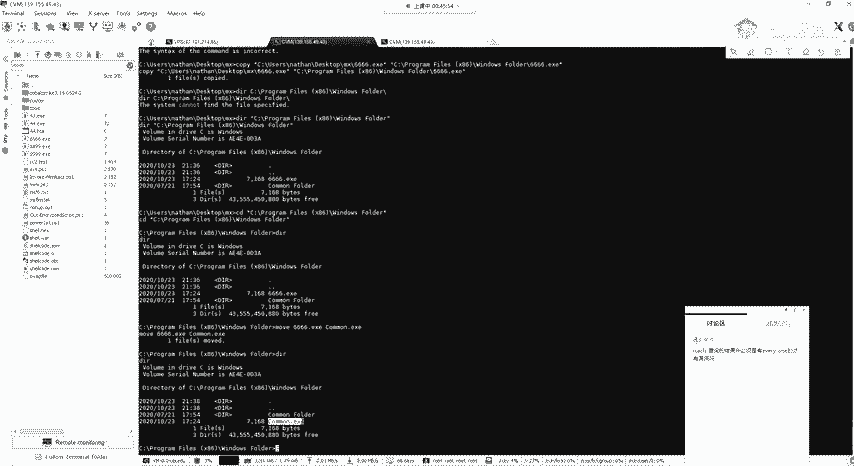

改成了之后的话，我们下一步的话。🤧我们下一下一步动。

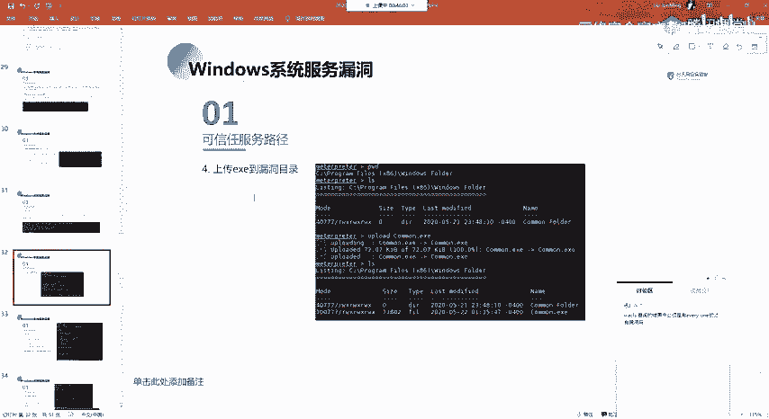

就是需要去重启服务的。但是重启服务的话，我们可以来看一下这个服务啊。Yeah。我们可以通过这个命令去。查看对吧？查看的话，它的这个服务的一个路径，对吧？然后的话我们在这边的话，我们想要去通过SC去呃。

比如说我要stop掉。我要去田子这一个。五。🤧啊，你你没发现的话。😊，他这边是没有权限去那个的对吧？Yeah。嗯，其实。

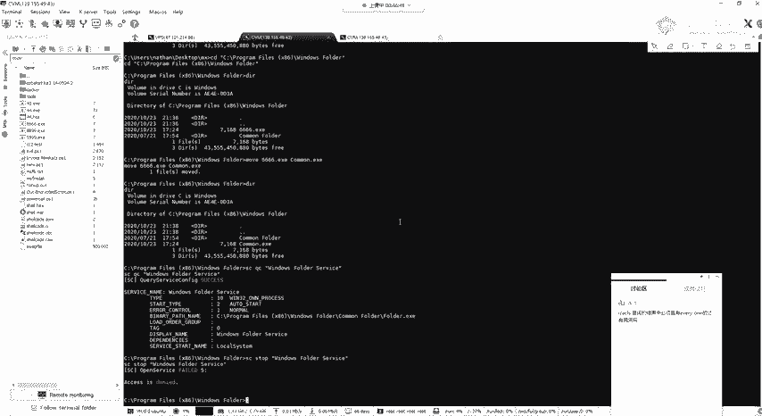

Yeah。然，呃下面的话我为了演示，就是我我我就不重启我这边的这个机器了啊，然后我这边的话，我就通过这样子的一个方法，我去用一个管理员的一个账号去模拟，就是重启这个服。因为呃就是你需要去等这个服务。

你要以那个。你要去等它去进行一个重启，你重启服，你只有他它的一个服务重启之后，你才他才会按照我们前面的那个特性去行一个加载，对吧？当样的话你也可以说就是你让它系统，因为我们前面看的话。

它是一个自启动的对吧？那么你可以重启它的一个系统，让它的一个系统去进行一个自启。然后的话它系统自启的话，那么我们它的一个服务它也会去进一个自启，对吧？好，这这的话我们。Yeah。

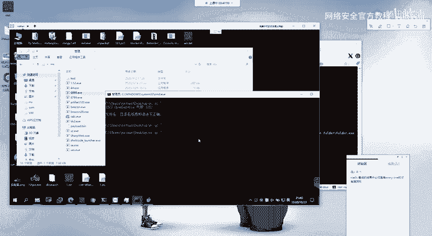

呃，我这边的话要。我先看一下。因为我这边的话没有建立的那一个jobs是。我这边还需要拆再去。Okay。再去检行一个jobs。对呃这边的话，因为我刚刚就是我没有去设置那个选项，在这边呃也说一下。

就是呃你这边的话，前面我们这边对吧？我们建立了这样子一个监听，用这一个hand模块建立监听。建立今天之后的话。建力今听之后的话，它等待我们的一个配漏的连接，对吧？我们的一个码连接，连接之后的话。

它这个坐板它就会断掉。也就是他经理连接后之后的话，这一个任务的话就已经完成了，对吧？然后其实我们可以在这一个。Yeah。

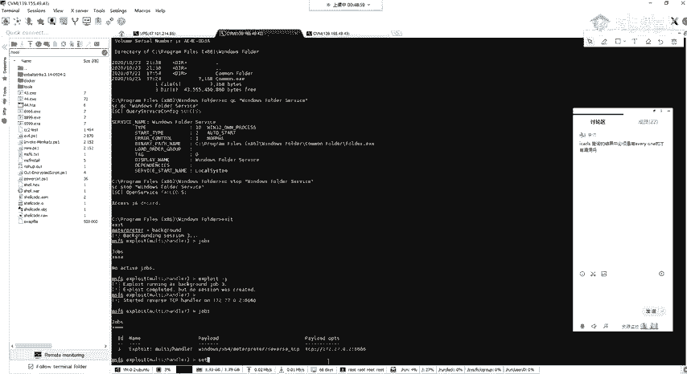

Okay。在这边有一个高级选项，就是这一个。这一个。把它改为改为forse，也就是他这边他尽力筛选之后的话，他不会退掉。就是这边的一个jobs，我这边他没有那个没去设置这一个选项。

所以的话呃尽力筛选之后的话，它这边就会断掉。我不是他会那个jobs时就没有，所的话我这边还需要去呃精贴一个。然后的话我这边的话就模拟我这边的一个服务去进行一个重启。嗯。Yeah。困。

Okay。Yeah。Okay。Yeah。

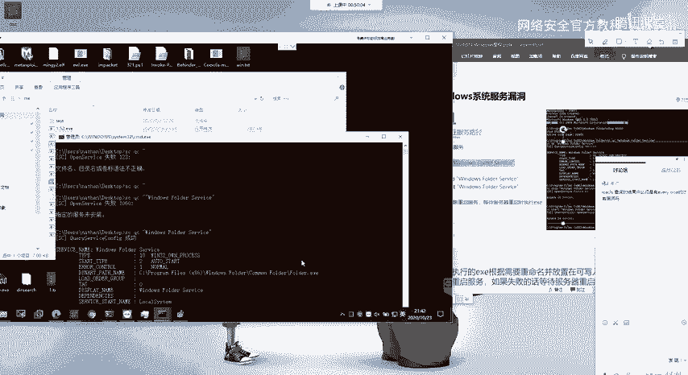

就这一个符对吧？然后我当前的话，我去做一个stop停止量上。我去停止这个服。啊。然后停止之后的话，我再去启动它。So start。嗯。

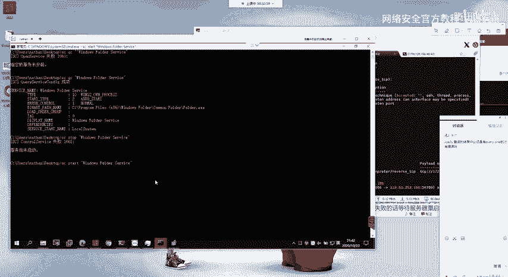

然后我这边启动之后的话，你会发现啊对吧？我这边的话立马就得到了这样子的一个筛选啊。筛选4。然后我这边切到这个是选四，你会发现的话，它这边得到一个权限是一个s统的一个权限，对吧？嗯。

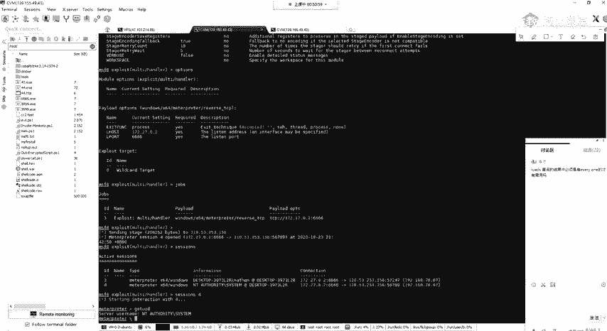

就是一个sem的一个权限。Yeah。然后我这边的话。关的没关系啊。

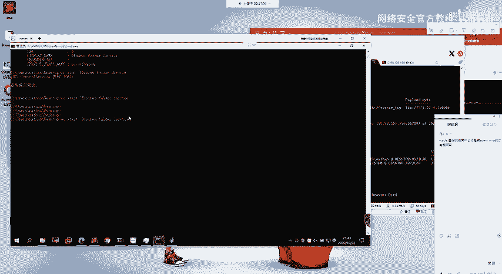

🤧And。你会发现。就是这边的话，他呃我这边执行之后的话，对吧？他我这边的一个绘画的话，立马就断掉。断掉的话，它的一个原因的话就是我们这边的这一个机子。

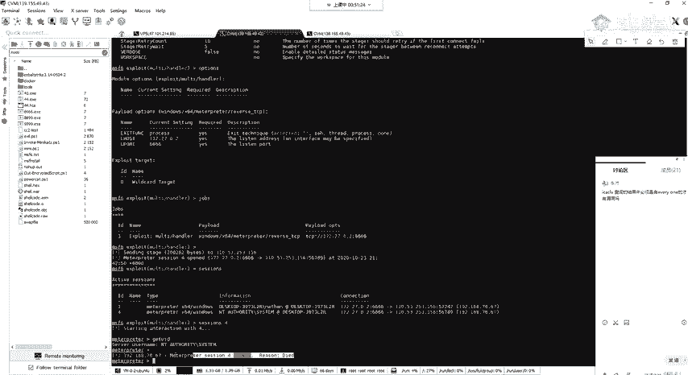

就这边前面所讲的那一个。嗯，那个机子。呃，这边。

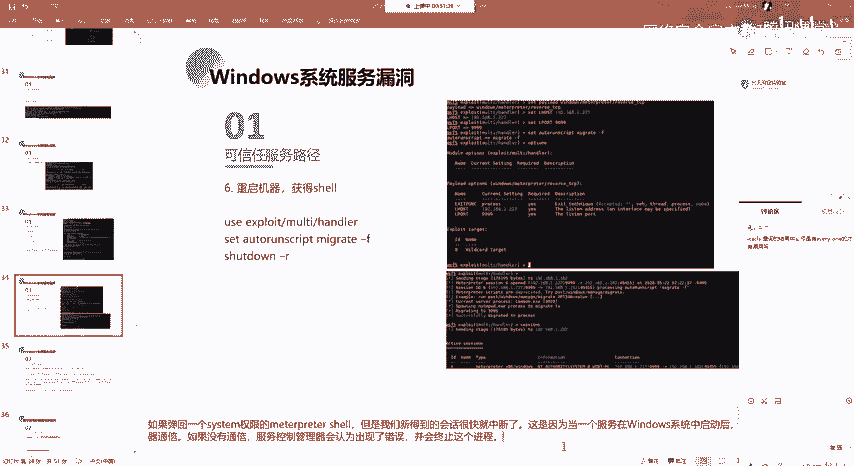

它会断掉，就是因为我们这边的执行的这个com点X的话，它其实不是一个服务。然后的话它会就这个服务控制管理器的话，它会终止掉这个进程。所以的话我们需要再去今听的时候去做一个这样子一个设置。

就是呃在得到这个绘画的话，它会立它会自动的立马的去执行这样子一个呃迁移进程。就把我们当前的一个绘画迁移到它的一个系统上面的一个呃。

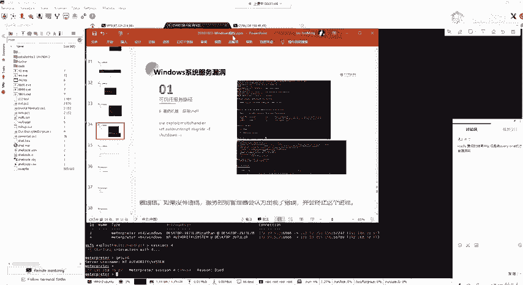

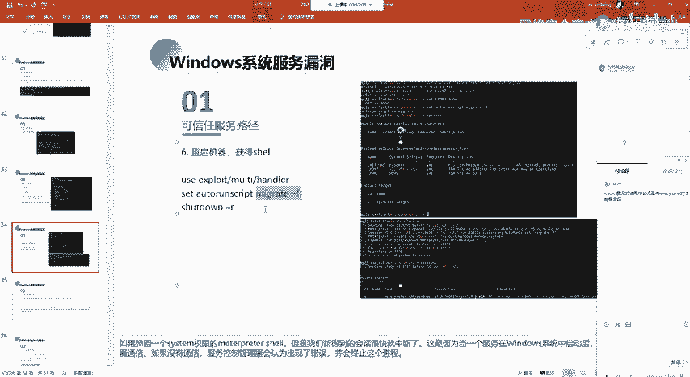

其他的一个进程。

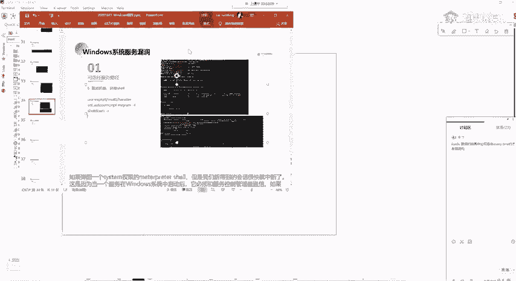

然后的话我们就算我们这边的这一个呃筛选断掉了，那么我们迁移到那个进程的那个绘画还是会一直存在的对吧？只要那个进程它不断掉。然后我这边的话我就不设置了呀，我就不重新那个了是吧。

然后在这的话嗯看我这边的一个截图就是。

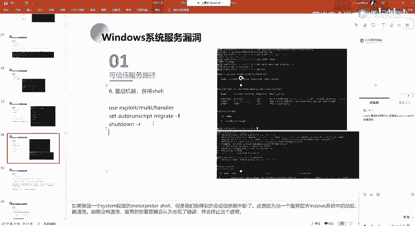

他会在这边对吧？他得到这个绘画之后，筛选ID6，然后它会自动的去做这样子的一个migrate杠F，也就是它会自动的去迁移到一个进程当中。然后的话它会得到这样子的一个呃绘画。

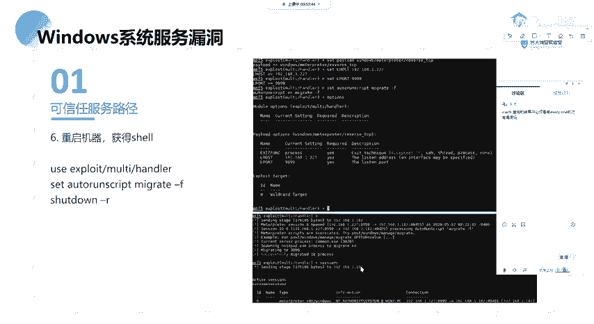

Yeah。Okay。这是一个就是呃去利用这样子的一个可信任服务路径的这样子的一个漏洞来去进行一个提全。啊，呃，第二个的话就是这一个不安全的服务权限。Yeah。呃，关于这个不安全的服务权限的话嗯。

这句的话呃我这边用文字做了一个解释，我们主要的话就是看这边就是看这里就说我们的这样子的一些呃，像比如说我的一个java的一个升级程序。像这种程序的话，它的它是它的一个系统服务程序。

它在加载的时候都是运行在我们的一个系统权限上面的。然后呃像这一类的这些程序的话，它以一个系统的一个权限去进行一个运行，对吧？那么呃。

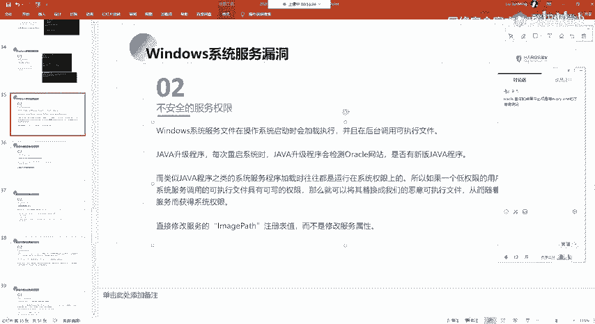

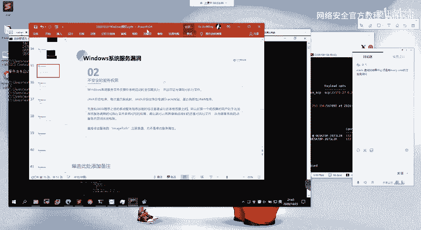

如果我们一个第一权限的一个用户，然后对于这类的这种系统服务调用的这种可执行文件，具有一个可写的一个权限。那么我们可以将其替换成我们自己的一个恶意的可执行文件。然后的话它就能够去随着系统的启动。

然后的话来得到它的一个系统的一个权限。Okay。然后在这边的话，我们是通过直接去修改服务的这样子的一个。呃，imagine pass的一个注册表值，而不是去修改它的一个服务属性。就其实呃。我们。

具体来看一下这样子的一个步骤吧。首先的话第一个就是第一步的话，我们利用这样子的一个工具来去检查，易收到攻击的这样子的一些服务。呃。

这一个工具的话就是它的一个呃它是那个windows系统的一个呃工具套件里面的。然后这这些工具的话，它都是windows系统啊，不都是温微软微软的这种官方的这样子的一些工具啊。

嗯它是对呃一些就是对我们windows系统下面的一个。就是作为一个工具箱吧。做一个工具箱，它提供了就是一些啊其他的一些啊。呃，就是。怎么说呢？看。嗯。嗯。啊预习内容里面有。就这个有个工具套件。我是吓的。

Okay。Yeah。Yeah。就是这个。这个的话它是嗯。就是一些应用程序啊，它的一个应用程序的话，它是就是呃用于它每一个工具的话，它有对应的这样子的一个功能。然后它的这一个功能的话。

它是用于就是呃解决啊windows系统上面的一些问题的这样子的一些工具啊，就是这种故障排除工具。然后的话它汇总到了这个套件当中。这个套件当中的话，它有呃存在有很多的这种可执行的一个呃应用程序。Yes。

就是像这样子，这这边的话就是它的一个可行程序的一个套件。然后它每一个程序的话，它都有对应的一个功能。然后在这边的话就是我们用到的话，就是它的这一个我们用它的这一个工具来去检查呃。

就是容易受到我们这边的这一个呃攻击的这样子的一个服务。

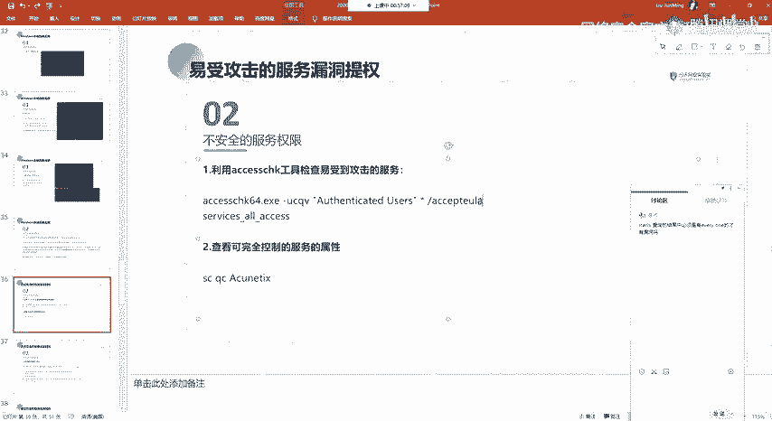

然后这边的话。嗯。看一下。我这个的话我就不去，我直接在这个系统上面去做这样子一个操作。

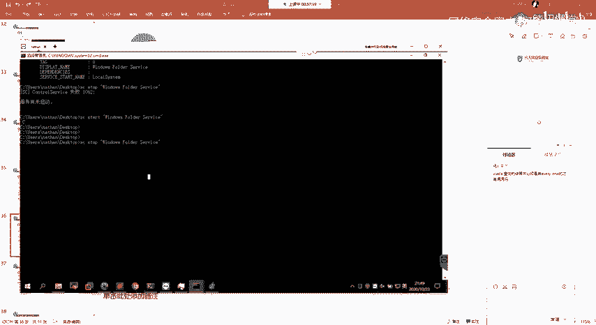

就其实际的话，我们首先第一步的话需要把这个工具对吧？通过我们这边得到这个绘画。

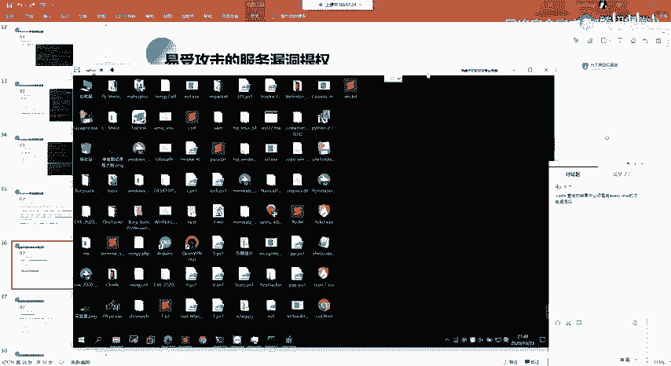

我们这边得到快的话，把它上传到它的一个呃上传到这边的一个系统当中，对吧？然后的话我们再去进行一个执行。

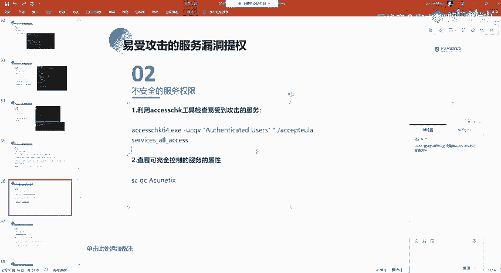

我这边话个就是。

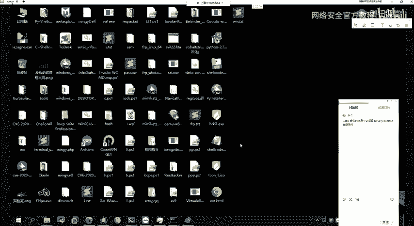

搞快点。

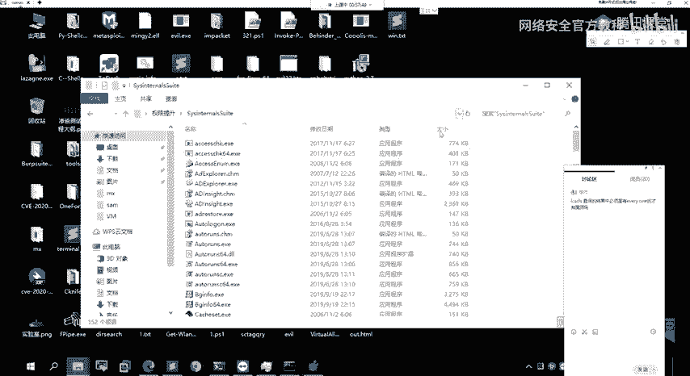

我直接在这边执行对吧？然后执行之后的话，它会有这样子的一个信息。这些信息的话其我们主要找的话就是这一个就这一个service or access。

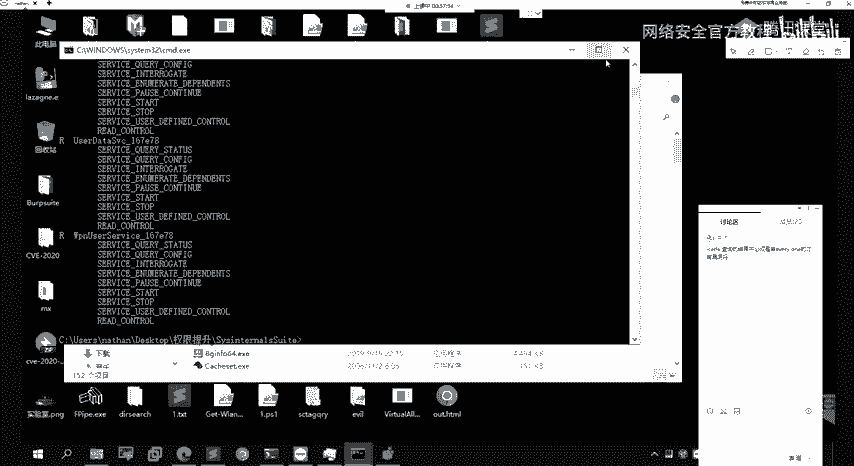

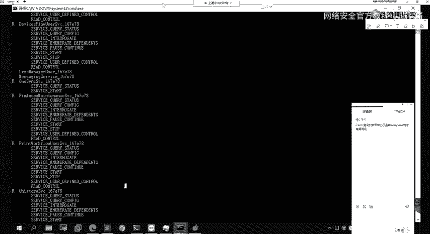

就是这样子的一个属性。

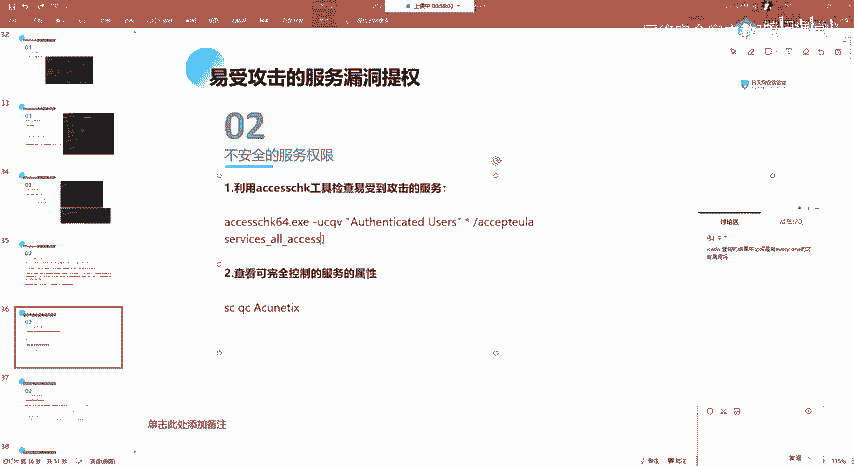

然后其实在这边的话，它有列出了这样子的这么多的这一些啊。这些服务对吧？它对应的这样子的一些啊权限。像比如说sice query state等等的这样子的一些呃stop start。

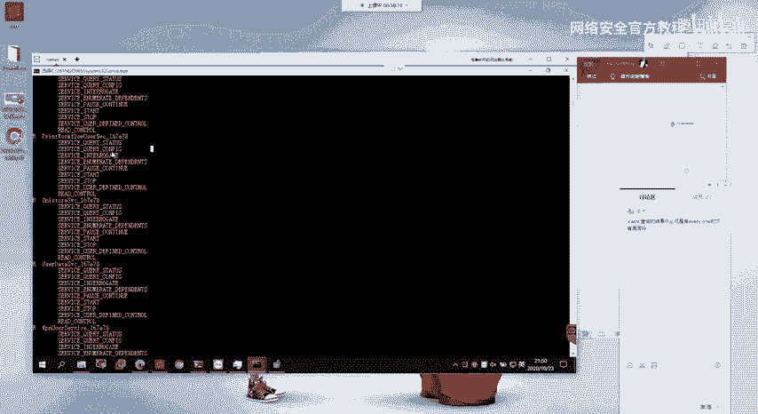

然后在这一块我们主要要找的就是这个service or access。

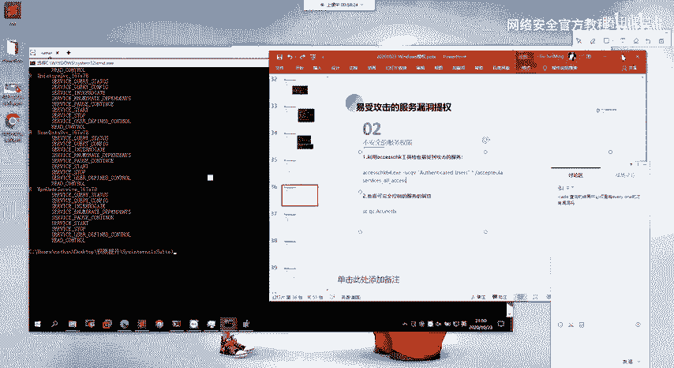

关于这个的话就是。嗯。Okay。这边呢这一个。A。这里这里啊这边的这个service O access的话，它意思就是我们对啊我们的这一个服务，它的一个属性，它拥拥有一个完全的一个控制权。🤧嗯。

然后还有就是呃。Yes。还有就是这个al呃这个al kit器的U，它是指windows系统当中所有的一个用户名密码。这一个就是账户。

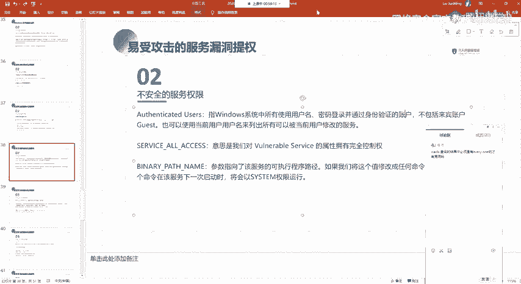

嗯。系有点高。

然后还有第三个第三个的话就是这个banary name。这个的话就是这个参数，它是指向该服务的一个可执行程序的一个路径。

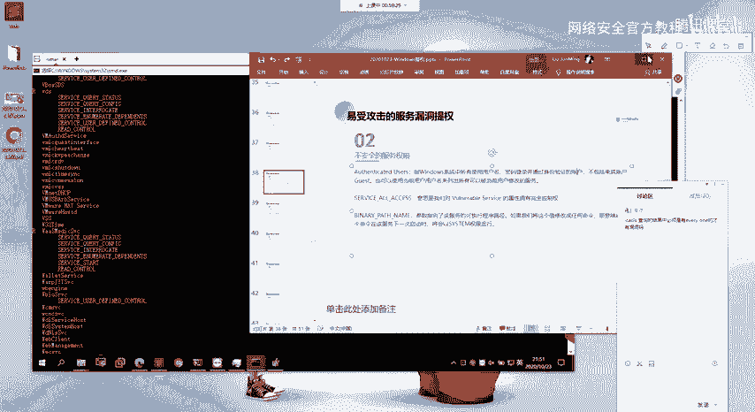

然后我们在这边的话就需要去知道它的一个这样子的一个路径。然后的话我们在这边其实就是要改的话，就是改了这边的这个banary pace name。就是我们将它的这样子的一个属性，把它更改成任意的一个命令。

然后的话我们再去启动这一个服务的时候，它就会去启动，它会去找到这边的这个banbalance name。就原本的话它是一个可执行程序的一个路径，它会去啊启动它，对吧？然后在这边的话。

如果我们把它改成命令之后的话，它服务启动的话，它就会去执行我们的一个命令。而且它是一个sem的一个权限去进行一个执行的。好，呃，在这边的话。

我以这边的这一个就是我以这边的这个ACUNETITX的这个为例啊，就这个的话是呃AWVS的这样子的一个服务啊。

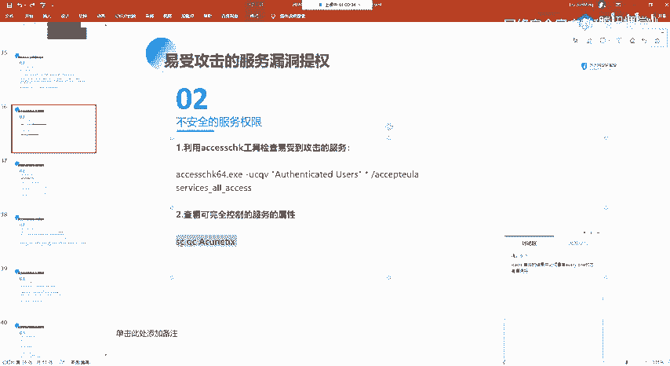

服务名然后我通过呃SCQC就是来去查看。

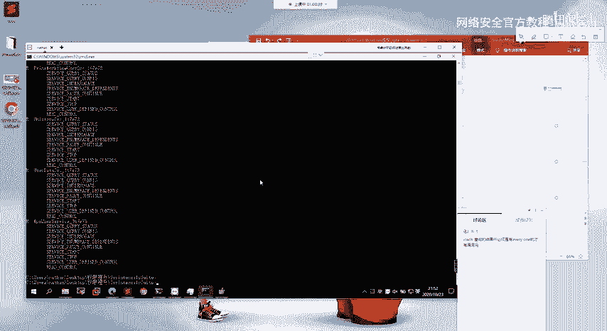

还去通过这样子整个命令去查找这个呃AWVS这一个服务，对吧？它的这样子的一些信息。呃前面其实也有说了，对吧？像它的一个state type就是al start就自启动的，它是随着系统启动而启动的啊。啊。

主要的话就是关注这边的一个banary pace name。这个的话这边的话就是表示是我们这边的一个可执行程序它的一个路径。就其实这边的这个呃这一个服务啊，这个服务它的一个呃执行的一个程序的话。

是这个也就是执行这个程序的话，它会有它会启启动为这样子的一个服务。对。然后呃这边的这一个程序路径就是这一个启中的一个文件名是这一个，对吧？然后我们在这边的话。

就是说如果我们找到了这样子的一个呃找到了这样子的一个服务，就是比如说就是这个服务。然后的话所有的一个service access，也就是它有这样子的一个属性。

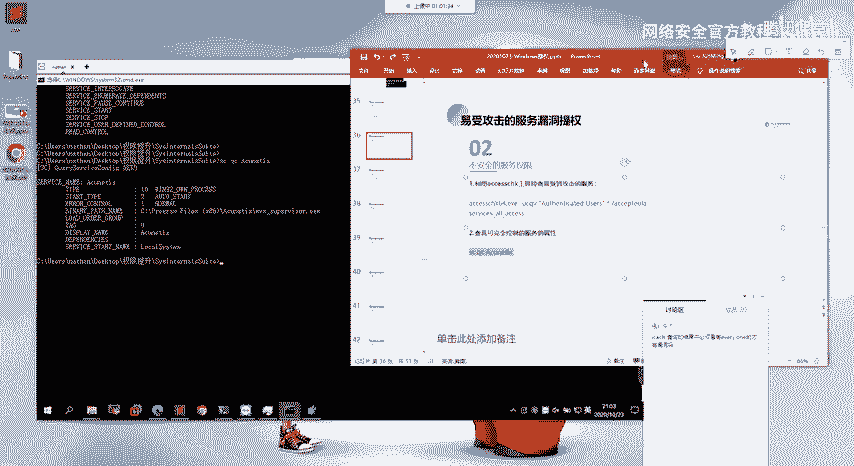

那么他有这样子的一个属性的话，那么我们就能够去对这个服务的一个属性拥有一个完全的一个控制权。也就是我们当前是一个普通用户，对吧？我一个普通用户，我也可以去更改他的这样子的一个属性。

也就是这边所列出来的这样子的一些属性。

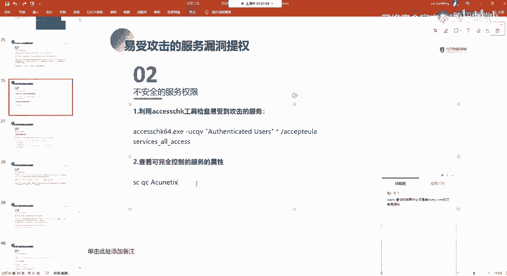

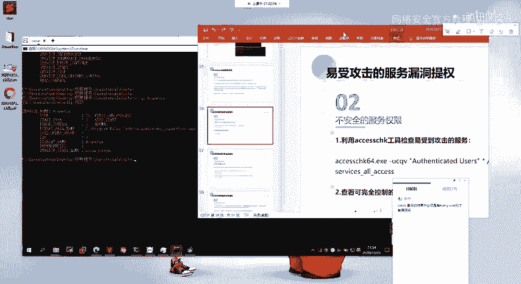

然后在这边的话，它还有就是一个。地方的话就是刚刚说的对吧？我们改这边的这个值的话，这个参数的话我们可以把它改成命令，任何的一个命令。它启动服务的时候，它会去进行一个执行。

那么们实际的我们实际的一个利用的话。我们实际的一个利用的话，就是我们可以把更改它的这个服务配置，然后的话去进行一个命令的一个执行，对吧？原本的话它是指向的这一个程序的对吧？

我们在这边通过SC来去对它做一个配置。又更改这个服务，它的一个b pass。嗯，所以的话这边的一个兵pa的话，它是其实就是指向的就是这边的这一个。诶。boundly pace name它的这一个参数啊。

它所对应的那一个呃值的话就是这边就这一个兵 pass。然后我们把它更改成，像比如说在这边更更改成为一个let user来去添加这样子的一个update user的这样子的一个用户，对吧？

然后的话对它做一个。启动就是对它做一个服务的一个重启。然后这边的一个服务重启跟前面也是一样的。就是我们就是你普通用户的话，他没有权限去进行这样子一个操作。所以的话你需要去呃。等待这一个服务的一个重启。

或者是呃重启它的一个系统重机。因为它的一个服务，它是随着系统的启动启动的。呃，当然的话其实像这边去添加这样的一个用户的话是比较繁琐的对吧？然后我们其实实际的话可以就是。

我们前面的话已经上传了上传了一个那个可执行的一个程序，对吧？然后我们其实可以在这边把它把我们的一个命令改改为就是启动那个我们的那个木马的那个文件，对吧？那么它重启服务的时候，对吧？

它就会去启动我们的那个码，找到我们的那个码去执行，而且是一个stem的一个权限去执行的对吧？然后呃在这边的话呃。

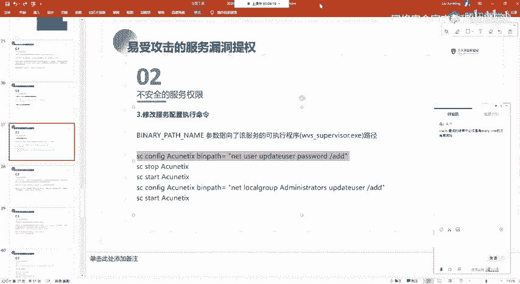

我以这个为例。Yeah。主要的话就是给他演示一下吧，好吧，然后我这边的话已经更改成功了，对吧？然后注意的话，我当前是以管理员用户去那个的，就是呃我中间的话，我就因为我这边的话，这个服务的话，它其实是。

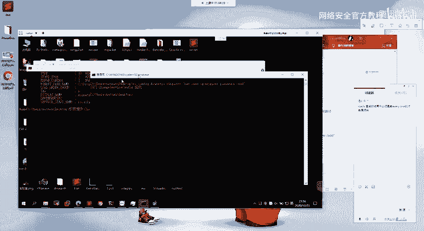

假设它假设它是存在这样子的一个漏洞的对吧？那实际上他其实没有的。呃，为了给大家演示嘛，就是。

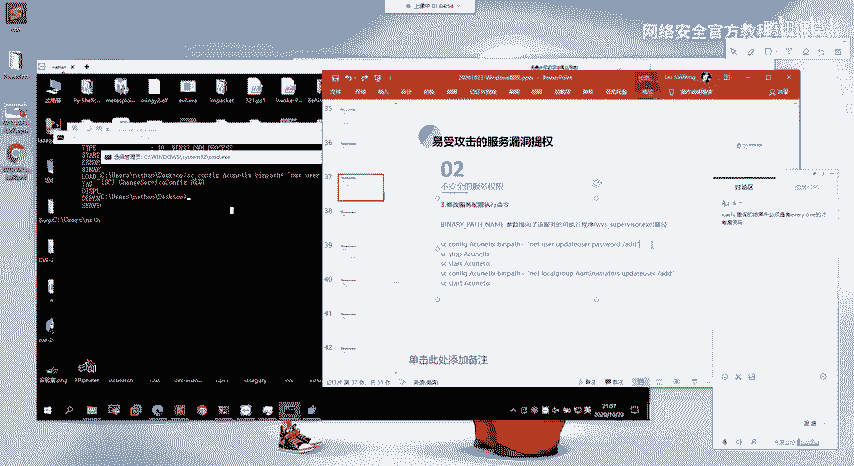

然后我这边的话就以管理员的一个权限去更改它。然后更改之后的话，我在这边去啊进行一个重启。这个呃首先的话net去查看一下，我这边的话是这些用户，对吧？然后我去通过SC去。そは。先停止掉这个服务。

你只道这一个。Okay。Okay。啊，已经停止掉了，然后的话呃我再来去启动啊。启动之后的话，它有这样子的。显示失败了呀，我们可以通过那D要来去查看一下。

然后其实我们的那一个就是就跟前其实前面一样的一个意思嘛。因为我们这边的话更改了他的这个兵pa，也就是更改了这边的这个属性。然后它是这样子一个命令，而不是我们的那个可执行程序的一个路径了，对吧？

所以的话在这边的话。

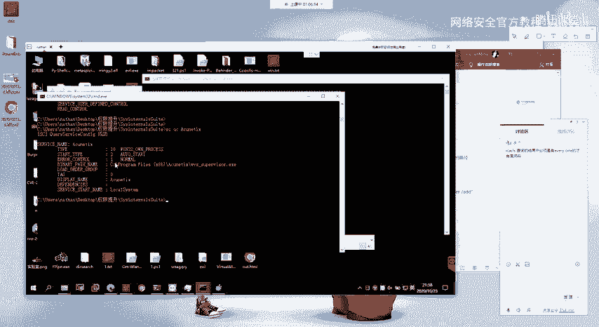

而，不是这一个对吧，我这边记一下。

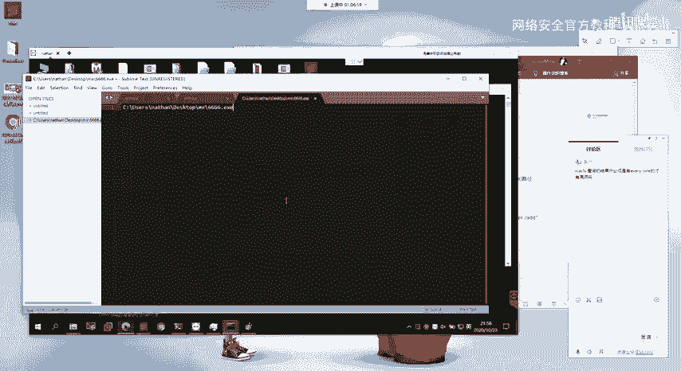

所以的话他在这边的话，他会与去控服务，他没有去响应启动啊，控制的一个请求。也就是没有与我们的那个控制管理器去进行一个那个嘛。但是实际的话，它其实是已经执行了我们这边的一个命令，对吧？

他添加了这样子的一个用户。对吧。

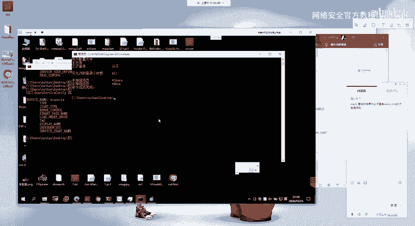

然后的话我们可以把它添加为一个管理员的用户。这边的话我就呃不再操作了。然后以及我们可以就是把它改成就启动我们的那个启动我们这边上传的这个嘛，对吧？

然后的话我们就能够去在MSF里面去得到一个系统的一个需要。这是第二个。第三个的话就是。不安全的一个注册表权限。呃，关于注册表的话。大家呃了解吗？然后的话如果大家不了解注册表是什么的话，呃。

我这边的一个预习内容里面给了这几个链接啊，大家去看一下。这边的话他详细的介绍的就是注册表的一个大概的一个信息啊。就注册表的话，它是呃。它是windows系windows系统里面的一个核心。

就是你可以把它理解成一个数据库。而这个数据库里面的话，它就是包括了有这么多的一些信息，就是你window系统里面记录的这种你呃软件的一个安装，对吧？硬件硬件的一些设备的一个信息，对吧？软件信息。

还有你的一些管理的一些配置信息，网络设置等等的这样子的一些信息，它都记录在这样子的一个注册表当中，也就是这样子的一个数据库当中。他他的这样子的一些。比如说呃设备硬件设备的这种说明啊，状态信息数据对吧？

等等的这些信息它都记录在这个操注册表当中。然后注册表当中的话有这样子的呃分支。分支结构。嗯。然后呃其实注册表的话，大家可以呃win加，然后IEGBD。打开这样子的一个注册表的一个编辑器啊。

然后我们在这边的话就能够去看到所有的这样子的一些注册表的一个分支。在这边的话总共的话有这样子的5个分支，对吧？跟这边的话是一对应的。然后这5个分支它分别对应的一个作用。在这的话我就不多说了，呃。

大家自己了解一下，好吧。嗯。然后以其他的一个注册表的一个存储的一个方式。呃，主要的话就是。嗯，它的一个结构吧，在这边的话了解一下注册表的一个数据结构。首先第一个话就是跟进，主要的话就是5个。

其实就是我们前面说的5个那个分支，它的一个啊名字就是它是一个跟进。就是这边这5个是5个根键，对吧？然后的话子件子件的话有多个子件，还有镜子项，就像一个目录当中有桌多个子目，还有多个文件，对吧？

我们随便打开一个根键，它下面的话有这么多的一个子向子键，对吧？比如说这一个这一个指尖下面有这一些，对吧？嗯。就是相当于就是这一个目录下面有这一些目录嘛，对吧？

然后的话进静值项静值项的话就是我们的这一个键键。比如说我这一个键，对吧？它这一个键下面的话就有这样子的一些静值项，就是它由这样子的三个部分组成，名称、类型数据，对吧？这就是镜止下。Okay。

然后的话我们大概的了解了什么是注册表之后的话，我们来看一下就是。呃。在windows当中，与我们服务相关的这样子的一些信息，它都是存储在这样子的一个注册表象当中的。就是这个。

然呃在这边的话还要就是说一下这一个。这边的这一个。LKLM对吧？然后这边的1个LKM的话，它其实我们可以看到我刚刚的话是直接复制的对吧？呃，复制的这样子的一个那个。然后其实你回车之后的话。

它其实跳转到的是这个HK local。嗯，mat对吧。就其实它的这个LKM的话就是等于这边的这一个。这个跟进就这个这个跟进。然后它的这个写法的话，它就是HK的话，就是HK嘛。

然后的话local就是取代L以及LM以及M对吧？就取到它的一个首字母，就表示这样子的一个根键。然后我们在这边的话呃可以看到就是在这一个指下指径下面。在这一个service这一个指线下面，对吧？

它有这么多的一些呃。这样这么多的一些直径，对吧？然后这这边的话，它存储的信息的话，它其实就是我们的这样子的一些服务服务的一个信息，就是我们这边的这些服务的一个信息。像比如说我们找到那个呃。

我们刚刚的那个。Yeah。啊，我这边没有。现在。在我这边。Okay。Yeah。Okay。就是呃你同样的还是以这个对吧？我们找到这个服，然后这个服务的话，它的这一个子件对吧？

它的一个净值净值的话就是这一些净值项。然后我们可以看到这边的这一个对应的一个信息，它其实跟我们前面通过SCQC去查找的一个信息，它其实对应的对吧？然后在这边的话。

我们可以看到有这样子的一个imagage test。这个imagine pass的话，其实我们前面的话改的就是这边。对吧我们改的这样子的一个那个属性，它的一个参数的话，它的一个值的话。

它存储到了这一个imagage pass的这个名称，就是名称为imagage pass。它的一个呃。他的一个值的话就写到了这边了，对吧？然后其实我们重启这个服务的话，它就是它会去执行这样子的一个命令。

The。Okay。然后的话其实呃就是我们可以在这样在这个注册表当中去查找这样子的一些服务的一个信息啊，对吧？然后的话如果呃就是说如果他他的这样子的一个注册表的这一个呃。这边的这一个。Okay。

就是说他的这一个注册表，我们是有权限去进行一个更改的对吧？就其实像比如说在这边。我们其实刚刚改的这一个东西，它其实也存在了注册表当中，对吧？我们更改的这那个b paybu pace。

对吧然后的话它改的这一个值，它同样的是存储在这一个注册表当中。那么我们如果说有对这个有对这一个服务，它的这个注册表这一些净值向有操作的一个权限，对吧？那我们可以直接更改这边的这一个image pass。

对吧？我们可以直接去更改它更改这边的一个呃。它的一个数据更改我们为我们想要的这样子的一个命令，对吧？那么我们同样的能够去实现前面的那个呃操作。所以的话在这边的话，我们需要去找到。

就是说我们要能够去对这样子的一个呃某一个服务，它的这个这个注册表，它的一个净值的话是有权限去做一个修改的。对吧所以的话我们需要去找到对应的这样子的一个权限，就有权限去操作的这样子的一个服务。

然后这边的话我们需要去呃经常就会用到这样子的一个工具啊，就这个s本。三ber零。ACL的这一个工具啊，SUBACL这一个工具。这工具的话，它它是能够去呃紧锁，就是说服务。诶。

他是能够去检查我们的一个注册表的这样子的一个权限。通过这样子的一个工具，能够去检查注册表象的一个权限。如果对注册表象我们有写入权限的话。

那么我们可以直接去编辑这一个imagagepa的一个值来去更改服务的一个可执行路径。然后注意的话，在这边其实在这边呃。这一个不安全的注册表权限跟前面的这个不安全的服务权限。其实大家要呃分开啊。

就我这边的话，其实有特意给了这样子指的一句话，对吧？嗯。2。呃，这边的话。不反了吧，这边的话应该是就是说我们这边修改的话，是他的修改的一个服务的一个属性，对吧？这个应该是。后面啊。Okay。Okay。

放在这边，就是我们这边的话是呃直接通过修改服务的这个imagage pass的一个注册表值啊。就我们找到我们有这个权限进行一个修改。嗯，然后呃不是去修改服务的一个属项，就是前面这边的话是我们找到。

这样子的一个服务它这个服务的话，我们有对它的一个属性有一个完全控制的一个权限。所以的话我们可以去修改它的这样子的一个呃服务的一个属性，对吧？

然后在这边的话就是说我们找到这样子的一个啊能我们普通用户能够有权限去进行一个对他的一个注册表去进行一个编辑的这样子的一个权限，也就是一个写入的一个权限。然后的话找到它对应的这样子的一个服务。

那么我们就能够去修改它的这一个imagage pass的一个值来去达到跟前面一样的一个效果的一个操作。然后具体的一个。反法。首先的话我们通过这个工具嘛，我们需要去查找它的这样子一个权权限嘛，对吧？

然后其实查找的话就是这一个啊服务下面的这样这样子的一些服务的一个权限，对吧？然后其实在这边的话，我这边它是以一个valable service啊，就是表示呃能够被利用的这样子的一个服务。啊。

其实我们要查找的话，就是要去查找。这边的这一个servvic这个指件下面对吧？这个子件下面所有的这一些服务它。它的一个权限。然后的话如果我们找到了这样子的话，我们就能够去进行一个啊更改。然后更改的话。

我们可以通过IGA就是说在命令行下面的话，我们可以通过这一个方法来去进行一个注册表的一个修改。然后的话呃在这边的话，我同样的以这一个为例啊，就是我通过呃修改这一个。ACNACUN这个AWVS这个服务。

它的这一个净值向。呃，我们来看一下这个完整的一个命令，就是这样子的啊。我这边的话是通过这样子的一个方法，就是首先MSF生成一个A的柚这样的一个可执行文件。这然的话你也可以生可以生成一个访需要的对吧？

然后的话上传到目标7上面，这个生成了这个A的柚子的话，它的一个功能其实就是一个单一的一个功能。它的一个功能话就是呃添加一个，就说它执行之后的话，它会在本地添加一个。

账号添加一个我们这边生成的时候指定的这样子一个账号。嗯。然后的话呃。我们这边的这个命令的一个意思啊，我们来看一下，首先这一个杠T的一个选项就是表示我们的这边的这个呃type。因为其实前面的话我们有说了。

就是静值项的话，它有三个部分，对吧？就是它的一个类型，它的一个名称，以及它的一个呃仓一个。那个就他的一个数值，对吧？数据。然后在这边的话就是杠T的话，就是表示它的一个类型。我们可以来在这边来看一下。啊。

就是类型我们可以看一下这一个imagage pass的，它的一个类型就是这一个对吧？我们可以看一下，就这个。然后我们指定的一个类型的话，就这个。因为我们要改的话，就这个imagage pace嘛。

就名称为这个的。就干预的话，就指定我们的一个名称。干低的话就是指定我们的一个数据，就我们这边的一个这边啊这边的一个数据。然后我这边的一个数据的一个值的话。

就更改为了我们这边所上传的这边的这个ad柚的这一个可执行程序的一个路径，对吧？Yeah。然我们通过这样子的一个，因为我们以普通用户也能够去更改他的这样子的一个注册表，对吧？

那我们这一个命令的话是可以去执行的。然后的话更改为了。他的一个imagage pass，我我们这边的一个木嘛。然后当这个服务他去进行一个重启的时候，他就会去呃，就是说他会进行这样子的一个呃加载。

他会去加载我们这边的这一个。嗯。重启之后的话，呃，我们的这一个程序，它会以一个系统的一个权限执行。Yeah。就铜年的话生成反弹西尔的一个pload的话，呃，要注意去自设置自动的一个清洗进程。呃。

这边的话这个我就不不去操作了，好吧。然呃第三个呃还有的话就是。一些特殊的一个注册表的一个项啊，一些兼值。呃，在这里的话就是这个al run，al run的话就是自启动。就其实呃就其实大家可以。啊。

右键这边的一个任务管理器，对吧？然后在这边有一个启动，启动这边的话就记录了有这样子的一些东西。在这边的话就是我的这一个当前计算机的一个呃自启动的一些项。然后这边的这些项的话。

它其实就记录了记录在了我们的这一个这些的注册表当中。像比如说这边。我们打开这边打开这边的话可以看到在这边有这样子的一些呃镜止项。对吧有这样子的一些镜子啊，像比如说everything。还有。

我的这样子的这一个程序啊，对吧？它是一个自体的，就他记录在了这边，然后。记录在这一个注册表象下面的话，有什么作用呢？就是说它会随着我们的一个系统的一个启动而启动。然后的话所以我们。诶。

如果说我们能够去像这样子的一个镜子下下面去写一个这样子的一个程序，对吧？那么我们就能够去在它的一个启程序，它在它的系统每次启动的时候，它都会去执行执行一遍我们的那个呃呃我们的那个可执行程序，对吧？

那我们就能够去得到对应的一个权限。哦呃，像在注册表当中的这种自启动项的话，我们呃也通常用来做一个权限的一个维持，对吧？Okay。然后还有呃第四个的话就是不安全的一个文件文件夹的一个权限。呃。

关于这个的话，这个跟前面那个就是呃就是不安全的一个服路件的话是。比较相似的，它的一个。就是我们同样的就是。啊。就是说我们利用的是它的这个服务，它的这个呃可执行程序所在所在的一个路径。

我们是呃有这样子的一个权限的对吧？我们可以去做一个修改，那么我们可以尝试直接替换它的这一个可执行程序。

就比如我们可以简单的用这样子的这一个反向paload的来替换我们这边的这一个路径下面的这一个可执行程序文件，对吧？然后的话它启动服务之后的话，我们就能够有一个sem的一个权限。这边的话跟前面类似。

Okay。就是呃我们要检锁的这个文件夹的一个目录，话就是这个对吧？就是这一个可执行程序路径所在的这一个目录下面，我们可以尝试去把它的一个可执行文件，把它替换成我们的一个呃把它需要的一个payload对。

然，呃，以及第五个呃也是最后一个了。第五个的话就是这个allwayinstore的。嗯。😊，这这边的这个呃提全的一个利用的话，它是就是说利用的这个利用的这样子的一个权限。

就是任意用户以这样子的1个NT system的一个权限去安装这1个MSI。当然的话呃前提的话就是你开启了这样子的。就是说你的一个目标系统，它是开启了这样子的一个呃权限啊，开启了这样子的一个策略啊。

就这个 always installstore的。如果说开启了这样子的一个策略设置的话，那么就是说在windows系统下面。

我们通过这个MSI啊不通过这个windows的inter去安装这样子的一个呃MSI的这种文件的时候。他就会去呃以一个stem的一个权限去进行一个执行。嗯。😊。

所以的话如果我们发现了有这样子的一个设置的话，我们可以就是。使用这样子的一个方法，就我们直接用MSF去生成一个这样子1个MSI的一个文件。然后的话我们来去进行一个执行。我们以普通用户的。

我们以普通用户去执行这样子1个MSI。那么他再去安装的时候，他会以一个呃系统以一个系统的一个权限来去安装。嗯。然后的话我们生成的这个马SI的话，它呃包含我们的一个呃木马。木马后门对吧？

那么我们的一个木马的话，它就会以一个stem的一个权限来去进行一个执行。Okay。呃，关于这一个策略设置的话，就是我们可以通过这样子的一个方法来去判断，就是能通过IEGcur认。

还去主要的话就是查看他的一个注册表现在这里他的一个呃名字是这个。

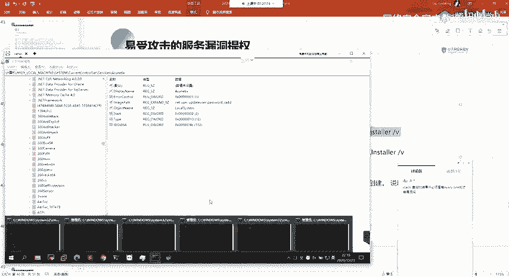

然后的话呃我们这边执行之后的话，它在这边的话有这样子的一些返回返回值，对吧？在这的话其实它返回的话就是我们的一个那三三个部分，对吧？我们的一个名字，我们的一个类型，我们的一个呃数据。

如果说数据是这个0X1的话，就表明这边的话是开启了。

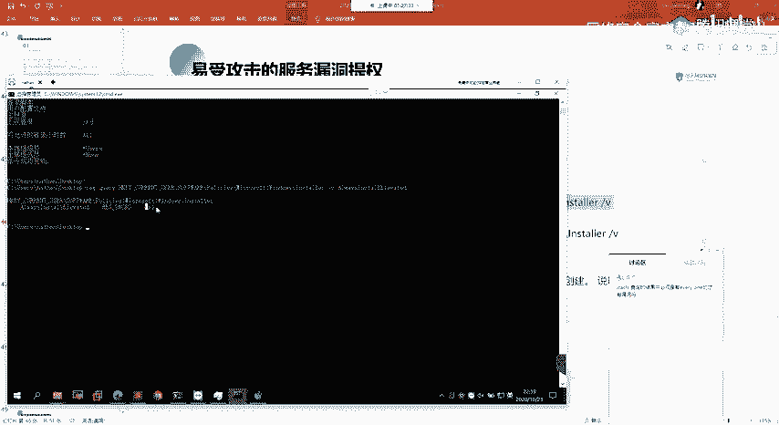

就说明我们的这一个策略的话，它是已经启用了。如果说是错误，系统无法找到这样子一个注册表象的话，那么就是这一个注册表象值它没有创建，也就是它的这个策略，它是没有启用的。就是说如果你启用了这个策略的话。

它就会有这样子一个注册表的一个值。Oh。呃，我们也可以我们可以通过这样子一个方法去进一个启用。然后具体的一个利用的一个方法的话，就是呃生成这样子1个MSA的1个恶意程序嘛。

然后的话呃上传到目标机上面去进行一个执行。执行的话我们就能够去得到相应的一个s统的一个权限。呃，在生成这样子的一个呃MSI的程序的时候的话，呃，跟前面的话稍微有点不一样。就是在这边的话。

我们首先需要去生成一个执行配漏的一个反弹需的一个配漏的。就是我这边的话是这样子1个ES一个程序，以及这样子的一个程序包。就这样1个MSI的一个程序包。好，首先的话我们先生成这一个payload对吧？

然后生成了这个payload的话。我们还要去生成一个就是说生成1个2页的1个MSI。嗯。嗯。Yeah嗯。生成一个这样生成一个2意的1个MSI，然后呃生成了一个方法呢。

就是像这样子杠F指定我们的1个MSI就是生成1个MSI的一个格式嘛。然后我们的一个配load的话就是这一个windows的1个EXE。然后这一个配load的话，它的一个意思的话。

它就是呃如果你执行了这个MSI它就会去呃调用我们这边，它会去执行我们这边的一个命令。我们这边执行的一个命令的话，就是我们这边的一个配load。也就是我们前面所生成的这个load。Yeah。🤧然后。

我们需要把。然后的话我们需要把这两个呃文件都上传到我们的一个目标机上面去。然后的话我们再通过呃这样子的一个方法。MIEXEC来去执行我们这边的1个MSI的一个程序。然后执行这1个MSI程序的话。

它一执行对吧？执行之后的话，如果说启用了那个策略设置，它就会以一个sem的一个权限去执行我们这边的一个payload。因为他的这边的这一个安装程序的话，它的一个。

他的一个目的的话就是去执行我们这边的一个payload。然后的话是一个s统的那一个权限去执行。呃，然后还有的话，其实我们可以通过这样子一个方法，就是更简单的就是我们直接。呃。

生用这样子一个AU的一个配load来生成一个就是。创建一个账号的一个呃这样子1个MSI的1个payload。然后的话他在这边执行之后的话，呃，在这边执行之后对吧？执行之后的话。

他就会一个s权限去创建一个这样子的一个账号。对。呃，在这边的话这边的话就是它的一个呃分别的一个执行程序的一个方法。以及在这边的话呃给了这样子的三个参数。这三个参数的话主要的话就是呃。呃，大家自己看吧。

好吧。就是不使用GUI的话，就表示呃我们在这边去安装的时候，他没有这样子，没有1个GI的一个宽。嗯，就是没有这种界面嘛，然后。干Q的话就是静默的去安装嘛，就是没有不会像我们就如果我们执行，对吧？

我们执行的话，它会有相应的一些信息，它会显示出来。然后刚才的话就是指定我们的一个安装程序。嗯嗯。呃，以上的话就是我们本节课的所有内容啊，就是呃内容的话。呃，其实说多也不是很多，但是。就是也还是有点多的。

然后我这边的话其实讲的也是。呃，稍微有点快，我怕这边的话讲不完。好，呃，大家我看大家有没有什么反馈啊？大家有没有什么疑问？嗯。😊，呃，当然的话这边的话其实也是。需要大家自己去动手做的。

就你可能你现在的话可能也是没有什么。呃。没有什么问题吧，应该。🤧嗯。嗯嗯。诶还斋吗？我。诶。😊，哦，还有人在听吗？呃，中间的话我没有呃，我没有去问大家有没有什么疑问。就呃我觉得这边的话。

其实我觉得我应该不用讲这么细了。因为我这边PPT的话其实已经。已经写好了呀。当时的话呃想着还是。还是给大家讲一下吧。嗯。Yeah。然后呃后面的这一些操作的话，这边的话我就没有我没有去一的去尝试的呀。

没有给大家去做一个演示了。呃，有问题的扣一没问题的扣2。然后呃自己课后做的扣3吧。好吧。呃，还是老样子嗯。

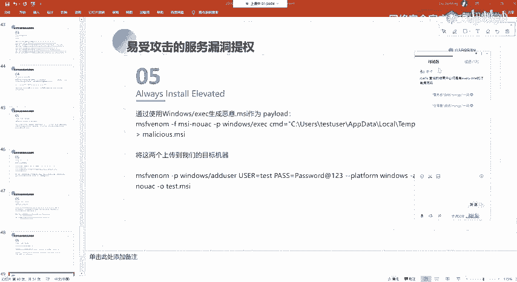

我怎么感觉现在有18个人。呃，除了这两位同学，其他同学是不是都都没在呀，是不是就电脑挂着，然后。没没在听啊。给我一点反馈。有人在吗？没。还系。还是这两位同学。是呃。是大家有点懵啊，听懵了吗？

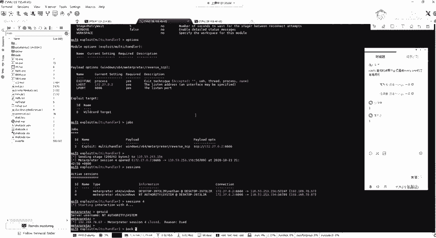

Yeah。嗯，好吧呃。大有未。大家没什么反馈的话，那么我就默认大家是没有问题了，好吧。反正有问题的话。有问题的话，还是老样子呃，找我问就行了，好吧。

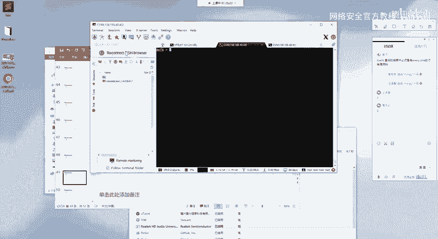

然后等大家自己课后去操作吧，然后作业的话也还是老样子，就是把我课上讲的东西自己动手去操作一下，好吧。

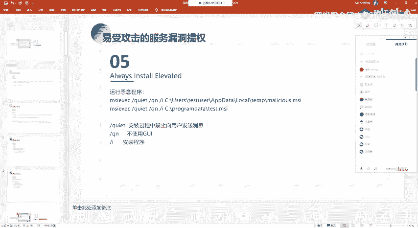

自己去呃操作一遍。然后自己去理解。好，我们本节课内容的话就到这边。结束了。呃，大家早点休息吧。

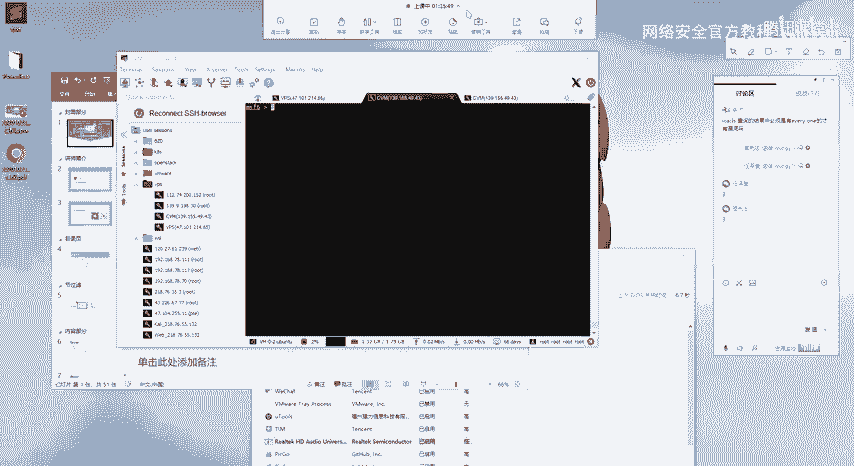

呃，下课。