# B站最全网络安全教程，整整1300集，全程干货无废话，别再盲目自学了，看完学不会我退出网安圈！（web安全｜渗透测试｜内网渗透｜CTF） - P93：92. 第四十二天：Meterpreter提权模块.mp4 - 网络安全官方教程 - BV15u4y137cQ

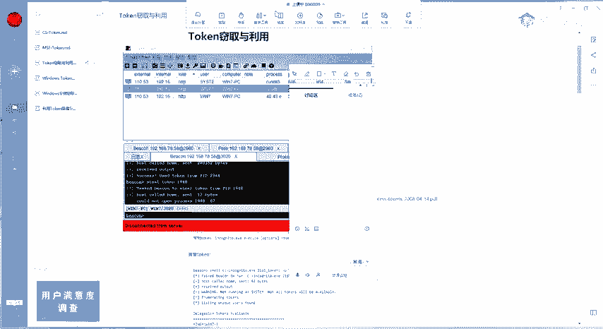

我。

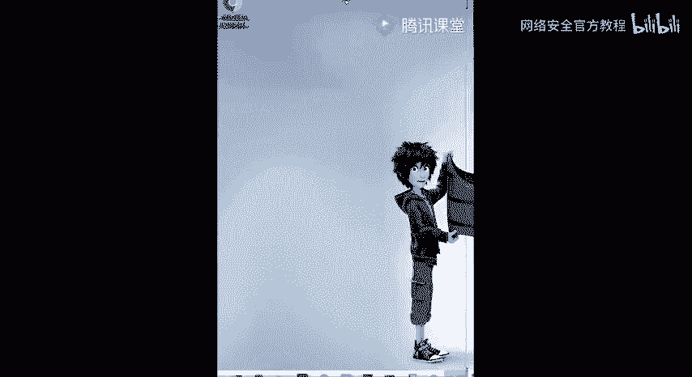

对。🎼我冲。🎼人海茫茫。🎼无风景吧。🎼浪潮汹涌。🎼此角彼长。🎼春暖秋凉。🎼别来无奈。🎼明月当空。🎼乘风破浪。🎼谁心中有。🎼挣扎于是。🎼还假装。🎼为爱赎罪。🎼谁青春如。🎼请勇干一杯。🎼你风。🎼聚光散黑。

还望白天的。😊，🎼的也。🎼在美。🎼Oh。🎼爱家。🎼人海茫茫。🎼无风起浪。🎼暗潮汹涌。🎼此笑彼长。🎼春暖秋凉。😔，🎼别来。🎼不要。🎼明月当空。🎼乘风破浪。🎼谁心中有。🎼挣假已是。🎼爱假装无。🎼为爱赎罪。

🎼青晨如。🎼请勇敢一辈。😊，🎼，🎼白天的。🎼飘。🎼我在每。🎼愛家？🎼还有白天的。🎼星光凋谢。🎼我在每一天。😊，🎼。🎼Oh。🎼走的。🎼，🎼啊啊哈。😊，🎼嘟嘟。

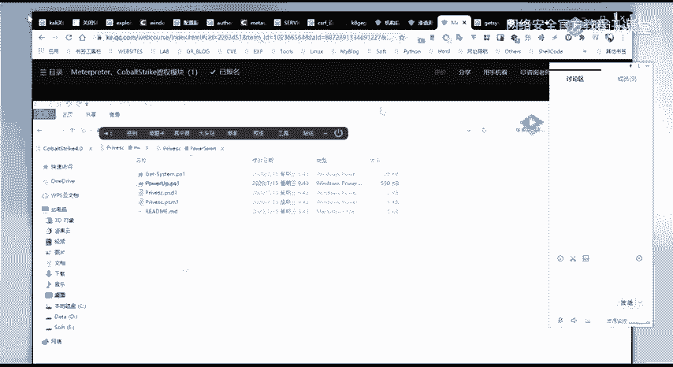

🎼谁都有做梦的权利。🎼谁都有存在的意义为自己争一口气。🎼不让别人看敌。🎼现在的你想要什么？😔，🎼现在的你想做什？😔，🎼勇敢的去追寻吧，别紧张，就当最后一次牵挂。😔，🎼当我老去了以后，不想去追回。😔。

🎼梦想那么美。😔，🎼我却比现实。🎼自情。🎼抛去了。🎼不想被。🎼爱谁？🎼要干激每一位。😊，🎼不知。🎼回忆让我。🎼用来。🎼珍贵。😔，🎼别说我的梦想荒唐。😔，🎼别让我像某某一样。😔，🎼哪怕是遍体鳞伤。

🎼我也绝不投降。😔，🎼这是最美好的时光。😔，🎼犯错也值得被原谅。信念。😔，🎼别再摇晃，别沮丧，你应该为自己疯狂。🎼当我来。🎼想去追。🎼，🎼我却被。🎼自己。🎼忘弃了。🎼想被。🎼爱谁？🎼每一。🎼永远。

🎼老去了以后。😊，🎼不想去追。🎼我是。🎼一す。🎼没显自己。🎼看尽每一。🎼不知。🎼依然。🎼珍贵。🎼看看。🎼谁都有做梦的权利。🎼谁都有存在的意义，为自己争一口气。🎼不让别人看敌。🎼现在的你想要什？😔。

🎼现在的你想做什？😔，🎼勇敢的去追寻吧，别紧张，就当最后一次牵挂。🎼当我老去了以后，不想。😔，嗯嗯。大家晚上好。然后能能听到我声音的，以及画面能够看得清楚的，在讨论区扣个一。Yeah。这两位同学吗？

其他同学呢？在的话呃，声音没有问题的话，在讨论区扣个一。呃，大家晚上。又到了。两天好不好，一天一度的。学习时间。呃，应该没有什么问题啊，好吧。好，没有问题的话，那么我们正式开始我们今天的一个课程内容。

今天的话主要给大家介绍的是MSF以及CS下面的呃一些模块的一个使用。然后它的一个使用的话主要的话就是一些提全模块。呃，上一节课的话给大家介绍就是windows系统下面的一些提全的一个方法以及技巧，对吧？

以及呃比较详细的一些操作，对吧？呃，在本节课的话会就是说会有涉及到上面一节课的一个内容，主要的话就是在MSF这一块，就说在上上面我们所讲到上一节课所讲到的windows下面的一个。

windows系统下面的一些提全的一些漏洞，包括内核漏洞，还有服务漏洞的话，在MSF下面，它有对应的这样子的一个呃能够可以去直接去利用的这样子的一些模块。

所以的话在本节课会一个给大家就是说呃实际的操作演示一下。然后呃本节课的主要内容就是这2块啊。第一块的话就是呃maxport的一些提全模块的一个使用，以及呃就是说给大家做一个介绍。

第二个的话就是co strike，就是CS这个。甚至说是框架的一些提群模块，以及它相应的一些啊，就是说我们如何在4S上面去进行相应的一些提群的一个操作。呃，大家都知道就是说在前面也已经给大家讲过了。

对吧？就是MSF跟CS的话，这两个渗透测试的一个提群啊不渗透测试的一个框架对吧？然后我们大多数的一个时候的话，就是说在得到一个需尔之后，反谈歇尔的话。

我们就是会去尝试去把我们的个需尔反谈到这样子的两个M两个渗透测试的一个框架当中，对吧？因为它的这个框架的话，我们再去使用的时候，它有很多的已经集成的已经性程已经写好的这样子的一些功能模块对吧？

我们可以能够去直接的去进行相应的一个渗透的一个测试。就是说在测试的一个过程当中的话，我们能够去更方便的去进行一个啊使用。嗯。然后第第一部分的话就是给大家介绍一下呃msport的一个提全模块。

首先第一个就是我们常用的也是常见的这样子的一个matpre的一个提全。在这边的话，mport的一个自动提全的一个命令。我们通常的话会去使用这样子的一个get system。

对吧这个的话大家应该有去用过吧，就前面在呃。前面讲MSF的时候有用过吗？有用过的在讨论去扣Q。

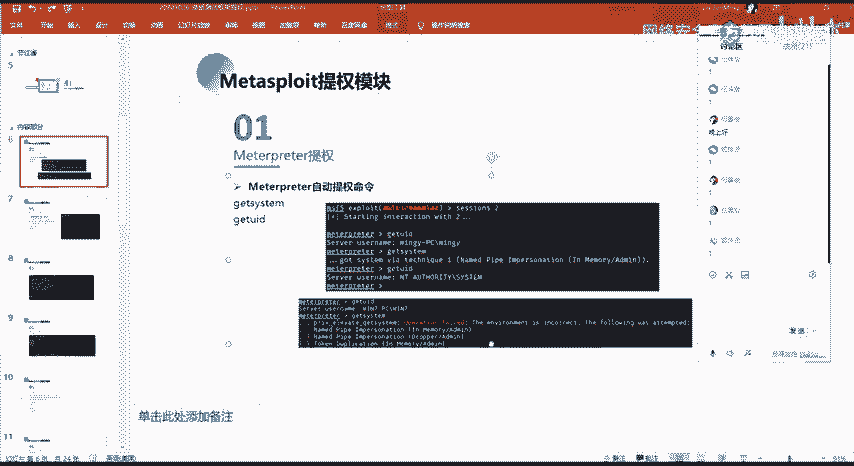

没有用过。嗯，没有用过吗？啊。啊，没有人问的话，那么我们在本节课的话会给大家介绍，好吧。

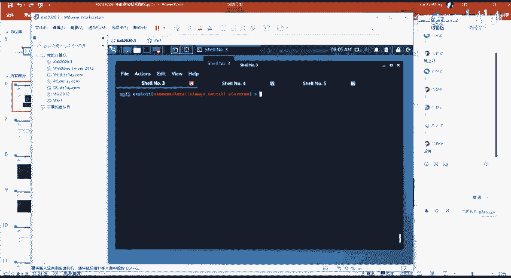

呃，这边的话我的环境稍等一下。

呃，等会再弄吧，我们先来。讲一下。

呃，在这边的话嗯我会给大家就是说呃我们先来看一下这边的这两张图吧。首先第一个第一个的这一张截图的话，就是我这边已经得到了一个筛选绘画，对吧？然后的话我得到了这个绘画的话，我们可以看一下。

我这边的话是一个普通的1个MIGY的这样子的一个用户啊，对吧？然后在这在这个时候的话，我们就是说我们是一个普通用户，我们想要去做做一个提全的话。

也就是说要把我当前的一个用户的一个权限作为就是提升到我们的一个admin，或者说stem的这样子的一个权限，对吧？然后在呃MSF的这样子的一个mat下面的话有这样子的一个自动提全命令。

就这一个get system。然后这个gety什么的话，它我们可以直接执行之后，然后的话我们就能够去得到这样子的一个是什么的一个权限。当然的话这是第一种情况。

而且就是说在去进行去呃使用这一个命令的一个前提条件，大家要注意，就是说你的得到这样子的一个用户的话，它是呃在一个这样子的一个管理员组。当然的话。你你的这一个用户，你在管理员组里面的话。

也不一定能够直接的提全成功。这个的话就是我们下面的这一个例子。我这边的话同样的是得到了这样子的一个绘画筛选，这样子的一个筛选绘画。然后的话我的一个用户的话，同样的是一个普通用户啊，对吧？

这样子的一个win7的一个用户。然后我在这边的话，通过get system来去进行一个提群的话，你会发现，而且就是说这样子的一个报错的话，也是我们通常会去看到的对吧？

就是说你要直接呃要能够或者说大多数情况下的话，我们可能直接get system的话是得不到这样子的一个st的一个权限的，所以的话你这样执行之后的话，它会报这样子的一个错误。就是说你的这个操作的话。

它是失败的。也就是他的这个提群的一个操作的话，是呃无法去进行一个提群的。嗯。然后呃针对这样子的第二种情况，第一种的话我们是能够直接的去直接get system，然后得得到这样子的一个stem的一个权限。

对吧？这个的话，那么我们就等于就是说我们的一个提前的一个操作就已经成功了对吧？那么在碰到下面的这一种呢，我们怎么去进行一个解操作呢？对吧？Okay。关于上面的这一种啊不关于下面的这一种。

我们直接去执行啊，提群命令操作失败，对吧？我们可以通过这样子的啊一个方法。在这边的话呃会介绍这样子的两个模块，就是这样子的一个by passUAC，也就是绕过UAC的一个方法。在这边的话呃。

就是大家呃能大概的有了解过UAC吗？这个。这一个名这一个就是术语。

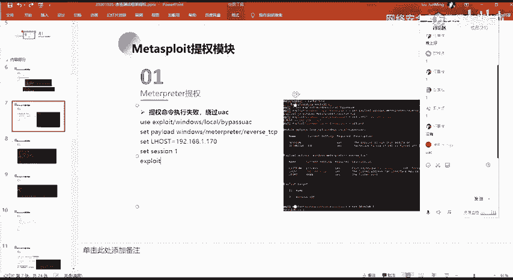

大家有去了解过，或者说有去碰到过UAC的这样子的一个这种情况吗？

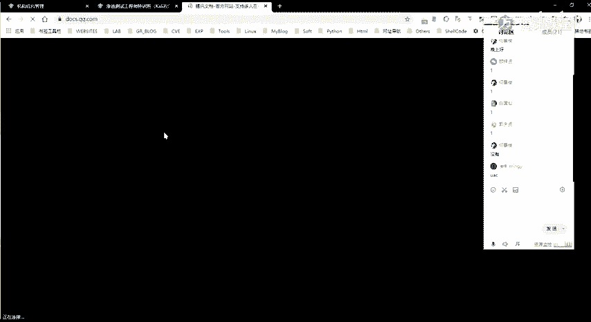

。う。Yeah。不知道。Yeah。了解是好呃，在这边的话，我给大家做一个大概的一个介绍。就是在具体内容当中的话，已经呃。给了这样子的一个链接。你卡了。😔。

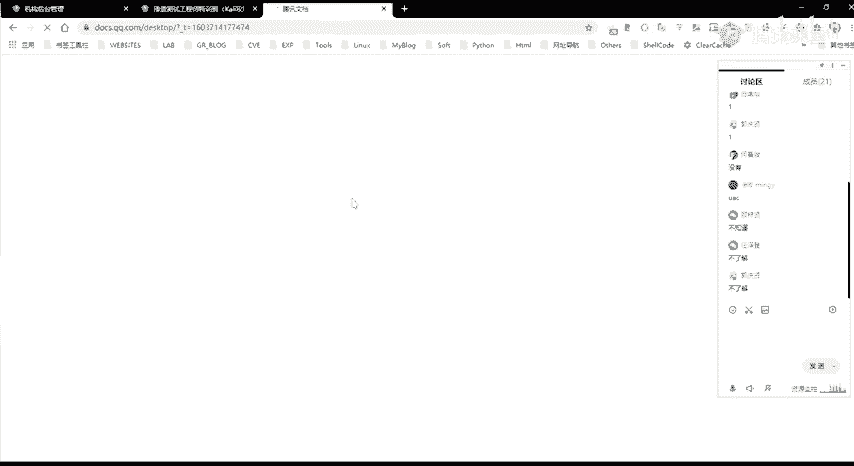

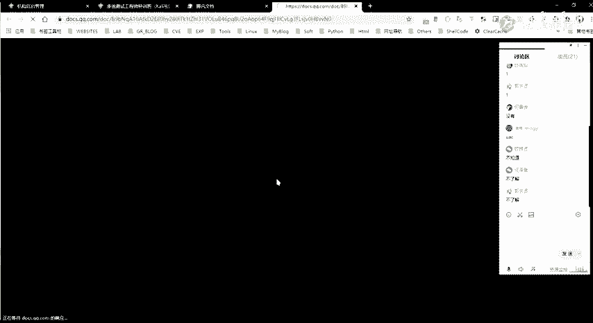

网络有点慢。呃，在这边的话，大家可以看一下那个预习内容啊，预习内容这边的这一个框架齐全的这一个就是。嗯。这个用户账户用户账户控制的一个原理，就是这边这边这个链接这个链接的话是呃微软的一个官方的一个文档。

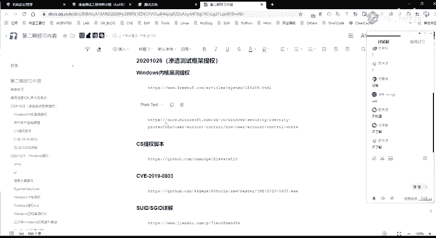

然后这边的话他详细的介绍的就是说用户账户控制它是一个什么样子的一个东西。也就是说我们这边所提到这个UVC其实就是这边的一个用户账户控制。

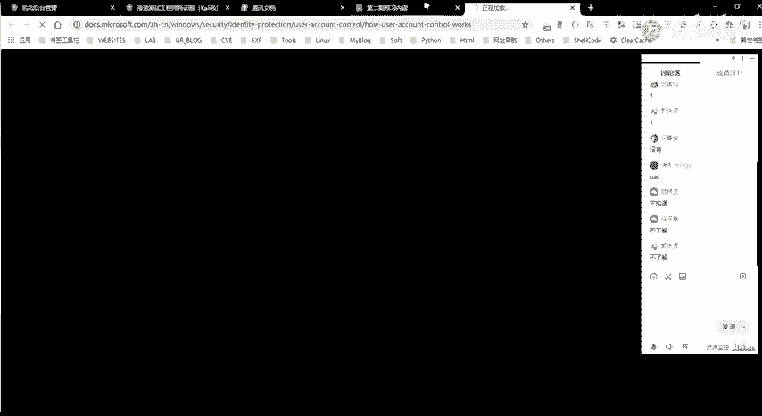

然后这个UACC的话，它是就是说呃就是微软的这样子的一个组件啊，它的一个作用，它就是来缓解缓解IE软件的一个影响。也就是说它是一个就是说呃安全的一个就是说一种安全策略，对吧？

然后的话这边的这个UVC的话，呃，关于它的一个详细的这种东西的话，大家只要了解一下就OK了，好吧。唉，这种东西的话，这边的话大家可以看一下这这一批链接，然后更多的这一些东西的话呃，我不会去多讲。

然后的话主要的话就是带大家了解一下这样子的一个东西是什么。就其实UAC这一个东西的话，我们通常我们经常也会去碰到，对吧？就是这一个呃user account control，也就是用户账户控制。

然后其实这个UAC的话就是像这样子，我们就是实际的一个使用的话，就会碰到这样子的一个长啊，对吧？就这一个优在。可能大家看英文的话不是很不是很很很很清楚。我们来看一下这边。我瞧这个。

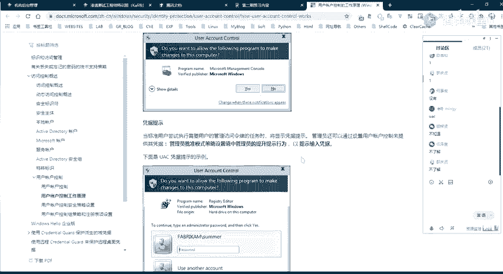

马几桶卡死了。

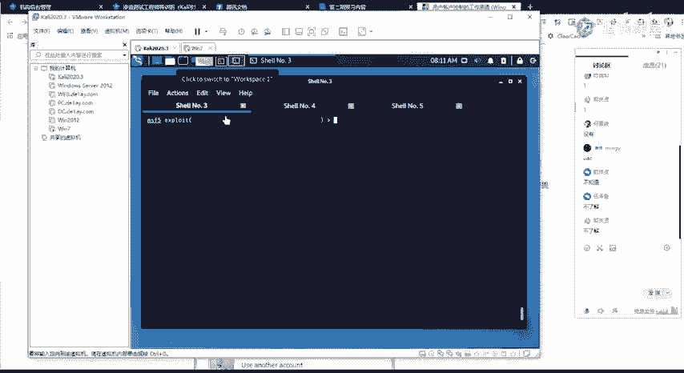

嗯。

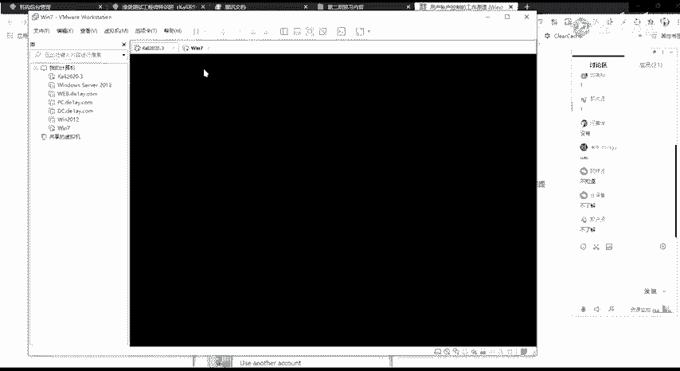

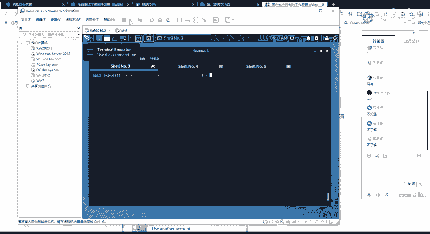

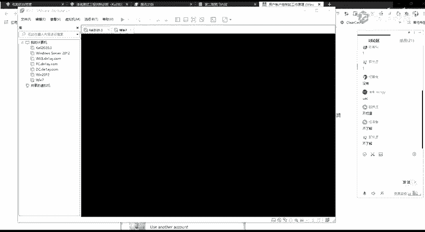

我这边虚拟机卡死了。嗯。Yeah。有点卡啊。Okay。呃，这边的话我就在我自己电脑上面那个吧，当时在这边的话，呃，大家就是听我说，然后那个吧就比如我们在这边对吧？我们输了一个方啊。就你输入荣牙之后的话。

不是会有这样的一个运行框嘛，对吧？我们比如说打开一个注册了的一个编辑器，对吧？就这个IGDD址，我们直接点确定点确定之后的话。呃，不知道大家能不能看得到。就是会有一个这样子的一个。截不了图啊。

就是呃大家是在自己电脑上面去操作吧，就是会有这样子的一个注册表编辑器的这样子的一个用户账户控控制的一个弹宽，对吧？然后的话你需要点一个确定，或者说呃是点一个4，对吧？然后点一个试之后的话。

你就进入到了这样子的一个。你就你就能够去进入到这样子的一个注册表的一个编辑器，对吧？然后还有的话就是说我们的一个sMB。比如说我当前的是一个普通用话，对吧？

我要以管理员的一个身份去运行这样子的一个用户这样子的1个CMB的一个命令函的一个处理程序，对吧？那么它同样的也会谈这样子的一个用户账户控制。他说你要允许使应用对你的设备进行更改了，对吧？

然后的话我们点示的话，我们就能够去得到这样子的一个管理员的一个命令提示服，对吧？也就是我当前的这样子的一个权，当前这样子的一个权限的话就是一个管理员的一个权限，对吧？

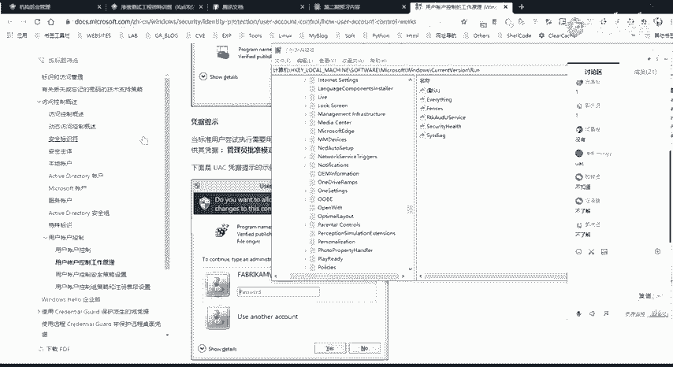

那么中间的这样子的一个要我们去就是说有这样子的一个弹框，要让我们去选择ys或或者no这样子的一个东西啊。这个东西的话就是我们的1个UAC。

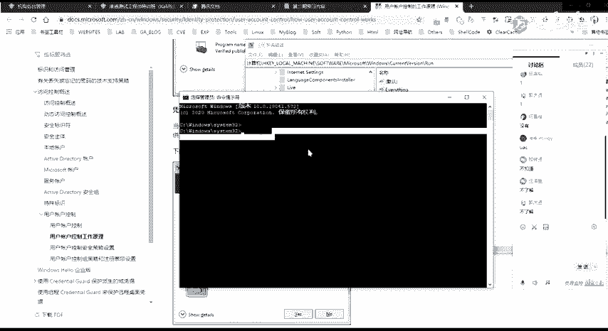

然后这个UAC的话就是呃。我们拓前面的这样子一个操作，对吧？就以我们的这样子的1个CMD为例，对吧？我通过这样子的一个就是说以管理员的一个权限去执行，对吧？

然后的话他会谈这样子的1个UAC我只要印证通过，或者说我只要呃通过了他的这样子的1个UAC的一个策略的一个认证，那么我就能够去得到这样子的一个管理员的一个权限，对吧？

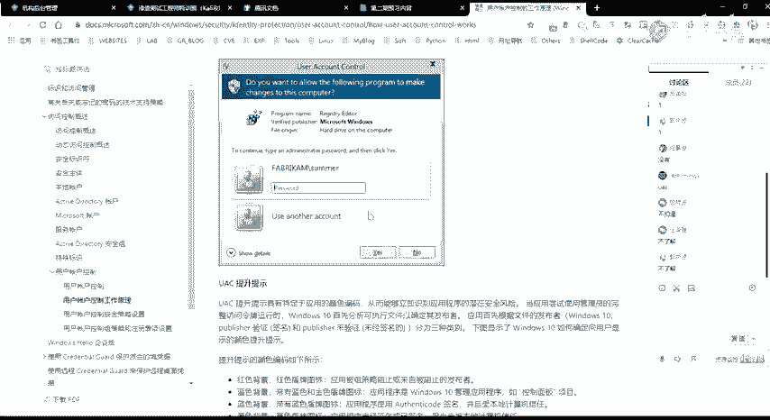

然后的话同理的话，我们在这边我们想要去进行一个提全，对吧？

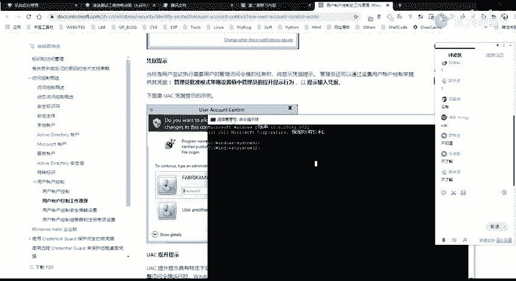

然后在这边的话，就我们就可以利用他的这样子的一个UAC的这样子的一个这这一个组件。我们只要能够去bypas，也就是能够去绕过他的这个UAC的这样子的一个呃这样子的一个策略。

那么我就能够去呃一个普通用户的一个权限去得到一个管理员的一个权限，对吧？Yeah。好后，在这边的话就是说在MSF当中的话，有集成的这样子的一些模块。

就是说大家可以直接在MSF当中去设取一下这样子的一个bypaAC。然后的话他我们在这边能够去看到有。呃，十0多个是这样子的一个bypasUAC的一个模块。这边虚拟机还没起来啊。

有点卡啊，我得。

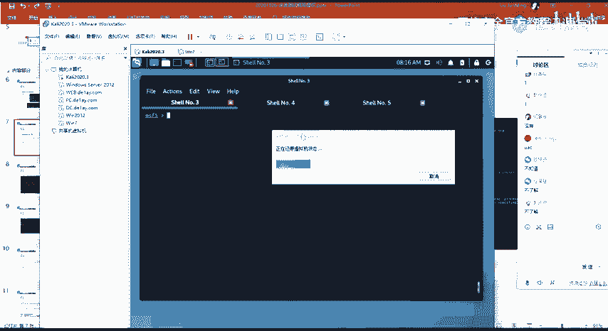

呃，这边的话先让它起着吧，我们先把内容先介绍一遍介绍一遍。然后的话在后面的话再操作给大家，好吧，再给大家再给大家操作看。

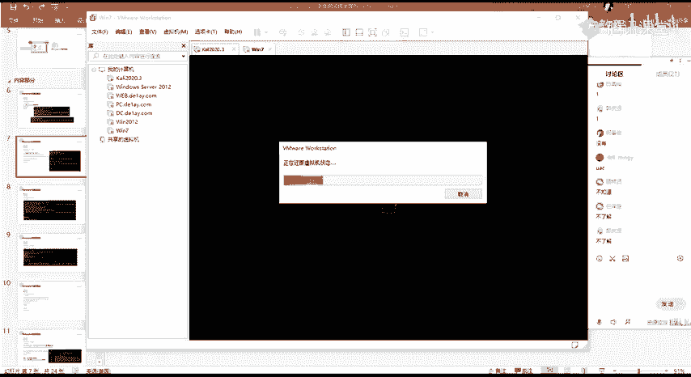

然后呃这边的话就是他的这个文块的一个使用。呃，这边的话先不先不去记啊，先不细说，然后等会再操作的时候的话，再给大家一一的去介绍，好吧。好，我们先来看一下它的一个效果，就是我们通过这样子的一个模块，对吧？

通过这一个by pass的一个模块，我们执行之后执行之后的话，在这边我们可以看一下。

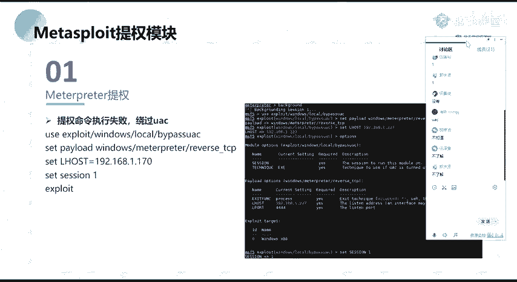

就能够去得到这样的一个筛选。呃，前面这边的话我们是基于一个筛选一，然后呃在这边的话大家要注意啊，就是说我们的这样子的一些提全的这一些模块，就是说我们要提全的一个前提条件，就是有这样子的一个绘划。

也就是有一个基本的一个有一个基本的一个用户权限，对吧？所以的话我们再去使用这样子的一个提全模块的话，同样的也是需要有一个筛选。也就是我们前面的话已经得到了这个机器的一个需，对吧？

有一个普通的这样子的一个用户权限。然后的话我们再基于这一个普通用户权限，以及啊具体的来说的话，就是这样子的这一个筛选一。

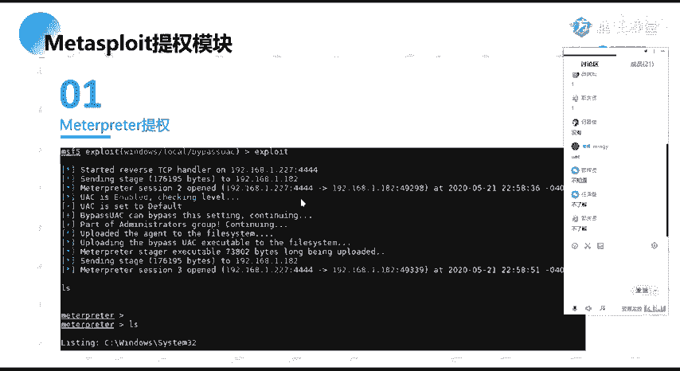

对吧然后的话我们在这边需要通过set筛选来去指定我们呃得得到的这样子的一个普通用户的这一个筛选的一个绘画。然后的话再去执行这一个模块。然后这个模块的话。

它就会以当前的这个筛选绘画的一个权限来去进行1个backpas的1个UAC的一个操作。

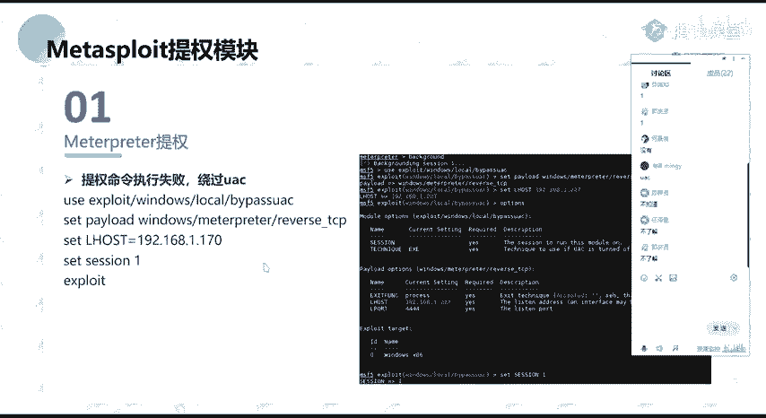

然后的话呃就是bu pass成功之后的话，那么他就能够去进行一个提群。提群之后的话就能够去得到这样子的一个筛选。う。然后得到这个筛选，我们可以看一下，在这边的话有筛选二以及筛选3，对吧？我们在这边的话。

以这个筛选三为例，我们直接进入到这个筛选3。然后其实在这边的话呃。等会操作的时候再说吧，就是我们在这边进入到这个筛选商之后的话，我们呃执行这一个get systemem。

我们就能够去得到这样的一个stem的一个权限。就是说原本的话我们的这一个筛选一，对吧？我们直接get system的话，它是无法去进行一个提全的。就提全不了的。然后在这边的话。

我们通过这样子的一个by passsUAC。然后的话得到了这样子的就是说当前的这样子的一个绘划，它其实是有了一个管理员的一个权限。然后的话我们再通过这个get systemst。

基于它的这一个管理员的一个权限来去进来得到它的一个stem的一个权限。我们可以在这边看到，对吧？然后第二的话就是呃另外的这样子的一个模块，它同样的也是呃它的一个原理也是一个bypaAC啊。

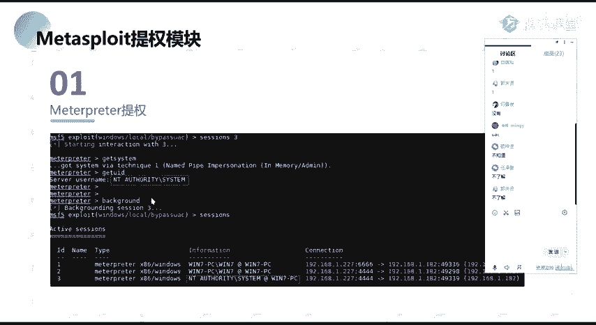

然后它的一个使用跟前面也是啊类似的。玩啊。

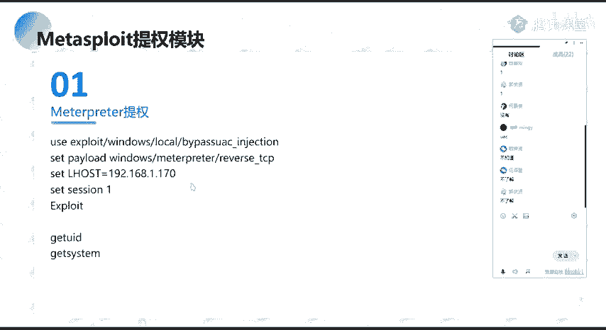

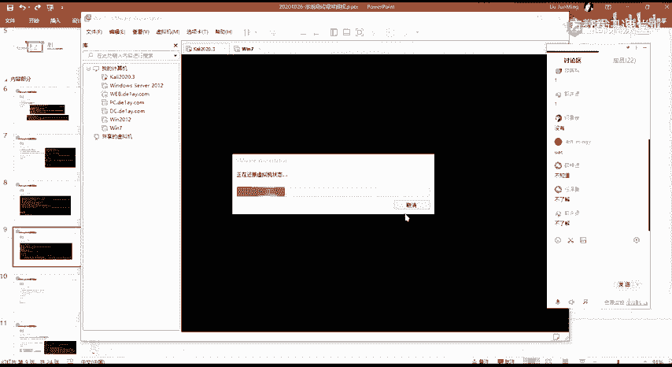

But。啊，许机还御不了了。

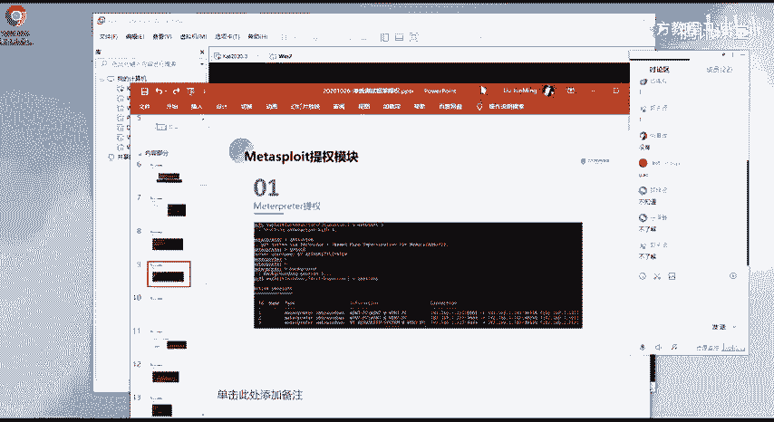

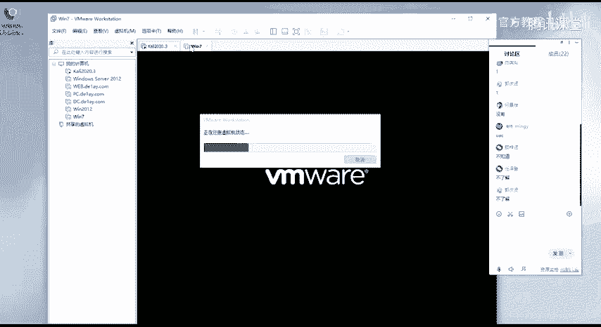

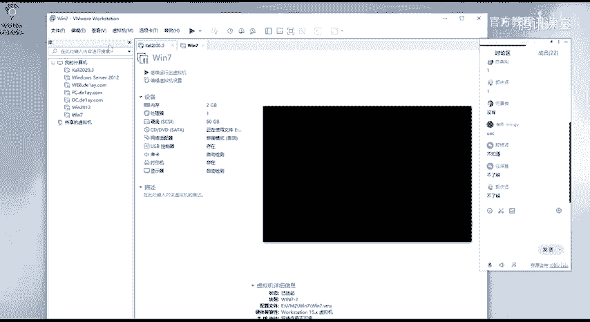

嗯。😊。

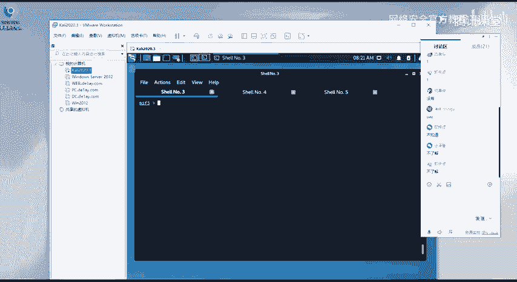

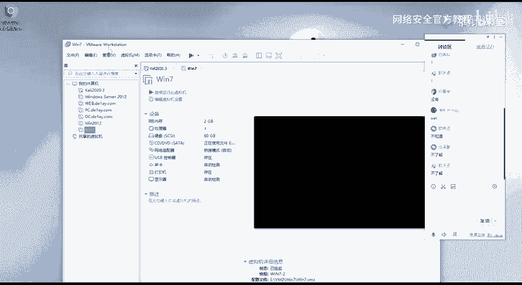

Yeah。呃，这边先让它还原一下。然后我们先呃操作的话，等等我这边机器好了再那个我们先介绍内容。

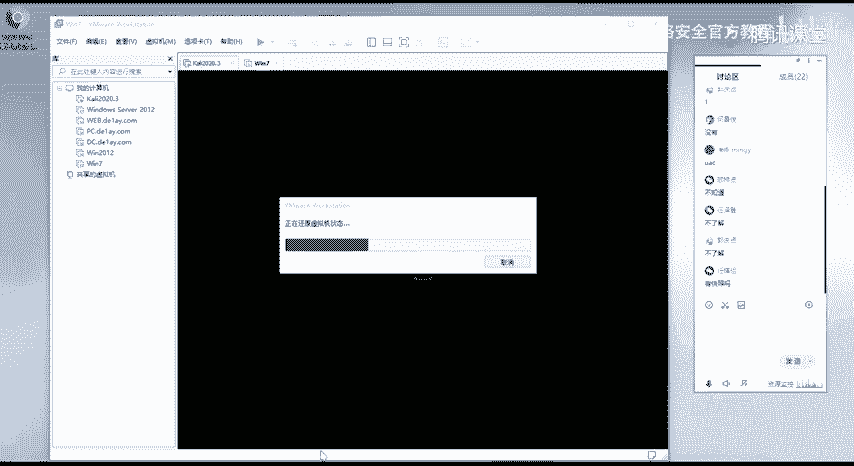

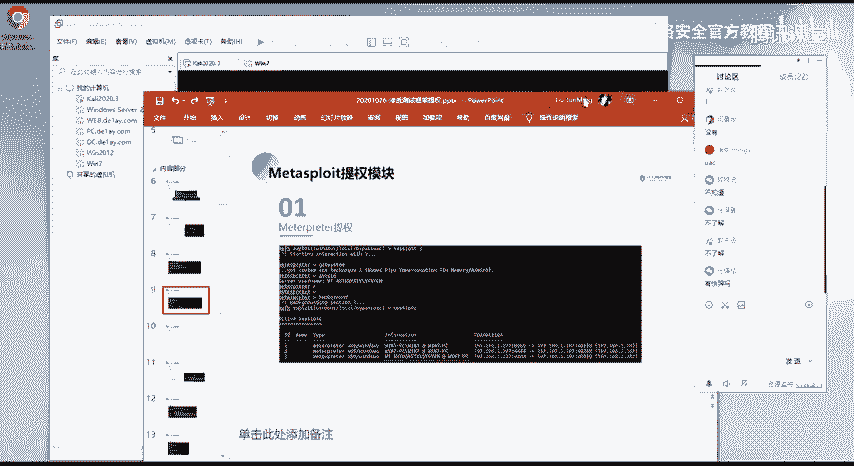

7。前面呃刚刚的话给大家介绍的就是这一个bypaAC的一个模块。这一个的话跟前面它也是一样的。就是他的一个操作的话也是一样的。然呃下面的话就是这一个。呃，就在上一节课的话呃给大家有介绍。

就是说这样子的一个windows平台的一个提群漏洞的一个集合，对吧？然后的话我们可以通过它的这边的这个呃MSF当中的这个local exploit suggest这样子的一个模块。

我们可以去基于已经得到这个筛选。在这块筛选一表基于已已经得到这个绘画。然后的话我们执行这个模块之后的话，它就会去做相应的一个呃提群漏洞的一个检索。它会去在当前的一个目标机上面去进行一个检索。

然后的话去判断呃我我的一个目标机器能否去进行一个相应的一个提群。然后他在这边的话他会去列出就是说可能存在的这样子的一些提群漏洞的一些利用的一个模块。

然后我们在这边的话可以去一的去尝试使用这些模块来去进行一个提群。🤧嗯。😊，然后在这边的话，提全的话呃。我们在这边的话是以就是说我们执行这个呃。

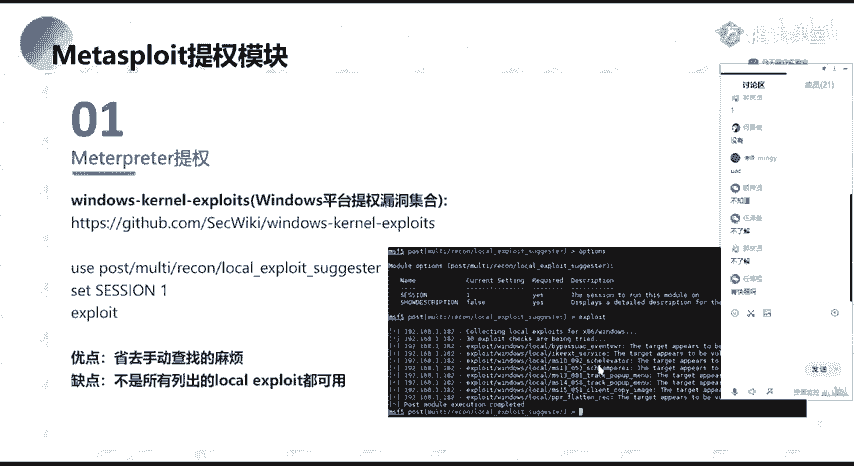

执行了这样子的一个提群的一个信息紧锁的这样子的一个模块之后的话，他这在这边有给出了这样子的一些啊可能的这样子的一个提群的一些模块，对吧？以及对应的这样子的一个呃漏洞。然后在这边的话。

我们尝试使用其中的一个提群模块，然后的话来去进行一个提群。然后具体的一个效果的话就是我已经知道了，对吧？他这边有给了建议，我可以去使用哪一些提升的一个模块。那么我直接去柚子它，然后的话去行一个使用即可。

是吧？然后这这的话最后的一个效果，它就是像这样子。Yeah。就我执行之后的话，执行之后的话，在这边呃，他会去得到这样的一个筛选4，对吧？然后这个筛选四的话，我们在这边看的话。

就是说这边information看到的话，它是一个普通的一个用户。但其实的话我们筛选进入到这个筛选四的话，我们通过get systemtem就能够去得到这样子的一个st的一个权限。Yeah。Okay。

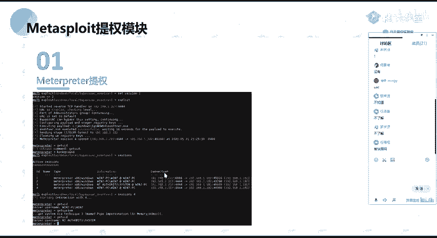

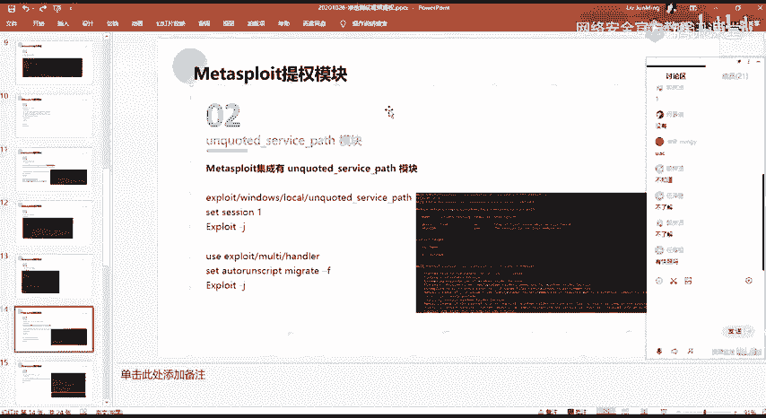

玩。我这把机。讲了吧，下是。嗯。有快照吗？我我我我忘了看一下吧。刚刚都刚刚都是没问题了。

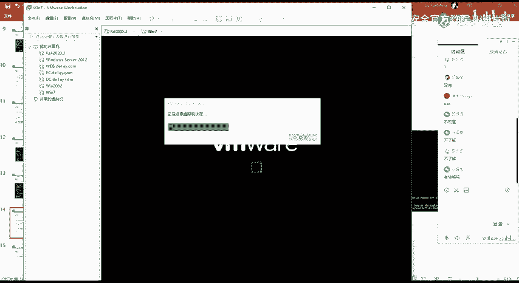

7了吧。

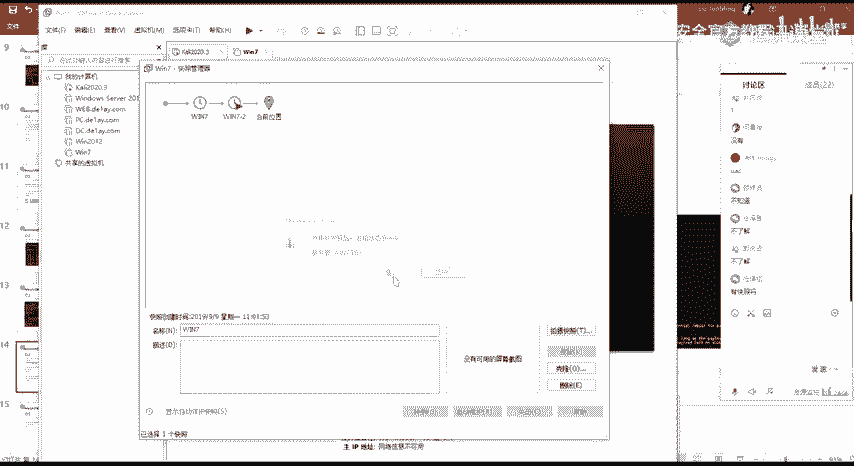

Yeah。

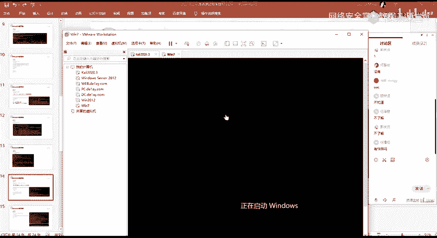

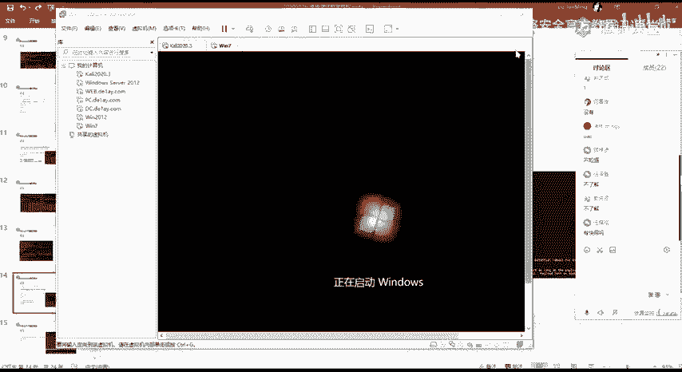

嗯。Okay。

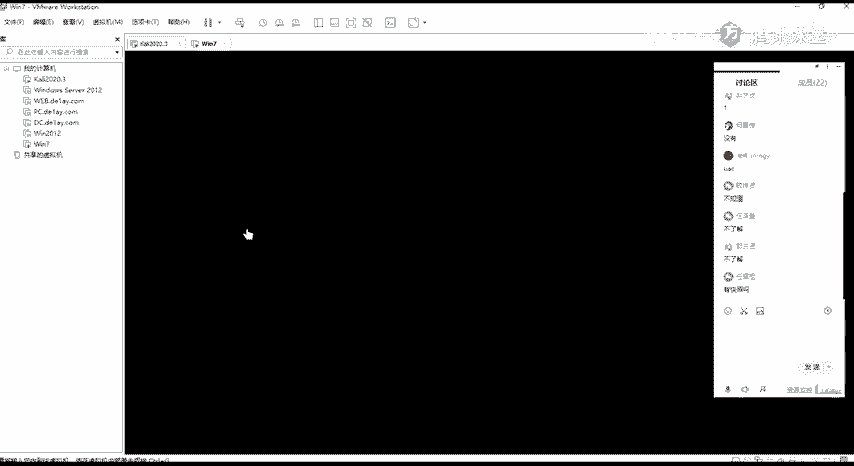

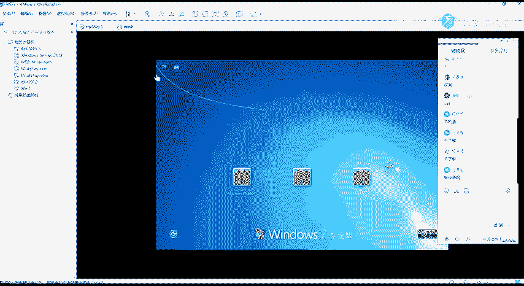

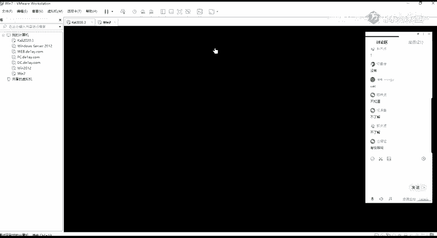

Oh。

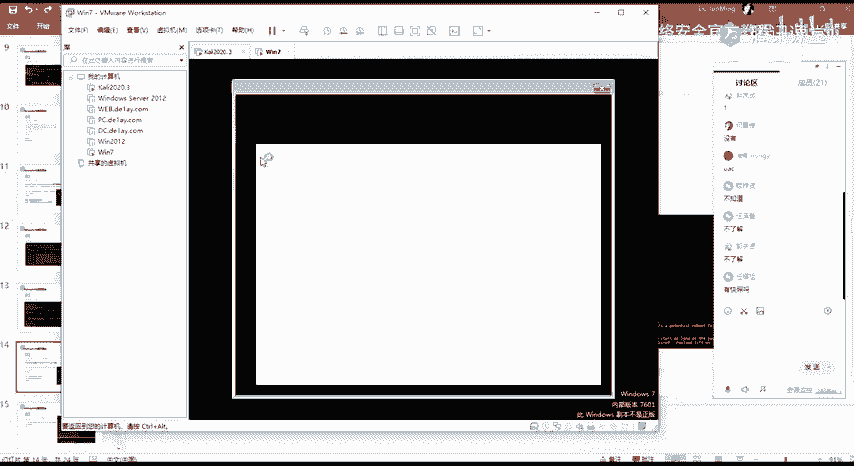

Okay。

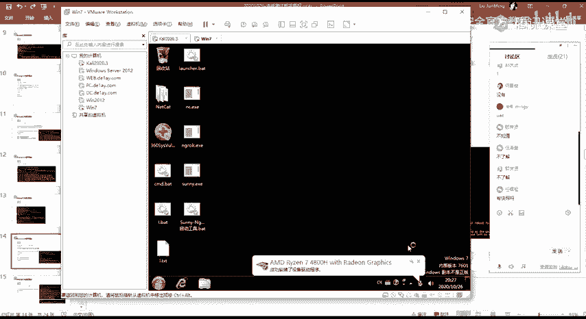

不行嗯。唉。我这边还还原到初始的这一个的话，我的环境没了。

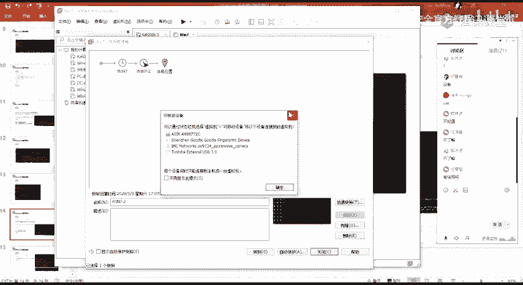

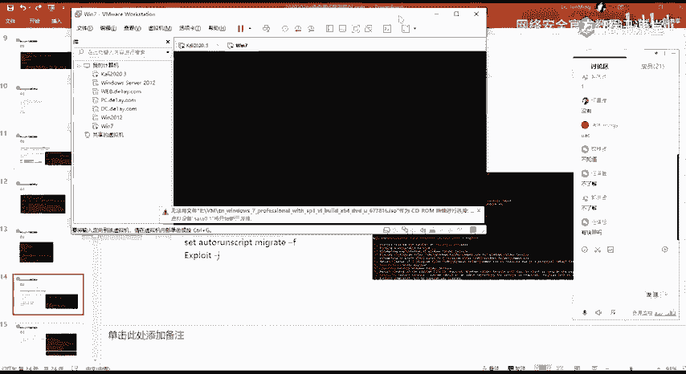

你算。🎼。

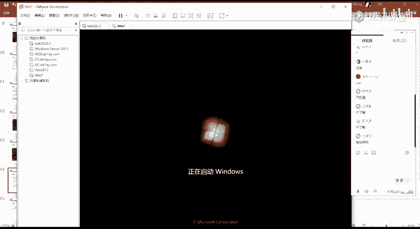

응。


行，知道了。


呃，这边的话不好意思啊。


这边红箭突然突然崩了。然呃。这边的话可能就是。🎼会有一有一两个操作可能会实现不了，就是演示的话。呃，在这边的话。


我这边的话也提前就是生成了这样子的一个可进性程序啊，然后就是模拟我已经得到了这样子的一个普通用户的一个绘画，对吧？然后我这边的话得到了这个筛选20。我们getID之后的话。

得到是这样子的一个普通用户win7的这一个普通用户是吧？然后我这边的话，我尝试使用这个样子的get system来去进行一个提全。然后在这边的话，你会发现的话，这边的话是无法去直接提全的。

然后其实我们可以需要到呃。学到他他的这个绘画。我们可以来查看一下这个win7的一个用户啊，它其实也是一个管理管理员组的一个用户啊。

但是它同样的就是说无法去使用这样的一个该 systems systemstem来进行一个提取。所以针对这样子的一种情况的话，我们可以尝试使用。这样子的一个ipadUAC。就是这个。


然后我这边的话直接柚子这一个模块，柚子之后的话，在这边要去配置的一个选项的话，就这三个就这一个筛选。然后的话loc host还有loc pot，对吧？


啊，我这边的话要去设置一个筛选，这边的一个筛选的话，就是选择我这边前面得到的这一个普通用户的这一个筛选，对吧？因为我要去进行一个提群的话，我是基于这一个筛选绘画的，也就是这边的这个20。

我设的这一个筛选1个20，然后这边的一个housese破的话，我就呃默认。因我这边的话是我当前的这个看理机器话，是这一个。嗯。IX fight。export执行之后的话。

它就会有这样子的一个backpasUAC的一个操作。然后在这边它就会返回这一个筛选21，然后得到这样子的一个m。然后在这边的话，我们可以getUID来查看一下当前的一个用户。

他其实还是这样子的一个win7啊，对吧？然后在这边的话，我们得到了这样子的一个m。我们通过这个白V得到了，我们还需要去执行这个样子的gaalax。这一个提全的一个命令。我们才能够去得到这样子的一个。

接省了的一个权限。系。うん。所以的话就是说我们在这边对吧？原本的话我们。直接去进行一个get system的话，提全不了，对吧？那么我们针对这样子的一种情况的话。

在这边我们可以使用这样子的一个bypasAC的一个模块，对吧？然后的话利用它的这个模块来得到了这样子的一个筛选S1。


然后在这个筛选S1的话，其实我这边这个筛选S1的话，它其实已经有得到了相应的一个管理员的一个权限。然后的话我们就能够去进行一个呃执行这个get system来去得到一个stem的一个权限。

就其实如果说你这边的话，你这边呃这边看一。Oh。


。么意思。22。就我这边我换一个用户，对，大家其实也可以自己去尝试啊。


不要。我这边换一个administer的的一个用户，对吧？然后的话我在这边的话直接。


直接执行这一个执行这的话，我这边的话会得到另外一个新的一个筛选区啊。然后我这边的话，你。以这一个新得到这个筛选222为例，我们可以看一下这边我这边的一个筛ession22的话。

是一个administister的一个用户，是吧？


而我前面得的话，其实只是一个win切的一个普通用户。虽然他是一个管理原主，但是他同样的得到不了s的一个权限。然后我这边的话我得到，如果说我得到是一个这样的一个admin产择一个用户。

对吧然后我在这边的话，我直接该 systemem，我就能够直接的去得到这样子的一个 system。这是这就是呃。前面这就是前面跟这边的一个区别啊，就是我们前面的话。

因为我们其实通常的话得到就是一个普通用户嘛，对吧？当然的话也可也存在这样子的一个情况。就是你得到就直接是一个addminadmin选择的一个用户，对吧？那么你得到这个admin选择的一个用户权限的话。

你就可以直接的去直接执行这个get system来去得到一个system的一个权限。这是。这是第一个的一个m的一个提全模块。然后第二个的话就是这一个白化AC的一个injection。


Yeah。Yeah。然，这个的话跟前面的一个操作一样的。我这边的话我就。

直接。


啊。这边的话同样的是筛选一个筛选，对吧？然我同样的用的前面的这一个筛选20，也就是这个普通用户的这一个筛选，对吧？这个筛选20，也就是这个win7的这个普通用户的一个筛选。然后的话我这边的话。

我直接export。啊。然后直接ex的话，在这边的话我就得到了这样子的一个呃。筛选23对吧？也就是得到了这样子的一个m的一个绘法。然后我当前getUID直接得到了它的一个stem的一个权限。

这个的话就是呃这一个白块石AC的一个模块的一个使用。然后在这边的话要注意啊，就是呃我这边的话，因为是其实前面的话已经有操作了。然后在这边的话，大家呃如果大家自己去进行一个操作的话，会有这样子的一个问题。

就是会有这样子的一些报错什么的。然后呃其实关于这些报错的话，我已经讲了挺多了呀。就是就其实你去发现这一些问题啊，你发的发现这一些问题的话，它不是会有这种报错的一个信息嘛。像比如说在这边的话。

我这边的话就是呃大家去用这个模块的话会有这样子一个问题。因为我当前的话，这个是一个材料式的一个机器。然后呃默认的话，这边的一个target，它其实是1个叉86的。我这边的话是我自己后面改的。

我这边设的part距 is为。明白，然后我。查看一下这边的话是一个windows。对，然后如果说在现在时候我再去执行的话，他就会报报错。就是说呃你在这边你设置好了这种设置好了筛选。

以及loc cost那个port的话，你还一要去注意要去注意这样子的一个target，也就是针对不同的呃操作系统的这样子的一个架构。我们就是说我们用MSF去进行一个利用的时候，它的一个呃它是不一样的。

它最要的一个结果。就是你要去做一个对应，就像我们使用这一个payload对吧？你在叉64的一个平台的话，那么你就去使用叉64的一个payload。那么这一个参用式平台对吧？

这种平台这种信息我们怎么获取呢？就是前面的一个信息收集嘛，对吧？前面的一个信息收集，我要我可以去查找到对应的这一个系统，它它的一个系统这种架构，对吧？那么我知道它是1个64位的。

那么我就可以用64位的payout去生成64位的配ode去打，对吧？不是32位的，那么我就生成32位的嘛。然后其实在这边的话，像呃在MSF这种工具里面，你去去检查这种报错的话。

它其实这边的大家只要看到这种就是红色的对吧？然后一个警号这种就是报错嘛，然后你只你你就去关注这一行就可以了。然后在这边的话，他就是报错来，就是说你的这个攻击停止了，对吧？因为这边的话有错出错。

就是这边的一个ba confi，也就是你的一个配置的话是出错了。配置输出的点赞呢就是这边嘛，这个叉86tt select for from叉64的一个 systemstem。然后关于这种大家不清楚。

对吧？你翻译一下吧，对吧？就说为叉64系统选择了叉6叉86的一个目标。那么我们发一下，我们就知道了嘛，对吧？就是我这边的一个我是本来是一个叉6式的一个系统。

但是我这边的选择的一个差ge的话是1个叉86的对吧？Yeah。所以话我们在这的话只需要下载一下它可成一啊。然后这边的话就是一个正确的一个配置，然后我直接expoit就能够去进行一个提全。うん。

就是啊这一个。呃，然后的话就是这样子的一个windows平台的一个齐全漏洞的一个集合。呃，上节课的话因为内容的话比较多，没有去给大家操作演示。所以的话呃关于MSF相关的这些操作的话。

我都放到了放到了这一节课。好，呃，在这边的话，我们直接右指右指这一个模块。


我这边号就不少。走下来，我直接复制粘贴啊。然后我直接右这一个localex suggest的一个模块。然后这些的话你只需要是设置一个这样子的一个se。我这边设置一个筛选的话，就设置为筛选20，对吧？

就是。我们前面得到这个普通用户的这个筛选。嗯。奥特曼。我们。然后的话我这边的话就其实就已经配置完成了呀，对吧？然后我们只需要一个创执行。export执行之后的话。

它就会呃去运行它的就是说它的这个模块里面的话，它已经有写好了相应的一些检测的一个脚本啊，这些脚本的话，它就会去检锁啊，这一个筛选20。

它可以这一个筛选20的这一个规划的一个权限去检锁你系统当中可能存在的啊，能够去进行一个提全的一些漏洞，对吧？然后的话给出对应的MF当中可以去直接去使用的这样子的一些模块。Yeah。好。然。

这边的话呃稍微等待了一会儿时间，对吧？它的一个速度的话还是比较快的。然后在这边的话，我们呃执行之后的话，他这这边给出了这样子的一些呃这样子的12344个对吧？四个可以可能存在漏洞的一个模块。

也就是我们能够去进一个漏洞利用的一个模块。然后这边的话我们呃就以第一个为例吧。然后呃在这里的话，大家要注意啊，就是要注意的一个。东西就是说他在这边所提供的这样子的一些模块，你可以去尝试使用。

但是的话你使用它的这一个模块的话，不一定就不一定能够去进行一个提全成功。大家要就是知道这一点啊，就说他的这样子的一个呃警测的话，他的这样子的一个就是参考的话，就只是作为一个参考，你可以去尝试。

但是不一定能成了。啊，呃，在这边的话我们可以看到我这边的话呃，它这个模块同样的也是只需要去设置我们的这个筛选，对吧？就是我这边的1个20普通用户的一个绘画。

然后在这里的话我们就得到了这样子的一个m的一个筛选25。对吧然后呃我们可以看一下当前的这样子的一个。呃，用户是win7对吧？然后我们可以尝试用G system来去进行一个提群。然，这边的话。

我们同样的通过这边的这一个模块得到了这样子的一个sson的一个权限。这边的话运气比较好，对吧？直接第一个就成了。然后我们也同样的可以去尝试。呃。其他的这边的话，你比如说。你再一个为。

这其肤提拳的话真的比较看运气啊，就是。啊，在这边同样的要去注意啊，就是如果说你这边的一个target target有这样子的一些选项，对吧？你可以通过修t。来去查看一下，就是这边有哪一些tt。

然后在这边的话只有一个的话，那就说明啊我当前的这样子的一个就是提前的这个模块，它只针对就win7的这样子的1个SP0SPE的这样子的一个系统啊。如果说还有其他的一些系统的话。

你要知道目标机器正好就是说属于它的一个tt范围之内的话，那么你就去选择对应的这样子的一个target。这个他嗯嗯。对执行。呃，这个也是没有问题的，是吧？也直接得到这样的一个绘画。

直接就得到了他的一个sson的一个权限。呃，还有其他的两个的话，我就不一的去尝试了，就可能成功，也可能就是失败了。好，这边的话试的这两个是都是成功的，没有问题的。嗯。然后的话就是这一个这一个。


windows下面的一个提全漏洞的一个集合。就利用的这一个模块，就这个模块的话，它。呃，大家在MSF当中，如果说你反正需要到MSF当中的话呃，正好是windows机器的话，你可以去尝试。

因为它是自动的去检锁嘛，就呃就省去了我们去手动的去一步步的信息收集，然后话找对应的这种啊啊EXB去进行一个打是吧？他在这的话直接给了建议，然后的话可就是你直接去用的话，有很有可能就能够直接去打成功。嗯。

然，在这边的话。可以看一下12选项，就后面的这几个对吧？2526这些都是呃通过。


提全的一个模块所得到的这样子的一个sson的一个权限，对吧？然后这边的这一些筛选的话，它都是基于这边的一个。它都是基于这边的1个20，对吧？就是我这边的一个win7的这个普通用户，就这一个普通用户。

它原本直接get system的话。他是无法去得到一个sstemst的那个权限的对吧？Yeah。Yeah。然呃第二个的话就是这个un quarter service pace的一个模块。


呃，这个模块的话其实对应的是我们上节课讲到的那个就是呃讲到的那个。windows系统下面的一个服务漏洞的这样子的一个提群啊。有。然后对应的在MSF当中的话，它就有这样子的一个模块。

我们可以直接去进一个使用。呃，在这边的话，这个模块的一个使用的话，呃，其实也就是。跟前面的话都是一样的，我们同样的就是需要去设置这样的一个筛选一，然后直接export就可以了。然后在这边的话呃。

我们看一下这边的一个截图吧。然后呃本来的话我这边的一个靶机的话是我已经配置好了呀。🎼就是我可以直接通过这个模块直接能够打成功。然后这边的话这边的话因为。


前面的那个东西没了呀，我的这个快到这边的话。我的前面本来有很多环金的都没了。


所以的话这边的话呃大家看我这边的一个截图吧，然后我给大家介绍一下。介绍一下这样子的一个模块，它的一个就是。基本的一个使用。在这边的话，我们直接呃设置设置一个筛选，然后直接exloit。

然后在这边exloit之后的话，我们可以看一下，在这边他会去做这样子的一个操作，他会去找一个他会去查找我们的这个目标当中，可以去进行一个利用的这样子的一个sage，也就是服务嘛，对吧？

然后的话在这边可以看到他有找到像这边这一个这一个路径。这个路径的话其实就是我们呃在上节课给大家去讲的这样子的一个对吧？就是这边呢呃其实这个的话就是我做的一个配置，我做的一个黄金配置。

就是自己创建了这样的一个windows49的一个service。然后这个service的话，它是存在这样子的一个漏洞。它的一个路径的话。

它是呃它是就是说它的它是这样子的一个unced的uncred的话就是没有引号的。也就是说它的这个路径的话，它的这个路径的话，它是呃没有引号去进行一个包裹的这种。

