# B站最全网络安全教程，整整1300集，全程干货无废话，别再盲目自学了，看完学不会我退出网安圈！（web安全｜渗透测试｜内网渗透｜CTF） - P94：93. 第四十三天：CobaltStrike提权模块.mp4 - 网络安全官方教程 - BV15u4y137cQ

然后在这边的话，我们可以看到，如果说它是没有这样子的一个引号包裹的话，那么他再去处理这样子的一个。就是说他在启动服务的时候，我们上节课的话有讲对吧？启动服务的时候。

他会去紧锁这样子的一个呃服务所对应的这样子的一个B pass，对吧？就是你的这样子的一个可执行程序的一个路径。然后他对这种他对这一个可执行程序路径当中的一个空格前面的这样子的一个字符串所对应的一个呃。

可执行程序，它会去进行一个加载，对吧？然后的话它会一个一个的去查找一一层一层目录的去查找，直到找到最终的这样子的一个啊service。然后在这边的话。

那么我们可以去进行对它的这样子的一个啊漏洞去进一个利用。另外的一个方法的话就是我们去查找到这一个路径当中的某一个目录。然后这个目录的话，我们需要有对它的一个写的一个权限，如果有一个写的一个权限的话。

那么我们就可以去尝试，对吧？在这边atemp尝试去写入一个这样子呃15872的字节的这样子的一个程序，然后把它写入到了这边的一个windows project这个目录下面，对吧？

然后生成了这个程序名的话，就是一个common点EXE啊。就是这个。好呃生成的这个comment点EX1的话。它会放到这个目录下面，对吧？然后放到这个目录下面之后的话，在这边的话有这样子的一个就是错误。

这个错误的话，其实就是我们前上节课有讲的，就是我们再去进行一个呃启动它的这个服务的时候，对吧？因为它的这一个漏洞话，要等它的一个服务重新启动的时候，他再去加载这个可执行程序路径的时候。

它才会去呃进行一个查找到我们这边所写入到的这样子的一个木马的一个程序，对吧？然后的话加载它还访他一个需。那么在这边的话，我们是一个普通用户，所以的话我们没有权限去启动他的这样子一个服务。所以在这边的话。

我们需要去等待他的一个服务区进行一个启动。所以的话在这边的话他会是处于一个等待的一个状态。但是他这边的话没有筛选。然后呃其实我们可以通过就是说大家自己演示的话，就呃就模拟它的这样子的一个服务的一个启动。

就是你去启动它那个服务的话，那么他在这边的话是能够去得到一个筛选的。然呃这边的话哎因为黄建黄建的一个问题啊，就是我。就我另外一个机上面的话有环境啊，但是现在的话就是重新搞的话，来不及了。

然后呃在这边的话，我就不不不演示了。如果呃如果大家有有需求，有要就要求要看这个演示的话，我后面就是我用我另外的那个环境，我啊可以录个屏，就录个视频，就是具体的一个步骤以及实际的一个效果给大家，好吧。

然后这边的话我就不演示了呃。大概的看一下这边。

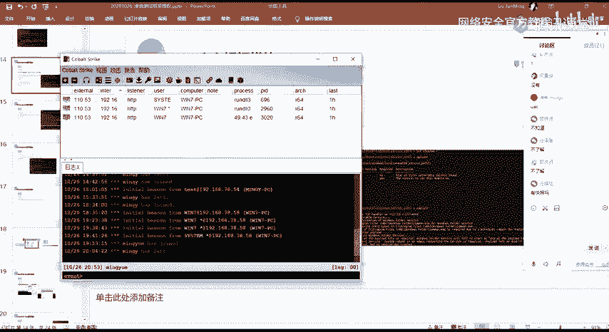

嗯。

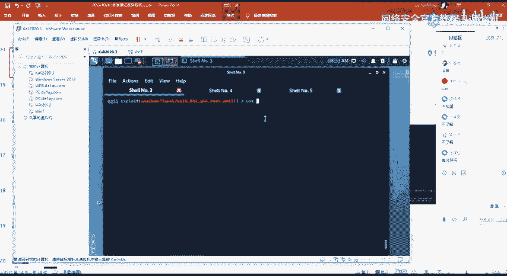

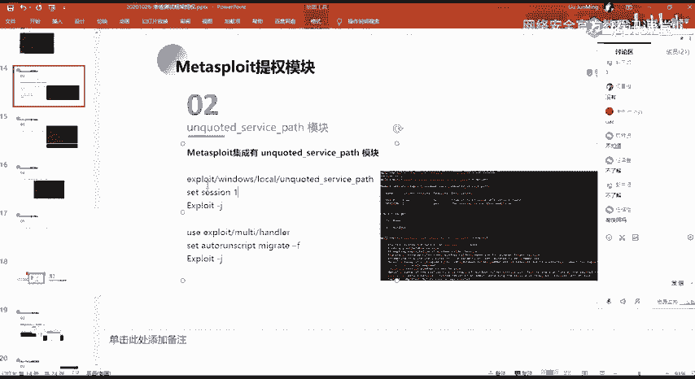

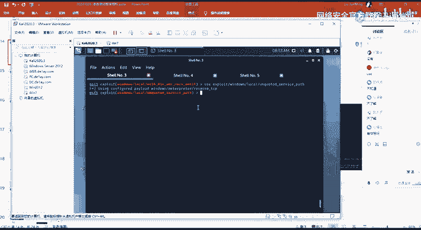

我们这对话同样都是筛选摄这个筛选S。你说来的话会1万点。他会去查找这样子的一个和利用的一个服务。然后利用我们上节课所讲到这样子的一个logo。你看到这句话，他没有找到对应的这样子的一个。然。

呃还有的话就是在这边要注意的一个点，就是呃我们这边的话再去设置这样子的一个handle的时候，我们去设置这样子的一个。就说alto run script的这样子的一个脚本。

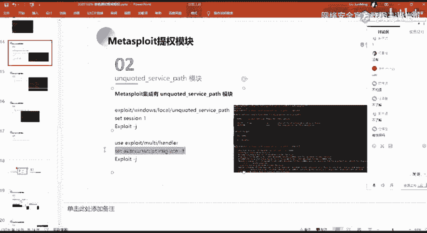

就我们在这边，其实我们在这里啊我们在这里我们执行对吧？我们利用成功之后的话，他这边是没有得到这样子的一个筛选，对吧？

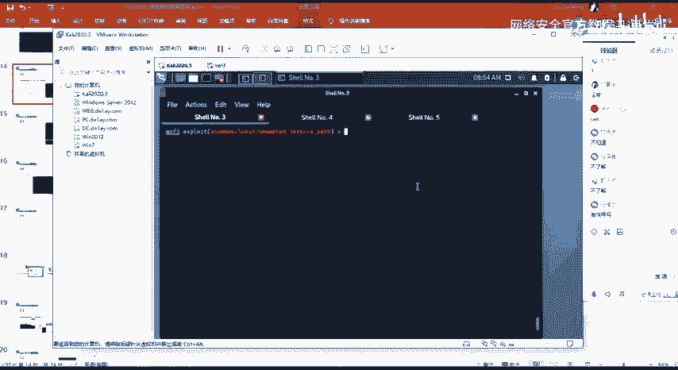

啊，因为因为在这边的话，我们要等待它一个服务的一个启动，对吧？但是在这边的话，你expo之后的话，你expo之后的话，它没有执行成功的话，那么我这边的话。

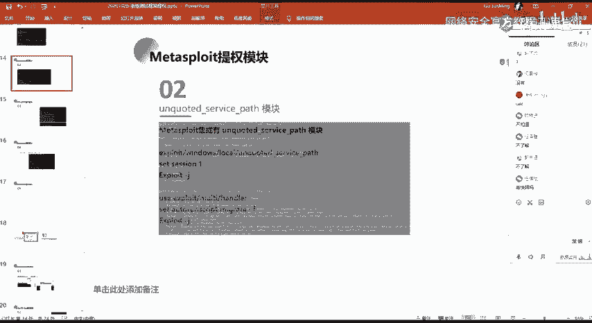

它是无法去直无法就直接得到一个筛选规话。所以的话我们需要等待它的一个服务启动。等待服务启动的话，那么我们就需要去用去创建一个今听器，对吧？

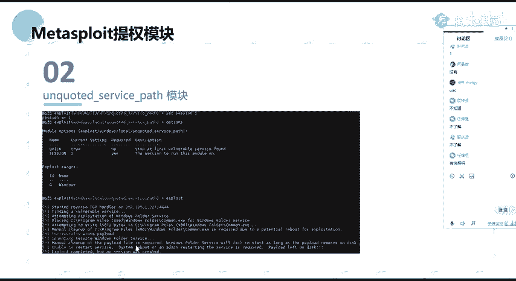

我们可以去创建一个今听器，把它挂载到就是放到后台作为一个jo室。然，后我们。嗯。在这边的话，我们设置这样子一个Kload跟前面对应的对应的一个Kload是吧？然后的话我们想要去。

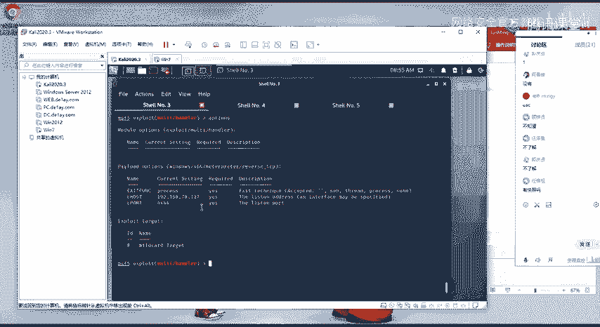

就是。你。啊这边。在这边要去注意的，就是说我们上节课其实有讲。呃，我们在这边的话，我们得到我们生成了这样子的一个comment inX啊，这一个的话，它不是一个服务的这样子的一个可执行程序，对吧？

那么它去执行它执行加载之后的话，它会以一个sson的一个权限去加载这样子的一个程序，然后把它做一个服务。那么它不是一个服务的一个可执行程序的话，它会与那个服务的一个控制器去做一个通信的话。

是无法去通信的。所以的话它会把那个控制器，它会把这个进程终止的。那么我们在这边去加载对吧？加载呃正确的服务之前的话，他会去加载这一个com0X1。那么它加载之后的话。

我们在这边就能够去得到这样的一个筛选。然后得到这个筛选的话，它会过一会儿它就会断掉。那么我们在得到这个筛选之后的话，立马去执行一个这样子的一个mrate。m的话这个的话就是一个进程迁移啊。

就是把我当前得到这个筛选的一个绘画的一个进程，把它迁移到另外的一个进程。就是说我当前得到这个筛选绘画的一个进程，它是基于我基于我这边的这个commentEXE的这一个可执行程序的对吧？

那么我这边的一个程序断掉了，那么我这个进程也就断掉了，对吧？那么但时的话我们可以通过就是说我当前这边的话已经得到了这样子的一个它的一个权限，对吧？那么我得到这个权限之后的话，我在它还没终止，我之前的话。

我做一个进程的一个迁移，把它迁移到我的一个就说其他的这样子的一个进程。然后只要那一个进程，就是说系统的一个正常的一个进程，它不断掉的话，那么我的我这边的一个绘画的话，它就不会断掉，对吧？嗯。就是这一个。

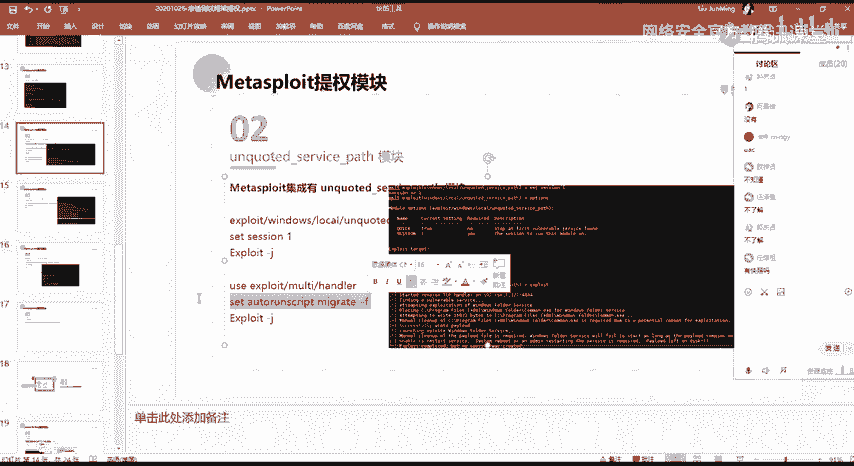

我们可以在这边呃通过。直接输入ADV然后tableable就advis也就是高级的一个配置啊。在这边的话有这样子的一些选项啊。然后呃上节课的话有讲这一个ex个 exist onss on筛选对吧？

这个的话就是呃。就是把它设置为fors。这个默认的话，它是去啊，就去的一个效果的话，就是我这边的执行ex choice之后，对吧？ex choice执行之后它会有一个jobs。然后这个旧本的话。

它会在后台，然后的话我。我的一个payload我的一个payload来回您我这边的这个监听器之后，它得到得到一个筛选，对吧？得到一个筛选之后的话，它这边的一个jobs它就会exist。就是从字面意识。

我们也知道，就是他会退退出。也就是就exist on筛选，就是在尽力筛选绘画之后的话，我的那个今天的一个教本它就会exist死掉。就所以的话就呃就是通常的话我们把它设为force，也就是只要那个绘话。

他只要执行执行的话，他就建立一个筛选，对吧？然后我的那个jobs啊，它一直处于一个今天的一个状态，他只要执行了我的那个payload，我就能够去得到一个筛选。

然后还有它就这个alto run script。alto run script的话，这一个就是呃设置一个就是自动啊就是在我们得到绘画之后，得到绘画之后的话，它立马会去执行这样子的一个脚本。

然后这边的一个脚本的话，它会自动的去执行这边我所设置的一个mining，就是这一个mrate杠F，就是呃自动的去清移我的一个进程到呃其他的一个进程当中。

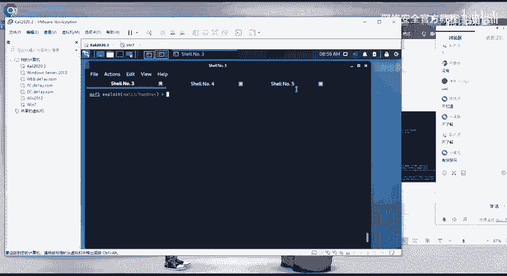

。然，呃，第三个话就是这个serv permission模块。这个模块的话跟前面对应的。就就是那个就是不安全的服务的。

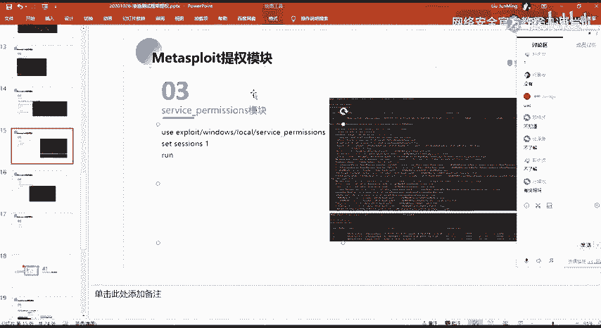

呃，那个什么来着？

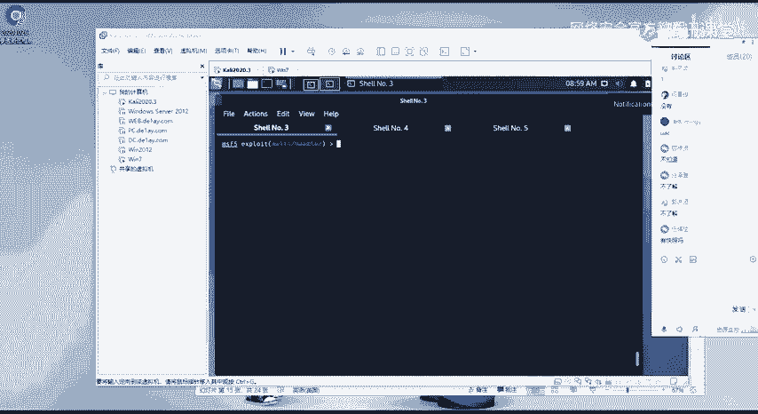

嗯。呃，刚刚的话就是刚刚这个话，其实就是这一个可信的服路键。就是他是利用他的这个缺陷。啊，呃第二个的话就是这个。不安全的一个服务权限，就是利用他的一个服务权限的一个呃就是漏洞。嗯。😊。

然后在这边的话，我们可以直接通过MSF它的这样子的一个模块去进行一个利用。就9点钟。

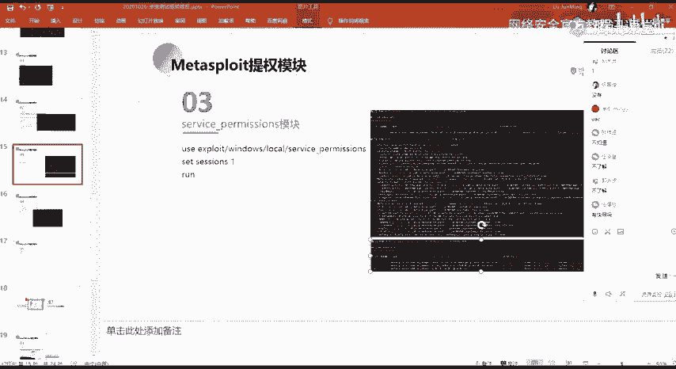

呃，我这边的话下一下。

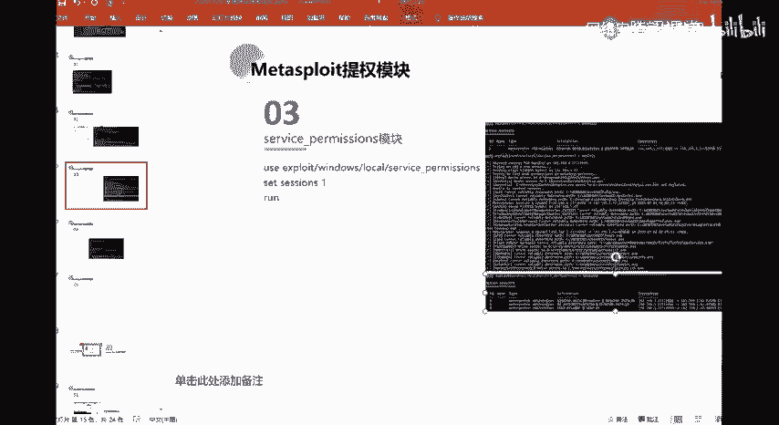

嗯。呃，我这边的话忘记了忘记中间下课了，就是没没给大家休息的一个时间了。下次的话呃大家提醒提醒我一下，好吧，就是到那个。到9点就是8点50嘛，8点50的时候就是呃中间休息5分钟嘛。好吧，因为我这边的话。

我讲着的话，我不会去看时间，我讲着讲着我就就就没有注意时间的话就忘了。好吧。就是呃大家有注意的话，在讨论区这边就是提醒我一下好吧。嗯。然呃这边的话是第三个。这个的话呃其实就是这个模块的一个使用。

你这边的话就不演示了呀。呃。然呃效果的话就是像这样子。然，其实在这边的话，我们看它的一个截图啊，就其实呃大家再去用这个模块的时候啊，用这一些模块的时候，它其实有这样子的一个过程，对吧？这个过程的话。

它其实就已经就是把它这个脚本的一个就是利用的一个过程有写出来。当然的话具体的一个实现的话，它没有那个嘛。然后其实在这边的话，我们可以看一下，它会有这样子的一个过程，就是。

他会首先会新建一个这样子的一个服务。然后的话他会呃把我们的一个stature，也就是一个payload，对吧？把它发送到我们的一个目标目标器上面去。然后这边的一个st的话，他会去查找。

就是we permission，就是在存在就是说在目标机上面存在的服务。它有这样子的一个就是呃。这个呃就是弱权限，就他的一个权限，他没有做好的，没做好控制的这样子的一些服务，对吧？

现在的话有找到像呃我我们的这边的1个360RP，还有ACUNE就这个A当名院士的这个。它是可以去进行一个写入的。然后呃在这边的话。我们找到这个就这个。这1个AWUSS的这个服务啊，对吧？

然后的话他把他把就是说他的这个服务程序的一个路径做了一个备份。然后的话他把它替换成了，就是把我们这边的一个这边生成的这个。这边生成了这个station，把它作为了一个替换。替换之后的话去进行一个执行。

然后执行之后的话，就能够去得到这样子的一个筛选。Yeah。好，呃，第四个话就是这一个alwayinstore limited。

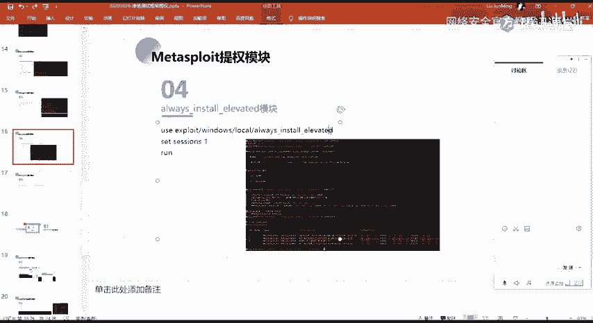

这一个的话同样的就是对应的我们上节课的上节课的那一个就是呃。

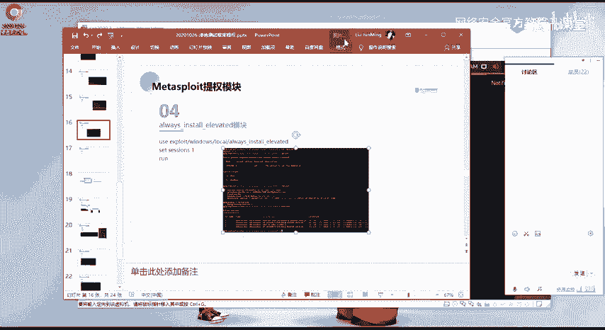

那个的内容。就是这一个al store empty的就这个这个logo的话就是说。它在它的一个配置，它的一个策略配置的一个问题啊，就如果它的一个策略配置，它配配置了这样子的一个O为你的话。

那么它任意用户他都能够与一个s统的一个权限去安装这样子1个MSI。那么我们只需要去生成1个MSI。然后上传到物由机上面去执行。执行他的一个安装。

那么他就能够去以一个s统的一个权限去呃执行我们的一个payload。是。对吧。呃，在这边的话。你试一下。我这边环境出了问题，我我确定能不能成了。就呃之前那个环境的话是肯定没有问题的。

是能够直接的去打成功的嗯。

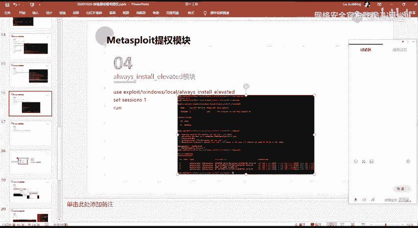

Okay。电做。其实。But滚滚。看一下群里。Yeah。唉。Yeah。呃，本来前面我前面我是有那个操作记录的，这边的话把我清掉了呀。我这边的话先直接尝试一下吧。Yeah。

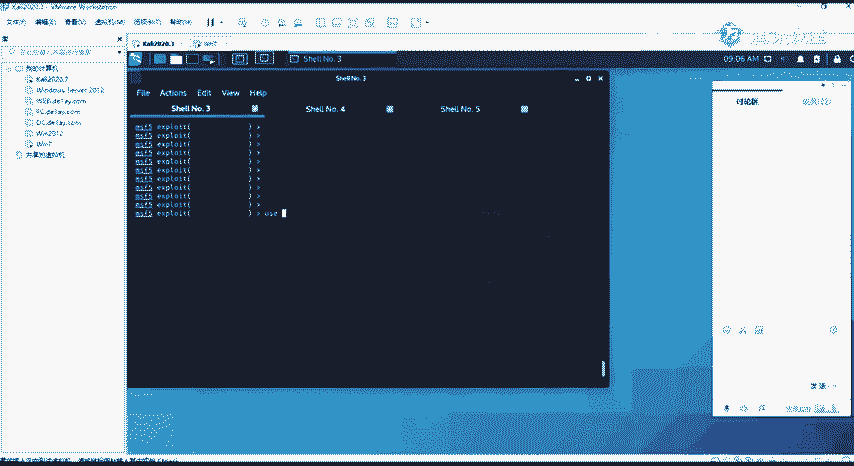

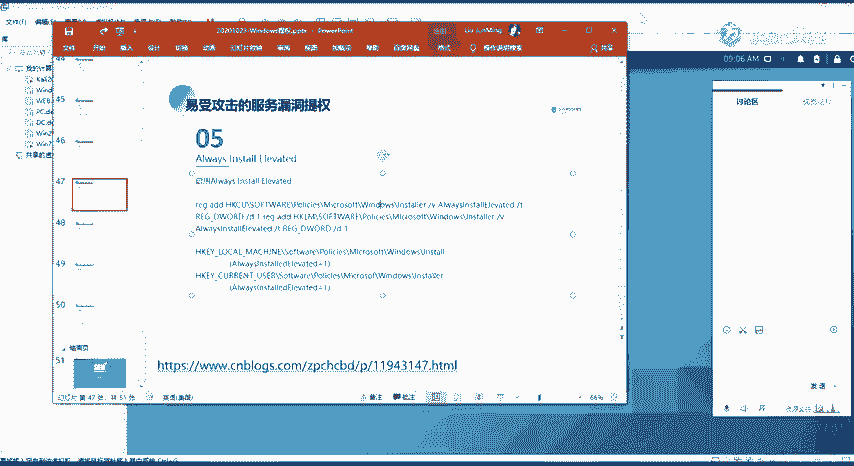

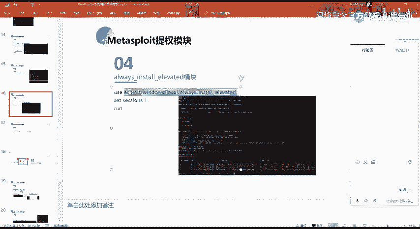

Yeah。

嗯。

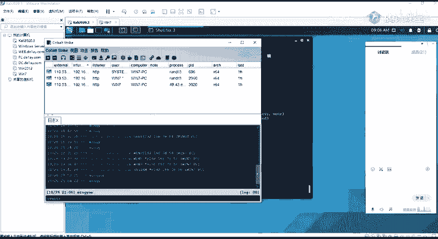

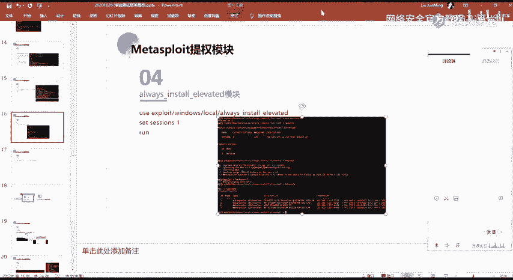

呃，我这边的话你只有一个。这个应该是可以存的。

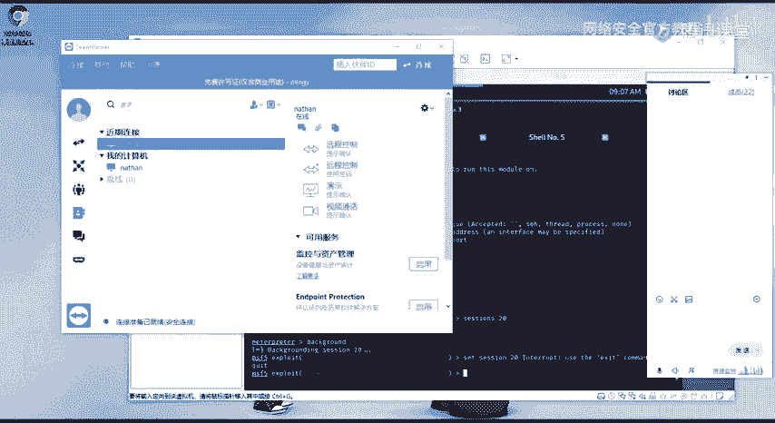

Yeah。

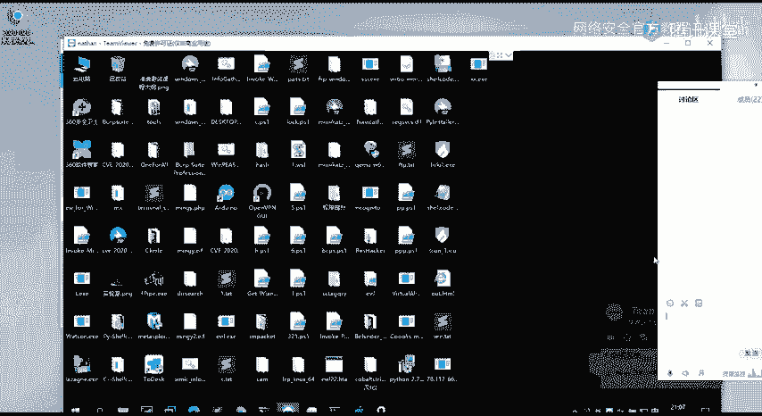

而且这一个把机原件，我这边的话得到了这个把机的一个。

呃，NATHNA的这个用户的一个就普通用户的这一个筛选，对吧？对吧。然，我在这边的话，我使用这一个OV store。他是7。指定这1个27的这个筛选是，然后我这边的话一。啊，我ex执行之后的话。

执行之后的话可以看到只到了一个这样子的一个筛选S8，对吧？可以ge这个ID可以看一下，但这的话直接得到它的一个sem的一个权限。然后其实在这边的话。

它就是上传了这样子的一个uploading这样子的1个MSI啊，就是把它就是它这个MSF所生成的这个MSI把它上传到了这边的一个t目录，对吧？然后的话去进行一个执行执行这个MSI执行之后的话。

把我们的这样子的一个呃station，把它给传到了目标机上面去执行执加载执行之后的话，我们这边就得到了这样子的一个s选。而且这个筛选的话，它是一个C0的一个筛选。因为呃我这边的这个机器的话，它是开了。

他是开了那一个就是策略嘛，对吧？开启来那个O installstore average的的一个策略。所以的话我这边可以直接去进一个进行一个提全。就是。这是第4个。然后呃第五个的话在这边的话。

我给了一个另一句啊。就是关于更多的这样子的一个内核的，就windows内核漏洞利用的一个提全。呃，在这边的话就是说在MSF当中，其实有很多的这样子的一些。

就是它已经有内置的这样子的一些提全漏洞的一个模块。就我们可以去直接去进行一个6。然后呃大家可以看一下这篇文章在这边的话有提到有这么多就是。以及就是在MSF当中所对应的一个模块，我们如何去进行一个使用。

就它这个使用的话是。使使用的话其实是最简单的对吧？它有给现成的模块，我们只要柚指它，然后的话设置我们的一个今天的一个目标，然后的话设置一个筛选，然后直接ex就能够去进行一个呃利用了，对吧？啊呃。

更多的这个的话，大家自己看一下这篇吧，这一篇文章吧。我这边的话就呃不会去多讲了。以及这样子的一个就是浪虎刀这个对吧？这个的话上节课有有讲。呃，上面它就是MSF相关的这样子的一些提全的一个一些技巧。呃。

下面的话就是给大家介绍一下CS的一些提全的一个模块。嗯。呃，CS的话。CS的话其实大家大家了解嘛，就是呃它CS它的一个发展，它其实是呃基于MSF的，就是说基MSF的那个M体积，就M体积的话。

它是一个就是MSF这一个框架，它的一个图形化的一个呃图形化的一个界面。然后的话在后面的话就是慢慢的发展成了这样子的1个CS。然后的话呃就是独立独立出来，就独立于MSF的这样子的一个框架。

然后其实再去使用的时候的话，其实CS啊就是如果你两个工具你都是比较熟的话，然后的话你再去你去使用了，你去有使用过这两个框架的话，那么就其实CS的话呃挺多时候的话会比MSF要好用一些吧。当然的话就是呃。

MF的话，它的一个优点的话就是它里面的一个模块，以及它的一个就它框架里面的一个模块，它是很多的对吧？而且的话就是实时的有更新，就是最新的一些漏洞的话，一些模块的话。

也有也有人就是把它写成MSF能够去直接去使用的这样子的一些模块。然后CS的话就呃相比MF的话就是会。呃，可能会更加灵活一点吧。就是呃在CS当中的话。他的一个最大的一个就是。

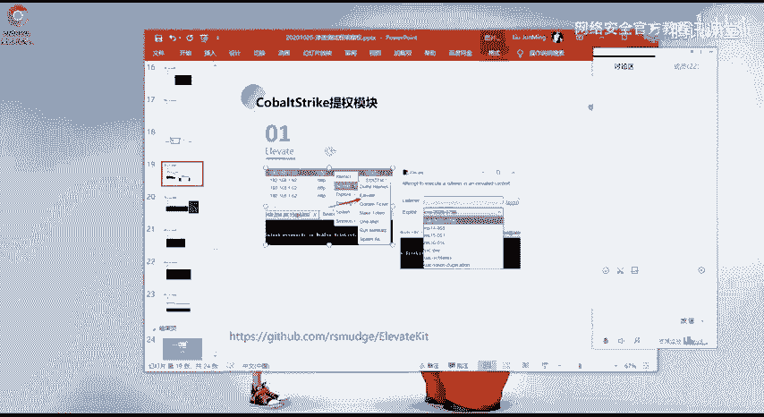

他的一个比较好的一个。呃。

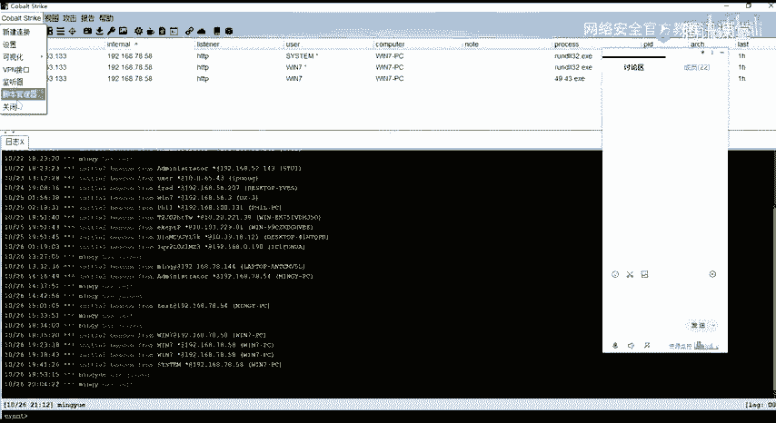

或者说它的一个优点以及比较好的一个很好的一个地方，就是他能够去加载我们自己去写的这样子的一个脚本。然后的话它有这样子的一个脚本管理器，然后我们自己的或者说别人已经写好了的写好了的这种脚本。

我们可以把它给加载进去。然后的话扩展我们的1个4S。呃，在这边的话就是呃当然的话MSF你也可以自己去就是说去写对应的这样子的一些呃脚本，对吧？这样子的一些模块。然后的话你同样的也可以加载到里面去。

因为他也有提供对应的这样子的一个就是API是吧。好，呃在这边的话讲到CS的一些提全模块的话，首先第一个就是一个ever。everage这个的话，它是4S里面自带的这样子的一个功能。

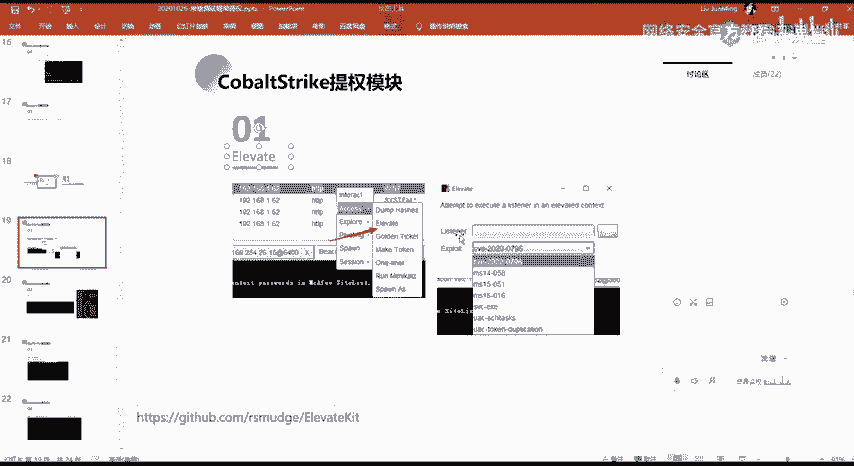

就是我们在这边的话。嗯。

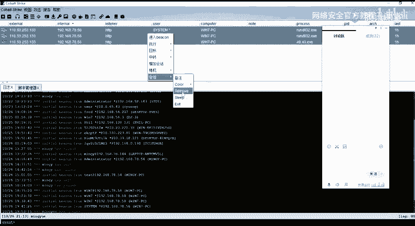

我这边的话先。得一个规划。好像呢以这个打气为例。

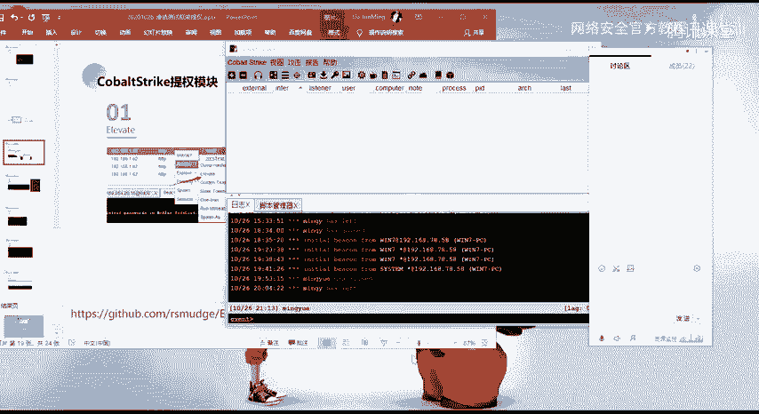

嗯。没白。

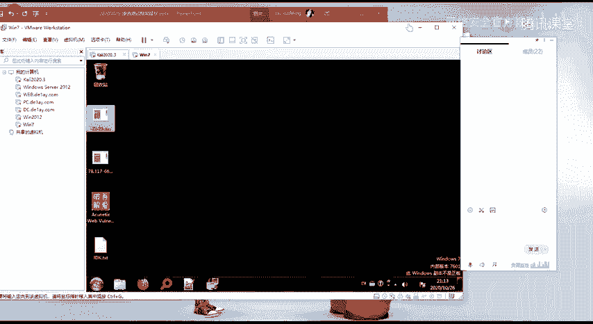

我这边的话得到了这样子一个win7这一个普通用户的一个backen，对吧？Yeah。呃，这边的话要等等待一分钟啊，就是呃CS的话，它默认的是就是说默认的这样子的一个sleep，它是一分钟。

就这边的这个sleep，大家知道是就是说为什么吗？就是他为什么要就是设置这样子的一个就是等待。然后他是呃他的一个。背后的一个东西大家有了解吗？就CS的这样子的一个。

就比如说我这边sleep sleepep0就默认的话，它是sleep news嘛，就是它的一个等待睡眠的一个时间是吧？

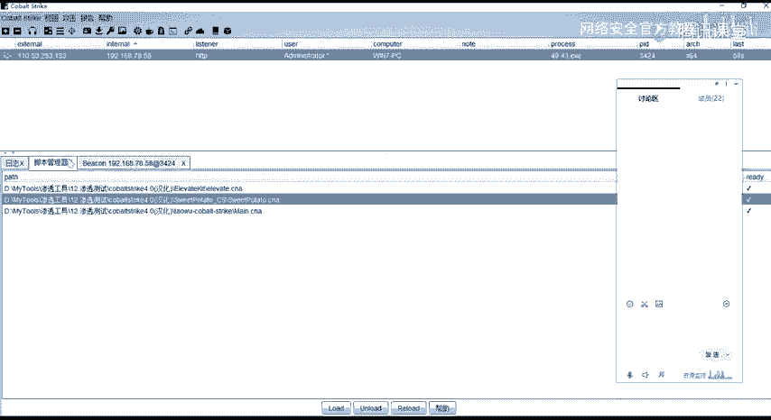

然后这边的话一到60的话，他就会去呃就显示这样子的。就是说我们那个目标机器已经就是回应了我们，对吧？然后我这边的话是发送了这样子的一个，就是我这边是leep零的话。

它是有发送了这样子的一个16的16个字检，对吧？然后我这边执行一个，比如说什么？就是他的一个等待睡眠的一个时间，对吧？然后这边的话1到60的话，他就会去呃就显示这样子的。

就是说我们那个目标机器已经就是回应了我们对吧？然后我这边的话是发送了这样子的一个，就是我这边是内普宁的话，他是有发送了这样子的一个16的16个字检，对吧？然后我这边执行一个，比如说需要货卖。

我这边执行之后的话，执行之后的话可以看到我这边执行这一个命令之后的话，他就立马就发了这样子的1个37个字节的一个请求包，对吧？发送到了一个目标，我们的一个host其实就是发送到了我们的一个back。

然后的话执行执行我们这边的一个命令之后的话，呃，我们接收到了它的一个啊输出。然后的话这边的话就是我们的一个结果。然后其实CS的话，它它的一个我这边的话大概说一下吧。

就是关于更多的CS的这种它的一个通信的一个机制以以及基本的一个呃基本的这样子的一个就是CC的一个通道，对吧？它其实是这样子的。

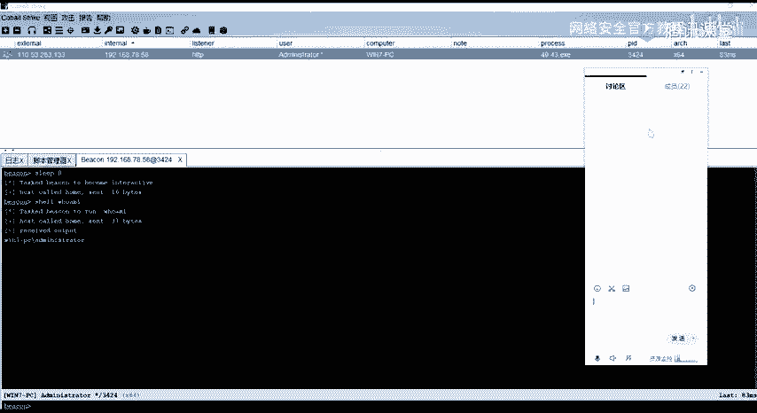

就是我们这边的话是我这边是一个呃控制台，对吧？然后我这边的这个控制台的话，我们可以控制。就是说我这边的一个客户端连接到了这个服务端。连接到这个服务端，也就是一个Tteam seven，对吧？

我连接到这个team seven。这个team seven的话，其实就是CS的一个就是一个CS seven，就CS的一个服务端。

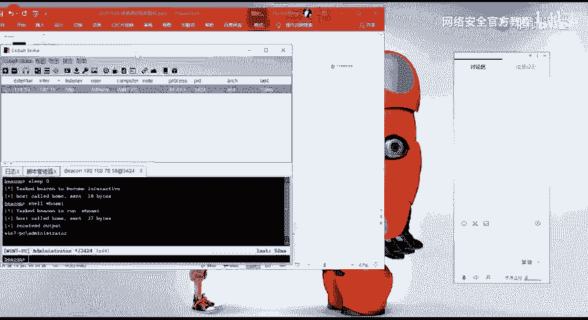

然后我们这边的话这边的话是我的一个客户端，客户端的话，我可以去连接到这个服务端，然后的话去管理下面的呃操作下面的这样子的一些backken，对吧？然后在这边的话，这一个backken的话。

这一个backken的话，PACCOU。这个backken的话，其实就是我们所生成的那样子的一个呃那一个stature。那个stature的话，它呃我们通过前面。就其实这边是得到了一个绘画嘛，对吧？

得到这个绘画的话，其实就是把我们那个st就是发送到了我我的一个目标机器上面执行。执行之后的话，我这边经历了这样子一个绘画，对吧？然后在这边经历的这一个。

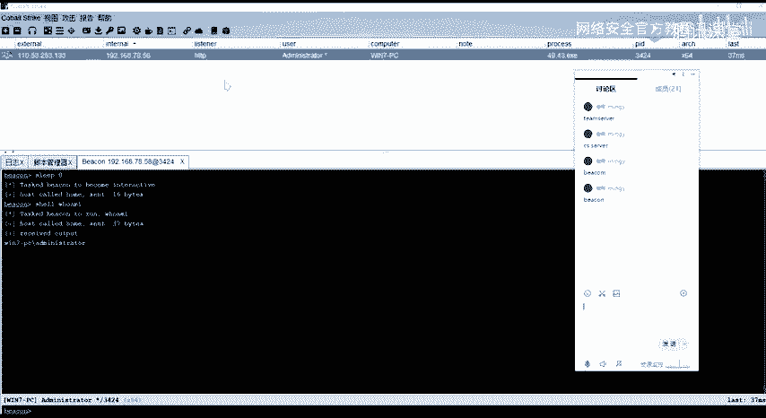

Backen之后。我们要去执行命令，对吧？执行命令的话，我们这边的这样子的一个。

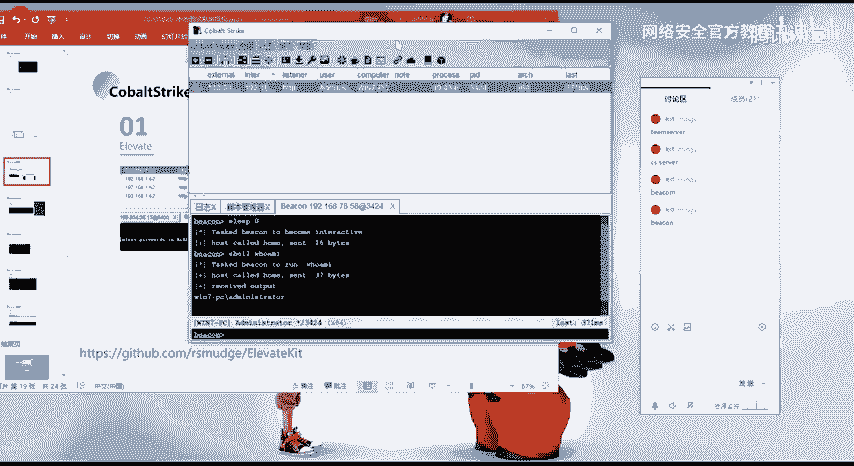

今天器啊这边的一个今天器啊，就通常的话在CS室当中话会去使用这样子一个asHTP或者是HTPS对吧？然后其实在这边的话，就是说我们比如说我这边使用的是HDP。

那么我的这边的1个CS的1个severeven。

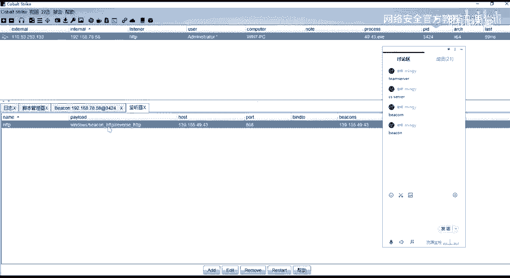

我的一个ss与我的一个backcon。资金去进行一个通信的话，它是通过HTP的一个方式啊，就是通过HTP的一个方式去进行去去进行的一个通信。然后HPHTP的一个方式的话，CS它会默认的话。

它首先它会是通过get的一个方式。就是呃我们这边的一个建立了，建立了之后，对吧？我的一个。呃，backcken我的一个back它会隔这样子的一个sleep的一个时间。

和这样子的一个sleep的一个时间来去发送这样子的一个get请求，来像我这边的一个service来去呃发送一个get请求来获取我服务端所发送的一个命令。像比如说我这边执行一个换卖，对吧？

那么他在我这边leep是0，那么它我这边执行一个换卖之后的话，其实那个backken的话，它立马它就会它它因为它是0秒的一个时间嘛，它会一直去发这样子的一个get请求来去请求我这一个s端的一个呃命令。

对吧？然后的话我这所以的话我这边直接输入换卖，它就能够直接的去得到去get到我这边的一个命令。get到这个命令之后的话，它会在呃back的目标机上面去执行，对吧？执行之后的话，就返回结果。

返回的这个结果的话，它就会就是呃发送到我这边的一个服务端嘛，对吧？就是这样子的一个过程。然后呃如果你就是如果你设置是立浦为0，那么它的这个请求的话，它是会一直一直的去来请求我们这边的一个服务端，对吧？

所以的话一般都不建议大家去设置设置这么短，就是你设置长一点。

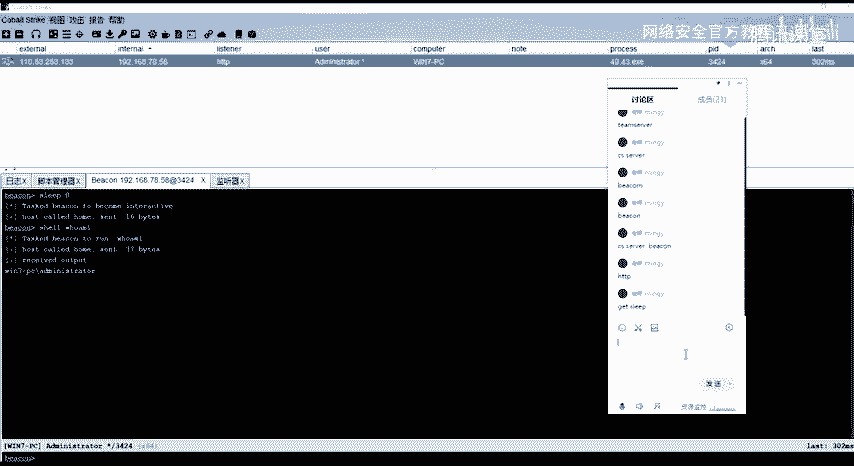

嗯。

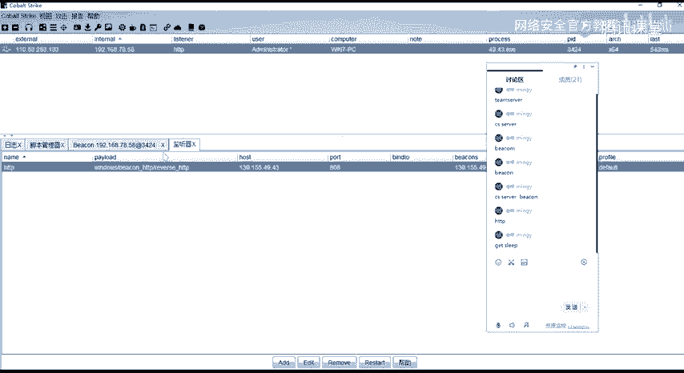

你设置长一点的话，就是它会隔隔多少秒，对吧？隔多长的一个时间再去发送一个请求来执行我们这边的一个命令，对吧？这是呃就CS的一个。基本的这样子的一个请求啊，通信啊。就其实我们在前面其实不是有讲嘛。

就是讲这样子的一个今听器，对吧？讲今今听器。其实这边的这边的话就是我们的一个payload嘛，其实就是一个backcon。

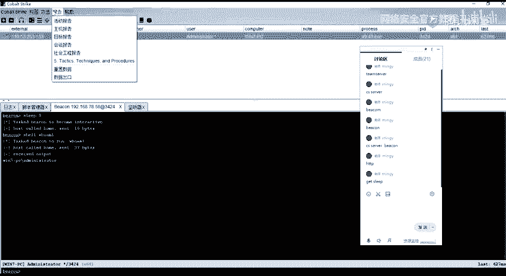

对吧然后像HDPHPS的话，就是它的这样子的一个通信的一个方式，对吧？它是呃HP上它是以HDP的一个流量的一个形式。DNS的话就是DNS嘛DS解析对吧？TC的上就是TCP的。呃，这边的话。

扯的就是有点扯远了。就是呃正好讲到了这边的话，就给大家介绍一下吧。然后更多的一些的话，大家自己去。呃，那个去去怎么说呢？自己去研究吧。好吧，然后CS的话，这个工具的话是就是很多人都在用嘛，对吧？

为什么很多人都在用？因为它确实好用。就是也方便。呃，我们言归正传讲到我们的一个今天的这个。4S的一些提群的一个模块。呃，在这边的话，我们得到了这样子的一个backcon，对吧？

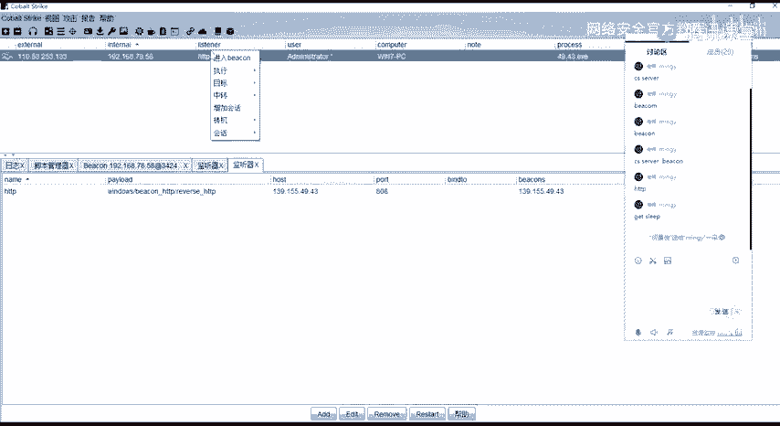

得到这个这一个back，然后我们可以右进右镜在这边的话，它有这样子的一些呃这样子的一些选项，对吧？像呃执行执行的这些的话，呃，我们前面的话讲了这样子一个run minicast对吧？

run minicast就是我们去用用它CS当中呢，它自带这样子一个mincast的一个模块，然后的话来去获取它的一个铭文的一个密码，对吧？然后还有就是。呃。还有就是这个转属哈希对吧？哈希钓也是同样的。

就是能够去得到它的这样子的一些呃它的一个哈希值，对吧？前面的话有介绍这个，然后后面这些的话在呃后面的话会有介绍，像比如说。呃，黄金票据制作令牌这一些对吧？制作令牌的话，其实那个托ken那边的话。

就讲那个托ken注入的时候，其实窃取的时候，其实也那个，然后以及在后面的一个。横向移动权限维持的话会有会讲到这一项。然后在这边执行的话，有这样子的，就转属I机下面有一个提权。当然话这边的话是一个中文的。

其实英文的话就是这个average。要EVAT就呃漏洞齐全的这样子的一个模块。然后我们打开之后的话，在这边选择这样子的一个经济器，就我这我就选这一个对吧？

然后在这边的话就有这样子的一些呃有这样子的一些exloit。对，就我们能够去利用的这样子的一些模块，对吧？然后其实呃实际的话CS当中他给的话就给了是呃三个还是几个吧。

然后在这边的话就是可以通过这边的一个脚本去进行一个加载。就是呃这一个elki这样子的一个脚本。然后所以的话。

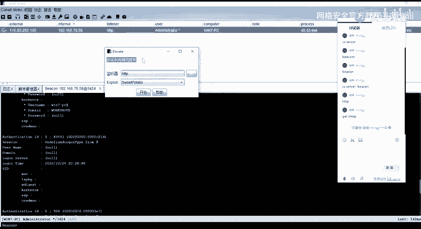

加载加载之后的话，在这边的话，你就能够去看到有更多的这样子的一些提全的。那比如说0796，对吧？

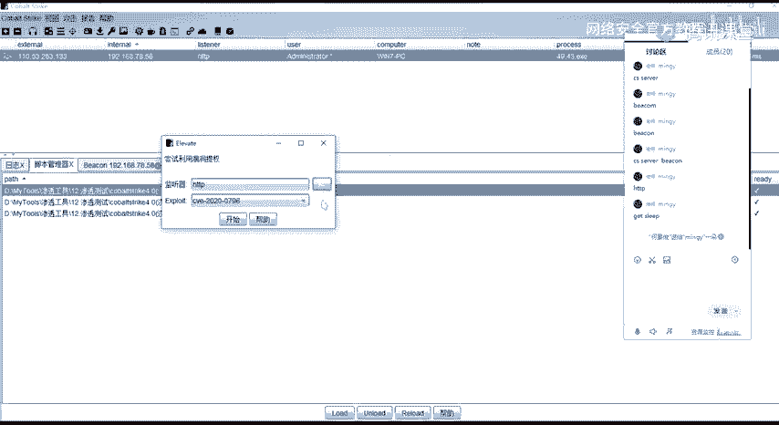

喂。报一下，然后这边的话0796的话是比较新的这样子一个提全的一个logo。然后这个0796的话，它是有限制的，就是可以看到，就为它只支持win10的19031909的这样子的一个系统。

因为我这边它1个win7的，所以的话它利用不了。呃，在这边的话，我们。以这一个为例。我这边的话以这一个。呃。这个。这个你这个UAC talkingken。就这一个文件，我这边的话执行这一个。

首先这一个提全的一个模块。嗯。こ。诶。哦，我这边的话已经那个了。我这边是administer的呀。

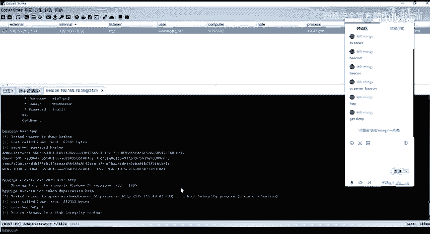

等一下。因为我当前的话是已经是直接是一个admin的一个用户啊，所以的话它显示就是you are already in high，就是你已经得到了这样子的一个高高权限的这样子的一个那个。

因为我当前的话是一个addmin啊，我这边的话是因为我是直接在admin的一个那个下面去执行的，我这边的话呃。

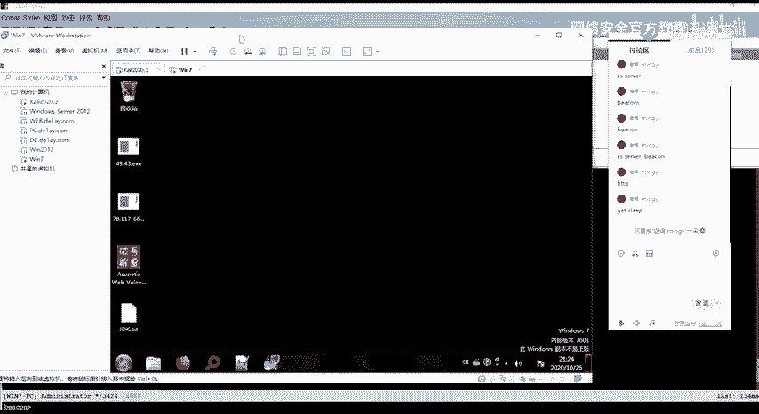

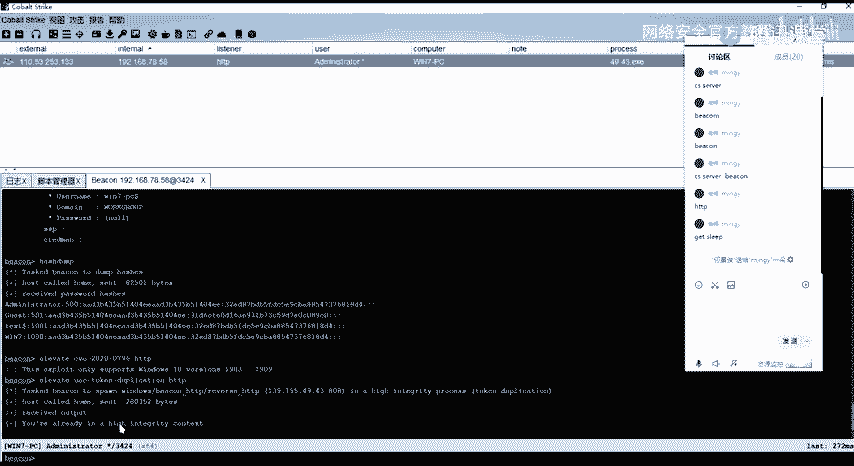

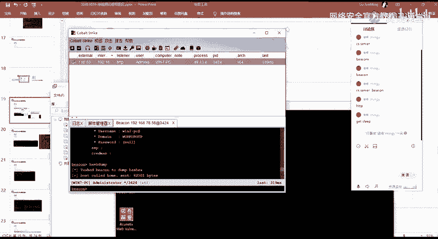

切换一下用户。切到这个普通用户。然后的话我再去。呃。得到一个back。

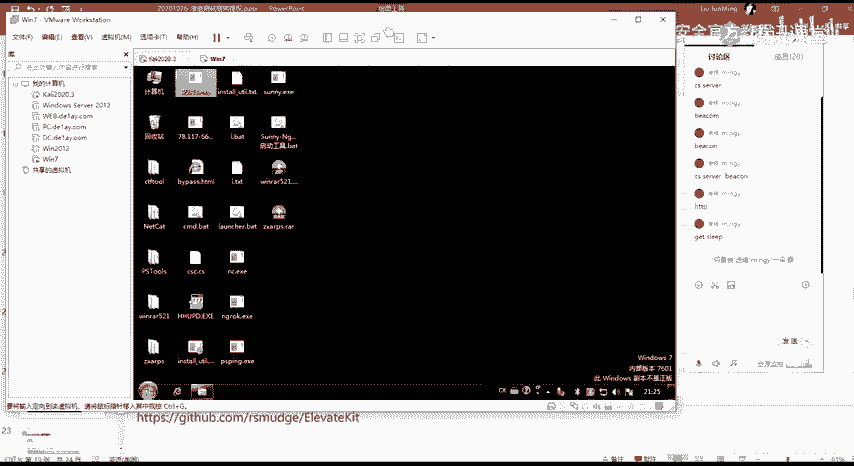

就是这个这个U者win7的这个普通用户，对吧？然后我这边的话因为是在本店做测试嘛，所以我s6灵啊，就是为了快一点嘛的。嗯。这边的话要等待。一分钟的一个时间。就其实呃大家就刚进入一个backken，对吧？

刚你进入这一个backken进入之后的话，你执行sni0。其实在这边的话，你可以通过在这边这一个last这边，能够看到它的这样子的一个时间，对吧？就5051秒。

也就是说它他最后通线的一个时间是55秒之前，56秒，57秒对吧？58秒59，然后到60到60的话，它这边的话就立马去因为它的一个get请求过来了，对吧？把我这边的一个命令，就是呃获取过去了。

然后的话执行了。嗯。😊，然后现在的话我们就可以呃执行命令是吧？需要后麦。我当前的话是一个普通的一个用户啊，我再去尝试用这边的一个模块去进行一个提群。然后呃在这边的话可以看。我在这边在这边的话。

我们执行这一个模块，我们可以看一下它的一个命令，就其实这边执行的一个命令的话，就是ever，然后执行了它的这样子的一个它已经内置的，已经写好的这样子的一个呃模块，对吧？这样子的一个脚本执行之后的话。

在这边有1个HTP这个HTP的话，其实就是我们的那个呃今听器的一个名字就是。

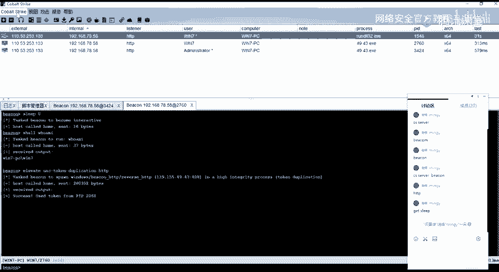

嗯。这个就这边这一个监听器的这个name，也就是我这边执行这个模块之后的话，呃，他如果能够去反弹一个需要的话，那么我这边的话就它会反弹到我这1个HPP的一个监听器，对吧？

然后在这边的话我们可以看到sexcess的话就是执行成功了。执行成功的话，我这边的话就得到了这样子的一个。

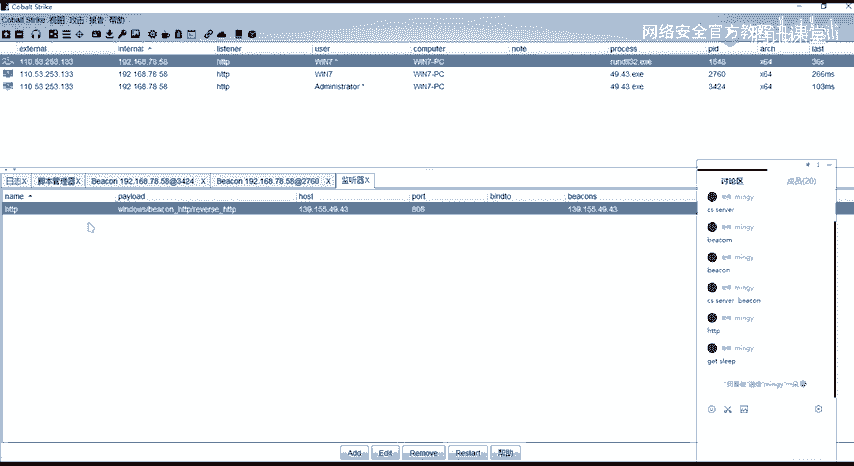

进程这边的一个进程的话，其实就是这个。就是我们通过这个模块对吧？这个功能进行一个提全，提群之后的话，得到了一个新的一个绘画。然后这一个绘画的话，其实我们可以看一下，我们可以看一下这边的这一个绘画。

跟下面的这个的面的这个绘画，你会发现的话，它其实是一样的，对吧？就是怎么看呢这一这些对吧？你看到有这样子的一个宏框，以及你的U子后面有一个新的话，那说明你的这个权限的话，其实是一个管理云的一个权限。

然后在这里的话，其实我们就已经得到了这样子的一个呃管理员的一个权限的这样子的一个back。然后在这边的话，这一个back的话，我们想要去把它做一个。就是把它进行一个把它提到一个st的一个权限。

在这里的话，我们再去进行一个提群。呃，在这边话我们使用这个。执行。呃，这边的话因为这边的话因为是一个新baer，所以的话呃干净的话，它是有60秒的这样子的一个睡眠时间嘛，对吧？所以的话要等待一下。🤧。

呃，等待时间的话，就大家有没有什么问题啊，就是问一下就呃关于前面的一个内容，大家有没有什么疑问？然后可以看到我这边的话呃执行之后对吧？执行之后的话，这边日志这边的话就呃初始化这样的一个back。

就是来自这边的一个stem的一个权限。就这一个机器来的，然后这在这边的话就得到了这样子的一个system的这样子的一个backer，对吧？然后我们就可以进入。可能又要钱。🤧好，这边的话。

我们就直接得到了这样的一个stem的一个backken，对吧？就通过这样子的一个方法。把就通过这样子的1个CS当中，它内置了这样子的一个提群模块。

从一个普通的一个win7的这个用户把它给提到了一个seastem的一个权限啊吧？


呃，其实这边的话就是。


就这一个ever这个提全模块的一个使用啊。然后呃然后的话就是这一个el kit这一个就是插件那个脚本。大家可以在这边去进行一个下载。然后呃加载插件的话，这边提一下。


嗯。前面应该没有讲吧，就是这些脚本对吧？怎么去加载是吧？我们在这边的话，我们可以在这边脚本管理器嘛，就这边contract脚本管理器，对吧？


这个然后我们load漏之后的话，在这边的话就呃。到了我们本地嘛，我们选择我们的那个。原时代。Yeah。地下。我这边先。就这一个对吧？这个ever averageage kit这个的话。

其实就是你这边你呃下载之后的下载之后的这一个这个内容，对吧？就是这这在这个文件夹当中。然后的话我们要去加载的话，其实就是这1个CNA的这个文件。就这一个后缀文件为点CNA的这个文件啊，我们打开。

打开之后的话，呃，因为我这边的话是已经有加载了，是吧？就是这边已经有了，所以重复了，这边的话就加载失败了。然后呃你们自己加载的话，你不能自己去尝试一下。加载的话是没有问题的。

然呃第二个的话就是这个自用的一个提全验词一。这边的一个。提全的话用到了这一个。呃。就是用到了K8。大佬它的这样子的一个提全的这1个EXE的一个程序啊。

就是这个CV2019的1个0803的这样子的一个提全的一个。提全的1个EXP。Yeah。


嗯。


就就是这一个你你用的是这个win32K这一个logo。这边的话是它1个CP编号，大家可以去了解一下，然后它的一个影响的一个版本，我们可以看一下。它影响了一个版本的话，有这么多。

有win10到win7win82008。2012就是s的吧，20162019对吧？它的一个影响的一个范围呢，它是很广的。所以的话这一个这一个提全的这一个。

工具的话是呃这个齐全的这个漏洞的话是呃比较好用的一个。


然后在这边的话，我给大家就是呃演示一下，我们如何去利用它的这样子的一个提全的这样子的1个E叉P。因为他在这边的话，我这边的话直接用他的这个EXE一个程序啊。然后他的这个EXE的一个程序的话。

我们来在呃这边来看一下。


给大家介绍一下它的一个基本的一个使用。🤧我这号我直接把它复制进来了。


啊，其实呃实际使用的话，对吧？我这边CS已经得到了它的一个back，对吧？


Yeah。

我这边的话还是以这个。3424。


你这一个啊不是这个。以这个普通用户的文件啊是吧？然后这这的话我直接可以呃进他一个文件管理器嘛，然后上传到他的一个目录。


上传上去对吧？上传上去之后的话，它的一个使用。他使用的一个方法的话是这样子的。


我们可以，因为我这边的话，我直接在靶机上面去操作。还有一个执行的一个。它的这个脚本，它的一个使用的话是在后面接1个CMD的一个选项。然后的话在后面接我们的一个命令。像比如说我的一个行换卖。呃。

在执行之前的话，我先执行一下。现麦对，直前绕的话。我单心话是一个winIN7的一个用户，对吧？我执行执行户外卖的话，是一个winIN7的。啊，我在的话通过他的这样子的一个提前的1个E叉P啊。

然后的话我去执行1个CMI啊，户外卖。然后在这边执行之后的话，你会发现啊它它的这个提权脚本，对吧？我这边执行之后，在这边返回的一个结果，你会发现是1个NT systemt的一个权限。哎看到是吧？

所以的话我通过这个脚本，我执行命令的话，就通过它的这个提权的EE叉P执行命令。我在这边执行的一个权限是一个stem的一个权限。嗯。那么我在这边的话，想要去访谈一个stem的一个需，我后。


。我们可以怎么去操作呢？就其实我知道我通过这个脚本，我就能够去呃得到一个stem的一个权限，对吧？那么我们想要反弹一个stem的一个权限的一个backken是吧？我们可以尝试就是。


呃，我在这边的话，我是通过这样子一个方法。


就是我生成一个可执行程序，对吧？生成一个可执行程序，然后的话我再用我这边上传上去的这个。


脚本。


这一个提全的一个漏洞啊不提全的一个工具，提全的1个E叉P，然后的话去执行我这边的这一个呃上传上去的这一个反特西尔的一个呃木马，对吧？然后我这边执行之后的话，因为我是一个seastem的一个权限去执行的。

那么我这边所得到的这样子的一个呃绘画得到这样这样子的一个backken的话，那么自然而然的也就是一个stem的一个绘画。对。


能来看一下，我这边的话。在CS上面去操作。我当前的话是这个。呃，单前话是一个。普通的普通用惑。对吧一个普通用户的一个权限。然后我这边的话。看一下。我这边的话当前在的一个目录的话是这个desktop。

就其实就是我这边这个配load的所在的用录嘛，然后我上传上去的话，也是在这个目录。所以的话我在这边我可以通过。呃。在这边介绍一下这个XQ呃，这个前面。已经有有介绍完了，就这一个SQ。

XXQ整这个命令的话，就是呃我们可以用它来去执行。


去执行目标机器上面的呃文件，以及能够去执行目标机器在目标机上面去执行命令。


没写错吧。点啊。然后我这边的话，我直接呃，比如说我在这边直接执行这一个。


嗯。你。你搞过来。我把反弹到那个。CS上面的这个co过。


啊，我们可以来以这一个为例啊，执行这个49。43。


就先这个对吧。哦，你可以看到我这边为ex执行之后的话，在这边立马就得到了这样的一个。规划对吧？但是在这边的话要注意就是。啊76年。得到的是。诶。这一个就这一个这一个掰开。好不算这个。

🤧这一个普通用户的一个back。然后我们在这边，因为我当前的话是一个普通用户，对吧？所以的话我执行这一个以当前的一个普通用户权限执行这一个反弹的一个配out的话。

所以的话我得到就是一个普通用户的一个呃一个win7这样子的一个back，对吧？那么如果我能够以一个stem的一个权限去执行我这一个反弹下的一个呃。木马这个文这个程序的话。

那么我自然而然的就能够去得到一个seasem systemem的一个权限，是吧？所以的话我在这边的话呃，可以通过这样子的一个方法，就是执行这一个。知。嗯。找个赢。我通过这一个。

通过这样子的1个E叉P对吧？然后这个E叉P的话执行的一个方执行运的一个方法就是CME啊，接我们要去执行的一个面令对吧？然后我在这边的话就通过这个start。star的话就是在CMD当中呃。

在windows下面的话，我们可以通过star来去执行我们想要的一个文件，就执行呃命令程序。


比如我在这边，我就。比如说我在线MD当中，对吧？我s。star这一个。19。43，我这边失烂了之后的话，我在这边又能去收到一个。


关者。嗯。


没有啊。😔。


睇到啦嘛。再说我之前那一个。🤧对吧我可以适大的来去执行。当然的话他这边一闪而过了，就是那个宽度。


来去执行他。所这边怎没成。然后我在这边的话就通过这这边的。这一个提全的这个E叉P对吧？然后的话执行这样子这个命令就是49点。首前这一个46。43的这一个一参。喂。考试。


我的八就是这边呀，在这边。这个是啥。Not。


对我这边执行之后的话，立马就得到了一个又又得到了一个新的对吧？是通过这个49。43来的。然后在这边的话嗯。我们再把这一个断了吧。


我们再在这边通过这样的一个方法来去行一个执行。执行之后的话，在这边我们可以看。Yeah。Yes对。


你。


弹开咧。


Yeah。嗯。Yeah。哦，有有了呀。他这个应该是有点慢啊。你看到我在这边的话执行之后对吧？执行之后的话，这边反谈了一个stem的呀，就是这个对吧？是通过这一个进程，也就是我通过这1个49。

43的这个程序的话，得到一个stem的一个权限。因为我在这边的话是一个stem的一个权限去执行这一个程序的。所以的话创建这个进程的话，所对应的这个权限的话，就是这个stem。对吧？


然后我当前的话就是呃这一个backken的话就是一个seastem的一个权限嘛。


就是呃这一个。就自用的这种提全的一个一差一啊。我们可以通过这样的一个方法去进一个使用。


然后他就是关于这里，因为我们可以去执行命令嘛，对吧？然后这这边的话你可以去自己去拓展嘛，对吧？就是你法兰西尔的这样子的一些呃这样子的一些方法。


我们可以以一个系统的一个权限去执行。然后第三的话就是这个抛过器。


抛 share尔的话，这个前面前面应该有介绍的吧，就这个p share这一个导入这样子的一个抛 share的一个模块。就是呃在4S当中。嗯。这个前面前面有讲过吧。有的对吧？

那呃这这那这里的话我就呃就大概的说一下，好吧，就不不去给大家演示了。


前面的话有讲也有操作，对吧？然后在这边的话就是在CS当中用这个power share import来去进行一个加载我们的一个power share的一个脚本。然后在这边的话就是通过这个power up。

这个p up的这个脚本，这个p up这个脚本，它是就是power share下面的一个比较有名的这样子的一个提全的一个脚本。就是执行之后的话，它会去对我们的一个目标去器去做相应的一个信息的一个收集。

他要去尝试呃这样子的一些。


去尝试一些齐全的一个漏洞的一个解锁。Okay。Okay。Yeah。Okay。あ。


就是这个这个的话就是它的一个脚本。然后这在这边的话，用这个脚本的话，我们首先通过poionport把它加载加载进去。加载进去之后的话，在这边它有这样子的一个方法，就我们直接inwork这个。Okay。

Okay。就这个。我们可以用这个方法，就是这个invo or check，我们使用它的话，它会去做这样子的。

就是它会去加载它所有的这样子的一些能够去探测提群的这样子的一个去紧锁提群漏洞的这样子的一个脚本。然后的话它会对目标系统下面去做一个比较全面的这样子的一个。


齐全的一个漏洞的一个检锁。


Yeah。啊，这边的话同样的还是操作一下吧。嗯。


最好。


Okay。


我去呃通过p讯port加载我这边本地的这一个p up的这个脚本。啊，然后加载进去之后的话，我直接通过抛 share。


通过抛系来去执行他的这样子的一个。


还有那。他的这个方法。嗯。然后执前之后的话，呃，他会去加载很多的这样子的一些信息啊。嗯。这边的话先让他跑着吧。来看一下，大概看一下就是。你看他会去检查，就是你的这样子的一些文件，对吧？然后的话还去检查。

就是可以看到always install every的对吧？就是这个的话其实就是我们前面的那一个就是以一个sstem权限去安装MSI的这样子的一个策略嘛，对吧？啊，还有还有这一个对吧？

这个uncorty的service pace，就是我们讲的那个windows下面的那个啊服务漏洞，对吧？它都会去做这样子的一个检锁，就是这个脚本。


这是这个。啊呃。他这边的话是。呃，这边列举的一个，像比如说这个就是check service，就是可以可以执行的这样子的一个权限，对吧？然后在这个的话，他返回了这样子的一些信息给我们。然后在这边的话。

其实我们可以看到就是我们前面所利用到的这样子的一个漏洞，对吧？它的一个路径就在这边显示出来了，对吧？我们可以去做一个更改，它显示了这个这个服务，它对应的一个路径。然后的话modmodify able。

也就是说这个目录的话，是我们能够去进行一个改，就是更改的也就是有写的一个权限的，对吧？然后再的话他有。相应的一些信息是吧？う。


然后还有其他的这样子的，这个的话，大家自己执行的话，自己去查看，对吧？因为他这边的话，它有很多这些东西啊，就是要跑完的话，需要一些时间。


然，以及呃我们本节课最后的一个内容就是这个sweet pot potato。这个的话就是呃跟前面的就是就是前面讲的那个土豆家族的一一个，对吧？然后他这个的话就是把它写成了1个CS的一个脚本。

然后我们在CS当中能够去加载它。


然后其实在这边的那个套件当中，其实也有啊。


然后这个的一个使用的话，就是其实跟前面都是一样的。就是呃你加载之后的话，它会在那个提全的这一个模块当中能够去选择它，对吧？然后的话接我们的一个今天的一个名字。今天器的一个名字。

然后的话如果能够存在提全的这个漏洞话执行之后的话，我们就能够去得到一个sem的一个呃backken。


呃，以上的话就是我们本节课的所有内容，大家有没有什么疑问？


呃，本这个的话主要的话就是呃。就是。怎么说呢？就其实主要的话就是这两个框架，就是说我们在去提全的这一步的时候，对吧？我们在使用这两个框架的时候，我们有什么样子的一些方法，对吧？

以及相应的一些技巧以及脚本对吧？那呃。其实大家这些的话应该没有什么问题，好的就。大家看我的哦，有问题吗？有问题的话，你说。就我觉得的话这个的话大家看我这操作的话，可能没有什么概念。然后自己去做一遍的话。

应该是没有什么问题的。就是一些呃操作嘛。就是呃给你这样子的一些东西啊，那你实际的在这两个框架当中，你去进行一个应用，对吧？关于知识点的方面的话，这节块的话没有涉及很多。好，这位同学有有问题。

有什么问题直接说吧，好吧。是。然后呃给大家。2分钟的时间吧，好吧。现在时间也不早了。呃，有问题的扣一没问题的扣2。然后自己下课做的扣3。呃，回答之前的问题是哪一个？She。呃。

OK我还以为你是说有问题啊。She。啊，那应该都是没有什么问题了，是吧？你这节课的话其实东西不是很多啊。同样的就是课后作业的话，就是大家把我这边的这些内容的话，自己操作一下吧，好吧。好，呃。

没有其他问题的话。那么呃我们本节课的话就到这边就结束了。呃，大家早点休息，好吧，呃，下课。

