# B站最全网络安全教程，整整1300集，全程干货无废话，别再盲目自学了，看完学不会我退出网安圈！（web安全｜渗透测试｜内网渗透｜CTF） - P95：94. 第四十四天：Linux系统内核漏洞提权.mp4 - 网络安全官方教程 - BV15u4y137cQ

🎼让你插在我的心上。🎼，🎼难道半生孤泣段落揭穿。🎼难道你只是途中过路人？🎼难道只是那一瞬？🎼难道只能做？🎼これ。🎼下辈子遇见你，也许遇见你，我会丢了。一起。🎼任时间杀死自由。🎼如果能再见你。🎼Yeah。

🎼你想被。🎼遇见你。🎼也许再见你，我会丢了。一し。🎼让时间杀死。🎼也许能再见。🎼，🎼，🎼我想用山川的夜晚来想念。🎼难道你已收起了我？🎼我不知道为何还能让你插在我的心上。🎼半身哭吸段落皆尘。

难道你只是途中共路人？🎼那只是那一瞬。🎼难道只能做？🎼下辈子遇见你，也许遇见你，我会有。😊，いジ？🎼你的时间。

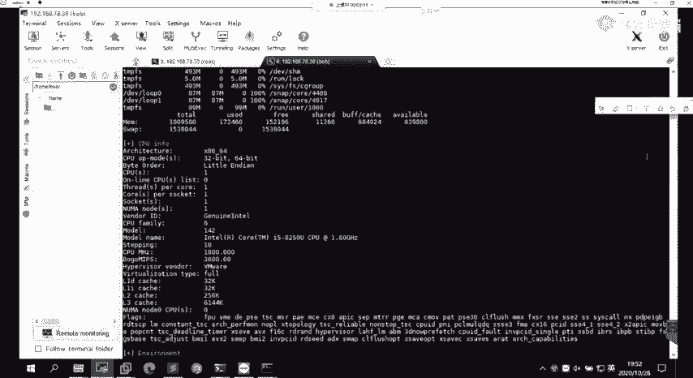

🎼。能再见你。🎼The。🎼遇见你，也许再见你，我会。😊，一ジ。🎼让世间杀死。🎼也许能再见你。🎼。🎼遇见你，如果再见你，我会丢了。😊，🎼这世界。🎼再见。🎼也许再见你。😊，🎼一许。🎼よし。🎼抓心。はて。

🎼可是我。🎼一个句号。🎼窗外的。🎼荣耀。🎼别再爱到。😊，🎼就是在。🎼不会听。我。🎼你会不会少了你？😊，🎼の。🎼回到诗人眼前，回忆就在眼前，你戴着包餐而我样子，带着腼腆，不可第一次的见面。你说你有先结。

不太鲜贴，必须难过，我能有偏腆，我倒是天真，挂件线我。😊，🎼不想成年人。😔，🎼能力别人不是为了赚了有钱分，我为我的成诚，希望我写的歌里面有更好的和想象。😊，🎼你还记。🎼说出惜你。Yeah。

🎼第一次发唱面就一马，当前，从此在打场面，我不在站旁边，我是真的感谢佩复你的眼界，怎么想到和一直在度刺动的完结，你看着一路花们慢萌芽。😊，🎼我只看着你已经慢慢风发，欲网俱沙，就大价值慢慢分岔。

到底是我让。😊，🎼你的心。🎼可惜我们终于哪一到。😊，🎼爸烦人。🎼窗外过远飞的风。😊。

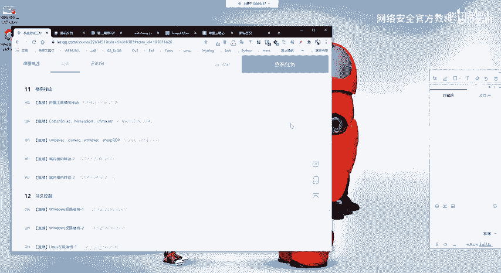

🎼别的爱。🎼人是在。🎼不见。🎼我们成长。😊，🎼偶微想一点。😊，🎼你还记得。🎼说去谁。🎼你还怀念。🎼你说我是个商品，没有你们就不可以。这些扭曲的真理差点毁掉我的自信。如今的我已觉定，如今我不再哭泣。

才不怕坚守自己做你没做对的决定，你知道吗？这一辈子除了。😊，🎼爸爸。🎼别操作这些人。🎼男人吧，天空白的娃娃总会慢慢长抱歉我没法永远拿你替划。😊，Yeahら。🎼一个圈。🎼明月。🎼。🎼一经。🎼我慢慢长大。

😊，🎼我们终于来到一。😊，🎼多少念你多少遍你。🎼多少做什么，多少情你。🎼在过去我就不再介意，把真个放心里把从哪伤的全部忘记。🎼我宣成了全部回忆。🎼爱的河难，却都是你。🎼你希望你偶尔也会相信。

就让我真心真意把这唱闻重新开始。🎼你还记。🎼说出惜。🎼你爱爱。🎼，🎼我曾羡慕他人伶漓口齿。😔，🎼沙间辗转过落，优雅说辞。🎼而三山盟还誓爱恨未尽婵翅上演动人。😔，🎼故事。🎼也曾飞蛾不过。🎼无注一掷。

🎼妄图将日月与金成吞噬。🎼打造无双解，却恋人芳若恩赐，卑回好似尘埃你时。🎼多少夜，我与孤单对峙，怀揣今生。

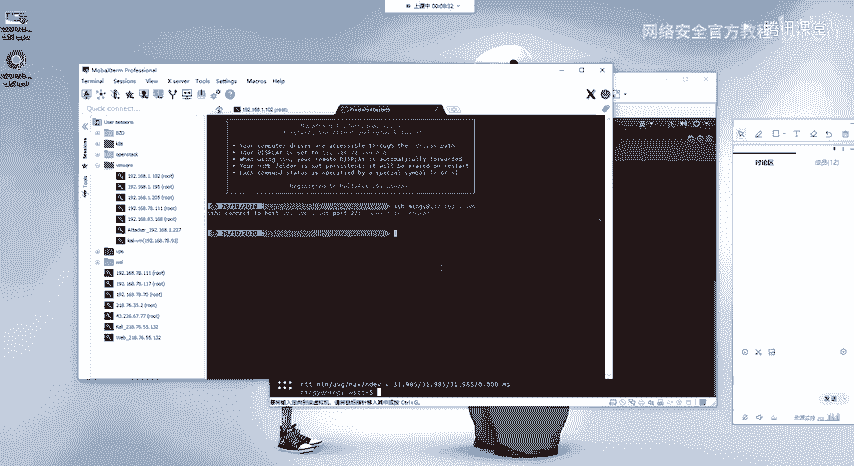

🎼一切为何说。🎼心事。🎼千里。🎼山水近在咫尺。🎼多少日我。🎼时光。🎼缄默不绝。🎼糊涂。🎼我说。🎼汗雪。🎼天真。🎼是。🎼半夜。🎼一句。🎼情。たん。🎼岁隔天将无知情怀叹。🎼连我再求而不得重视。

🎼前尘远歌云端，我自人间辗转。🎼原来这情世又忘了。🎼不昼夜我。😊，🎼孤单爱规去。🎼怪揣情深一件，为可说。🎼心事。🎼八千里路。🎼山水尽在咫尺。🎼多少日我。

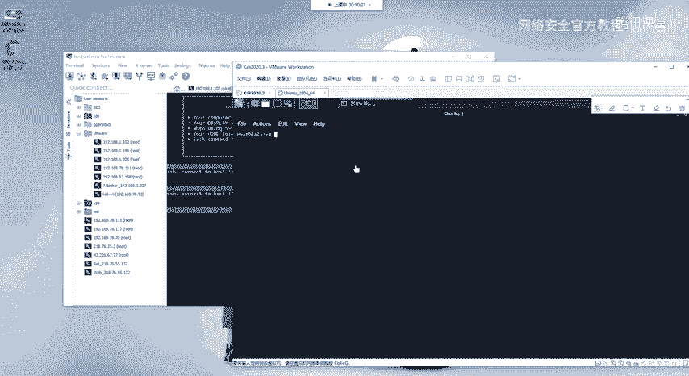

🎼见我。🎼不知。🎼不可说。Okay。🤧嗯。

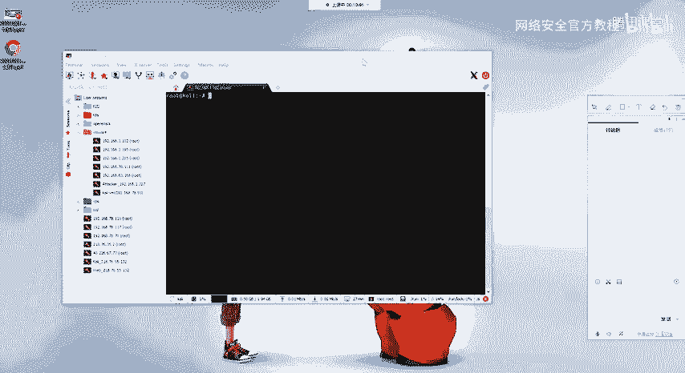

う。大家晚上好。呃，能听到我声音的，以及呃我的一个声音的话，应该是没有杂音的吧。如果呃能听到我声音以及我的声音没有杂音的话，大家在讨论区扣个一。嗯。🤧K。好的，应该是没有问题啊。没问题的话。

那么我们正式开始我们今天的一个课程内容。我们今天的话主要给大家介绍一下linux下面的linux系统下面的一个提全。呃，本节课的话主要的话有这4块内容。🤧首先的话就是第一块linux的一个提全信息收集。

第2块的话就是linux系统内核漏洞的一个提全的相关的一个介绍，以及以及利用的一些呃方法。第三个的话就是linux环境变量的提全。第四个的话就是密码哈希。我们通过密码哈希的呃一个方法来去进行一个呃提全。

以及最后一部分的。ううん。嗯，不好意思啊。🤧哎呀。最近这几天喉咙喉咙之间有点有点废了呀。🤧。直接哑了讲哎给你们讲课。讲的喉不容易有点受不了。然还有点咳嗽。

所以说中间可能会就是呃突然会就是我讲话的话突可能突然会卡一下，就是可能讲着讲着突然喉咙就卡住了。这个的话呃大家见谅一下，好吧。然呃最后一个话就是提全实验，就是我们呃实验室里面的两个提全的一个实验。

大家呃给大家作为一个课后作业。🤧。啊，首先的话我们呃先来看一下第一块的一个lininux提全的一个信息收集。呃，就跟我们前面在讲windows提全的时候，其实也是一样的对吧？我们windows信息。

我们windows下面的一些提全的话，我们的第一步同样的也是去进行一个信息的一个收集。然后这边的一这些收集的一个信息的话，其实就是为我们后面去做一个提全是作为一个准备的。

就我们前前面前期收集到的这些信息的话，我们用来寻找，就是说作为我们去进行一个提全的一个呃依据。我们。通过相应的一个信息收集的一个呃方法收集到各方面的一些信息，然后再通过这些信息，从这些信息当中去筛选出。

我们能够去进行一个利用，也就是能够去进行一个提全的这样子的一些方法。啊呃，其实前面的话在讲lininux呃信息收集的时候，lininux内网信息收集的时候，其实这些的话都已经呃已经介绍过了，对吧？

就是呃前面的话就已经给大家就是呃比较详细的介绍，就是说我们通过什么样子的一些命令，对吧？在linux下面，我们通过什么样子的一些命令去收集对应的一个信息。那比如说它的一个发行版本啊。

就lininux的一个版本以及内核版本，就我们再去进一个呃linux的一个内核的一个漏洞提权的话，我们肯定需要去知道它的一个内核版本了。

然后的话我们再去根据它的一个内核版本来去寻找对应的呃可能存在的这样子的一些提群的一个漏洞。然后黄金变量黄金变量的话在呃。待会儿就是后面的话会讲就是呃一个黄金变量的一个提全。

就是我们利用的就是它的一个黄金变量。然后我们可以通过相应的这样子的一些呃命令。就呃能够去查找到对应的环境变量的一个配置。然后还有就是网络信息对吧？网络信息的话。

我们需要去知导我们的一个目标机器上面它的一个呃网卡，它有哪一些网卡，对吧？然后还有就是一些应用程序，一些呃应用程序服务。就是我们针对某一些服务，就是对它的一个服务的一个信息做一个收集。

就是呃我们前面其实在讲那个提权的时候，对吧？就有讲就是呃。就是呃系统的一个提全以及应用程序的一个提全，对吧？以及在windows下面的话，就是相应的一个呃服务的一个漏洞，对吧？那么。

它的就是说系统上面的这种应用程序，它的一个版本，对吧？以及它所运行的这样子的一个服务。那么如果说我们通过这样子的一些信息的话，找到了其中正好有是正好对应的它运行的这个服务的一个版本。

它有这样子一个提群漏洞。那么我们就能够去作为一个突破口去进行一个提群。然后以及还有就是呃运行的一些服务。在这的话就是特指的一个root用户啊。就是说我们要去进一个提全。在我们linux下面的话。

就是从一个普通用户去提全到一个root用户，对吧？那么我们在呃寻找的一个目标的话，其实就是呃针对这一些服务，就是说利用它的服务的一些配置的一个缺陷。然后的话它的这些服务的话。

又是一个root用户去运行的话，那么我们可以通过这样子的一个服务来去把它提全到一个root用户。呃，等等的，还有计划任务的计划任务相关的这样子的一些信息。在呃下一节课的话会讲计划任务的一个提全。呃。

在这边的话就是我不会去把这些命令详细的做一个介绍。这个的话大家可以接受吧。就是这些命令的话，大家自己课后去呃了解。呃，应该不需要我一个一个去讲吧。就前面。呃，前面也有提到。

然后的话就是相应的一些服务的一个配置。像服务配置的话，像我们的HTP的HTP的这样子的一些呃配置，对吧？它的一些配置呃错误以及。嗯，我们从这样子的一些呃外b服务的这样子的一些配置文件当中。

能够去找到对应的这样子的一些敏感的一些信息。🤧，呃，等等，还有其他的这一些。这边的话我就不一一的去说了呀。嗯。嗯，这边的话大家自己看一下吧，PP的话已经发给大家了，我这边的话就不一一的去说了。好吧。然。

这边的话就是linux的一个提全的一个信息收集。就我们前面已经有介绍了这么多的一些啊收集的这样子的一些信息，对吧？但是我们实际的话去进行一个呃对目标主机去进行做样做这样子的一个信息收集的话。

你不可能一个一个命令，对吧？你照着我这边的这样子的PPT对吧？这一点你去呃查找它的一个信息。这一点，你再去查找对应的一个信息。那么这样子的话其实是没没有效率的对吧？

所以的话我们通常的话会去用这样子的就是相应的一个信息收集的一个脚本。就是我们直接执行这个脚本，它就能够去批量的获取我们所想要的这样子的一些信息，对吧？

然后的话其实我们前面讲这一些讲这些分别去讲这样子的一些命令来去做对应的一个信息收集的话，其实就是让大家去了解，对吧？让大家心里知道就是说我这个脚本它收集到的是哪一些信息，以及对应的这些信息。

我们可以去干嘛，对吧？然后在这边的话呃，我这边的话有给这样子一个脚本，就是这一个links的一个。集群的一个信息收集的一个脚本。Okay。呃。

这边的话是在get up上面的一个就是提群的一个信息的一提群信息收集的一个脚本。它这边的话是一个呃需要脚本，它里面写了很多的这样子的一些呃，就是内容啊，这些内容的话。

它就是针对的去做一个呃信息的一个收集。呃，关于这里面的一个内容的话，大家想了解可以去看一下。但是呃我们在这边的话，你只只要知道就是说他我们执行这个脚本之后得到的一个结果，对吧？

就是那个结果它才是我们想所需要的。

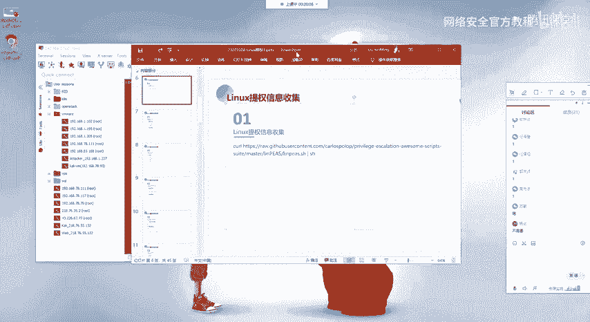

然后在这边的话，我们看一下，我这边的话已经有执行了，因为它的一个脚本的话比较多，呃，执行的话还是需要一点时间的。呃，我这边的话已经提前的。🤧呃，执行了就是这个就是这样子的一个。嗯。

就这样子的一个脚本呃呃，你们可以通通过PPT上面的直接1个CL来去就是获取下载它的这个脚本，然后的话给SH去执行嘛，就是通过SHH来去执行这样子的一个需要脚本。执行的话它就会。呃，进入到这边。

进入到这边的话，下面这些的话就是它的一个分别的呃，它的一个脚本执行之后所收集到的一个信息，也就是返回给我们的一个信息。那么这些信息的话就是我们所需要的。在这边的话，我大概的就是呃提一下对应的。

对应的他收集的这样子那些信息。🤧嗯。呃，其实大家执行之后的话，通过这个脚本这边也能够很清晰的知道。首先第一个的话就是basical information，对吧？就是基本的一个信息。

也就是我们的一个基本的一个信息信息收集。然后他这边的话就是收集我们常就是常用的，也是经常常进的这样子的一个系统的一个版本，对吧？其实这边的这一句的话就是我们通过U nameU name杠A对吧？

因name刚才执行之后执行之后的一个结果对吧？就是放在了这边。其实你要会去写这样子的一个脚本的话，然后的话你又知道你你了解了我这边讲的这样子的一些东西的话，你自己也可以去写这样子的对应的一个脚本，对吧？

就是他这边的话就是之前有那么该之后的一个输出嘛，对吧？然后在这边的话就是你当前的一个用户嘛，就是比如说你当前的用户执行ID这边返馈的一个结果是吧？然后当前的一个用户说的话是bo勃是吧？🤧嗯。

以及hose name啊等等的这样子的一些。呃，还有的话就是呃rightriable，也就是可写的一个目录。也就是在这一个目录的话，我当前的这一个用户，这个普通用户可以往这里面去写东西，对吧？

然后写东西的话就说明我如果说我们要去写入写入一个这样子的一些脚本什么的，我们可以写入到这个目录，对吧？呃，以及还有的话这边有列出了两个命令，就是两个常用的一个命令pin以及NC。

然后它这边有列出这两个命令，它是干嘛的对吧？像pin的话，我们可以呃用来做这样子的一个网络发现，还有NC就说它的这一个呃linux系统下面的话有装有安装这样子的一个NC的一个命令。

那么我们就可以直接去使用，对吧？它能够去进行一个端口的一个扫描啊，还有网络的一个发现，对吧？他这边的话呃其实都写的很清楚了，对吧？还有的话下面的话就是系统的一些信息，其实就是我们的呃这边的话就是那一个。

在物班图下面的话，就是那个LB杠relea。🤧执行这一个命令之后的一个结果啊吧？然后还有就是收 do收度的一个版本。在我们后面的话，在我们下一节课的话会讲就是收度的一个权限的一个滥用。就是说它收度的话。

它的一个权限他没有做好的一个控制。然后的话我们就可以利用它来去做一个提群。嗯嗯ん。嗯。以及还有passpa的话就是我们的一个环境面，就待会的话会呃讲就是这样子的一个目录。然后待会的话再给大家讲。

就是环境变量它的一个作用。其实环境变量的话就是跟我们windows下面的那个环境变量一样嘛，对吧？你在windows下面，你去配置那样子的一个环境变量，然后的话你把你想要去执行的这样子的一个程序。

把它给添加到这样子的一个环境变量当中。那么你在CMD下面，你去执行对应的一个命令的话，它就不会说报not found对吧？就是找不到那那样子的一个命令。因为你配置到环境变量当中的话。

它就会去环境变量当中，你所配置的那一个目录当中，它去查找是否有这样子的一个程序。如果有的话，它就可以去执接的执行。就lininux的话跟windows上面的话呃也是类似的。

就是你在lininux上面去执行相应的一个命令，它会去在这个环境命令当中去查找啊，是否有对应的这样子的一个呃你执行的一个命令的一个程序。如果有的话，它就会去呃执行它，然后的话返回结果给我们，对吧？

以及还有时间啊，还有呃系统的这样子的这边呢的话就是一些磁盘。CPU等等的。嗯。呃。我这边的话我就不一一的去那个了。然后他这边的话，他所输出的一个信息是相当丰富的。嗯。嗯。

还有像在这边yautiful soft software，也就是呃。我们可以去执行的，或者说呃它的一个目标这边的这一个机器上面，它能够去啊我们能够去执行的这样子的一些命令。像比如说NC啊，对吧？呃。

we gett CL这些命令，我们都是有权限去执行的，还有pin以及GCC make这样子的一些兵役的一个环境，对吧？等等的。还有python3，还有这样子的一些脚本。Yeah。呃，以及。嗯。😊。

这样子后面的话就是我们要去收集的这样子的一些服务的一个信息，就是我们的一个定时任务，我们的一个进程，我们所就是系统当中的一些服务，对吧？这边的话就是呃进程的一些信息。以及这边呃定时任务。嗯对吧。😊，在。

呃，这边啊定时任务，然后在这边的话，你可以看到这边它有这样子的一个定时任务啊。就其实这边的话呃我们下节课的话会讲就是我们通过发现它这边定时任务的这样子的一个呃这一个程序啊。

就它每隔一分钟执行的这样子的一个程序。因为它是一个漏ot用户去执行的。所以的话我们可以去查找到对应的它的这一个程序它的一个作用。然后的话如果我们可以去分析它的一个行为。如果他能够去进行。

就是说我们可以利用他的这样子的一些一个呃。权限的一个配置的一个错误。能够去进行一个提全。当然的话就是呃后面给大家介绍的呃，以及后面的还有很多的这样子的一些东西的话。

其实就是对应的我们前面分别去讲的这样子的一些在另上面执行的这样子那些信息收集的一个命令。我这边的话我就不一一的去说了，好吧。呃，这边的话应该。

可已带大家大概的看了一下，他这边的话有很多的这样子的一些信息啊。好，我们可以根据这边得到这一些信息，对吧？能够去有针对性的去分析它。🤧。嗯。呃，这边的话就是这一个信息收集的。

就提全的一个信息收集的一个脚本的一个使用啊，以及对应的这样子的一些。收集到的一个信息的一个介绍。呃，上面的话就是一些信息收集的这样子的一些啊一个方法。然后还有的话就是这边。准备还有查找利用代码。

就我们前面在讲提权的时候，就呃也有说有一个条件，对吧？就是你要能够去提全的话，你首先要有对应的这样子的一个提权漏洞。然后的话你有这一个漏洞的话，你还需要有对应的一个利用的一个代码，对吧？

如果你没有对应的利用代码，那么你。那么你也利用不了这样子的一个漏洞，对吧？然后的话有对应的一个利用代码的话，我们知道就是说利用代码的话有像这张这样子的一个像C。呃，C加加。对吧然后还有像python的。

还有像。reb等等的这样子的一些环境。就说通过这样子的一些呃脚本语言所编写的对这样子的一些利用的一个代码，对吧？那么对应的你要去在对应的它的一个目标机器上面去执行的话，你就需要去知道它的一个目标机器。

它支持什么样子的一些呃语言环境，对吧？像比如说你要去执行一个Pthon的一个脚本，那么如果目标机上面，它没有pathon这样子的一个环境，那么你怎么去执行呢？对吧？你执行不了。

以及对应的你要去做一个就是编译你的一个C代码的话，你需要有GCC。这样子的一个兵役的一个环境，对吧？以及呃就是上传文件的一个环境，就我们去做一个在令上面去进行一个文件上传嘛。就我们前面再。

文件传输的时候，其实也介绍了，就是另令上面的一些方法。啊呃最后的这一个的话就是呃查找利用代码。就我们前面对吧？加应的一个信息的话，我们已经收集完了，收集完了对应的一个信息。我们分析我们分析之后的话呃。

查找就是说通过。对分对信息的这样子的一个整合，对吧？我。可能就是发现了其中有对应的这样子的一个漏洞。那么我知道了它有这样子的可能存在着这样子的一个提群漏洞。我想要去查找对应的一个利用的一个代码，对吧？

那我们通常的话会去哪里去寻找呢？就你可能会说你直接百度对吧？你百度的话，你可能就是你的一个针对性不强，而且呃你百度的话，就是你看别人的一个文章的话，可能呃千奇百怪哦，对吧？

然后在这边的话就是呃给大家介绍一下，就是嗯。一些常用的这样子的一些，我们去查找利用代码的这样子的一些网站。呃，包括呃国内外的这样子的一些网站。

就我们再去比如说我们最近去爆发了这样子的一个呃就是爆发了这样子一个漏洞，对吧？然后的话它的一个利用代码呃爆出来了，那我们去哪里去找呢？首先第一个块就是这个exloitDB啊，这个的话就是一个漏洞信息库。

然后我们在这里的话，我们能够去查找到，就是说你呃就是说能够去查找到已经爆出来的这样子的一些漏洞。它的一个。利用代码。🤧Okay。嗯。比如说嗯。就这一个吧。嗯。比如说就这一个吧。

这个的话正好符合我们的一个今天的一个课程内容啊，就是一个。本地本地的一个提群。就本地提全的一个漏洞。然后我们在这里的话，我们就可以去找到它的这样子个漏洞。它是在一个blue men。他。

这个版本它小于2。1。4的这个版本的话，它存在这样子一个本地提权的一个漏洞，对吧？然后在这边的话就能够去找到它的1个E叉P就它的呃有它详细的关于这个漏洞的一个信息，对吧？

然后的话以及它的一个利用的一个方法。🤧。然后我们在这边的话也可以去。去下载看个这样子的1个E叉P，然后的话去进行一个使用。这是一个。🤧嗯。Okay可。有点咳嗽啊，我这。

然后还有的话第二个的话就是这个securty folks，这个的话也是呃比较好的这样子的一个网站。就是你要去做，比如说你要去。你要去对某一个就是已经爆发的一个漏洞做一个复线，对吧？

然后的话你做漏洞复线的话，你要去了解它的就是这个漏洞，它比较多的相关的这样子的一些信息，就不仅仅是你的一个利用脚本，对吧？还有其他的这样子的信一些信息。那我们就可以在这边去做一个查找。然后像在这边的话。

他。呃，我们通过CV的一个编号能够去搜索。我这边的话，我就呃就以这一个为例吧。我这这边就不说了，就是这个jaen的这样子的一个CV的一个漏洞。然后我们在这边的话就是找到对应的这样子的一个页面，对吧？

在这边的话，它就有关于这一个漏洞，它的一个详细的一个信息。那比如说它能够它就是它影响的一个版本。🤧嗯。😊，就呃存在漏洞的这样子的一个版本，以及它的这个漏洞发现的一个时间，对吧？

以及它的1个CV的一个编号。然后还有的么。呃，这个没有。然后还有的话就是这边exportit就是我们的1个E叉P嘛，对吧？然后他这边的话他没有念的话，就说明呃在这边他没有啊，我能找一个看。有的。嗯。

うん。你咩啊。听没有。😔，谢谢。😊，没有了。😔，看一下能不能找到一个有的呀。就是呃在这边E叉P这边，我们就能够去查找到对应的就是在呃这边expoitDB或者说其他的一个地方的这样子的一个呃利用的一个脚本啊。

这里没有。没有的话就算了。然后呃还有。就是说在这边的话，我们能够去查找到对应的一个信息啊，以及在这边有一个reference。 reference的话就是引用嘛，就是说他的这样子的信息。

它是从哪边获取到的。嗯。😊，然后这一些引用的话，我们就可以去查找到对应的。像在这边的话就是这个叉m的它的这样子一个漏洞，对吧？然后这是它的一个官网，以及在这边的话。

有对这样子的一个漏洞的一个详细的一个分析，对吧？如果你想要去复现这一个漏洞，你就可以去参考它的这样子的一个文章，然后去。去对他做一个分析。对吧这个的话是一个叉SS的一个漏嘛。这是一个呃，还有的话。

我我这边的话，我就不一的去那个去说呀。

我这边列举几个就常用的。

就这些的话呃，这边我列的这些网站的话，都是就大家去找对应的这样子一些漏洞的一个信息的话呃。反正是我我这边要去找的话，我通常会去这样子的一些网站去查找。好，这个的话就是这个。

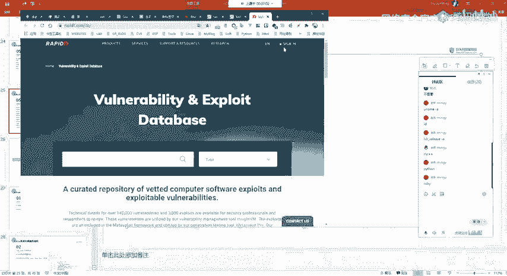

rapid7rap7的话，呃，如果大家就这个的话大家应该都听过，都知道吧。就是我们那1个MSF的这样子一个框架的话，就是这个公司的一个产品。就MSF的话是呃这个公司的一个产品。

然后的话是由他们在做的一个呃维护，对吧？然后在这边的话，就是呃他这边他有对应的这样子的一个就是漏洞利用的一个数据库啊。

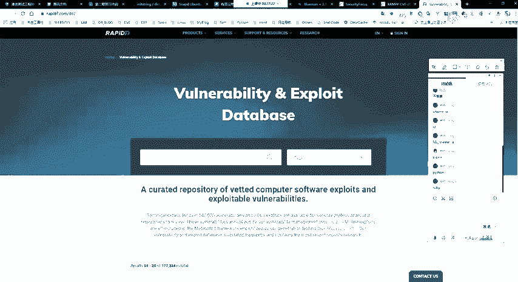

然后在这边同样的就是有对应的这样子的一些呃。对应的这样子的一些呃E叉P以及对应的这样子的一个信一些信息，对吧？像比如说这样子的这1个CV的一个漏洞，它的一个呃描述以它的一个解决方法。这边应该有。

以及呃这一个的话是另外一个网站，就在这边的话，它有列出了就是。

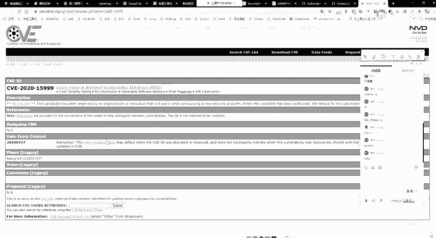

呃，他了一个信息啊，也是。

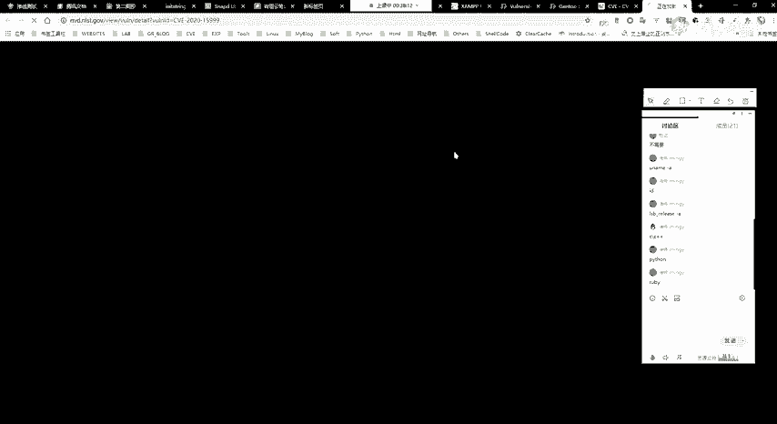

嗯。

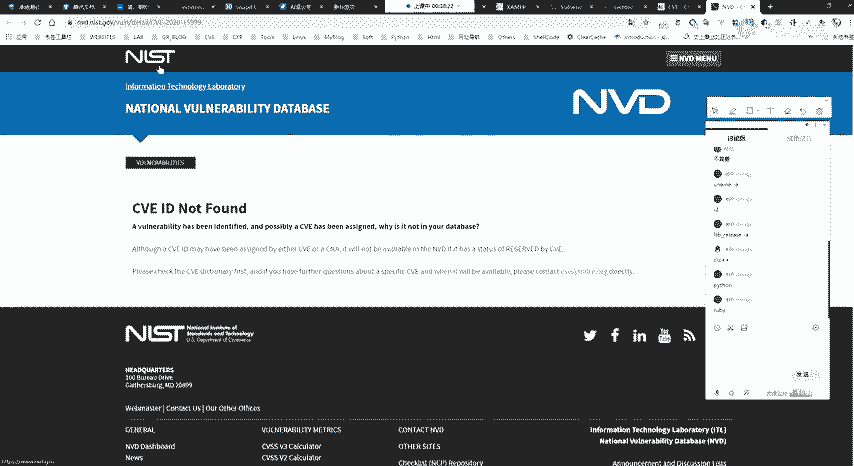

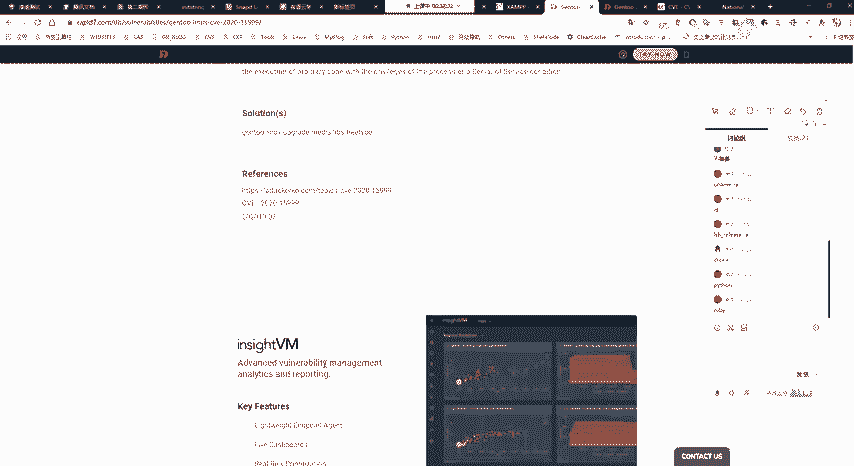

Yeah。

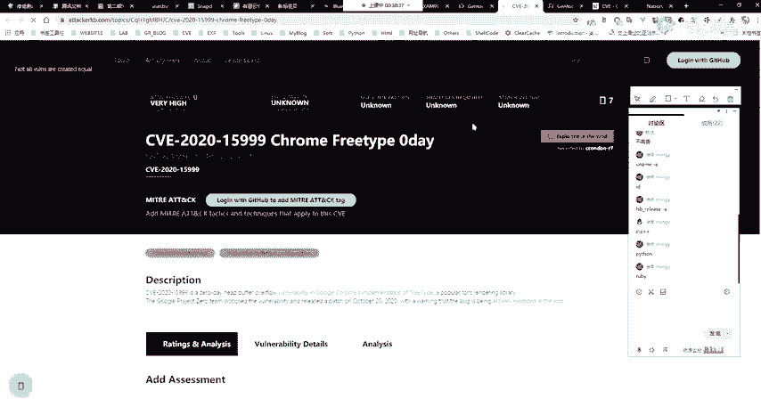

Yeah。

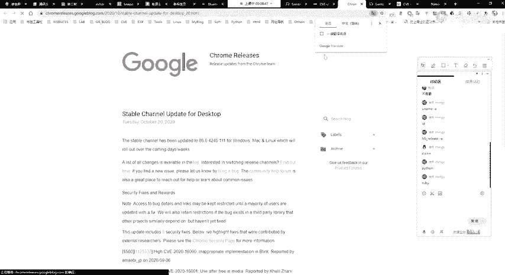

啊，我这边的话就不翻了，就是呃我们通过这样子的一些网站，他所就收集的一个一些信息嘛，去查找我们想要的这样子的一些。

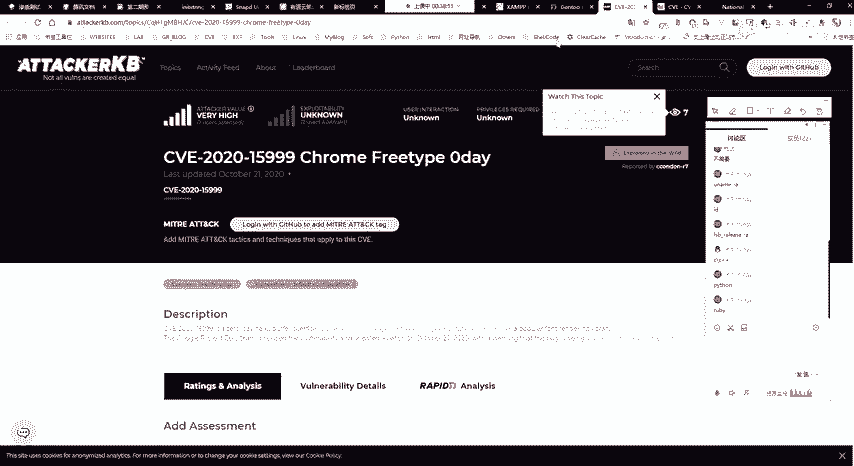

呃。我们想要的这样子的一些内容。然后还有呃像在这边的话有。modelmodel这边的话就是。我可以翻译一下。model这边的话就是我们MSF当中不是有集成很多的这样子的一些漏洞利用的一些模块嘛，对吧？

那些模块的话其实就是呃就是漏洞报出来之后的话，就有对应的一些安全营究人员，对吧？它针对这样子的一个漏洞，它会去呃写这样子的一个就通就写这样子的一个漏洞利用的一个模块，对吧？

然后的话把这个模块集成到我们的1个MMSF当中，对吧？然后在这边的话就有对应的，就是这样子的，就关于这一个漏洞，它的这样子的一个呃利用的一个模块对。就这样子的这一个漏洞，它的1个S1。

然后关于这一个漏洞，它的这样子的一个呃模块的一些选项，对吧？对。在这边的话，我们都能够去看到。就是呃然后的话这边的话都是就是最新爆出来的这样子的一些漏洞嘛，对吧？

然后我们在这边的话就也能够去就实时的去查找到，就是说它最新的这样子的一些漏洞，对吧？呃，这边的话就是。一些呃查找漏洞利用代码的这样子的一些网站。呃，还有像就国内的话，就是这个。呃，这个安全课对吧？

安全课这个的话应该也是大家就是常经常会去看的，对吧？他这边的话也有去就是实时的再更新，就是最新爆出来这样子一个漏洞。然后我们可以在这边去查找到它对应的这样子的关于这一个漏洞的一个信息，对吧？

就大家再去就大家如果从事安全这个行业的话，你就必须要去实时的去关注这样子的一些最新的一个漏洞，对吧？然后你最新漏洞，你报出来的话，你需要去你需要去研究它，对吧？然后去复现它。那么你要去复现它的话。

你就需要去知道这个漏洞它的一个详细的一些信息，对吧？所以的话你就需要去呃查找到对应的这样子的一些信息。我们可以通过这样子的一些网站。因为这些网站的话，它已经把我们想要的这样子信息都已经就是呃然括进去了。

我们只需要去做一个简单的一个检锁，就能够去找到了。呃，以上的话就是我们的一个link下面的一个提全信息的一个收集的一一部分。第二部分的话就是。硬s系统的一个内核漏洞的一个提全。呃。

就是讲到讲到系统的这种提权漏洞啊，就是内核的这种提权漏洞的话，都是就是很常见的。而且就是内核这种漏洞的话，也是我们就是最常去进行一个呃尝试利用的对吧？因你的一个内核漏洞的话，你去利用的话。

我们就比较简单，直接是吧？我找到对应的一个代码利用代码。然后的话我直接就能够去进行一个提群。然后在这边的话就是呃给大家介绍这一个linux频的一个提群漏洞的一个集合。

这个的话跟我们上节课讲的windows下面的一个提群漏洞集合的话，其实是对应的。

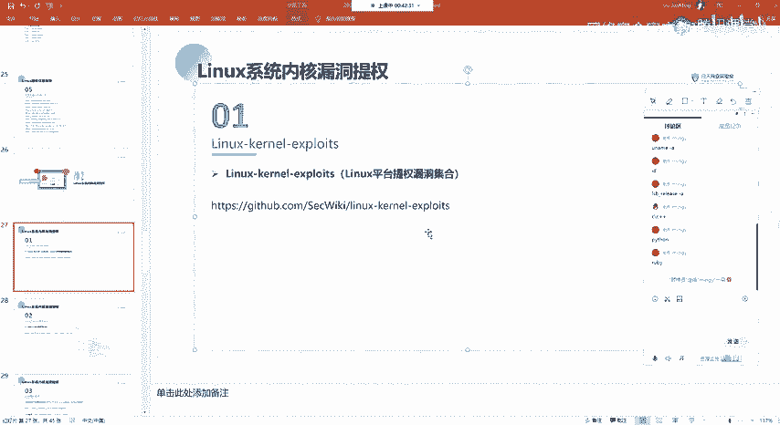

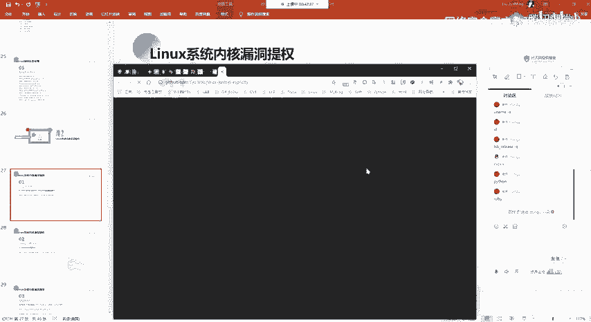

🤧嗯。就是说那边的话，它那个的话就是windows下面的对吧？然后这一个的话就是linlinux下面的这样子的一个，其实呃都是这一个six white它的。

总结的这个就他把呃历史上面呃爆出来的这样子的一些提群相关的这样子的一些啊，不是提群相关，就与内核相关的这样子的一些漏洞。然后的话他做了一个这样子的一个集合。然后在这个集合当中的话。

比如说我们找一个最新的这一个。2018年的这个对吧？就这一这样子的一个漏洞。然后在这的话就有对应的这一个漏洞，它的一个呃介绍，对吧？以及呃与这个漏洞相关的这样子的一些啊链接。

以及这边的一个能够去做一个权限提升。这个的话是这一个gle C的一个权限提升的一个漏洞是吧？然后这个漏洞这边的话就是它的一个呃。它的1个E叉P，也就是它的一个利用代码，对吧？它是一个C源所编写的。

所以的话我们只需要去呃通过GCC把这样子的一个代码做一个编译，我们就能够去进行就能够去得到对应的这样子的一个呃利用这个提群漏洞的一个可执行程序，对吧？然后还有其他的这边这个的话。

就是其实这些的话就是你没必要去一个一个的都去看啊，当然的话你想要去那个。去研究的话，你可以去看看看这里。然后呃其实。

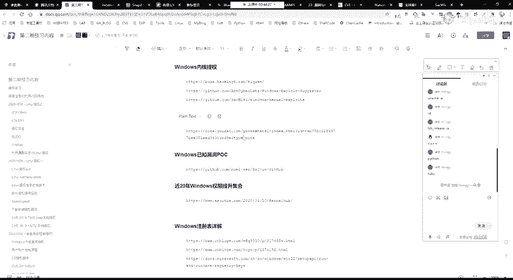

这边这一个。就如果你。对这一些东西感兴趣的话啊，你可以像像他一样对吧？像他这边。就呃像他这边一样，他做了一个这样子的一就是windows下面的一个20年来windows权限提升的一个集合。

然后其实这边的这个集合，其实就是它的他对这样子的一些提群漏洞。它的一个信息的一个汇总，对吧？然后的话他去对这样子的一些漏洞，他自己呃去做一个研究，去做一个尝试，然后的话做下的一个笔记，对吧？

然后其实大家自己去做这样子的一个安全研究的话，然后呃一定要去一定要就是说做好笔记啊，就是说你的这样子的一些内容的话，你的这样子的一些内容，你你自己去做过了，你自己去做过了，然后你把它记下来，对吧？

记下来的话，你写到笔记当中，就是你之后的话。

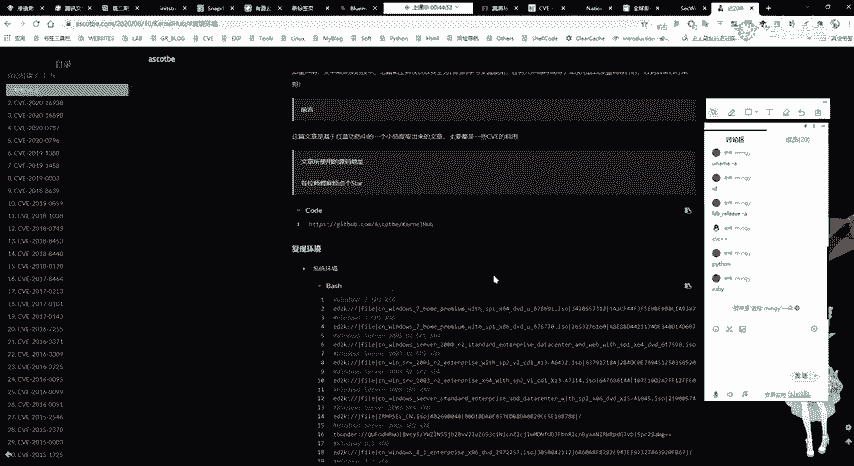

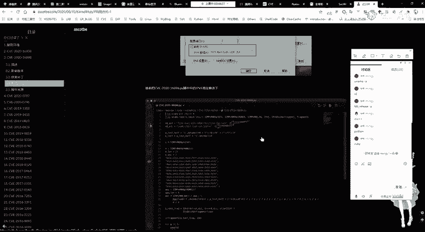

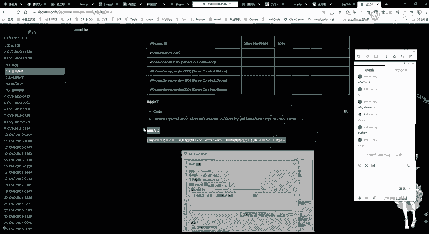

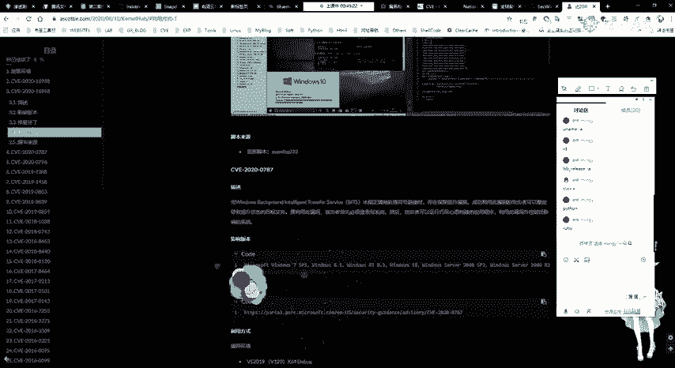

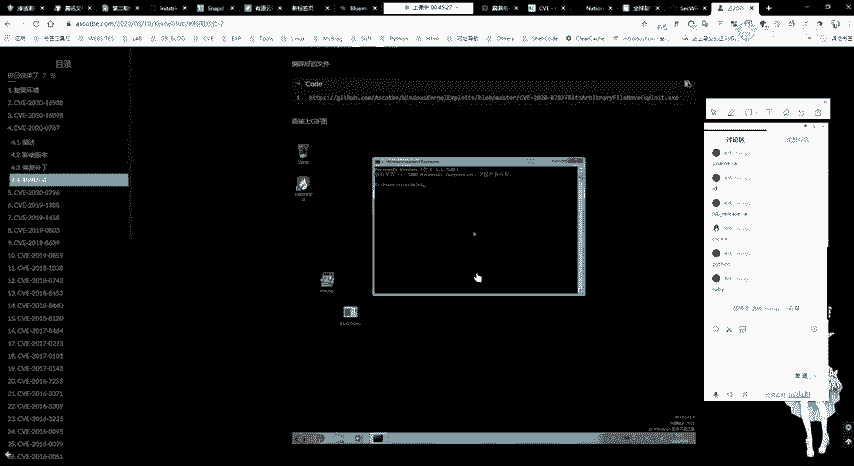

笔记你之后的话，你再去看对吧？然后的话你也可以把它分享出来，对吧？就是像像他这样子，对吧？

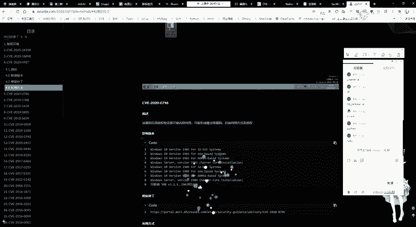

他把对应的这样子的一些提旋漏洞，它做了一个。

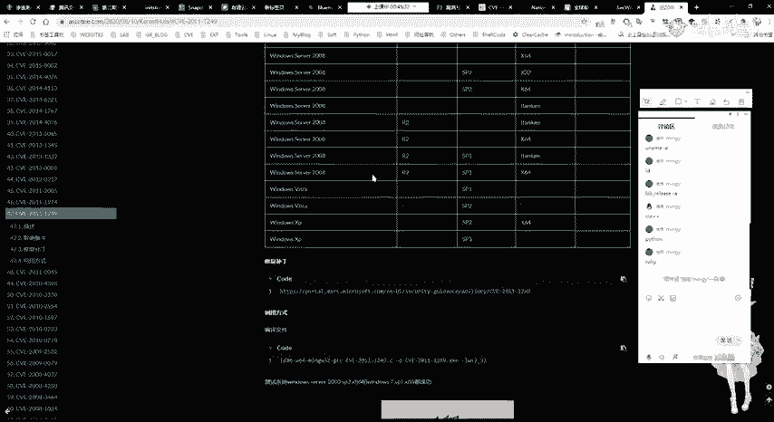

汇总。

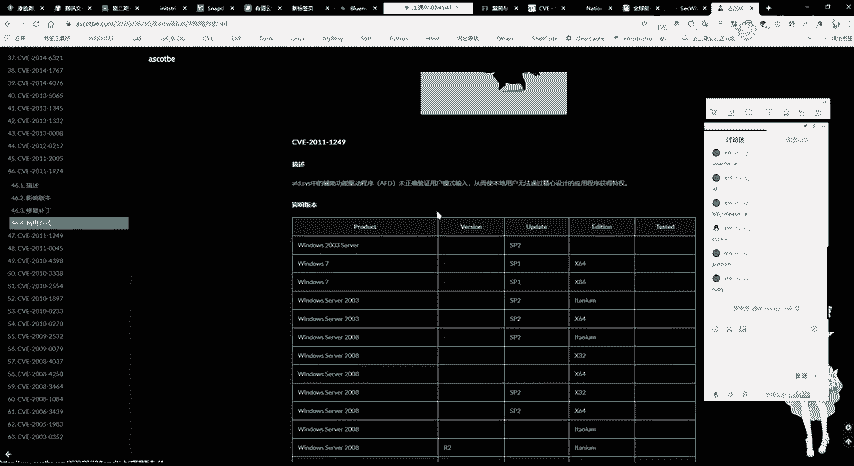

然后的话你下次你去那个的话，你可能就是说因为这些东西的话，其实你都自己有尝试过，对吧？你尝试过了他的这样子一些东西，你已经学过了。但是你学过了的话，你说不定忘了呢，好吧？

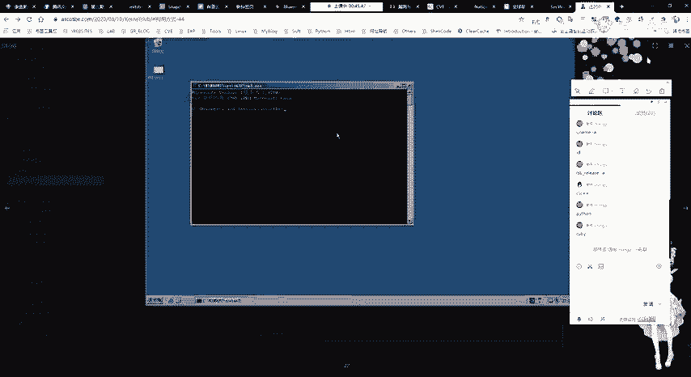

然后在这的话你就可以在你自己的这个笔记当中去做一个检锁嘛，就不不不用说你再去呃那样子的一些。

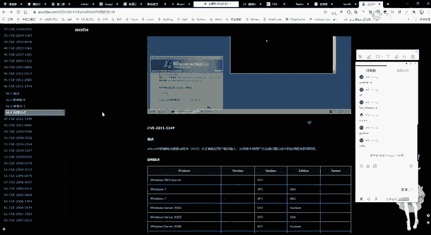

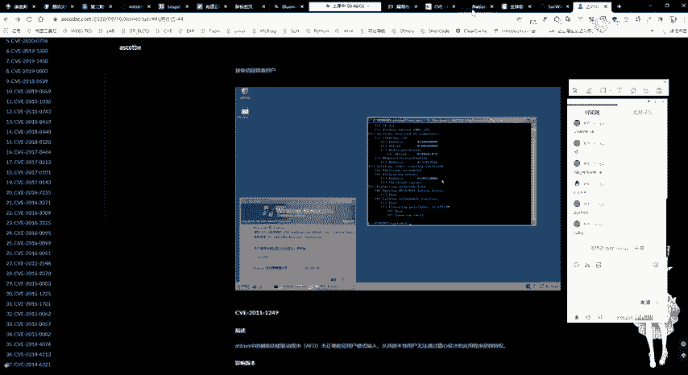

网站当中去进行一个紧锁。

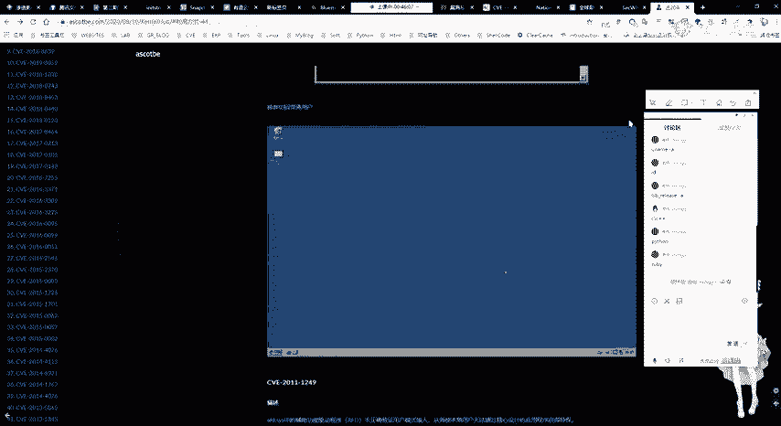

嗯。啊，其实我这边要说的话，其实就是让大家做好比较。然后的话就是你去做做这样子的一个研究的话呃。就其实就多分享吧。就其实我这边的话，其实。我这边的话，我的笔记都是在有有在在我这边。

就是当时的话我没有说去总的很。没有去总横的，就是去做一个很好的一个总结吧，然后他话就比较零散，就可能。就自己要用的时候，对吧？就去搜一下，然后看一下。就是呃。🤧K。🤧嗯。嗯。呃。

这边的话就是lininux平台的一个提悬漏洞的一个集合。就是我们再去要去用到的时候，对吧？我们通过前面的一些信息收集，对吧？我们知道它可能存在这样子的一个呃CV的一个漏洞，对吧？

那么我们可以在这边去查找对应的一个利用代码，对吧？它这边的话都已经就是已经把它放做成了一个集合嘛，对吧？我们只需要知道1个CV编号，我们就能够去找到对应的一个利用代码。

就能够也能够去呃减少自己的很多的一个时间。

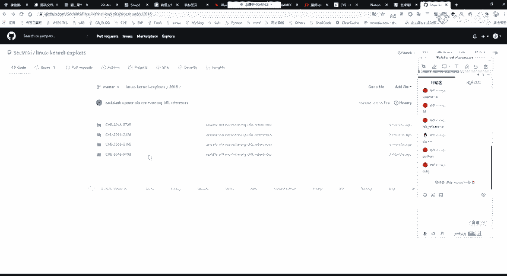

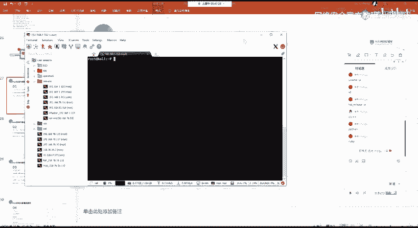

好，第二个的话就是这个呃s point。搜索 e叉 p。就我们。🤧ふ。就我们前面的话是通过这样子的一个网站，对吧？去紧锁对应的这样子的一个漏洞。它的一个E叉P。但是的话我们在这边的话。

如果说我只知道就是说我只道它是一个linux的一个系统，对吧？然后的话我知道它的一个内核的一个版本，那么我。那么我去进行一个紧锁的话，我需要在这样子的一些网站，我去我要去一个一个关键词去去进行一个搜索。

对吧？然后在这边的话在这边的话有这样子的一个satispect的一个工具啊。这个工具的话就是用来去检锁我们的一个可用的这样的1个E叉P的。然后它的这个工具的话，它是依托于那个我们的这个expoitDB。

就是这个依托于这个exitDB就它里面所检索了出来的一个数据。它其实是从这个exportDB。🤧呃。从这一个网站它的一个数据当中获取的。然后的话这边的话就是它的这一个工具，它的一个呃详细的一个使用。

我这边的话已经。呃，贴贴出来了，然后这边的话是我的一个。笔记啊就是总结的这样子的一个东西，就关于这个stport。喂。这边的话介绍了他的一个安装，就是呃我们因为它的一个数据库的话。

就是说他去检锁的一个数据库。你再看里面的话，它是自带的。然后的话如果你不再看里面的话，你需要有对应的这样子的一个数据库。然后。呃，在看你里面。其大家可以直接打开看你啊，打开看你的话。

因为直接输一个sbo，他就能够去呃执行。然后这边的话在卡里里面，他其实呃有。已经有。🤧存储了就是我们常用的这样子的，就是说在ex在这边exportitDB这边，对吧？比如说我要去下载这个E叉P。

然后就是像这样子的一个文件，对吧？就是这1个4948963点text这样子一个文件。就这一个文件的话。

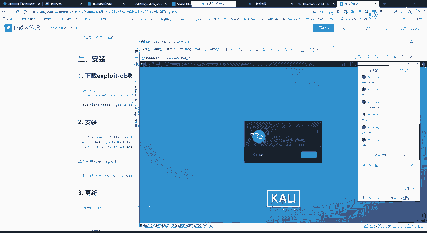

🤧Yeah。嗯。

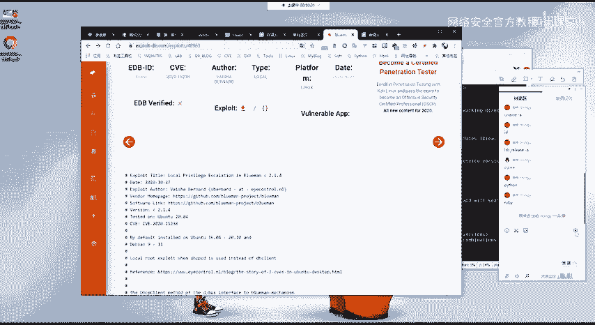

啊呃，其实对应的这样子的一个文件的话，其实在呃我们的一个such point，就是说在我们的一个count里里面的话，它已经存在了，就是它已经保存在了我们的一个看理机上当中。

然后的话我们在such point这边的话，我们可以直接去检索到对应的这样子的。像比如说。我去检索一个linux，对吧？我这边搜索这样子的一个lininux，搜索之后的话，在这边它就有列出了。

就与linux相关的这样子的一些E叉P对吧？以及在这边的话，就是它的这一个文件的一个路径。呃，这个文件路径的话是。🤧う。对。这个文件路径我忘了在哪，就呃在这边。就是。就我们在这一个目录当中的话。

我们就能够去查找到就是这一个脚本，对吧？就是这1个47292点C的这样子的一个CC语言的一个脚本。然后它是存放在我们你看你里面的这样子的一个目录啊。然后其实对应的这边的话，其实就是这边的这个信息啊。

其实就是这里的这一个嘛，对吧？然后我们可以。到这个目录里面去看一下，它里面的话有存的。存储着很多的这样子的。🤧一一些脚本对吧？像比如说。我要的话是linux的对吧？然后我CD到lininux这一个目录。

然后它在这边的话就有列出了这样子的一些C。然后对应的这边有这么多的一些目录的话，它同样的都存在有。多个这样子的一个呃E叉P的这样子的一个呃。

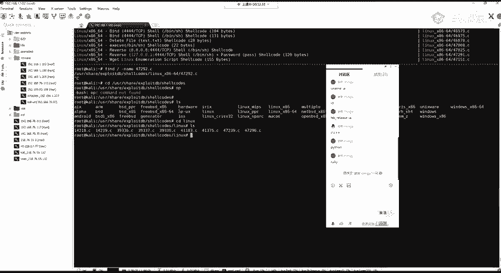

这样子的一个脚本。

嗯。然后的话呃关于这一个工具，它的一个使用的话，大家看我这边的一个笔记吧。好吧，呃，就是在用之前的话，我们可以通过C27port杠U来去做一个更新，就是更新我这边的这样子的一个数据库嘛，对吧？

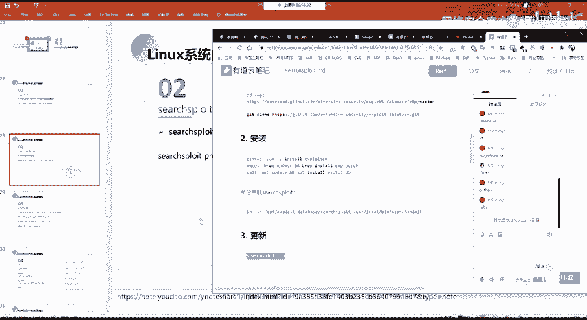

然后其实sport的话，它也可以就是在线的去进行一个查找。就是它查找的一个数据的话，它同样的就是直接在我们的一个exportDB里面去查找。

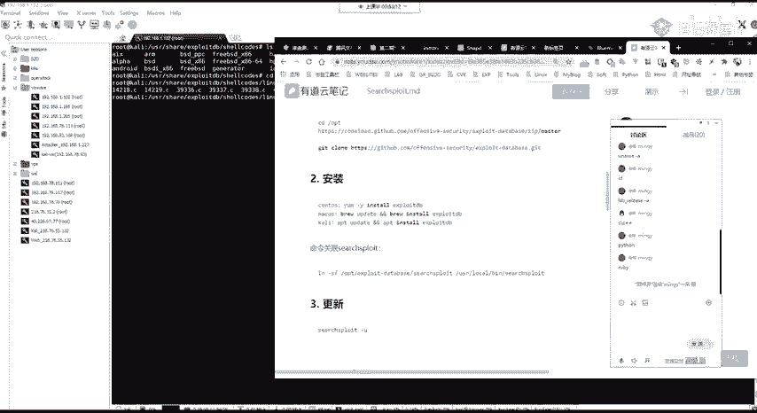

去紧锁对应的一个信息。嗯。是更油。然后他在这边的话，他就会去自动的去更新啊，去更新我们这边的一个呃。EXP的这样子的一个数据库。

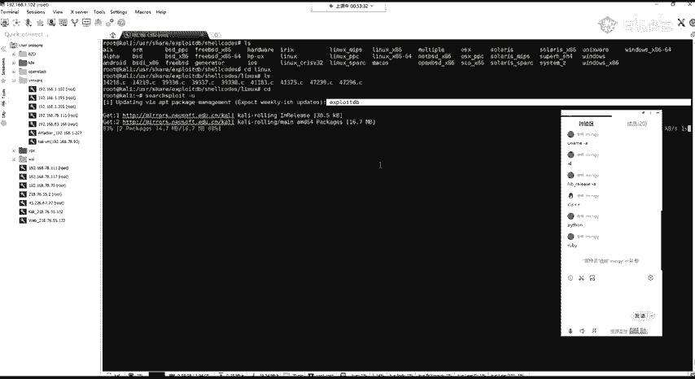

然，我们更新完之后的话，它就能够去获取到。就我们在这块就能够获取到最新的这样子的一些呃E叉P对吧？然后呃关于它的一个使用这边的话。呃，我们以一个实际的一个例子。

我这边以一个实际的一个例子给大家做一个介绍，我这话我就不会去一一的去那个。呃，这边的话我已经就写的应该比较详细了，对吧？

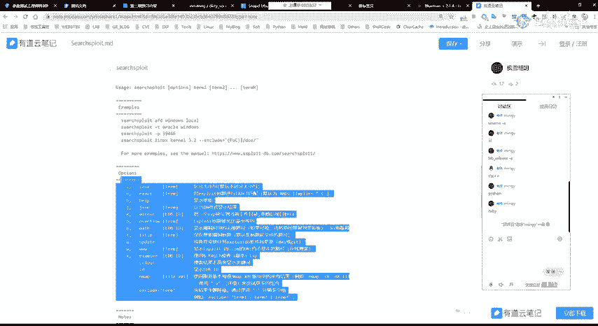

🤧嗯。在这个话，我以一个例子就是。以以我这边的这个机器啊。诶。死个啊。以我这边的这一个机器吧，这一个无关图的一个机器为例。呃，我这边的话是一个。物干图的一个机器。18。04的然后我当前的一个版本。

我的一个内核版本。我的一个内核版本的话就是这个4。1054。1。5对吧？4。15的这样子的一个内核版本。然后的话我我想要去检锁，就是说我想要去检锁，就是说。Oh。

紧锁能够去在这样子的一个呃系统当中去进行一个利用的这样子的一个提权的一个漏洞，对吧？然后的话。我们可以通过。呃，我这边的话哇这么多。那不更新了呀。

我这的话呃可以通过这个sex point来去进行一个检锁。就首先的话我这边的话我要去检锁的话，就是呃我当前的是一个lininux的一个系统，对吧？所以的话我要去获得这一个信型号。

就是linux下面相关的这样子的一些E叉P，对吧？

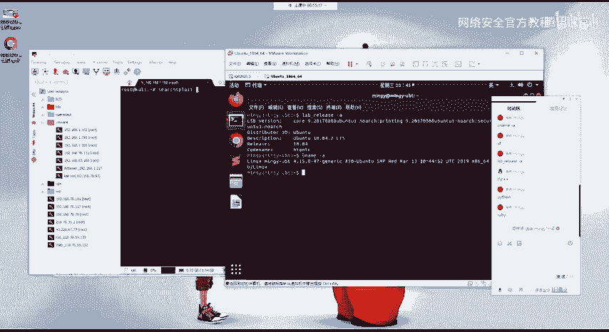

然后这句的话它有列出了有这么多的这样子的一些。对吧然后这里的话。现在这边的一台P的话，这边就有。其实。它是这样子去做的一个构成啊，就是这边的话是你的一个linux的这样子的一个呃架构，对吧？

像呃ARM的。还有的话残留式的这样子的，然后中间的话就是关于这样子的关于这一个漏洞的一个介绍。然后呃最后最后面的话，这边话就是pas，也就是路径。

就是这边的这个漏洞所对应的这样的1个E叉P所存放的一个路径。就是在我们刚刚的那一个目录下面嘛，对吧？然后这边的话它的一个信息的话是比较多的对吧？就是我们还需要去做一个进一步的一个筛选。然后在这的话。

我想要去利用的话，就是我想要去紧锁这一个系统，它是不是有一个呃内核的这样子的一个提群漏洞，对吧？那么我们可以加这样子一个关键词。对。Cannel。就是呃KERNEL这个话就是内核的一个意思。

这个内核核心内核对吧。然后的话呃在这里的话，它同样的也也有列出了这样子的这么多的一些信息啊，对吧？然后在这边的这些信息的话，我们就。就比较直观了，也算就是linux。呃，内核对吧？

然后后面的话这边的话就是内核的这样子的一些版本，对吧？以及这一个漏洞它的一个呃名字介绍，对吧？然后在这话有对应的它的这些信息都已经列出来了。然后我这边要去查找到的话，就是我这边的这一个系统。

它的一个内核，我看一下是这个4。15对吧？然后我这边我再去加这样子的一个。呃，条件现在的话。🤧嗯。现在的话就是返回的这样子一些信息的话就明显少了很多，对吧？然后的话在这边的话就是呃他返回的这样子。

这些信息的话，就是我们的这边linux系统下面的1个4。5，就是4。5版本，就是满足呃你的一个内核版本是4。5这样子的一个呃系统。它所就是存在的就是说已经被爆出来的这样子的一些漏洞。

以及它对应的这样子的一个可以去利用的这样子的一些E叉P的一个路径，对吧？然后在这边的话呃，我们就可以去查找对应的。呃，我们想要去进行一个尝试的这样子的一些提全的1个E叉P，对吧？我这边话是1个4。15。

然后再找到这边的一个就是一个提全。然后找到提全的话，就是我们的像我们这边的这一个就是local privilege，对吧？这这边这一这边的这一个。

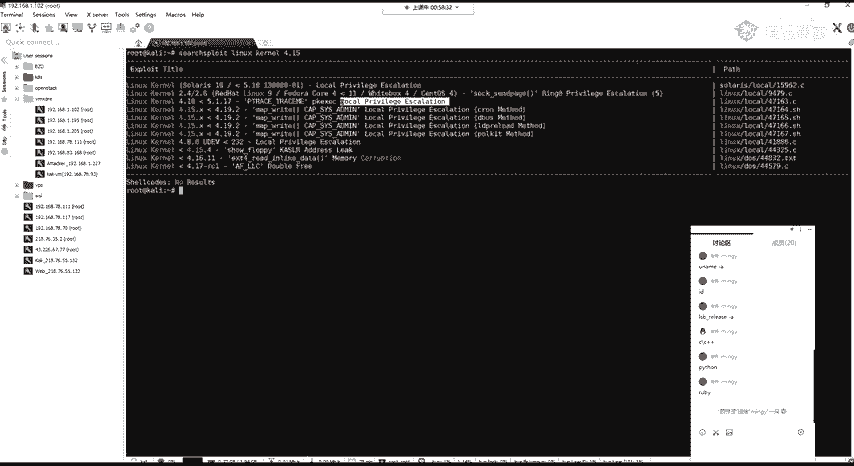

三个单词的意思的呢就是本地特权提升，就是本地的一个权限的一个，这个是逃脱嘛，其实就是逃脱本地的这样子一个权限嘛，也就是权限的一个提升。

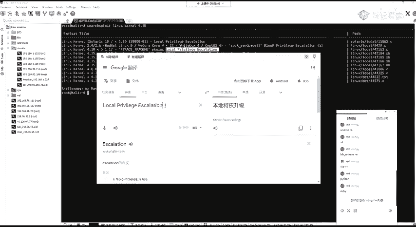

然后这句的话我们就呃有找到它的这样子的一个描述，这边，对吧？是这个这一个是可以去进一个利用的。它这边的这一个内核版本的话，就是就说你的一个系统是处于这1个4。10到5。1。

17的这样子一个版本的一个内核的话，你就可以去尝试，就有可能存在这样子的一个本地特权提升的一个漏洞。对吧然后这边的话对应的这样子的1个E叉P，它就是这一个。对。Okay。然后在这里的话。

我们可以通过sport。

呃。加加一个杠P，就指定一个路径，指定我们的一个papa的话就是这边嘛，这边所显示的。然后我们在干P参数加我们的一个pa的话，就能够去显示这一个漏洞利用的一个完整路径。

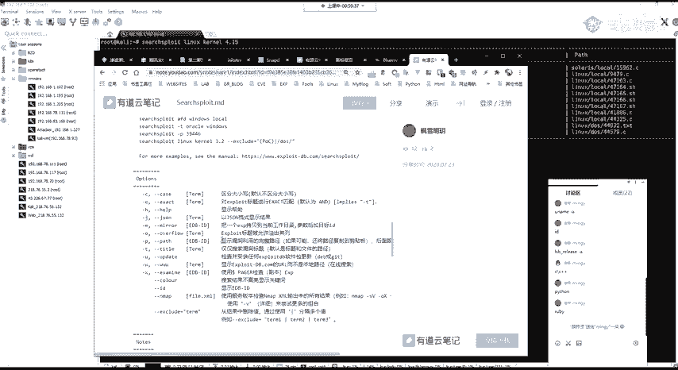

我来。执行一下执行之后的话，在这边的话就显示了关于这一个E叉P的对应的这样子的一个详细的一个信息，对吧？这边的话是关于这一个就是内核版本的这样子的一个呃本地提群的一个漏洞。

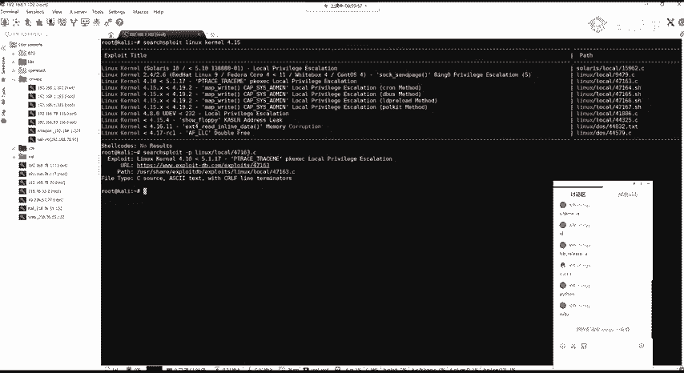