# B站最全网络安全教程，整整1300集，全程干货无废话，别再盲目自学了，看完学不会我退出网安圈！（web安全｜渗透测试｜内网渗透｜CTF） - P96：95. 第四十五天：Linux环境变量提权.mp4 - 网络安全官方教程 - BV15u4y137cQ

然后这边的1个UL这个URL的话，其实就是我们的一个。

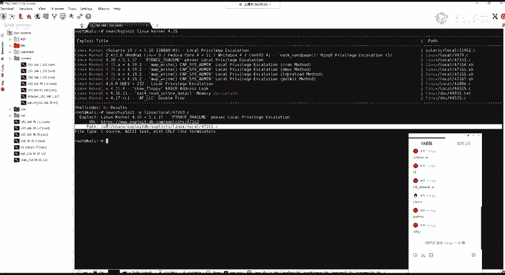

这这边的一个exexDB上面的这样子一个链接。然后它的这样子1个E叉P的话，其实就是这边的这一个就47163。

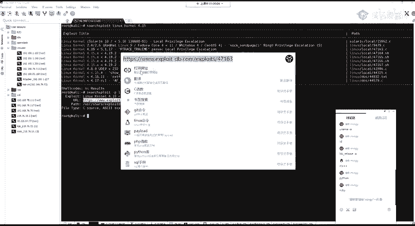

对吧。就这样这样子的一个。呃，C程序的这样子1个EXP。对吧这个一参就是针对这样这一个内核版本的这样子一个提群的一个漏洞。

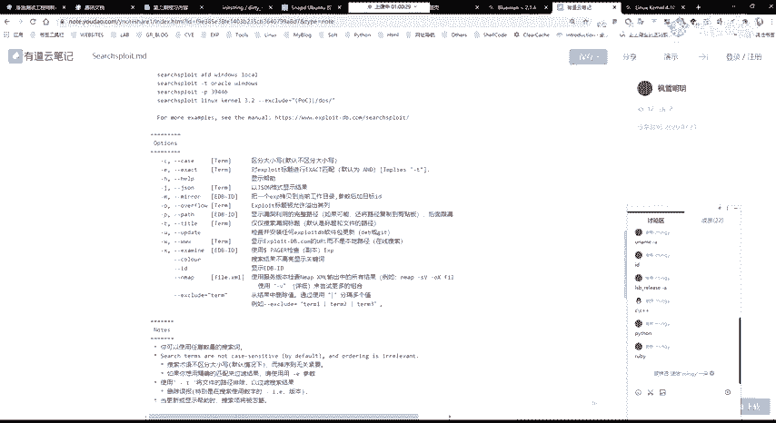

然后还有的话就是呃完整的一个路径，对吧？这一个路径的话，其实就是呃我们这个脚本它所对应的在我们看你你看你机器上面的这样子的一个所存放的一个路径。我们可以在这一个目录上面去查找到，对吧？

然后我们可以把它call出来，就是把它copy出来嘛。然后的话把它丢到目标机上面去执行嘛。然后在这边的话也有就是可以通过。你可能ll的话就是通过CP对吧？然后sport的话，这边有这样子的一个参数可以。

诶。就杠M杠M参数的话，它可以把1个E叉P拷贝到当前的一个工作目录嘛，是吧？就我们不需要加这么长的这样子的一个东西，我们可以直接s for杠M。然后接这边的一个。🤧嗯。4763。C对吧？

然后这边的话就拷贝到了。诶。啊，不对呀。不是呃。是这样的啊，47163。C啊，刚刚复制错了。这一个这个的话是我们的这一个程序的一个路径嘛，对吧？然后我这边执行的话，它就可以把它复制到我当前的一个目录。

然后我当前的目录的话就有了这样子的一个。47163点C。这样子的一个呃CC程序的这样子的一个代码，对吧？然后这的话我就可以对他做一个。B。嗯。你。然后在这边的话就多了一个这样子的一个。E叉P。对吧。

这样子的一个程序这个程序的话，我们可以直接去进行一个直旋。当然的话我当前的这一个机器的话是。啊，应该是不存在这样子一个漏洞的对吧？我这边执行的话，他这边的话是而且我当前的话是一个root用户啊。

执行的话这边他应该是没有就没有成功，对吧？我当前这个提话是没有没有对应的这样子的一个提群漏洞的。但是呃我这边的话执行的话就是为了验证我这边的这个脚本，它是其实是能够去执行的对吧？

就我这边的话是编译的话是没有出错的。

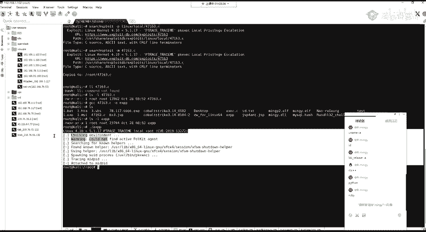

然后在这边的话呃我这边的话就是需要去把它放到这边来去进行一个执行，对吧？呃，我这边的话。我这边话其实已经就是弄过来了呀。应该是。就是这一个嘛，对吧？我可以看一下，就是这一个呃。4。10到5。1。

17的这样子的一个。脚本。47263。C对吧？就是跟这边的话是一一样的对吧？内容是一样的。然后我这边的话在这边通过GCC做一个编译。呃，我这边编义之后的话，就有了这样子的1个E叉PPP的这样子的一个。

程序对吧？然后我这边的话我就可以去进行一个执行。你去尝试执行。然后在这边的话可以看到，就我这边执行之后的话，它立马的话，它有这样子的一个利用的一个过程，对吧？然后利用过程完之后的话。

他这边我当前其实是1个MNGY的这样子的一个普通用户啊。然后呃我通过这样子的一个提全漏洞的一个脚本啊，我可以看到我当前的话是得到了一个root的一个用户。对。开。就说。对吧。

是一个完整的一个root用户的一个权限。我这边的话。退一下。我当前的话是一个普通用户啊。

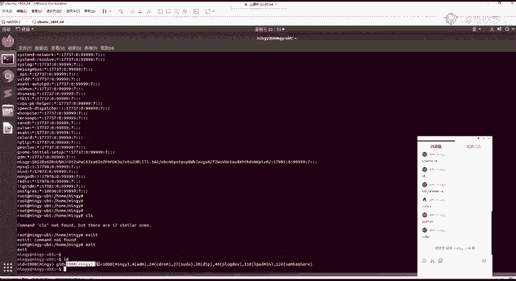

这边的话就是这一个。呃，其实这边的这个提恤绒的话就是呃呆就是我这边需要讲的这一个。然后在这边的话，我通过这样子的一个sbo，对吧？去查找对应的。

我通过这样子的一个内核的一个版本的一个信息来去检锁对应的这样子的一个提群漏洞。当然的话因为我这边的话是我这一个机器是正好是存在这样子的一个提群漏洞的，所以的话你通过这样子的一个检锁。

能够正好去找到能够去进行一个利用的1个E叉P，对吧？但是的话。就提拳的话，真的提拳这个东西的话是比较靠运气的。然后呃像这种东西的话，你可能就是你通过这样子的一些信息的一个解锁，对吧？

你可能就觉得它可能存在这样的一个提取漏洞，但是它不一定存在，而且的话也不一定能够去进行一个呃利用。这个话是需要大家去知道的。嗯。😊，呃，这边的话就是。通过这样子的一个例子啊，给大家介绍了。

就是说实际的演示了这样子的一个工具的一个使用啊，对吧？我们通过这一个工具来能够去比较方便的去检索我们想要的1个E叉P是吧？尤其的话在看里面的话，它已经呃已经内置了这样子的一个。呃，数据库。呃。

第三个的话就是这样子那个粘留的一个提群漏洞。呃，这边的话。我先下一下课，好吧。已经。怎么没有怎么没有同学提醒一下我呢？我这讲着讲着又忘了。大家都不想休息的吗？😊，呃，那我们继续吧，中间的话就不休息了。

因为时间也过了。就呃。大家下次。有下次的话，同学看到了就提醒一下我好吧，那我这边的话，我讲的的话，我可能不会去注意时间就是。就中间的话给大家留点那个休息的一个时间嘛，对吧？呃。

第三个话就是这样子的一个粘牛提权漏洞。呃，粘牛的话就是说再讲提权，讲定义史下面的一个提权的话，就是不得不去说一下这样子的一个提权漏洞。

因为这个漏洞的话是呃就是它的一个影响它的一个就是漏洞的一个危害的话是相当大的。但的话在现在的话就是说在现在的话，它的一个这样子的一个漏洞，它存在的一个概率话是比较小的呀。

就在这个漏洞刚爆出来的那一个那一个时间段的话是。它的一个危害的话是相当大的。它的一个影响的话。所以的话它的一个就是粘年提群漏洞，它的一个就是是很出名的一个提裙提裙的一个漏洞。就它的一个作用的话。

就是我们的一个低权限用户能够去利用这个漏洞来在全版本的一个lininux系统上面去实现本地提权。但然的话这边的一个全版本是注意的话是在当时那个时那就是当时这个漏洞爆出来的那个时间啊。也就。

也就是说在当时那个当时那会儿就是这一个漏洞爆出来的话，我们可以直接利用这一个漏洞。在所有的这样子的一个lininux系统下面。因为它是在全版本啊，所以是在当时那会的一个lininux系统上面。

所有的linux系统上面去用这样子的一个漏洞去达到一个提全的一个目的。所以说它的一个影响的话是影响了当时全版本的一个lininux系统，它的一个影响力的话是相当大的。

而且这个漏洞的话是一个就是很严重的一个漏洞嘛，是吧？我们从。从这边的一个意思也能够去知道。然后他的他是能够去做一个本地的一个提全。然后这边的话是它的1个POC呃，关于这个漏洞的话。

我这边呃就不给大家演示了。因为这个漏洞的话其实也算是比较老了，就可能存在的一个概率的话是不是很大，当然的话也不一定，对吧？

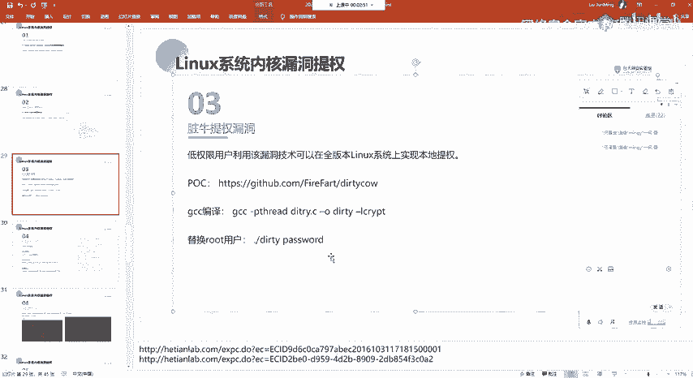

以及的话这边的话大家去做一个去做一下这边实验室的这个实验。这个的话就是关于这个张流漏洞的，就近是全版门的一个通商地区漏洞的一个复性以及分析。

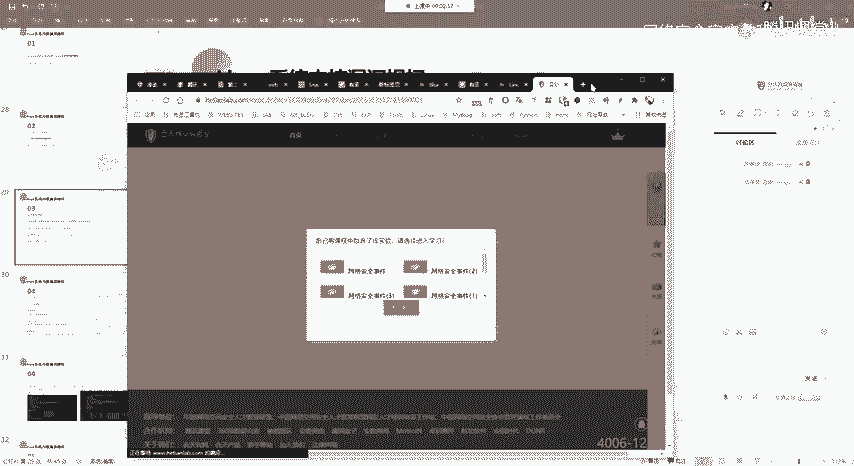

大家可以去做一下这个实验。在这的话就是呃。介绍了这一个漏洞，我们如何去进一个利润，对吧？然后的话在这边的话，有关于这一个漏洞，它的一个详细的一个就是涉及到的一个技术。

然后对它的对它的做的这样子的一个呃介绍，就研究的一个介绍，对吧？就很详细了，这边我这边话我就。

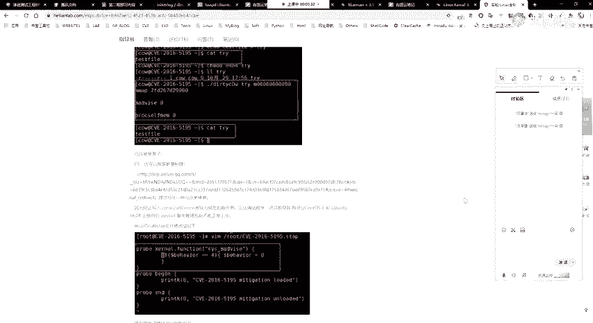

我就不再给大家去再读一遍了，好吧，这边的话就大家自己去看。因为我要去讲的话，其实也是跟这边就是没什么太大的区别。

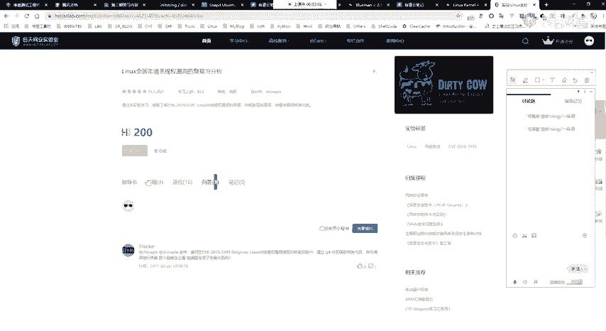

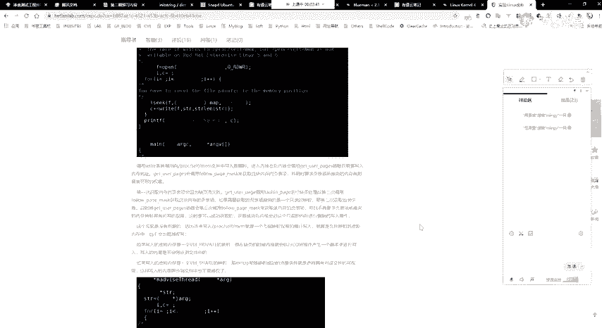

因为像这种的话，你需要你知道怎么去用就OK了。呃。呃，第四个的话就是这个呃刚刚给大家介绍的这样子的1个CV2019的1个13272的这样子一个提全漏道。呃，这个提全漏洞的话。是一个本地提全的一个漏洞。

然后它的一个漏洞范围的话是影响呃，它的一个内核版本是4。1到5。1的这样子的一个范围。然呃它所影响的一个范围还是比较广的呀，就是它影响的这样子的一个系统。像乌班图啊，还有卡里地病，对吧？

然后这边的话是他的1个E叉P，其实就是我刚刚对吧？去通过那样子的一个检锁。通过sespoint紧索到的呃。通过内核的一个版本，然后的话检索到了在exDB上面检索到对应的这样子一个E叉P，对吧？

这个的话就是它的一个链接。🤧Yeah。

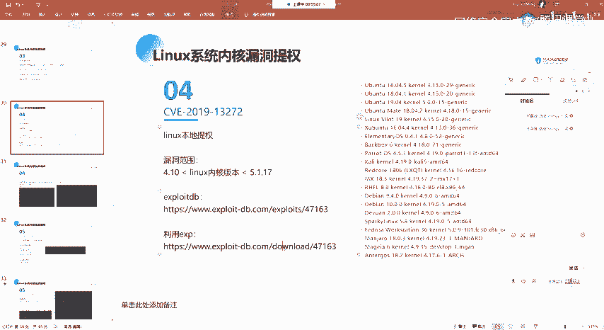

哦呃。这边的话就是这个EXP的话，我们下载下来，我们下载下来之后的话，我们直接GC去做一个编译。编译之后的话，直接执行的话就能够去得到一个。呃，root的一个权限，就像这样。

这边的话是在我的那个乌班图的一个系统。呃，这一个漏洞是去年去年还是前年？19。去年吧去年年底年底出的这样子一个漏洞。然后这边的话是我当时就是付线的这样子那个截图啊。呃。

这边的话这个物班图的话就是我这边的这个机器嘛，就这个机器。18。04的这样的一个机器。然后这边的话是一个呃咖你机器啊，就是这一个咖你它同样的影响这样子的一个咖你的一个机器啊。

它的一个在这边的话是它的一个内核版本是4。19这样子的一个看你机器机器的话，我们也可以可以去做一个提全，是吧？这是它的一个效果。

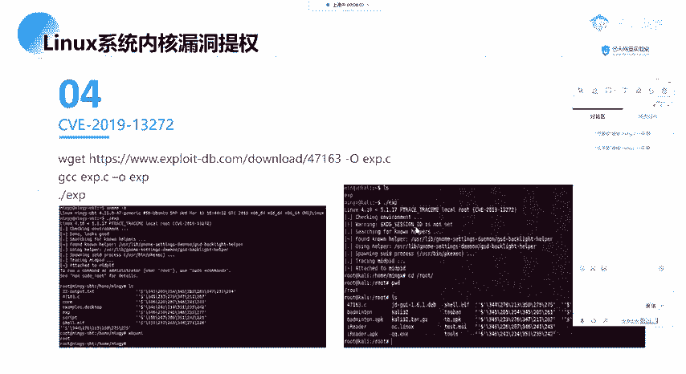

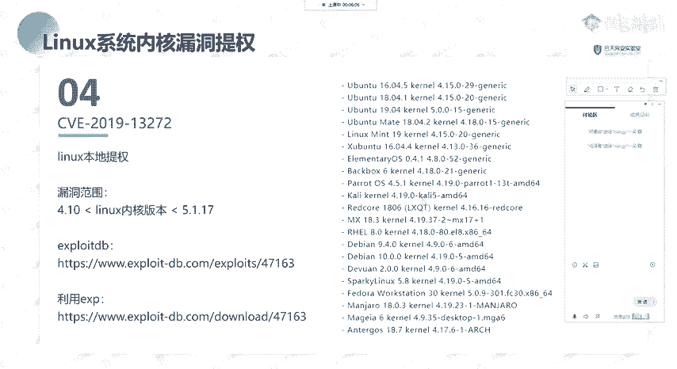

系。看机器的话，这边的话我就不演示了。因为现在最新的话，现在最新的看你的话是没有这样子一个漏洞。它的一个内核版本的话不属于这一个范围了。这个是呃2018的2018的。

如果大家现在有就手上有这样子的1个2018的这样子的一个三还是几的。这样子的一个看理机器的话，你可以去尝试一下，能够去进行一个提群。

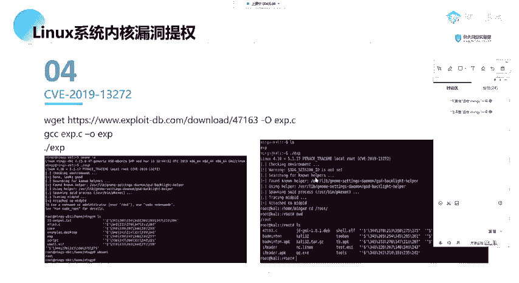

嗯。然呃，第五个的话就是这一个。CB209的7304，这一个漏洞的话就是一个linux的一个包管理器。这个SNAP的一个本地齐全的一个漏洞。呃，提提这个漏洞的话是就是在这边。

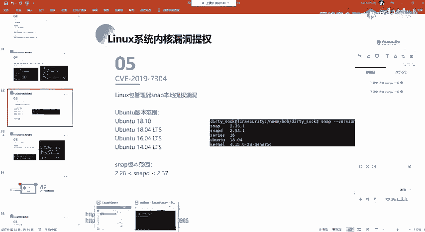

这边。就是呃在这边的话有这样子的一个靶场，就是。呃，这个就这样子的一个把机啊，这个把机的话这个把机的话是一个就是linux，就它里面的话有。呃，很多的这样子的一些就是。呃，配置它的一个权限配置啊。

以及对应的这样子的一些服务的一个漏洞。我们可以去利用它去进行进行一个提悬。然后在这边的话，它这这个把件里面的话，正好有这样子的1个SNAP啊。

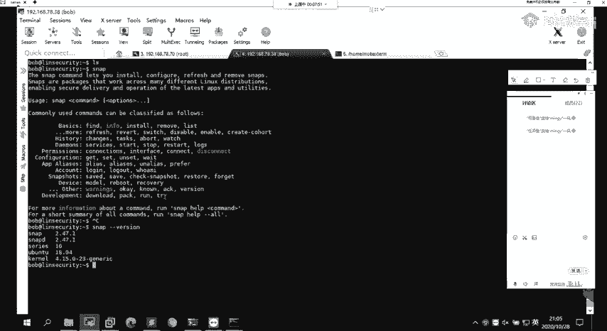

哎。就正好有这样子1个SNAP的一个服务啊，其实这关于这一个服务它的一个信息，对吧？我们怎么来？我们前面的话就是通过前面的这样子的一个脚本嘛，对吧？

同样的它会去就是获取到系统上面所运行的这样子的一些服务，它的一个信息嘛，对吧？然我们针对这一个服务，它的一个版本，对吧？去检锁对应可能存在的这样子的一些提全的一个漏洞。

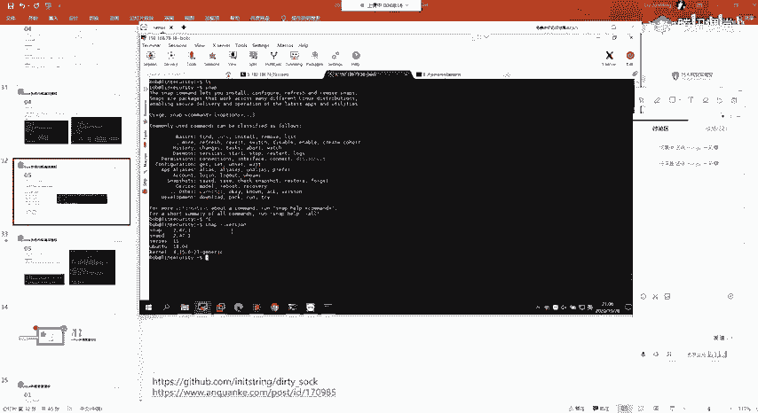

然后在这边的话。呃，在这边的话。如果大家有去下载这个呃下载这个靶场去玩的话，在这边会有一个问题啊，就是用这1个SNAP的这个提群的话，呃，你在这边的话。大家可以看啊，我这边的话是2。47。1，对吧？

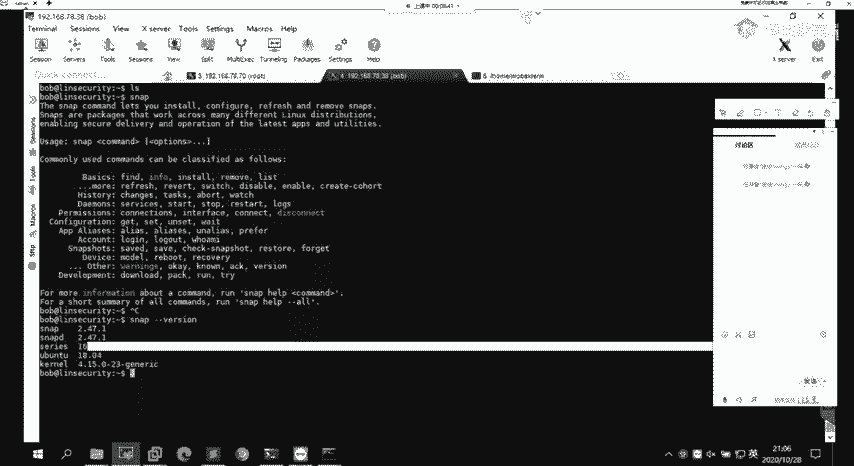

然后在这边的话，其实实际的话，你刚进你刚启动这一个靶场的话，它是1个2。33。1的这样子一个版本。就是这一个漏洞，它的一个影响范围的话是这秒2。28到2。37的这样子的一个范围。

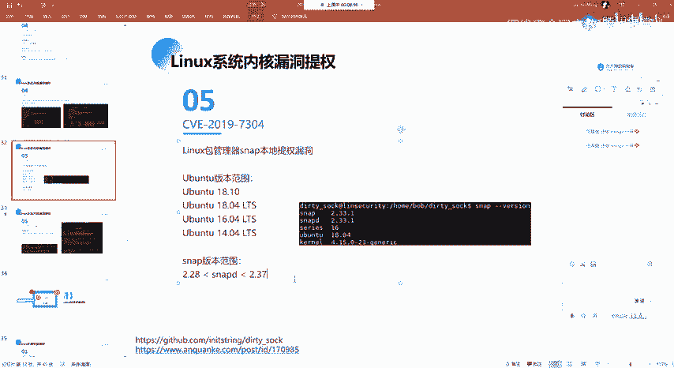

然后他在这边的话，他会有这样子的一个问题，就是。我这边的话，我这个机器起起来，然后的话我这边能够去联网的话，对吧？它会去自动的去更新这1个SNAP。就是他会所以的话在这边的话，我这边的话已经放了一会儿。

然后我这边也可以去领网。所以的话它这边的话，它自动的把这一个就是它的一个版本做了一个升级，把它升级到了2。47的一个版本。所以的话它这边的话是不存在的，就不存在了这样子一个漏洞。

然，大家。就是记得打个快照。就你启动之后的话。Yeah。

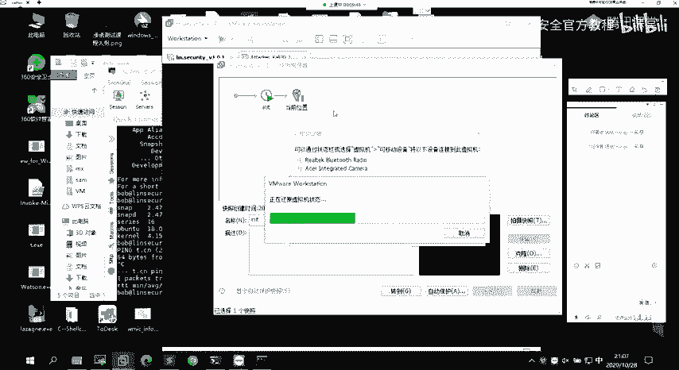

啊呃这边的话才是他。真真正的一个版本就是就是它初始的一个版本是2。33。1。然后的话这一个版本的话正好是处于这一个提权漏洞的一个范围的。

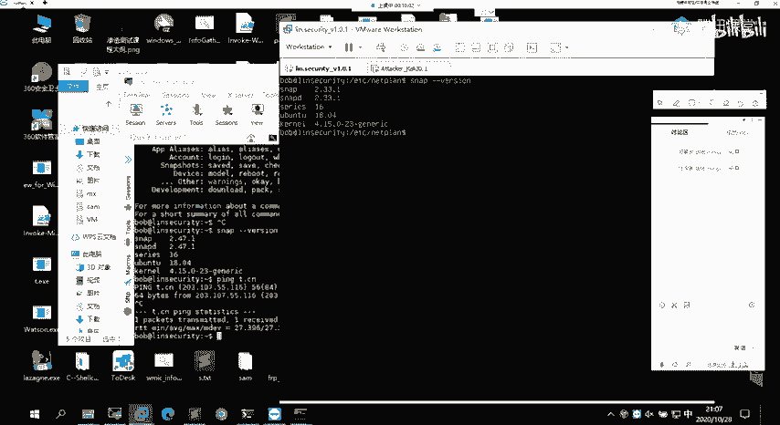

以及在这边的话呃，就是。

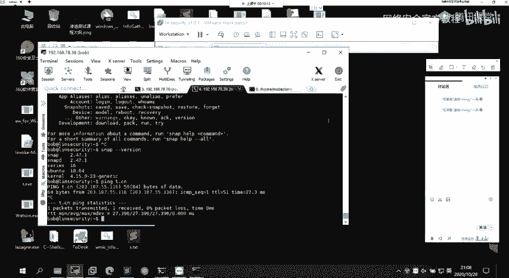

Okay。就是在这边我们去利用这个提群，去利用这个漏洞的话，这边有这样子一个脚本，对吧？你执行这个脚本之后的话，它就会去触发它的一个更新。就是你执行这个脚本之后的话。

它就会去去更新去更新这1个SNAP然后的话。

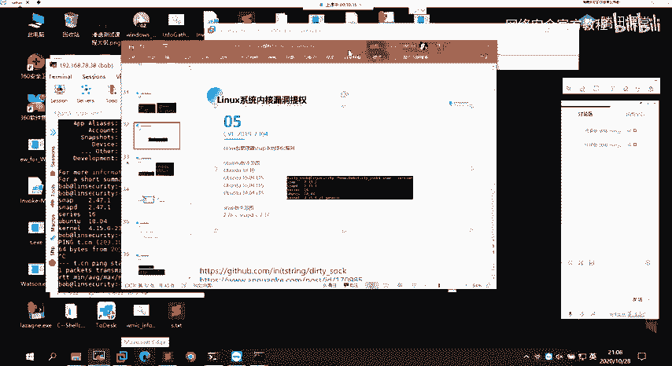

就是你利用之后的话，你的这个SNAP的话，它就更新到了一个新版本。也就是说你利用之后的话，它你还你想要去再去利用的话，那么是利用不成功了也，会因为它那个版本的话做了一个更新啊。这里的话是呃给大家提一下。

大家可能如果自己去做的话，碰到相应的一个问题。然后这边的话呃它影响乌班图141618的这样子的一个版本。然后这一个把机的话，正好是1个18。04的1个把机。

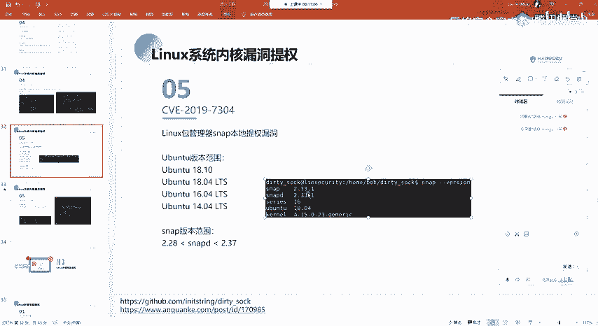

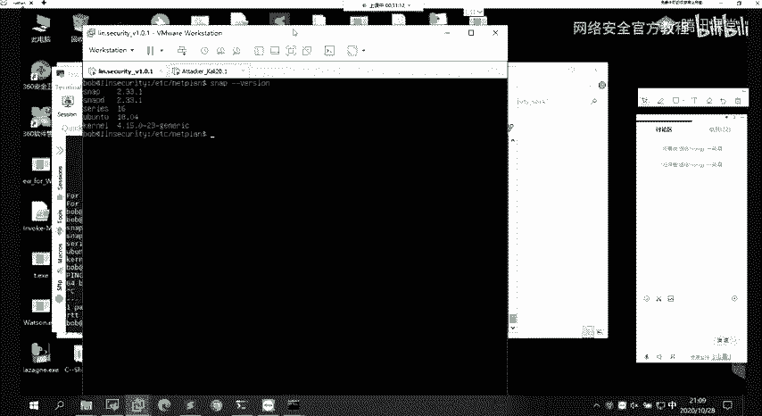

嗯。在这边的话。呃。在这边的话。

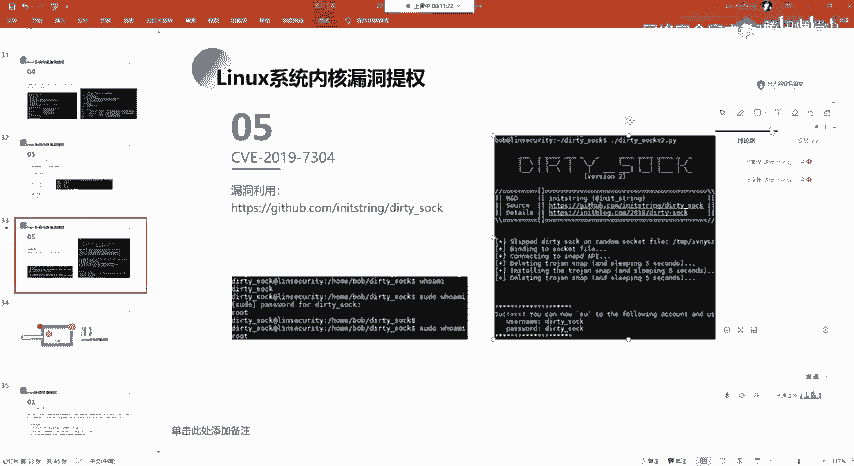

我们先看一下效果吧，就是我这边看一下我这边的一个截图。然后的话我给大家就是大家看一下这边的这个get upub吧。嗯。

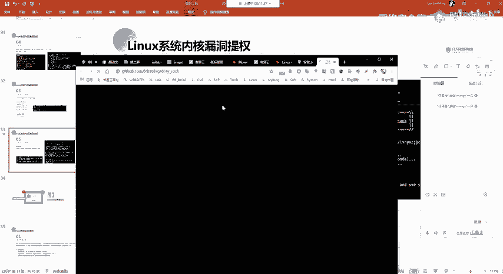

然后这边的话是呃这个漏洞作者，他给出来的这样子的1个E叉P是吧？然后在这边的话，他给了两种方法，就是两种利用这样子的一个漏洞的一个方法。然后呃方法一的话。

它是就是它需要有这样子的一个就是1个SSH的一个施钥。Oh。我们可以通过这边的这一个。这样子的一个你去创建这样子一个账号，然后的话你去创建一个这样子的一个私钥，然后它会有这样子的一个邮箱。

然后你可以通过这样子的一个脚本来去指定我们的这边的一个生成的这个私钥，然后的话就能够去得到一个信要。🤧嗯。然后第二种方法呢就是通过它的这样子的一个脚本。通过这个脚本执行之后的话。

它会去创建这样子的一个呃dty杠sck的这样子一个账号，密码也是dty shock。然后的话这一个账号的话，它其实就是一个有root权限的这样子的一个账号。

然后我们可以通过这个账号登录这个账号来去得到一个root的一个权限，也就是达到一个提全的一个目的。呃，这边的话我。

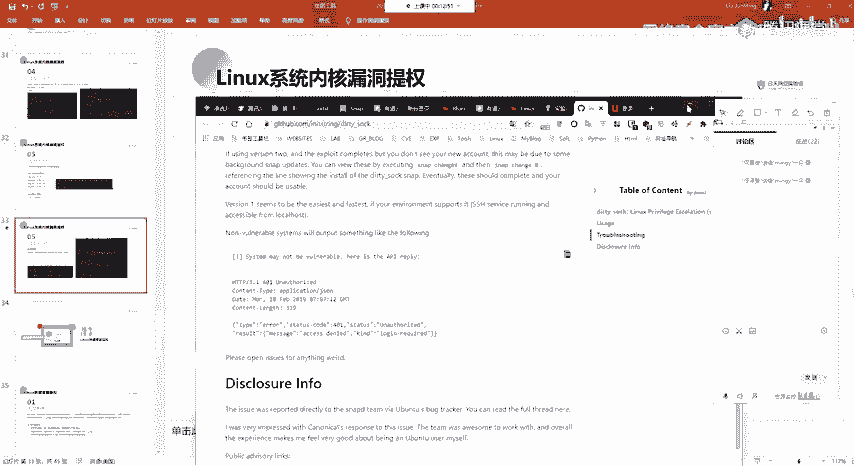

演示一下第二种吧，就第一种的话，因为稍微有点复杂，就操作的一个步骤的话比较多。那个的话打留给大家自己课后去进行一个尝试。

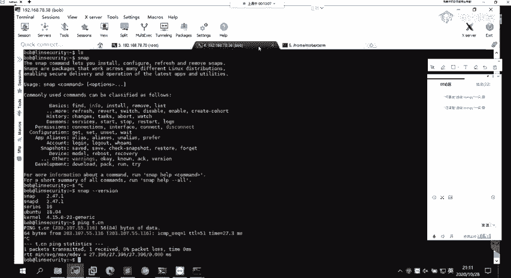

。あ。

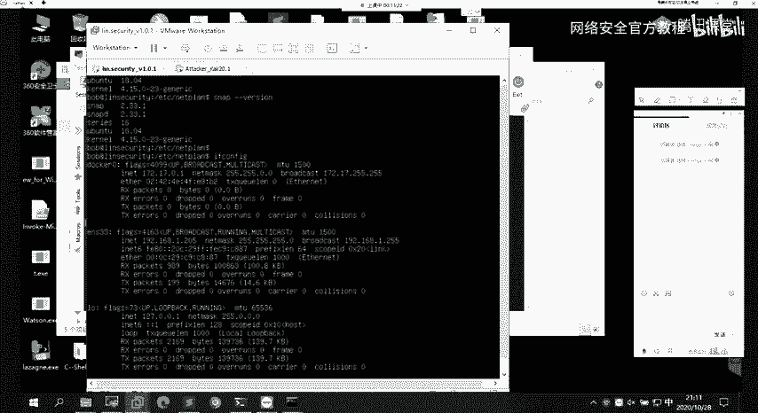

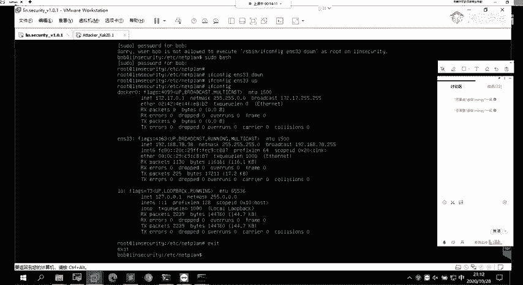

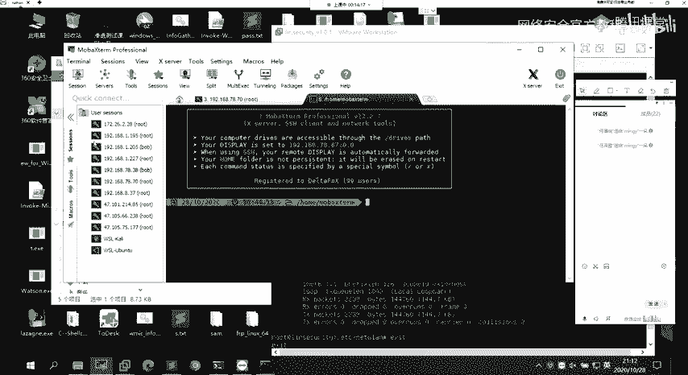

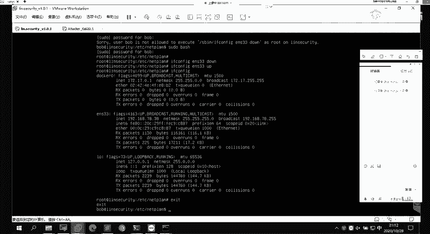

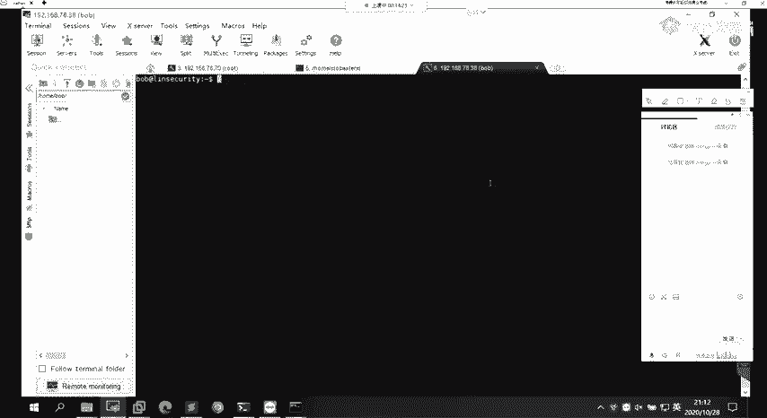

然后呃这边的话是这个把赏号是给了你一个普通用户的一个权限。啊，然后的话你基于这个普通用户的一个权限，你在这个把机上面尝试去进行一个提群。在这边的话，我们就通过前面的一个信收阶段。

发现有这样子的一个呃可以去利用的这样子的一个漏洞，对吧？我们找到这样子的1个E叉P。找到这个E叉P之后的话，我们只需要就把这个EXP上传上去嘛，上传上去。

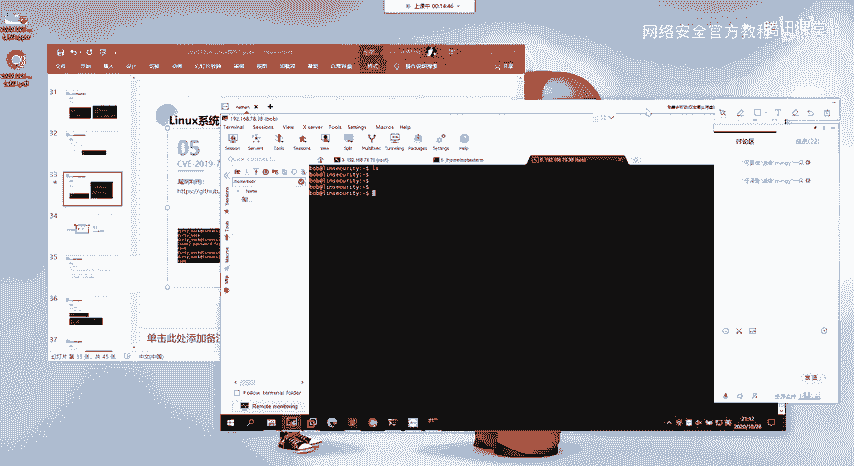

责的话已经。下载好了。嗯。扩过来扩过来之后的话。你去执行。执行之后的话可以看到这边的话就是success，对吧？就是然后的话有了这样子的一个gety socks。我们可以CT一下。错的。啊。

我们在这边的话可以看看到有了这样子一个用户，对吧？然后这个用户的话，其实我们SU。不什。然，这里的话我们可以登录进去，对吧？登录进去之后的话，我们可以执行一下外卖。IDID这边的话可以看一下。

你输入ID之后的话，在这边它是这样子的一个它还是一个普通的一个那个当时在电话有了一个这样子的一个收对。然后我们在这边的话，我们就可以通过收度。来去执行一个。对吧来去执行命令。啊，我这边搜度或外麦的话。

我当前的话就是root。因为我是通过搜度的一个呃方式。呃，大家知道收度吧，就搜度的话就是呃我们可以通过收度来去得到一个。啊，就是。来去暂时的去得到一个露ot的一个权限。就。如果你的这个用户的话。

你允许去通过收度来去执行命令的话，那么你就可以通过收度来去啊执行啊以root用户的一个权限去执行相应的一个命令。像比如说我这边收度货卖，对吧？就是一个ro。然后我这边比如说我要去ca成一下这个。

下载文件对吧？可以看到我当前的话是没有权限去那个。但是我这边的话我可以通通过收据。还去执行这样子的一个cat。这样当前的话就能够去读取这样子一个需要的文件。然后这个需要的文件是只有root存用户。

他才有去权限去进行一个读取的。这边的话我们的一个。提群的话就已经成功了。这边版本还没变。

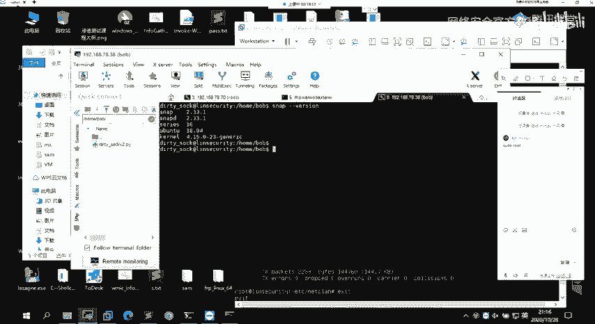

这是这这个提拳漏洞的一个效果。啊呃，大家关于以上两部分的话，有没有什么疑问，有没有什么问题，应该没有什么问题吧。都是呃比较简单的。比较简单的一些东西。有问题的扣一，没问题的扣2。🤧。啊。

应该是没有没有什么问题啊。呃，第三部分呢就是linux的一个环境变量提取。就我们前面的话有大概的有介绍一下是吧？然后在讲这个之前的话，我们先来看一下就是。什么是环境变量？

也就这一个link下面的一个pass环境变量。这个pas的话是linux，还有这种内unux操作系统中的一个环境变量。屁。它呃指定存储可指定程序的这种所有并，还有S变的一个目录。

然后当用户在去终端上去执行任何这种命令的时候，他会通过这样子的一个pass变量来去响应用户执行的一个命令，然后向需尔发送请求来搜索可执行文件。

然后其实这一句话就是我刚刚给大家介绍的这样子的一个pass完境变量的一个作用，对吧？这这一个的话大家能理解吧？就是呃我们通过。大家可以在lininux系统下面去执行这样子的一个。呃。

apple然后加一个。呃，多了福加1个PAATHpa，然后你就能够去输出这样子的一个pas的一个黄金变量，输出这一个变量。然后再这的话就是它的一个记录的一个值。然后其实这边记录的一个值的话。

我们可以看一下，就是它是以一个冒号作的一个分格。然后每一个冒号的话，它是一个这样子一个目录。对吧像U着 local S病像这里的话呃。

前面的话讲定历史的时候相关的讲历历史相关的一些啊木结构的时候有介绍对吧？像SB的话，就是你的一个就是呃像这种root用户，他就有权限去进行一个执行它里面的一个命令，就是高权限的一个用户。

然后在这一个目录下面存储的一个命令，它才能够去执行。然后像并的话，就是你普通用户也可以去执行这里面的这下面的目录下面的一个可执行程序，对吧？还有U bin啊，U则 bin啊 bin等等的这样子一些目录。

然后这边的这一些目录的话，就是当我们比如说我去执行。呃，一个。Yeah。执行1个L的一个命令，对吧？我这边执行LOS执行这个L命令的话，它会去列出这边的一个内容，对吧？那么在执行这个L命令的时候。

它中间它是怎么去找到的呢？我们可以看一下，通过where来去查找这个L的一个文可定程序所是所在的一个目录，对吧？它是在这个BL的一个目录下面。然后的话就是当前的话当前是一个普通用户啊，对吧？

普通用户的话，他去执行LOS密的话，他是会在这个目录下面去进行一个查找。那么这个目录的话，他是怎么去找到的呢？就是在这个呃pass环境面量当中去找到的对吧？

他要去一个一个目录去紧锁紧锁紧锁这一个目录下面，它是否。能够去执行这样子1个L命令，对吧？以及是否有这样子一个命令。然的话直到找到在这边呃这个并目录，对吧？他找到这个并目录下面的话。

这个目录下面正好有1个L的一个命令。然后的话他有权限去执行。然后的话它执行之后的话。他就会呃返回结果给我们，对吧？这是这样子的一个，就是你去执行命令的话，它有这样子的一个过程。

🤧然后的话还有就是这个SUIDSUID的一个权限。这个SUID的话是一个特殊的一个权限。呃，我这边的话通过这样子的三句话呃，就是大概的说一下这1个SUID权限的一个作用。

就是呃我们的这个SUID权限的话，它就是启动为进程之后，它进成了一个鼠组为原程序文件的一个鼠组。我们这边的一个鼠组的话，就是我们知道我们的一个权限像比如说root。roro对吧？就是这个文件。

它是啊它的一个属组，就这个。然后这个的话是它的一个所有组，对吧？然后的话如果这个程序它是一个呃SUID的一个权限的话，它执行的话，它的一个这个进程的一个主组。也就是说它这个进程的话。

它是同样的是这个root的一个。权限。它是属于这个root的这个用户的，是吧？然后的话这个权限的话，它只能作用在二进制程序上面，就是只能去作用在我们的这种可执行程序啊。啊，其实我前面说的话。去。

不是说目录啊，就是。这种可执行程序啊，对吧？然后的话呃它是不能作用在脚本上，而且就是你不能设置在目录上面，它是没有意义的。就你只能作用在这种二进制可执行程序上面去。哦呃，执行SUID程序的时候。

这个用户将继承子行程序的所有者的一个权限。就是说我们的1个SUID的一个程序，对吧？就是有这样子的1个SUID权限的这样子一个程序，它是一个root的一个数组，对吧？就是这个程序的话。

它是属于一个root用户的对吧？然后的话在这一个用户他去执行这样子的一个程序的话，那么他的这一个执行这个程序。执行这一个程序的一个用户啊，他会去继承这边的这一个文件。

这个可执行程序所有者的这样子的一个权限。也就是这边所说的一个root。在我们这边的一个数组的话，其实就是这一个可可执行程序的一个所有者嘛，对吧？嗯。那么呃这一个权限的话，我们如何去进行一个利用呢？

就是说我们如何去利用它来去进行一个提权？在这边的话呃，首先的话就是呃我们需要去找到这样子的一个拥有SEID这种特殊权限的这样子的一个文件。在这的话，我们可以通过这个放und的命令来去进行一个查找。

这边的话其实前面也介绍了，对吧？就去查找这样子的可执行的文件，还有文件夹，对吧？然后在这边的话就是放的干就是在跟目录下面去查找它的一个权限，是这样子的一个干优。

就是它的一个优者是有这样子的1个SID的SUID的这样子一个权限的，以及它的一个呃类型上是文件，对吧？就不是说目录。因为你目录的话，它是没有这样子1个SUID的一个权限的。而且没有意义。

然后的话呃把错误的一个输出把它置为空。啊，我们通过这样子一个命令话，就能够去查找，就是说在当前系统下面呃有这样子的1个SUID权限的这样子的一个文件，对吧？然后呃我们通过执行之后的话。

在这边有找到这样子的一些程序，对吧？可以看到在这边的话有这样子的一个需要的一个文件。这个文件的话，它正好是有1个SID的一个权限。然后我们当前它是在我们的一个普通用户的一个目录下面，对吧？

就这个卡里的一个目录。呃，这个话是我做的一个这样子的一个场景，就是来给大家讲解。对演示的一个场景。然后这边的话是一个这样子的一个可执行的一个二进制程序，对吧？我们找到这个程序之后的话。

去执行它执行执行它之后的话，它返回的一个结果的话是这样子的一个东西。然后其实大家熟悉的话，就是这边它执行的一个结果，它其实就是我们执行PS的一个命令的一个结果，对吧？就执行1个PS命令的一个结果。

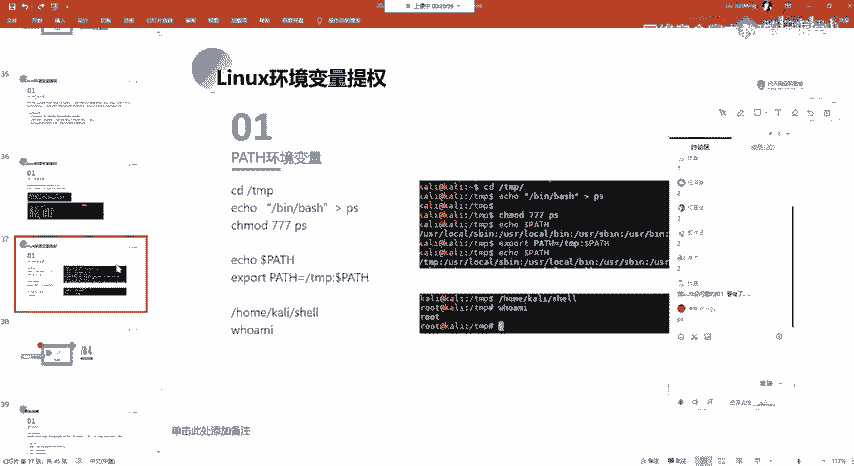

我们呃我这边的话。Okay。う。以我这边的这个机器为例。呃，我这边先切到。哪里用户啊。就我当前的话是一个卡领用对吧？一个普通用户啊后我通过这样子的一个命令来去查找。

拥有SUID权限的这样子的一些程序啊，对吧？然，我们可以看到在这边有SU。嗯。嗯，没错。应该的有这样子的SU还有。😊，呃，CHSH等等的这样子的一些命令ammount这样子的一些命令啊。

然后这些的话都是比较常见的。然后在这边的话有这样子的一个程序啊。我们可以呃通过。LL来去查看这样子的。像比如说我以这1个SU这个命令为例，对吧？你通过L去查看这一个程序。

你会在这边可以看到它有这样子的一个本来正常的话是RWX，对吧？然后他在这边的这个U的U着。也就是呃属主的这样子的一个权限上面的话有一个S的一个权限。然后这边的话其实就是它那个SUID的一个权限。

也就是这一个程序的话，它是呃有SUID的一个权限。然后我们在这边的话去执行这个SUID的话，去执行这个SU命令的话，那么它是一个root的一个权限。然后在这边的话。

我们找到有一个比较特殊的这样子的一个文件。就是这个这个对吧，它同样的也具有1个SUID的一个权限。啊我们执行。执行他执行他之后的话，他返回的一个结果，他是跟我们就执行PS之后的一个结果。

它其实是一样的对吧？呃，这边的一个区不同的一个点的话，其实是不一样的。就是我这边对吧？我这边他因为是一个普通的一个car里用户。然后你之前PS的话，它只是列出了你当前的，就我当前的话是一个伴喜，对吧？

能够去就是列出当前我所在的1个PTY。对，然后这边的话之前的一个需尔的话，因为它是SUID的一个权限。然后的话它这个文件它的一个所有的是root。然后其实执行这一个的话。

它是一个root的一个权限去执行的。也就是他这边我们可以看啊他这边的话，它执行的一个内容结果的话是比我们多的对吧？像包括SU。因为我们刚刚的话是通过SU来去得到的来切换到了这样子一个卡里的对吧？

所以的话它同样的有这样子一个。有这样子的1个PID以及有ba，对吧？P。Yeah。然后的话。我们怎么去利用它呢？就是说他这边的话，它我们可以看到这个程序它的一个功能，它的一个功能的话。

它其实就是去执行的1个PS的一个命令。但是的话因为它这边执行的话，我当前的话执行PS它其其实是以我当前的一个普通用户去执行的对吧？但他这边的话，它有SUID的一个权限的话。

它能够去继承这边的一个root的一个权限，来去执行这样子一个PS的一个命令，对吧？所以的话它它是其实是以一个root的一个权限去执行的。但是我在这边的话，我去执行这一个程序的话，是一个普通用户啊。啊。

就是我当前是一个普通用户，但是我这边执行的话，它虽然是一个root的一个权限的，对吧？但是我们无法去呃说我们无法去通过这样子一个可执行程序去得到这样子一个root的一个权限，对吧？然后在这边的话。

我们就需要去结合我们这边讲的这样子的一个黄金变量。

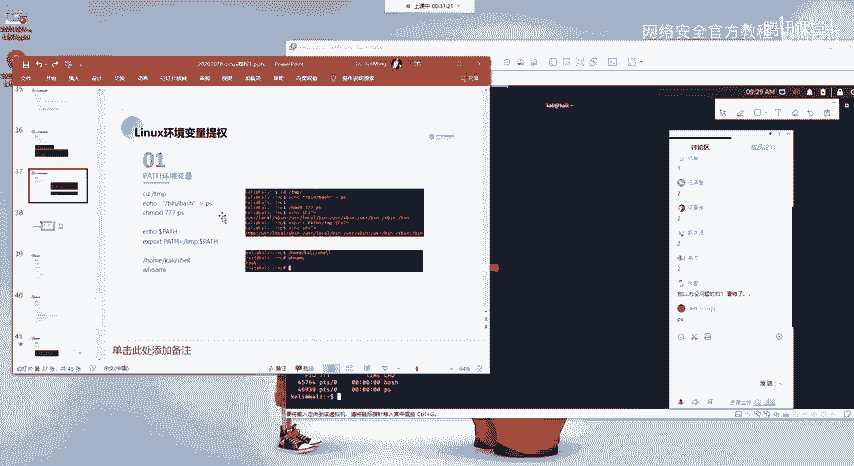

来去做一个呃这样子的一个利用它来去进一个提群。呃，具体的一个方法的话就是像这样子。呃，我们首先的话就我当前是一个普通用户，对吧？我首先呃进入到t目录。t目录的话，我们写入这样子的一个呃文件。

然后写的这个文件的话就是1个PS的这样子一个文件。然后它这个文件里面的一个内容话就是beanbsh。然后的话我给这一个程序给1个777的1个权限。因为我在time的话。

我是有权限去对他做这样子这样子的一个操作的对吧？然后下面的话就是这里的一个重点，就是我们可以通过。呃，export来去给给我们的一个pas变量去添加，去加我们的这样子的一个tamp。嗯。

去添加我们的这样子的一个就是呃可执行程序的一个目录。就这边的一个我这边的话是添加了添加了一个碳篷的一个目录，对吧？然后的话在这边的话。我们都这样子一个pass环境变的话就变成了这样这样子，对吧？

就原本的话是这样子的一个这样子的一些目录。然后我通过export添加一个这样子的一个环境变量，把这一个t盘目录把它给添加到添加进去了，对吧？然后这边添加去添加进去的一个意思是什么呢？

就是说比如说我这边要去执行L的一个命令，对吧？我这边执行L的一个命令，那么它首先他会去他会去一个一个目录去找，对吧？那么他我这边添加进去之后的话，它会去在这个t目录。

他去查找是不是有这样子个L的一个可执行程序，对吧？然后的话如果有的话，他就会去执行。然后如果没有的话，他就会一次的去查找，对吧？那么。下面的话我们。呃，再去执行这样子的一个就是说再去执行这边的一个项。

我们这边的话当前的话是一个普通用户，对吧？我去执行这样子的一个需要这一个命令。我这边执行之后的话，它是一个root权限去执行的1个PS，对吧？那么他在这边去执行这个PS的时候。

他怎么去找到这样子的一个PS的一个命令呢？对吧。他同样的也是去环境面量当中去查找，所以的话他同样的会走这样子的一个过程，就是走这边环境变量，他要去这一个目录它当中去查找是不是有这样子一个PS的一个命令。

对吧？如果有的话，他就会去执行他。然后在这边的话，我们在看屏录下面有添加了这样子1个PS的这样子一个呃文件，对吧？然后他正好的话找到了它。就在t目录下面找到有这样的一个PS文件。

然后的话他就会去执行这1个PS文件。然后执行这个PS文件的话，这一个文件里面的内容是一个beanb。也就是他执行之后的话，他会去有得到这样子的一个呃b喜，对吧？我直我直接执行拜喜的话，就建入到了拜喜嘛。

啊一个d。啊，就退出了当前的那个bash是吧？然后在这边的话就是呃可能就是正常的话，对吧？你如果没有这样子1个SUIE的一个权限的话，你只你正常的你就算去添加这样子一个环境变量，对吧？

你添加这一个环境变量之后的话，你在当前你去执行这样子一个PS命令，它去找到这样子一个目录。你得到这一个兵b，它其实也是一个你当前用户的一个权限的一个bech，对吧？就像我在这边去执行的这样子的对吧？

我这边执行之后的话，我还是一个看你的一个权限。然后在这边的话就是不同的一个点的话，就是。这边的这一个呃程序这边的这个需要程序，它是有1个SUID的一个权限。也就是我这边执行这个SUID的话。

他会去查找目录下面，它是不是有这样子一个PS的这样子的一个命令，对吧？然后的话他找到这个temp目录，找到这个t目录，找到这边的1个PS文件，他会去执行这个bb。然后这边执行编办写的时候的话。

大家回过头来看一下这边。就是他在去执行这样子的1个SUID权限的时候，就这个用户他会去呃继承这个程序的一个所有者的一个权限。也就是呃以及这边就是启动为进程之后，对吧？就你执行这个PS命令之后的话。

它同样有一个进程，对吧？然后这个进程它的一个属组是云程序程序的一个属组，也就是它是一个root的一个权限。就呃总结的来说的话，就是我这边执行这执行之后，执行这个命令之后的话。

它会以一个root的一个权限去执行这边的1个PS里面的一个内容，也就是这一个beb。所以的话我们最后的话就能够去得到这样子的一个root的一个b。因为执行这边的这个ba学的这个进程的话。

它会继承这边的这一个root的一个权限。所以的话我们就能够去得到这样子的一个root的一个权root的一个需。也就是达到了这样子的一个提全的一个目的。

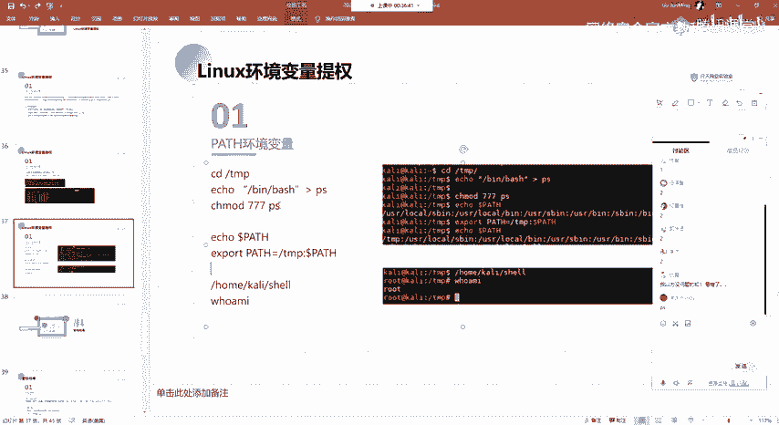

我们呃。实际的来看一下。啊，我。这边的话我先到探门目路，对吧？呃，我这边的话。写一个这样子的一个。文件。把我们的1个PS文件当中。然后其实。呃，我们给他1个777的一个权限。

然后我这边去执行这个PS对吧？其实执行这个PS的话，你就是执行了一个这样子的一个半型嘛，对吧？我可以existex了之后的话，就退出了当前那个bu系对吧？呃，可能这样子不是很明显，我这边改一下吧。

我改成SH吧。啊，我这边执行这1个PS执行之后的话就得到了1个SH。这边当前的话是1个SH。我这边个exist。退掉。但是的话我我当前的话是一个普通用户，对吧？我一个普通用户，我去执行的话。

它还是一个普通用户的一个需要嘛。那么我当前的一个pas的一个环境变量，我们可以来看一下。是这样子的一个呃记录记录的一个值，对吧？然后在这边的话。

我们可以通过export来去添加这样子的一个去更改我们这边的一个行线变量的一个值。🤧Yeah。诶。🤧Yeah。然后其实这边的话就是呃更改了这样子的一个pas的一个环间变量，对吧？

为这一串这边的这一串的话，就是其实就是前面的这一串嘛，对吧？然后在这一串前面的话，我们加了这样子一个tamp，以一个冒号做一个风格，其实就是在这一串前面加了这样子的一个tamp冒号。

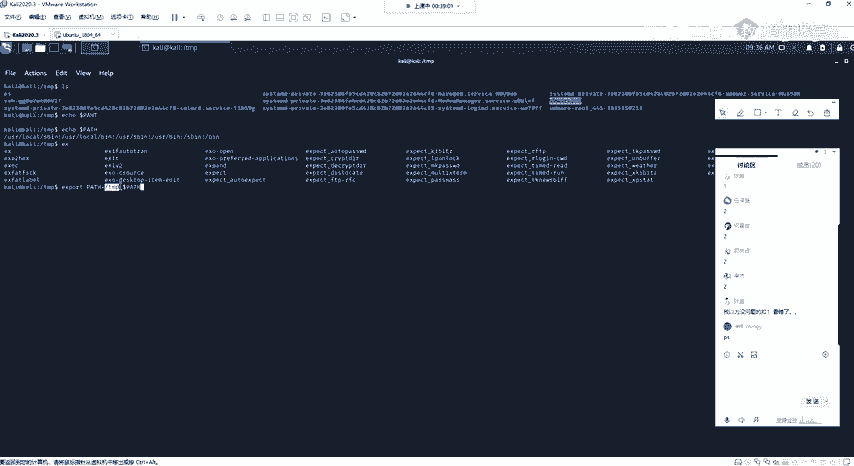

也就是添加这样子一个t盆目录嘛，对吧？看一下应该。

没写错啊。Oh。没错。然后我再艾一下黄金面料，然后它就变成了这样子，对吧？😊，也才这样子。Yeah。那么我当前我去执行PS对吧？你会发现。你会发现我进入到的是一个呃线，对吧？

我当前执行我执行PS我进入到了一个。SH的一个线是吧？它不是它不是像我之前去执行一个嗯。不是像我之前对吧？我直接执行的话，它是一个返回这样子的一个内容吧？然后我在这边的话。

我执行的话就得到了1个SH的一个限。但是我这边得到了1个SH需的话，是一个普通用户的啊，其实其实就是我这边执行密令的话，他在这一个time幕下面去找到了这一个文件，对吧？然后的话执行了。

然后在这边的话就是我们结合这边我发现的这一个。这个拥有SUID权现的这一个程序，对吧？那么我在这边去执行之后。你会发现。我这边执行之后的话，它同样都进入到这样子的1个SH的一个选，是吧？

但是不同的话是我这边执行换卖。你会发现的话我这边是一个root的一个权限，就不是像。前面这边是一个呃当前的一个开你的一个普通权限。是吧外卖你我这边呢。😊，就得到了这样子的一个root的一个权限。

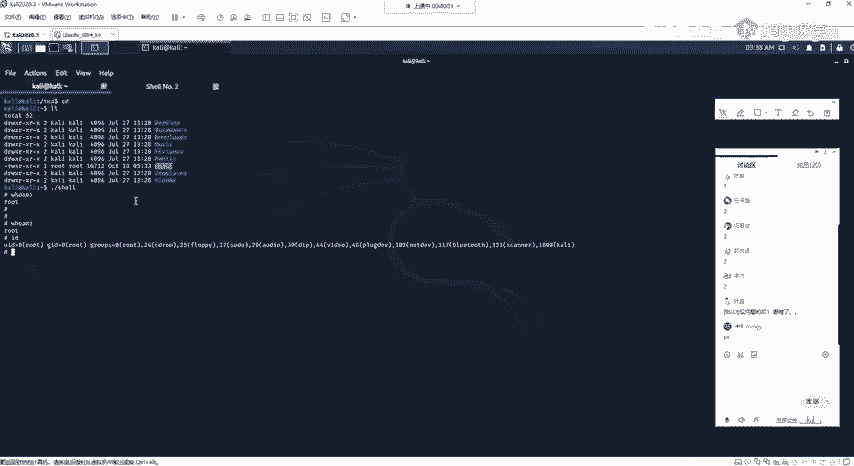

呃，也就是通过这样子一个方法达到了这样子的一个提群的一个目的。就利用利用的是这样子的，他的这个SUAD的这样子的一个权限。以及结合我们这边的一个bs喜的一个环境面料。就是整好的话。

它的这1个USEID权限的这一个程序，对吧？就是他想要让普通用户，让普通用户也能够去执行，就是漏ot用户的这样子的一个命令，对吧？就是他写了这样子的一个呃可执行程序的一个就是二进制的一个程序，对吧？

就是他其实他原本的一个目的是想要让普通用户去执行这样子的一个呃谢尔之的话，能够以root用户。的一个权限去执行对应的一个命令啊。然后的话他在这边的话就。存在这样子的一个问题，我们可以利用它。

的1个SUID的一个权限，以及结合我们这边的一个环境面量，来达到一个提全的一个目的。

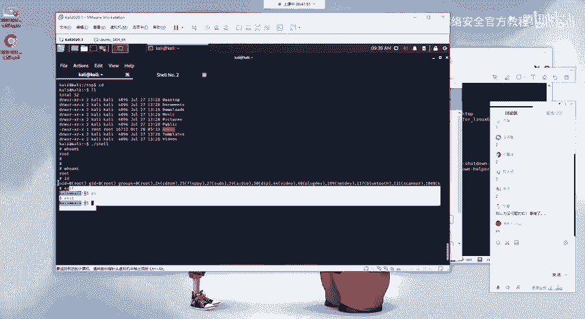

这边的话就是呃一个环境变量提全的一个例子。以及呃第四个的话就是。密码発信。密码哈希的话，其实呃我们就刚开始讲就说提群的时候，就有提到就是通过密码的一个方法来去进行一个提群，对吧？就密码的一个方式。

账号密码的一个方式，提群是最直接最简单直接的一个方法对吧？如果你知道了对应的一个呃用户的一个密码，那么你就能够去得到它对应的一个权限嘛，对吧？然后在这边的话就是呃介绍就介绍一下密码哈西。

其实就是这样子的两个文件，就这1个ETC的1个password以及这边的1个ETC需的的一个文两个文件。呃，这个的话就是前面已经呃比较详细的有介绍了，我这边的话我就不多说了。

就前面在讲那个linux的一个。呃，信息收集的时候，对吧？去收集我们的这样子一个用户的一个信息。就有有给大家介绍啊。嗯。然后这边的话呃我就大概的说一下，就是这两个文件它的一个特点。

就是这个ETC的1个pasword的话，它是所有用户都可以去查看的。然后它是存储着所有用户的一个信息。每一行的话，它代表一个用户，我们可以。比如在这边是吧，我catETC他word。开始之后的话。

在这边的话，它就有这么多的一些内容，对吧？它这边的话都是存储着用户的一个信息。每一行的话代表着一个用户。然后呃。🤧每一涵他的。每一行它所存储的这样子的一个啊内容代表什么意思的话，就是我这边写的。

我这边话我就不说了呀。哎，前面已经有介绍过了是吧？然后呃第二个的话就这个ETC shot的这个文件的话，它是只有root用户能够去查看的。它保存加密后的一个密码和用户相关密码的一个信息。

然后同样的也是每个用户一行。好。Okay。然后的话就是。然后的话就是我们如何去进行一个就是说还去进行一个利用利用它呢？就是呃我们原本的话就是我前面有说，对吧？

就是ETC password word这个文件的话，它里面它是不存在，就是它没有存放我们的这样子的一个呃密码的一个哈希值的。就是说它的一个密码的一个哈希值，我们可以看一下像root，对吧？

然后后面的话有这样子的一个X这样子的一个就是站位符。这个X的话就是表示的就密码的一个哈西子。它这边X的话，它呃就是。呃，它原本的话是存放着这一个密码，这个用户对应的一个密码的一个哈希值。

但是后面的话就是啊为了安全的一个考虑。因为这一个文件的话是所有用户都能够去查看的对吧？那么如果你得到了一个普通用户的权限。然后的话你查看这个文件的话，那么你就能够去得到它对应的一个哈希子，对吧？

那么你得到他的一个哈希子的话，也可以去尝试做一个解密，就是有可能能够去解密出来，它的一个铭文的一个密码。🤧。对吧。然后的话呃它实际的话实际它的一个密码雷卡西的话，它是存储在这样子一个s的的一个文件当中。

对吧？那么在这边的话，我们通常的话也会去查看这样子的两个文件就是。这一个呃password以及消消的这两个文件，对吧？然后通常的话，你想要去印证，就是你的一个用户，他是不是有root权限的话。

就是呃就是我这边的话就最简单的一个方法就是你去ca一下那个s的一个文件，对吧？如果你能够去查看的话，那么你就是一个root的一个用户吧。你今天可以去CD一下root的一个目录，是吧？然后呃在这边的话。

呃。在这边的话，我们去因为我们是一个普通用户，对吧？我们可以去有权限去查看这样子的一个呃ETC的1个password。那么我们在这边的话，我们呃以这一个。だれ。

你这边的这一个。

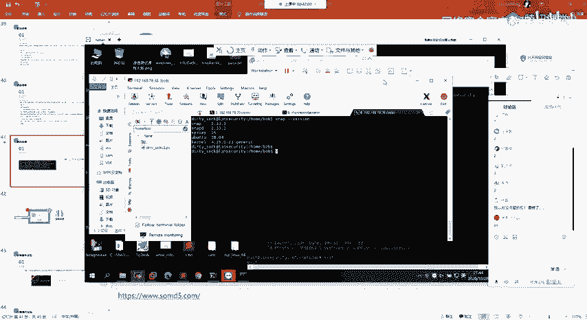

把字酝酿。不真实。啊，你你可以发现啊就是对吧？原本的话它是2。3。1的这样子的一个版本。然后你过一会儿的话，它会自动的去升级到2。4。7的这样子的一个版本。的话，我如果我现在我。再去进行一个利用的话。

是利用不成功的呀。这点的话大家要注意。然后在这边的话，我以这一个榜机为例啊，对吧？我们去收集它的1个ETC的1个pasword的一个信息。其实如果你用脚本的话。

就是用我们前面的那个信息收集的一个脚本的话，也同样的能够去就发现啊。呃，以及在那个脚本当中的话，他还会有。呃。

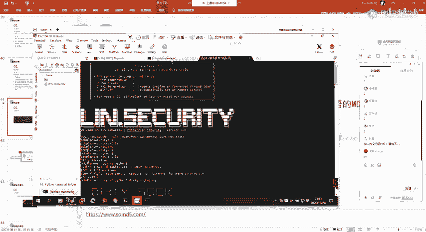

啊，关掉了。就是你去认真看你在这个把这上面你去执行那个脚本的话，它会就列出来。就是像比如说在这边对吧？我这边查看这1个ETC password word这个目录，然后我去查看这边有的这样子子的一些用户。

对吧？然后像比如说在这边。就有一个这样子的一个用户，对吧？这个用户的话可以看到跟前面这一些的话，它有不同的一个地方。就是在这边原本第二位他是一个。呃，就是正常的话是一个普通的。

正常的话是一个X的这样子一个站位符，对吧？就是它的一个密码哈希，它不会在这边的。然后在这边的话，它是它的一个密码，哈希，就是写在了这边，以及他它有这样子的一个特点。就是它是一个root的一个权限。

我们可以看到它的这边的1个UIDGGID的话是为0。前面的话有讲就是你只有root用户的话，他的1个UID以及GID它才是为0。也就是如果你的一个用户，你的1个UIDGID为0的话。

那么你的一个权限它就是一个root的一个权限。就呃就linux它会通过这样子的一个呃UIDGID来去标识来去就是。就是来去标识你嘛，对吧？就是能够呃通过这边的这一个内容来去判断你的一个权限。

然后在这边的话，它的一个哈哈希值的话是这边。那么我们得到它的一个哈希值，对吧？我当前是一个普通用户，我都能够去看到了，我可以去对他的一个哈希值尝试做一个解密啊。

这边的话要付费呃。我通常的话是就是用这两个就是CMD5，还有这1个COMD5。

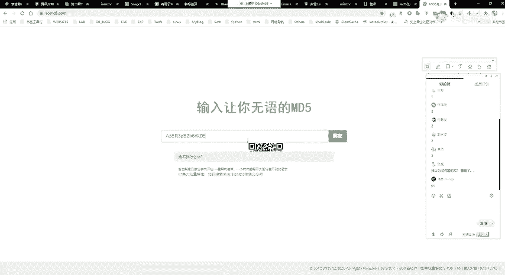

就其实呃挺多时候的话。

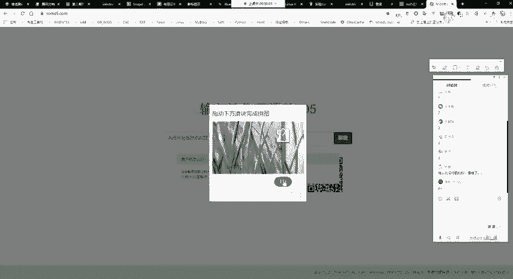

这个COMD5要还要好用一些。当然的话你这边的话，你要是呃。你付钱的话，那那么肯定这一个要好用一些啊，这个的话。然后这边这个的话是这个SMD5的话，它是就免费的嘛，就不用钱，而且就是能查出来的东西的话。

也是跟这边的话呃，我个人感觉的话是差别不大。然后这的话我们就解除了他的一个账号密码，对吧？就这个。

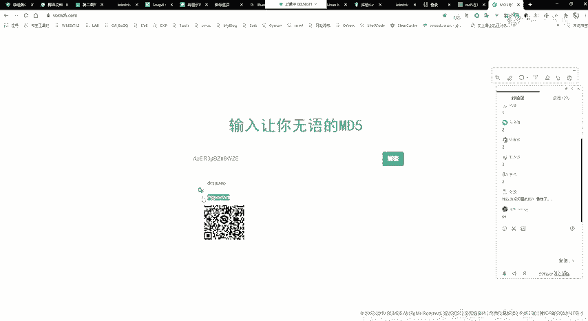

那么我们就可以通关使U。来切换到这样子的一个。还有11。这样子的一个用户，对吧？呃，他的一个需要的话是变SH，所以是这样子的啊我们可以执行一下换卖，可以看到当前的话是一个root的一个用户啊。

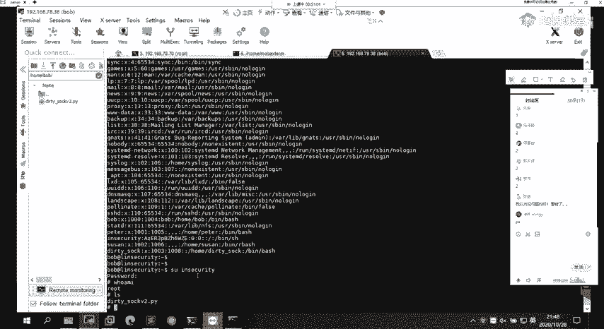

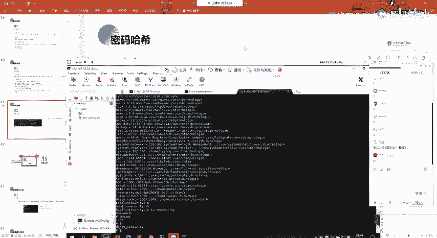

这是这就是通过这样子的一个呃密码哈希的一个方法，就他那个密码哈希的话，它是。存储在这样子的一个呃文件当中。然后其实呃我们在linux当中，对吧？我们想要去添加这样子的一个后门的一个账号，对吧？

然后想得到一个root的一个呃用户。然后的话你留这样子的一个你可以去留这样子的，通过这样子一个方法，就是给这一个普通用户给1个UIDGID为0，你就能够去得到这样子的一个root的一个呃账号啊。呃。

以上的话就是我们本节课的一个所有内容啊。呃，最后这边的话就是呃两个提全的一个实验，就呃包括这个呃张留的一个提全实验，以及这一个无关图的一个本地提全的一个实验呃，给大家做一个课后作业。

以及呃还有的话就是啊同样的PPT上面的内容啊，大家自己动手去做一下。然后呃就是课后做的话就是两个嘛，就是这两个实验以及PPT的一个内容，大家自己动手去操作，好吧。然后呃，大家有没有什么疑问？呃。

今天的话。今天的话呃。因为喉咙确实有点难受啊，以及有点咳嗽。就我个人感觉今天确实没讲好，就大家。就我自己都讲的有点难，我自己都觉得讲的不是很好啊，今天。这边的话哎喉咙确实有点有点难受。讲话都有点。

就是卡着对吧？就是呃希望大家尽量好吧，这边的话说声抱歉吧。应该呃今天的内容的话，今天内容的话不是很多。Okay。W。这个。我就是卡稍喂卡稍喂。去年去年这个时候也是好像也是。然后喉咙哑的话是。啊。

确实这样子连续给大家讲课，有点顶不住啊。主要一讲没得填，一讲讲一两个小时。然后呃有问题的话，在讨论区扣一，没问题的话扣2吧。🤧嗯。こ。

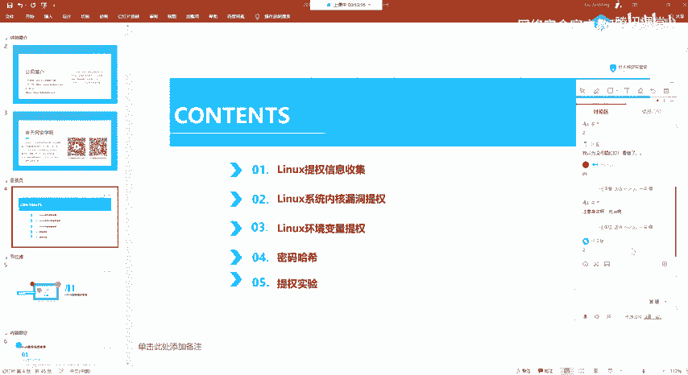

Okay。🤧嗯。哦，应该是没有问题的。然后PP的话已经发给大家，好吧。

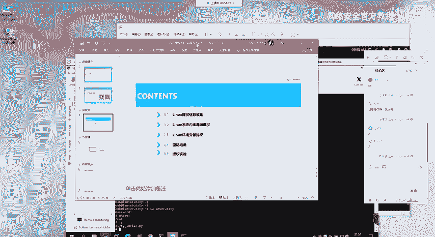

那么没没有问题的话，那么我们下课吧。好吧，大家早点休息。