# B站最全网络安全教程，整整1300集，全程干货无废话，别再盲目自学了，看完学不会我退出网安圈！（web安全｜渗透测试｜内网渗透｜CTF） - P97：96. 第四十六天：Linux定时任务提权、SUDO权限滥用.mp4 - 网络安全官方教程 - BV15u4y137cQ

🎼He。🎼也直。🎼战场。🎼Okay。那我一。🎼我有。🎼再也不怕失去。就这样。😊，🎼我。🎼要像往常一样。😊，🎼不远找借口。🎼不用找理由。🎼The。🎼你用的这些格糟的话，我早都结过。😊，🎼别为。

🎼也偏逼我说透。🎼我都要看着你怎么能像个理说。😊，🎼被合想的叫错。🎼う。🎼像一个歌漩涡。😊，🎼先别说你懂。🎼只要你扮演我。😊，🎼你才不明白我。😊，🎼感睛霹雳尽动。🎼Yeah。🎼只有那。🎼。

🎼你也向过往离找。😊，🎼之后。😊，🎼又怎样？😊，🎼Yeah。🎼还不是跟我装想。🎼And。🎼要你。🎼不片。🎼心里不这么想。😊，🎼你用的这些可教的话我。😊，🎼不见过。🎼和你。🎼不太阳能驱散我。

🎼我倒要看着你怎么都下个铃车。😊。

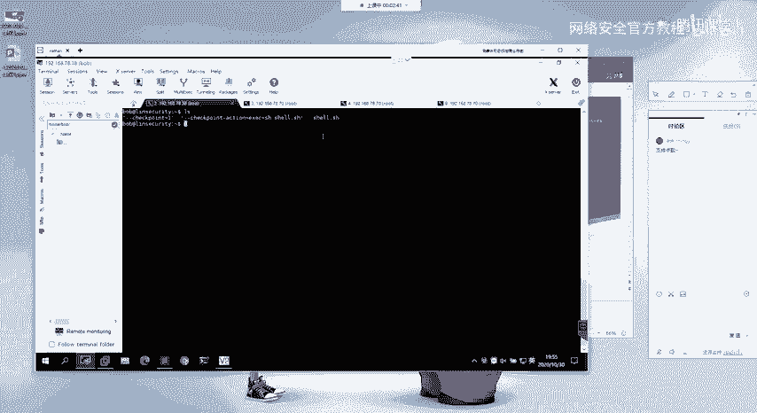

🎼没落想的交错。😊，🎼下一个歌漩涡。😊，🎼先别说你懂。🎼只要你扮演。😊，🎼你才不明白我。😊。

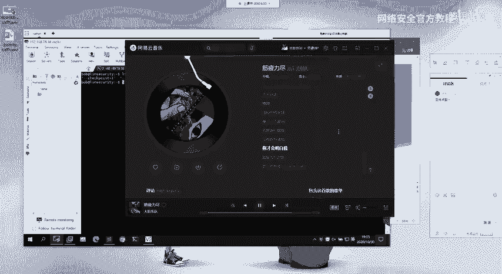

🎼筋疲力尽到。

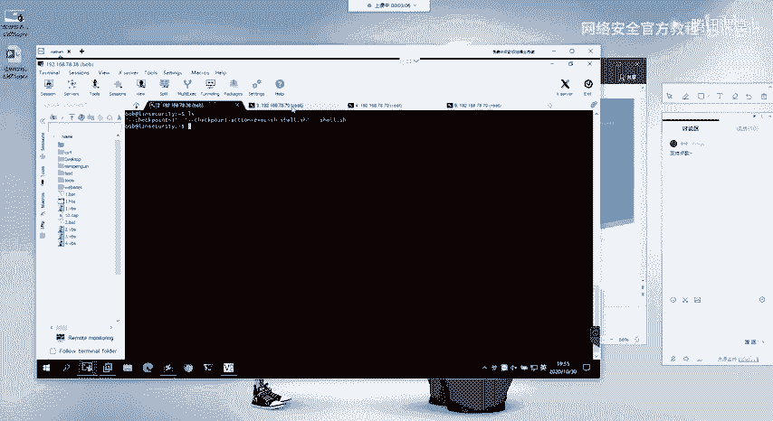

🎼。Yeah。🎼Yeah。🎼你快递。🎼滴滴答滴。🎼滴答提是。🎼你快。🎼是我法是我。🎼爱情是。🎼你可以给。😊，🎼这世で。🎼泪是。🎼你还。🎼是我猜是我。😊，🎼我类似爱情。😊，🎼你。

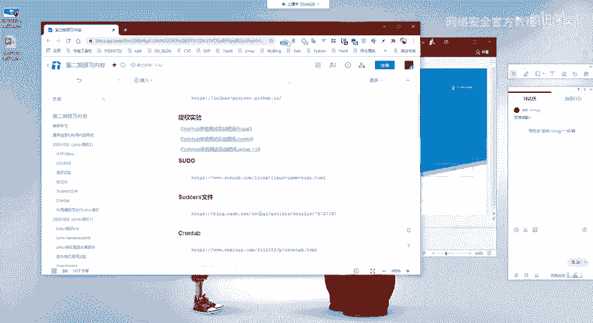

🎼滴答听听答听听答听说。😊，🎼那一场雨。😊，🎼我说。🎼全你最。🎼爱的只是。😊，🎼该继续在咫气中排空。🎼却。🎼我说过。🎼可以想了解。🎼就法出摸。🎼，🎼爱就是爱不爱就不爱。😊，🎼か。🎼一想忘记。

🎼And the。🎼Yeah。🎼你快听。🎼滴答滴。🎼的底是。You。🎼Bababy。😊，🎼Yeah。🎼Yeah。🎼一你。🎼皮图。🎼一选次。げ？え？🎼是。🎼来个。You。🎼下。How are you。

🎼Oh喂。はい。🎼如此。🎼旧里。🎼遗憾。🎼，🎼，🎼爱里。🎼何给。です。🎼月。🎼Yeah。🎼爱你。すげ。🎼Yeah。Yeah。🎼The？

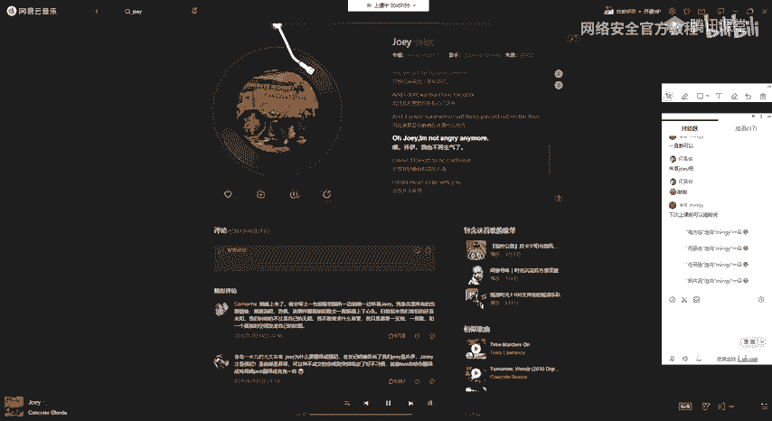

hello，大家晚上呃，能听到我声音的，以及我的声音没有杂音的话，在讨论区扣个一。然后下次大家想那个就是等待时间，想听歌的话，就是您可以提前在群里说，好吧。就。不呃。这位同学点了这首歌的话。

因为时间光下就听不完了，好吧。然后呃现在的话已经8点多钟了，应该就是能来的应该都来了。那么我们正式开始我们今天的一个课程内容。今天的话呃同样的跟上节课给大家介绍的同样的内容。

就是linux的一个系统提全。嗯。啊，本节课的话主要呃分为了4个部分。第一部分的话就是滥用的一个收度权限。第二个的话就是lininux的一个电时任务的一个提全。

第三个是SUID这一个特殊权限的一个提前提全。第四个的话就是其他的一些提全的一个呃实例。第一部分的话就是滥用的一个收度权限。就我们前面在讲linux的时候，对吧？呃，以及前面再去。呃。

与提前与提前相关的，就说就是说在lininux下面，我们以一个普通用户的一个权限要去执行。呃，比如说要去启动一个服务，对吧？以及比如说你要去执行一个像呃if confi这种命令。

如果说你是一个普通权限的话，它可能就是有限制你的一个执行，就是你没有权限，没有相应的一个权限去执行这样子的一个命令，对吧？所以说我们通常的话在linkux系统下面的话，通常会用这样子的一个收度命令。

对吧？这个命令的话，大家应该都熟悉，就是呃经常呃玩lin的话，对吧？然后这边的这一个收度的话，就是它是linux系统的一个管理的一个指令。主要的话它就是用来就是呃允许我们的一个系统管理员。

让普通用户去执行一些，或者是说全部的这样子的一个rootroot命令，它是一个呃工具。就我们可以简单直接的理解，就是它是一个呃link上面的一个提全工具啊。然呃这个命令的话。

它的一个执行流程就是大家可能就呃就是经常用这个，对吧？但是你不知道它是它实际的一个流程它是怎样的对吧？这边的话我们来一起了解一下，就我们执行这个收度命令的话，它会呃将当前的一个用户。

它会转换成一个root的一个用户。然后的话以root的一个身份去执行一个命令，然后执行这一个命令之后的话，呃，他就会直接退回到当前的一个用户，也就是他有这样子的一个过程啊，就是比如说我去执行一个收度。

我之前一个收度要去起一个service，对吧？我提起一个这个service。我一个普通用户的话，我是无法去启动这样子的一个服务的。那么我们在这个时候的话，我们尝试使用收度这一个命令，对吧？

然后他在呃执行这个命令的时候的话，他就会把我当前的就说如果你当前这当然的话前提是你当前这个用户有权限去执行这样子的一个收度啊。然后的话你当前的这一个普通户，你通过搜度这个命令。

它会呃以一个root的一个用户来去进行一个执行。因为我们知道的话，root用户它是呃link系统下面的一个最高权限的一个用户是吧？那么它肯定是有权限去执行这样子的一个服务的一个启动这一个命令的对吧？

那么他呃用这个命令之后的话，他以root身份去执行执行这一个服务启动之后，对吧？启动之后的话，它就会立马退回到当前的一个用户。所以说我们呃这这这边的这个收度命令的话，只是一个达到一个短暂提全的一个目的。

就是呃短暂的把我当前的一个用户提提升到一个root的一个权限，然后去执行相应的一个命令。但是你执行完之后的话，你还是会回回到当前的一个用户，也就是回到一个普通的一个用户权限。🤧嗯。啊呃。

要注意的一点的话，就是你在执行收度的时候，就是输入的一个密码。就是你如果说你的这一个用户，你是有权限去执行这样子一个收度命令的对吧？然后的话你执行这一个收度命令之后的话，它会让你输入一个密码。

这个密码的话就是你当前用户的一个密码，而不是root的密码。对呃，这个的话应该很好理解对吧？就是你你你当你以当前的一个用户权限去执行这个命令，那么你肯定输的一个就说你验证的一个密码的话。

肯定就是你当前用户的密码，对吧？如果说你都知道root的密码的话，那你不就可以直接呃得到root的一个权限吗，对吧？然后呃还有的话就是这边有一个需要注意的，就是收度的一个配置文件。就我们的收度的话。

它有这样子的一个配置文件，就是这1个ETC的1个sers这样子的一个文件。这个文件它的一个文件权限是0440，也就是它是没有其他这种特殊权限，然后只有root用户以及root组。

他才有权限去执行这样子呃，去读取这一个文件里面的一个内容。他是然后其他的一个普通用户以及呃他是没有权限去呃读取以及写录的。

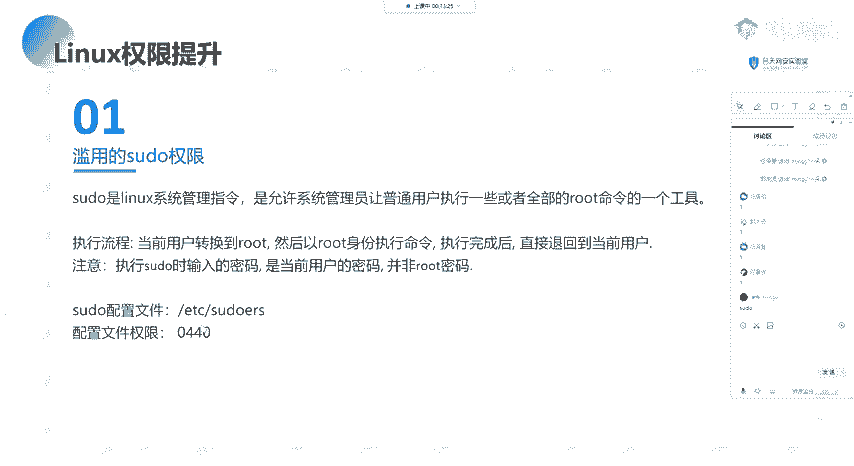

我们这边的话。门。大家如果就是有在电脑前面操作的话，大家可以跟着我就是这样子来查看。就呃比如我这边的这一个机器，对吧？

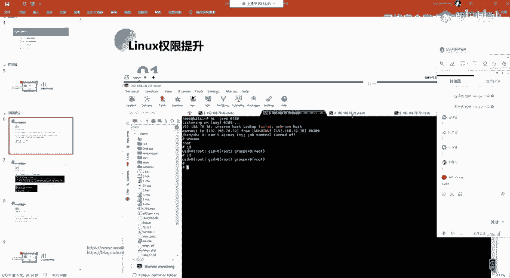

呃，这边能看得清吗？应该能看得清吧。我们可以呃。我们先来查看一下这一个收的这一个文件，它的一个权限。这个文件权限的话是这样子的，就是只有root用户以及root组的用户，他才有权限去读取这一个文件。

然后你会发现其实root用户，他这边也没有给一个写的一个权限，对吧？但是因为root用户的话，你是一个系统的一个最高权限，对吧？呃，你虽然没有在这边没有写这样子的一个写的一个权限。

但是我们可以通过像比如说VM然后我这边TC。そうだす。这一个文件对吧？然后我在这边我进入这一个文件，我修改之后的话，我可以通过就是WQ加一个杠，就是强制保存。然后的话也是可以去做一个修改的。

因为你是一个root用。然后还有的话就是你要去修改的话，有这样子的一个VI收度的这样子的一个命令。我们呃可以通过这一个命令来去做一个修改。就同样的也是进入到这边。

然后他在这边的话就是呃你他这边使用的一个编辑器的话，是那个narrow然后呃我我是我是不常用这个，我对这个编辑器的话不是很熟悉，然后我通常的话都是使用VIM。然后在这边的话。

在这边的话就是你可以做一个编辑嘛，就跟我们平常的一个呃编辑器是一样的。就你可以在这边去写入，对吧？然后呃退出的话就是ctrol加X，然后N。就通过这样子一个方法来去做一个修改。

但是你如果说是你是一个普通用户的话，是没有任何权限，是没有任何权限去查看以及修改这一个文件的。因为在这一个文件当中的话，我们可以来查看一下。

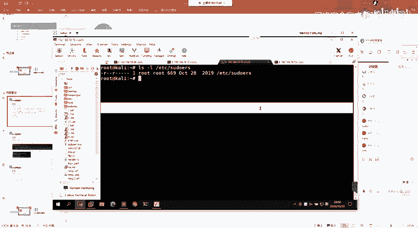

在这个文件当中的话，它里面它是存的存的存储的这样子的一个内容啊。就是我们这边的一个收度的这个特权用户的一个信息。就是说我们的一个普通用户，对吧？我们的一个普通用户。

我们要想要去执行这样子的一个收度命令的话，你需要把你的这个用户把它给添加到这一个文件当中。然后可以在这边有看到，就是这边有一个root，就它这边里面它默认的话是有这样子的两个，对吧？

有这样子的一个rootroot用户，然后的话or等于or等于or，然后or对吧？这边全是or全是or的话就是代代表就是说这一个用户他是有呃有完全的一个权限，就是有一个完全的一个root用户的一个权限。

也就是因为他本我这边的话本来就是一个root用户嘛。所以的话我可以有完整的一个权限去呃用收度，对吧？然后这边的话就是S这边有一个百分号。然后搜度的话，这个的话就是表示收度组啊。

就这个的话就表示组这边是表示用户。然后这边呢这一个搜度组的话，它同样的也有就是呃有root的一个权限，就我们可以通过搜度来得到root的一个完整的一个权限，对吧？

那么我们想要去就是呃想要得到一个root的一个权限，你也可以把你的一个用户，把它给添加到这样子的一个收度组中搜度组这这一个收度的一个组当中，然后的话你同样的也能够去得到这样子一个root的一个权限。

🤧K。这是呃s us这一个文件。然后呃关于这一个文件的话。关于这一个文件更详细的这样子的一个呃。介绍啊大家可以看一下这篇文章，我有放在这个预习内容当中了，就这一个收时的一个文件。

这这篇文章的话详细的介绍的就是这一个收到文件，它的一个就是它的一个。它的一个配置的一个组成，就是像比如说在这边对吧？就默认的话，它这里的话，它会有这样子的几行。呃。

还有的话可能还会有这样子的一个ad命的这样子的一个组。就是表示的话就是这一个命组的一个用户，他同样的有所有的一个权限。然后呃他这边的话呃我这边就大概的给大家介绍一下，好吧。就是来理解一下。嗯。

其实详细的话，大家看这一篇文章吧，好吧，我这边的话就以他这边给的几个例子给大家介绍。然后在这边他有详细的介绍，就是说有这样子的一个公式，对吧？就是首先的话这边的话授权用户还有主，对吧？也就是我们这边。

比如说root这一个用户，或者说你是一个其他的一个普通用户，像比如说呃一个看你用户，对吧？然后主机主机的话，这边这边对应的就OO的话就是表示所有的一个主机就是呃。你任何的这样子的一个主机，你都你去登录。

你去用这一个用户的话，你都有都能够去得到这样子的一个就是对应的这样子的一个权限。然后后面这边的话就是切换到哪些用户或主。就是这边的话word的话就是表示所有的。

也就是他可以通过收录这一个命令去切换其他的所有的一个用户，以及你可以就是指定某一个用户。像比如说指定一个root用户，对吧？就是在这边指定一个root用户。然后要注意的话，要在括号当中。

然呃像这边的话就是偶尔的话就是所有的一个用户嘛，偶尔的话就是所有的一个组就是用户，还有组通过这样子的一个形式。然后呃其实还也可以省略啊，就是省略，就是在这边只加一个or，它就是表示所有的嘛，对吧？

然后的话要注意要加括号。然后还有的话就是呃是否要输入密码凭印证。像我们呃如果说不加这样子的一个no password这一个字段，就这一个字段。那么你再去呃用收 do。

就说你当前的这比如说这边的一个lucy这个用户，对吧？你通过搜 do，你切换到呃root的一个用户的话，你你用收你用收度去执行相应的一个命令的话，像我们正常的话，如果不加这个我们执行搜度。

我们需要去输入当前的一个用户的一个密码，对吧？那么你如果有这样子的一个字段的话，那么你去执通过搜 do去执行呃相应的一个命令的话，你可以不用输当前用户的一个密码。也就是说你不需要知道当前用户的一个密码。

啊，其实像我们前面的话，我们要执行收度的话，我们需要输入当前的一个用户密码，对吧？所以的话你想要你虽然你得到了这个用户，你你得到了这个用户的一个权限，你而且这一个用户有权限去执行这个收度，对吧？

但是的话如果你不知道他的一个当前用户的一个密码的话，你同样的就是呃不能够暂时不能够临时的去获得这样子的一个root的一个权限。然后后面这边的话就是接我们执行的一个命令。也就是说它限定了在这边呃。

如果说是or的话，就是表示所有嘛，就是所有的一个命令你都可以去通过收度来去提全，对吧？那么你在这边限定了相应的一个命令的话，也就是像以这边的这一个为例，就是这个lucy这个用户。它执行收度的话。

它可以不输不输入当前的一个用户密码，对吧？然后我要去通过执行这一个U a，也就是它不输入当前密码的话，它只作用于这一个U这一个命令，而且是只只有执行这一个U的这一个命令的话，你才能够呃。

就是说你才有权限去执行。你才能够通过收度来去执行这一个U来去得到一个就是ro的一个权限去执行这个命令来去添加用户对吧？而且不需要去输入密码。然后其他的一个命令的话，就是没有权限去执行。就这个意思。呃。

然后还有这边要注意的话，就是像比如说这边的这边的这个例子的话，就是这个no password word，它只重于只重用于第一个命令。然后后面的这个命令的话，就是它同样的也需要去输入密码。

也就是你只有在执行用收度去执行这个ch来去更改我们的一个权限的时候，对吧？就执行这一个命令的时候，你可以不输入密密码。然后你后面的这些命令的话，它同样呢需要输入密码。以及的话就是多个命令之间的话。

用这样子的一个逗号做一个分隔。呃，关于更多的话呃，其实主要大家要了解的话，就是我上面讲的这一些，对吧？然后你想要去了解更多的话，你从头到尾看一下这篇。他的这样子的一篇文章，好吧。应该能。

大家应该能理解吧。嗯。我刚刚讲的那些能大家能能理解吗？🤧嗯。嗯。好的，能理解是吧？那么我们继续。嗯。下面的话就是两个命令，就给大家介绍这两个命令，就是我们呃我们如何去进行一个。

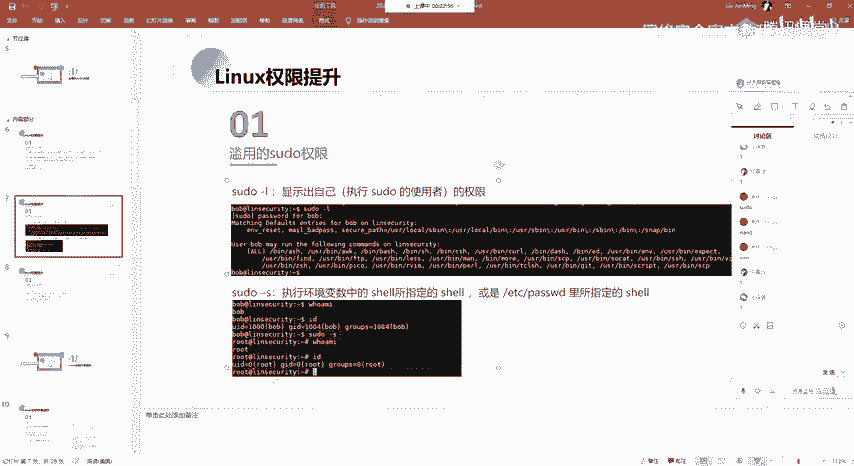

查看查看自己当前用户的，就是能够去用收度这个命令去进行一个提全的这样子的一些命令。首先第一个块就是这一个收度杠L，就是显示出自己的一个权限。注意的话这边呢一个权限的话。

就是显示出自己当前用户能够去通过收度这个命令去执行的这样子的一些命令。诶。其实啊。可能只用收度这个命令来去说，可能大家不是很那个就是呃通过收度这一个提全工具，对吧？这样这样说应该应该会更好理解一点。

对吧？就是通过收度这一个工具来去执行呃这样子的一些命令。你才能够呃。就说你。不好意思啊，我这边突然卡了一下。🤧嗯。就是我这边执行收度杠L对吧？然后的话它在这边有显示出这样子的一些命令，对吧？

这些命令的话就是说你呃你可以有权限，你可以去使用收度这样子的一个工具来去执行这样子的一些命令。然后这些命令的话，呃，我们可以通过我们能够以一个root的一个权限去执行。

然后收度杠S的话就是执行环境变速中的血手指定的一个线。或者是。ETC password里面所指定的这样子一个系，就我们呃so度杠S就我当前用户的话，我当前用户的话呃就是。

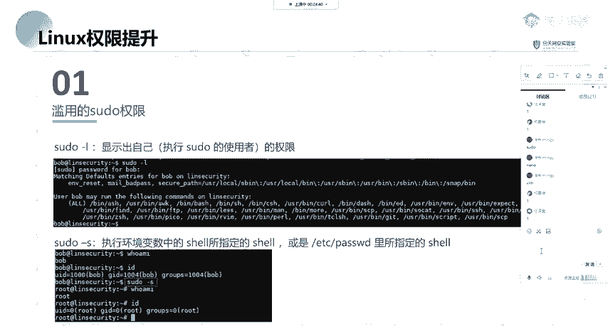

能看实际的例子吧。我们先看一下s work。

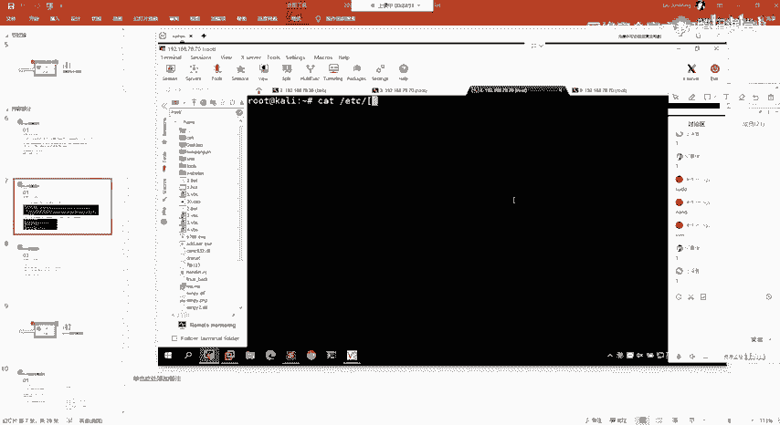

这个文件对吧？然后这个文件里面的话就存储着当当前所有用户的这样子的一些信息嘛，对吧？然后最这边的话有这样子的一个字段，就是最在最后有这样子的一个呃需要环境变量的这样子的一个字段。在这边。

也就是像比如说我这边的这个卡里用户的话，你的这样子的一个需有的一个病数的话，就是这个beb，对吧？然后的话你在当前的话，你呃通过呃就是你远程登录，你远程登录这个用户的话，你得到这一个需的话。

就是这一个bas的一个需。然后在这边的话就是我们通过so do杠S。因为我们知道so do的话，它是以root的一个权限去执行对吧？那么在这边的话呃就是对应的我so do杠S的话。

就是表示的就是我这边。以一个root的一个权限去指定去执行我们这边的一个呃root的所对应的这样子的一个选，就是这一个b对吧？比如说我这边。一个例思，我先进入SSH段然我搜对干S对吧？

我这边的话就进入到了一个bash。对我当前的话就是一个bash嘛。因为root的话，它在这边它呃默认的它指定的这样子一个需尔的一个变量化，就是这个需尔环境的话是这一个冰b。Okay。然。

呃收度杠L的话就是查看当前的当前用户能够以用收度这个工具去执行的这样子的一些命令。So都干了。啊，我当前的是一个root用户，所以的话它这边表示的是沃尔沃尔。

就是我们在那个搜到文件当中所配置的这样子的一个权限，对吧？然后呃我们我在这边的话，我以这样子的一个这一个把机为例。

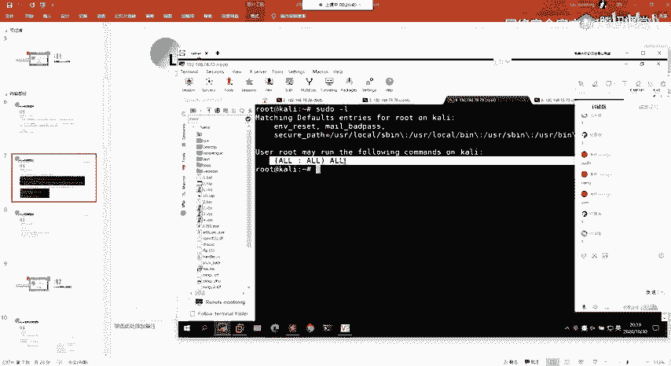

就这边的这一个把机的话，我当前我通过执行这个收度干啊，他这边的话需要我们输入这个bob的一个用户名呃，密码。然后我这边输入密码之后的话，我在这边就能够去查看到呃当前的。

这个抱保用户能够去用收度这个工具所执行的一个命令，也就是能够以root用户去执行的这样子的一些命令。就在这边的话有列出来了。然后其实这边的它所列出来的这样子的一些。Yeah。所列出来的这样子的一些命令。

我们在这个它的这样子的一个缩短时的。🤧嗯。在他的呃这一个s的文件当中，我们能够去查看到。呃，我们来呃。一我们呃我带大家一起来看一下它的这边的这个搜到文件，它的一个组成啊。

首先的话就是呃他在这边的话有这样子的。这么几条，对吧？第一条的话就是这个root，这个root的话就是我我们默认的话就有的对吧？然后在这边的话，它有这样子的两条，这两条的话就是它添加了两个普通用户。

然后peter首先电话，首先的话就是这个peter用户。peter用户的话，它的一个呃。它的一个特点的话就是在这边有一个no password，对吧？就我们前面说的就是说它peter。

再去执行这边的这个命令。这边的这一个命令的话，它其实是对应的在这边。在这边啊就呃他这边加了这样子的一个alice，也就是别名嘛，也就是他再去执行这一个命令。执这边的话，他其实就是指指定的这边的这个命令。

就是这个user bintra这tra命的话就是一个呃路由跟踪的，就是跟踪进程的通信的这样子的一个命令。🤧嗯。然后呃他在这peter这个用户再去执行这一个确确实命令的时候。

他是不需要输入当前用户的一个密码的。然后波宝的用户的话就是他这边的话，他指定了这边的一个wordword sense，对吧？然后这边word sense的话，它同样的就是对应的这边。

对应的这边他给了这样子的一个值。然后这边的这一串的话，就是说它限制了它限制了这边这个报表用户，能够通过收对这个工具来去执行这边的这些命令。然后其实就是对应的在这边所显示的。啊。

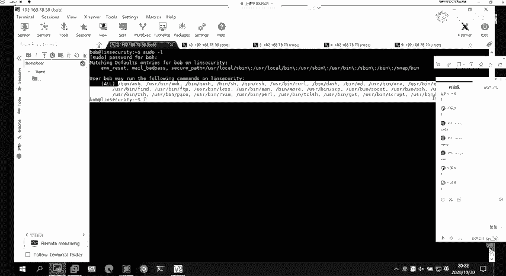

就是呃这两个。哦，呃，下面的话我们来就是介绍一下。就说我们通过这一个搜度干啊，对吧？我查看到了当前的这一个用户，他能够与root用户去执行这样子的一些命令，对吧？那么我知道这一些东西有什么用呢？对吧？

我当前的一个普通用户用收度来去执行对应的这一些命令。

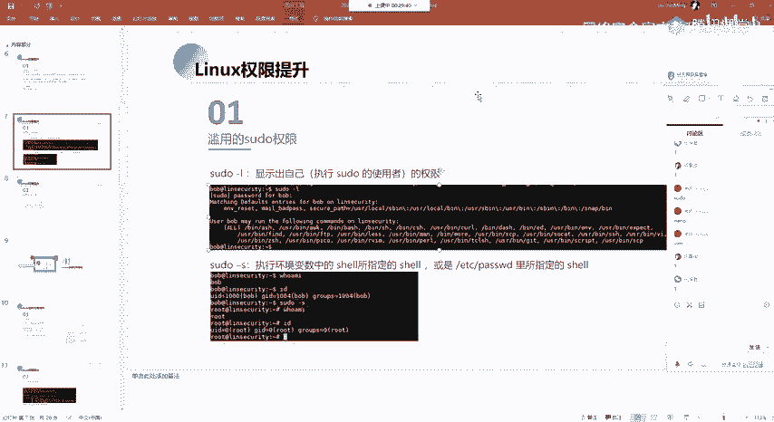

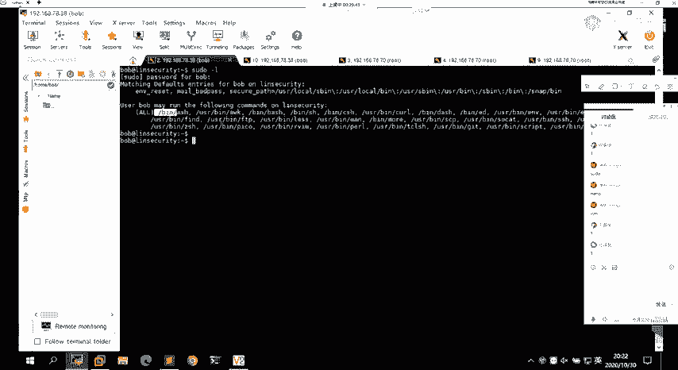

那么我们因为我们最终的一个目的的话，我们是要去进行一个提全的，就是我们的。本节课的一个主要内容就是去进行一个提全，对吧？那么我们通过这样子的一个收度，我们能够去临时的得到一个root的一个权限。

以及我们在去执行这一些命令的时候，能够去临时的得到root的一个权限，对吧？那么我们如何去利用这样子的一些。呃，他在这边所配置的这样子的一些命令来去进行一个提全的。

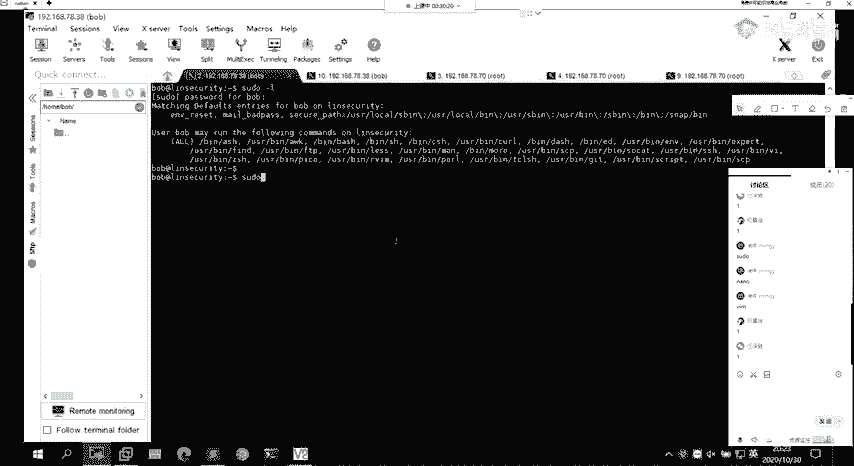

然后讲到这边的话呃就是。

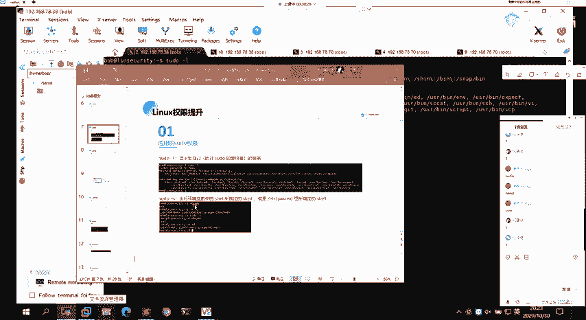

现带大家来看一下这边的这一个项目呃。

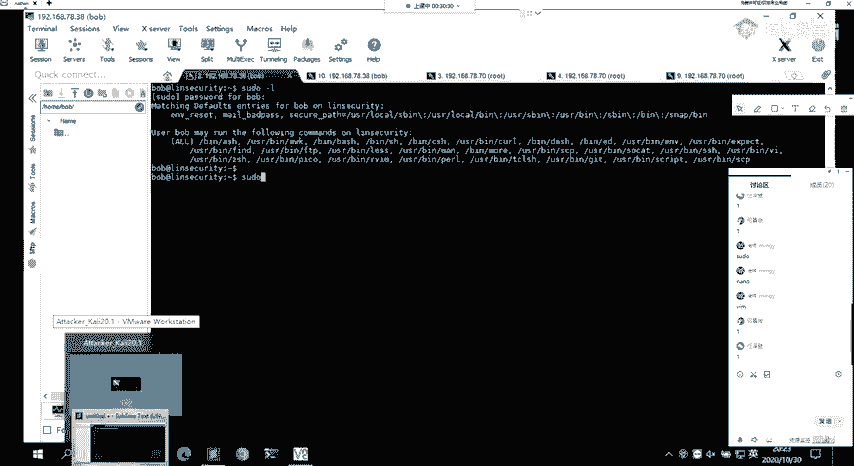

我这边的话放在了这一个。呃，预习内容当中。就这一个。🎼就这个GTFOB这样子的一个项目。这个项目的话，它是呃。这么翻译一下吧。这个项目的话，它是一个呃uni下面的一个二进制的一个列表。

然后的话它主要的一个作用就是我们可以利用它来去绕过本地的一个安全限制。也就是这边的这他这边他所收集的这样子的一些二进制的一些命令啊，它有对应的这样子的一些功能，我们可以去进行一个利用。

然后呃他在这边的话，就是说他收集了这样子的一些就耽误。当系统它再去滥用这样子的一些呃二进制的一些。程序的时候，我们可以利用它来去进行一个啊。权限的一个提升，也就是突破我们的一个。

壳这边的壳的话翻译的意思的话就是细啊就是突破当前需要的一个限制，也是能够呃进行一个有普通权限去提升到一个高权限的一个目的，以及可以去传输文件，还有对应的反弹系尔等等的这样子的一些作用。然后在这边的话呃。

我这边先不翻译。在这边的话有列举了这样子的这么多的一些命令。然后这一些命令的话，我们可以在这边去一一的去查看。像比如说这一个。AH对吧？

然后这边的话它就有列出了关于这1个AH这个二进制呃程序的这样子的一些作用。首先第一个位置是需要。需尔的话就是他这边可以用它来去得到这样子的一个需尔绘画。嗯。翻译一下吧。

能够呃得到这样子的一个程序系统的一个外壳，也就是我们的一个hell。你我们在这边直接执行1个AH的话，就能够去得到。我们来尝试一下。

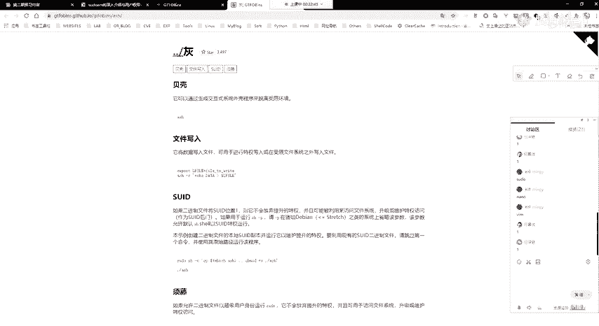

比如说我在这边对吧？我在这边我去执行这个ISH对吧？我这边的话就得到了这样子的一个需，对吧？就得到了这样子的个AH的一个像是吧？

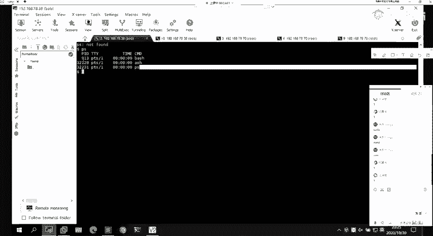

🤧Yeah。然后的话还有就是它有文件写入的一个功能，就是我们可以通过SH来去写入文件。就像在这边的话就是。呃，它首先的话加了这样子的一个变量，这个变的话就是你要去写入的这这一个文件。然后的话你在ISH。

然后其实就是写了，就是通过ele这一个命令来去写了这样子的一个数据，把它写入到这样子的一个文件当中。这边的话就是添加了这样子的一个变量。然后其实像这整个的这一句意思的话，就是我们AH的话。

杠C的话就是呃我们之前AH的话，它会进入到一个hell，对吧？然后在这个hell下面执行这边的这个命令，这边的这个面化就是ele，就是把我们这边的一个数据，把它重定向到了这一个文件当中，对吧？

这个大于号的话，就是我们的一个输入重定向嘛，对吧？前面已经讲过了。以及还有搜SUID也就是这边的这个如果说这边的这个SH这个二进制程序，对吧？它有1个SUUID的一个权限。

那么我们就可以利用它来去进行一个呃提全。就我们其实前面有有有说对吧？就如果说你你是1个SUID的一个呃权限的话，你一个普通用户去执行这样子的一个权限，执行这样子的一个程序，对吧？

它会继承它的一个这一个文件的一个所有者，就这一个文件所有者的话，呃，一般的话是root，对吧？那么你以普通用户去执行这样子的一个有SUID的这一个程序的话。

我们就能够去得到一个呃root用户的这样子的一个外壳，就这样子的一个需要，对吧？以及还有就是收度，就我们如果说你有收度的这样子的一个权限，对吧？你可以通过收度来得到这样子的1个AH的一个选。

因为我们收据的话就是一个root的一个权限嘛，等于就是说我们一个root的一个权限去执行了1个ISH，然后的话就得到了一个root的一个呃需要。我这的话就以这一个为例子，就给大家大概的介绍了一下呃。

他这边的这样子的一些组成的，以及就是呃就大家看不懂英文的话，就是翻译一下嘛，对吧？Okay。以及就是大家碰到一些错误啊，就是大家再去呃执行一些命令啊，以及去安装软件，对吧？有碰到这样子的这些错误。

像一般的话在进行审面的话，都是用的英文的对吧？然后的话这些英文的话，其实这些报错的一些信息，其实你的一些解决方法然话就包含在了它的一些报错信息当中，对吧？然后如果你看不懂英文的话，你就把它括出来嘛。

然后翻译一下嘛。翻一下之后的话，你至少能够去大概的知道它是什么意思，对吧？然后的话你就能够去进行一个尝试了。就是呃提一下，就是大家大家去解决这样子的一些方法的一一个思路啊，也其实也是一个就是。

解决自己问题以以及去自己去学习相应的这样子的一些知识的一个思路。就大家要养成这样子的一个习惯。然后在这边的话就是呃他这边有列举了很多的这样子的一些命令。呃，它在这边有这样子的一些标签。

像比如说需尔需尔的话也就是。像我们在这边就是这个需要，对吧？就等于就是说如果说它这一个程序它有这样子的一个标签的话，那么它可以去得到这样子的一个外壳，也就是得到这样子的一个。需要环境对吧。

然还的话就是com on的话就是执行命令以及呃reb的话就是反谈尔等等的。还有SUID就是如果说这一个程序它有1个SUID的一个权限，我们可以利用它来做什么。然后他在这边的话就已经都。详细的列出来了。

就是它的一个使用方法，对吧？像比如说它是有收度的一个权限，就我们可以用收度来去执行这边的这一个，比如说这个SPN对吧？那么我们就可以通过这样子一个方法。速度加这1个SPN。

然后的话执行这样子的1个ESEC来去得到这样子的一个伴的一个需。然后在这边得到了这个伴需的话，它其实是一个root的一个需。就是它是因为我们执行这个CPN的话，CPN的话。

它是一个root的一个循序执行对？以及还有等等的，像在这边可以去访弹西尔。他在这边的话就列举了这样子的一个实例，我们可以直接去进行一个呃。可以直接呃去进行一个使用。然后在这边的话呃。

为什么要去给大家介绍这一个呢？

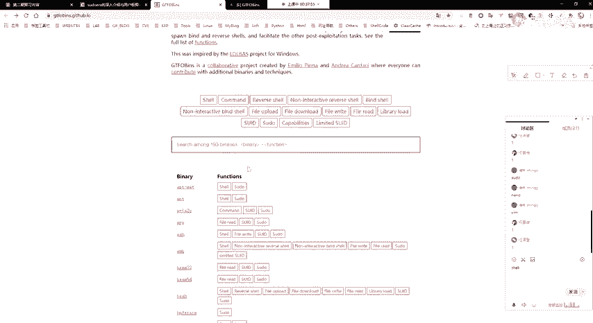

就是我们结合我们在这边通过搜度杠L所收集到这样子的一些信息啊。🤧。Okay。🤧就是我们在这边收出感哦，对吧？我在这边的话就有这么这一些可资金。😊，Okay。呃，就是我这边对吧？

我通过收度干这个命令执行之后，我在这边的话获取到了这样子的一些呃命令的话，我是可以通过收度这个工具去进行一个呃用root的一个权限去执行的对吧？那么对应的这一些程二进制的一些程序。

我们怎么去进行一个利用，对吧？你可能不是很清楚，对吧？那么我们就可以把它扩出来，对吧？我们放到这个项目当中来找到这样子的，像比如说这个ASH，也就是我们刚刚我刚刚给大家介绍的它的这样子一些作用，对吧？

然后在这的话，我们是收度，我们能够去用收度的一个权限去执行，对吧？那么对应的在这边的话就是找到这边的一个收度，我们有这样子的一个收度的一个权呃，能够去用收度这个工具去执行的话，我们如何去进行一个利用。

就是这边我们可以通过收度加这样子的个AH。

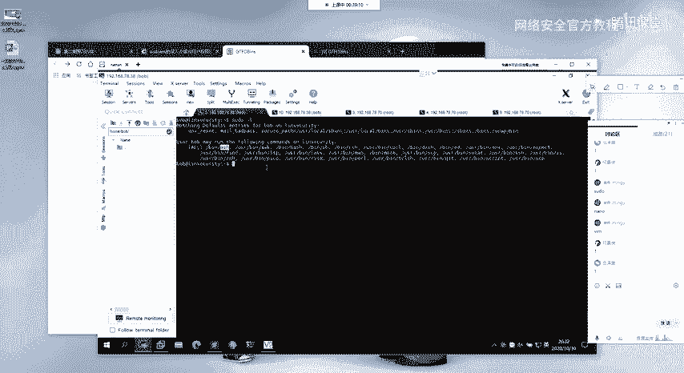

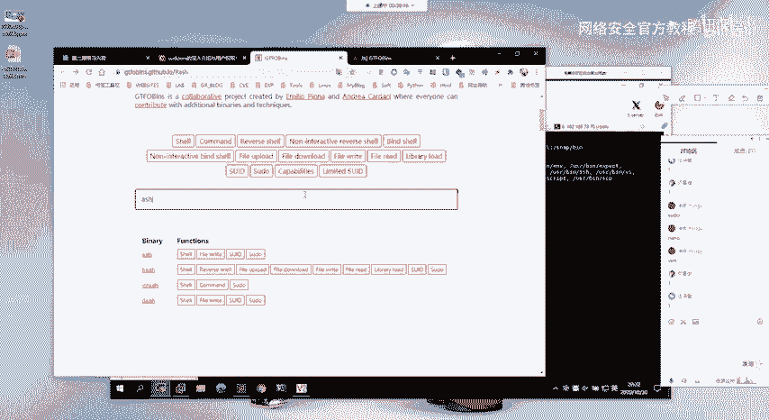

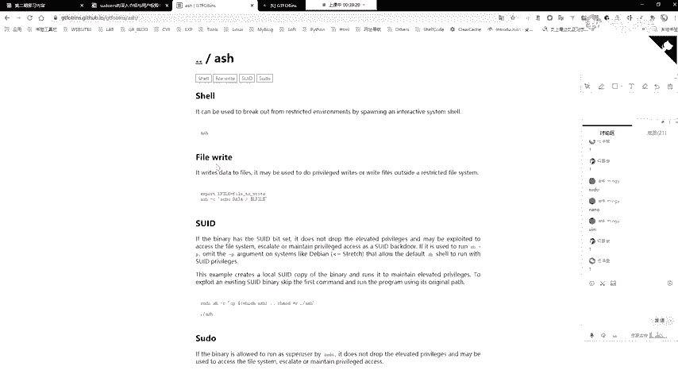

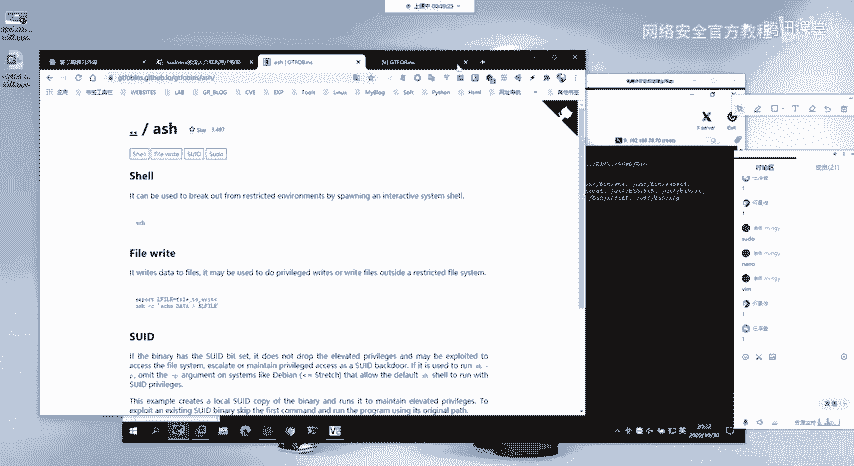

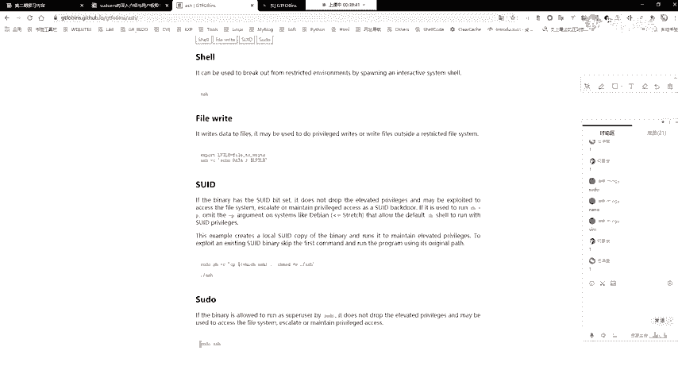

收据有价H，然后的话得到了这样子的1个ISH对。然后在这边的话呃。我在这边的话就是呃。提个问题，就我这边的话，我执行AH对吧？我在这里的话能够去得到这样子的一个呃小的一个外壳，对吧？

那么我当前执行的这个SH，然后我当前得到这个外壳呃是什么样子的一个权限，就有谁能回答一下？能看得清吗？就我当前我这边执行1个SH对吧？然后的话我得到这样子的一个需尔外壳。

我当前的这一个权限的话是什么样子的一个权限，就是什么呃哪一个用户的一个权限是root用户，还是这个bo勃的一个用户？有知道的同学回答一下吧。Oh。知道的同学扣一，不知道的扣2。诶。每一位同学知道吗？

好吧，那我们继续看，就我这边执行SH对吧？然，这边其这个的话其实毫无疑问嘛，对吧？我们执行换卖，我当前外这就是一个bob。因为我当前是一个波的一个用户啊。

我以一个bob用户的一个权限去执行这个ISH对吧？那么我得到的对应得到的这样子的一个需，不就是一个bob用户的一个需嘛，对吧？这个应该好理解吧。这这你能理解吗？就就跟。

这边就不不就是跟我这边执行SH对吧？那我这边执行SH得到这样子的一个小的一个外壳。我当前的一个呃用户的一个权限是什么呢？现在知道了。那肯定是包宝嘛，吧？因为我是一个报表的用户去执行的嘛。

那么我现在用收度，对吧？我这边。我这边的话它是能够用收度去进行一个执行的对吧？那么我在这边通过收度来去执行这1个SH。我当前这边得到了一个用户的一个权限，就我这边得到这个小的一个外壳的一个权限是什么？

有同学能回答一下吗？Root。刚。嗯，好的，对呀。那大家还是理解了是吧？没错，就是root。就说我在这边的话，收度对吧？就是其实这边的话就是大家理解搜度这个工具啊，它的一个作用对吧？

我在这边我能够用收度去执行，对吧？然后的话收度的话，它是能够去进行一个提全的，它是一个提全的一个工具，然后的话它会以一个root的一个权限去执行这边的一个命令，对吧？那么他在这边的话。

以root的一个权限去执行这个ISH的话，那么我在这边得到这个小外壳，不就是root的一个权限嘛？对吧？也就是我通过这样子的一个方法，我就简单的进行了一个提群，就得到了一个root的一个权限，对吧？

你会发现是不是很简单，就是说他这边的一个呃。他他这边的一个漏洞。或者说是一个权限的一个配置的一个缺陷。就是说他在这边他配置的这样子的用收度的这样子的一个权限。他给了这样子的1个ISH。

那么我们就可以用收度来去呃执行这样子的1个ISH来得到一个root的一个权限。以及同理的话，在后面后面在这边。还有其他的。嗯。还有其他的这样子的一些面料，对吧？有这么多，像我们常见的冰b喜对吧？

半喜的话，它同样的也是一个外壳嘛，对吧？那么我当前我之前拜喜的话，我得的还是一个bo纹嘛，对吧？那么我他可以用收度来提全。那么我收度办洗的话，我这边的话就得到了一个root嘛。对吧。

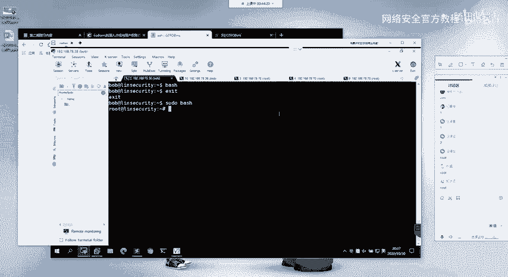

以及还有就是呃SH还有CSHCSH等等的这样子的一些就是细尔的这样子的一些呃。这些就是能够去得到需尔外壳的这样子的一些uni的二键制的一个程序。然后其实如果你不知道这样子的一些。呃。

程序它的一个利用的一个方法，对吧？我们就可以把它抠过来嘛，抠到这边来，我们以这个同样的以这个拜喜为例，对吧？拜s喜这边的话，你会发现就有这么多的一些标签了，像法兰西尔对吧？以及西尔的一个外壳。啊。

对应的呃需尔外壳的话，我直接执行伴学，我就能够去得到这样的一个需尔外壳，以及能够去反弹西尔。反正仙儿的话这边的话就不用多说了吧，对吧？前面已经花了很多的一个时间给大家介绍这一个。就呃重点的介绍了。

就linux下面反弹需尔的这一个beush下面的。就通过这样子的一个方法，对吧？以及还有就是呃像文件上传文件下载等等这样子的一些。他在这边的话有列举了这样子的一些实力啊，大家自己去看，好吧。

然后呃我们在这话主要就是看这个收度，对吧？就我当前的话是收度嘛，对吧？我能够用收度来去进行这样子的一个操作。那么我的一个操作的一个方法就是收度加这一个b。

我就能够去得到一个root的一个选。同理其他的也是一样啊。

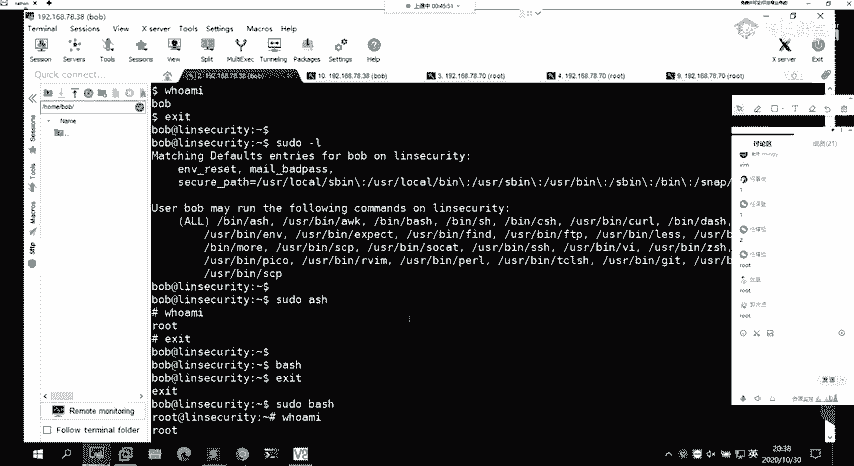

，啊呃，介绍了。就说介绍了这个收度杠L，以及就结合我们这边的这个项目啊。的一个使用。下面的话我这边的话就以一些啊实际的一个例子给大家来展示一下。

就是说我们如何去利用他的这样子的一些滥用的这一个收对的一个权限来去进行一个提权。首先这一块就是前面说的这个AH对吧？然后第二个话就是这1个AWK。就在这边的话。

这边可以看到这边它同样的有这个AWAWK的一个命令，对吧？那么我们把它扩过来。放到这边来，就是这个对吧，找到这个速度，速度这边的话，我们可以怎么去利用它呢？就这里啊这边他命令他命令都已经给出来了。

我们直接call过来。

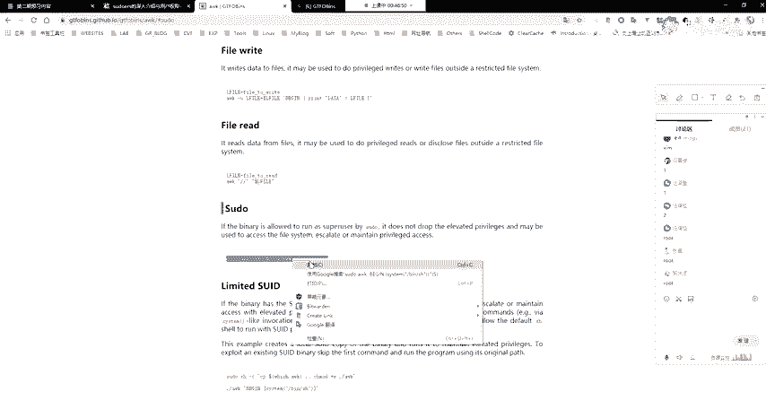

然后的话在这边来去进行一个执行。然后呃我通过执行这一个命令之后，得到了这样子的一个需尔的一个外壳，对吧？然后我来查看一下当前的一个权限，就是一个root的一个权限。

然后这边的一个命令的话就是利用这个AWK的这样子的一个文本呃文本的一个处理器啊。文本的一个处理工具处理命令。然后的话它这边的话是它的这样子的相应的一个语法。然后其实主要的话就是在这边，对吧？

它在这边的话，我们可以去通过调用这一个stem来去执行这这样子的一个边b。Yeah。啊，并需要。🤧嗯。Okay。

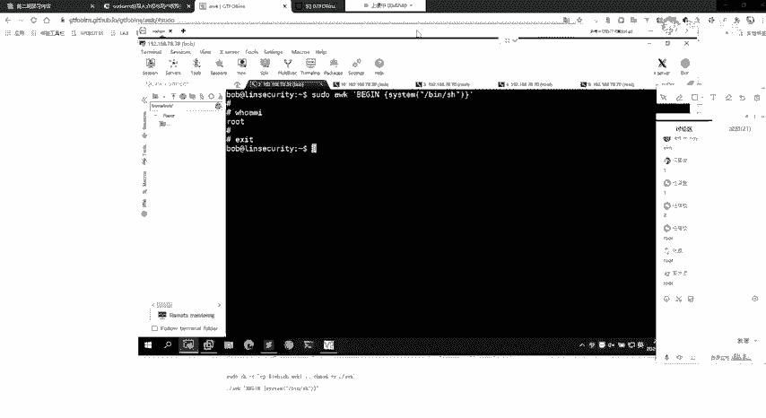

然后的话呃。呃，这边还有一个例子，就是用这个AWK来去进行一个呃文件的一个读取，就是读取文件。然后在这边的话就是以这样子的一个需要的这个文件为例。就是我们正常的话对吧？我们正常的话。

普通用户是没有权限去只去去读取这个文件的对吧？那么我们在这边的话可以利用这1个AWK啊。我们在这边像这1个AWK呃。文件的fire read就是文件的一个读取，对吧？喂。Oh。Oh。

他这边表示怎么跟我不一样呢？嗯。直接这样可以读吗？

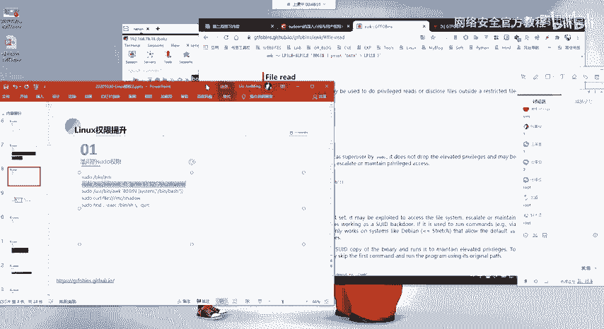

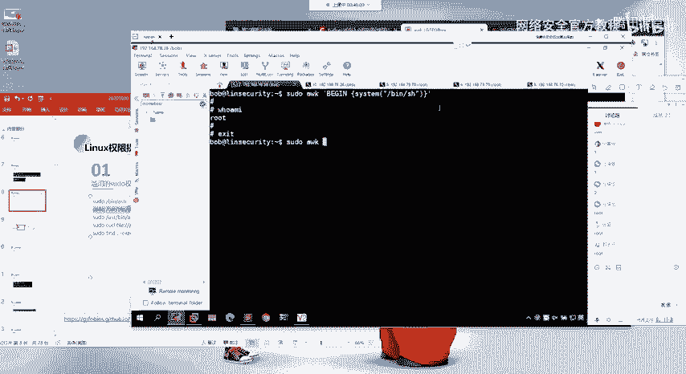

试一下。

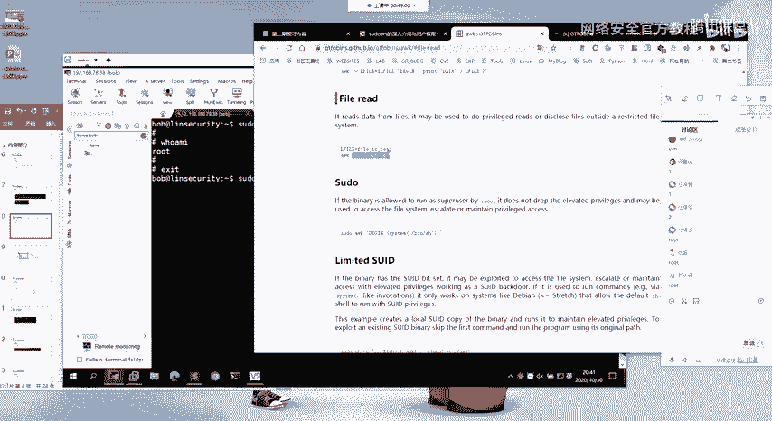

🤧Yeah。

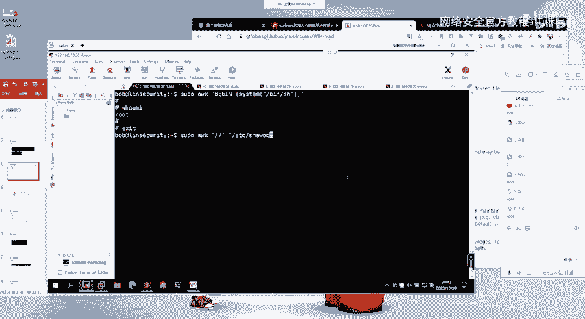

哦，可以读。就直接通过这样子的一个方法就能够去读啊。这样子。然后呃我这边的话是通过这这一个方法就是。

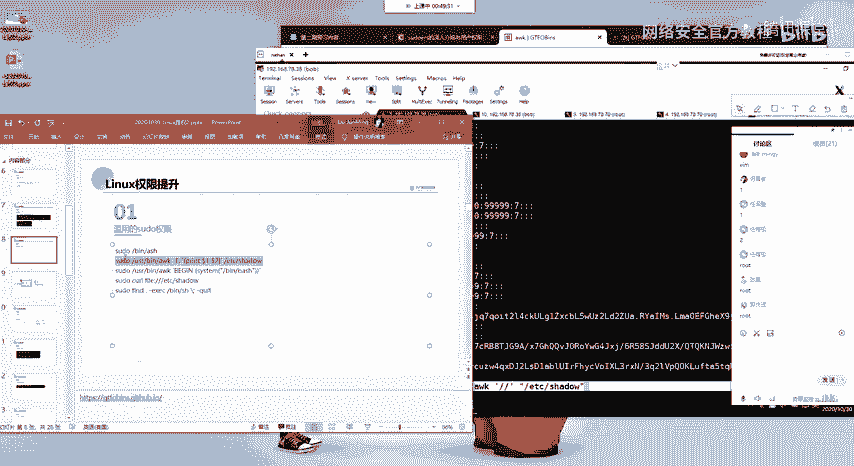

同样的也是用AW开嘛。然后的话在这边的话就是。我这边只输出的就是print of输出第一列以及第二列。

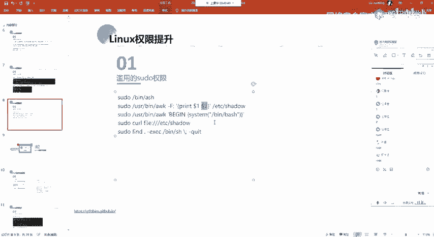

然后的话这边的话指定这一个文件，然后其实达到的一个效果的话，就是跟他这。诶。类似的。然后主要的话就是在这边啊，在这边的话你执行一下，就是我只要那个用户以及密码，对吧？我只列出。

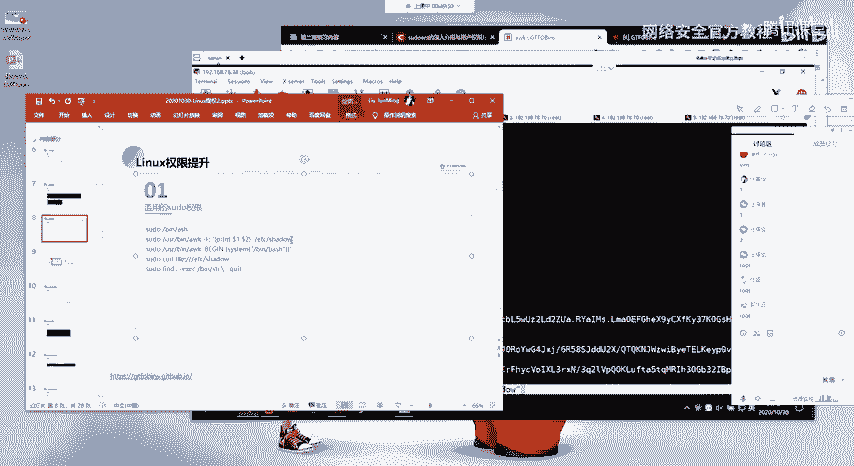

。对吧在这边我只出列出了第一列以及第二列，就第一列的话就是用户嘛，对吧？第二列的话就是用户的一个哈希嘛。因为是在需要的是文件当中嘛，对吧？然后我只要第一列以及第二年那个内容。

然后现在这边的话就是他呃列出了这一个需要的文件所有的一个内容。

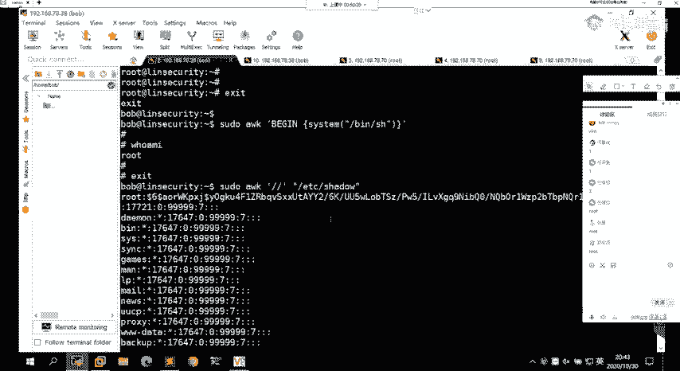

就是呃通过AWK的这样子的一个文件的一个读取。

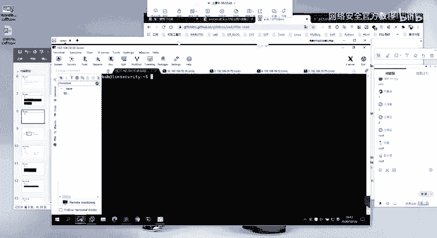

以及还有就是文件的一个斜入。这边的话我就不演示了，就是可以看这边对吧？啊，呃还有的话就是CRCRL就CRL的话也是我们采用的暂定下面。就前面在讲那个文件传输的时候。

我们可以通过CL来去进行一个文件的一个下载，对吧？然呃。同样的CL的话，它也能够去读取本地系统的这样子的一个文件。像比如说来看一下，对吧？首先的话就是一个文件的一个上传。我们可以通过这样子。

就CL的话有这样子的一个pos的一个方法，对吧？我们可以通过啊这个pos的方法来去把我们的一个数据把它给传递到指定的这样子的一个啊UL当中，对吧？就给一个指定的一个网站。以及能够去进一个文件的一个读取。

就是读取我们的一个文件。通过干小写的O把呃就是下载的这个文件保存到我们本地指定的一个目录，是吧？还有文件的一个读取。就文件读取的话，在这里它就利用了这个fi协议啊。就我们的这个fire协议的话。

就是用来读取我们本地的一个本地文件系统的一个文件的。像比如说呃我们可以通过HCL干。

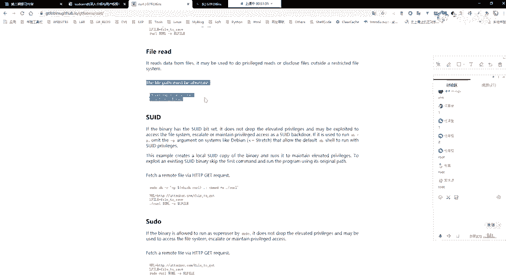

对。就我通过这边的这个发尔协议，能够去读取我本地的这样子的1个ETC password word这样子的一个。呃，文件的一个内容对？然后的话我尝试读取需要的。然后这电话。可以看到就是不能够去打开这一哦。

这边写错了。这的话是打不开这样子的一个文件，对吧？因为在这边的话，它没有权限，是一个普通用户的。然后这里的话，如果说这个CR我们可以用收度来去进行一个执行的话。我是可以去读取本地的这样子的一个。呃。

这个root用户才能读取的一个文件的。

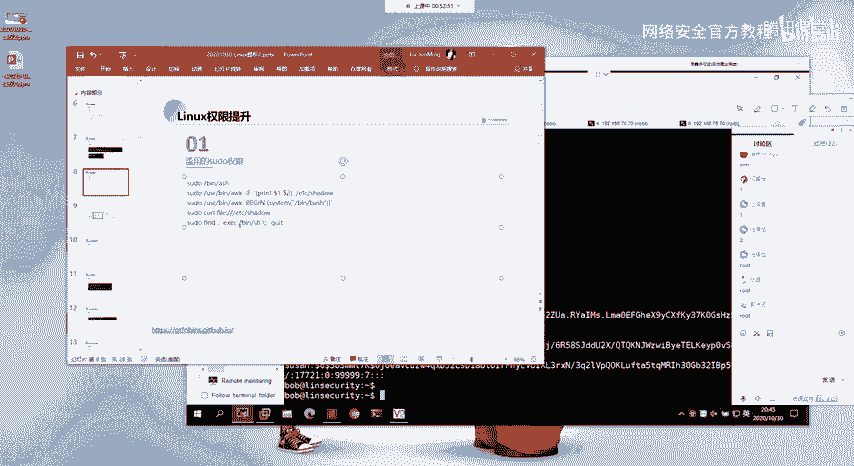

呃，以及最后的就是我们常见的这样子一个fund fund命令。就放等命令的话。我们我们前面有介绍，我们通过方案的命令能够去查找，就是说它是一个就检锁我们文件系统。我们呃指定的这样子的一些文件的对吧？

就是用来去做文件的一个检锁以及查找的这样子的一个命令。

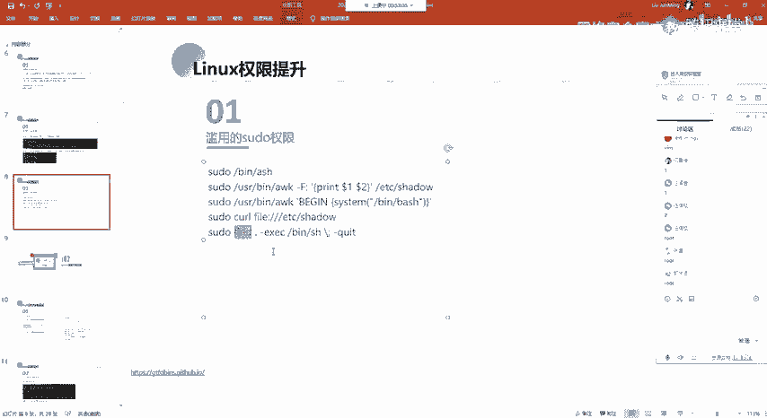

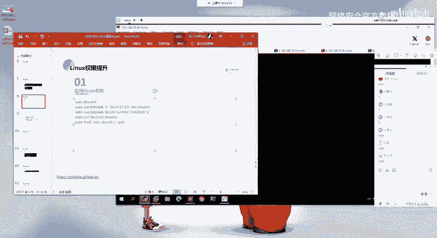

然后在这边的话，我们可以通过这个放的命令来去进行一个提全。就是主要的话就是利用到它的这个干EX easy。干EXEC来去执行这样子一个命令。就是说他再去找到这样子的一个呃找到这样子的一个。🤧Yeah。

通过放案的命令去找到我们呃文件系统当中的一个文件的时候，对吧？它会去执行这样子的一个命令，然后的话就会去得到这样子的一个序。我们来看一下。

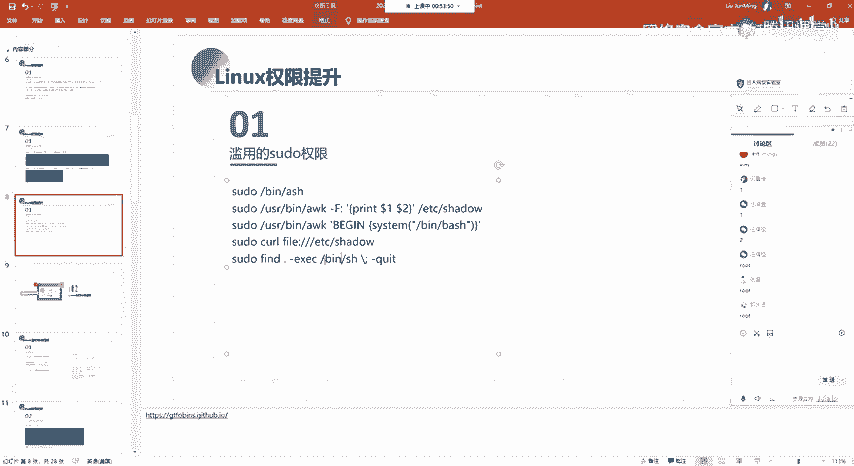

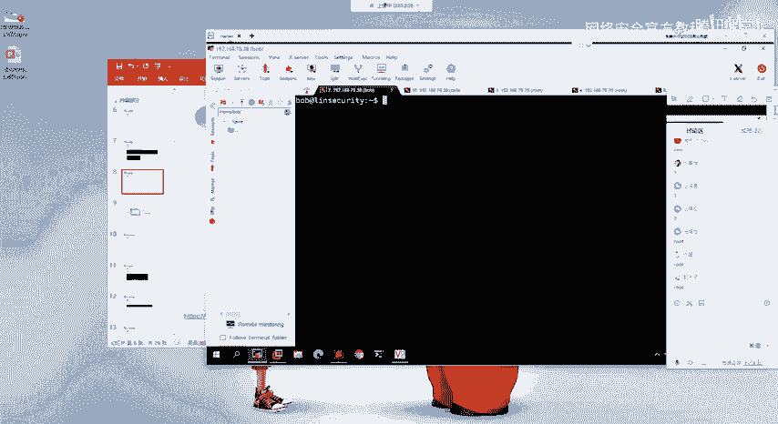

🤧Okay。对。我们得到一个露腿一个权限。然后现在这块主要的话就是云龙的这个干EXEC的这样子的一个选项。呃，这边的一个命令的一个意思的话，就是我放的嘛，放的点的话就是当前目录嘛。

就是我从当前目录开始查找，然后的话找找的话就是。呃。我当前目录去查找，然后的话找到。然后的话加这一个选项的话，就是他会去执行这边的1个BSH。然后杠Q的话就是找到之后的话就退出啊，也就是我通过放的话。

放的这样子的一个查找。因为在这边的话加目录的话是它的一个命令的一个格式。所以的话你需要去加这样子的一个那个。🤧Yeah。你以来查看一下。这一个。

这个放的命令的一个选项就是。呃，他这边的话。刚家有事试。唉，我这边不早了，就是。就是在这一个杠杠EXEC这一个选项后面的话，我们可以去接我们的一个命令。就是它查找之后的话，我们可以去执行命令。

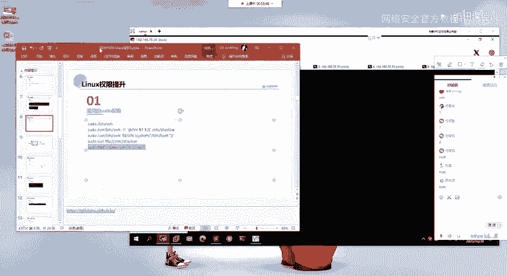

🤧嗯。然后的话如果他能够去用收度去进行一个查找的话，那么我就能够去得到这样子的一个漏水的一个选。以上的话就是呃关于这个收度的这个权限的一个滥用所导致的这样子的一个提全的这样子的一个一些方法。呃。

大家能理解吗？就是第一部分的一个内容。呃，先休息两分钟吧。

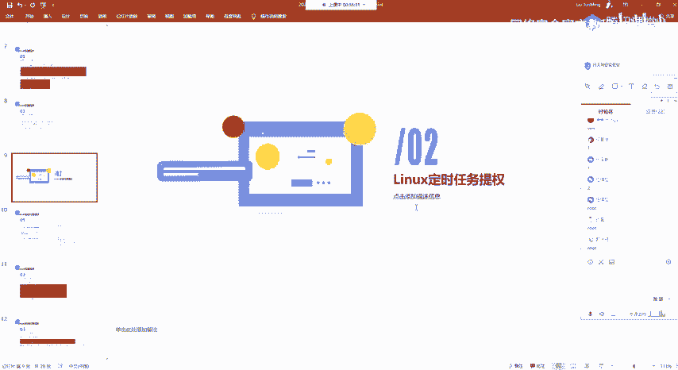

啊，50的时候的话。