# B站最全网络安全教程，整整1300集，全程干货无废话，别再盲目自学了，看完学不会我退出网安圈！（web安全｜渗透测试｜内网渗透｜CTF） - P98：97. 第四十七天：SUID提权.mp4 - 网络安全官方教程 - BV15u4y137cQ

。

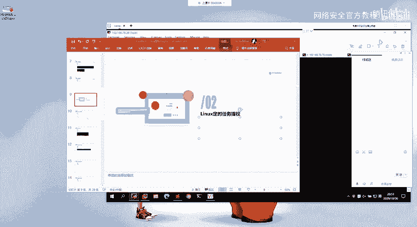

Yeah。🤧。

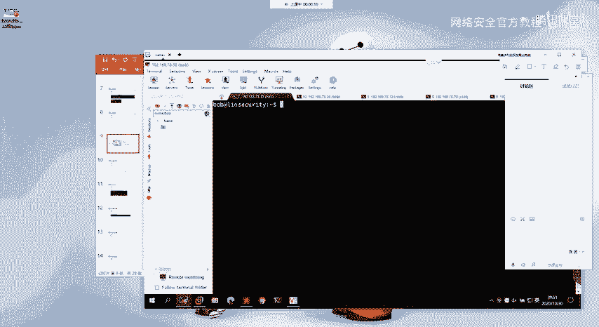

啊，我们继续啊。Okay。呃，大家关于第一部分的这个收度滥用权限的一个提全的一些方法，大家能理解吗？理解的在讨论区扣个一。不理解的扣2。嗯。Okay。Yeah。Yeah。是是是有有有延迟吗？

我我怎么感觉是不是有点严长啊，我这边说完话，然后大家总是要就是过一会儿才有回应啊。啊，应该是没有问题的，对吧？嗯。应该讲的。讲的应该挺详细的。

然后下面它就是第二部分的一个lininux的一个定时任务的一个提全。呃，关于这个定时任务的话，就是在讲提权的时候，我们先来大概的了解一下就是什么是这个定时任务啊。对linux下面的一个定时任务。

就这一个contable，那前面在讲信息收集的时候，对吧？也有对这一个定时任务的一个信息的一个收集，对吧？然，呃同样的。我们想要去。去利用它的这样子的一个提群，对吧？

我们同样的需要去对这样子一个定时任务去进行一个新型的一个收集嘛啊。然，那么我们就需要去了解这一个chrometable这个电池任务，它所对应的这样子的一些。像比如说它系统的一个电池任务的一个文件。

它是在哪，对吧？以及用户的一个电池任务，它的一个文件在哪？啊，我们需要去在这样子的一些目录下面去查找到对应的一个定时任务的一个配置。然后这边的一个空table的话就是linux下面的一个电神网。

就是它的一个守护进程。大家理解什么是定时模板。就电视任务的话就相当于就是嗯。相当于就是一个闹钟，对吧？你定你每天早上定一个闹钟，8点钟的，那么你每天每天早上的8点钟，它就会去它就会响，对吧？

那么就是每天他去想的这一个。时间是8点钟对吧？那么我们就可以去设，我们设置闹钟的话，就是需要去设置时间以及设置他呃到了这个时间之后的一个行为，对吧？也就是呃。也就是闹铃嘛，对吧？

或者说设置播放什么样子的一个歌曲，对吧？那么在这边的话，这边的一个c type的一个电池的话，那么我们需要去设置。呃，哪一个时间就是到了这个时间之后的话，去执行对应的一个命令。对吧。

就是去执行这对应的一个任务嘛。然后在这边的话要去了解的话，就是这样子的两个目录啊，就系统的一个定时任务是在这样这样子的一个文件当中，我们可以来看一下。

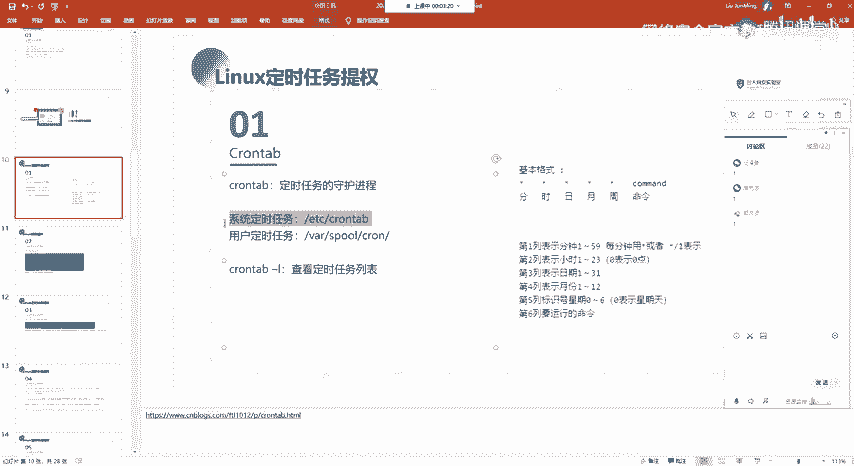

像比如说在这边的话，我们可以通过CATT来查看一下这个conmetable。

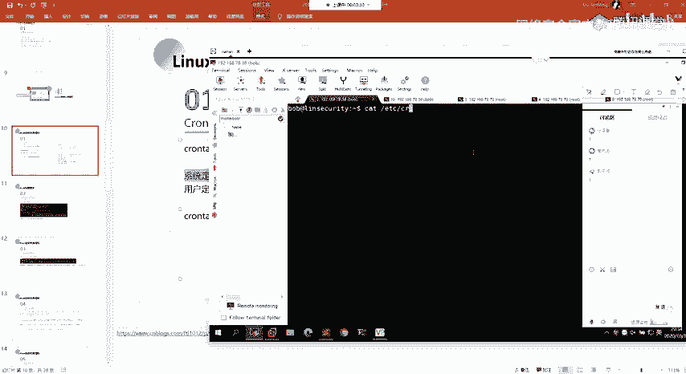

这个文件对吧？然后这边的话就是我们的一个系统用户的这样子的一一个定时任务。然后在这边的话，我们可以看一下就是。

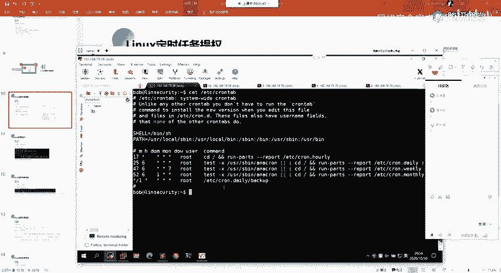

有这样子的一个电磁炉，就这个。🤧K。然后在这边的话，它的这一个定视任务的话，就是像这样子的一个呃这样子的一行啊。然后关于这一行的话，我们来理解一下，就是说他是他这样子，他为什么是这样子写的对吧？

他这样子写的一个作用是什么？

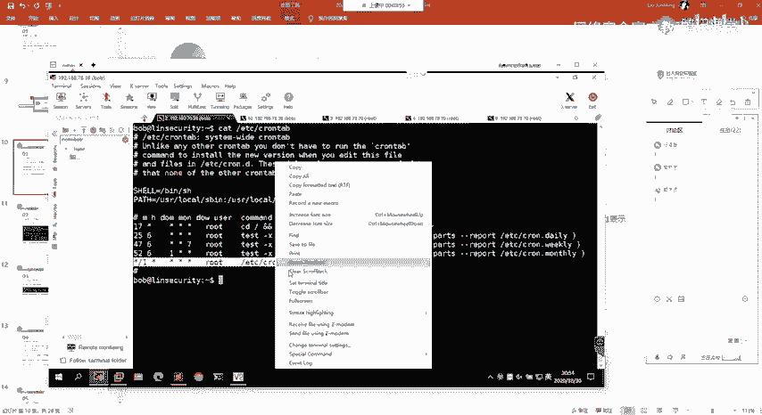

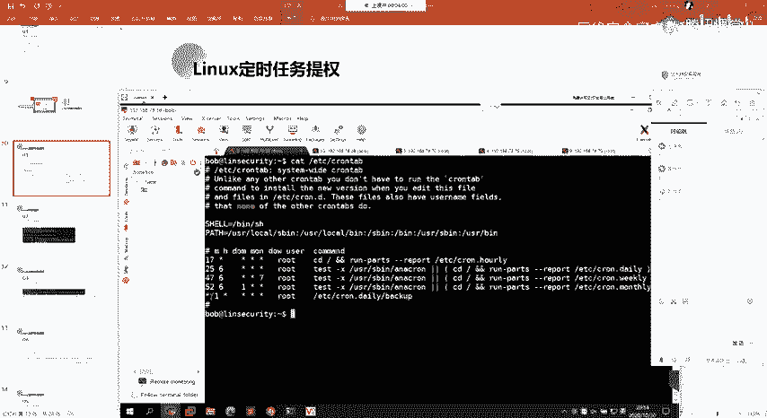

就是大家看一下这边。就这边的一个空空table的这一个定时任务，它的一个格式啊是这样子的。就是。

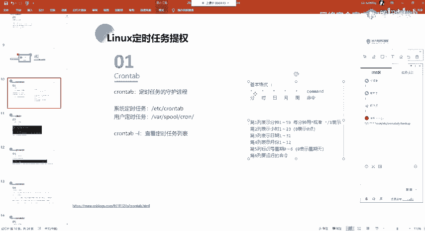

我们可以看到。

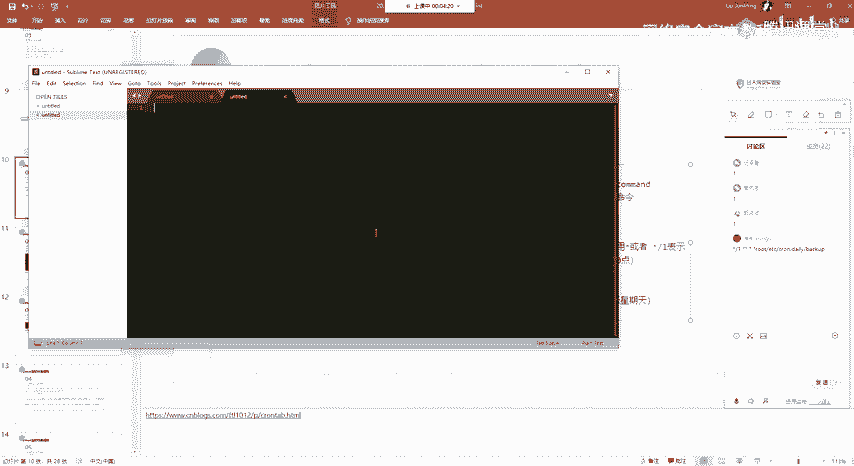

我们可以看到对吧？就在这边的话，它有这样子的一个星号，这边的这个星号的话就是代表了就是有这样子的123455个星号，就代表了分时日月周，也就是每分钟每小时。或者说几分钟几小时，几天几月几周，对吧？

然后comemon后面的话就解密。Yeah。然后在这边的话就是呃详细的对吧？就是第一列，就是我们知道分钟的话就是1到59分钟嘛，对吧？然后的话每分钟的话可以用心来去表示，或者说用心干一。这边的干一的话。

就是表示频率嘛，就是你每隔一分钟，它会去执行这边的一个命令。如果你这边是二的话，它就是每隔2分钟，对吧？Yeah。然后还有就是小时日期等等这样子的一些。呃，然后在这边的话，这边实际的一个例子，对吧？

我们来看一下。就在这里的话，就是他会每隔一分钟，然后的话去执行这边的这一个命令。执行这边的这一个目录，下面的这个back up的这个命令，对吧？然后在这边的话有这样子的，中间在这边跟前面。稍微有点差别。

对吧？就在这边有这样子一个root。唉，这边的这个root的话就是说它会以一个root的一个权限去执行这边的这个命令。也就说这个定时任务的话，它是一个root的一个权限去执行的。

呃呃如果说你想要以其他的一个用户，像，比如说你想要你想要一个普通的用户去执行这一个程序的，那么你就。可以通过这样这样子一个方法。来去做一个设置。

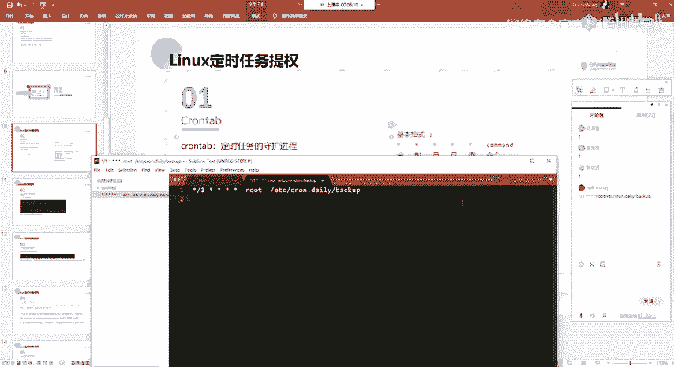

然后还有的话就是用户的一个电池的话，也就是呃我们的。

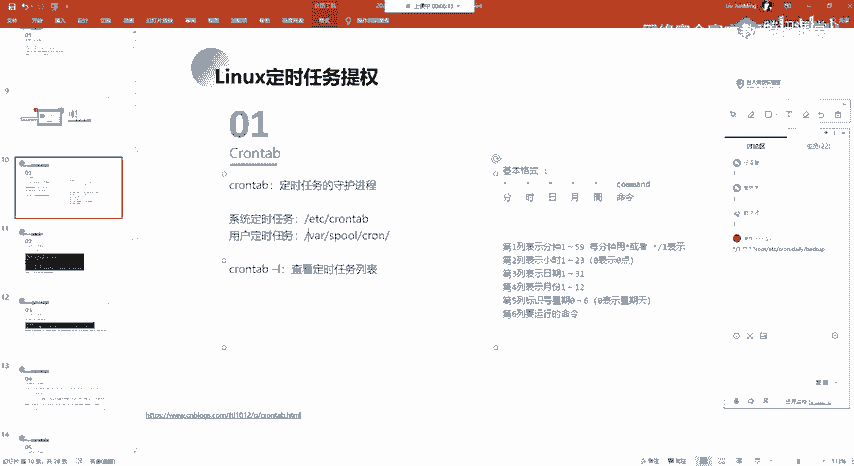

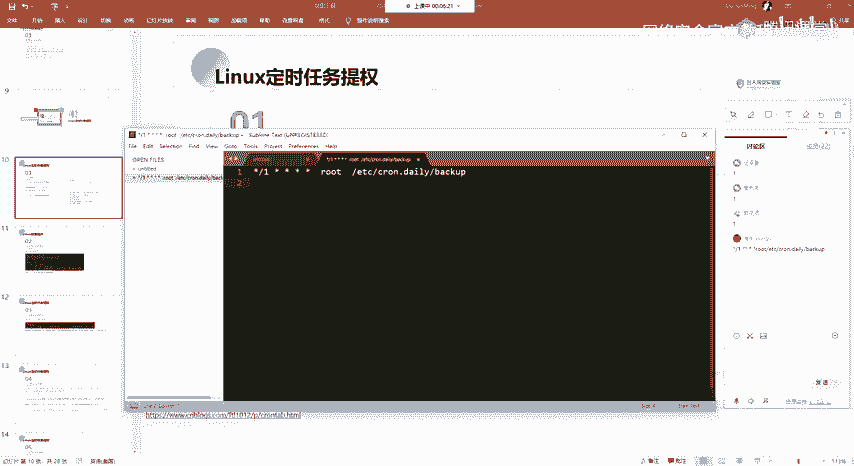

一些普通的用户对吧？

用户的一个电池用户的话，在这个APTC下面。😊。

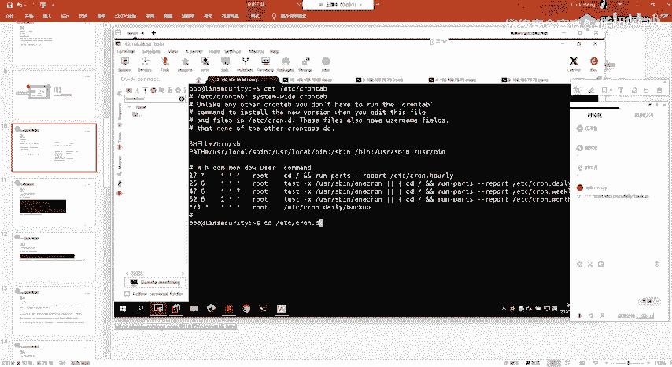

On table。啊不是。在这样子的一个目录下面，然后在这个目录下面的话，它会有这样子的一个。啊，我在旁没群。呃，我这边他话没有权限。就是说在这边的这一个目录下面。我。呢个。晚上好。啊，不好意思啊。

有人，因为我在家家你这边讲课，刚有人敲门。

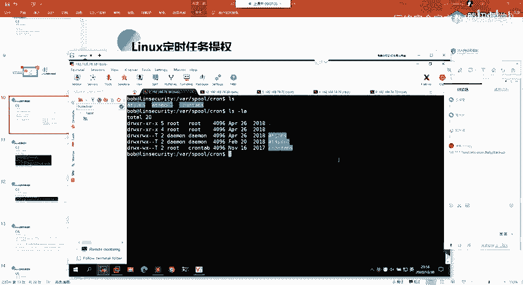

呃，然后的话就是说在这边啊这一个目录的话就是用户的一个定时话，也就是他在这一个目录下面的话，如果说你是bob用户，我这边的一个bob用户。我。有我在bob用户下面有去创建这样子的一个电池任务的话。

那么它会在这一个目录下面，它会有一个以bob用户为名的这样子的一个文件夹。然后的话在这一个文件夹下面的话就是写的。记录着我们的一个电时的一个任务。然后我们可以通过这样子的一个。

从table杠L来去查看当前用户下面的是否有这样子的一个用电池任务。然后我们从这个文件夹这边也看到它没有这样子一个boob的是吧？然后当前的一个bob用户的话，它是没有没有设置电池任务的。

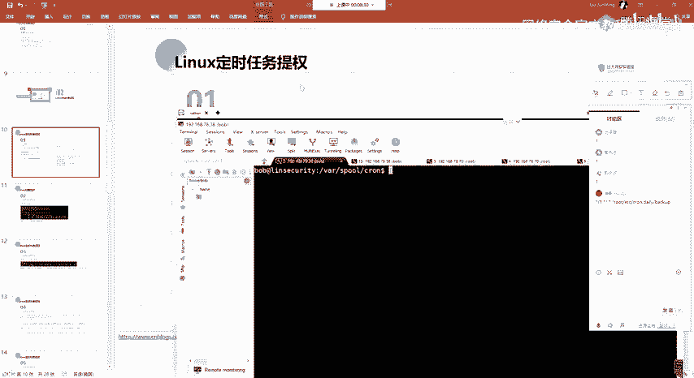

然后的话在这里的话。我们通过在。系统的一个定时任务当中，对吧？这个文件夹的这一个文件当中。你又找到了这样子的一个电磁路，对吧？发而且它是一个root的一个用户去执行的一个电磁路，对吧？就这个。

那么我们如何去利用它呢？

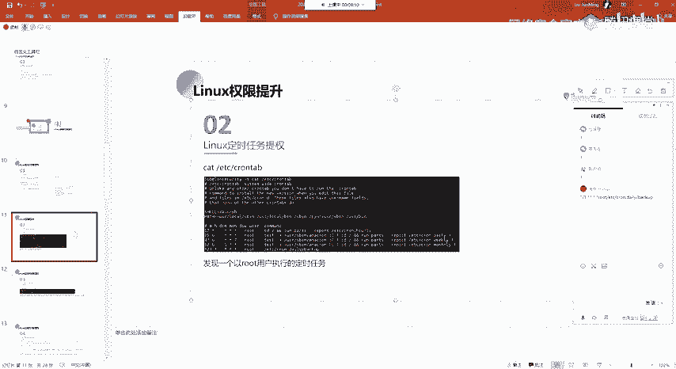

啊，首先的话我们先要去搞清楚，就说它执行的这样子的一个电时任务，它是它是干嘛的对吧？

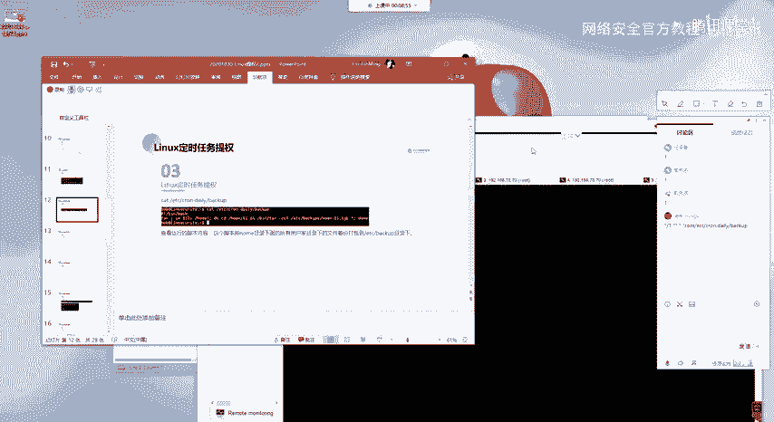

我们可以呃。就是这个。我们可以呃CD到这个目录下面。😊，🤧K。然后的话他有这样子的一个。嗯。W up。还有一个这样子的一个back up的这样子的一个呃文件，对吧？

然后的话我们可以通过cat来查看一下它的一个文件内容，对吧？我们要了了解清楚它执行的这一个程序它是干嘛的，对吧？我们才能够去说有方法，或者说找到方法去尝尝试去利用对。然后在这边的话。

我们查看它里面的一个内容，它是一个这样子的一个拜喜的一个脚本，对吧？然后这是它的一个脚本内容。他这边的一个脚本内容的话，我们来分析一下。

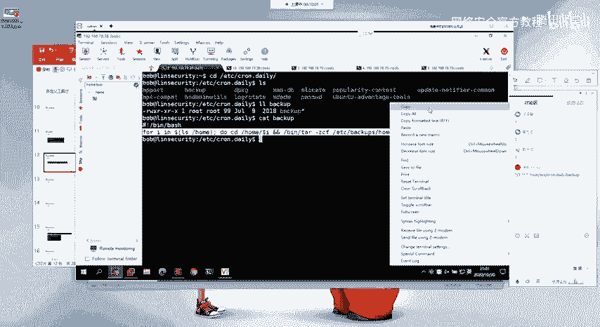

是这样子的对吧？然后这里的话。前面的这一部分就是一个for循环嘛，就是fI音对吧？这种的话应该大家应该都都都理解，对吧？大家都是学计算机专业的话，这种的话应该很很好理解，就是一个for循环嘛，对吧？

然后在这边的话，for循环这边音的话，就是说它会呃这里啊这里有一个N的这样子的一个变量。然后这边的话它括号里面的话是执行的这1个L的这一个后干home，对吧？然后其实这一部分的话。

其实就是呃这边LOS干home执行的一个结果，对吧？

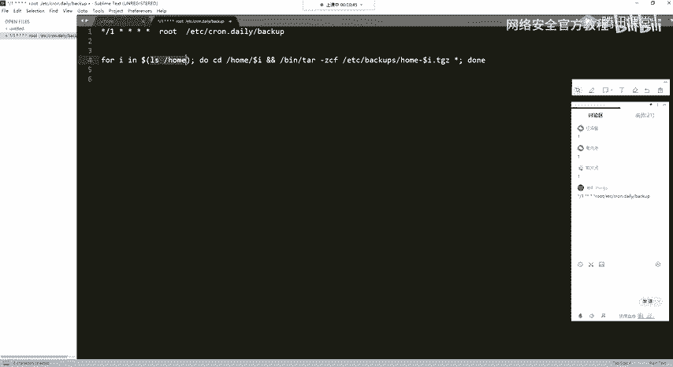

我们来可以在这边执行一下L杠ho执行之后的一个结果它就是有这样子的3个，对吧？那么在这边的话就是他会把I这一个并量，对吧？他会把这边执行的这个结果，它会分别的付给I这个值。

也就是分别就是bobpeer苏，然后的话I的的话，I的值话就分别等于这三个嘛，对吧？

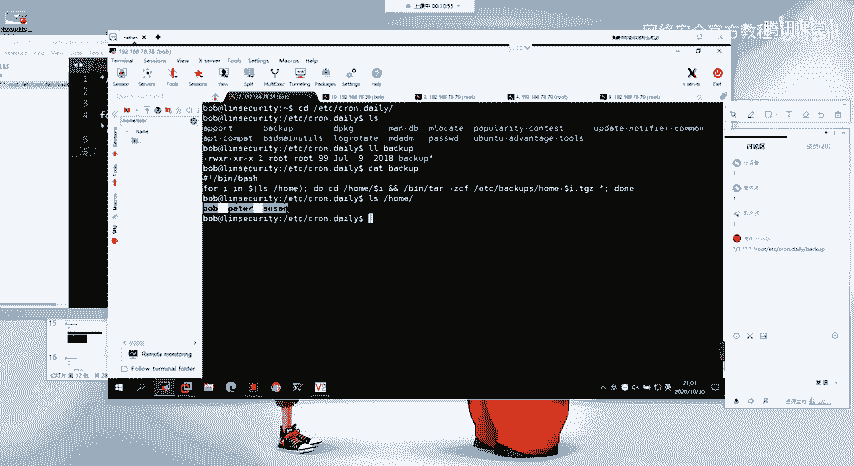

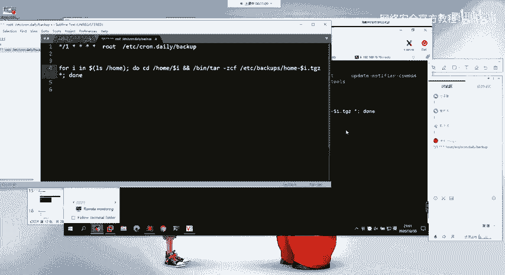

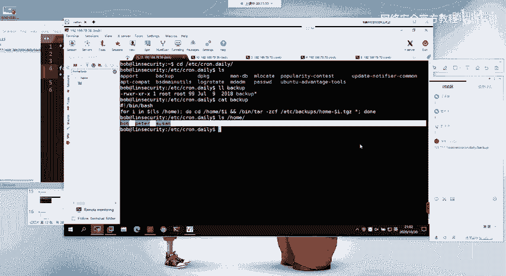

他会付他会付给他，然后的话。呃，单就是。它是一个循环嘛，对吧？它会做这样子的，就是当比如说I等于这个bo的时候，对？I等于这个bob的时候，它会Ddo的话就是CD到这样子的一个干ho，就是把呃多了I。

也就是进入到这样子的。呃，比如说我当前的话是得到是一个bob。

对吧，那么这边I这个边的话就等于抱保嘛，然后在这边的话就执行了CD到这个抱勃这个目录下面，对吧？然后的话执行了这样子的一个命令，就是bin踏的话，就是在B目录下面找到这个踏程序，对吧？

他的话就是我们的一个压缩的一个程序嘛，解压缩的一个就压缩。呃，我们的这样子的一个压缩包的这样子的一个命令。然后呃在这边话就是呃压缩了这样子的一个嗯。

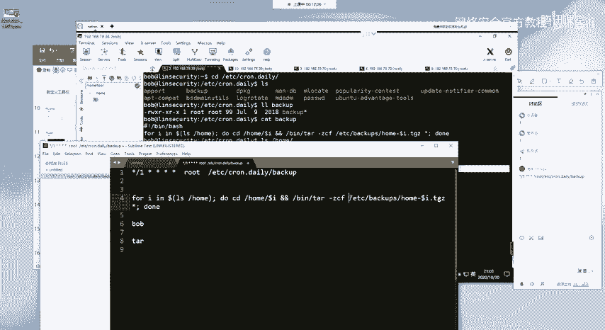

这一部分啊对吧，这一部分的话就是说他通过他这个命令把这边当前目录。然后注意的话，这边当前目录是在这里啊，就我们先CD到了这个报表这个目录下面，对吧？然后CD到了这个报表下面目录下面之后的话。

这边用了一个通配符星。关于通配服的话，这边大家大家呃了解吗，就理解嘛。通佩服。嗯。像呃我们这边的一个新，就是我们linuxlinux下面的话，通常会呃常用的这样子的一个新的一个通配符，对吧？

大家了解吗？

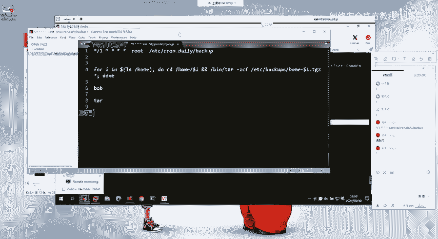

啊，不了解的话，我这边以一个例子来看一下，是吧？就比如说我这边。我这边。啊，比如说我这边我这边的话当前有这么多的一些文件，对吧？有这么多的一些文件。然后的话我想要去把这边所有的这一些文件。呃，或者是说。

把这边以VBS结尾的这样子的一些文件，对吧？以这边以点VBS结尾的这样子的一些文件，把它给copy到这样子的一个呃t目录下面，对吧？那么我的一个命令的话通常是怎样的？对吧？就是CP新嘛。

然后点这样子的一个。VBS然后到看幕下面。对吧好，我们可以在这一个探访录下面看一下，就是多了这样子的1个1234这4个VBS的一个文件，对吧？那么这一个命令它是怎么去找到这样子的四个文件呢？

就是利用的这样子的一个新的一个通配符。这边通配服符的一个意思的话，它就是会有这样子的一个就是模糊查询。就是它会去我当前的话在这个目录，对吧？当前这一个目录下面的话有这样子的一些文件。这些文件的话。

我这边新点VBS就是新的话，它首先它会去找到这样子的一个点VBS嘛。呃。就是以点VBS结尾的这样子的一个文件。然后的话新这边的话，它不管就是不管前面。不管点VBS前面它是什么样子的一个内容。

只要它是以点VBS结尾的这样子的一个文件，那么它都会去执行它都会copy到这样子的一个time路。然后其实它是这样子的一个过程，就是我这一个通配符我CP他首先会找这一个文件解锁这个文件。

看它是不是符合我这边的对吧？就是它是以点VBS结尾的，它不是对吧？然后找第二个这个2点VBS。然后它是一个点VBS结尾的，然后前面的这一个它是2，然后这一部分我们不用管，因为它是就是呃模糊查询嘛，对吧？

它不它不是像我们的一个精确的去找到某一个文件，然后它会去一的去进行一个解锁，然后的话匹配这边以点VBS结尾的这样子一个文件。然后的话它会去分别的去执行copy这一个命令，把它复制到这这一个探篷幕下面。

现在应该能理解吧，对吧？以及我们以及我们就是我想要copy当前所有目录下面的一个文件，到这一个t目录，对吧？我我的一个面就是像这样子吧，CP新对吧？然后我不可能说我不可能说我一个一个文件的去。

就是我一个一个文件。像比如说CP10点CP，然后到t，然后的话下一个文件的话就是2。VBS这样这样子去copy对吧？这样子的话就是。呃，没有任何效率的一个方法，对吧？我们通常会用这个通配符星。

然后在这边的话，他就会去把当前目下面所有的一个文件，它都会去紧锁。紧锁之后的话，它会去执行一个copy的一个命令。然后的话复制到t幕下面。

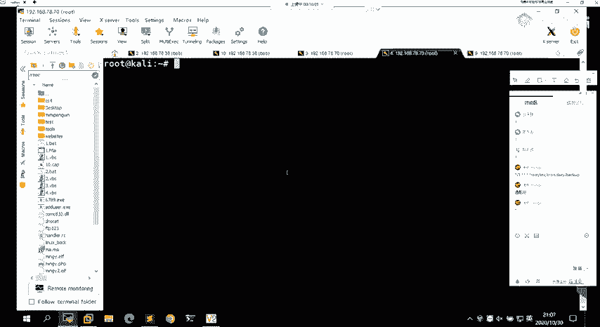

这边这我这样讲的话，应该能理解吧。

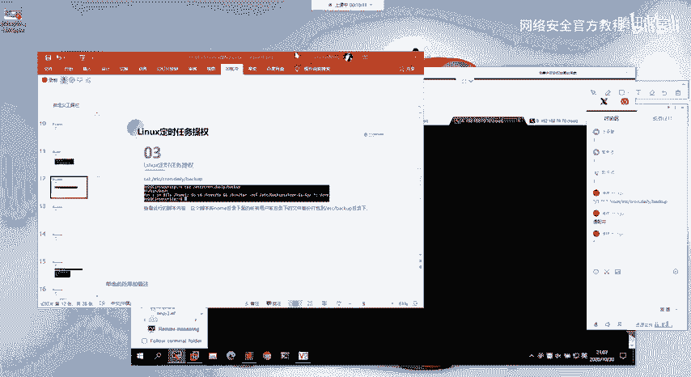

大家都没有点没有点反馈啊。就就其实。🤧嗯。呃，就我我一般的话我会我首先会问大家，就是大家对这一个了解嘛，对吧？就是如果你了解的话，或者说大部分同学都了解的话，我就不会去细讲了。好吧。

如果但是你们不你们不回应我的话，我不知道你们就是有没有了解就。所以的话我这边的话就是我我可能的话就是。就觉得大家不了解这个东西。所以喽，所以的话我就会给大家就讲的比较细嘛，对吧？但是如果大家都了解的话。

我就没必要去再讲这个东西了，所以的话还是。我问大家的时候，大家给我一点反馈对吧？就是。就。节省一点时间，好吧。

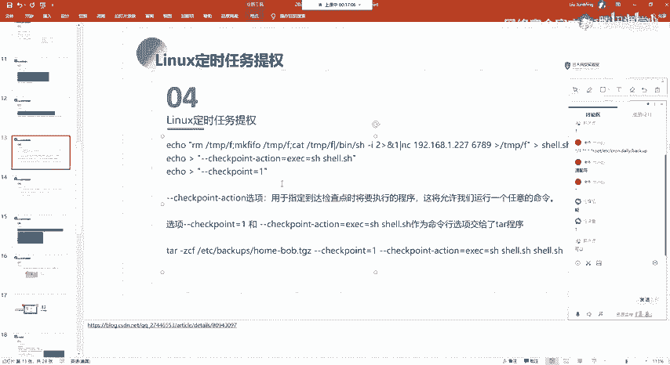

然后的话呃就是这边的话就是这个。

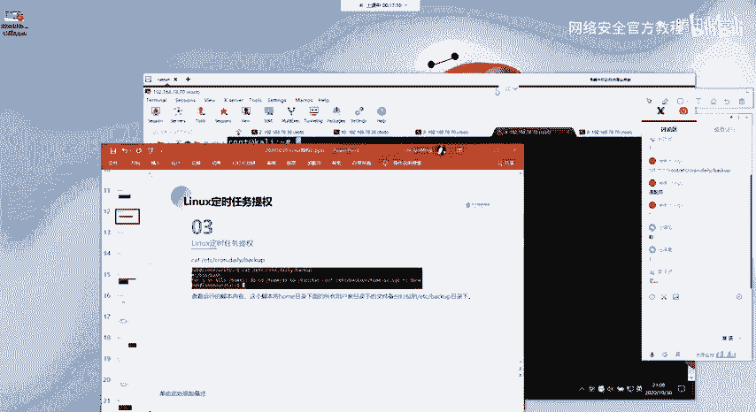

电池任务的一个意思啊，对吧？然后在这边的话，他就是他会去分别的去报本目录，以及在这边。

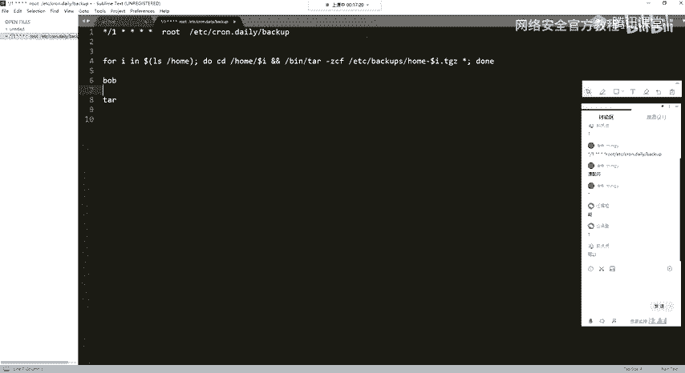

P。以及在这边呃P层目录，还有书散目录下面去呃做一个压缩，就是把它目录下面的所有文件都做一个打包，打包到这样子的一个目录下面，对吧？ETC back呃backup这一个目录下面，然后的话它的一个名字。

它就是home干呃，以它的一个呃用户名为名的这样子一个TGG的一个压缩包，对吧？然后其实这里的这个定视任务的一个作用的话，就是它每个一分钟它会去呃，这一个用户目录下面去呃它下面所有的一个文件做一个打包。

对吧？像这种的话应该也是比较常见的一个操作的对吧？就是备份你的这样子的一个用户的一个文件嘛，就是你用户文件的话呃。

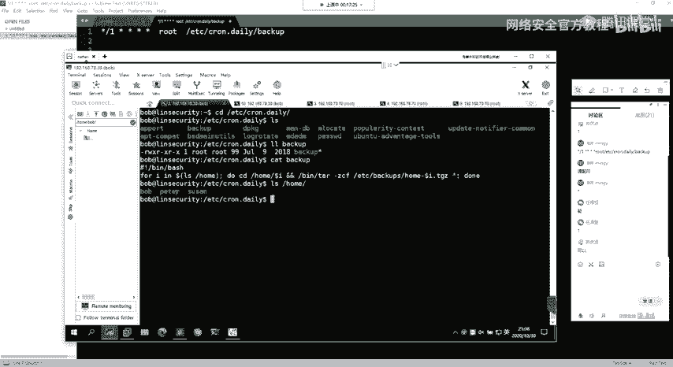

Yeah。就是你每次你每次的。每次都这样子的一些更改，一些数据的话，他都会去做一个打包，然后的话备份到。

呃，指店的目录下面。

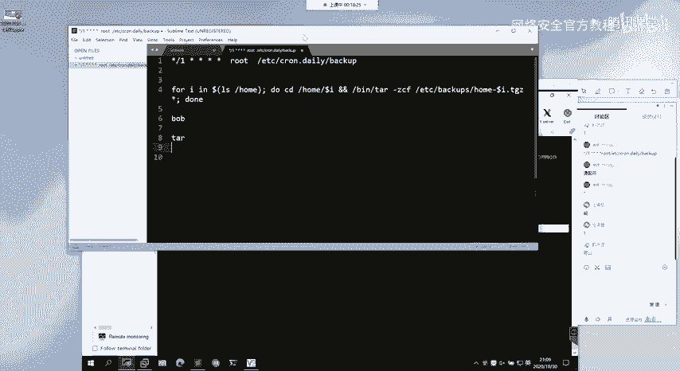

然后这边的话就是它的这一个电池任务的一个作用。那么针对这样子的一个电池的话，我们单从这样子看的话，它其实是没有问题的，对吧？是一个比较正常的很正常的这样子的一个就是啊备份的一个电时任务嘛，对吧？

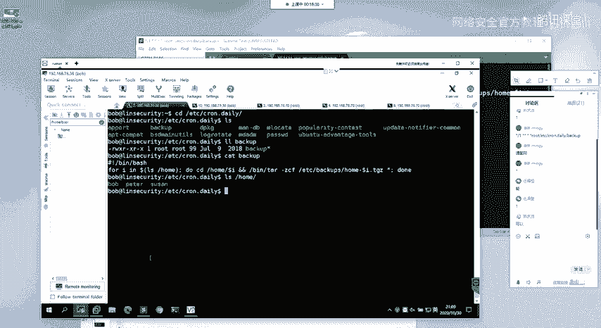

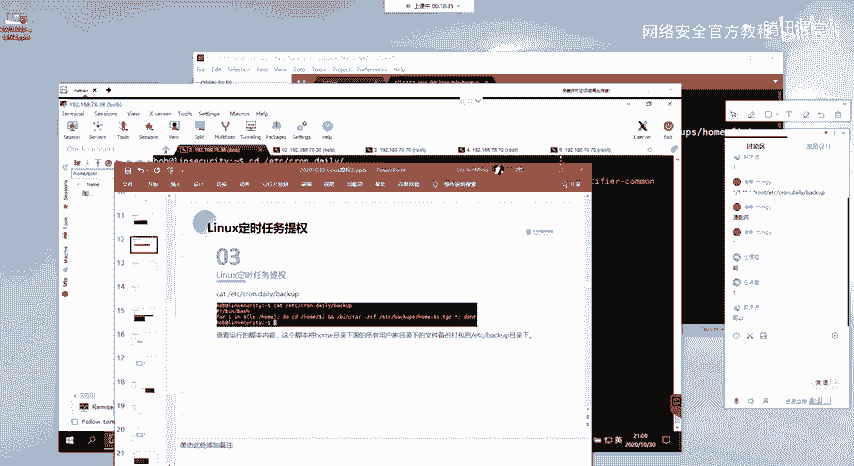

那么他的一个问题它是出在哪呢？就是我们如何去利用它的这样子的一个电池任务来去达到一个提全的目的呢？就是我们下面要讲的。🤧嗯。呃，下在这边的话，其实它的一个问题的它就出在于这一个呃新。🤧呃。

这一个新的一个通配符啊，就是我们这个通配符的一个注入。关于这个的话，大家可以去看看一下这篇文章。嗯。🤧就这一个他这篇文章的话呃很详细的介绍了，就是说lin下面的这一个通配符的一个注入。

以及我们如何去利用它。🤧嗯。像在这边的话，他也介绍了这一个他的一个通配符的一个注入方法，就通过这样子的一个电池任务。然后其实他的一个问题的话，它就是这边的这一个呃新的这个通配符啊。好。

我们可以去注入我们自己的这样子的一个呃命令以及选项。然呃具体的一个利用方法的话就是我这边的。这边列出来的这一个。就这三条命令就能够去达到这样子的一个提前的一个目的。

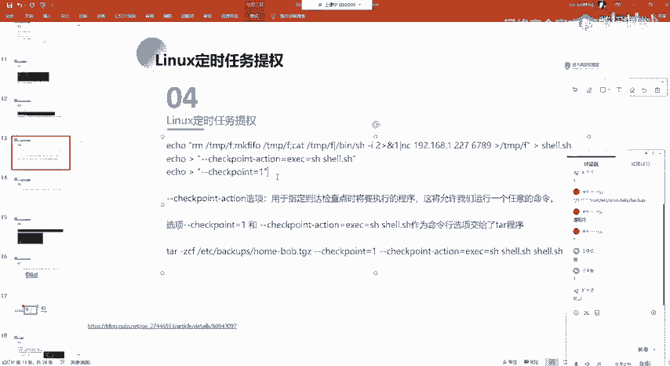

呃，在这的话我分别给大家就是。我们分别一起来看一下。

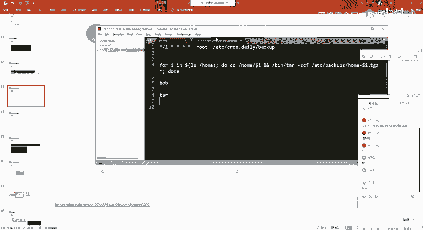

我这边命令的一个意思。首先的话就是ele这边的这一个关于这里的话，应该不用我多说了吧，对吧？大家应该都都熟悉了。这边它就是一个反特希尔的这样子的一个呃命令嘛，对吧？

然后的话它是就是NC就是NC没有杠一这一个选项的这样子的一个。呃，这样子的一个方方式对吧？利用的是这个make makeake FIFO的这样子的一个呃。

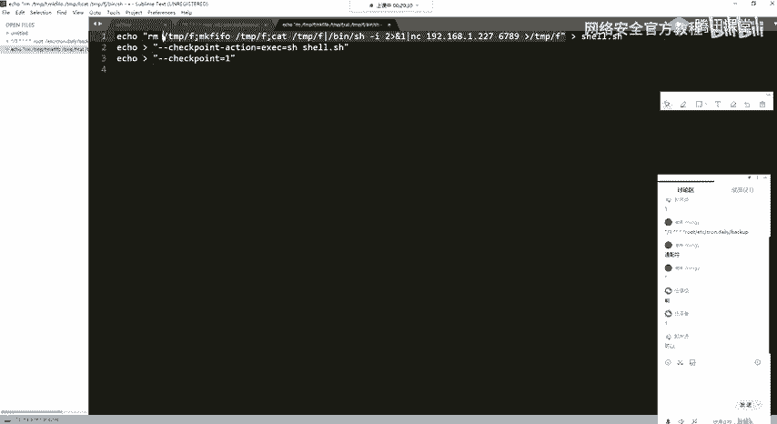

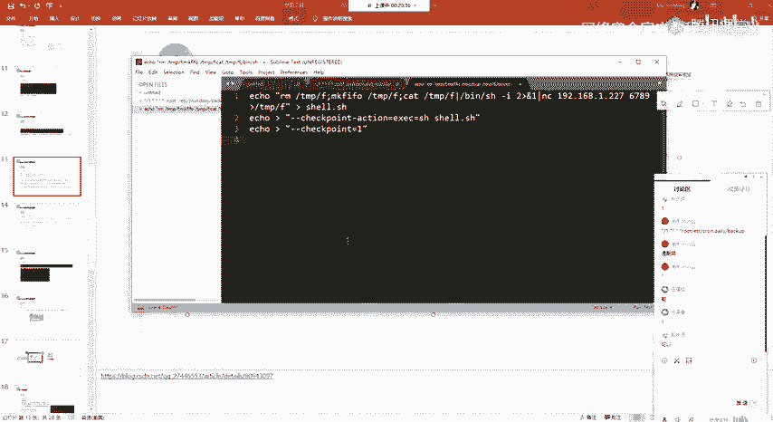

🤧嗯。这一个命令。然后呃其实我们在这边的话，NC这边的话，它是有NC这一个命令。但是它这个NC这个命令的话，它就有这样子的一个情况，就它没有杠一的这一个选项，对吧？

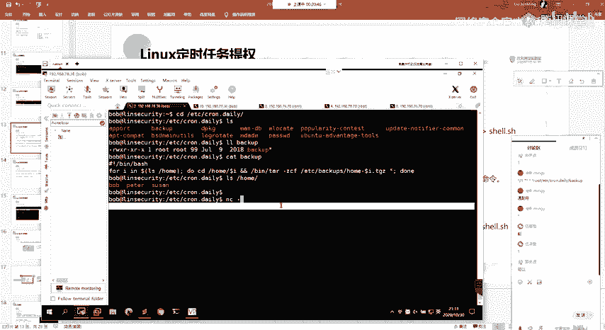

就我们前面的话有介绍就是NC如果有杠一这一个选项的话，那么我们可以直接NC，然后的话直接杠一嘛，就是NC到指定的那个。IP端口，然后的话把我们的一个需要环境把它给做一个重定下，对吧？然后在这边的话。

它没有杠一选项的话，就用到我们前面讲的就是没有杠一的这个选项的这样子一个反弹需尔的一个方法。然后这边的话是把它写入到这个需尔点SH的一个需ll呃一个文件当中，对吧？然后的话第二个的话就是ele。

然后的话加了这样子一个输入的一个重电下。然后这边acle前面的话它没有东西，也就是呃acle为空，也就是它像这一个文件当中，它写了一个空的一个呃内容，对吧？其实就是相当于就是创建了这样子的一个文件。

然后这个文件的话，它里面内容为空。就这两。然后的话呃还有的话就是这个跟上面的话，这边的话是一样的，就是它创创建这样子的两个文件，然后命令的一个执行的一个效果的话，就是像这样子。

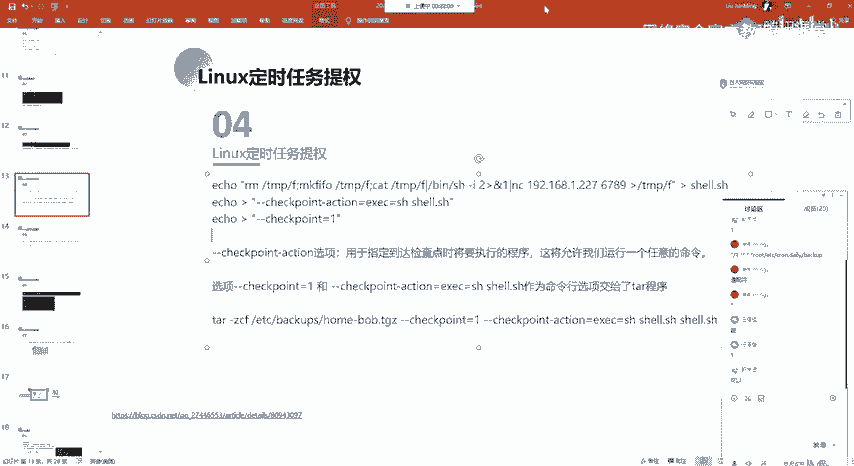

就是。在这里分别的话有创建了这样子的三个文件。首先第一个块就是这一个需需要点SH。这一个然后在这块我就写入了这样子一个访特西尔的一个呃。命令对吧？然后我这边反常的话是反弹到了。这边。然后其实在这边的话。

我这边话其实已经得到了，呃等会的话再重新来给大家看吧。然后呃还有的话就是在这边有创建了这样子的两个文件，对吧？就是。啊，应该是看不了。对吧。对。🤧。呃，在这边的话。

在这边的话是不能通过这样子的一个方法去查看。然后其实在这边的话，你会发现我在这边通过cat这一个面令去查看这一个文件，对吧？他会发现就是它的一个报酬就是unrecogninized的op。

也就是他没有找到这样子的一个选项。就是说选项是什么意思呢？就我们ca这一个命令，对吧？我们cat这一个命令的话，它会有就是对应的这样子的一些参数选项，对吧？就是呃这边的这一些option嘛，对吧？

这一些然后他在这边的话，我们通过这样子的一个方法cat这一个文件的话，它报的是没有找到这样子一个选项这一个然后的话也就是说我这边的话，本来是我要去cat这一个文件的对吧？你们看。

对吧我们来看一下这一个它是一个文件的对吧？它是一个文件。本来的话我是要cat，就是查看这一个文件里面的内容的。但是在这边的话，他把我这边的一个文件的这一个文件名，把它作为了一个选项。

🤧对吧然后呃我这边的话再以另一个例子为例。比如说我在这一个t幕下面。🤧我C掉到太古幕下面啊，我。嗯。我创建一个这样子的一个文件。就是刚刚he对吧。就这边刚刚hel的话，我们可以看一下，就我这边的话。

就这一个嘛对。然后你会发现有这样子的一个效果。我这边的话创建了这样子的一个文件，对吧？然后就是这个刚hel的这一个文件。

看一下它是一个文件。然后我在这的话，我想要通过cat来去查来去查看这一个文件的一个内容，对吧？这样一个就。还是不行。然后我通过这样子的一个方法cat来去查看这一个文件的一个内容，对吧？然后你会发现的话。

在这边它不是查看的文件内容，而是他把我这一个文件的一个文件名作为了它的一个选项。也就是跟我们前面这边cat刚刚help的这一个min，它是一样的，对吧？然后其实是我的一个目的的话。

他是要去查看当前的这个刚刚help的这个文件。但是他在这边他把我的这一个文件名作为了一个选项。然后的话执行。🤧然后在这边的话，其实也有利用到了这里的这一个。就是我们通过构造这样子的呃一个文件。

然后的话其实主要的话就是利用了它的就我们上上面呃，我刚刚所演示的那样子的一个效果。然后在这边的话，实际的一个。不。呃，实际的一个利用就是这样子的两个选项。

就是主要的话其实就是这个chereckpoint action的这一个选项。然后这个选项的话就是它的一个作用是用于指定到了检查点时将要执行的一个程序。然后它将允许我们运行一个任意的一个命令。

其他的我们都不用管，我们只只要知道就是说这一个选项后面的话，我们可以指定我们就是指定我们想要去运行的一个任意的一个命令。那么我们在这边的话，我们就可以构造这样子的一个干杆checkpoint。

然后后面的话我们可以接这样子的一个就是它的一个语法，就是干等于EXEC，然后的话需要需要点SH。然后这边的这个选项的意思的话就是它会去执行我们这边的一个就是通过EXEC的一个方法去执行我们这边的一个呃需尔脚本。

也就是执行我们这边的这个。嗯。然后在这边的话，我们是通过创建了这样子的一个文件的一个方法，对吧？那么我们呃它的这样子的一个定时任务，他们是怎么去进行一个。

就是说我们如何去利用它的这个定时任务来去进行一个提全的呢？就是我们来捋一下，就是捋捋一下它的一个定时任务，它再打包我。

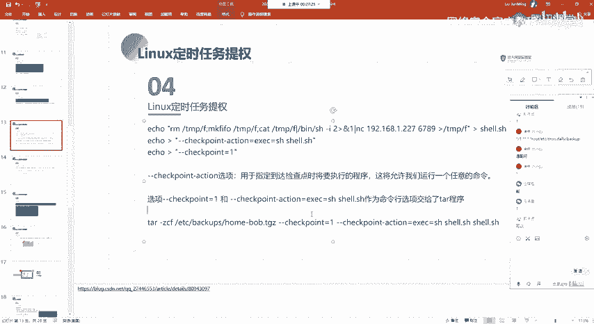

呃，他在做一个打包的这个操作的时候的一个过程。

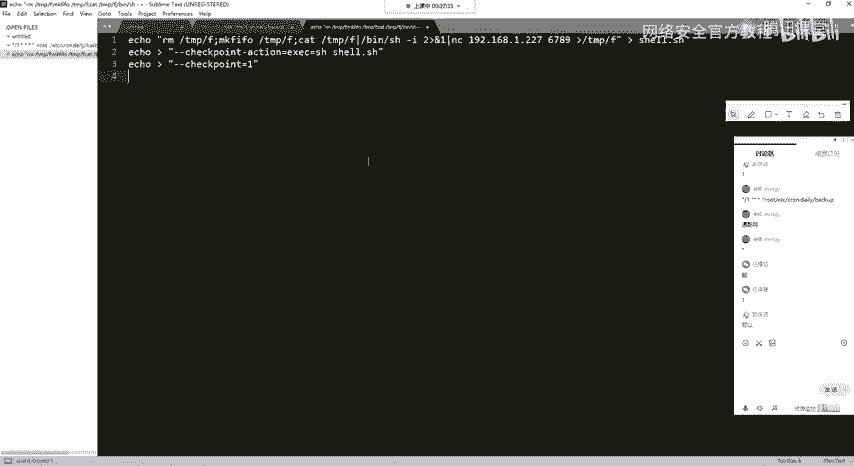

首先的话，我当前的话是在这一个目呃。我当前的话是在这个bob的这个用户目录下面，对吧？因为我当前的话是一个bob用户嘛，所以的话我的一个加目就是home bob嘛，对吧？然后的话我当前是在这个目。

那么他的一个电池任务，他在呃打包的时候，对吧？当这个I。

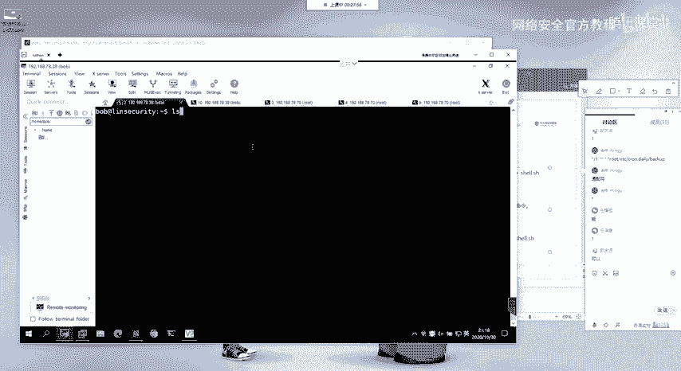

当这边的这一个I。等于bob的时候，那么它就会进入到这个bob用户目录下面去打包我当前的所有的一个文件，对吧？然后它执行的一个命令的话就是t。

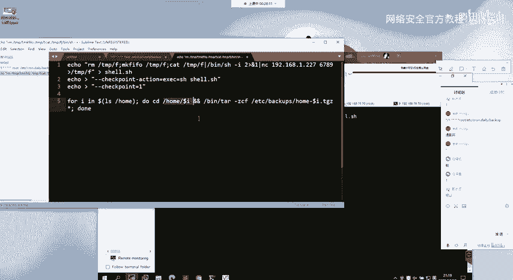

呃，当前新的话就是它其实就是在我当前的这一个目录下面执行了这样子一个命。

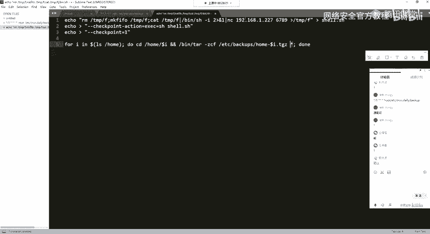

🤧。

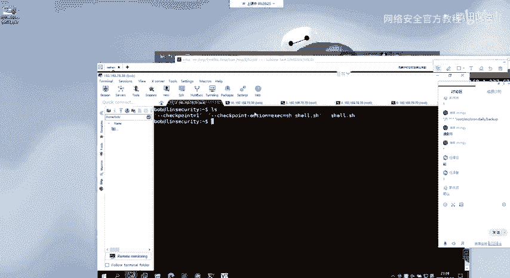

对吧就是执行了这样子一个命令。然后的话他是把我当前的所有的一个文件，也就是这边的这一些所有的一个文件。它通过t命令做了一个打包，对吧？那么实际的话在这边新这个通配服的话，我们前面有讲了。

它是会有一个这样子一个模糊的一个紧锁。它会紧锁当前目录下面所有的这样子的一个文件，对吧？那么实际的话，他当去打包这个bob用户的时候，他实际执行的一个命令，它其实是这样子的，就这边。

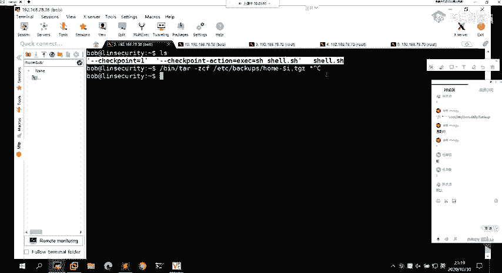

🤧哼。🤧嗯。😊，对吧它实际执行的话就是说我们的一个新的一个通配符的话，它其实就是检锁到了我这边的这一些文件吧，对吧？就是我这边的这一个新的这个通配符，它其实就是紧锁到了我当前目的这样子。这三个文件对吧？

12。三这三个文件。当然他如果还有其他文件的话，就一样的嘛，就是往后面加嘛。然后的话他检索到这一些文件的话，它会去把我这边所有的文件做一个压缩，对吧？压缩到这个文件当中。

那么其实完整的一个命令的话就是像这样子。🤧就是这样子的一个面料，对吧？那么在这边的话。我们就用到了前面的这样子的一个呃它的一个特性就是我们。

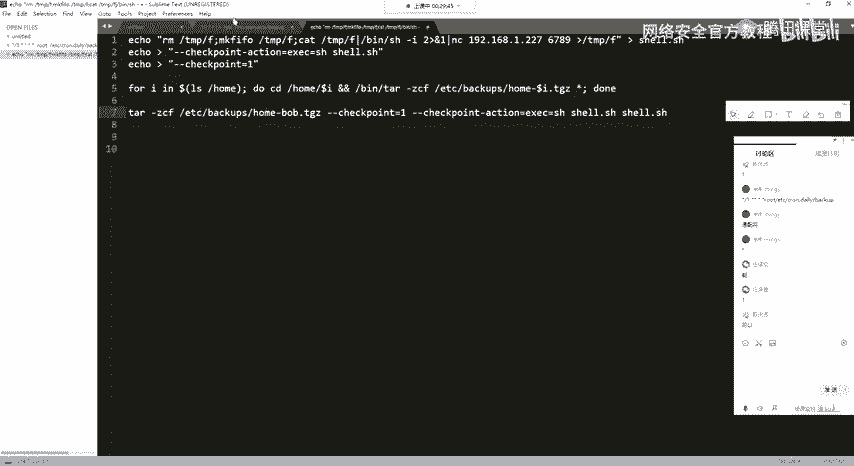

🤧ふ。嗯。嗯就我们。

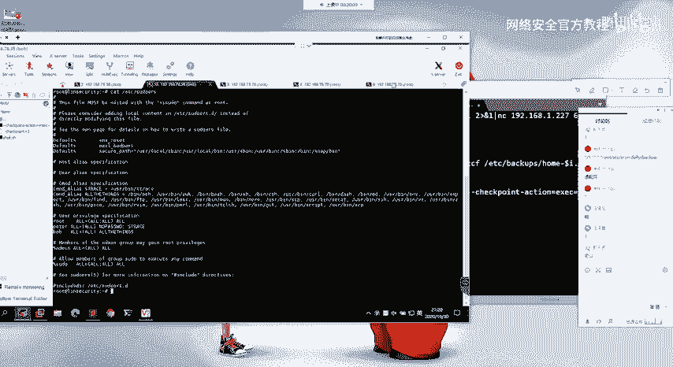

嗯，来。🤧え。就我们的这里啊对吧？我们这边cat这个命令去执行去执行，或者说去查看这一个当前目录下面这个文件的时候，它会把它作为一个选项，对吧？那么在这边也是同样的嘛，就是他这一个命令。

他把它压缩到这边。然后的话他在这边的话，同样的是我们的一个选项，就他会把我们这边的这个文件作为一个选项，以及这边它也是。那么他作为一个选项的话，就是他在这边他会。他当加载到这边，对吧？

他会去执行我们当前目录下面的这个需尔点SH的一个文件，也就是执行我们这边一个反贪希尔的这样子的一个这个需尔文件，对吧？那么。在这边他执行这个需文件的话，它的一个效果是什么呢？就是反他一个显尔嘛。

反弹到我们这边的这1个IP对吧？然后的话。大家还要注意的一点的话，就是我如果说只是单纯的就是在当前用户下面去执行这一个se尔点文件的话，我虽然反他的一个sell，它是我虽然能反他希尔，对吧？

但是它得到了一个he尔，它只是一个当前用户的一个权限，对吧？而不是说我们想要的一个root用户的一个权限，对吧？但是的话他在这边的话就是说它的这个定时任务的话，它是一个root的一个权限去执行的。

就是说它每隔一分钟它会以root一个权限去执行这一个程序。然后这一个程序的话，它执行的话，它同样的是一个root用户去打包我们这边的一个文件的对吧？那么他在打包这一个文件的时候。

他是以root权序去打包的。也就是说他在执行到这边的时候，它是一个root的一个权限去执行我这边的一个需要点SH的一个文件的。也就是我他会以root的一个权限去执行我这边的这个命令。

以及反弹一个root的一个需要给我们。

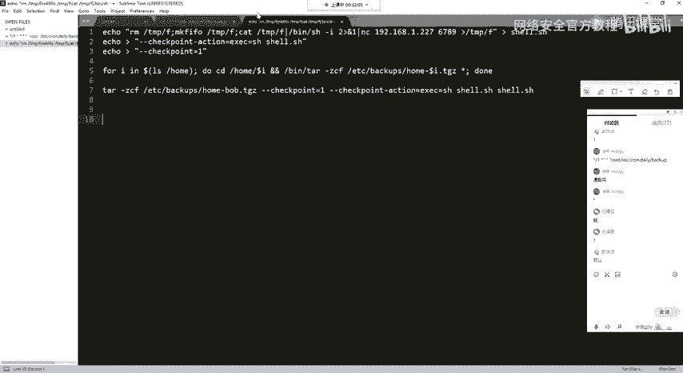

就是像这样子的一个效果。Yeah。

看一下，我这边断一下。W。🤧ん。然后我当前目的话已经呃已经写好了吧，对吧？然后只需要在这边做一个监听。我这边进听一下我的6789的一个端口，然后的话在这边等他定时任务就等他一分钟，对吧？等他一分钟。

他会去压缩我我这边目录的一个文件，那么他就会去执行我这边的这样子的一个需点SH的一个效。

然后我这边就能够去接收到需要，这边的话要等一下。

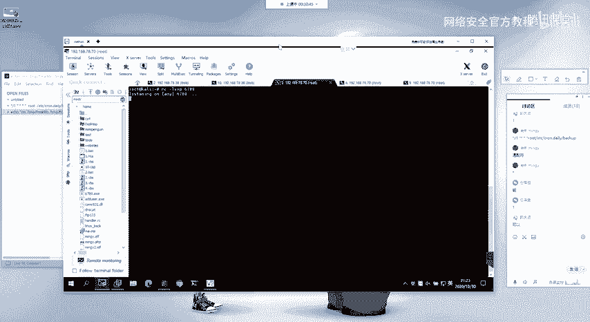

等待时间的话，我们先继续看后面的。


嗯。🤧。那么呃在这边的话就是呃我在这边话就是使用的这一种方法，对吧？就是我首先写一个细2点SH。对这样子的一个需尔的一个脚本，对吧？然后的话通过这样子的一个checkpoint这个选项。

然后的话去执行这边的一个需尔文件啊。然后的话同样的我们这边的这一个需要点H取的一个内容啊，对吧？我们前面这边的一个内容话是反谈一个需要，对吧？我们也可以通过这样子的就是写一个。

就说把我们这边的这一个内容把它写入到我们的一个sda文件当中。就呃因为我们如果说我们前面的这样子的一个操作的话是正确的对吧？


就是说他能够去得到这样子一个root的一个权限。那么我们在这边的话，他去呃执行我们这边的一个需要点SH的这样子的一个文件的时候，它会以root权限去执行。

也就是它能够去呃以root权限去加往这个ss文件当中去加这一部分内容，对吧？这一部分内容的话，就是我们前面也讲了，对吧？就它能够以root的一个权限。

而且它不需要去输入密码去执行任意的一个呃所有的一个命令。


所意的话这边是有空格的，就是而且的话它的这个n past sword的话，这边是有一个冒号。成这样子的一个格式。也就是说我这边的话加入到这个ss文件的话，我就可以通过ss的这个工具，对吧？

就是在bob用户下面能够以ss这个工具去得到一个root的一个权限。以及还有的话就是通过这边我可以写入这样子的，就是ero的一个权限去执行这样子的一个就是给放命令加1个SISSUID的一个权限，对吧？

然后的话我们就可以通过前面的这边的一个呃。放的。🤧Okay。通过前面这边的f以SUID的一个方法来去进行一个得到呃，就这里啊对吧？得到一个root的1个SH的一个选。


就是呃给大家扩展一下另外的一些思路啊，对吧？


就其实就结合了我们前面所讲的一一个内容，对吧？我们可以通过这样子的一些方法来去。


🤧得到一个root的一个权限。


哦，然后的话在这边呃应该就是差不多一分钟了，对吧？在这边的话我就得到了这样子的一个接收到这样子的一个呃BSH的一个谢，对吧？然后它的这个笑的话，它是来自这边的1个78。38，也就是这边的这个机器。

那么我们在这边的话，我就可以。呃，之前货卖可以看到当前的话是一个root的一个用户。对。


说明的话我我们这边的话是呃成功的达到了一个提全的目的。


Okay。然呃效果的话就是像这样子。Yeah。最终的一个效果。然后呃以及的话就是说关于这个历定时任务提全的有相关的这样子的一个实用，就是这样子的一个w hub的这一个靶场。

大家可以去那个我们的一个实验室上面去做啊。然后大家也有VIP有会员，做这些话都是免费的啊。


Okay。

Yeah。


呃，呃，建议大家去做一下，就是这这里的we hub的话，它是一个靶场，它是一个实战的一个靶场。然后它这边的话。呃，大家可以照着指导书做，也可以自己先尝试自己做，对吧？它这里面的话。

它是一个中条性的一个东西啊，就是它。啊，涉及到了就是我们呃渗透设施相关的这样子的一些内容吧，对吧？首先的话就是信息收集端吧，通过给定的IP端口找对应的服务的一个漏洞。

然后通过相应的这样子一个漏洞来去得到吸引。得到吸要之后的话，还有相应的一个提群。对吧然后的话结合我们MSF的对应的这样子的一些利用的一个方法，对吧？得到需要之后的话呃，通过提全。然后在这边的话。

就是他这边也是通过就是在计划任务当中找到了这样子的一个定时脚本，就定时任务的一个脚本。然后通过这一个脚本，它的一个就是它的一个。呃，功能对吧？就他通过他这个脚本那个功能来达到了就是提全的一个目的。呃。

这边的话内容就涉及到内容话，内容的话还是挺多的呀。就是你通过做这边的这一些实验的话，你也能够去学到很多的一个东西。


就综合性的话比较强。P。好，呃，下面的话我们来一起看一下，就是SUID的一个提全。就SUID提全的话，其前面的话也。前面的话已经有有介绍了，对吧？就是SUID的这个权限啊。

主要的话就是理解它的这个权限的一个作用。就我们呃我这边话我就不多说了，因为上节课的话也也介绍了是吧？然后我们如何去利用它的这样子的1个SUID的一个权限呢？

就是我们首先需要去找到对应的就是有这种SUID权限的这样子的一个呃可执行的一个文件，对吧？然后我们可以通过通过放und的命令，然后的话加这样子的个干P。


P干PM的这个参数，这个参数后面的话就是接我们就是指定了这样子的一个U嘛。也就是文件的一个所有者，有SUID的一个权限。


的这样子的一些文件。然后的话通过这样子的一个方法找到，然后的话列出来，对吧？也就是这边的这一些文件都是有ISUID的一个权限的。


Okay。然后在这边的话，就针对这样子的SUAD的这一些文件，对吧？我们如何去利用？


这边的话就又回到了这一个项目嘛，对吧？你一个一个去那个嘛去尝试去呃在这个项目当中去找到对应的一个利用的一个方法。


我这边他就是用这个。呃。我这边话就是举了以这个task set这一个文件啊。


就是。在这边对吧？找到有这样子的一个。Yeah。Okay。Ask a that。嗯。你怎么没有啊？呃，应该是有的吧。哎，我这边不找了，应该是。


有这一个有一个这样子的。Yeah。task set就是我们在这边直接搜一下，好吧，就是这一个，然后的话有SUID权限，对吧？那我们可以去怎么去利用，就通过这样子的一个方法。


我们在这边试一下吧。对，下手对吧，是有这样子一个命令的。我这边的话应该是哎，我懒得找了。然后的话呃通过这样子一个方法，就是一然并SH杠P是吧？E杠B。


拿出去。然后再就话就得到了这样子的一个血。


还不行下换咦。怎么还是爸爸呢？


Okay。


Yeah。看一下。


诶。Yeah。只能办系。

Yeah。我是不是没有SUD的一个权限？没找到吗？


He。😊，怎么这边他没有。谁要就是一个权限呢。


那奇怪了。这边的话呃，我这边的截图话是之前的。这边话是同一个白菜。


呃，我这边给他加一个吧，我。好吧。

算了，不加了吧，就就这样子的，就就这样子。他是如果有SLID权限的话，是可以通过这样子一个方法去得到的。啊，我这边怎么。就没了呢。

就是这样子那个呃直接通过这样子一个方法就能够去得到这样子一个root的一个吸养。呃，那个的话大家自己课后再去自己去尝试，好吧，我这边我就。我就不做了。然后呃同样的就是这边的话就是。

这一个实验同样的也是这一个靶场。就十战马场下面的话，有涉及到这样子那个SUID的一个提群。然后这个实验就是作为客户作业啊。那呃第四部分的话就是阿子阿子的话就是我这边话就其他的这样子的一些方法。

首先的话第一个的话就是这一个隐藏文件，就是隐藏文件的话，就说我们的一个目标系统下面的话有一些就是说有一些隐藏的一个文件。这些隐藏文件什么呢？就是像比如说我们L的话，查看的话是这样子的一些对吧？

那么我L杠LA啊，就是有能够查看到以这种点开头这样这样子一些文件，就这些文件的话，它是呃就通过L。


就列出当前的一个目录文件的话是看不到的对吧？那么在这样子一些文件当中的话，我们可能去找到就是说啊一些隐藏的这样子的一些文件，包含有敏感的这样子的一些信息，对吧？我们可以。

通过这样子的一个放und的命令来去做一个紧锁。


就是这样。通过单的命令。然后这边的话就是。查找这样子的一个就是在home目录下面嘛，就是在ho目录下面就包括了就。就是在ho目录下面，所有的这样子的一些用户，对吧？然后的话他会去查找，就是呃顶顶芯对吧？

就是以点开头的，然后点开头的后面的就是模糊的一个检锁就是。不管后面它是什么，就是只要一点开头的这样子的一个文件，我都找到，我都列出来，对吧？然后的话它是在所有的这样子的home目录下面。

就是所有的这种用户目录下面去查找的。就在这的话就是列出来了，有这么的一些文件，对吧？然后呃像baVM in这一些的话都是我们常见的这样子的一些配置文件，对吧？我们都知道它是干嘛的。

然后主要的话就是我们要去在这一些东西去找到我们就是说可能是用户添加的这样子的一些文件，是吧？像比如说这个。就这一个的话，在这边的话，它的一个文件名就是secret，对吧？就秘密的一个意思嘛。

然后我们查看这个文件里面的话，它这样子一个字符上，我们猜测是它的一个就是这一个苏省这个用户，对吧？他把他的一个密码的话，它记录在了当前的一个目录下面是吧？记录在这个文件当中，对吧？我们猜测它是一个用户。

我们可以尝试去登录。


屎。不是是要。然呃可以看到成功的登录啊，对吧？就我们这样子去尝试，把它作为一个密码去尝试的话是正确的。然后当前的话。我是一个苏省的一个用户。那么书审这个用户他有什么就是特别的一个地方呢？

我们可以来查看一下这个ETC password。看一下这个用户他有什么。呃。没什么特别。然后呃搜 do。啊，说什这个用话不行。诶。这边的话就是说这个用户的话，他不能用搜度啊。

就是他没有在搜的时那个文件当中的。呃，其实就是这样，就是我通过对吧？就查找他的这种隐藏的一个文件，然后的话发现它里面的一个敏感的一个信息嘛，对吧？然后的话就能够去得到对应的这个用户他的一个权限嘛，对吧？


然后第二个话就是这个NFS的一个低权限访问。


呃，这个的话。涉及到的一个东西比较多啊。首先的话就是关于这个NFS啊，就它是什么样子的一个东西，就是一个网络文件系统。它可以允许网络中的计算机通过TCBIP网络共享资源，就一个文件共享嘛，对吧？

然后的话我们可以通过就是搭建这样子1个NFS的一个文件系统来去共享我们的一个文件。


然后的话在这边的话，我们首先对吧。我们可以通过这样子一个方法，就对吧我们从哪里去知道他是不是开启了这样子一个服务呢，对吧？嗯。这边这。给个机器人。就这一个机器。然，这个。


呃，我在这边的话，我在这个呃看你机器上面啊，首先的话我们要去就是说我们如我们是通过什么样的方法去发现呢它是它是有这样子的1个IIFS的1个服务的呢，对吧？


那么肯定的话就是通过我们前面的一个信息的一个收集嘛，对吧？就是。

我们的一个通过这样子的一个端口的一个扫描。


嗯。首以说我们通过Mm啊，我们通过Mapp去，就我们首首先得到这个目标，对吧？我们肯定也会去对它的一个呃IP做一个这样子一个端口的一个探测，对吧？就开探测它开放了那些端口及对应的一个服务，对吧？

然后在这边话就有这样的1个NFS的一个服务开启了，对吧？它的一个端口的话是这个2049TCP的一个端口。然后这个NFS服务开放了，对吧？那么我们通过可以通过什么样的一个方法来去呃获取到它的一个信息呢？

就是通过这个smount这个命令，我们可以通过smount来去查看到这个NFS服务的一个信息。


就是。呃。通过这样子一个命令，杠一加我们的这样子的一个这1个NFS呃。


服务所在的1个IP。然后它是用于这一个命令，它是用于查询NFNFS服务器相关的一个信息。我们在这边在这边它通过修mount来查看这一个我们的一个目标。七八点。三八。对吧来去获取到这一个远程的这个机器。

它的关于NFS的一个相关的一个信息。然后在这边话，它就有列出了这样子的一个这样子的一个目录啊。就列出来这个目录，它是什么意思呢？就是说呃它的这个NFS服务的话，它有就是有共享的这样子的一个目录。

这个目录的话是这个homepe的这个目录。然后的话他把这一个目录的话，它共享出来了，是通过这个NFS的这个呃服务啊。那么那么他这一个目录共享出来了，对吧？那么我们其他的这样子的一些机器，对吧？因为我们。

这1个NFS的这个呃网络文件系统的一个作用的话，就是允许网络中的一个计算机来去进行一个资源的一个共享，对吧？那么它共享出来了我的一个在这个网络当中的一个机器，我就能够去访问到它的这样子的一个目录，对吧？

那么我们怎么去访问呢？访问这一个目录的话，我们需要去用mountt这样子的一个命令来去做一个挂载，就是把我们的这样子的一个。


呃，把远程计算机的这样子这个它共享的这样子一个目录，把它挂载到我们的一个本地。就呃大家可以理解成就是我们前面在讲windows的时候，对吧？那一个用net钥匙来去映射磁盘，对吧？

就我把远程的这样子的一个共享的这样子的一个目录，对吧？把它映射到我本地的某一个磁盘。然后在另令省里面的话。在另的神面的话就是通过这个mount腾面料。就是呃如果大家经常玩 Uni定的话。

应该应该比较熟吧。就这个命令像比如。呃，我以我这边的。服气吧，你。


嗯。比如说我这边的这我这边的这个服务器。我可以通过。Mot。哦是可以通过漫来去查看到我当前的这个机器，它所挂载的这样子的一些目录。然后其实在这边的话。


就比如说你要去把你的一个硬盘，对吧？把你的硬盘，你要去把它呃插到你的这个呃服务器上面去。你插到服务器上面去之后的话，它不会说像windows下面它会自动的去加载，对吧？像比如说它会自动的去加载。

加载到我们的这样子的一个文件系统当中，啊，其实会啊会的。其实会的，就是说你插入进去话，它就会去加载到呃你的一个磁盘。你的一个目录下面。然后在这边的话。

就是大家可以看到我这边的话是我这一个服务器的话是有插了我的一个硬盘。然后的话它的一个硬盘的一个目录的话就是在这边。就DV的SDBE就大家就是应该理解吧，就是linkinux上面的话，一切接文件。

就是就像这种硬盘，对吧？像这种硬盘，它同样的，它是你插入到linkinux系统下面的话，它同样的是把它作为一个文件。作为一个文件或者文件夹的一个形式。那么他这句话，他就是在这一个文件文件下面，对吧？

那么我们想要去把它放到本地去进行一个访问的话，我们需要去做一个挂载。也就是通过这样子的一个命令啊。没有啊。我这边。就这样，我说通过这样子的一个。办法把它挂载了。就是你插入到插你把硬盘插进去之后的话。

它会分配这样子一个呃，它会有这样子的一个呃目录，对吧？然后的话你要去你要去在本地去访问的话，你是需要去把它挂载的，挂载到我们本地的某一个目录下面。然后它其实它也会自动的去挂载到一个目录当中。

但那个目录的话比较长，我一般我一般的话先把它给就是会自己自己新建一个这样子一个目录。像比如说我在root目录下面进一个这样的一个硬盘的一个目录，对吧？然后我把这一个把硬盘挂载到这一个目录下面。

然后我去访问的话，就不用输那么长的一个路径嘛，对吧？然后挂载的一个方法就是像这样子。然后因为呃硬盘上是NTFS的这样子一个格式。linux下面的话，它不是呃不是像NT像windows下面的那个格式。

所以的话我们需要用这样子一个方法去把它转一下。


呃，好像扯远了呀。就其实就是让大家理解就是。同理的话就是说在这边它是一个远程的这样子一个目录，对吧？那么我我们要去访问远程目录的。下面的一个文件。

我们同样的可以通过这样子一个漫城命令去把它挂载到我们本地，然后的话去进行一个访问。


就前面说这些的话，其实就是让大家理解这个。2。

🤧呃，那么的话那么。


P。我现在这边的话，我知道了有他的共享的一个公师这个P目录段。那么我现在我要把它挂走到本地，我声音。创建一个这样子的一个木。啊，创建在这个MNT的。这个冇嘢名。创建一个peter的这样子一个文件夹。嗯。

说错了。创建了一个这样子一个peter的一个文件夹，对吧？然后的话我在这边的话，我通过mount来去做一个。挂载挂载我远程的这一个共享的它的一个目录。点78。38。下面的。劈沉木呃。

画的话挂不到我这边的一个。本地的这样子的一个目录系统对吧？然后这边没有报错的话，就说明挂者成功了。然后的话我就可以在。这一个P准目录下面去查看，对吧？然后在这边呃，你可能你输了IOS你看不到东西啊。

但其实是。就其实是他这一个目录下面它没有文件，对吧？但其实它有这样子的一些隐藏的一个文件，就是大家一定要注意啊，就不是说。就是大家在碰到这种对吧？就你linkux下面，如果你进一个目录下面。

你哎你连OS，你发现你没有下面没有东西，你就不要真以为里面没有东西啊，对吧？你可以通过加一个这个概位参数啊，就我们一般的话习惯是用L嘛来查看是吧？但是这个习惯也是你可能因为这个习惯你就。

没有发现有趣的东西是吧？加一个杠A加一个杠A的话，你就能够去查看到这样子的一些呃一点开头的这样子的一些隐藏的一个文件，对吧？就其实在这边的话，他是。有文件的对吧？也就是我这边的话。

我这边的话是呃这边的这一个文件的一个内容啊，其实是我这边远程的这一个bob这个用户啊，不是这1个78。38这个服务器上面的这个peer用户的一个呃加目录下面的一个内容。就是。就这这就这一些，对吧？

那么在这边的话，我们就是我们进入到它一个目录，对吧？因为它是一个这样子的一个文件共享。那么我们可以去尝试去。呃，写文件对吧？比如说我在这一个目录下面，我跨起一个文件。

那么它其实它会同步到远程的那一个呃共享的一个文件夹当中，对吧？因为我这边的话挂载到本地的话，它其实我我在这边这一个目录下面操作的话。

它其实相当于就是在远程的它的那个home干peer这个目录下面去操作的。那么我尝试去跨起一个文件，然后我发现的话没有权限。就没有权限，为什么呢？就是呃大家可以看一下，他你会发现有这样子的。

一个一串字符对吧？就是说原本的话在这边。就正常的话应该是。嗯。就正常的话应该是有这样子的一个。像比如说如果说你是一个root用户，那么他你这边话就是root嘛，对吧？比如说普通用户就普通用户的这样子。

就说它在这边显示是这样子的话，就说明我当前的这一个系统下面，就我当前的这个看理机器下面没有这样子的一个呃没有这样子的1个UID为1001以及GID为1005的这样子的一个用户。

所以的话它会显示为这样子的1个UID以及GID的一个形式。呃，在这边的话。我以一个例子为例吧，就比如说我又。我又在的一个用户吧。あん。pa13的一个用户的，然后我可以查看一下我的一个pasword。

然后在这边的话就有他有他会去分配这样子的1个UID以及GID对吧？就是1004。都是104。那么我在这边的话呃。我在这边。当前目录我创建这样子的一个文件。我。啊，不唱了吧，我就改吧，就。就改这1个1。

BT的这个文件，对吧？1。BT的话，它是一个rootro的对吧？那么我把这一个。note note改为test 一三。到一点接机。对啊。他的一个就是用户都是t的123，用户和主都是t的123，对吧？

然后的话我在这边的话，我。d我把这一个用户给删掉。然后的话你再去查看这个一点变器。你就会发现他这边显示的话是UID为1004，以及GID为1004，对吧？因为我当前的这一个系统下面的话。

它没有这样子的一个用户。对吧我这边删掉了嘛，他没有这一个用户，所以的话这边它会显示这样子的一个数字。这个数字它就表示这一个用户是UID为这1个GID为这一个的这样子的一个用户。🤧Yeah。三。

然后同椅的话在这边的话应该就能理解了吧，吧。就是我这边的话。这一个目录下面它是这样子的1个101UID为101001GID为1005的这样子的一个用户。对。

那么呃我们知道这边的话是它的一个peter这个用户的一个账目。那也就是说明我当前这个系统下面的话是没有这样子一个peter的这个用户的，对吧？别听。我们可以来看一下，对吧？确实是没有这一个P图用。

所以的话它会显示成这样子。那么在这边的话，我们就可以尝试。我自己去，因为我当前是没有权限的对吧？因为这一个peer用户，他是要peter的一个用户，他才能够去进行一个写入的。

因为他是peter的一个加目录嘛，对吧？只有Pter的一个用户，他才有权限。那么我们是不是可以尝试说我自己我在这边我自己因为我当前的一个系统，它是没有Per用户的，所以他。


没有权限，对吧？不。那么我通过就是说我自己来我在我当前的这个开启器上面，我去创建这样子的一个peter这个用户是不是能能行呢？啊吧？就是创建这样子一个peter用户来去呃欺骗。

或者说来去伪造这样子的一个文件所有的1个UIDGID来去批欺骗这1个NFS的一个服务器。


那么具体的一个步骤的话，就是我们通过这样子的一个方法。首先的话我们需要去添加这样子的一个组，就是鸡呃pet组啊。奥特曼。


呃，再去创建这样子一个用户。创建的这个用户的话，UIDGID话要分别为这边。这边的这个对吧？因为他你只有这边跟这边都是对应的话，他才能够说就是说那边呃IIFS服务器，它才能够识别出这边的这个用户。

它是一个peter的一个用户。对吧。


嗯，具体一个步骤的话就是这样子，我先。添加一个这样子的一个peter的这样子，就GID为1005的这样子的一个呃Pter组。

要通过。Grop 8。然后的话呃添加一个这样子的一个用户。

就添加这样子一个peer用户，就是UID和GID分别为1000以及1005的这样子的一个用户。

嗯。看看那呃我这边的话就是创建这一个用户，对吧？他这边的话需要你输入密码，对吧？我这边的话就输入1个PPR对吧？TT啊。然后的话呃符文内容的话，这边我也不管。啊，确定确定之的话。

我在这边的话查看一下这个password。这边的话就添加这样子一个批次用户。然后这边的一个用户的话，它是UID是1001GID是1005，对吧？然后的话我们再来看一下这边。

我再来看一下这边呃挂载的这个目录啊，就原原来的话它是这样子的对吧？然后下面我们再来看一下，可以看到在这边的话，它就得到了这样子，就是它显示的是peter，对吧？

也就是说我当前的话是有peter的这样子的一个用户，对吧？我因为我当前系统上面是有peter这一个用户，以及他的这边的一个呃权限的话，它得到了，就是说它是用的我的这样子的一个peter的一个用户。

我在这边显示的话就是P材的一个权限，对吧？然后我现在的话，因为我当前的话是一个P材的一个用户。呃，我当前不是。


我这边的话。


我们先就是要切换到这样子一个peer的一个用户，对吧？因为我当前是一个root用户，我root用户我在这边去创的话，他那边他不认识。

然后他认识的话，他这边只认识的话，这只认识这个peer用户。所以的话我们要先切到这样子的一个peer这个用户下面。对啊，我切到这个P准用户下面。时间然时间。对吧然后我当前的话是一个peer用户。

以及呃这些文件的话都是peer用户的。那么我当前在peer用户的这个加目下面，我是不是能够去创建文件呢？我当前是一个peter的一个权限，我们来尝试一下，对吧？可以看到我套起123。然后呃那口。さん。

然后我开一下123。对吧没发现的话。我当前我暂我当前我切换到这个P用户的话，我就有对这一个文件有写的一个权限了。对。也就是说我现在的话我现在在这个梦下面创建了这样子的1个123的一个用户，对吧？

那么在这边的这个peter用户。我们来看一下吧。Yeah。嗯。我们可以来查看一下这样子的一个澳下面的。这个皮草。用户对吧？然后你会发现在这边的话就多了1个123的一个文件，对吧？因为在这边跟这边的话。

它其实同步的，也就是我在这边写的文件，我可以把它写入到这个目录下面去了。


然后的话呃。然后的话我现在对吧？我现在可以有鞋的一个权限，对吧？那么我就是不是可以尝试去写相应的一个文件。然后我这边的话就以这一个就写入1个SH的一个公样来去进行一个免密登录。就是我当前的话。

我是能写文件的。但是我这边的话，我执行的一个命令啊，我执行的一个命令，它其实还是在你当前的这个机器上面去执行的对吧？我只是能够我只是得到了这个目录的一个写文件的一个权限？

那么我想要去得到这边的这一个呃这边的这个机器的一个权限的话，我需要去。


我可以去做这样子的一个操作，就是我能够去写嘛。那么我可以去写一个公钥，写1个SSH的一个公钥。然后的话以呃以这个peter的一个用户来去进行一个登录。因为我写入公钥了嘛。

所以的话我不需要知道这个peter用户它是他的一个密码，对吧？我直接就可以去进行一个秘密的一个登录。然后具体的一个步骤的话就是像这样子，我在这边的话。首先去生成这样子的一个公钥以及私钥。就是嗯。

Okay。Okay。然，我这边的话我生成了这样子的一个石钥，对吧？是在这样子的一个点SH的这样子一个幕下面。然，就是这个IDRSA的一个el，以及这一个公钥IDSA点POB对吧？那么现在的话我。


就可以把这边我这边的这个公钥啊，对吧？把它给写入到呃目标机器上面的这一个呃点SH的这个目录下面。


看一下这个公亚力。


对，这是他的一个。就它的一个内容。然后的话我们。我们要写入到他的这个。皮草目录下面。嗯。Pん。🤧没有。他这边没有这个文件。我这边差一个。🤧Yeah。然后我在。呃，那个文件名有点长，我这边call一下。

怎么没有啊？


Authorated kiss。去。学不到这一个文件当中。先。唉，我先拖起一个这个问题吧，然后的话我再。嗯。


好，我们来查看一下这。把手的K对吧？我现在这边的话就已经写进去了。写到了这个墨下面，我们可以在这边来看一下。Okay。

Yeah。对，然后在这边的话就。然后再。然后在这边的话就已经写入到了他的这一个。呃，authorki这个目录就是我们的一个公钥的话。

就要写入到就是要写入到呃我们的目标机器上面的这个目录下面这个文件当中要写进去。然后的话我们在这边我们就可以通过SOH来去进行一个秘密的登录。你面登录PPer。以Per用户来去登录这个19201682。

78。38的这个机器，对吧？然，后这句话嗯，yes。我们在这块没有输入密码，对吧？我这边的话就进入到了这个peter这个用户。就得到这个peer这一个权限。然后在这边的话嗯。

我们的这个peter这一个用户啊。Okay。我们的这个peter的这个用户啊，他我们可以看一下，他其实也是一个普通的一个用户，对吧？它不是一个很高权限的一个用户，就是就一个普通用户。

我们通过这样子一个方法得到了他的这个peter这这一个普通用户的一个权限，对吧？但是他在这边的话有这样子的一个权限，就这一边有一个多可的一个权限。


🤧。然后在这边的话就是呃涉及到了。


这里啊。最后的这一个do主题选就是。呃，大家看预习内容吧。

🤧以及看一下这篇文章。呃，这边的话虽然是英文的，你翻译一下的话就知道就是。通过do口的一个升级的特权，就是通过多口的一个组的一个权限来去进行一个权限的一个提升。然后他在这边的话，就是他的一个作子的话。

他呃添加了就是说他用。他做了这样子一个多口的一个镜像。然后的话如果你发现就是说你得了这个用户权限，它是一个多可族的一个传员成员。那么你可以通过这样子一个方法。就是直接执行这一个就是这一个灭话。

它就会是起一个容器。它起了这个容器，的话它是从这边拖下来的，这边的话是它的一个镜像地址，然后的话它会起拖一个容器下来，然后拖一个容器下来之后的话，在这边上我们就能够去得到这个线。


原来。看一下。还の。嗯。呃，在这边的话呃需要有一个前一天，就是你的这个机器。0网，就是你要能访问到这边的一个网络。就是你要能访问到这个镜像。然后这边的话，它起这一个多口的这一个镜像的话。

他首先会去在本地去找是不是有这样子的一个镜像。如果没有的话，他就会去呃远程的去拖。脱取这样子一个镜像。然后的话基于这个镜像来去创建一个容器。这边的话。有几十道可能要稍微等一下。


要10点钟。


好，呃我们先来看一下实际的一个效果吧，实际的一个效果话就像这样子。


它呃把这个镜线拖下来之后的话，它会自己的启动。启动之后的话，它会进入到这样这个选。进入到的这个需要的话，就是一个root的一个需要。然后他就是利用的他的这样子一个do组的一个权限。

因为这个Pt用户它有这个do组的一个权限。那么它可以通过这样子的一个do组权限来去得到这样子一个root的一个权限。


，呃，以上的话就是我们本节课的所有内容。大家有没有什么疑问？どう失れだ。Yes。呃，大家觉得。呃，能听懂吗？就呃觉得有问题的好不觉得没问题的以及能听懂的在讨论区扣个一。然后觉得有问题的。

然后就是你指出哪里，就是你觉得哪里。听不懂或者说哪里有问题，你现在指出来，我再给你讲一遍，可以吧？计划任务那里。🤧嗯。我。🤧嗯。定时任务吗？这里吗？呃，具体一点。Yeah。直接创建一个需要，你直接创建。

你怎么创建需要呢？就是说他这边的一个定时任务啊，不是说你能够去写，你能够去往这个定时任务里面去写的呀。你知道吗？他的这个定时任务的话是已经挟时了，就是说它是这样子的。不是说定时任务你能够去写。

然后的话你直接写一个C尔，对吧？那么你电时你能够去写定时任务的话，你直接那你不直接定时任务反弹需尔不就可以了嘛，对吧？它在这边的话，它在这个定时任务的话，它是它的这个配置，它使用了一个通配符。

就是这边的一个新。知道吧？他的一个问题的一个点的话就是通配服这边用心，就他用他的。然后我们利用这个他的这个通配符的一个注入，我们注入了这样子的一个呃选项。这个选项的话，我们是因为他他他就去打包。

这个幕录下面的一个所有的一个文件的时候的话，他用通配符务的一个方式，他会去检锁下面所有的这样子的一个文件，对吧？然后的话他在用他执行这个命令的时候，他其实是实际的话是执行的这样子的一个命令。对吧。

而不是它实际是执行的这样子一个命令，然后他会把这边我们原本是文件的，这样子个命令，它会把它作为一个选项去执行。然后具体的话其实实际的一个利用点的话。

就是这两就这个checkpoint action的这个选项。他能够去执行这样子的一个呃，后面接一个命令。然后我们这边执行的一个命令的话，就是执行我们当前目录下面的这个需要点SH。嗯。能理解吗？🤧嗯。


为什么要创建？明白了？就是说这边的这个SH点下的话，我们是在当前的这个普通用户下面去创建的对吧？🤧K。然后我为什么要去创建这一个呢？就是因为我要去我构造的这一个对吧？构造的这一个选项。

他再去他去去检索这边的这一个文件的时候，他会把这边的一个我这个文件作为一个选项。然后这边的这个选项的话，在后面可以接一命令。接了这个命令的话，它就会去执行它，对吧？


就是他的一套命令的话，就是我这边写的嘛。


他就。他到这边对吧？他到这边的话，他就会去执行这边的一个希尔的希尔的脚管嘛。


然后的话他就会去执行我当前目录下面写的这一个嘛。おと。这边有点慢啊。嗯。明白了。还有其他问题吗？🤧。🤧う。Okay。Yeah。这手机什么意思啊？就是这。你道我。呃，其他同学呢其他还在听的同学。能理解吗？

就有有没有问题，有问题直接提啊。或者哪里我你觉得我没讲好的吧，你可以直接指出来。H。Okay。呃，应该是都没有什么问题了，是吧？好后嗯这个的话这个的话大家自己来自己去尝试吧。好吧。

就实际的一个效果的话是能达到的，这没有问题的。

就是我PPT这边的一个这边的这一个效果。这边的话。


他这要下的话。还要一会儿。好吧，呃，大家没有问题的话，就下课吧。She。好吧。😊，🤧应该是没有问题。呃，那么下课大家早点休息。

