# B站最全网络安全教程，整整1300集，全程干货无废话，别再盲目自学了，看完学不会我退出网安圈！（web安全｜渗透测试｜内网渗透｜CTF） - P99：98. 第四十八天：Mysql数据库提权-1.mp4 - 网络安全官方教程 - BV15u4y137cQ

。

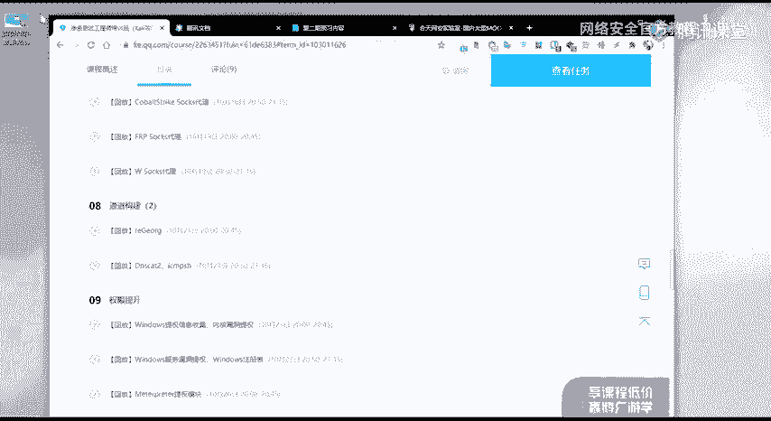

Yeah。

Yeah。🎼，🎼，🎼你的世界有你奔走，还想要继极许度。🎼我和你唱的成就，只有执着到死不放手。🎼让自己没竞争斗，每天都自我解。🎼对谁的温柔自守，爱情里的消丑。😔，🎼你不同。🎼多久。🎼的罪眠就像背饮酒。

却结恋失守。🎼不奢求。🎼你走，可最后。🎼你想来。🎼有选走。🎼怎么写？🎼爱的你先不。🎼不动心动。🎼不死心了。🎼一こ？🎼呼息中被。🎼如今我。🎼爱是仿佛以后。🎼后不。🎼一生不。🎼爱了。🎼怎么好动心的我。🎼。

🎼假如。🎼不停。🎼你在飞雪坠落。🎼我先来现。🎼天空。🎼Yeah。🎼直间有你奔走，还想要继续逗留。🎼看理场的成就，只有执着到死不放手。🎼让到自己每天真都。🎼都想互前有。🎼谁说可以甘作身手，终究一个人走。

🎼对不。🎼了多久。🎼喝着闷酒像杯饮酒，却接恋失守。🎼不。🎼我有。🎼你走，我接受。🎼你生爱。🎼有先走。🎼怎么写？🎼做爱的你全部。🎼跳动心容我的自心郎。😊，🎼每记一错。🎼当初。🎼谁穿着我。🎼其实坦淡。

🎼一切。🎼爱等你全部。🎼怎么后动显让我不行了。😊，🎼再见。🎼那个人。🎼，🎼嗯。知道吗？爱过。就是一生一世。Oh。Oh。あ。あ。🎼看看。Yeah。🎼其实很简单。😔。

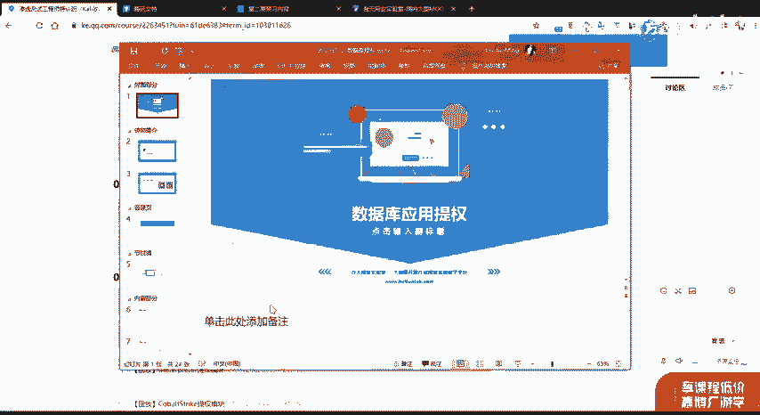

🎼其实很自然。😔，🎼两个人的爱哟。😔，🎼其实并不难。🎼是你太悲观。😔，🎼隔着一道墙不，跟谁分享，不想让。😔，🎼你为难。🎼你不再需要。😔，🎼我想你是爱我的。😔，🎼我在你一生。😔，🎼但是怎么说，总觉得。

🎼我们之间有了太多空白格，也许你不是。🎼我。🎼爱你却又该割舍，分开，或许是选择。😔，🎼看叹也可。🎼是我们的缘。😔，🎼你性命了。🎼我觉得这个就是我们两个之间的命运。And然。🎼我想说的是我爱你。🎼答应我。

离开我。🎼我承你是爱我的。😔，🎼我猜你也生一切都不是我想要的，我想要的只是跟你在一起得。😊，🎼我们之间留了太多空白格，也许你不需。🎼我的。🎼爱你却又该割舍。🎼开或许是选择。😊，🎼反的也可能。🎼与我们的。

🎼台也可能是我们的缘。😔，🎼嗯。🎼Yeah。我爱你你吃道的。

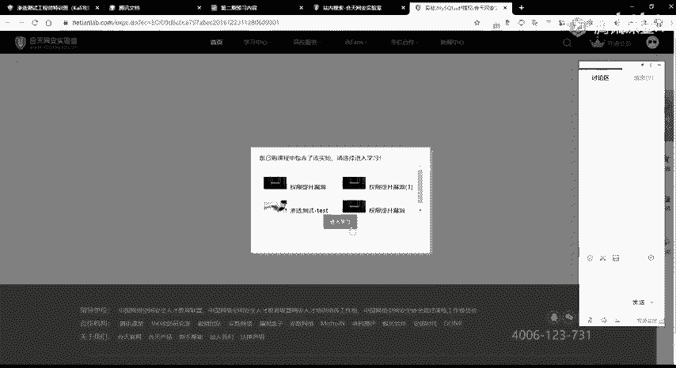

🎼，🎼想象之中。🎼雨过一道彩虹。🎼抬起了头，四扫黑色天空，傻想之中付出会有结果。🎼我保留信封你的承诺。🎼就像这种这次要爱很久，我生火，你眼里的温柔，日月以后。😊。

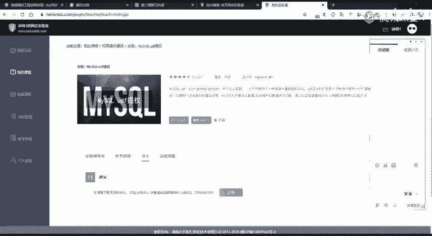

🎼你忽然的冰冻。😔，🎼若两人丢给我去承受。🎼想象中。🎼然不通。🎼想象中一切都是后来不同。🎼我承认曾经那么心动。

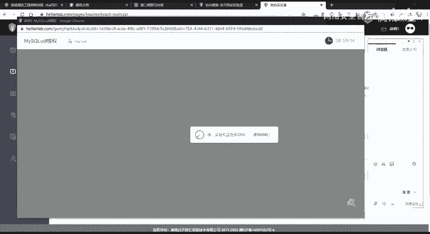

🎼お。🎼想象中慢慢恋着。🎼回忆换不回你的温。🎼Oh。🎼最后夜不是故作了。🎼转过头，我怎么又一滴泪落。🎼没想象中那么脆弱。🎼形容也被消瘦。🎼一起祷。🎼几座春秋。🎼爱不是追逐战友。🎼第。🎼，🎼对。

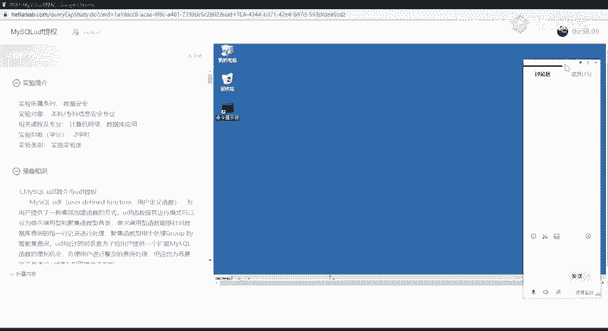

呃，大家晚上好。

呃，能听到我声音以及呃我的声音没有杂音，的在讨论区扣个一。嗯。Yeah。嗯，好的，应该是没有什么问题啊。呃，那么就正式开始我们今天的一个主要内容。我们今天的话主要给大家介绍一下数据库的一个应用提群。啊。

就前面的课程的话都是给大家介绍了，就是说windows下面的这种系统的这种提全，对吧？然后的话像我们的常见的这种呃数据库的一个应用提全的话，前面没有介绍到，然后本期的话主要的话就是介绍这一些。

就因为我们呃经常的话对吧？我们通过这样子的一个web的一个应用。而你一个web应用的话，那么它肯定会与有与这样子的一个数据库的这样子的一个交互，对吧？以及我们常见的这样子的一个srcle输入的这种漏洞。

对吧？它都是啊有这样子的一个数据库的。那么当我们在拿到这样子的一个，比如说拿到一个we share，对吧？然后的话拿到这个we share之后的话，它里面的话有这样子的一个数据库。然后这个数据库的话。

我们可以利用它来干什么呢？然后在本节课的话，我们就呃给大家介绍一下，利用了这样子的一个数据库的这样子的一个应用来去进行一个提全，来去得到呃这一个呃服务器的一个权限。就说原本的话我们得到的是呃。然后我。

我们得到了一个web share，对吧？然后的话呃对应的这样子的一个数据库。我们可以通通过它来去进行一个权限的一个提升。Yeah。啊对。然后呃本节课的话就是呃关于数据库的一个应用提群的话。

我这边呃主要的话分为了3块内容。然后本节课的话就是给大家主要介绍my circle的一个提群，以及my server的这样子的一个提群。然后关于这个posts correct cycle的话。

我放在后面的那一节课给大家做一个介绍。因为呃放那一节课的话讲不完就。所以的话本期课主要给大家介绍呃mycycl的一个提全以及s server的一个提全的一些呃详细的一个操作。呃。

第一部分呢就是这个mycycl的提全。就关于mysq数据库的话，大家应该都是比较熟悉了，对吧？就是呃也是我们经常进到以及经常使用的这样子的一个呃数据库的一个这样子的一个呃引擎，对吧？

然后的话呃再去了解什么是在去了解mysl提全之前的话，我们一起来了解一下就是什么是UDF。比如是说我们本期的话会去使用到的这样子的1个UDF。呃，用户定义函数。

然后这个呃UDF的话就是这个user defined function的一个景显，就是用户定义函数。它的一个作用的话就是为用户提供了一个高效创建函数的一个方式。

然后呃具体的一个创建函数的一个方法是通过这样子的，就是说我们可以去编写一个这样子的一个调用系统CMD命令的这样子1个UDF的DLL的一个文件。然后的话这个DL文件的话呃，关于这个DL前面应该有介绍吧。

就是呃一个动态链接库，对吧？DL就是doman呃doman linklib这样子的一个动态链接库是吧？然后在windows下面的话，这个DL的话，它的一个作用的话，它就是呃用来去。呃。怎么说？呃。

前面有给大家介绍这个吗？呃，我忘了呃，第一第一期的话是有介绍，我忘了这这一期有没有介绍。就是呃这边的话啊，我先。我们现在一起看一下这个吧。DL就是这样子的一个动态链接库。然后它的DL的它一个作用的话。

就是它呃它的这个库当中的话，它存放着我们的这样子的一个呃共享的一个数据。然后这一个DL当中，就我们呃脑脑海当中有这样子的一个概念，就是呃我们问的系统下面它的各种程序，对吧？它各种程序的话。

它需要去调用相应的这样子的一些呃程序的一个代码以及对应的一个数据，对吧？或者说我们的这样子这个函数，这个函数它是能够被多个这这样子的一个程序去进行一个调用，对吧？

那么我们不可能说在呃每一个呃就是为了我们不可能说在每一个程序它去调用的时候的话，它都写一个这样子的一个函数，对吧？或者说写一个呃写一份这样子的一个代码或者数据，对吧？那么我们的个DL的话。

它是一个就是共享的。然后的话它里面存放的这样子一个数据的话，是能够允许多个这样子的一个程序来去调用它来去获取它的一个数据，对吧？所以的话我们在多个程序它去使用同样的这样子的一些数据的时候。

我们可以用这样子一个调的一个呃动态链接库。然后的话这样子的一个动态链接库的话，它同样就是它的一个作用的话，它里面它其实实际的话，它里面是一个函数的一个方法去进行一个书写的。

就是说它我们去调用里面的一个数据，它是通过对应的一个函数。就是一个商品。函数。然后的话呃我们再去调用的时候的话，是通过函数的一个方法去调用。

所以的话我们可以通过这样子的一个调来去创建对应的这样子的一个函数来去实现对应的一个功能。

Okay。呃，关于更详细的这一些的话，大家自己去呃百度一下，好吧。

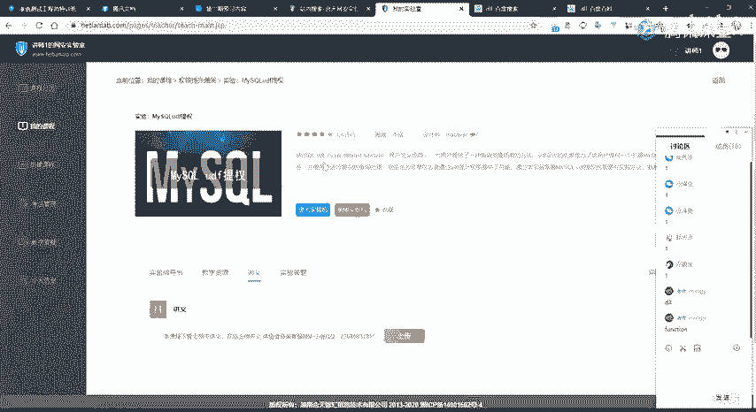

那么在这边的话，我们就是利用的这这样子的一个用户定义函数。就说在my circle当中的话，它支持我们用户去自己去定义这样子的一个函数。那么在windows系统下面的话。

因为我们的这样子的一个呃windows系统下面的话，我们要去。我们要去创建一个自定义的一个函数的话，我们可以通过呃去编写一个这样子的一个d尔文件。

然后这个d尔文件的话是呃里面就包含我们自己创建的这样子的1个UDF的一个函数。啊，我们只需要有这样子一个de的一个文件，我们就能够利用它来去创建一个用户自定义的一个函数。那这块以这个方选为例。

然后的话这个函数它的一个功能的话，就是用来去调用我们的一个系统的CMD的一个命令。呃，linuxlinux上面的话就相当于是调用我们的一个需要的一个命令。所以的话它的这一个函数。

它的一个作用就是去执行命令对吧？那么我们在每在去数据库当中去查询的，去查询的时候，我们可以通过这样子的一个翻群的一个函数来去执行呃系统的一个命令。从而来达到一个提群的一个目的。然后在这里的话要注意的话。

就是呃在呃不同的一个版本下面的话，它的这样子的一个DR函数，它所存放的一个位置，它是不一样的。就是在windows server2003下面，它是呃在C盘下面的一个windows目录下面。

然后mycycl5。1版本之后的话，就我们现在的一个mycycl版本，它都是5。1版本看，是吧？然后它所存放的一个library呃。

这样子的一个调文件存放的目录是在它的一个安装目录下面的libb下面有一个p这样子的一个目录下面。就说这样子的一个目录，它是有什么作用呢？就我们的这样子一个dL文件，你需要放在指定的这样子的一个目录下面。

像比如说my circle5点多的一个版本，对吧？你需要把这样子一个d文件放到这样子的一个目录下面。呃，安装目录下面的libb这个目录下面，你放到这个目录下面之后的话。

你才能够在我们的一个呃mycycll数据库当中来去调用它。对他再去调用这样子的一个deL呃，再去调用这样子的一个de的一个文件的时候，他会去在这个目录下面去找去查找到对应的这样子的一个文件。

然后的话利用它来去创建这样子的一个 function式函数。然后关于这样子的一个。

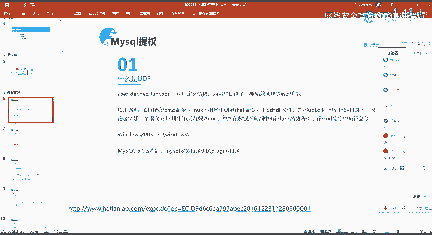

呃，my circlel的一个提群的话，我们本节课的话主要是通过这样子的一个实验。

通过这个mycleUDF提群的这样子的一个实验，来给大家做一个详细的一个。

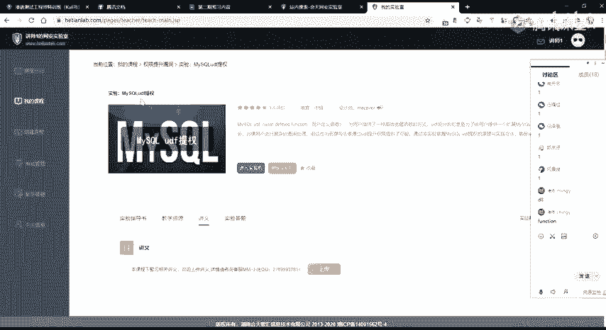

讲解。然后呃这个实间的话，大家可以就是在电脑面前的话，可以打开。现在的话先创建这样子一个虚拟机，然后的话可以待会的话可以跟着我一起去做操作，好吧。

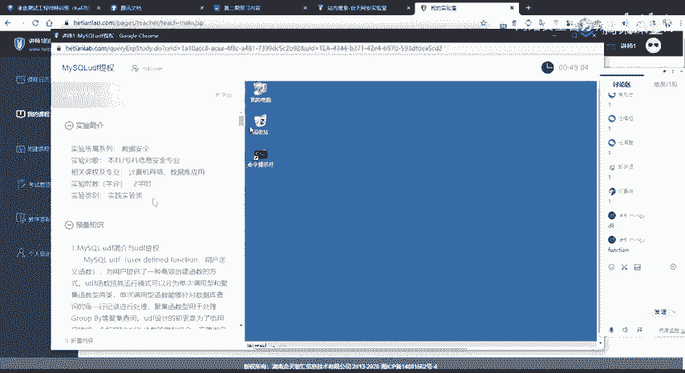

我们一步一步的带大家来去进行一个相应的一个操作。呃，然后第二部分的话就是这1个NTFS的1个ADS牛创建目录以及创建文件。呃，就是在我们这边那这1个UDF提群的话。

我们会去用到这样子的1个NTF这1个ADADS牛来去创建一个对应的一个目录。就为什么会去用到这一个呢？呃，就是在我们的一个mysl的1个5。1之后的这种环境。下面的话。

我们只有去将这样子一个de文件导出到这样子的一个目录下面，就是导出到这一个myql的一个安装目录的这个目录下面。然后的话我们才能够去进行一个呃这样子的一个去使用这样子的一个用户定义函数。好。

当时的话很多时候的话，我们的一个I mycycl下面的话安装目录它不存在这样子的一个libel对度？然后的话如果说它不存在这样子一个lab目录的话，那么我们就算有这样子一个DL文件，对吧？

我们也无法导入到这样子一个lab下面的一个pro目录下面对？所以的话我们呃而且的话我们my circleql的一个文件操作并不能够去直接的去创建目。就在我们的myse的my下面的话。

我们可以通过呃我们的一个select in区out file对吧？Yeah。我们可以通过这样这样子的一个in file的这样子的一个。翻碗。来去把我们数据库当中的一个数据。

把它给导出到我们的一个呃系统的一个指令目录下面，对吧？但是的话你导出的话只是成为一个文件，而不能够说去直接的去创建目录，对吧？所以的话在这边的话，我们就需要去利用它的这样子的一个方法。

这个DFSR的1个ADS流。来去创建一个这样子的一个目录。然后关于这个ADS流的话，它的一个全称是这个就是交换数据流。然后它是我们NTFS文件系统的一个特性。Yeah。它的一个格式是这样子的。

就是呃文件名加我们的一个牛名，加我们的一个牛的一个种类。然后这边的话牛名的话，我们可以省略啊，就是我们的一个。🤧呃，我们去把我们的一个数据存储到这样子的一个呃数据流当中的时候。

我们可以通过这样子的一个流来去呃就是来标识这样子的一个数据流的一个呃名字。然后留种类的话，就是我们这边的一个str stream type。然，stream time的话，我们可以设置为这一个。

其实我们在这边的话，通常的话就是这边的一个streamam time type的话，通常看到的一个文件的话就是这一个date流。也就是说我们的一个数据，就比如说我们的一个文本文件它。

就是这样子的一个数据流b流。然后它的其他的这种数据流的话，它是处于一个隐隐藏的一个状态。然后还有的话还有一个的话就是这一个当我们的这一个牛牛种类为这一个的时候，index options。Yeah。

当它为这一个的时候，就表明这一个数据流的一个数组，它是一个文件夹。所以的话。我们在这边的话，我们可以通过my circlel的一个导出数据导出到这样子的一个文件来去创建一个这样子的一个目录。

这边的话怎么去理解呢？就我们刚刚的话有介绍，我们可以通过这样的一个方法来去导出我们的一个数据库当的数据，是吧？然后的话导出数据的话，它是一个文件的一个形式，其实就是我们的一个date牛Adate数据。

对吧？就date流的一个形式。然后的话我们是创建文件，所以的话是date。那么我们要去想要去创建一个目录的话，我们就可以使用这样子的一个这一个牛 indexdex option这样子的一个牛。

然后这里的这一个牛类型的话，就表示我们前面的这个数据牛的一个数组。注意的话，这边是数组，也就是我们这边的一个文件名啊，就是我们这边的这一个文件名，它是一个数组。然后面的话是牛名。

就是我们的这一个交换数据流的一个名字。然后我们设置了是这样子的，就我们创建了这样子的一个文件。那么它实际的话它会创建一个文件夹。文件夹的一个名字话就是这这边的这一个文件名的一个名字，就是会创建一个。

这一个directory pass的这样子的一个文件夹的一个目录。可这边的话可能我这样子。刚说的话，大家不是很理解对吧？我这边的话我。大家可以。呃，跟我一起操作。我这边话创建了这样子一个文件夹，对吧？

然后。我这边打开一个命令提示服啊。

那我。我们呃创建一个文件，对吧？我们常见的话就是我们可以通过A狗来去创建一个，比如说上点pa这样的一个文件。

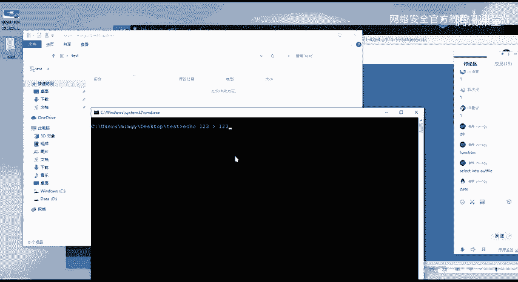

对吧。好，这个的话就是一个正常的一个文件，对？

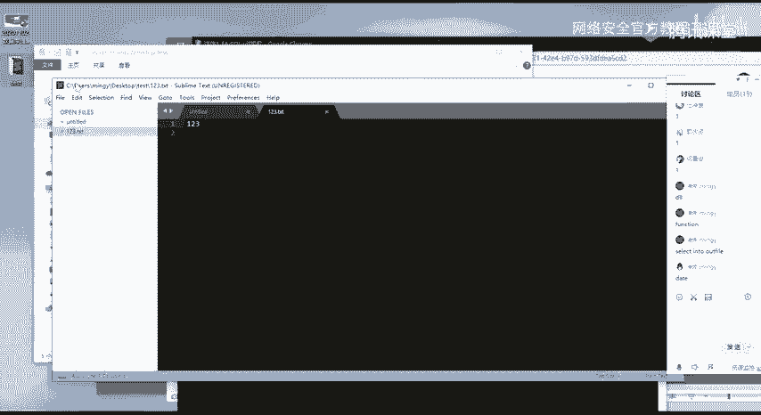

然的话如果说我们想要去创建一个牛文件呢。

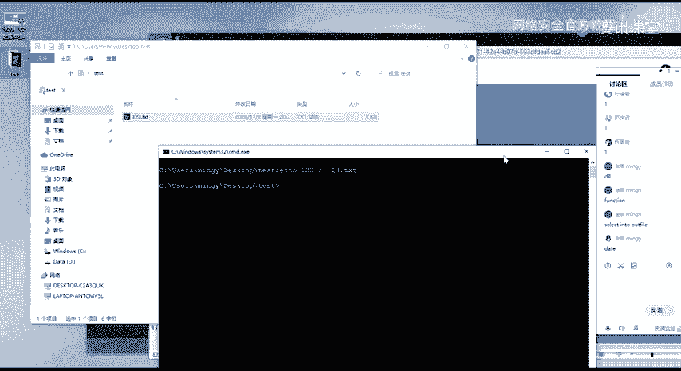

可以通过这样子留一个方法。嗯。あ。比如说我输入一个呃。You fire。哦后。比如说1340它。然呃这边的话是文件名对吧？然后后面的话接我们的一个牛名，比如说。就就有些城市吧。

然后的话接我们的一个呃牛的一个类型。我们的一个牛的类型的话，注意的话是有这样子的一个多了符号开头。然后我们的话是一个date流，呃，就是一个date的一个数据流然呃。Yeah。嗯。😊，不错。一些。

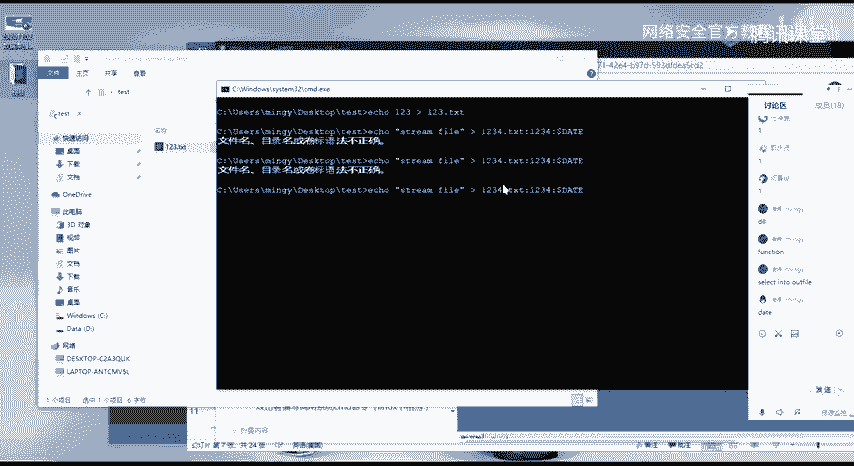

Yeah。这。影戏。看。

うん。

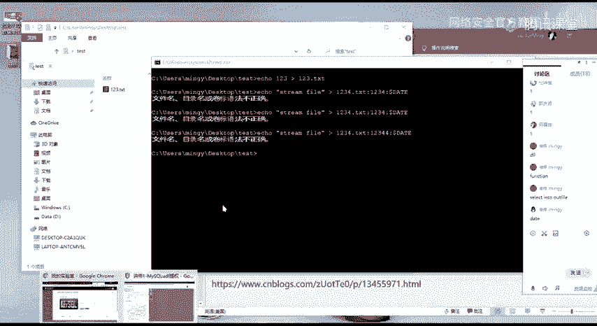

系啊。Yeah。然呃，在这边的话运行的运行内容这边我给了一个链接，就是关于这一个备用数据流的一个比较详细的一个那个。嗯。没错。Yeah。

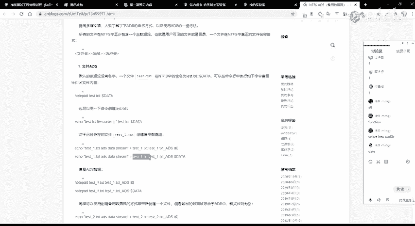

啊，这边我写错了，不是DATE啊被子的话数据的话是DATAL。就这一个代。就数据的话是DATI。时间的话是被子对吧？被子是时间。我这边写错了呀。对，这个的对的话是时间DATA才是数据啊。因为我这边的话。

是大写的呀，是这样是吧然后你会发现的话在这边。呃，我通过创建了这样子的一个，就是我其实实际上是创建了这样子的一个文件，啊吧？然后在这边的话，我是像这一个文件当中就写入了这样子的内种。

但是实际保存到我们windows机器上面的话，你会发现的话是这样子的1个123。

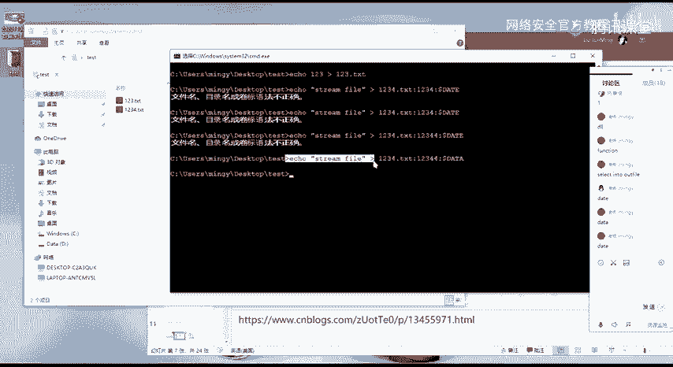

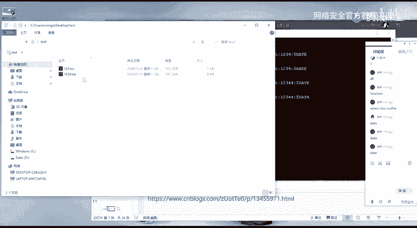

1234点taxt的这这样子的一个文件，对吧？但是这你的这个文件里面的话，你会发现它里面没有内容。

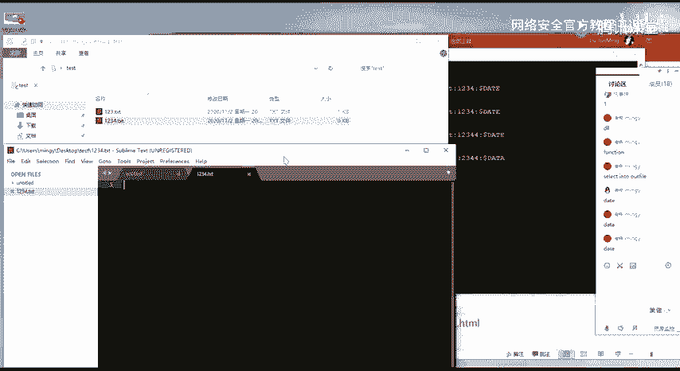

我们可以看一下，我这边通过apple像这一个文件当中去写入了这样子的一个stream file这样子的一个字符字符串，对吧？但是我实际打开的话，它这里面是没有内容，那么。为什么呢？

我们可以通过这样子的1个DIRIIR来去进行一个查看。就是你在这边的话，你会查看到有这样子的一个文件。这个的话就是它的一个牛文件。然后这一个文件它的一个数组的话，就是这个就是1234点text。

也就是我们像这一个这样子的一个文件名当中去写入一个内容的话，它会创建一个这样子的一个文件，就是1234点text的这样子一个文件。然后的话这一个流文件的话，它是呃是这一个文件的一个就是备份流。

呃交换数据流的一个文件。然后如果你把这个文件删除掉的话，这一个文件它也会没有。然后在这边的话，我们通过可以通过note。嗯。就文本编接器嘛。我们可以来打开这样子的一个文件。

打开之后的话在这边你会发现啊我这边打开之后的话，它这里面它就存储着我们想要的一个内容，就是我们刚刚通过apple输入进去的一个内容，对吧？

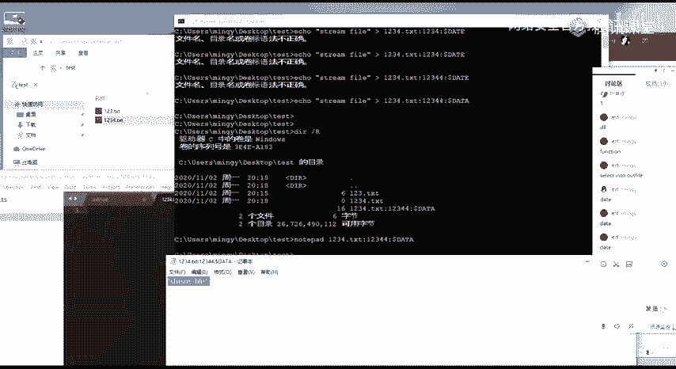

🤧大家有有在跟我操作吗？

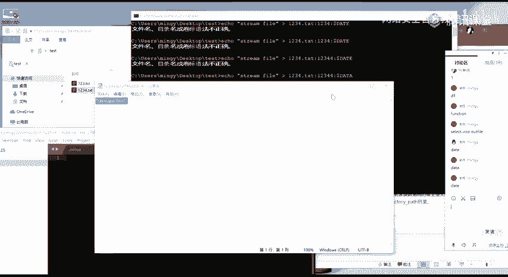

大家可以就是呃可以跟着我，就是我边讲，然后大家可以边跟着我去操作。然后的话在这边的话，但是这样这样子的一个牛文件的话，我们在这样子的一个文件系统当中，你是无法直接看到的，是吧？

而我们需要通过这样1个DII杠R来去查看。

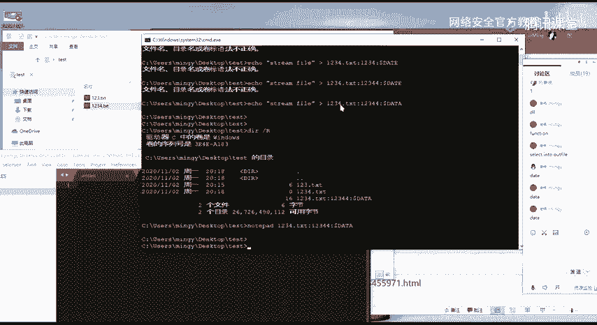

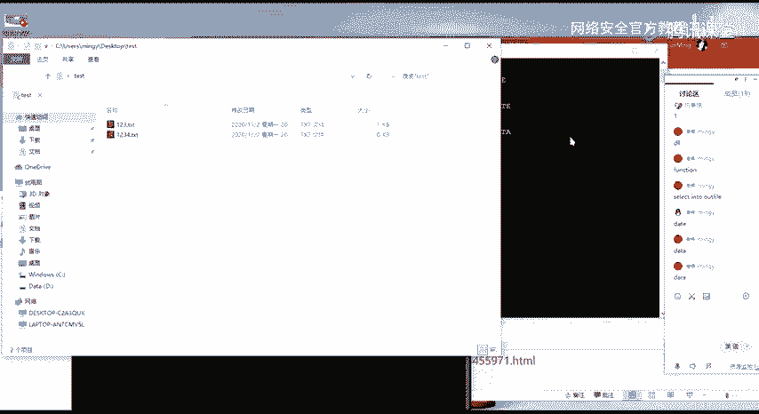

然后这边呢干大写的R的话就是显示文件的一个备用数据流，也就是显示我们这边创建的这种文件。然后呃。然后讲到这边的话，我再就是呃再做点补充，就是啊就我们在去进行一个文件上传的时候，是吧？呃，就是在。

外部安全的就是外部安全的那些课程当中话会讲这些。然后渗透测试这边的话应该是呃没有讲这，因为这些的话应该算是比较基础的一些啊。就是你的一个文件上传的时候，我们再去文件上传去进行一个相应的一个绕过的时候。

你会发现的话呃。就是比如说你看别人的文章对吧？你看别人的文章，或者是说文件上传闹过的这种别人总结这种方式的话，就会有这样子的1个ADS留的这样子的一个方式，就这个。

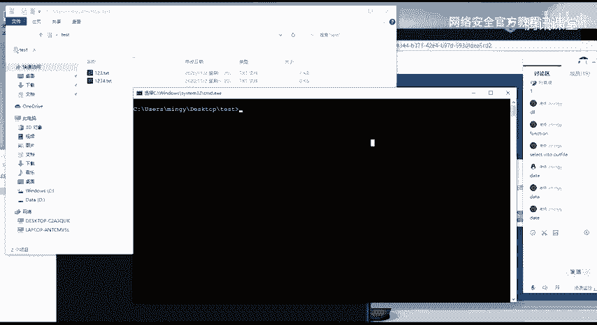

然后他的话就是他会去就是说呃文件上传的那一个点，他对。

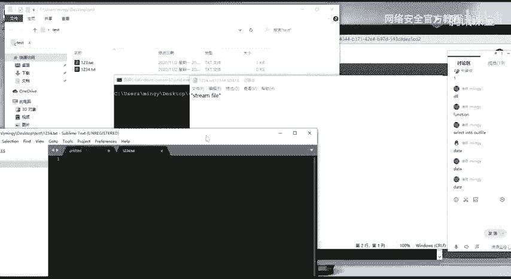

呃，他在对我们的一个文件名有去做这样文件的一个扩展名，有去做这样子的一个性制以及过滤的过滤的话，对吧？然后的话它的一个机器上到window机上面的话。

我们就可以使用这样子一个ADS流的一个方式来去进行一个落ble。就我们再去创建的这样子的一个呃。我们上传一个文件，对吧？就比如说。他的。哦，我们想要。我们想要上传一个这样子的一个夜点3。

13点PHP的这样子的一个文件对吧？然后的话PHP这种后缀的话，那么肯定他是不会允许你去直接去上传，对吧？那么我们呃你会发现的话会有这样子的一个方法。

就是我们可以通过这样子的一个在后面接一个这样子的一个。嗯。节节切。😊，去把你的一个上传文件名的话写成这样子。然后的话如果你的一个目标机器的话，它是一个windows的一个机器。

那么你实际去上传的一个文件名，对吧？他去检查这它的一个后缀的时候，它是这样子。它是这样子的一个后缀。🤧。诶。应该是要加一点。嗯。对吧他说这样子的一个文件名。那么这一个文件名的话。

它没有了这样子的一个呃就是PHP的这种敏感的这种就不允许上传的这样子的一个文件后面是吧？然后实际的话就是说我们可以去绕过它的这样子的一个警测。然后实际的话，在windows系统上面。

我们去写入这样子的一个文件的时候，对吧？就我们在windows系统上面，我们去上传一个文件。我们把我们的一个内容把它写入到这一个文件的时候，它在windows系统上面，它会去它做处理的时候。

它会去生成这样子的一个牛文件。然后它实际的话它会生成一个就是说在当前目录，它会去生成一个这样子的一个。

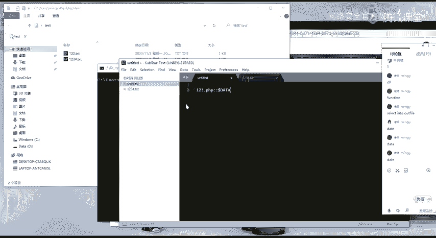

呃，比如说。对吧你实际的话，他再去写入的时候，他会就是你window实上他去写入这样子的一个文件里的时候，他会在它的一个幕下面，它会生成一个这样子的1个123点KP的一个文件。

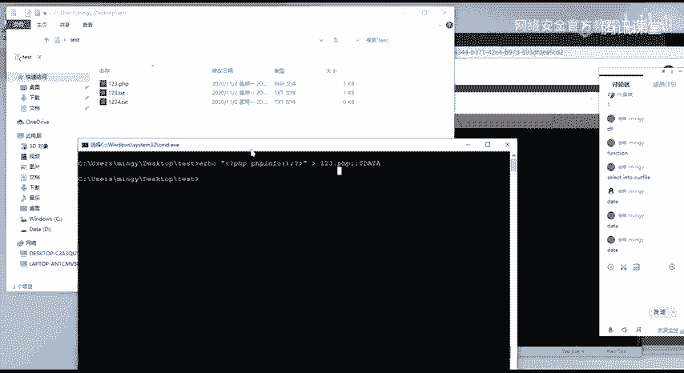

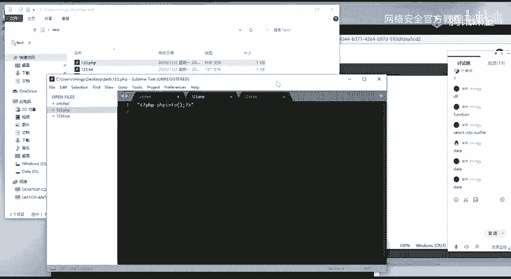

然后这个时候的话，你会发现这里面的一个内容的话，其实就是我们想要的一个内容。

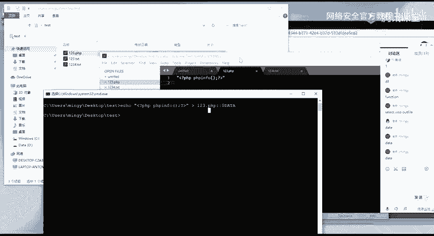

对啊，我们这样子的这这里的话就是1个PHP的一个代码。我们。而且它的一个文件后度的话就是123点HP对吧？那么我们就能够去写这样子的一个一句话来去绕过它的这样子一个文件上传的一个性质。

通过这样子的1个ADS留的一个方法。

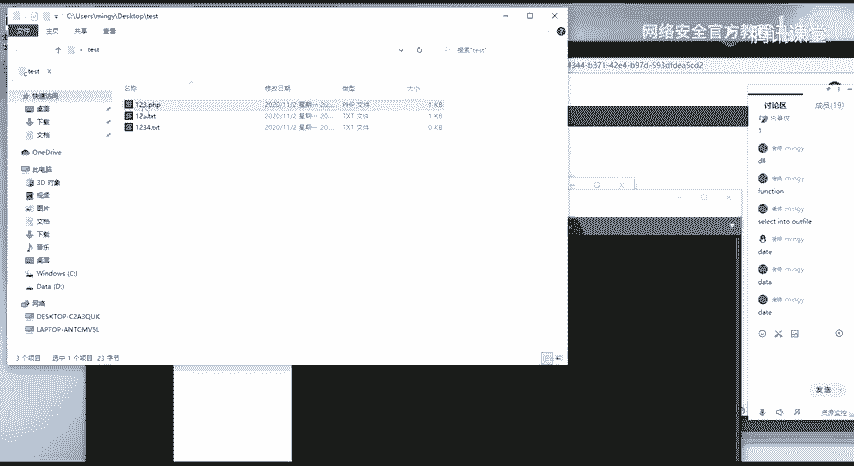

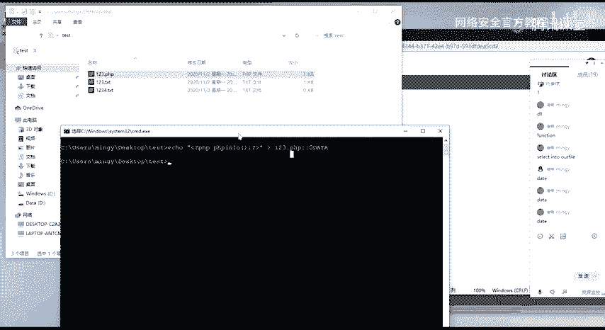

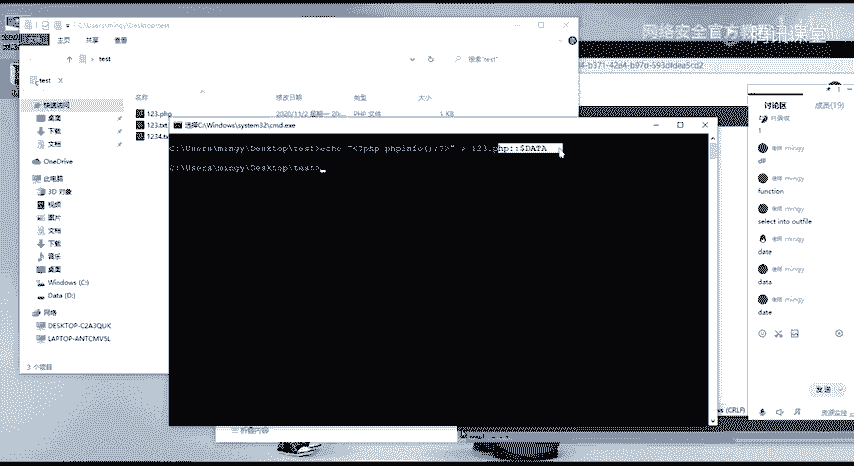

啊，这是一个。

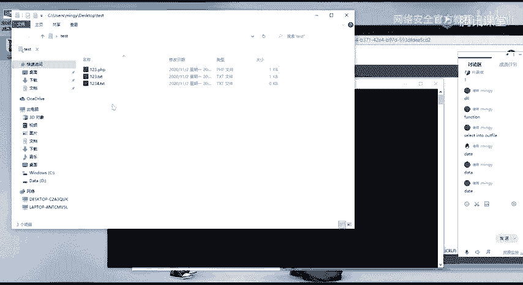

啊，就是。讲到这边的话，就是给大家呃提一下。

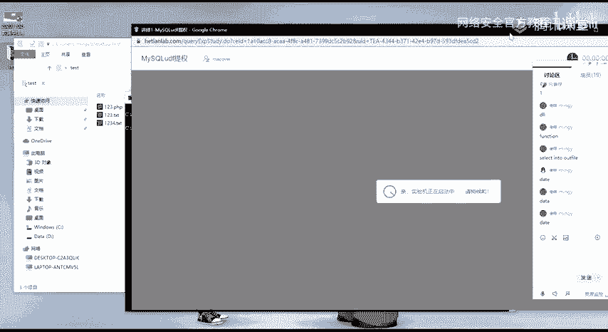

🤧Okay。就是他这边的话，它的一个绕过方法，它就是利用的利用的这1个ADS流啊。

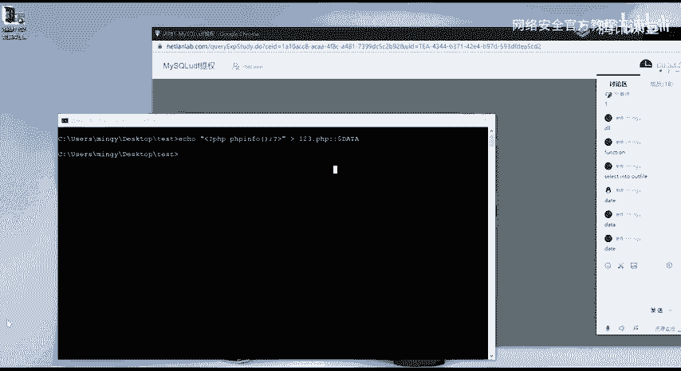

呃，然后的话我们回回来回过头来再去看我们。

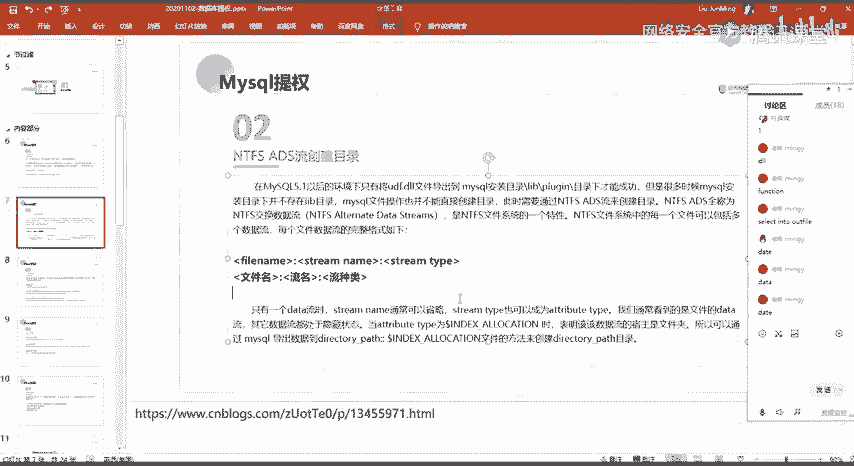

PPT上面的一个内容。然后我们上面它是创建了一个date的一个文件，对吧？然后下面的话我们想要去创建一个目录的话，我们通过什么时打法呢？比如。通过创建目录的话，其实跟我们这边创建文件的话。没事。

然后在这边的话，我们比如说我想要去创建一个。叉到叉的这样子的一个文件夹，对吧？嗯。AAA的一个文件夹。然后的话我们在后面的话接这样子的一个。就这样子的一个牛的一个类型啊。我这边话直接复制啊。哎有点长。

其实这样子的一个流类型，就是这一个indexloc。

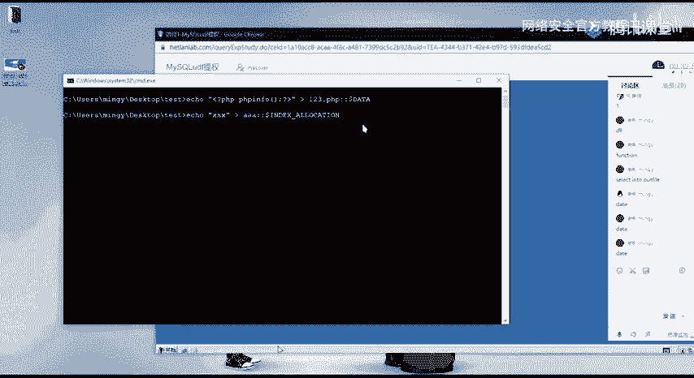

然后呃下面的话我们。注意看这边注意看这边，然后我这边执行。

🤧之前够的话。他虽然这边说系统找不到指定的一个文件，有报了这样子一个错，但是你在这边的话，你会发现啊你会发现在这边我们就创建了这样子的1个AAA的一个文件夹，对吧？

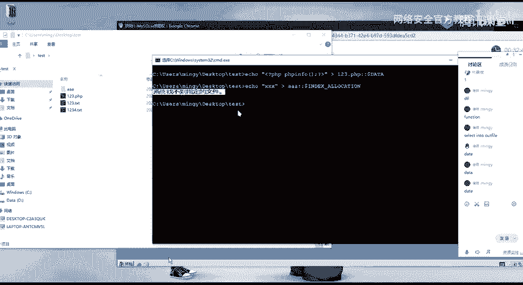

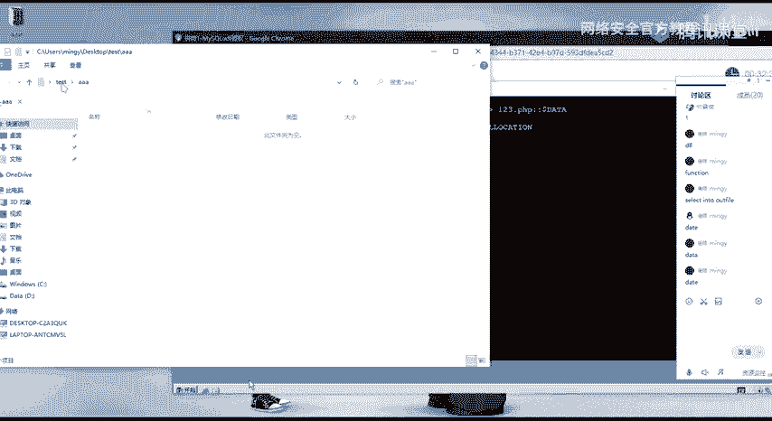

然我们嗯嗯。嗯意。对吧就是这样子的一个。然后呃这边的这一个留文件的话，你是无法直接看到的。

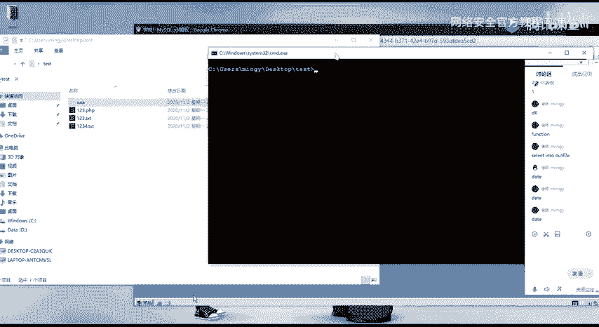

Yeah。

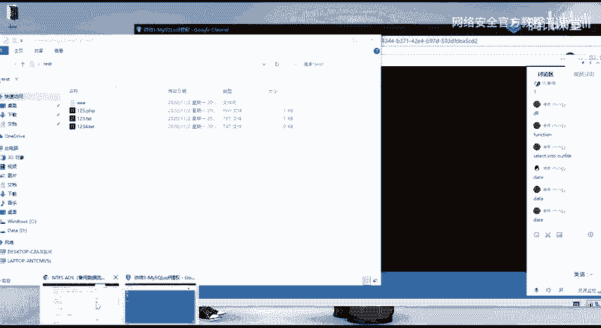

Oh。嗯。🤧然后这边这边这边这篇文章的话有详细的介绍的这一个东西啊，就是关于它的创建文件夹以及创建创建文件。

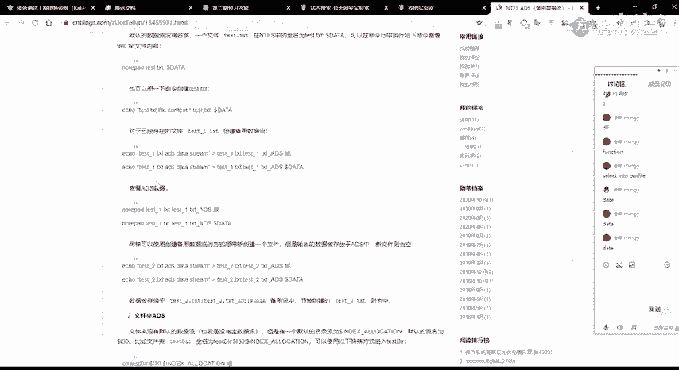

这边的话我就呃就给他大家演示到这边，更详细的这种模型的话，大家去看一下那篇文章，然后自己去操作一下。

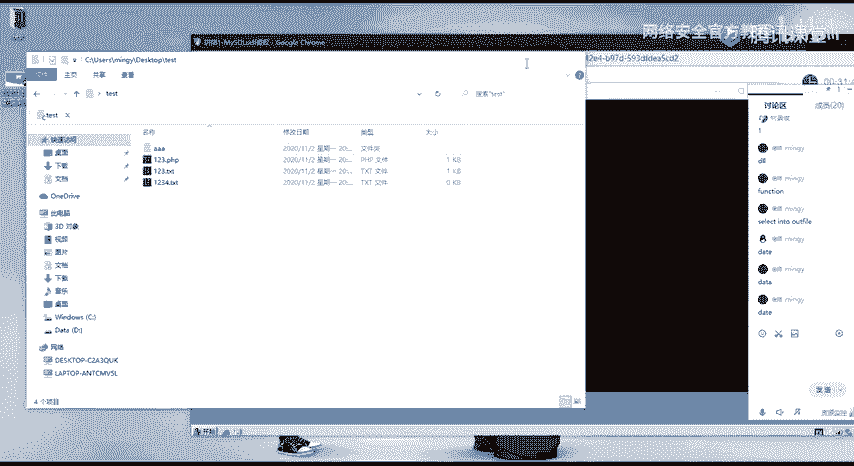

嗯嗯。😊，所以的话我们通过这样子一个方法，他就创创建了这样子的一个呃文件夹，对吧？然后呃。下面的话就是my circlel提全的第一种的一个方法，或者说第一个场景。呃。

这边的话呃场景的话主要的话就是大家看这一个实验。

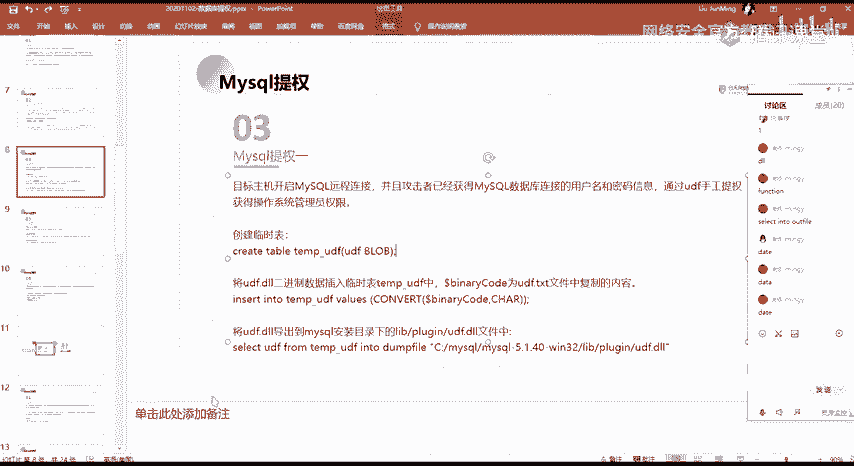

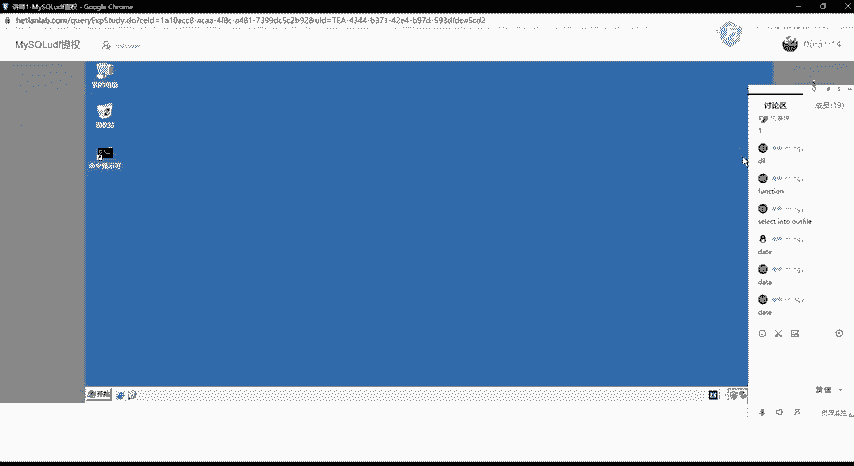

就实验指导书这边的话已经写的很详细了，就关于这1个mysl的1个UDF提全以及它的一个简介，对吧？大家可以详细的看一下这边。这边的这一个呃内容。嗯。🤧啊呃。

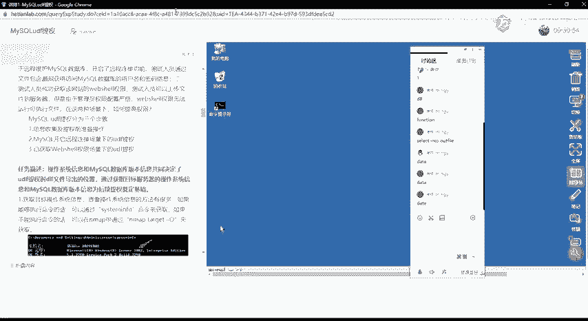

嗯。然后在呃讲这一个实验的时候的话，我们先来看一下PPT的一个内容啊。就是我这边PPT的一个内容的话，其实就是呃一个流程。一个过程。就是给大家做了一个总结，总结了这样子的一个提权的一个过程。

然后实际的一个内容的话，就是呃就是更详细内容的话，大家做这一个实验。在实验这边的话有详细的一个介绍。然后等会的话我我也会带大家就是一起来做一下，就是呃我也亲就是亲自带大家去做一下这样子的一个实验。

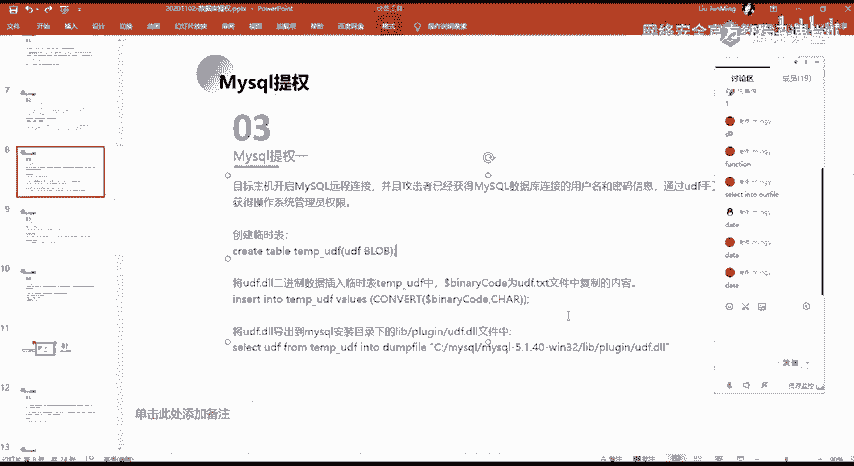

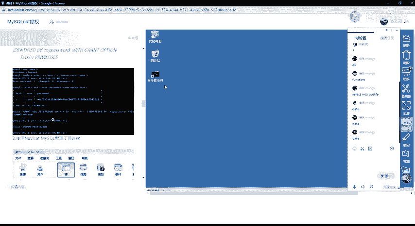

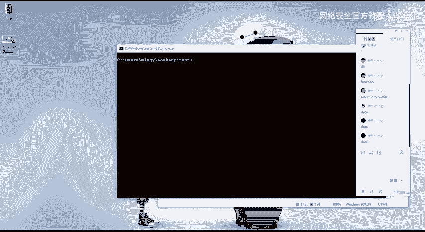

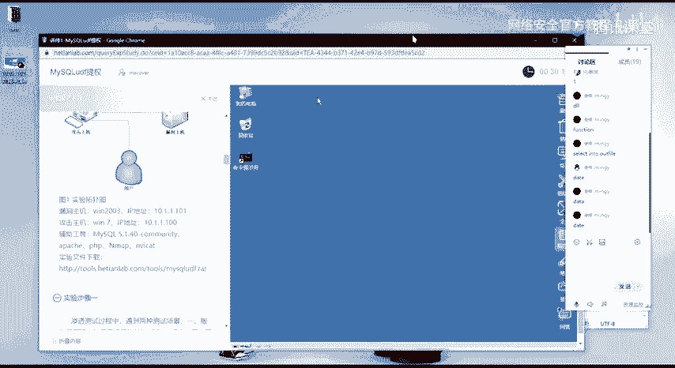

然后在做实验之前的话，我们先来呃过一下这样子的一个流程。就是呃首先的话是第一个场景。第一个场景的话就是我们的一个目标主机，它开启了这样子的一个mycyclcle的一个远程连接。

啊我们攻击的获得了这样子的一个数据库的一个连接的一个用户名，还有密码信息。然后我们可以通过这样子1个UDF的一个手工提全来去获得操作系统的一个管理员的一个权限。Yeah。好，呃。

这边的这个场景怎么去理解呢？就是呃首先它有一个前提就是目标主机，它开启了一个mycyclq的一个远程连接。然后的话就是说我们就是目标的一个机器。

它我们可以在远程去连接这样子的一个mycyclql的一个数据库。然后的话我们已经获得了它的一个mysql数据库的一个用户名及密码，对吧？关于这一个用户名密码信息的话，对吧？啊。

用户名码密码信息的话就比如说嗯。我们通过就是说某一个漏洞对吧？通过某一个漏洞得到了他的一个或者是得到了他的一个。管理后台对吧？得到了某一个网站的一个管理后台。然后的话在他的一个后台当中的话。

有呃查看到了对应的一个数据库的一个信息。或者说你得到了这个机器的一个web share。但是的话这一个web share的话，呃，它对你执行的这样子一个命令。

就是你在它的你得到这个we share的一个环境下面，你比如说你用菜刀对吧？或者说用你建这样子的一个工具连接之后，我们可以去得到一个虚拟终端，对吧？但是他这个虚拟终端，它再去执行相应的一个命令的时候。

它是有对应的，就是有限制的。就它因为你去执行系统命的话，你是同样的是需要去调用它的一个系统的一个函数来去呃执行我们的一个命令，对吧？那么它有禁用这样子的一些系统函数的话，你的一个的话。

你是无法去执行对应的一些命令的对吧？うん。那么在这种情况，我们得到微写时候，我们可以去查看它的这样子的一些文件是吧？就是比如去翻他的一些配置文件。

然后的话正好翻到了他的一个数据库的一个用户名以及密码的这样子的一个配置文件的一些信息。那么这个时候的话我们可以利用呃就是说我们得到的一个sll。我们可以通得到它的一个用户名密码。

我们可以连接到这一个mysql的一个数据库当中。然后的话连接到它的一个数据库当中之后的话，我们可以通过这样子的1个UDF的一个提群来去尝试得到它的一个管理员的一个权限。

然后具体的一个方法的话就是呃首先第一个创建一个临时点。呃，创建了这个表的话就是。用于存放我们前面啊用于存放我们的这样子的一个前面所说的这样子的一个D文件，对吧？

因为我们现在的话是能够去对它的一个数据库做相应的一个操作，对吧？但是的话我们的一个操作的话，只只只限于它的一个数据库，对吧？我们无法去操作它的一个系统。然后在这个时候的话，我们可以用这1个UDF提全。

要把我们。自己写的这样子的自己编写的这样子的1个UDF的1个D文件，把它插入到这样子的一个表中。插入到我们这边创建的一个临时表当中。插入进去之后的话，我们再去通过这样子的一个呃音区。🤧He。인水点的。

通过这样子的一个方法，把我们这边所插入到的一个数据，把它呃导出到我们的这样子的一个呃目录当中。就是把我们这边的1个UD调文件，把它给导入到我们这边所创建的这样子的一个呃文件夹当中。

然后在这边的话就会有一个问题，就是如果说这边它没有对应的这样子一个文件夹，对吧？那我们就需要去用到这边的这1个ADS流来去创建这样子的一个libb以及的这两个目录。🤧好，注意的话是在这样子的一个目录。

这一个目录的话就是它的一个mycyclql的一个安装目录。关于mysl的一个安装目录的话，我们可以通过select呃d呃base DIR来去查看它的一个目录。🤧然后呃我们这边导入进去之后的话。

等于就是我们的一个D尔文件，已经导入到了它的一个发点的一个文件目录下面去了，对吧？然后我们就可以通过利用这1个UDF的1个D尔文件。就通过这个d文件来去创建一个这样子的一个function。

这边的一个翻个选名字的话，就是呃CMD线。创建了这样子一个函数，然后的话我们就可以用这一个函数来去执行我们的一个呃系统的一个命令。啊，在这边的话就是创建了。

就是通过呃执行这样子的一个添加管理云用户的一个。明令来去创建一个管理员用户，然后的话我们就能够去呃得到这样子的一个管理员的一个权限，对吧？呃，大体的一个思路的话就是这样子，我们来具体的来看一下这个实验。

呃，关于这一个实验的话，呃，大家应该就是前面的话有相应的一个就是。相应的一个实验，对吧？就是有涉及到实验室的这样子的一些内容，就是给大家做课后作业，对吧？大家应该对我们实验室的这样子的一些操作。

他应该比较熟悉了吧。うん。就是呃关于这些操作应该应该算是比较熟悉了吧，对吧？就是指导书这些东西应该都是看得懂啊，是吧？指导书这边的话很详细啊。呃，熟悉。好，那那么我就。就不再去介绍。

就是说怎么去做这一些东西啊，对吧？我这边的话就是呃会挑一些内容。就比如说这边的这种实验环境，对吧？你首先的话你就先去看一下嘛。然后的话在这边的话，注意就是有两个机器啊。

就是我们这边有一个用户以及漏洞主机，对吧？我们这边的话可以去做一个切换的，就切换到这两个主机上面去操作，以及就是实验文件的一个下载，对吧？就这边它有给一个呃下载地址。

注意的话这个地址是你只能在我们的这个机器上面，在我们的这样子的一个机器上面，你才能够去呃下载到，而不是说你在外网，你在而不是说你在你自己的一个浏览器当中，你去打开这一个。硬件你是访问不到的。

因为没有这样子的一个资源，就是这一个资源你要访问的话，是在内网去访问的。啊，呃在这边的话实验的话，它呃有列举了这样子的1234个步骤，三个步骤。然后每一个步骤的话，它就是提供了一个任务啊。

就是作为一个任务，你是就你跟着他一个步骤来来去进行一个完成。然后首先第一个的话就是介绍了这样子的一个场两种测两种测试场景。就是在碰到这样子的两种场景下面的话，我们我去进行一个提群。

啊呃以及也介绍了就是1。5提全的三个步骤，就是信息收集。信息收集的话就是收集你的一个目标。你你的一个目标的一个像这种呃你的一个数据库的一个呃类型，对吧？如果说你的一个数据库，你是mycycl。

那么你就用mycyclmy的一个提群嘛。如果你是s server，那么你就用s server嘛，是吧？以及的话呃当然话在这边的话就是UDF的话就是my。

以及的话还有就是收集你的一个就mycycl数据库的一些版本，对吧？你的一个版本信息就版本的话，就是如果说你的一个版本，你低于这样子的一个版本，对吧？你在这一个。う。

以及你的一个系统版本是这样子的一个版本。那么你那个D文件你是要放到这样子的一个目录下面去了。当然的话现在的话就是呃应该是不存在这样子的一。一个机器里低于这个样子的一个版本的一个mycyclcle了。

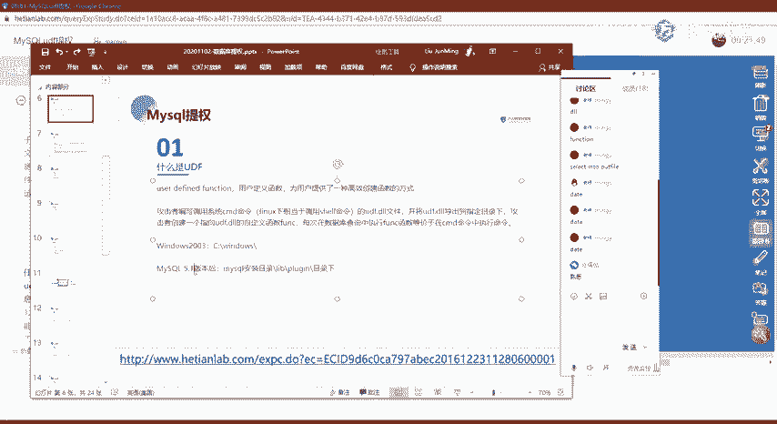

嗯。然后的话就是呃。啊。两两种场景的两种场场景下面的一个提群。就是在这边的话总总结了这一个实验的三个步骤，分别的一个内容，它是什么？第一个步骤呢就是信息的一个收集，就是我们。

我们得到了这样子的一个呃mys数据库的这样子的一个。嗯。

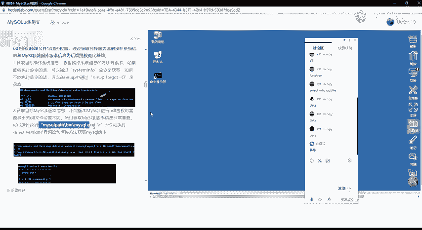

嗯。操作的一个权限。我们这边的话。嗯。在这边的话是在直接在目标机上面去执行的。呃，这边的话因为其实我们我们得到的话是得到的这样子的一个数据库的这样子一个连接的一个。就是连接到他一个数据库。

对他数据库做一个操作的。当然的话呃。直接执行这样的一个st in的话，是在目标机器上面去执行啊，那么我已经得到了它的一个目标机器的一个这样子的一个能够去直接去执行命的话，那么我何必要去提全。

所以在这边的话就是其实就是。🤧是告诉大家，就是我们可以通过这样子一个命令来去收集到我们的一个服务器的一个信息啊。然后其实我们通常的就是通过map嘛，对吧？通过map来去扫它的一个服务器的这样子一个信息。

找他的一个。服务器的一个版本。以及mycycll服务的这样子的一些版本的一个信息，是吧？然呃这的话它通过这样子的一个my circlel加杠V，我们可以来查看到它的一个。那再把了一个版本啊。

然后的话呃我们可以通过sap来去查询它的一个版本。当然的话在这边执行是。嗯，执行这样子的一个s version的话，我们是需要在连接到它的一个mysql的一个数据库当中才能够去执行。🤧。好。

直接这样子在呃。在mycyclcle当中是直接slaack version。在这边的这个version选的话，它是mycyclcle内置的这样子的一个呃这样子的一个函数。这样子的一个方案法。好。

呃等会再讲那个sexel的时候，就是用这样子的一个arar完来去查看它的一个。呃，版本也是它内置的这样子的一个，因为它内置的有这样子的一个语句。呃，在这块我们就能够去查看到它的一个mys的一个版本。

是5。1。4的这样子的一个版本，对吧？H。那么从这边的一个信息，我们就知道它的一个libb的一个目录啊，对吧？呃。

它的一个libb的话是在它的一个mycyclq数据库的一个安装目录下面的一个libb plan plug，对吧？然后的话我们还需要去知道，就是它的一个数据库的一个安装目录。

安中部的话就是这个我们可以在呃mys当中通过base加。🤧嗯。来去查看到当前的这一个数据库，它的一个所在的一个目录。就这个这个的话其实就是它的一个安装目录。

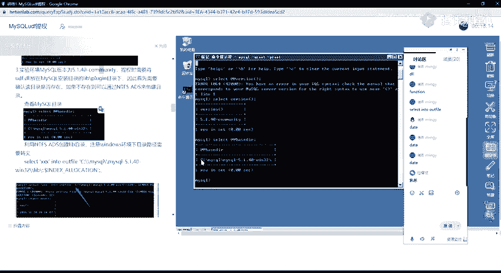

好，我们可以呃，因为我是在直接连到本地的，对吧？我可以直接在这边来查看一下，看是不是对吧？就这边的这一个mycycl的这边的话就它一个安装目录，以及在这话有这样子一个libb，以及发给了这样子一个目能。

呃，他这边的话是已经有了这样子的一个目录了。所以的话就可以省略我们前面的一个操作。那样的话如果没有的话，就需要我们通过ADS去创建。

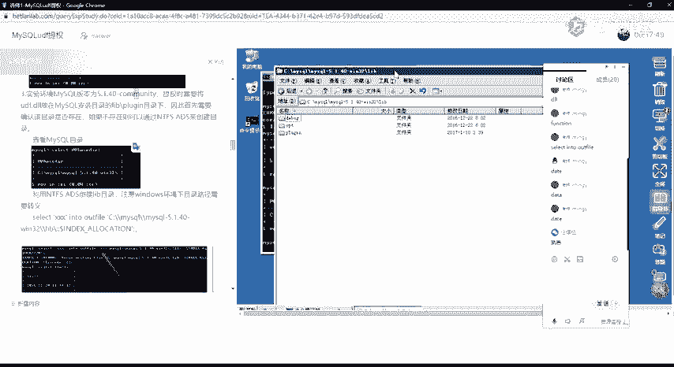

嗯。好呃，在这里话我们呃尝试通过这样子的一个方法，对吧？来去演示一下那来去演示一下。创建单样子的1个ADS流啊。像比如说我我们可以通过。就是这样子一个方法，呃在这的话，我直接通过select。Yeah。

select in in file这样子一个方法。然后这边的话slect的话，这这里的一部分话就是我们的一个数据对吧？就呃这边的话随随便填啊，就是其实就是我select这样的一个数据吧，对吧？诶。呃。

大家在对mys数据库了解吗？就是大家自己有去玩过吗，不。像比如说对吧我这边直接slalect这样子的一个随便的一个数据对吧，它就会输出这样子的一个数据，对吧？然后其实在这里的话。

其实就是我sla这个数据，就是这一个数据就是我要去导出来的，然后导出来到这样子的一个。呃，到这样子的一个目录下面去，对吧？2。然后呃是要导出到这个目录上面去。然后我这边的话就先看一下这样子的一个例子啊。

我这边的话就导出一个就是导出一个文件。比如说123这样子的一个文件，我把我的一个内容。然后要注意的话，就是在wind下面。用要用一个仿斜带来去做一个转移这样子的一个仿斜带才能够去。

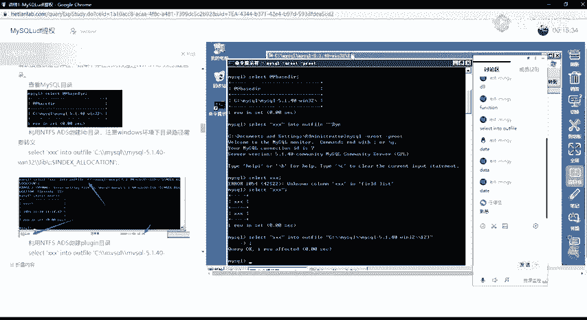

才能够去执行呃，这边的一个就是把我们的一个数据写到这样子的一个对应的一个目录。

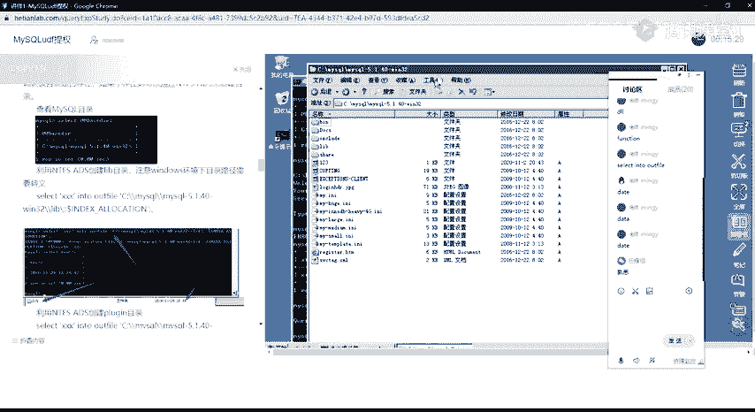

然后你可以看到，就是我这边的话是通过这样子一个方法select行，然后的话导出到了这一个幕下面的1个123的这个文件当中，对吧？你会发现它在这边原本应该原本的话是没有这一个文件的。

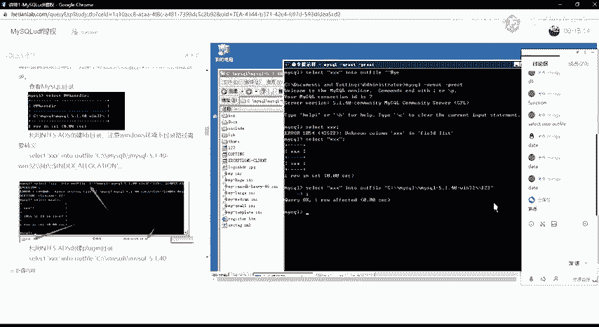

我们这边可以打开看一下，这里面的一个内容的话，就是刚刚所写进去的这样子的一个三个叉的一个内容，对吧？

那么我们也可以通过就是这样子的一个。创建文件流的一个号，比如说。上诉。嗯。叠贴比如说我要去创建这样子的一个哎。123点开始。做340太。这样子的一个文件。あ。那么我可以通过这样子一个方法。

然后呃大家看这表注意。

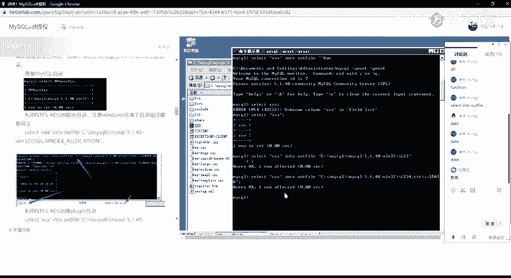

对吧我这边执行之后的话，在这边它就生成了这样子的一个文件。就是这1个1234点tex里面的一个内容的话，同样的也是尴尬的一个内容，对吧？

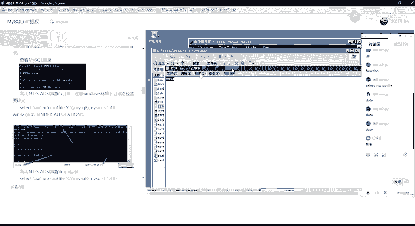

这就是创建了一个这样子的一个文件。那么我们要去我们实际的话要去创建这样的一个文件夹，对吧？就是没有这一个lab文件夹的话，因为这边有的话，我就以另外一个文件夹为例啊，我就比如说我要去创建1个1234。

呃，1234的这样子的一个文件夹。这个AA的一个。好，我们需要去。指定的一个牛牛的一个类型是这个index定。按罗开选。嗯。啊，呃，中间的这一个牛的一个名字的话，我们可以省略，省略的话就是刺为空嘛。

就等于就是两个两个冒号，就两个冒号。然后的话执行。

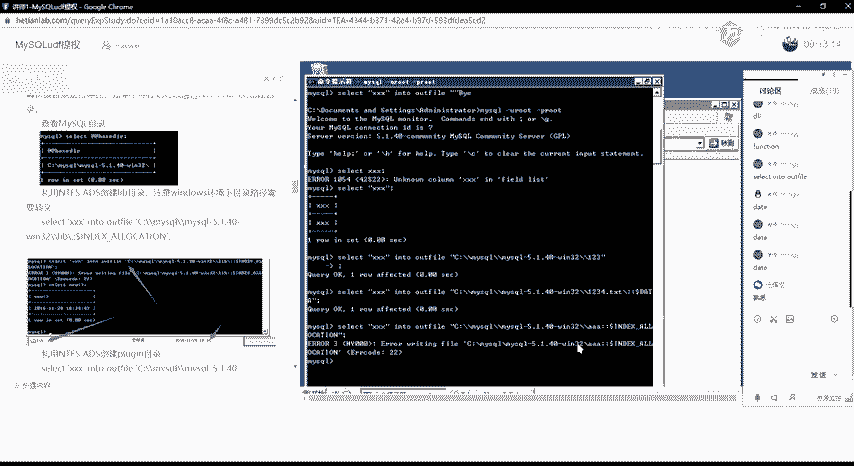

执行之后的话执行之后的话，虽然在这边它会有这样的一个报错啊，对吧？就是他说every writing file对吧？然后就其实就跟我们在这边CMD上面，唉，刚刚说就是找不到那个文件，对吧？

它也会有这样的报错。但是实际的话它的一个内容的话，它是已经就是我们的一个文件夹，它其实已经创建好了，对吧？你会发现在这边就多了一个这样子的一个AAA的一个文件夹。

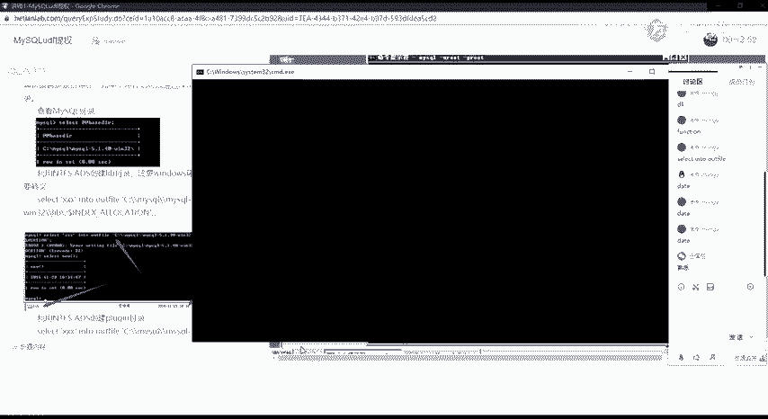

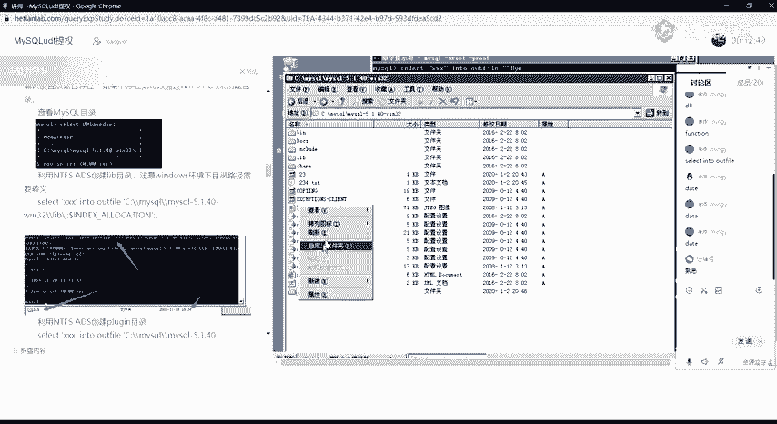

也就是我们这边所写的。

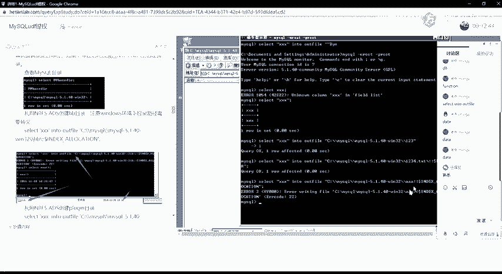

比如说我再创一个，我在AA幕前面，我再创一个。还1个BBB。创1个BBB的这样子一个文件夹。就是这样子。对吧没人发现。这边它就加了1个BBE就其实呃我们要去创建这样子的一个libb plug的话。

就是我首先创建一个libb文件夹是吧？然后我再在lab文件夹下面再去创一个ping的一个文件夹，就通过这样子的一个方法。是吧。AA目录上面的话有了1个BBB的一个目录。

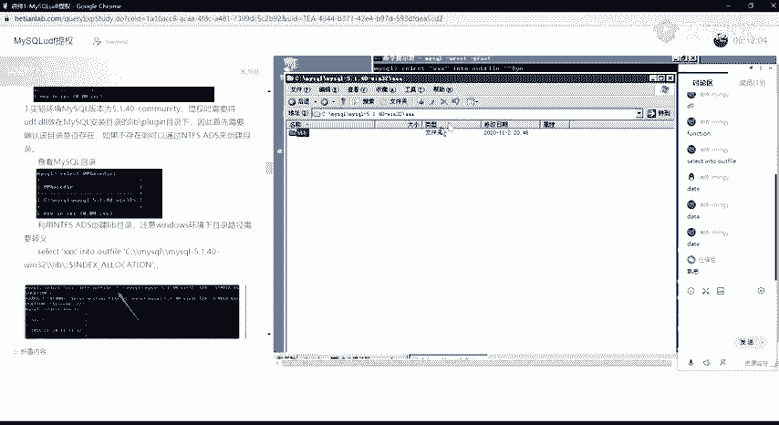

就是这样子的一个。🤧方法。啊。嗯。这边的话他也。呃，语句的话已经都已经给出来了。然，呃这边要注意啊，这边这边没有这一个这一个这个这个叫顿号啊，没有这个顿号。就如果你复制粘贴的话，你注意把这个顿号去掉。

就你不要你不要直接就复制这一块复制这一块，然后的话直接粘贴啊。然后还有的话就建议大家自己多去手敲，就能不复制的话，就不复制。就像这一些代码的话，应该不是很长，对吧？然后的话你手敲的话。

你会对这个语句会比较熟悉，以及你能够去了解它的这样子的一个结构嘛啊。

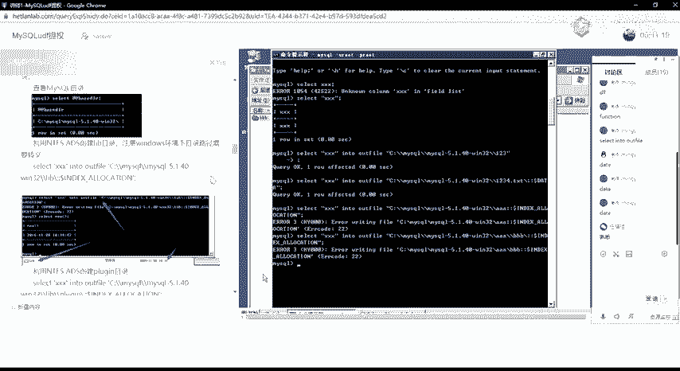

🤧。呃。我们先休息2分钟吧。好吧，5十的话再继续。好啊。