# B站最全网络安全教程，整整1300集，全程干货无废话，别再盲目自学了，看完学不会我退出网安圈！（web安全｜渗透测试｜内网渗透｜CTF） - P9：7.文件包含漏洞.mp4 - 网络安全官方教程 - BV15u4y137cQ

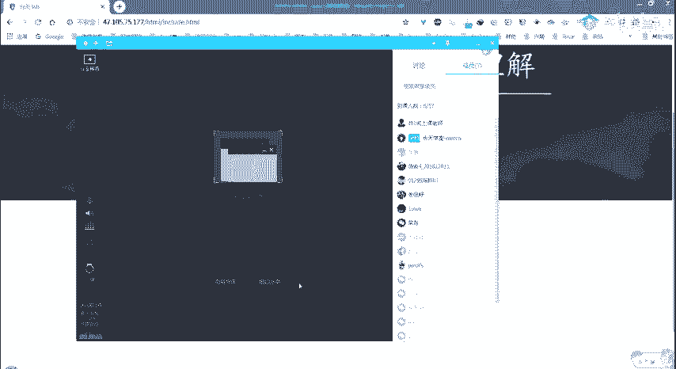

嗯，你们能看得到我的屏幕吗？😔，好的。😔，然后现在8点钟了，嗯，你们前面做了这个的话。

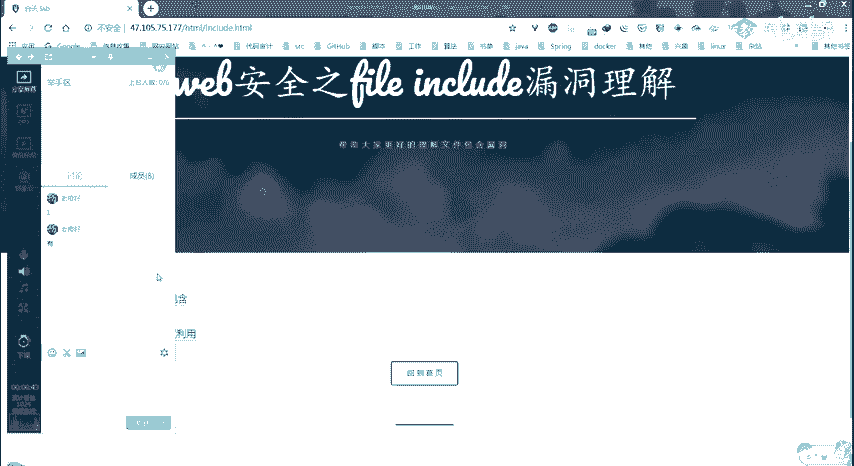

然后有同学想要进来讲解一下吗？如果。我看你们就有同学做的还蛮好的。所以有没有想要。😔。

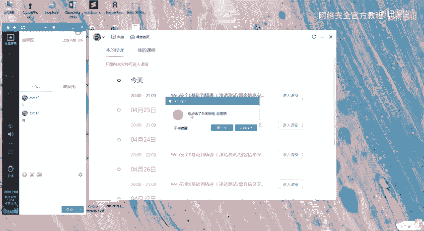

想要出来就是给大家讲的。就点那个举手就好了。

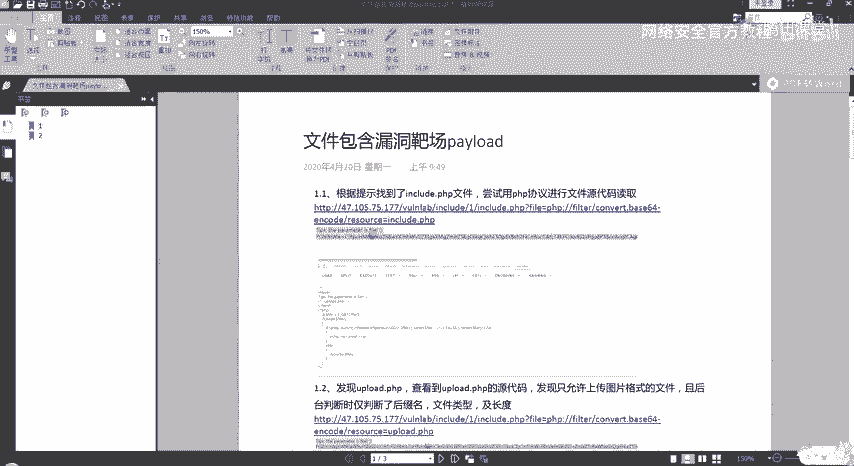

没有吗？你们听得到我声音吗？😔，用同学要举手，然后给大家讲讲吗？讲讲我们昨天留下的那两个课后习题。

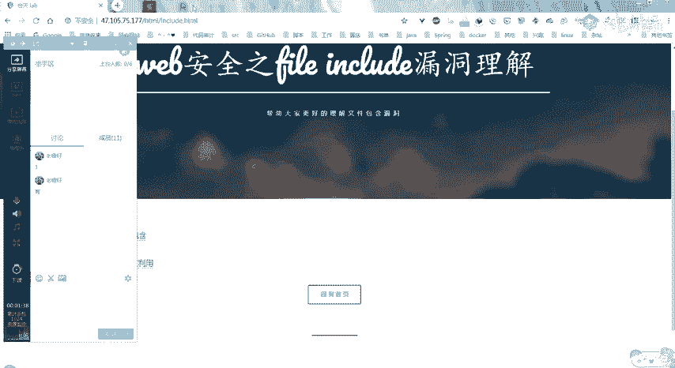

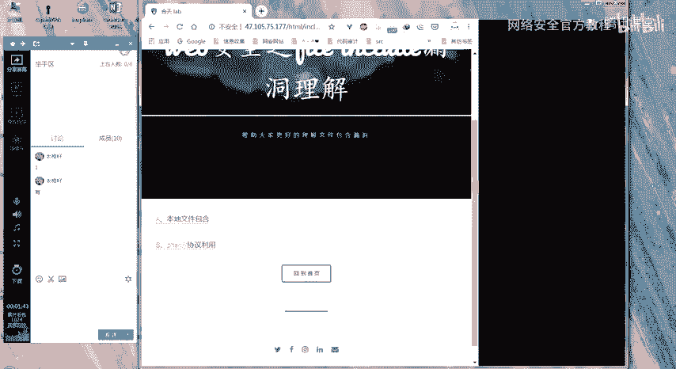

嗯，不知道自己做的过程对不对。没关系啊，可以就是可以给大家分享一下嘛。然后如果。就大家一起学习嘛。没有没有要举手的吗？😔，Yes。那我从交了作业里面来挑一个好吗？就是这些这么多人交了作业的话，来挑一个。

哎呀。或者是说就是从今天来的人里面挑一个，然后你举手，然后我来我在这边按照你的意思来进行一个操作。Yeah。为什么没有人你？😔，那我那我就点一个好吧。那我就。随便点一个，然后大家来。嗯。

来看一下他的操作。就。😔，你看。点谁吗？要不就点你吧，老橙子。😔，是吧你说你说话说的最多。你来给大家演示一下你是怎么做的。然后你是怎么想的。嗯，哼。😊，Sure。听得到大家听得见吗？大家如果听得到的话。

就打个一。嗯，行，那你那你讲吧，那你开始吧，大家听得到。就点击A那个。

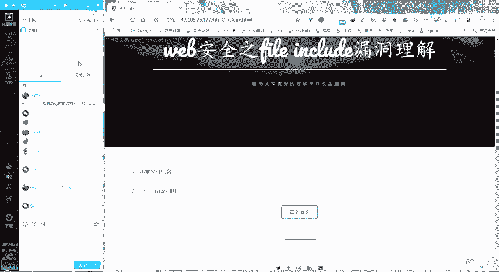

就第一天嗯嗯。听得见吗？嗯嗯，听得到听得到。点击这个，然后呢。呃，之后呢将。将intext standHTML改为。😔，Include PhP。응。嗯。Yeah。那你为什么会就是。查看友圈。

查看源代码嗯。那且看到了这个提示。嗯，哪个提示？因为一般的话就是。嗯。就下面会有一个up road点PHP。嗯，对，然后啊我就用这个去呃尝试一下，看能不能。登录就用。还是用那个文件夹。对，在。😔。

include点PHB后面。嗯，可以把这个改了，改成那个apppoload点PHP也可以。这样吗？对。嗯，而就发现我们可以上传文件。嗯。然后我就尝试上传了1个PHP文件，然后发现上传不了。之后呢。

就再生传了一个图片码啊，带木马的一个图片。嗯，带木马的一个图片，你是怎么写的呢？

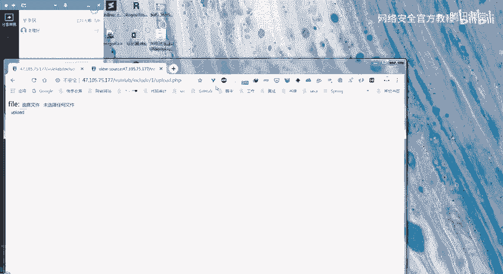

就用呃CMD的方式将。啊，1个PHP代码加一个图片合并起来。嗯。

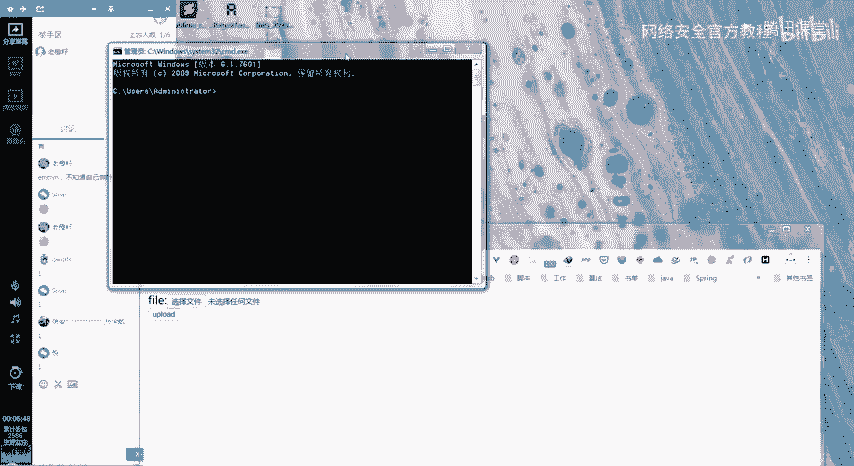

有 copy。😔，잘 되겠다。ppy，然后那个。图片，然后追加一串那啥进去是吧？对对对，就制作好那个啊图配码文件嘛。

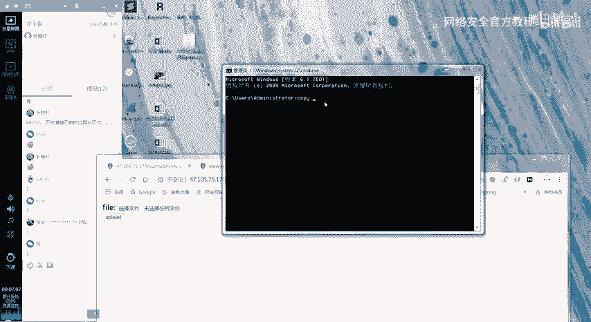

你有没有新疼的？😔，嗯，你是这个人吧，你是这个。对对，这个这一份交的作业是吧？是的。嗯。也没有写。😔，对我直接直接因为是那个是之前做好的嘛。

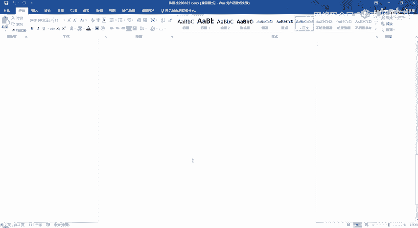

嗯嗯嗯，好吧。😔。

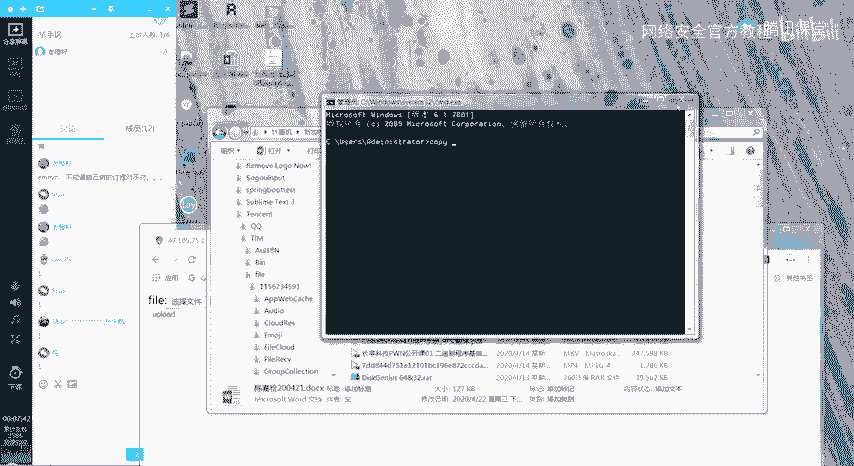

那大家有记得之前生成应该是文件上传的时候，老师有讲吧，对吧？然后有寄得那个那一条。

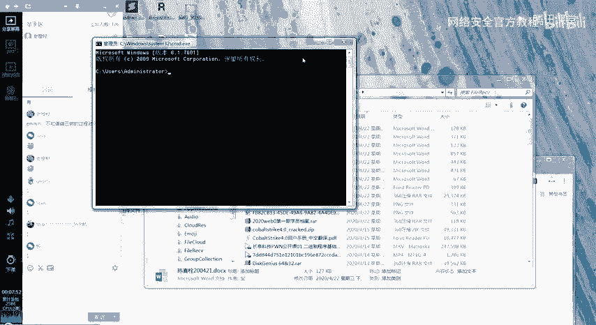

明令的吗？这子的话就在这边打出来。Yeah。我们也。😔，好，有同学在那里打出来了。嗯，所以这个要先有一个。图片。点保存。

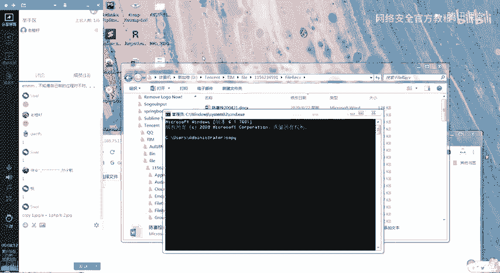

あ。嗯，这个一点PHP里面你写什么？

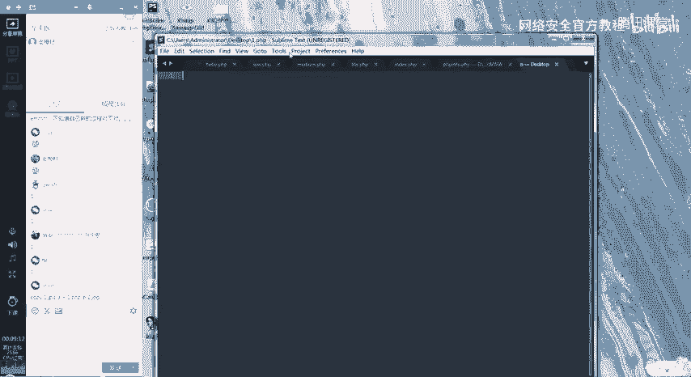

呃，就PHP的一个呃前头跟尾。系。然后evo EVAL。好好。Yeah。然后是那个钱的符号。这样吗？是的。唔。然后要将这个。嗯，你可能要要到当前就是桌面的这个文件夹里面。去进行这个CMD。

对大概证明你唱高。嗰屁。😔，I。好。他就上传这个文件。看有没有。😔，嗯，然后就到这个地方，然后选择文件。嗯，接下来呢。呃，接下来就。还是切回到刚刚那个。inc点PHP。B。这个。嗯。😊，嗯。

在include点PHP后面。嗯，问号等于。然后他这个值应该是fiil。然后等于那个up load斜杠。然，1222222点GPG嗯，因为我刚才。对。然后可以用这一串去新赖博。

或者是在当前页面做一个那个。啊，PSHP代码测试也可以。这个只道成功以后。嗯，所以说我们前面的话就比较简单在。这边。😔，然后。在这个里面加一些比较测试的一些日句是吧？还是怎么着啊？

我是就直接拿这个URL去新奈部那边。打开。去菜刀工具那边打开。嗯，添加是吗？对。嗯，UL就这一个的UL。复制。嗯。A a。然后脚本类型修改PSHP。手机。好，成功。可以。

那大家对这个题目有什么不了解的吗？We。然后嗯怎么就退了？老陈子，你应该还要负责解答呀。完成了呀，大家就是对这个第一题有什么嗯不懂的地方吗？就不了解的吗？老陈老陈子，你要负责完成大家的疑问啊。

如果大家有疑问的话，就扣个一。如果们大家没有疑问的话，就扣个2。嗯。我都没有找到在我的那里。😔，想泡。😔，好吧，那这个第一题大家或者有其他的一些思路吗？就跟老陈子是不一样的。我现在最后一小时。😔。

不用图片码都行吧。嗯，那你要不然来给大家分享一下。你点那个举手就是G wolfs，其实我不会读你这个名字。嗯，你说。嗯，大家能听到吗？啊，就我觉得就把那个。嗯，行，你说，我觉得这是。

就是上传1个PHP那个它的一个代码，然后改的时候改一下它后缀就可以了。嗯，我们直接上传一个，就拿刚才那个一点PHP。啊，对。或者把PHP改为JBG就直接改后缀也可以。然后再。😔，在这边拿个包是吧？😔。

对。就或者你直接改后缀吧，改为JPG就可以。Yeah。嗯，直接把它改成。😔，JPGPN季后的G对。或者是你那个名字改对了，写好一点吧，就是那个二的话，我。哦。我不不一定能他不一能显示。对。

就改为一个其他名字吧。对。啊。38425的。然后上传这个文件。对对，对吗？对。Yeah。嗯，然后呢。呃，然后一样的效果就直接直接就是引用，直接包含这个文件就可以。因为他就他包含的时候。

他只是去查这个文件里面的有没有这个PHP标志。所以不管是什么后缀都可以。这个样子是吧？对。嗯。嗯，然后用。你要特大连想。嗯。可以。那大家对这个有什么问题吗？Yeah。Yeah。Yeah。嗯。怎么上传？

嗯。嗯，那陈莎，你要不要举手来？😔，就是给大家分享一下。

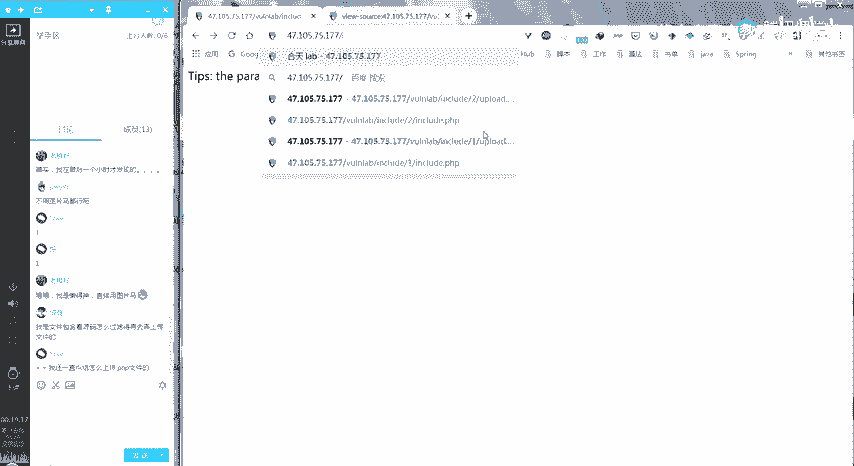

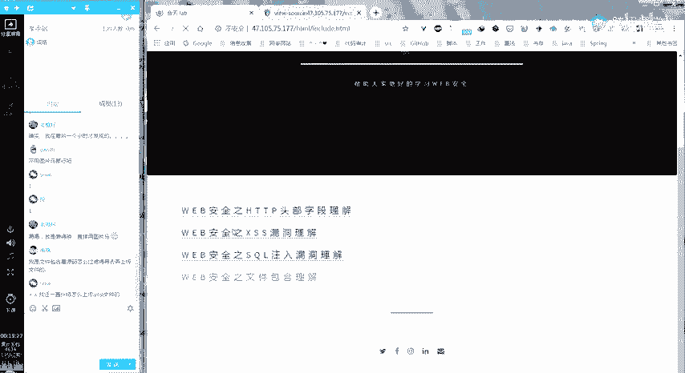

嗯，你说个话试试。回i。嗯，大家能听得到他的声音吗？O你说我是直接用。PHP为协议。去读他原马的。嗯，来到这里，然后呢。我把配load的发出来。啊，你把我先看录不音。他嗯应该读应该读那个。

upload那个页面的源码。我发的是in页面。就upload是吧。嘅。没关系，我们就先。嗯，先读一下这个当前这个页面了吧。然后给大家看一下。是使用这个PHP filterter这个是吧？对。嗯。

他A64去解码就能看到它的源码。我就直接在这儿解码了。嗯，这个就是include文件的一个源代码。嗯，你接着说，主要是upload的，这个没什么。So。把这个改为upload是吧？ok。

就其实大家从刚才那个地方，其实我们查看源代码的时候，这边也有一个就include an uploadload点PHP。所以你在这的话就会发现有这一个。有这个文件的存在。所以在这里的话。

它直接是使用这个filterP呃，不要呸PHP filterter，然后这个伪协议，然后在这里就能查看它的一个源代码。然后执行是吗？嗯。填码后看他过滤的规则，然后我再去搞的那个图片嘛。嗯。😊，嗯。

他其实是从这儿开始的。这个前面是乱码，是因为我们这里。有这么一串，所以他解码就变成了乱码了。嗯，你接着说。就发现它是过滤。

它只能上传GIFJPEGJPEG跟PNG然后对conent的 type属性也做了过滤。之后操作就差不跟前面差不多去弄了。嗯嗯，就是你通过查看源代码知道了。他过滤了哪些。😔，嗯。嗯，它的过滤规则是怎样的？

然后通过这个过滤规则来进行的一个ro过是吧？然后就和前面的步骤是一样的。对。嗯，行，大家有没有听懂的地方吗？这个。如果有没有听懂的地方的话，就打个一。如果没有的话，就敲个2。Yeah。嗯。

那看来大家都做的蛮好的。有没有听懂的吗？你就先敲个一给我们看一下，然后再发出你的问题。嗯，好像没有人。😔，打一，那我就在这儿给大家顺一遍吧，从从头到尾。就前面几个同学其实都已经讲的。

没办法显示那个864码。怎么怎么会呢？你是不是打错了，还是怎么着，就是这一串敲错了。嗯。😊，懂了就行。😔，然后我给大家串一下吧。嗯，首先我们是根据提示找到的那个include点PHP。就是刚开始在那个。

index点PHP这。就找到了这个include点PHP，所以尝试进行一个。访问。这的话又有一个提示是说它的参数是一个file，所以我们可以在这个根据它的提示来它的参数这这个file。

然后包含我们现在当前的这个文件是试试看，看看能不能进行一个包含。发现是可以的。而且就是当前这个文件的一个重复。我们通过右键查看源代码的时候，有一个。upload点PHP提示给我们。所以在这的话。

我们就直接去访问1个upload点PHP。嗯，接下来的操作。其实就和刚才一样。然后是查看它的一个一个源代码，发现它的一些过滤规则。发现它均是上传图片格式的一个文件。

且后端后台的判断仅仅判断了它的一个后缀名，然后文件类型，以及它有一个。这张图就是刚才解码之后的这个。

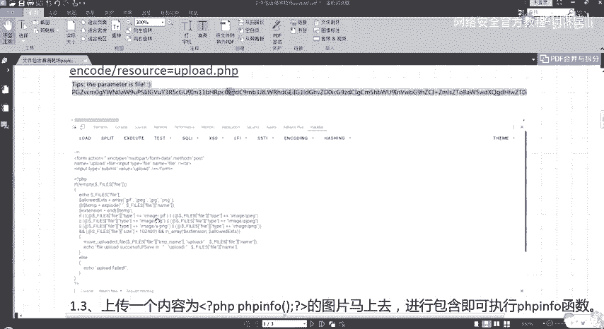

以及它的一个长度。所以在这的话，我就直接上传一个内容为PHPPH in的一个图片码上去进行包含，就直接可以执行。同样上传一个这样的一句话木马进去。进行包含。然后对，就是这样。好，那第一题就先到这儿结束。

第二题的话，大家有人要过来给我们分享一下你的思路吗？

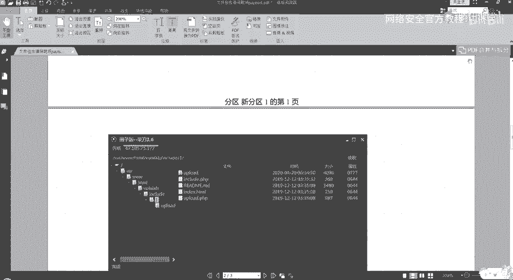

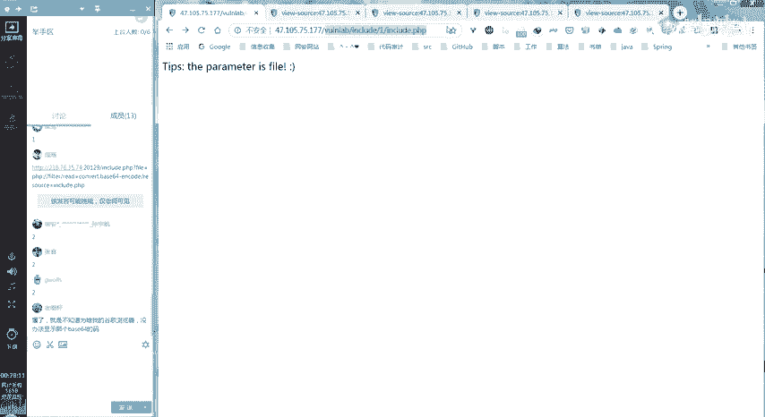

如果有的话，就直接点举手。

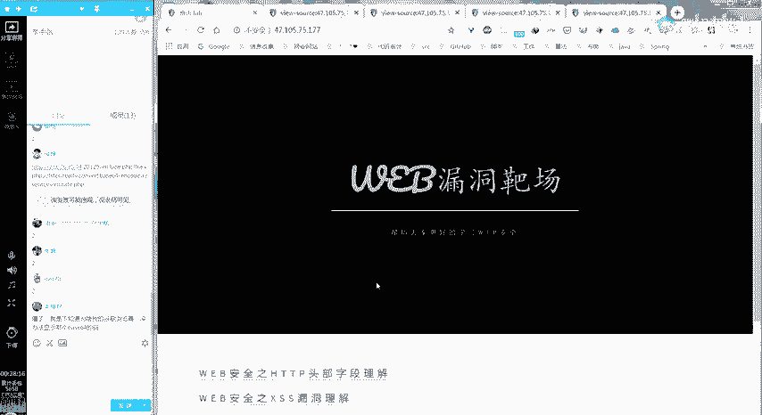

没有吗？嗯，第二题。😔，因我点吗？大家有做的好的呀，我看了。第二题有同学要分享吗？没有啊。😔，那陈尚同学，你做了第二题吗？没做，那孙宇航同学，你做了第二题吗？今天是节课。😔，嗯。没。😔，那张喜同学。

你做了第二题吗？你们都没有做第二题的吗？😔，张喜同学，你有做吗？哦，我第一天都没要。😔，那你要加油哟。你。嗯，Jwars同学，你有做第二题吗？嗯。😊，嗯，大家能听得到他说话吗？嗯，可以，大家都可以。

你说。啊。啊，好的，我就先点开那个。Tction对。啊，已经点开对了。然后对对，老师已经写了，他是就是。呃，不要等喝了。然后因为它提示这是1个PCP文件，所以就就可以猜测它是后缀是PCP。

就是它也会呃自己加一个后缀，对吧？然后哦嗯你的意思是怎你的意思是说。嗯。嗯，你的意思是说他在后台会加一个点PHP的一个后缀，是吗？对对，因为他提示，所以我就拆了，然后他确实是这样的。

然后呃就用PCP5协议来读到个源码。嗯，同样是使用一个。PHP对。😔，嗯。读哪个文件，读当前这个文件吗？还是读对对，把PP对，就这个把PPP删掉。这这个PHP上的。对，为什么要把PHP删掉呢？呃。

因为它会自动拼接1个P7P。啊，嗯那这样回车。对那个讲。进行节吗？Yeah。哦嗯。呃。这嗯这不对吧，你复制的。好像您负责好像不太对。就下面的下面那个备64的编码。这啥不漏的。嗯。我也感觉不太对。😔。

Yes。嗯。把那个ts删掉吧。好的嗯。呃，然后发现他嗯PGA2协议没有过滤，然后也再不支持那个就是回到父母的对。嗯。就体现出两点，一个是可以用P写AR协议。嗯，因为这他没有。

就是在这边匹使用这个函数进行一个政则匹配的时候，就没有匹配到那个PHAR那个协议。嗯，接下来还有一个是。这不能使用复古动。有两点被分滤了。啊，就不能使用这个目录跳转服务是吧？对对嗯。对。

然后呃就是我这里出现一个问题，就是我没发现就是第二关也有那个upload，所以我用的第一关的。嗯，你用的第一关的一个已经上传上去的一个呃文件。第一关的不是第一关的up点P区上传文件。哦，所以就是说嗯。

Oh。用的第一关的这边的upload点PHP。对，然后我然后同样。啊，你个要先打包一个问西。我先在外面打包一下。嗯，怎么打包嗯。呃，把那个就是PP刚刚那个t点JPG改为呃，我想想改不改。呃，改改一下。

对呀，改成天t点PHP对。因为最后拼接的子弹是PHB。对，然后再打包一下，就就把一个文件打包，或者加一个文件给哎，就就打包。对，添加到。然后再改为JPG文件。要喝罪。嗯，对，然后然后上传上去。

我这把改成另外一个吧。然后免得大家混淆。😔，嗯。嗯，对，然然后现在是呃然后就用那个PGAR协连接这个。就是咱呃咱连接这个P7文件，我直接发那个。哦，自己发家。Yeah。对，对。我者我发现。呃。

因为因为我现在用了第一关的，所以我想的是那个呃正就是用点点把它跳转过去，然后发现不不可以，就是因为他把这个过滤了，然后直接用了绝定路径。嗯，那这个觉对路径是你猜的还是怎么着？

就是这个这个以前就上以前就讲过拆拆的。对他不是安吗。嗯。这就加上那个。啊呃，不是，你要先加上那个哦，不对，我是那个case点切P器，对不对？t点接P器。对，然后哦我们里面那个。啊，对，test。😔，对。

我们是对这个test点PHP进行了一个压缩嘛，然后生成了一个test点JBG，然后我后面加了1个001，那在这的话就是test。就这样是吗？嗯。那，用菜单连一下试一下。Okay。嗯。

大家有什么不懂的想要问这位同学吗？大家如果有问题的话，就扣个一。嗯。Yeah。大家有问题吗？没有。好的，谢谢你。😊，嗯，那大家知道。第二题的话，有什么别的不一样的思路，或者是说。其他的吗。

然后如果有的话，就点这个举手。嗯。没有同学要分享了吗？😔，Yeah。

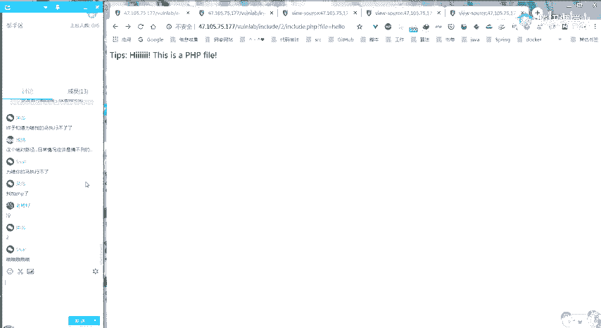

嗯，没有的话，那我就。来给大家讲一下。

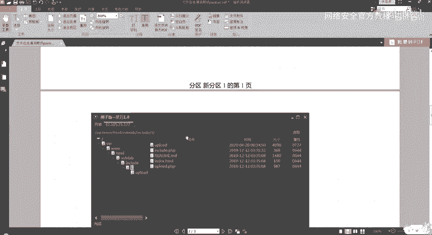

就是来顺一下吧。嗯，首先我做这道题的时候，同样是使用嗯使用就是在一里面的一个方法去查看它的那个源代码，就使用那个。h his your turn吗？这样。然后发现并没有内容显示给我们。

然后利用文件包含中就是我们已经知道前面这个。前面这个本地文件包含在这儿。它是存在一个文件包含漏洞的嘛。所以我就想说。把这个等于点点杠，然后2。include点PHP，然后前面加上那个。平谈协议。

conver点倍64。Gone encoded。Resource。等于。没有写字吗？应该没有吧。嗯，但是它在这的话就有一个e的错误给我们。

其实我们前面去就是在第一关去查看它的一个使用那个PHP field查看它的源代码的时候。不知道大家有没有印象。就是他把刚才Gworks同学有说，就是他把这个目录跳转符给过滤掉了。

所以说他在这的话就会有这个eal错误这个显示给我们。所以说这条路也就截断了。然后。

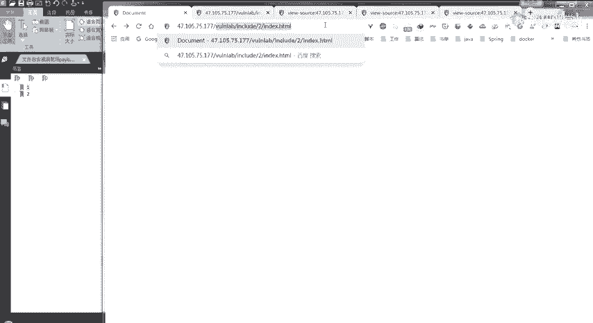

我们就回到之前的这个地方。

然后观察它这里其实是我后来加了一个提示。就给大家提示了一下，这是一个PHP的文件。然后我们看到它后面这个while等于hello这里的话，它是没有加上我们这个点PHP的。

所以就像刚才ds那位同学说了一样，就可能猜作后台那边他自己拼了一个点PHP上去。所以在这边就直接尝试一下。嗯，就和刚才那位同学是一样的。这样发现确实就是在后面拼了一个点PH。因为这样的话。

他它就把我们当前这个文件的一个b6加密的。内容危险给我们了吗？嗯。这个样子的话，我们就查看到了include，就是二里面的一个include文件的一个源代码。

在源码里面也有发现一个upload点PHP就和一是一样的。同样你在这儿就是在这个L。就是在这个下面。就会发现他会把我们这个file。从get请求UIL中的file拼上我们这个点PHP。

然后再进行一个包含。然后第二种就是或者就由一get share之后去查看二里面的一个文件。我们之前不是。不是通过一改t了吗？我们不是可以查看二里面的一个文件吗？嗯，你就有点耍流氓哈。对。

就这样的话就直接看到他那个。文件。可以。嗯，所以说之前我们如果拼直接拼上了一个。点。PHP那后台又会加一个点PHP，所以这样的话就找不到汇报1个404。的错误。嗯，接下来的话就和刚才的。

同学给大家演示的是一样的。嗯。这也发现了一个upload的点PHP，而且我们同样可以使用这个查看源码这个伪协议来进行一个查看，查看它的源码是什么，发现和一里面的一个内容是一样的。

就也是只允许图片文件的一个上传。那在这的话，我们通过前面的那种方式去进行一个包含一个普通的一个。就我们前面不是使用的。Upload。嗯，就上传的那个图片嘛，这样进行一个包含嘛，这样就不能使用了。

因为我们他在后台会拼一个点PHP给我们。所以这样的话，他就根本因为那边它不会它没有这个文件的存在嘛，所以它就并不会进行一个。引入也就不会我们菜到也就连不上，也就不会执行里面的那个一句话木马了。

那这样的话，我们就可以想到我们可以使用一个压缩压缩文件。在压缩包里面可以是1个PHP文件，然后再。上传的时候，我们更改它的后缀为1个JPG就能绕过那个上传文件上传的一个。嗯，限制嘛上传之后。

我们使用一个压缩流协议进行包含，就是这个PHAR嗯。我那个PHAR那个压缩包里面是1个1点PHP。所以在这儿的话。就。然后那个一点PHP里面是PHP in for这个函数。嗯。

接下来同样的就是使用菜刀进行一个连接。嗯。整体过程就是这样。对，相对路径也能做。第二题可以直接上班吗？嗯，这个问题其实刚才。已经说了。对。😔，嗯，大家还有什么其他的疑问吗？嗯。大家有疑问吗？

如果有疑问的话，就扣个一。如果没有疑问的话，就扣个2。就是前面这个第二题。我有给大家说明白吗？嗯，可以。Yeah。嗯。嗯，我可以给大家就是给大家看几个同学的作业吗？比如说这个J同学。

你愿意把你的作业给大家分享一下嘛，就是看一下嘛。如果愿意的话，你就扣个一。嗯那应该是愿意啊。一。嗯。大家可以就是怎么说，就是可以参照一下啊。这个同学的一个文档的编写。就还慢。Yeah。蛮好的。

大家可以学习一下。Right。嗯，就整体看下来就会觉得好标准。嗯。就会觉得。😔，还蛮。还蛮好看的。😊。

嗯。然后我可能仔细看的就是。嗯。这个和这个吧。因为。因为后面的作业可能是之后交的，然后我就没有时间看了。嗯，大家可以学习一下。我觉得这是写的比较好的。Okay。嗯。可以发群里吗？😔，可以发群里吗？嗯。

嗯。你能在群里面上传文件吗？还是我来上传？你能上传吗？嗯。然后今天大家如果没有问题的话，其实今天的课程就差不多到这儿了，大家有。有问题吗？嗨。就关于今天的这两个。嗯。这两个题目。

或者是说你学到了其他的一些嗯文件包含的一些新的思路，或者是别的可以给大家给我们分享的，有吗？有问题或者是有嗯别的想法的，可以扣个一。然后如果没有的话，就扣个2。嗯。作业提示可以再明显一点丢。

怎么个明想明明显法。嗯，好吧，其实我我是觉得。😔，自己发现的整个过程。

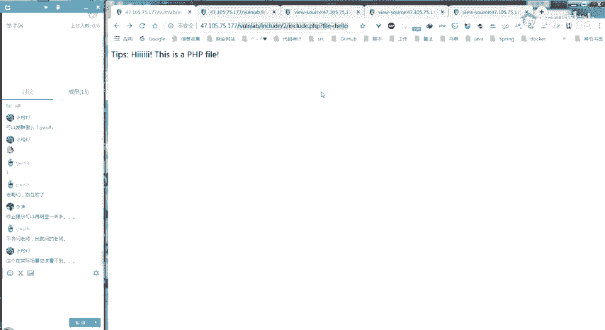

What。我是觉得整个自己发现的过程，如果自己就看到了或者是想到了，我就会很开心。但是如果是通过别人直接告诉我，或者是怎么样，可能就那个乐趣又少了一点。我是这么想的。

所以我也不太想就是破坏掉你们的一些兴趣或者是乐趣。

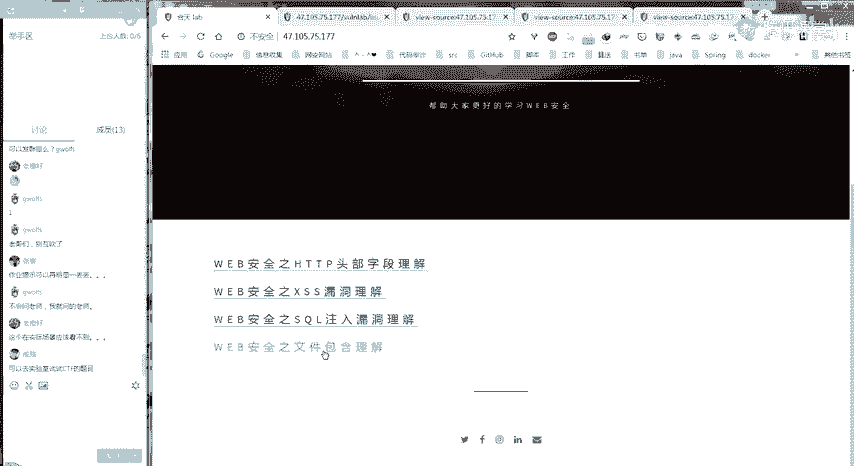

嗯，所以可能有些时候就没有提示的太过明显，我就想让你们自己多去思考，多尝试一下。嗯，如果下次觉得。嗯，确实是有难度的话，我就再多提示一点。或者是说你们可以来直接来问我。Yeah。好的。😔，你还有。

还有别的问题吗？Yeah。Okay。嗯，现在没有了。😔，应该大部分同学都没有了吧。😔，Oh。嗯，其实。这里面有一些同学的作业，我还没有没有看啊。😔，嗯，如果后面你们就是自己再做了一遍。

然后把文档补充完整了之后，也可以发给，就是重新发给班主任。没有。Yeah。其实今天的今天的内容已经讲完了，但是。😊，就不能提前下课，所以。就还得等到9点钟。Re。要不然太阳就来听歌吧。啊，没有了。

或者是说你们有什么想聊的吗？或者是别的。给大家2分钟时间啊。😊，Yeah。Yes。Okay。留了，没有想聊的是吧？😊，嗯，就是参加什么CTF或者是。听说过。什么这种类型的赛事么？有啊。嗯嗯。

你是想问什么？想问怎么去报名参加还是。怎么着？😔，嗯。就比如说有些官网他自己会公布啊，或者是其他的。嗯，但是我。就参加的不多。对。😔，啊，大家9点了。😊，我可以下课了。😊，如果有什么问题的话。

可以私下找我聊，或者是有什么疑问或者是其他方面的一些事情，也可以就是私聊我。嗯，那大家就先下课吧，好吧。嗯，我还在公司呢。嗯，好，那。😔，大家再见，拜拜。😔。

