# B站最好的清华蓝莲花战队CTF夺旗赛教程 从小白入门到比赛实战 - P11：11.CTF赛前指导：杂项（上） - 黑客入门101 - BV1ReW5eJEAX

那我开始啊。这次课我们向那个杂杂项。嗯，我们再回顾一下，之前的话呢。😊，我们的CTF分为主要分为这么几大几大块啊。

我再强调一下啊，第一块就是我们的一个密码学。第2块是我们的闸项。第3块是我们的外包。好。第四项是我们的一个胖。第五项是我们的rever。这两项底下这两项呢是比较难的这种啊，基本上要有长期的研究。

那如果说是上面这三项的话呢，我们可以什么这上面这三项属于我们可以快速提升的这种题型。密码学的话，我们早上已经啊。实操过了啊，没有实操的，自呃，到时候找个时间啊再做一下啊。杂项的话呢属于什么？

我们下午要讲的啊，基本上有时候杂项的题目里面可能会包含了一些密码学的东西啊。就好比说我之前给你们看的一个base的bb的那个家族的那个啊那个题啊，就有包就是其实说白了就是在我们的杂项里面啊。😊。

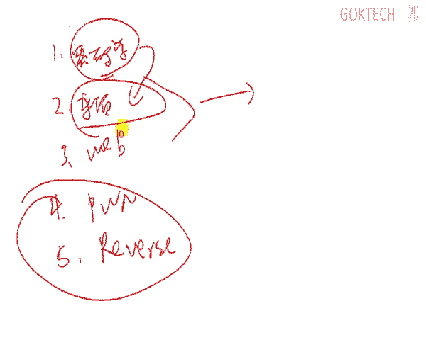

就是那那题什么贝斯贝斯，我爱你的那一题，还有那个贝斯的表妹啊，基本上呢他都是我是在那个杂项那个题里面找到了啊。那那我们今天这个做这个杂项之前呢，我们需要做一件事情就是使用我们的卡利卡利虚拟机。

卡卡利的一个虚拟机啊，我之前传给大家的时候，有一个卡利的一个虚拟机，卡利。这么一个压缩包。它，是一个压缩包啊，当然它全程肯定很长，但但当我基本上一般我们都称为卡利嘛，只要我们把卡立干嘛解压出来。

解压到固定的一个地方，解压到固定的一个地方就可以了。解压完解压完了之后怎么做呢？解压完之后啊，我们事先要安装好这个work station嘛，事先安装好这个work station啊。

如果这个基础环境还不安装的话呢，参考一下我之前上传的那一份啊基础环境的安装来，这边有一个文件。

啊，打开啊文件打开。啊。稍等一下，这边这个文件打开。打开找到我刚才解压说的那个路径，把它打开，把这个虚拟机打开就可以了啊。这些虚拟机打开之后怎么去开机啊。你比如说这一台随便的一台啊。

你比如说随便你一台我点一下嘛，点一下，它会在右边的窗窗口出现。这时候我只要点击开启开启此虚拟机就可以了。😊。

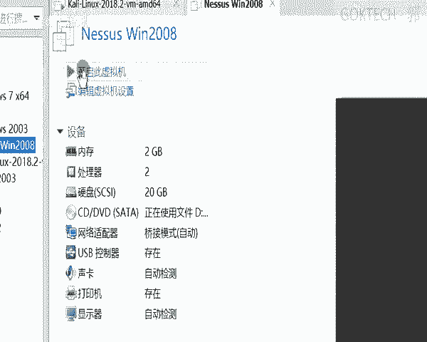

啊。

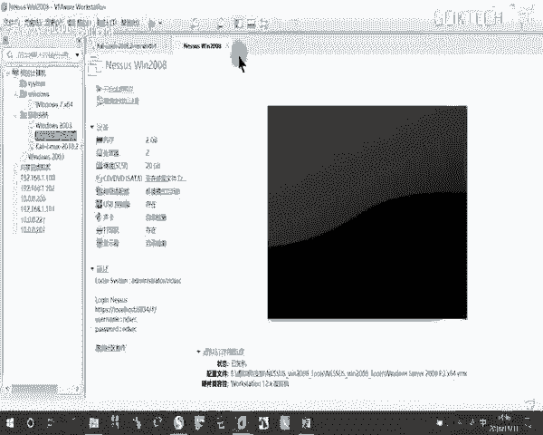

会了啊会了，我就不再多说了。为什么今天要讲又为什么要安让你们安卡利呢？因为卡利呢属于什么linux系统。😡，linux系统linux系统的作用就是什么呢？

就是说它跟我们windows最大的区别就是它可以用可以使用很多啊快捷的工具啊，快捷的工具。当然了，对于不太对于习惯的图形化，习惯的windows的用户的话呢。

可能对于卡里呃linux体系可能不是很很熟悉啊，不是很熟悉。那今天的话呢，我们会在。我我在演示的时候呢，会涉及两个部分，一个就是windows下的操作啊，一个是linux下的操作。所谓的linux。

其中一个分支就是其中一个版本就是卡利嘛。我会在这windows和卡利之间切换。那在切换的过程中，我会跟大家说，也会给大家总总结一下OK。

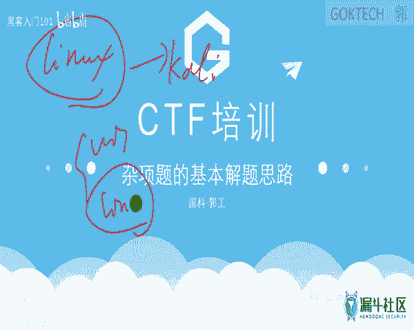

啊。砸象皮的特点啊。😡，一般题目看得清吗？😡，啊，我放再放大一点点啊。看得清吗？啊，一般题目会。包含。啊，会包含啊呃附属文件。

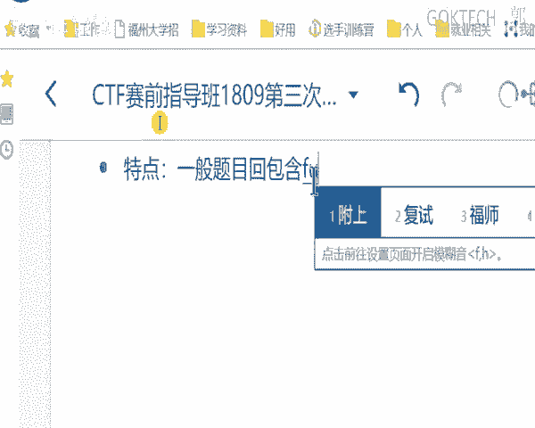

什么呢什么意思啊？来，我们看这里有个题啊，像我们的这个平台啊，像我这个平台里面选择什么使用这个选择这个杂项啊，我随便点一停啊，基本上都会有一个文件。那我需要把它下载下来。

或者说在或者说在这个新标签里面打开啊，然后呢，我想把它保存怎么保存啊，图片怎么保存啊，会吗？😊。

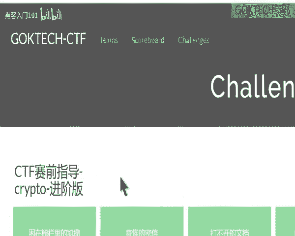

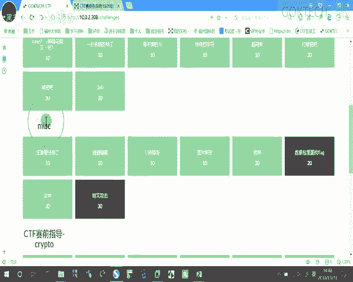

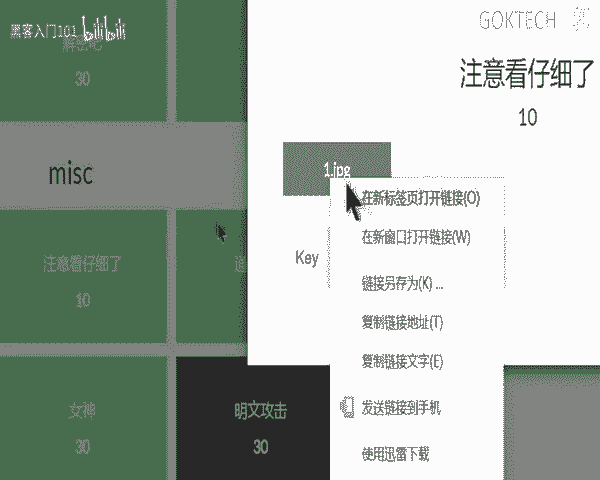

啊，比如说我按住下拉哎啊这个浏览器还有点问题啊哎，比如说什么右键图片另存为。那如果说你是找你是3602或者类似那种比较好用的浏览器的话，你只要这样按住一下拉就会就会自动帮你下载啊。

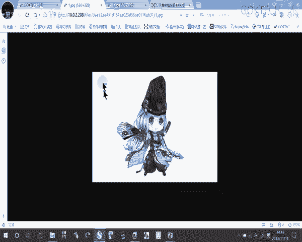

其他的也是通道隐藏，这些都是有都是有文件的啊，这是它的一个特点啊，一般都会一般题目都会包含包含附属文件啊。使用各种工具啊，对文件。进行分析得到。fllaag啊得到flag啊。

这是这是大一个特点啊这大特点O所以说我们第一点呢。😊，要干嘛呢？分析。第一点，我们肯定要分析下载的文件吧。啊。好，分析下来文件，然后针对这个文件进行一个处理，我们来看一下啊，稍等一下来。文件的操作。😡。

好，我们分为这么几个。导项的话，我们分为几个。首先文件你要去针对文件进行操作。因为有时候文件会有一些引写内容，包含一些引写内容。什么叫引写啊？😡，就是你的信息隐藏在一个文件里面啊，隐藏在一个文件。

其间其中最典型的就就是图片引写术。来听过涂种没有？没听过是吧？它的全称叫图片种子。就你针对于图片分析可以得到一个种子。然后打开啊某些快捷某些呃软件可以下载。啊，这是有的啊。

这是就是所谓的用用用到一些引写术啊。OK还有什么针对压缩文件进行处理，还有流量取证进行处理。我们今天的话呢主要是讲第一部分啊。如果说时间宽力的话，我们再讲一下，讲一点点的图片引写啊。

讲一点点的图片引写啊。因为这一全篇的话呢，几十页不好讲不完了，讲不完了OK。😊，这个文件的操作已经写的话呢，首先我们肯定要对文件进行识别吧。我告诉你啊，这个这些哈这些题啊这些题啊这个题啊都会针对的一个。

😊。

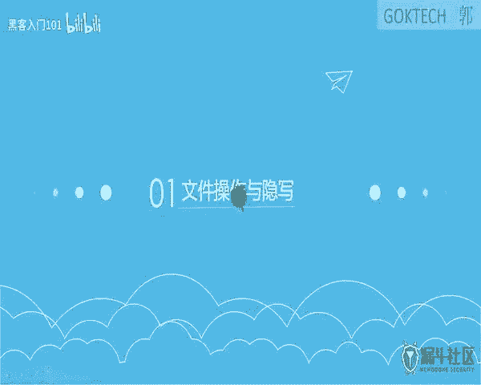

配套了一个配套了一个杂现题目的一个例题哈啊，我刚刚在上传了在在那个上传在图我们群上了，04就表示我第4张PPT第4张PPT啊，05就表示第5张PPT这样子的一个数据下来OK。😊，好。文件操作与明显。

来怎么分析下载的文件呢？😊，啊，如何分析啊，每个文件都会有。好。啊，相应的。相应的。结构。啊，称之为。啊，如何识别不同的？文件呢。不同的文件。啊，通过我们的什么了文件头。啊，文件头啊，通过我们的文件头。

每一个文件都是有文件头部的啊，每个文件头都有是文件头部的啊。像比如说这些啊这些的话可能大家暂时看不懂，我等一下给大家看一下这些文件头部是什么。首先呢最常见的来我们第四个例题啊。😊，第四页PPT啊来。

这里有三个文件，但是呢我打开是没办法打开的，因为我根本不知道这个文件是什么类型，我不知道了啊来。😡，大家知道哈，我们的windows是可以看它的呃那个文件的扩展名的，什么什么叫文件扩扩展名来。

你比如说我在这边新建一个word文档啊。😊，这个什么。😡，点DOC叉的就是它的扩展名。有些同学说，老师我的DO11一样的。😡，啊，一样的DOC也是一样的，它只不过是版本不一同不同而已啊。

兼容性问题而已啊，兼容性问题而已。好，这是我开的扩展名的。如果没开是怎样子的？我把这个勾掉啊，没开，它是这样的，你没办法修改它的扩展名了啊，必须把它开起来。所以说我建议大家都把这个开起来。

win10基本上大家现在问的用的都是win10，打开一个打开这里打开一个窗口，这边有个查看。😡，点开往右边走一点点，往右边走一点，这边有一个文件扩展名点一下啊，给它伸缩起来。如果是winI7的怎么做啊？

win7的话呢，这边有一个组织和这边有一个文件夹选项和组织，这个地方文件夹选项，你点一下，中间有一个查看，你去查一下啊。如果你不会操作，大来问我一下也没问题。OK如果说我把它这个后缀名改了，看到啊。😊。

他这个就没办法进行识别。你就没有办法正正确的打开。你比如说我随便拿一个。😡，一、你知道他是用什么，你知道它是什么类型吗？肯定不知道啊。OK这里我为了方便啊，这个是出题，出题人比较比较好心。

直接给你提示的什么提示啊，这PG是不是就是它的一个什么格式啊，看着啊我复制粘贴一个文副本啊，看着啊。😡，我在后面给他补上了。😡，这P剧。

是个。图片对吧？可以正常显示了。但是如果我没有给你提示，你很难想象它是什么文件，那这时候我就要去分析怎么分析呢？😡。

来。如何分析啊？啊，分为这么两种哈，主要分为这么两大类。第一类。😊，手工分析。第二个啊工具分析手工分析是什么分析啊？来windows下需要安装这么两个软件。二选12选1。第一个叫note pad加加。

😡，啊，note加加什么叫note pad的？😊，那能片的就是我们的记事本。😡，哎呀。Notote pad。啊，这个还放放放大不了啊，就是我们的记事本OK如果是note pad加加就功能比较强啊。

功能比较强来打开啊，我们打开note pad加加啊。😊，这时候我们要下载一个插件。😡，我们先要下载插件。下载插件。啊，怎么下载啊？来看下啊，这里有个问号问号，这里边这边有个问号啊，最右边这边有一个问号。

选择一下，点击获取插件。点击获取插件。啊啊，他会打开一个网页啊，这个网页我们先不管它哈，来看下。😊，啊，下载插件这个插件叫什么呢？has。😡，Editor。这个插件下载完之后，下载之后。解压说。

放到什么了？note pet。😡，note pad加加的。安装路径下。啊，我问大家一个问题啊，怎么知道我文件的安装位置在哪里？右键属性是吧？来看到啊note pad加加右键不是属性啊，打开文件所在位置。

有时候你打开的时候是一个什么快捷方式，这时候只要再执行一下，一打开文件所在位置，这里就是它的安装路径，其中一项一个文件夹就plans，这个文件夹就是它的插件所在的位置。这个地方打开全部存放的都是插件。

你怎么办呢？你只要把下载出来的插件解压之后，把它放到这边就可以了。我下载那个呀我下载的那个插件就叫ha的editor，就这个点你解压之后，就是点DLL这么一个文件，你把它放到这边，放到这边之后。

此时我再打开note pad加加，在这个地方有一个插件。😊，点开就会有ha edit这个文件。并且呢在这里这里这里这里我大鼠标这边大鼠标这边这个H这边可以看得到有一个图标。就是用十六进制数来看来看着啊。

我现在呢演示一下哈。😊，我这边看第一个文件啊。点击它右键edit withnote pad加加点开，你会发现它是乱码是吧？没关系，我右上角这个地方。点一下这个H，它自动会如果我安装的那个插件。

它就会帮我帮我生成。如果没有什么，点击插件hax editor view in hack hack就是16进制的意思。ok。就这个地方来啊，这个地方就会帮我显示出来。OK稍等一下。来。

我问个简单的问题啊。这个是十六进制数，没错啊，十6进制数一个16进制数表示多少位二进制，可以用多少的多少位二进制来表示。为什么？😡，来，我问你个问题啊，十六进制单个字符最多表示多少？15、这个知道吗？

😡，十进制最大的最大单个数表示多少？9嘛，十六进制呢，那肯定15嘛。O那我问你一下多少个一等于15，就二进制的话。😡，来。我问个问题啊。这个二进之数等于多少？怎么算呢？这个是1248加起来没错。

那我怎么怎么做啊，我可不可以先把它加一变成10000。再减1嘛，对吧？这个地方就是2486嘛，16再减1，是不是15O所以说它可以用二进制来表示是吧？好，这个是4位这个是4位。

所以说大家加起来它有几位几个比特。8个比特8个比特表示多少？😡，一个字节嘛，一个字节就是说我们所谓的一个字符。😡，为什么称之为一个字符啊？还记得我们上节课讲那个密码学的时候有讲到编码ask克码。

还记得吗？ask克编码就是最多就是8位。啊，因为它只识你不识别中文的啊，ask克码识别能识别中文吗？其实理论上是不行的，因为它只有8位啊，你只有8位OK。😡，所以说这里就称为一个字符。好。

那现在呢我们一般情况下把前面一般情况下什么叫文件头呢？就是我用十六进字打开之后，前面四个字节。这时候我们就不再说了，这个就是一个字节哈，前面四个字节就可以标识一个文件的一个类型。好。

那我们把这个什么弄弄下来，我们去比对一下，稍等。😊，能对得上吗？这个是什么FFD8FMEE没错啊，所以说这个就是什么ZPG的格式吧。😡，啊，这就是这APP的格式好。ok。来，那你刚才那个怎么下载啊。

看着啊，你打开了嘛，打开了之后怎么下载啊，打开之后打开了之后去干嘛搜索怎么在怎么在这个页面上搜索呢？cttrol加F。😡，cttrol加F。啊，这里可以搜。😊，Eittor。啊。

这个叫什么hax editor。哎，对，x。十六进制，我们往下。往上看一下，没有是，往下。看到没有？Xax editor。啊，你认个下载第一个就好了下载。😡，点一下就可以了。啊，比较卡哈。

这个不知道哪里的网站啊。啊，我也没没没有去仔细研究过啊，点击下来之后，你把它解解压，解压之后放到我刚才那个目录目录下面就可以了。OK好行，那我们现在来继续往下了哈。第二种方法。😊。

下载这个010editor。010艾这个就是专门用来查看他的1救近制数了。下载之后呢，它会自动帮你注册到，你只要默认的，它就会自动帮你记。所以说这个这个地方就是什么？这个地方就是JPG是吧？ok。好。

来下载了010editor之后，就自动帮我注册到这边来。打开。稍等稍等。来，我们看一下啊。稍等一下啊。哪个。这个呃我记得这个包是没有的，稍等一下啊。我把这个010发给你。啊，就这个地方吧。

89504E47是吧？来。这时候有些同学开始迷惑了，说老师啊我这个看不懂这个是什么啊。来，我简单给大家说一下啊。他这个地方左边这个地方啊左边。哎，我的鼠标怎么跑到那啊？

这边啊左边这边啊这边啊这边表示它的地址栏。横纵坐标都是表示到地址栏，什么意思啊？😡，这个表示我的00000001000200030000000F进一之后001011121F到这边是1F，然后往下20。

啊，这个是它的一个地址数OK这边是16进制数，16进制数可以转换转成我们的ask克码值。可以表示我们的阿克玛值转成怎么呀，怎么怎么转啊，有时候呢我就可以什么。

你看着这其实就前面四个字节就可以转成什么阿克玛值，对应下来就是这个东西。😡，这时候你还看不懂吗？😡，PNG算不算图片的一种？😡，好，你们知道图片还有哪几种？😡，这B句还有吗？啊啊。IMG的。GIF。

BMP。啊，JPEG其实跟这个差不多。还有吗？啊，其实很多的。😊，唉，不要说这些嗯呃很很很很少见的啊。来有时候因为阿斯克玛值的一个特殊性，有时候你文件打开之后，你这边看一看。😊。

有时候flag我再强调一遍，flag cTF。😡，啊，key。特别是这种什么大括号的，都是我们的都有可能是我们的flag，都是有可能是我们答案。所以说一般情况下打开一个文件，先看头。😡，先看头尾。

这个是铜啊，然后呢再往下拉拉到尾部这边。再看一下尾部有没有啊，尾部有没有一些特殊的值啊，一般情况下是这样子的啊。OK来，我们看一下啊，89504147，这个是都不用去看那个表啊，就知道它是PNG的。

OK它是PNG的。我们给它改一下PNG。可以吗？再来这里有一根压缩包是吧？😊，来，我们怎么看呢？来看呢啊。我们使用linux啊卡利，我们使用卡利，怎么使用卡利呢？首先卡利打开嘛，打开之后呢。

把我们的这个杂项题目，你最好改成英文。😡，咋。杂家是吧，杂酱题目。好。右键复制一定要不要用快捷方式啊，不要用快捷键了，右键啊粘贴就可以了啊，粘贴到我这边就可以了，看到没有啊，最好不要用中文的啊闸向。😡。

这个比较比较难看一点啊，我们先不看它了啊。O。嗯，那我这里呢因为我装了子系统。我装了几十种，所以说我可以同时使用windows和lininux的命面。所以说我这边暂时就不弄了。

我就不用我就不用我就暂时不进卡里啊，看下啊。啊，来。我先使用了吧。我使用我们的一个子系统啊，这个就是在我子系统下面L啊，我这里有一个这里有一个firefirePNGJGIP的，看到啊这里啊。

这个地方啊PNGGIP的啊。OK我使用卡利治条命令啊。卡利命令看到这里这里这里这里。快啊。这条命令其实它也是一个工具，只不过它因为它没有图形化界面嘛，我只能通过这种命，它是没有图形化界面。

我只能通过命令的方式来把它打开。fire后面跟上我的文件就可以了啊。firerePNGGIP这个没关系，不管它啊唉OK稍等一下。F呀。哎呀。我们看一下。PNG这个GIP的这个啊。来。

他说了这个是一个什么。😡，GIP的一个什么压缩包okK那我们就干嘛把这个东西可以给它改成什么。点击IP。我再强调一遍啊。

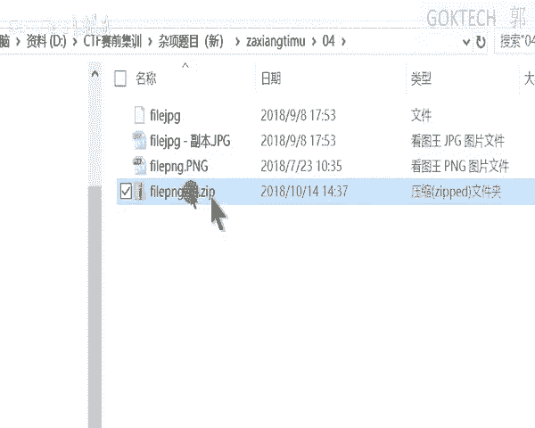

卡利里面是没有办法解压GIP的。卡迪是没办法解解压GIP的。不行，你复制，你粘贴进来试试就知道了。啊，不不我我你宾work那个它自动帮你解压没用的。我我的意思是说对它能帮你解压。

但是如果你用这个来打开的话，那不行，我这个我都试过，好吧。😡，就你用这个它根本就没办法去解了啊，明白我意思啊。

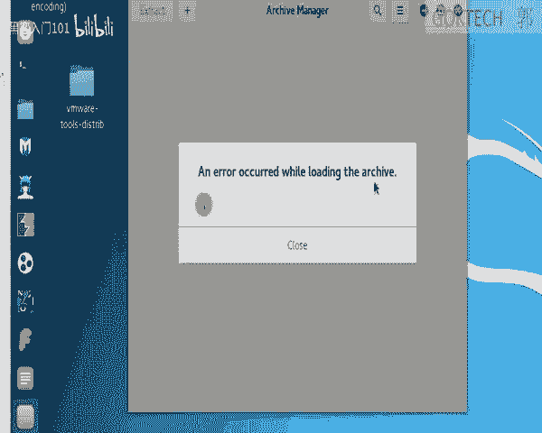

我该用的都用过了啊。😡，啊。OK来。这个地方啊那我们就不多说了啊。啊，该正常给他解压就正常给他解压就可以了啊，那我这里就不多说了啊，问解要说。

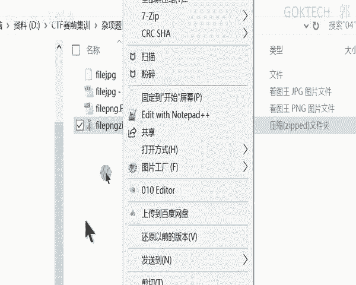

提取啊。行稍等一下，我看一下啊。我是在这个压缩包里面吗？那不至于啊。稍等一下，我重新进一下吧。哎，不是。长酱体。七。提取到当年文件。飞压缩包。稍等一下来，我们看一下它的一个头部啊。啊，010edit。

Close。来。他的头部叫什么？😡，0A00啊0000OK我们把这个头部给它家干嘛呢？剪切下来。稍等一下。去这边比对。是吗？有相同吗？没有线同怎么办啦？😡，修改修改怎么修改啊，在前面加入插入什么了？

504B0304明白吧？OK。504B0304，记住这样修改啊。首先你点进去先看一下你是插入模式还是啊还是替换模式。你比如你注意看啊，我随便输一个A啊。😡，看到我的看到我这边发生了变化了没有？

你现在是替换，我现在是替换还是插入？😡，提完，所以说我这时候要按一下insert键啊，我们键盘上的insertINS。这个银色的键这时候呢504B。0304。啊。给它保存一下。这里就有一个么。

这个图片呢明白吧？也可以正常解压啊。对吧。是吧。Okay。所以说呢如果当当我已经很确定它是某个文件的时候，结果反而打不开。那么一般情况下是它文件头缺失了好，文件头缺失了。OK我们来总结一下哈。

010艾it自行下载啊。我就不多说了啊。之前之前安装啊，说错了。我已经安装包装已经发到群上了啊，刚刚发了还有什么可以使用的吧？😡，第三个工具叫做win hack。啊，这个是在CTF包中CTF。

工具包中怎么看我们的CTF工具包啊，打开。CDF3CBF工具包啊，工具这边有1个CDF工具包啊，因为我们今天讲的是什么杂项嘛。😊，啊，来我们看一下有没有啊。这里有个winax16进制编辑器啊。

然后把它解压出来就可以了，把它解压之后呢，把这个就这个文件你不要去点set up，这个已经装了，这个是一个绿色版的，不用安装。你只要把这个东西干嘛？右键发送到桌面快捷方式就可以了。😊，啊。

发送到中面快捷方式就可以了。发动的桌面快捷方式。你比如说你要想要做一个实验的，怎么做呢啊？来看的啊，我桌面上有一个它的图标，稍等。我桌边上有一个他的这个快捷方式啊。快捷方式。那我怎么做啊怎么做啊来。

我这个炸象题啊。我把文件让它拖出来，用这个win hack打开。用户win下子打开。也是可以的也是可以的。但一般情况下我不怎么用这个啊，建议还是010比较好用。

因为它可以注册到我们的右注册到我们的一个右键菜单上面啊。O那我们接着往下。好。其实呢无无论是用工具还是手工呢，无论是用firere，还是用我们的工具，还是说我们怎么样子。

其实说白了都是比对它的一个什么文件头。firere无非就是说自动帮我们进行比对。那我们十6进这编其是我看了之后要拿来跟这个什么这张表来进行什么比对，做熟了之后呢。

基本上你这张表已经很熟很能够能够什么基本上大大差不差的知道它是哪一种文件类型啊。😡，再来，如果说你文件头缺失了啊，文件头缺失了，你怎么办呢？啊，你怎么办？来，你就把它补充进去就可以了啊。记住啊。

我这里再教你大家一下啊。😡，来。比如说我要把它复制出来啊。错啊。我要把这个0305B030是复制出来，右键复制copy啊，放到我们的文本里面，note pad就note pad里面。你看一下啊。

我要复制504B0504B0304啊粘贴它反而是这种。为什么？因为你复制的时候是复制到什么？😡，阿斯克阿斯克这边这个叫不，因为为什么这两个是。😡，显示不出来啊，因为这两个是不可打印字符。

我说了ask克码分为两种嘛，一种叫不可打印字符，就一个一种叫可打印字符。最简单的不可打印字符是什么？是我们的word里面的回车符啊。😊，word者用过没有，基本上只要回车，是不是换行符嘛。

换行服不叫回车服，它基本上都有这种。你打印的时候会有嘛，肯定你打印的时候会有吗？没注意是吧？打印的时候肯定没有啊啊，OK那你怎么办？如果你真的如果你真如果你是flag在这边啊？

如果说你比如说这个flag这边，你这样子唉。😡。

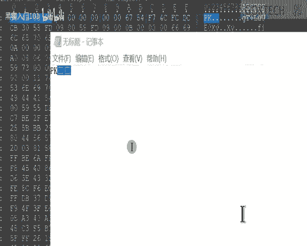

稍等一下。啊，不好意思。这个不好用啊，如果你flag在这边当它好了，右键复制就可以了。如果你只想复制这个值哈。😊，如果你是想复制这个值啊，这个不好用啊。因为我我手写版跟这个冲突了。稍等一下。

如果你只是想复制16进制，你怎么做呢？这边有一个编辑。copy as16进制。啊，不是下面这个这个是比特啊不一样，copy21616进制的一个数，copy一下点一下啊，然后呢粘贴到我们文们本你看一下。

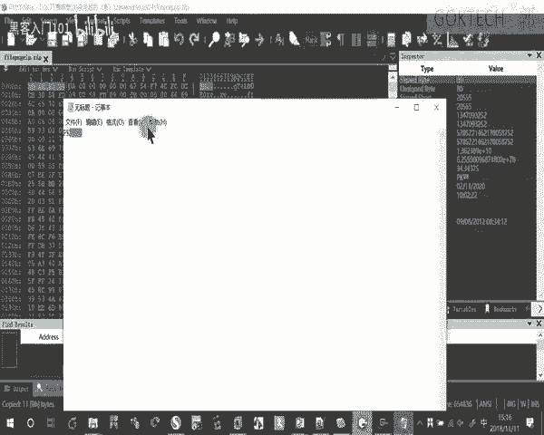

暂停。504B0304对吧？

型号，那我们往下啊。我想这个基本上就是属于我们第一大类，就文件类型的什么啊文件类型的一个识别啊。工具的分析的话，工具就有很多了啊啊，工具其实啊也不算很多了啊，就是我目我们目前知道了啊fire样嘛，对吧？

啊，等一下还有我们先不急发了是吧，这个是什么哪哪个环境下。😡，你是话机器。あ前。啊。当文件。出现什么无法打开。的情况。需要查看什么啊，需要查看呃文件头。啊，如果啊损坏。或者缺失。确实。需要补补充啊需要。

进行相应补充。差不多是这个意思啊，大自己回去总结一下啊。来。有时候呢文件。它文件是可以藏到另另外一个地方里的，你表面上看它是一张图片，实际上它有可能是一个压缩包好，那我们怎么去分析呢？我诶。啊。

文件分离哈。第一个哈。😊，啊，分析。加分离。这个是什么？我们的这条命令，这是我们第一个什么命令叫bework。他可以进行分析，也可以进行分离。OK。啊这是第几页第六页是吧？He。这是中间插了一页是吗？

应该是第五页第五个啊第五个第五个。来看到来，首先呢我来进行一个什么。我来进行一个校验。啊，010艾it嘛。啊。3961C2C01啊，这个肯定不对的哈。这个GIF是我们刚才那个文件文件头的损坏的。

我们怎么去弄，我们不看这个，我们看第六个啊，第六个没错啊，第六个没错啊来。😊，这里有一个文件哈这里有一个文件啊，姓点JPG打开看一下。😊，哎，好像挺正常的是吧？这什么？看过吗？可以正常显示是吧？

这时候呢我我我要进行对他进行分析啊，看着啊。我先把它放到。放到哪里呢？我把这个放到放到外面嘛，不然的话中间太长了。我要放到这儿。改一下名字啊改一下名字啊。呃，1809吧，改一下名字。

不然的话等一下比较长啊。这样的话我这个地方不会显得很长嘛，来。B我靠。😡，我使用这条命令来分析一下这个什么呢？我们的性典JPG啊，这个是我们的一个胡巴，对吧？好，我进行分析，看一下它有什么问题没有回车。

😡，这里有个地方。这个就是他。16进制的一个位置啊，16进制的一个位置，这个是这个是那个字符数哈，字字符数，这个是按位置来显示啊。0X00就是从开头啊看的这个是一个什么？😊，CPEG是吧。

然后从这个地方开始是一个什么596F是一个什么。😡，GIP啊，我们来分析一下，用010edit啊，这个东西很多啊，大家注意听啊，010edit来分析一下啊，打开。😊，从零开始是一个。

这PG的一个文件是吧？我们拿它干嘛呢？啊盯一下，稍等。😡，我们这个地方。对吧。点日。还有一个是59什么59多少来着？😡，596F是吧。😡，596F59这个肯定很下面了哈，我我先往下拉，再告诉你们。

596F。5950吧，5960吧，6061662636到6到最后是吗？6到最后是多少？😡，哎，算了，我我的鼠标了啊。50什么4B030是刚刚刚才。改过的是什么？是我的压缩包的格式嘛，GI密码对吧？

那我这个什么。😡，那我这个FF08呃FFD8FM10是什么？😡，哎呀，好像还不太对是吧？😊，差一点是不是？😡，啊，差一点点哎。为什么会这样？不应该哈不应该啊差一点点不应该啊。这地方有点小瑕疵啊。

不管它不管它啊，可能是平之前做实验的时候改造了哈，不应该哈，没关系啊，反正这个正反正是一个正常的一个图片啊，正常一个图片O那我现在要把它进行分离哈，分离来看着啊我怎么分离呢？😊。

我一样的是使用这个binwork，但是这时候我要加一个参数，为什么要加参数啊？😡，加参数就是为了让它的功能更加啊更加好用啊。be work。😊，我原原来是这样子嘛，对吧？我在这这前面加一个参数杠E。啊。

就让它功能更他强大啊，我的文件夹在哪里呢？在这个地方啊OK。回车。啊，他会干嘛自动帮我进行一个什么分离。分离出了一个什么以这种名字结尾的以这种名字结尾的。啊，文件夹里面看到啊，我打开这个文件夹。😊。

里面有个压缩包没错，但是它自动帮我干嘛？😡，自动帮我解压出来了啊，我不想让他解压，但是他也自动帮我解压出来了，是一个什么。😡，是我们的一个什么flag。这我们的flagO。啊。

那如果说如果说你在卡里里面，如果你单独想把这个GIP打开，它是不打不开了啊，它是打不开了。😡。

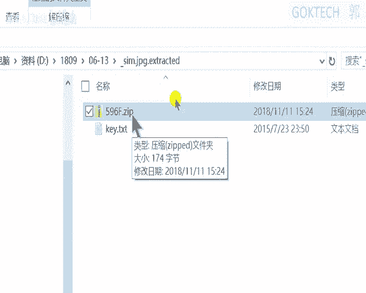

O。

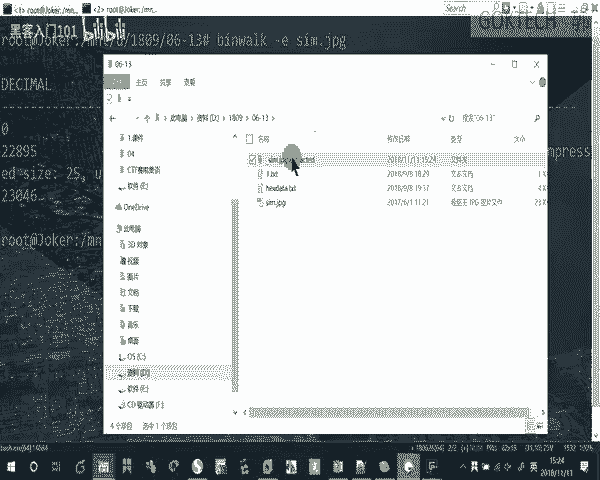

好，这个是第一个命例。这个命令的特点就是什么？除了分析，还除了分离，还可以帮我进行分析，是不是O接下来我们看第二个。😊，啊，第二个是什么？我们的一个另外一个命令，这个命令呢是为了什么呢？放播放一下。

是当我的bework无法进行分离的时候，使用这条命令form foremost。因为呢你像往往哈比如说这个比赛是第一届第一届开始比的时候，他反而有时候就会出的比较简单。

等到第二届的时候或者等第一届做完的时候，发现大家都会用bwork。那我就使用什么啊，你bwork不能用，不能解的，不不能分离的啊。那有时候呢用这个forms就可以干嘛进行个分分解啊分解。

OK那我们来看一下它的特点哈。😊，首先呢。用法是差不多的，formmost加到目标文件。😡，有一个参数叫杠O，这个O是aler put输出输出到某一个文件夹里面，某个文件夹里面啊。把它输出去之后呢。

我们来测试一下它是怎样子的啊，它其实比比那个冰work会好一点点啊，来看到啊。formmost跟上我们的一个什么文件，这个文件夹性点PNJPG杠O输出在我们这个test这个文件夹里面回车。好。

我们来看一下这个test文件夹啊。这里有个t的文件夹。进来他就会干嘛帮我按格式进行划分。比如说JPG里头，它会把我放到JPG里面，GIP的会放到GGIP里面。好，你们不知道还有没有注意到一个特点啊。

刚才我使用binwork去分离的时候，它有分离出ZPG吗？没有吧，他只是把藏在里面的GID给我拿出来，对吧？ok。😡，JPG有吧？在外面。GIP有吧有帮我解压吗？没有，我要自己手动解压。😡。

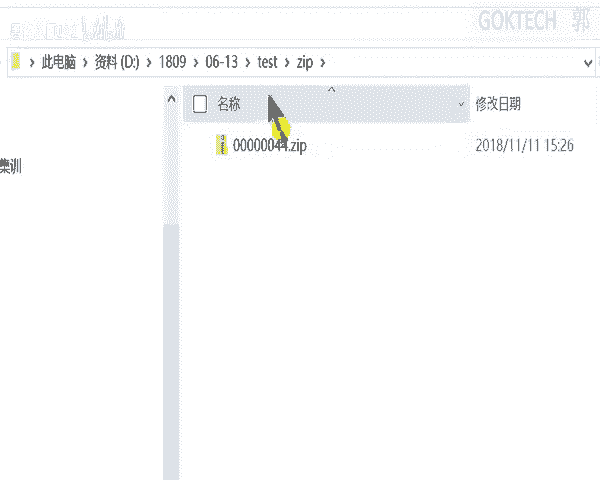

OK这个是什么？日志日志，我通过日志就可以看到我解压了什么。😡。

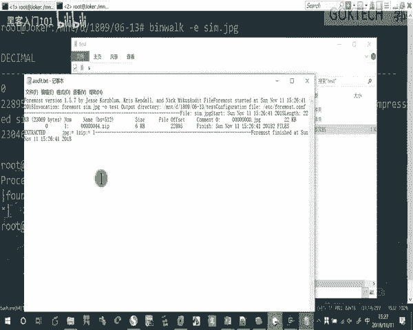

啊，1个GIP一呃错来一个一个一上面这个啊1个GIP啊，1个GIP啊OK。😊。

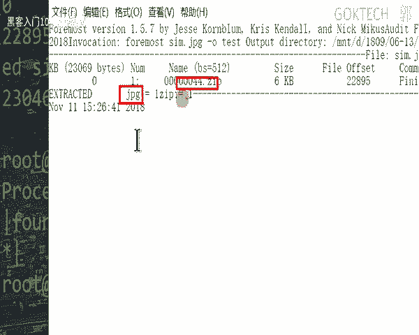

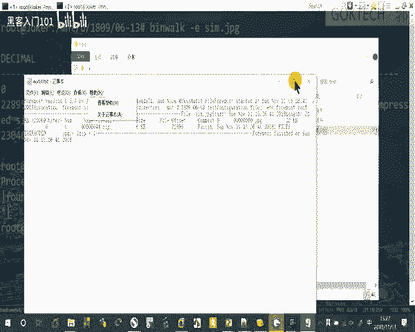

ok那我们就往下了啊，这个可以吗？😊，ok啊。啊，不要打开说养。OK再来1个滴D在讲滴D之前呢，我先给大家说一下啊，有些东西呢。这个我给大家总结一下，这个叫自动分离啊，自动的啊自动化。

自动化就分为两个灯芯。Formost。都是在哪里？😡，卡利中对。还有一个是什么？半自动化。都是在卡地中。半自动化啊半自动化啊，但是在讲半自动化之前，我先给大家说一下，为什么有些东西不好分离哈来。

我们刚才那个姓点JPG。诶这备注啊。他是怎么样的？前半部分是什么？😡，JPG没错啊，后半部分是GIRP这个好用吗？😡，非常好问你吧，我只要前面拿掉，中间呃后面拿掉就可以了吧。如果它是这样子的呢。😡，1。

嗯。34我打个比方，比如说我分成4个啊，他给你10块。它的一个文件结构，它是这样的，打个比方啊。我12就组成JBG嘛，三4组成是吧GIP，他这样给你放。给你放一。给你放三。给你方2。没放四。

你这样子还能够自能还能够自动去分离吗？😡，来，首先看到什么，他肯定是看这个一一这个地方有头部啊，还有三这个地方有头部，没错啊，他就把把一给你分出来。😡，把324给你分出来。

你还能够正常还数据还是正常的吗？😡，肯定不是正常的嘛，肯定是错的。所以说怎么样了？就有时候我们就要手动分离啊，自己去分析，甚至有时候自动分析还不行啊，那这个是更更深刻深更深的层次啊，我们先不管它啊。😡。

既然它能够合并呃合那个隐隐藏隐藏在一起，那肯定是有方法来分离的哈。那我们讲这个滴D哈，就滴D这条命令啊哎滴滴是做什么的？😊，来，我告诉你哈，最早的时候我们是用来这个是用来创建一个大文件的。

最早的时候是创建大文件，用来干嘛？而不用来测试。磁盘的性能。怎么个测试法哈？我首先滴D哈，我的数。😊，我的那个语法与这个一样。我的语法跟这个一样。就什么呢？滴D。😡，啊，从什么呢？从我们的磁盘啊。

磁盘里面有个零区啊，磁盘有DB，我们的磁盘里面反正磁盘里面有个零区零区，这个零区没有任何有效的数据，反正就一堆没用的数据。从零区里面生成一个什么生成一个文件叫test了。好。

从这个零区的数据给它搬到这个test的这个文件上面，干嘛呢？我设置快大小等于一兆。他默认的单位是自己。啊，默认的单位是b啊啊，快的大小，默认是b啊，当然这个不好说是不是不是bit啊，我们先不管它。

反正就默认情况下呢，它是一单位的话呢，我们不管它。😊，如果说我可可不可以写单位呢？可以，我就快大奖可以一照。😡，然后我要写多少呢？count。😡，我要写1001000个。

1000个的意思是不是我要生生产创建一个t的文件，它的大小是什么？一个G吧。😡，我这讲了有没有问题？我重新写一下。滴滴，我要从零区那边复制文件出来。零区。啊，生成什么邻区的文件。

复制到我们的什么ts的这个文件里面。它的大小是怎么算的呢？😡，快大小是一照。啊，然后呢我总共要多少块呢？co等于1000块。也就意味着生成的时候，这个test是么一个句的内容。那好他就会开始分析。

开始分析，等这个文件创建出来之后呢，它底下就有数据说什么，你用这个创建这个一句的文件花了多少时间，每秒是每秒的时候移动的时候是多少兆。比如说20兆每秒，这是算是正常的。像我们普通的机械硬盘了。

正常的大小，普通的机械硬盘，正常的传输速据就是20兆每秒，写入数据就是20兆每秒。ok那这里的话是什么意思呢？你看着啊，我们来直接看例址啊。😊，来。

这里有1个TST文本叫1点TST它的大小是呃它的一个内容是1234567890ABCDEFG。好，来，首先我要从这个这个这个是圆嘛？我往上一点点。这是圆吗？这里。啊。

原就是1点TST就是这个内容它文本的内容。然后我要生成1个2点TST。我设置什么快大小为5，也就5。哦。哦。5我要取几块呢？取一块，就把这块么取下来，生成这个TS2点TSD的内容就是12345。

OK接下来往下。三呢。就是1234567890。好，关键是这里有一条命令。这条我们来看一下啊。我要跳过一块怎么办？你们跳拨一块怎么办？来，现在的话呢，我一样是55。5。55。啊，取3块是吧？

那我跳过一块是说这块不要，然后再取2块。😡，还是说跳过一块，开始1233块呢？啊，我重新说说一下，他是说取3块，第一块不要，还是说跳过一块取3块呢？我们给它验证一下，前面这个就比较简单，我就不演示了哈。

😊，这是一样的，是这个路径下叫11点TST是吧？啊，DDif等于1点TST2等于多少呢？11点TST。然后呢，它的一个大小是什么呢？一啊快是什么？嗯。啊，skiip多少跳过一个回车啊，生成了一个什么。

生成了一个。等一下。生成了一个。1点THT的，我们看一下多少。2345啊。哎，稍等一下。等一下呀。我。我的大小是多少来？😡，我的大小是多少？一块的大小是多少？😡，一块的大小。😡，一吧取了5块是多少？一。

呃，我们来看一下这个啊。12345对吧？我跳过了几块啊，跳过了一块是吧？跳过了一块。所以说是我想问的是说我现在要12345，对吧？啊，我现在取要出55块嘛，我想问的问题是什么？我取这5块，然后呢。

第一块不要。😡，还是说我第一块跳过12345，就是取什么23456。我们来看一下啊，这个结果啊，刚才不小心让你们先看到。多少？是什么跳过一块再取5块，对吧？😡，okK所以说答案显然易见啊。

只不过跟这个不一样而已啊，这个没关系啊，问题不大。OK那我们回过头来看一下这个哈。😊，我们过头来看一下这个啊。注意听，这个一定要注意听一下冰。Work。我们分析一下这个性别JPG，我们再分析一下。算了。

不用不用不用盯了。不用盯。我们来看一下。之前我说的这个是制符的制符的制符的个数，对吧？来。😡，字符的个数是什么？我整个文件，我这个姓点JPG是什么？是我的一个胡巴那个图片嘛，里面藏了1个GIP嘛。😡。

有印象吗？OK来，那他这张图的意思是什么？前面是什么？😡，前面这里从0到222895是我们的JPG，对不对？从22895到什么23046是我们是我们的什么是我们的1个GIP对吧？

我现在要用滴D这条命令把它分离出来，怎么分离？😡，这个同同颜色啊还不太好看。总颜色还不太好看呢。我们。其他我们先不管了，我们直接直接看这个啊来。😊，BD啊E服等于多少？我的原文件是s点什么JBG是吧？

哦，不，我现在要生成一个什么了？11啊，不要22点GIP嘛，因为我要把这个GIP给它提取出来嘛。😡，O。快等于多少？😡，我要快等于23046。啊，不是快等于一，我要快等于一，然后我要取，不好意思啊。

我要取colt，我要取多少？😡，23046块。23046，如果我此时回撤会是什么意思？是没有分离嘛，就把整个文件密嘛复制一遍，变成了22点GIT没错吧。😡，我快大小是一嘛，我取了23046个嘛。

是不是整个文件被我取下来了？😡，哦，046是吧。这个有没有问题。okK现在但是我现在要跳过跳过哪里。😊，跳过前面多少22895吧。Os。😡，啊，是这个怎么啦？奖于。22895回车。

OK现在我生成了一个什么，生成1个22点GIP的文件是吧？在这边。啊，点击IP对吧？😊，是不是我们的key？这个K是一个伪加密。啊，什么叫伪加密啊？他你看呢他解压的时候要求你输入密码啊。你看到。

如果我用wins10自带的啊啊，windows自带全部解压说哎等等下这个。😡，这个板冲突了，稍等一下。全部解压缩他你看我点确认的时候，他要求我输入密码，对吧？啊，我取消没办法，我没有密码，我没有密码啊。

我没有密码OK我把这个删掉，免得干扰。😡，来22点GIP是吧？我现在用什么？我第三方解压解压软件，像你们的winIR、360快呀这些啊都可以都可以啊，提取到当前位置。啊，虽然他会报错是吧，但是我告诉你。

你打开这个key。😡，它一样可以看到我们的flag，明白吧？行，这个是半自动化分离。还有就是手动分离的，手动分离其实也非常的简单哈。😊。

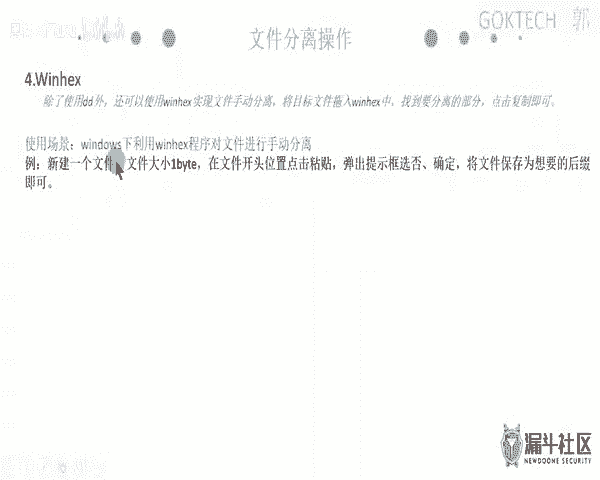

我们一样的哈，打开我们打开的是这个。😊，稍等。我们打开的是这个姓点JPG这个文文件夹是吧？那我们怎么去看呢？我们怎么去看呢？稍等，我把它还原一下，还到回到第一行。😊，首先我这里。010有一个特点。

就是可以搜索。点击这个社取这个地方，这里这里这里 search取这边有个fin码。哎，等了半天没有，其实它在下面看着啊往下往下走往下走，往下走，在这个地方。你怎么去搜呢？就我们那之前那张表嘛。

我们文件头的表嘛，你一个个去输。😡，504B0304是吧，找一下。😡，有是不是好，OK这是一个文件。然后呢，是接下来讲一个文件嘛，一个被发现的一个码，找到了一个嘛，这个一嘛，这里这里这里。😊，好。

接下来第二个文件头搜第三个文件头搜第四个文件头搜不断的搜搜到有的时候你看到。把这个地方。啊，哎。把，这个地方这时候不不不用复制。😡，啊，我们section错 select选择选择干嘛啦？😡。

保存slect。就把它保存下来啊保存下来，就把这个我选中的部分给它保存下来，保存成一个什么啊特殊文件啊，稍等卡了啊。

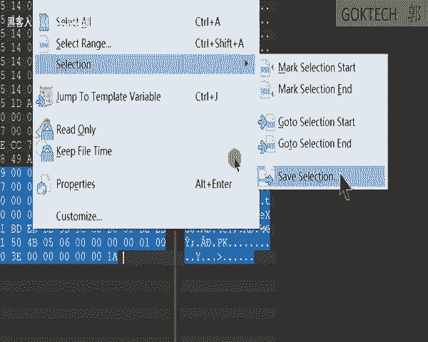

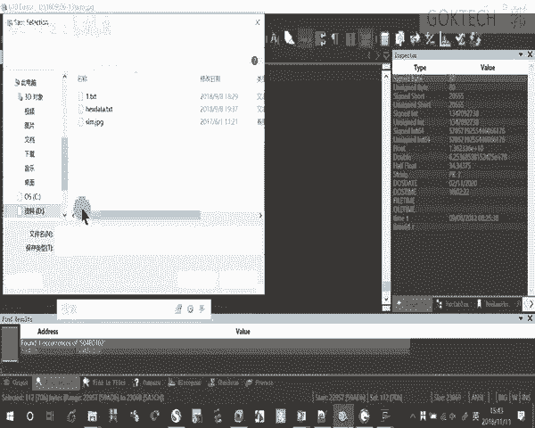

保存一个文件，保存成一个文件。你这时候呢可以是GIP。保存下来好，保存了。就是一个很奇怪的名字啊，知道吗？哎，那我们解压一下，看一下能不能解压开。😊，是不是哎。稍等一下。稍等一下，我看一下。010号。

有可能是我头部没有复制正确。504B0102哎。我有复制权吗？504B0102。诶。504B0102哦。哎，有一些问题哈来。😊，有一个特别尴尬的问题啊。😊，我们之前收的时候，他是505960F。😡，呃。

596F开始是吧，还有印象吗？😡，这个地方。稍等。这个这个binwork分析的时候啊，它是多少596F吧，596F596F开头开头的。我这个地方。是596F吗？我这个地方不是596F啊。

我这个地方是不是被改了？啊，对，好像也不是哈。那我是搜索错了是吧啊，刚才搜索错了哈，应该是原来就搜过了哈啊，不管它应该是5B啊。对我就说嘛fin。😊，应该在里边fin，我没查过哈，应该是多少来着？5哎。

呃，对对对对对对对对对，刚才看错了，504B我就想着就没有注意看504B03。04回车啊，那那没错了啊，我就在想怎么会没错怎么会错啊。啊，这里哎哎哎。这里啊这里这时候应该没有数了。把它另存为。好。

另存为这时候呢我们这个地方啊保存一下哎唉。就变成多少来着？是。哎呦，这地方老是会有冲突啊。1111吧。那我就说不再解压了，双击运行能不能看到这个key啊，能看到这个K就没有任何问题了啊。OK对啊，对啊。

刚才那个没注意啊，小事情啊。系。OK啊，这里有一些小小小小小技巧啊小技巧。你比如说啊复制粘贴什么的都可以哈。😊，我就不是说的啊，010这个也有啊，这刚才这个是winax的啊，这是010的。

这是文件分离和。分离啊，文件识别文件分离的啊。OK。如果你说你要把一个文件里面导，你要把复制的，你们比如说你要把1个1六进制的字符哈，你看着啊。😊，比如说刚才我我弄出来1个16金制制符哈。好。

1个1六进制制符，你怎么你。这个16定制字符，你怎么把它放到我们的1个010editor或者说其他地方呢，你就应该这样子，这里有个导入。导入16进制，把它导进来，它就会自自动帮你排列，不然的话。

你右键复制粘贴是不行的啊。O。还有啊文件合并。你们有没有试过去下载一些大的软大的软件？😡，比如说游戏单机游戏。最简单的游戏啊，GTA了啊，不是最简单了。😊，对这个东西啊。多少解压出来多少。

100G不止吧。不止啊，100G不止啊，100G不止吧啊，100G不止啊。OK这种单机游戏你它一般情况下不可能说当个文件我压缩包那里慢慢下吧，不可能的吧，它肯定是分分成了好几个什么。😡，好几个压缩包了。

然后你下载完之后，你要把它合并成一个嘛，你就用解压的方式合并成一个。😡，合并成一个合并完之后呢，你比如说它在那个下载的一个页面上面会提供1个MD5值叫X1。你自己下载完之后，合并要去做一个计算。

计算出X2的1个MD5值。你拿这两个人去比对。这两个植蛛一模一样，说明你下载的时候没有任何问题。如果出错了，有可能你是下载的时候网络波动，或者说你解压的时候没成功啊，这些都有可能啊，这个是MD5啊。

记住啊，我再强调一遍啊，这里说的MD5的一个校验哈，跟我们的MD5加密是不一样的哈啊是不一样的哈。MDMD5加密是一用密文变成明文的方式。那你不可你是不可能啊。

你是不可能用MD5的校验值去逆推回一个文件。😊，啊，这个是不可能的。你这个MD5值就那么就128比特啊，顶多164啊，你是不可能逆推为一个几几十G的一个文件的啊，强调一下啊。啊。

那你那你说MMD5加密的话，可以解密，这个是逆逆向的一个解密啊，这个不一样啊啊不要想着说哎MD5是可以逆向的啊，不是啊。😊，好，O。来。你纽ex下的一个文件合并啊。来，您比如说它。😊，有可能就故意嘛。

他就故意给你啊，这里给你放一个文件，那里给你放一个文件，你把它全部分离出来，再给它进行一个合并，也有可能，这不是不不是不可能啊哎。😡，反正就有多个文件，您想把它合并成一个啊，非常简单。😊。

在那个我们这边有一个例题啊，我来直接来看一下啊。😊，不知道第几页啊，我们看一下第十5啊，没错啊，这是像这种题呢，算是你幸运的。😡，面试官比啊出庭人比较好心，就前面都是有什么。😡，规律。

你后面你直接加一个什么。😡，新就可以了。你GIF新号，它就会把匹配什么GIF开头的文件啊，这些所有文件看嘛啊，把你合并成一个book。好不合并成一个文件。那这里我就不对不多演示了啊，我就不多演示了。

我直接来我来直接看了啊啊，这个CMD的话比较复杂啊，就命令也是这么多，但比较复杂。我们就直接看这个这个温嗯那个嗯卡利里面的啊，卡利里面怎么操作啊。😊，15是吧。CD点点回到的上一节目录啊。

CD15啊LSLL不好意思啊，搞错了。有1个GIF01020304吧。好，OK。Cat。GIF星。把它导入到什么book。有问题吗？Okay。回车啊，生成一个bo这个book这个文件夹啊。

book这个文件这里。OK现在呢我要对这个book可进行一个验证它的MD5，验证它的1个MD5值啊MD5some。

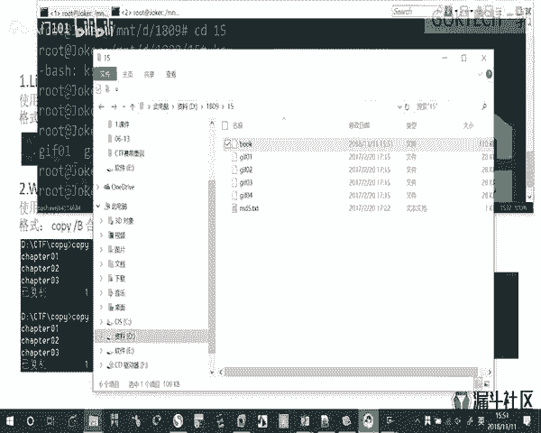

和嘛校验盒应该没错吧。MD5的一个校验盒啊，我要计算这个什么了book。诶。同时在这个下载页面上，它会提供1个MD入值是吧？我们比对一下。799没错啊。😡，一般情况下，我告诉你，你只要前面一样。😡。

只要前面一样，基本上都可以认为它的值是一模一样的。因为MD5有一个特征叫做雪崩效应，你只要稍微改你的文件，只要稍微搞一点点，它的MD5值绝对是完全不一样的啊，所以说基本上你到这边就可以确认它是没有错了。

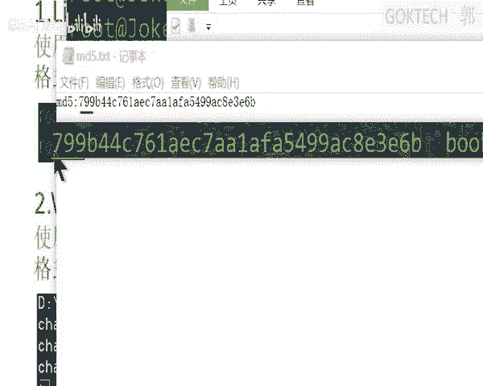

当然除非这个面试官啊啊出理人出一者出理者啊，故意把你这个改了啊，那这个也有可能啊。

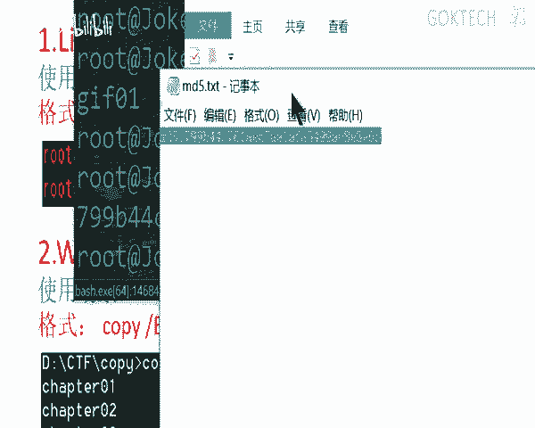

，没错了，没错了之后我们再看一下右键010edit去分析一下这个是什么类型嘛。39610呃CC201啊，3961C201啊，自己去比对啊比对，或者说什么自动化了啊，像什么firefi是自动什么啊。😊。

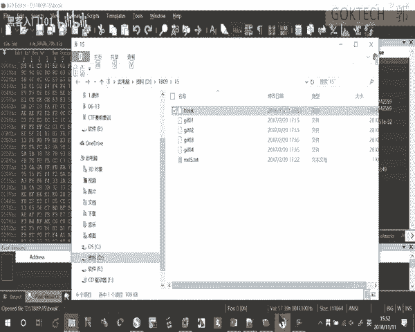

fire去自动分析这个book。でた。那个。如果是data的话，就有可能哈，就有可能它这个文件头部已经被损坏了啊，就就只要你用这个分析之后，它是说是一个数据，那就有可能是被破坏了。那我们往上翻。

它题目其已经若有若无的给我一给我提示是1个GIF对吧？那我就要看一下它的1个GIF的一个图，它的一个什么。😡。

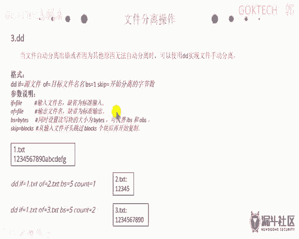

前缀是什么？😡，47494638对吧？那我就可以改它的一个值。47494638。保存一下。这时候呢我们再用fire去分析一下。按上下键可以可以那个调用之前的一个命令啊。是不是GIF啊。啊。

OKGIF我再给他改上一个什么。加上后缀啊，这个看不到没关系啊，我念一下就好了。好。好不容易解压出来了，它的T就在里面。😡，蒙了来没关系，截图哎啊等一下。😡，截图一张。

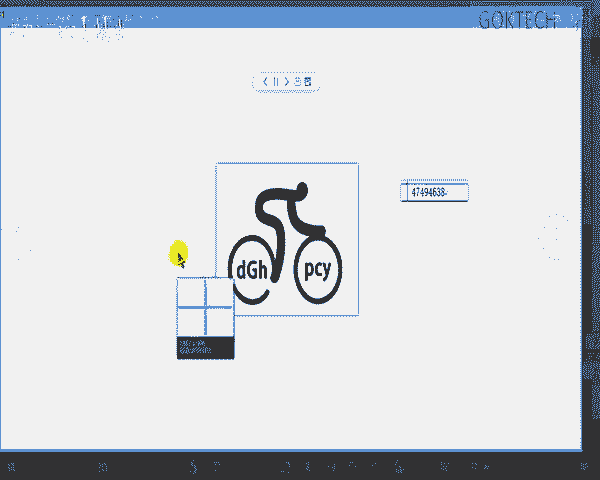

对吧懂我意思吧？再截图再一张啊，就一帧一帧的给它截下来。有时候你还会截重复了啊，那怎么办呢？你比如说你可以像我这样下载看图王。😊。

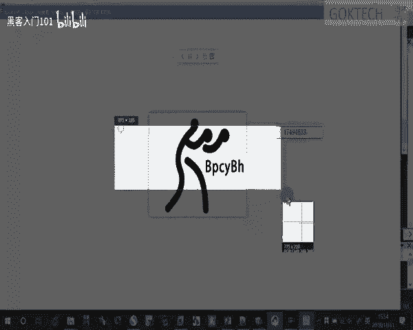

这个地方可以给它暂停。他就有一个工具啊，因为它GIF就是一帧一帧的哎。😡，可以啊怎么样？可以吗？好用吗？啊。😊，是吧。当然你也可以用专门的工具给它把它涂层嘛，给它分析一下嘛。你涂层比如把它去掉涂层。

或者针一针一针的来都可以啊。😊。

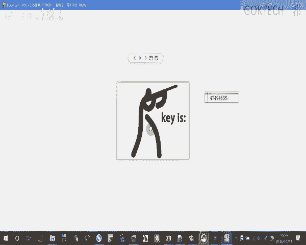

不然不要感到绝望啊，这些都肯定都是有工具可以解的哈。😊。

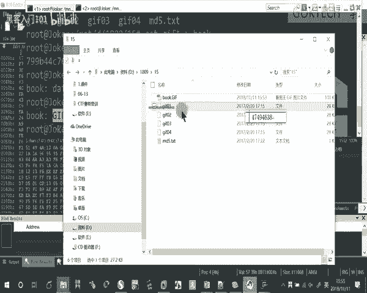

OK那我们先休息一下了啊。😊，开始了。这个这。说白了就是。有时候他的一个playide就常在我们。那是干嘛？啊，图尾。嗯。改一下，不然收音声音收不到。🤧嗯。来图片引写术啊，图片引写术这一块的话呢。

我们怎么做呢？首先主要有这么几个啊，但是基本上我们也决得涉及到这么几点啊。来第一个啊。😊。

来。图片的一些细微的颜色差别，有可能就会构成一张图片、二维码或者有效的信息。啊。我问你一下，一张图片，如果一个像如果一个像素的一个区别，你能够分辨的出来吗？对吧？OK啊。

那我们肯定要通过工具OK来再来1个GIF啊，有一些多帧的一个隐藏啊。GIF可以能把它啊我们可以我们一帧一帧的给它啊拆开啊，有时候可以看到很多信息啊，或者说一些通道啊，一些颜色通道，一些颜颜色通道。

我们可以把这个图片，颜色通道啊进行一个分离啊，都是可以的啊。😊，OK还有E叉F信息。一叉也不是什么？😡，E叉不是很很常见的一种信息，就是我们图片了。我们手机呀我们手机拍照之后啊。😊，看着。啊。

我手机拍照之后啊，看着啊。我们手机拍照之后呢，很多信息都会放在这边啊，详细信息这边啊，你看拍摄时间。好，像素。啊啊，相机的一个生产厂商，这些都可以认为是一 type信息。

有时候往往就会在这个详细信息上面隐藏一些部分重要的信息。比如说flag。😊，再比如说我们的位置信息GPS啊。啊，来现在我们手机是不是现在手机都有。手机应该都有GPS功能吧。GPS啊，我刚才是不是讲错了？

我讲对了吗？反正GPS啊啊有点等一下别GGIF跟GPS搞混了哈啊，GPS啊。😊，这是一个用来手机定位的手机定位的一个功能哈。通过这个GPS可以定位到我们个人的一个位置。😊，啊，你比如说最简单啊。

你比如说我用手机。微信有一个实时共享位置，知道吗？微信那个地方可以发送位置，也可以实时共享的你的位置嘛。OK。😡，那好，你只要把你的GPS打开，同时你的相机，相机可以设置嘛？相机设置什么呢？

设置记录位置信息。那么你的信息呢就会记录在我们的图片的一个图片那一边啊，这样子的话呢，有时候你拍一张之前又有一个笑话，或者说一个梗啊，就说什么有些有个人啊发一个朋友圈，还是发一张微博。

我们发了什么啊初开旅游几天，然后呢，家里附了一张家里的一个照片。😡，然后就通过这张照片找到了他家里的位置，然后他这个人出差旅游回来之后，发现家里被盗。啊，就呢味到 ok k。啊。

所以说你们最好是功能这个功能给它关闭啊来图片修复啊。有时候呢图片也是文件嘛，它有时候也要需要修复头尾啊，修复头尾，修复校验值，修复长宽长宽高。图片是有长宽高的。我们不说不说什么三维的。

我们说二维的就好了。😡，有没有高度？😡，有没有宽度？打个比方，比如说这个是一个二维码。😡，我要是把它的高度变成一半，你还能扫得出来吗？😡，扫不出来吧。再来最低有价位的一个音写哈。什么叫最低有价位啊？

我们的一个。😊，光啊我们的光是由三原色组成的。叫什么RGB。😡，什么叫RGB啊？红绿蓝，记住啊，这是光。颜色嗯任何颜色都可以用这三原色来三基色来组成的。😡，还，还有一个什么颜料哈。😊，还有种东西颜料哈。

颜料的三基色跟这个不一样啊，颜料应该不是红橙蓝，呃，应该不是红绿蓝，有可能有可能是红黄蓝或者红橙红红什么蓝，反正就是说颜料就是可以通过三种颜色可以搭配任何其他的颜色。但是呢跟我们这个不太一样。

那我们不管它，我们就知道G发GP就可以了。😊，任何的颜色都可以用这三个三个基色来来来来搭配去搭配了。好，像比如说一个红色的像素点，或者说一个红色的点啊点位哈，我们可以通过8个比特8个比特来表示就什么？

😊，01234567。好，那正常情况下呢，如果说我只改一个比特的话，是不会影响任何东西的。我只改一个比特是不会影响任何东西的。往往就在这个比特这个这个地方一个比特嘛，这个地方再隐藏一个比特。

这个地方再隐藏一个比特。我把这些比特这数值呢组合起来就可以隐藏很多的信息。这个叫最低有效位的一个引写LOSB引起。😊，对，然后呢。这些都肯定都是通过工具来隐隐藏进去的。还有图片加密哈。😊。

什么叫图片加密啊？就是说他把一个东西哈。😡，放到你这个图片里面，并且加了命。😡，什么意思啊？最简单的，我把文件压缩能不能解压出来，正常可以解压出来吧。如果我把我把一堆的文件加密了，哎。

把把一堆的文件压缩，然后你能解得开对吧？但是我压缩的同时加了密就输了一个密钥嘛。那你解压的时候，是不是要输入密码？😡，那你没有密码怎么搞，对吧？这个也是一样的，图片加密，毕竟它加了密了嘛。

你解开的时候必须给它输入密码。有时候我告诉你密码完密码完全是已经体现在题目里面或者文件里面了，什么意思啊？你比如说他一个文件叫123456点点ZPG。😡，那肯定大概率它的密码就是123456。

明白我的意思吧。就是它文件那个名字嘛，就有可能是密密打开的密码。😡，Okay。好，那那我们来看一下哈。😊，firework这个呢比较特殊啊。工具。这个时候呢，CTF工具包。

我们这时候就应该点到杂项里面的。图片引写术。啊，有一个firework这个地方。啊，把它解压之后呢啊点开就可以了。这个是一个绿色版的软件哈。什么叫绿色版就不用安装，你只要首次运行的时候。

点击双击运行绿化就可以了。绿化完了之后呢，再点击firework就给它打开就可以了。如果你打打不开，那肯定是你没有绿化，没有先点绿化。😊，OK记住它有一个特别点特别的点哈。

使用winax就16进制编制器的时候，我打开的时候往往会在头部发现的它有firework这几个字样。😊，好。啊。我们先看PPT啊，不管它。什么叫firework啊？就是你不是16进制数嘛？

然后右边不是ask克吗，ask克码，你如果前面发现firework这几个字，那说明一定是通过这个软件来解压的。而且这个软件可以什么做很多事情。

不仅你可以解开那个解开那个fire这种相关的一个文件呃一个引写，我们还可以这样做啊。我你看了我随便打开一个文件啊。😡，稍等。稍等。

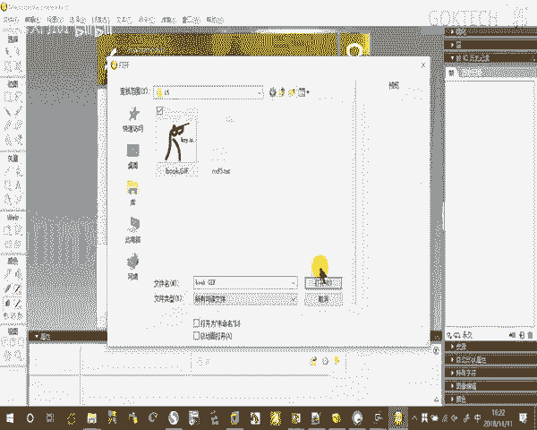

打开。啊，你比如说这个我们的图啊，我们这个东西啊其实涉及到很多东西啊。你比如说你你比如说他给你一张二维码。😡。

二维码你知道我们是怎么扫的吗？二维码这边有一个角，这边有一个角，这边还有一个角，你有兴趣去研究一下。或者等一下我们涉及到这个呃二维码的时候，我再给大家说一下，就它通过这三个点位来进行定位。

如果你这中间缺了一块都不行。那如果说你真的缺了一块，你比如说这块被一个一个图啊挡住了，你怎么办呢？你必须用工具把它抠，必须用这种画图工具把这个什么抠下来。然后呢啊这边粘贴好，这样你就可以让它定位啊。

但是一般情况下呢，你会发现呢你。😡，要做CTF，你发现你什么东西都会了啊，那我们先不管它，我们看这个图怎么看了，图一般有分为成和真的概念。😊。

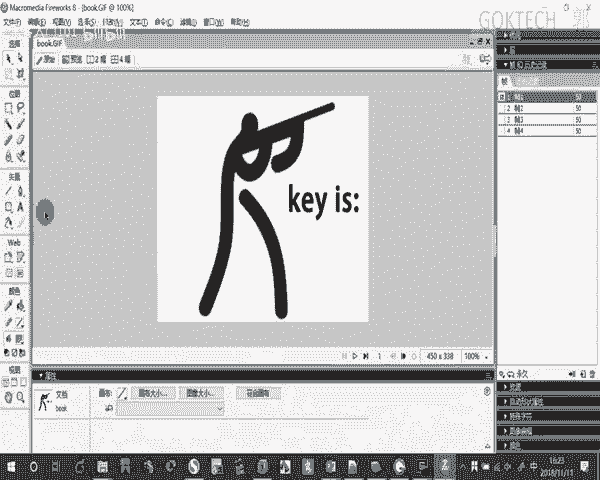

我们只看这两个，其他我们不看了。层是什么。相当来说我这个层图层啊，我用简单的语句就是什么？图层的意思就是什么？一层盖一层什么意思呢？你比如说我原来是一个真真的东西嘛，针迹嘛，然后呢。

我用什么故意把它做旧，然后就是用另外一层那个把它藏起来嘛，那外面也是一一张图，但是这张图可能是假的啊，就类似这种，你什么意思啊？你比如说我什么图层这你看到啊，比如说这个地方啊。

其实我只有一个层什么意思呢？我打开啊，它这个地方分为一个网页层和GI网网页层肯定是没有了。你比如说我把这个层隐隐藏掉啊，我把这个层去掉啊，把它个去掉，它底下就显示的这个底层嘛，底层是没有任何信信息的。

有一些图片呢在这个地方就刚好有信flag的信息啊，刚好唉。😡。

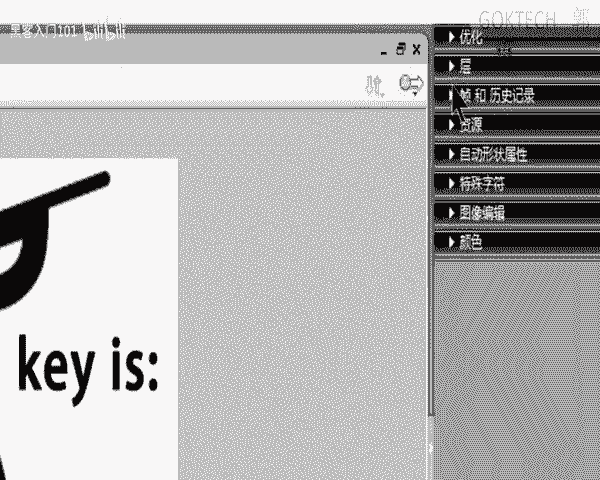

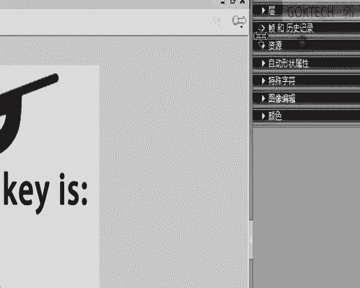

刚好就有flag的信息藏在这边，那OK那就非常好了。那如果说没有的话呢，没办法，我们只能把它还原，尝试的去看一下这个针啊，这个针呢分为了4个针，一个针，两个针、三个针、四个针。明白啊？而且你看到这里啊。

看到这里好像好像可以认为这个是一个base的一个啊，对吧？😊，啊， ok。那我们就不多说了，这个这个的话用这个的话，一般情况下你可以对你就可以对图片进行进行查看啊。呃，不一定是firework了啊。

反正反正只要有那个就可以了啊，只要可以了。只不过它针对这个firework可能有比较好用的地方啊。来再来看一下一叉5，这个地方挺有意思的啊，我们来看一下啊。😊。

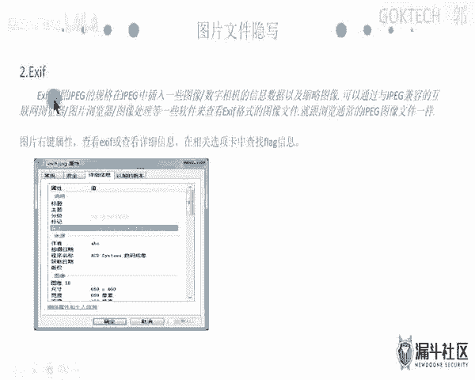

这是一张我拍了教室三的啊，我们学校教室的啊，就是我我们拍的这张教室的啊。

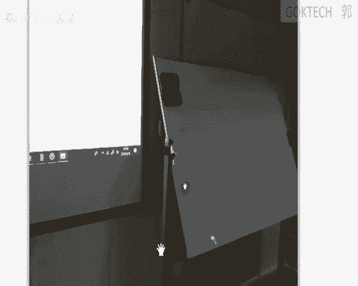

不是。Okay。好。

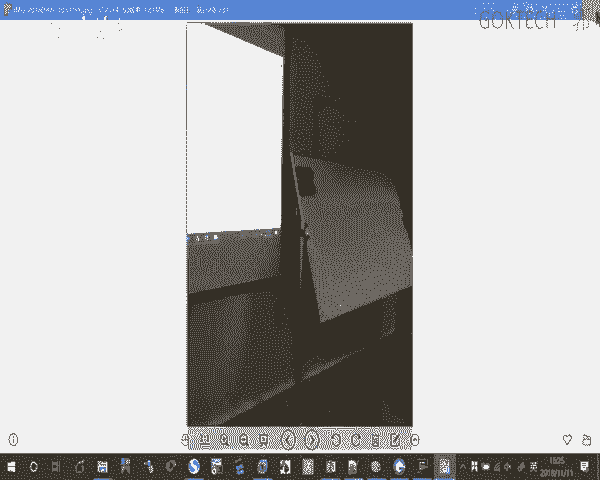

右键打开属性。这个地方有一个详细信息。好，往下拉。往下拉。往下拉往下拉。这什么？诶。这什么？GPS吧。好O。现在我使用一个东西。谷歌地球。稍等。我们谷歌舅舅。

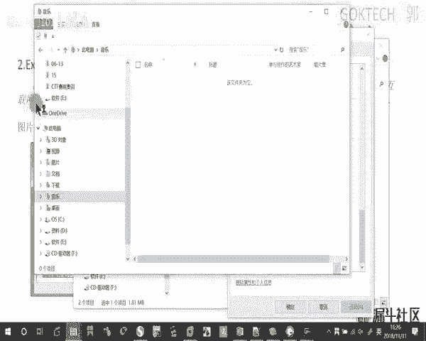

稍等啊。稍等。稍等稍等。

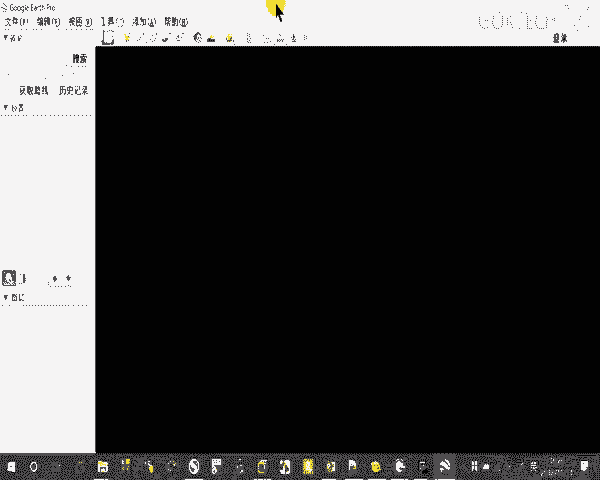

稍等稍等稍等。And。は。小事情啊。这么卡。这里啊可以添加了，在这边。😊，可以添加可以添加第几标，就我把刚才那个东西给它添加进去就可以了。我之前已经设置过了哈。😊，这个地方。双击运行就可以了。啊看着。

我们先看一下它这个属性啊，这个地方呢就是我经纬度啊，我们看一下是不是这个啊。😊。

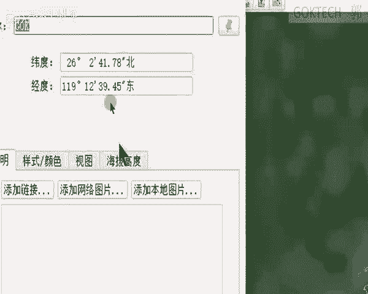

26度。2分。4级1。78对吧？啊，那我就给大家设计设计一下就好了啊。OK。

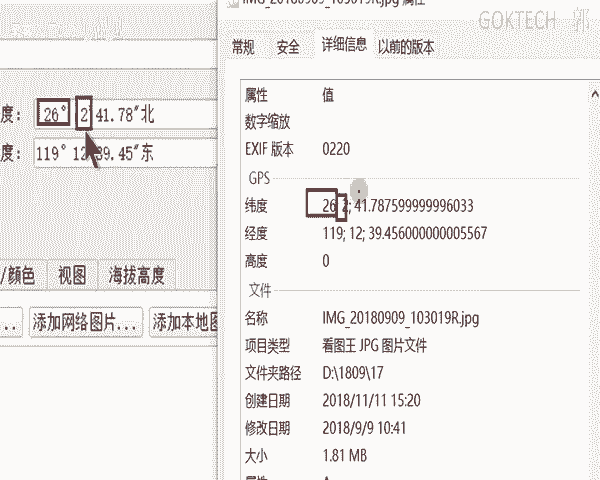

就在这个地方啊。来。罚你一下。翻一下，我看一下怎么转哈。你们是从哪里进来的，知道吗？😡，是不是从这个地方进来了？你们不是从这个地方进来了吗？😡，这不是我们的窗。😡，你是从这里进来的。😡，啊，也可以啊。

从这里也可以，对吧？这个就是我们的什么创业大厦偏差还是有的对吧？偏差还是有几十米还是有的。😡，几十米还是有的OK。这是肯定是几个月前的，不可能实时都谷歌才有吧啊，谷歌高管才有吧，我根本就没账号，好吧。

这肯定是几个月前的。😡，啊。十年前不太至愈不太至愈不太至愈。那不知道不会不会不会不会不至于不至于不至于。😡，你你你到时候拍一张杜标地标回来给我看一下，我就知道了。这四大吧。应该不至于吧。来。

我们看一下啊，这个是高新区嘛，对吧？往前。😊，吃大了。西门在哪里呀？这是大排档是吗？啊，大排档在这吗是。😡，是吧。等一下我撞个方向。我再换个。这里吧是这里吗？😡，在哪？咋啊。是新的是新的吗？

也不知道是不是啊。放大点，这个没用。😡，我告诉你这个没用。这个没用，我告诉你。😡，这个都没什么用，这个是平面的。这都是平面的，我告诉你。这其实是平面了3D的什么时候有来给你看一下紫金城啊。😡，有しでし。

著名景点才会有。我给你看一下什么叫紫禁城啊。嗯。看到。嗯。怎么样？怎么样？还可以吧。还可以吧。还行吧。好吧，还行吧。😊，还行吧。😊，还可以穿墙哦，我告诉你。卡大了是吧嗯。😊，开始卡哎呀，还卡不进去是吧？

😊，我。可以吧，还行啊。唉，毛爷爷在哪，我找一找。啊，我往往前走一点往往前走一点。😊，哎哎哎当来打来了当来了，姿势不对，姿势不对，有吧是吧，张扬一下张扬一下。😊，啊，好，这个就这样啊，这个也不用翻墙啊。

😊，就大概是这样子的啊，挺好玩的。我告诉你这好玩在哪了哈。😊，啊，不不不要晚上。哎，不我们退出来退出来。这个这个这这这这这这这这。呃。怎么退到我们的。那个退出平面模式。对对对。

退出来退出来退出来退出来退出来。退出来退出来退出来退出来。推出来啊退出来。ok。好，我们来看我们的地球。啊，也可以看什么星空。哎呀，还不让我看。啊。看我们的。地球对吧？OK看我们的星空。Come不。

看不到啊。唉，小事情啊，唉，放大了唉唉这么卡的吗？啊，没网速啊。😊，哎呦好吧，这里打了算。

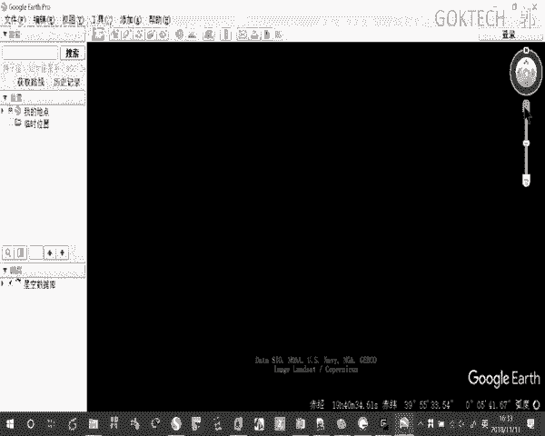

看什么星空是吧？我看火星啊。嗯。看月球啊。さち。Yeah。Yeah。哎呀。哎呀。吓死了吓死了。玩过了玩过头啦过。

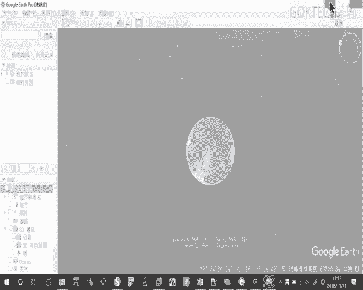

不闹了不浪了哈，我往下。😊，有时候啊这个A叉I5我我再强调一遍，H叉I5不一定不只是GGPS它还存放了哪一些内容了？😊，你比如说我换一张图片啊，换一张女神。啊，换张啊，我们不放大。直可远观啊。

详细进击看到没有？😡，对他有时候就会放在这边的啊，藏到你们一叉F里面都有可能啊那你也可以用，这个是用。windows的可视化了，还可以用linux用这条命令。😡。

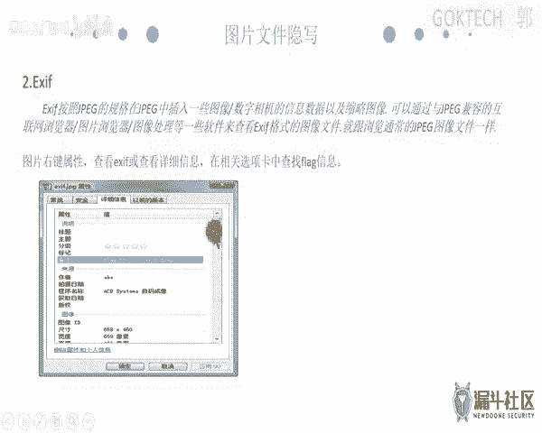

但是我告诉你这个这个E叉 if two啊，E叉 if two啊这个地方要。😊，这地方啊反正我们也是这样用的啊，看着啊17是吧？17啊。这个先关掉。17是吧，CD点点CD17。对吧。😡，呃，什么来着？

我要干嘛来着？一叉一出啊啊，就比如说这个这个这这这叫什么一叉一这个JPG的这个。😊，信息很多啊信息很多，他要把这个18F的信息全部列出来。就比如说这其中一个信息啊，都有很多啊啊OK我们就不看了啊。啊。

我把这个谷歌的推出来吧。网坏了。上次我有看到那个星空还挺不错，可以放大，可以看各种星座。当然虽然我认不出来。系。小事情啊。看一下啊，谷歌在哪里啊？哎呀。

还不让我那个，那不管他了。就这样子卡的卡着会不会死掉？死了是吧？好。该。最好用的一个图片图像分析工具，这个一定要掌握掌握的。Stagtag soft。这个一定要掌握了。那个就不多说了，已经到了。

第二部分。图片。明し。第一个是什么呢？Firework。类型啊。啊，解啊firework类型就是我们打开之后上面有写字firework的字样的。当然它除了可以解，除了可以解firework这种呢。

还可以干嘛呢？啊，第一种就可以图层哈，图层可以什么可以把图层分解嘛，图层分解，看一下有没有一些隐藏的信息，还有什么真的一个分解，可以吧。😊，这两个啊都是比较好用的。好，OK接下来是一个什么E叉F，对吧？

😊，windows就是什么查看什么详细信息，对吧？你定会知道。😡，哎，对，E叉 if two2。okK第三个是什么最好用的最常用的，基本上你只要图片一起，基本上你就会涉及到这个tag。So。

这个是什么呢？啊，windows的一个功能啊哎。第一个通道分离。啊，可以进行通道分离。第二个可以干嘛呢啊，LSB解码。解解解密啊啊。嗯，分离啊LB的一个分离。第三个可以图像对对比。啊。

图像分离啊图像对比，这个是LDB负分离通向分离O。先看这几个啊来。18是吧。来想看女神还是男神？😡，男神是吧，谁说了？😡，你举例子。啊，女神是吧，嗯哼。CD点点啊CD18，我们进入18。来基地。哎呀。

不没有装中文包。我知道你想说的是。呃，我们看一下啊。就这样啊就这样啊。哎，就这张啊。首先我再强调一遍，拿到拿到一张图片你要怎么做？😡，能不能再他打拍？😡，能不能正常打开？好，看一下。😊。

分析一下有没有隐藏文件，冰哎背。B我。一点间距。有吗？这什么东西？好，好像看不懂是吧？来，我们来用这个图形画的比较方便。用note配件让佳加给它打开，看什么头尾。😡，啊，先看头尾，看不懂是不是？

头看不懂是吧？尾巴呢。尾巴能不能看得懂啊？看得懂是吧？怎么办？虎子。粘贴到我们的什么。浏览器中。现在有一个图片是吧，放到我们的。这个1809里面。哪一个十8是吧？OK女神是吧。保存。下载。哎。

怎么一模一样？😡，怎么一模一样？来眼睛好了，给我说一下他哪一些色素像素有问题。这图片除非是水哥，我们的水哥知道吗？最强大脑里面的水哥知道吗？😊，对。啊，对啊啊，那其实他是说他是说他靠想象力啊。

我我们对呀，他就看到一个人的嘴唇可以想象出他纯稳的。真的这个啥还是真的。OK那我们先来看这个PPT啊，它是PPT怎么说呢啊？😊，当两张JPG图片外观大小、像素都基本相同。什么叫基本啊？

就是说人正常人看不懂了，看看看不出区别的啊，这叫基本相同。可以考虑进行结合分析，就把两个图片进行对比，将两个图片的文件的像素RGB进行什么这个什么。😡，相同的像素点进行抑货。然后呢。😡。

抑惑是什么意思啊？😡，各位。相同为0不同为什么一吧，相加ADD这个什么？😡，相减是不？我问你。😡，抑货。😡，文件的顺序。兑换有没有关系？相加了。😡，相加文件对兑换有问题有关系吗？😡，那相减呢？😡。

减速和减速和被减数肯定是有差别的吧。好，再来一个相橙呢。😡，相除了相除也有关系吧，还有货是吧？还有雨哈AND啊，这些都有都是它的功能。那它是怎么做的？来注意听。首先第一步我随便打开一个文件啊。

我用工具啊，这个工具呢在我们的这个图片引写术里面第一个非常好用的一个图像分析工具，它是用java写的。所以说你要装java包。😊，你们装好不要随便更新了。上次才被才吃了亏。open打开。😊，诶。

这个地方。有时候我有时候用这个有点问题，因为因为因为这个触摸板跟我这个手写板会有一些冲突啊，甚至跟我这个有冲突啊。我现在都分不清哪个冲突。女神啊，把第一个打开。啊。对，然后呢点击分析，我给它念一下啊。

嗯呢。analyze是吧啊analyze这边有一个图像的一个compare啊compare的一个对比啊。😊，肯定是跟第二个对比对呀，来打开。看下啊这是什么装法。😡，抑惑吧，再往右再往右。或灾与。

相加相加相减相减相乘相乘。对吧。有没有有效的信息啊？好像没有又回到抑惑了吧。对又回回到疑货了吧，说明它的顺序是不是反了。那我们换一下，先把第一先拿第一张，第先拿它下载的这张作为第一张。

然后再拿什么第一张作为对比是吧？😊，诶。你你下次下次把我的。微信二维码放上来，让家加我一波。傻省钱嘛，来微信拿起来扫一下。😡，微姓啥呀？好了，我要看了，毛都没有啊，为什么？😡，我们来看一下。

扫不出来的扫不出来的。😊，你们点开你那个身份证的那个啊不错了，你们那个微信那个身份的那个二维码，你仔细看一下，你点开看一下。😡，你点开你们的二维码。对。等一下我打开这个桌面二维码扫描神器啊。找不到啊。

你们对比一下，我说了V二维码的定位是这三个了。😡，你看一下你们的跟这个上面有什么区别。😡，中间是黑的吧，那这个呢。😡，反而是反反的了，那肯定是有问题的，对不对？😡，对，所以说我要怎么办呢？反射。

不用PS，我告诉你有一个工具非常好用，但是你们一直忽略它。😡，对。

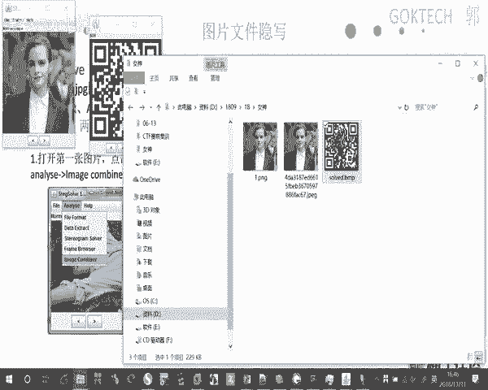

画图工具。好，选点先点选择先点一下选择。啊。全选。然后右键选择什么反射。这就是我们的T。这就是我们的气。这个还好男男神那个是最骚了。多烧是吧，给你们看一下。帅吗？看不出来看不出来是谁是吧，我也不知道。

😡，首先他已经好心的给你分出来了。第一第二好，得到的是一张彩彩色的。彩色的二维码。啊，凯子连位啊。你就要自己去研究了啊，这个题目我就不透露了啊嗯。😊，我就不套路了啊。😡，Okay。那这个不能关。

来我们往下来。😊，LSB替换凝写基本思想是用嵌度的秘密信息取代载体图像的最低比特位。原本的7个高位平面与替代这个什么么啊啊，好，你们懂就好了啊。😡，啊，看不懂也没关系。阿赖。最低有价位有4种方法来解哈。

那我们先来一个先来看最简单的几个啊。😊，LB引写书。它就是藏在我们的相位点的最低有限位那个地方。😡，那我怎么怎么把它进行个提取出来呢？那我们来看了哈，第一个就是用我们的图像工具。😊，什么图像工具啊。

图像分析工具。啊，就是这个tack step shop啊LSB的一个分离哈，看着啊这是应该是第19章。😊，220张20张，就这张图啊就这张图啊，来我们来进一下。这个还真的可以啊。PD20。可以啊啊。

哎看一下啊，这里有张图片啊，就是这个model点PNG是吧？看到了，我们怎么分级啊？哎，我唉，我进这个干嘛？😡，有毛病。不好意思啊不好意思，应该是用这个我在想我我干嘛？😊，OK22。80啊在打了。啊。

对吧？打开了挺大的啊。OK分析点击数据分离。data extract呃，data extract那算了，无所谓啊，来因为是最低有效位嘛，所以说我把最低有效位给它勾上来就可以了。😊，啊，这个不管。

这个是原图啊。😡，就我们这个图案。😡，就这张图啊。你看你往右往右往右都可以分析住它的一个功，分析它分析它的一个通道。你看到没有？这个就是它的三色合一的啊。OK网页往右往右往右，他会不断的分析啊。啊。

你们比如说什么我再网右一下，它有可能是什么变成了红色通道。啊，红色通道不是有76543210吗？啊，那它其中也是一个，那我们不管它，这个不是我们该管的，反正我们基本上我们就是RGB就可以了。

这个是复合的这个复合的，我们不管它。😡，啊，其他的呢你就默认就可以了。首先呢这里要选，为什么要选呢？😡，这你为什么要选呢？😡，你想你是藏在RGB里面了，你是先R后聚再B。还是说先拿后呃先拿再B。

再再拿一个G，就这种排列组合你要清楚来三个位排列组合是多少？三个位排列组合是多少？321吧。嗯。对吧嗯。6种排列组玩嘛，对吧？😡，okK你比如我点一个吧，然后呢进行preview预览。😊。

这些全部都是不可打印字符啊，左边是十六进制，右边是。😡，不可打印制图，往上翻一般是头尾嘛。😡，看得懂吗？😡，好，第二个再点。第三个再点这题呢我做了很久啊。来，我们看一下最后一个啊，答案是最后一个。

我直接告诉大家。flag在这儿看懂了吧？不莱个不莱个，我移动一下。flla看到没有？这几个就是flag，那你怎么发复制出来？不好意思，他复制的时候，它有16进制，也有这个20克码子。

你要去不你要去把它弄掉okK。😊，这个还真的没办法啊，左打也可以啊。😡，其子也。再再强调一下flag这个大里面东西是没有空格的啊。😡，你要把它去掉啊。好，图像分析工具懂了吧？好，是不是有一个客就点了？

😊，去尝试它的排列组合啊。😡，O。😊，你比如说你你把这个勾上。😡，好像也没什么变化啊，好像也没什么变化，我们去预览一下看一下。我是没这么试过啊。😡，一般RGB都点上两年，它反而不行了，反而不行了。

这个好像是原图的意思啊啊，我们就正常的RGB就可以了啊。RGB最低有效维就可以了，我们也不去不去管它啊。或者说我把它点掉。你以为通过这种方式。去试一下。啊，我没我是没怎么玩过啊。

你看F就基本上没什么数据啊，没什么数据啊。哎，我怎么把它把它关掉干嘛？😡，算了，无所谓啊。第一种方法就是图像分析工具吧，是吧？那刚才我已经演示的，我这里再强调一下啊，像红绿蓝了RGB啊。

它正常情况下是用二进制来表示的哈，你看8个二进制。😡，啊，你比如说什么它有多多多少个像素点，你看这里的最低有效位组合在一起，你看011011001100001，对吧？组合起来就是什么1个16进制数。

组合起来就是什么隐藏的一个什么阿克玛值大写的AOK大写的A哈，大小写的A是多少？啊，小写一呢啊不一呢。😊，啊，阿拉伯数字一呢？啊，自己研究一下。啊，自己研下自己研究一下好，使用这个工具。😊，啊。

这个工具可以分离。好，再来。

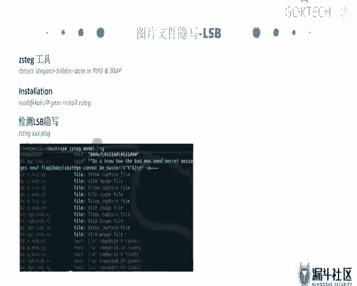

使用这个GSTEG，记住了这个一定要一定要先下载安装，先这条命令敲下去，不然它默认是没有了。因为这个工具是一些小小工小众的，别人写的小众的工具，没有集成在卡里里面，那你自己要下载，下载完之后呢。

再去用这条命令。😡，Okay。这是第几页呢？2222。来看着啊。哎。那个。22是吧。起底点点。22。哎，GSTEG哎。这个什么？女神这个啊给他干嘛了？分。有吗？这是一种结果，这是两种结果。

三种结果、四种结果，五种结果，六种结果是不是都有啊？😡，六种是不是都有啊，给定慢慢显示在这边了，但是有时候啊也不太正确啊啊，那因为它我们前面前面还有信息啊，像比如说我们刚才还有信息，前面是赌云能。

什么什不鬼的啊啊，所以说有时候呢这个只能作为一个这个是比较比较方便的，就是一一目了然。如果说你这样一一解下来一一目了然，那okK啊是吧？信CPF这个啊。😊，唉，有些同学在问，唉。

老师这个怎么跟刚才那个不一样啊，那是因为我们要。😊，CD点CD什么20是吧，这地方才有一个什么model的这个嘛，我GSTE据。😡，毛豆。是不是可以分析出来啊，好像还真的有董龙啊啊。

那我是我是我说错了啊，来，是不是发在这对吧？一种结果，两种结果，三种结果，四种结果、五种结果，六种结果，好像好几种哈，好像还有好几种哎，都懵了啊，都懵了啊，有些他没办法没有有效数数值可以显示出来啊。

有没有有效数据可以显示出来。那这个我们不管它啊。😊，ok。GST依据特点需要先下载，对吧？比较简单啊，再来一个看这个啊。这个呢是最低可以解最低有效位的，这个是什么呢？winindows的。

那个图形图形操作的，这个是来图形操作，看到啊啊，这个我不看了。这个东西呢有点问题啊，这个工具有点小问题。这个是几页22页吗？这个工具有点小问题啊，我看一下。就这个。就这啦。这个工具有些小问题啊。

这个小问题是怎么的？来看着啊，我先打开这个工具啊，叫web的这个哈。诶。这个啊这个工具有什么问题呢？就是你进去就退不出来了。😡，啊。没关系啊。先继续吧啊，你要加密还是解密啊？😡，解密吧。啊，这。解什么？

它这个有个特殊点啊，就是专门对付什么BMP的。只要是你这个文件是BMP的，你可以考虑一下使用这个工具再来可以解什么？😡，PDF了，那我现在解什么呢？解这个22的对吧？文档。此电脑。22是吧。

22还是20。啊，好像不是这个。20是吧。嗯。😊，嗯。😊，啊，文件类型是吧？啊，这个已经提示的很清楚了啊。😊，啊，不是这样子转啊，傻瓜怎么转啊，怎么哪转成BMP啊，右键用什么？😡，用画图工具干嘛打开。

然后选择什么啦？哎，这你们都懂啊。另存为啊。选择这个什么。20的是吧。选择使用什么保存灯BMP对啊？😡，保存一下。哎。不是保存到20里面。翻过来。这时候呢哎是不是有了？啊。打开。下一步。

如果说这里需要有一些输入，这里要如果说这个地方是一个加密的，你需要输输入密码，那密码肯定是从其他地方得到了。那我们不管它，我们没有密码啊，输入到某个地方来。😡，输出来这个地方来。保存一下。下一步。S。

解出来了啊，费律师。去。这个。😊，打开。看到没有？看到没有？看到吗？就在头头头尾嘛，你比如说。你比你反而用这个反而看看不到啊，我们看一下能不能用这个010的看一下啊。啊，010也可以啊。

所以说那个东西还有点问题啊。你看你看这个。有点搞笑，这个地方你啊它反而显示的错了，就显示不全吧。如果你用010010的，反而是显示的ok啊啊，所以说还是推荐你使用010啊。

但是一般情况下我是建议你用note pad加加先打开，不要用16进制的，你用这个头尾先看一下。😊，头我先看一下啊。都可以啊。Ok。这怎么关是吧？任路管理器打开。😡，选中。d丽他啊。好吧。这个我试过。

我还以为是那个那个那个中文的中文录径的问题啊。我弄出来也没用啊。可能有点问题啊，是不是要先运行这个也不太对呀啊，不管他了不管他了啊。好，我们接着往下看啊。还有一种啊这个是对就是对这。这里看有个地方。啊。

将以下脚本放在卡地中运行，将目标文件放在脚本同同步录像，将脚本的文件改成文件名啊运行拍摄。这个是一个脚本啊，我需要写脚本啊，因为我本人也不是非常会写脚本啊啊。😡，一般情况下都是抽的。😡，因我老实说啊。

那我独立写写个嗯哪个不太行啊。来来，我们再编辑一下，他说是什么，他要的是什么？我们去编辑这个编例嘛，对吧？😡，来这里的话有一个脚本啊，就是说输入的时候，你就把这个文件名给它输进来。

这个文本你可以回去研究一下，这没关系，就整个地方这地方拍下手里输入你你要解的那个图片的名称，就这样就可以了。😡，啊，就这样就可以了啊，O怎么运行啊，风机啊啊，肯定不是啊，CMB你们打开了，在这地啊。

这个这个地场这边CMP这就可以了。😊，啊，我是这样，那你像我这种装的，这个这我这不限你啊是一个啊，包括己注册到构件这边也可以这个加1GNEMU啊，你们可以试一下好吧。😡，你还可以吧来。啊，然后呢一直来。

不会图啊，使用桌面扫描神器来用的啊是我用的啊。手机拿起来也少看有。是一个非常明确的作。啊，来浪。微信呢。是一个案例。这个这个这个是啊，这个第4T用的灯，我不知道为什么这个扫不出来啊。😡，啊。喂，哎我去。

这是不对啊，太小了是吧？等一下稍等一下。😡，Read。那你不至于吧。不都无所谓啊。这工里都可发小小小小事情。OK啊，那如果你是要这里你要使用windows蓝硬码要线的什片率，那就查查重扫可以。😡。

就如说走出这个这个通道，这个转出这个码，然后用我的。用这个图像图像分析工具给它点找打开啊，这个应该是这三的吧啊。PNG啊吧PNG对吧？给它打开。OK了，正常的图片了，这张图片很有名啊。😡。

这张图片非常有名啊。对对对对呃，然后这两个人是不认识的，这两个人是不认识的啊，当时他就老维马子在他抢吻别。😡，就左右瓦这有折右线。😡，昨天长先一直往右，他始终会回来的。啊，不断点点点点点点哎，点错了。

点点点点。有人吗？啊。就这样。那这个我们就先不讲了啊，这个东西呢是以偏距的东西啊，专门针对偏N距的这个东西就比较难了啊。那我们先讲到这里啊，就是说针对这个影解呢，我们有4种方法可以做做一下。

那后面的话呢，还下次课我们再教一下那个那个像针对这种我们如何让它正确选择啊，你比如说。😊，一个二维码打两。老板这样的。他是因为高度被较了砍掉了啊砍掉了。😡，O就类似这种，我们到时候再进行图片的修复。

O那我们今天课先到这里，之先带你们走啊，做实验啊。😊。

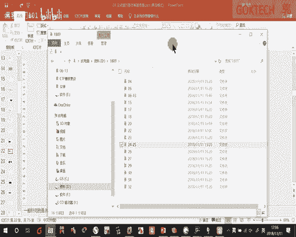