# B站最好的清华蓝莲花战队CTF夺旗赛教程 从小白入门到比赛实战 - P16：16.CTF赛前指导：文件上传漏洞&一句话木马（上） - 黑客入门101 - BV1ReW5eJEAX

讲这个文件上传漏洞啊，其实我只其中我主要讲这个一句话木马。那他这个的话呢，其实更多的时候是体现在那个。呃，我们这个一句话木通过文件上传漏洞上传一个一句话木马上去啊来。我们只要讲这个啊啊稍微提一下啊。

这个的话呢都都在我发了一个文档步骤都有写的很清楚啊，原理也有都有写哈。而且它那个有一个数据库的练习，也就是说说白了就是一个简单的一个了解入门嘛啊也不会写写的很深啊，那缺什么东西跟我说就是啊。

有有可能有一些工具没没有传上去啊。来那。😊。

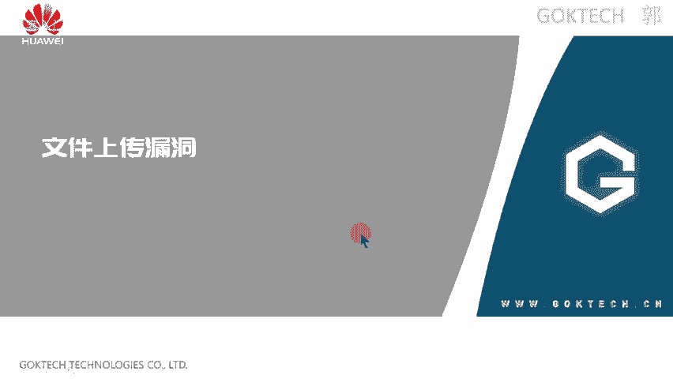

啊。来，这里呢所谓的上传功能就讲的是什么？因为我们很多网站是有上传功能的对吧？比如说什么呢？我QQ的头像能不能上传，比如说我网站的头头像能不能上传，对吧？比如说我这边啊很骚包的传了个自己的头像啊。

你们看不清算了啊。😊，好，啊，没看到是吧？没看到就对了啊。来，比如说这种头像呢可以上传，对吧？还有什么呢？之前呢你们可能会经常收到一些莫名其妙啊，就不算哈，就可能会收到一些莫名其妙的一个邮箱啊，邮箱啊。

比如说什么。😊，我我我我觉得我这边应该就有哈啊，算了，等会再开吧啊，等会再开吧啊。那个有一些东西呢可能就有了啊来。😊，呃。这个是文件上传功能，它可能就有一个附件。

就在邮箱邮邮件发过来邮件里面给你放一个附件啊，最早的时候是从哪个学校发出传出来的哈，就他的群群邮件啊，我不知道你们有没有没有收到过。就是他通过群群邮件的方式来广播，就直接只要你在群上面啊。

他群邮件所有人都可以收得到啊啊，然后你就发一些很奇怪的东西，然后带了一个邮箱带了一个附件啊，正一点就钓鱼了啊，被掉了啊来。😊，如果说网站啊上传的过程中，文件上传要是没有对文件的安全性做校验的话。

你比如说他本来头上传一个头像应该只能上传图片是吧？万键你没有做限制，那人家直接给你上传一个木马文件，你都不知道OK那我们这个的话呢，简单的来说一下，它就是说文件上传的时候，他就把把它上传嘛。

上传上去的时候，它不是直接马上存下来，而是生成一个临时文件。生成一个临值文件之后，他做一下用这个。用这个处理做一下那个什么做一下那个判断合规性嘛。就说这如果说这一点这边他会判断说哎这个文件是不是合规的。

比如说上传一个图片，它是不是真的是一个图片，这边会给你很判断的很清楚，判断成功了才能保存，不成功就是什么给你注色掉。但是如果你没有做限制的话，那么有可能就会被我乱传一些东西。

比如说比如说我这边说的大码和小码啊，大码和小码是什么意思啊？小码就是所谓的嘛一句话木马，它呢代码量通常在一行左右，不超过十0行如果说是大码的话，代言量代码量通常很大，而且它可以的嘛，功能越强嘛。

因为你代码量越越大的话啊，行数码行数越大越越多的话，它功能越完善啊越完善啊。😡，啊，大码我就不演示了啊，大码我就不演示，我主要演示这个一句话，木马小码啊，来这里的话呢，我有一个小码啊。😊。

是用PP很多东西都可。为什么我会创建一个副本？诶。什么鬼。这里用1个PHP写一个一句话，你要木马，就这样就一句话，中间这是这唉。中间这是他的密码。😡，就是它连接的密码啊，连接的密码OK。不保存啊。

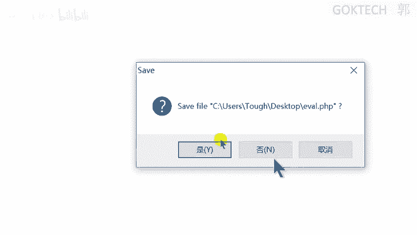

我刚才好像不小心改到了什么东西。就这个我反正呢我现在先演示到效果，我把它复制。😡，复制到粘贴到粘贴到了我们这啊，这个错了，这不是。请关掉。粘贴到我们这个这个work stationation里面啊。

粘贴到什么？它这个网站嘛，它这个网站不是有这跟跟路径吗？来其他选项网站跟跟跟跟跟跟目录。这底下呢我默认情况下，一开始访问的就是这个什么。😊。

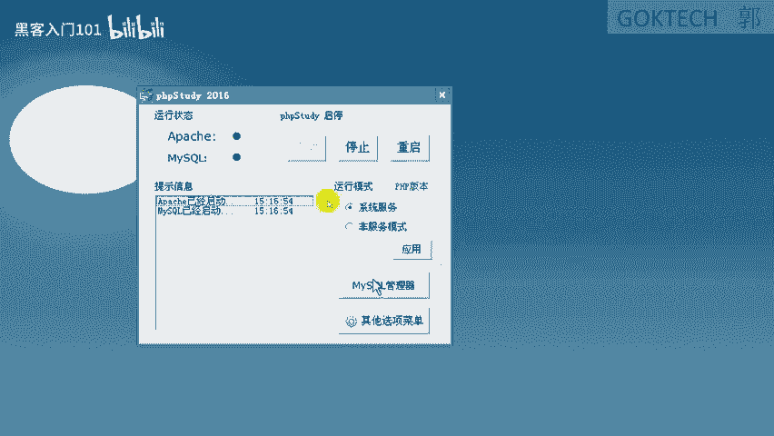

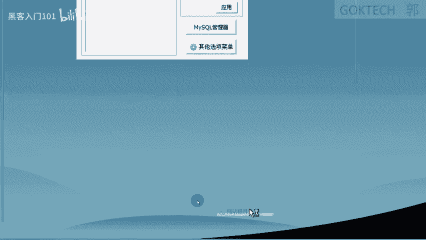

呃，有一个默认会访问一个网页哈，那没关系啊，我们不管它啊，我们这这样子哈，我们就把这个东西呢放到这儿了。我刚才已经粘贴过来了啊，内容呢就是我刚才这个么GOK。😊，就这个看不清的话，我可以放大一点。啊。

哎呀。牛牛牛啊啊大概说一下，就是说我这这个是刚才那个哈，然后呢，我通过其他方反正各种手段把它登到这边了，我先演示效果啊。😊。

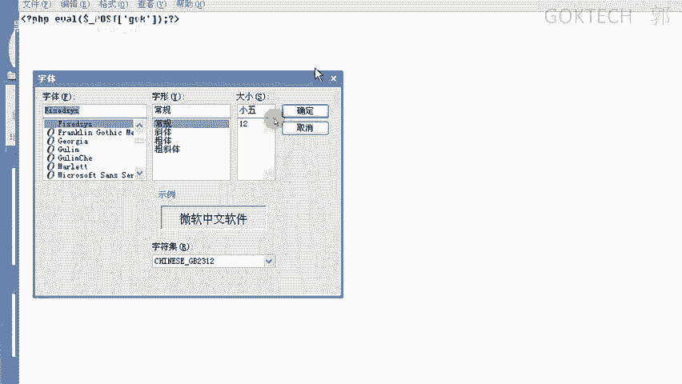

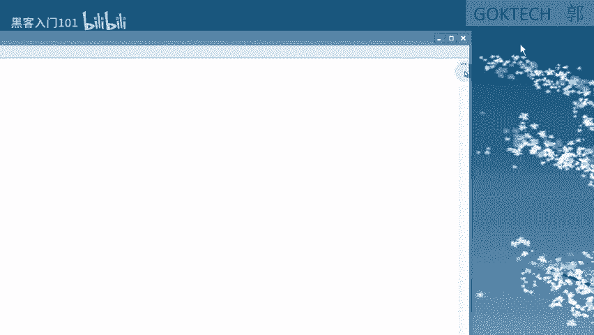

你要怎么做呢？首先呢这个网站访问肯定是没有任何问题的。😡。

10。0。3。143，这个文章肯定访问是没有任何问题的。OK你要牢牢记住，它是放在跟录径下面的，怎么了？啊，这个文件嘛叫什么evo。点PHP啊是这个路径。但是呢这个路径呢不是用我们的浏览器用的啊。

而是我们的一个什么C刀。啊，菜刀。啊，菜刀菜刀有两种哈。就是用用来那个做做那个攻击那个木马文件，一句话木马的一个连接哈。一句话木马之之所以叫一句话木马是因为它代码量很小啊，就这个东西啊，它有两两款啊。

一种叫吸刀域，一种叫一种叫菜刀嘛，一种叫中国菜刀啊。那一般情况下是我们是用这个吸刀把它解压，解压放到这儿。😊，啊，这个地方是一个什么就java写了一个脚本啊，来这里面呢就是我刚才连了，我先删掉哈。😊。

这个东西你刚刚开始登进去的时候，它是这种页面的。

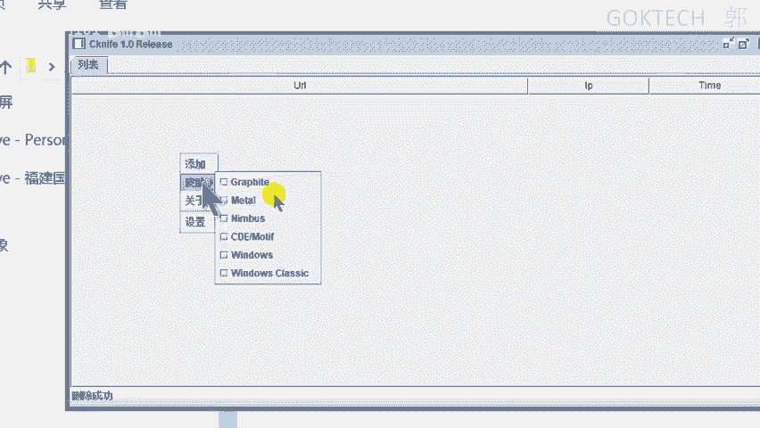

啊。等一下，就是黑乎乎的页面。那我建议你皮肤给它改到这里啊，白底黑字还是看的比较清楚，右键添加把这个网址给它粘贴进去。

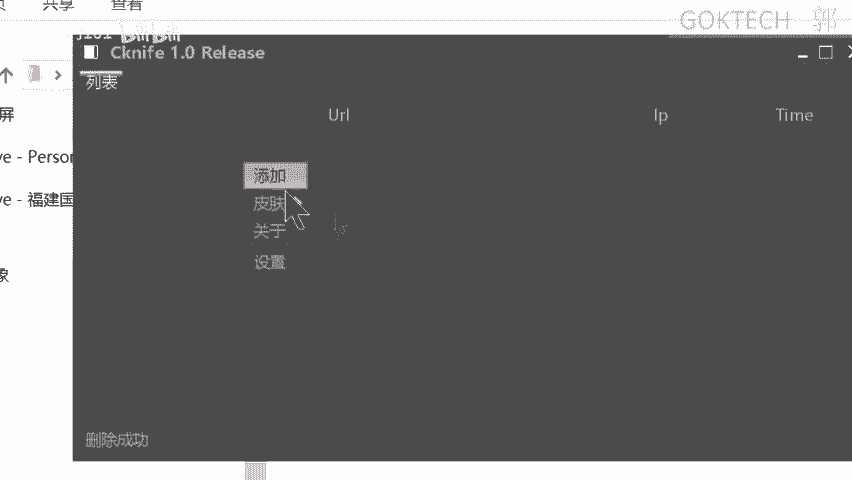

这是王子。然后密码就是GOK。ok。这个就是PHPHP的一个脚本类型啊，因为我就是用PHP写的啊，看不太看不是很清的话，我给他念一下就是了啊。OK这里有一个字符编码啊，这个字符编码一定要填，因为我们。

😡，中文的话一般情况下是GB2312或者GBK，我给大家念一下啊，这个是可以识别中文的。添加添加完了有这么一个东西，我可以干嘛呢？可以去对它进行文件管理。我可以看到它里面所有的东所有的东西。

就是我刚才上传上去的。对吧好，还可以干嘛？😊。

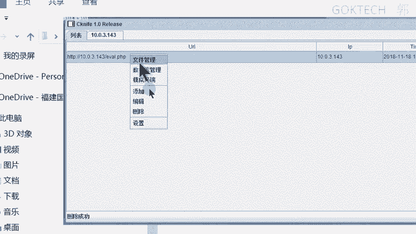

模拟终端，我可以在里边敲命令IP孔fi。啊，10。0。3。143就是这个这耐台虚拟机的IP我甚至可以用这个命令把它关机。

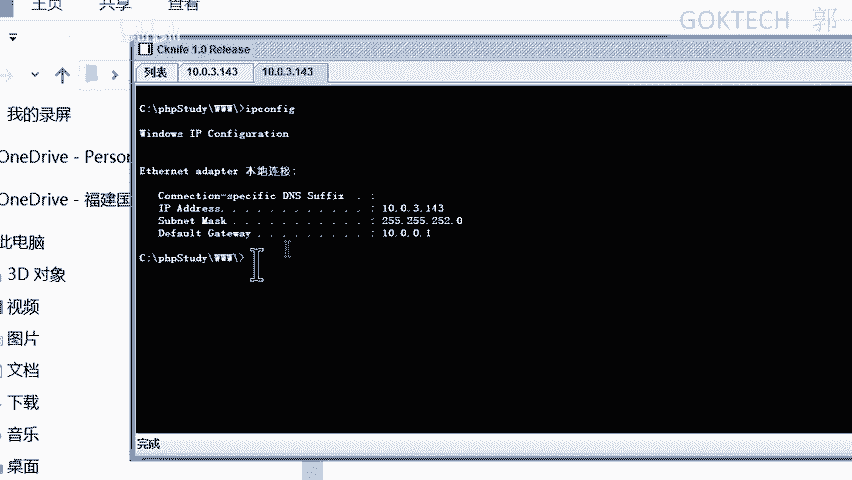

ok。还有一个。比如说什么呢？我这边可以对它进行数据库管理。如果他如果说它有数据库的话，有数据库，我可以把它就类似那个上一次的一个XQL XQL注入一样。我可以你么获取到它的一个数据库的所有内容啊。

O这里呢有一个东西啊，因为它是2003的系统。所以说呢我们可以怎么我们可以获取到它可以到它那个桌面。如果说它给你提示说桌面上有东西的话，有个doment的文件和设置啊文档和设置啊。这里有个admin。

就是一般就mintra，一般是它的用户，这底下有个桌面，桌面上刚好就有个什么文件flag的文件，我把它下载下来。放到我们的。吸到这个地方保存一下。OK下载完成。就刚好在这个flag里面。

flag的内容就是。啊。诶。他这个还做了一个转码哈，还做了一个转码，做了个转码的话呢，我我们还不能对它进行下载哈。那没关系，不下。但因为我下载下来变变变样了嘛，我可以双击运行它。其实这个就是它内容。

我把它放大一点啊。就这个。这个它内容，但是我下载下来之后，它做了一个转码，所以说我们可以直接在这边打开就可以了。啊，就没必要那个O。这是一句话木马的功能的实现。

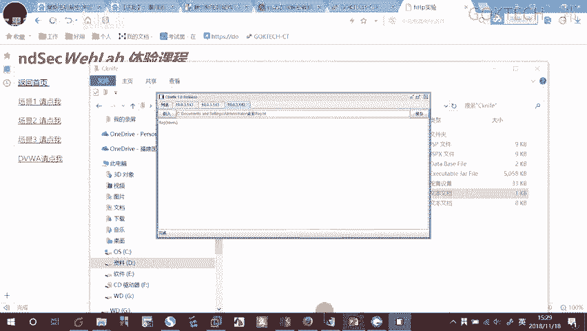

啊，大码的话更简单了啊，大码的话呢，你只要放上去就可以了。但是大码呢有个缺点，就是因为它代码量大嘛，所以说隐蔽性很弱，隐蔽性很弱。那你想码一句话，你还能干嘛，是吧？😊，当然功能确实很强大啊。

有时候你看到这种这种页面，你就应该知道它有可能被攻击了啊。

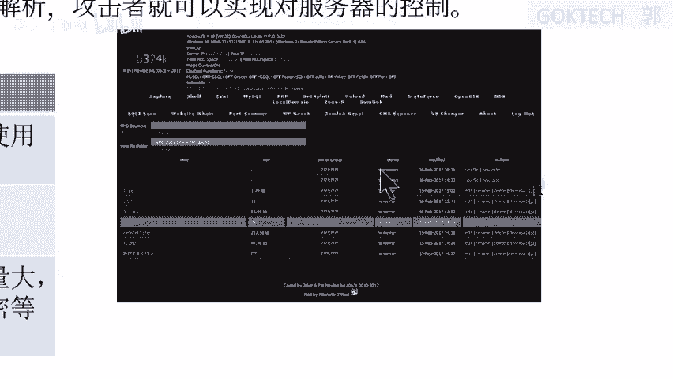

这个我就不多说了，用工具就可以连连接了。那接下来我讲一下这个文字上传漏洞。因为它有些东西呢是有文件上传漏洞的啊，就在我们我传给你们的虚拟机里面，今天传到虚拟机里面。这里呢有一个我们这个网页打开啊，稍等。

就这个啊就这个嘛，这里有一个什么DBWA嘛。😡，用户名和密码是admin。😡，password。

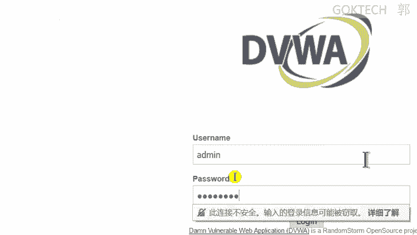

啊，这个抄下来就可以了，没有全部小写。好，这里有一个什么fire upload。😡，啊，这个有一个环境啊，他说那我可以干嘛？可以让我上传一个文件。那好啊，可以啊，我把你我把这个给他上传上去。

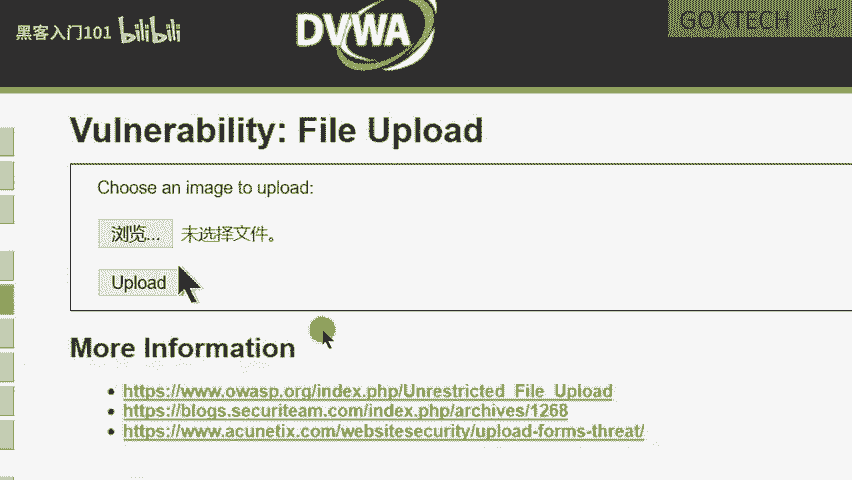

呃，运营一下吧，叫evvo一。我。

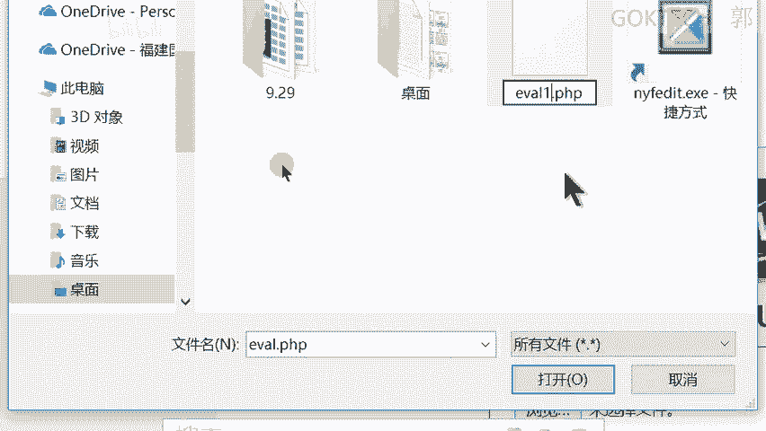

啊。把这个evvo一干嘛上传上去。

啊 hell。啊。这个呢。还记得我上次给你们上linux候，linux的时候，这个表示什么点点表示什么？😡，对，那点点杠叠点呢就回到上一集的上一集什么意思啊？来，我先把后面的复制啊。

他是上传了这个ee一啊。😡。

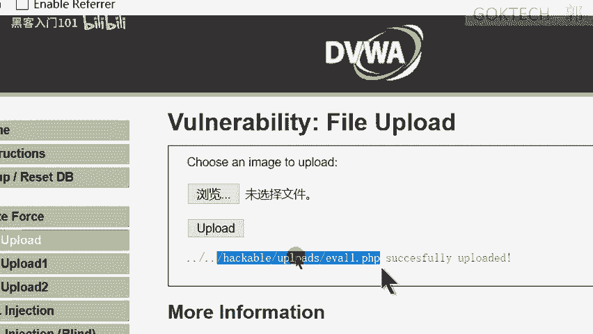

复制。我把这个东西呢。

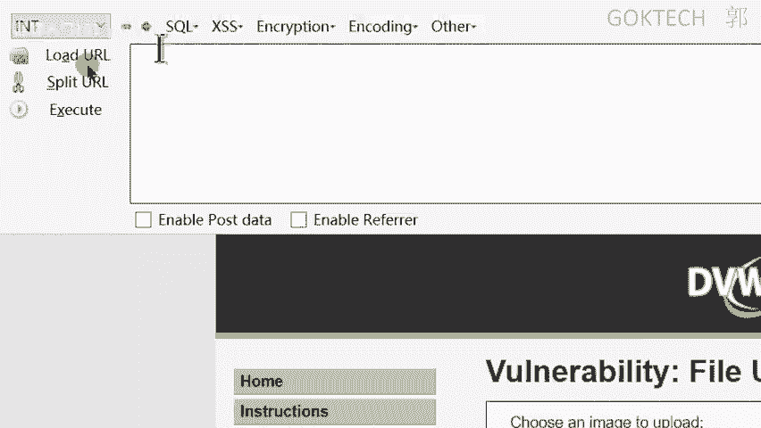

哎，对啊。他说，当前路径的。上一级的上一集没错。粘贴。啊，这个多了一个斜杠。诶。就这个路径啊。

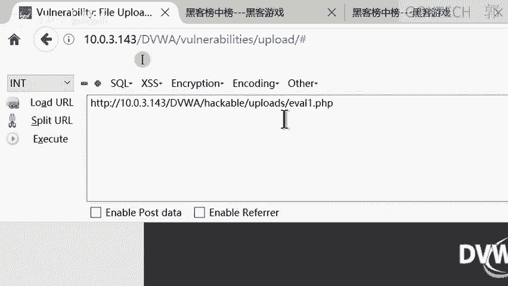

我现在呢干嘛呢？用我的。吸刀。

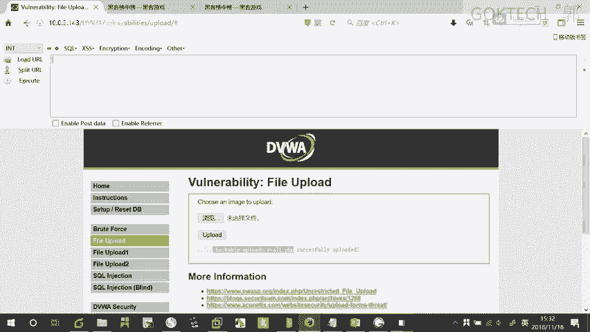

去年。添加。网址给他弄上去，密码一样的是GOK。当然根据你的需求需求，那个密码可以改的哈PHP脚本类型，什么GB的。😊，啊，添加。有了这个比较长的。双击运行就可以了。

你看它上传在这儿很多很多一样的可以运行。好，但是有这么容易呢，其实并没有。

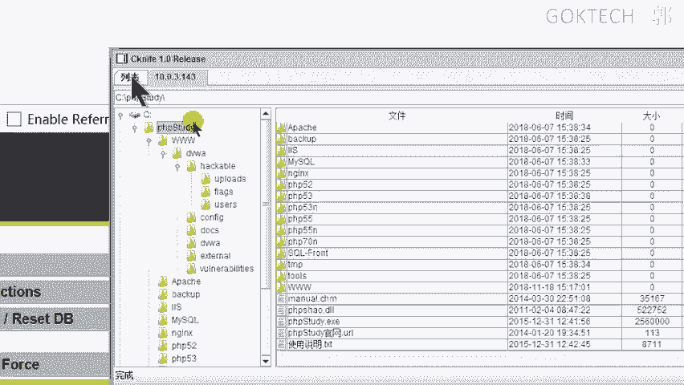

看着啊。😡。

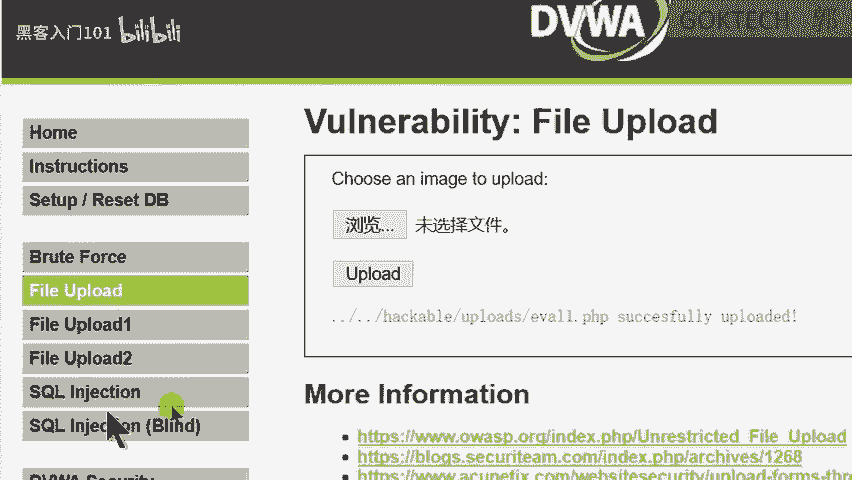

这里。😡，我这时候再上传一个啊。😡，到时候我给他。命名为2。

上传他说干嘛？请你什么？😡，这几种格式文件上传。就是他。只要有这个弹窗啊，只要有这个弹窗出现，就是前端代码，什么意思啊？就是当。😡，我们那个网页不是有后端和前端吗？它后端写完之后呢。

要以前端的东西来展现给我嘛，不然我看不懂嘛。O那这里前端它做了做了一个操作，就是你这个后缀名啊，必须是这种格式的。😡，前端还有一个特征。

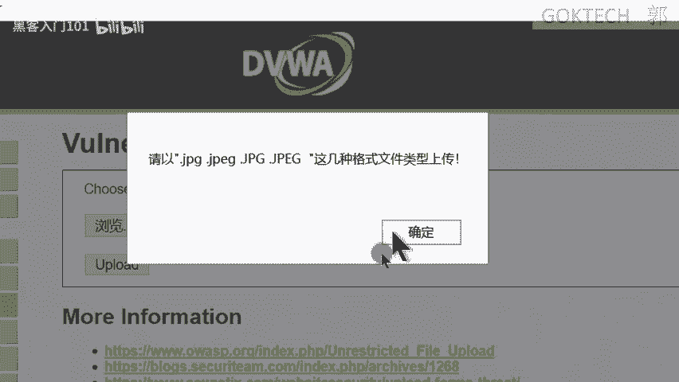

啊，我们忽略它哈忽略它啊，这个是照样可以上传了，但是上传上去有上传上去，这个确实可以用哈。但是这个不是我们的一个这个确实它一个bug啊啊，来它有一个特点，什么特点？😊。

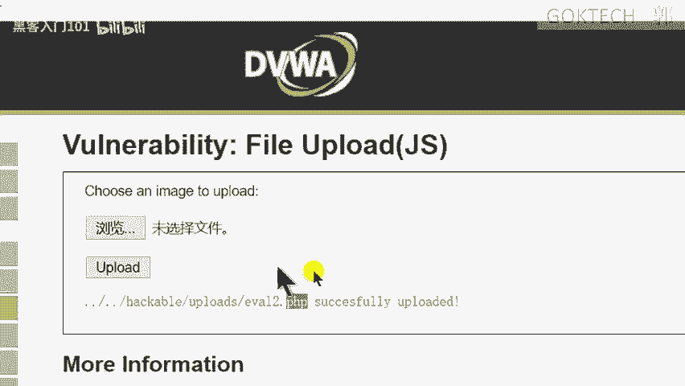

我们开启BUM。开起啊。拦截啊。然后这时候我上传一个文件。随便拿一个啊，比如这个。

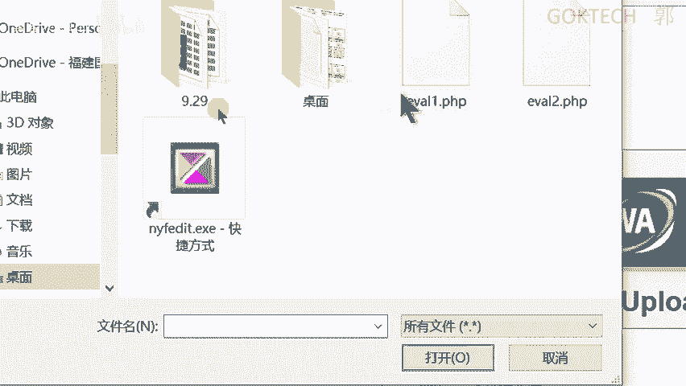

阿不。

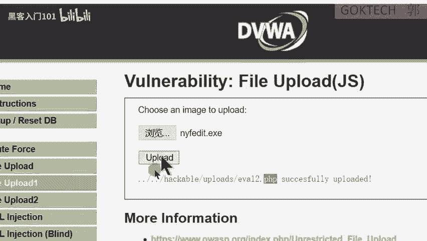

吓。这里只要是这里没有东西的。😡，这里没有东西被拦截下来了那一定是什么？一定是前端代码，前端的一个校验啊，前端的一个校验。这个我们不管它，我们看它有没有上传成功啊。😡，好像还行哈好像还可以。

我们看一下啊。

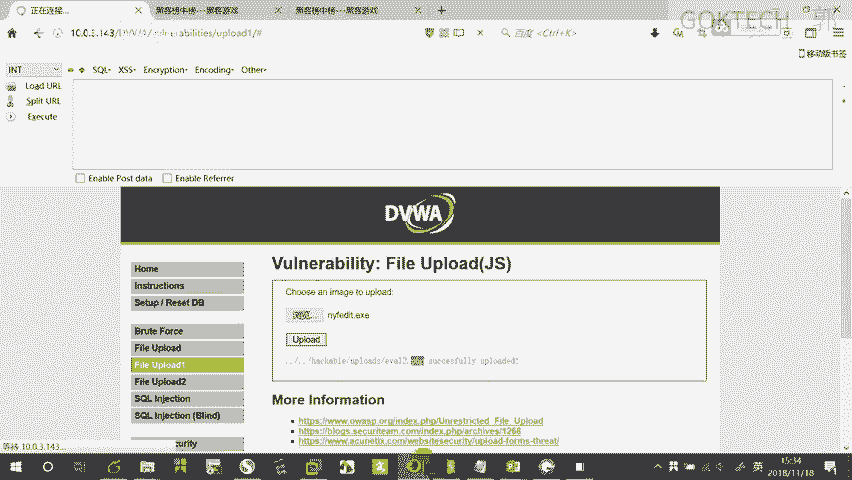

那个。DBWA是吧，里面有个哈克哈克堡有一个upload啊，好像还还能够被拦截哈，还能够被拦截哈。我的意思是什么呢？😊。

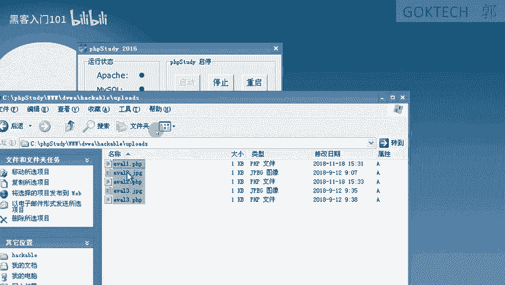

如果是前端代码的话。这边。上传的时候。

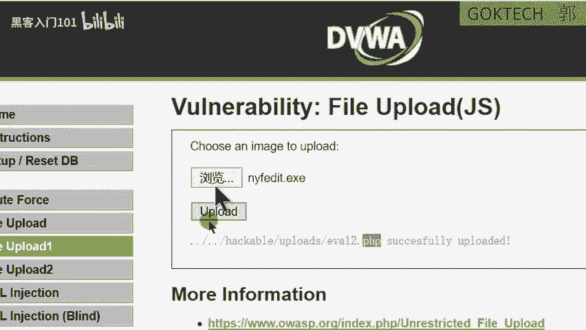

啊，我我把。