# B站最好的清华蓝莲花战队CTF夺旗赛教程 从小白入门到比赛实战 - P17：17.CTF赛前指导：文件上传漏洞&一句话木马（下） - 黑客入门101 - BV1ReW5eJEAX

我把这个给他给他弄一下。给它给它开开起来，唉，等它关掉，关掉之后呢，我们这时候。去呃上传一个啊，稍等。

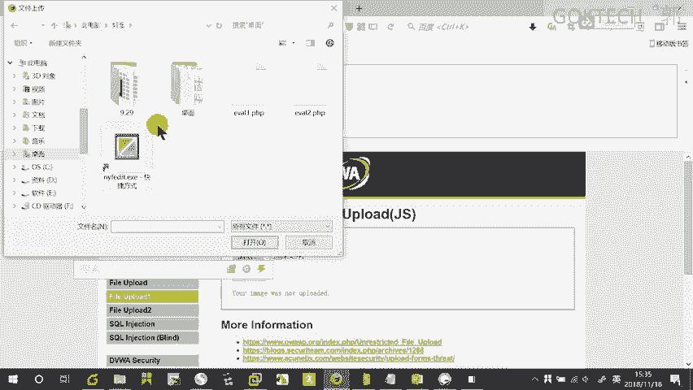

我这边up到的时候呢，他这边会给我弹出什么呢？就是说这种几中格式的一个文件类型啊，这种是一般情况下都是前端的，前端的校验呢非常好弄啊。

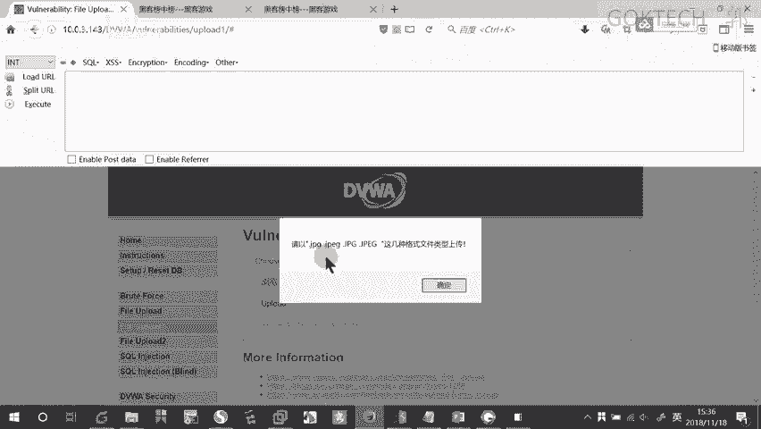

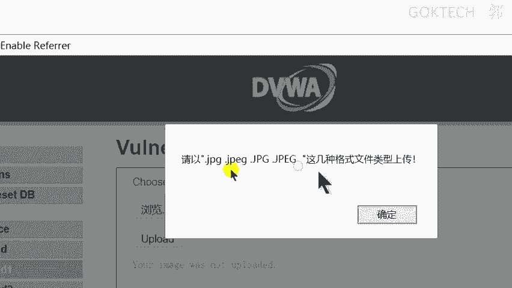

啊，not没有被上传啊，也是请了，我们怎么办呢？我们这样子啊，哎为什么要跑到这儿？

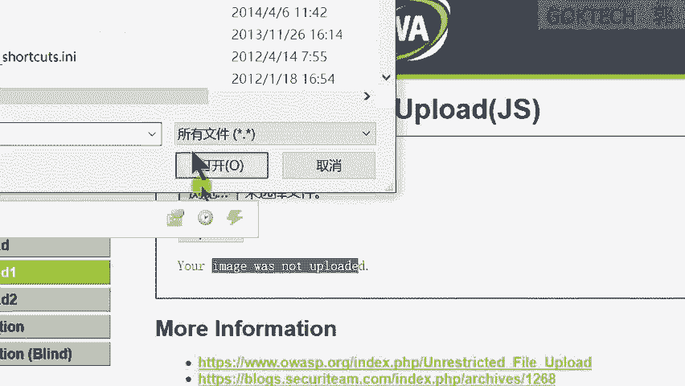

我们这样子啊。这个地方啊先给它改一下后缀。APP。啊。

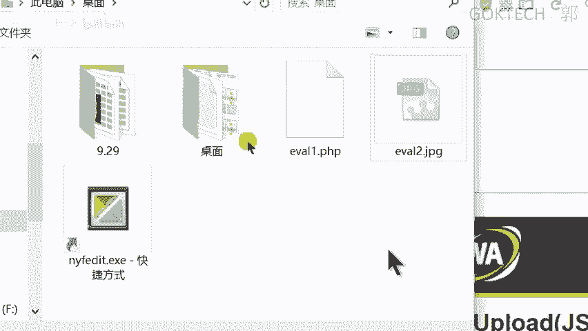

但是我在up load的时候。

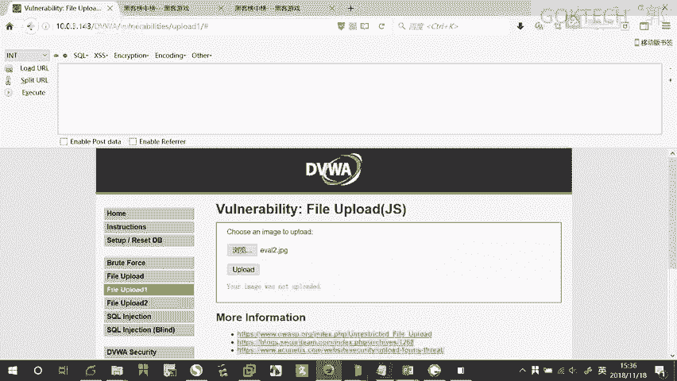

给他开启一下拦截。就这个地方我给他开一下拦截，可以吧。hel回头这边小尾这个弹窗了，弹窗之后呢，我们改它的名字在哪呢？啊，可是那。腾序。带回来。PP。啊。好，给它放行就可以。

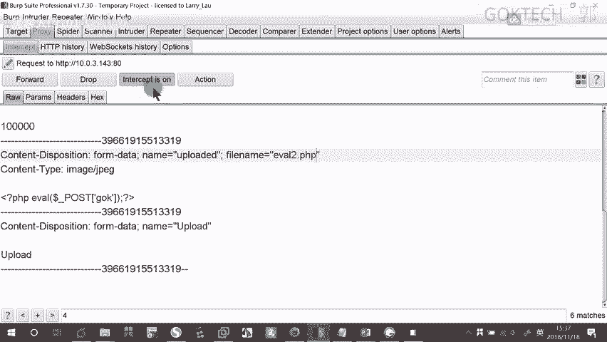

啊。13分钟。来，我们来这边哈。

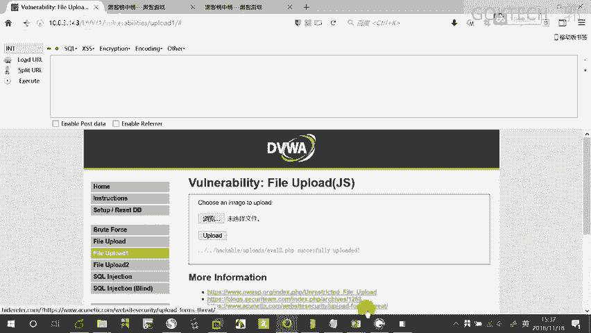

徐立局这边。有吧嗯啊。

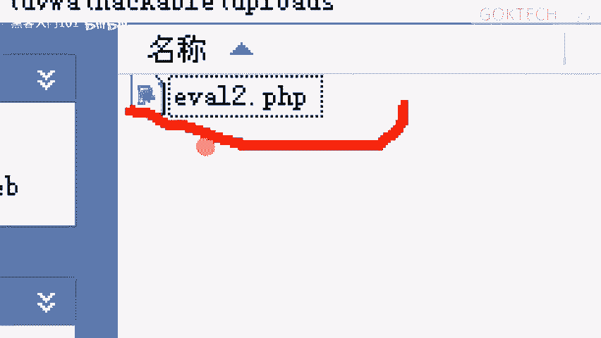

模糊到放大到模糊变形。来。这时候呢我在里连啊在去连。一样的。连接的时候呢。这时候就是。直接复制这个吧。编辑一下，我直接从这里编辑啊，没问题吧，它叫evo2嘛，对吧？😡，啊，对吧？ok。😊，OK行一波二。

双击还是可以运行。啊，OK这个是前端的，前端的只要改一下，改一下那后缀名，然后拦上传的时候拦截一下。因为什么呢？因为你想。😡，这个是前端的，既然是前端的，就是说他会浏览器会判断它是不是合规了，不合规。

他直接不发了。那你如果说合规的，我先让他合规嘛，我改成JBG嘛，然后在这边再给你拦截下来，拦截下来的时候就不关你的事啊，就不关你前端的事情了。然后拦接下来我把那个后缀名再改回来。

然后呢发到这个这些浏览器那个服务器这边啊，我照样可以可以可以连。但是如果说他让你传。😡。

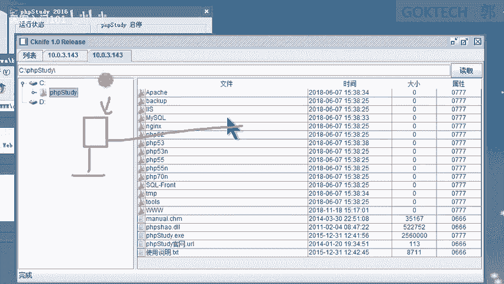

让你传啊，我在这。😡，传达志院。啊，结果他在这边做校验，你。搞啥不定搞察不定怎么办？这个时候涉及到一个什么呢？一个特殊的东西。这个东西我们必须来说一下，就在我们之前。

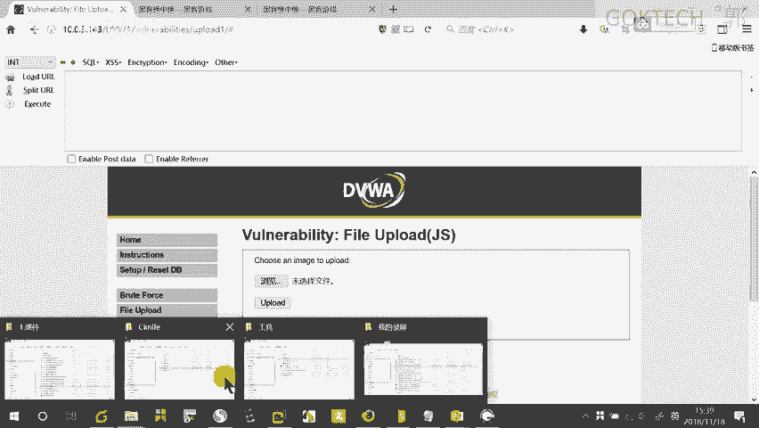

课见的时候啊。这课件是。

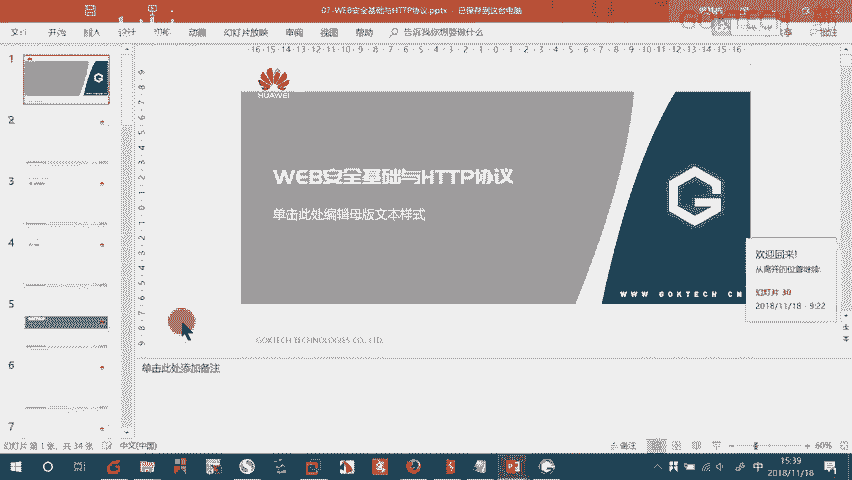

我们讲这个讲这个的时候哈，有一个说到一个。HCB请求报纹请求报纹吧，请求报纹这边有一个有个地方叫什么con type。😡，就文件内容对应的micbra信息嘛，这个东西呢是什么呢？是说的是什么？

我上传的那个文件，它对应的一个星，它是通过这个cont tap来判断你这个文件是什么类型了。那我可以对它进行更改，可以更改成哪哪几种呢？这里。比如说我是JP机人的。

那我可以把它改成什么I matchJPEG。啊，我把这个文件m卖的一个类型改成这个就可以了啊。来，稍等，我们来上传一个。在哪呢？Okayか。第第三个啊第三个这是123吗？OK第三个。

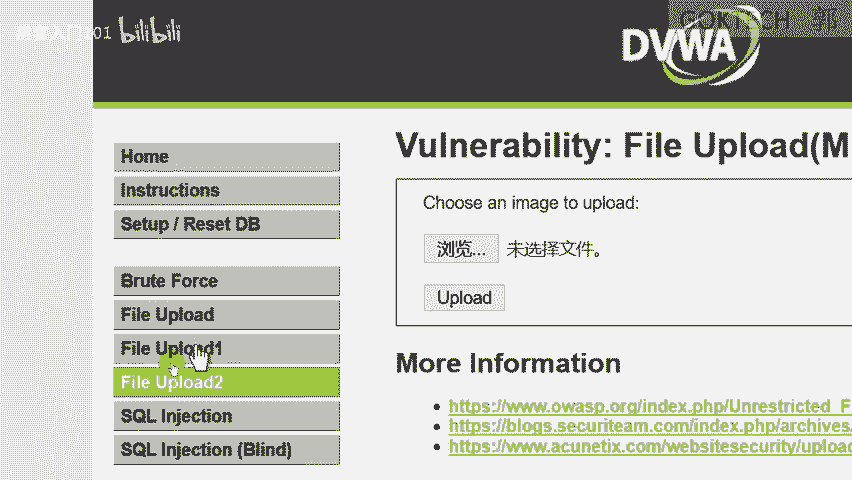

浏览。我复制一个。

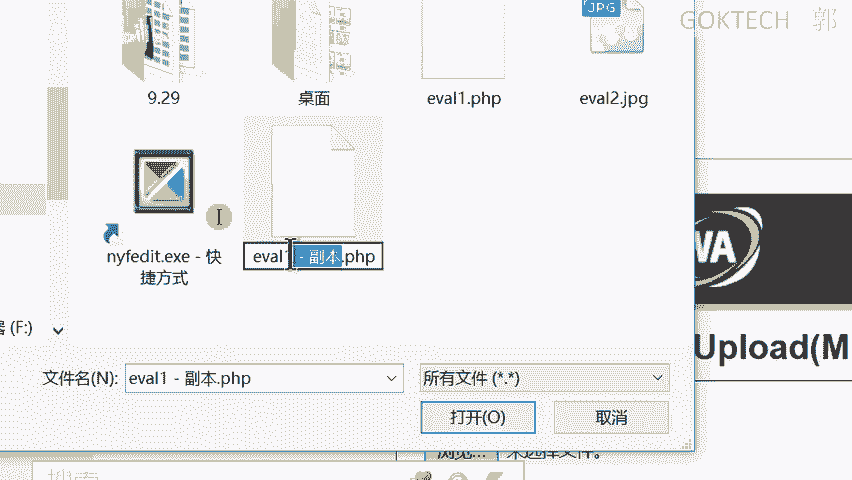

3人。

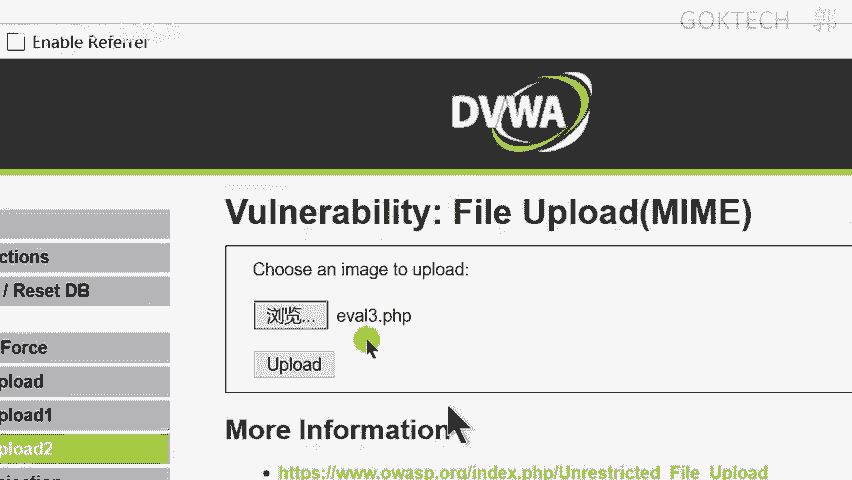

我上传的时候啊，你看它前端没有任何弹窗，但是会返回一个什么你的。😡，MH没有被上传，we can only accept JPEG notPNGMH。

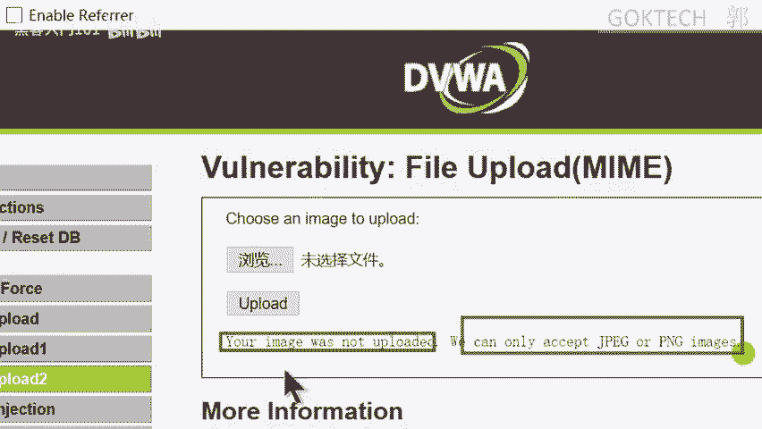

啊，所以说怎么样选择连上传的过程中给它开启什么拦截。

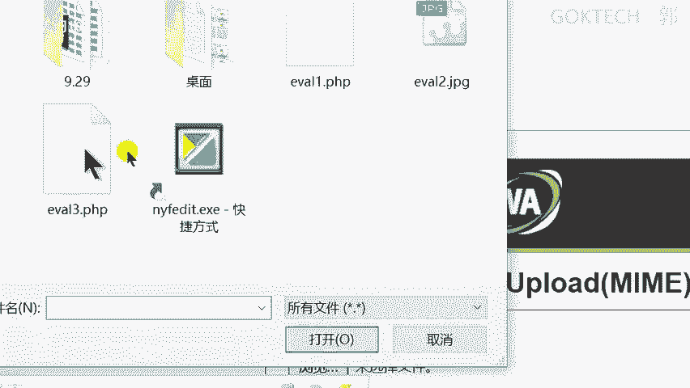

稍等，开启下拦截。拦截。然后阿。他这了。我上传了一个evo3嘛，对吧？底下这里呢就直接写着你的文件的一个类型，我的是什么？I math。TP。依据。I matchCP句O。好，行。我来放心拦截一下。

看一下行不行啊。

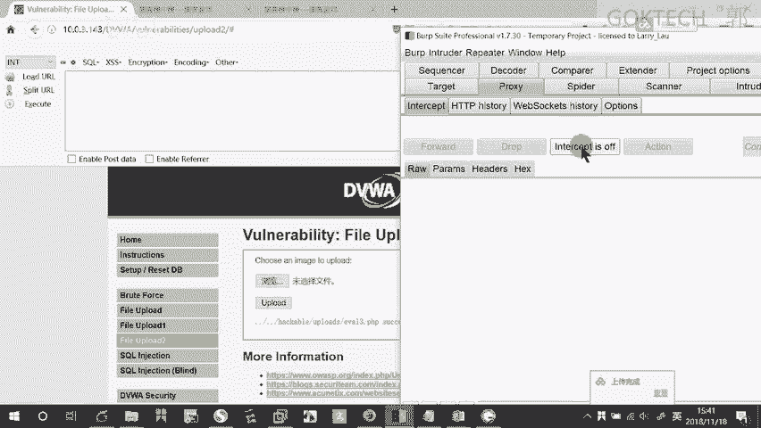

成功上传了吧。因为他校验的时候是校验它那个值嘛。那如果说前端和后端一起校验了，那你就要必须给它改成JPG了。

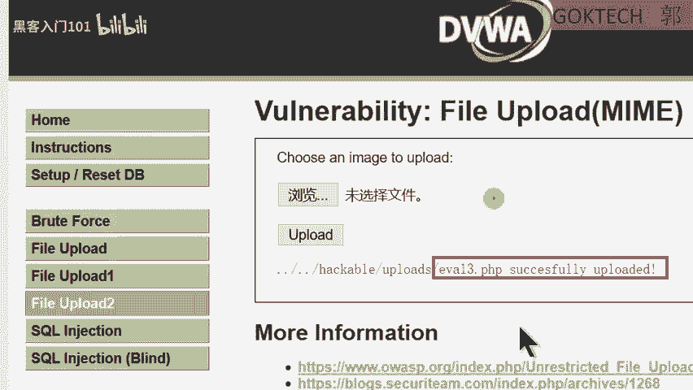

哎，这然不能用。前前端这个发出去之前给它改一个什么JPG的嘛，发完之后，我到这边这边拦截，给它改成PHP的。啊，然后发到这儿，然后同时呢要改它的conttain啊，不不不用con太保。反正你这边的话。

该改的两个都改一下，然后发到这边。啊，那就可以了。

这个是简单的一个文件上传的一个呃东西啊，内容还是比较简单啊，内容比较简单。

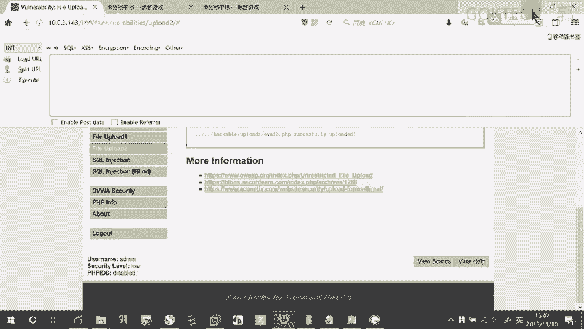

啊，大家可以先看一下啊，这个的话呢，这个文本可以发给大家啊这个一句话木马。

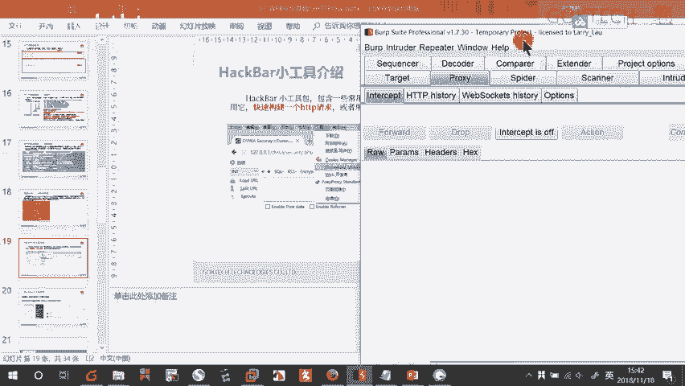

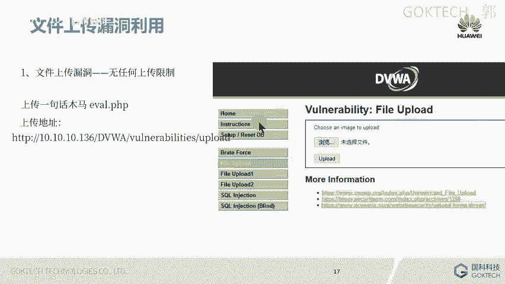

行大家可以做一下啊，在这里。在这个地方一样的是那个地置，一样的是10。0。3。143了。在哪呢？一样的是这个啊。点击那个。点击那个DVWA给我。行，那我就不多说了，大家自己做啊。啊，对了啊。

你们不你们我建议你们最好这样子稍等稍等，先别急，因为你们上传的时候都会上传到我这是吧？😡。

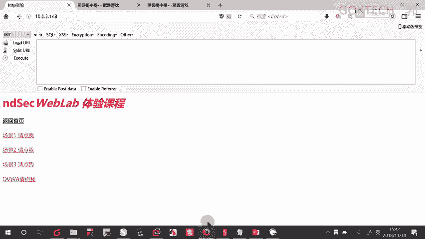

啊，如果说你们还没搭好的话，如果你们虚拟机已经弄好了，就自就在自己的虚拟机里面弄就可以了。如果说还没搭好的话，你你你你传是传到我这里嘛，所以说你建议你们命名的时候是什么呢？比如说文件是EVAL吗？

那你比如说什么呢自己的自己的一个填写，你比如说是自己的一个呃，比如说我叫郭立栋嘛，叫GJD，或者你干脆整个文件的名字就叫GJD。点什么了？PHP当然你是居加D1点PHPG加AD2点PHP类似这种啊。

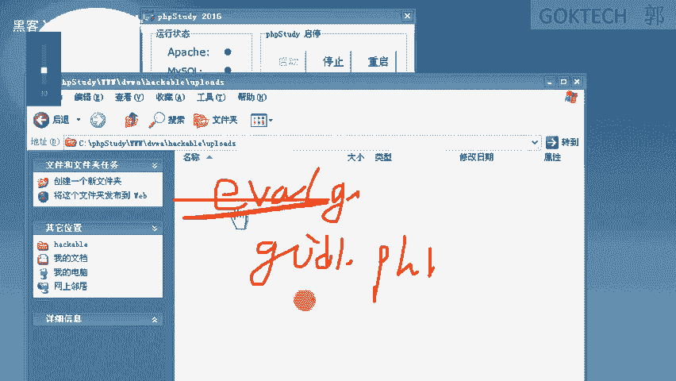

OK行吧，先坐一会儿啊，坐一会我们。来看一下那个说一下答疑哈。