# B站最好的清华蓝莲花战队CTF夺旗赛教程 从小白入门到比赛实战 - P1：1.CTF赛制介绍&工具介绍1 - 黑客入门101 - BV1ReW5eJEAX

呃，那我们就开始吧。呃，因为我们本次的一个课程，它是1个CDF培训的这样的一个课程。然后我刚刚在做自我介绍的时候，其实有提到说我们CDF的。我们CDF这种比赛，它涉及到的知识点。

它肯定是涉及到信息安全相关的一些知识点。那么这些知识点它其实都属于我们的信息安全方向的这个范畴之内。那么在这个范畴之内，整个信息安全。我们所说的信息安全，它其实是有非常多的方向的。

比如平常我们听到的说传统的，我们叫做传统的这种网络安全，它也是属于我们的信息安全的范畴。然后我们近几年提到的比较新的一个概念叫做云安全。那么它也是属于我们信息安全的方向，还有其他的，比如说外部安全啊。

或外围安全啊或者说公共安全等等之类的。那么就是说我们这信息安全，其实它的方向非常多。那么我们在学习的时候，CDF又是其中一个方向的话，那么大家在学习的时候，就应该有这样的一个知识架构，就是说不滚。

大家在学习什么知识的时候，应该都应该树立一个这种知识体系。那么学的都当学的东西学的非常多，非常杂的时候，你才能够慢慢的往一个知识框架里面去填补一些东西才会感觉到比较清晰。

其实大多数我们身为理科生应该大家平常老师对你们说的都是要理解要理解，不要去。死记硬背的是吧？那么所以说我们在学习这个相关的知识的话，也是要按照这样一个知识框架去学习。呃。

然后在第二页PPT的话打一个广告。就是第一个二维码的话是我们。国科的安全团队的一个漏斗社区叫做漏斗社区，它是一个微信公众号，然后上面会推送我们平常自己写写的一些这种信息安全相关的文章。

有的是关于信息安全工具的一些使用。有的它是关于CTF比赛的。比如说某一个比赛，它的一些答案，我们会自己写一份，然后发出来。然后第二个的话是我们漏斗社区。

我们的安全团队在福buff是一个比较出名的一个安全网站上写的一个中栏。然后这个中郎的话也会经常更新一些技术文章。然后这个中栏的话，现在应该有1万多个人关注我们吧。那大家如果。感兴趣的话可以登进去。

然后给我们点个关注。好吧，那这个就是打个广告。那接下来的话，我们就正式进入我们的一个培训的课程。我们刚刚说CDF比赛，它是属于我们信息安全的这个课，信息安全的这个方向当中的这种知识点。

那么我们首先要明白一个概念，什么是信息安全。有人有信息安全的这种概念吗？或者说是平常你以你自己脑海中以为的信息安全应该是什么样的？是不是那种黑客就是敲着键盘。

然后上面的代码花花绿绿的各种一直走的那我们可能大多数人看到信息安全想到的要么就是诈骗，比如说电信诈骗，要么就是类似于黑客的这种字眼。那么我们信息安全它有一个概念。

国际化的标准化组织ISO这个组织应该大家还是会比较熟悉的，我们吃的很多零食或者说你喝的水，上面它是不是会有一个SO通过的质量认证，对吧？它是一个国际化的这种标准组织，任何彬彬角角的一些标准。

它都参与了致电。比如说某一个螺丝钉，它的这种规格，甚至这个ISO的这个组织，他都有参与。那么信息安全，如果说概念说的官官方一点的话，那么它是为了保护数据的那这一段话其实。呃，念起来很枯燥。

那我们接下来看一两个这种关于信息安全的这种事件，可能大家会更加容易来理解什么是信息安全。2017年的时候，有一个叫做wana cr的一个病毒。呃，不知道大家有没有经历过，就是这个病毒的话。

如果中这个病毒，它的一个。就是显示就是说它的一个结果是你整个电脑的它的这种文件会被锁住，然后你需要支付比特币，然后才能够解锁你的文件。大家有遇到过吗？哦，没没遇到过，那挺好的。

因为那会儿因为17年的时候，我记得。17年其实就去年嘛，对吧？17年去年的时候，就是那会儿其实哇这个投影仪。有点倔强。那我们17年的时候，他爆发了一个病毒叫做one crime。这个病毒的话。

它是这样的，就是说如果你的一个计算机，你中了这个病毒的话，它会把你的所有的文档全部锁住。然后你需要支付大概是。呃，30个还是300个比特币吧，一个比特币现在的话以前是一两千块。

现在的话应该是1万多一个吧。然后他需要支付这种比特币，然后才能够解锁。那么那会儿的时候就有很多这种单位，甚至说是一些政企单位。因为我们知道可能一个小白的电脑，它的电脑被锁住，其实是毫无意义的。

可能他里面搞不好，他电脑里面的木码还更多，我黑客把它锁住了，其实毫无意义，对吧？那么当是对于说这种政企单位，甚至说是我们学校的这种单位，它电脑里面存储的文档其实是比较机密的，或者说是比较重要的。

那么这种时候受到的损失就非常大。那么关键的一个点就是关于这个勒索病毒。虽然说它提示是呃如果中热索病毒，它就是这里这样一个画面。

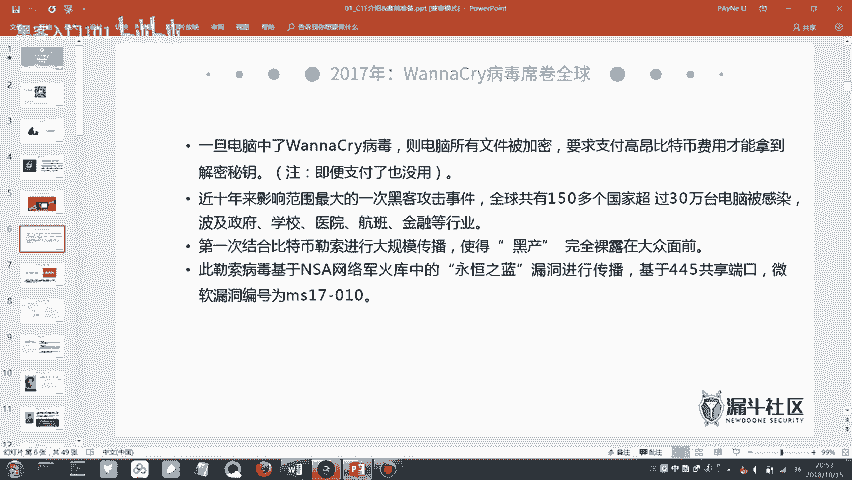

一模一样的，就是他这里会有一个时间。就是说他有一个限定的给你一个时间。你这个时间你如果不支付比特币，那么你过了这个时间之后，你哪怕支付了你的文档也不能够复原，不能够解锁。

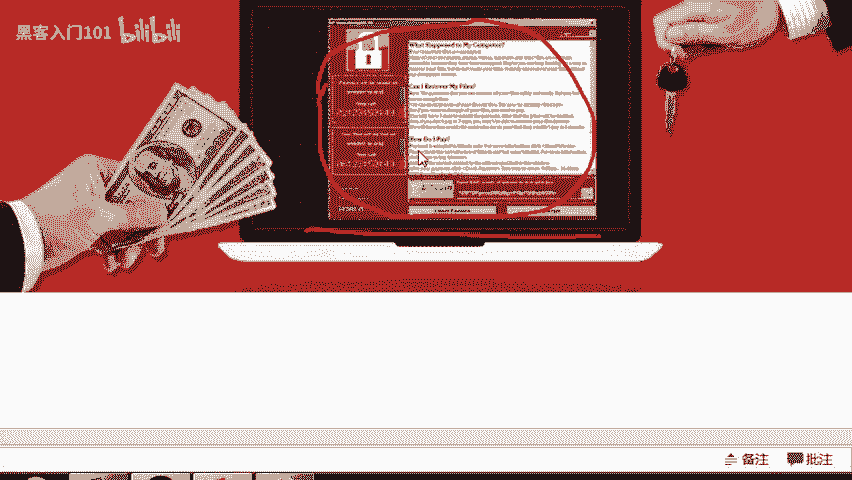

那么事实上是，哪怕你支付的比特币，其实你的文档也已经被删除了。这个是到后面，然后我们知道的。那么当时我记得就是有的学校还是有爆发这种病毒的。那么爆发这个病毒的话，对于大学生来说，最惨的是哪？最惨的是谁？

95。最长的是大四的，他的论文是吧，第一版第二版。再不通过就可能是终结版啊，终结版一呀，就是呃可能大家现在还没写过论文。但是如果有听说过写论文的同学，就应该都知道写论文从入门到放弃。

就是可能你一整个文件夹里面放了十几二十个版本的论文，各种改各种改，然后发现你中了一个病毒被锁了。然后居然还有30个比特币。然后这种时候可能心里面就是很难受的。那么这个病毒的话。

当然最主要它的这种危害是对政企单位的政企单位，我们知道他对这种资料的保密性要求它是非常高的那所以说这个病毒当时危害了一大片，我记得。诚意和吉大的好像当时也是有受影响的，只是说这种事情不是特别好说出来。

那么。第二个事件就是大家不知道大家知道这个网站吗？AC稀饭这个网站所谓的A站就是各种二次元的是吧？那么这个网站之前爆发过一个事件就是。这个网站它的整个网站的数据库被盗取了。大家学过数据库吗？

应该是没学过，看这个行应应该是没学过。那我简单的说一下，就一个数据库，它对于一个企业，或者说它对于一个网站它有多重要。可能一个企业它沉淀了45年或者说十来年的所有的数据它是全部放在数据库里面的。

那么这些数据如果被盗取了，那就意味着你的这些你这个网站上面所有的用户的资料全部被盗取了那这种后果，它其实非常严重的，严重在哪里。比如说很多人你们在用微信，你们微信跟QQ是不是同一个密码？

密码是不是相同的相同的对吧？甚至说你的网易邮箱也是相同的对吧？你的英雄联盟的密码好像也是相同的。那么这种时候他会发生一件什么事呢？黑客会做一件事情叫做壮酷。有听过吗？感觉很熟悉。

但是就是想不起来这个钻库到底是什么意思是吧？那么钻库它的一个意思就是说，如果我A站的数据库，我整个获取了，获取了之后，那么我会拿A站的这个用户名，用户信息，你绑定的手机号，各种我把它组合在一起。

然后我用这个密码轮番的去爆破你的微信，你的QQ各种这种网站有注册过账号的。因为大多数人比如说3分之2的人基本上他都是用同一个密码，就是为了方便好记嘛。就是万一说如果说不同的。

因为我们每天在用的PAPP实在太多了是吧？抖音啊、微信啊，QQ啊，各种各样的，还有王者荣耀是吧？很多这种应用。如果你每个应用都用不同的密码是不是会记不住。所以说很多人他都会用同一个密码。

那么用同一个密码就会导致钻库。所以说黑客他获取到一份数据的时候，他是先把它拿去钻库，把你每一个微信号、QQ号、游戏号里面的所有能够。榨取的这种我们所谓的价值游戏里面的装备。那微信里面可能是一些可以。

比如说骗骗亲朋好友啊，骗骗你的亲朋好友啊各种就是他都有很多这种方式去就是我们把它叫做什么并性，就是能够获取到一些利益。那么他把这一些账号全部做了账户之后，他可以把这个账号再卖出去，再卖出去。

然后拿去发那种，比如说那种垃圾邮件，你们可能经常会收得到。比如说什么同城多少点com啊，什么博彩啊之类的是吧？那像这种他就是用那种盗取过来的账号，然后他来发送的那这个就叫做账账户。然后当时的话。

你们如果有注册这个A站的账号，你们在2018年6月应该是13号吧，那天晚上我记得是12点多，那会儿还没睡。然后还在做材料，然后发了一条信息过来说你的账号可能就是。呃，他是A战的这种态度，还是很诚恳的。

他被脱裤了，他也就说我确实是被黑客攻击的。然后他告诉你说。你的这个信息可能是已经泄露了，然后希望你上去改一个密码。那么当时A站它大概是有800万条用户数据，然后在暗网里面卖是卖40万人民币。

就是说你只要出40万人民币，然后800万条数据全部给你。那么这里涉及到一个术语，叫做暗网。

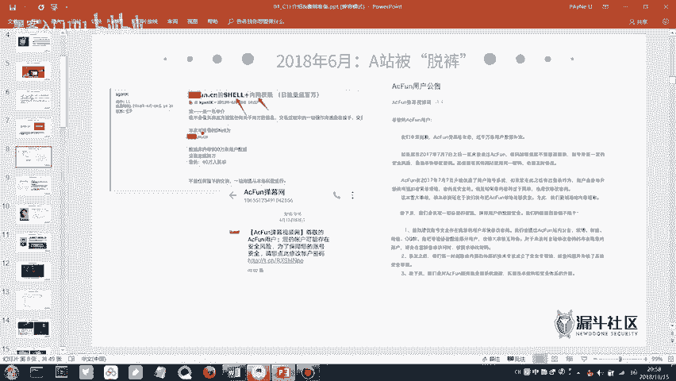

有听过吗？都进去过了是吧？呃，有一个网站叫做呃不是一个网站，是有一种网络，叫做暗网。那暗网可能有的人不是特别熟悉。那么在这个暗网当中，它可以发生很多的交易。比如说买比如说租赁就是租赁黑客啊。

或者说是你要雇佣杀手啊，比如说更不用说什么办假证啊，枪支啊，是吧？就是那些地线杆上写的一些暗网里面肯定这些都是最基础的，那么它还有各种各样的毒品啊，售卖之类的。然后比暗网还有更深层次的网络。

那么不同深层次的网络，他能够做的事情就不同。为什么暗网它具有一种特性，叫做。隐匿性。因为他用的是叫做一个洋葱路由，它的这个洋葱路由它是不可被跟踪的。比如说如果说你在网吧，比如说你去网吧很开心是吧？

去网吧上个网，然后在网网吧做了一些不可描述的事情。在网络上，比如说当一个喷子啊，或者说是你下载一些什么东西，对吧？那这种时候你觉得好像哎。好像公安局也拿没办法是吧？你觉得好像追踪不到你，但事实是。

所有比如说厦门厦门的所有的上网的流量，它全部是会流进公安局的。就是说5个运营商电信联通移动，还包括我们的广电，还有长宽。然后这些流量他全部会经过公安局，只要他想抓取到某一个流量，分分钟能够找到你。

所以说。有些时候很多话还是不要乱说是吧？特别是有亵渎。比如说国歌啊，或者说国家的这种微营的，就是不要论发表这种言论。最近很多新闻是吧？很多主播啊大家应该有看到那种新闻。那么对于暗网。

如果说有的同学不太理解，对于暗网，我们应该我们应该怎么来理解呢？我可以找一张图片。

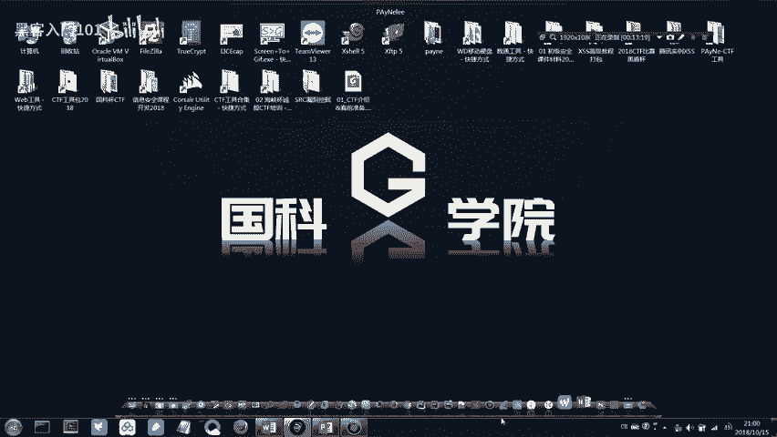

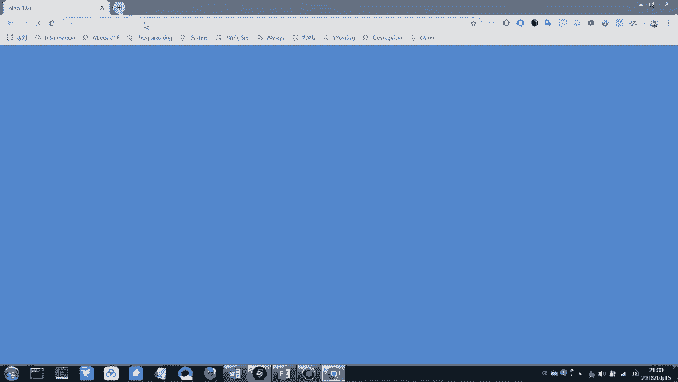

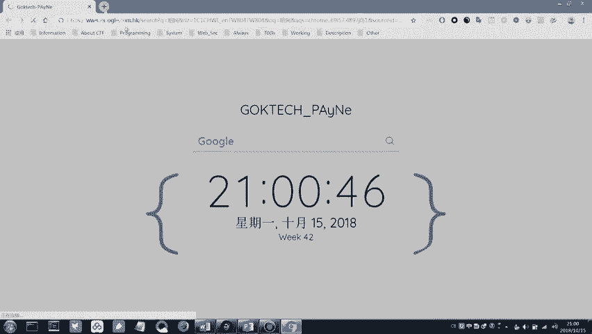

好像VPM没开。稍等一下。

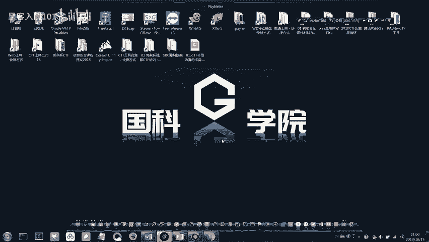

VP没台放不了。

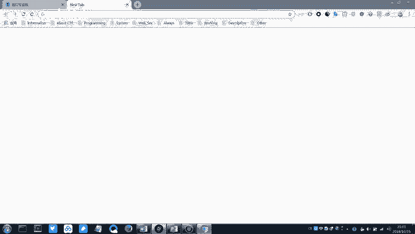

呃，比如说按摩，它这里有很多的这种有很多这种图片，我们给他看一张图片，他这个还是可以说是表述的比较清楚的。呃。画质有点渣，但是应该还。明强看得清楚吧。大概说一下，我们平常所上的网，我们叫做英特网，对吧？

Internet。我们平常所说的网，我们都把它叫做英特网。比如说我们你再用百度，你再用百度百度一个关键词，比如说搜索一些视频，或者说你再用百度搜索一个网站，然后看一些相关的视频。那像这种行为。

其实它搜索到的东西全部是我们所谓的叫做表层网络上的东西。所有搜索引擎能够搜索到的东西，它都是在表层网络上面的。那么在深网当中。它又会存在着其他的一些网站。那这个网络当中，我们就把它叫做深网。

那再比这个深一点的，我们把它叫做暗网。那就是说我们你觉得网络这个世界好像非常大，但是平其实我们平常所使用到的网络其实只有10%。如果说这整个网络它是分百的话，那么我们的表层网络它可能只有10%左右。

很多的东西它都存在于暗网。但是暗网的话，大家了解一下就可以了，不要太抱有太大的兴趣去研究。因为里面有些东西确实。不管是从视觉上还是从感官上看，都不是特别舒服。那么这个就是一个暗网。

所以说经常会有人在暗网的，比如说中文论坛里面，他会售卖这种数据。你平常觉得哎这种数据好像没什么用啊，但是在暗网里面，这种数据都是打包卖的。

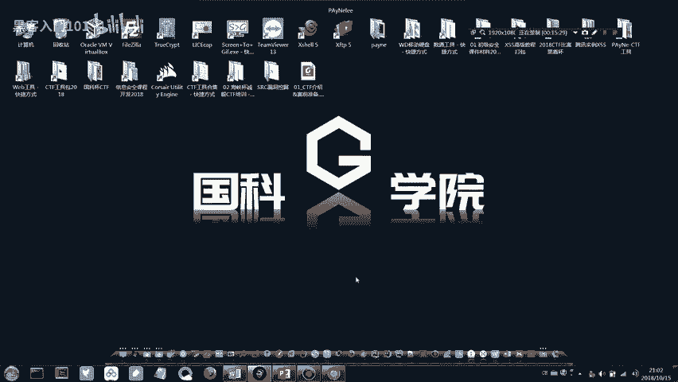

比如说前段时间华住华柱集团知道吗？就是华住酒店专门做酒店的。它下面有很多酒店的品牌，比如说。呃，比如说对的，比如说还有什么橘子酒橘子酒店啊等等，很多连锁品牌都是他的。那么这个整个这个集团。

然后后来他发生了一件事，就是他整个的这种数据库也被拖出来了。然后在那个暗网里面是卖。8个比特币8个比特币。然后现在后来的话，因为就是相问有相关的警方介入了，所以说后来那个买卖好像是没有特别成功。

然后所以说你觉得好像我们平常我们在每天洗完澡，然后在床上躺着刷一会抖音，然后看一会儿视频，好像相安无事的是吧？也也挺舒服的。但是其实在这种暗网的深层里面，它是发生很多这种事情的。只是说我们不知道。

甚至有时候可能你的信息都被买卖了好几手了。那么这个就是暗网它的一个这种作用。然后暗网我们平常的正常的网络基本上一个域名都是以deele。比如说点击域名可能是点com这种来结尾的对吧？

那么如果说是在暗网里面的网站，它是以。呃，好像是这样好像是这样吧，就是一个洋葱的那个单词。过个4G的。是不是这样写，过几的过了4机的。那么大概就是他的他在暗网里面，他那个网站，他的一个后缀。

他就是以洋葱的那个单词来结尾的。他表示就是说我这个网站所有的网站它都是具有这种隐匿性的。哪怕说我在里面我用我做了一些违法犯罪的事，但是公安他非常去难去追溯你的那个流量。

为什么洋葱路由他的这个流量是具有不可逆性的。所以说非常难找到你，也不是说不可能，只是说非常难，他需要花费非常多的这种精力。那所以说如果不是非常大的这种跨国的这种非常大的安全事件的话。

基本上没有警方会投入那么大的力量去做。因为每天我光追溯我，可能本市的，或者说本地的这种流量就已经很多事情了。我记得以前帮公安局做过一个项目。呃，就是在协助网警的时候，他们每周光是每周报案。

就是被做被了被做什么电信诈骗啊，然后被什么空公司就是被骗啊，各种这种案件，金额基本上都超过1000万。所以说每天这种逛案件就很多了。

所以说基本上不会有什么警方会投入力量去追寻暗网里面的这种违法犯罪的一些事件。但是这并不意味着大家可以在里面为所欲为。只是说给大家。普及一下暗网的这个知识。所以说很多人都说按在暗网里面。

他们用比特币为什么说要用比特币？而且为什么比特币就是炒的那个价格越来越高。从以前的几10块到1000块到2000块1万，然后到三四万1个，然后炒的越来越高，就是因为比特币其实它就是一串代码。

它也是具有盈匿性的。你如果说在我们的正常生活当中，你比如说呃做了什么亏心事，中了一笔什么黑钱，你转账，你随便不管你怎么准，如果我银行查不到，基本上是送我银行输。好吧，就是他都有一个系统。

你所有这种转账记录，它都能查得到。但是比特币的话，它是匿名的，就是说基本上很多时候比特币都会被拿来，比如说洗黑钱啊之类的，它会有这种。呃，一个应用。所以说比特币很多人在暗网里面所有的交易。

要么是用比特币，要么是用其他的这种币种都是可以的。那么接下来的话，刚刚说了这些可能大家觉得有点花里胡哨的。但是确实就是他这些事实，它是事实是存在的。如果你以后有限进入到安全行业里面之后。

你就会对这些很感兴趣，就比如说某个某个公司他会脱库的，你会很想说哎那个库贵不贵？如果不贵的话，我买一下之前在网站上还有一个数据库。呃，以前以前是有那种社工库的，比如说可以查什么开房记录啊。

你QQ号的密码等等之类的。但是后来的话，因为国家的这种政策，所以说所有线上的税务库全部被黑了。但是有的人他在本地会有搭有搭建有自己的税务库，可能那个税务库里面非常全，信息非常全。

可能你一个人一个人的名字输进去，你的各种以前用过的QQ密码啊，或者说什么开房记录啊都能查出来。当然这种大佬肯定是不会共享出来的。只是说存在这种行为。那么我们刚刚所说的这些。

我们一开始说信息安全的那个概念，我们用ISO组织发布的这个官方的概念来理解和发现很枯燥，对吧？那所以说我们通过一两个这种攻击的视线，我们来理解信息安全，可能大家就有一点这种概念啊，什么叫信息安全。

其实就是一个是攻击，一个是防御，然后道高一尺，魔高一丈是吧？你那个防御的手段越来越高超，那么我攻击的手段也越来越高超。所以说攻防它不断的对抗，然后就出现了我们信息安全的这么一个方向。嗯。那么信息安全。

我们这里所说的信息安全，它的一个概念是网络空间安全的一个核心内容。它是信息安全。什么叫做网络空间。我们在我们平常所说的海陆空，它是不是也是三个空间。然后我们的网络空间。

我们的互联网的这个世界网上冲浪的这个地方，我们把它叫做我们的第五空间。那么第五空间，这个网络空间，它的一个空间安全的核心内容就是叫做信息安全。那所以说。我们的习大大说了一句话。

没有网络安全就没有国家安全，对吧？那之所以说这句话，就是因为我们。信息安全它以前不是说我盗你1个QQ号，或者说是我盗我刷一个什么Q币啊之类的这种事件了，而是它已经上升到了国家的这种高度。

比如说之前的美国，美国、以色列，还有伊朗，就是他伊朗，它有这样一个事件嘛。伊朗他想研发一个核武器，因为大家都知道，当时就是美国这种大这种比较强势的这种国家，他都是认为我们世界应该不应该出现核武器的。

因为一方面，如果有出现核武器，战争肯定会增多。并且如果有核武器可能对他美国这种地位都会有很大的影响。那但是伊朗他依然是说我不怕s死，我还是想研究。那所以说他偷偷的在地下成立了一个这种工厂。

就是专门拿来研究核武器的那后来美国和以色列动用了国家队，什么叫做国家队。呃，我们的国足算了，国足就不说了，我们的比如说我们的体操队，我们的体操队，它是不是也是属于我们的国家队出去参加国家比赛的嘛？

那么在信息安全这一方面，其实它都是有国家队的。这种国家队放在什么地方，放在公安部？公安部里面他有专门做这种的，就是研发很多的这种新的工具，然后研究非常前沿的这种信息安全的防疫技术。

那么这种就做就叫做国家队。当时是美国还有以色列的两个国家的这种国家队联合起来，然后把。呃，伊朗的那个地下工厂的地下工厂大家都知道它是有那种公控系统的，就是我们所说的智能的这种公共系统。

然后这个公共系统它联网的话，那么它通过黑镜这个网络就能够把它整个地下工厂的，所有的我们叫做研发核武器需要的一个叫做离心机全部永久性的损坏。然后伊朗他的这个核武器研发的一个进程，不得不往后延迟了三年。

那基本上我们都知道三年有什么变化，可能一年你的同学都已经已经从青铜爬到王者了，都三年国家与国家之间三年从政治这种角度上去看，它已经发生了翻天覆地的变化。

所以说后来后来有人就说可能未来可能都已经不会用什么原子弹这种来打仗了。有可能就是。网络空间上的这种较量。就是比如说我用一个工具，或者说我用某种手段就能够把你这个国家的所有的一些网络能够搞瘫痪。

那么能够影响你的东西是非常多的那所以说。现在国家越来越重视这种网络安全。就比如说你们班主任在刚开始开班的时候讲的那个网顶杯，大家有印象吧？那个网点杯它是有史以来最大的1个CTF比赛。这个CTF比赛的话。

可能刚刚你们班主任没有详细说，因为时间比较赶，所以说他可能没有详细说，那我给大家稍微说一下这个网点杯的话，它是这样的，它叫做网络亲人选举计划。当然我们有时候开玩笑也说，好像是网络亲人逮捕计划。

是不是要把这些黑客全部逮捕起来。那么他这个比赛的话，它是由公安部发起的国家的公安部，如果说你能够排在这个比赛比赛的前列的话，那可以由公安部直接特招直接进公安部。那这种它是相当于说是非常快的一个通道。

那么当然这种比赛也非常难。呃，比如说参赛的队伍都是什么？阿里巴巴的实验室，腾讯的寻武实验室，然后呃金融性的阿尔法这种实验室就是各种安全厂商里面的这种实验室参与的。他虽然说很难，但是也不是说没有机会。

你只要能够排的稍微靠前一点的名次，那基本上像。阿里百度腾讯他都是抢着要这种人的，一方面前面比较优秀的，他会作为我们的中国的公安部的这种网络信息安全的中心力量来做支撑。那么剩下的那么厂商基本上是抢着要。

你更不用说什么笔试面试的。因为这个比赛当时规模也很大，然后。我记得呃当时第一搭大概有4场比赛吧，就是线上赛的话，它有4场。第一场的话是呃好像是。就是教育企业的。然后第二场是金融的。

第一场的话大概有三000支队伍参与，然后总共应该有四五万人参与吧。这个比赛然后到最后的话嗯，我记得前5名好像有一名就是腾讯的那个实验室。像这种比赛，你只要说能够进一个预选赛，然后能够参与到总决赛。

那不用说你有没有获奖，你能够预选能够过预选赛，你写在简历里面都是一个比较加分的项。那如果说回到我们这一次的CDF比赛的这个赛场上来说的话，我们省赛的话，那省赛跟我们的国赛，他就可以说是厅壤之别。

有可能你做省赛能够打开第一，那么你做国赛，有可能呃做题目有可能也就做一两个题目。国赛的话，它是从早上9点钟到下午5点半。那么因为它那种难度比较大，那所以说做出来的题目可能会少一点。但是在目前的这种情况。

大家我们这一次来做的培训的话，我们的目标是参加省级的这种CTF比赛。那么省级的CTF比赛，只要大家说稍微花一点时间稍微去准备一下，相关的知识你学习一下，那参加一个省赛其实是没有什么问题的。

我们都说国赛非常难。但不是说这个比赛是不是要难到没办法入门的。因为国赛的话是始终是用来挑选人才的那所以说因为参加的那些队伍，他也是比如说腾讯的询武实验室它可能都是30多岁的这种。我们叫做老工程师。

大佬是吧？大佬之所以为大佬就是他涉及的这种命是非常广的，他的知识深度是非常深的。那么这种人去参加国赛，所以说比较合适。那对于我们来说，我们就先研究一个省赛是吧？那所以说我们这一次的这个课程。

我们针对的就是省级的这种CDF的一个比赛。那么省级的CDF比赛的一个前提，我们先稳一稳，先把初赛过了，是吧？嗯。那么说了这么多。我们学习信息安全的，我们有一个名称，我们叫做白帽子。这个人认识吗？

我的天居然敢在他脸上写字，有点。我们学习信息，我们所说的信息安全的从业者，如果你是呃站在正义的这一方，我们把它说的严肃一点。站在正义的这一方是为了往大的说是为了国家的这种信息安全建设。

往小的说是保护你的。呃，个人信息不被盗取。那这种人员我们把它叫做白帽子。那与此相反的专门就是。比如说去盗取别人的数据库，盗取别人的数据，然后写病毒，写木马的这种人，我们该叫做什么黑帽子。

那所以说他是有这样的一个称呼。那么放映看去我们中国就是比较顶尖的这种白帽子有哪些？呃，这个稍微介绍一下他的他现在是阿里。阿里巴巴的首席的安全科学家。当然这个说的比较官方了。

那其实就是我们平常所说的一个公司的一个岗位叫做什么？首席安全运营官对吧？那就是CSO。他的名他的名字的话叫做吴汉卿，然后一般行业内叫他，要么叫他道哥，要么叫次，要么叫次总。

他是他大概是在大二的时候就入职阿里巴巴的吧。然后他在阿里巴巴工作了两年之后，他才拿到了大学毕业证。你看大佬经历总是那么的与众不同。我们大二的时候还在干嘛？在这里听CF赛行培训是吧？对。

但是因为呃这种人就属于是。他当初他在他上的是一个叫做交大的一个少林班，有概念吗？这种。就是。对对对对，就是呃。相当于说他的起点可能就是稍微高一些的。然后他那会儿他在面试阿里巴巴的时候，他是这样。

就说面试官问他说你才大二，而且我们这个公司可是阿里巴巴呀，就这四个字，你大二你就来应聘我们公司。那时候就是说需要你证明一下你的能力。那么当时他是。把面试官的电脑借过来。

然后把阿里巴巴的就是安全部门的整个安全部门的那个网络全部把它黑断掉。那所以说当场他就被录用了。然后他进去了，他进去了一个月之后，发现哎这个阿里巴巴这个好像好多人根本不重视信息安全，为什么？

因为在那个年代，其实习近平还没有说没有网络安全，就没有国家安全，这句话还没说，但是那会儿。次总我们的道哥，这种人大佬，他肯定是这种比较有远进的。那么他看的比较远，就是说信息安全这一块肯定是要搞起来的。

那么但是其他人他可能又不听他的这种想法，那他怎么来做？他把全公司上下的所有人的邮箱密码全部爆破了一遍，然后把每个人的邮箱密码，你的登录的这种QQ密码，我把他写成一封邮件，然后发送给你说。

哎还比如说hello啊，你好啊，然后你那个你的邮箱密码是多少多少发给你，然后从此之后这件事之后，整个阿里巴巴就有点那种很震撼的那种感觉，然后直接就成立了一个安全部门。所以说现在的支付宝，现在的。

阿里巴巴基本上是没有什么人能黑得进去的。如果所以说你的不用担心你的花呗该还的还是要还的，是吧？该还的还是要还？那么。😊，那么当时关益于阿里巴巴，就是供益于我们的淘宝，就是还有这样一个梗。

就是说很多黑客都不想，就是根本压根没有那种心思去黑支付宝。为什么任何黑的淘宝的黑过淘宝的人全部已经被马云拉去淘宝上班了，现在全部在马现在全部在阿里巴巴的办公室里面坐着。而且马云说过一句话。

只要你能够黑进淘宝，那么年先由你来说了，算？那么除了说我们的这个阿里巴巴的这个道哥，那么下面还有一个叫做鱼行。这个鱼形的话就是呃这个是不是他的真名，他的真名叫做中臣名。他的真名叫做中成年。

这个鱼形的话就是取起源于我们数学里面有一个叫做阵形鱼形，对吧？这个都已经忘了吗？应该还好吧。那么他的名他的名称就是这么来的。呃，他以前是我们呃，我以前是知道创宇的。我刚刚有介绍一下嘛。

然后就知道创宇就这个公司，他是。呃，他是腾讯投资的一个子公司。然后当时于晴是我们那个知道创宇的技术VP，就是技术副总裁。然后我们公司有一个很出名的实验室，叫做404实验室。404实验室的话，他是创始人。

然后他还写了一本书，写了一本书叫做web的前端黑客技术揭秘。因为我们的一个信息安全，它是分为秦吨的这种安全。还有后端的安全的。那么在前端的这种安全领域的话，他可以说的说玩的是出神入化。呃。

比如说做一个形容吧，它的前端安全就像UZI的VN1样，基本上就是这么一个类别的这种级别。那么当时它其实是。当时他在知道创意的时候，其实已经做了很多的那种贡献，还引发了一个我们的网络空间搜索引擎。

那现在跟大家说，可能大家不知道，那么之后我们有遇到的话给大家普及一下，然后还是一个全球的这种顶级峰会的创始人，他是福建省的。他好像是福建省宁德还是哪里的人？然后到现在的话。

他我那会儿晋知创宇刚去了两三个月吧，然后他后来就离职了，离职了之后，他自己来厦门开了一家公司，叫做漫物科技。呃，漫步科技的话，它是专门专注于这种区块链安全的，知道穿区块链吗？就是我们平常所说的。

所谓被割的韭菜是吧？就是区块链这个技术，它是真实的。但是现在很多做区块链以区块链这种新月头来聘人的也不少。然后他做的是尊重于区块链这种生态安全，可以说是。非常厉害的。

在我们国内应该是第一家做这种区块链安群的。全球最大的三个平台有两家都是用他的产品。然后他这个公司成立的时候。有人问他说，为什么要选择厦门这种物价这么贵的地方，大家都大家都知道厦门岛内的这种房价是吧？

稍微有那么一点点贵。那么当时就有人问说为什么要选在这种地方？呃，房租啊租金啊不是很贵吗？但是他说在那个微信公众号里面回了一句说钱不是在我们的考虑范围之内。哇，到佬就知道了。

他好像有据说有8000还是8万个比特币，江湖传说。那像国内的这种顶睛的白帽子还有很多。那么这里的话就给大家列举两个，就是告诉大家说我们的如果学信息安全走的是啊正义的那个方向的话，做一些好的事情。

那么你可以说你自己是一个白帽子。那么如果说我们学了信息安全之后，我们能做一些什么事情呢？可能这个是大家才关心的。因为刚刚说的可能都太虚了，阿里巴巴的首先安全运行。安全科学家关我们什么事是吧？

可能都接触不到。那接我们能够接触到的一些事情是什么呢？如果我们学了信息安全，我们能做一些什么事情？比如说第一个，你如果研究了信息安全，能够研究到某一个程度的话，你可以去刷这种SRC，我们叫做。

SRRC它就是一个漏洞提交平台。你比如说某个网站有存在漏洞，你可以把这个漏洞提交到这个平台，那么可以获得相应的现金。比如说这里的它是这里它就像你们游戏里面的那种排位赛一样，它是有一个排名的。

比如说这里排在第一的。他的一个金额大概是70多万，就是说可能他每个月都光刷漏洞就有好几万，不过这个门槛会稍微高一点，但是非常有趣。那这个的话就是他除了说有360的，他有这样一个补贴的。

那个平台他除了说会给你发放现金，如果是高危漏洞，就是给你发放现金，中微也会发放。比如说一个漏洞可能几百块啊，比如说有的高危的可能一两千三四千这样。那么他除了说这有这种现金。

假如说你那个漏洞是危害不是特别大。那么它会给你发放一个叫做它的一个叫做酷币，那么这个酷币你可以拿去。比如说对个iphone啊，或者说对个什么U盘啊之类的，它有一些相关的产品可定可以兑换。那类似的平台。

还有一个叫做漏洞盒子。那么除了我们刚刚的这个平台，像我们刚刚的说的这个漏洞提交平台的话，它是所有厂商的漏洞，你都可以提交到这个平台上。比如说华为的，比如说华商的或者说腾讯的阿里的你都可以提交到这里。

那么后来后来因为我们说国家它发布的这种政策，网络安全法都出来了是吧？像以前你在网上论喷论发表一些言论，其实没有人拿能拿你怎么样，顶多认为你就是个喷子。那么现在的话。

你如果在网上发表一些不太合适的这种言论的话，那么是有相关的叫做网络安全法来约束你的。你有可能会触及到这种违法行为。

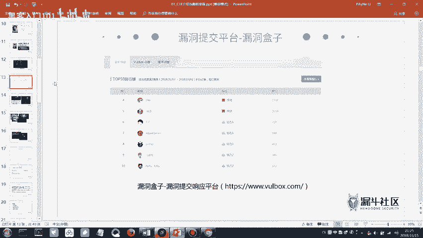

那么每个公司它也有自己专属的这种SRC，就是说我这里可以提交的漏洞，就只有我这个厂商的漏洞。比如说腾讯的SIRC的话，他只能提交你腾讯的各种产品。比如说他的网站，比如说他的产品微信QQ这种漏洞。

你可以提交他提交到他这里，然后然后。他可以给你发放相应的简历。然后腾讯的这个SRC的安全响应中心的话，那会儿我记得他的排行榜第一是我们知道创宇的呃一个产品性的那个研发总监。他在那个排行榜上面是排第一。

然后和第二名大概拉出来了800多份，就挺多的。反正这些就是如果大家信息安全学到一定地步的话，可以去刷这些平台。如果你能够在这些前排在某一个平台的，比如说补贴，你如果能在前500名自然会有工作去找你。

然后会找你谈相应的这种工作的内容，相应的岗位都会能够去找你这种的话，那你就不用自己去找工作，只是说他可能门门槛会稍微高一点。那么最后一个我们学校信息安全，我们可以做的一件事情，就是我们可以打比赛。

那比赛就是我们的CDF比赛，有省级的，比如说这一次的海峡杯，然后还有国家级别的，比如说我们的网点杯，还有前两天的互网杯，这种比赛是比较多的，也有世界级别的WCDF。或者说是一些厂商举办的。

比如说百度杯啊等等之类的，这种比赛非常多。你如果说学到一定程度，你可以。一一周之内你可以都可以打一两个比赛，他经常会有这种比赛，大大小小你都可以去打，而且奖金奖金的话也挺丰厚的。网顶杯的话。

除了说你可以获得很多的这种岗位机会，还有被公安部选拔的这种机会，他第一名的话，好像是10万10万块，还有其他的一些奖励。然后除了说我们的CDF比赛上面的SRC，我们还有一个叫做这种叫做黑客大会。

其实它不是纯粹意义上的这种。技术比赛它属于是技术分享交流的这种会议。那么像black heart的话，这个是全球最大的这种黑客交流的会议。在黑客大会上面一般都是分享一些非常。

走在秦英的非常厉害的一些黑客技术。那像这个K看的话是呃制造创宇发起的，就鱼行那个鱼行发起的那个我在制造创宇的时候。对内部的员工有这种免费的这种门票。但是那会儿我并没有意识到这个会议居然有那么大的影响力。

所以那会儿我也没去，后来才知道一张票居然要220千0多块。如果是学生的话，可以好像有打折，大概是六七百块这样吧。不过他有信店那个名额。那么上面的这些就是我们呃学了信息安全之后，我们可以做的一些事情。

那除了我们上面的SRC，它还有一些相应的这种岗位。那么比如说社招的一些岗位，这里我给了一个网址。

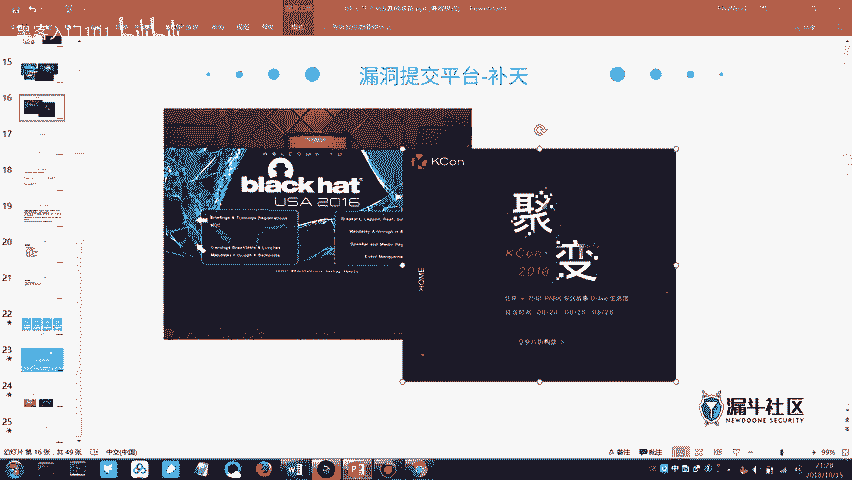

这个截图不是说我。胡乱编灶的，我这里给一个网址，你们如果感兴趣的话，你们可以把这个网址复制一下，然后去这个网站上嗯看一下他招聘的这些工资，或者说他招聘需要你掌握的一些技能要求。然后下面的话给了一个网址。

然后在这个福buff上的话，我说了第一页我在打广告的时候，是不是给了大家一个我们安全团队的一个专栏，顺便点个关注。那么下面的话就是说我们如果说你对SRRC或者说CDF比赛这种。

你觉得说我除了说要做这一些，我还要毕业的时候要找一份非常好的工作。那么他信息安全，他也有对应的工作，叫做安全服务工程师，他做的就是一些渗透测试的工作。至于说渗透测试是什么？那么后面我们慢慢的来讲。

因为现在给大家供述太多这种术语的话，大家可能也记不住。那这边的话就是一般的这种安全服务的岗位，它需要具备的一些知识技能，这个大家可以下去看一下，可能有的术语你看的不是特别懂。但是呃你可以稍微先记录一下。

后面我们都会提到这些相关的术语。然后最后的话是给大家。安利几本书。如果你对这种信息安全的技术感兴趣的话，这边会有推荐相关的一些这种书籍。呃，你可以尝试着去看一下，以及后面推荐的几个导航。

每个导航里面它是又有非常多的这种链接，基本上可以说是呃很长一段时间我自己总结下来的，基本上你看这三个导航就够了。每个导航里面可能又会有两一两百个这种网站或者说链接，你们都可以去看一下。

那今天晚上的话好像很准时，9点半，本来应该提前一点的。但是讲着讲着好像有点上头了。嗯，那今天的话就到这边，然后大家就先下课，然后回家的时候注意安全。我们下次课再见了。

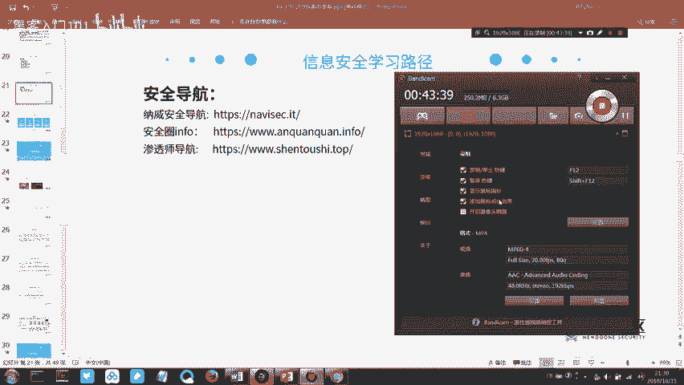