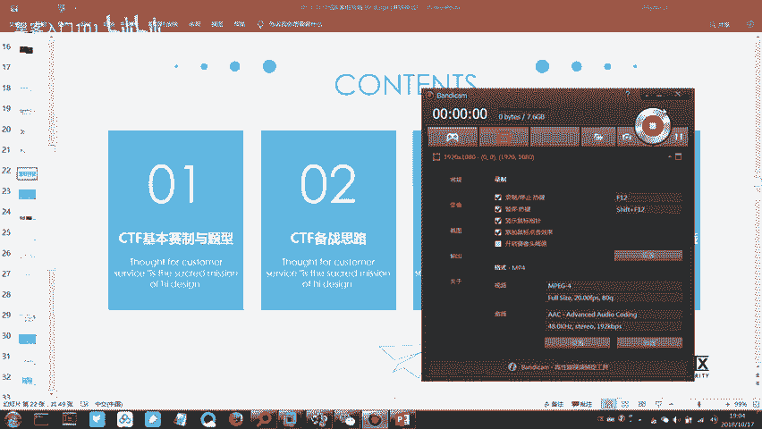
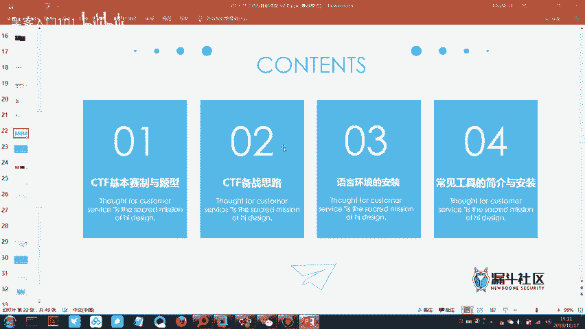
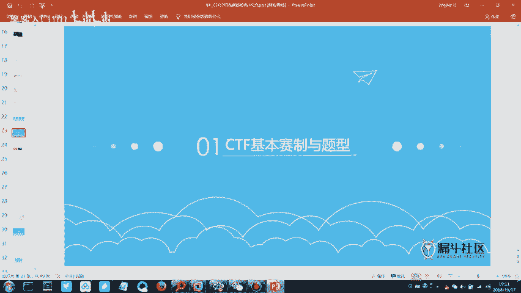
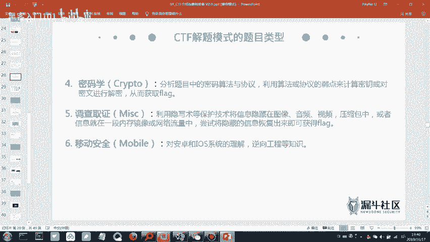
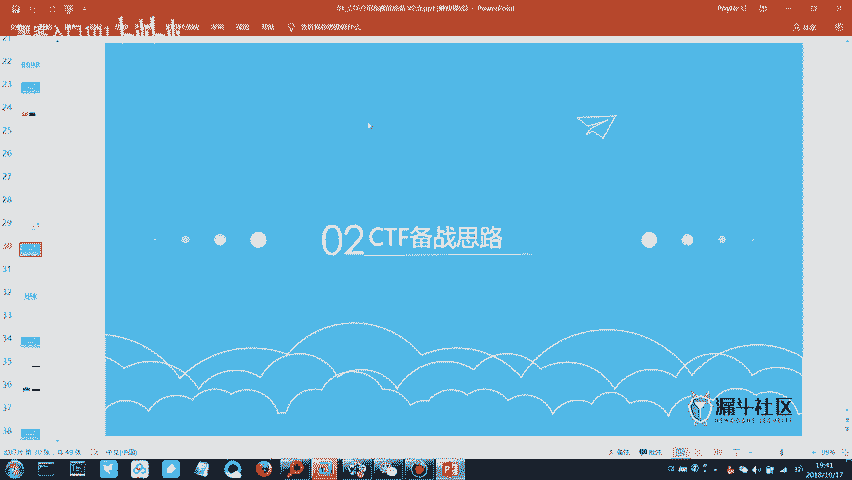

# B站最好的清华蓝莲花战队CTF夺旗赛教程 从小白入门到比赛实战 - P2：2.CTF赛制介绍&工具介绍2 - 黑客入门101 - BV1ReW5eJEAX

呃，这节课是不是有增加了一两位新同学呀？没有增加是吗？San。之后再。林坤在吗？没来是吧。那我就先开始吧，我们就先开始。我们上节课的话是讲了一个。关于我们的信息安全的一个概念。

我们上节课一直在提到的一个概念就是信息安全，对吧？然后信息安全的话，我们上节课讲了关于信息安全它的一个基本的概念。大家wifi连好之后就稍微安静一点。好吧，我们这边先开始上课。

wifi密码的话是在群里面。可以看一下群里面，然后群里面有一个那个思维导图的软件，大家可以下一下，下载了之后可以把我在群里面存的那个思维导图的文件可以打开。上面有一些工具安装的那个相关的说明。

我们上节课的话，关于信息安全，我们讲了信息安全的它的一个概念，对吧？就是官方ISO的这种组织，它给的概念比较官方比较复杂。那所以说我们是通过一两个这种安全的事件来说明信息安全的这个概念的。

那么除了我们讲的信息安全的这个概念，还大概的说了一下信息安全的它的一个行业趋势。因为随着网络安全法的颁布，以及我们国家的对于信息安全的这种扶持，也有相关的一些政策。所以说现在当今的这种互联网的环境之下。

信息安全这个行业其实可以说是非常火热的。那么第二个点就是说了一个信息安全，它的一个行业趋势。然后第三个点的话，大概介绍了一下，我们学完了信息安全之后，可以做一些什么事情。可以刷SRC对吧？

然后我们也可以打CDF的比赛，那最不济我们也可以找一份和信息安全相关的这种工作。比如说安全服务工程师或者说是渗斗测试工程师之类的，他的岗位职能可能会有所不同。但是他的一些核心技能要求基本上都是一致的。

然后再给你们的PPT里面，核心技能要求，有一张中门的PPT就是讲这个的，你们。行着的时候可以把那个PPT打开来，稍微看一下。那么这个就是上节课讲的一个基本的内容。

那么我们这节课的话就正式开始的进入到我们CDF的相关的一个模块。CDF的话，待会儿我们会讲CDF是什么？就是它的一个基本的解读。那现在的话我们先看一下我们这个课程的它的一个课程大纲是什么样的。

它总共分为4个模块。第一个模块呢是我们关于CDF会有一个基本的介绍。比如说它的一个基本的赛制以及它的一个模式。我们都知道CDF比赛的话，它其实除了说经典的这种答题的模式的话，它还有其他的。

比如说攻防模式，或者说是综合渗透模式。那么待会儿我们会一种一种的来介绍一下。那么第二个点就是CDF它的一个备仗思路。我们知道了CDF它的一个基本概念之后，以及知道了它相关的一些题型。

那么接下来我们就需要说。针对它特定的几种题目类型，我们需要梳理一个这种学习的思路，然后去做一个准备。不管是说题目类型上的，还是说我们针对于CDF涉及到的相关的这种技术点，我们都需要做一定的储备和学习。

那么到时候参加比赛才会比较得心应手一点。那么第3个第3块，还有我们的第4块的话，那基本上就是涉及到一些工具。今天的话待会儿会给大家就是经常会用到的一些工具，会会给大家演示一下怎么安装以及怎么使用。

那首先第三个模块的话，语言环境的话，那基本上就是。我们可能经常会用到的，比如说java的文件，但是我们只是用java的文件来跑一个软件，而不是说用java的这个文件来写代码。它是这样的，然后第二个文件。

比如说我们的一个python的这种。一个文件。有时候我们做相关的这种题目，你可能需要用一个脚板来跑一个密码。那么这时候就需要一个python的文件。第三个的话。

有时候我们也会说我们用1个PSHP的这种文件来做一些相关的测试，或者说是调试。那么基本上这三个语言文件是必须要装的那待会儿我们会一个一个的来讲怎么装，然后怎么使用。那第四个模块常见的一些工具的话。

除了说CTF工具包里面可能有几十个上百个这样的工具。那我们经常使用到的有有几个工具也是必须得装的。比如首先第一个。首先第一个一个是wem onework。那这个软件是一个。

虚拟化就是用来打开虚拟机的这样的一个软件，这个是必须得装的。另外一个可以说是在CTF比赛当中必须基本上都会用到的一个工具叫bopsuit。那这个工具的话，它是一个用来做浏览器的拦截代理。

它可以拦截相关的这种流量，然后对数据包能够有一些相关的操作，比如说爆破或者说是相关的数据寸杆，都会用到我们的这个工具，那待会我们也会装一下这个工具。那这四个模块的话就是大概的给大家介绍一下。

就是我们这一节课的内容大概是从哪几个维度去学习我们相关的知识的那接下来的话，我们就首先先来讲我们的第一部分。那第一部分的话是CTF的一个基本的赛制与题型。

CDF它是一个景餐，那它的群餐就是capcha the flagag。那flag的话大家应该还是比较熟悉的。每到每个学期开学的时候，或者说每当你吃完一顿大餐的时候，先立个flag。减肥减个时间是吧？

或者说这个学期好好学习，拿个奖学金，或者说是。在一两点钟的时候发个朋友圈说，明天晚明天晚上要早睡早起啊之类的那像这样的，我们叫做立一个flag。

那所说的立flag中的这个flag跟我们CDF当中的这个flag的意思它是一样的，基本上就是旗帜的这个单词。嗯。其次那其实说白了就是一个目标嘛。那我们在CDF的这个比赛当中。

我们就是需要尽可能多的获取到这个flag。所以说CTF的这个比赛，我们也把它叫做夺奇赛。CDF的话，以前的话它是没有CDF的，但是它有像difffferic这种黑客大会。像这种黑客大会。

它一般是做一些技术的分享交流。后面后面随着说分享的技术，光是一个人在上面演讲，可能觉得有点无趣。那后面的话技术的交流，它就逐渐的演变成说关于某一个技术，我们可以设计一种像比赛的这种形式。

有攻防的对立的双方。那后面后面随着时间的一个推移，就形成了信息安全技术竞赛的。我们所说的CDF的这种比赛。那么CDF比赛它在比赛它的一个流程是什么样的呢？首先会有一个题目的平台。

比赛方比赛方它会部署一个这种题目的服务器，然后大家通过外网，然后登录进去，然后我们进行一个题目的这种解答，获取到相应的flag。获取到fllaag之后，那么对应的fllaag，它就对应着不同的分数。

比如说难度比较高的题目的话，它的分数就会比较高一点。难度比较低的这种题目的话，它的分数就会稍微低一点。那么我们根据拿到的flag提交的题目的成功率，最终得到一个分数，那最后我们再评出一个名次。

那么它大概的一个比赛的流程，它就是这样的。那题目它的一个比赛的服务器的话，比如说本次的这一次的福建省的网络空间安全比赛的话，它的服务器平台是由一个公司。就是昨天哦，不是昨天是上一次课。

大家那个班主任在开班的时候，有提到一个公司叫做永幸制诚。呃，这一个公司的话，他是呃算是一个安全厂商，总部是在北京。然后它的两大产品非常出名的两大产品，一个叫做爱春秋。爱春秋的话。

它上面是一个在线的这种信息安全的培训平台。它上面有很多的视频。然后他还有另外一个平台叫做易春秋。那么易春秋这个平台的话，它是一个我们的比赛的这种平台。很多时候基本上大大小小的比赛大到我们的网点杯。

像网点杯是基本上是顺是信息安全行业这种有史以来规模最大的一个比赛。那像这种比赛的话，有人敲门是吗？嗯。然后大到说像网点杯这样的比赛，或者说是小到我们的省级的这种比赛，甚至说是一个校内选拔赛。

那么基本上这种大大小小的比赛，基本都是由永兴制诚这种公司他来承办的那本次的这个比赛也是由永兴制诚这个公司来提供相关的这样的一个比赛的平台。那么我们刚刚说我们新CF的目标就是获取到尽可能多的这种flag。

那么这个flag是怎么能怎么来获取到的呢？它是有很多的这种题目类型来获取到的。比如说有的题目，它可能是通过一段这种算法加密的数据。然后你通过解密这一段数据，最终获取到一个flag。

那么解密的话就涉及到我们的一个密码学。比如说什么摩斯密码，还有我们的base64。就很多的编码，它涉及到密码学。那至于说密码学当中它有哪些加密方式，或者说有哪些摘要算法。

那我们接下来到时候再讲杂象的时候，会仔细的去讲。那在现在的话，大家有一个概念就可以了。然后第二个部分的话是。根据网络流量。对网络流量有这个概念吗？大家平常用手机在上网的时候。

我们是不是都是用流量在上网的那为什么说它可以计算出来你这个手机用流量用了多少兆？那它其实就是说我们在存输数据的时候，全部是网络通信当中存输数据，它都是通过我们的流量来存输的。

这也就是为什么我说上节课提到的一个，你在网你哪怕说你随便在一个网吧上网，你如果发表了什么不适当的言论，公安局是能够找到你的。为什么能够找到你？就是因为你所有你发送的这种数据。

他都通过了运营商的这种相关的流量。他只要把相关的流量抓取出来，做一些公进字过滤，那么就能够找到相应的IP那么这个就是一个网络流量？那么真正在做题的时候，他是这么来出题的？比如说他给你一个包。

它的后缀是PCAP。然后这个PCAP的这个数据包，它是用一个软件抓出来的，我们叫做wellsh。有用过这个软件吗？它是属于一个叫做抓包软件，所抓的包就是我们的一个数据包。

也就是我们在网络通信当中它存输数据的时候，那个数据我们就把它叫做数据包。那么它是一个算是抓包软件当中比较强悍或者说是比较好用的一个软件，最主要的是它是免费的。因为到后面大家就会就会发现。

我们用的好多工具，基本都是破解。因为他的那个费用实在太高了。所以后面很多工具我们用的都是破解版的，所以说用起来稍微会有一点麻烦。如果说有的同学实在就是有那种情怀，不太想用破解版的话。

也可以充值个三四万块钱，用个正版的也是可以的。成为尊贵的会员用户嘛。那么除了说我们从网络流量当中能够获取到相应的flag，有时候出了出题人出的题目。有各种奇奇怪怪的题目，有时候会给你一段音乐。

比如说给你一段MP3，当然不是让你去听一首歌，它有可能里面他给你一首歌，但是它在歌里面还会给你掺杂另外一种声音。比如说滴或者滴滴的这种，然后你需要根据它的这个音频把它的波形画出来。根据它的这个波形。

然后你画出来一个摩斯密码。比如说你画出来之后，它是一个摩斯密码。那么你就需要把这个模式密码拿到相关的网站在线的这种网站，在线的工具，或者说是我们给的CDF工具包当中的本地的这种工具拿去做一个解码。

那最终如果说出题单想出的简单一点。那么你解码之后就能够获取到fag格。如果他出的难一点，那么有可能你模式解密之后，它还有另外一种加密的方式，那可能就需要再做一次解码。如果它出的更难一点。

那就可能需要写个python的脚板来跑一下。那么它大概就是这样的一个思路。然后通过各种各样的类型的题目，最终然后获取到flag，然后提交提交成功的话就获取到相应的一个分数。

那么CDF我们的目标就是获取到flag。那么刚刚说CDF它的一个比赛的形式的话，它是有。好几种呢。最经典的话就是我们所说的解题模式。解题模式的话，比如说这一次比赛，大家在11月初或者说11月1几号吧。

大家在这个时间段之内，那会儿参加的初赛的话，它的一个比赛的模式就是解题模式。解题模式的话就是你只需要去做题。然后获取到相应的这种flag就可以了。啊，下面的另外一种模式，我们把它叫做攻防模式。

攻防模式的话，你除了要获取到flag，你还需要做一个防御。因为攻防模式的话，它就不是说你单纯的去做题了，而是双方他是有这种攻击行为和防御行为的。就是说这两种模式它是有一个本质上的区别。

大家需要稍微有一点概念。那么在解题模式当中，它有这样的一个说法就是。呃，大家在玩游戏的时候，如果有玩游戏的话，应该比较熟悉。在CDF题目当中有一个概念叫做医学。如果不太熟悉的，我稍微说一下。

比如说一个题目，它的一个分数是500分。如果你是医学队伍的话，那么基本上可以加上个100分，或者说是加上个50分。那这个的话就根据出题方看出题方它是怎么设定的。如果说它设定加100分的话。

那么医学队伍它会有600分的总分。那么随着时间的推移，这道题的分数会越来越降低。比如说过个过个30分钟，这道题它就变成400分。他的分数会一直变低，所以有的那种比较难的比赛的话。有的人他比较难的题。

他做出来两题，相当于简单的题，做出来了好几题。那所以说比较难的题目，他基本上都是拿来做这种拉分数的。我记得那会儿网点背的时候。有一道那种还算是很难的题目，但是腾讯的寻武实验室的大概10分钟吧。

然后那题就结结出来了。然后医学队伍总那一题是1000分，然后医学队伍是1200分。很强。大佬的队伍始终就是大佬。那么我们的攻防模式的话，它是怎么来做的呢？正常我们的攻防模式我们都是一个队伍的。

就是一个team嘛，是吧？我们是一个team。比较专业的这种队伍的话，如果是打攻防模式，那么其中比如说6个人。他其中有可能是有两三个人，他是专门来负责做一个防御。然后剩下的人他是做一个攻击，为什么？

因为他的这种攻防模式的设定当中，每个人比如说他的初始分数是1000分。然后别人攻别人攻击你的这个服务器，然后把你的flag给获取了。那么你这边就会相应的比如说减少200分，然后。

每个每个队伍他你都可以攻击其他队伍，其他队伍也可以攻击你。那么这种时候如果说你防御做的不够好的话，你会发现好像才没过多少分钟，然后你这个分数一直刷刷刷的往下掉。那所以说在这种攻防模式当中。

防御这一部分也是非常重要的，必须得有一部分的人去做。但是我们这一次的省级的比赛的话，它是以另外一个模式，它上午的话是解题模式。我说的是决赛我说的是决赛。你们初赛的话就只有解题模式。因为初赛的话。

它其实就是做一个稍微做一个选拔嘛。那么你们初赛的话，它只有解题模式，然后决赛的话，它是这么来安排的。你们上午的话是解题模式。下午的话是应该是综合渗透模式。什么叫综合渗透模式呢？

综合渗透模式它就介于解题模式和攻防模式之间，就是说没有人攻击你，你也不需要去攻击别人。但是你需要去攻击官方给出来的这样的几个服务器。比如说官方给了你几个网站，那么你就需要去对这个网站做攻击。

发现他的漏洞，进而获取到相应的这种flag的分数。那这时候你就不用慌了，没人再攻击你的，你只要认真的去攻击。比赛方出题方给的那个服务器，然后获取到相应的分数就可以了。然后你们决赛的话就是上午是解题模式。

下午的话就是综合生的模式。初赛的话，它是线上赛，就是你各种外网你都可以上。然后线上的那种工具，你也可以用百度，你也可以用google你也这些都可以用。甚至有时候你都你忘记了某一个题怎么解，你翻一下课件。

也没人会说你。但是如果说是在我们的决赛当中的话，它是在一个内网的，你是不能上外网。就是说你不能再用百度或者说goo这种搜索引擎了。那么这个就是初赛，它跟决赛的有稍微一点区别。所以说这个模式大家得稍微懂。

就好像你要玩一个游戏，你起码得知道这个游戏的游戏规则，对吧？那么你才能说在这个游戏当中玩的如鱼得水一样。那么这个就是关于CDF它的一个比赛形式。

那接下来的话就给大家介绍一下我们CDF它的相关的一些题目类型是什么样的。首先第一个外围的安全。我们平常所说的外围安全的题目，你在比赛当中，它应该是给你一个题目类以型应该是叫外部的。

那所以说你看到是外围的题目，它其实指的就是外部安全。那么外围安全的这种题目应该怎么来做呢？一般题目上或者说题目的这种提示信息，它会给你一个信息。比如说这个题目它考察的是SQL注入，或者说是叉SS漏洞。

它会给相应的信息。那如果没有给的话，那就需要你自己去发掘这个题目，他想考察的是什么样的漏洞。所以说这个题目的难度，那就根据出题人看看怎么出，需不需要你自己去判断，或者说它的一个提示信息给的够不够多。

那么像漏洞类型的话，其实漏洞类型还是挺多的。好几种漏洞类型。比如说SKL注入的话，它是基于我们的数据库。我们知道SKL。是一个查S有一种语句叫做SQL的查询语句，对吧？

它是专专门去查询数据库的一个相关的信息，也就相当于说它是一套语法。那么它也有叉SS这种漏洞。呃，可能大家。不认识叉SS漏洞是什么？举一个例子，我们平常所说的。比如说陌生人给你发QQ上发一个这种链接。

或者说是你邮箱里面收到一个链接。大人都会告诉你说不要乱点是吧？你们老师也会告诉你们说不要乱点，为什么说不能乱点。因为这个链接当中它构造了很多的这种脚本，你点击了之后，它那个脚本会自动运行，运行了之后。

它会盗取你本地的cooking，然后把它转到另外的一个网站。那么这种的话就是不太安全的。所以说。我们的所谓的钓鱼网站，或者说这种钓鱼，其实它就是基于叉SS的这种技术来实现的那叉SS我们翻译为中文的话。

它是叫跨站脚本。它是叫跨站脚本攻击。那么除了说我们的SQ注入以及我们的叉4S，还有另外的几种漏洞。比如说第三个漏洞文件上传，什么叫文件上传？我们经常听到说某某黑客它能够控制某一个小白的计算机是吧？

它能够远程实现控制，为什么能够实现远程控制，是因为我们上传了一个木马，并且这个木马能够在服务器端能够被执行。那么这种我们能够上传木马，那就是因为它存在文件上传的这种漏洞。那基本上网站的后台。

如果存在文件上传的漏洞，你只需要写一行代码就能够控制它的服务器？那么接下来它其实后面其实还有好几个漏洞，但是后面这几个漏洞就是考察的可能会稍微少一点。那最后一个代码审计的话。呃。

这个代码成绩也是如果他想难的话也是会比较难。因为需要你去分析。比如说PHP的代码，你需要首先先知道这一段PHP的代码它实现的是什么功能，然后你再去分析我应该怎么来构造相应的这种输入的数据。

然后构造相应的语句，最终才能拿到flag。那所以说外围安全它包含的内容其实不少。因为我们公司我们公司也有信息安全的课程，我们公司好几个阶段的这种信息安全的课程合起来，所有讲的都是外部安全。

花那么多时间来讲。所以说外部安全它的知识点挺多的。然后他再把外部安全作为我们的。这个CDF题目当中只是其中一个题目类型。可想而知，我们需要稍微花一些精力，不然的话，如果一直划水的话，可能有点划不过去。

那么第二个题目类型的话，我们叫做逆向工程。有听过逆向吗？有用过外挂吗？你可以把外挂也简单的可以理解为它就是逆向工程的这种一个小的应用。因为它是做了逆向，然后拿到相当的一部分的云码。

然后再写出来相关的这种工具的工具。那所以说外挂，其实你也可以理解为它就是逆向，然后做出来的。那么在我们的CDF的这个比赛当中呢，我们要来做这个逆向的题目的话，那就需要你对语言，就是我们所说的编程语言。

你可能就需要有一些了解。甚至说对安卓的这种开发的语言，你也稍微得有一些了解，你来做逆向的话，才会比较容易。那么第三个题目类型的话，我们把它叫做判。也就是我们所说的二进制。这个题目类型的话是我们好。

我们这个CDF比赛当中题目类型中最难的一个题目类型是非常难的。这个题目类型基本上就是拿来拉分的。如果能做出来，它基本上可以抵。一个这种胖的题目，它基本上可以抵一个外抵两个外围安全的这种题目的分数。

然后一个外围安全的，它基本上又可以抵两个杂项的这种题目。杂项下一页PPT会讲，所以说杂项的题目的难度会稍微低一点。然后我们第四个题目那一些，我们把它叫做密码学。密码学的话就是我刚刚所说的。

比如说我们需要对它的编码方式做一个解码。编码方式，比如说贝64，有没有听过？有听过是吧？还是没听过，或者说是一些加密算法，或者说是一些加密的这种算法。MD5的话，它属于是摘要胜法。

就是说它还是稍微有那么一点区别的。比如说加密顺法的话，我们说什么加密，比如说什么凯撒凯撒密码等等的。可能可能也有十几种吧。然后摘要算法的话，那就是像刚刚这位同学说的MD5，或者说我们的SHA对吧？

SHA1。然后SHA2。等等等等的这些我们把它叫做摘要顺入法。那么这三部分合起来就是我们的密码学。那么我们在做密码学相关的题目的时候，就需要对我们它加密的那个数据做一个相关的解码。那如果说解码的话。

并不是说我们自己现场去手工的这种去解码，它都是有很多的工具的。不然我给你们的100多个工具毫无意义是吧？那所以说它这种都是有对应的工具，或者说在线的网站。你只要把那一寸呃密码复制进去。

然后做一个解码就可以了。关键就是有时候它会做两三次编码。比如说我一寸数字，我一个字符寸，我先把它拿来做一次做一次base64，然后再来做一次其他的这种加密，最终你需要判断它是用的哪种加密方式。

最终才能够把解码出来，然后获取到fag。那么第五个这个题目类型，我们所说的调查取调查取证，也就是我们所说的杂项。平常我们也把叫做杂象。听杂相，看到这两个字，应该就知道它技术点不会非要求不会非常高。

但是它非常杂。砸到什么地步呢？就是明明我们是作为一个这种信息安全的题目。但是有时候什么photoshop啊，绘声会影啊，各种各样的什么奇奇怪怪的软件，二维码的扫码软件啊，什么奇奇怪的软件你都会用得到。

所以说它非常杂，它可以非常简单，它也可以非常难。他如果想难的话，那他把好几个知识点给它综合在一起。那这样的话，他出的这种题目出来就会比较难。但是在CDF的所有题目类型当中，杂项。

它依然是我们所说的可能是最容易入门的一个题目类型。因为它不需要太太多的这种信息安全的技术知识的储备。你只要多刷点题，然后多积累一些这种做题的思路，慢慢的砸项的题目就能够做的比较顺手。

那么第六个题目类型的话，移动安全的话，其实把它可以把它归在我们刚刚所讲的逆向的这个方向里面。那它通常移动安全指的就是安卓的逆向破解。我们都知道我们的操作系统有哪些安卓是吧？手机操作系统嘛，那我们电脑呢？

那我们电脑呢是不是就是windows？这个应该没有什么疑义吧。我们windows上面跑的程序是不是点EXE的？然后我们的安卓上面的。程序是什么？APK对吧。然后mark上面的应该是。点DMG是吧。

那所以说。针对我们不同操作系统上面跑的这种软件，它有时候也会有相关的这种逆向的题目。比如说在安卓上面的逆安卓上面的这种逆向的题目，安卓的逆向破解的话，它就属于是移动安全的。

但是一般这种移动安全安卓的逆向的话，题目会比较少。如果有的话，它基本上都会把这个题目的类型把它归结到我们的这个逆项工程当中。那么以上的话，它就是我们所说的CDF比赛当中它的一个题目类型。

那接下来的话我们来捋一捋。5个题目类型，我们把它的难度按它的难度来排一个序。首先第一个杂项嘛，对吧？哇，这个鼠标写字真的难写，有点吵，将就时看了一下。然后第二个的话是我们的一个密码学。那么第三个的话。

第三个的话就是我们的一个外部，外部是什么？外表安全是吧？就是说哪怕说哪怕说你是来混创新学分的，你后面也没什么兴趣学。但是好歹也听了课，你起码得记得住说CTF的题比赛，它的题目类型。

它是有这么几个题目类型。这个记住一下，应该不是特别难。那我们所说的外围一般指的就是我们的外围安全。然后第四个题目类型的话是什么？逆向对吧？那第五个题目类型的话，就是我们刚刚所说的胖。二进制破解。

那我们这5个题目类型的话，它的一个难度的话基本上就是这样，从上往下基本上应该是依次加难的。那么依次胶囊的话，那首先第一个杂项。前第一个杂项它的难度是比较低的那所以说我们可以花多一点的时间。

因为大家其实没有剩下特别多的时间。顶翻了天，你们应该也就剩下20多天，对吧？20多天，然后就会去参加那个初赛。那所以说我们在短时间的这种一个备上的思路的话，就是心意后难，对吧？

任何的考试老师都会跟你们说心意后呢。那么我们最开始研究的题目肯定是杂项。那么第二个题目类型的话，就是我们的一个密码学。那第三个是外部。那至于说后面两个的话，大家可能。瞅了一眼。

我们的课程没有发现我们好像并没有这个逆向跟胖子相关的课程。为什么？因为20多天来研究逆向跟胖的话，你哪怕研究其中一个方面，2020多天可能都不够用。因为。逆向的话，它涉及到很多的这种语言。

我们所说的语言，基本上你脑海中你听过的，你进过的你想得到的语言，在逆向当中都有可能会用得到。比如说C呀、C加加啊吸警啊或者说抓va啊，然后拍死啊各种基本上也都有可能会用得到。所以说逆向这个题目。

这个题目类型它会比较难一点。然后如果你逆向精通了之后，那么你终于可以研接我们的判了。如果说前面的杂项，我们是通过刷多刷题，然后就能够掌握一些题目的这种思路的话。那么胖的话，我们首先先给自己定一个目标。

先能够看懂别人写的答案。别人写的答案答案的话，我们在我们的。CDF比赛当中，别人写的答案，我们把它叫做read up。这个好像呃有有说过吗？同时上同时上两个班的课，我感觉我有点有点混淆了。

就是我们在CDF比赛当中，我们就是这种题目，它对应的题目的答案，我们叫做read up。然后缩写一下的话就是WP。那所以说在后面讲课的时候，我只要提到说某一道题目的WP。

那就是说这道题目它对应的一个答案。嗯，所以说我们刚刚的那5种题目类型，我们的一个备账的思路就是我们先来撸一下前三个题目类型，后面剩下的逆向还有判的话，之后大家学有余力的时候可以去稍微研究一下，好吧。

那所以说我们本次这个培训课程，因为大家时间也比较紧，其实没有安排特别多的这种时间来学习。那所以说我们把我们的重点放在我们的前三个题目内型，而且。呃，哪怕说是在决赛当中逆向和判的题目。

最多最多不超过4个不超过4个题目。因为出题人心中还是有点数的。你出那么多判和逆项的题目，谁来做是吧？毕竟他就只是一个审赛。所以说你只要前三个题目类型能够做的好，基本上已经保证能拿奖，就是这么一个概念。

那如果说是国家级别的那场比赛，比如说网点杯的话，那么可能就需要一个胖大佬参加一下。不然的话可能你想拿名次的话，稍微有点难。省级比赛的话，我们只要把大部分的精力全部投入到我们的杂项，然后外部还有密码学。

然后把自己这三个题目类型的题目做好，其实就差不多了。

那么下面这一张图的话，就是CDF攻防模式它的一张图。呃，讲的跟我刚刚讲的大概是差不多，只是说他这边把一个相关的这种网络top画出来了，它就是一个网络top服务器的这种一个部署的方式。

那至于说这个服务器你感觉好像有点看不懂。没关系。只要到时候题目方出题方他都会告诉你这个服务器应该怎么来用，然后怎么来使用，它都会做相关的说明，你这个top哪怕看不看不懂的话，也没什么太大的关系。

那之后这边它的一个规则的话，那大家就自己下来看一下，好吧，就是基本上跟我刚刚讲的是差不多的。那刚刚我们第一部分对于CDF的一个基本的赛制的介绍，以及题型的这种一个介绍的话，那基本上就完了。

那接下来我们就开始第二部分。那就是说我们针对刚刚介绍的CDF比赛当中它的一个题目类型，我们一个备仗思路是什么样的那关于备仗思路的话。我们先拍个班照，然后待会来讲。

