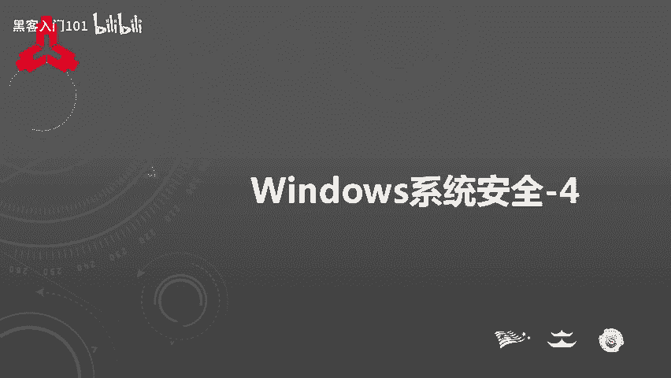
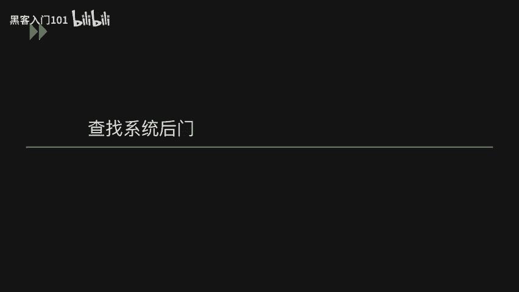
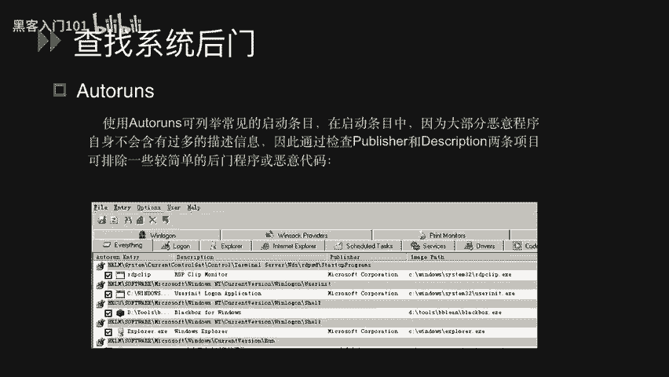
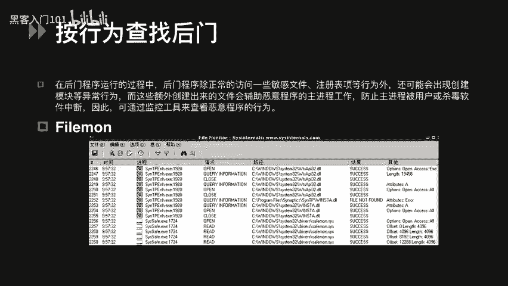
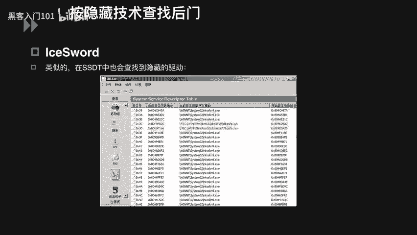
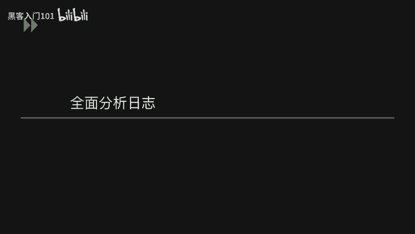
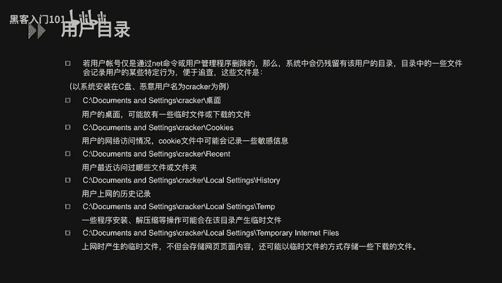
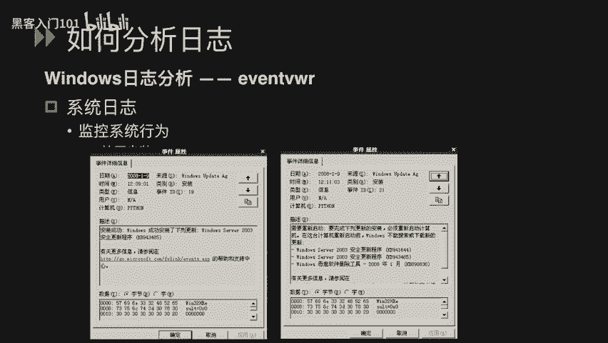
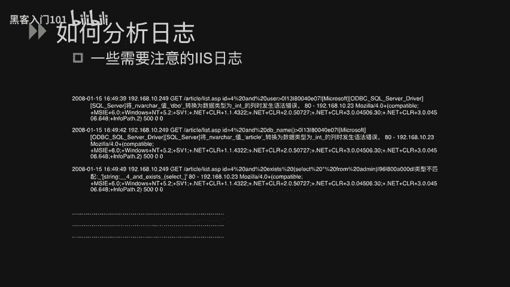
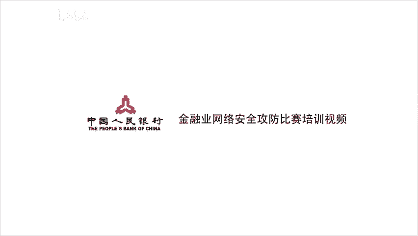

# B站最好的绿盟科技CTF夺旗赛教程 从小白入门到比赛实战 - P14：15.Windows系统安全_4 - 黑客入门101 - BV1eeW5eJECc

呃，大家好，呃，下面呢我们进行windows系统安全的第四个部分的课程。

windows应急响应在这一部分中呢，我分为了两个小节。呃，第一个是A查找我们的系统后门。呃，第二个是呃B全面分析我们的系统日志。首先我们看查找系统后门这一小节。

呃，作为攻击者来说，我们拿到系统的一个权限之后，他可能会取在系统中留下各种各样的后门，呃，方便他去日后再次登录到我们的操作系统中。嗯，在这里呢我列举了一个工具是那个呃all two runss。呃。

autoros呢它的作用就是检查我们开机自动加载的所有程序。例如我们的硬件驱动程序，windows核心启动程序和应用程序，它比windows自带的MS config点EXE还要强大。

通过它我们可以看到一些在呃MSconfig里面无法看到的病毒和木马以及恶意的一些插件程序，还能够详细的把启动项目加载。呃，到所有程序列出来，比如说loinexlo，还有IE上加载的一些DIL跟其他组件。

所以在启动的条目中，因为大部分的那个恶意程序自身是不含有过多的描述信息的，我们可以就可以通过检查呃population and description这两个项目来可排除一些简单的homan程序或恶意代码。

嗯，在这里可以看到呃publish这一项，有的是那个呃microsoft，有的就是没有。所以我们通过这一点上可以去简单的判一断它是一个恶意程序，还是我们的正常程序。

嗯，第二的话就是我们按行为去查找后门。ho门程序在运行过程中呢，ho门程序除了正常的访问一些敏感文件、注册表等行为外呢，还可能会出现创建模块等异常行为。

这些额外的创建出来的文件会辅助我们的恶意程序的主进程工作，防止组建成用户或杀毒软件中断，因此可以通过这些监控软件来查看恶意软件的行为。呃。

在这里我列举的一个工具叫fire moon这样一个监控文件的工具。呃，下面是它一个界面。

Formore呢会以进程为线索，列举该进程以何种方式对什么文件进行什么样的访问，以及访问是否成功。当然，如果你想对特定的进程监视或者过滤的话，可以点击快捷上单的漏洞图标，填写指定的进程名来进行结果过滤。

在这里就以那个C1 safe点EX这样一个呃进程名来进行特定搜索。呃，再下再往下看，我们有列举一个工具叫re mode。呃，regregmo呢是一个出色的注册表数据库监控软件。

它与注册表数据库相关的一切操作，如读取修改、出售的信息呢，都会被记录下来，以供我们用户参考，并允许用户对记录的信息进行保存过滤、查找等处理。这就我们用户对系统的维护呢提供了极大的便利。呃。

下面这幅图呢就是呃reg moon这样一个监控软件的截图。呃，下面我们看另一种查找后门的方式是按隐藏技术查找后门。啊，这边呢我列举了一个工具叫is song，是我们中文名叫冰刃。嗯。

S saw呢是一款集合了较多实用功能的安全检测工具。利用S saw的进程功能呢，可以看到系统中是否存在的一些隐藏进程。若存在呢该进程会标自动标记为红色。在系统中，我们大量的这些。呃。

常用进程呢应该是不会去隐藏的。但作为工具者来说，他为了更好的隐蔽自己呢，他会选择把这样一些进程隐藏起来。所以当我们用这个S4这样一个工具去检查到我们系统中存在这样的一些隐藏进程的话。

那这个进程就比较可疑了。我们就后续要对这个进行进程进行具体分析了。呃，类似的，在那个SSDT中也会查看到一些隐藏的一些驱动。它也会被标记为红色。

呃，以上呢就是我们查找系统中一些后门程序的一些方法和工具。呃，下面呢我们去全面的去分析一下日志，去判断一下这个攻击者是通过何种方式去拿下我们这种服务器权限。

首先就是对我们账号的一个审计信息。如果我们系统配置的审计的话，就可以在我们实际查看器的安全日志日志中看到某些非管理员账号的登录文件访问的一些行为，可以看到这边有那个审核成功的记录。

包括他的一些登录时间呃登录的一些来源分类，到最后的的用登录的一些用户，包括你是用管理员用户还是用sstem或者是一些管理员自荐的一些用户登录的。

都可以在这里看到。呃，用户目录。那在这一个页面说的就是我们无论是我们的正常管理员或者是攻击者，他登录到系统中之后，他总会在我们的系统中去留下他的一些登录记录。在这里可以看到，包括我们的用户的桌面。

可能我们在桌面上会临时的留下一些下载的一些文件。我咪。还有我们的用户访问网络的情况，呃，cookie文件中会存在一些敏感的信息。比如说呃我们用户最近访问的哪些文件夹和他一些用户的上网历史记录。

还有一些程序的安装、解压等操作。呃，这个页面中呃具体的那个不同的文件夹对应的不同信息呢，大家可以去具体的去看一下。

呃，下面呢我们以具体的日志来查看一下如何分析我们现有系统中记录的日志。首先看的是我们的安全日志。呃，可以看到了，在这边的话，我们列举出来安全日志中的3条看第一个啊。

第一个呢属于呃类别呢属于登录或注销的呃的登录类型。在这里可以看到他适以哪个用户。呃，登录到我们的系统中的。呃，第二个它是以对象访问的日志类别。可以看到我们就是我们访问到了哪个呃目录。

对这个目录做了哪些操作？呃，第三类呢是我们的策略改动。我们这个该用户登录到系统中呢，对我们这些日志的这些审核做了哪些策略更正，可以在这里看到。呃，接下来呢我们我们去分析一下。呃，系统日志。呃。

可以看到这里系统日志这一边列举的是关于一个事件日志服务器的呃停止和启动两个行为。我们可以去嗯看到这个之后，知道了我们的这个日志服务器或这个的启动或者是停止。

那我们再看嗯这一类系统日证在这边的类别是属于安装。可以看到在日日志中显示的说我们哪个时间windows成功安装了下列更新。

呃，系统日志分析完毕之后，我们可以去看一下系统上去安装的应用日志。就在这里的话，以那个IIS日志为例。呃，它的路径呢是存放在我们呃sstem rootsstem32 log file这样一个路径下面。

它的命名呢是以呃日期形式，并且一天为一个文件进行存储的。它的内容呢可以记入到时间访问客户端的IP用户名、访问的文件、端口方法等等。

下面呢我们有windows中IS日的一个单独的一个条目来详细的做一下分析。呃，先看第一点，20007年12月24日15点42分20秒。这个呢是访问我们服务器的时间。192。168。10。67。

这个呢是仿我们目当前服务器的IP。再往下看，getget呢代表我们的该条访问的1个HTTB方法，它可以是po或者是其他的一些HTTB方法。嗯。

杠NS focus点HTML这个呢就代表当电话访问呢访问的我们服务器上的哪个目录，下面的哪个文件。呃，8080代表的就是我们当前访问的服务，我们目前服务的端口。192年168。10。6亿。

这个代表了就是我们。嗯，客户端的IP地址。嗯。再往下MOZIL这个呢这个代表的就是我们的客户端系统和一个浏览器的信息。最后是200200代表的就是我们的服务端返回客户端的1个HTTB响返响应值。

所以这个日志呢完整解释下来，就是在2017年12月24日呃，15点42分。20秒这个时间点。客户端192。16版的10。61呢以get形式访问了我们。呃，192。168点10。

67这个服务器呃目的服务器目标地址下的NS focus点HTML这个文件。他用的是我们这个mo啊mo这个客户端的这个标识，客户服务器呢给他返回的状态只是200。呃。

我们去刚才明白了这个IS中每条日志的一个具体的基本信息之后，我们就可以去在这样一个日志中去找到有没有攻击的这样一些行为。然后在这里列出来这么呃这样几条。

我们直接看后面的get后面呢是一个呃攻击者的一个访问请求的一个访问目录。在这里可以看到呢，很明显的它是一个对我们当前呃网站下的一个目录便利。所以通过这个日志呢可以看到。

可能工具者就是对我们当前网站下的目录进行一个扫描。扫描。如果这个目录存在的话，它可能返回200。如果不存在的话，在这里可以看到它返回的404。所以就是这段这个目录扫描工具呢。

也就是通过我们这个HTTP返回的一个值去判断我们这当前服务器下存不存在的一个目录。呃，下面我们接着再看。嗯，除了这些呃刚才所说的那个目录那个扫描线入呢，我们再看这个具体的。

日子中会存在哪些比较敏感特殊字符，让我们可以发现很明清楚的就发现这是一个攻击行为呢。呃，下面呢我们看第一条，第一条在get后面可以明显的看到and还有U大于零这样一些字符。这个呢就是攻击者。

在我们请求UL后面添加，明显它的目的是想把这些特殊字符去注入我们数据库去进行执行。最终根据执行返回的结果去判断到底这个执行有没有成功。嗯，再往后看，也包括就是有我们的案连接符。

还有DB name这样一些函数。同样。呃，是很明显的攻击者的一个注入测试。嗯，再往后看有直接select。呃，某一呃列呃 from那个ad面这样一个表。

以上这三条呢就是很明显的就是这样一些cicle注入语句。工击者利用这些呃语句的返回结果去判断我们系统中有没有存在呃cir注入漏洞。呃，如果你在日志中看到了大量这些关于circle注入的信息人来。

那你就要去呃尝试去检测一下你的这个外部网站是否真的存在circle注入。如果真的存在circle注入的话，那可能就是需要你去尽快的修补。呃，及时的减小这些呃信息的泄露损失。呃。

如果想更好的去分析我们ISIS日日志的话，还需要我们去了解这样一些攻击的一些具体的语句。包括我们叉ISS的攻击。折Q注入，还有一些文件的上传下载这样一些具体的攻击方法。

这些呢才能帮助我们更好的去分析日志。通过这些关键字符去找出我们系统中可能存在的漏洞。

以上呢就是windows应急响应的全部内容。在这一部分中呢，我们谈到了如何查找系统的后门。还有如何通过全面的分析日志去。定位我们系统中可能存在哪些漏洞。

