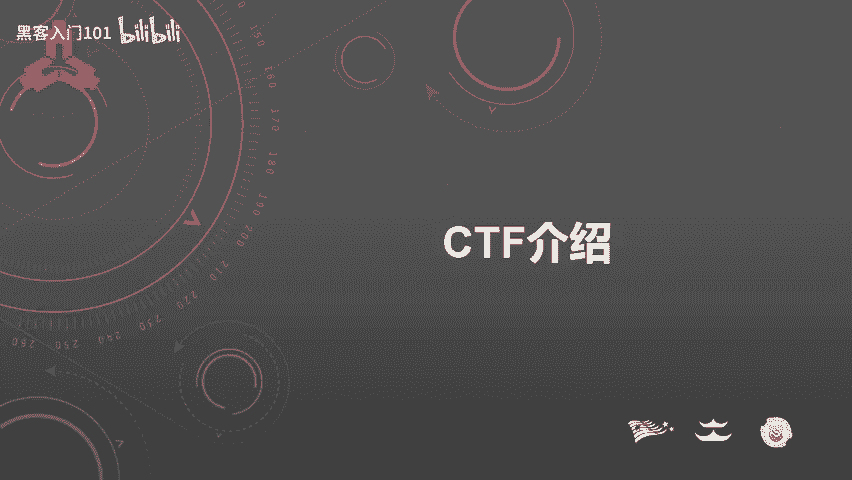
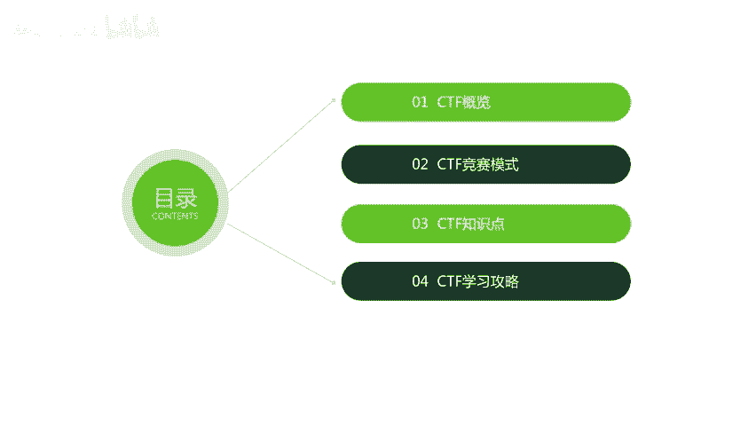
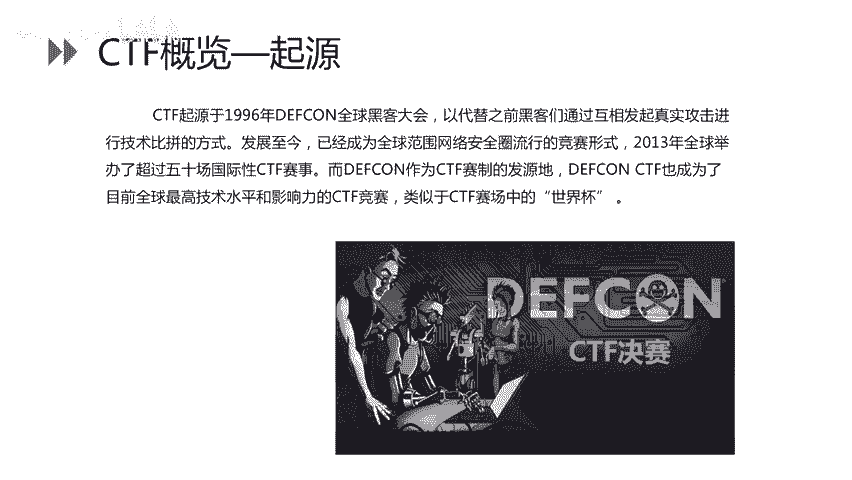
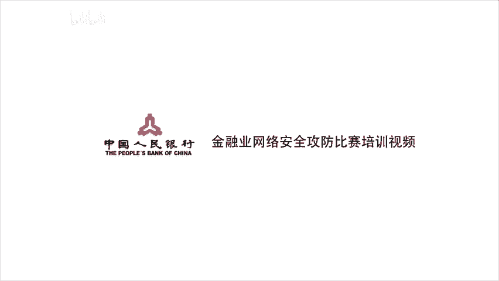

# B站最好的绿盟科技CTF夺旗赛教程 从小白入门到比赛实战 - P18：19.ctf介绍 - 黑客入门101 - BV1eeW5eJECc

大家好，本节课讲解内容是CTF介绍。

主要由CDF概览、竞赛模式、知识点以及学习攻略组成。

首先我们看一下CDF概念。CTF全称是capital flag，中文一般译作夺旗赛，在网络安全领域中指的是网络安全技术人员之间进行技术竞技的一种比赛形式。

CTF它起源的话是在1996年deapcom全球黑客大会上，以代替之前黑客们通过互相发起真实攻击进行技术比拼的方式，发展到今天，已经成为全球范围内网络安全圈流行的竞赛形式。2013年。

全球举办了超过50场国际性CTF赛事。而decom作为CTF赛季的发源地。dcomCTF也成为了目前全球最高技术水平和影响力的CTF竞赛。类似于CTF赛场中的世界杯。

下面看一下CDF竞赛的主要流程。首先，团队参赛团队之间进行攻防对抗、程序分析等形式，率先从主办方给出的比赛环境中得到一串具有一定格式的字符串或者其他内容，并将其提交给主办方，从而得得分数。为了方便称呼。

我们把这样的内容称之为flag。CDF赛事呢主要有三种模式。第一种，单兵作战主要是由理论题目、杂项、外部、PWN、逆项等各种题目组成的，由个人参赛。第二种是综合靶场。综合靶场是团队作战形式。

不同团队之间攻击相同环境的把击，主要考察外部题型。在综合靶场比赛的模式当中，只需要攻击，不需要防御。针对同一个环境。越早拿到fllaag，获取的分数越高。一台把机通常会有多个flag。

flag存放的位置呢也都比较常见，比如放在we部根目录、桌面、C盘根目录。以及系统系统跟目录。还有linuxgame目录啊，tamp目录以及home目录等等。第三种比赛模式是混战模式。

混蛋模式相比于单兵作战和综合靶场是更为复杂的一种比赛模式。对技术要求也相对较高。参赛团队既是攻击者，也是防御者。团队通过SISH进行管理靶机，并且只有外部权限。fllaag每隔几分钟是一轮。

各队呢首先拥有自己的初始分数。flag格被其他队拿到之后会被扣分，拿到其他队伍的flag会加分。另外，主办方会根据每个队伍的服务进行check。check不过会被扣分，扣除了分数。

由服务check正常的队伍均分。以上是CTF的三种比赛模式。下面来看一下CDF的知识点。CTF的知识点相对呃比较复杂，而且比较琐碎。主要是有以下几种题目。第一种，外部题型。第二种是破解题，第三种逆项。

第四种移动安全。最后一张是咋咋象。首先，外部类的题题目主要考察。注入跨赞文件上传文件包含命令执行啊代码审计等类型的题目。在破解题当中。主要是有以下几种攻击模式。第一种是攻击远程服务器的服务。

第二种会提供服务程序的二进制文件。第三种是分析漏洞并编写E叉P。第四种呢是战役出堆役出类的漏洞利用。最后一种是绕过保护机制。那么对于逆向类的题目啊，主要是破解程序的算法来得到程序当中的flag。

还有包括对抗反调试、代码混淆等等这类的技术的考核。移动安全呢主要考察选手对安卓和IIOS系统的理解。在国内比赛当中，最常见的是考察安卓系统的一个理解。CTF杂项类的题目覆盖的知识面相对较广。

且基础点较为琐碎，主要考察选手的发散思维以及综合能力。杂项类的题目主要是包括以下几几大类。电子取证编解码加解密引写、图片处理、压缩包、编程等等这类的题目。

取证主要是考察Yshark这种流量分析的工具的使用。加减密呢通常主要考核古典密码学以及现代密码学。引写主要是由图片引写。视频音写以及音频音写。另外，图片处理主要考主要使用的工具是photoshop。

同时呢这里需要选手提前了解photoshop的一些基本使用的方法。压缩包类的题目呢相对就较为复杂一些。除了暴力破解解压密码之外，同时还和还会和尹血一起去综合考核。编程类的题目是需要选手去。

比赛现场临时编写攻击的脚本，通常考核大家的编程能力。下面介绍CTF的学习攻略。在制定学习计划之前，我们需要明确各自所擅长的方向。我们是擅长外部还是擅长逆向？在明确了主攻方向之后，我们制定专属的学习计划。

下面以外b应用安全的学习的路线作为例子来进行介绍，如何去来学习入门。首先我们需要了解计算机基术的知识，比如操作系统、网络技术。以及编程能力。在了解了计算机基础之后，我们需要对外部应用有一个全面的认识。

主要是包括HTDB协议外部的开发框架以及外部安全测试。外部安全测试在CTF比赛中占据了很大的比例。大部分的外部应用类的题目都跟外部安全测试有关。因此。

选手需要提前了解外部安全测试的整体的流程以及常见的外部应用安全漏洞。除了外部应用安全，我们还需要了解数据库的一些基本操作，C后语句以及数据库如何优化。了解数据库的知识。

方便于我们做外部题型当中的CQ注入的题目。另外也是CTF学习最为关键的部分，就是刷题。刷题是通过亮面达到质变的一个过程。通过刷题，我们可以。学习到CDF当中一些固有的出题的套路。

根据CTF学习的一个路线。这里推荐大家几个。平台首先是资讯类的平台。咨询类的平台当中。叉CTF是国内举办CTF相对比较多的且质量较高的一个比赛官方。另外，练习平台当中列举了一些针对于专项的题目的练习。

比如CQ注入。叉3S。以及脚本类的题目。happ平le是属于一个综合类的一个网络安全学习平台。最后呢是介绍CDF write up。CTF write up是指CTF比赛之后，选手提交给官方的解题思路。

我们通过学习r up，可以了解到题目的解题的思路，拓展我们的发散思维。这样在比赛的时候，我们可以在看到题目，即可联想到他考察的哪个技术点。因此，通过学习rite up，我们可以了解到一个题目的解题思路。

拓宽我们的知识面。以及增加我们的提量库。以上就是关于CTF的介绍的内容，谢谢大家。

