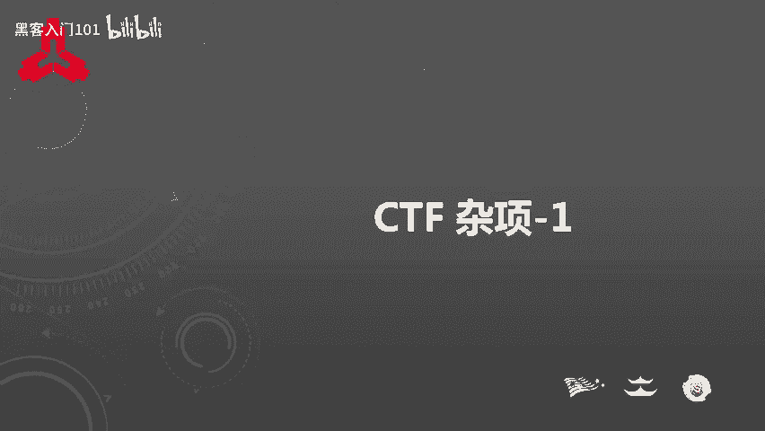
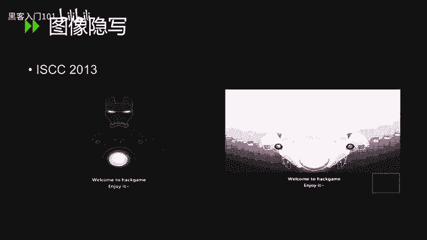
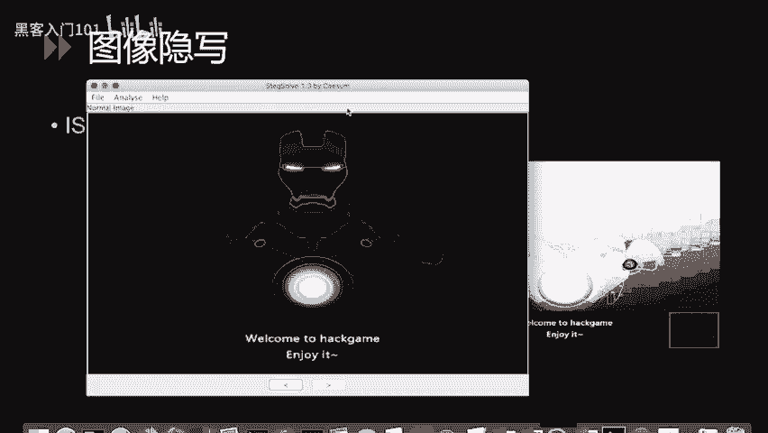
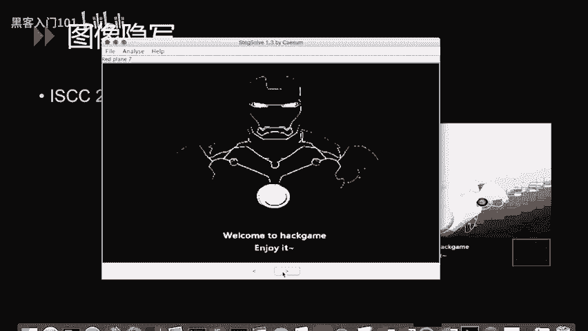
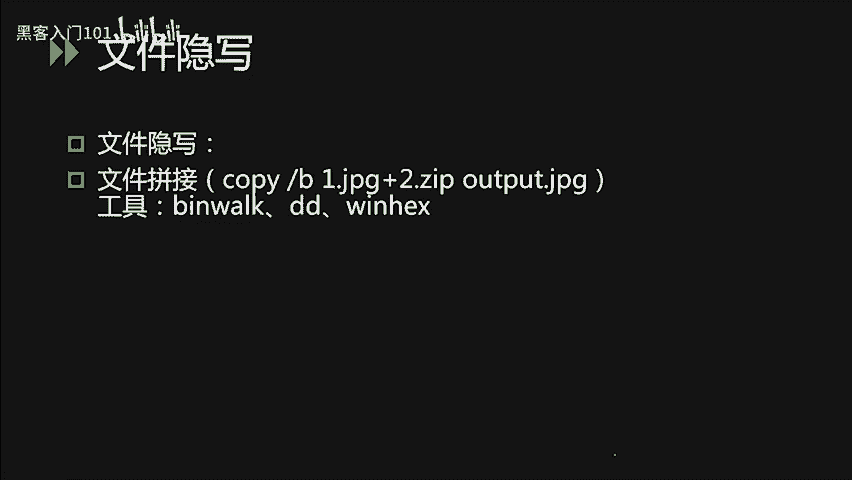
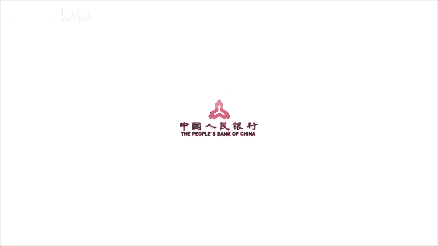

# B站最好的绿盟科技CTF夺旗赛教程 从小白入门到比赛实战 - P19：20.ctf杂项-1 - 黑客入门101 - BV1eeW5eJECc

大家好，本次课程进行引写术密码编码和杂项部分的内容讲解。明写数、密码题以及杂项题。在CTF中也占有相当大的比重。首先简单介绍一下什么是引血术。

引写术的题目呢是将CF中的flag隐藏到图片、音频或压缩包等各种各样的文件中。让参赛人员通过对各种文件格式的识别以及内容的提取来找到flag的值。密码编码相关的题目则是通过加密算法或编码算法。

将flag的值藏到一段密文中。参赛人员通过对密文解密得到正确的答案。而杂项的题目则是以上几类题目综合性的体现。我们可以将外b题、逆向题、引写题、密码题各种各样的题目综合在一起解密。

因此呢本次的课程主要针对引写术、密码编码学以及CTF取证技术进行讲解。

下面进行引写书内容讲解。引写术呢是将信息隐藏在其他载体中，不让计划的接收者之外的人获取到信息的一种技术。古时候呢，人们将以写数用在。机密信息的传递，用于战争等场景。我们在电影中经常可以看到。

间谍获取到密报之后，是一张纸，将这张纸在火上烤一下。那么就可以看到这个铭文的信息。或是将这张纸浸泡在水中，即可显示出上面写的文字。这种引写术呢是一种传统的啊基于物理方式的引写术。

而我们在CTF中遇到的音写数，大部分以。多媒体文件为载体。可以是图图片、音频、视频。压缩包文件等。此类题目的出题非常灵活，可以以任何各种各样的文件作为载体。因此，我们在本次课程的讲解中。

不可能完全枚举出各种各样的出题类型。只能对。出题的思路进行一个简单的介绍。因此，我们在本次课程中无法枚举出所有的。出题类型。我们今以几个常见的典型类型作为介绍。CTF中引写术的题目以两种类型较为常见。

一种是插入法。即将需要隐藏的消息插入。文件中的某个空白部位。例如，我们常见的图片的EXIF音写。另一种常见的方法是替换法。及通过改变原有文件中某部分的文件内容达到引写的效果。常见的图像引写。

可以分为这么几类。第一是通过细微颜色差别进行引写。比如LB一些。第二是通过GF图多帧进行隐藏，将需要引写的信息藏在了GF中的某一帧一闪而过，也有可能将其藏藏在了。很长时间后才可以显示的某一帧。

第三类呢是EXIF信息的隐藏。可以将我们的fllog值藏在图片的EXIF信息中。第四呢是图片修复的技术。这类题目会提供一个已经破损的图片文件。我们要根据各种文件文件头的构造。对图片进行修复。

首先我们来看ISB。最低有效外引险。这种引写技术呢是利用了。像素三原色的原理。我们知道显示器上显示的颜色分RJB3种颜色，R及红色。如果是一个纯红的图案，那么它的十进制位。

时间制表示的颜色值应该是255。有二进制表示则是8个一。如果我们将最后一位的一变成0。那么肉眼上是无法看出来图像颜色的差距。而实际上，最低有效位已经发生了变化。

因此呢我们可以利用这个像素的颜色值变化来进行。图像的引写。我们可以使用图像引写数解题工具stagof来解。图片图像引写相关的题目。我们这里看一个例子。曾见的一道比赛题目。

我们使用tacktop打开这个图片。

然后呢，此时只需要点击下方的箭头。查看不同通道，不同色差下的。

图像。当点击到一定程度的时候，我们即可以看到右下角隐藏的二维码。通过扫码软件对二维码进行识别，即可得到。隐藏的信息。第二种常见的引写术题目是将。flag值藏到。GF中的某一帧或很多帧中。

该类的题目呢也可以使用staxof一帧一帧的查看。我们可以在这个软件中找到。真预览的功能。当然也可以使用图像处理软件，比如photoshop之类的软件进行逐帧的查看。第三类呢是将。

fllaag值藏到图像的。EXIF信息中。照片的ESF属性可以保存大量的信息。比如说相机的厂商，相机的型号、镜头的型号等等。因此，出题人员也非常喜欢将。flag值藏到ESIF中。

此类题目的解题只需要在windows上。右机。打开图片的属性，即可看到相应的内容。还有一类图像引写的题目是需要对图片文件进行修复的。我们首先要熟悉常见图片类型，比如Jpa。

PNGJFBMP等各种类型的图片文件。它的文件头呢各有不同。我们需要对此类文件的文件头进行一个初步的认识。解决此类问题，我们需要使用16进制编辑器，比如win hacks。010editer这类软件。

只需要对文件头进行一个修复，直接打开文件即可进行查看。但以上几类引写的方式有可能重复利用，也就是一道题目中可能同时需要修复图片。又需要从修复后的图片中读取有效内容。音频内容的演写也非常有趣。

这时候我们可能需要用到音频分析软件，对音频的内容进行一个数字的分析。在这里我给大家看一个示例。我们使用音频编辑软件auion打开某道CTF的题目。我们可以看到该题目的左右声道信息有所不同。

大部分信息藏在左声道的中间部分。因此，我们可以尝试将没有隐藏信息的内容删掉。我们可以听到。除了猫的叫声，还会有一些。摩丝电码的声音，我们将右声道隐藏，将左声道的功率增大。即可看到一个较为明显的。

摩斯编码的特征值及长短长短这样的组合。你再听一下。不是。即可听到一段发电报的声音。这明显是一段摩斯电码，因此呢我们可以手动将其转为摩斯电码值，再用摩斯电码值转为。英文字母对该题目进行。解题。视频的演写。

和图像的多帧引写相似。出庭人员习惯将。flag值藏在视频的多帧中。因此呢可以使用视频编辑软件。对。引起的内容进行提取。文件的引写在CTF题目中也是较为常见的一类。通常简单的题目。

直接会使用windows下的copy刚闭命令，将两个文件拼合。比如copy杠 B将一个图片和一个z压缩包合并输出为一张图片。也就是我们所谓的图种。我们直接打开。该图片看到的仍然是图片信息。但是呢。

图片的后半部分实际上是一个zip压缩包。此类题目可以直接将。图片重名名为z跑。使用解压软件，将其打开解压即可。如果我们遇到类似题目。无法肉眼识别出来，是由哪两种文件进行拼合的？

我们可以使用lining下的。binwork命令。对其进行。查看。这个命令呢可以直接将。我们合并后的文件。拆封成多个。文件的组合。我们也可以使用16电制查看器，查看文件的特征。找到对应的特征值。

找到对应的文件头。

进行拆分。

