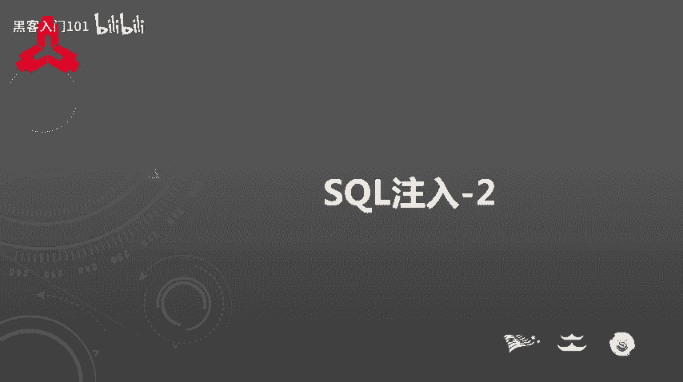
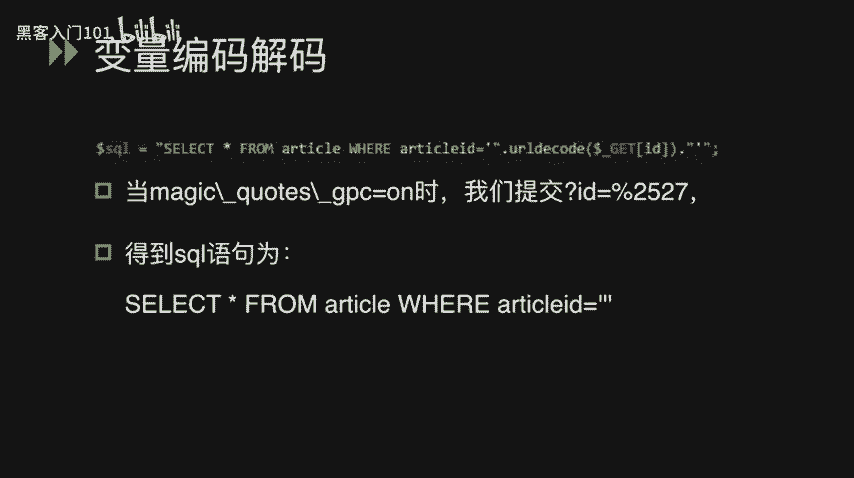
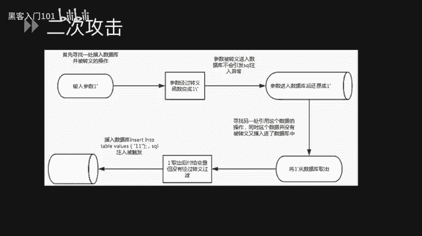
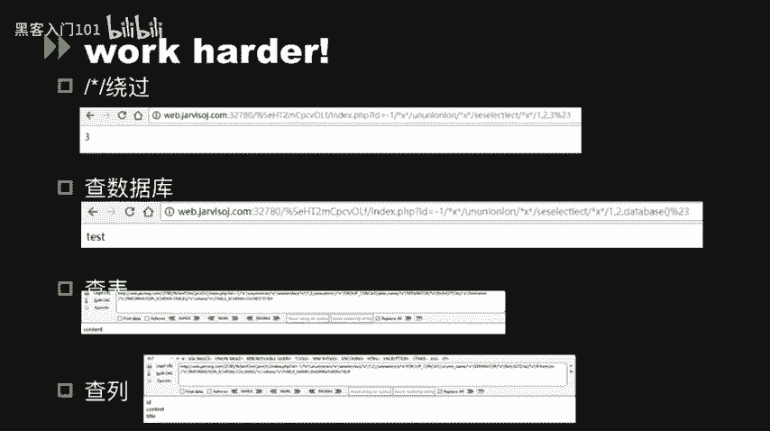
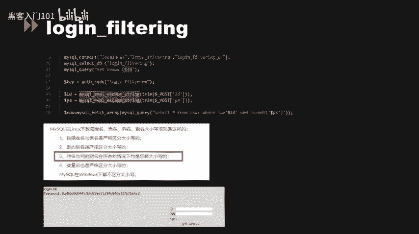

# B站最好的绿盟科技CTF夺旗赛教程 从小白入门到比赛实战 - P21：22.SQL注入_2 - 黑客入门101 - BV1eeW5eJECc

这节课给大家讲一下SQ注入在CTF当中的一些应用。

在CTF当中有几个比较关键的。PHP设置选项，其中有一个。魔术引号它的选项名称叫magic codeGPC。当这个选项被设置为on的时候。

所有的单引号、双引号、反斜线和non字符都会被自动加上一个反斜线进行转移。从原理上来讲，这和at flash函数作用完全相同。我们可以看到，如果用户输入一个反斜杠。

那么就会在这个反斜杠前面再加一个反斜杠，让这个反斜杠不起到任何的。作用而变成一个字符串。单引号也是在前面加一个反斜杠，双引号也是加一个反斜杠，浪就会变成一个反斜杠名。在小于4。2。3的PHP版本当中。

PHP这个选项是属于全部全局选项。而在4。2。3当中，已经设置为几个独有的目录选项。这选项自PHP5。3。0起开始废弃，并且将于。5。4。40请移除。那么为什么这么一个安全选项会被关闭呢？

那编程是我们认为打开该选项或者关闭该选项都会影响到。整个PHP项目的一致性。由于并不是由于每一段被转移的数据都需需要插入到数据库当中。如果所有进入PHP的数据都会被转移的话，那么对程序执行的效率。

就会产生一定的影响。那么由于不是所有的数据都需要转移。那么在不需要转移的地方，看到转移的数据就可能会。导致我们一些误判。呃比如说通过表单发送邮件，结果我们会看到一大堆的斜杠加上单引号。那么针对这种问题。

可以使用s strip slashes函数进行处理。那stret slashes参数实际上就是F slashes函数的解码方式。那我们可以看到，在GBC这个安全选选项当中，其实它也存在一定的缺陷。

他对于servver的。均变量可能会有一定的影响。导致很多类似于IPre等一些漏洞，比如chfi注入。就能够被利用。

我们可以通过get ENV这个函数去读取当前PHD环境是否开启了magic codeGPC。而且在HTProll post data当中，我们也经常看到该选项的应用。

主要应用在sso查秒RPC web publishlish功能当中，我们可以直接通过查找字符HT Bro past data或者PH input。我们看到demo里面。

我们HTB real post data这么一个变量，获取到了一个po数提交上来的数据。而这个数据往往就会先经过magic codeGPC做一层转移，然后才会。放给PHB应用代码进行执行。

在maticical GPC，我们也可以在in limit order by go by等数据库操作容易忘记的地方。进行转移。我们可以看到在第十二行的demo。里咩。在。

硬命令做对UDIUIDS这个变量进行操作的时候，往往UIDS就会。使用min quarterGPC做一些转移。那我们这边就会谈到一个变量解编码解码的问题。刚刚已经说过了，triip slashes。

这个其实就是对ad slashes的一个decode的一个模式。那除了striep slashes和ed slashes这么一个对应关系以外。PSP当中还存在一些其他的自动串转换函数的对应关系。

比如说be斯64，还是be64decode。bth en和be deco是针对数据的一个be64解码和编码的一个不同的。函数。

还有rURLdecode和rURLincode是对URL编码解码的一个对应函数。URL decocodeUL in和rURL deco rowURL in是差差不多的。

最后还有一个unsealize和seize序列化和反序列化。在变量编码解码的时候，往往就会存在一系列的问题。就比如说我们之前说过的。二次编码注入。我们可以看到在这边有一个SQ语句。

select新 from article where article ID。然后拼接上了一个从用户输入的。ID参数这个ID参数会使用URLdecode做一层解码。但是千万不要忘了。

我们这边在PHP全局里面已经开启了mic code。GPC这个时候开启了GPC以后。我们输入的ID如果包含。这个单引号的话就会做一层转移。也就是说和我们之前遇到的那个问题一样，它会先做一层转移。

然后再做一层URL解码。那么这个时候我们只要对ID参数输入1个百分号2527。那这个时候。就会。绕过magic colorsGPC的安全限制，因为它并没有在。百分2252记名查到敏感函数，敏感字符。

那这个时候2527%到达了URL抵code的函数以后，会做一次URU解码，也就是2527会变成27%，从而将单引号逃逸出来。

二次攻击二次攻击和二次解码攻击是不一样的概念。我们看一下二次攻击的业务逻辑过程。首先，寻找到一处插入数据库，并进行转移的操作。那么我们输入参数一单引号。那这个时候由于转页存在。

那一单引号就会变成一斜杠单引号。参数被转移后，进入数据库不会引发SQ注入异常。那这个时候参数进入数据库，库后会做一次解码，还原成一单引号。

那我们就要看在整个PHE应用当中是否还存在另外一个地方会引用这个数据的操作。我们会将这个一代引号重新再引用出来，取出数据库。付给变量，这个时候一单引行是没有做任何的转移处理过滤。

那这个时候就会引发我们的SQ注入漏洞。

其实说白了整个的过程就是数据库出来的变量没有进行过滤。所以说这种转移。是失败的。那么SQl和oracle的转移字符同样是反斜杠，提交单引号，通过魔术引号变成反斜杠单引号。

那通过当update进入数据库时，再通过反转移重新变为单引号。MSQ的转移字符为单引号，提交单引号，通过魔术字符变成反斜杠单引号。MSQ会直接把它当做一个字符串进行直接处理。

魔术引号往往会带来一些新型的攻击。反斜杠符号不仅仅是一个转移符号，在window下面，反斜杠和斜杠的作用是一样的，它也是一个目录跳转的一个符号。这个特点可能会导致PH应用当中会产生一些非常有意思的漏洞。

也就是说，当你使用magic codeGPC或者用ad slashes这些按键函数对。输用户输入进行。转移的时候，其实你这个时候已经为它加上了一层目录跳转的符号。可能为之后的。目录跳转。做了一层便利。

那么魔术以后还会带来一些新的问题。我们看一下这个demo。这个demo当中有一个变量order SN。获取了一个从用户输入的orSN参数。这个参数值获去以后，用sub stream截取函数。

截取了第一个字符。但是这个时候我们开启了全局的magic code gBC。那这个时候截取的第一个字母也就是反斜杠字符。我们将这个older SN变量注入到下面的SQU语句当中，我们可以看得到。

where order SN就会等于一个单引号，反斜杠单引号，然后and order TN单引号。这个时候。我们只要将oldder T n注入为我们的SQ注入payload。

这个时候你们就可以达成我们的SQ注入。攻击。因为。在前面order SN这个变量的时候，它的后面那个单引号已经被我们的反斜杠转移了。所以说我们的单引号已经被我们逃一出来，我们就可以通过这样的方式。

注入新的。SQ语句。magic coderon timeron time和GP4的区别在于run time是从数据库或者文件中取出的数据进行转移。也就是说我们刚刚的二次攻击的第二个环节。

从数据库中提取数据的时候会做一层转移。所以说这个对二次攻击来说是一层比较完美的解决方案。但是由于如果使用不恰当的话，也可能会造成一定的问题。就所以说magic code strong time这个函数。

只会对例如fiF getsF read my secure。Fasher area等。很多数据库查询和文件读取的函数会产生一定的影响。这个函数还有个别名叫sd magic code的状态。

这个函数于PHP5。3。0起被弃用，不推荐使用。在7。0的时候正式移除了该选项。最后还有一个magic code。base cb和GP4的区别在于Cinb只会转移控制服，就是将。单引号转为双引号。

并且这个配置如果处于on的状态的时候，就会覆盖magic colorGPC的配置。但是仍然会服从于exlashes和 striplashes的函数配置。这个函数同这个选项同时与5。3。0被弃用。

不推荐使用。在5。4。0的时候也移除了这个选项。我们接下来讲三道SQ注的题目。第一道题我们可以看到呃。给出了一个。URL我们看URU，然后看源代码，看到一个hit。要求我们去访问index点PHPS。

然后我们去访问index点PHPS发现呃有源代码。这个时候源代码经过分析以后，我们看到呃在横框框的地方，也就是说我们要具体去绕过的一个。S判断语句。我们主要去绕过这个条件判断。比较简单的是。

我们可以用这个PHP input去绕过这个。变亮 data塔。呃，也可以用这个EREGI这个函数用截段去绕过接下来的这个。哦，我们主要是绕过这个条件判断，那变量data可以用PHE input的绕过。

那EREGI这边也用到了一个截段绕过，我们这边不详细描述。好，接下来我们就可以拿到一个。简单的。Hinter。然后我们去访问这个对应的路径。访问路径以后，我们可以看得到这边存在1个SQ注入。

然后我们进行。不停的fas查询，发现这边。对空格做了一些过滤，我们这边可以用。注释符的方式进行绕过。我们通过帮把所有的注释符全部改成。斜杠星号星号斜杠就可以。进行SQ注入了。通过。查数据库，然后查表。

然后查列的方式，挨个读到最后的flag文件。

最后我们可以当到数据库，拿到最后的flag。呃，接下来第二道s skill注主题，我们看到这边源代码里面。用了mysq real escape stream。也就是说这边用到了一个宽捷注入漏洞。

那宽捷注入漏洞我们也可以使用我们之前说的那种。通过百分号。的方式来将我们的。单引号拷译出来，但我们也可以用比较自动化的方式。比如说用SQ map的。

tber脚本onmetric code这么一个脚本进行自动化注入。呃，第三道SQ注入题，我们可以看到这边同样使用了myq real escape stream这个函数。但是我们看到第21行代码上。

它将全局的磁符集设置为了UTF8，所以说这边不能使用。这个宽字节注入。我们对mascular real escape。Stream。还是要做一层绕过。那这边怎么绕过呢？经过。

搜索我们发现myQ在linux下面。数据库名表明列名别名大小写规则是这样的。这边有一个关键的规则，就是列名与列的别名所有的情况下都是忽略大小写的。而我们的用户名和密码。正好是我们的列名数据。

那我们这个时候只要通过输入。大有写。绕过的方式就可以正确的绕过这个登录框，获取我们到最后的key，我们的flag。

