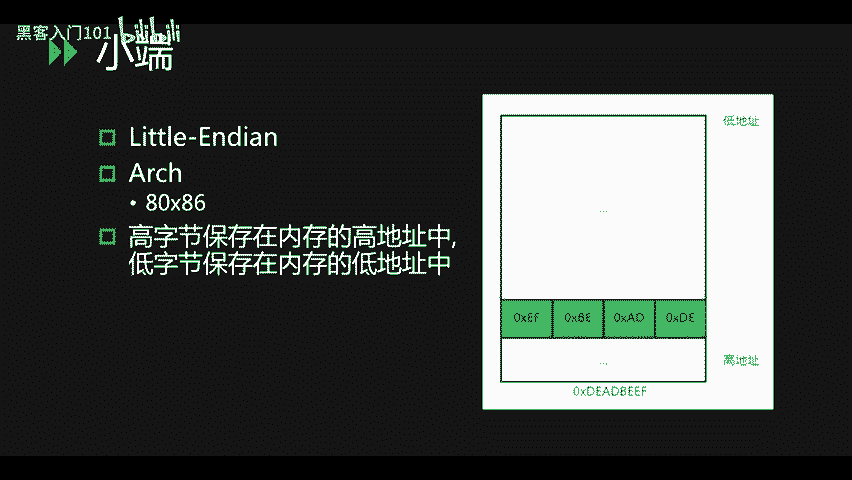
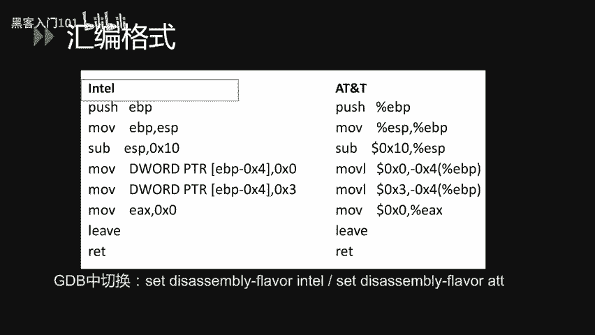
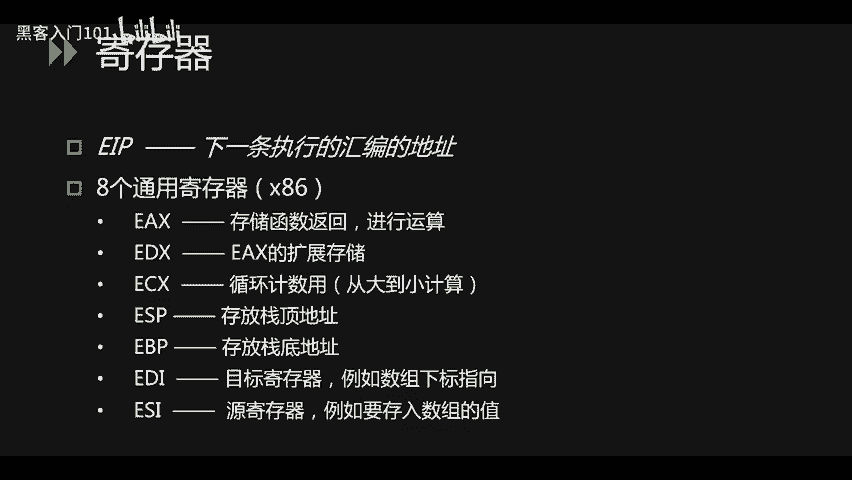
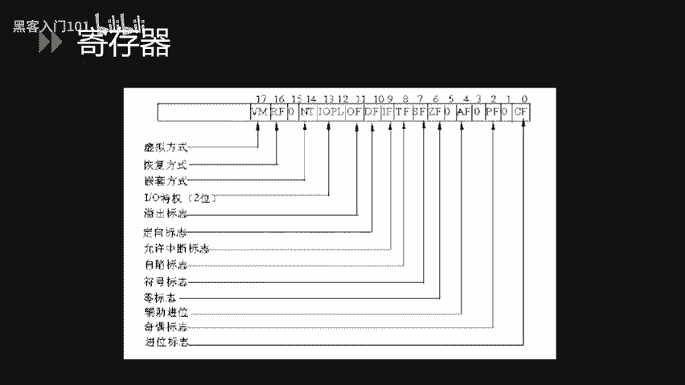
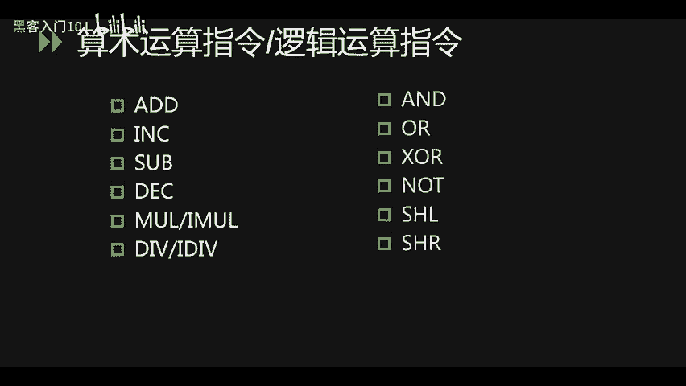
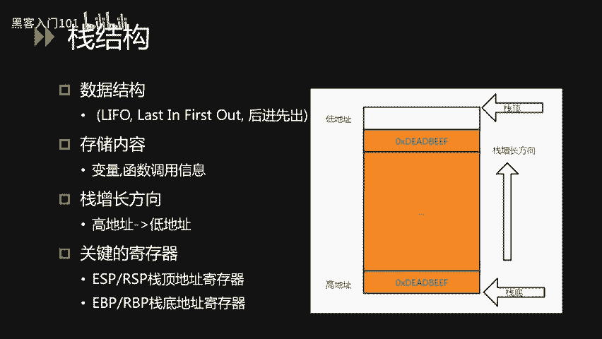
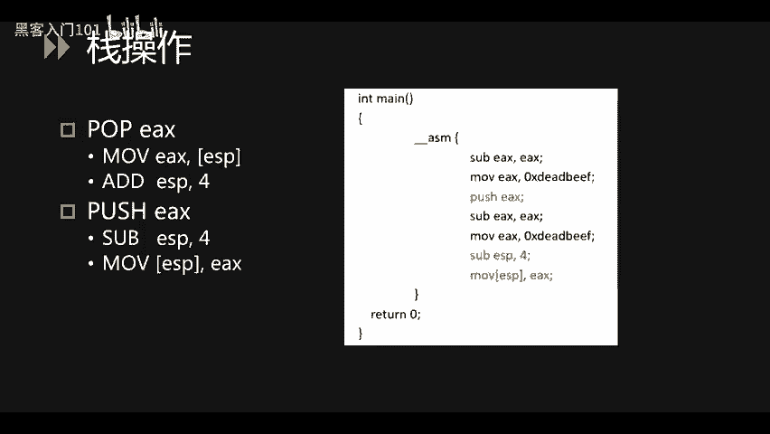
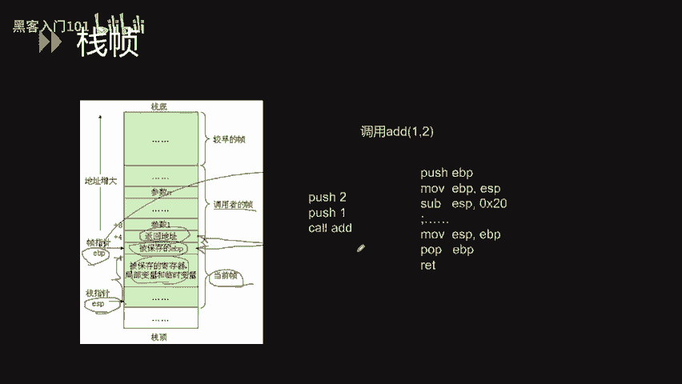

# B站最好的绿盟科技CTF夺旗赛教程 从小白入门到比赛实战 - P30：32.二进制_1 - 黑客入门101 - BV1eeW5eJECc

大家好，今天我们来学习一下GTF中二定制相关的两个知识，一个是revering，一个是preversing就是所谓的内向工程。p就是所谓的软件都动利用。

整个PPT分为两部分，第一部分为vering。比我想包括了4个方四个小节。第一个小结。汇编语言基础第二个小节，逆向工程工具的使用。第三个小节C语言逆向。第四个小节安全逆项。然后。哼。

包括了一个小节战一出。我们首先来聊一下ing好，using就是所谓的立项工程，它涉及到windows、linux、安卓、多个平台等多种编程技术。我们需要对源码啊，甚至更多的是二进制文件进行逆向分析。

得到它的算法，然后从算法得到fag。A象工程的难点主要在于汇编语言比较复杂，不像我们平常的C语言，C加加C语言，还有java这种这么容易。阅读。加密算法复杂加密算法复杂。

它包含了啊我们平常简单的facese64呃XOR甚至是啊我们AES对称加密ISA非对称加密等算法。然后还有就是反调式代码混淆等等。这些。阻碍我们去进行一个调试的一些。白路虎。最后就是心腹气灶病力不足。

我们面对这上面的这么复杂的内容啊，可能会造。会有一点心不气躁呃，造成我们没有办法全身心的投入去分析我们的算法。然后我们首先来说一下啊汇编语言基础。

我们平常使用的电脑基本上都可以把归为小端电脑。小众电脑呢啊。它是一个高字节保存在内存的高地址里面，低字节保存在内存的低地址里面的一个啊架构。我们来看右边这幅图。

好de beef这四个字节在低地值里面存存储了0叉EF。这一个。第一次节。然后在高地址。里面就存了0叉DE这一个高字节。看起来其实是像一个啊导过来的一个顺序。

然，我们来说一下外编格式，汇编格式。分边格式分为两种。intelATNT这是我们常见的。然后啊。这两种。格式的区别在于A。ATNT可以看到很多百分号，还有多了符号。然后intel尔里面呢则是没有的。

我们也可以看到啊。对比一下英特尔的 moveEBPESP还有ATNT的 moveESPEBP其实这两个是相等的一个语句。然后。啊，在intel中，EBP是一个。目标地址ESP是一个原地址。

而ATNT里面ESP是一个原地址，然后EBP是一个目标地址。然这样子的话就表示着这两个内容其实是啊在表示上面是。顺序是不一致的。然后再啊JAD。GB中。

因为我们在linux里面啊通常使用ATNT去作为一个表示方式。然后在GDB调试的时候，就可以使用stic assembly flavor intel去把它啊转换成为啊intel格式去查看。

然后啊我们在windows里面呢啊通常都会接触到intel会比较多。啊。然后接下来我们就会用intel格式去作为一个讲解。

首先我们来说一下继存器。呃，会编语里面有很多计存器，然后我们并不需要所有都记入啊，下面就说一下我们常见的一些计存器。第一个EIP。它保存的是下一条执行的汇编的一个地址。然后8个通用计存器。

我们是拿啊X86就是32位的系统来举例。第1个EX。DS存储函数返回，然后也可以作为一个运算的一个计存器。然后EDS呢在DS作为运算计存器的时候啊，进行扩展存储。然ECX是一个循环计术的一个啊存计存器。

例如我们要循环12次的时候，我们就会把12放到这1个ECX里面啊，当然是12的16进制，放到ECX里面，然后进行一个啊。从大到小呃计计算，每一次循环都将12都将这1个E6里面的值进行一个啊递减。

直到零为止，然后ESP呢就存放了站点的位置。站点的位置，然后EBP存放了站点的位置。EBI是一个目标集成器啊，例如鼠标啊，数组下下标的那个啊。指向，然后ESI呢就是一个原计算器，例如要存入数组的一个值。

另外的话还有一个叫做标志计存器。标志计存器它把它自身分为很多个。啊，很多个位，然后每一个位它都有不同的作用，用来标志一些东西。像我们常用的一些是啊溢出标志，然后还有啊零标志。

进位标志等等。还要说一下数据传输指令。数据传输指令包括了啊move push pop testELEA等等。move是我们最常见的一个命令。move EAXYPTR。EVP加8这一个就是啊将EVP加8。

所指向的那个内存中的一个字节放到ES里面。放到EX里面，然后。呃，bePDR指的是一个字节。我们可以看到右边其实有啊bPDRwordPDRDwordPDRQwordPDR。分别代表了一个字节。

两个字节、四个字节，还有8个字节。然后啊在我们32位的系统里面，de word word还有bke会比较常见。然后在64位系统里面。啊，Qword也是常见的。然后是push，还有push AD啊。

push呢就是把一个值啊存放到。站里面站里面去存放到站零里面去啊，然后啊pushAD呢就是把所有继存器的值。把所有继存器的值放到那个啊站里面去，站点里面去。

然后pop呢就是把站点的值放到某一个计存器里面。pop AD就是把一系列的值分别放到啊我们的计存器中。然后下面就是test，还有CMP这两个是对比命令啊，就是我们平。平常去对比一是否等于2啊。

这种其实都可以用test还有CMP去进行一个计算。这两个这两个指命令指令它会啊影响到啊标志。计存器里面的啊零标志位。以此来进行一个判断。然后LEA呢其实这一个是获取地址的一个命令。

LEAEX0叉ABCD这一个其实是将ABCD啊所对应的内存的地址放到EX里面。接下来说一下程序的跳转指令。程序跳转指令包括无。无条件转移，还有有条件转移，无条件转移啊类似于jump啊。

就是无论如何它都会跳转的。然后还有一个coll，还有weturn一turn n。那我们来说一下returnreturn这一个呢啊其实它相相当于popEEIP它其实就是把啊。

站所指向的站顶所指向的那个值啊，放到EIP里面。我们要知道EIP就是下一条要执行的啊推编语言。会变指令，然后这一个其实就是啊改变EIP的一个操作。然后呃通常return上面IT上面呢。

它会有一个另外一条指令叫做live。在li，然后这个lift呢相当于两个两个指令，一个是呃moESP然后EBP。啊，另外一个是topopEBP。按顺序来操作这两个指令按顺序来操作。

其实就是一个啊将站回收的一个。好。操作里面的一个步骤。接下来就是说条件有条件转移。追 conditiondition我们看到啊追剧追NLLE这种啊其实都是一个有条件转移，它是像追剧就是一个大于转移啊。

我们来看一下啊，J其实就相当于正。G相当于greater，然后N相当于notL相当于less一相当于eal。这个相等。大家也可以从啊上面的那种形式去判断这一个指令到底是什么意思。

在汇编里面啊有算术啊运算指令，还有逻辑运算指令。算术运运算指令包括了我们的加减乘除。然后在我们的那个啊逻辑运算呢，就包括了我们的和或异或非。啊，逻辑。逻体左移，然后逻辑右移啊这种。运算。

然后啊我们来说一下，在算术运算里面，ink还有DEX啊。啊，ink呢其实是一个啊递加递增的一个。指令相当于啊加一，然后dck呢就是一个递减的指令，相当于减1。然后啊旁边就右边的就是我们所谓的逻辑运算。

像NO。XOR这种啊，其实就是我们。啊，在加减密里面可能讲过了一个啊逻辑运算的一个。

啊。的一种。接下来我们讲解一下我们程序中的逻辑代码，在汇编中的表现形式。首先我们来说一下if条件判断。if条件中，我们的代码里面有一。第一个判断是C大于0，并且C小于10的时候就。

打印出C大于0这个字符差。我们来看汇编代码中。会将C跟零进行一个大小比较。然后如果。它是小于零的话。就会执行到。4411A81H的那个地址里面的内容。然后如果说再进行一个比较它如果大于10的话。

它又会跳转到方程的61方程加61H，也就是上面411A81H的那个地址里面去。然后如果说我这两个条件。都判定不成功，它其实就是C大于0，并且C小于10就会继续执行下面的语句。

将C大于零这一个字符串 push取到站里面。然后再coll一个coll调用一个printF去打印C大于0这个字不串。然后进行一个。ESP加4EP加4这一块，我们会放到把后面去讲。

然后这里其实稍稍微提一句，就是这一个东西，其实就是把C大于零这一个内容给。错诶。给抛弃掉。然，我们来说一下for循环。for循环。嗯。我们这边是循环5十次，并将CR加上这一个循环的次数。

然后我们来看会员代码。首先我们会将。零负值给I，然后跳转跳转到13行，13行里面我们就是一个呃循环循环体里面的操作，就是C等于C加I这一个操作。然后再执行完循环体内的操作之后，我们再进。

再跳回到上面去进行一个I等。加加I的一个操作，然后再去判断I是否小于50。如果I大于等于50的话，它就会跳转到方程加4AH的一个位置去进行代码的执行。对 do while我循环。

我们首先会进行一个循环体的执行，然后再去判断是否。小于100。如果说小100的话，它就会跳到第二行我们的循环体中继续去执行。如果不。如果大于等于100的话，它就会执行下去。

而不会执进行一个啊往上的一个跳转。Yeah。对外耳循环，它首先会进行一个对比，判断C是。是否小于100？如果小于100的话，ZGE将不会执行。然后呃它就会执行下面的循环体。如果大于100的话。

它将执行啊JGE跳出循环。在执行完循环体的时候啊，会有一个帐会表。证把我们的流程证到我们的啊对比里面去。然后再进行一个下一次的循环体制性，这就是Y耳循环。

接下来我们说一下栈结构，栈结构是一个内存中里面的内存里面的结构。然后数据它的数据结构是一个后进先出的一个。一个原理。然后呢啊存储的内容包括了变量函数调用信息等等。站的方向是从内存的高地址。

向内存的低地址去扩展的。关键的计存器包括那么几个ESPEBP就是在32位系统里面的RSPBP都是在64位系统里面的ESPRSP存储的是占点的位置啊，然后EBPBP存储的是站底的位置。

跟站相关的两个操作，hop还pushhohopEX的话，其实相当于两个两个指令。第一条moveESESP其实就是将ESP所指向的内存地址里面的值放到ES计算器里面。

然后adESP4其实就是将啊ESP往占底方向移4个字节，其实就是我们32位啊系统里面。啊，移的4个字节，然后啊就是他移动的EP。相当于我ESP原本啊原本ESP所指向的内存。

其实那个啊内容其实是没有变化的。它只是在po之后，把这一个呃ESP的指针往下移了一下。网站理约一下，然后pushEX的话啊，其实就是一个压战的一个呃操作。将ES里面的值放到内存里面去。

它所做的其实也分为两步。第一步是将ESP啊往上网站顶移啊44个字节，然后开辟出一个啊存储的32位的存储空间，然后在move啊EAX。将EX的值啊存放到ESP刚才新增的新建的1个32位的一个地址空间里面。

32位的空间里面去。也就是ESP所指向的一个位置。Yeah。

说到战，我们得说一下战争。战争是用来记录调用过程的，它是它也是一个后进先出的一个过程。然后在叉86里面站会存储参数，然后并返并将返回值放到EX里面去。所有的内容只会被覆盖啊。

战争的移动不会啊改变战争里面的内容，像刚才所说的pEX。然后叉8664就说64位系统里面。参数。会依次存放在RDIRCIRDXRCXR8R9中。然后如果参数超过6个的话，才会存储到啊站上。

返回值会放到IS里面。当然它的值也会也只是会被覆盖，而不会啊因为战争的移动去改变。我们可以看到右边这幅图，它保存了调用者信息，还有当前当前帧的一个信息。包括了参数返回地址，还有EBP就是我们的原有占地。

然后啊还有我们当前帧的一些计存器啊，局部变量、临时变量等等。

我们来用一个。调用说明一下啊战争。首先，假设调用ad。12它其实就是将一跟二进行一个。啊，进行一个。参加，然后首先会push一个2，然后push一个一是从将参数从右往左进行一个依次压入站中。

所以二是存放在啊离站点较近的一个地方，它的地址它的内存的地址是相对来相对来说是较大比较大的，一是离站顶更近的地方，它的那个内存啊，内存地址是相对来说是比较小的。然后我们再靠ll。哎。艾的时候。

会将下code下一条指令的地址存放到。啊，战中。这个地址就会存放到返回地址里面。也就是在一。更低地更低地址的一个内存里面去。你比如说这里。然后再进入艾之后。会发现函数开头会存在这么几个指令。

第一个pushEBP会将原有的啊EBP进行一个保存。原有的EVP就是调用者的EBP进行一个保存，放到内存里面去。也就是。返回地址小四位的一个。把，一个内存来，然后。再进行1个moveBBPESP。

这因为我EBP原有的EBP已经保存了，然后我EBP就可以换成现在的ESP。你是换成一个新的占比，换一个新的占比。就是当前真的一个占比了。然后这一个占比呢就指向了刚才被保存的EBP。EP里面。的一个地址。

接下来就是sbEP0叉20。就会将原本也是指向被保存EBP的1个ESP。往低地址移动0叉20个内存，0叉20个字节。的一个内存，然后就。啊，相当于扩展出来啊一片。这一片。所谓的占的空间。然后我再我们在。

这个快站里面的空间我们就会啊保存。我们的继存器保存的可保存继存器，还有局部变量，还有临时变量这些内容。然后再退出函数的时候，又会有3个。啊，这样的指令。进行一个这样的还原。再的还原。

首先moveESPEVP。就是将ESP重新回到被保存EEBP的那个地址里面。然后我们泡1个EBP就是把我们ESP所指向的内容，就是被保存的EBP重新放到EBP里面，然后就变。EP这时候就变回调用者。

的那个原有的EVP，然后我们再进行we。we的话啊就是将这一个。返回时放到EIP，然后下面我们就会执行这一条语句。

完成整一个调用过程。