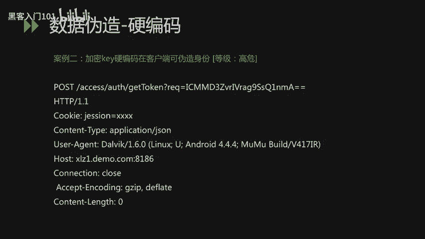
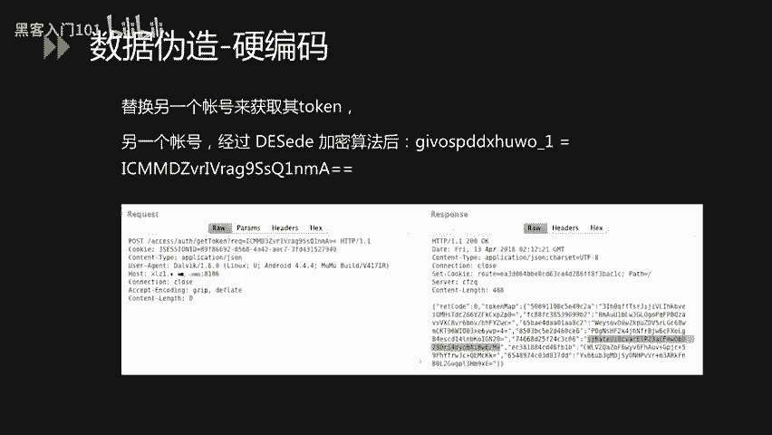
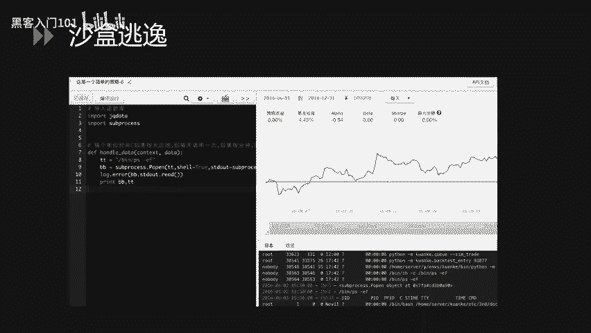
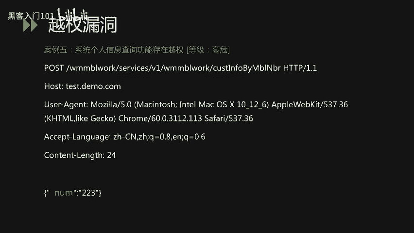
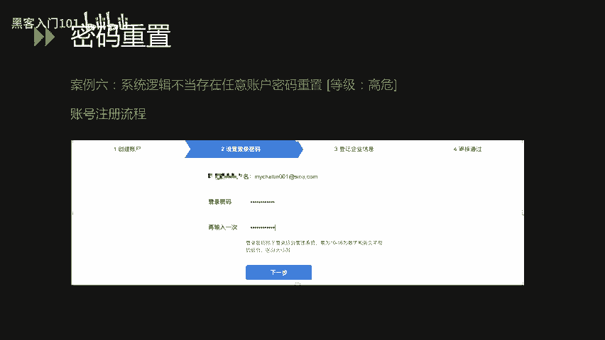
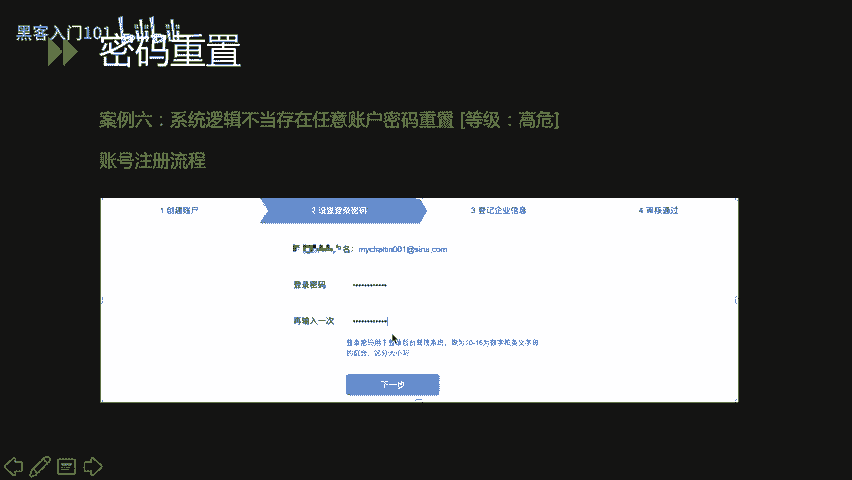
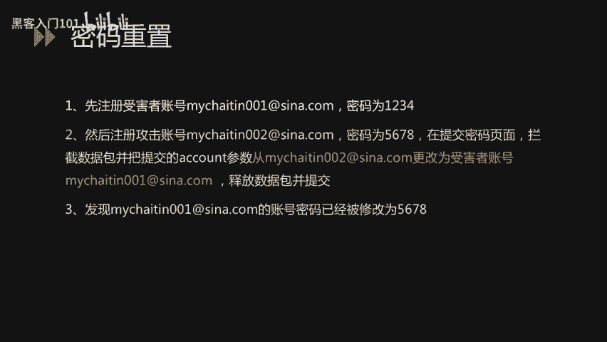
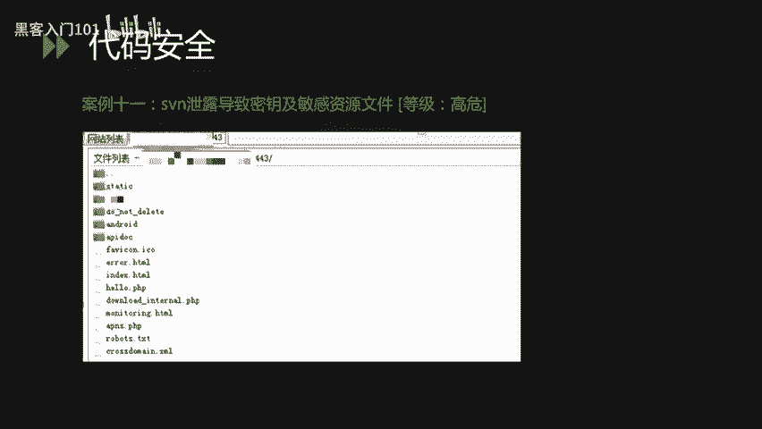
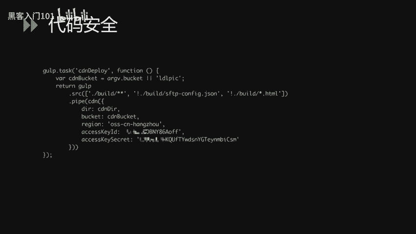
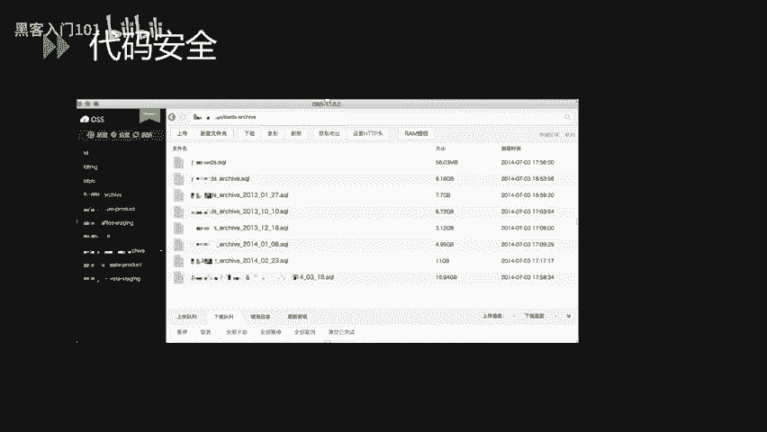

# B站最好的绿盟科技CTF夺旗赛教程 从小白入门到比赛实战 - P32：34.金融业网络安全攻防案例剖析 - 黑客入门101 - BV1eeW5eJECc

那接下来我给大家介绍一下金融业网络安全攻防过程中的一些实际的案例剖析。

首先，在所有的网络攻击过程中，都主要包含以下四类漏洞。那第一类是应用层漏洞，第二类是业务逻辑层漏洞。第三类是安全运维层漏洞。第四类是安全意识层漏洞。

那本章所讲的内容也是根据这四部分进行了一个要详细的一个描述。首先我们介绍一下第一部分应用层楼中。那应用层漏洞主要包括OSOStop10里边所介绍的，比如说社故注入漏洞。XSS漏栋。CSRF漏洞。

SSRF漏洞以及文件操作命令执行等这一系列的漏洞。那业务逻辑安全漏洞里边包括越权漏洞、身份认证缺陷漏洞。嗯，常见的逻辑漏洞。比如密码重置等等这一系列的安全问题。那安全运维漏洞主要由于安全运维人员在。

工作过程中的一些操作不当或者安全意识不足导致的一些安全问题。啊，比如说呃软件版本没有及时到及时更新到最新的一个状态啊，有些操作系统可能没有打补丁。那还有可能是一些系统配置不当导致的一些应改信息泄露。

那这一类漏洞，我们把它归结为安全运营不当导致的嗯安全隐患。那第四类安全意识不足。那这个从字面意识我们也可以理解啊，就是人的就是在工作过程中人员安全意识不足导致的一个嗯安全隐患。

那比如说使用了一些通用的密码啊，比如说会点击一些钓鱼邮件或者钓鱼链接。然后再有就是在机密文件的保存过程中，没有一个很好的安全意识，导致这种敏感的或者机密的一些信息泄露。啊，接下来我们。

把这四部分依次详细的进行一个讲解。那应用层漏洞这块主要介绍以下四部分。第来是10个钟右闹钟。啊，第二类是数据伪造。第三类是沙盒逃逸啊，第四类是文件上传。那针对这四种类型的漏洞。

我们分别会举出一个实际的案例给大家介绍。首先在案例一里边是一个嗯是某个系统的一个servcle server的一个注入。那这个注入的后果除了能获取一些敏感的数据外。

还能通过像操作系统写一些文件达到geel的一个目的。大家可以先观察这个数据包。那在这个pos的文件里边，在在这个pos的数据包里边，我们可以看到在UID等于一后边我们加入了一个单引号，那程序就报会报错。

那我们初步判断这个地方可能存在一个注入。那我们经过一系列的尝试，我们在使用了一个类型转换的一个函数，convert函数，将数据库里边的user参数转化为user参数转化为int。那user参数。

它其实是一个叉类型的一个嗯参数。那当转化为int的时候，它可能会报错。那当我们把这个字符串啊，把这个数把这个字符串组合在数据包里面发给后端进行处理的时候，我们可以在下面这张图里也看到那程序。报错。

那我们知道他已经执行了我们。提交的这个circle语句那。我们可以看到提示信息将叉转化为int的时候失败。那我们可以断定这个地方有一个设合注入。那经过我们一系列的测试，我们发现这。

当前这个my circlel的权限是SA权限，也就是最高数据库的最高权限。同时呢然后它还支持un查询。然后呃操作系统的用户的权限是stem权限。

而且它而且当前这个数据库它开了一个啊circle server的特性是叉BCMDC。那它开了这一个函数之后，那我们就可以通过这个注入点执行一些系统命令。我们观察这个数据包里边。

我们将刚才嗯eer转化为int的这一个呃这个操作的逻辑改为用E叉用叉PCMc执行一个ho外卖的一个操作。然后我们把叉PCMC执行呼MI之后的结果输出到了呃外部目录下边的1个TIT文件里边。

那我们发包之后发现。成功写入了一。成功将执行后的结果写入了这个TIT文件里边。那我们去访问这个文件发现。这里已经成功写入了一个啊当前操作系统的一个权权限的一个用户。那我们回顾这个。漏洞我们发现。

那这通过这个社Q输入，我们不仅可以获取数据，还可以直接获取操作系统的权限。那讲完这个案例之后，我们再来介绍一下，就是什么是社会注入。那社会注入是指。通过构造特殊的输入作为参数传给后端的外部程序。

进而执行攻击者所要操作的一些逻辑。然在用户输入。在对用户输入没有进行过滤的情况下，就会发生这种形式的注入输入类型的攻击，这样就会导致应用程序的终端用户对数据库上的语句实施一些操作。那根据注入的类型不同。

我们把社会注入也分为了不同的种类。比如说呃呃字符型注入，还有数字型注入。那事故注入的危害主要表现在对数据库的一个信息窃取。那在某些条件下，还可以被攻击者写入一些恶意的文件，造成操作系统权限丢失。

那就像我们现在提到的这个案例，它不仅可以获取操作系统里面的数据，还可以执行一些写入的一些操作，达到getel的一个目的。

那似乎逐步形成的原因主要是开发人员在开发过程中没有严格审核客户端传给数据传给服务器的一个参数的类型啊，同时，该参数被当做一些逻辑语句进行执行。啊，当采用字符串拼接的方式执行语句的时候。

攻击者就有机会在参数中插入一些恶意的社购查询语句，达到一个攻击的目的。那事会居入漏洞也是发生频率非常高的一类漏洞。那嗯接下来一个案例里面，我们讲一下呃。数据伪造。那。除了常见的这种身份伪造的话。

我们现在嗯还发现在很多的这个企业里边都会存在一类漏洞。就是。它的加密算法可以被窃取，切除了加密算法被窃取，还有就是加密的一些密钥，其实也可以被轻易的拿到。那大家可以看这个案例里边。

大家可以现在观察一下这个数据包。那我们看到这个是一个普普通通的数据包，包括一些嗯host，包括一些urura agentent。那这样那唯一不同的是我们可以看到在这个方法。

在这个链接里边有一个方法是get token的一个方法。那这个方法将IEQ这个参数的值传传给get token嗯方法之后，它会经过一系列的嗯处理，然后返回给当前生成当前用户的token，并返回回来。

那我们在测试过程中发现呃这发现了IEQ这一个加密的密文之后，我们猜测它有两种可能，一种可能是啊贝斯64的一个编码。那另外还有一种可能可能是戴s加密算法。那什么是戴斯加密呢？啊戴斯加密。

它是一种蜜月加密算法，是1977年被美国联邦政府国家标准局确定为联邦资料处理标准的一个算法，并授权在了非。密集政府通信中使用。那随后呢，该算法在国际上广泛流传开来啊。

代子设计过程中使用了分组密码设计的两个原则啊，一个是混淆，一个是扩散。其目的是抗击敌手对密码系统的一个统计分析啊，混淆试试密文的统计特征与蜜月的曲值之间的关系尽可能复杂化。一是蜜月以铭文的方式。

及命文之间的。以名以名文及密文之间的依赖性，对密码分析者来说是无法利用的。那扩散的作用就是将每一位明文的影响尽可能迅速的作用到较多的输出密文中，以便在大量的密文中消除明文的统计结构啊。

并使每一位蜜月的影响尽可能迅速的扩散到较多的密文位中，以防止蜜月进行逐断的扩译。那我们在观察到这个IEQ的参数特征之后，我们逆向了。呃，当前应用了一个客户端。

那很幸运我们在客户端里面发现了这样一个这样一段代码，大家可以看一下。这是一个加密，上面是一个解密的函数，下面是一个加密的函数。

那我们在函数里边我们看到了一个secret case space这样的一个参数。那这个参数其实就是这个dice加密和解密过程中使用到的一个密钥。那我们拿到这个密钥之后，其实就可以对。刚才这个链接里边的。

IEQ这个参数进行一个加密或者解密。

我们尝试将。这个GIVOPDD叉SUWO下划线一这样的一个参数进行一个呃，通过刚才那个K进行一个ds加密之后。好，粘贴到这个数据包里面，然后去重放这个数据包。我们发现重放之后，它返回了。

GIVOSPDD叉HUWO杠1这个用户的一个token。导致我们可以通过这个token获取。GIVOSPDD叉SUWO杠1的一个用户身份信息。那像这样的一个K硬编码，在客户端里边。

这样的现象还是在当前的企业用户里面还是嗯非常多的。因为可能之前包括一些传统的加密方式，呃，已经做了很完善的一些处理。那很难找到一些工具的入口。那现在在移动端普及的过程中，那可能移动端这块。

更多的成为了一个攻击的一个入口。那我们也是建议在。在客户端进行嗯打包或者上线之前进行一个这样的加壳或者一个加固的一个操作。那什么是加壳呢？啊加壳就是在二进制的程序中植入一段代码。那程序在运行的时候。

它会优先去获取这个程序的控制权。那做一些额外的工作啊，大多数的其实大多数的病毒也是基于这个原理啊，它就是夹壳，它是一种是应用加固的一种手段啊，对二进制和原始文件进行加密混淆以及隐藏。

那通过加壳可以有效的阻止程嗯攻击者对程序的一个反变译。那这样的话也可以加大他对一些敏感信息获取的一个难度。

那案例三里边我们讲一个在金融证券行业里边经常遇到的一个安全问题，那就是沙盒逃逸。那在讲沙盒逃逸之前，我们先介绍一个嗯嗯金融，还有证券行业里边一个嗯。一个经常会遇到的一个系统，就是量化交易系统。

那什么是量化交易系统呢？那量化交易系统它是指。以数学模型替代人为的主观判断，利用计算机技术，从庞大的这个历史数据中海选出能带有超额收益的多种大概率事件的嗯一个策略。那减少投资者的情绪。

对选对选股或者一些走势的一些影响。那避免在市场极度狂热或者悲观的情况下做出一些非理性的投资决策。啊，基于此类模型的一个量化交易系统啊，被广泛应用于金融和证券行业里边。那这样的量化交易系统其实有一个它会。

给用户提供一个源码编辑的一个。一个功能就是用户可以根据自己的一些需求编写一些代码，然后来完成一个自动化的一个嗯策略选型或者策略构造。那这其中也有一个隐患。那在编码的过程中，其实。

编码完之后有一个运行的过程，它其实是运行在这个系统的沙盒里边。那这个沙盒一旦被逃逸的话，那。恶意攻击者就可以直接把命令运营在操作系统层或者其他的层。那我们来看一个具体的案例。那在这个案例里边。

我们可以看到，在这个量化交易模型里面有一个源码，有一个用户编写源码的一个界面。那用户可以定制化一些函数来设定要操作的股票或者基金。那我们可以看到这里面你可以调用一些常见的一个函数或者一些呃模块。

那常见的这个沙盒，其实它是一个pathon的沙盒。那我们下边讲一个python里面的一个模块，那就是啊sub process这个模块。啊subpro块 process这个模块是从是python从2。

4版本就开始引入的一个模块。它主要用来取代一些比较旧的方法，比如说OS system，比如说OS spa，比如说OS pop open，比如说嗯P open to，比如说common这样的一个模块。

那sub process它通过一些子禁程的调用来执行外部的一些指令，并通过input output或者erer管道，然后获取子禁程的一个返回信息。那更详细的关于这个方法的操作。

大家可以去这个嗯官方文档上阅读一些嗯阅读更详细的说明。那我们讲一下如何通过sub process这个模块进行一个ser逃逸。那我们通过将。我们的配套的写在这个源码里边，然后。进行一个编译的一个过程。

达到账号逃逸。那这是我们的payload。首先我们呃引入了mport，然后相关的一些模块，然后定义了一个handle date的一个方法。那在方法里面。

首先我们定义了一个变量TT那变量我们复制复制给它嗯嗯斜杠B，然后斜杠PS杠EF。那其实就是一个linux操作系统里面常用了我们常用的一个命令，就是PPS杠EF命令。

然后获取当前操作系统的一些进程相关的一些信息。然后我们初始化sub process。点Popen这样一个方法。然后。然后将TT变量传到这个方法里边。

同时有一个sell等于处的一个嗯这样的一个嗯一个状态值。那sell等于处呃在 sub process p open这个嗯方法里边，那它可以就是这个方法它可以执行命令，然后返回一些执行的状态。

那当sll这个参数等于f时，命令它需要通过一些列表的方式传入。那当它为处时，啊就可以直接传入命令了。那这里我们直接把那个TT的然参数传进来，就是PS杠EF这个命令传到这个Pop这个方法里边来。

然后在log error这个方法里面打印出来，呃。打印出来这个我们刚才初始化的这个方法。BB。我们可以看一下结果。我们将刚才的配套的放在了左边这一个沙盒里边，量化交易模型的沙盒里边，然后点击编译运行。

我们在右下角的这个日志里边，我们可以看到已经输出了当前系统的一些进程信息。达到了一个执行操作系统命临的一个呃效果。那这样的话我们就完成了一次沙盒逃逸。从砂箱里边。

逃逸到了这个当前主机上面执行了一些操作系统的命令。当然我们除了执行一些PS杠EF的命令，我们还可以执行一些呃比如说呃网络相关的一些命令。比如说NC，比如说呃比如说直接下载一些恶意的呃文件。

然后到服务器这边来，然后做一个反弹，然后达到一个直接入侵内网的一个效果。那沙盒逃逸其实在嗯当前很多证券，包括一些金融行业里边。

那沙盒的安全性其实还是相对来说比较低的那一个原因是嗯之前大家都没有关注到这块，另一个原因是。因为一些python或者一些这种这样的沙盒里边有一些库或者一些模块，他们的更新，包括一些特性的更改那。嗯。

其实我们这个沙盒没有及时的迭代到最新的版本里边，可能就有一些特性会造成一些沙盒的逃逸。那在之后的运维，包括一些呃迭代更新过程中，也需要特别注意一下嗯一些基础模块的一些迭代更新。防止这种插额逃逸。

嗯，接下来我们会介绍嗯另一类漏洞，包是一种呃文件任意文件操作的一类漏洞。那这这边我们举了一个通过任意文件操作呃，导致getel的一个过程。那其实这个案例里面它不仅用到了嗯文件上传。

它还用到了呃任意文件读取。那首先我们看下面这幅图里边。那我们通过CUL，然后一个地址，1个UICUL一个地址，然后获取到了嗯一些bus historyory的一些内容。

那这首先这个地方它是存在一个任意文件读取的一个漏洞。我们通过。在UIL里边拼接。拼接一些相关的文件路径，然后达到读取文件的一个操作。那在。再往下介绍之前，我先来介绍一下啊，什么是任意文件操作。

那任意文件操作漏洞呢，它其实是包括嗯文件上传文件读取，嗯，任意文件删除、任意文件下载以及任意文件包含等等这一系列的文件操作。那其中任些文件上传其实是渗路测试过程中经常遇到的一个安全问题。

那在大多数的业务系统里边，因为它大多数都有一个上传文件的一个功能。比如说上传头像啊或者上传一些资料相关的。啊当系统没有对上传的文件进行校验或者过滤时，就有可能导致攻击者直接上传一个Yel。

然后进而控制服务器的权限。那在这个案例里边，我们通过任意文件读取，首先获取了当前外部系统的一些框一些代码。然后我们对代码进行审计，发现代码里边其实有一些接口没有。在网站上体现出来，但是它可以访问。

比如说下面这幅图里面这个接口，它是一个个人资料的嗯，个人设置个人资料的一个功能。那在这个功能里边可以。呃，上传头像。那在上传头像的这个方法里边，它其实是没有对呃文件的类型进行一个判断。嗯。

没有限制你只能上传一些GDG或者PNG这样的嗯图片格式。那我们直接上传1个GSP的动态嗯文件上去。就可以直接getel了。那我们上传1个CMD点GSP上去之后发现。文件成功解析，那我们传入一些参数。

然后直接获得了操作系统的一个嗯执行命令的一个权限。那这里我们展示了一下嗯，获取操当前操作系统嗯，IP地址的一个命令。那讲完应用层的漏洞，我们再来介绍一下业务逻辑层的一些漏洞。那相对于应用层漏洞来说。

业务逻辑层的漏洞嗯，在检测难度嗯，在自动化检测这一块其实是嗯比较难做到的。因为呃它伴随着业务嗯，需要加入一些逻辑分析在里面。那下面这个案例是关于月权。漏洞。是一个啊系统个人信息查询功能的一个阅权。

那在这个阅权里边嗯，我们先来看一下这个数据包。那首先这是一个嗯非常普通的，也是一个非常普通的数据包。嗯，pose的里边有一些houseshouse house name，还有一些URL的路径。

包括一些方法名。那我们再看这个body里边有一个number呃，ner这样的一个参数，然后它的值是223。那在测试过程中，我们发现这个number嗯的值。

它其实是代表了当前用户的一个UID就是后端通过获取number这个值，可以去数据库里边查询当前用户的一些身份信息。那我们在测试过程中，通过修改这个name值，比如说把223改成了220。

那就可以获取到其他用户的信息。那。这样的漏洞一旦被攻击者呃检测到或者和获取到之后，它就可以进行一个这样的自动化批量的一个过程，然后来达到。获取大量用户信息的这样一个操作。比如说在下面这个图里边。

那通过便利number参数，它可以嗯大批量的获取呃number参数对应的账户里边的姓名、身份证、账户余额以及工作单位啊等等这一系列的信息。嗯那对企业对用户本身都造成非常严重的一个影响。

那月权漏洞其实是在金融，包括证券里面是能出现频率相对来说是比较高的一类漏洞。因为在金融和证券领域里边，它业务之间嗯非常复杂。有时候就是因为接口调用嗯，不当或者身份没有健全的话，就有很很有可能出现这种嗯。

嗯，比较简单的很容易被现发现了一些越权漏洞。嗯，接下来我们讲一下密码重置漏洞。那什么是密码重置漏洞呢？密码重置漏洞，它其实是业务逻辑漏洞的嗯一种形式。那在嗯这个案例里面。

我们将介绍啊如何通过嗯一注册两个账呃如何通过在注册账号的过程中重置别人的密码。那首先我们来看下面这幅图，它是一个比较标准的比较常规的这样一个开户或者注册账号的一个过程。首先是创建账户，然后设置密码。

然后设置一些登录的一些个人信息，包括后边的一些审核。那。这个案例里边我们首先注册一个A用户，比如说001用户，那我们把它作为受害者，我们设置了一个密码。

比如说把001的密码设置为1234，那我们他假如他是一个正常的一个用户，那同时我们在。注册1个002的用户，我们把它的密码设置为5678。那在这个提交密码的提交密码的这一步里面。

我们对数据包进行一个拦截，把数据包里面这个关键的account参数。

的就是比如账号信息，比如说002，我们改为受害者的账户001。那我们提交这一个数据包。发现后端成功执行，并且给我们返回了一个结果。那后来后续我们登录的时候，发现001的密码已经被设置成了5678。

那可以看到这幅图里边，我们把这个account参数改为任意一个我们想要攻击的账户，就可以将其密码设置为我们可以控的。那密码重置漏洞其实呃相对来说要少一点，但是密码重置漏洞所带来的危害其实是非常严重的。

那接下来第三部分讲一下运维漏洞。那运维漏洞里面我们主要讲两类，一类是这种一对漏洞，一类是配置不当漏洞。那所谓的一类漏洞，它其实是区别于零类漏洞。嗯。

这样来说的那零类漏洞可能是嗯爆发出来的嗯最新的一些安全漏洞。那官方可能还没有发布一些补丁。那一类漏洞的话，可能就是官方已经发发布补丁，或者这个漏洞已经爆出来很长时间，已经有了一些有效的防御措施之措施。

但是还是能通过这样的一个漏洞，对业务系统造成一个损害。那这就是运维过程中没有及时打补丁，没有及时更新当前的系统版本导致的一个安全问题。那我们在案例七里面介绍一个在呃金融还有证券行业里边经常会遇到的啊。

这种web logic，还有一些strs啊，包括tm cat啊经常遇到的这种呃中间件或者一些框架的一些嗯案例。那这个里面当我们在测某一个金融行业的网站的时候。

我们在8009端口发现了一些weblog的一些报错信息。那我们尝试通过一些已经写好的一些漏洞。对。这个web logic的版本进行一个嗯测试。我们发现当输入一些操作系统命令的时候。

当前weblog所在的服务器成功执行，并给我们返回了一个结果。那这也是一个Eday漏洞比较典型的一个案例。在weblog stress在tomcat z box里边经常会遇到。

那这也需要企业的运维人员及时的对这些呃系统的中间件啊框架进行一个呃信息梳理。那哪些系统对应的当前版本这样做一个映射，以便在。这样的这样的框架爆发出来一些新的漏洞的时候，能够及时对业务系统的嗯。

版本有一个比较详细的一个了解。啊，那另另外一部分我们在运维过程中啊，会介绍一个呃运维不当嗯，导致的一个安全问题。那这边案例巴里面我们介绍一个因为嗯备份文件没有删除，呃，导致的一个比较严重的安全问题。

那首先这个漏洞。嗯，开始是一个嗯备份文件没有删除。那我们通过CYL这个文件发现。啊，可以下载下来。那我们把这个文件下载下来之后，我们翻一下。在解压之后发现这个文件夹里边。

它其实是包含了整个网站的所有的代码配置信息，包括以及一些日志相关的一些东西。那我们在。呃，翻阅呃这个背份文件的过程中，我们发现了一个配置信息。那我们可以在这个图里面发现它有数据库的一些啊。嗯。

一些端口一些用户名，包括一些数据库的DB name，包括DBpasWD。那我们首先它这个是在内网里边，嗯，可能我们没有办法直接连。但是我们可以通过这样的一些密码找到一些密码的规律，然。

利用这些信息来在嗯对。嗯，在渗路测试过程中，可能对攻击者有很大的帮助。那最后一部分我们介绍一下安全意识。那安全意识相对于前面三个环节的技术呃前面三个环节可能讲的技术比较多。嗯。

那安全意识也是啊最难管理也是最难杜绝的一部分。那在安全意识里边，我们主要介绍两部分，一类是口令相关的，一类是代码安全相关的。那口令相关我们举一个非常典型的一个案例，那就是一个弱口令导致的一个getel。

那在这幅图里面大家肯定很熟悉，那这是一个tom cat的一个呃呃一个界面。那呃这个案例9里面首先我们是。获取到了。一个绕口令，然后登录到系统后台之后，那大家知道tomca它是呃一个web一个web容器。

然后可以部署一些外部应用。那在后我们登录后台之后，部署了一个带有恶意文件的一个呃外包上去之后就直接getc，就是获取了呃当前wi网站的一个权限。那这边是上传成功之后执行的一个呃结果。

我们可以看到能获取到当前目录下的所有文件，以及还可以嗯在当前文件下新建文件夹，新建文件以及执行以及上传文件，包括直接执行操作系统命令。那呃案例十里面我们介绍一下那个get互补。的运配置文件泄露。

那其实不光配置文件泄露。那该户上可能嗯泄露了除了配置文件之外，还有一些呃业务代码在里边。那这部分漏洞也是在金融，包括互联网公司里边啊经常会遇到的一个状况。那嗯可能。有开发人员他呃在项目结束之后。

他为了管理代码，然后他会把这个代码上传到这样的呃一些开放的平台上面。但是那这些代码如果被恶意攻击者嗯，获取之后，他能对代码进行一个嗯白盒审计或者直接从代码里面获取一些配置文件。

那直接对我们业务系统造成一个危害。那他通过白盒审计的方式的话，可以获取一些嗯非常就是黑盒审计。嗯很难发现的一些漏洞。那再通过白河审计的话，嗯，它可以。审计出来一些危害比较高的一些漏洞。

那这下面这幅图里面我们嗯任意搜了一个mysrl连接数据库的一个呃关键字。那我们可以看到嗯大概有47000多条的数据，那这里边肯定有很多可以直接连上。那。

这也是希望我们呃在开发过程中尽量避免这种不好的呃习惯，就是将代码上传到嗯互联网上。那在这个案例里边，我们通过一些关键字直接获取到了。运维人员的一个运维手册。那在这个手册里边。

我们可以比较清楚的看到它记录了啊不同操作系统、不同数据库以及不同。嗯，业务系统内外网。的一个地址，包括呃数据库的用户名、密码，包括操作系统的用户名密码等等，都介绍的非常详细。

那如果这份文件被恶意攻击者拿到之后，他就可以直接获取到操作系统的一个权限，进而威胁到企业安全。那除了安全意识这块的代码，导致了一个代码安全隐患之外，我们在呃技术环节其实也会泄露一些代码。

也会对呃业务代码。有一些这种威胁的操作。比如说在案例1一里面，我们介绍了一下SVN泄露，然后这样一这样一类漏洞，它其实是嗯SVN泄露。那首先。SON泄露它其实是在SVN管理本地代码的过程中。

它会生成一个点SON的隐藏文件夹，然后其中包含重要的源文件源代码信息在里边。但是一些网站管理员在发布代码的时候，不愿意使用导出的功能，而是直接复制文件夹到外网服务器上啊。

这就使点SVN这个隐藏的文件夹暴露在外网里边啊，黑客可以借助。点SV这个文件夹里边的一些文一些文件索引还原出来线上的代码。那进而对代码进行一个白合审计，或者从代码里边直接搜一些配置文件信息。

威胁到企业内网安全。那在这个案例里边，我们呃通过一个SUN的呃泄露，成功获取到了线上服务器的一个代码。然后在代码里面我们找到了一个嗯配置文件。

那这个配置文件是嗯嗯静态文件储存的1个OSS服务器的一个呃密钥，而，是UaccesK和access script。然后我们通过这个账号直接获取到了企业里边的一些敏感数据。

包括一些数据直接获取到数据库文件。

那等等这一系列的安全问题，都会对企业造成一个非常致命的一个影响。

那关于案例分析这块我就介绍到这里，谢谢大家。

