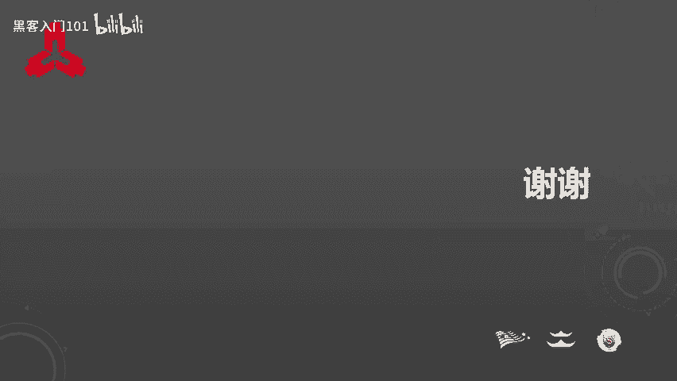

# B站最好的绿盟科技CTF夺旗赛教程 从小白入门到比赛实战 - P33：35.命题思路与赛题类型 - 黑客入门101 - BV1eeW5eJECc

大家好，在即将到来的比赛之前呢，我来带大家梳理一下命题思路和赛题类型相关的内容，希望能够帮助大家更好的做些准备。

我们先来看一看整体的命题思路。为了最大化各位参赛选手们的收获，我们制定了一些命题要求。首先我们希望每个赛题的考点是合理设置的。参赛选手在解题时呢能够有明确的目标，并且预期的解题思路是合理的。

我们会尽量避免套路题、脑洞题，就是那些一说套路就懂的题，以及那些靠大量的猜测来解决的题目。其次呢我们希望题目中设置的考点能够为金融业的网络安全工作带来帮助，尽量不考选手们用不到的技能。

最后我们要求题目考点能有丰富的技术多样性。现实中，攻击者所采用的技术啊是千变万化的。作为防守方，如果没有一个全面的技能数，也是难以应对的。但是从另一个角度来说。

我们也希望赛题中的知识点比重能够大致符合金融业网络安全工作的需求，这样够才能够做到学以致用。此次比赛中的所有命题都会以金融业相关业务为主题背景。并且结合金融业网络安全攻防真实案例。

这些案例呢都来自于我们参与的一些金融业相关的安全工作，后续也会有相关的课程进行介绍。我这里简单列举一些命题参考的真实购房案例。啊，比如网站入侵恶意软件乐索软件的清理移动应用破解日志与流量的分析和取证啊。

密码保护方式呃，企业信息泄露啊等等案例。接下来我带大家过一下赛季类型。这次比赛的题目总共有6种类型，分别是we部安全、移动安全、逆向工程、密码学、取证影写和p。胖指的是二进制漏洞挖掘与利用。

相关类型在此次比赛中占的比例呃如图所示。其中呢比重最高的是外部安全。因为外部网站是目前金融行业业务系统里面应用时间最长啊，应用范围最广的一种形式。一旦被啊入侵，服务端的所有数据都可能被窃取。

后果是最严重的。其次是移动安全。伴随着移动互联网的兴起，各家金融机构呢都研发了移动应用产品。因此，移动安全类型的题目呢在整个题目比重当中排名第二。剩下的题目类型相对少一些。

涉及的相关技术呢在网络安全工作当中啊其实也都会用到。那接下来我们依次过一下这几种题目类型，首先是外部安全。对外部安全的题目，通常会给出一个外部网站，要求选手通过信息收集挖掘漏洞啊。

利用漏洞的方式来获取给定目标的权限或者数据。那相关需要准备的技能，包括要掌握经典altop ten的漏洞原理以及利用技巧。特别是常见的接口注入啊，叉SS文件上传等等。要了解常见的信息泄露的方式。

然后在代码审计方面，要了解PHP语言和夹语言。那Java语言呢有可能需需要用到一些反变译的工具。那除了呃考察应用漏洞以外呢，题目也可能涉及一些业务逻辑的问题。最后选手啊需要了解一些近年来出现的著名漏洞。

那这个也是应急响应工作必备的一个基础能力吧。对于移动安全类型的题目啊，通常会给出一个安卓应用，要求选手通过分析算法来求解正确的输入。那这种类型的题目通常称为crack me。

也是二进制逆向分析中经常出题的一种形式。那另外一种形式会要求选手分析客户端和服务端的通信。并且呢实现呃指定的目标。那在移动安全类型的题目当中啊，通常要求选手掌握的技能。

包括安卓应用与服务端通信的一个流量抓取和分析。还有呢安卓应用逆向与调试。以及呢安卓应用的修改。对于取证类的题目，通常会给出一段日志或流量，要求选手分析其中包含的关键信息。

这也是企业在发现入侵痕迹之后要做的事情。要求选手具备常见的日志分析能力啊，并且呢熟悉网络流量抓取和分析的方法。对于音形类的题目，通常题目会给出一个多媒体的文件啊，例如图像、音频、视频文档等等。

然后要求选手找出其中隐藏的信息。那这就要求啊大家了解常见的一些文件格式。意向工程类的题目呃，题目形式是给出一个二进制程序，要求选手通过分析算法来求解正确的输入。

那这种形式就是一个标准的crrack me。那另一种可能的形式是要求选手通过修改二进制程序来实现非预期的功能。这类题目考察的技能包括windows和linux软件的逆向分析调试技术。

还有二进制软件的修改方法。那对于密码学类型的题目，通常题目。的形式是给出密文和相关信息。那相关信息比如说是加密的代码啊，或者相关的加密方式，要求选手通过这些相关信息的分析来破解明文。

破解的方式呢可能是啊针对加密算法误用的攻击或者是加密代码的一个反推等等。那这样一种类型呢，需要选手掌握的技能啊，包括。常见的哈希算法。啊，其次是分组密码和加密模式，例如ECBCBC等等。

最后是非对称加密算法，例如最常见的IC的原理啊和相关的一些攻击方式。最后一个方向，漏洞挖掘与利用，也就是大家通常称为的碰。这种题目呢通常是给出一个网络服务二进制程序，要求选手呢挖掘二进制程序中的漏洞。

这种漏洞呢通常是内存破坏型的漏洞。要求选手利用内存不完的漏洞来获取目标服务器的权限。那这样一种题型要求选手掌握的是啊战役出的基本原理，战役出的利用技术。那最好呢是了解一些linux提供的保护机制。

以及呢啊怎么样去绕过。

到此为止呢，命题思路和赛题类型已经介绍完毕，预祝大家能够取得好成绩。

