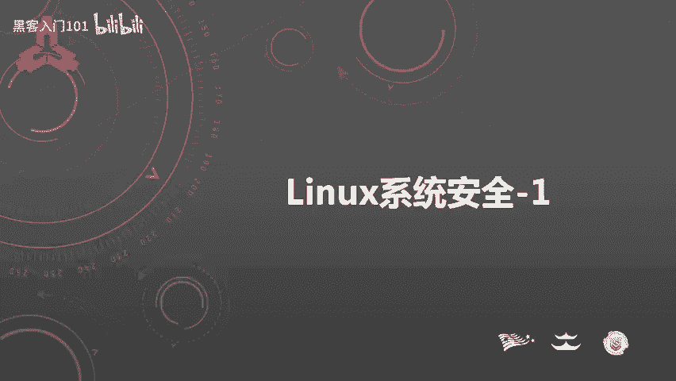
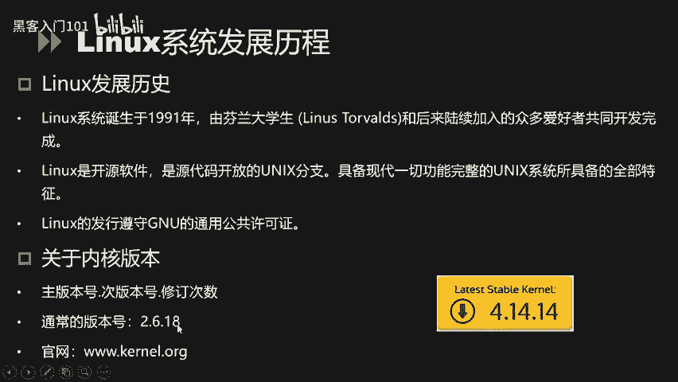
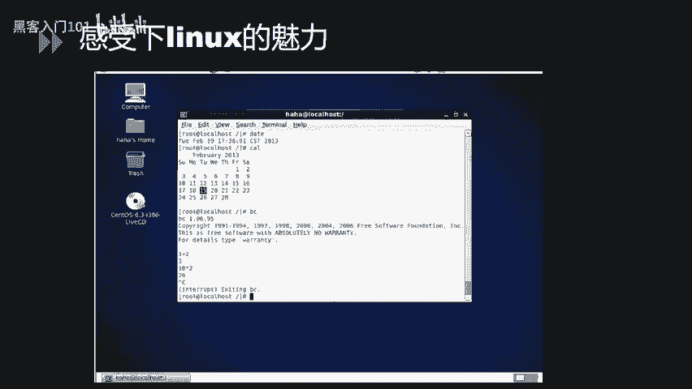
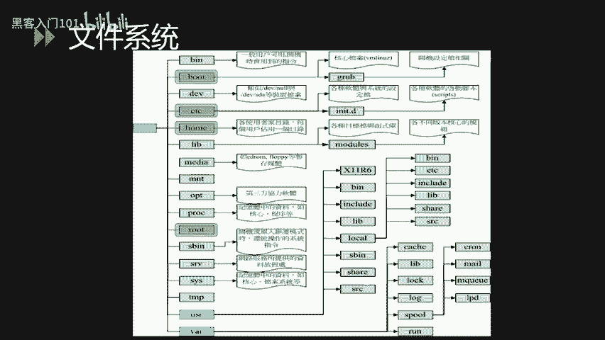
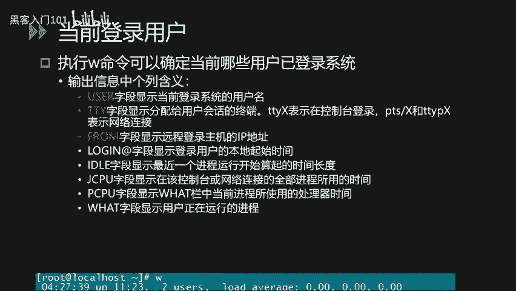
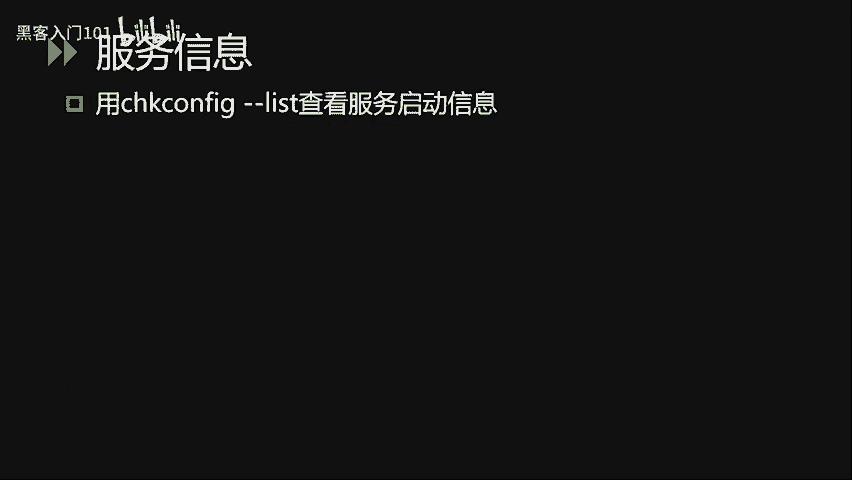

# B站最好的绿盟科技CTF夺旗赛教程 从小白入门到比赛实战 - P3：3.Linux系统安全_1 - 黑客入门101 - BV1eeW5eJECc

大家好，本课成为lininux系统安全。本小节的内容包含了linux。连接lininux文件这种介绍和lininux的基本操作三个模块的内容。首先是linux简介。Okay。嗯。

winix系统诞生于1991年，由芬兰的赫尔新基大学的大学生伊林纳斯和后来陆续教入的众多爱好者共同开发完成，于1994年将第一个完整的核心输出。因此，大家能够通过网络取得linux的核心原时代码。

经由自己精心改造后再回传给lininux4区。因此，lininux能够被广泛的使用和进一步发展成为完整的lininux系统。的标志就是我们常见的这只企鹅，它不是一只普通的企鹅，它是一只开源的企鹅。

Dit系统可以安装在各种计算机硬件设配中，比如我们的手机、平板、电脑、路由器、视频控制台，还是大型计算机等。linix是一个领先的操作系统，世界上运行最快的10台大型计算机运行的都是linit操作系统。

严格来讲，linux这个值本身只表示linux内核，但实际上人们已经习惯了用linux来形容整个基于linux内核的操作系统。linux常见的发行版本有我们PP上面显示的，第一个是红帽，第二个是苏喜。

第三个是deb，还有s。即个是1993年创办的，我怕是。然后所以是1994年推出的。而欧房图司2004年推出的。嗯。简单来说，linux系统大是1991年是一个开源软件，具有unux系统的全部特征。

简单说完linux的发展历存后，这里重点强调一下linux的内核版本。linux的内核版本主要由3块组成，第一块是主版本号，第2块是次版本号，第3块是修订次数。通常我们常见的版本号为2。6。U8。

目前最新的版本号是4。14。14。对于版本号，我们需要重点关注的是第二位次版本号。次版本号如果是偶数的话，说明这是一个稳定版，适合我们的生产环境。如果次版本号是一个基数版，说明是开发版本具有就做bug。

我们不建议用于生产环境。所以说我们通常使用2。6。18这个版本。

作为我们生产环境的使用。Thank。对于linux，我们可以通过虚拟机安装的方式来学习。而且现在很多发行版本都带有图形界面。比方说我们这里显示了一个serOS的版本。这样我们就可以非常容易的上手练。

Oh。OK讲完linux之后，我们现在来讲一下linux的文件系统。这。

linux的文件目录结构。这里我们重点讲一下系统的一些重点目录和配置文件。来理解linux系统的整个文件目录结构。首先可以我们可以看一下PPT这里我们打出了一个整个lininux常见的树状目录结构。

首先，在lin点系统中有一个非常重要的概念，那就是一切都是文件。在lin点系统中把一切资源都看作是文件，包括硬件设备。linin系统把每个硬件都看成是一个文件。通常称为4倍文件。

这样用户就可以通过读写文件的方式来实现对硬件4备的访问。点系统在启动时，第一个挂载的是跟文件系统，就是我们最左边的这个根。图上显示的是lininux常见的文件目录结构。从根开始。彩定的目录有。

BI目录mo目录第一B目录就是我们的硬件适备ETC就是我们的配置文件目录，还有我们的home目录mini目录，还有我们的。root更用目录更用户目录等。其中。

wordot这个目录主要用于放置开机会使用的文件。包括linux核心文件以及开机。全。开机所需要的配置文件的ETC目录是放置系统主要的配置文件，立足人员的账号密码文件、各种服务的启动档案等。

第一B目录在令系统上，任何装置与设备都是以文件的形态存在这个目录当中。

下面针对每个二级目录做进一步的说明。首先是BI目录，这个目录放置的是在单人维护模式下还能够被操作的指令。在BI目录底下，可以被root以一般账号所使用。wordot目录这个目录主要放置开机会使用的文件。

包括linux核心文件以及开机所需要的相关配置文件。第一名目录在另一系统上是用于存放。是备文件。ET系目录。是系统的主要配置文件目录，例如人员的账号密码文件，各种服务的相关文档。

后目录是系统默认的加目录。LIB目录只是用于放置开机会使用到的行式库，以及在并目录和SB目录下指令会呼叫的行式库。media目录下面放置的是可移除的装置，包括我们的软盘光盘，还有我们的U盘挂载。

OPD目录是用于给第三方安装环境的目录。root目录是系统管理员的假目录。SB目录放的是开机过程中所需要的，包括开机修复和还原系统所需要的相关指令。SRV目录可以。认为是server的缩写。

是一些网络服务启动相关售后所需要的调用的数据目录。电图目录则是让一般使用者或者说正在执行的程序暂时放置文件的地方。下面针对三级目录做进一步的说明。ULIB目录这个目录放置的是各种应用软件的行式库。

目标文件以及不被一般使用者惯用的执行脚本的。USRloc目录是系统管理员在本地自行安装下载的软件时建议的安装目录。VRLIB目录是程序本身执行的过程中需要使用到的数据文件放置的目录。

不 are unlock log这部录是比较重要的，用于放置。系统的关键日制记录文件。ETCINIT到第一目录放置的是系统服务预示的启动脚本。Yeah。讲完系统的重要目录之后。

下面对系统内账户相关的重要配置文件做进一步的讲解。第一个是我们的ETCpas锁文件。PP上面显示的是1个AT power里面的一行样例。下面我们做做一下进步说明。第一个字段是我们的test。

这是我们的用户名。第二个这段是我们的密码，这里用X地带。用户的密码原来是直接存储在这第二个字段的，但是后期为了安全，有了专文的ETCship文件，所以说这里用默认的ST代。第三个字段是用户的UID。

一般情况下，root为0。1到40499是系统的默认账号ID值。500到6535是用户可登录的账号UUID值。Oh。第四个自动是用户的GIDlinux的用户GID会有两个。一个是UID。

一个是用户的GID。第五个字段是当前账户的群名。他。第六个字段是用户的。江木路。第七个字段是用户的sell及用户登录之后会默认调用的sell。Yeah。

系统的默认账号及其UID值如我们PD上面的表所示root的值为0，说明这是一个管理员账户。然后。demo账号的UID值为一，它是与执行系统类型任务相关联的。

然后BIMSYSADM这三个账号是系统任务守护进程账号，分别是系统二进制文件、系统支队等相关。LP是我们的打印机守护进程。其余ID值在0到499之间。Thank。后面有几个我们比较不常用的。

不可用于登录的账号。比方说我们的nobody账号，no assess账号的这些是比较特殊的账号。讲完ETCpa索，我们再讲一下ETC噱斗。一期噱头这个文件主要。如PPT所示。

第一个同样也是我们的用户名字段。第二个是我们的一个密码字段。还有我们的一个最后一次修改时间，距离1970年1月1日的天数，还有我们的密码使用天数，还有我们密码到期前几天提醒的一个次数。嗯。

针对ETT噱统，我们这里又重点讲一下第二个字段。就是我们的密码加密算法。以我们图上的这例为例，密码域是由三部分组成。第一部分是ID值，第二部分为岩，第三部分为加密后的密文，其中ID值指的是加密算法。

盐指的是随基数，加密是指的是加密后的密文。比方说ID指指的是下面算法。当ID值为一时，采用的是ND5进行加密。ID为50，使用的是SHA256的加密方式。ID为60，采用的是哈西562进行加密。

盐是一个固定长度的随机字符串，也就是每次修改pass之后都会随机生成的。然后再根据加密方法和盐，再通过我们的加密算法来形成我们第三个字段。我们加密后的密文。linux系统的文件系统讲解到此结束。

下面讲一下linux的基本操作。基本操作这一小节主要讲解linux文件和目录的基本操作，包括文件的管理操作，目录的管理，账户用户管理，还有系统服务进程端口等。嗯。首先是文件已目录管理。

在lininux系统中定位一个文件或目录时有两种方式，一种是绝对路径，即从linux文件系统的根开始，写法一定由跟目录斜杠开始写起。第二种是相对路径，相对对正确相对于当前的工作目录不是由根开始写起。

目录的基本操作命令有以下几个，第一个是CD用于改变当前的目录。CD加上目录路径即可进入对应的目录PW显示的是当前的目录MKDIR创建的是一个新的目录IMDIR是删除一个空的目录L用于文件与目录的检示。

winice文件安全管理操作这一块，我们讲一下一个。linux文件系统的防护方式。linux访方式的话有三种类别，分别是拥有人、拥有组和其他人这三个可以分别为每个类别分配不同的权限组合。

所有文件都归一个用户及一个组所有，这三种权限分别是可读可写、可执行。其中，账户的UID定义用户的用户ID。账户的GID定义用户所处的组别，可以通过LS杠L命令查看文件或目录的权限词。创建用户。

我们可以通过优稚AD命令来实现创建组。我们可以通过goruAD命令来实现更改文件所有权使用CHOWM命令来实现。更改组所有权使用CHGRW来实现。更改。

更改组所有权使用CHGRP命令来实现设置文件的权限，使用CHMOD命令来实现。权限赋予使用SUDO命令来实现。Yeah。下面讲一下linux系统的用户安全管理操作。首先，添加用户使用优质APD命令。

删除用户使用优质DEL命令，加上杠R参数，表示在删除用户的同时，一一定把用户的加目录及本地邮件存储的目录或文件一并删除，锁定用户使用PASWD杠L命令。修改用户属性，使用U质MOD命令。

可以修改账户的有效期，商户的登录目录等。ID命令用于查看当前用户的用户ID和主ID。Yeah。min你系统是一个多用户操作系统，通过执行W命令，我们可以查看当前系统的用户信息。如PPT所示。

我们可以看到当前用户boot分别从本地。和远程TTY线路登录到系统当中。Okay。嗯。U的字段显示的是当前登录系统的用户名。FRON字段显示的是远程登录主机的IP地址。

后印字段显示的是登录用户的本地起始时间。WHAT这段显示的用户正在运行的程序。Yeah。其中，TTY字段显示分配给用户绘画的终端TTYS表示在控制台登录PTS杠S或者TTYPS表示是网络连接。Okay。

下面我们再讲一下端口开放情况的查看。我们可以使用nex day杠PA命令强看当前开放的端口的服务。然后再使用IOSOF杠Y显示进程和端口的对应关系。我们看一个例子。图上图所示。

我们发现系统开放了1个3306端口，22端口，还有80端口。而且3306和80端口都是处于精心状在，我们可以用来连接。而，22栋口的服务只是与U92。U68。U85。U的U7263端口电力的连接。

使用LSOF杠I命令显示进程和对应的端口号信息。从图从图上我们看出SH服务的PID为832。然后对照上图的PID，我们可以获取到对应的PID对应的括号。比方说我们看上图端口这PID对应的是1个22端口。

这样我们就可以通过。对。进程PID来找到对应的端口号。再举一个例子，比方说我们的的PID是U324，我们看对应上面的PIDU324的是一个服务，对应的端口号是3306。嗯。我们再讲一下进程信息的查看。

使用PS杠AOS查看进程。可以看到当前的PID址对应的内存和CPU的使用率，还有comman的字段。对应的一个应用目录和服务。下面我们讲一下服务信息的查看，使用缺口费杠list可以查看服务的启动信息。

。这里我们会列出每一个服务在系统运行的6种级别下的一个对应自动启动状态。理系统是有6种运行级别，第一种是单用户模式，第二种是无网络连接的多用户模式。第三种是有网络连接的多用户模式，第四种是不可用。

第五种是带图形界面的多用户模式。第六种是重启。我们可以看到了。这里mysql杠B在第一种运行模式默认是不启动的。嗯。因此。呃，在第一种运行模式下也是默认不启动的。

在0到6至6种运行模式下都是默认都是不启动的。因此我们。就系。因此，mus斯co服务无论在哪个运行级别。都不会自动启动，我们需要手动启动该该服务才行。Yeah。第一小节的内容到此结束，谢谢大家收看。

