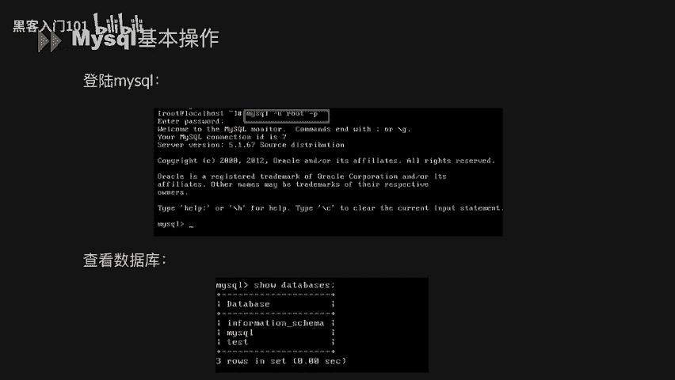
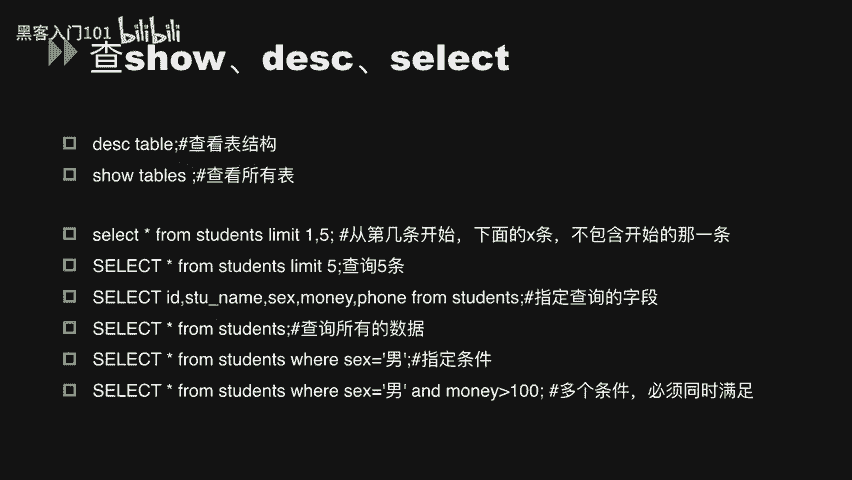
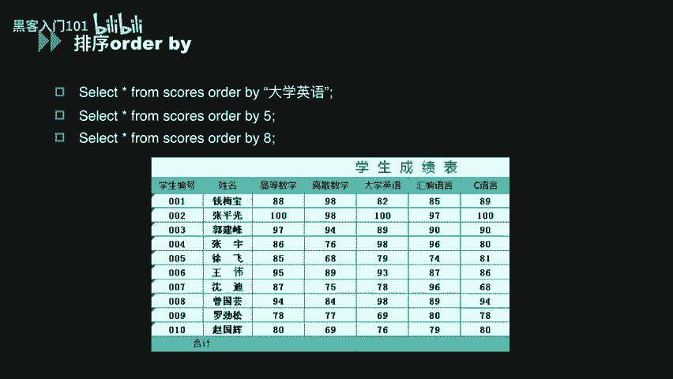
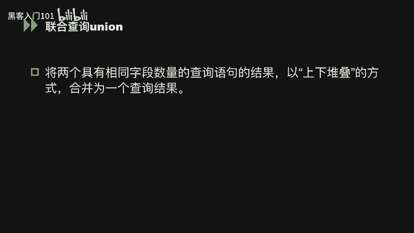
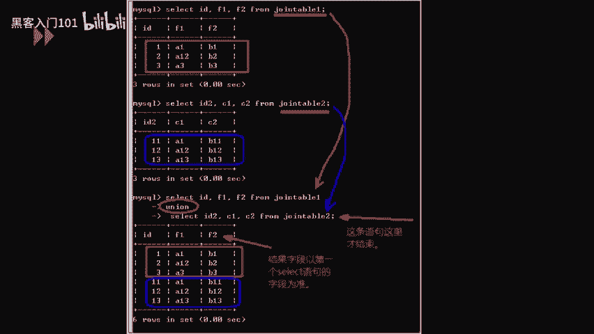
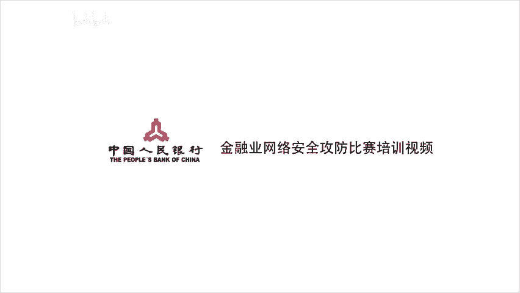

# B站最好的绿盟科技CTF夺旗赛教程 从小白入门到比赛实战 - P6：6.mysql常用命令 - 黑客入门101 - BV1eeW5eJECc

大家好，我们继续进行my测ical数据安全相关知识的讲解。

呃，第二部分，mysco常用基本命令。呃，先看我们mysql的基本操作。第一步呃登录mysql。登录mycyclql呢直接使用我们的mycyclq后面杠U加我们的用户名杠P，然后就可以登录。

然后呃控制台会提示你输入密码之后输入正确之后就可以进入到我们的mycyclrcle了。嗯，进入my这的时候，可以直接使用搜db这样的命令去查看我们当前数据库下的所有数据库名。

下面轮我们列举了几条呃mysql的基本操作。首先呃新建用户。我们新建用户的时候，直接对它赋予权限，并且呃设置呃密码。呃，第二条查询增加取消我们的用户权限。

我们可以通过s grant呃 for test at local host去查看当前呃用户的一个权限。可以通过grant去给它添加权限，包括可以添加sla映射的等等，delete等等操作权限。当然。

也可以通过rework去呃删除该用户拥有的数据库权限。查看版本号和时间。直接使用sdwaen这样。呃，这样一个命令就可以查看到我们的当前数据库的版本。嗯，conro date呢就是当前的时间。

查看日志文件。so very。oppolike呃百分号login查看我们当前的日志文件。呃，查看用户及hosse的信息。

直接我们seck the userhos password frommyl点Uer就可以了。呃，下面看我们数据库的真操作。帧操作的话，这里列举了create和insert两个命令。

首先看第一个create，我们通过create这样的命令去创建一个数据库表。这个数据库表的名称是sourcece。呃，在这个表中中添加了这三个字段，分别是IDS杠ID和graded3个。诶三力。呃。

创建了数据呃库呃表的话，之后我们就可以去在这个数据库表中去呃添插入我们的具体信息。呃，在这里可以看音测的呃插入的时候。呃。

一一种方法我们可以在那个inser呃呃in two student点的后面去添加每一列的名字。在这里列取出来有name  money sexex and呃phone。

然后我们value呢同时对应到我们的四个列名。啊，当然如果我们呃所插入的数据库池呢是呃和列名一一一一对应的。其实我们也可以省略掉呃16点子后面的数据库列名。然，第二个呃，数据库的三操作。

这里列举了delete和jo两个命令。啊，通过jo呢，我们可以直接drop table table name。直接去快速的删除我们数据库中某一张表。呃，delete呢可以去呃删除数据库中。

的表中的某一列。比如这条语句dele fromtable name when ID等于1，这样的话我们就仅仅只删除了table name这一张表中ID等于一的那一行。再往下数据库的改操作。

改操作这里列举了update和 al两条命令。我们可以看到alt命令呢可以去用到我们的改表名改表结构。按到新增字段的位置。它主要呢用在了对我们数据表的一个结构的一个修改。嗯。

up date呢就主要用在我们具体去修改数据库表中的具体值了。就比如第一个update students set money等于100。如果没有限制条件的话。

我们就会把该数据表中的所有man呢都修改成100。当然我们可以通过well语句，well关键词对这个具体的每哪一行去做一个限制。就比如第二条。

我们就仅仅只修改了name等于HK的这样呃这样一行的具体的money的数字。嗯，查数据库的查操作，这里的话列举了so呃 distance呃 select3条呃过三个关键词。呃，通过DESC呢。

我们可以看查看表的结构。通过s tables可以查看到所有的表。呃，slect呢我们就可以去查看到当前数据库中的具体值。呃，就比如说我们看第一条，我们可以想看到从第几条开始，下面多少条。

就可以用limit呃一逗号5去进行限制。如果我们仅仅查询5条的话，直接用limit呃5进行限制。如果我们查询指定的字段呢。

 select IDSTO杠 name sexy money name phone from student。我们去查询了呃students这种呃这张表中的12345个字段。

如果我们查询数据库中的所有数据呢，直接在sag后面添加新，然后从from数直流电子表就可以了。啊，下面两条语句呢，大家可以再看一下。

呃，下面我们介绍数据库的排序，关键词al by。在下面这张表呢是一张学生成绩表。我们呃如果想是去展示这张表，并以其中的某一列进行排序呢，我们可以使用这个语句。

就比如说t新 from source这样一张表out by大学英语。那样这条结果显示的就是我们与大学英语这一列进行对这个表进行排序。呃，除了我们可以直接指定呃列名进行排序的话。

我们当然也可以指定这个数据表中的某一列的列数。来进行排序。就比如说我们依然以大学英语进行排序的话，我们就可以select型号from source out by5。

因为呃五呢是这个因为大学英语呢是这个数据，我们要查询这个数据表中的第五列。啊，如果我们呃outtoy后面的这个列数呢超过了我们的当前这个数据表的一个列数的话，我们数据库就会报错。然后这一点呢。

我们会用在后面的数据库注入的一个呃演示当中。

呃，下面看呃数据库的一个联合查询union。联合查询呢就是将两个具有相同字段数量的查询语句的结果，以上下堆叠的方式合并为一个查询结果。

下面我们举例来具体看。呃，首先看第一个条语句，slect IDDFEF2from。呃，Join table一。我们把table一中的呃IDF1F2这个列列举出来。

然后我们再看第二条se ideaC12 from drawing table2，我们再把table二中的这个表列信息列举出来之后呢，我们用查询语呃罗联合查询语句把这两个表去联合起来。

Select I D F1 F2 from Zing table E union。Second I C。C1C2from交引 table2，最终显示的结果就是下面的下面图中所显示的。

他完整的把这两个表去结合了起来。

下面看一下我们的要想使用联合查询呢，要有两个限制条件。第一个就是两个t语句的查询结果的字段数必须一致。就比如说你第一条sack语句我查询了两列，那第二个s语句呢同样必须查询两列。啊。

第二点通常也应该让我们两个查询语句的字段类型具有一致性。我们对应的自然形要不是要么全是字字符上形，要么全是整形。下面我们看一下呃联合查询的一个语法形式。呃，slect X句一。

后面可以添加呃关键字优年呃or或者distinct。然后再是s语句2。那，联合查询语句呢默认会自动消除我们的重复行，其实是默认的话就是distincted。呃，如果想要将我们的所有数据都显示出来。

就是我们的重复行业呃重复显示的话，就需要优年奥来。按关键词来使用。其实这里当我们使用or的时候才真正有意义。呃，下面来我们来看这样。两张图这两张图的嘛话就是我们。

把优年这样的两个查询语句去它的位置去颠倒一下。我们可以看到呃查询结果中呢，两个表的位置也颠倒了。啊，所以就是在这里比较明显的看出联合查询，就是否我们的把第一张表和第二张表之间去做一个联合。

然后它之间的顺序呢和我们这个联合查询的st的语句的顺序会呃会呃会有关系。呃，以上呢就是我们第二部分mys克数据库基本操作的语句的全部内容。

呃，感谢大家。

