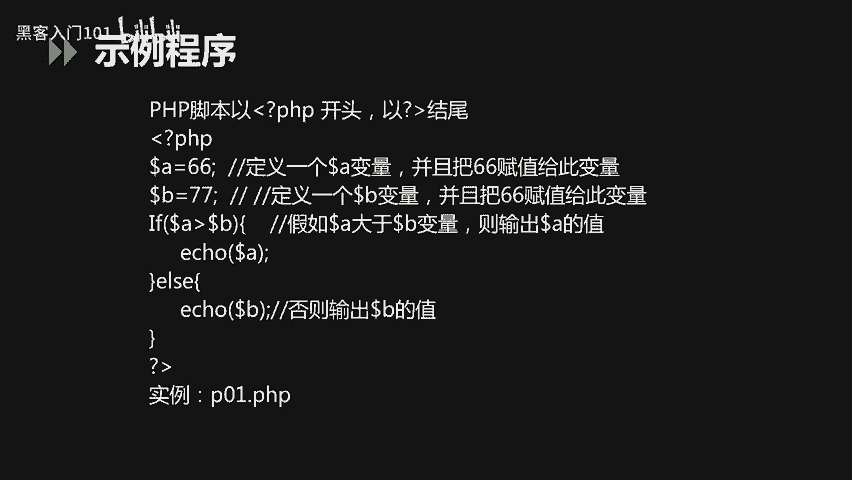
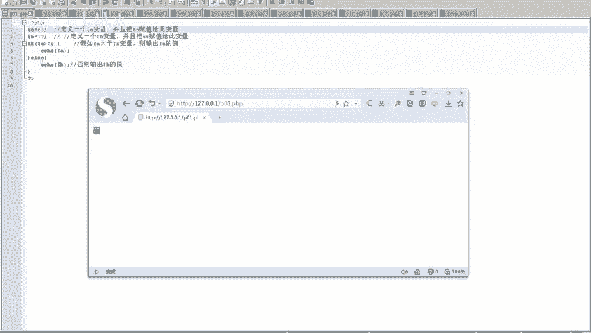
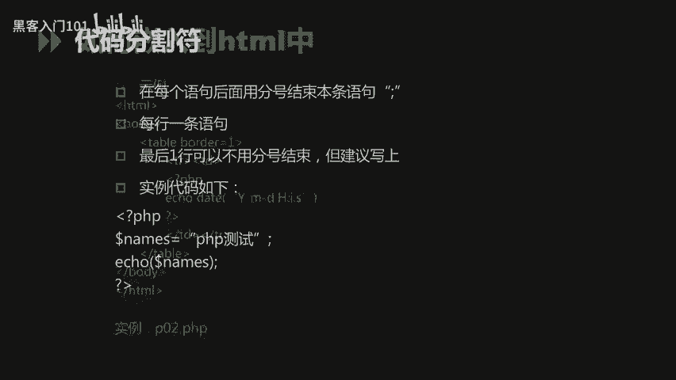
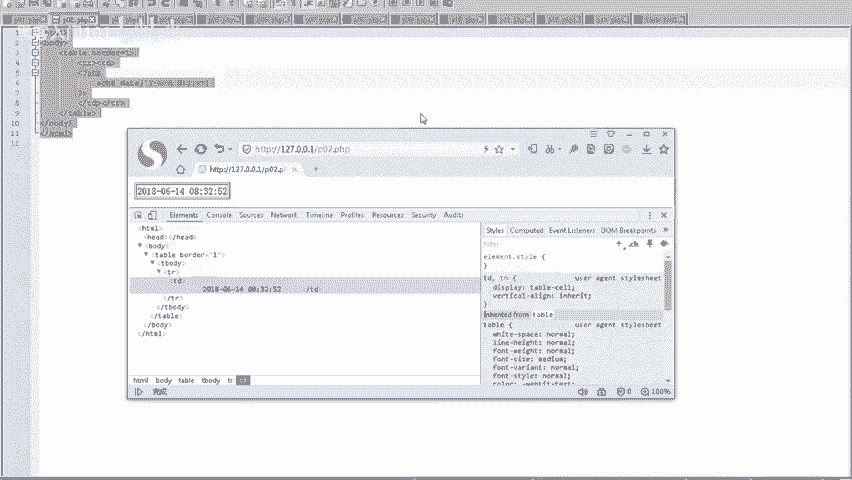
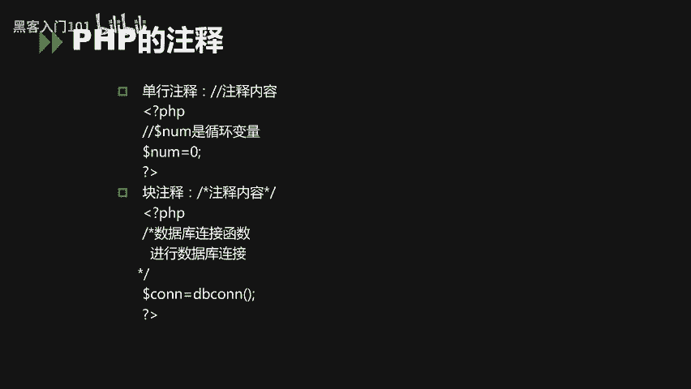

# B站最好的绿盟科技CTF夺旗赛教程 从小白入门到比赛实战 - P8：8.PHP基础知识_1 - 黑客入门101 - BV1eeW5eJECc

大家好，现在我们开始。今天PGP基础知识的一个课程。

那么首先今天我们的课程主要包括两方面，第一个方面是PHP的基本常识。第二个方面是PGP的基本语法。基本常识主要包括PHP的一个定义。PHP的它的开发环境以及它的运行环境。PHP的基本语法。

包括PHP的一个数据类型。包括它的一个常量，还有。浮电型整形字符串类型。第二个是PPP的一个变量。第三个是PGP的一个常用函数。那么针对于PP的基本常识，我们只需要呃了解就可以了。

针对于PPP的基本语法，是我们今天重点需要掌握的内容。那么这里。在我们以后针对于PTP开发过程当中遇到的一些问题，我们可以呃参考PGP的一个中文参考手册，并且到PHTP的一个官网下载。下载最新的文档。

那么这里在PPP的一个参考手册当中，呃，共有189类函数，5000多个呃189类函数，5000多个函数。那么其中我们开发当中常用的呃也就是100个左右。PHP的定义。

它的原始定义是personal home page tools。目前我们对PGP的一个定义是超文本预处理的一个自主缩写。PPP本身是一种被广泛应用的开放源代码的多用途语言。

在2017年最新的呃12月份的编程语言排名，它处于第第九位的这样一个位置。那么针对于前两年而是有所下降。KTP它是服务端的一个脚本，它返回的是HTM代码。这里与PHP竞争的语言主要是三类。

第一类是呃微软的一个shsha语言。第二类是oracle的一个java语言。呃，第三类是谷歌的一个拍摄语言。那么这三类语言呃与PTP目前都是当前软件开发领域很流行，并且被很多人使用的呃几中语言。

PHP的开发领域主要应用在服务端的一个脚本啊，更多的是应用在这个外部开发中小网站的一个外部开发。那其他两种场景一是命令行的一个脚本。那命令行脚本，它主要是直接在doss命令服务下实行PTP程序。

另一种主要是1个CS客户端的这样一个开发。但是目前呃应用场景较少。那么主流的还是呃服务端的一个脚本开发，一个外部开发。PHP的运行环境在软件开发中，程序开发人员大部分是使用windows的一个操作系统。

呃，所以程序的开发人员需要熟练掌握windows下的1个PHP开发运行环境。那么在其他的操作系统上也可以进行开发这里的操作系统就包括linuxun，还有mac的一个操作系统。

那支持PHP的运行的一个服务器，包括阿法奇 n。那PHP本身它是支持多种数据库的那主流的包括mysqcle server和oracle。那么这里我们首先先看一下PHP的一个事例程序。

BP脚本它是以呃左监左右兼控号，然后问号。这种作为结开头结尾的这样一个呃标签。那么首先大大家先看一下当前的这个实例。当前的这个事例，首先我们以呃左键工号问号PHP作为这个脚本的一个开头。

那首先定义A变量，负值66，定义B变量啊，负值77。下面的语言我们主要是。一个对比。AB两个变量它大小，并且呃较大的值进行输出的这样一个呃代码。

我们这里给大家展给大家演示一下它的这个程序运行之后的一个结果。

大家可以看到这里哦。我这边KGP的一个运行环境，它是阿帕奇。那数据库呢是用mysql，但是我们只是简单的重新运行，没有涉及到数据库。这里我们将设例程序啊写入以PHP为后缀名的一个呃文件当中。

在阿帕奇服务器进行运行。命名为P01点PHP这样一个文件。我们访问。当前页面的。这个路径。大家也看到这里它输出的是88。因为这里我定义了AB两个变量，分别是88和77，88显然是大于77的。

所以说这里它输出较大的值就是A变量的值。这里我们将。A变量的值改成66，那这个时候它是小于B变量的。我们再查看一下输出结果。这里可以看到啊，输出结果发生了变化变成77了。

这里我们将77的值是付给B变量的，那么77大于66，所以说这里它输出的是B变量的一个值。

如何将这个PHP的这个脚本语言与HTML页面进行一个融合呢？我们首先将PPP的一个代码嵌入到HTMM一个标签当中。那这里大家可以看到。在HTM没这个标签当中，我首先定义了一个table，也就是一个表格。

在表格当中。表在表格的单元当中插入啊PHP的一个脚本，也就是输出当前的一个时用时间，利用这个PHP它自身的一个da函数，获取当前的一个时间。这个时间的格式包括年月日10分秒这样的一个格式。

仅争当前时间的一个输出。我们来运行一下当前的代码。看看他的一个输出结果。

这里我已经将代码。写入到P02点PHP的这样1个PHP文件当中。然后我访问运行。可以看到这里。已经将当前的时间系统时间进行输出了，并且在这个页面进行显示。

是插入到当前表格HTML标签的表格的一个单元当中。我们审查元售看看是不是将我们PATTP输出的内容直接在HTM标签进行一个显示。可以看到这里直接将日期放到推报的一个呃单元表格当中了。

这样的话就是将PP的它的一个脚本与HTMM标签进行了一个融合。

讲完了前两个1个PHP的一个示例代码。大家可以看到，我们在PHP代码当中，每一个语句后面都会用分号结束本条语句，因为这个是必须的，否则它会报错。那么针对于最后一行的代码，我们可以不用分号结束。

但是建议最好写上。可以看到以下代码。这里首先。首先我们利用右间括号，左间括号问号PHP。作为当前PTP脚本的一个开头。然后我们定义一个name的变量，并将它赋值，就是PPP测试。

然后用分号结束当前的这条语句，就说明我们当前这条语句已经结束。那么下一条语句就是输出name幕这个变量，同样用分号结束当前语句。最后我们用问号右将过号结束。当前的1个PPP脚本。

那么分号就作为代码风格符。在PVP脚本当中应用起来。那么另一方面就是PPP的一个注释。因为注释本身对程序编写也是很重要。针对于每一行代码，它的一个解释说明，不管是为了后续代码的维护。

还是我们自己编写时候功能的一个注释都是很重要的。那么针对于PPP的一个代码注释，我们分为两种。第一种是单行的注释。单行的注释主要是利用。反斜杠两个反斜杠，后面加注释内容。对字符串进行一个注释。

那么块注释呢，这里我们用反斜杠，然后中间用两个星号，然后将注释内容放在中间进行一个注释。这是两种注释方式。

以上就是我们针对于PDP的一个基本常识的一个讲解。

