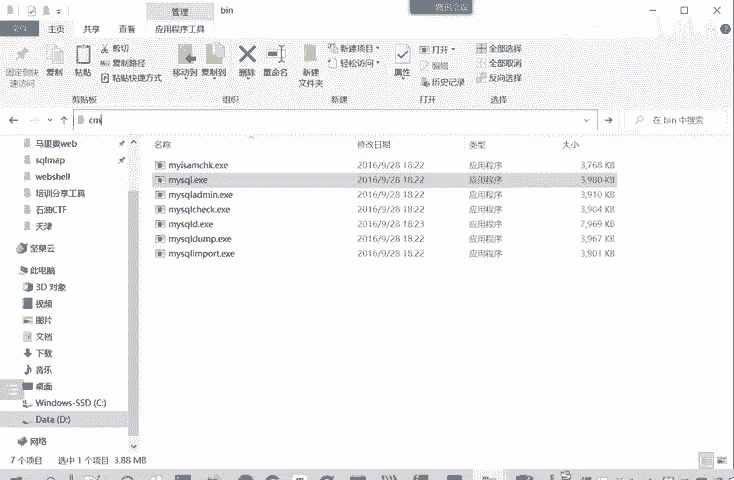
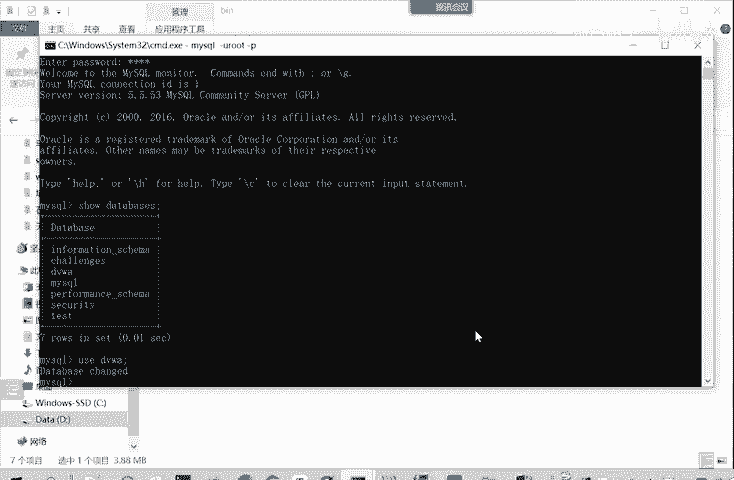
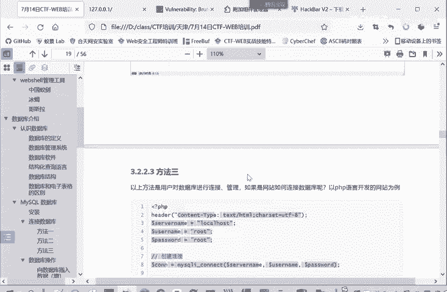

# B站最系统的CTF入门教程！CTF-web,CTF逆向,CTF,misc,CTF-pwn,从基础到赛题实战，手把手带你入门CTF！！ - P14：web-连接数据库 - 一顶白帽子_ - BV1zj411W7nn

那我们启动了数据库之后，如何进行连接呢？主有三种方法进行连检。一种是。mycyclical数据P区 study里面有个mysical目录，我们看一下。HP tutorial里面有不同的目录。

这些目录都是对应的设置。如果大家只要设置买sql，就会在这里面进行修改。N的配置也在里面。那么想要买scle，这面有个B。有个mys的EX。我们呢可以用通过这个程序来连接我们的myC和数据库。

怎么用？mys。哦 you用户名名是什么？抗屁。要输入密码。这样就已经连接成功了。那就可以使用这circle命的 databaseba啊什么的，查看有哪些库。哪些数据库？然后呢，右子。

我们就使用跟VWA这个口。现在我们就使用已经进入到这个柚子这个DVWU这个数据库当中了。这就是一种连接方式，课件连写了，通过命令行工具来连接。

第二种方式呢就通过数据库连接软件。比如说我们的PHP study就带来一个数据库连接软件，my circle front。来点击。对买s管理器里买ci front。就可以了。然后大家首次连接的时候。

就可能新建你输入这个名称，你这个连接的名称随便输入。临接地址呢就是我们本地。然后输入用户名和密码就可以了。然后以后每次连接的时候，直接把你保存的登录信息打开，就可以进行一个连接。

连接同样我们看数据库也是同样有1234567有7个数据库。比如说我们看DVWV这个库就是我们靶场。所需要的一个数据库，它有两个表，ges book这个表。

它的数据呢啊是一些屏comment name这些信息users这个表。U在这个啊，这个信息呢是Uer IDD。fi the namelast the name用户名。密码。登录时间这些信息。

这是第二种方式，通过这mysic friend。当然你还有一个东西PP amin也是可以连接的，也在我们这个里面。这个也是可以连接的。不过这是通过网页来进行连检。

我们一般还是习惯用这个连接工具并制软件进行连接。那么第三种方法呢，就以上两种方法都是用户对数据库进行连接管理。那么如果是一个网站。用别人的用户访问这个网站，网站需要查询数据库的数据，那怎么进行连接呢？

这就以PHP语言为例。你实际上别的GSP语言这些都类似。关键就是这个连接命。Mycycl。Connect。然后你之前你把这个sber name。就是数据库它是放在哪个地址的。

然后数据库登录的用户名和密码填进去就可以进行连接了。这是进行网站开发需要的连接方式，对用普通用户的就是命令行或者是连接软件这两种。

那么我们下面看一下这个数据库的一个操作。