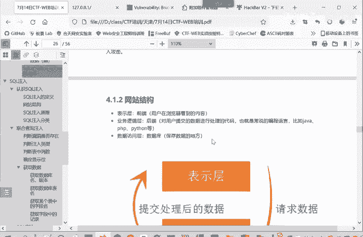
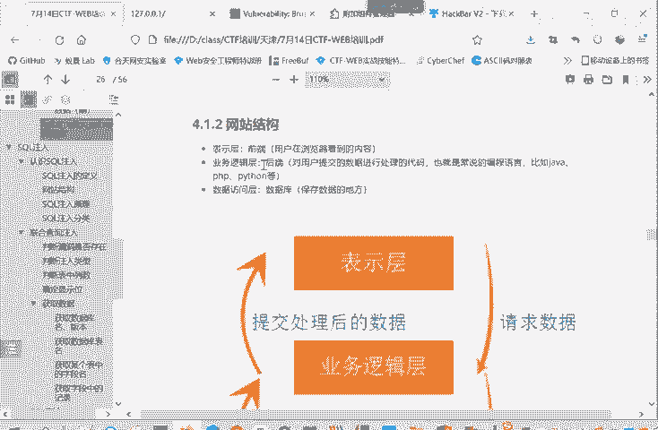
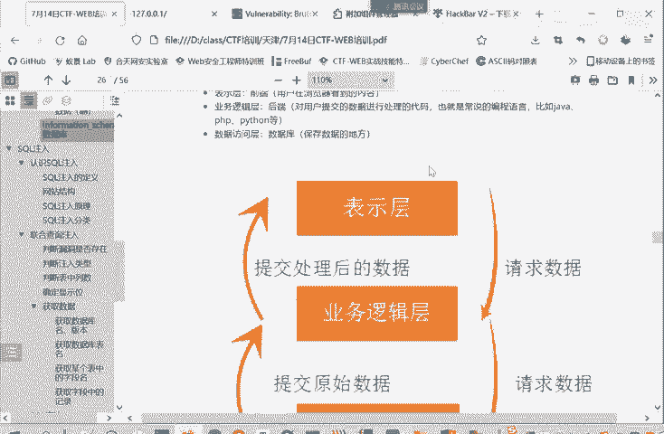
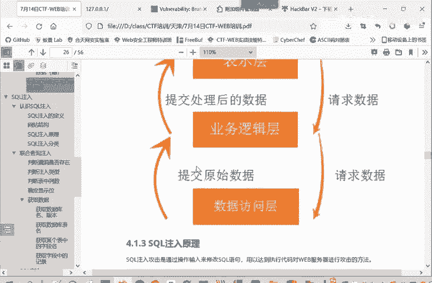
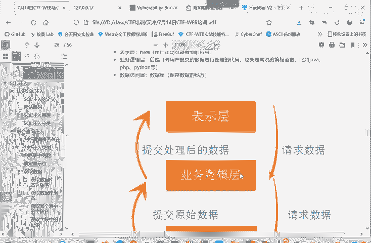
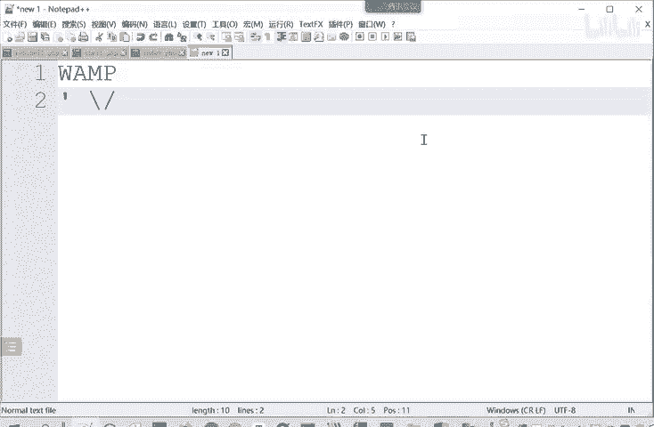
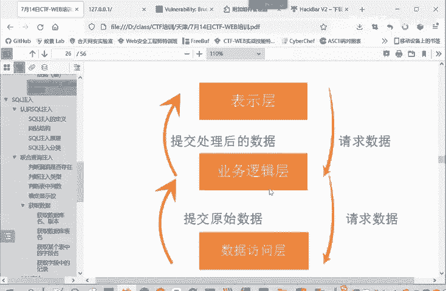

# B站最系统的CTF入门教程！CTF-web,CTF逆向,CTF,misc,CTF-pwn,从基础到赛题实战，手把手带你入门CTF！！ - P18：web-网站结构 - 一顶白帽子_ - BV1zj411W7nn

我们这里看一下网站的结构。

为了更好的理解这个注入的一个逻辑。网站的结构其实可以分为三层，一个是表示层。就是我们说前端，也就是我们这个浏览器。我用户这边看到的是一个保护层。这个表示层。

叫前端。那前端呢把请求发送给后端，也就是业务逻辑层。他对用户提交的数据进行处理。也就我们中央时编程语言或后端语言，javapyython等等。

PH片等等。那业务逻辑层进行业务逻辑处理的时候，它不是能干所有的事儿。他有些事情还是要从数据库中获取数据。

那遇到需要获取数据的情况，那业务逻辑实呢就对数据访护层，也就是数据库发起请求。呃，数据库把查询结果返给业务逻辑层，业务逻辑层再把这个结果看情况是不是要返给这个表示层，也就是把响应清。

把请求响应到这个原来的表示层。这是一个这个网站的一个整体的逻辑。正因为这样，所以我们在表示小区浏览器用户可以输入的。所以这样就存在一个注入的风险。那么我输入的数据是业务逻辑上需要查找数据库查询的数据。

查询了才知道是什么数据。

那如果输入的数据就带有特殊的字符。就是是说比如说单引号啊。节杠啊反斜杠啊。

嗯，行钢行啊这些。那么就有可能造成。就数据访问成查询语句造成一个闭合。然后。控制数据访问层能够真正查询的问据。这样就造成了一个circle注入的漏洞。

