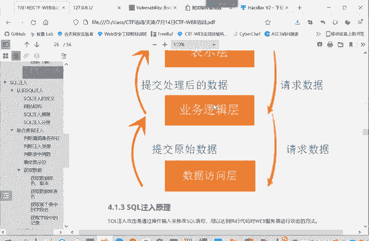
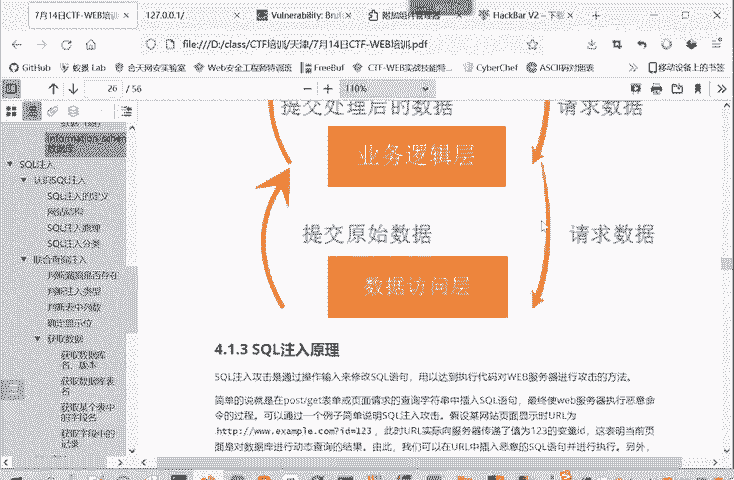

# B站最系统的CTF入门教程！CTF-web,CTF逆向,CTF,misc,CTF-pwn,从基础到赛题实战，手把手带你入门CTF！！ - P19：web-SQL注入原理 - 一顶白帽子_ - BV1zj411W7nn

那我们再看一下srcle注入它到底是一个什么原理呢？circle注入呢就是通过输入来修改circle语句，又为达到执行代码对外服务器进行攻击的一个方法。P。

简单的来说就是在主要是在post或get的表单中，当然也有在cookie当中的。将请求查成字据的scle插入进去。然后服务器呢没有做恶意的命令检查。

那么你这个插入的恶意circle语句就进入到服务器当中，当成命令的一部分来进行执行的。这种情况下造成算入注入呢，就是因为。程序在执行的过程中是被动态的构造。就是。业务逻辑辑层向数据访问的请求数据。

他不是请求死的数据。我请求张三的数据，我请求李四的数据，他不是他请求什么数据，根据输入输入传过来什么，我就请求什么数据，所以这容易造成一个闭合的问题，然后改变就落业务逻辑层以为这段程序的意思。

所这里给大家举一个例子，就是我随便访问一个就 example这个网站ID等于123，这实际上是用get的方式，用get方式参数传递在URL当中的。像参数传递的一个值位123的变量IDID是变量。

123是变量值。啊。然后它后头的语句是这样，ID等于这个我们传进来的这个ID然后打单引号。那你想如果传进来ID它本身就带一单引号，是不是就和前面单引号进行了一个闭合呀？那后面这单引号就不一起作用。

那这中间可能就会出很多问题。所以说这些问题呢就叫做一个circle注入。就把命令注入进去，然后是用的结构化查询语言来进行一个注入。

