# B站最系统的CTF入门教程！CTF-web,CTF逆向,CTF,misc,CTF-pwn,从基础到赛题实战，手把手带你入门CTF！！ - P21：web-联合查询注入 - 一顶白帽子_ - BV1zj411W7nn

那可能没那么多时间了。你要查注的就是根据客户端返回的结果来判断提交的测试语句呢是否被成功的被数据库隐擎所执行。如果说。虽我已经执行了那说明就存在漏洞，一般用单引号或者双引号来判断是否存重。

但是要用英文的符号，我们这里输入命令都要用英文符号，大家千万不要用中文符号。因为那时候可能是报个什么错，你找半天找不出来，实际上就是一个符号用错了。进行一个英文符号的单引号。

或者是一个双引号来判断是否存在漏洞。如果出现X cycle语句错误，那是没很大的可能存担漏的。比如说我们上节课给大家看到的是不是有个DVWV的靶场。

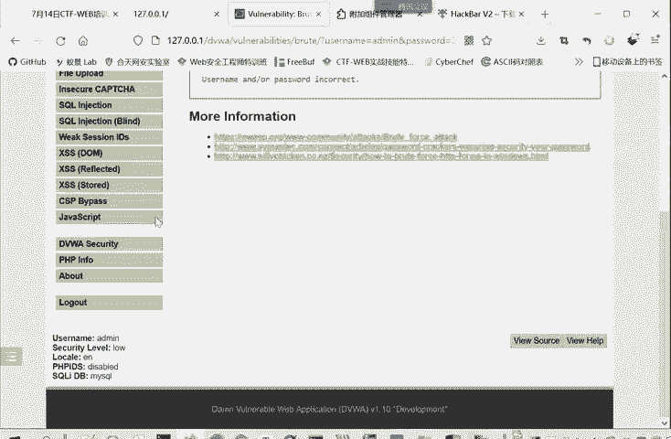

那这里面也有一个数据库板块，数据库注入。下面数据库忙助忙助我们下节课再讲，我建议看数据库注入。

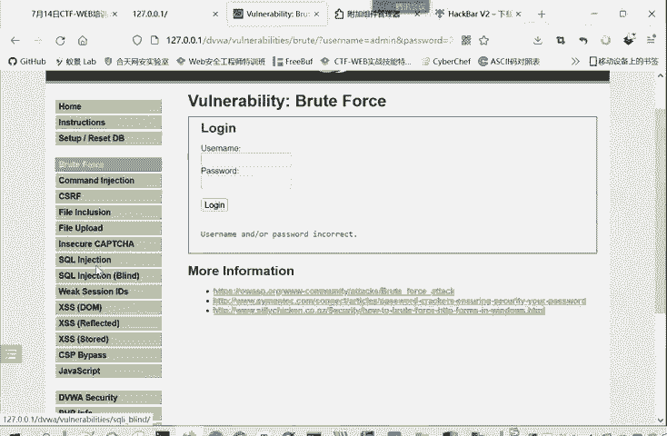

输入ID用户ID，用户ID是一，那就输入adminadmin。我用过那些是一单引一单引号。这能不能作为一个用户的ID呢？我们看一下。

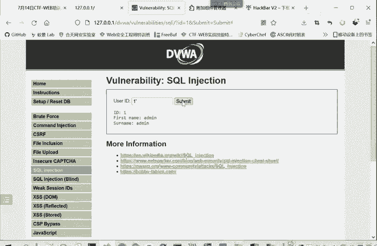

你主前他都告诉。我们有一个语ja口语法错误。

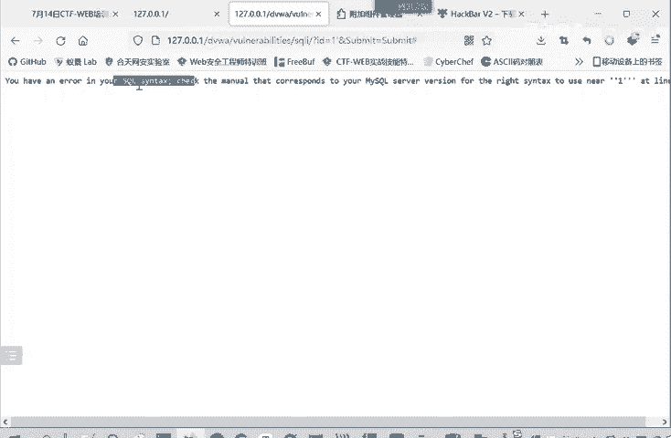

C口语法说。教道你说不应该要。那我用户的ID是一单引号，那直直接给我查询这个用户。用户在的话就返回信息，不在的话就可以返说不存在这个用户。他为什么会报这数据库查询语需的命令是错误。

大家可以思考一下这个原因呢就是。

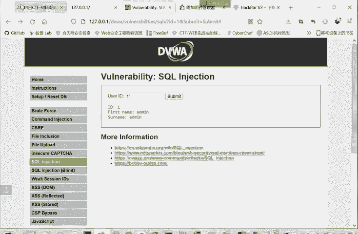

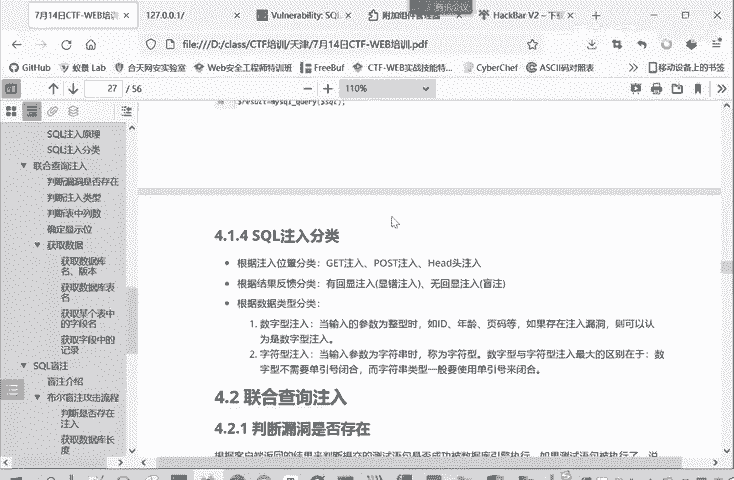

我们这里点如何判断漏洞是否存在？用单引号和双引号判断，像这里一样。你本来加个单引，本来输入一的话是ID等于单引号一。明白这在这里看一下。那么ID。我们输入ID等于一的时候，实际上查询的是2ID等于。

一、电引号表变成了字符型。如果我们查询的是一A引号的时候。实际上查询的是。诶。一下就弹唔出来啦。他实际上弹的是ID。你话这都改成大型号码。他实际上讨用的是这个。那么你前面的人他已经组成一完点背回去。

最后你就多了一个空格。你询问操作不了，他还可能会报错。

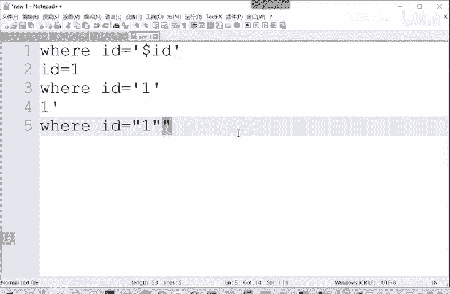

所以一般就是要首先判断出它是字符形还是整数形才好进行这个后面的操作。

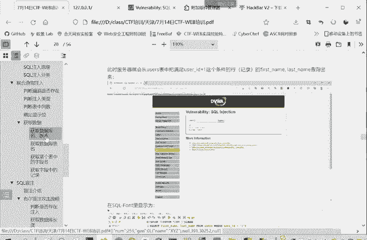

我们先是要判断他是一个。那我们看这两。能判断是否存在一个。通过这样判断是否存在漏洞。他刚才报这个给我们这里报的。

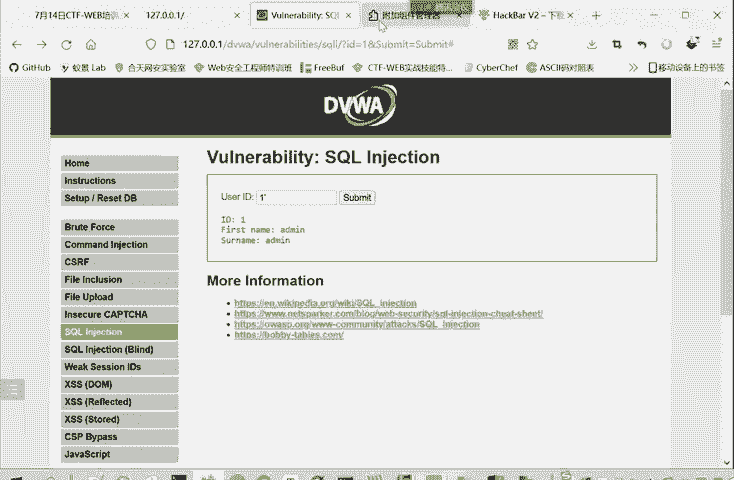

I'm very want。他存在cicle语句语法错误，就是因为。我们这里的。ID这个问题他多了一个引号。那判断发现存在。第一个就存在漏洞之后呢。这里就是详细给大家解释。

那我们就要判断它的漏洞的一个内型，一个注入的类型。类型呢可以是一个数字型，也可以是一个字符型。那么到底是什么呢？我们就要进行一个测试。嗯，比如说我们在靶险内里进行一个测试。

输入。一 and一等于1。哎，它还是差询个一ad me，那一 and一等于2呢，我们看它的结果。哎，他的查询的结果都是一样的，为什么会出现这种情况？啊，这是因为。

我们后端的语句。它是一个字符型，我们这里给大家看一下。嗯。fromus where user IDD呢等于。创1个ID。就这样一种格式。那我们把这个命令。放在我们的这个。连接工具里面可新看一下。

就在DVWA里面操作。查询的是users这个表。我们在这里面也是可以执行命令的。我买点复去吧。我们输入的ID是什么？一开始是一。And。一等于一。那么一眼的1。2呢？也是长了久，为什么会这样呢？

就是因为。他进行了一个影视类型转换，他把一等于1和1等于2都转换成了一。这里实际上你跟输入的结果是输入结果一。除的一，他结果是一样的。如果是一个字符型，他这里直接是。

数字型如果是数字如果正直是多了ID的话，那我们输入一and。一等于一，它就是个处正确的，前面的正确一等于一正确。他可以正常执行。如果是一等于2呢。这是一个错误的语句，前面是正确的，后面错误的按起来。

按就是。与运算那它也是错误。你看他就没有显示信息。查询不当。通过这样的一个方式呢，我们就判断出了。

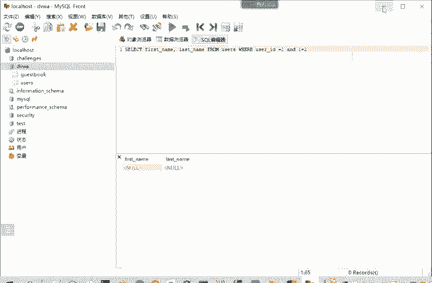

刚才这里这是一个字符型的一个注入。

如果是数字型，你输入一按1等1和按一按的1等2，它结果应该是一样的。字符形呢它结果。数字型结果就不一样，字符型的结果就是一样的。字符型那个数字型的不一样，很好理解。你看前面是一个语句，后面是另一个语句。

那后面语句一个真一个假，那结果答案不一样。但是字符型的为什么结果是一样的？就是因为一个影视类型转换。mysql它自己软件定义的一个隐视类型转换。就是你输入的是一啊1等于1，它需要的是一个一。

你输有的字符串，它需要的是一个整数，那怎么办呢？他就把你的字符串强制的转换成一个整数。一的一等于一和一的一等于2，这都是强制转换成一。所以他们两个输出是一样的。那我们判断了这个。

注入的类型发现它存在一个字符性的三后注入。那我们就要判断。这个它输出结果是多少列？

他后端的语言呢。这个我们现在这个靶卡就是。我们可以去看一下这个靶场，它后端的。

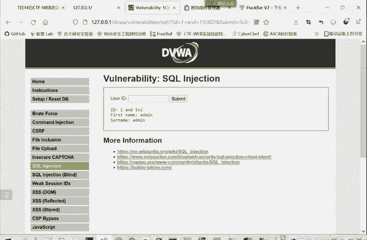

不端的语言是。是什么？负端具体的那个脚本程序。我们现在看的是no。它实际上是吧把我们传入的参数。获取参数ID。然后怎么查询呢？

select first name  last name from userswhere I user IDD等于ID叫selectwhere这些。命令大小写都是可以的。它实际上是查询。

它输出的结果是两项，是不是？但是我们在这个前端呢是不知道。

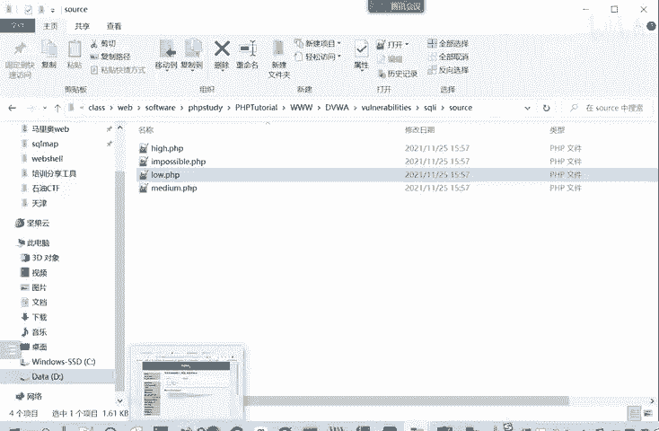

这你是不知道他输出。它这显示结果是两项，但是后面的查询结果是几项，我们是不知道的。显示结果这里是三项嘛。ID first name算的。那查询的数据结果是多要项的，我们是不知道的。

因此呢我们要有一个方法来判断后台语句查询的列数。

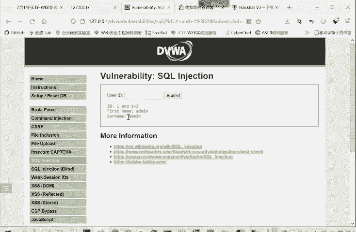

我们这也是一个优劣联合注入嘛，就确定了列数，确定了显才能确定显示位，才能进行后续的一个利用。

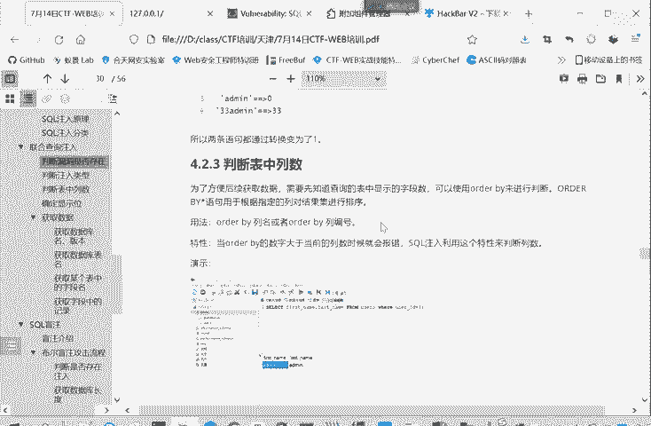

怎么确定列数呢？就用这个word by来确定。我们现在我们的。这个。研究软件上进行一个尝试。我的。but比如说我的办2看一下。把这个未染条件先去掉。它是这样显示的那word by一呢？

还里面它显示的顺序啊有所改变，mod拜你看一下。🎼没有。他说不存在理念。word by first name也可以，那word by是什么？就是我输出的结果是有好几行，这几行是按照什么顺序来输出。

就叫w by。我按照什么顺序呢？我按照first name，按照这一行的排列顺序来进行输出。可以，或者是我按着lastt name来进行排列输出也可以。那。😡，不知道做短名的情况下怎么办呢？

我按照第一行，它是第一列至列从第一一起步，我按照第一列来进行输出排列，结果是不变的。你按照第二列，那就是2。来排点结果就会变，是不是？那么如果说我不按照一2列，我按照你列排，刚才说报是不是有错误。

我按照三三列来排呢，它是说不存在第三列，那会出现什么呢？🎼他也会报一个数，说不存在第三点。那么通过这样的方法，我们就知道这个语句，它输出的列数应该是2，它是选择两列来进行输出的。

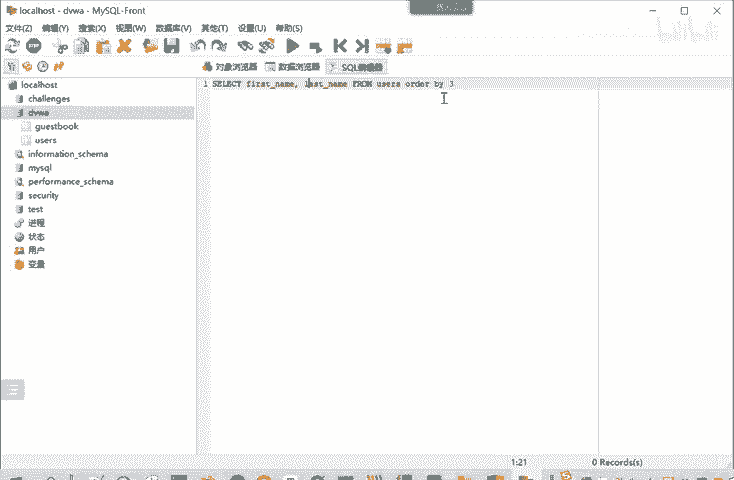

那我们这里这个题也进行一个判断。比如说输入ID等于1。

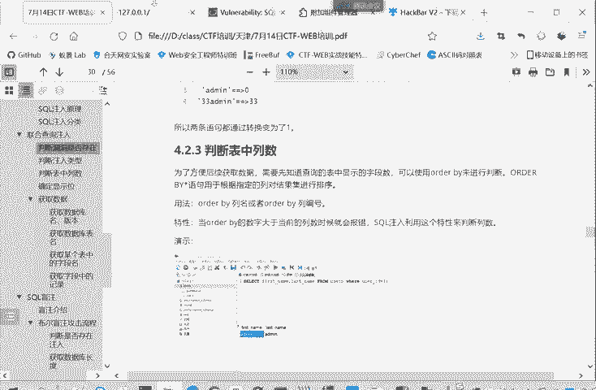

那么我们。要闭合前面的一个，是不是？然后在word back。2。那你后面呢还要加上一个井号，为什么？因为他你看我们输入I一word by2是什么效果，我们看这个。

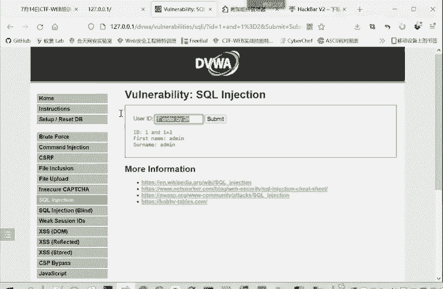

先在这个脚本里面看一下。它这里是要我们填入这个ID嘛，我们把这个ID替换成我们输入的量。这前面是一个正常的语句，然后这里是forby，这里是2，这后面还多一个引号。因此呢我们要输入这个井号，井号是注释。

对吧？后面内容都注释着，不要了。那前面这里呢就是我们所希望执行的一个circle语句。

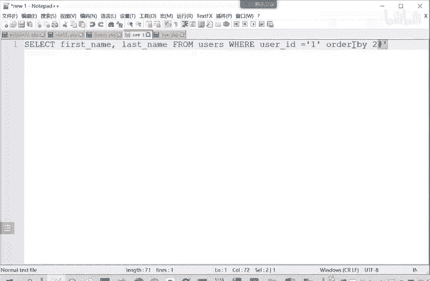

是不是？所以这里加这个井号是起到注释掉后面那个单引号的一个作用。那我们这里进行一个提交，来，发现能够正常显示。那么。哼。说明他输出结果至少有两列。那有没有删件呢？我们。

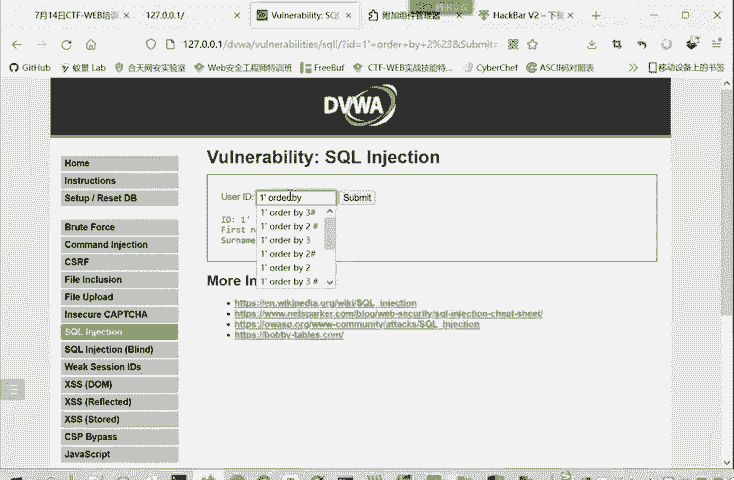

过了拜三看一下。他说啊，不知道第三点。

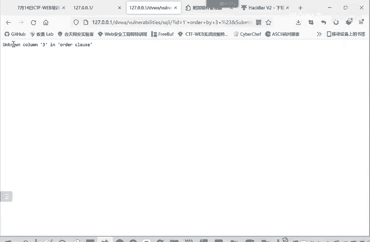

从这结果我们就知道它的输出结果是有两面。因为可以wordor by2，但是不能modor by3。

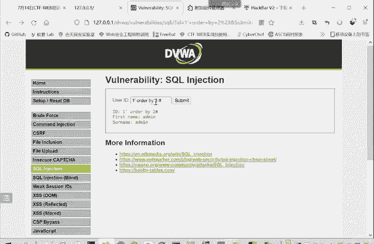

这就是判断表中的列数的一个方法。

它这个表中的列数不是说我们最后端这个啊getbook这个表有几列啊，不是这样的，是我们后端这个查询语句。

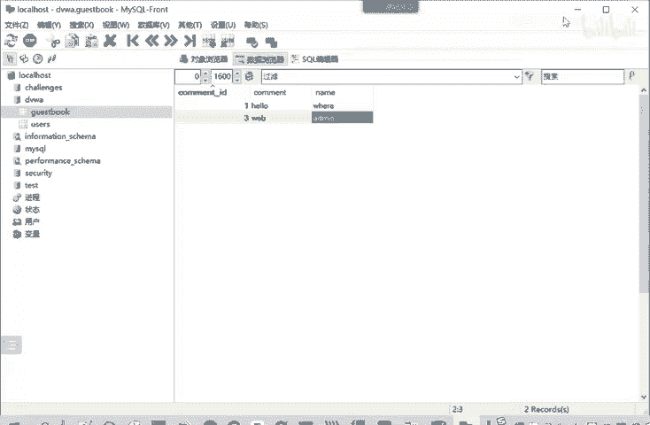

查询语句的输出是输出几列。这个利用的原理就是说你我在 buy的时候。第一第一列就是一，第二列就是2。如果说你修。一个不存在的点，它就会报错。你使用存在的键123，它就会正常显示。啊。

这几课件当中也是写的挺详细的，大家可以回去自己操作一遍。叫你解释一下，加引加引号。在我们这里是加这个井号，如果在URL当中呢，就是加23%。

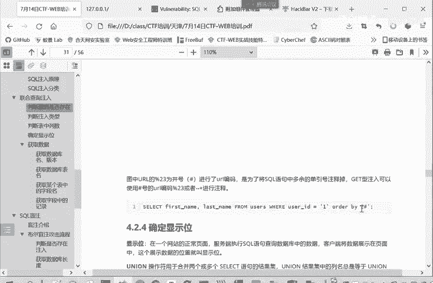

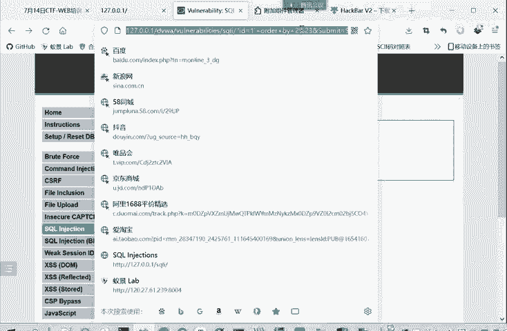

因为是井号的一个编码。确定显示未。

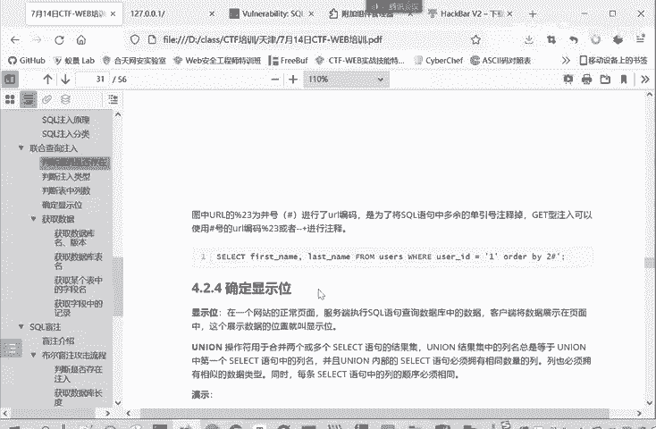

我们现在知道它两列了，我们就能够确定显示位。如何确定显示位呢？就是用这个union联合查询注入。我们要看一下union。

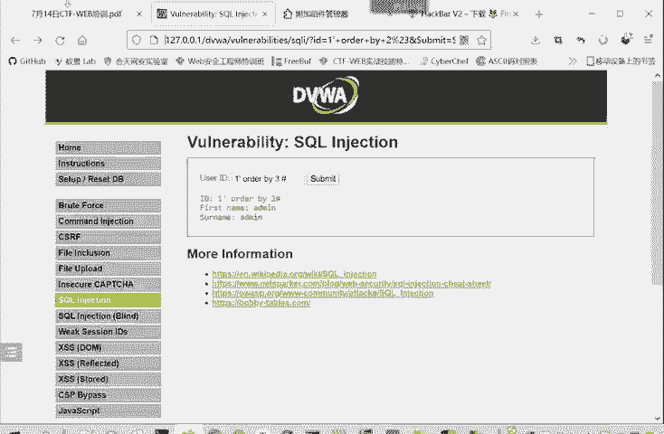

🤧嗯。重点是你解union这个操作服。然后union操作符呢就是用于合并两个或多个signnic语句的结果集。我这里先在我们这个软件当中演示一下。比如说 say那个fa name，拿 name。

From users。这个排序就不排了。是一个依据。这是一个语句。Oh。呃。其他的人就别开那个语别开语音了，免得影响别人听课。有什么问题的话，就发到微信群里面。不要打开会议的声音，点击下静音。啊。

我们继续上课，这是一条 syn语句。那我还可以查看。这个first namelast name还有个user，这是从user这个表里面看的。fromus的这个表嘛。我也想这也是一个s syn语句。

我想这两个语句同时进行输出怎么办？这时候就可以用一个连接服。优点U平ION。输入连接符，然后再这行。看前面显示的是这个first name last name，后面显示的是user。

或者是后面我办个不一样的。小。Passor。你看后面的部分就是password。🤧这是last name，这部分是一样的。这个优点作用呢就是将两个cex语句，它的结果这前面是第一个cd语句，结果。

一直到这bo。就后面的这个哈奇质呢就第二个cn语句的结果。🤧。他将这两个语句的结果合并输出。这就是有脸的作用。我们这里为什么要用到优劣？大家想我们之前是不是通过这样的方式输入1个ID等于1。一。

这个单引号把前面的闭合了。那前面是一个cex的语句。那么我后面是不是可以不输入？这个我这办输入uni。那我自己再输入一个cax的语句。然后查询结果和前面的一起输出。

这样就实现了一个攻具者查询或者查找这个。打击或者是受害者的数据库的一个目的。所以我们这里学习的这个优点。那为了实现这个联合的输出呢，永年有几个要求。我们看一下。

union结果其中的列名总是等于union第一个se next语序的列名。是这样。我们这里第一个语句选的是first name和last name这两点。第二个。

选择password和n name这两点。那么这个整个输出的列名呢，就是第一个sute语句first name所决定的。你后面尽管是你选的pas word列。

但是你也输出在这first name这个列名下。他不会给他另起一个匿名，或者修改他匿名。以第一个为准。这是它的一个特点。第二个特点呢是。有有点内部的s next的语句。必须有相同的树立能力。一。

就什么意思？你们这里看一下，就我前面这个语句输出是两页。那么后面这个语句输出也必须是两列，这就是我们刚才用what by确定列数的一个意义。如果说这里我不是说两点。我还多说出一点user。

🎼那么再执行吧。🎼你看他会报。s next输出有一个不同different number of columns不同数量的列。它前后两列的前后两个声调的语句，它的列的个数必须是一致的。这你少一面。

🎼也是不行的，它必须是同样个数的列。这是哪两你也没有关系，有个数必须是相同的。这你也可以再次看到这个列的名称是由第一个现态和语句所决定的。但是后面的这个输出的结果，password的用户名呢。

这还是正常的这个用户名，它只是归在first name last name这两列下。

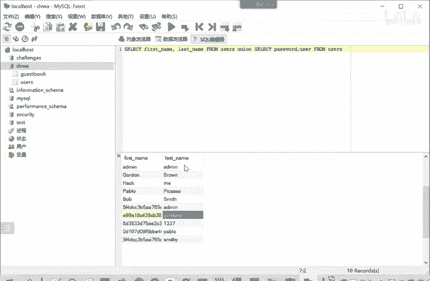

嗯。这你刚开始大家可能就是有一点让，不太容易理解。但是大家。啊，多去操作几遍。对个课件多操作几遍，应该是能理解的。嗯。😊。

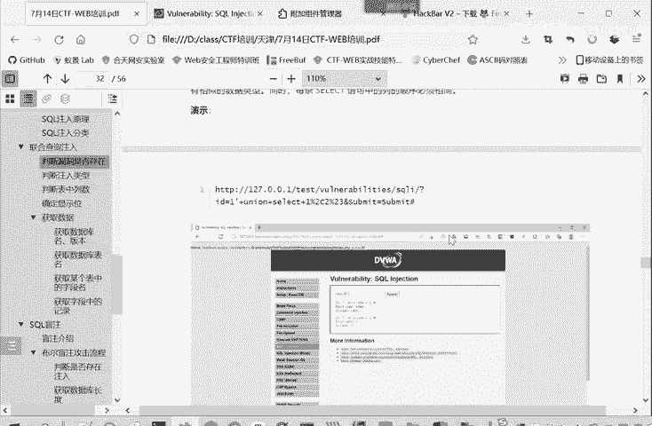

那么们这里再在这个靶场上演示一下。我们之前也知道他输出结果是两列。我们首先用。知道是字符写，就用一单引号来进行一个闭合。知道结果是输入两列了，就推那个unionun。

后面再输入我们自己想要查询的一个语句。我们自己想要查询的什么pasword。牛仔。Drrum。牛仔。然后再用井号复示掉后面多余的那个单引号。是不是？😊，这样。就把我们想要查询的这个。

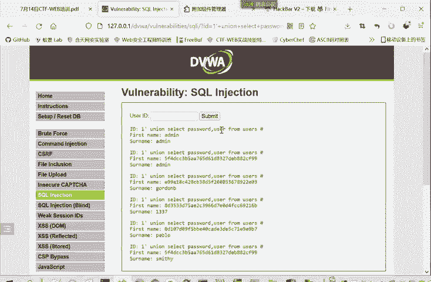

password user进行输出了。

C在12也可以。看就显示你看first name是一，但 name是2，说明first name是我们se next，选择第一列的结果就是放在first name下面。第二列结果就放在s name下面。

有的网站它只会输出一行结果，我们这是有多少行输出多少行，因为这个靶场嘛是是了演示，那有的网站只会输出一行结果怎么办呢？我们前面改成负一。你想查询ID等于负一肯定不存在这个用户。那么第一条结果就不会存在。

它只会输出第二条结果。在有的网站他只输出一行结果的时候。只输出一条结果。那么。你就是用这样的方式把前面一行使它结果为空，那么就只会输出你想要查询的。数据。

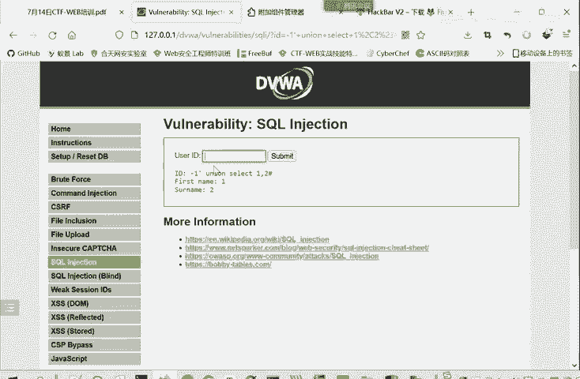

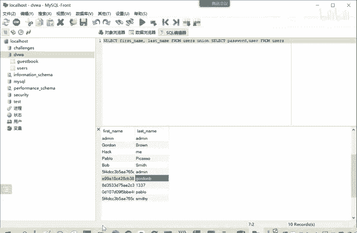

这是优年的一个。

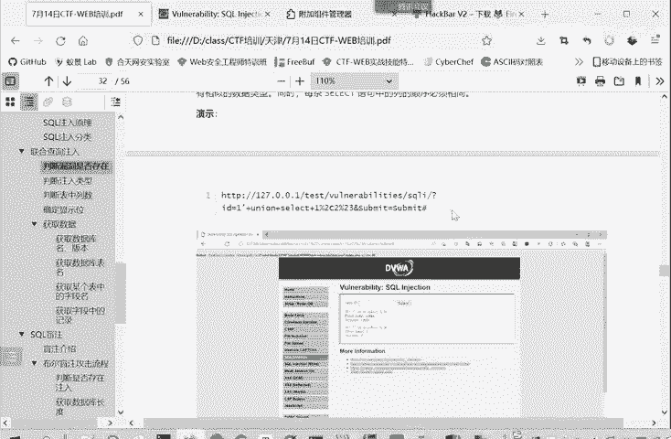

都有。那么我们这个联合查询注入就这就是这样优点就是联合查询注入。我们再回过头来看一下怎么样判断呢，怎么样做这个题的。首先要判断漏洞是否存在。就先输入一个正常的IDE来查出了。

然后在IDE后面加上一个单引号双引号进行一个判断。如果出现scle语句是错误，那么就是大概率是存在漏洞的。因为。我们就明白他后台在执行circle语句查询。那么我们就可以尝试拼接命令。

注入我们自己想要执行的一个命令。嗯。那发现它存在漏洞之后呢，我们就要。判断一个注入的类型。注入类型呢就通过。输入一 and101和E的102，看他的结果是否相同。本身。这是真这是假。看它结果是否相同。

如果说它输出结果是相同的，那么它是一个字符型的注入。如果它输出结果是这两种输入，输出结果是不相同的，那么它是一个数字型的注入。珠字型的柱入后面就直接用，不需要闭合单引号，不需要。

去除掉注释的最后的单引号。如果字符性的注入呢，你在使用的时候。嗯，我们这里看。在使用的时候就要先输入一个代元号，闭合掉前面代元号。然后最后呢要输入一个。这个23%在URL当中，也就是井号。

来注释掉他原来多的那个代银号。这是一个字符形和一个数字型的一个区别。那确定了判断漏洞存在，确定了注意类型之后呢，比如我们这样一次浮现。我们就。想要查询我们的数据，但是我们查询的时候，这里优点他需要知道。

这里优点有几个要求，我们看一下结合中的列名呢总是等于第一个页名，并且内部的Cn语句必须用相同数量来列。因为它前一个sender一句是这个后端，这个脚本写好的，后端全区写好的，我们是没法改的。

我们也是不知道的。我们所以我们自己注入的seec语句呢，只能够跟前面的seec语句。就是这个。脚本后边他自己网站的Cd语句有相同数量来念。所以因此呢第一步我要确定网站的Cd的语句，网站的数据库查询语句。

他会输出多少个列。需要确定列数。确定列数呢就是。我再办来确定。这个列存wo by123，这个列存在的就会正常显示，不存在就会爆。不存在的列，通过这样的方式呢来确定列数。

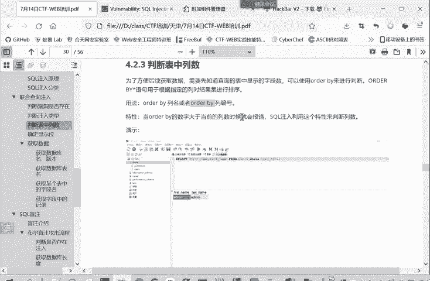

确定页数之后就确定显示位。检修位就是我们这里的。🤧12。就是我snic的，我自己查询的第一列是输出在这个哪个位置。因为列的名称是由上一个snet决定的，我是决定不了的。

所以我得通过这样的测试来知道我选择了第一个念，它的结果会输出在这个网页的什么位置。就输出在first name chain这个位置。然后第二点是输出在username这位置。那么我后我后面选择。刘转。

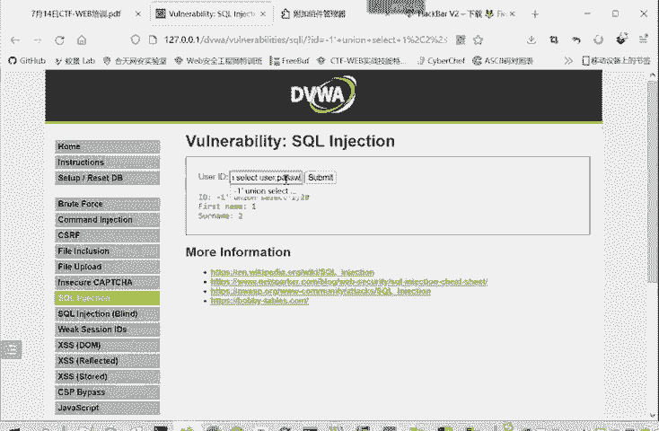

's the word。那么我就知道我。

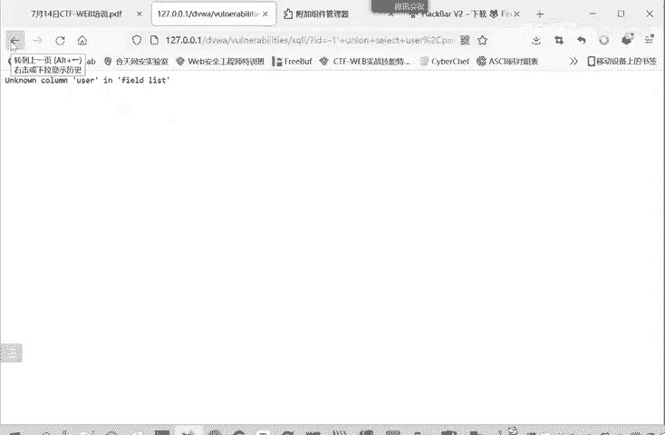

系要。有点。From users。那我就知道这first name下显示的是我的user下。s name下显示的是我的password。

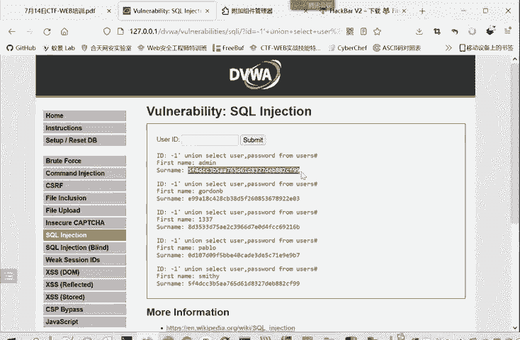

这这一列的值。就要确定显示位。这就是一个整个一的过程。那么后面就可以继续获取它的数据啊。