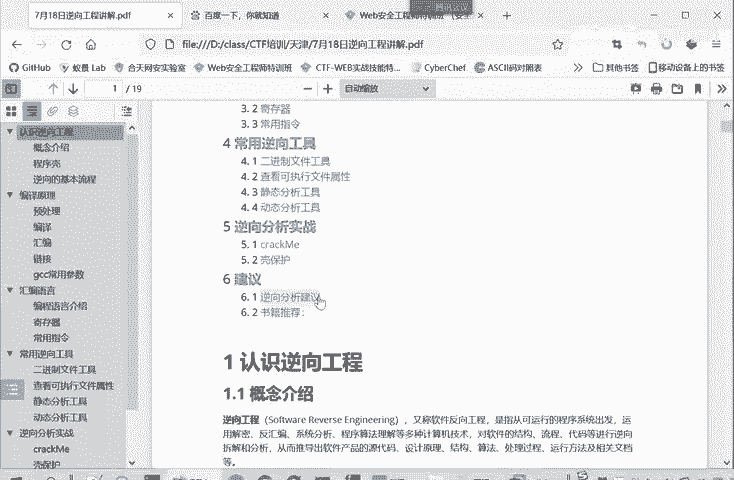
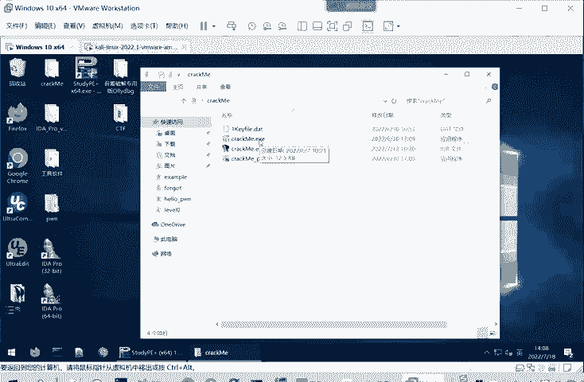
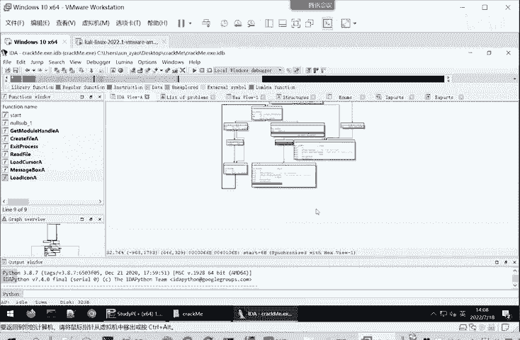

# B站最系统的CTF入门教程！CTF-web,CTF逆向,CTF,misc,CTF-pwn,从基础到赛题实战，手把手带你入门CTF！！ - P23：CTF逆向-什么是逆向工程 - 一顶白帽子_ - BV1zj411W7nn

我们的课程呢首先是给大家讲一下啊逆向工程的一些概念。然后呢会给大家讲一下编译的原理，就怎样由一个高级语言写成代码转换为一个可执行程序，可执行的二进制文件。

然后第三部分呢给大家讲一下汇编语言还的一些计存器情况，还有一些常用的指令。然后第四部分给大家介绍，常用了一些逆向工具。然后第五部分呢带大家分析两个逆向的。实战例子。然后最后是一些意向分析建议。

还有一些相关的书籍给大家介绍一下。

那我们首先来看一下逆向工程的一些相关概念。所谓逆向工程呢？它英文叫software reverse engineering，软件逆向工程，又叫软件反向工程。它是指从可运行的系统出发。运用解密。

啊汇编系统分析、程序理解呢等多种计算机技术，对软件的结构、流程、代码等进行逆向拆解和分析。它目的呢是推导出软件产品的源代码或者设计原理，或者它结构算法处理过程。的。比如说。

我们大家经常用到1个360杀毒。他为什么能检测到杀毒程序？它就是因为对一些病毒进行了逆项工程，提取了这些病毒的特征。那么一旦你下载了一个软件，它检测了这些特征呢，那么360就会给你报啊。

这是一个危险的软件，或者说这个软件存在病毒。那么我们看一下CTF比赛中的逆项是一个什么概念呢？这是全国大学生信息安全竞赛参赛指南。所谓信息安全竞赛，就是我们这个CTF比赛。

它是涉及windowslinux安卓平台的多种编程技术。要求利用常见的工具呢对源代码以及二进制文件进行逆向分析。还要掌握安卓移动应用APK文件的逆向分析。

掌握加解密内核算法、内核编程、算法呀、反调试以代码混淆技术。它就是涉及到多种平台，有windows Linuxux还有安卓。要对应用常见的工具，对源代码对二进制文件进行逆向分析。那么逆向工程的用途呢。

我们看一下，第一点呢就是逆向工程可以。分析已经编译好的软件。所以这个编译好的软件，也就是二进制的可执行文件。然后使用高级语言来重现它。🎼所以这也是为什么叫逆项工程。

因为我们后面会了在大家讲这个编译原理的时候，给大家讲如何用高级语言写写成代码转换成一个二进制的。可执行文件。从逆向工程呢，就是从这就是反着这样一个编译的过程，就是从二进制可执行文件。到这个高级语言。

还是和正常的编译一个相反的过程。它第二个作用就是说可以分析病毒，提取出特征码，它用于开发杀毒软件。第三部分呢就是高级代码审计。我们嗯接触过代码审计，就是审计源代码，看他用到哪些危险的函数啊。

或者说存在什么一逻辑上的漏洞。答逆向工程就是一种更高级的代码审计，它直接审计这个二进制的可执行程序。在汇编层面审计程序，然后发现这个程序存在漏洞啊等等。第四个作用就是用于开发游戏外挂，也就破解软件。

或也是。用于制作那个激活码，或者是破解用户名口令，同样的也可以用于制作反外挂的软件。然后第五个作用就是它可以分析嵌入式设备中的漏洞。现在就是物联网设备是越来越多了，所以这有嵌入式的设备。

是越来越多的这里面的漏洞之前还开发利用的比较少。所以说嵌入式设备的漏洞也是逐渐成为一个热点。而，立项工程呢可以分析嵌入式设备。中他们安装的程序以及这些程序是否存在一个漏洞。那么如何进行立项分析呢？

主要是。主要是涉及到。我们的一个静态分析和我们的一个动态分析技术。我们首先看一下静态分析。静态分析呢就是在不执行计算机程序的情况下。对源代码进行分析，找出代码的缺陷。

这个源代码我们很多时候看不到怎么办呢？一般是利用这个静态程序分析工具，将二进制的可执行文件翻译成汇编代码或者C语言伪代码。我们利用这个静态分析工具来将二进制文件转换成汇编或者是C语源代码。

因为直接的二进制可直行文具，直接的机器嘛，那个呃基本上没人看得懂。必须要转换成这个汇编代码或C元的伪代码。我们才能够进行一些分析。这里为什么叫C语源伪代码？就是因为它不是真正。

编写这个二进制文件的CC语源代码，只是我们静态分析程序。比如说IDApro。它根据你这个二进制可行文件转换成了C语言代码，就起到同样的执行效果。但不是说你这个软件的源代码。

那么这个静态分析技术有什么优点呢？就是第一点，它可以直接面向源码，分析多种问题。他是。面向源代码或者是。通过二进制可行性文件翻译，就是反汇编。反变译而形成的C语言为代码。第二个呢，他能够同时看到所有。

的可执行路径的组合快速准确。第三个特点啊就是说静态分析不需要执执行工具。执行程序它不会被恶意代码攻击。就是说我们分析的这些软件程序，它很可能是一个病毒程序。静态分析就不会执行这个程序。

当然也就不会被这个恶意代码所攻击。比如说我们打开一个。

呃，静态工具来进一个程序来看一下我们后面要用的一个程序。

我们用IDA打开，因为这是32位的程序，所以我们用IDA32来打开。通过我们静态的来看这个程序呢，看它的流程执行，我们可以一目了然，从总体上把握啊这个程序。它的一个运行逻辑，它会有多个分支。然后我们。

可以仔细看，然后每个分支。

是根据一些什么条件来判断程序执行的时候走哪个分支。这有于有利于我们从总体上把握这个程序。而如果说动动态执行的话，你只是它只会呃你报具体执行到哪一句，你难以像这样从总体上把握这个程序它的一个。运行的逻辑。

或者程序的个总体的代码情况。这是我们静态分析的特点。那么与静态分析相对的就是我们的动态调试技术。的动态调试技术在我们软件逆向工程领域也是一个很热门的概念，它是与静态分析技术相对而言的。

静态分析呢是不执行程序，那么动态分析呢就是执行程序。但是在执行的过程中呢，这些破解者。也就是我们这些逆向工程的分析人员会利用调试器。跟踪软件的运行。然后寻求破解的路线啊，或者是寻找那个病毒的特征嘛。

这就看具体的逆向的目的。我们动态调试技术一般是在观察程序运行过程中的状态。比如说寄存器程序运存的时候，并写到某一步它的寄存器里面是什么内容了，然后函数输入是什么，输出是什么？然后内存。

是什么一个使用和分布情况？通过观察这些状态来分析函数的功能，明确代码的逻辑，挖掘可能存在漏洞。其实我们动态调试就术重点就要关注一个代码流，一个数据流。就是代码流我们刚才通过静态来看。

发现了还有很多代码有很多分支。那么我们就通过动态调试可以看到它在程序运行的过程中，具体是执行了哪一些分支。而没有执行另一些分支，或者说是在输入什么样的参数的情况下执行这个分支。

输入什么样参数的情况下执行另一个分支。我们可以通过动态分析来确定这个代码流，就是它执行的代码是哪些？然后一另一个关注的重点就是数据流。比如说大家要关，比如说要破解一个软件。

它需这个软件本来是需要验证码才能够运行的，或者需要一个激活码。那么就可以跟踪。就可以在调试的时候随意输入一段激活码，那肯定不是正确。然后跟踪这段激活码在这个程序中的流向。

就是这个激活码先被哪一个函数接收了，然后进行了什么样的处理。然后把这个处理结果呢？又交给啊第二函数进行一个处理。这样就关注我们输入的这个。激活码。他在这个程序中的一个流向就叫数据流。

通过分析代码流和数据流来澄清这个。程序的一个机制，这也是我们立项工程的一个目的。那么动态调试技它也有它的优点。第一点，他可以更好的判断程序执行的流程。像我们静态分析，你就不知道它的代码流向。

或者不不那么明确动态分析的。他就会让我们更加容易判断程序是执行哪一块。然后下一步又跳到哪一块去执行？第二个特点就是可以跟踪数据流的一个走向。比如说跟踪。输入的用户名额口令经过呀什么样的计算呢转换呢。

然后最后经经过怎么样的验证，就是数据流啊验证码这些在程序中的流向。然后第三个特点呢就是程序是装载到内存当中执行的。那么就可以看到内存中的地址信息。比如说我们看到。下面提到寄存器的内容啊。

函数站它的一些输入输出内容啊，内存的使用情况等等。第四个特点呢就是。可以帮助我们更好的理解和修改程序。我们可以更改寄存器的值，甚至更改内存处的值，内存某一块的这个存储的值。从而改变程序的走向。

其实静态分析和动态分析，他们是各有优点。通常是组结合起来来使用的。因为我们分析一个软件，通常一遍你是不能够理解的很清楚的。你需要反复的看我静态分析先分析一遍，然后动态调试来看一下。

然后我又回到静态里面去看，要经过这样反复的过程，才能够真正的澄清一个软件的机制。