# B站最系统的CTF入门教程！CTF-web,CTF逆向,CTF,misc,CTF-pwn,从基础到赛题实战，手把手带你入门CTF！！ - P5：web-Hackerbar的安装及使用 - 一顶白帽子_ - BV1zj411W7nn

然后我们介绍第二个工具，也是一个重要插件，就是hiick bar。

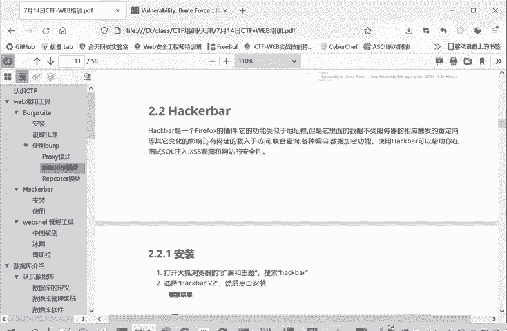

它是fire f的一个插件。这你为什么给大家说叫fire f，因为它是最方便用的，你在谷歌上也能用，但是经常要挂梯子，这对有有的同学来说，就可能没有这个条件。

那么就在这个。火红那边进行一个安装，怎么安装呢？还是在的，因为都是安装插件嘛，跟刚才switch欧美感是一样的。在我们这个扩展板块里面进行搜索。

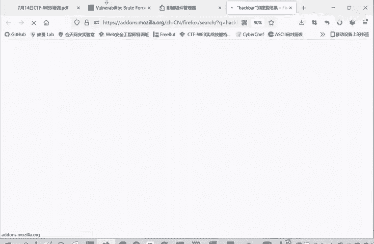

黑 bar下面的这个是要收费的，下面这个黑 barV2是不需要收费的。大家根据自己的情况。

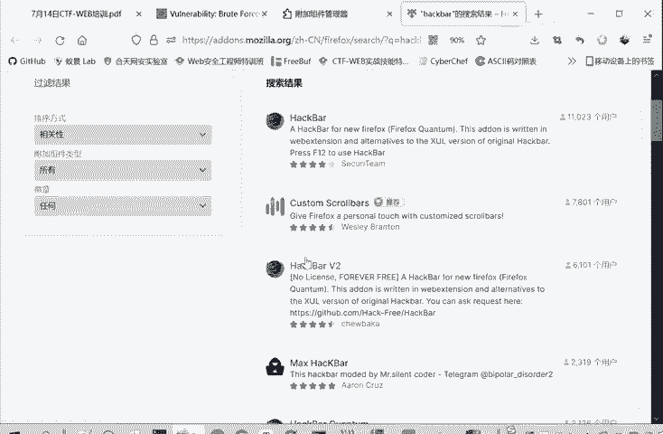

啊，选择一个插件，我们点击进入。同样的也是没有安装的，这里点击一个添加。

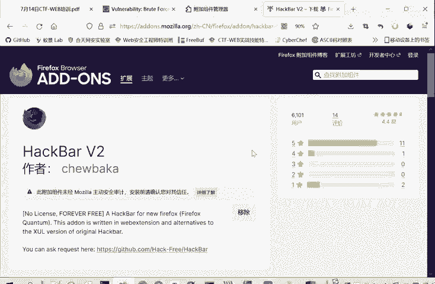

想安装的想删除的，点击移除就可以了。

安装好之后呢。它不会出现在这个上面，它的swution文卡不不一样的地方。他是。我们可以检查点击右键，点击检查或点击F12键进入我们这个开发者模式。

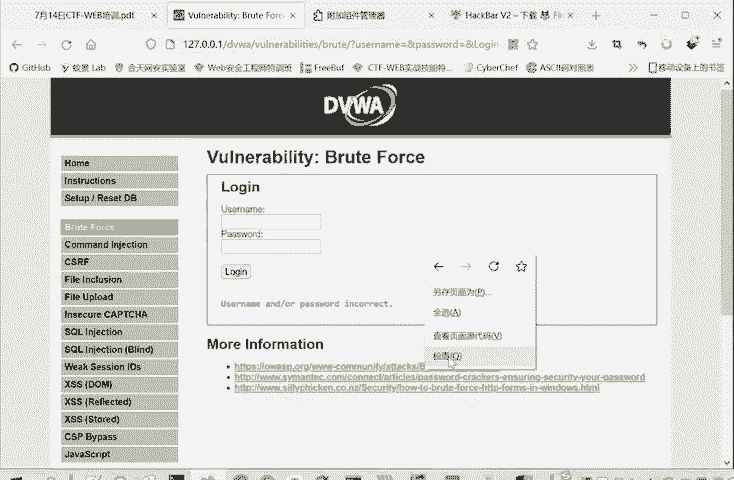

开发者模式这边呢就会出现这个黑 bar这个插件的选项，我们点击就可以了。

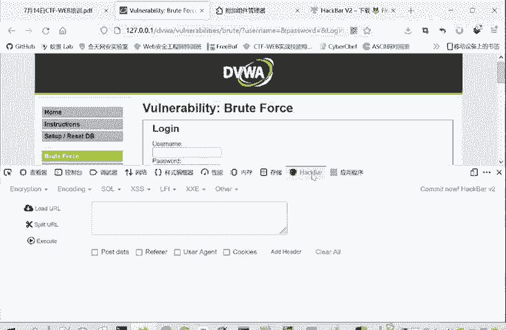

比如说我们这里啊这里试试验这个口令的时候。我们可以点load的URL，把这URL。就是导入进来。如果说我们不通过bap，我们通过手工来试呢，就可以在这里再进行试。

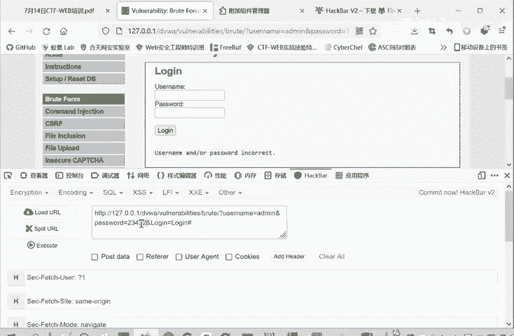

点击下执行。他就相当于访问了这个URL。

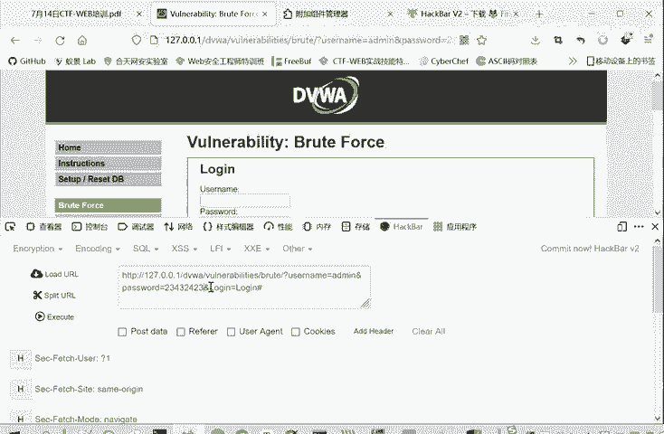

它不是在这里面在在这里面修改也是可以修改同样的效果。但是你如果用bb修改的话，它这里是稳定的不变的。

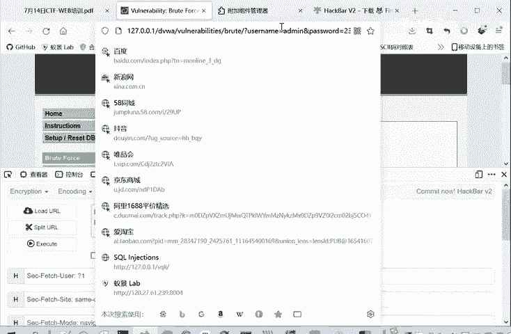

就是更方便进行一个修改，它还可以添加一个post date。还有这个其文就文件的这个refer，就是这个网页，它从哪里跳转过来的？UZ agent这些都可以酷这些都可以进行一个修改。

所以这是一个非常有用的一个插件。

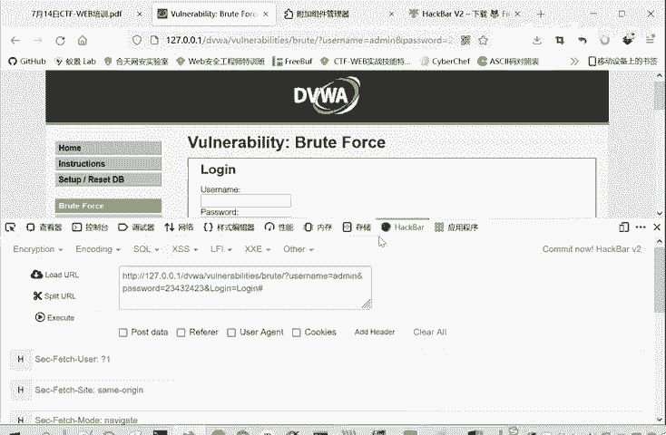

在们外不安全中是很有用的。所以说也推荐大家把这个插件进行一个安装。

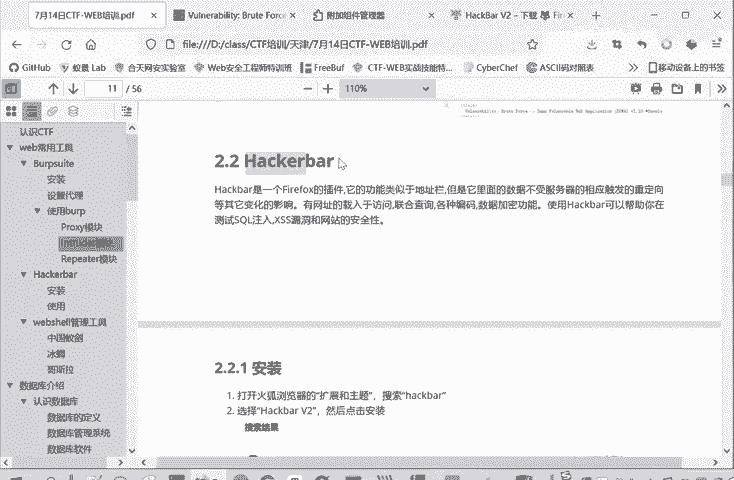