# B站最系统的护网行动红蓝攻防教程，掌握护网必备技能：应急响应／web安全／渗透测试／网络安全／信息安全 - P10：蓝队应急响应-9.入侵排查实战 - 跟小鱼学安全 - BV1SF411174M

阶段。好，检测阶段。首先就是我们要举一个实际的例子，就是很多啊咱们刚入门网络安全的同学都会遇到的一件事情。就是啊咱们喜欢把自己的靶场，或者是网站或者是博客，博客，你们用过很多。

比如说像wordorpress，或者是其他的一些CMS去搭建自己的博客。把这些网站去搭建在云服务器上面，并且开放给自己的同学，或者是开放给其他的互联网用户去使用。那你有没有想过？这一个网站去开放在公网。

会不会有人去攻击你？如果有经验的同学应该知道，那自己的服务器只要去搭建在公网上面，就搭建在互联网上面。你是无时无刻的都被攻击。国内的也好，别人想去测试也好，还是一些境外的。

你不知道他为什么这么闲的人也好，反正就是无时无刻的在对你进行攻击。那我们现在在讲，如果被攻击了怎么办？首先你的云服务器啊，我是站在咱们这个就是新手村的一个角度去讲啊，如果被攻击了。

首先第一件事情你应该感觉很高兴。😊，为什么呢？因为我们现在有一个非常好的应急响应排查的实力摆在你的面前，你难道不想去分析黑客是如何把你攻破的，你如何去分析黑客给你留的这些挖矿挖矿的木马。

你看到黑客去控制你的服务器，你不想去探究一下原理，把这个远控的木马找出来去逆向分析一下吗？你应该有这种兴趣和爱好，你才能把咱们网络安全的路子走好，你不能说哎现在被打了怎么办？被打了关机了。

或者是我不要了，我以后不不敢搭了，你这种行为，你怎么能把它选好呢？是吧？你首先这个兴趣就不够。😊，好，我举一个简单的例子啊，这个例子啊是我搭建的一个windows的服务器。

那这个windows的服务器啊，我在里面安装了一个非常常见的DVWADVWA很多同学应该听说过。如果你没听说过的话，现在了解一下，它是1个PHP编写的网站可以用作咱们渗透测试的一个靶场。

那现在我这个网站啊出现了一定的问题。😊，就是哎他被黑客去打了。什么意思呢？比如说我现在去访问一下我这个DVWA。访问之后，他就会去输出一个hello stupid，就是在这个。哎，说脏说脏话。

说脏话之后啊，我们只要点击确定，你会发现啊它就进行了相应的跳转。他就进行了相应的跳转，去跳转到了这核天火案实验室。因为啊我这里是做教程，我不可能说真的给你去跳到一个恶意网站是吧？这样的话。

到时候这个警察是吧？他给我送了一个银手镯，这可就不好了。所以说呢我这里模拟的就是被入侵之后，跳转到了另外一个网站跳转到了核天火案实验室。😊，这一点在咱们实际的上网过程中，是不是经常的遇到啊，经常遇到吧。

你打开一个网站，它突然跳走了，很多同学都见过啊，那这是什么原因呢？很明显，你觉得是啥原因，那肯定是你的网站被黑客去改了呀？😊，那被改了怎么办？我们要学会一个排查的。作用。首先有同学说到被劫持已被重定向。

那我们就要想。黑客是怎么进行劫持和重听箱的？第一个方向我们先考虑一件事情啊，就是说他到底怎么打到我的这我才可以进行规范的排查。第一件事就不要急啊，咱们一定要慢慢的去去做这件事情。第一件事也就怎么打的。

😊，怎么打的？我们想象一下。😊，有有同学说劫持，比如说像DNS劫持，像ARP的一些攻击。那这些在2023年其实非常非常少见，就你家里的小小的路由器啊都能够去防御这些。呃，这些流量攻击。

所以说呢我们最先考虑的事情就是网站被攻击了。攻击之后现在怎么办呢？我们第一件事情啊，就是要确定它的入侵行为。现在我的网站被攻击了，被挂了黑夜。那我们第一件事情啊，就是要找到这个攻击的网站页面在哪。

然后呢把它尝试恢复，我们一起来看一下。首先这个网站攻击的页面是DVWA。它会跳转到DVWA里面的一个叫做login点PHP。然后呢它会有一个弹窗。

所以说呢我们第一件事情就是把关注点去集中在login点PHP这样一个文件中。这时候有同学又要问了，老师啊，我不会PHP怎么办？这里请大家注意。不要求你有编程语言能力，你有也没有用。

就是你实际遇到的客户遇到的排查，它可能是PHP可能是java。java可能是spring，可能是str to，也有可能是go log的Jin写的，也有可能是pyythonfl jugle。那你要是都学。

那我也只能说是佩服你。那不可能说呃咱们。是吧语言有成千上万种，不可能说你都会。啊，所以说你没有必要去掌握它。浮夸浮夸同学给大家提供了一个思路。就是说咱们叉GPT啊虽然写报告很垃圾。

但是啊它解读代码还是有点用处的。😊，所以说啊你可以用叉的GPT去解答代码。好，我们一起来看一下。这里我就给大家简单演示了。第一件事情啊就是要找到咱们login点PHP在哪儿。在哪儿呢？

你其实你用搜索软件搜索一下就能看到啊，它在这个位置。我们打开它之后找特征。第一个特征呢就是咱们的弹窗，弹窗里面啊是一句脏话啊，stupid。那我们看到这个脏话之后啊。

就可以在这个代码里面去搜索stuupbit这样一个英语啊，你应该知道他啥意思吧。我们就可以看到第一行啊，他就做这一件事情。很多的。😊，网站劫持都是因为被植入了这样一段话。

就是叫做window点 locationation点f去把网站跳转到了一个别人用户不想访问的网站。就比如说你现在去访问一个正常的教程网站，结果给你跳转到黄色网站给你跳转到电信诈骗网站，这是你想访问的吗？

很明显不是，所以说啊我们并不需要去了解这个代码，只需要你看到这里有个链接，并且啊这边出现了咱们的呃hello stupid这些关键字，你就可以把它给它删掉了，这删就行了。这删就行。

但是咱们如果你是给客户的话，我跟你讲啊，如果你是给客户遇到这种排查行为，你千万别去删他的代码啊。他们都有备份，你要去恢复，你不要在他源代码上面给他删，你万一没删干净呢，是吧？或者是你自己这个技术不行。

你给他你给他删删错了怎么办，啊？你这个手抖，有的同学啊他手特别抖啊，他删了之后，他多删一行，那你就凉了是吧？到时候这个客户非得告你啊，把你告上法庭啊，所以说呢咱们如果啊你非常清楚，咱们就可以把它删掉。

删掉之后啊就不会出现这个东西了。😊，是吧就不会出现了啊，咱们就可以正常打开了。但是啊就如这样1个QQ用户所说一样。😊，他今天删了，明天又有了。我们在删除之后，你要想象一下。😊，哎。

那我为啥会被黑客打进来呢？我到底做了什么到底做了什么事好，到底做了什么事情啊，会被打进来。啊，打进来之后，黑客难道就只给我去写了这样一个后门吗？他除了去写这样一个跳转。

有没有对我们的操作系统做其他的事情，我们就需要逐一的去排查。这里你千万不要去瞎想，我们要去逐一的排查来帮助你，就是说你不要去少查了啊，大家觉得就除了这之外，咱们这个黑客还有可能去植入哪些哪些东西呢。

植哪些东西呢？第一个我们来回顾一下刚刚的课程。就是说啊它除了植入咱们的网站篡改之外，还会有web shell。web shell是什么？web share就是咱们的网站病毒啊。

这个同学提到了一个非常好的关键点，就是查看文件的修改时间。你要注意，就是说在正常的网站中，很多大学生啊，咱们会遇到一个比赛叫做公防赛，就是这样一个比赛，或者是你的服务器无缘无故的多出来了一个时间。

就是无缘无故多出来一个文件。你想象一下，这个文件是好的吗？它八成啊是病毒文件，或者是说你看你云服务器哪一天哎，突然蹦出来一个文件，自己也不认识他。那我告诉你，他八成是木马。😊，啊。

这也要告诉你啊靶成什母嘛？啊，这是一些思路。那这里呢我们来看一下，在这一个啊靶场中就是除了被植入了啊，咱们一个啊这个同学说的对啊，文件时间可以修改。所以说我们会讲多种方法，这是一个对抗的过程。

那你说文件时间可以修改。那上面还有同学说我可以做内存嘛，不让他有文件，就是说我系统里面没有文件。😊，说看日志，我日志也可以删掉是吧？日志我能删掉，你说你有360，我360都给你卸载，你备份日志。

我备份也给你删掉。那你这时候有同学就说了，哎，那完了这蓝队还做个屁呀，其实啊你要知道这是一个对抗的过程，还是这样说，红队就是想着怎么打穿你。😊，蓝队就是想着怎么能防好。好。

大家就是说你这这种思维是非常好的，但是你千万不要被他就纠结住了。好，那除了在login点PHP我们被修改之后，其实在这个文件夹下，它还有一个web share点PHP是黑客传入的一个一句话木马。

被写在这里，我们也可以把它找出来。首先怎么去找刚刚按照第一件事情，就是有同学说出来一件事情，就是按照修改时间，我们能够明显看到这个web share点PHP是8月22号创建的。那你没事儿。

你说是咱们网站怎么会多出来一个东西呢？是吧？他肯定。😊，是一个坏东西。呃，所以说它就是一个木马。好，那现在我想去问大家怎么才能自动化的去查查这个后门，我们不可能去每个文件都点开看一看吧。

是吧那看看死了呢是吧？那那那花的时间太多了。好，有同学提到了第一个低顿。可以看到很多同学啊对于网络安全还是有一定了解的。还有同学说到了IPS非常好。首先就是咱们的低顿啊，它是可以去查询的。我在上面搜吧。

😊。

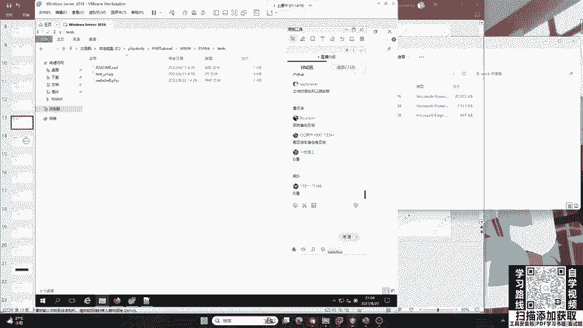

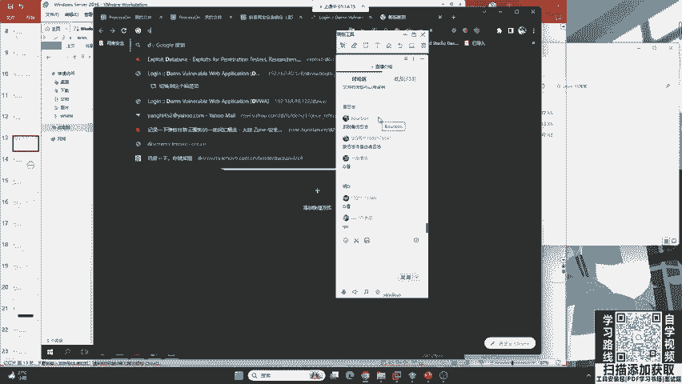

就地段啊。好，第二件事情我想问大家，咱们的火容和360能不能去查询这样一个web share点PHP。大家觉得360和火中能不能做到，你觉得能做到，你可以扣一，觉得他俩做不到，你可以扣2。好的。

那大家觉得没做免杀啊，我们现在讲的就是不免杀的情况下，不免杀的情况下。好，很多同学啊他持有不同的意见。那其实呢二一老师这里要告诉大家，就现在的360和火容，它不仅能够查杀系统木马啊。

咱们的web shell，就是针对于网站的木马，他也可以查杀，你可以去试一试啊，包括咱们的windows defender也可以，因为它太常见了，很多人被刮黑页，或者是它被打穿，都是因为这个原因啊。

就是因为自己这个网站被挂码了，所以说这个。😊。

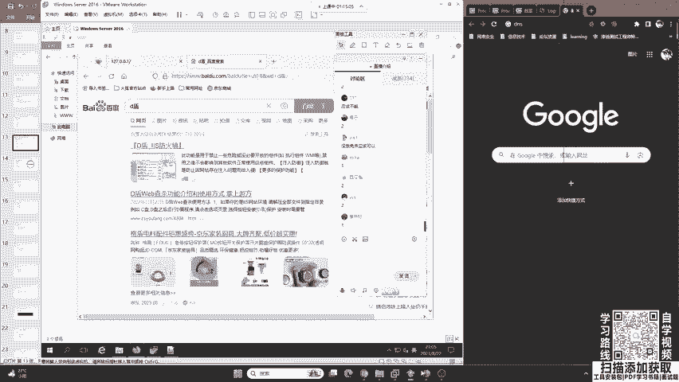

这个安全防护软件啊非常的重视这个方向，非常重视这个方向。那如果说用了免杀怎么办？好，现在遇到了一个问题，就是说啊你这个火容也好，腾讯管家也好。好，咱们如果啊黑客做了免杀。好，绕过了咱们的。

火容你有什么办法？或者是哈你知道哪些比较牛逼的杀毒软件。啊，大家应该都知道咱们的1个360。好，我们来看一下。同学们说的我我想了解一下。大家可以说一下自己知道的咱们的杀图软件。😊，非常好。

首先我先提出一个表扬，就是咱们的卡哇伊选择子同学。他说到了比特凡德。这个杀毒软件是罗马尼亚开发的一个非常厉害的杀毒软件在国外用的很多啊，他很厉害他要比火容在木马查杀方面要强一些啊，不是说说火容不行。

还有人说金山毒吧啊，你没有听过没关系，这里就是让你去听啊，让你去听啊，大家不要担心哈，第个比特凡德。第二个呢就是360安全卫士。这个同学说到EDR啊EDR呢是咱们的啊终端了啊，终端防御了啊。

咱们一般不说这些啊，就是家用款杀毒软件360安全卫士非常好。windows蒂芬静态杀毒他说一没人敢说啊，就是咱们windows自带的卖咖啡啊非。😊，好卡巴斯级啊，俄罗斯的非常厉害的杀毒软件。还有哪些？

哎，卡巴斯基金山独霸金山独霸哎瑞星啊金山独霸和瑞星现在呃你尽量不要去用啊，尽量不要去用。对，360是不差的，齐安信天晴啊，非常好。天晴的防火墙啊，除了这些之外，还有哪些呢？首先给大家介绍一下。

大家说的非常好啊。第一个就是比特凡德。第二是卡巴斯基卖咖啡。其次呢就是咱们这个360啊，360以前。😊，去做这样一个杀毒，他所用的杀毒软件，杀毒引擎叫做小红伞啊，小红伞这个同学说的非常对。

小红伞还有这位同学说的诺顿啊，诺顿也是非常火的杀毒软件。在国外。还有一个就是现在哈很多做红队都非常非常头疼的，它叫做趋势杀毒啊，趋势防病毒软件。他是咱们对岸的软件开发者开发的，叫做呃趋势防病毒软体。

他被很多的红队都害怕他，因为对他的一个杀毒能力非常的强，很难去绕过。你要是说360360它的业务能力确实很厉害哈。360确实很厉害。首先他有云大脑。继而他有小红伞，这个国际一流的杀毒引擎。

那360还是非常难绕过的啊，非常难绕过的。但是依然可以掌握绕过方法啊，但是说实话，如果把这些杀毒软件换成卡拉斯基或者是趋势科技的杀毒软件，又或者是比特凡德，那对于咱们红队来说，就不太友好了。

所以说你选择一个正确的杀毒软件也尤为重要。那有同学就会问啊，那我现在好，我现在我要把360给卸载，我要换成趋势，这里要告诉大家啊，这些好用的杀毒软件都是收费的，它一般啊不像360，咱们的周鸿毅啊。

他免费给大家去用。你只需要看一些广告就行了，它免费为我们的个人终端做安全防护啊。但是呢呃国外的都是收费的。都是收费的这个同学啊，他说全部装一遍。那这时候你啊不要去做这件事情啊，有一句成语叫做猛药去科。

它的作用啊就是说你这个药啊用的太猛了，就像我们如果去治病的话，如果你这个用药太猛啊，你可能就把自己给。😊，整坏了啊，把自己的身体给整坏了。所以说呢全装一遍是肯定不行的。就比如说像3360和火容。

他们两个都是水火不容的啊，都是水火不容的。这同学我不不多说了哈，这个你再问我就不能再说了。好吧，咱们360还是非常厉害的哈。作为这个个人的终端安全防护，还是有一一定的足这个举足轻重的地位的。😊。

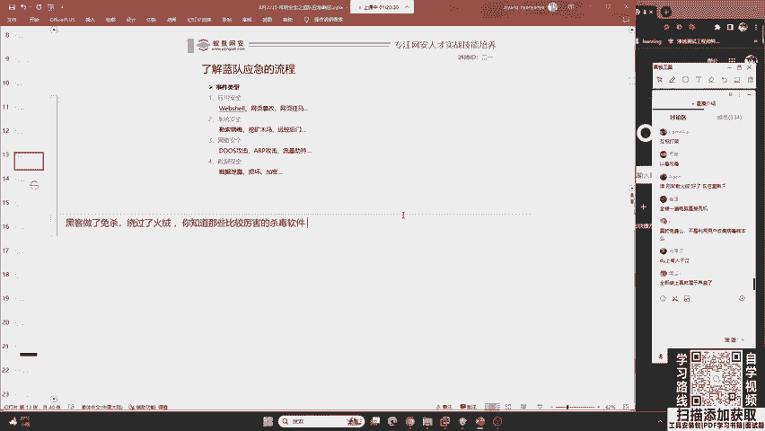

好的，我们继续来看刚刚讲了咱们的一个。😊，嗯，咱们的一个杀毒软件。其实啊你选择一个正确的杀毒软件事半功倍。你这些网站根本就不可能被钓鱼啊，根本就不可能被钓鱼。

比如说我现在在我的这个windows server上面安装卡巴斯机的。😊，这个专业版啊，基本上这个被挂黑夜的行为就不可能存在。好，咱们这是第一件事情，叫未雨绸缪。但是现在已经被攻击之后。

我们要把黑夜恢复。黑夜恢复之后，我们要想为什么会被入侵。黑客有没有留下其他的后门木马会对我的操作系统做了篡改。首先第一件事情，我们发现了一个木马。😊，叫做web share。

叫做web点PHP你要做的就是把它删掉，这很简单，把它复制一份删掉。然后大家再想想一下，我们除了这个webhe点PHP这个黑客啊在攻破你的电脑之后，如果是我就是二宇老师，我最想做的事情。

就是打开你的摄像头给你拍个照，看看你是不是在划水。😊，这是我最想做的事情。那web share能不能做到这一点呢？很明显是不行的，它需要一些高级的系统木马。那现在我想问大家一个问题。😊，你作为一个黑客。

咱们首先排查的系统木马，黑客一般都会放到哪儿？我想问一下大家，大家有没有知道的？很多同学啊，你有网络安全基础，我想问一下你。就是说咱们黑客他会把木马放到哪儿，或者是你你会把木马放到哪。开机启动桌面啊。

这有同学说的非常多啊。好，我们看到了一个正确的答案。😊。

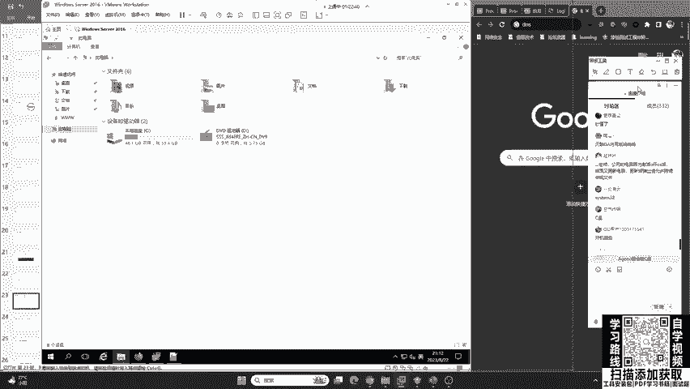

我们看到了一个正正确答案，就是t在这儿。首先同学们的解答都不错，但是只有侧重点。第一个同学说桌面哎，这个桌面哈，你放到桌面上，咱们红队可喜欢了。😊，包括奥宇老师做渗透期间，也经常会在受害者的桌面上面。

发现很多的好东西，有的人他的桌面上面就放了一个密码点TXT我们只要双击打开一看，他的个人密码都保存在这一个桌面的PSST上面。😊，我见过不止一个这样。😊，可能是这些员工年龄比较大啊。

呃这个四十来岁他比较喜欢这样去做，把一些企业的内部文件都放到桌面上面。好，第二个就是有同学说的RG edititRG edit啊它被称为注册表编辑器。其实啊windows的注册表。

它也是有实体的文件存在的。它并不属于文件路径。我们再来看。😊，C盘windows temp这是一个正确答案，这是。临时文件目录放到这个目录，我们不需要考虑权限的问题，也不需要考虑咱们有没有写入这个功能。

就是说你去往C盘里面传。如果你打掉的服务器，它的网站运行权限比较低。那你就写不进去。所以说啊咱们一般都是写到C盘。windows temp这个目录，它被称为啊windows的临时文件目录。

你一定要注意啊，这个东西以后可有用了啊，一定要注意这个目录。好的，我们再来看在有同学说被清除了怎么办？linuxlinux在在t啊TMP也是有这个临时文件目录。好。

我们来看一下windows TEMP找一下。TMP在这儿。好，大家要注意哈，在这个TMP中，咱们蓝队做溯源红队的一些工具，就是遗留工具。他比如说想去打你，他会使用一些工具。都会在这个目录。

你一定要注意啊，那这个目录被清除了怎么办？我等一下回来讲啊，这个红队做的坏，他做的坏事儿可多了，他不是说只给你传木马，他还会给你的系统中留下一些后门。好，在这个t目录中啊，它默认情况下。

它是不会有EXE文件的。它里面都是一些日志，包括临时文件。你只要在这里面看到EXE，我告诉你。啊，那就是。就是木马。你现在可以打开看一下，这里面是不会出现360呃s点EXE的。当然。

如果你安装了某数字系列的输入法，你好像在这里面。😊，会发现一些输入法，什么看图王的AXE那为什么他们有这些软件会放到这里呢？你自己去猜啊，你自己去猜，我这里就不多讲了。😊，好的，那些临时文件啊。

大家呃不用去删掉它啊。其实咱们用这些呃这些是升级软件，这些不用去删掉它啊。它升级软件也写到了这个临时文件目录啊，其实这种不规范。😊，腾讯会议的升级文件居然写到了这个目录中。其实嗯。不能写到里面了。

或者写到里面，你在升级之后，他要去删掉。那很明显，腾讯会议的开发者并没有意识到这个问题啊。😊，那没关系，咱们很多的开发都这样啊，没办法。好那在这里呢，我们要把这个360CF点EXE啊，你要注意。

你不要把它删了，你要把它备份一下出来。留有备份。去交给你自己不会溯源，你自己不会逆向。没有关系啊，咱们交给会逆向的人去做病毒分析，把这个红队抓住，我们是可以加分的，知道不好，咱们是可以加分的。

你不要把他动手删了，删了就没了。好的。这么多EXE呀，你这都什么软件装的呀？😊，你的这个这个老哥是你这是什么软件？会有这么多EXE。😊，咱们可以去。啊，到这样一个，你去用火炉的一火炉的一些垃圾清理啊。

其实都能清理掉这个探姆目录。好的，我们继续来看，我们发现了1个360CF点EXE这时候要问一问一件事情啊，就是说哎这个黑客有没有说反其道而行。

把这样1个EXE放到其他的木马病毒里面呢呃放到其他的文件夹里面呢啊当然有可能这时候又要用到咱们的杀毒软件进行全盘查杀，所以说选择对一个杀毒软件尤为重要，嗯，不要去轻视他。

很多人用一些嗯不知道你从哪里搞到的一些不知名的杀毒软件啊，呃，或者是你电脑自带的，很多人去买一些品牌电脑，他可能会自带一些电脑管家，这些电脑管家呢都不是专业做杀毒软件呢。

他可能这个防病毒的能力不是特别好。😊，那除了这个之外，我们还要去想。他会不会去对你的操作系统做了修改？那这里呢我去留了一个简单的后门，就是说一般的黑客他都会做的一件事情就是给你去加用户。去给你加用户。

什么叫做加用户呢？他就是说我创建一个新的用户以后啊，我想去进行啊相应的对你的操作系统进行远程登录也好，进行相应的内网渗透也好，都比较简单啊，都比较简单。就是说啊它可能会加用户。

这时候就要用到咱们命令提示符的一个命令呢，叫做net user。

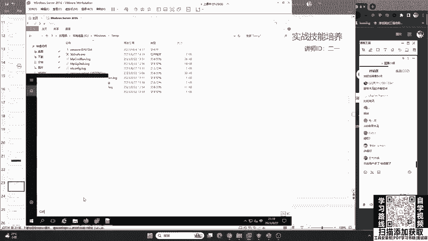

net user好的。我们来看一下这个net user啊，这个net user啊就是看到我们这个当前的操作系统有哪些用户。哎，大家来看一下。😊，这些你们觉得哪一个是后门用户啊，哪一个会是后门用户？

很明显有一个奇怪的是吧？IPT881，这是个后门用户。我就不给大家留悬念了。那这个后门用户。我们一定你要知道谁是后门用户。好吧，有的同学看到default account，他会说他这是后门用户。

尤其是现在啊咱们同学们很多人都去使用windows11操作系统。我们来看一下win11的哈，win11的，我这里就是win11。

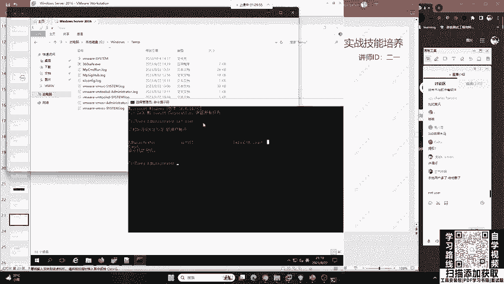

来给大家一起看一下。怎么看出来的？怎么看出来的？我告诉你好吧，我告诉你怎么看出来的。这里首先administrator他是管理员用户，default account是默认的服务用户。

gs是我们的来宾用户，还多出来一个你不知道的。你说他是什么用户啊。好的，来大家看一下二一老师的。

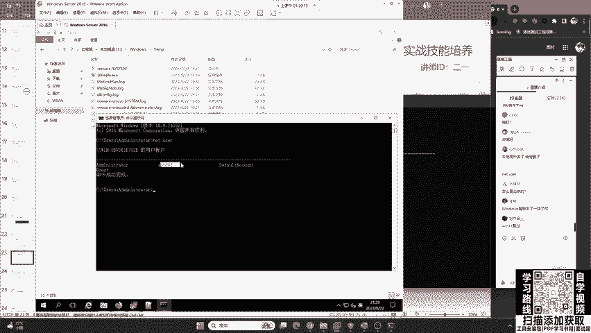

windows11操作系统，这是大家经常用的。我现在想问各位，你们来听课的很多人用安全基础。我想问一下大家，这个玩意儿它是后门用户吗？大家可以告诉我，他是不是可以扣一，也可以扣2，一是是，二是不是。😊。

很多同学都扣了2。都扣到2啊，为什么你扣2啊？因为你知道那二级老师在讲课的电脑。😊，那怎么可能会有这个后门呢？好，首先我们就要知道他不是后门用户。其次。这个贝塔同学说长得很规整。那我作为一个黑客。

我也可以去起一个呃很规整的用户名啊，是吧？我那里为什么要起IT881啊？就是为了给大家有一个凸显的概念。因为今天来听课的很多高中生啊，你们可能啊对系统不是。😊，特别的了解我要有这种突出的思维去跟你讲。

好，其次我们再来看。这个WDA这个用户是什么呢？好，这我要给告诉大家哈，就是咱们windows10在2020年windows10啊，它做了一次更新。

就是说如果我这一个系统启用了windows的 defender他就会创建一个windows defender的这种防病毒的用户。也就是说啊这个用户它是属于windows防火墙的用户是自带的。

你千万不要把它给删了，你删了你的电脑，可能就要出一些问题了。不过你也删不掉它。那这个我们已经知道了啊，de account这个默认用户啊，这个administ管理员用户s来宾用户好。

我再来问这里我们看到了一个数字用户13216。哎，大家觉得它是后门用户吗？小丫同学，administr不能删了。大家觉得这个东西是不是后面用户啊，是扣一不是扣2。我有没有可能就是说在上课之前。

我创建的一个用户呢？嗯，有同学扣1，有同学扣2，这里告诉大家哈，有一个同学他非常的厉害啊，他说到了这就是我自己的用户。因为现在我们啊正常的windows11的家庭版。😊，啊，你都是。用自己的。

账户去登录，而不是用administr，只要你用的是正版的操作系统，我这里就是正版。所以说这是我自己的微软账户。那这个微软账户啊又出现了一定的问题。就是哈大家小时候啊第一个注册的微软账户，它都需要邮箱。

那所以说呢你只能用QQ邮箱去注册。那这里呢被一个同学发现了，这个就是老师QQ邮箱的前五位数字。😊，啊，就是我前五位数字，这你就会问，那为啥只有前五位数字呢？那后面几位去哪了呢？哦，这里又要告诉大家。

在windows11的验证中，联网用户验证用户名只会保存前5位，这你又学到了是吧？这你又学到了。其实你针对于win7win10跟win11它是不一样的。这是联网用户。😊，好的，优朗同学问到了。

现在我们能够轻而易举的去看到在这样一个windows72012中，我们被植入了IPT881，然后我可以把它删掉。

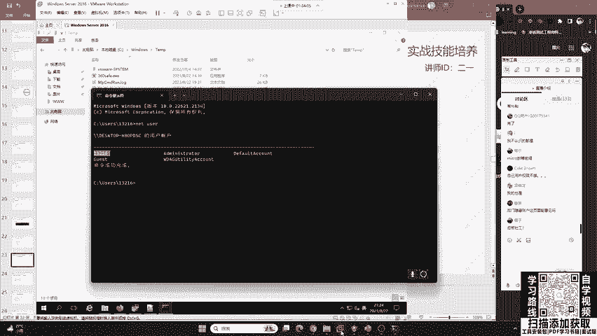

以后伪装成5位数字非常好。QQ用户你学到了非常好，你有这种思维非常厉害。大家哈也要把这些应用起来。就是说你作为一个咱们红队也好，蓝队也好，你的咱们的这个思维啊一定要发散起来啊，包括你们学渗透测试的也好。

我就是告诉你们，不是说你这个技术，你个漏洞就这个样。😊，你能够发散的。地方特别特别多，你不要把东西学死了。那在这个地方呢，我们可以把这个881去删掉啊，dlightte这个命令啊。

大家我说实话你也不要记，为啥呢？因为啊咱们只要用多了，包括这个基线排查啊，应急响应都会有相应的文档，那我们就可以去进行啊相应的一个。嗯，复制粘贴就可以了。复式复制粘贴就可以了。好，那现在这个问题来了。

就是说我把它删掉之后，有同学就觉得哎这个万事俱备了。你看你留的后面用户被我删掉了吧。但是哈现在的红队，他都会进行隐藏用户和显现显示用户的综合利用，就是他会迷惑你比如说这里你感觉把IPT881删掉了。

其实啊他有一个同名的隐藏用户还在你的机器里面呢。当一般的蓝队就是咱们的防御看到这个IT881，他会觉得哎这个黑客太菜了。你看他这个用户都不会隐藏，直接写到这儿了，我直接给他删掉就行了。

然后你就你就会把它删掉，结果别人留了一个隐藏用户，前面是让你觉得他比较菜。😊，你觉得哎他比较菜，就留了一个显示的用户，我给他删掉，结果呢他还留了一个。😊，隐藏的在那隐藏的用户怎么去找呢？哎。

这里要给大家讲一下啊，这个隐藏的用户，如果你使用咱们的net user，它查不出来的。心理站啊确实是这样，现在玩的都是社工啊，都是钓鱼，就是看你怎么上钩。😊。

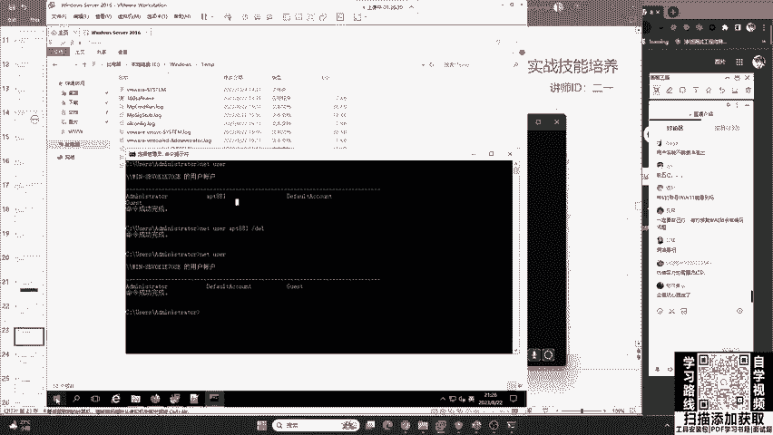

你绝对不要轻视这些东西。这时候啊这个隐藏用户在咱们的CMD中你就看不到了。在哪里呢？在咱们的这个用户账户。😊，啊，用户账户。控制面板用户账户管理其他账户，你就能看到。在这里啊有1个IT881。

后面加一个dollar，它是一个隐藏用户。这个隐藏用户呢，它主要的就是说。首先它的技术这个很很远古啊，十0年前就有这玩意儿了。你们那个叉P年代啊，叉P年代就有这玩意儿了。就是说我的黑客。

我先给你明摆着给你打一套，对红盾也玩迷馆，他给你打一套，就是说你觉得。那么简单呀，你你就这么垃圾嘛，是吧？他今天给你打一套，但是没想到啊，他这个笑里藏刀啊。😊，好，他还有一套东西藏着呢，你。

找不到他啊找不到他这个管理员模式看不到啊，我这里就是管理员模式。

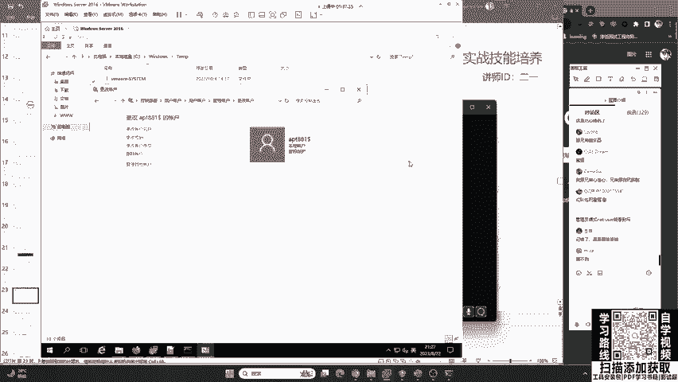

我这里就是管理员模式net user啊，就是咱们这个微软啊，就是比尔盖茨，它这个net东西是看不到它的你为啥看不到呢？那你得去。问微软呢，你不能问问我是吧？毕竟这个微软它是一个不开源的操作系统。

就是说他怎么去做就怎么去做啊。这个昵称同学说的对啊，都看不到CMD跟 power show中都看不到啊，微软Tbug啊，别人说正常功能不接收是吧？啊，微软Tbug，别人不接收你的bug啊。😊。

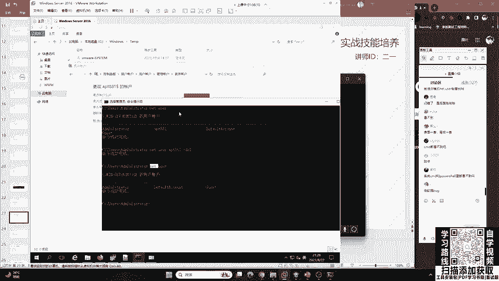

不接受你的建议。好的，那我们来看一下这里啊我们就可以找到。第一个就是你要发散一个思维。我这里是给你讲这样一个思路。那有同学说我遇到linux怎么办？那我会反问你。

如果你遇到了一个pyython网站怎么办？一样的套路，首先你先了解入侵行为，然后你再去做排查，你做排查。第一个就是说我怎么去恢复它。他有没有做其他的事情，这是第二件事情。

第三件事情再做修复修复漏洞配置防火墙，避免再次被入侵。这是我们要做的。首先怎么去修复它。我来给大家讲一个哈，咱们就是说刚刚讲过安全服务工程师，比如说你以后找到工作了。😊。

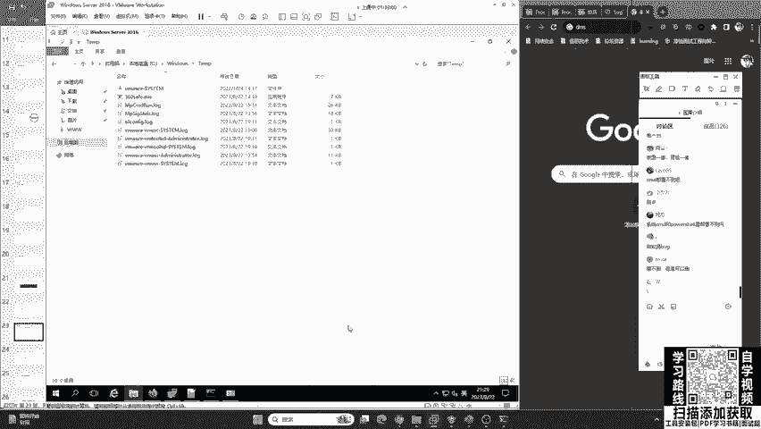

咱们是一个安全服务工程师，现在客户找你去做应急，去做排查。呃，去做这个排查。其实啊我们只需要干什么？第一件事情问一下客户说，哎，你这个被攻击呢，你又没有这个备份啊，有备份是吧？有备份那先恢复一下备份。

那备份恢复一下。然后有备份恢复了之后，哎，给你装1个360，杀一遍，再推销一下我们公司的安全产品，你看我们公司这个IPS还有蜜罐，还有EDR要不要。😊，买不买是吧，还有防火墙买不买买的话。

我们就给你是吧，咱们就跟销售对接。😊，就是这样一个过程，其实不是特别难不是特别难。但是这个流程你要把握好。我讲的啊只是一个。最基础的对，就是漏扫搞一下啊，咱们的呃软件备一下，就是杀毒软件装一下。

其实就能解决很多的这一个客户的问题。这兔八哥问到啊，这个蜜罐还能买蜜罐当然能买了，很多公司都有蜜罐啊，比如说还有专门做蜜罐的莫安科技是吧？蜜罐可是一个设备啊。😊，这个兔八哥可能不太理解啊。

这个密罐啊不是说啊一般情况下咱们企业建设中的蜜罐啊，它不是说。😊，啊咱们这个呃一个软件啊，它是一个设备，非常非常大啊。你那一开机那个声音啊，那个噪音嗯震耳欲鸣啊，震耳欲聋的那种声音。😊，蜜罐蜜罐是啥？

呃，百变罐问呃蜜罐是啥？我给你讲一下啊，蜜罐啊是咱们蓝队做的一件非常好玩的这件事情。就是说我这个网站啊都是漏洞，而且每一个漏洞啊都看起来很真实。😊，啊，都很真实，就是想让红队去打我们。

想让攻击者去打我们。那我们这个里面都是陷阱，又普气，非常对啊，就像老鼠家一样，你打我我就把你抓住，就是钓鱼。或者是反打蓝队，什么是销售岗？销售岗就销售岗啊，卖安全产品的是吧？卖安全产品的。😊。

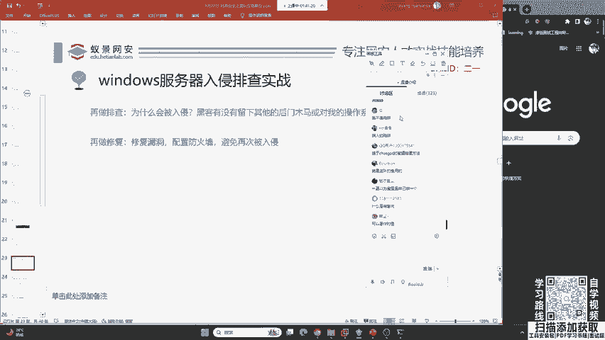

好，再做修复。最后一步呢就是要修复漏洞，配置防火墙，避免再次入侵，这一点也尤为重要。好，那现在大家想象一下，我们讲解的只是一个。入侵排查的一个过程。那其实呢它只是应急响应的一个阶段。那之后还要干什么？

按照我们刚刚讲的一个模型，你会发现。在进行入侵排查之后，我们还需要进行什么呀？进行分析。甚至是逆向，然后尝试去速远到攻击者，我要把你抓住，我要去反打你，我要把你的身份证号都报出来。

这才是你作为一个高级蓝队的梦想是吧？我要去反打你，我不能说我现在被欺负了，我恢复了，那我还是一个被动的地位，我要占据主动的地位，那这些怎么办呢？哎，这些东西它需要的基础就比较多。

那我们因为今天啊主要是一个科普性的一个课程。那我们明天啊会给大家讲相应的。

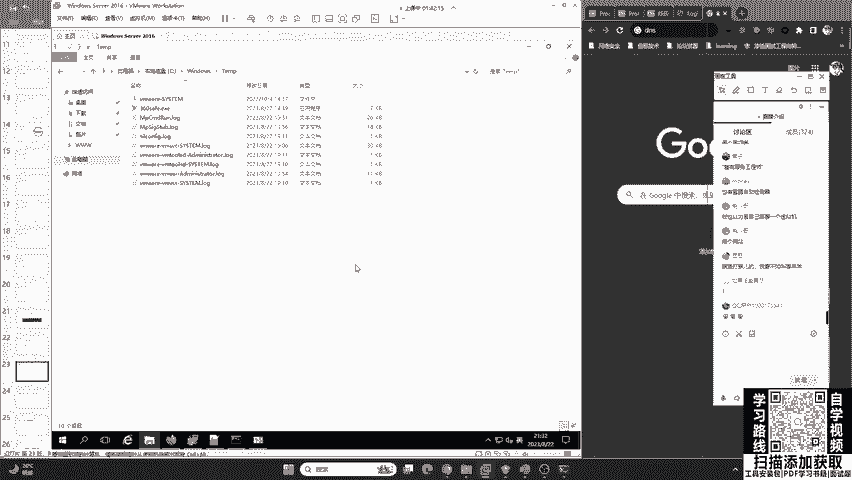

分析溯源的流程技能。还有就是说在后天的时候，我们会讲如何去反制攻击。

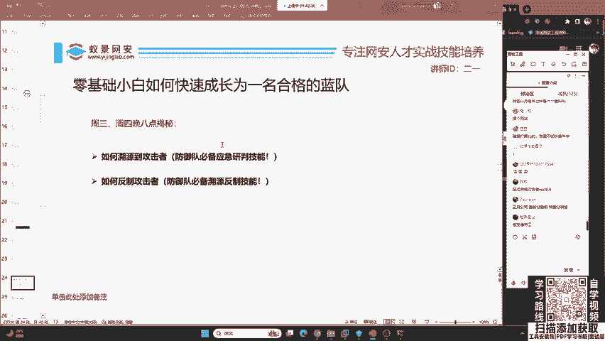