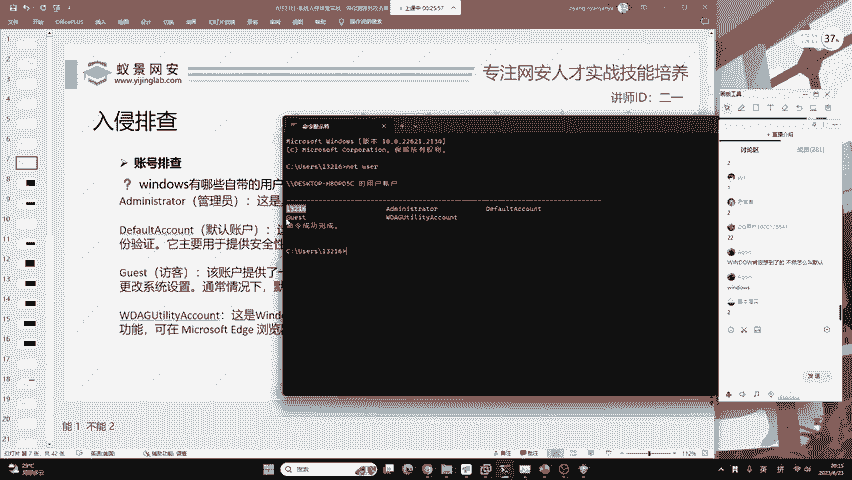
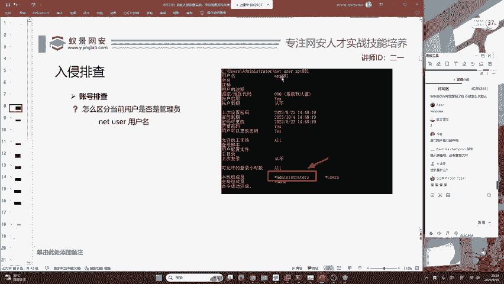
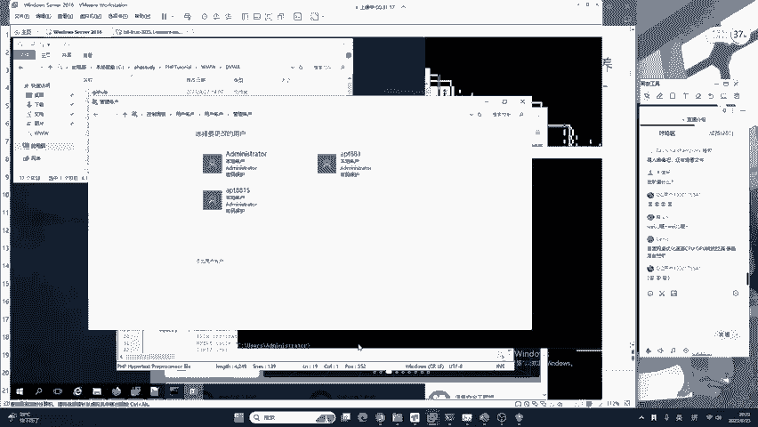
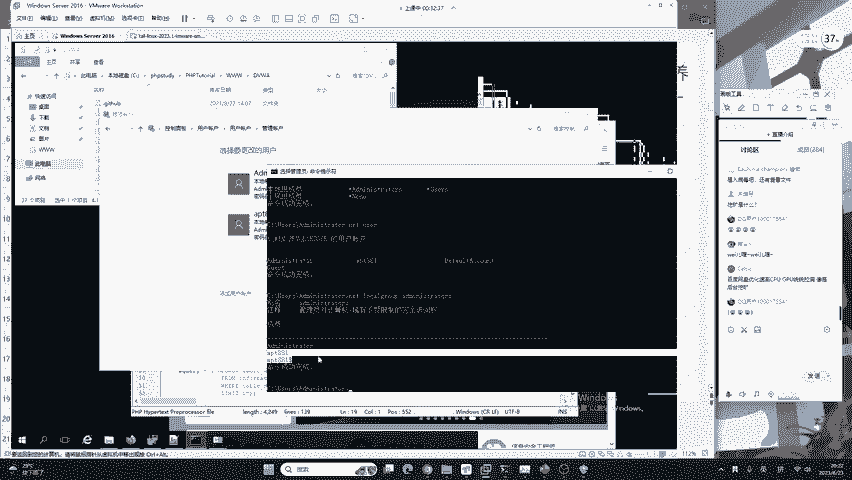
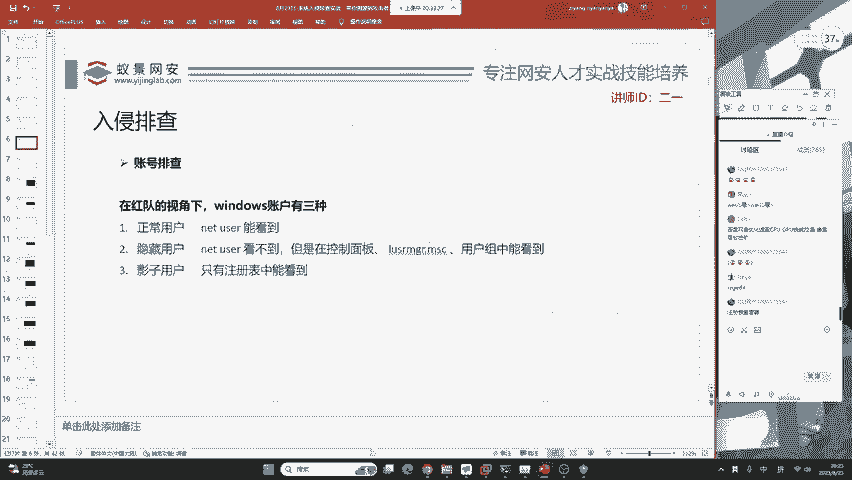
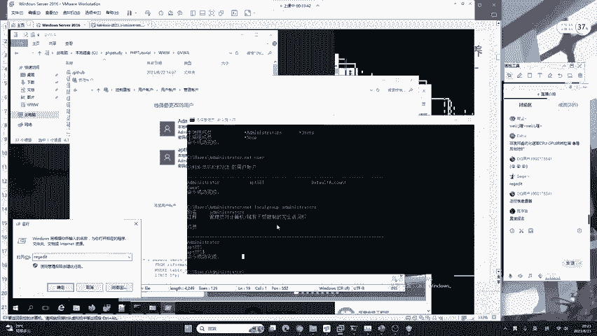
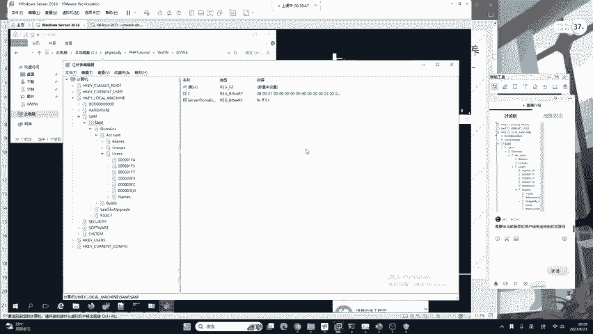
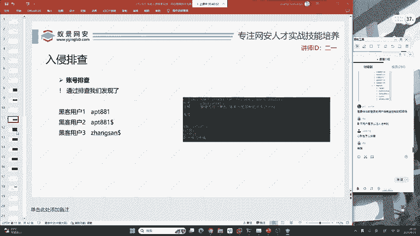

# B站最系统的护网行动红蓝攻防教程，掌握护网必备技能：应急响应／web安全／渗透测试／网络安全／信息安全 - P11：蓝队应急响应-10.账号排查 - 跟小鱼学安全 - BV1SF411174M

下面我们一起来看一下。首先，排查一定要按照相应的规范是缺一不可的，你可以拓展。但是老师讲的你必须要做到。现在我们要站在红队，也就是攻击者的视角来去观看。我作为一个攻击者，我在攻击一台服务器。

我会做什么事情？首先第一个入侵排查就是账号排查。好的，在阿兰同学提到溯源到蜜罐怎么办？请注意，蜜罐，他是咱们蓝队。蜜罐啊是咱们自己的，所以说你溯源啊是溯源攻击者，不是溯源蜜罐OK啊。

这个阿兰同学一定要分清楚，溯源和蜜罐都是咱们蓝队所做的事情。红队也搞蜜罐，这时候你就要学习反蜜罐的知识。也就是说啊，红蓝双方都相互钓鱼，现在非常常见，你只需要掌握相应的反蜜罐，识别蜜罐的特征。

了解蜜罐的原理，甚至是自己写一个蜜罐出来。那你就可以轻松的识别在网站或者是各种服务中哪些是红队的钓鱼页面。好吧，这是项有相应的技术站的。在红队的视角下，我们windows服务器的账户一共有3种。

那分别是正常用户、隐藏用户和影子用户。昨天啊我为大家介绍了正常用户隐隐藏用户。但今天啊我们会来看影子用户应该如何去排查。首先第一个就是正常用户。

正常用户应该如何去看呢？我们可以打开任意的windows操作系统。当然，这样一个windows server2016，各位同学啊，你并没有没有关系啊。

你可以打开自己的win10或者是win11来去排查自己的电脑有没有重病毒，包括二一老师今天教大家的技术，能够识别国内部分的垃圾软件。

这些软件也有可能去充当了一个半个黑客的角色去控制着你的电脑去监控着你的电脑，在你开机或者是你离开。这个电脑身旁的时候，就会给你去安装一些恶意的软件，或者是一些恶心的页游，篡改你的页面等等。

那这些恶意软件，包括咱们的红队到底是怎么做的呢？我们今天啊都会来去揭秘，大家可以使用自己的windows来去操作。首先第一个就是CMD。CMD啊，它是command的简称被称为命令提示符。

来听课来听课的很多同学啊应该知道，我们昨天讲解了一个非常简单的命令叫做netus。它这个命令的功能呢是查看当前主机所有的用户。通过我们简单的查找，我们看到了在这台主机中有4个用户。

分别是administratorIT881 default account以及g这4个用户。那这四个用户哪一个它会是咱们的后门用户呢？会是黑客去创建的恶意用户呢？

首先呢我们就需要对windows操作系统做一个简单的了解。就是说我们的windows有哪些自带的用户，请注意啊，二一老师的这个课程时效性非常强。

都是站在windows11或者是windows10的角度去讲的，不会像你在B站或者是youtube上面看到的一些针对于windows叉P或win7的课程。好，在我们现在的windows11操作系统中。

我们的用户啊默认用户一共有4个，它分别是administrator default account guest和WDIGU的一个用户。那这四个用户分别是什么呢？我们来了解一下。

第一个叫做administr，它是管理员用户。第二个是defa account默认用户。第三个是访客用户。第四个它比较特殊。它是在windows10之后才出现的，是基于windows自带防火墙。

也就是windows defender创建的用户。啊。大家现在想想象一下，我们这四个用户，会不会是。黑客创建的恶意用户，也就是说我们可以换位思考一下，作为一个黑客，他能不能把你的这个账户给删掉。

然后去创建一个同名用户，能不能这样去做。大家觉得这些用户能不能被删掉，然后被黑客创建一个同名的恶意账户，你觉得可以，你可以扣一，你觉得不行，你可以扣2。我看给大家讲一下，就是咱们黑客能不能把它删掉。

有同学扣一，有同学扣2。这里要告诉大家哈，在系统的默认账户是无法删除的。还有告诉大家啊，你千万不要去尝试，如果你把它删掉了，你系统的相应服务将无法正常运行。

比如说像administrator这样一个它是删不掉的，你把它删掉了，咱们系统就会缺失相应的聚病，导致系统正常的服务无法运行。可能啊你去执行删除命令，你确实可以执行成功。但是电脑的正常功能就会被破坏。

就比如说你把C盘里面的东西删掉，可能有的时候啊这个电脑还是好的。只要你重启一下，你发现这个电脑就坏掉了，也正是如此，就是它是默认账户。那我们在排除这四个之外，那余下的就很有可能是咱们的。

黑客去创建的用户了。比如说二宇老师这里的windows11，它除了默认的4个用户之外，还有一个叫13216的这样一个用户。这个用户是什么？在昨天的课程中，有位同学已经给大家相应的解答。

这个用户啊是大家家庭版的电脑。比如说很多同学啊，他去买联想的电脑去买拯救者电脑。那这些电脑呢在首次开机的时候，你都会听到微软小娜的声音。那小娜呢会让你创建一个新的账户。

那这个呢就是我们在第一次开机的时候自己创建的账户，他也不属于后门用户。那下面我们使用排除法，其实就可以去啊把这样一个后门用户去排除出来了。

好，那现在呢我们来看一下。在这样一个用户中。就是在我们这样一个已经被打成筛子的服务器中，我们输入netus之外之后啊，我们可以看到啊，现在IPT881，它有两种可能。那第一种可能呢是黑客创建的后门用户。

那第二种可能呢就是我们在开机的时候，微软小娜去创建的一个正常用户。那这里请大家注意。二一老师这里使用的是服务器版的windows它是没有小娜的。所以说这里就是一个后门用户，我们可以基础基本确定。

其次呢后门用户黑客在创建的时候，它一定会把它创建成管理员。那现在我们又要学习一个知识。就是说怎样区分当前用户是否是管理员。很多同学啊在。这样一个网上的教程。

可能会看到windows的管理员用户是administrator。这件这句话是完全正确的。但是你要想windows的用户，它只叫administrator吗？

其实并不是哈咱们windows它是有一个用户组的概念，就是说哈你相同权限的用户，他都会给你分成一个小组。例如说我们的管理员就被称为管理员组，也就是叫administrs加一个S代表复数。

那我们怎样去看这样一个用户是否是管理员用户呢？首先，administrator它一定是管理员用户。这你大家都知道，那其次呢就是比如说我想去看这样1个IPT881，只需要输入netus加上这个用户的名字。

然后回车来看到这里的本地组成员是否有adadmins，只要有这样一个英语字母，我们就可以确定这个用户啊，他是管理员组，也就是管理员用户。他和linux一样。linux用户。

我们同样也不能以用户的名字来去区分他是否为管理员用户。linux是通过用户的IDwindows是通过用户的组，大家千万不要被网上的一些帖子迷惑了双眼。浮夸同学问到，后门用户具体能干什么？你想一下。

你电脑的用户被别人拿到了，那你能干什么呢？现在他是你电脑的管理员，他可以控制你的电脑做任何的事情，可以用你的电脑去挖矿，也可以去破坏，篡改你的电脑也可以去监视你的电脑。

那这些内容呢都是咱们攻击方红队的知识。那今天呢不会涉及。我们只是把它找到。那现在在确定完APT881，它是后门用户之后，我们第一件事情啊，就是要把它留下证据，你现在先不用去操作啊。

咱咱们就是说你要有一个流程，挖矿是什么？挖矿啊，就是用计算机去挖比特币去获取收益，这就叫挖矿啊，是一种违法行为，被国家定义为违法行为。其实啊你可以百度搜索，应该就知道挖矿在前几年还是非常。常泛滥的哈。

就是很多的人利用一些显卡或者是一些计算机来进行挖矿。好，现在我们基本确定了IPT881，它是后门用户之后，我们来想，就是说现在这个后门用户我们排查到了，其实我们还需要考虑它存不存在隐藏用户。

隐藏用户是什么意思呢？它顾名思义就是net user看不到的用户。我们在这里看不到，现在你只能看到IPT881才是后门用户。那这样一个隐藏用户应该怎样去看呢？有两种方法来告诉大家。

首先第一种方法就是不论你的windows操作系统是什么版本，我们都会有一个控制面板。在控制面板这里，我们点击用户账户，点击用户账户。再去点击管理其他账户。你就可以看到。

在这里除了我们的administrator之外，还有我们发现的IPT881dollar这样一个用户。那加dollar为结尾的用户就被称为隐藏用户。黑客一般去创建的话。

他都会创建这样一个隐藏用户来便于被就是防止被蓝队轻松的排查到。当然，这个隐藏用户呢实现起来比较简单，几乎所有的红队，即使是初级的红队，他也能够去做到。那第二种方法要告诉大家一个，很多人不知道。

并且网上不会给出的教程。就是大家想象一下，刚刚二姨老师说的黑客如果想去创建一个恶意账户，他创建的账户啊一定是管理员。管理员账户它就一定处于管理员组中。所以说呢我们可以使用这种方法去直接的把它判断出来。

就是我们去看计算机中有哪些管理员用户。就是我要看管理员的这一个小组中到底有谁在这个地方。使用这一条命令就可以了。这些命令啊，大家是不需要记忆的。因为你今天记了，明天就忘了。

正如二一老师在上课的时候经常说的，你学习汉字买新华字典不是说你新华字典，一个一个的去背，而是你有不懂的地方就去查阅就可以了，不需要去记忆，只要熟能生巧就可以掌握。

那通过这个命令，我们来一起看一下它叫做net local group。什么意思呢？就是我要查看一下我的小组。哪一个小组呢？查看一下我的管理员小组。管理员小组中啊，咱们有三个用户。

分别是administratorIT881。我们刚刚排查到的黑客用户，还有一个叫做IPT881 dollar的黑客用户。这时候呢我们就发现这个黑客啊真的是太坏了，为我们创建了两个用户。

现在我们就学会了普通用户和影子和隐藏用户。但是啊二迪老师给大家讲过，排查啊除了排查这两种用户之外，还有一个啊黑客比较喜欢用的就是被称为影子用户。影子用户是什么意思呢？

就是说你在控制面板在CMD中你都看不到的用户。

那这一类用户呢通常都是黑客使用了一些权限维持的红对技术来进行打造的这样一个恶意用户。那影子用户应该如何去排查呢？这里要告诉大家一个新的知识。很多同学啊应该也知道，就是注册表注册表的课程在今天。

大概10分钟之后，我们会有一个详细的讲解，大家可以先看二宇老师操作。首先呢我们要打开这一台授限服务器的注册表。打开的方式呢就是使用咱们的windows键加R。

然后运行REGEDIT。按回车就可以打开咱们的注册表。那这个注册表我们要看哪里呢？它非常多啊，这个注册表是什么？注册表怎么去用，我们后面啊都会给大家去讲，可以不用急。

在这个地方我们来看一下。它是有这样一个名词叫做locco machine本地计算机的意思。大家应该能够看懂这些基本的英语吧。很多同学啊都是高中生或者大学生，高中生你们其实高中学的英语足够网络安全使用了。

那你是大学生的话，你肯定会考英语四级。即使你不考英语四级，你不会英语只背到abbandon这样一个单词吧，你肯定会一些基础的。在这个位置，我们可以看到一个叫做samSIM。在这个地方呢。

我们继续点击点击多 mass，继续往下点，可以在这个地方发现一个类似文件夹的名称，被称为account。这叫账户，我们继续往下点，就会看到有个叫做usersers用户的文件夹。我们点开点开之后呢。

你只需要点开names，在这里就能够看到windows所有的用户了。我们来去观察一下，首先administrator是操作系统自带的，它不可能是黑客用户。IPT881刚刚我们排查过了，他是恶意用户。

IPT881刀了，我们也排查过了，他也是黑客创建的恶意账户。这时候我们可以看到一个法外狂徒张三到了。请问张三 dollar了，我们刚刚通过控制面板，或者是通过windows的命令行，有看到它吗？

并没有看到它是一个隐藏在潜伏在我们注册表中的影子账户。这个账户可以正常使用，只是你必须要在注册表中才能看到。那大家想象一下哈，除了二姨老师讲解的这三种账户类型之外，还有没有就是说。没有存在注册表中的。

也没有存在我们命令行中的另外一种账户，就是比影子用户更为隐藏的账户。大家想象一下会不会存在。好的，那这里要给大家讲解一下这里的doller是指隐藏用户的意思。好。

DI同学已经给老师的呃这个给了老师相应的回答。就是因为哈咱们的用户如果有了解过操作系统原理的同学应该知道操作系统其实万物基于文件。它的系统以及他的账户和策略都需要写带磁盘中。😊，那这个只要写在磁盘中。

就一定会在我们的硬盘或者是内存里面去留下相应的记录。所以说哈影子用户已经是红对恶意账户的极限了，我们只需要使用这种方法，就能够查询到我们的影子账户，从而把所有黑客创建的用户啊都给获取到大家的问题啊。

我都有考虑到，你们可以耐心的听我在后面都会来讲，现在解决有两位同学提到的问题，为什么sam下面没有东西。好的，邮编的同学你提的非常好。首先呢这个sam注册表中默认情况啊。

咱们登录的administr账号。就是你登录的administr账号，它是没有读取权限的。我们如果想去看sam你就必须要为sam啊去添加权限。好，我现在来给大家讲怎么添加。权限有本和世俗同学，你看好。

只需要右键点击我们的sam。点击权限，然这时候呢，它默认是在system这个位置，我们只需要点击administrators这个用户组。将完全控制勾选，然后点击确定。再到查看里面。

点击刷新或者是按快捷键F5。你再次打开s姆就可以看到了优变同学啊，你可以去试一下我这种方法点击权限就行了。DI同学问sam给权限会造成危险吗？不会造成危险啊。

这个地方不论是system还是administrators，都是在我们的可控范围内。你在你的可控范围内去给到权限是不会造成系统危险的。好，这个同学说了，就是说红队用的就是自己的账户怎么办啊。

你这个要稍等一下，等一下我们会提供相关的思路，怎么还是不行啊，你有刷新吗？在设置好之后一定要记得刷新啊，你不刷新的话啊，他是做不了的。😊，这个东西不是账户呀，这个同学。这同学不是账户啊，账户在这里啊。

账户是在users这里啊，users这里啊，不是咱们的alas这里。好，你要注意了，是在users。好的，那在关于注册表啊，大家可以先啊不用急啊可以先不用急，我们会给大家去讲解。好。

这个同学说是要给当前登录的用户完全共置权限吗？对的哈，你当前登录的用户是谁呀？你当前登录的用户肯定就是administrators，用户组中的用户呀。你不可能说你登录一个普通用户吧，咱们的家家用电脑。

你在开机的时候，第一次买电脑开机创建的微软小娜的账户，他就是处在administrators这个用户组中。啊，希望你能够理解。当然大家啊对于注册表不清楚啊，你也没关系。

二一老师后面都会给大家做详细的解答，你绝对可以放心。

那在这种规范的账号排查模式下，我们就可以发现这个红队啊它是坏到极限了哈，他给我们植入了三个黑客用户，分别是普通的恶意账户IPT881以及隐藏用户IT881刀了。

还有刚刚我们讲解的影子用户法外狂徒张三这个张三啊，只有你通过注册表给予相应的权限，你才能够排查到它。当然，2023年的今天，杀毒软件，例如说像360火容以及常见的防火墙低盾也是可以去检测影子账户的。

这时候红队啊他就会站在相应的视角去绕过这些杀毒软件。😊，DA同学问啊，影子用户是怎样注进注入进来的？这个东西咱们今天不讲啊，咱们今天是讲防御。😊，如果你想了解的话，嗯，怎么说呢？你可以找咱们班主任去看。

