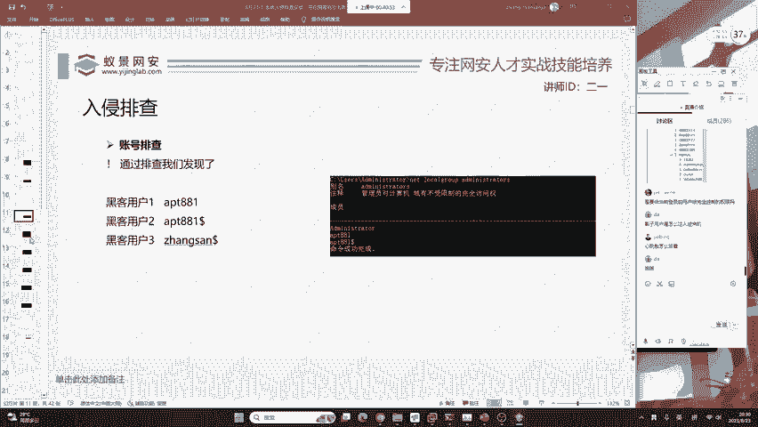
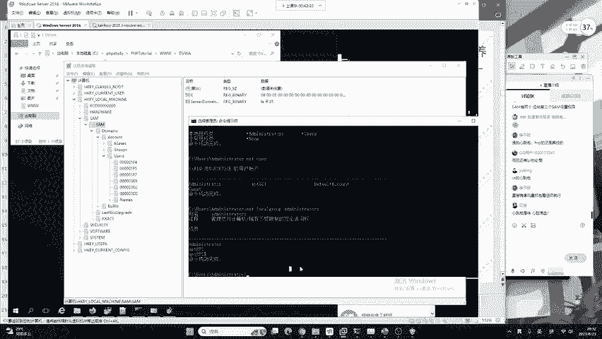
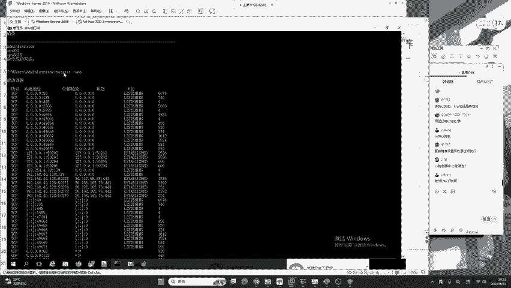
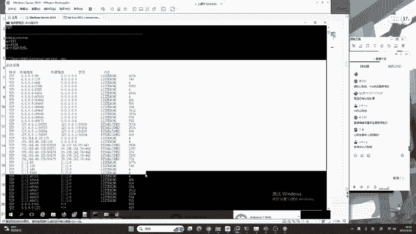
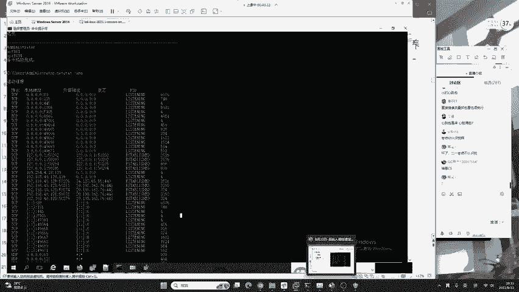
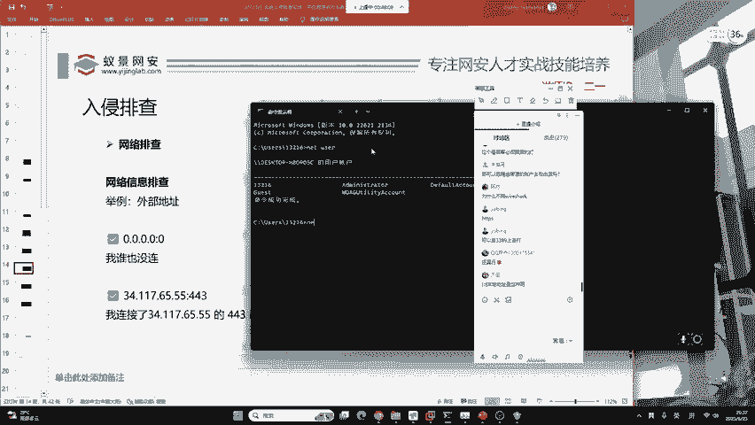
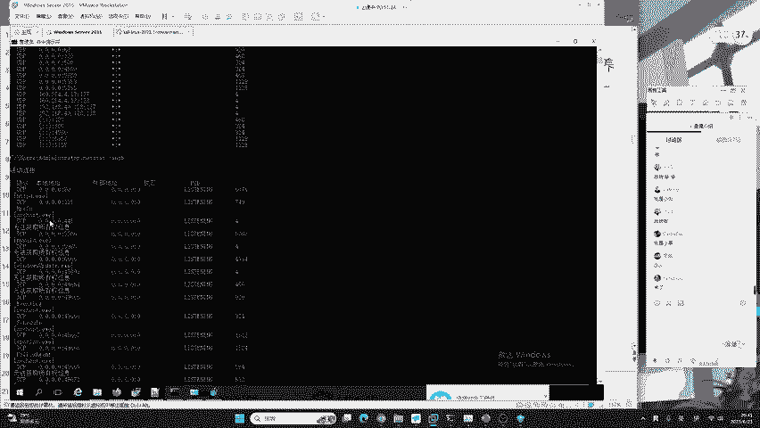
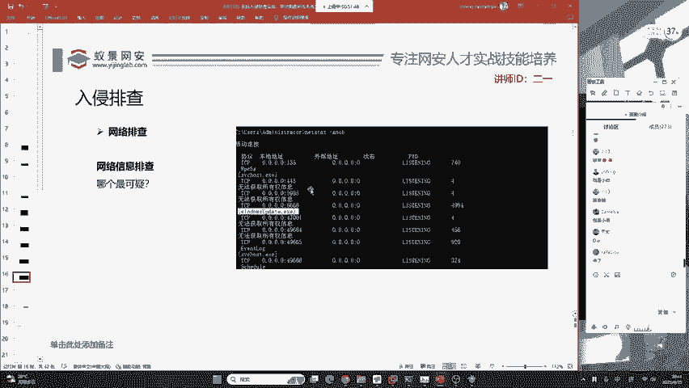
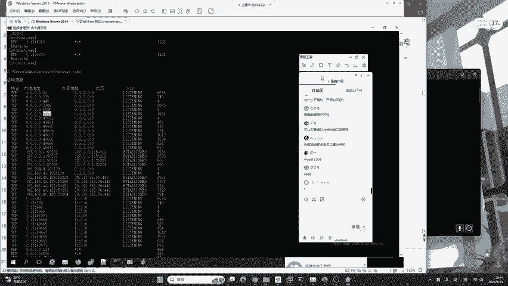
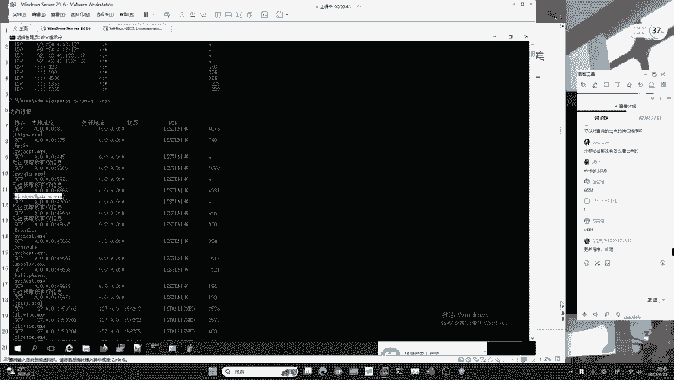

# B站最系统的护网行动红蓝攻防教程，掌握护网必备技能：应急响应／web安全／渗透测试／网络安全／信息安全 - P12：蓝队应急响应-11.网络排查 - 跟小鱼学安全 - BV1SF411174M

等一下。

有没有相关的资料？然后第二点呢是网络排查。第二点是网络排查，就是你去想象一件事情，就是说你这样一个后门木马就是产生控制性的后门木马。他都有一个通用的特点，就是必须要联网。不论你是使用的什么远控工具。

做了什么高级的免杀，如果这个红队它压根不能联网，就像大家啊给他大家经常调侃的说，蓝队怎么防御，我把网线，我把网线拔掉之后，你想一下红队还能去攻击到你吗？肯定不行，因为网络通信网络安全，网络安全。

那没有网络哪里来的安全呢。所以说呢我们要做的就是网络的排查。这里我们要使用到一一条命令叫做nettt杠ANO。好，优病同学说CS的心跳包，这是CS的心跳包呢，你可以对网络的持续监控。

对它这样一个护门木马的一个行为监控来去判断它它的心跳包呢，不论它隔了多长时间，总会有连接产生，总会有连接处于连接状态，或者是time white状态。我这里啊是单独给我们的幽病大佬去讲。

很多同学呢可能不太理解。但然没关系啊，我们可以继续咱们今天的课程。好的，我们来看一下。在这里。我们打开命令行之后，输入这条命令，叫做nett set杠INO还是告诉大家啊，你不需要去记这些命令。

贝塔同学问心跳包是什么哈？心跳包不在我们入侵排查的范围之内，它是CS的一个东西哈，我当然认识你了。好，那这里我们要看一下，在NETSTITINO给到的这个列表，很多同学啊见过这个东西。

但是你却没有分析过我们站在一个漏洞防御以及入侵排查的视角。

南城，我怎么不认识你啊，我肯定认识你，你来错直播间了，你应该去听另外一个课。好吧，我们如何站在一个入侵的视角啊去看，就是这里面哪里会产生漏洞，哪里是会被黑客攻击的那首先要想达到这样一个效果。😊。

我们就必须要知道他给我们什么信息。这里啊二宇老师为大家做了一个图，你要关注这个地方。

首先，在NETSTIT给到的内容中，它有两个列表需要我们着重关注。首先这个列表叫本地地址。本地地址被称为我自己开了什么端口，谁能连我？第二个叫做外部低址。外部地址呢叫做谁在连接我，或者是我在连接谁。

你只需要记住这两句话，那net state不论是在linux还是windows中，你都可以啊做到一个有刃有余，非常熟练。我举一个例子，例如说本地地址的第一行，它显示出是0。0。0。0冒号135。

它就代表我开了135端口，就是我自己开了135端口，所有的人都能连接我。那这里所有的人是怎么来的呢？它就是通过咱们这4个0。0。0而来的。0。0。0啊被称为所有的IPVC地址。

首先我们可以站在两个角度去理解它。第一个就是我们啊是对所有的网卡都进行开放。第二个就是所有的人都能够连接到我。也就是说，咱们北京的客户可以访问你135端口，上海的人也可以访问到你的135端口。

他不做限制。我们再来看如下一个。一个呃例子哈，比如说我们在本地地址看到这一个就代表啊我开了什么端口，我开了80端口，但是谁能连接我呢？只有我自己能连自己，别人连不了。那这句话是从何得来的。

就是从前面的这一个前缀IP地址127。0。0。1而来的。127。0。0。1啊，被称为本地回还地址，也就是我们自己。😊，这里就限定了80端口啊，只有你自己能连自己，别人啊是连不了的那在这种情况下。

大家想一下哈就是。😊，不存在其他漏洞的前提条件下，那我们这个80会不会被黑客攻击呢？很显然是不会的。为什么？就是因为黑客压根就连接不到你。好。黑克里压根就联系不到你，就是如果你是监听在这样一个地址中的。

好的，那我们本地地址你就这样去分析就可以了。下面就是外部地址。外部地址代表谁在连接我，或者是我在连接谁举一个例子。我们来看前面外部地址的这些内容都是0。0。0。0冒号0。那这是什么意思呢？

这个意思啊就是说我谁也没连，也没有人连我，我现在啥都没干。好。😊，那其次呢下面还有一个是我们不知道的IP地址，比如说34。117。65。55，冒号443，这是什么意思呢？就是说我连接了34。117。

65。55的443端口，443端口是干什么的？443端口呢就是说我们可能是访问了他的网站。因为网站啊针对于HTTPS它所开启的端口就是443。好，我们在讲到这个之后。

给大家一分钟的时间去理解一下本地地址和外部地址。同时我给大家解决问题。问题未填写同学说可以远程连接蓝的账户去攻击蓝吗？当然可以。如果你知道他的账户、用户和密码的话，并且他也允许你远程登录。

当然可以连接进去去攻击蓝。阿兰同学问，为什么不用where sharkve shark啊，它是一款流量分析工具，不在入侵排查中使用，是在研判中，也就是说针对于流量分析中，我们才会去使用ve shark。

好，天空同学问到的问题非常好。就是说我们除了咱们看到的这些之外啊，看到的这些之外，你还会看到如下的一些地址。比如说两个方括号两个冒号以及这种类型的地址。

这种类型的地址呢被称为IPV6，我们不需要关注它。因为现在的网站通信中，尤其是你在家庭网络或者是企业，除非你是大型国企。你自己的网络还是以IPV4为主。所以说啊大家可以直接忽略IPV6。

其实啊你不忽略它也行，它下面的端口其实和上面的IPV4是一样的。举一个例子，比如说这里它开启在了IPV6的135端口，我们往上滑动，你会看到IPV4啊，也会有1个135端口。所以说你直接忽略V6就行了。

能理解了吧？我们在了解这些之后，就可以从中去分辨出啊咱们一个。黑客到底哪些可能是黑客的IP或者是黑客的进程？那笑脸同学问到啊，圆控木马和黑账户的区别是什么？黑账户就是给你创建了一个用户，能理解吧？

比如说你的手机，我现在给你创建了一个用户，我知道你的密码。远控木马就是说我现在给你下载1个APAPP这个APP啊，我可以控制你，可以给你拍照，可以给你录个视频，这就叫远控木马，它们两个是不一样的。

lininux和windows这一个东西啊，咱们是跟系统无关，端口是跟服务啊有关系。优编同学说文件不落地怎么整啊，文件不落地非常的简单。首先你要看它是怎么做的，如果是正常的。系统类型的木马文件不落地。

我们可以做内存的取证，把内存当下来去做特征的识别就行了。如果是针对于java网站的JVM，我们可以去分析JVM的虚拟机去发现敏感的class类，可以达到一个文件不落地的查询。你想问什么。

我都可以给你解答。不过大家要清楚啊，我们来听课的同学啊，咱们的基础水平是参差不齐的。有很多高中生或者是初中生啊，咱们没有办法听懂各种大佬提到的问题，其实没有关系的。你要记住啊。

这些大佬他都是经过很长时间的学习才达到的相应的技术以及相关名词的了解。你要做的就是今天的课程，你能掌握50%。针对于一个小白同学，你就非常厉害了。巧了，我也是小白。好，我们继续现在在了解这些之后。

我们要介绍一个。n that另外一个命令就是在刚刚的命令后面啊加上一个英语字母B，这里的B被称为banary。这里的B被称为banary。什么意思呢？

就是说我们可以看到这样一个链接到底是由哪一个软件去发起的。我们通过软件的名字就能够去判断它是否有可能是黑客所提供的软件。

好的，我们下面来看一下，我这里呢已经做好了相应的截图。大家来看一下屏幕。那你们觉得在这些端口里面哪一个最为可疑呢？比如说大家看这些端口，你们觉得哪一个最为可疑？

就是看着老师的这个端口啊。大家可以去想一下。这些端口里面你们觉得哪一个可能是咱们黑客留下的端口？好的，天空同学提到了一个。非常好的。就是说高位端口。天空给出来的例子非常值得大家学习，就是一般情况下。

黑客想去攻击你，他一般给到你的木马都会开启非常高的端口。这个端口呢可能是4万以上，可能是5万以上，最高的端口是65535。也就是说，我们首先要去排查高位端口。那这里呢我们要去想象一下。咱们要怎么去做？

哎，这个喵才同学，你遇到的问题，你看我这上面写了哈，咱们必须是管理员才能够去执行这个代币的命令啊，必须是管理员才能执行代币的。有的同学啊，他比较喜欢跟着二一老师的课程去操作。这里还是要提醒大家一下。

你跟着我操作呢，可能跟不上，你没有关系啊，你可以先听咱们理解最为重要。也就是说啊咱们要掌握一个举一反三的这个思想，要去知道这个技术的流程是尤为重要的。我们继续来看。😊，为什么要开高的，开低的不好吗？哎。

这时候你就来了。其实啊在这样一个端口中，二一老师预留的是这样一个端口，6666，它是黑客的。这样一个端口。那这时候有同学问啊，你二一老师，你怎么知道它就是黑客端口啊，你先听我细细的查讲细细的去讲。

首先呢先给大家讲前面的啊它都是windows server默认开启的端口。比如说像80，它运行着网站135运行着我们的LDIP程序，445运行着文件共享。5985运行着windows远程管理。

这些啊都是自带的端口，它不属于黑客的行为。那我们来看这个6666，为什么能够成为黑客的这样一个入入口点呢？好，这个同学说外部地址都没有，怎么看出来的？

请注意排查黑客的木马跟内部地址和外部地址是没有关系的。正如刚刚有同学说到，如果有心跳包怎么办？就是说我不去连接你，在你晚上睡觉的时候，我在突然连你一秒钟，然后赶紧断开。你不就看不出来了吗？好。

我们内部地址和外部地址都要去看，我们会来慢慢的讲哈，你千万不要去急，千万不要急。

好，我们再来看现在这个6666作为可疑。那我们怎样才能够判断它到底是不是后门呢？到底是不是母马。好，这就第一个方法，就要用到刚刚我们讲的带币的这样一个命令。通过代币的命令。

我们可以看到这个软件被称为windows update点EX1，也就是windows的更新程序。当你看到这样1个EX一，你就要提高警惕了。

windows update windowsdows更新windows更新，真的叫这个东西吗？好，下面我们就要把网络和我们的。进程排查去结合在一起，他们两个在入境排查中啊一定是形影不离。

呃，进行相结合的。