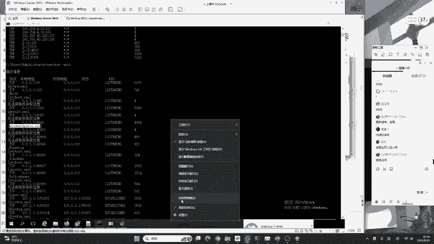
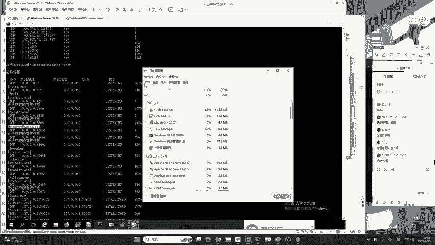
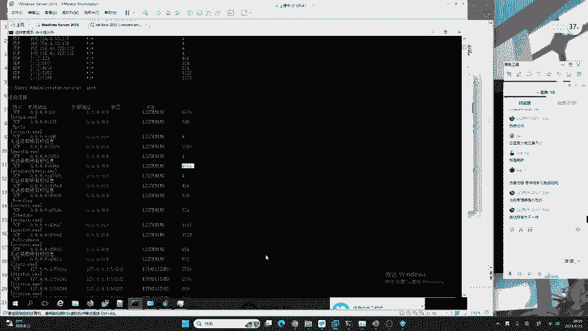

# B站最系统的护网行动红蓝攻防教程，掌握护网必备技能：应急响应／web安全／渗透测试／网络安全／信息安全 - P13：蓝队应急响应-12.进程排查 - 跟小鱼学安全 - BV1SF411174M

好，我们来看进程排查。来确定它到底是不是后门，到底是不是病毒。进程排查最好用的工具就是任务管理器。但是任务管理器你真的会用吗？我们站在一个windows server以及站在现在win11的任务管理器。

也给大家进行分别的讲解一下。进程当然也可以注入啊。进程注入了，我们也可以排查出来呀，去排查现程去排查剧柄。你各种方法都可以去排查，只是看大家蓝队的技术掌握的深度和广度有多大的，这些是需要时间去磨练的。

大家哈特别是今天来听课的小白同学，你千万不要为一些大佬去带偏了，咱们要一步一个脚印的来。好的，我们现在来去看。例如说像windows72016，也就是咱们win10的任务管理器，它分为如下几个部分。

进程、性能、用户详细信息以及服务。那在这个位置呢，我们要点击详细信息。

在详细信息中会告诉我们一个非常重要的叫做PID意思为进程的RED。有的同学哈在打开自己任务管理器之后，发现自己的详细信息中并没有PID这样一个。选项没有这一列，那这时候应该怎么办呢？哎。

我们需要到哪里啊，需要去右键这里就是说在这个位置啊，咱们要去点击咱们的。哎，我看一下这在哪哈，这windows server。而要去右键咱们这个地方哈，右键咱们这个地方。

然后呢把咱们的选择列给勾选勾选上去啊，选择列。然后将PID它默认啊，它是没有勾选的，我们把它打上勾，然后点击确定。这时候PID这一列就会出现，我们就可以去找现在啊他告诉我。

6666端口开启的进程呢是windows update点EXE。那我们首先呢要找他的PRDPRD在这里对应着的是。4984请注意啊，在windows的终端有一个很大的问题，就是它这个列啊。

它是不会对齐的。比如说协议列呢在这儿，本地地址列在这儿，外部地址列在这儿，状态是这里，那PID呢在最后，那这一点是windows操作系统的事情跟我们是不需要关注它的。现在你发现了他的PRD是4984。

我们一起来看一下。在这个位置。我们点击任务管理器，在PRD中，我们找到4984。找到4984。在这里。在这里呢有一个windows update。那通过这样一个这样一个简单的名称。

我们并没有办法去判断它是不是是一个恶意木马文件。那没有关系啊，咱们只需要右键。打开文件所在的位置，你看到它是在哪一个目录，C盘windowstamp目录tamp目录中出现的EX1。

我们就要考虑它是否为后门病毒木马程序。那这时候啊我们就可以把windows update点EX一去进行一些木马查杀来确定它是否为一个真正的后门。其实啊它是的。这时候呢我们就必须要掌握这样一个思维。

你单独的看网络。是看不出他是否是真正的木马的。你必须要把网络和进程去综合的去判断，综合的去分析，你才能把这个入侵排查好，这是一个非常重要的思维。不论是很多同学他会问，如果他是进程做了隐藏怎么办？

如果他做了没有文件落地怎么办？你再厉害的，你再厉害的人，你操作系统，想去运行一段。在内存中执行一段命令，你无非就是以进程或者是现程的形式去运行。他不可能有其他的形式。

除非你如果说啊可能有就是二一老师太菜了，你不知道，那你的想法啊就错了。因为我建议如果有这种想法的，你可以去通读一下操作系统原理，然后再来反驳我。好的。那我们用这种方法就能排查到这个后门。

现在我们继续来看，你可以看到啊整个的方法，我们可以看到这个红队啊，他用到的手段是非常的恶心的哈。这个呃他不仅为我们创建了。😊，这个恶意的账户还为我们去植入了这样一个后门病毒。

那现在我要给大家讲一个比较新的任务管理器，就是咱们windows11windows11windows11操作系统。在今年更改了咱们的任务管理器相应的UI界面以及操作功能。我这里呢可以给大家打开看一下。

新的任务管理器呢，它更加的好用了。首先在进程这个位置，我们就能够看到更多的这些内容啊，更多的内容。比如说在腾讯课堂可以看到它的子禁程，我们通过子禁程的分析。

也能够去定位一些隐藏或嵌入到正常进程中的一些木马病毒文件。浏览起来呢是更加的清晰明了。其次呢就是性能性能大家应该都知道，它是提供了一个非常简单的方法，去帮助我们了解自己计算机的CPU或者是内存大小。

其次就是应用历史记录、启动应用用户以及详细信息等等。在windows11的新版的任务管理器中的PRED呢是已经默认打开。

我们可以使用同样的方法去从PRED加上网络的监听以及网络的连接中去发现咱们的一个后门病毒模板。这个win10啊，我建议哈，如果你没有必要可以不去升级windows11。因为总的来说。

它们两个除了UI界面的变化，什么是UI界面啊，就是美化，你可以这样理解，除了它变好看一点了，动画变得流畅一些了，别的哈跟win10没有特别大的区别。

关于系统的底底层以及对于我们常见漏洞的系统所做出的防御。在内存中的一些检测，其实win10和win11是完全一样的。好的，我们下面继续来讲。啊，大家学会了没？😊，是不是很好玩啊，这种方法就可以去呃掌握。

这娜美同学说麦克电脑是不是要装虚拟机才能用到windows学习这些。是的哈，麦克电脑的话，你现在如果是呃ME arm架构的话，你可以选择PD虚拟机。那PD虚拟机去安装的windows啊。

它是非常好用的非常好用的。😊，好的，我们下面继续来看，就是进程排查。