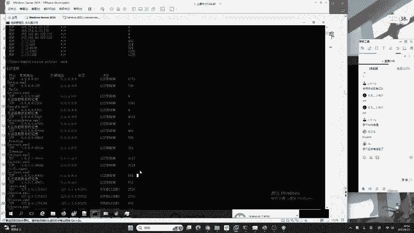
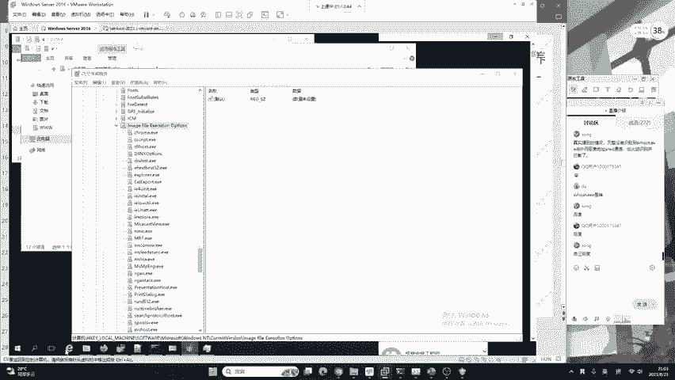
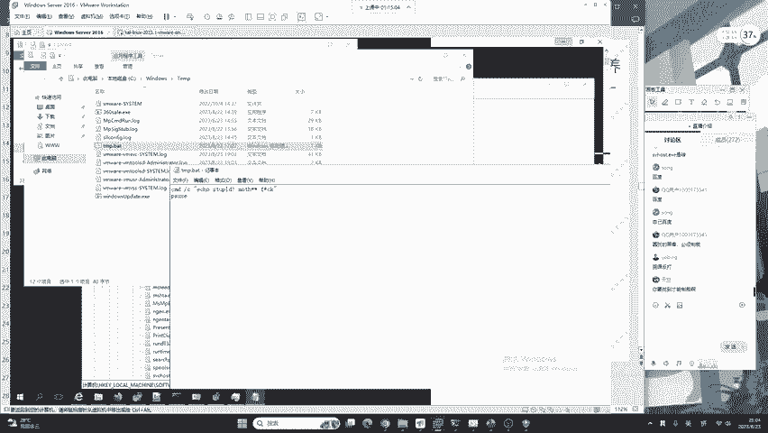
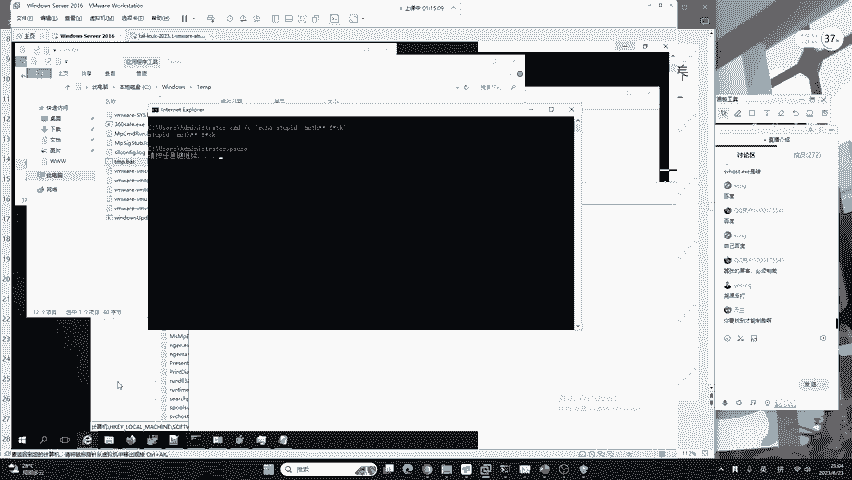

# B站最系统的护网行动红蓝攻防教程，掌握护网必备技能：应急响应／web安全／渗透测试／网络安全／信息安全 - P14：蓝队应急响应-13.注册表排查 - 跟小鱼学安全 - BV1SF411174M

下面我来给大家讲解注册表。注册表呢刚刚我们已经见识过了，就是通过注册表去排查恶意用户。这种恶意用户呢在红队的领域被称为影子用户。那现在呢我们来正式进入到注册表的讲解，也就是注册表的排查注册表啊。

它的作用呢，你可以理解为是windows的一个设置数据库，也就是啊我们针对于windows的一些设置，都可以写在我们的注册表中。那注册表应该如何去打开呢？这里大家应该知道啊。

就是按住你键盘的windows加R键，会打开运行窗口。在运行里面，我们输入RGedit就可以达到这个效果。很多同学啊在学习网络安全或计算机基础的过程中啊，它总是记不住RG editor。

这里要告诉大家它都是英语的缩写。比如说RG就是register。edit就是edit的。缩写也就是注册表编辑器。我们下面来给大家运行一下。只需要在windows中按住我们的windows加R键。

输入RNG editor，点击确定就可以打开。那关于我们的注册表要排查哪些内容，刚刚已经为大家介绍了sam。那现在我们来看其他的内容。这些内容啊，其实都可以使用什么，都可以使用咱们的一些工具去排查。

但是请大家注意一件事情。

你面试的时候，难道说你只会工具吗？比如说客户去问你，你现在做蓝队，你会做什么事情啊？你说哎，我会下1个360给客户做一下简单的排查。那你这样答可以吗？客户会信任你吗？那为什么客户不自己去装1个360呢？

你会下360是吧？很多同学啊，他关于咱们整个的安全体系你还是有有欠缺的。所以说你必须要把这些细节都掌握好，你注册表不会看不懂，你就要把它从不会到会这样一个过程，你是需要的。

首先第一个排查就是黑客最喜欢做的事情。就是用户自己动向。DI同学他提到了一件事情啊，现在起步是小红伞。其实哈我们是站在一个安全工作者的角度，你去看小红伞用的非常多。但是我就想问，咱们200多位同学中。

你有多少同学是用腾讯电脑管家，或者是用联想自带的杀毒软件的。你这些同学你可以扣个一给老师看一下，就是用腾讯电脑管家的。肯定有非常多的同学。所以说哈咱们一定不要站在一个。😊，安全的角度去看。

你要是站在安全角度去看，你说我这个红队我还打个屁啊，现在大家都有杀毒软件，都有趋势杀毒，都有360都有卡伐斯基，那我还打个啥呀？那你这样呢想的话，那红蓝对抗就不用开展了是吧？咱们互网就不用打了。

那你压根就没有这回事啊。那首先呢第一个就是红队比较做喜欢做的事情。😊，就是说我可以给你设置开机次启动。好的，我们下面来看一下开接字启动的像在哪里。有三个地方，这里大家不用记哈，你记了明天就忘了。

还是老规矩，用到了就是搜就是查就OK了。😊，举个例子，怎么去看注册表？在这样一个系统正常启动所运行的开机自启动文件，比如说开机自启一些页游，开机自启动2345啊，这些软件你们懂的都懂啊，它是怎么实现的。

就是在这里有个叫做HK users，我们点开。啊，不是这里啊，叫HK create user在这个位置，我们点开之后啊，点击这里一个叫做software的地方。😊。

然后点击我们的microsoft应该知道这些英语吗？当前用户软件、微软。点击它之后呢，我们继续来去看。点击windows N Tcur version。点错了哈，在windows这里。

current version看一下。好，在windows current version这里啊，我们找到一个run。这里就能够看到了。这些东西啊都是咱们一个开机自启动。我们来看一下这个开机自启动中。

它做了什么事情啊，他做了一个开机自启动项，这个项啊叫做hello。😊，它的位置是运行了C盘windows temp360CF点EX1。我之前给大家讲过了，作为一个红队，它有一个习惯。

就是习惯的把一些后门去放到了C盘windows temp这个目录。因为这个目录，所有的用户都可以进行读写，就是它是忽略权限的一个文件夹。它把这个写在里面呢，也能避免这个用户的发现。好的。这个同学说哈。

就是说咱们有没有一个杀毒软件能够达到一个100%的杀毒，这肯定是不存在的。你这样的话不是要了红队的命吗，是吧？😊，如果一个杀毒软件或者是一个防火墙，直接把所有的病毒全部拦死了，那怎么办？

那红队怎么去生存？好，百变怪，你不用急哈，咱们今天啊不会给你讲恢复删除的话，当然可以删啊，直接在这右键删除就行了。你要注意一件事情，就是说我们在这个地方啊是进行一个排查，排查之后，你要写报告。😊，好的。

我们继续来看。我们继续来看哈，这是一个排查点，还有相同的排查点呢，如下两个地方分别是local machineoftwaremicsoftwin print versionron以及相同目录下面的run one。

好，这是我们的开机自启动项。你在这里面呢，如果大家你不是使用的正版的windows，或者是你又下载，例如说像2345系列的输入法或者是同类型的软件的话，你可以在你的开机自启动项中看透很多的东西。

它有可能是广告，也有可能是在给你安装一些其他的广告程序，那你就可以把它删掉。当然你删掉之后啊，你发现这些软件又会给你添上去，因为它会检测你有没有删除。你删了我再给你加上去。所以说入侵排查。

它绝对是一个繁杂的过程，我们要逐一供破。下面继续。第二个叫做镜像劫持。镜像劫持在很多的恶意软件中都非常的常见。当然，杀毒软件对于这些来说也有相应的防御措施。我们一起来看一下。比如说我去打开微信。

结果这个黑客把我们的微信去改了，就改成了木马。我们在运行微信的时候，就同时或者是直接发生改变，去运行了后门木马，导致我们的电脑中毒，或者是被黑客红队去控制。

那这时候呢我们就要介绍windows的一个注册表功能，叫做镜像截尺。镜像劫持是一个非常老的技术，早在0几年的时候就已经被国外的大佬已经玩很多遍了啊。当然现在你作为一个恶意黑客，他肯定是多管齐下。

全部都做，就像老师的这个靶场一样，比较恶心的啊，他什么东西都有做。我们一起来看一下这样一个镜像劫持。它是在哪里呢？

它是在HKloc machineofwaremicsoft windows N T current version一个叫做IFEO的文件夹下，我们现在来到注册表中看一下它，那这些要不要记呢。

要告诉大家啊，你不要去记它，没有用。因为你记得明天就忘了这些又不是什么隐藏的东西，又不是什么秘密啊，你都可以去看到或者是搜索到的。在这个地方，我们点击software。Microsoft。

Microsoft。还有再去点击到我们的一个windows NT。找到哈W。W在这啊，windows N Tacren version再去找找到这样1个IMFEO。在这样1个IMFEO在这个地方啊。

我们就要逐一排查。你会发现啊，针对于windows server操作系统，它是给出了非常多的那这里老师做的是截持了什么东西呢？我来给大家看一下，很多同学应该都听说过啊。

在win10操作系统中依然保留的IE浏览器，它非常的难用。但是啊咱们每一个操作系统，它都会自带。那这个IE浏览器呢，我们在打开它正常的情况应该会打开一个非常垃圾的浏览器。那这时候我的系统发生什么改变呢？

我们点击看一下。

我点击IE之后啊，他并没有打开IE浏览器，而是啊又给我输出了一个脏话。你可以看到这个黑客是非常的不讲武德。他不仅创建了张三的后门用户，还经常的骂人。😊，那在这个位置呢，我们发现IE浏览器是已经被劫持了。

那我们怎么去发现它被劫持的位置呢？

就是要到注册表中的。IFEO这个地方找到IE啊，找到IE在这个位置。这时候呢我们找到IE之后，你可以看到一个名称，它叫做第buger。第bu个这个名称它有个数据叫做C盘windows cha。

TMP点BIT又是我们非常熟悉的windows临时文件夹windows temp。那在这个位置，我们去看一下TMP点BIT到底写了什么东西。我们来一起看一下。这个黑客。看一下好，直接去编辑它就行了。好。

他可以看到他是。😊，直接去进行了一个输出，去把这样一个输出的内容，ealtid等等。它就替换到了我们本身的IE浏览器，导致我们点开IE之后就会被骂。

好，就是这样一个效果。那如果你想去清楚它，只要把这个debuer去删除就行了。请大家注意。2一老师讲的都是举一反三。我这里啊也是站在一个针对于初学者和提高大家兴趣的角度去讲的那真实的情况下。

它的挟持位置，可能不是R一浏览器。因为现在没有人再去用它了。它可能是一些其他的软件，或者是在本身的原软件上面啊去植入病毒木马，而不是啊去进行镜像截持。我们要有多种的角度去考虑考虑红队会做什么。好。

那现在又问大家，你能100%防住红队吗？如果你能说100%防住红队，那恭喜你。

可惜啊互网已经结束了。如果互网没有结束，那恭喜你，你第二天将会被打成筛子，就是因为红队和蓝队是一个对抗的过程。你要想着怎么去防他，他要想着怎么去打穿你整个的对抗来促进安全的建设，你要一定要清楚这种概念。

不是说红队，他就是为了打你打着玩，不是说蓝队啊，咱们就是为了必须得给他防死，不给红队饭吃，大家啊其实不论咱是红队还是蓝队，其实都是打工人。那为什么不能给双方留一点这个退退步呢，是吧？

非要给大家的这个饭碗给摔了，这肯定对谁都不好。😊。