# B站最系统的护网行动红蓝攻防教程，掌握护网必备技能：应急响应／web安全／渗透测试／网络安全／信息安全 - P15：蓝队应急响应-14.系统相关信息排查 - 跟小鱼学安全 - BV1SF411174M

那下面我们继续来看继续来看。那关于注册表的排查，我们学习了三个位置，分别是用户自启动向、镜像劫持，以及我们一开始所讲的sam这样一个影子用户的排查，在这个地方。好，在这个地方。

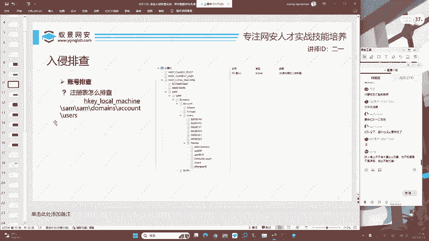

好的，我们下面再来去看。那学习完这些排查之后呢，我们现在还要去做一些系统相关信息的排查。比如说第一个叫做计划人物。计划任务是什么意思呢？一个简单明了的解释就是闹钟。比如说早晨6点钟。

我的手机会发出会放一段音乐来当成这个闹钟。那计划任务呢就是指我在哪一天的哪一个时刻去做什么事情，针对于操作系统而言，不论是windows还是linux操作系统啊，它都会有。

那现在我们就来看计划人物应该怎么去写。好，那计划任务的打开跟注册表是一样的，我们可以按住键盘的windows加R键。那在这个位置呢，我们输入SCH啊这一个调度。我看一下啊，这个地方记不太清楚。

叫task SCHD就是计划任务服务点MSCMSC的意思呢叫做啊microsoft这个呃叫什么计划程序啊，conttrol啊控制器有计划任务控制器。我们直接的去把它进行运行一下啊。放到这个位置。

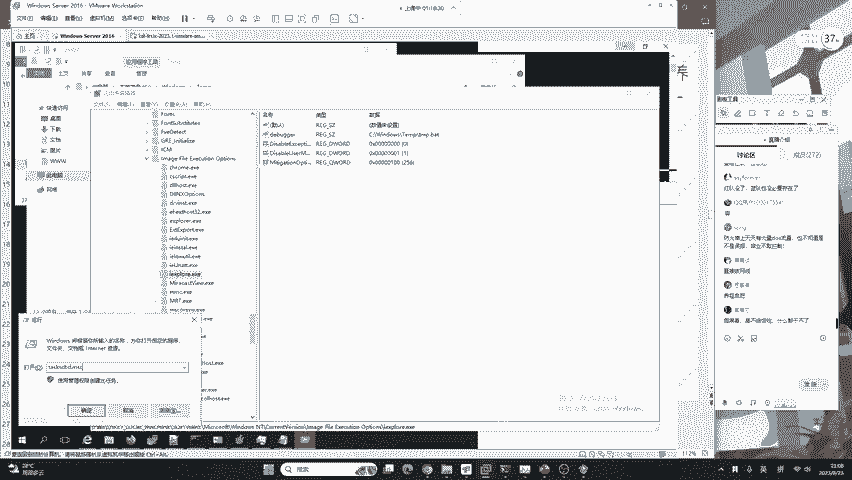

点击确定就可以打开计划任务。那有同学说啊，我记不清这怎么办？其实也没关系，现在的windows都有搜索，你直接在搜索这个地方去写汉语就行了。😊。

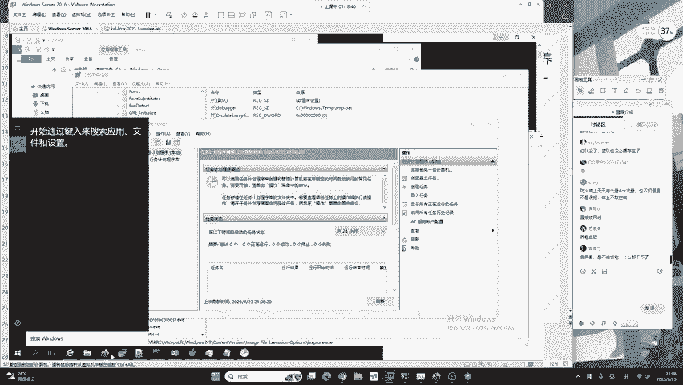

计划任务它同样也能打开，还有注册表也是你没有必要去强行记忆REGedit，你可以在这个地方直接写注册表，它也是可以打开的。不过啊好像windows seven有点有点垃圾哈。

咱们的windows11是可以的。你可以去搜索注册表就能打开了。😊。

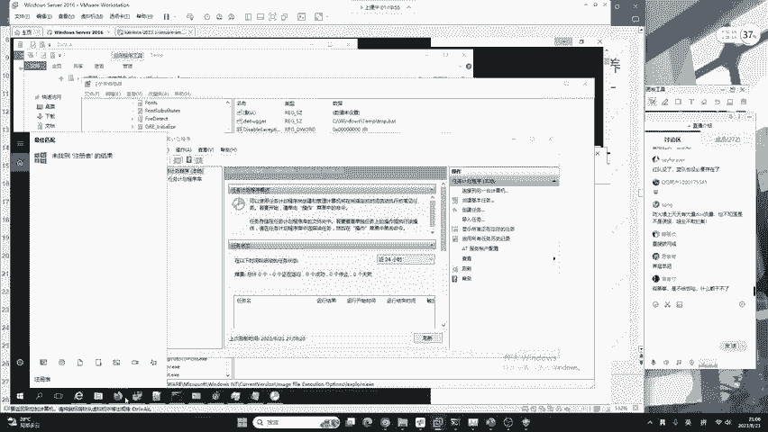

好，在计划任务这个地方，我们来看一下咱们计划有没有被写入什么计划任务。哎，我们来搜索一下。这里的计划任务啊好像没有啊，好像没有，我们来看一下。往下看看啊。这个活动任务来往下看一下，要排查一下。

因为windows server啊它的一个呃计划任务比较多，我们来找一找啊找一找。就是你要看这些哪些可能是。咱们一个。有缺陷的计划人务，我们来看一下。找一找啊，这这些东西怎么去找呃。

其实你可以自己去上网去搜，因为它很多都是windows server自带的。其次呢就是通过这个位置，你这个位置一看你就就能看出来啊，它哪些是windows自带的服务，或者是哪些是咱们的一个后门的。😊。

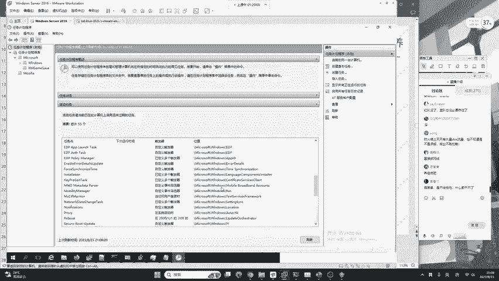

后门的程序好来看一下。这里会发现这个计划任务没有，这没有的原因呢，是因为老师之前创建的计划任务已经过期了。我这里可以给大家看一下截图。这个截图它是做了什么事情呢？好。

它是定义了一个一个叫做security update的计划任务。这个计划任务呢是在每天的3点钟，也就是凌晨3点。去运行后门模板。这经常会见到这是什么意思呢？呃，QQ用户提到的红队也会倒班吗？

红队一般是不倒班了，红队一般是7乘24啊，只有你累了才休息。但是咱们蓝队是倒班的啊。蓝队的话一般就是干12个小时或干10个小时，8个小时就会换班啊。蓝队的话轻松一些，这是肯定的。😊。

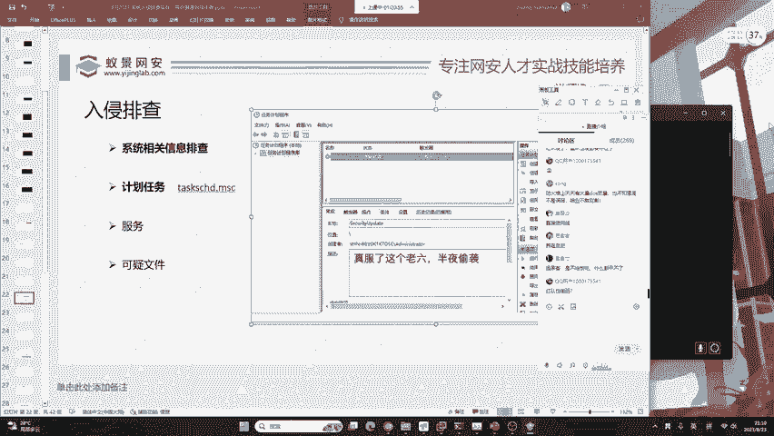

好，那在这个地方呢，我们可以看到计划任务也是一个着重的排查点，它很有可能尤其是在红蓝对抗之外，咱们真实的服务器被入侵，经常会被植入计划任务。就比如说挖矿。这个挖矿啊，它都是以计划任务的形式去运行的。

它不会在白天的时候挖，就是当你睡着了，比如说你12点12点它开始把这个挖矿程序启动起来，让疯狂的挖矿疯狂的赚钱。

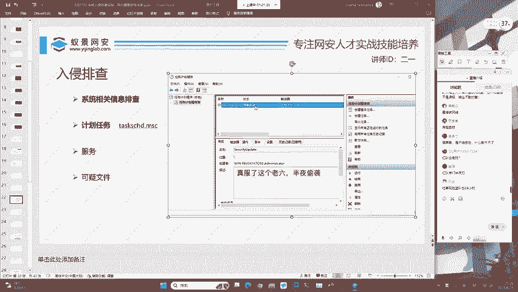

是吧疯狂的赚钱。😊，看起来没毛病是吧？所以说这你就需要去排查了，我就是要让你看的没毛病啊，是吧？就是要看让你看的没毛病。如果让你看的有毛病，那我直接暴露了，是吧？😊。

那这个触发器你就能看出来这个凌晨3点钟啊3点钟。我们不去评价我们不去评价工作时间，工作时间是由客户和甲方决定的。如果你觉得工作时间长，就是评判甲方，而不应该评判咱们的技术。请大家注意啊啊。

包括今天互网最后一天出现的一些这些比较有趣的事情和人，我还希望大家就是抱有一个理性的态度去看。那这些人他只是。一个个例。那咱们还是老话，就是你技术学好，你不用怕吃不上饭啊，咱们不论怎么样。

我们只需要把自己的技术打好。你不信咱网络完全还找不到工作，咱们还找不到互网，我从来不信这个鞋，你找不到，只有一个问题，就你自己猜，只要把它学好，你就。😊，能够达到相应的程度，这是计划人物。

我们继续来看服务。服务啊经常会被用到恶意的服务。就是说windows它有很多正常服务。那恶意服务它是什么样子的呢？这里给大家看一下，还是咱们的windows。哦，你查到了这个浏览器的更新程序是吧？

那我的建议是你可以把它卸载，然后呢你换一个比较好用的火狐或者是谷歌浏览器吧。那关于这个浏览器出现了什么问题，那你自己想啊，我在这里没有办法细说细说啊，你懂的都懂。😊，那这个服务要怎么去？

做呢哈这个服务要怎么去做呢？service点MSC就是还是老规矩啊，打开咱们的windows加R键。😊。

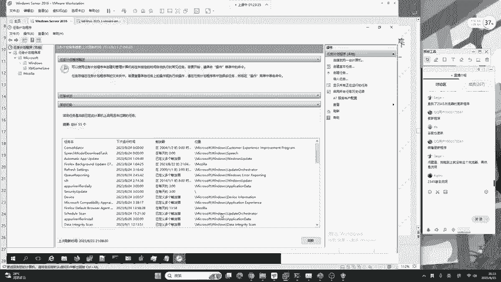

windows加R键在这里输入service点MSC。你就能打开这样一个服务控制器。这个服务控制器呢同样的道理，我们可以从它的描述以及登录文，还有启动类型中去判断咱们会不会有后门程序。我们来看一下。

那这里呢二宇老师是定义了一个叫做buckcan这个服务。这个服务做了什么事情，我们可以右键点击属性来看。这样一个服务呢，它是执行了一个文件，叫做C盘windows temp360s。

所以说呢在服务也是被经常成为红队的攻击方向。它不仅会让这样一个文件存在于你的磁盘中，还会把它列入到服务或者是计划人物中。啊，计划任务重。

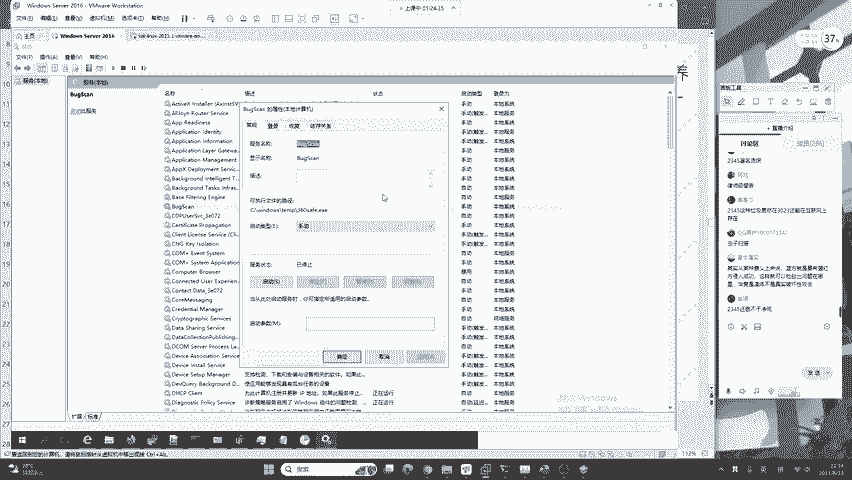

基本属实说的从某种意义上说，蓝方就是希望红方侵入成功，这样就可以检验出问题在哪儿。其实啊呃道理是这个道理，你讲的道理很对。嗯，但是在实际的互网中，咱们蓝队啊还是要做到未雨绸缪。就是说呃咱们不能被打。

因为被打了会被扣分啊，会被扣分。对，虽然基本属实同学他讲的很对啊，他这个意思就是站在一个安全建设的角度去讲。那未来的场景肯定是这样。我们红蓝双方不能被成为一个呃这样一个对抗恶意竞争的这样一个状态。

而应该处在都为安全建设去努力的这样一个。😊。

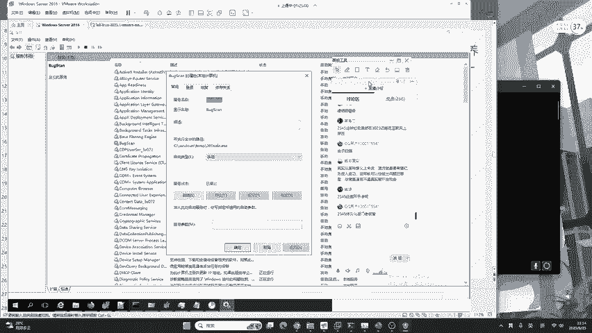

环境下才是正确的啊，这是未来肯定会逐渐进步的。啊，当然现在的话还是。不能被扣分，还是不能被打。就是说被打了，我要及时的应急，要及时的阻断，要把这个危害降到最低。要把这个危害降到最低，能理解吗？好。

我们继续来看现在服务排查完之后，最后一个就是可疑文件。可疑文件是什么意思呢？非常简单。就比如说在昨天的课程中，有的同学提到的可疑文件有一个非常简单的排查方法，就是根据修改日期。

如果红队啊它没有使用一特定的技术去修改这样一个文件的创建日期的话，我们就可以通过修改日期的排序，将一些可疑的文件去筛选出来。我的前提是，如果它没有改。如果改了怎么办？最简单的方法查找可疑文件。

就是使用杀毒软件进行全盘查杀。好，这是最简单的方法。可以把这个危害降到最低。你说这种方法不能被红队绕过去吗？我这里要告诉大家哈。

任何不论是红蓝双方都没有100%确切的攻击方案和防御方案都是在逐步逐渐进步和优化的过程中，你不可能掌握一套说我这个漏洞啊，咱们所有的蓝队都会被打。我这个漏洞，我这个防御方法，咱所有的红队都能防。

这时候又遇到了咱们之前上节课说到的一个问题，就是咱们在互网中啊看到很多的红队使用零带，零带就是呃大家不知道的漏洞，只有红队自己知道，现在就是windows的漏洞。windows出现了一个大漏洞。

但是谁都不知道，只有我知道。现在还是给今天新来的同学提到一个问题，你觉得零带是不可以被防御的吗？你想象一下。啊，给大家一个思考，因为可疑文件啊，咱们是可以进行全盘查查的这是一个最简单的方法。

我们将它与咱们整个的一个流程去结合起来，就能够把什么呀？就能够把咱们的一个入侵排查做到基本上90%的一个程度。😊，好的，那有同学说咱们这样一个领带能不能被防御，大家觉得能不能被防？

如果你觉得领带可以被防，你可以扣1。如果你觉得不能被防，你可以扣2啊，可以防御。😊。

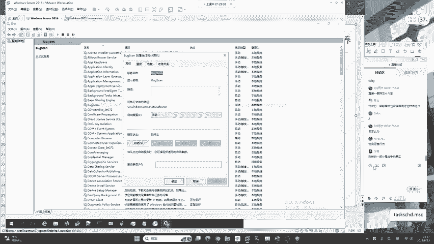

就是可以，当然是我不是说100%啊，就是我们可以采用一些安全建设，可以扣1。那不能防御，你可以扣2啊，有同学觉得不行。要注意哈，一个企业。😊，他不是说你这样一个漏洞是什么样子的。就比如说现在很多的企业。

他是专注于零信任和终端安全的建设。如果把这些的建识达到了一个99%的程度，你的零带。你可以有，但是你打进来之后没有危害。啊，你没有危害，对它有一个完整的防御体系。

这是很多的设备和很多的安全工作人员、值守人员共同建设的一个成果。他不是说你零带你完蛋了。你现在一出个零带，咱们蓝队都回家了，绝对没有这回事啊。那只能说你回家也是因为你菜啊，也都是因为你菜。

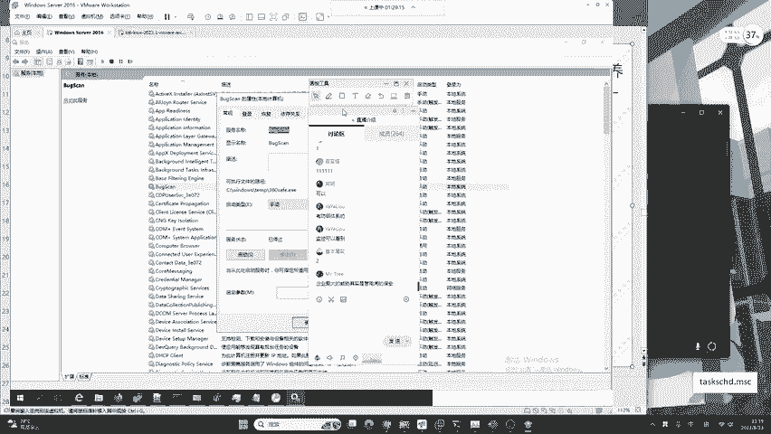

好的，那我们现在再来去看。

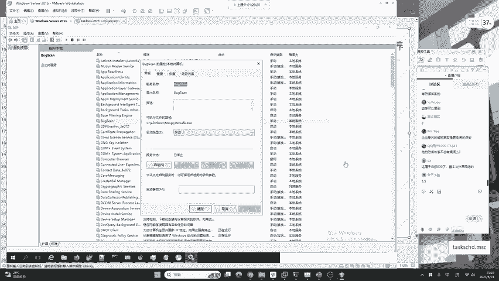

再来去看。那现在我们今天讲了这么多内容，我们来想一想有没有一个自动化的工具推荐。