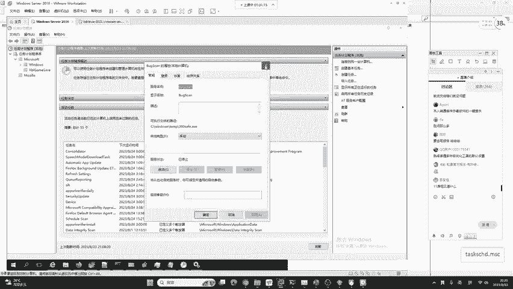
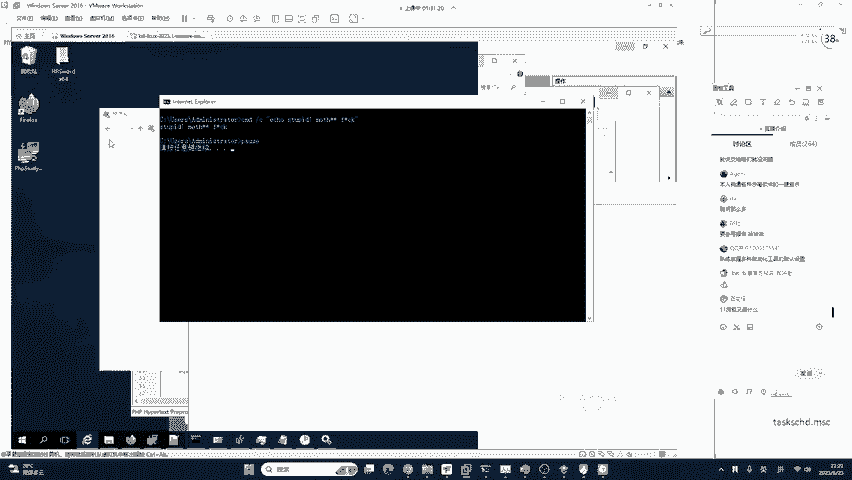
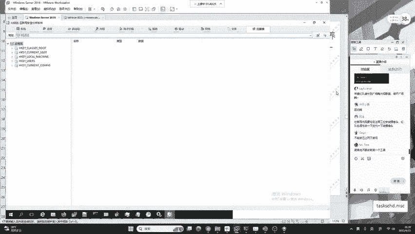

# B站最系统的护网行动红蓝攻防教程，掌握护网必备技能：应急响应／web安全／渗透测试／网络安全／信息安全 - P16：蓝队应急响应-15.自动化工具火绒剑 - 跟小鱼学安全 - BV1SF411174M

这里有，而且啊我针对于咱们小白或者是你刚接触到恶意病毒分析的同学，我建议你使用火熔剑。但是要注意，那有同学说啊，二姨老师，你这不是废话吗？怎么不一开始就讲火龙剑啊？😊，那你想一下还是老规矩。

现在甲方去问你，你去参加互网的面试。现在你遇到甲方，甲方问你哎，咱们这个呃操作系统有哪些入侵排查的方式啊，你都是怎么排查啊？你说哎，我火熔剑。😊，那别人客户就一懵啊，啥啥子剑啥的玩意儿。

那怎么会要用你呢，是吧？所以说你一定要有一个系统的理论，咱们工具也要会用，手动也会打理论也知道，原理也清楚，只有这样，你才能向高级蓝队发展啊，一定要注意这种东西啊，所有的都都要会啊。

不是说你会用工具或者怎么样就OK好，这个火熔剑啊，大家在。😊，大家在你的火熔上面啊，它是有的，在安全工具。这里可以看到啊有一个高级工具叫火熔键，我们就可以打开它。啊，但是啊我们一般情况下啊可以推荐使用。

分离开的火容件来进行分析啊，比如说啊我这里就有一个分离开的火容键的APP大家如果需要的话，可以找各自的班主任。我在课后会把这个火容件发给我们的班主任，再由班主任转发给大家。我这里来给大家看一下哈。😊。

对你还要会写报告，就是全能，你不能指会哪一点，整个的流程都要会。

在这个火容键我们打开之后。他都是中文。你可以非常清晰的去识别它。好，第一个叫做系统监控。系统行为监控是大家在做木马病毒查杀中。最为关键的。一点，你现在我想告诉大家，你这个病毒你不论怎么秒杀。

你最终是不是要控制我？是不是这样控制我？比如说打开摄像头，拍一张二姨老师的照片，你想一下，打开摄像头的这个操作。咱们系统知不知道这个软件做了这个操作，他一定知道。

因为这些都是从系统相应的驱动去调取接口来去打开的摄像头来去拍隐私照片的。所以说，如果打开摄像头这个行为被我们的火容件捕捉到了，那你想一下这个恶意软件不就OK了吗？就像之前对进程分析啊，进程行为分析。

就像之前这个小米手机这个雷总做了一件非常好的事情，就是小米手机中啊，它有一个类似于火容件的行为监控。我们就会发现啊很多我们家喻户晓的APP它在动不动就获取你的地理位置啊，动不动啊就打开你的麦克风。

动不动啊，就打开你的摄像头。😊，你说这种行为被小米去监控出来之后，很多啊在微博上面或小红书上面去。很痛彻的去批评这些APP，不去注重咱们的用户隐私。那我们按照这种meu阿的思路来去想。

在实际黑客的这样一个工具中，对，打开摄像头只是一个应用啊，他除了打开摄像头之外，还会有很多很多的操作啊，当然这就是红队的一个方向了。那具体是哪家公司，我在这里不能说哈我在这里不能说。

大家知道就行啊啊大家知道就行，你不需要再发出来或者怎么回事啊，就bad boy对。😊，啊，那这个地方呢我们系统的监控啊，它是一个非常啊复杂的一个流程。你可以自己去试一试。其次呢就是进城。

进程还是老规矩啊，它这里的进程，比如说刚刚有同学看到的一个叫做SVC hosts。这个SVC hostt呀，它是叫做windows的服务主进程。

这个服务主进程呢是windows自带的那很多的黑客他就会把自己的这样一个。木马的名字也给他命名成SVC host，让你找不到它。但是你现在看到火熔剑，你觉得如果中间存在了一个假的SVC host。

你能不能找出来它？肯定可以，为什么能够找出来呢？首先我们就是从描述以及从路径中就可以发现。那C盘的windows system32中，它只有1个SVC host，那这时候怎么办呢？

很多同学啊经常会被误导，就是国外很多的IPT在早期的时候使用后门木马都是去修改它的文件名，改成这个样子，叫做SVCH0ST他把O换成0，你就看不出来，有的人啊这个打吃鸡都找不到人。

那针对于这种O变成零的行为，你肯定就看不到了。它就可以达到一个伪装。这个红盾的思路是非常千奇百怪的。所以说我们也要提高这个防御的警惕性。😊，可以注入进城。那注入进程跟啊没有特别大的关系啊。

在注入进城之后，它其实还是以子禁城或县成的形式去运行的。我们在这个地方也可以去具体的分析。比如说这个位置咱们打开之后。你可以具体分析它注入之后的，比如说这边他会有模块列表，就是。指出他调用的一些动态库。

那这些可能会接触到一些操作系统原理，或者是深入的一些知识。大家可以嗯先了解一下，我不会讲太细。以及巨柄就handler这些巨柄，我们也能够看出来它的一个类型，一个值，它的名称。还有就是内存的一个分布。

这样一个memory的 map，我们都可以当做这种进程注入高级红队的一个防御。甚至是做内存的取证以及逆向分析的这些对于这个逆向分析的一些掌握。啊，当然这个蓝队肯定是无限的，任何的技术都是无限拓展的啊。

都是呃人外有人，山外有山的这种境界。希望大家能够理解。但是小白同学你也不用急，咱们不可能一蹴而就。如果你说你三天就把蓝队掌握了，或者是说我现在花一年的时间，网络安全在地球上非我莫属。

那你就是菜到极限了哈。你就是说你对这个行业了解太少了就完了。😊，是吧所以说咱们要抱有一个持续学习的态度啊，这是我要告诉大家的。😊，嗯，其次呢就是启动项。

启动项我们能够明显的看到直接看到啊位置文件这个地方就是后门病毒。后面病毒啊，内核内核我就不多讲了啊。😊，内核的话，一般情况下，在这个嗯咱们正常的红蓝对抗中啊，他很少去用到。为啥呢？

就是说呃咱们这个红队不论做什么事情，他都不可能去破坏你的这个内核文件或者是破坏你操作系统的。因为它可能呃你这个红盾如果不去按照相应的规范攻击的话，也是会吃到官司的。😊，呃，其次就是服务。

这个服务也是清楚的能够看到啊，能够看到咱们有一个呃相应的。木马进程在这位置文件啊，C盘windows temp360c点EXE。其次呢就是驱动驱动病毒。大家应该听说过哈。

以前有一个叫做某精灵的一个非常出名的软件啊，它里面提供的一些驱动啊，就是存在被植入后门病毒的。那当时是非常的可怕啊，非常的可怕。嗯，在这个地方我们也能够去监控咱们系统中安装的一些设备驱动还是老规矩啊。

咱们这个红队，一般情况下它不会去改你的内核文件，它不会去改你的驱动。它改了的话，如果把你的服务器给破坏掉了。😊，那是吧，那红队也不好交差，这基本上是不可能的。红队他想去做删除的操作。

做上传的操作都是要有记录，有备案的。就像有同学在某某社区上面看到这个红队会不会潜伏过来呃，给我的电脑上面插U盘，或者是对我进给我一拳呀，顺着网线给我一拳，这些东西如果红队要做都是合法合规，得到备案的。

他如果贸然的去进行进源渗透，这是违法的。直接出局啊，甚至是受到法律法律的制制裁。那这里还是老规矩啊，咱们这里也有网络，咱网络来看一下。😊，啊，直接能够看到啊这个4984啊4984是个未知文件。

开启了6666端口。我们直接能够看到这个病毒文件。关于是什么软件，你就不没有必要发出来哈，没有必要发出来。其次呢就是咱们的文件。😊，还有注册表，这里的注册表呢更好用一些。因为上面有一个输入框。

你可以直接输入进去是吧？能够更好用一些。这个火容件啊，我不希望啊我讲太多，因为它是一个中文软件，你只需要一会儿啊找到自己的班主任领取一下这个软件，自己啊点一点看一看。

基本上啊你就能达到一个对于进程分析和网络分析，有一个基础的认知。但是你千万不要只记住火容件了。火容件相关的啊还有非常多。比如说像process hack这些啊软件啊进程分析网络分析类型的软件。

还有非常多。当然可以自己从网上下载啊。如果大家不想要集成版的话，就是不想要单独版的话，在火容安全中高级工具就有火容件，你就可以去用啊，不需要去下载单独的。如果你需要一个单独的，你可以自己从网上下载。

或者是一会儿啊找咱们的班主任，我在下课之后啊，都会去发给大家。

大家就是不要成为一个工具小子，大家也能看出来，现在每每一天比一天卷。如果你再会工具，说实话啊。你想去找工作已经是非常困难了，想去找高薪工作，要做的是啥都会，你说原理我也会，你说流程我都知道。

你说工具我也都会用。😊，那就是能说会答。讲原理，会实战。好，这是咱们安全工作者必须要有的一个技能之一。

