# B站最系统的护网行动红蓝攻防教程，掌握护网必备技能：应急响应／web安全／渗透测试／网络安全／信息安全 - P17：蓝队应急响应-16.溯源 - 跟小鱼学安全 - BV1SF411174M

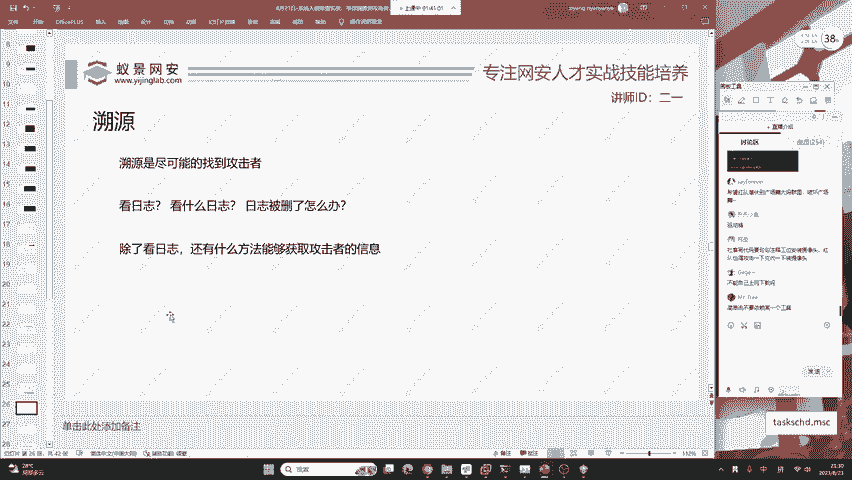

那现在问题来了。就是说。我们做了入侵排查之后，现在要做的一个流程就是要溯源。当然大家一定要记住，你实际去互网，你不可能都去做，你又去排查又去溯源，又去分析日志，那你不累死啊，也当猴一样是吧？

也跟飞奴一样，那不可能都是有分工的。但是你作为一个分工的之一。作为员工之一，你必须都要掌握。那现在我就要问大家。😊。

你现在怎么才能找到攻击者，这是尽可能的找到。要注意，溯源也是老规矩，没有100%的方法。如果你说你有。那你是中国最强蓝队，给你这个称号。那大家想一下怎么去组员。首先日志。日志是我们首选的，但是你要考虑。

看什么日志，如果日志被删了呢，红队不会删日志吗？学习渗透测试都知道有一个叫日志删除，那别人删了日志怎么办？还有就是说除了看日志，还有哪些能够获取到攻击者的信息，大家可以发散思维想象一下。

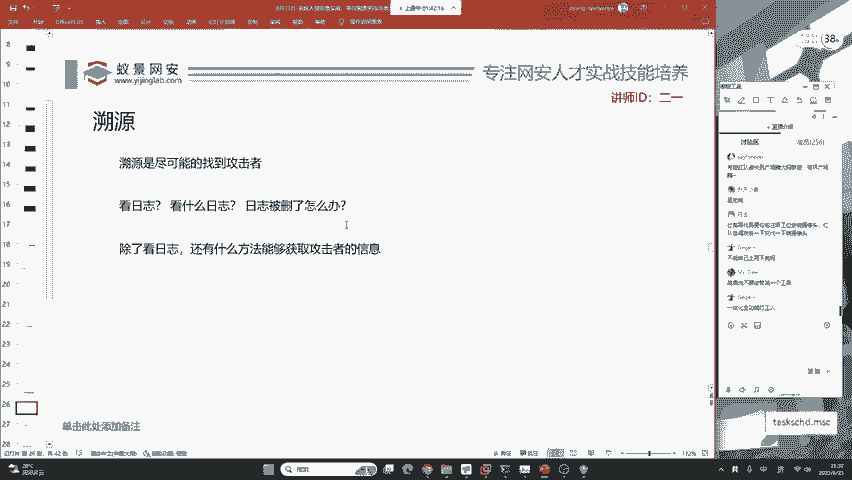

你现在可以在讨论区说说出一下。好，QQ用户说到一个日志删除这个操作也有日志，非常好。你再删，它还是会留一条日志在这。

好的，151同学说的非常对。

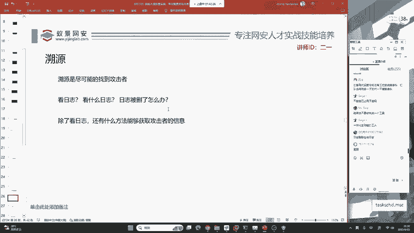

就是蜜罐。现在。😔。

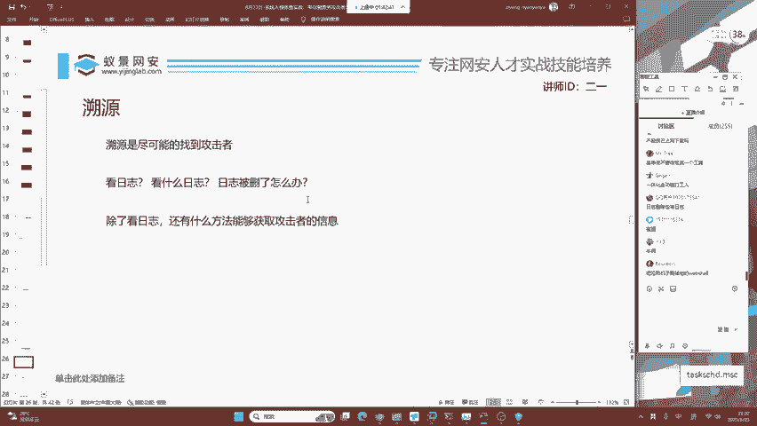

很多的红队都使用代理，除非一些傻缺啊，他直接去打你。这样的话我们就是就认为啊这个红队是给我们饭吃。就像你这个蓝队，你什么都不做是个弱密码，就理解为啊我们不能去嘲笑他，而去理解为他想给我们饭吃是吧？

他想给我们创造收益，就像你去挖漏洞，你要去感谢这些开发，如果没有这些开发的存在，这个漏洞你还挖不到呢，是吧？😊。

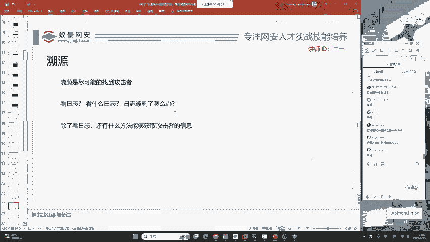

所以说呢咱们主要就是要主动出击。现在你去看蓝队溯源到的都是被反调育的，都是被反调育的。反钓鱼的这个案例实在是太多了，有的红队真的是。😊。

有的红队真的是就是完全的被溯源到。那可能就是说呃你的一个身份证号或者是你的大学，你的家庭住址，你的照片都被别人溯源到。那这些啊都是综合的利用，没有说哪一种方法呃去能够得到的。好。

那现在我想问大家一个基础的问题。比如说我们去看日志。😊。

看日志之后，我们得到了黑客的IP地址。黑客的IP。

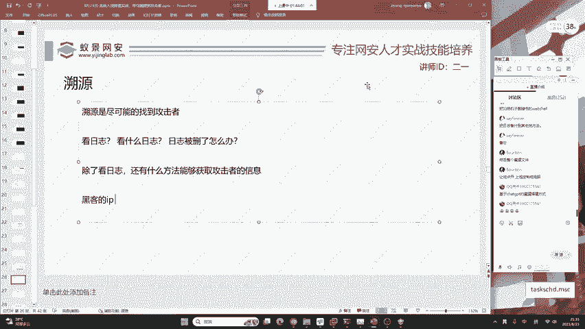

你怎样通过黑客的IEP去找到黑客的。

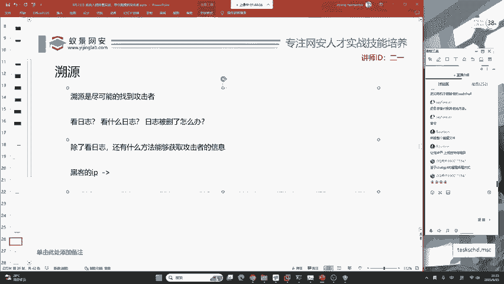

黑客的一个身份信息。黑客的身份信息。大家觉得哈很多的人他会调侃，在一些呃这个社交媒体上面，他会说大家觉得这种路径是100%可行的吗？😊，通过黑客的IEP去找到黑客的身份信息。

大家觉得这种是10%可行的吗？如果觉得100%可行，你可以扣1。如果你觉得这是开玩笑，你可以扣2。大家觉得这种可不可信？

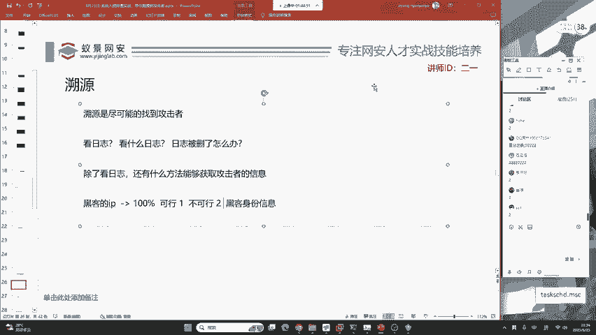

好。😔，咱们真理是站在上头的。

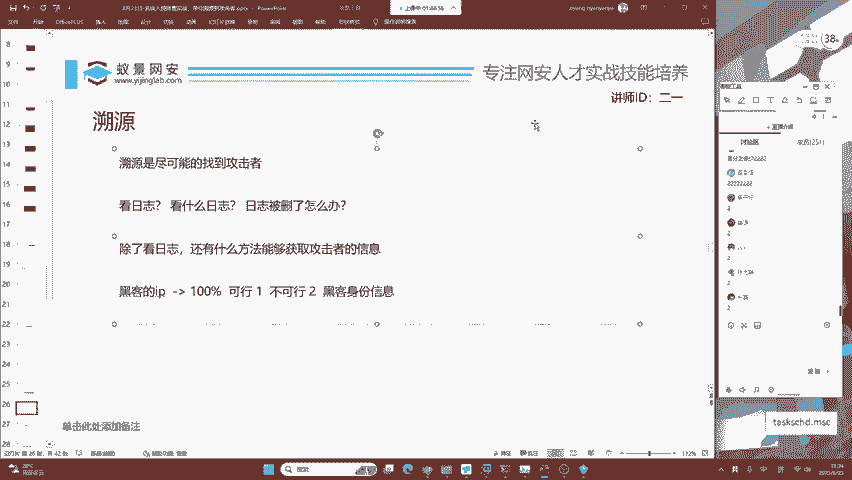

很多同学啊他会听到一些某某社区上面会说，咱们得到REP就溯然成功了。其实并不是啊，你想通过REP地址获取黑客的身份信息。第一个就是黑客，他会挂在你。😊。

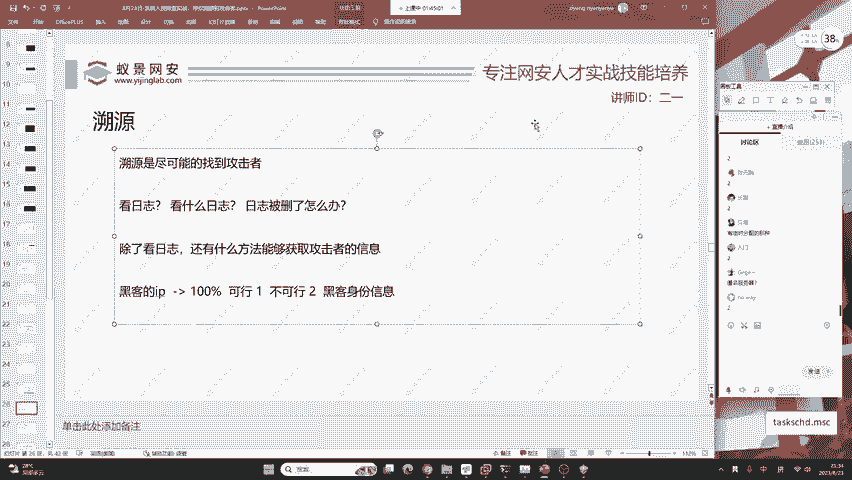

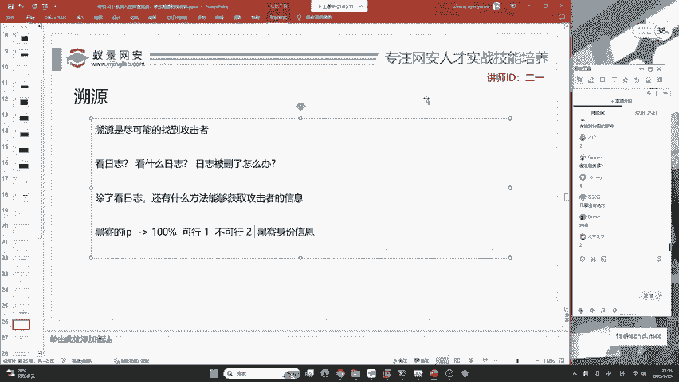

第二个就现在。我把我的IP给你。就是我把我家庭的IEP都给你。你能找到我是谁吗？你是谁呀？你是除非啊你是王景。即使你是王警的话来听课的同学，刚刚呃南嗯南陈同学应该走了哈，南陈同学是阿ir啊，是阿ir。

即使是阿ir，你也不是说我想拿1个IEP，我想查查他是谁，你就能查的，不是说所有的阿ir在所有的场景都能够去查。😊，好，OK第二个，我举一个非常简单的例子，你想象一下，如果有IP就能查到黑客身份。

那请问。中央12台社会语法频道为什么还要存在呢？你去看一下那些普法节节目，不论是境外的、美国的还是中国的，这些警察再去抓这些电信诈骗分子的时候都是费了九牛二股之力，各个省份联合研判去抓到的这些犯罪分子。

那如果这IP能够直接去定位到黑客的身份信息，而且是100%定位。请问为什么还要有这些警察的存在？大家想象一下是吧，只能是大致的是。去识别。当然，这种路径是可以走通的，它只是不能达到100%。

大家能理解吧？就是说你想去素联我，我的黑客也可以隐藏自己。我隐藏之后你就可能找不到了。百变贯说你这个问题。当然可以查到了，你这个问题当然可以查到了，是吧？😊，这种是可以的，但是不是100%，懂不？

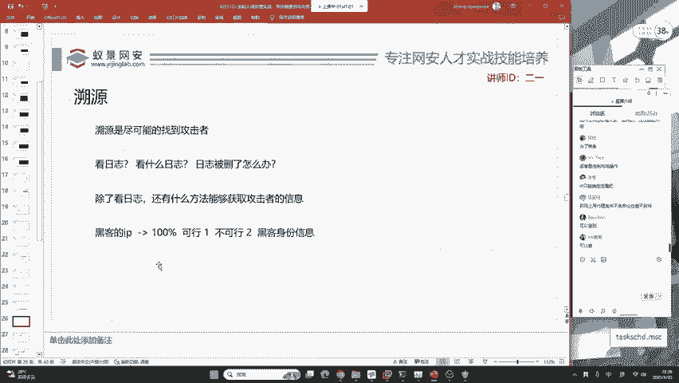

不是100%。

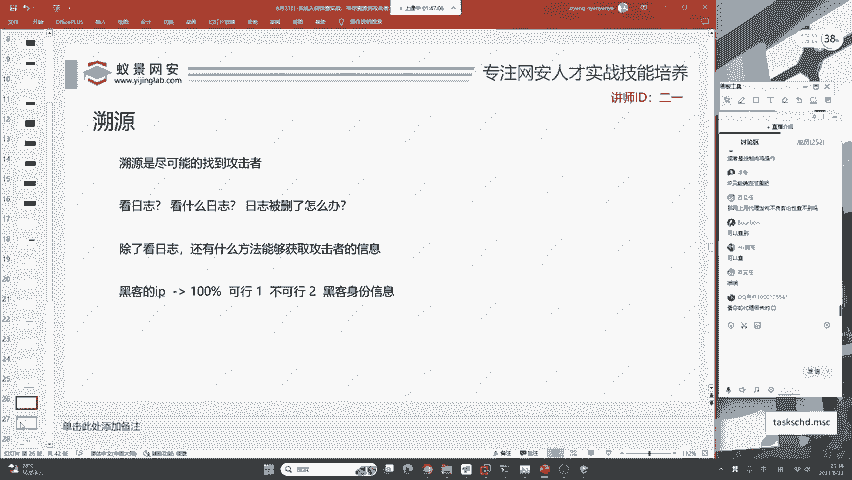

那现在。

好，我们大家能理解了吧？这种东西比如说你在家里，你用家庭的网络，你去发布一些。非法的信息，你想一想，你家庭的网络是哪里来的呀？移动电信联通，那移动电信联通不知道你是谁呀。😊。

那肯定知道是吧？你代理你代理哪里来的，你代理你即使买的境外的服务器，那你是不是也要去连接你连接境外的服务器，你是哪里来的？有的同学特别的搞笑啊，他去买境外的服务器。

就是全方位的全方位的这个个人隐私信息都没用。就是我注册账号是用临时邮箱密码也是不常用的。然后IED呢也是随便敲的，最后购买支付宝付款。😊。

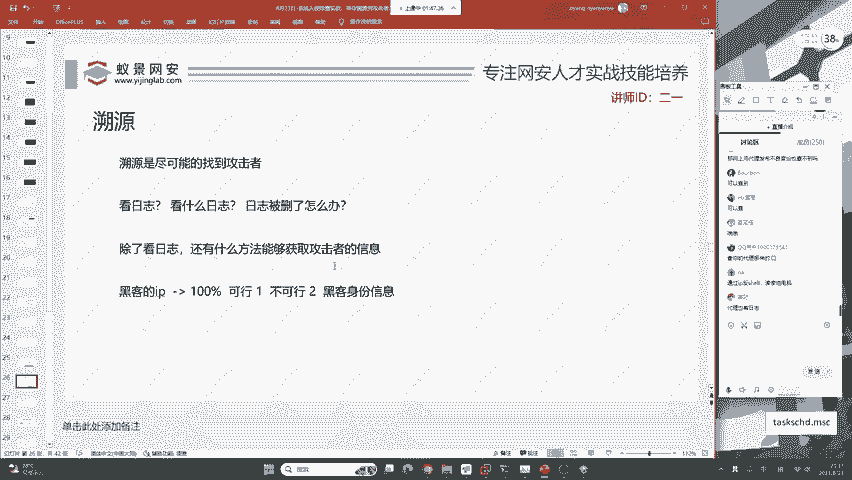

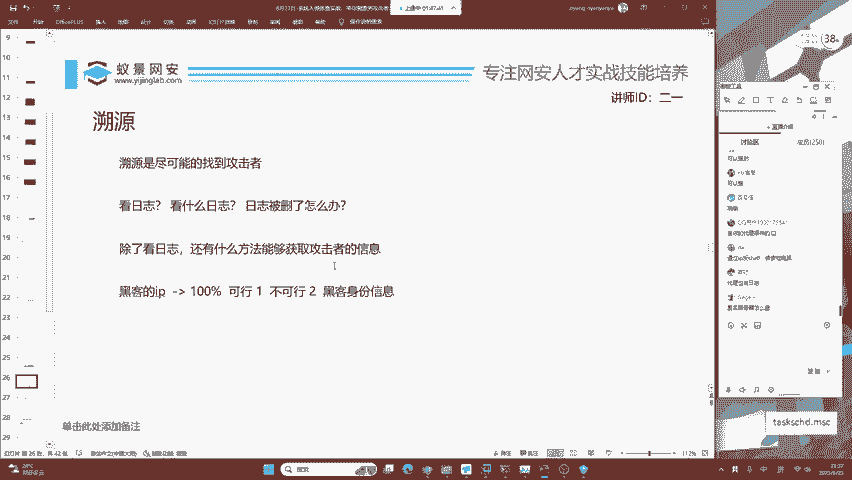

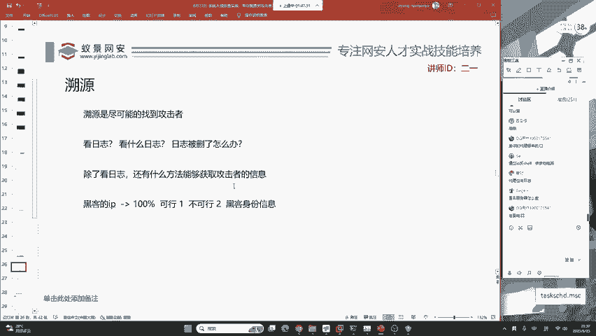

你想一下你这个行为，你支付宝付款。嗯，这个行为就已经你懂的啊，所以说呢你想去。😊。

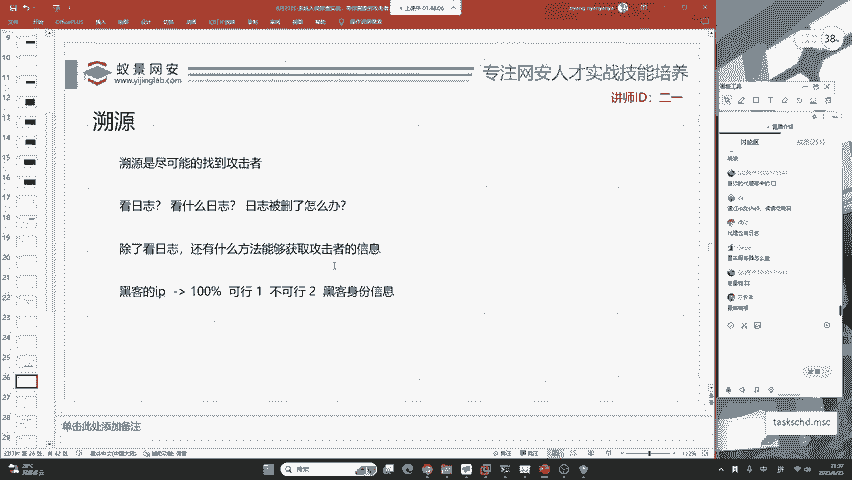

做到100%的隐藏，其实啊这个基本上不可能，只是对于咱们蓝队来说给你1个IAPP就要提供黑客的身份证号。这个操作是非常难的，不是100%可行。那关于溯源，我们主要啊就是来进行密罐的钓鱼。

进行主动反制红队。

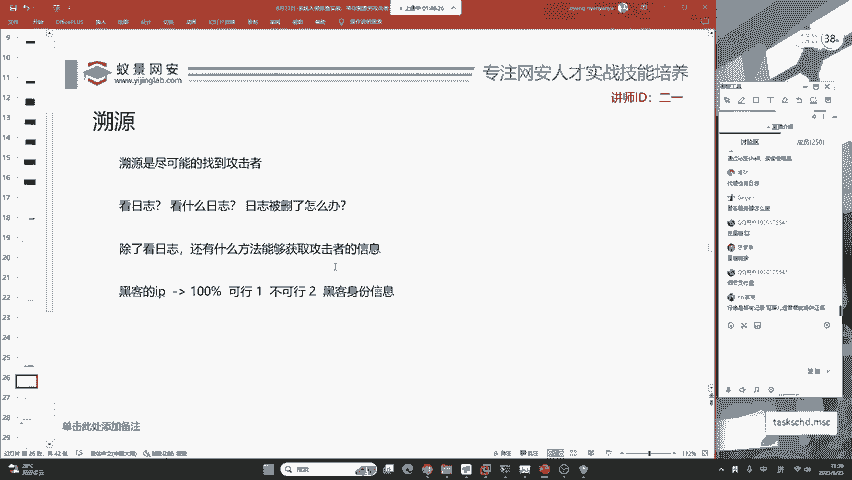

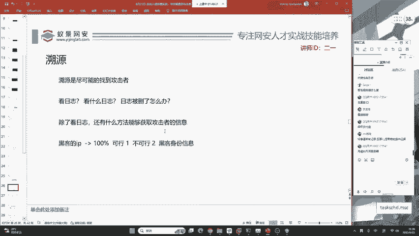