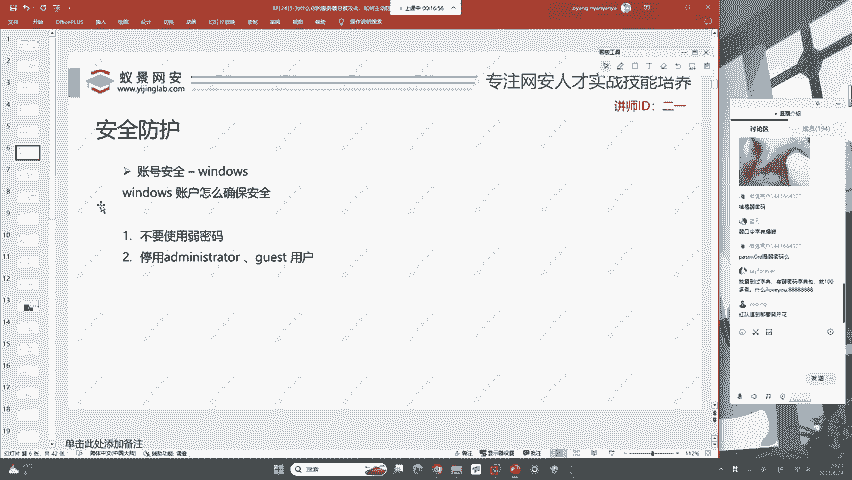
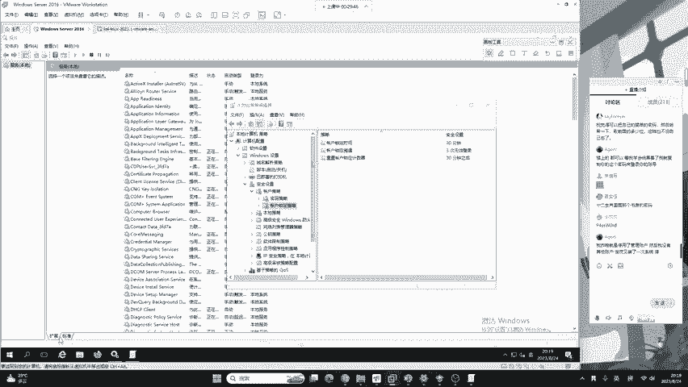
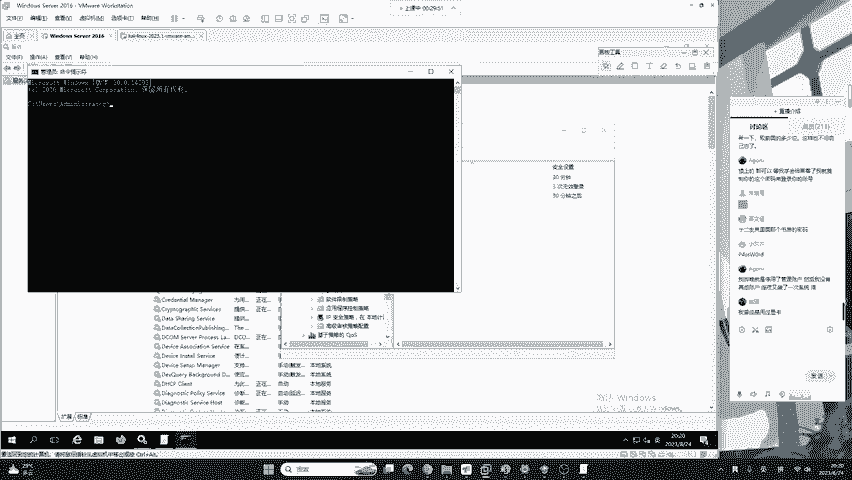
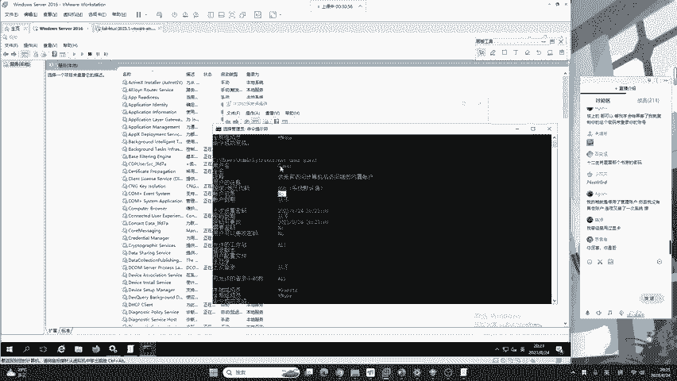

# B站最系统的护网行动红蓝攻防教程，掌握护网必备技能：应急响应／web安全／渗透测试／网络安全／信息安全 - P18：蓝队应急响应-17.账号安全 - 跟小鱼学安全 - BV1SF411174M

好，第一个通过入侵排查，我们会发现黑客经常会给我们留下后门用户。比如说普通的恶意用户以及隐藏用户和影子用户。在昨天的课程，我们已经对三者做了详细的讲解，以及对其排查的技术做了相应的演示。

所以说在安全防护的体系中，账号安全是首屈一指的。我们来想一下，windows账号要如何确保绝对安全。首先分为两点，第一点就是不要去使用弱密码。

第二点就是停用administrator账户以及gs来宾用户。那大家想象一下，这两点应该如何具体是实施呢？首先第一个什么是弱密码，就是这个密码的这个复杂度比较小，比如说123456。

它是被广泛的使用在互联网中，不要使用弱密码，这可能是一个安全意识相关的培训。但是大家想一个公司的领导，或者是一个公司的安全运营，它在自己的公司内部不停的去说，哎，大家啊不要用简单的密码。

大家啊这个密码一定要保证。更相应的复杂度千万不要用123456。但是呢你这只是口头的去传达，总是哈在几百个员工里面总是有一两个人，他总是要跟领导对着干，你现在不让我用123456是吧？我非要用。

所以说哈安全意识培训，它是一个主观的培训，那具体如何让用户不去使用弱密码呢？就是我们要对操作系统做一些配置，你使用弱密码，我不能让你用。

那怎么去配置呢？那今天我们要掌握windows操作系统的一个关键点，它叫做本地组策略编辑器。简称组策略。主策略呢也就是对我们的计算机相关的安全进行设置。我现在给大家做相应的演示。

如何让我们的windows操作系统更加的安全。首先，如何打开组策略？在昨天的课程中，我们已经学会了如何打开注册表，如何打开服务控制器，如何打开计划任务。那今天还是老规矩，我们按住windows加R键。

那在这个位置呢，我们只需要输入GPedit点MC点击确定就可以打开系统的本地组策略编辑器。同样的道理，这些啊其实都属于英语简写。这里的本地组策略编辑器啊就是group policyedit。

就是组策略编辑器。然后这里呢是微软控制器的英语首字母缩写，我们只需要多敲它自然而然啊能够被我们所记忆，你不要去死记硬背。我们打开主策略之后，来看一下它对于windows操作系统的密码设置有哪些。

首先他在哪里呢？我们在打开组策略编辑器之后。大家稍等一下啊，我重新打开一下。这个是叫GP editit。点MSC。好，我们在打开组策略编辑器之后啊，点击计算机配置，这里有一个windows设置。

点开之后啊，有一个叫做安全设置的地方，我们点开就可以看到第一个被称为账户策略。账户策略呢一共有两个，我们都需要学习，一个叫做账户策略，一个叫账户锁定策略。我们分别来看一下。首先。

在密码策略中一共有如下几个设置。第一个就是这一密码必须符合复杂性要求。就是说这里啊如果我们显示的是已禁用，就是没有启用的话，我们就可以右键点击属性，然后选择是启用还是禁用。那这里啊给大家做简单的解释。

什么叫做密码复杂性的要求呢？就是windows如果启用了这样一个组策略，他就要求咱们用户的密码，必须要包含数字小写字母大写字母符号组成的8位以上的密码，他就能够避免这个员工啊他自己懒散。

非要用123456。如果你再去用123456的话，咱们的操作系统是不允许的。所以说我们要把它启用。其次呢就是密码长度的最小值。他默认是零个字符。同样我们可以点击这里，点击属性去更改。

就是说啊我们必须要告诉咱们密码的最小长度，尽量啊是8个字符以上。如果你默认不设置的话，有的人啊他自己的windows密码，就是自己的生日。生日很容易被猜到生日相关的密码字典，也非常多。

黑客啊使用一些小小的爆破技巧就可以破解你的密码。其次呢就是在密码规范中非常重要的密码过期时间。就是说为了让这个服务器，不论是咱们的服务器还是数据库，还是各种身份验证凭据也好，都需要有一个过期时间。

也就是说，这里我们设置的是42天啊，是42天。42天之后，我们windows操作系统就会强制要求用户必须要修改自己的密码。其次就是强制密码历史，就是说不能去记住密码以及可还原的加密来存储密码。

这里呢默认就是已禁用，什么叫已禁用呢？就像刚刚有讨论区同学说的，我这个密码啊是属于加密存储的。加密存储，它有各种的加密算法。有的加密算法是可以逆向还原回来的，而有的加密算法，由于数学的问题。

它无法进行逆向运算。默认是已禁用的情况。所以说呢我们windows默认加密的密码，你是逆向算不出来的。好的，这是密码策略所给予我们的6个功能，大家应该非常清楚了吧。来看一下各位同学提到的问题。首先。

爆破技巧是属于红队的内容。咱们今天啊是应急响应防御方向的课程。生日对应的键盘符号可行吗？啊，请注意这个微信用户一般情况下，弱密码只要是有自己身份特征的，我们一般都称为弱密码。

比如说啊有自己姓名、生日或者是生日的一些对应自己的特征，家庭住址都被称为条件弱密码。好，如果甲方忘记了这个密码，那你没办法，甲方忘了你这个地方怎么办是吧？好的，那现在有同学啊就开始去尝试了。

他会发现windows找不到GPedit点MSC这是为什么呢？浮夸同学你们知道吗？好的，我们一起来看一下在浮夸同学出现的这个错误啊，是因为各位同学，你使用的操作系统。

很有可能是windows的家庭版个人版或教育版。这些操作系统功能性较少，它没有主策略编辑器。就是说呢我们一般情况下，开发或者是网络安全的学习者都是使用专业版、企业版来进行网络安全的学习。

包括我们windows的s，它和windows的企业版是具有相同功能的。所以说我们可以打开本地主策略编辑器。好的，那下面我们在学习完这个之后，你会发现啊，只要对这个位置做应有的配置啊，做对应的配置。

我们就能够避免咱们用户把密码设置为123456。那咱们黑客如果想进行爆破的话，它的难度就会大大的增加。但是哈有的时候咱们使用强密码并不能完全防御爆破。比如说有的人的强密码它是长这个样子，我给大家敲一下。

你看我发到讨论区。有的人的强密码，它是这个样子，你看他有没有数字，有没有小写字母，有没有符号，有没有大写字母啊，全部都有。很符合所有的强密码的规范，但是这一串密码是典型的弱密码。这是啥意思啊？

你看一下自己的键盘纵向两列，是不是就是这个密码呀？EQIZ然后大写的艾特WSX。😊，所以说呢。只要你即使说我全部配了啊全部配了咱们这个密码策略，也不能够完全防御。这个有的员工啊特别的傻啊。

他还是使用这样的密码。那这时候怎么办呢？我们就可以看到，除了密码策略之外，在密码策略之后还有一个叫做账户锁定策略，请注意啊，这个账户锁定策略。

他默认都是不开启的我们如果要保证windows服务器的安全就必须要去设置它。第一个就是账户锁定时间，它默认不适用。那这时候我们要去改什么意思呢？就是说在这里有一个叫做账户锁定阈值，0次登录无效。

代表没有。这时候我们就需要去指定，就是这个账户在输入错误多少次密码来进行相应的锁定。这是啥意思啊？就如同你的手机一样。你的手机是啥意思？你的手机是什么呀？就是说我输入第一次密码错误了。

再输一次密码也错误了。输第三次密码依然错误。那我们的手机就会被锁定10分钟，windows操作系统，也有这样一个功能，只是默认没有启用而已。所以说在这里我们需要改一下。比如说我改成三次登录无效。

发生三次登录无效之后，锁定账户，然后点击确定。然后点击确定要告诉你三次登录无效，锁定多长时间，我们就可以去修改30分钟。也就是说哈你只要。输三次错误的密码，那我们的用户就会被锁定30分钟。好。

我们点击确定就生效了。好的，这个同学到处的在发密码，大家一定要清楚。我刚刚讲过了强密码的规范，就是有小写字母、大写字母、数字和符号组成的8位密码以上。你可以看一下你的密码符不符合规范。比如说这位同学啊。

你的密码看起来很复杂。但其实啊它属于一个强密码，但不属于标准的强密码规范。因为你缺少了符号。那像这位同学啊，你如果前面的这些拼音不属于自己的特征信息姓名或者是其他信息的话，其实你这个是属于强密码的。

好的，我们现在来看一下。我们来看一下这两个密码策略啊，是windows中非常重要的。你要把它配置好。就是大家家庭版的话，你没有这个功能，这为啥呢？就是因为啊咱们微软它要去卖专业版。

专业版跟家庭版的价格是不一样的。你想一下是吧？你家庭版既然负责减少，它给你的功能就没有这么多，对你的安全防御就没有专业版这么好。下面我们继续来看设置了用户之后，我们现在要想一件事情。

如果我们设置了用户锁定阈值，就是说啥意思呢？就是说哎咱们用户登录失败3次，我就锁定30分钟。你现在想一想啊，如果来了一个黑客，他故意给你登录错三次呢。给你锁定30分钟呢是吧？这不就不好玩了。

所以说呢我们还需要对windows的默认用户做一些简单的限制。比如说停用禁用掉我们的administrator以及gues用户。要注意，在做这个操作之前。

你一定要确保你的本地有一个除了administrator之外的用户存在于administrators用户组中。也就是说哈必须要有两个管理员存在。windows操作系统怎样判断用户是不是管理员。

之前我已经讲过了，是通过这个用户是否存在于管理员组中来去判断的。同样的linux操作系统如何判断当前的用户是否是管理员，主要是看他的用户ID只要他的ID等于0。不论这个用户叫什么，他都是管理员。

那相同的，我们的windows，只要他处在administrs这个用户组中，你不论他是叫张三李四还是王五，他都是管理员。好的，那我们现在来给他禁用一下。

其实我们windows系统默认这两个用户就是禁用的，只是有些黑客在攻献之后，他会给你打开。

好，我们一起来看一下。在这个位置呢，首先打开我们的命令提示符，输入net user，可以看到咱们默认啊有administrator，还有gas这两个用户。这两个用户啊，我们默认就是禁用的，怎么去看呢？

首先net user加上我们的用户的名字。回车。在这个位置啊，我们可以看到账户启用，它被标为了yes。就是说这个账户啊它是被启用的状态。那在大家啊就是你现在在用的操作系统。

你可以输入net user administratormin。你来看一下这里的账户启用是no，就是它默认是不会启用这个账户的。同样的还有一个叫net user。我们的GUEST就是访客用户来宾用户。

你可以看到这个用户的账户启用行被标识为了no，就是说明啊咱们的gues用户也没有被启用。

在标准的windows server服务器中，一般情况下，这两个用户都要保持禁用，下面是两条命令net user administrator斜杠active就是激活冒号no就代表不激活。

也代表禁用和停用。好的，这是咱们的账号安全，看起来也比较简单，没有特别的知识点，只是一个流程，还有对组策略的了解。

