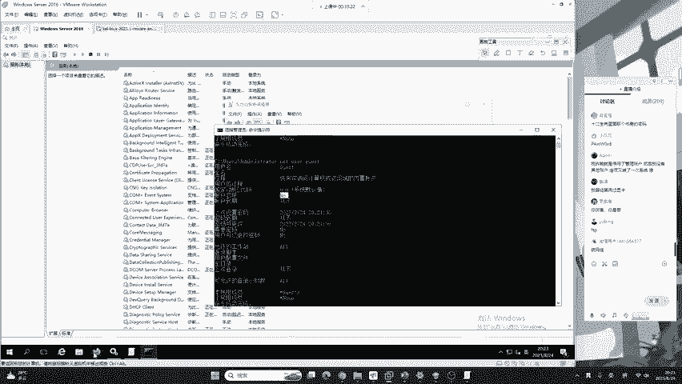
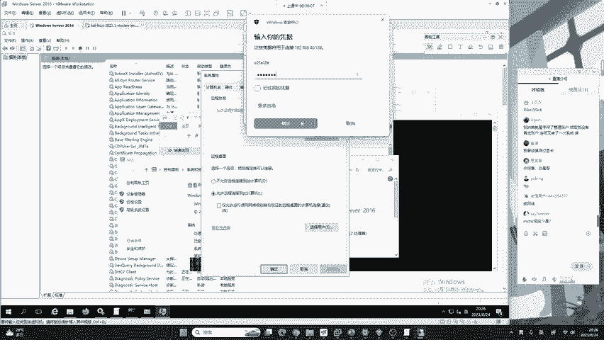
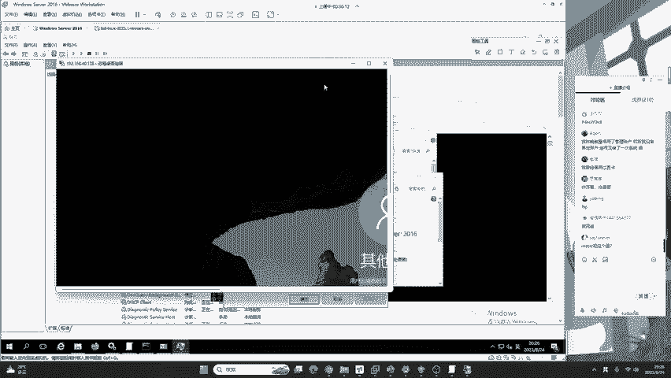
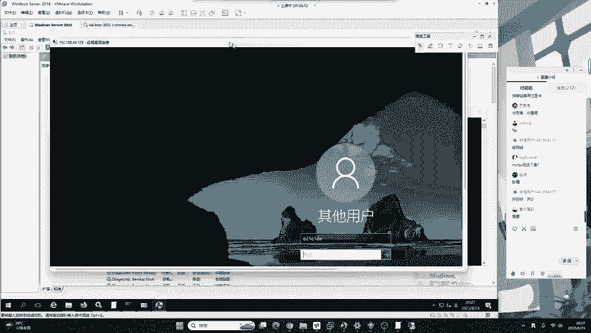
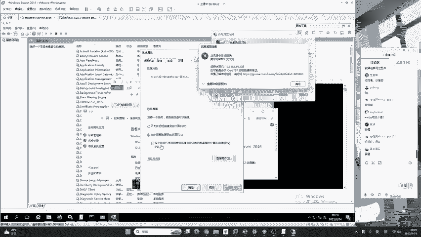
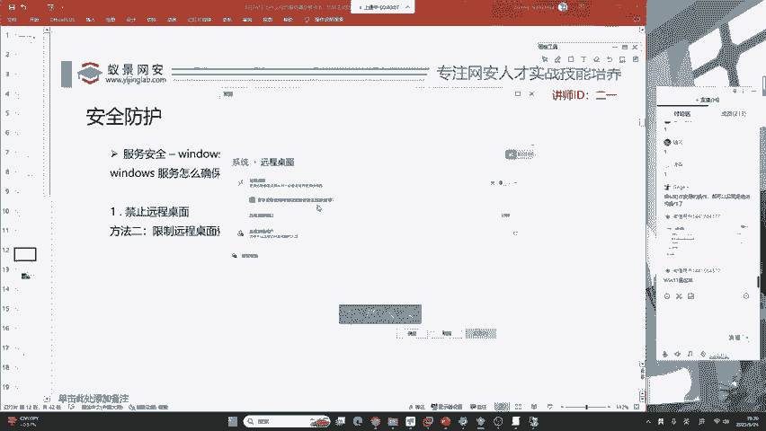
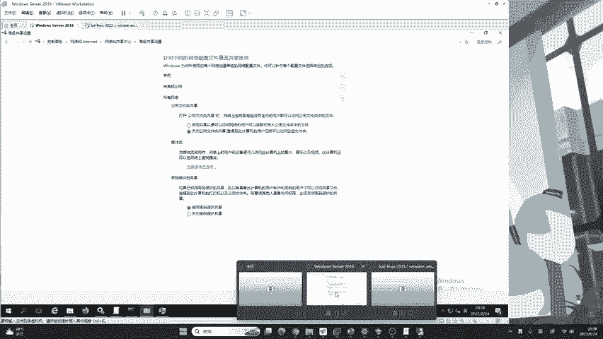
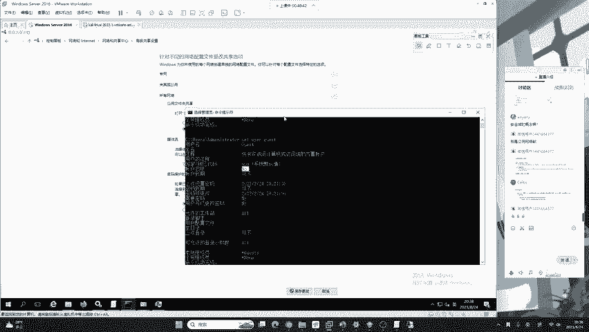
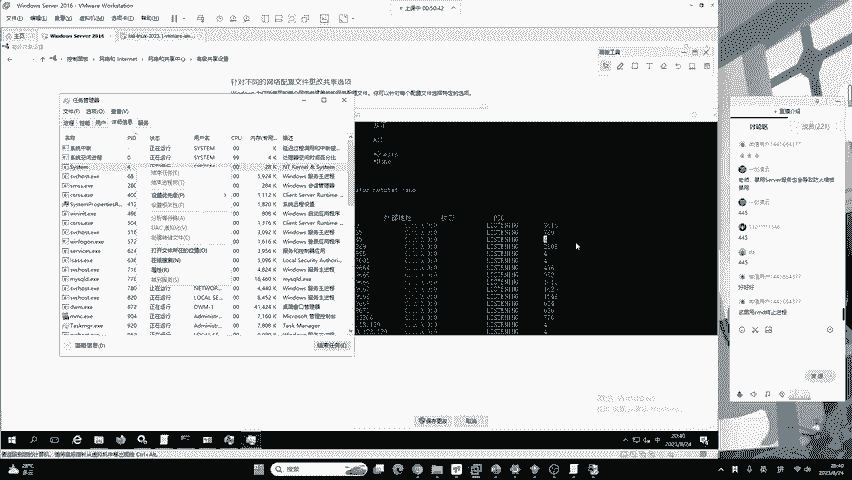
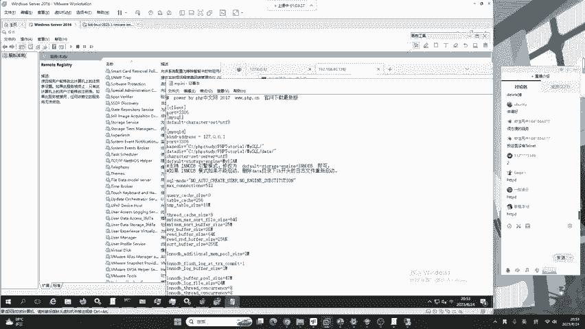

# B站最系统的护网行动红蓝攻防教程，掌握护网必备技能：应急响应／web安全／渗透测试／网络安全／信息安全 - P19：蓝队应急响应-18.服务安全 - 跟小鱼学安全 - BV1SF411174M

下面继续来看我们的黑客在攻击windows的时候，他都是从一些服务去下手。什么叫做服务呢？比如说你的网站网站其实就属于网站服务或者是web服务。那网站出现了漏洞，例如说网站出现了socle住漏洞。

那其实啊就是你的网站服务出现了soco漏洞。那我们怎样去确保自己的服务安全呢？下面有4个步骤，第一个就是禁止远程桌面连接，或者是对远程桌面连接做严格限制。第二是禁止或限制文件共享。

第三是关闭不需要的服务，防止被黑客攻击，或者是需要打开的服务。我们要做严格的服务验证以及服务的限制。第四点是合理的中间件以及数据库的监听地址。这四大服务经常是我们黑客的入口点。

如果啊你觉得我现在我的电脑这些服务都不要，那你就可以猛效去壳，我全部关掉。好，全部关掉。但是啊你要清楚，如果全部关闭这些服务，可能会对你的操作系统正常的功能造成一定的阻碍。所以说啊你要会关。

也要会安全的使用他们。OK下面我们来看windows远程桌面。远程桌面服务还是同样的道理。大家如果你使用的是windows家庭版、教育版、个人版，它是没有远程桌面这个功能的。

只有专业版和企业版具有远程桌面的功能。下面我们来看一下远程桌面应该如何关闭。

打开任意的文件资源管理器，点击。此电脑的属性。远程设置。在这个位置呢，我们就可以去关闭远程桌面，不允许远程连接到此计算机，点击应用就连不上来了。但是这种方法还是说了，我们这种啊是属于关闭服务。

例如说一个网站有漏洞，那怎么办呢？我就把网站关了，或者是说啊我这个电脑可能会被有黑客攻击的风险，就可能会被黑客攻击，那怎么办呢？我就把电源啪一下按掉，我不给电脑通电，那它啊就绝对安全。

但是这种行为可能会影响咱们服务器的正常功能。就是说如果你点击了不允许远程连接到此计算机，那可能啊我们正常情况下你就需要去连接它。但是你关掉了，你正常的操作都做不了。那这时候怎么办呢？

我们就要学习一个安全的限制，去限制哪些用户能连哪些用户不能连它。也就是说啊我们正常情况下需要允许远程连接到此其此计算机。点击允许远程连接到此计算机之后，下面有一个小小的配置，很多同学啊都不知道它是啥。

包括有很多从渗透测试班级来听老师课的同学，你都不一定知道下面这一个叫做仅允许运行使用网络级别身份验证的远程桌面的计算机连接，到底是有什么作用。现在二姨老师就来给你讲一下。首先如果我把它关闭。

它建议我们打开。现在我就给它关闭，然后点击应用。现在呢我去打开我自己电脑上面的远程桌面连接，我去连一下这台电脑。我打开远程桌面连接，我这里面的windows seven2016，它的IP地址是192。

168。40。128。大家看好，我现在是没有勾选这个建议选项。如果我去连接，我随意输入一个用户名。就是我随便输的，再随便输个密码，它肯定是错的，它肯定是错的，是吧？对，这个就是远程桌面连接MSTSC。

它一定是错误的用户和密码，因为二一老师随便输的，但是它会产生一个效果。我点击确定点击是。

你会看到。

他会打开一个页面，告诉我用户名或密码不正确。他会打开一个桌面。看到没？大家想一下，这个桌面打开它需不需要占用内存。需不需要占用你的服务器资源？也就是说哈我们随便输入一个用户和密码。

它都可以卡到这样一个图形化界面。这时候如果有黑客想去攻击你的服务器。我就是说哈我现在给你随便输入1万个错误的密码给你卡住1万个桌面。那你的内存就会爆炸，你的系统就会蓝屏。

就产生了一个类似低到子攻击的效果。因为这个图面是很占用内存的，大家想象到了吧。好，那现在我把它叉掉。现在我们按照windows的建议，把仅允许运行使用网络级别身份验证的远程桌面的计算机连接给勾选上去。

我们点击应用。现在我再同时打开远程桌面连接，再进行刚刚的操作。点击连接。还是随意输入一个用户名跟随意输入一个错误的密码，这个密码肯定是错的，因为我随便输入输入的这时候我们再去连接。看到没？

直接在远程桌面连接的软件中就给你了报错，告诉你你的密码输入的不正确。而没有像刚刚没有勾选这里一样打开一个图形化的页面。在这里它采用的是一个网络验证，被称为creedSSP。

这种验证是几乎不去占用任何内存的。即使这个黑客他使用100万个用户同时登录，也不会导致你的操作系统有任何影响。而如果你没有勾选黑客使用100万个错误的用户登录，你就会被打开100万个桌面。

导致你的系统崩溃。大家理解了吗？这个位置。

这个位置啊，咱们windows也给它起了一个名字，叫做NLA验证，这是开启和关闭的两者区别。如果关闭的话，就会打开一个桌面，如果开启的话，就直接在软件里面就告诉你，你输入的密码不正确。大家听懂了。

可以扣个一，给老师看一下，你知不知道这个知识。非常好，我相信啊应该有部分同学学到了这个creed的SSP呢，如果咱们想当高级红队的话，SSP以及windows所提供的SSPR接口。

都是我们需要去通读的一些理论或者是通读的操作系统原理啊，当然今天啊来的同学很多都是想做安全防御的那红队的高阶知识啊，我们其实啊不能在这节课中讲太多啊，大家了解一下就行。好，下面我们继续来看。

那除了刚刚讲的这个之外呢，还有一个方法就是限制远程桌面登录用户。限制远程桌面登录用户。哎，这个同学解出来哈，这是咱们windows11的远程桌面哈，要求设备使用网络级别身份验证连接。

这个啊跟咱们讲的是完全一样的。就是windows11啊，它对英语的翻译做了一些优化。你比如说看咱们的win10win10其实这句话啊它有点不太通顺，它其实是一个错别句啊，大家看一下。

那在win1一中，他是做了相应的优化啊，这位同学发行的非常好，对你提出表扬。其实是一个意思啊，他原理没有改。好的，我们继续来看。我建议你用win10啊我建议用win10win101。

在第一节课已经说过了，windows11除了图性化的一些改变，它的内核它的操作系统原理以及操作系统对于内存的一些防御是没有任何变化的。你完全可以用win10。当然如果你觉得win10丑。

那你可以用win11都一样啊，没有任何区别。方法二呢就是限制远程桌面登录的用户。但是啊这个东西有一个缺陷，就是说只要咱们是管理员，那你是限制不住的。就是说哈你只要是管理员，这一个限制，你可以忽略不计。

比如说在远程设置这个位置。我们可以点击选择用户。在选择用户这个地方，你就可以添加。就是说啊咱们允许哪一个用户去连接远程桌面。如果你没有列出，就代表所有的用户都可以连接。或者是你列出了用户。

那其他的用户就不能连接了。但是其实说这个用户限制没有特别大的作用。因为他告诉你了，管理员组中管理员组中的任何成员都可以进行连接，即使没有列出。黑客想去给你创建恶意账户，他肯定会创建管理员组。要记住。

他肯定会创建管理员组。所以说这个远程桌面用户啊。对于用户的限制，针对咱们黑客来说，好像没有特别大的作用。大家可以直接忽略不计。你知道有这个东西就行了。好的，那作为一个家用咱们个人使用的操作系统。

如果说我现在完全不需要远程桌面，那你就直接把它关掉，就可以解决100%的问题。现在继续来看吧。好，第二个叫做禁止或限制文件共享。文件共享服务啊一直是红队非常喜欢的一件事情。

他不论是在内网渗透和高级红队的一些内网病毒扩散中，以及出现的漏洞。都是文件共享出现的比较多。那这个服务啊是被很多的网络安全的防御者是非常的痛恨这个服务。所以说呢我们就需要对它进行一些安全的限制。

或者是直接把它关掉。现在我们先来讲限制文件共享。限制文件共享的位置啊，在咱们的控制面板中。我们点开控制面板。在控制面板里面有一个叫做网络和internet。我们点击它就有一个网络和共享中心，继续点击。

点击它之后啊，我们点击左侧菜单栏中的更改高级共享设置。在这个地方，我们可以看到三个地方可以修改咱们的共享选项，分别是专用来宾公用和所有网络。这时候请大家注意。

就是专用网络来宾网络公用网络和所有网络在windows操作系统中到底代表什么？有很多同学啊在刚学习防火墙，或者是在学习windows操作系统中，它都不知道啊这个专用网络和公用网络有什么区别？

难道就是指内网和互联网吗？其实啊并不是如此。我们来看一下，这里区分专用网和公用网的方法，就是来看你的网络适配器。我们点击右下角的一个网络适配器，点击打开网络和共享中心，我们就可以看到啊。

自己的网络二是专用网络。这个专用网络呢，我们可以点到它的网卡。这个网卡的中文意思，被称为以太网灵。我们点开以太网灵，点击详细信息。就可以看到它的IP地址是192。168。40。128，它是专用网络。

这时候就代表你的192。168。40这一个网段，这一个局域网中的其他地址访问你也都属于专用网络的访问。那你的计算机到底是专用网络还是公共网络呢？这里就是在你第一次联网的时候，你怎么去选的？

就是说啊你刚插入一个新的网卡，我们的windows就会跳出一个窗口，让你去选择这个网卡是专有网络还是公有网络？如果你选的是专有，它就是专有。你选的是公有，它就是公有。但是啊我们在了解完专有和公友之后。

我们来看一下这里的专有和工友，它其实设置是一样的，都是网络发现和文件和打印机共享，是的吧？都是这两个配置。如果你为了安全的考虑，咱们可以把这些全部取消掉，就是关闭网络发现。关闭文件和打印机共享。

然后把公用网络啊也关闭一下，都给它关掉。把所有网络中也注意一下，就是关闭公用文件夹共享以及启用密码保护共享。你千万不要去关闭密码保护共享了。有同学说关闭关闭，那我都关闭，你都关闭。那最后一个你关了。

那别人就可以不需要密码去访问到你的共享文件夹对你进行一些敏感隐私的泄露了啊，所以说大家一定要注意微信用户啊，它非常的好，他给大家比较了windows10和windows11之间的区别。

我们可以看到在windows11里面，我们是可以选择自己的网卡是属于公用网络还是专用网络的。并且呢给予了相应的解释，其实用起来和原理。win10和win11是完全一样的。

还是按照大家的使用习惯来进行选择吧。我这里啊就不做推荐的。因为每一个人。对于界面的美观，这种感觉是不一样的。好的，我们下面继续。限制共享我们讲完了。那下面呢我们来看如何进行关闭共享。这里还是请大家注意。

如果你关闭共享，它的最大的好处就是可以限制很多黑客的攻击。比如说黑客与对于你密码的破解，黑客对于内网渗透中的横向攻击都可以使用关闭共享功能来进行直接防御。但是请注意，如果你关闭了共享功能。

我们windows一些正常的操作可能会受到影响。就比如说现在非常流行的WLwindows子系统。如果你关闭了文件共享，那你的子系统可能在运行的时候就会出现各种各样的错误。

所以说啊这一点你要去决自己做决定。就像我刚刚说的，如果你把网线拔掉了，那你的电脑失去了上网的功能，它固然而安全。但是鱼和兄掌不可兼得，你要找到一个中间点。现在我们一起来看一下怎样去关闭共享服务。首先。

共享服务的端口，同学们很多同学啊应该知道它是多少端口啊，大家可以告诉我它是多少端口，共享文件的端口。

一见凌云说的非常对啊，445。对，一键凌云说的哈，咱们关闭s我服务也会被防火墙禁用。因为网络发现都没了，那防火墙更没了。445端口啊是咱们windows默认开启的端口。你可以看一下。

你不论你是win10还是win11，家庭版还是专业版都有。那他的进程ID呢是4。有同学看到四之后啊，他就觉得哎，我能不能像二一老师第二节课，也就是昨天课程讲的一样，我把PID为4的进程去删除呢。

我们来一起看一下。在任务管理器中，我们点击详细信息，以PID进程ID排序，可以看到编号为四的进程。大家觉得这个进程能不能直接结束啊，这里露馅了，我本来想问大家的，结果这个结束任务是个灰色的按钮。

我们会发现啊这个四进程是结束不掉的，为什么它结束不掉呢。好，请大家看描述它是属于NT kernel and system。也就是说这个四进程啊，它是我们。windows的内核进程，你任何的你再厉害。

你都删不掉它。你如果把这个进程终止，你的操作系统也。也会被终止。知道吧？就是你把它停掉了，你的系统也会暂停，就你系统就崩溃了。它是没有权限被终止的那现在问题来了。

我们的445开启在了进程ID为4的内核进程上面，我们应该如何把445关掉呢？这时候就要来到昨天二宇老师给大家讲的服务管理控制器，还是按我们的windows加R键输入service。

点MSC。打错了啊。好，输入service点MSC之后啊，我们要去找到一个叫做sever，就是服务这样一个服务啊，它这个服务的名字就叫服务叫sever。好，这时候我们可以找到在这个位置啊。

它的描述是支持计算机通过网络的文件打印和命名管道共享。它是正在运行的状态，我们这里啊只需要右键把它停止，然后重启操作系统，我们的445端口就会被关闭。这里要注意啊，我们在停止之后一定要修改它的属性。

首先将服务停止。第二，将启动类型去设置为禁用。只要把它禁用掉，那我们再次重启操作系统，那445端口将不会被开启。虽然这种方法能够很好的防御黑客针对于内网系统的攻击，但是啊还是老规矩。

它会让我们操作系统一些正常的功能失效。还是需要大家自己决定。以前在学校里面，老师知道这个东西的时候，我是把我的操作系统啊把它给关掉了，我不去开445。这样的话我的室友想对我进行扫描，他是扫不到我的。

因为445呢，它是文件共享，以及呢我们的网络发现。你把445关掉。他想去发现你都需要用到其他的技巧，不能够直接去发现。好，这是服务的禁用，继续来进行讲解。那除了这些服务之外。

我们在服务列表中还会存在一些windows可能根本不需要的服务。这些服务我们都可以把它关闭。首先第一个叫做computer browser，叫浏览局域网计算机列表。它应用在我们的网络发现以及网络邻居中。

我们都知啊这个我们都知道啊，这个网上邻居他压根就没有什么作用。所以说啊你可以把这些服务都删除。其次就是远程注册表。什么叫做远程注册表呢？昨天我们讲解的注册表是REGedit。

大家你可能不知道的一件事情就是，如果我知道了你的计算机的用户和密码，我可以直接连接到你的注册表，对你进行操作。注册表能干啥呀？能跟你创建影子账户，能跟你植入后门，在你不知道的情况下，连接到你的注册表。

那这样一个服务叫做remote registry远程注册表操作。下面我站在红队的视角简单为大家演示一下。首先在这里打开注册表。REGEDIT。打开注册表之后，我们这里开启的是自己的注册表，就是你自己的。

但是大家看好了，在这个地方有一个文件叫做连接网络注册表。也就是说哈如果我现在知道你的密码，我知道你的用户名和密码，我就可以连接在你在互联网服务器的注册表，从而给你做操作系统的篡改以及后门用户的植入。

各种操作都能去做，是非常危险的一个服务。这个服务说实话，没有人能够用得到。你大可以把它关闭。好，大可以把它关闭。同样的，除了远程注册表操作之外，还有如下的一些服务。路由与远程访问。

为自动播放硬件事件提供通知tellnet远程管理，以及允许客户端的共享文件、打印机和登录到网络。这些服务啊都是可以关闭的。我们比较有同学啊比较听说过的，其实也就是tnet。这tnet服务啊。

它是可以远程登录到我们windows服务器的命令行来进行控制的。所以说啊如果你确定我不不需要tnet，你就可以把它关掉，防止被黑客攻击。尤其是在互联网中的云服务器。好的，这些服务在哪关？

全部啊都在我们刚刚关闭445端口的这个服务列表中，你分别找到它就行了。比如说这个位置。remote registry就是我们的远程注册表，我们就可以把它点击属性，在启动类型这个位置啊，把它设置禁用。好。

微信用户说到自己没有tnet，这个tnet啊在一般的。就是个人计算机的windows操作系统中是不会自带的。就是如果你没有去安装它，它默认是不自带的。所以说你看不到它能理解了吧？

但是windows server里面它可能会有，我们来看一下，我这里有没有啊，我这里也没有，就说明windows server里面它也没有自动安装。如果你安装了，就可以把它禁用。如果没有，那就不要禁了。

它压根就没有这个功能，是吧？好，我们继续。这是一些服务，大家了解一下就行。下面就是来讲我们中间键和数据库的监听地址。我们之前的这一台windows server服务器为什么会被入侵？

它的根本原因还是由于我们将自己的DVW靶场去搭建在了互联网上面，供任何用户去访问。导致恶意的黑客向我们的网站植入了病毒木马，篡改了我们的网站。那你去想一下。

我能不能去限制这个网站不能被其他的用户去访问呢？举一个例子，这里啊就需要很多的中间键的技巧。我这里以阿帕奇举例，就是这里啊大家很多同学都在用的PHP study以及小皮面板，它们的配置是基本一样的。

在阿帕奇配置中，我们首先在这个网站是所有人都能访问的。我来给大家演示一下。就是127点0。0。1，它会显示hello word。以及呢如果我去访问192。168。40这个地址。看一下我的IP地址多少啊。

忘记了。我的IP地址呢是40。128，就是访问这两个地址都可以得到hello world这个网站。那现在我们对阿帕奇的配置做一个简单的修改。在PHPstar2018的版本中，非常简单，想去修改配置。

属需要只需要点击其他选项菜单。在这个地方，我们点击打开配置文件，下面哪一个是阿帕奇的配置文件，大家知道吗？知道的同学啊可以给老师讲一下，我看一下大家的这个对于中间键的了解有多少，从而调节自己的上课速度。

非常好。很多同学都知道HTTPD它是阿帕奇的配置文件。如果你不知道的话，那你现在应该知道了吧，我们就是从不会到会的一个过程，我们点开它。会自动打开记事本。在这个位置。

我们要找到一个叫做listen的英语，被称为监听。它的默认是80，代表啊我们的网站是开启到了80端口。但是他没有指定REP地址，就导致啊任何用户都能去访问。现在我们去看起来它应该是什么样子呢？

我打开自己的CMD输入nett state杠INO。来看一下。在这个命令结果中，我们可以看到80端口的前缀是0。0。0。0。昨天的课程给大家讲过，这个代表什么呀？代表我开启了80端口。

并且所有人都能够访问到我。就是这个意思。所有人都能访问你，那黑客也能访问你。那现在我们其实啊这个位置也是这种格式，就是0。0。0。0冒号80，只是在HTTP的配置中，0。0。0。0和冒号可以省略。

那现在你去想一下，我们能不能去改这里，就是说我只允许哪1个IP访问我。例如说我把这里改成127。0。0。1，大家注意看变化。这里是零啊，我现在给他改。改成127。0。0。1。然后去保存这个文件。

然后到这里重启一下我们的PHPstar，点击重启。好，重启完毕。重启完毕之后啊，我再次执行这一条命令，我们来一起看一下。划到最上面。是不是发生了变化呀？从0。0。0。0变成了127。0。0。1。

这是什么意思呢？这就代表了我们的这台网站只能供自己访问。那有同学会说，这不跟拔网线是一个道理吗？只允许自己访问，确实是这个样子的我们可能不会对网站去采取127。0。0。1的设置。

但是这就引入了我们下面所讲的这个服务，它叫做马里斯克，它是一个数据库。数据库它所产生的危险是非常大的。被作为黑很多黑客和红队的入口点。所以说呢我我们必须要对数据库进行相应的限制。这个数据库你想一下。

你不需要让他所有人都能连接，只需要我们自己能用不就行了吗？数据库是给谁用的，是给你自己用的，你自己开发网站，你自己搭建靶场，他才需要用到数据库。那张三李四王五他们需要用到吗？不需要。

所以说啊我们讲这个80只是为了引出3306。下面我们来看3306这个位置应该怎么改成本地，让只有我们自己开发网站才能访问到数据库，而其他人都访问不到。首先还是其他选项菜单。在这个位置呢。

我们点开配置文件，点击myscle杠INI这里我就直接讲了，因为我们能够显而易见的看出它就是mysq的配置文件。然后我们要在这个位置被称为my circle d。

这个地方啊加上一个叫做band address。什么意思啊？绑定地址等于127。0。0。1。这时候我们的地址就会被绑定在127。0。0。1，它就代表就是实现了这样一个效果。给大家看一下。

这个效果就代表我开启了3306，我开启了马蚁思co，但是只有我自己才能访问自己，只有我自己的网站才能够访问这个3306。你的黑客想访问没门儿啊，没门儿。那大家觉得这种配置能不能一劳永逸啊？有同学说。

那我这80跟3306啊，全部都配置成127。0。0。1，这黑客肯定打不进来。我现在就像断网线一样，我都把马蚁socle开到3306，开到了自己的3306，谁都访问不到。那它还会有危险吗？

大家觉得啊就我这种开启情况是不是绝对的安全。如果你觉得它是绝对安全，你可以扣1。如果你觉得它依然有可能被黑客攻击，你可以扣2。我看一下大家对于咱们红队的一个视角，你能理解多少？有同学扣一，有同学扣2。

这里一剑凌云给出了一个结果，单机是可以的。我们现在就是按单机的情况，那么实际的情况呢，可能战库分离的更多一些，就像一键凌云说的一样。好。这时候请大家注意。我将my蚁sql去配置到127。0。0。1上面。

在我们开发的视角看起来可能并不具备安全隐患。但是站在红队的视角。红队一般它会利用一些其他的漏洞。比如说通过网站漏洞。例如说像服务端请求伪造漏洞。

或者是利利用一些特殊的数据库web shell来打造你的127。0。0。1，这样去做不是一劳永逸的。它只是提供了一个安全方案，所以说这也告诉大家，安全防御啊，绝对不是一个简单的事情。

你必须要考虑周全全面防御。要是你有一个方法能够把你的系统防死，就如同刚刚有同学调侃的一样，直接拔网线。所以说，安全防御和应入侵排查都是应急响应必备的知识。你不能只学防御。如果只学防御。

你没有一个100%的这个技术能够防御所有的攻击。好，这是给大家讲的一个道理。好的，我们继续来看你们学渗透测试的同学应该知道怎么去打他。是的吧，有没有同学在，你知道怎么去打他吗？有哪些漏洞可以碰到127。

0。0。1的3306。有没有同学知道啊，你们学渗透测试的。有没有人知道有哪些漏洞可以碰到咱们127。0。0。1的3306。我是问一下啊。还没学是吧，有学的有大佬来啊。已见凌云说的基本正确啊。

搜狗注入命令执行。很多东西都可以碰到啊，不是说你监听到本地，它就一定安全。还可以去拓展。如果你学渗透测试，你可以说一下，给大家科普一下。我在这里就不多讲。

