# B站最系统的护网行动红蓝攻防教程，掌握护网必备技能：应急响应／web安全／渗透测试／网络安全／信息安全 - P20：蓝队应急响应-19.个人系统安全 - 跟小鱼学安全 - BV1SF411174M

好的，我们下面讲解完咱们的中间件和数据库的监听地址安全之后，我们下面要做的就是个人系统安全。个人系统安全就要求我们需要选择一款成熟有全面的杀毒软件，帮助我们尽可能的拦截黑客的攻击。

这里首先要给大家推荐一个针对于咱们国内渗透测试环境中非常好用的火容。因为火容啊，它和其他杀毒软件有一个明显的区别，就它不止去查杀咱们的一个。木马病毒它也会去拦截一些黑客的攻击行为。

我们一起来看一下360当然好啊，360和火容是咱们国内首选的两款本土化的杀毒软件。

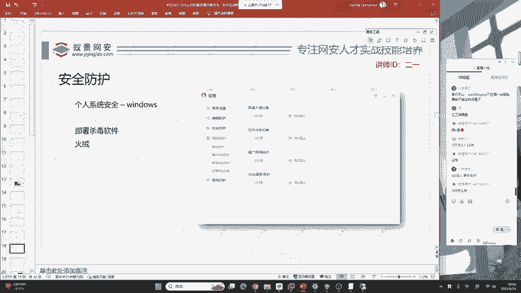

我给大家看一下火容，这个火容啊，有的同学只知道病毒查杀，只知道防护中心。其实我们关键的地方啊在这里就是在火容的安全设置里面，我们可以把它当做一个简易的防火墙，甚至是简易的EDR。

我们在这里啊可以看到病毒防护，这里的防护有文件实施监控，恶意行为监控、U盘保护、下载保护、邮件监控以及web扫描，它也是可以帮助我们扫描web shell的。好，现在我们再来看。

系统防护里面有注册防护敏感动作防护。比如说我们去创建一个后门用户，去创建一个影子用户，去添加一个计划任务，这些操作都会被火容列为敏感操作，从而进行拦截和警告。然后是应用加固。

常见的web服务器、数据库、办公软件、浏览器，它都可以做相应的加固。软件安装拦截，这里大家应该知道，很多的呃我们独瘤软件它会去安装一些恶心的页游。那在这里呢火容也可以提供拦截。其次就是摄像头保护。

这里大家比较担心，就是说自己的笔记本电脑会不会被黑客植入后门，然后打开摄像头给自己拍一个照片，首先告诉你，这个技术是完全可以实现的那火容也提供了相应的摄像头保护，前后面呢就是浏览器保护，联网控制等等。

好，我们来看这里，这里的网络防护啊，它就不仅仅是防护病毒，而是防护实际红对所做出的操作。比如说这里有个叫做横向渗透。横向渗透呢，它这些技术都是红队所用到的。

比如说默认共享访问远程服务创建计划任务、注册表篡改打印机添加和Dcom的调动调度以及远程管理的调用。这些服务，它不是木马，都是windows自带的服务，只是容易被黑客利用，从而做到内网渗透。

那火容呢针对这些东西有专门的防护选项。还有就是爆破爆破攻击。恶意网址拦截。可以拦截一些木马、盗号、钓鱼和欺诈流氓软件等等。这些是火容给予用户的一个选择权，而且他做的非常好。

但是啊火容这些行为并不能够做到100%拦截黑客或者是红堆的攻击。他只是做的尽可能的保护。如果你想追追求更严格的病毒查杀，那我们可以去选择比较主流的杀毒软件。

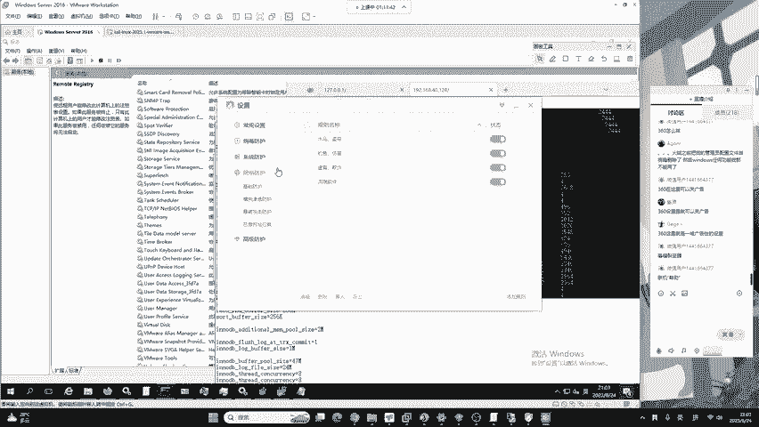

比如说像360360的。对火容更适用于专业人员，360更适用于普通的电脑使用者。360的木马查杀能力是要略高于火容的。360红队想做免纱，它的难度是要高于360的，是要高于火容的。

火容的免纱还是比较简单的。腾讯管家怎么样，我就不做评论了，我没有讲到他，你应该大致清楚。那关于咱们世界上主流的杀毒软件都有哪些呢？在第一节课的时候给大家做过科普。那在上课之前呢。二一老师找到了一个网站。

他讲的非常的好。我们来认识一下国际上面比较主流的杀毒软件。首先有诺顿诺顿啊，它是一个收费的杀毒软件，啊非常的厉害。第二个就是比特凡德，这个杀毒软件也是关于咱们的恶意软件防御非常非常厉害的。

它要比火容要略强。

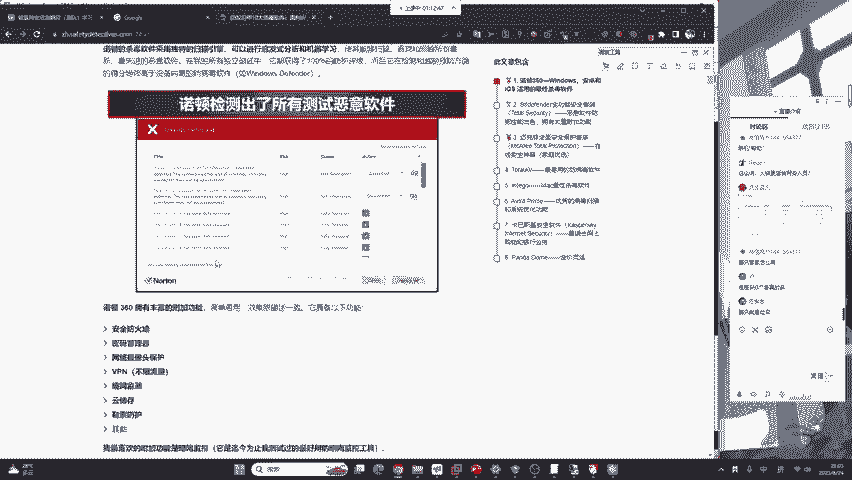

好，这叫刘越强，他的一个防御能力很厉害，包括咱们的网络监测能力。基本上你安装了比特凡兰德，他能够组。抵挡很多黑客的攻击行为，包括勒索软件。但是有一个问题就是。比特凡德依然收费，他不提供免费的这个杀毒。

好，等一下我给你讲啊，这个一键凌云，等一下给你讲。

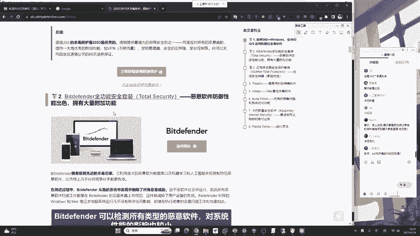

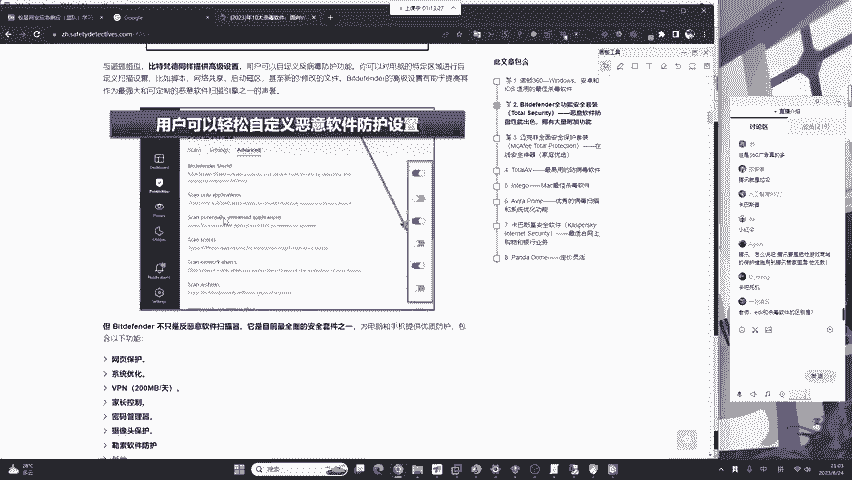

好，我们再来看一下，下面呢是卖咖啡，卖咖啡有免费版给大家讲过啊，免费版卖咖啡。

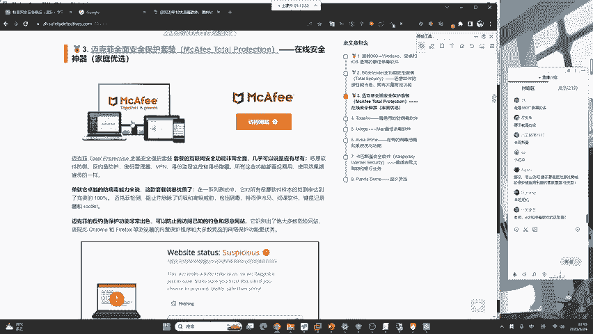

然后下面呢是这个叫做totalIV啊，这样一个也是一个杀毒软件，也非常的流行。

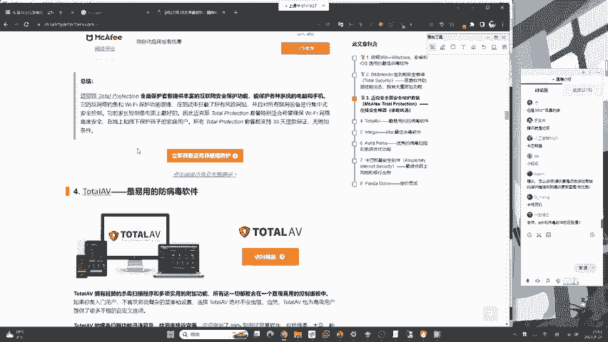

呃，下面是一个mac的，我们就不多不多看了。因为绝大部分同学使用的都是windows电脑。下面一个是小红伞，小红伞啊，也是咱们360的杀毒引擎。360的杀毒软件使用的就是小红伞和360自己的云大脑啊。

共同作用来实现的360杀毒，这是小红伞，同样也有免费版，大家可以选择安装它的一个杀毒效率非常高。

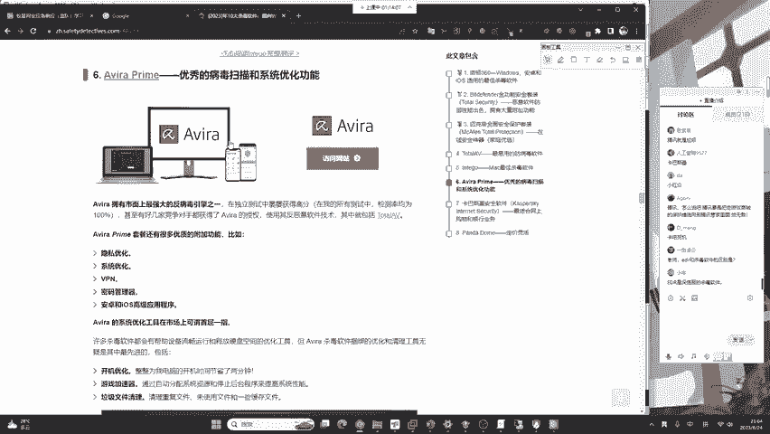

并且呢你的麦克、苹果电脑也有小红伞的免费版。

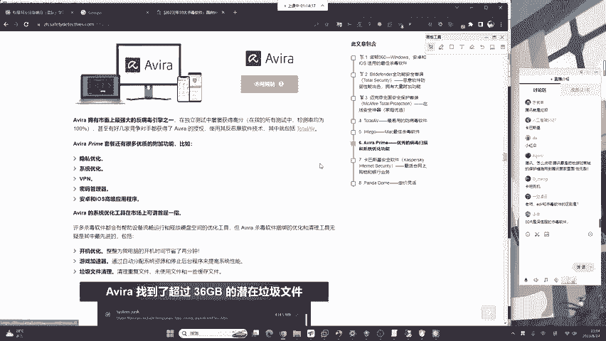

下面一个是大家耳熟能详的俄罗斯的卡巴斯基，卡巴斯基同样也有免费版，但是它的高级功能都在付费的订阅制里面。大家也可以了解一下卡巴斯基，它令无数的红队头疼。

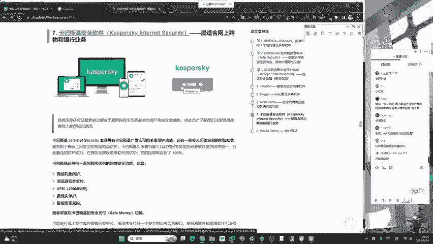

下面一个叫做panda，也是一个现在比较流行的杀毒软件，大家也可以了解一下。其次还有二一老师在第一节课给大家讲的，我们对岸的趋势杀毒，它被称为趋势防病毒软体。也经常被红队头疼。

他的杀毒效率和对于网络攻击的防御也是首屈一指的。但是啊趋势它也是同样跟这些杀毒软件一模一样。它提供这个收费，你必须要付了钱才能够使用相应的杀毒软件。那关于免费的。

大家能够选择的就是360小红伞、火容等等，是比较好用的。好的，现在介绍完毕。😊，在讨论区有两位同学提到了EDR和杀毒软件。这时候呢，二宇老师用一句话来给大家讲解EDR和杀毒软件的区别。

EDR呢是一款安全健身中使用到的软硬件相结合的安全设备。那EDR呢？它和sha特软件的区别，你可以把EDR去理解为sha特软件的plus版本。这个EDR呢它不仅能够去拦截这些病毒。

而且还能记录这些黑客的行为。比如说这个黑客在哪个地方在什么时间，在什么操作系统，使用什么用户，创建了一个什么样的恶意账户，这些记录都是非常清晰，非常明了的。就是说黑客在你系统中做的每一个操作。

每一个恶意行为都得到了非常详细的记录和相应的关系拓扑。那我们通过EDR就能非常方便的做溯源以及做应急的排查。这叫EDR以见凌云同学理解了吧？好的，这个离EDR呢每个厂商也有不同。

但是大致实现的都是一样的功能，就杀毒软件的plus版。

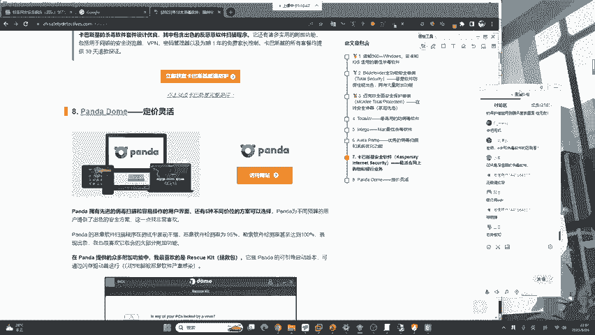

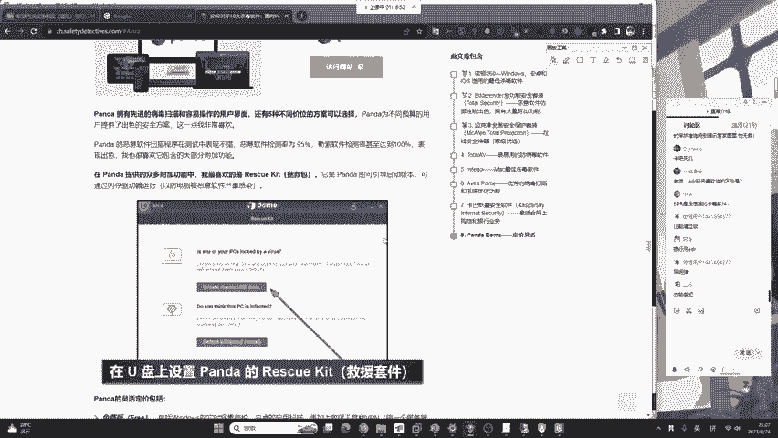

好的，我们继续来看。这里介绍了杀毒软件之后，下面啊给大家介绍一个简单的小技巧，就是很多同学啊在问二一老师，我自己的云服务器或者是我自己搭建的博客博客，在无时不刻的受到黑客的爆破，受到黑客的攻击。

我应该如何去防护呢？下面所讲的针对于云服务器的知识是大家啊都需要啊，对，就是杀毒加网络防御，加上敏感信息记录。整个的一个。大的一个东西啊，这是一个大的一个体系结构吧，可以把EDR理解为。

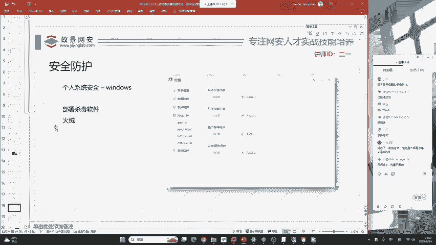