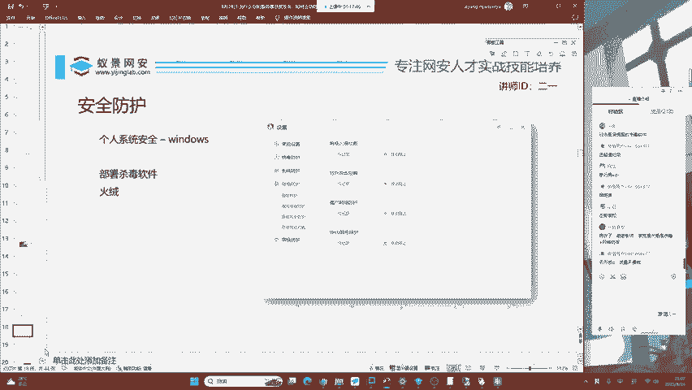
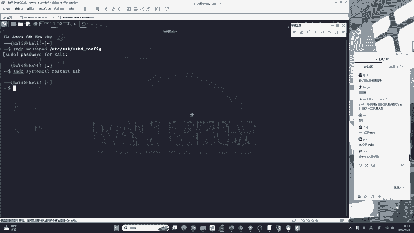
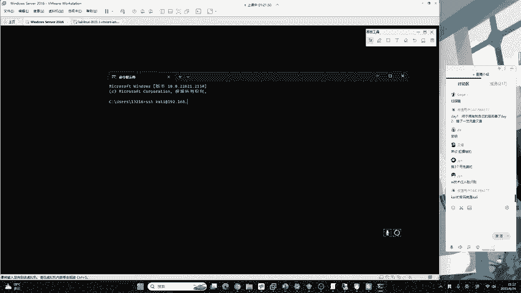
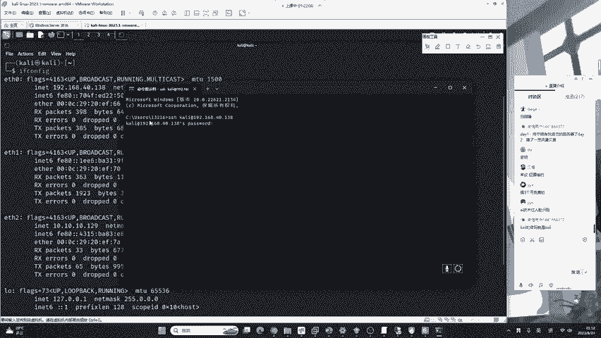
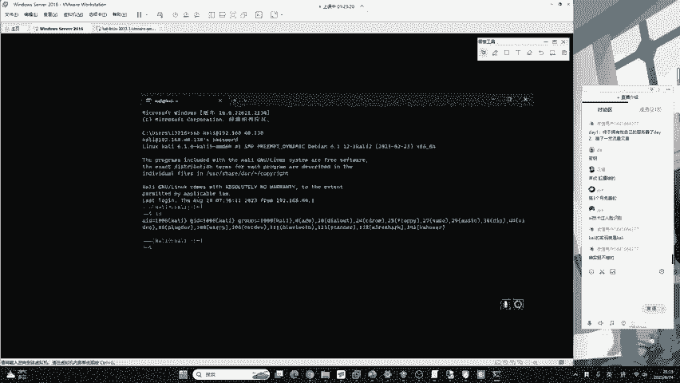
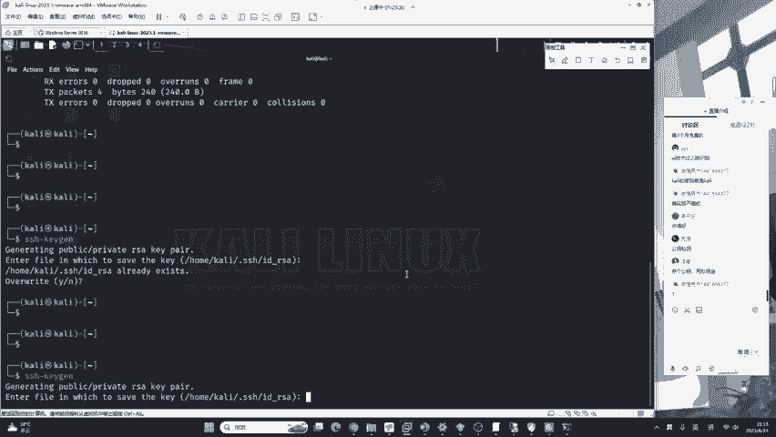
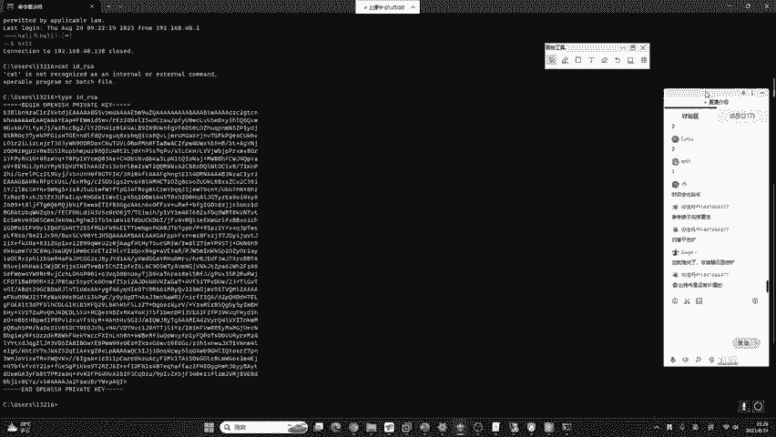
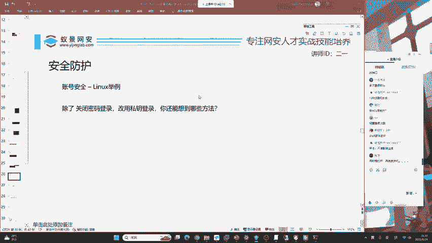

# B站最系统的护网行动红蓝攻防教程，掌握护网必备技能：应急响应／web安全／渗透测试／网络安全／信息安全 - P21：蓝队应急响应-20.账号安全 - 跟小鱼学安全 - BV1SF411174M

好的，就是针对于咱们这样一个linux操作系统，云服务器应该如何防止。黑客进行爆破，因为国外啊有一些非常闲的人。😊，它动不动啊，就对这个全网的设备进行不停的爆破。它是疯狂的收割肉机。

只要你的系统没有做强密码，或者是你不小心留有了一个弱密码的用户。那恭喜你，你的服务器将会被境外的组织当成肉机去帮别人赚钱。所以说呢安全的让我们的服务器进行合理的配置是尤为重要的。下面所讲的知识点。

不论是咱们的新手同学，你可能没有云服务器。但是我希望我讲的这个概念，你可以理解，这也是未来安全的趋势。如果你是在学习渗透测试，那你更是要100%掌握了。好，大家来看好。

首先就是说咱们怎样去看一台linux操作系统有没有被爆破过，这是一条命令叫做lastb。我在上课之前从我自己的云服务器里面截取出来的last B。可以看到我的云服务器是每一天都在被爆破。

每一天或者是每一个小时都在经历爆破。那这个就会对我们造成相应的阻碍。万一我哪一天不小心我去整出了一个弱密码的用户被爆破成功了，应该怎么办呢？下面我们要介绍一个特殊的思路，这也是未来的安全发展趋势。

你可以呃一着眼于未来哈，就是苹果在之前的发布会上面做的一件非常有意思的这个技术，叫做no password，就是说无密码。你不是密码爆破吗？不是密码爆破吗？我只要我这个系统没有密码。

你是不是就没法爆破了？那有同学说没有密码，你这不是扯淡吗？而是啊把这些验证方式从密码更改为其他的验证方式。比如说生物识别，这是我们国内最常用的验证方式，例如说像支付宝。他让你扫脸，让你去说句话。

这些都是咱们的生物识别方式。不过呢它都是no password进程中的初始化阶段。想去推行无密码，需要大家各种开发者的共同支持，才能够做做出来这种这种整体的一个安全进步。那下面我们来一起看一下。

那关于我们linux服务器的远程登录，其实就为我们提供了一个相似的解决方案。但是它并不是无密码的解决方案，而是它使用了一个叫做密钥的东西。密码和密钥是不一样的。

我们一起来看一下我这里啊就不以实际二姨老师的云服务器来做演示了。因为我的云服务器啊已经在之前做了相应的安全配置，我不想把它删掉。我们这里啊就以大家简单易懂的咖利操作系统来做相应的演示。

卡利的默认密码就是弱密码KALI。那如果我们想要去登录到这个咖利操作系统，应该如何去做呢？首先我要知道我卡利的IP地址是40。138，然后呢我就可以打开自己的windows操作系统命令提示符，我打开它。

打开命令提示符之后，我在这里输入这样一条指令。叫做SSH。还有咖里。艾192。168点40。我们卡里的IP地址是138。好，我们写上去138，然后回车它就会让我们输入卡里的密码。卡利的密码啊。

大家都知道就是KILRA。

我们就可以登录到这台操作系统。登录到这台操作系统之后，你就可以去输入一些咱们lininux的指令，去对这台linux操作系统做相应的控制。我们的云服务器就是这样的原理。云服务器是什么意思呢？

就是现在有很多的厂商啊，它在卖云电脑是差不多的意思。比如说阿里云、腾讯云、华为云。他去售卖linux机器，然后这个机器啊它只会给你一个远程登录的权限。我们可以通过这样1个SSH去登录到使用密码哈。

登录到目标的操作系统。那现在我们来想一下，如果我们这样一个卡利被安装到了互联网中，或者是我们自己做了内网穿透，你觉得它危不危险？他肯定是非常危险的，因为他的密码就是卡里。

那有同学说我root的密码是强密码呀，它不是卡利啊，我root的密码16位，而且有数字有字母，有大小写，有符号，它不是弱密码。但是你看一下啊，你看一下在真实的服务器，它爆破。你看这些黑客。

它不仅仅是爆破你的root用户，它还会爆破其他用户，比如说什么willcomsdent啊，这个什么呃控什么FG这些你都不不知道是啥东西，这个黑客啊都会去爆破。所以说你如果想保证安全。

就要保证所有账户的安全。今天啊就为大家介绍咱们的一个。

密钥登录就是免密码登录。免密码登录。首先我们要生成一个叫做密钥对的东西。什么叫做密钥对呢？我给大家解释一下，就是我们自己去超市里面买的锁。锁啊一般都有两个部分组成，一个部分啊被称为锁。

一个部分被称为钥匙。我们这里所讲的公司要对锁就是指公钥，钥匙就是指私钥。也就是说哈我们需要把锁去镶在门上面，而钥匙啊，咱们自己装在裤兜里面。这样的时候，我们回家就可以用钥匙去打开固定的锁。

只要你这个钥匙不丢，咱们是绝对安全的。我们下面就来看一下，怎样对自己的linux服务器去实现这样一个功能。这个功能不论是卡里还是咱们的云服务器啊，都是完全一样的，没有任何区别。大家看好。

首先我要到linux上面去生成一个锁，就是我们需要买一个锁和钥匙配套的，我要去购买这购买啊，我们是不要不需要花钱的。因为在linux上面自带一个命令，它叫做SSHKG。SSHK减。为了降低难度。

今天啊我们就不对所在做二次限制了，我们直接回车。回车到底就行了。回车到底啊，我这里重新来一遍啊。

就是。哇一下哈，回车到底。好，这时候呢我们就生成了一个钥匙和锁。那这个锁是谁呢？锁啊被称为公钥，钥匙被称为私钥。怎么去判断呢？这里他又告诉你了，叫做public keypublic中文意思被称为公有的。

也就是IDRSSA点PUB这是我们的锁锁钥在哪里啊？锁要镶在大门上面，你一会儿啊千万不要把锁给拿下来了啊，千万不要把它给拿下来了。第二个是我们的钥匙，钥匙被称为私钥。

也就是IDRSSA不带点PUB的那就是私钥带PUB的就是公钥公钥就是锁私钥就是钥匙。好，我已经讲过三遍了。大家应该已经听得非常清楚了。那我们现在买了锁和钥匙之后，第一件事情是干什么？大家想一下。

就是把锁啊定在我们的门上面，我们要把这个门上面去镶着这个锁。那怎样把这个锁去镶到我们卡利的大门上面呢？这里要告诉大家一个命令。叫做啊，首先我们要看一下我们的锁。就是拿到我们的锁叫cat。

就是拿到我们的锁。拿到我们的锁之后啊，现在把我们的锁镶到大门上。那卡里的大门在哪？这是一个固定的文件。它在这个位置，我们只讲卡利用户哈，我们不讲root，我们不讲root，一般情况下，我告诉你。

在生产环境中，你想去登录root用户还是非常困难的。一般的服务器不会允许你直接登录root。这也可以应用在咱们正常的网件搭建。还有说你正常的使用lininux中，你不要去登录root。

生产环境中就不允许你自己就要养成习惯。为什么啊？因为root的权限太高了，它可能会对服务器造成一些不可逆的破坏。所以说一般情况下咱们不要直接登录root。好，这个这个文件名啊是固定死的，就是卡里的大门。

它被称为orized case。这个文件啊，所有的linux操作系统都叫这个文件，没有任何的区别。好，我们只需要执行这条命令，按下回车。现在咱们的锁就已经镶到了卡里的大门上。现在镶到了卡里的大门之上。

我们要干什么呀？我们是不是要拿出自己的钥匙去试一下这个锁能不能打开是吧？要试一下，钥匙打不开怎么办？打不开就说明你哪里做错了。你这个锁啊镶歪了。😊，啊，所以说我们要去用钥匙打开它一下，钥匙是啥玩意儿呢？

钥匙被称为私钥，就是在这个位置RDRSA。那首先呢我们要找到它在哪儿，它在home卡里点SSHRDRSA这个位置，我们现在可以去找到它点击open flo，就打开文件夹。打开文件夹之后啊，找到卡利。

按照这个地方找啊，卡里点SSH有的有的同学说啊，老师我看不到点SSH你要注意啊，这个点被称为隐藏文件夹。我们需要在这里的view。点击sho hidden fires，就是显示隐藏文件夹，把它勾选上。

你就能够看到了。点击SSH之后，我们在里面是不是能够看到三个文件啊，这三个文件你应该是要第一个第二个还是第三个，大家可以去选择你现在需要哪一个？12还是3。我看你能不能听懂同学们。

你千万不要跟着我一起操作啊。如果你是一个网络安全的入门者，你跟不上的。好的，很多同学非常好。你们通过这节课，你听懂了公钥和私钥，我告诉你，你就非常成功了。

这个公钥和私钥它不是只运用在咱们的linux登录中，你在之后的计算机生涯中，还有很多很多的地方能够见到咱们的公司钥，你就记住公钥就是锁钥匙啊，咱们得自己装兜里。好，现在锁咱们已经镶镶镶镶在门上面了。呃。

镶在门上面了。那咱们这个钥匙要放在哪儿呢？好，这里要告诉大家哈，这个钥匙我给他复制一份啊，复制一份。😊，这个钥钥匙放在哪儿呢？大家要注意哈，在自己的电脑上面，你为了保证这个钥匙它的权限正确。

我们都放在CMD默认打开的目录，它是绝对不会错的哈，就是C盘的用户13216，你这个用户肯定不是123216。因为这是2一老师的用户，你的这个用户名是不是会变的啊。然后我们去找到这个文件夹C盘。

找到用户。12316。13216，然后把它给粘贴到这个位置。好，替换一下。现在这个锁我们就已经装到兜里了。啊，这个钥匙就已经装到兜里了，刚刚讲错了，口误，咱们的私钥就已经装到了兜里。

现在锁也就是公钥镶到了卡里的大门上面。现在我们来测试我们兜里的钥匙。能不能打开这样一个锁？好，他说复制的原文件没删好，这个文件啊大家可以删，也可以不删啊。你想删就删，可以把它删掉，删掉是没问题的。好。

现在我们来测试一下，那应该如何去测试呢？刚刚。我们使用的是是不是这种输入密码的形式去打开大门。现在我换一种形式。就是直接用钥匙打开大门，怎么用钥匙呢？加上杠I，再加上我们钥匙的名字IDRSA。暗徽车。

你看。是不是我们成功的把大门打开了，我没有输入任何的密码，却依然登录到了卡利的用户中。这时候就代表我们的钥匙和锁是已经设置完毕。我们可以使用IDRSA这样一个钥匙打开卡里连接到卡利。

在这个过程中能够避免我们密码被爆破。现在问大家一个问题。啊，微信用户说的对啊，如果密钥不在终端目录，要用绝对目录。对，要用绝对目录。但是我这里哈给大家讲，就是为了方便大家。

你尽量就放到咱们的用户这个目录中。因为啊它这个私钥占的空间也就1KB不到啊，1KB不到非常小，你几乎可以忽略不计。对于你的C盘不会有任何的影响。那现在我想问大家一个问题，大家觉得哈我这里由于是本地。

我就直接给大家看我的钥匙了啊，我我给大家看我的钥匙。😊，我直接type一下。太普的钥匙。你看我的钥匙是这个样子的。哎，各位同学，你们觉得我的这个钥匙。会不会被黑客破解？大家觉得可能会被黑客破解。

可以扣1。不可能被黑客破解，可以扣2。很多同学有人扣一，有人扣2。首先给大家讲。这一个东西。可能会被破解，但是几乎为0。就是像这个笑脸同学说的一样，他的时间会比较长。为什么比较长呢？

因为啊我们的这样1个REDRSA它默认使用的加密算法被称为RSA加密算法的SHA256。这个算法还有一个同类的应用，大家知道是什么吗？就是跟这个RSA还有一个同类的应用。就是我们俗称的比特币。

也就是说哈，如果黑客去强行爆破你这个私钥，它的难度跟爆破出一枚比特币的难度是差不多的那你想一下，黑客会去挖矿，还是去会爆破你的智里呢？我如果是这个黑客啊，我直接就去挖矿了。

因为一个比特币的价格可能比攻破你的电脑更有价值。大家想一想是不是这个样子呀啊，所以说我们只需要你不要把你的钥匙丢了，就是说有同学把这个钥匙说，像二姨老师这样。就像二姨老师这样，我直接放到屏幕里面。

你们每一个人都能看得到。你你们每个人都能看得到，那这就属于把自己的钥匙去泄露。就比如说我把我把我的钥匙去放在get up上面，或者是放在一些网站上面被泄露了。那很抱歉，你这一个就形同虚设。好。

我们公司要对，大家应该听懂了吧。

现在我们的卡利大门安装上了锁，安装上了公钥，我们自己用私钥登录了卡利，但是千万不要忘记最关键的一步。就是你在确定锁和钥匙已经能够相互打开的之后，切记一定要关闭密码登录。有很多的开发者或运维。

他确实是使用公司药，但是他在最后忘记关闭了密码登录。也就是说啊我们虽然能够用钥匙，你看这样是没问题的吧，没问题。但是我们用之前的密码也是可以登录的，你看一下。啊，也是可以登录的。

你这不就是俗说什么脱裤子放屁啥用都没有，是吧？😊，所以讲啊我们要把这个密码登录给它禁用掉。那密码登录怎么禁用呢？其实在卡里的配置中啊，有这样一个远程登录服务的配置。它是在这一个文件夹下这个文件夹啊。

我们必须要用速度，也就是要用管理员权限才能打开。我们来给大家看一下，这里呢我们使用muse pad。muse pad呢它是卡里的记事本。比VIM要好用很多。大家再去使用卡里的时候。

我十分推荐大家直接使用mles pad。好，在这里我们去编辑这一个文件，被称为SSHD configurefiSSH远程登录的配置。我们输入卡利的密码KALI。打开记事本之后。

我们要在这里找到一个关键词，叫做a passwordword密码认证。我们来找一下，非常容易就找到了。在这个位置。叫做密码认证，它默认是yes的，我们要把它改成no，就是说我不想让他用密码认证。

现在保存。保存之后我们回到啊，我们直接把这个记事本叉掉哈，保存之后直接叉掉记事本。然后去重启一下我们的远程登录服务。使用这条命令重启。重启之后再给大家看，现在我用钥匙去打开。没问题。

现在我在用密码去打开。发现已经不行了。这时候我们就对卡里这个用户做了绝对完全的保障。这样1个RSA的私钥是没有人能够破解出来的。它的破解次数几乎趋于数学中的无穷大，是基本绝对安全的。好，通过这种方式呢。

我们就限制了密码登录，在linux远程连接中使用了公司药对。但是一定要请大家注意，在去关闭密码登录之前，你一定要确定我的私钥是可以使用的。你看我的PPT上面有相应的步骤，要去确确定私钥能够使用。

你再去关闭密码登录，否则你如果关了它，结果你的私钥又配错了。你想一下会有什么后果。你现在私钥配错了，结果你又不小心把密码登录关掉了，那你就登不上去了。你就登不上去了是吧？不是给自己找麻烦吗？

所以说啊咱们的安全防护是要按照一定的顺序和规范来进行防护的。好的，那大家我给大家留一个思路，就是说在这个位置，我们除了关闭密码登录，改用公司要对登录，你还能想到哪些方法能够避免我们的linux被爆破。

大家可以发散思维发在讨论区。来想一想，就是说你除了这个之外，你还能想到哪些方法？😊，用超长密码非常正确。首先，微信用户第一个就是说只要我的密码足够复杂。我用40V的密码。

当然可以可以防御DI同学讲的也非常正确，就是改端口。这个黑客啊他会爆破22端口，我们只需要把这样一个端口去改掉就行了，它可能还是会爆破，但是爆破的就没有这么猛烈了。因为它爆破的话。

它一般都是只针对于22端口爆破。继续来看，一键凌云同学说的多次登录封IP也非常的正确，跟喵才，还有单眼皮的小张，你们的思路都是一模一样的。限制REP只要你登录次数过多。

我就直接将你的REP去封锁BI同学的意思也是类似设置登录次数。这种实现方式有非常多，我们可以使用shall脚本，可以使用ACCL可以使用linux自带的防火墙，也可以介入第三方的安全设备以及杀毒软件。

实现的方式非常多，种类非常繁杂，但是啊还是老规矩，大家即使是到实际的互网中，因为你参加甲方的公司单位不同。使用的设备，厂商品牌不同，可能会有所区别。但是大致的体系和框架是永远不会改变的。

你会用这一个厂商的蜜罐，切换成另外一个厂商的，也可以。直接上手也可以很快的去掌握。所以说你掌握一个蓝队的安全体系，就由。

