# B站最系统的护网行动红蓝攻防教程，掌握护网必备技能：应急响应／web安全／渗透测试／网络安全／信息安全 - P23：应急响应入侵排查 - 跟小鱼学安全 - BV1SF411174M

啊，那么入侵排查入侵排查这边就比较多啊。路侵排查这里呢就比较多了。像什么。啊，那么首先我们的一个排查思路啊，大家也可以看一下。

分为什么系统进系统排查、进程排查、服务排查、文件痕迹排查、日志分析、内存分析、流量分析、威胁情报等等等等啊，比较多啊。那么我们入侵排查。入侵排查的思路。首先首先啊我们要进行一个文件分析。

文件分析啊分析这样的一个文件。那么需要分析哪一些东西啊，像什么文件的日期。那然后呢，新增的文件。还有什么可疑的。文件或者呢异常文件，然后什么最近。使用的。文件。然后什么浏览器下载的文件。

然后还有就是我们的web share。对吧web share排查以及以及分析，这是文件分析啊。然后第二个呢叫做进程分析。进程分析。当前活动进程。啊，就是你当前有哪一些进程是在进行一个运行的。

要看一下有没有异常的进程，然后以及什么远程连接，对吧？启动进程，还有就是计划任务。计划任务这个东西也是非常非常危险的，所以呢你也是要学会进行一个排查计划任务，然后还有像什么服务。服务系统信息。

这里面就包括什么环境变量。什么账号信息。啊，以及说history呀、系统配置文件呀等等。那么还有就是日志分析。日志分析呢就是操作系统日志了。啊，进行一个分析。那么这里呢我是给大家整理了相应的一个资料。

这里面包括windows入侵排查，wepehell查杀，windows日志分析啊，linux入侵排查windows日志分析的一些工具啊，这一些东西都是给大家写了啊。

那么需要的话可以课后找我们班主任小姐姐去进行一个获取啊，这些资料啊，包括说我们今天的一个课程笔记。啊，那么这是这个啊，那么首先系统排查啊，windows系统排查基本信息可以使用windows微软。

它自带的一个系统信息工具叫做MS in32点EX1。直接就是在系统信息工具输入这个什么MSin32。啊，那么我们这边呃我开一台虚拟机给大家看一下啊。开一台虚拟机给大家看一下。比如说拿我这台winN7。

你直接win加R输入1个MS in32或者win加R输入CMD，然后呢在CMD里面输入MS info32。等他开个机啊。

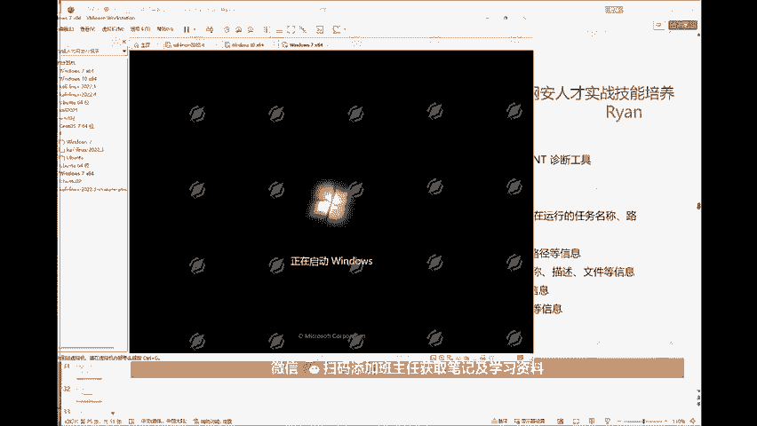

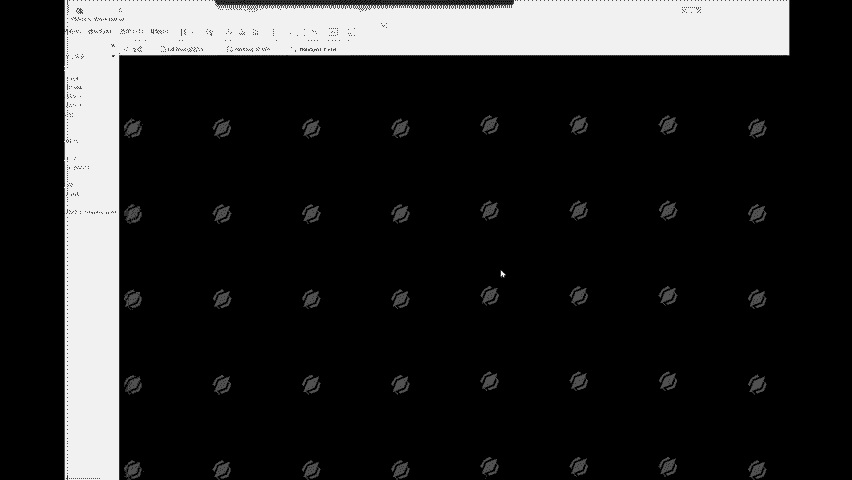

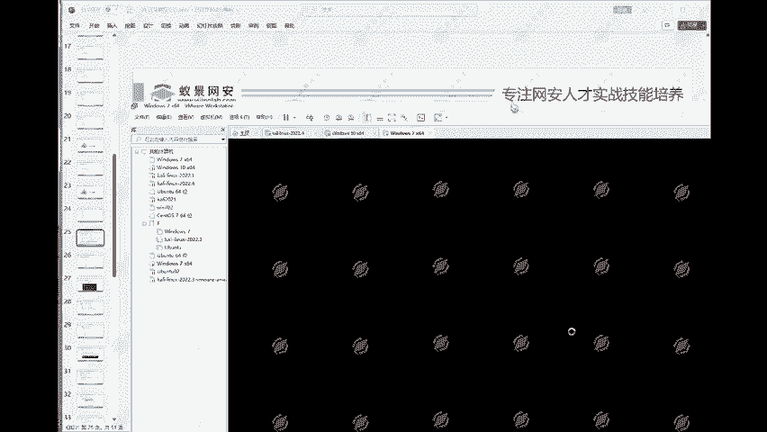

调一下它的位置啊。O。老师线下课程开始了没啊？我们现在没有没有线下课啊。

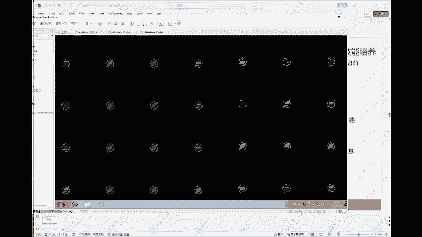

好，那么比如说啊这种我们win加R输入MS应付。32。回车啊，它就能够打开这样的一个系统信息啊。那么在这个系统信息里面，我们就可以看到啊，像什么硬件资源，对吧？

它有什么强制硬件呀、IO啊、输入输出啊、内存呀的一些信息。啊，那么比如说你要查找一个什么正在运行的任务，那么像这个系统摘要系统摘要里面呢有一个软件环境，对吧？这个软件环境。啊。

具体的情况啊可以添加一下我们班主任小姐姐啊，找班主任小姐姐具体进行一个沟通。那么这边软件环境里面有一个正在运行的任务，双击，它这边就会打开了，这边呢就能够看得到了啊，正在运行哪一些程序。

然后这里面你可以看一下有没有什么异常的啊，那么当然我们这里是没有一些什么异常程序啊，我们这里是没有异常的。好，这是这个啊，那么包括说还有什么系统驱动啊。对吧系统驱动啊这些啊，这里什么启动程序啊。

加载的模块呀、服务啊，这些都有都能够看得到啊。那么还有一个东西叫做system info。

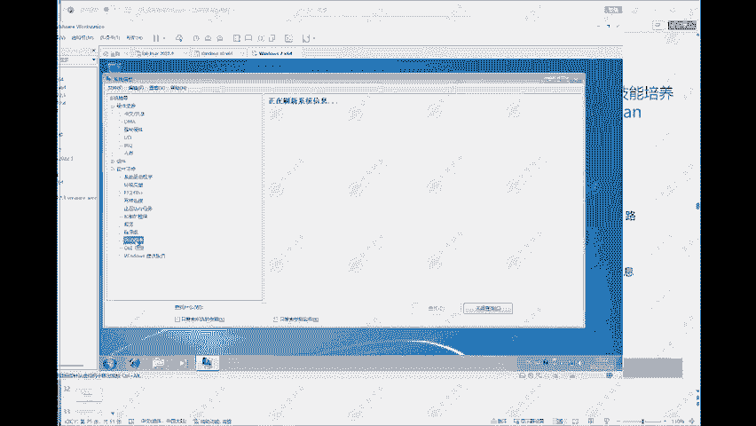

也可以啊。比如说我们输入CMD。セステムインフォー。对吧system info它就会打印出相应的一些信息啊。那么这个就需要稍等一下了。好，这边呢它就能够打印出来啊，主机名称reon PC对吧？主机OS。

操作系统的一个名称是windows7专业版版本号是什么是吧？制造商等等等等。什么初始安装日期。系统型号安装了两个处理器啊，处理器，然后以及说它的一个什么中文啊，物理内存呀、虚拟内存呀，包括它的一个补丁。

啊，补丁程序。这边啊补丁程序它安装了4个补丁，有个什么KB2534111，什么KB2999226KB4474419这一些。那么通过这些东西啊。通过这些补丁。

我们就可以看一下相应的补丁有没有什么相应的漏洞啊，是不是有什么漏洞，它的一个补丁它没有打。比如说MS17-010啊，那么这里呢应该就是没有打这个MS17-010的补丁，那么就可以通过MS17-010。

也就是我们所说的永恒自然漏洞来打这样的一台windows7电脑。啊，这是这个啊这是这个。好，那么相应的什么启动程序啊，这里也有。那么linux系统下linux系统呢就直接LSCPU查看CPU的型号。

我们这边也可以看一下啊。比如何拿我这台卡里。

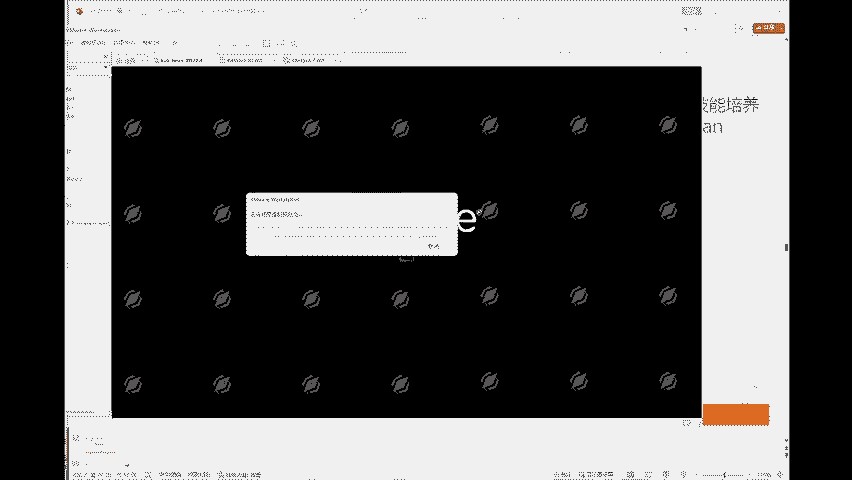

啊，LSCPU。这就是CPU的型号。啊，I511代，这个当然这是也是我物理机的。然后什么加载的模块L model。啊，这是这里面它加载的一些模块啊，这个东西都是能够看得到的。

包括说当前操作系统的一个信息啊，U内。港A。对吧linux咖ly它的一个版本6。0的啊，然后呢这个deb6。0。06。0。7的一个版本啊，这是这些基础的一些信息啊。那么第二个叫做用户信息。啊。

用户信息就是排查恶意账户。命令好输入net user这种方式看不到多了福的隐藏账户啊，这里呢我们可以给大家看一下啊，比如说这个winN7。我们首先在这里呢net user。看一下。

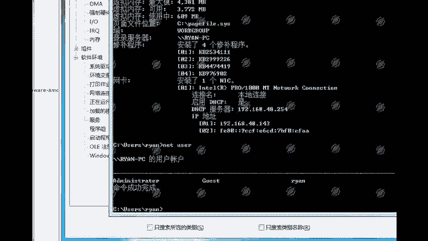

net user它只有一个administrator，一个gues，一个real啊，只有这三个用户啊。那么比如说我们我们这里呢要使用管理员权限啊，CMD。

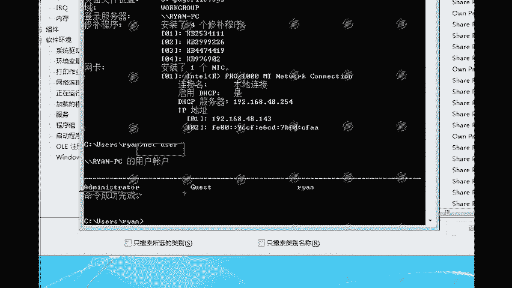

右键。以管理员身份运行。是。

好。Let user。然后输入一个hicker。多乐福。然后。addmin艾123。斜杠ADD。啊，那么这条命令是什么意思啊？这条命令是什么意思？给大家解释一下。

net user然后hicker就是用户名，后面呢加上了一个多乐福，就表明是一个隐藏账户，隐藏账户。然后这个admin艾123就是这个用户它的一个密码，然后斜杠ADDAD代表的是添加。

所以斜杠ADD就表示添加一个隐藏用户好，回车命令完成。然后net user。

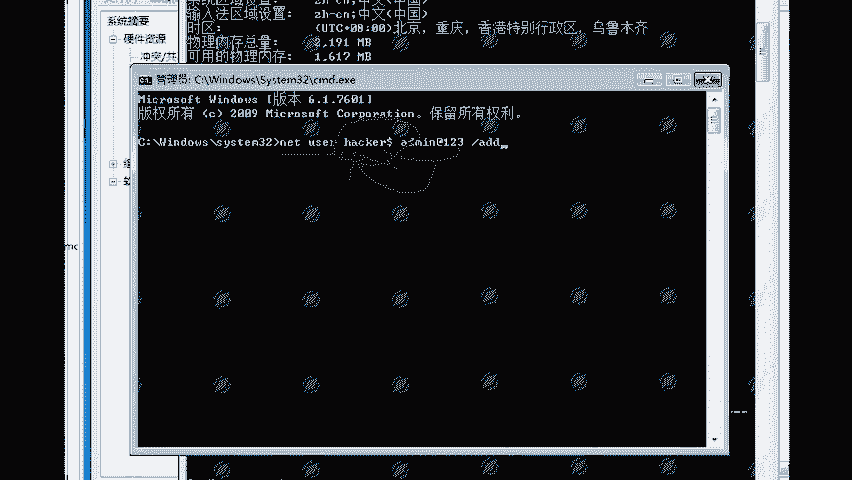

大家可以看一下啊，我再net user看一下。let user发现它还是只有administrator。Gestt， real。对吧它并没有我们这样的一个hicker啊，这个可能看的不是很明显啊。

那么我再来创建一个普通用户啊，let user。

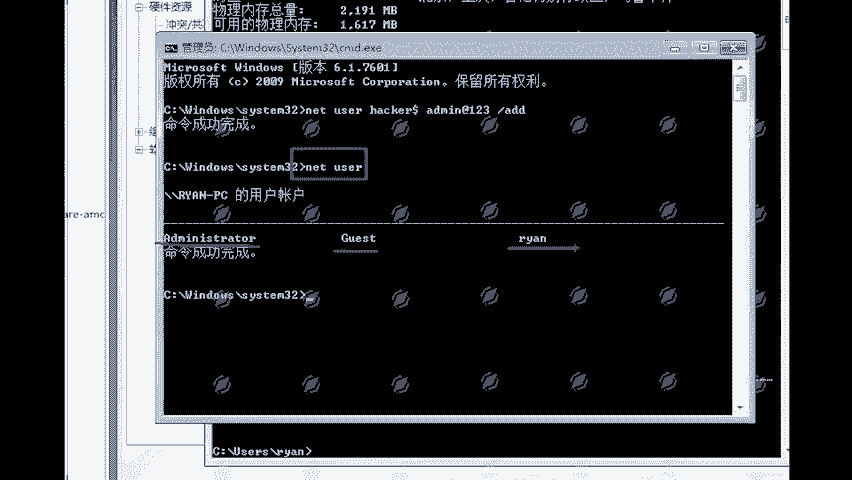

ream123，这是用户名密码ream at123斜杠ADD回车，然后我再来let user。好，大家可以看一下啊，letus它就多了一个。re123了。对吧他有一个administrator。

一个gas，一个rean，然后一个rean123，这就是我们这里创建的。

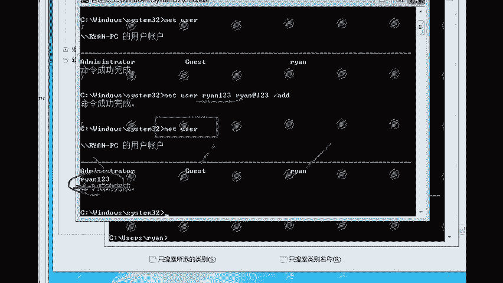

啊，那么就是这个，那么我们怎么来看怎么来看这个隐藏账户啊。这个隐藏账户呢，首先net user他肯定是看不到的。然后啊在计算机管理本地用户和主。那么这个现在win11是没有了。

win11是没有这个东西了。呃，我们这边右键啊，然后呢个性化把这个此电脑给它搞出来啊。计算机确定。右键管理。管理这里呢有一个本地用户和主，有一个用户点一下，看到没有？看到没有看到没有各位。各位。

hicker隐藏账户在这里就能够看得到了，在这里就能够看得到了。

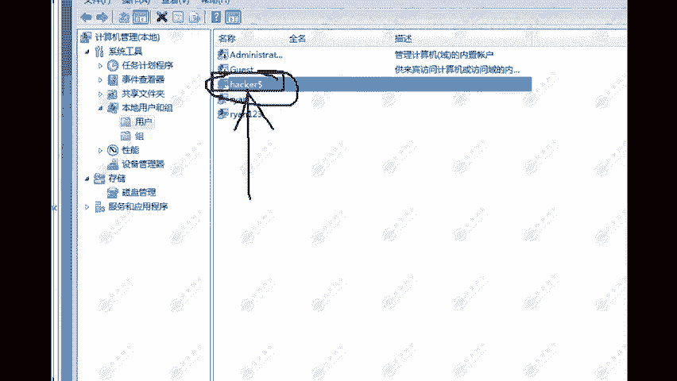

而我们使用net user，它是看不到的啊，这是这个。那么包括还有一种方式啊，还有一种方式呢就是在注册表里面进行一个查看。打开注册表啊打开注册表，我们来打开一下啊，这个东西呢可以跟大家讲一下。

因为这个也是比较重要的啊，就是这个隐藏账户怎么来进行一个排查。打开注册表。

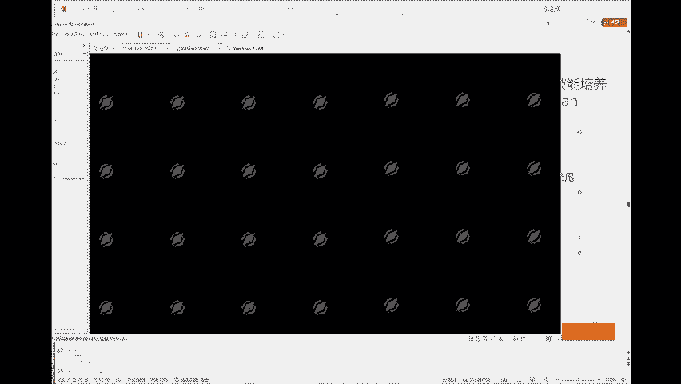

注册表下面它有这4个5个。啊，有这5个啊，那么我们首先找到的是。张老师。找到这个啊，第三个找到这个。然后下面呢有一个ss文件啊，s，然后呢，下面还有一个啊，那么这里大家可以发现啊，它打不开。

打不开啊打不开，为什么打不开？因为我们没有权限。没有权限啊。没有权限，所以呢我们要给他看一下，把这个关掉，用我们的这个这是我们管理员权限的CMD啊。管理员权限的CMD。好，这里呢它打不开啊。

这就是我们权限不够，所以呢他看不到。我们这个就。那么这里呢它是看不到。那么还有一种方式啊，还有一种方式呢就是可以使用我们的一个工具。啊，我这里呢可以给大家看一下啊，就是使用一个工具，我找一下啊。

找一下我的这个工具。okK就是这个工具啊。那么这个工具呢，它可以在我本地，只能看我本地的啊，我本地的。那么首先它需要执行三条命令。

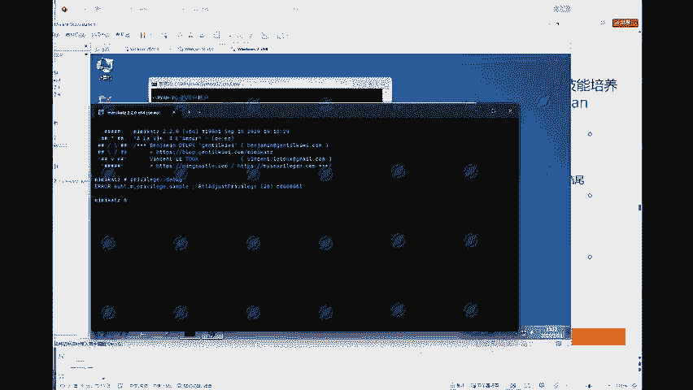

啊，这个它需要也需要管理员权限啊。右键。以管理员身份运行。O这样啊。然后执行三条命令。首先测试一下ok。然后再来测试一下。ok啊，这里面呢就有我的一个用户了啊，然后最后dump一下它的s文件。O。

这里面就有了。对吧一个administrator，一个gues，一个这个一个我自己的用户。啊，这是我物理机啊物理机。就是通过这个工具能够查看得到的。好，还有一个就是通过这个东西啊，这个东西呢也是一样的。

我们可以。执行直接在你的CMD里面执行，这个就可以看得到啊。好，那么这就是注册表查看这个隐藏账户啊，它下面呢会有一个。就是在这样的一个路径下啊上文件。s下面呢会有一个user。有一个name。

这下面就有了hicker。

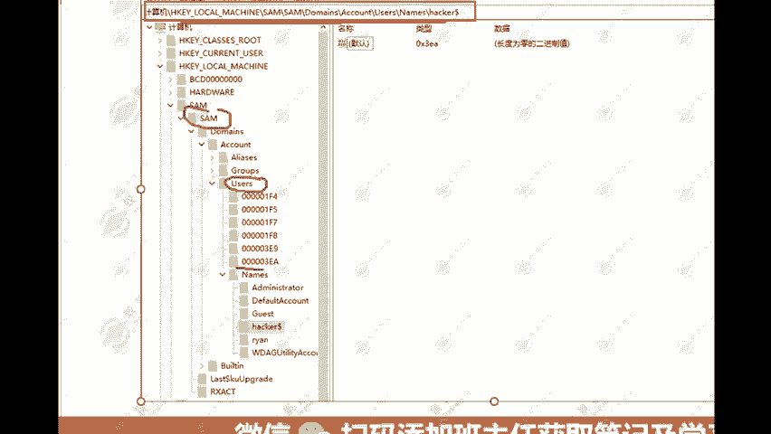

那么linux系统用户排查就是通过cat ETC passwordword ETC passwordword啊，这里面呢它就会有了。然后像这个每一行代表的是什么意思？我们这里可以简单给大家看一下。看出。

ETC。对吧那么这里呢每一行代表的是什么东西啊，这个root这个X这个零这个零这个root对吧？这一下每一行代表的是什么意思？这里面呢也给大家写出来了啊。分别代表的就是我们的用户名密码加密啊。

那个X代表的就是密码加密。然后呢，用户ID用户主ID注释用户主目录默认的登录shall，最后显示为Bb或者是我们的一个BZSH啊，这边可以看一下。或者是我们这个ZSH。这两个啊一个是beanb。

一个是这个JSH。就表示可用户可登录啊。如果呢是为这个no login，那么就是。用户状态不可登录。那么重点需要排查的就是这个东西啊，这个命令呢我可以给大家看一下。这个东西啊。比如说我们执行一下。哎。

大家可以看一下啊，他就给我返回了一个root。啊，那么这个指令的意思是什么？首先这里AWK就是一个查询的命令啊，杠F冒号代表的呢就是以冒号分隔。那么这边分隔的是什么东西？

分隔的就是我们这个ETCpasword。比如我把这个东西复制出来。就是以冒号分隔。把这些东西给它分隔出来。啊，然后if如果第三个等于0，那么就打印出第一个第一个位置的。数据啊第一个是root。

第二个是X，第三个就是0。对吧第三个就是零啊，如果第三个位置等于0，那么就打印第一个在这个ETC passwordword里面。所以就是判断第三个啊，第三个是不是为0。那么第三个是什么呢？

第三个就是用户ID为0的话，那么它就是。可登录用户啊，也就是呢超级权限的用户啊。所以呢通过这样的手段进行一个排查。啊，那么这个可登录信息通过查看这个就能够看得到啊，什么登录错误的信息。

最后登录的时间啊等等等等。这些啊，查看当前用户登录系统的情况啊，就是who我们可以看一下。who对吧？root。登录的一个时间。那么启动项啊启动项排查这边呢也比较多啊。

启动项windows系统中自启动文件，按照两个文件5个核心注册表的一个子键自动加载应用程序啊，通过系统配置对话框输入MS configurefi能够查看得到。通过注册表查看注册表。

操作系统中的一个重要的数据库啊，主要用于存储操作系统的一些必要的信息。那么这里呢就给大家列出来了每一个。在我们的一个注册表中，每一个存放的是什么信息啊，这5个呢对应的就是我们这里的。

对应的就是我们这个唉我们这个注册表关掉了。打开啊，对应的就是这里的5个。12345对应这5个，每一个存放的是什么东西？啊，第1个HKCR存放的是windows资源管理器中执行时打开正确的程序啊。

这个就像我们的一个，比如说你安装了java环境，然后呢，你需要双击打开这个点JR文件，有时候它打不开，那么你要修改注册表，就是要修改这里。啊，然后这个什么SHKCU就是包含当前登录系统的用户啊。

就是当前登录系统的用户的配置啊。然后这个HKLM就是计算机硬件的特定信息。啊，然后这个什么HKU它就是所有用户的配置文件。HCEO就是存储有关系统当前的配置信息啊，就是每一个它比较重要的一些啊。

当然主要我们还是一般就看这前面这三个。可能看的多一些啊。那么linux排查呢就是这些，这里面啊这里面呢它是s透OS的，因为我们的一个卡里卡里呢它默认是没有这个文件的啊，卡里是没有这样的一个文件的。

需要你自己去进行一个创建。啊，那么计划任务就是系统工具，计划任务这里面能够看得到。这是windows的一个计划任务啊。那么linux呢就是通过这条指令能够查看到它的一个计划任务啊。

当然这个也只能查看到普通的啊隐藏的计划任务，它也是看不到的。啊，那么这是这个啊这是这些。那么其他的像一些。其他的内容呢我们这边就没有时间讲了。

因为还有像什么入侵排查we share查杀日志分析等等这样的一些东西啊。这个呢我也是提前给大家整理好了。那么大家需要的话呢，就课后找我们班主任小姐姐去领取一下啊，包括我们今天的一个课程笔记。

